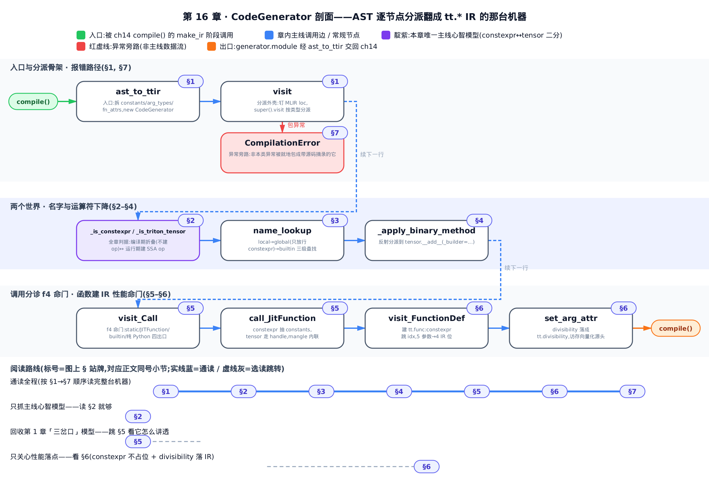

# 第 16 章 CodeGenerator 翻译框架——把 Python AST 逐节点翻成 tt.* IR 的那台机器

[你在这里：全书 9 个 Part 的降级阶梯，高亮处为本章所在的「编译前端」部分](../diagrams/roadmap.png)

- 上一章立了什么：SSA 与结构化控制流的理论——块参数取代 φ、`local_defs ∩ liveins` 认 loop-carried。
- 本章解决什么：那台把 `@triton.jit` 的 Python AST 逐节点翻成 `tt.*` IR 的机器怎么运转。
- 下一章接什么：`tt` 方言的 op 词汇表——本章刻出来的 IR，逐个 op 是什么。

**这一章能帮你做什么性能决策。** 你在 kernel 签名里标的那个 `: tl.constexpr`、传参前那句 `tl.multiple_of(ptr, 16)`（[第 9 章](../../ch09-self-hosted-libraries/narrative/chapter.md) tl.* 自举库已建立）——它们到底怎么进 IR？答案在这台机器的源码 `python/triton/compiler/code_generator.py` 里：`constexpr` 参数**根本不占 IR 参数位**（被折叠进代码，每个取值编出不同产物），而 divisibility 提示经 `set_arg_attr` 落成 `tt.func` 参数上的 `tt.divisibility` 属性——**这条属性是下游访存向量化的源头**。提示没落进 IR，后端就分析不出对齐、优化不动。看懂这台机器，你才知道自己写的每个标注在编译产物里兑现成了什么。

**选读指引。** 只想抓主线心智模型，读 [§2 两个世界](#2-两个世界constexpr--tensor) 就够——`constexpr ↔ tensor` 的二分统一解释后面所有分派。想回收 [第 1 章](../../ch01-what-is-triton/narrative/chapter.md) 立的那个「三岔口」模型、看它怎么讲透，直接跳 [§5 调用怎么分诊](#5-调用怎么分诊visit_call-三分派)。只关心性能落点（`constexpr` 不占位 + divisibility 进 IR），看 [§6 函数怎么建](#6-函数怎么建ttfunc--constexpr-不占位--divisibility-落-ir)。想跟全程，按序读。



图底部另画了几条阅读路线（通读 / 只抓主线 / 回收第 1 章模型 / 只关心性能落点），和上面文字版选读指引说的是同一件事，对着走就行。

---

## §1 一台把 AST 翻成 IR 的机器

本书开篇埋下过一个心智模型：追踪器遇到 kernel 里一次函数调用，会走一个**三岔口**。[第 14 章](../../ch14-compile-driver-loop/narrative/chapter.md) 讲了 `compile()` 的主循环怎么把源码一路推到 GPU。这两章之间少了一环——**真正把 Python 语法树翻成 IR 的那台机器**。这一章就是拆开它。

这台机器叫 `CodeGenerator`，它是 Python 标准库 `ast.NodeVisitor`（AST 节点访问器基类）的子类。它的工作方式朴素得像流水线：拿到一棵 AST，从根节点开始，**逐个节点分派**——遇到 `FunctionDef` 节点调 `visit_FunctionDef`、遇到 `Call` 节点调 `visit_Call`、遇到 `BinOp`（二元运算）节点调 `visit_BinOp`……每个 `visit_<Type>` 方法负责把这一类节点翻成对应的 `tt.*` op，或者在编译期直接算掉。

### 入口：ast_to_ttir

上一章之前讲的 `compile()` 在 `make_ir` 阶段调的就是 `ast_to_ttir`——本章的入口。它做四件事：拆解特化信息、造函数原型、new 一个 `CodeGenerator`、让它 `visit` 整棵 AST。

**直觉。** 把它想成开机前的装料：把「哪些参数是编译期常量」「函数签名长什么样」「哪些参数带 divisibility 提示」这三堆料分好，塞进机器，再按下 `visit` 启动。

```python
# python/triton/compiler/code_generator.py:L1273-L1303
def ast_to_ttir(fn, specialization, context, options, codegen_fns, module_map):
    attrs = specialization.attrs
    # create kernel prototype
    cst_key = lambda i: fn.arg_names.index(i) if isinstance(i, str) else i
    constants = {cst_key(key): value for key, value in specialization.constants.items()}
    # visit kernel AST
    gscope = fn.__globals__.copy()
    function_name = fn.repr(specialization)
    # … 省略：i1==1 的 equal_to_1 特化边角特判 …
    new_attrs = attrs.filter_out_constants()
    fn_attrs = new_attrs.get_fn_attrs()
    all_constants = constants.copy()
    all_constants.update(new_constants)
    arg_types = [str_to_ty(v) for k, v in specialization.signature.items() if k not in specialization.constants]
    file_name, begin_line = get_jit_fn_file_line(fn)

    prototype = language.function_type([], arg_types)
    generator = CodeGenerator(context, prototype, gscope=gscope, constants=all_constants, function_name=function_name,
                              jit_fn=fn, attributes=fn_attrs, is_kernel=True, file_name=file_name,
                              begin_line=begin_line, options=options, codegen_fns=codegen_fns, module_map=module_map)
    generator.visit(fn.parse())

    ret = generator.module
    # module takes ownership of the context
    ret.context = context
    return ret
```

三堆料看这几行：

- `constants`——`specialization.constants` 是「参数序号 → 编译期值」的映射（如 `{4: 1024}` 表示第 4 个参数是常量 `1024`）。它交给 `CodeGenerator.constants`。
- `arg_types`——注意末尾那个 `if k not in specialization.constants`：签名里被标 `constexpr` 的参数，**在这里就被剔除出 `arg_types`**。这是「`constexpr` 不进 IR 签名」的**第一处闸门**（第二处在 `visit_FunctionDef`，§6 讲）。
- `fn_attrs`——`get_fn_attrs()` 产出的是 divisibility 这类参数属性，交给 `CodeGenerator.attributes`（§6 的性能命门用它）。

另外这里省略的 `equal_to_1` 特化边角分支会产出 `new_constants` 并入 `all_constants`——它是 `i1==1` 这类布尔特化的边角常量，和本章主线关系不大，不展开。

料备齐，`prototype = function_type([], arg_types)` 造出函数原型（返回类型为空、参数类型是剔除 `constexpr` 后的那些），new 出 `CodeGenerator`，`generator.visit(fn.parse())`——`fn.parse()` 拿到 AST，`visit` 从根开始分派。最后返回 `generator.module`，也就是**追踪期 TTIR**（这个「追踪期」的定语很重要，本章末尾再钉）。

### 分派外壳：每个节点都先过一道 visit

`ast.NodeVisitor` 自带的 `visit` 只做一件事——按 `type(node).__name__` 找到 `visit_<Type>` 方法调用。`CodeGenerator` 重写了它，在这层朴素分派外面裹了两件事：

[visit 外壳先钉 MLIR loc 再按类型分派，异常统一包成 CompilationError，未实现语法白名单式报错](../diagrams/ch16-fig-visit-shell-flow.png)

```python
# python/triton/compiler/code_generator.py:L1186-L1213
def visit(self, node):
    if node is None:
        return
    with warnings.catch_warnings():
        # … 省略：忽略 py3.8/3.9 的 DeprecationWarning …
        last_node = self.cur_node
        last_loc = self.builder.get_loc()
        self.cur_node = node
        if hasattr(node, 'lineno') and hasattr(node, 'col_offset'):
            self.builder.set_loc(self.file_name, self.begin_line + node.lineno, node.col_offset)
            last_loc = self.builder.get_loc()
        try:
            ret = super().visit(node)
        except CompilationError:
            raise
        except Exception as e:
            # Wrap the error in a CompilationError which contains the source
            # of the @jit function.
            raise CompilationError(self.jit_fn.src, self.cur_node, repr(e)) from None

        # Reset the location to the last one before the visit
        if last_loc:
            self.cur_node = last_node
            self.builder.set_loc(last_loc)
        return ret
```

第一件事：**进节点前 `set_loc`**。`set_loc(file_name, begin_line + node.lineno, col_offset)` 把当前源码位置钉进 builder——这就是为什么你 dump 出来的 IR 里每条 op 都带一个 `loc(...)`（headless dump 里的 `#loc`）。`super().visit(node)` 才真正按类型分派。

第二件事：**任何非 `CompilationError` 异常被就地重新包成 `CompilationError`**，并带上 `@jit` 函数的源码（`self.jit_fn.src`）。`from None` 掐掉原始异常那条指向 `code_generator.py` 自身的无关栈——报错精确指到你 kernel 的行、而不是吐一堆内部栈（§7 详解）。

分派表不是全语言。没有对应 `visit_<Type>` 方法的节点会落到 `generic_visit`——它抛 `UnsupportedLanguageConstruct`（不支持的语法构造）。这是**白名单式**设计：只支持被显式写了 `visit_<Type>` 的 AST 子集，遇到没实现的语法直接清晰报错，绝不静默产出错代码。

这三件事——逐节点分派、钉 loc、白名单——就是这台机器的骨架。剩下的每一节，都是拆某一类 `visit_<Type>` 的内脏。而拆之前，得先立起贯穿全器的那条主线。

---

## §2 两个世界：constexpr ↔ tensor

这是本章唯一的**主线心智模型**，立住它，后面所有分派都变成一句话的推论。

**直觉。** `CodeGenerator` 每遇到一个值，都在两个世界之间穿梭，先问一句：**这是哪个世界的东西？**

- **constexpr 世界（编译期）**：编译时就已知的 Python 值——`int`、字符串、`dtype`、`tl.constexpr` 包装的常量。它可以被折叠进代码（`BLOCK = 1024` 直接变成 `arith.constant`），**不建任何 op**。[第 4 章](../../ch04-tl-surface-and-constexpr/narrative/chapter.md) 讲过 `tl.constexpr` 的两层定义，那就是这个世界的居民。
- **tensor 世界（运行期）**：运行期才有值的 SSA 句柄——`language.tensor`，它持有一个 `handle`（一个 MLIR Value）加一个 type。[第 15 章](../../ch15-ssa-and-structured-control-flow/narrative/chapter.md) 讲的 SSA 句柄就是它。一切「建 op」的运算都作用在它身上，并注入一把 `_builder`。

[CodeGenerator 的两个世界：constexpr 编译期折叠不建 op，tensor 运行期建真 SSA op，二分在本章现身 4 处](../diagrams/ch16-fig-constexpr-tensor-worlds.png)

判据函数就三个：`_is_constexpr`（是编译期常量吗）、`_is_triton_tensor` / `_is_triton_value`（是运行期句柄吗）。每个 `visit_<Type>` 的两条分支，就沿这条二分岔开。这条二分在上图列出的 4 处现身：`visit_Assign`（本节马上讲，`constexpr` 直接赋进 Python 变量）、`visit_FunctionDef`（§6，`constexpr` 取 Python 值、`idx` 不加）、`call_JitFunction`（§5，`constexpr` 抽进 mangle 名）、`visit_BinOp`（§4，两边都常量就退化成纯 Python 运算）。此外 §3 的 `name_lookup` 守卫（全局只放行 `constexpr`）也是它的一处体现，只是没画进这张 4 行图里。

**机制看一处最典型的。** 赋值语句 `visit_Assign` 里，这条二分写得最直白：

```python
# python/triton/compiler/code_generator.py:L488-L511
def visit_Assign(self, node):
    _names = []
    if isinstance(node, ast.AnnAssign):
        _names += [self.visit(node.target)]
    else:
        for target in node.targets:
            _names += [self.visit(target)]
    # … 省略：多目标赋值不支持的守卫 …
    names = _names[0]
    values = self.visit(node.value)
    if not _is_list_like(names):
        names = [names]
    if not _is_list_like(values):
        values = [values]
    native_nontensor_types = (language.dtype, )
    for name, value in zip(names, values):
        # by default, constexpr are assigned into python variable
        value = _unwrap_if_constexpr(value)
        if value is not None and \
           not _is_triton_value(value) and \
           not isinstance(value, native_nontensor_types):
            value = language.semantic.to_tensor(value, self.builder)
        self.set_value(name, value)
```

看那条二分岔在哪：`value = _unwrap_if_constexpr(value)` 先把 `constexpr` 拆成裸 Python 值——注释写得明明白白，`constexpr are assigned into python variable`（`constexpr` 直接赋进 Python 变量，不建 op）。只有当它既不是 triton value、也不是 `dtype` 时，才 `to_tensor` 物化成一个 SSA 句柄。左世界折叠、右世界建 op，一条 `if` 分得清清楚楚。

这里还藏着接上一章的一根线：`visit(target)` 在**赋值目标**（Store 上下文）上返回的是裸字符串名、不 deref；在**读取**（Load 上下文）上才 deref 取值——所以 `names` 是待写的名字、`values` 是已求值的右值。终点 `set_value` 把这对 `(name → value)` 记进账：

```python
# python/triton/compiler/code_generator.py:L315-L322
def set_value(self, name: str, value: Union[tensor, constexpr]) -> None:
    ''' This function:
        called by visit_Assign() & visit_FunctionDef() to store left value (lvalue)
    1. record local defined name (FIXME: should consider control flow)
    2. store tensor in self.lvalue
    '''
    self.lscope[name] = value
    self.local_defs[name] = value
```

两行写两个账本：`lscope` 是当前可见符号表（下一节的 `name_lookup` 第一级查它），`local_defs` 是「本作用域新定义了哪些名」的增量账——**这正是上一章讲的 SSA 记账账本**。`enter_sub_region` 进块时清空 `local_defs`、出块时并回；`if`/`for`/`while` 收口时据它算块参数与 loop-carried 值。那套理论上一章推透了，本章只用它、不重讲——你只要记住：`set_value` 是 SSA 记账的唯一入口。

---

## §3 名字怎么查：三层作用域 + constexpr 全局守卫

kernel 里写一个名字 `x`、`BLOCK`、`tl`、`range`——`CodeGenerator` 怎么知道它指什么？

**直觉。** 像在三层抽屉里翻找：先翻手边最近的「本函数局部」抽屉（`lscope`），没有再翻「模块全局」抽屉（`gscope`）——但这层抽屉有个门卫，只放行编译期常量和导入/内建；还没有才翻最底层「语言内建」抽屉（`builtin_namespace`，把 `len`/`range`/`print` 重定向到 Triton 版）。谁先命中用谁。

**机制。** 拿一个具体场景走一遍。假设局部里有 `x`（kernel 参数）、`offs`、`BLOCK`；全局里有 `tl`（模块）、`MAX_FUSED`（`constexpr` 全局）、`LOOKUP_TABLE`（一个普通 `list`，没标 `constexpr`）；内建里有 `range`、`len`、`min`。逐个名字查下来：

<!-- trace: m2-three-scope-name-lookup -->

| 名字 | 命中层级 | 守卫判定 | 解析结果 |
| --- | --- | --- | --- |
| `x` | ①local（lscope） | — | tensor（kernel 参数句柄） |
| `BLOCK` | ①local（lscope） | — | constexpr(1024)（已赋值局部） |
| `tl` | ②global（gscope） | 放行（is_ModuleType） | module |
| `MAX_FUSED` | ②global（gscope） | 放行（is_constexpr_global） | constexpr 全局值 |
| `range` | ③builtin | — | 重定向到 Triton 版 range |
| `LOOKUP_TABLE` | ②global（gscope） | 拒绝（非 constexpr 全局） | raise NameError |

读这张表：`x`、`BLOCK` 在第一层就命中；`tl`、`MAX_FUSED` 落到第二层、被守卫放行；`range` 一路落到第三层；而 `LOOKUP_TABLE` 是个普通可变全局，在第二层被守卫**拒成 `NameError`**。六个名字里恰好一个被拒。

[name_lookup 严格 local→global→builtin 三级线性查找，global 层夹一道只允许 constexpr 全局的守卫](../diagrams/ch16-fig-three-scope-lookup.png)

**源码。** 三级查找与那道守卫都在 `_define_name_lookup` 这个闭包工厂里：

```python
# python/triton/compiler/code_generator.py:L268-L313
def _define_name_lookup(self):

    def local_lookup(name: str, absent):
        # this needs to be re-fetched from `self` every time, because it gets switched occasionally
        return self.lscope.get(name, absent)

    def global_lookup(name: str, absent):
        val = self.gscope.get(name, absent)
        # The high-level rule is that only constexpr globals are allowed.
        # But actually a bunch of other things, such as module imports, are
        # technically Python globals. We have to allow these too!
        if any([
                val is absent, name in self.builtin_namespace,  #
                type(val) is ModuleType,  #
                isinstance(val, JITFunction),  #
                getattr(val, "__triton_builtin__", False),  #
                getattr(val, "__module__", "").startswith("triton.language"),  #
                isinstance(val, language.dtype),  #
                self._is_constexpr_global(name),  #
                self.visiting_arg_default_value,  #
                os.environ.get("TRITON_ALLOW_NON_CONSTEXPR_GLOBALS", "0") == "1"
        ]):
            return val
        raise NameError(...)  # 只能访问 constexpr 全局，或设 TRITON_ALLOW_NON_CONSTEXPR_GLOBALS

    absent_marker = object()

    def name_lookup(name: str) -> Any:
        absent = absent_marker
        for lookup_function in local_lookup, global_lookup, self.builtin_namespace.get:
            value = lookup_function(name, absent)
            if value is not absent:
                return value
        raise NameError(f'{name} is not defined')

    return name_lookup
```

三级查找就是最后那个 `name_lookup`：`for lookup_function in local_lookup, global_lookup, self.builtin_namespace.get`——遍历一个长度为 3 的元组，任一层返回非 `absent_marker` 即 `return`，三层全落空才 `raise NameError('not defined')`。这个循环**无回退、无递归、至多迭代 3 次**，严格线性扫过三层。用来判「缺失」的 `absent_marker` 是个 `object()` 单例，按身份比较——所以哪怕某个名字的合法值就是 `None`，也不会被误判成缺失。

守卫的哲学在 `global_lookup` 那句注释里：**「高层规则是只允许 `constexpr` 全局」**。但一堆东西技术上也是 Python 全局——`import` 进来的模块、`JITFunction`、标了 `__triton_builtin__` 的 `@builtin`、`triton.language` 下的成员、`dtype`——这些不影响语义，必须放行。那个 `any([...])` 就是这份放行清单。清单之外的普通可变全局（像 `LOOKUP_TABLE`）一律拒。清单里还有一项 `self.visiting_arg_default_value`——参数默认值表达式（如 `def f(x=SOME_GLOBAL)`）在**定义时**求值、不在调用者的局部作用域里，所以这段求值期间临时放宽守卫，允许读非 `constexpr` 全局。

**为什么要这道守卫？** 因为 kernel 若能自由读可变全局，它的编译产物就依赖编译时的全局状态，破坏「同签名 → 同产物」的确定性与缓存正确性。守卫强制全局要么是 `constexpr`、要么是不影响语义的导入/内建。清单末尾那个 `TRITON_ALLOW_NON_CONSTEXPR_GLOBALS=1` 是逃生阀，但 Triton 不承诺长期支持它。

**这个不变量对你意味着什么。** 你在 kernel 里读一个模块级变量报了 `NameError`——现在你知道是这道守卫拦的，加个 `tl.constexpr` 注解或把它变成参数即可，而不是去改环境变量硬闯。

---

## §4 表达式怎么下降：运算符

名字能查了，接下来是把名字组成的表达式翻成 op。最典型的是二元运算 `a + b`。

**直觉。** `CodeGenerator` 不自己算 `a + b`，而是照 Python 的老规矩「反射」——把加号翻译成「去问左操作数要它的 `__add__` 方法」，并偷偷塞一把 `_builder` 进去，让这个方法在 IR 里建 op。若左边不是 tensor（比如 `2 + x`），就转去问右操作数要 `__radd__`（反向方法）。两边都是普通常量时，连 `_builder` 都不塞，退化成宿主 Python 直接算。

**机制。** 拿四个表达式走一遍（设 `x`、`y` 是 tensor，`1`、`2`、`a`、`b` 是 Python 常量）：

<!-- trace: m4-apply-binary-method -->

| 表达式 | method_name | lhs tensor？ | rhs tensor？ | 实际调用 | 建 op？ |
| --- | --- | --- | --- | --- | --- |
| `x + y` | `__add__` | 是 | 是 | `lhs.__add__(rhs, _builder=…)` | 是 |
| `x + 1` | `__add__` | 是 | 否 | `lhs.__add__(rhs, _builder=…)` | 是 |
| `2 + x` | `__add__` | 否 | 是 | `rhs.__radd__(lhs, _builder=…)`（反向） | 是 |
| `a + b` | `__add__` | 否 | 否 | `lhs.__add__(rhs)`（无 _builder） | 否 |

四个里三个建 op。**不变量**：只要至少一个操作数是 tensor，结果一定注入 `_builder` 并在 IR 建 op；两边皆非 tensor 才不建 op。「是否建 op」完全由「是否存在 tensor 操作数」决定，**与运算符种类无关**。

**源码。** 这条不变量就是那三条互斥的 `if`：

```python
# python/triton/compiler/code_generator.py:L536-L552
def _apply_binary_method(self, method_name, lhs, rhs):
    # TODO: raise something meaningful if getattr fails below, esp for reverse method
    if _is_triton_tensor(lhs):
        return getattr(lhs, method_name)(rhs, _builder=self.builder)
    if _is_triton_tensor(rhs):
        reverse_method_name = re.sub(r"__(.*)__", r"__r\1__", method_name)
        return getattr(rhs, reverse_method_name)(lhs, _builder=self.builder)
    return getattr(lhs, method_name)(rhs)

def visit_BinOp(self, node):
    lhs = self.visit(node.left)
    rhs = self.visit(node.right)
    method_name = self._method_name_for_bin_op.get(type(node.op))
    # … 省略：method_name is None 时抛「该运算符未实现」…
    return self._apply_binary_method(method_name, lhs, rhs)
```

`visit_BinOp` 先把左右子节点各 `visit` 求值，再从 `_method_name_for_bin_op` 映射查出方法名（`ast.Add → '__add__'`，这张表覆盖 12 种二元运算符，本例只演示 `Add` 一支，其余 11 支同构）。真正的分派在 `_apply_binary_method`：第一条 `if` 命中即返回，所以 lhs 优先于 rhs；两条 tensor 分支都带 `_builder`、唯末行不带——于是「建 op ⟺ 至少一个操作数是 tensor」。反向分支那句 `re.sub(r"__(.*)__", r"__r\1__", method_name)` 把 `__add__` 改写成 `__radd__`，保证左操作数非 tensor（`2 + x`）时，仍由 tensor 那侧主导建 op。

这就是开篇说的「`x + y` 是刻 op、不是算数」落到运算符这一层的实现——加号本身不算数，它把活反射派给了 tensor 的方法，方法拿着 `_builder` 去 semantic 层建真正的 `arith`/`tt` op。

---

## §5 调用怎么分诊：visit_Call 三分派

现在到本章的命门，也是 [第 1 章](../../ch01-what-is-triton/narrative/chapter.md) 埋下那个「三岔口」模型的**兑现处**。

那一章立过：kernel 里每次写成 `f(...)` 的调用，追踪器都当海关过关，盖章窗口分三种——`@jit` 子函数走内联、`@builtin` 原语走建 op、普通 Python 走编译期直调；三窗口之前还有一条 VIP 特殊通道。那一章只立了模型、给了直觉。本章按源码的**真实顺序**把这四条出口逐一讲透。

**直觉。** kernel 里一句「调用」长得都一样，语义却天差地别——`tl.static_assert` 是编译期检查（根本不该进 IR）、被 `@jit` 的子函数要展开成 `tt.call`、`tl.load` 这种 `@builtin` 要在 IR 里建真 op、Python 的 `range` 只是宿主循环。`visit_Call` 像个分诊台：先看这个 `fn`「是谁」，再把它送进四个不同科室。

**机制。** 拿六个调用点走一遍：

<!-- trace: m5-visit-call-three-dispatch -->

| 调用点 | fn 身份 | 命中分支 | 动作 | 建 IR op？ |
| --- | --- | --- | --- | --- |
| `tl.static_assert(BLOCK % 16 == 0)` | 在 statically_implemented_functions | ①static | 编译期求值，直接返回 constexpr | 否 |
| `n2 = len(shape)` | len ∈ statically_implemented | ①static | 编译期算出常量，不建 op | 否 |
| `acc = _helper(x, BLOCK)` | isinstance(fn, JITFunction) | ②JITFunction | call_JitFunction 内联，建 tt.call | 是 |
| `v = tl.load(x_ptr + offs)` | is_builtin(fn)（@builtin） | ③builtin | 注入 _builder，在 IR 建 tt.load op | 是 |
| `y = x.to(tl.float32)` | fn.__self__ 是 tensor | ③builtin | 注入 _builder，建 arith/tt op | 是 |
| `for i in range(0, N)` | 纯 Python 内置 callable | ④纯Python | unwrap constexpr 后宿主直调，不建 op | 否 |

六个调用点，两个走 static（不建 op）、一个走 JITFunction（建 `tt.call`）、两个走 builtin（建 `tt.*` op）、一个走纯 Python（不建 op）。建 IR op 的恰好 3 个。

[visit_Call 按固定优先级四问分诊：static 编译期折叠 / JITFunction 内联 tt.call / builtin 建 tt.* op / 兜底纯 Python 直调](../diagrams/ch16-fig-visit-call-dispatch.png)

**源码。** 四条出口就是这段短路 `if` 链：

```python
# python/triton/compiler/code_generator.py:L1097-L1126
def visit_Call(self, node):
    fn = _unwrap_if_constexpr(self.visit(node.func))
    static_implementation = self.statically_implemented_functions.get(fn)
    if static_implementation is not None:
        return static_implementation(self, node)

    kws = dict(self.visit(keyword) for keyword in node.keywords)
    args = [self.visit(arg) for arg in node.args]
    if isinstance(fn, JITFunction):
        _check_fn_args(node, fn, args)
        return self.call_JitFunction(fn, args, kws)
    if (hasattr(fn, '__self__') and _is_triton_value(fn.__self__)) or language.core.is_builtin(fn):
        extra_kwargs = {"_builder": self.builder}
        sig = inspect.signature(fn)
        if '_generator' in sig.parameters:
            extra_kwargs['_generator'] = self
        try:
            return fn(*args, **extra_kwargs, **kws)
        except Exception as e:
            # … 省略：这里用 from e（而非 from None）保留原始 traceback …
            raise CompilationError(self.jit_fn.src, node, None) from e

    if fn in self.builtin_namespace.values():
        args = map(_unwrap_if_constexpr, args)
    return fn(*args, **kws)
```

逐条判据讲透：

- **①static**——`self.statically_implemented_functions.get(fn)` 命中即返回。这张表恰有 4 项：`int`、`len`、`static_assert`、`static_print`。它们是纯编译期求值，`static_assert(BLOCK % 16 == 0)` 在编译期就检查掉、`len(shape)` 在编译期就算出常量——直接返回 `constexpr`，**不建任何 op**。这就是开篇那个模型里说的那条 VIP 特殊通道，它必须最先截胡。
- **②JITFunction**——`isinstance(fn, JITFunction)` 命中，转 `call_JitFunction` 内联（下面就讲）。被 `@triton.jit` 的子函数属于这一岔。
- **③builtin**——`hasattr(fn, '__self__') and _is_triton_value(fn.__self__)`（tensor 的方法，如 `x.to`）**或** `language.core.is_builtin(fn)`（标了 `@builtin` 的 `tl.*` 函数，如 `tl.load`）。注入 `_builder=self.builder`（若函数签名里有 `_generator` 参数，再注入 `_generator=self`），调用它、在 IR 里建 op。
- **④兜底**——剩下的纯 Python callable（如内置 `range`），`_unwrap_if_constexpr` 拆掉 `constexpr` 包装后，宿主 Python 直接调用，不建 op。

**不变量**：四条出口按固定优先级判定、互斥且穷尽，任一 `fn` 恰好落一格，**顺序不可交换**。为什么 static 必须先于 builtin？因为 `int`/`len` 这类若不先被 static 拦下，就会被误当普通调用。判据两两不相交：static 表项不是 `JITFunction`、`@builtin` 函数既无 tensor `__self__` 也不在 static 表——所以无二义。这正对上开篇那个「三岔互斥且穷尽」的断言，只不过这一章把它连同 VIP 通道一起拆成了四条真实出口。

开篇还立过 `tl` 是「两层结构」：`@builtin` 是原厂原子扳手（一个原语一条 op）、`@jit` 是用扳手拼的组合套件（Triton 用自己的语言写的标准库）。这两层在这里各归各岔——`@builtin` 走③建 op、`@jit` 走②内联。下面把②那条内联岔拆开看。

### 内联一个 @jit 子函数：call_JitFunction

**直觉。** 内联一个 `@jit` 子函数时，实参分两堆走：tensor 实参走 SSA 句柄、真正成为 `tt.call` 的操作数；`constexpr` 实参不进 IR 参数，而是被抽进 `constants`、编进被调函数的「名字」（mangle）——这样 `_helper(x, y, 1024)` 和 `_helper(x, y, 512)` 会 mangle 成两个不同的 `tt.func`。

**机制。** 内联 `_helper(a, b, BLOCK: tl.constexpr)`，调用点写 `_helper(x, y, 1024)`（`x`、`y` 是 tensor，`1024` 是 Python 常量）。`call_JitFunction` 把三个实参分成两堆：

<!-- trace: m9-call-jitfunction-inline -->

| 位置 i | 实参 | is_triton_value？ | is_constexpr？ | 进 constants？ | 进 arg_vals(handle)？ |
| --- | --- | --- | --- | --- | --- |
| 0 | x（tensor） | 是 | 否 | 否 | 是 → x.handle |
| 1 | y（tensor） | 是 | 否 | 否 | 是 → y.handle |
| 2 | 1024 | 否 | 是 | 是 → constants={2:1024} | 否（位置抹 None） |

三个实参 → 两个 SSA 调用操作数（`x.handle`、`y.handle`）+ 一个 `constexpr`（`1024`）进 `constants`。

**源码。**

```python
# python/triton/compiler/code_generator.py:L1050-L1062
def call_JitFunction(self, fn: JITFunction, args, kwargs):
    args = inspect.getcallargs(fn.fn, *args, **kwargs)
    args = [args[name] for name in fn.arg_names]
    args = [arg if _is_triton_value(arg) else constexpr(arg) for arg in args]
    # generate function def
    attributes = {}
    constexprs = [i for i, arg in enumerate(args) if _is_constexpr(arg)]
    constants = {i: args[i] for i in constexprs}
    # generate call
    args = [None if i in constexprs else arg for i, arg in enumerate(args)]
    arg_vals = [arg.handle for arg in args if arg is not None]
    arg_types = [arg.type for arg in args if arg is not None]
    fn_name = mangle_fn(fn.__name__, arg_types, constants)
    # … 省略：if not module.has_function(fn_name) 时递归 new CodeGenerator 内联被调体、按结果数组返回值 …
```

`constexprs` 收全体 `constexpr` 实参的下标；`constants = {i: args[i] for i in constexprs}` 把它们抽出来；`args = [None if i in constexprs else arg ...]` 把 `constexpr` 位置**抹成 `None`**；`arg_vals` 只收非 `None`（即 tensor）实参的 `handle`。同一个 `constexprs` 集合同时决定「进 constants」和「被抹 None」——两个谓词互为否定，所以每个位置恰属一侧、无重复无遗漏。

这就是 §2 那条二分的**第三次现身**：`constexpr` 实参不进 IR 参数，而是进 `mangle_fn(name, arg_types, constants)` 生成的**函数名**——`_helper(x, y, 1024)` 和 `_helper(x, y, 512)` 会 mangle 成两个不同的 `tt.func`，各自内联一次（`mangle` 的构造 [第 10 章](../../ch10-jitfunction-and-cache-keys/narrative/chapter.md) 讲过，这里不重复）。而 tensor 实参的 `handle` 才成为 `tt.call` 的 SSA 操作数。记住这句：**`constexpr` 在参数下降和函数调用两处都「不占 IR 位、抹成 None / 跳 idx」**——下一节的 `visit_FunctionDef` 就是这条规则的另一端。

---

## §6 函数怎么建：tt.func + constexpr 不占位 + divisibility 落 IR

这一节是本章的**第一性能命门**。你标的 `constexpr`、你打的 divisibility 提示，都在这里兑现成 IR 事实。

**直觉。** 建 `tt.func` 时，`CodeGenerator` 拿**两把号码牌**走一遍参数队列：`i` 是「Python 参数序」（每个参数都发一张），`idx` 是「IR 参数位」（只发给真要进 IR 的参数）。遇到 `constexpr` 参数，取它的编译期值塞进函数体、但 `idx` 这张牌**不发**（`continue`）——所以 `constexpr` 参数不占 IR 位。遇到普通指针参数，先给它贴 `tt.divisibility=16` 的标签（`set_arg_attr`），再发 `idx` 号、领一个 SSA 句柄。

**机制。** 拿一个具体 kernel：`add_kernel(x_ptr, y_ptr, out_ptr, n_elements, BLOCK_SIZE: tl.constexpr)`。设 `BLOCK_SIZE` 特化为 `1024`，三个指针都 16 对齐（带 `tt.divisibility=16`），`n_elements=1000` 不被 16 整除（无属性）。走一遍两把号码牌：

<!-- trace: m8-functiondef-ttfunc-constexpr-divisibility -->

| i（Python 参数序） | 参数名 | in constants？ | 分支 | set_arg_attr | idx: before→after | IR 参数位 |
| --- | --- | --- | --- | --- | --- | --- |
| 0 | x_ptr | 否 | tensor | set_arg_attr(0, 'tt.divisibility', 16) | 0→1 | 0 |
| 1 | y_ptr | 否 | tensor | set_arg_attr(1, 'tt.divisibility', 16) | 1→2 | 1 |
| 2 | out_ptr | 否 | tensor | set_arg_attr(2, 'tt.divisibility', 16) | 2→3 | 2 |
| 3 | n_elements | 否 | tensor | —（1000 不被 16 整除） | 3→4 | 3 |
| 4 | BLOCK_SIZE | 是 | constexpr | —（continue，idx 不加） | 4→4 | 无（不占 IR 位） |

读这张表：`i` 从 0 走到 4（五个 Python 参数），但 `idx` 只在前四行递增、到 `BLOCK_SIZE` 那行 `continue` 卡住不动——**5 个 Python 参数下降成 4 个 IR 参数**，`BLOCK_SIZE` 被折叠掉。前三个指针各领一张 `tt.divisibility=16` 标签，`n_elements` 因 `1000` 不被 16 整除、没有标签。

[Python 5 参数经 visit_FunctionDef 下降成 4 参数的 tt.func：BLOCK_SIZE 被折叠不占位，三个指针携带 tt.divisibility=16](../diagrams/ch16-fig-constexpr-not-in-ir.png)

**源码。**

```python
# python/triton/compiler/code_generator.py:L386-L438
def visit_FunctionDef(self, node):
    arg_names, kwarg_names = self.visit(node.args)
    if self.fn:
        raise self._unsupported(node, "nested function definition is not supported.")
    # … 省略：node.args.defaults[::-1] 的默认值初始化循环，visiting_arg_default_value 置位放行全局访问 …

    # initialize function
    visibility = "public" if self.is_kernel else "private"
    self.fn = self.builder.get_or_insert_function(self.module, self.function_name,
                                                  self.prototype.to_ir(self.builder), visibility, self.noinline)
    self.module.push_back(self.fn)
    entry = self.fn.add_entry_block()
    arg_values = []
    idx = 0
    for i in range(len(arg_names)):
        if i in self.constants:
            cst = self.constants[i]
            if not _is_constexpr(cst):
                cst = constexpr(self.constants[i])
            arg_values.append(cst)
            continue
        else:
            if i in self.attributes:
                for name, value in self.attributes[i]:
                    self.fn.set_arg_attr(idx, name, value)

            # Mark this argument as a pass-by-value TMA descriptor (nvidia)
            if isinstance(self.prototype.param_types[idx], nv_tma_desc_type):
                self.fn.set_arg_attr(idx, "tt.nv_tma_desc", 1)

            arg_values.append(tensor(self.fn.args(idx), self.prototype.param_types[idx]))
            idx += 1

    insert_pt = self.builder.get_insertion_block()
    for arg_name, arg_value in zip(arg_names, arg_values):
        self.set_value(arg_name, arg_value)
    self.builder.set_insertion_point_to_start(entry)
    # … 省略：visit_compound_statement(node.body) 走函数体、ret_type 收尾 …
```

看那个 `for` 循环的两条分支：

- `if i in self.constants:`——`constexpr` 分支。取它的 Python 值塞进 `arg_values`（供函数体求值），然后 `continue`——**跳过后面的 `idx += 1`**。`idx` 保持不变，所以 `constexpr` 参数一定不占 IR 参数位。
- `else:`——非 `constexpr` 分支。先看 `if i in self.attributes:`，若这个参数有属性就 `for name, value: self.fn.set_arg_attr(idx, name, value)`——**`name='tt.divisibility'`、`value=16` 就在这一行落进 `tt.func`**。紧接着还夹着一段特判——若某参数类型是 `nv_tma_desc_type`（NVIDIA Hopper 的张量内存加速器描述符），额外打一个 `tt.nv_tma_desc` 属性，与本章主线的 constexpr/divisibility 无关，本章不展开。再 `tensor(self.fn.args(idx), ...)` 取 SSA 句柄、`idx += 1`。

**不变量**：循环结束时 `idx` = 真进 IR 的参数个数 = Python 参数总数 − `constexpr` 参数个数。`idx` 单调不减，只在非 `constexpr` 分支自增 1、`constexpr` 分支 `continue` 前不动。又因 `arg_types` 在 `ast_to_ttir` 就已按 `if k not in specialization.constants` 剔除 `constexpr`（§1 那第一处闸门），`prototype` 的参数数与这个 `idx` 终值一致——**两处闸门自洽**。这就是「`constexpr` 不占 IR 位」的完整证明：一处在造 `prototype` 时剔除、一处在建 `tt.func` 时跳 `idx`。

**divisibility 提示从哪来。** `set_arg_attr` 落的那个 `('tt.divisibility', 16)` 不是凭空来的，它来自 `AttrsDescriptor`（承载编译期参数属性的对象）。launch 期特化算出哪些指针 16 对齐后（`multiple_of` 打标记那头 [第 9 章](../../ch09-self-hosted-libraries/narrative/chapter.md) 讲过、特化那头 [第 12 章](../../ch12-driver-backend-autotune-cache/narrative/chapter.md) 讲过），`get_fn_attrs()` 把它打包成 `CodeGenerator` 能吃的形状：

```python
# python/triton/backends/compiler.py:L109-L124
def get_fn_attrs(self) -> Dict:
    """
    Get the function attributes as a dictionary.

    The returned dictionary will look like :
        {
        "arg0" : [(prop_name00, val00), (prop_name01, val01), ...)]}
        "arg1" : [(prop_name10, val10), (prop_name11, val11), ...)]}
        }
    """
    attrs = {}
    for prop_name, arg_set in self.arg_properties.items():
        prop_val = self.property_values[prop_name]
        for arg in arg_set:
            attrs[arg] = attrs.get(arg, []) + [(prop_name, prop_val)]
    return attrs
```

它产出 `{参数序号: [('tt.divisibility', 16)]}`，经 `ast_to_ttir` 的 `fn_attrs` → `CodeGenerator.attributes` → `visit_FunctionDef` 的 `set_arg_attr`。那个 `16` 是 `property_values['tt.divisibility']` 的取值（`python/triton/backends/compiler.py:L77`）。

**这条链就是本章与访存性能之间的那根线。** 指针按 16 对齐这条信息，只有 launch 期看到实参才算得出；把它作为 IR 属性钉在参数上，编译后端才读得到、才能据以做访存向量化（coalescing / vectorized load）。

[divisibility 提示的端到端链：launch 特化 → AttrsDescriptor → get_fn_attrs → CodeGenerator.attributes → set_arg_attr → tt.func 属性 → 下游 AxisInfo 消费](../diagrams/ch16-fig-divisibility-chain.png)

链上任一环断，后端就分析不出对齐、优化不动。这条链的下游终点——`AxisInfo` 分析怎么读这个属性、`coalesce` pass 怎么据它拼向量化访存——在后面讲访存合并那一站会接上；本章负责的是「提示怎么落进 IR」这中间一段。

**所以你写 kernel 时该怎么做。** 想让后端把你的 `load`/`store` 向量化，就得让 divisibility 提示真进 IR——传参前对 16 对齐的指针打 `tl.multiple_of(ptr, 16)`，别用 `do_not_specialize` 把它关掉。看懂了这条链，你就知道那个标注不是玄学，它精确地对应 `tt.func` 参数上多出来的那行 `{tt.divisibility = 16}`。

---

## §7 报错怎么精确指行

最后收一个体验细节：为什么 Triton 报错能精确指到你 kernel 的那一行、还画个 `^` 光标？

§1 的 `visit` 外壳把异常包成 `CompilationError` 时，喂进了两样东西：`self.jit_fn.src`（`@jit` 函数的源码）和出错的 AST 节点。`CompilationError` 拿这两样拼出摘录：

```python
# python/triton/compiler/errors.py:L6-L38
class CompilationError(TritonError):
    """Base class for all errors raised during compilation"""
    source_line_count_max_in_message = 12

    def _format_message(self) -> str:
        node = self.node
        if self.src is None:
            source_excerpt = " <source unavailable>"
        else:
            if hasattr(node, 'lineno'):
                source_excerpt = self.src.split('\n')[:node.lineno][-self.source_line_count_max_in_message:]
                if source_excerpt:
                    source_excerpt.append(' ' * node.col_offset + '^')
                    source_excerpt = '\n'.join(source_excerpt)
                else:
                    source_excerpt = " <source empty>"
            else:
                source_excerpt = self.src

        message = "at {}:{}:\n{}".format(node.lineno, node.col_offset, source_excerpt) if hasattr(
            node, 'lineno') else source_excerpt
        # … 省略：拼接 error_message …
        return message
```

`_format_message` 拿 `node.lineno` 截取源码前 N 行（最多 12 行），再按 `node.col_offset` 补相应个数的空格、加一个 `^`——光标就精确落在出错列。`src` 是你 kernel 的源码、`node` 是那个出错的 AST 节点，都是 `visit` 外壳在包异常那一刻喂进来的。这就是「报错指到你写的那一行」的全部机关，没有魔法。它有两个子类：`static_assert` 失败抛 `CompileTimeAssertionFailure`、不支持的语法抛 `UnsupportedLanguageConstruct`（§1 的 `generic_visit` 抛的就是它）。

---

## 小结：一台机器、两个世界、一条性能链

这一章拆开了 `CodeGenerator`——那台 `ast.NodeVisitor`。它逐节点分派，每个 `visit_<Type>` 在**两个世界间穿梭**：`constexpr`（编译期已知、折叠进代码、不建 op）与 `tensor`（运行期 SSA 句柄、建真 op）。这条二分是全章主线，它统一解释了每一处分派——名字查找的守卫（只放行 `constexpr` 全局）、运算符下降（有 tensor 才建 op）、调用分诊（static 折叠 / JITFunction 内联 / builtin 建 op / 纯 Python 直调）、函数下降（`constexpr` 跳 `idx`、不占 IR 位）。[第 1 章](../../ch01-what-is-triton/narrative/chapter.md) 立的那个「三岔口 + VIP 通道」模型，本章按源码真实顺序讲成了 `visit_Call` 的四条互斥出口。

**回扣性能杠杆。** 两件事落进了 IR，是你写更快 kernel 的抓手：

- **`constexpr` 不占 IR 位**——你标 `: tl.constexpr` 的参数不是「传进 kernel 的参数」，是「编译这份 kernel 时钉死的常量」，每个取值编出一份不同的产物。
- **divisibility 经 `set_arg_attr` 落成 `tt.divisibility` 属性**——这是下游访存向量化的源头，提示没进 IR 后面就优化不动。

**一句取证纪律。** 本章观测的 IR 都是**追踪期 TTIR**——`ast_to_ttir`（`python/triton/compiler/code_generator.py:L1273`）返回的、任何 pass 之前的产物。此时 `tt.call` 与被内联的 `tt.func` 还在；`make_ttir` 的第一个 pass（inliner）才会把它们抹平。用 pin v3.2.0 headless 跑 `make_ir` 就能 dump 出这份追踪期 TTIR，亲眼看到 `tt.func` 签名里 `BLOCK_SIZE` 不占位、三个指针带着 `{tt.divisibility = 16}`。给任何 IR 事实下结论，都得先标清楚是哪个阶段——这是读编译器 IR 的基本纪律。

下一章走进 `tt` 方言本身——本章这台机器刻出来的每一个 op，逐个是什么。
