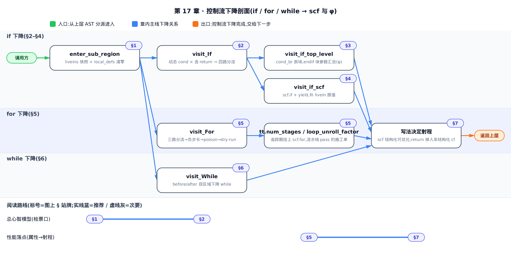
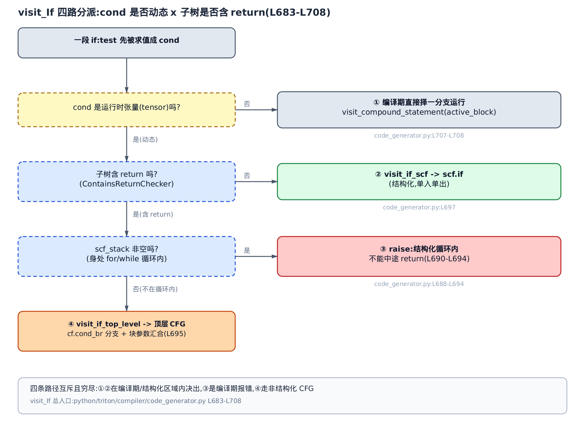
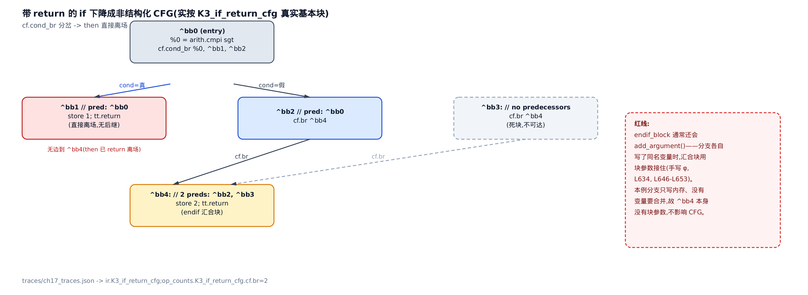
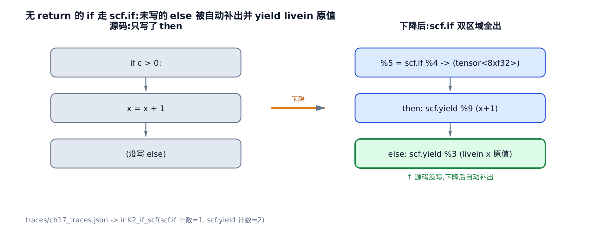
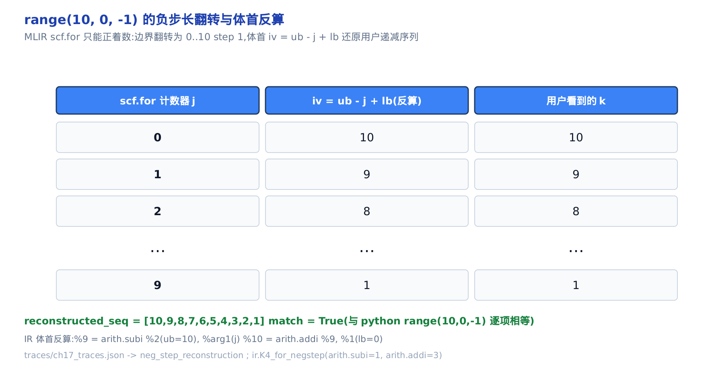
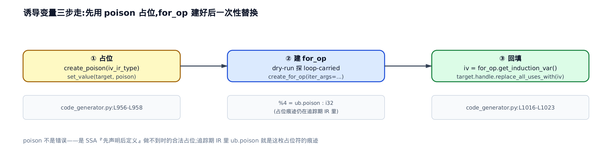
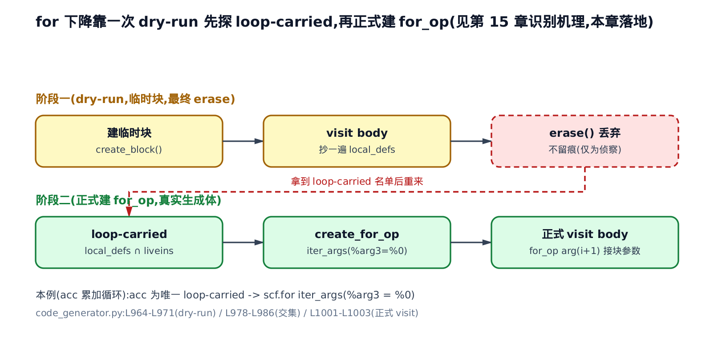
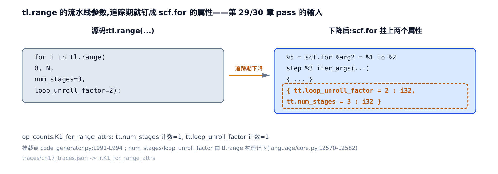
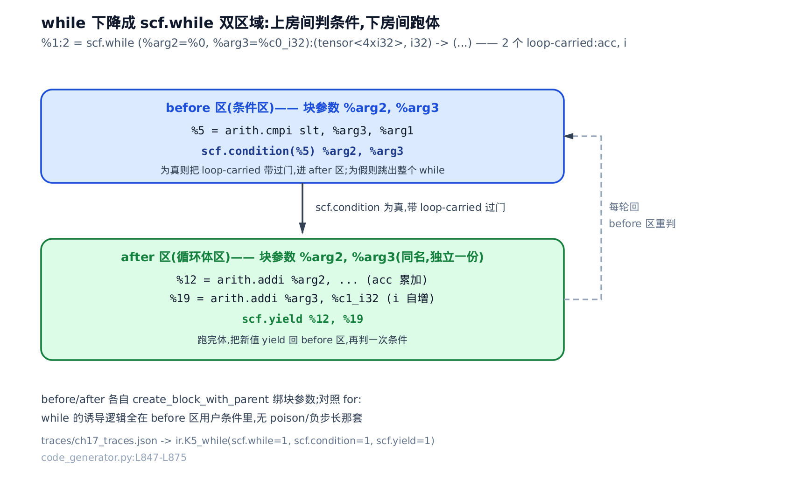
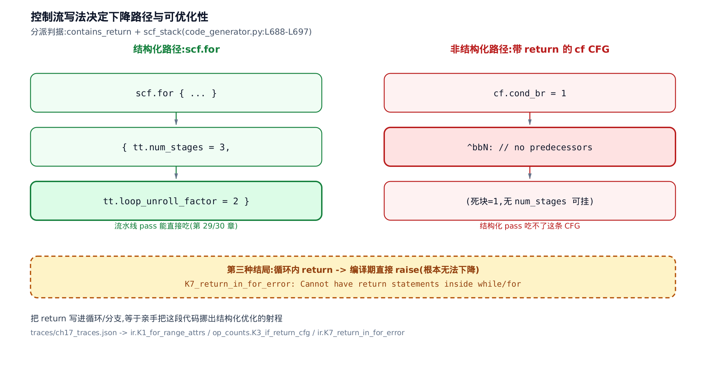

# 第 17 章 控制流下降到结构化 IR——if/for/while 如何变成 scf 与 φ

[你在这里：全书 9 个 Part 的降级阶梯，高亮处为本章所在的「编译前端」部分](../diagrams/roadmap.png)

- 上一章立了什么：`CodeGenerator` 这台机器，逐个 AST 节点分派翻成 `tt.*` IR。
- 本章解决什么：三个最烧脑的 visitor——`if`/`for`/`while` 怎么翻成 MLIR 的结构化控制流。
- 下一章接什么：`libtriton` 与 pybind——本章调的那些 `builder.create_*` 从 Python 跨进 C++。

**这一章能帮你做什么性能决策。** 你在循环上写的那句 `tl.range(0, N, num_stages=3)`——`num_stages`（软件流水线级数，让多轮循环体重叠掩住访存延迟）到底去哪了？答案全在 `python/triton/compiler/code_generator.py` 的三个控制流 visitor 里：追踪期它就被刻成了 `scf.for` 上的一条属性 `tt.num_stages`，成为后续流水线 pass 的**施工单**（那个 pass 的内部逻辑留给后面讲流水线的两章）。反过来，两种不起眼的写法会悄悄削弱甚至掐断这条链，而且后果轻重不同：**在分支里写 `return`**（且不在循环内）会把你的代码从「结构化 `scf`」路径踢到「非结构化 `cf` 跳转图（MLIR 里管跳转的另一种方言，本章 §3 细讲）」路径——仍能编译，但流水线、循环展开这些 pass 只吃前者，等于失去可优化性；而**在循环体里写 `return`**（或分支带 `return` 又恰好身处循环内）后果更彻底：编译期直接 `raise` 报错、压根不产生 IR。看懂本章，你才知道自己每一种控制流写法，把这段代码放进了优化射程之内、之外、还是直接编译不过。



**选读指引。** 只想抓总心智模型，读 [§2 检票口](#2-visit_if四路分流的检票口) 就够——`visit_If` 的四路分流是全章的调度台。想直接看性能落点（属性怎么挂、写法怎么影响可优化性），跳 [§5 循环下降的六个台阶](#5-visit_for循环下降的六个台阶) 的属性一节和 [§7 写法决定射程](#7-写法决定射程结构化-vs-非结构化)。想跟全程按序读。

---

## §1 皇冠明珠：三个 visitor，一套地基

[第 15 章](../../ch15-ssa-and-structured-control-flow/narrative/chapter.md) 把一套地基浇好了：SSA（静态单赋值——每个变量在 IR 里只被赋值一次，再改就换新版本）汇合处要用 φ 节点选来源；MLIR 不用 φ，改用**块参数**（后继块声明参数、前驱把实参「推」进来）表达同一件事；而 Triton 前端认「哪些变量跨迭代传递」（loop-carried 变量）的办法，是 dry-run 循环体一遍、取 `local_defs ∩ liveins`。

但那一章只把地基上的**两级台阶**走通了：`range` 版的 `for`，和无 `return` 的 `if`（`visit_if_scf`）。真实的 `code_generator.py` 里，控制流下降远不止这两条路——`if` 带了 `return` 要走完全不同的一条路，`for` 要处理负步长、`static_range` 编译期展开、诱导变量占位、把优化属性挂上，`while` 还有它自己的双区域结构。**这一章就是在同一套地基上，把 `if`/`for`/`while` 剩下的台阶全部补齐。**

补齐的抓手是三个 visitor 方法，它们都是上一章那台 `CodeGenerator` 机器的成员方法：

- `visit_If`——分支下降的总调度台；
- `visit_For`——`for` 循环下降；
- `visit_While`——`while` 循环下降。

那一章立的机理（φ ↔ 块参数为何等价、loop-carried 为何等于 `local_defs ∩ liveins`）本章只回指、不重讲；本章讲的是这套机理在**完整** `if`/`for`/`while` 下降里的落地。三个 visitor 反复用到同一个上下文管理器 `enter_sub_region`，先把它摆出来——它是「进出一个控制流子区域」的公共机器：

```python
# python/triton/compiler/code_generator.py:L83-L100
class enter_sub_region:

    def __init__(self, generator):
        self.generator = generator

    def __enter__(self):
        # record lscope & local_defs in the parent scope
        self.liveins = self.generator.lscope.copy()
        self.prev_defs = self.generator.local_defs.copy()
        self.generator.local_defs = {}
        self.insert_block = self.generator.builder.get_insertion_block()
        self.insert_point = self.generator.builder.get_insertion_point()
        return self.liveins, self.insert_block

    def __exit__(self, *args, **kwargs):
        self.generator.builder.restore_insertion_point(self.insert_point)
        self.generator.lscope = self.liveins
        self.generator.local_defs = self.prev_defs
```

进入时它做两件关键事：把当前可见的所有局部变量快照成 `liveins`（进这段控制流之前「外面」有什么），把记「本级新赋值」的账本 `local_defs`（`gscope`/`lscope`/`local_defs` 三层作用域账本，上一章建立）清零。于是子区域跑完后，「既在 `liveins`（进来前就有）又在 `local_defs`（里面被改过）」的变量，就是要跨出这段控制流传递的那些——`if` 的汇合变量、`for`/`while` 的 loop-carried 变量，全靠这一个交集认出来。退出时它把作用域恢复回外层。记住这台机器，下面三个 visitor 都在它上面搭。

## §2 `visit_If`：四路分流的检票口

**直觉。** `visit_If` 像岔路口的检票员，先看两道正交的关卡，把一段 `if` 分派到**四条互斥**的下降路径。第一关：条件 `cond` 是不是运行时才知道的张量（动态）？不是——编译期就能算出真假，那连岔路都不建，直接选定活的那一支往下翻。是动态——进第二关：这段 `if` 里**藏没藏 `return`**？藏了走「CFG（控制流图，§3 细讲）大路」（能中途下车），没藏走「`scf.if` 结构化小路」（一进一出）；而如果藏了 `return` 又恰好身处循环内，当场报错。



**机制。** 四条路的判据是两个正交的布尔量：`cond` 动态与否、子树含 `return` 与否（外加一个「是否在循环内」的守卫）。图里的四个出口一一对应下面源码的四个分支——① 静态择一分支、② `scf.if`、③ 报错、④ 顶层 CFG。分派本身不产生任何张量运算，它只决定「接下来交给谁翻」，所以说它是本章其余机制的总调度台。这两道关卡穷尽且互斥地覆盖了 `cond` 的所有取值——`_is_triton_tensor(cond)`（`isinstance(cond, tensor)`）先把「运行时张量」与其余一切一分为二；非张量的一侧再过 `_condition_types = {bool, int, type(None)}` 这道类型闸门兜底剩下的可能取值（闸外类型直接报 unsupported 错，不计入四路之内）；张量的一侧再叠加 `contains_return`/`scf_stack` 两个布尔量。两次二分之后，四条路径与这一处类型错误合起来，才是 `cond` 全部取值空间的穷尽划分，彼此互斥、没有重叠。

**源码。** 整个 `visit_If` 就是这一段，逐行是本章的骨架：

```python
# python/triton/compiler/code_generator.py:L683-L708
def visit_If(self, node):
    cond = self.visit(node.test)

    if _is_triton_tensor(cond):
        cond = cond.to(language.int1, _builder=self.builder)
        contains_return = ContainsReturnChecker(self.gscope).visit(node)
        if contains_return:
            if self.scf_stack:
                raise self._unsupported(
                    node, "Cannot have `return` statements inside `while` or `for` statements in triton "
                    "(note that this also applies to `return` statements that are inside functions "
                    "transitively called from within `while`/`for` statements)")
            self.visit_if_top_level(cond, node)
        else:
            self.visit_if_scf(cond, node)
    else:
        cond = _unwrap_if_constexpr(cond)
        # not isinstance - we insist the real thing, no subclasses and no ducks
        if type(cond) not in _condition_types:
            raise self._unsupported(
                node, "`if` conditionals can only accept values of type {{{}}}, not objects of type {}".format(
                    ', '.join(_.__name__ for _ in _condition_types),
                    type(cond).__name__))

        active_block = node.body if cond else node.orelse
        self.visit_compound_statement(active_block)
```

先看 `else` 分支（静态 `cond`）：`_is_triton_tensor(cond)` 为假，说明条件在追踪期就是个具体值（`constexpr`——编译期常量，进函数名做特化、不进 IR）。挑分支前还有一道类型闸门 `if type(cond) not in _condition_types`——`_condition_types` 是允许当静态条件的具体 Python 类型集合（如 `bool`/`int`）；注释那句「no subclasses and no ducks」点破它用 `type(...) not in` 而非 `isinstance` 是**故意**的：不收子类、不认鸭子类型，静态条件必须是这几种货真价实的类型之一，否则报错。过了闸门，`active_block = node.body if cond else node.orelse`——**只挑活的那一支**去 `visit_compound_statement`，另一支根本不翻。IR 里既没有 `scf.if` 也没有跳转，就好像你手写死了那一支。这也是为什么 kernel 里 `if BLOCK_SIZE == 64:` 这种基于 `constexpr` 的分支是零开销的——它在编译期就被剪掉了。

再看 `if _is_triton_tensor(cond)` 分支（动态 `cond`）：先 `cond.to(int1)` 把张量条件统一成 1 位布尔，然后 `ContainsReturnChecker(...).visit(node)` 静态判这段 `if` 里含不含 `return`（下一节讲这个类）。含——如果 `self.scf_stack` 非空（在循环里），`raise`；否则 `visit_if_top_level`（§3）。不含——`visit_if_scf`（§4）。四条路到此分派完毕。

### `ContainsReturnChecker`：逐个房间查有没有人没关灯

**直觉。** `ContainsReturnChecker` 像出门前挨个房间查「有没有人没关灯」：递归走遍 `if` 子树的每条语句、连带被**裸调用**的 `@triton.jit` 函数（`JITFunction`——被 JIT 装饰、可被追踪的核函数）体，任一处踩到 `return` 就整体判「含 `return`」。但它有个真实的盲点——赋值语句 `y = f()` 被直接当作「不可能提前返回」判 `False`，右边 `f()` 的函数体连下探都不下探。

**机制。** 这是一次纯 AST（抽象语法树）遍历，不生成任何 IR，只回一个布尔。它的语义可以精确到一句话：**返回 `True` 当且仅当，沿它访问到的节点里存在至少一个 `return`**（含被裸调用的全局 `JITFunction` 体内的 `return`）。「沿它访问到的节点」这个限定是关键——`visit_Assign` 直接返回 `False`，于是赋值右边的调用整个被剪掉，不在「访问到的节点」之内。

它必然终止：递归只往 AST 子节点（有限树）和被裸调用的全局 `JITFunction` 体（`fn.parse()` 出一棵新的有限树；`noinline` 函数不展开）下降，无环，有限步停。

**源码。**

```python
# python/triton/compiler/code_generator.py:L104-L189
class ContainsReturnChecker(ast.NodeVisitor):

    def __init__(self, gscope):
        self.gscope = gscope

    def _visit_stmts(self, body) -> bool:
        return any(self.visit(s) for s in body)

    def _visit_function(self, fn) -> bool:
        # Currently we only support JITFunctions defined in the global scope
        if isinstance(fn, JITFunction) and not fn.noinline:
            fn_node = fn.parse()
            return ContainsReturnChecker(self.gscope).visit(fn_node)
        return False

    def generic_visit(self, node) -> bool:
        ret = False
        for _, value in ast.iter_fields(node):
            if isinstance(value, list):
                for item in value:
                    if isinstance(item, ast.AST):
                        ret = ret or self.visit(item)
            elif isinstance(value, ast.AST):
                ret = ret or self.visit(value)
        return ret

    def visit_Return(self, node: ast.Return) -> bool:
        return True

    def visit_Assign(self, node: ast.Assign) -> bool:
        # There couldn't be an early return
        # x = ...
        return False

    def visit_If(self, node: ast.If) -> bool:
        ret = self._visit_stmts(node.body)
        if node.orelse:
            ret = ret or self._visit_stmts(node.orelse)
        return ret

    def visit_Call(self, node: ast.Call) -> bool:
        return self.visit(node.func)
    # … 省略：visit_Attribute / visit_Name / visit_AugAssign / visit_Module / visit_FunctionDef / visit_IfExp——
    #   它们让「含 return」沿 Attribute/Name 找到被调 jit 函数（_visit_function 再 parse 展开）、并在各语句种类间递归下去 …
```

三处最要紧。`visit_Return` 直接返回 `True`——这是「命中」的唯一来源。`generic_visit` 用 `ret = ret or self.visit(item)` 聚合子节点，任一为 `True` 整体就 `True`，等价于「存在某条被访问路径命中 `return`」。`visit_Call → visit(node.func)` 再经省略掉的 `visit_Name`/`visit_Attribute` 顺着函数名找到那个全局 `JITFunction`、`_visit_function` 把它 `parse()` 出来接着查——这就是「`return` 在被裸调用的函数里也算」的**跨函数**（transitively）语义。

而 `visit_Assign` 一句 `return False` 就是那个盲点：它认定 `x = ...` 不可能是提前返回，于是**连右边表达式都不再下探**。下面四个用例把这条边界量化了——真跑 pin 版编译器的这个类，同一个含 `return` 的辅助函数，裸调用（用例 C）判 `True`、赋值调用（用例 D）判 `False`，判定就此翻转：

<!-- trace: m2-contains-return-checker -->

| 用例 | `if` 子树形态 | `ContainsReturnChecker` 判定 | `visit_If` 分派 |
| --- | --- | --- | --- |
| A | `if` 体内直接 `return` | True | 顶层 CFG (`visit_if_top_level`) |
| B | 只有赋值、无 `return` | False | `scf.if` (`visit_if_scf`) |
| C | 裸调用含 `return` 的 jit 函数 | True | 顶层 CFG（transitively 递归进被调函数体） |
| D | 同一调用但结果被赋值 `y=helper(...)` | False | `scf.if`（`visit_Assign` 短路、不下探 RHS） |

四个用例里两个判 `True` 走 CFG、两个判 `False` 走 `scf.if`。C 与 D 只差「裸调用 vs 赋值」一处，走向就分道扬镳——这不是 bug，而是「能提前返回的语句形态」的一条务实边界：赋值的返回值要接着用，它不是控制流的出口。

### `scf_stack`：禁止循环体内 `return`

上面 `visit_If` 里那句 `if self.scf_stack:` 是第三关守卫。`scf_stack` 是一叠便签，记「我此刻站在几层循环里」：`visit_For`/`visit_While` 进入循环体前压一张、退出时揭一张（下面两节会看到成对的 `self.scf_stack.append(node)` / `self.scf_stack.pop()`）。`visit_If` 一旦发现自己带 `return` 且便签堆非空（身处循环内），当场 `raise`。

为什么要拦？因为从一个结构化循环区域中途 `return`，需要一路跳出多层「单入单出」的 `scf` 区域，而结构化控制流（`scf` 方言把循环/分支表达成带 region 的结构化 Op，天然单入单出）根本没有「从区域中间跳走」的表达力。配合上一节 `ContainsReturnChecker` 的跨函数递归，连「被循环里调用的函数内部的 `return`」也一并被这道守卫拦下——这正是那句报错括号里「transitively called from within」的含义。

这道守卫只堵一种形态——`return` 得先包在一个 `if` 里，`ContainsReturnChecker` 才有 `If` 子树可查、`visit_If` 才摸得到 `scf_stack`。如果 `return` 压根没被 `if` 包着、直接躺在循环体里（如 `for k in range(0, n): acc = acc + k; return`），它根本不经过 `visit_If`，也就绕开了这道守卫——但这类写法照样在编译期爆，只是踩中另一条独立的检查。`visit_Return`（§3 细讲）处理完 `return` 后，会在当前插入点开一个「没有前驱」的死块（`post_ret_block`）；这段 `return` 若身处 `for` 循环体内，这个死块就成了循环体 `region` 里多出来的第二个基本块，撞上 `visit_For` 收尾时的一句断言：

```python
# python/triton/compiler/code_generator.py:L1013-L1014
for_op_region = for_op.get_body(0).get_parent()
assert for_op_region.size() == 1, "We use SCF, so the loop body should only have one block"
```

`scf.for` 的循环体天生只能是单一基本块，多出的死块把这条断言直接踩爆——实测 `for k in range(0, n): acc = acc + k; return` 编译期即报 `AssertionError('We use SCF, so the loop body should only have one block')`，而不是上面那句 `Cannot have return statements...`。这是与 `visit_If`/`scf_stack` 完全独立的第二道守卫，两者恰好覆盖「`return` 有没有被 `if` 包住」的两种写法。也正因为不带条件的裸 `return` 会让循环从第一轮起就必然离场、其后的迭代和代码全部沦为死代码——这种写法在真实 kernel 里没有存在的理由，你想要的「满足某条件就提前退出循环」几乎总会写成 `if cond: return`，自然落回上面 `visit_If` 那道守卫。

## §3 带 `return` 的 `if`：顶层 CFG 与手写 φ

**直觉。** 带 `return` 的 `if` 走最原始的一条路——「条件跳转 + 汇合站」。`cf.cond_br`（条件分支，`cf` 方言的基本块跳转）把控制流分到 `then`/`else` 两个基本块；各分支把要带出去的变量当「行李」塞进汇合站 `endif` 块的**块参数**里（这就是手写的 φ）；再各自 `cf.br`（无条件跳转）汇到 `endif`。块参数的每条入边，就是某个分支 `create_branch` 传的一组实参。



**机制。** 和 `scf.if` 那种「一个 Op 内含两个区域」的结构化写法不同，这里是扁平的四个基本块 + 显式跳转。它之所以能容纳 `return`：`return` 让 `then` 块直接 `tt.return` 离场、不再汇合，剩下的 `else` 分支和「`return` 之后的死块」经 `cf.br` 汇入 `endif`。整张图是非结构化的 CFG（控制流图），没有单一出口——这恰恰是它无法塞进 `scf.if` 的原因，也是它必须走这条路的原因。

看真实的追踪期 TTIR（Triton IR——五级降级最高层、硬件无关的张量 IR），源码是 `if c > 0: store(1); return`（没有 `else` 子句）；`if` 语句结束后紧跟的 `store(2)` 是无条件执行的收尾代码，对应下面 IR 里的 `endif` 汇合块 `^bb4`。下降后：

```mlir
  cf.cond_br %0, ^bb1, ^bb2
^bb1:  // pred: ^bb0
  tt.store %arg0, %c1_i32 : !tt.ptr<i32>
  tt.return
^bb2:  // pred: ^bb0
  cf.br ^bb4
^bb3:  // no predecessors
  cf.br ^bb4
^bb4:  // 2 preds: ^bb2, ^bb3
  tt.store %arg0, %c2_i32 : !tt.ptr<i32>
  tt.return
```

`^bb1` 是 `then`——`store` 完直接 `tt.return`，没有指向 `^bb4` 的边（它已离场）。`^bb2` 是自动补出的 `else` 块——源码没写 `else`，但 `visit_if_top_level`（见下方源码）无条件建一个 `else_block`，没被 `visit_compound_statement` 写进任何内容，于是它是空的，只 `cf.br ^bb4` 径直汇合。`^bb4` 就是 `endif` 汇合块，标着 `// 2 preds: ^bb2, ^bb3`（两个前驱）。那个 `^bb3: // no predecessors` 是本节要点，下面 `visit_Return` 讲。

**源码。** 顶层 CFG 路径的主体：

```python
# python/triton/compiler/code_generator.py:L624-L653
def visit_if_top_level(self, cond, node):
    with enter_sub_region(self) as sr:
        liveins, ip_block = sr
        then_block = self.builder.create_block()
        else_block = self.builder.create_block()
        # create branch
        self.builder.set_insertion_point_to_end(ip_block)
        self.builder.create_cond_branch(cond.handle, then_block, else_block)
        # visit then and else blocks
        then_defs, else_defs, then_block, else_block, names, ret_types, ir_ret_types = \
            self.visit_then_else_blocks(node, liveins, then_block, else_block)
        # create basic-block after conditional
        endif_block = self.builder.create_block()
        # then terminator
        self.builder.set_insertion_point_to_end(then_block)
        assert not then_block.has_terminator(), f"{then_block}"
        self.builder.create_branch(endif_block, [then_defs[n].handle for n in names])
        # else terminator
        self.builder.set_insertion_point_to_end(else_block)
        assert not else_block.has_terminator(), f"{else_block}"
        self.builder.create_branch(endif_block, [else_defs[n].handle for n in names])
        for ty in ir_ret_types:
            endif_block.add_argument(ty)

    # change block
    self.builder.set_insertion_point_to_start(endif_block)
    # update value
    for i, name in enumerate(names):
        new_tensor = language.core.tensor(endif_block.arg(i), ret_types[i])
        self.set_value(name, new_tensor)
```

`create_cond_branch(cond, then, else)` 就是那句 `cf.cond_br`。`visit_then_else_blocks`（§4 细讲）跑完两支，交回汇合处要传的变量名 `names` 和它们的类型。接着 `endif_block.add_argument(ty)`——**给汇合块声明块参数**，这就是手写 φ 的那一步。两个 `create_branch(endif_block, [..defs[n].handle for n in names])` 分别是 `then`/`else` 的 `cf.br`，方括号里那组实参就是各分支为块参数「推」进去的值（φ 的两条入边）。最后 `set_value(name, endif_block.arg(i))` 把汇合后的块参数接回符号表，`if` 之后的代码就用这个新值。

### `visit_Return`：一个没有前驱的死块

上面那个 `^bb3: // no predecessors` 是哪来的？`visit_Return`。

**直觉。** `visit_Return` 发出 `builder.ret` 之后，硬开一个「没有前驱」的死块——好比在终点线之后又画一段跑道，谁也跑不到。TTIR 里它显示为 `^bbN: // no predecessors`。正是这个「提前离场 + 死块」破坏了 `scf.if`/`scf.for` 要求的单一出口，成为「带 `return` 必走 CFG」的实证。

**源码。** 尾部两行是要点：

```python
# python/triton/compiler/code_generator.py:L361-L384
def visit_Return(self, node):
    ret_value = self.visit(node.value)
    if ret_value is None:
        self.builder.ret([])
        ret_ty = language.void
    # … 省略：ret_value 是 tuple / 单值时，各自 to_tensor 后 builder.ret，并记录 ret_ty …

    if self.ret_type is None:
        self.ret_type = ret_ty
    elif self.ret_type != ret_ty:
        raise TypeError(f'Inconsistent return types: {self.ret_type} and {ret_ty}')

    # A return op must always terminate the basic block, so we create a dead
    # basic block in case there are any ops after the return.
    post_ret_block = self.builder.create_block()
    self.builder.set_insertion_point_to_end(post_ret_block)
```

`builder.ret(...)` 是 `tt.return`，它必须是基本块的最后一条指令（terminator）。可 `return` 后面万一还有代码呢？源码注释说得直白：「A return op must always terminate the basic block, so we create a dead basic block」——`create_block()` 开一个 `post_ret_block`，后面的插入点挪进去。这个块没有任何跳转指向它，就是 `// no predecessors`。它是「`return` 破坏单入单出」这件事在 IR 里留下的物证。

## §4 无 `return` 的 `if`：`scf.if` 与 yield 汇合

**直觉。** 无 `return` 的 `if` 走结构化小路：`scf.if`（MLIR SCF 方言的结构化 if）自带 `then`/`else` 两个区域，每个区域末尾用 `scf.yield`（把区域产出的值推给汇合点，是这个区域的 terminator）「交作业」，外面用 SSA 结果接住。一进一出、干净闭合，没有跳转、没有死块。哪一侧没更新某个变量，就 yield 它进入前的 livein 原值。



**机制。** 对照上一节的 CFG：那边用四个块 + 显式跳转 + 汇合块的块参数；这边用一个 `scf.if` Op 包住两个区域，每区一条 `scf.yield` 出结果，`if` 本身的 SSA 结果就是汇合值。同一件「汇合」的事，两种写法——CFG 是「拉」（汇合块回头声明参数、等前驱推）、`scf` 是「让 Op 直接产出结果」。关键约束是**单入单出**：两个区域都必须 yield 同一组变量，`scf.if` 才有良定义的结果类型。

真实 TTIR，源码只写了 `then`（`if c > 0: x = x + 1`）：

```mlir
  %4 = arith.cmpi sgt, %arg1, %c0_i32 : i32
  %5 = scf.if %4 -> (tensor<8xf32>) {
    %cst_1 = arith.constant dense<1.000000e+00> : tensor<8xf32>
    %9 = arith.addf %3, %cst_1 : tensor<8xf32>
    scf.yield %9 : tensor<8xf32>
  } else {
    scf.yield %3 : tensor<8xf32>
  }
```

`then` 区算出 `x+1`（`%9`）后 `scf.yield %9`。而**源码根本没写 `else`**，下降却自动补出一个 `else` 区，里面 `scf.yield %3`——`%3` 正是进入 `if` 之前那个 `x` 的原值（livein）。`scf.if` 的单入单出，就靠「两侧都 yield 同一个 `x`，未改的一侧补原值」来兑现。

**源码。** `scf.if` 路径主体：

```python
# python/triton/compiler/code_generator.py:L656-L681
# TODO: refactor
def visit_if_scf(self, cond, node):
    with enter_sub_region(self) as sr:
        liveins, _ = sr
        ip, last_loc = self._get_insertion_point_and_loc()
        then_block = self.builder.create_block()
        else_block = self.builder.create_block() if node.orelse else None
        then_defs, else_defs, then_block, else_block, names, ret_types, _ = \
            self.visit_then_else_blocks(node, liveins, then_block, else_block)
        # create if op
        self._set_insertion_point_and_loc(ip, last_loc)
        if_op = self.builder.create_if_op([ty.to_ir(self.builder) for ty in ret_types], cond.handle, True)
        then_block.merge_block_before(if_op.get_then_block())
        self.builder.set_insertion_point_to_end(if_op.get_then_block())
        if len(names) > 0:
            self.builder.create_yield_op([then_defs[n].handle for n in names])
        if not node.orelse:
            else_block = if_op.get_else_block()
        else:
            else_block.merge_block_before(if_op.get_else_block())
        self.builder.set_insertion_point_to_end(if_op.get_else_block())
        if len(names) > 0:
            self.builder.create_yield_op([else_defs[n].handle for n in names])
    # update values
    for i, name in enumerate(names):
        new_tensor = language.core.tensor(if_op.get_result(i), ret_types[i])
        self.set_value(name, new_tensor)
```

`create_if_op(ret_types, cond, True)` 建带结果类型的 `scf.if`。两个 `create_yield_op([..defs[n].handle for n in names])` 就是那两条 `scf.yield`——`then` 侧交 `then_defs`、`else` 侧交 `else_defs`。注意 `if not node.orelse: else_block = if_op.get_else_block()`——源码没写 `else` 时，直接拿 `scf.if` 自带的空 `else` 区来 yield livein 原值，这就是上面 TTIR 里 `else` 凭空出现的由来。最后 `set_value(name, if_op.get_result(i))` 把结果接回符号表。对比 §3：那边 `set_value(endif_block.arg(i))`（接块参数），这边 `set_value(if_op.get_result(i))`（接 Op 结果）——同一符号表更新，两种汇合载体。

### `visit_then_else_blocks`：两侧草稿的对账

`then`/`else` 两支各写各的草稿，汇合处要对账：算出「哪些变量要传给汇合点、什么类型」。这个交给 `visit_then_else_blocks`，`scf.if` 和顶层 CFG 两条路共用它。

**直觉。** 凡「进 `if` 前就可见（livein）、且被某一支改过」的变量，都要在汇合处统一成一个新值；只有一支改了的，另一支就用进入前的旧值补齐——这正是 φ 的另一条入边。

**机制。** 一个 `if c>0: x=x+1  else: x=x-1; y=y+10` 的例子把对称与非对称两种情形摆清楚：`x` 两支都改（对称），`y` 只 `else` 改（非对称）。

<!-- trace: m7-then-else-defs -->

| 变量 | 进入前 livein | then 改？ | else 改？ | `scf.if` 结果类型 | then 侧 yield | else 侧 yield |
| --- | --- | --- | --- | --- | --- | --- |
| x | 是 (%3) | 改 x+1 | 改 x-1 | tensor<8xf32> | x+1 | x-1 |
| y | 是 (%7) | 未改 | 改 y+10 | tensor<8xf32> | livein y 原值 (%7) | y+10 |

两个变量都进汇合集合，于是 `scf.if` 出两个结果。对称变量 `x` 两支各出一个新值；非对称变量 `y` 只有 `else` 出新值，`then` 侧用 livein 原值 `%7` 补齐——**非对称正是 φ 存在的意义**：没有它，`then` 分支之后的 `y` 就没有确定的 SSA 值。

**源码。**

```python
# python/triton/compiler/code_generator.py:L569-L622
def visit_then_else_blocks(self, node, liveins, then_block, else_block):
    # then block
    self.builder.set_insertion_point_to_start(then_block)
    self.visit_compound_statement(node.body)
    then_block = self.builder.get_insertion_block()
    then_defs = self.local_defs.copy()
    # else block
    else_defs = {}
    if node.orelse:
        self.builder.set_insertion_point_to_start(else_block)
        self.lscope = liveins.copy()
        self.local_defs = {}
        self.visit_compound_statement(node.orelse)
        else_defs = self.local_defs.copy()
        else_block = self.builder.get_insertion_block()

    # update block arguments
    names = []
    ret_types = []
    ir_ret_types = []
    # variables in livein whose value is updated in `if`
    for name in liveins:
        # check type
        for defs, block_name in [(then_defs, 'then'), (else_defs, 'else')]:
            if name in defs:
                assert defs[name].type == liveins[name].type, \
                    f'initial value for `{name}` is of type {liveins[name].type}, '\
                    f'but the {block_name} block redefines it as {defs[name].type}'
        if name in then_defs or name in else_defs:
            names.append(name)
            ret_types.append(then_defs[name].type if name in then_defs else else_defs[name].type)
            ir_ret_types.append(then_defs[name].handle.get_type() if name in
                                then_defs else else_defs[name].handle.get_type())
        # variable defined in then but not in else
        if name in then_defs and name not in else_defs:
            else_defs[name] = liveins[name]
        # variable defined in else but not in then
        if name in else_defs and name not in then_defs:
            then_defs[name] = liveins[name]
    # … 省略：处理「两支都新定义、外面没有」的变量的收尾循环——本章聚焦 livein 被更新→汇合这条主线 …
```

`then_defs`/`else_defs` 是分别 visit 两支后抄下的 `local_defs`。中间那个 `for name in liveins:` 就是对账：`if name in then_defs or name in else_defs:` 把「被某支改过」的 livein 变量收进 `names`。而最后两句补齐是 φ 的骨髓——`then` 改了 `else` 没改，就令 `else_defs[name] = liveins[name]`（`else` 侧补原值），反之亦然。有了它，`names` 里每个变量在两支都有一个同类型 SSA 值，`scf.if` 每个结果才恰有两条 yield 入边、良定义。中间那句 `assert defs[name].type == liveins[name].type` 是类型闸门——这也解释了为什么在 `if` 里改变量的 dtype 会报错。

## §5 `visit_For`：循环下降的六个台阶

`for` 是本章最长的一段——`visit_For` 一个方法里叠了六个台阶。先看总入口的**三路分流**。

**直觉。** `visit_For` 先看迭代器是谁：`tl.static_range`（编译期展开迭代器，边界必为 `constexpr`）→ 编译期直接摊开，IR 里没有循环；`tl.range`（携带流水线属性的迭代器）→ 走 `scf.for` 并挂上 `num_stages`/`loop_unroll_factor` 两个属性；Python 原生 `range` → 走朴素 `scf.for`（无属性）。三条路在方法开头就分好。

**机制。** 三路分流靠 `IteratorClass` 的身份判断——`static_range` 是纯 Python 值、不产生任何 IR，`language.range` 携带流水线元数据，原生 `range` 只有裸边界；判断发生在方法最开头，决定后续走哪条生成路径，因此后面五个台阶只对 `scf.for` 那两条路（`tl.range`/原生 `range`）生效。

**源码（台阶一：三路分流 + 台阶三/四的准备）。**

```python
# python/triton/compiler/code_generator.py:L898-L958
def visit_For(self, node):
    IteratorClass = self.visit(node.iter.func)
    iter_args = [self.visit(arg) for arg in node.iter.args]
    iter_kwargs = dict(self.visit(keyword) for keyword in node.iter.keywords)
    if IteratorClass == language.static_range:
        iterator = IteratorClass(*iter_args, **iter_kwargs)
        static_range = range(iterator.start.value, iterator.end.value, iterator.step.value)
        for i in static_range:
            self.lscope[node.target.id] = constexpr(i)
            self.visit_compound_statement(node.body)
            for stmt in node.orelse:
                ast.NodeVisitor.generic_visit(self, stmt)
        return
    num_stages = None
    loop_unroll_factor = None
    if IteratorClass is language.range:
        iterator = IteratorClass(*iter_args, **iter_kwargs)
        lb = iterator.start
        ub = iterator.end
        step = iterator.step
        num_stages = iterator.num_stages
        loop_unroll_factor = iterator.loop_unroll_factor
    elif IteratorClass is range:
        lb = iter_args[0] if len(iter_args) > 1 else self.visit(ast.Num(0))
        ub = iter_args[1] if len(iter_args) > 1 else self.visit(node.iter.args[0])
        step = iter_args[2] if len(iter_args) > 2 else self.visit(ast.Num(1))
    else:
        raise RuntimeError('Only `range` and `static_range` iterators are currently supported')
    # handle negative constant step (not supported by scf.for in MLIR)
    negative_step = False
    if _is_constexpr(step) and step.value < 0:
        step = constexpr(-step.value)
        negative_step = True
        lb, ub = ub, lb
    # … 省略：lb/ub/step to_tensor + 整数类型检查 + 提升诱导变量类型 iv_type + create_int_cast 成 Index 类型 …
    # Create placeholder for the loop induction variable
    iv = self.builder.create_poison(iv_ir_type)
    self.set_value(node.target.id, language.core.tensor(iv, iv_type))
```

`static_range` 分支直接 `return`——它是一个编译期 Python 循环，下面单讲。`tl.range` 分支取出 `num_stages`/`loop_unroll_factor` 存着（台阶六挂属性用）。原生 `range` 分支只取 `lb`/`ub`/`step`。接着是**负步长处理**和**诱导变量占位**两个台阶，分别在下面两节展开。

### 台阶二：`static_range` 编译期整体展开

**直觉。** `static_range` 像把「重复三遍」的谱子直接抄成三行：三个边界都是 `constexpr`，编译期就把循环体复制 N 份，每份把诱导变量钉成常量 `constexpr(i)`。IR 里根本没有 `scf.for`——利于常量传播与激进展开，代价是代码膨胀。

**机制。** 上面源码里 `for i in static_range: self.lscope[node.target.id] = constexpr(i); self.visit_compound_statement(node.body)`——这是一个货真价实的 Python `for`，在追踪期跑完 N 次，每次把循环变量绑成具体常量再 visit 一遍循环体。展开次数 `(end-start)/step` 编译期确定且有限，必然停。以 `tl.static_range(0, 3)`、`acc = acc + k` 为例：

<!-- trace: m9-static-range-unroll -->

| 展开次序 | 诱导变量 k (constexpr) | 生成的体内常量 | 每-lane acc 累加后 |
| --- | --- | --- | --- |
| 0 | 0 | dense<0> | 0 |
| 1 | 1 | dense<1> | 1 |
| 2 | 2 | dense<2> | 3 |

三份体拷贝、零个 `scf.for`。追踪期 TTIR 里能看到 `dense<0>`/`dense<1>`/`dense<2>` 三组常量顺次出现，把三份体一字排开——这是展开「逐份复制」而非「循环」的直接证据。这也是性能提示：`static_range` 适合小而固定的循环（编译器能常量传播穿透它），但循环次数一大，展开出来的 IR 会爆。

### 台阶三：负步长翻转边界

**直觉。** MLIR 的 `scf.for` 只会正着数，负步长得「翻译」：把 `range(10, 0, -1)` 的边界对调、步长取正，让循环正着从 0 跑到 9；再在循环体开头用一步反算，把计数器翻回用户要的递减序列 10, 9, …, 1。用户写的是倒着数，机器跑的是正着数，体首一步反算把两者对上。



**机制。** 上面源码里 `if _is_constexpr(step) and step.value < 0:` 那三行——`step` 取正、`negative_step=True`、`lb, ub = ub, lb`（交换边界）。于是 `scf.for` 计数器 `j` 从 0 数到 9（正序）。真正的诱导值靠体首反算恢复：设反算式为 `iv = ub - j + lb`，`j` 从 0 到 9，`iv` 就从 10 到 1，恰是 `range(10, 0, -1)` 的原序列。逐项对照 Python `range(10, 0, -1)`，实测完全相等：

<!-- trace: m10-negative-step -->

| `scf.for` 计数器 j | iv = ub - j + lb（反算） | 用户看到的 k |
| --- | --- | --- |
| 0 | 10 | 10 |
| 1 | 9 | 9 |
| 2 | 8 | 8 |
| 9 | 1 | 1 |

看真实 TTIR 的体首两条指令，就是这个反算：

```mlir
  %5 = scf.for %arg1 = %1 to %2 step %3 iter_args(%arg2 = %0) -> (tensor<4xi32>) : i32 {
    %9 = arith.subi %2, %arg1 : i32      // ub - j
    %10 = arith.addi %9, %1 : i32        // (ub - j) + lb
    # … 省略：用 %10（真实诱导值）参与循环体计算，末尾 scf.yield …
  }
```

`%2` 是翻转后的 `ub`（=10）、`%arg1` 是计数器 `j`、`%1` 是 `lb`（=0）：`arith.subi %2, %arg1` 算 `ub - j`，`arith.addi %9, %1` 再加 `lb`，正是 `iv = ub - j + lb`。为反算多付两条 `arith` 指令，换来的是「前端对用户屏蔽 `scf.for` 只能正数」这条抽象——你写 `range(10, 0, -1)` 就是这个语义，前端替你补齐了机器那侧的约束。

### 台阶四：诱导变量 poison 占位再回填

**直觉。** 建 `for_op` 之前还没有真正的循环计数器，可循环体（下一台阶 dry-run 时）已经要引用它——先塞一个合法的「占位符」`ub.poison` 顶上；等 `for_op` 造好、拿到真计数器 `get_induction_var`，再用 `replace_all_uses_with` 一次性把所有占位引用换成真值。像先用铅笔占个座，正主到了再擦掉换上。



**机制。** 难点在 SSA 的「先声明后定义」在这里做不到——诱导变量的真值要等 `for_op` 建好才有，但要建 `for_op` 得先 dry-run 循环体（下一台阶），而 dry-run 时循环体就可能用到诱导变量了。`poison` 是一个合法的占位 SSA 值，专门顶这种「暂时无值」的位。上面台阶一源码尾部 `iv = self.builder.create_poison(iv_ir_type); self.set_value(node.target.id, ...)` 就是占位。追踪期 TTIR 里 `%4 = ub.poison : i32` 就是这枚占位符留下的痕迹——它不是错误，是 SSA 下的合法占座。回填在下一台阶的源码尾部——这里的 `for_op`，就是下一节台阶五里 `create_for_op(...)` 造出来的那个 `scf.for` 循环 Op；我们先看它造好之后诱导变量怎么回填，造它的过程留到下一节：

```python
# python/triton/compiler/code_generator.py:L1016-L1023 （节选自 visit_For 后半段）
        iv = for_op.get_induction_var()
        if negative_step:
            iv = self.builder.create_sub(ub, iv)
            iv = self.builder.create_add(iv, lb)
        self.lscope[node.target.id].handle.replace_all_uses_with(iv)
        self.set_value(node.target.id, language.core.tensor(iv, iv_type))
```

`for_op.get_induction_var()` 拿到真计数器；`negative_step` 时就地补上台阶三的 `ub - iv + lb` 反算（`create_sub` + `create_add`，正是 TTIR 里那两条 `subi`/`addi`）；`replace_all_uses_with(iv)` 把先前所有引用那枚 poison 的地方一次性改指到真值。SSA 单赋值下不能「改一个值」，只能「改所有引用」——这就是手法。

### 台阶五：dry-run 收集 loop-carried

**直觉。** 要造 `scf.for` 必须先知道「哪些变量跨迭代传递」（loop-carried），但这信息只能靠真访问一遍循环体拿到——于是先在一个临时块里「预演」visit 一遍、抄下 `local_defs ∩ liveins`、再 `erase` 丢弃这段 IR；正式建好 `for_op` 后再 visit 一遍真的。第一遍只为侦察，不留痕。



**机制。** loop-carried 的识别判据 `local_defs ∩ liveins` 是 [第 15 章](../../ch15-ssa-and-structured-control-flow/narrative/chapter.md) 立的机理，这里不重讲——`∈ liveins` 保证有初值可带进 `init_args`，`∈ local_defs` 保证有新值可 yield，缺一不可。本节看它在**完整** `for` 下降里怎么落地：循环体要被 visit **两遍**。第一遍进一个临时块只为数出 loop-carried，随即 `erase` 抹掉；拿到 loop-carried 名单才能建 `create_for_op`；第二遍在真正的 `for_op` body 里正式生成。

**源码（台阶五 + 六 + 二次 visit）。**

```python
# python/triton/compiler/code_generator.py:L960-L1015 （visit_For 后半段）
    with enter_sub_region(self) as sr:
        liveins, insert_block = sr
        ip, last_loc = self._get_insertion_point_and_loc()

        # create loop body block
        block = self.builder.create_block()
        self.builder.set_insertion_point_to_start(block)
        # dry visit loop body
        self.scf_stack.append(node)
        self.visit_compound_statement(node.body)
        self.scf_stack.pop()
        block.erase()

        # If a variable (name) is defined in both its parent & itself, then it's
        # a loop-carried variable. (They must be of the same type)
        init_args = []
        yields = []
        names = []
        for name in self.local_defs:
            if name in liveins:
                loop_val = self.local_defs[name]
                live_val = liveins[name]
                self._verify_loop_carried_variable(name, loop_val, live_val)

                names.append(name)
                init_args.append(live_val)
                yields.append(loop_val)

        # create ForOp
        self._set_insertion_point_and_loc(ip, last_loc)
        for_op = self.builder.create_for_op(lb, ub, step, [arg.handle for arg in init_args])
        if num_stages is not None:
            for_op.set_attr("tt.num_stages", self.builder.get_int32_attr(num_stages))
        if loop_unroll_factor is not None:
            for_op.set_attr("tt.loop_unroll_factor", self.builder.get_int32_attr(loop_unroll_factor))

        self.scf_stack.append(node)
        self.builder.set_insertion_point_to_start(for_op.get_body(0))
        # reset local scope to not pick up local defs from the previous dry run.
        self.lscope = liveins.copy()
        self.local_defs = {}
        for i, name in enumerate(names):
            self.set_value(name, language.core.tensor(for_op.get_body(0).arg(i + 1), yields[i].type))
        self.visit_compound_statement(node.body)
        self.scf_stack.pop()
        # … 省略：二次 visit 后收 yields、create_yield_op、以及台阶四的 iv 回填（上面已单列） …
```

`create_block()` + `visit_compound_statement(node.body)` + `block.erase()`——三行就是 dry-run：建临时块、预演、抹掉。注意成对的 `scf_stack.append(node)` / `pop()`——§2 末尾那道「循环内禁 `return`」守卫的便签，就是这里压上去的（连 dry-run 都压，确保预演里的 `return` 也被拦）。接着 `for name in self.local_defs: if name in liveins:` 取交集，收进 `names`/`init_args`（初值）/`yields`（新值）。取交集时那句 `self._verify_loop_carried_variable(name, loop_val, live_val)` 和 §4 的类型 `assert` 同款——检查这个变量进循环前的类型（`live_val`）和每轮结束后的类型（`loop_val`）是否一致；跨迭代不能变类型、也不能把一个 `constexpr` 重新定义掉，否则就在这一步报错。这也是为什么在循环体里改某个 loop-carried 变量的 dtype 会失败。`create_for_op(lb, ub, step, init_args)` 建循环，`init_args` 就是每个 loop-carried 变量的 iter_arg 初值。

二次 visit 前那两句 `self.lscope = liveins.copy(); self.local_defs = {}` 很关键——把作用域**重置**，不让 dry-run 残留的 `local_defs` 污染正式生成。然后 `set_value(name, for_op.get_body(0).arg(i + 1))`——把每个 loop-carried 变量绑到 `for_op` body 的块参数上，注意是 `arg(i + 1)`：**`arg(0)` 是诱导变量，`arg(i+1)` 起才是 loop-carried 槽**（这个块参数布局在前面讲 SSA 那一章已立）。再 `visit_compound_statement(node.body)` 第二遍，这回是真生成。

二次 visit、`create_yield_op`、以及台阶四的 iv 回填（上面已分别单列）跑完后，`visit_For` 的收尾动作是把每个 loop-carried 变量的**终值**接回外层作用域：

```python
# python/triton/compiler/code_generator.py:L1025-L1027 （visit_For 尾部）
        # update lscope & local_defs (ForOp defines new values)
        for i, name in enumerate(names):
            self.set_value(name, language.core.tensor(for_op.get_result(i), yields[i].type))
```

和 §4 的 `if_op.get_result(i)` 一样，`for_op` 也把每个 loop-carried 的终值当 Op 结果吐出来——循环**外面**那个 `acc` 接的正是这个 `for_op.get_result(i)`，不是循环体里那个块参数 `arg(i+1)`（body 里的 `arg(i+1)` 只在循环内活着）。这一步和 `if` 两条路径的 `set_value(...get_result(i))`/`set_value(...arg(i))` 遥相呼应：控制流一旦收口，符号表里那个名字就换成汇合后的新 SSA 值，后面的代码顺理成章接着用。

看 `acc` 累加循环的真实 TTIR，一个 loop-carried 变量对应一个 iter_arg：

```mlir
  %4 = ub.poison : i32
  %5 = scf.for %arg2 = %1 to %2 step %3 iter_args(%arg3 = %0) -> (tensor<16xf32>) : i32 {
    %cst_1 = arith.constant dense<1.000000e+00> : tensor<16xf32>
    %9 = arith.addf %arg3, %cst_1 : tensor<16xf32>
    scf.yield %9 : tensor<16xf32>
  } {tt.loop_unroll_factor = 2 : i32, tt.num_stages = 3 : i32}
```

`iter_args(%arg3 = %0)` 就是 `acc` 这个 loop-carried——初值 `%0`（进循环前的 `acc`），body 里 `%arg3` 是本轮的 `acc`，`scf.yield %9` 把 `acc+1` 送进下一轮。`%4 = ub.poison` 是诱导变量占位（本例体内没用诱导变量，故 poison 未被真正引用）。末尾那对花括号里的属性，是下一台阶的主角。

### 台阶六：`num_stages`/`loop_unroll_factor` 挂成 `tt.` 属性

**直觉。** 用户在 `tl.range` 上写的 `num_stages`/`loop_unroll_factor` 不是运行时参数——追踪期就被刻成 `scf.for` 上的 `tt.num_stages`/`tt.loop_unroll_factor` 属性，成为后续软件流水线 pass（后面讲流水线的两章细讲那个 pass）与循环展开器的输入。前端把优化意图直接钉在循环上，pass 阶段照单执行。



**机制。** 就是上面台阶五源码里这两行：`for_op.set_attr("tt.num_stages", ...)` 和 `for_op.set_attr("tt.loop_unroll_factor", ...)`——`num_stages`/`loop_unroll_factor` 非空（即用户在 `tl.range` 上写了）才挂——原生 `range` 和「没传这两个参数」的 `tl.range` 都会让它们停留在构造函数的默认值 `None`，这道判空避免给没有流水线意图的循环塞上空洞的 `tt.num_stages`/`tt.loop_unroll_factor` 属性，平白多给下游 pass 一个要处理却无意义的信号。它们从哪来？`tl.range` 的构造函数在追踪期就把这两个参数记了下来：

```python
# python/triton/language/core.py:L2570-L2582
def __init__(self, arg1, arg2=None, step=None, num_stages=None, loop_unroll_factor=None):
    if step is None:
        self.step = constexpr(1)
    else:
        self.step = step
    if arg2 is None:
        self.start = constexpr(0)
        self.end = arg1
    else:
        self.start = arg1
        self.end = arg2
    self.num_stages = num_stages
    self.loop_unroll_factor = loop_unroll_factor
```

`self.num_stages = num_stages` / `self.loop_unroll_factor = loop_unroll_factor`——`tl.range(0, N, num_stages=3, loop_unroll_factor=2)` 里的 `3` 和 `2` 就存在这里，被台阶一取进 `visit_For` 的同名局部变量，再被台阶五挂上。上面那段 `acc` 循环的 TTIR 末尾 `{tt.loop_unroll_factor = 2 : i32, tt.num_stages = 3 : i32}` 就是它们的落点——**任何 pass 之前**（追踪期）就在。这条属性正是「控制流下降」与「性能优化」的接缝：前端负责把意图刻上去，pass 负责读它。你写 `num_stages=3`，兑现的第一步就在这里。

## §6 `visit_While`：before/after 双区域

**直觉。** `scf.while`（MLIR SCF 方言的结构化 while）用两个「房间」表达「先判条件再决定跑不跑体」：before 房间算 test，并用 `scf.condition`（before 区的 terminator，为真则把 loop-carried 变量「带过门」进 after 区、为假则跳出整个 while）；after 房间跑循环体，用 `scf.yield` 把新值回传。两个房间各持一份 loop-carried 块参数——就是 φ 的两条入边。对照 `for`：`while` 的诱导逻辑全在 before 区的用户条件里，没有 poison、没有负步长那套。



**机制。** 和 `for` 一样，`while` 也要先 dry-run 一遍循环体探 loop-carried（同一套 `local_defs ∩ liveins`），再建 `scf.while`。区别在结构：`scf.while` 不是一个 body region，而是 before + after 两个 region。before 区末尾的 `scf.condition(cond) %arg...` 决定是否进 after 区并把 loop-carried 推过去；after 区末尾的 `scf.yield` 把跑完体的新值送回 before 区，再判一次条件。真实 TTIR（`while i < n: acc += i; i += 1`，两个 loop-carried：`acc`、`i`）：

```mlir
  %1:2 = scf.while (%arg2 = %0, %arg3 = %c0_i32) : (tensor<4xi32>, i32) -> (tensor<4xi32>, i32) {
    %5 = arith.cmpi slt, %arg3, %arg1 : i32
    scf.condition(%5) %arg2, %arg3 : tensor<4xi32>, i32
  } do {
  ^bb0(%arg2: tensor<4xi32>, %arg3: i32):
    # … 省略：acc += i 的张量加法 …
    %19 = arith.addi %arg3, %c1_i32_1 : i32
    scf.yield %12, %19 : tensor<4xi32>, i32
  }
```

上房间（before）里 `arith.cmpi slt` 算 `i < n`，`scf.condition(%5) %arg2, %arg3` 带着 `acc`、`i` 决定去留。下房间（after，`do { ^bb0(...) }`）跑体后 `scf.yield %12, %19` 把新 `acc`、新 `i` 交回。`%1:2` 是 `scf.while` 的两个结果——循环终止后的 `acc`、`i`。

**源码。**

```python
# python/triton/compiler/code_generator.py:L813-L885 （节选）
def visit_While(self, node):
    with enter_sub_region(self) as sr:
        liveins, insert_block = sr
        ip, last_loc = self._get_insertion_point_and_loc()

        # loop body (the after region)
        dummy = self.builder.create_block()
        self.builder.set_insertion_point_to_start(dummy)
        self.scf_stack.append(node)
        self.visit_compound_statement(node.body)
        self.scf_stack.pop()
        loop_defs = self.local_defs
        dummy.erase()

        # … 省略：for name in loop_defs: if name in liveins → 收 names/ret_types/init_args（loop-carried） …

        self._set_insertion_point_and_loc(ip, last_loc)
        while_op = self.builder.create_while_op([ty.to_ir(self.builder) for ty in ret_types],
                                                [arg.handle for arg in init_args])
        # merge the condition region
        before_block = self.builder.create_block_with_parent(while_op.get_before(),
                                                             [ty.to_ir(self.builder) for ty in ret_types])
        self.builder.set_insertion_point_to_start(before_block)
        for i, name in enumerate(names):
            self.lscope[name] = language.core.tensor(before_block.arg(i), ret_types[i])
            self.local_defs[name] = self.lscope[name]
        cond = self.visit(node.test)
        self.builder.set_insertion_point_to_end(before_block)
        # create ConditionOp: e.g., scf.condition(%cond) %arg0, %arg1, ...
        self.builder.create_condition_op(cond.handle, [before_block.arg(i) for i in range(len(init_args))])
        # merge the loop body
        after_block = self.builder.create_block_with_parent(while_op.get_after(),
                                                            [ty.to_ir(self.builder) for ty in ret_types])
        # … 省略：after_block 绑同名块参数、二次 visit body、create_yield_op 回传新值；
        #   以及循环外收尾——for i, name: set_value(name, while_op.get_result(i)) 把终值接回符号表 …
```

`dummy` 块 dry-run（`create_block` + `visit` + `erase`）先探 loop-carried，和 `for` 同款。`create_while_op(ret_types, init_args)` 建 `scf.while`。接着 `create_block_with_parent(while_op.get_before(), ...)` 建 before 区并绑块参数，visit `node.test` 算条件，`create_condition_op(cond, [before_block.arg(i)...])` 就是那句 `scf.condition`——把所有 loop-carried 带出去。再 `create_block_with_parent(while_op.get_after(), ...)` 建 after 区、绑一份**同名但独立**的块参数、二次 visit 循环体、`create_yield_op` 回传。两份块参数（before 一份、after 一份）就是 φ 的两条入边在 `scf.while` 里的具体载体。循环终止后，尾部 `for i, name in enumerate(names): ... while_op.get_result(i)` 把每个 loop-carried 的**终值**接回外层符号表——和 `for_op.get_result(i)`、`if_op.get_result(i)` 同款，都是「Op 结果即汇合终值」，`while` 外面那个 `acc`/`i` 接的正是这个 `while_op.get_result(i)`。

## §7 写法决定射程：结构化 vs 非结构化

把三个 visitor 走完，本章开头那个性能承诺现在能收口了。

**直觉。** 同一段逻辑，写法决定它能不能被优化。不带 `return` 的循环/分支下降成结构化的 `scf.for`/`scf.if`，软件流水线、循环展开这些 pass 能直接「吃」；一旦循环体或函数中途 `return`，就掉进非结构化的 `cf.cond_br` CFG 路径，这些结构化 pass 吃不了，`num_stages` 也无处可挂。所以「循环体内 `return`」「函数中途 `return`」的写法会改变下降路径、削弱可优化性——这是本章给你的性能判据。



**机制。** 三种结局，一张判据表：

- **结构化 `scf`**（无 `return`）：`scf.for` 身上挂着 `{tt.num_stages = 3, tt.loop_unroll_factor = 2}`，流水线 pass 读它、把多轮循环体重叠掩延迟。这是可优化的路径。
- **非结构化 `cf` CFG**（带 `return` 的顶层 `if`）：只有 `cf.cond_br` + `// no predecessors` 死块，没有单一出口，结构化 pass 吃不了，也没有循环 Op 可挂属性。
- **编译期报错**（循环体内 `return`）：`return` 若包在 `if` 里，`scf_stack` 非空即 `raise`——你会直接看到 `Cannot have return statements inside while or for statements`；`return` 若没被 `if` 包着、直接躺在循环体里，则会撞上 `visit_For` 自己的独立断言（§2 `scf_stack` 小节末尾已展开），报的是 `We use SCF, so the loop body should only have one block`——消息不同，结局一样：根本无法下降。

`if` 分支怎么走的判据全在 `visit_If`（`python/triton/compiler/code_generator.py:L688-L697`，源码见 §2；属性挂载见 §5 台阶六，此处不重复贴码）那两个正交量：`contains_return`（走 CFG 还是 `scf`）和 `scf_stack`（在不在循环里、要不要报错）；而循环体内裸 `return`（不被 `if` 包裹）踩中的是 `visit_For` 自己的独立断言，走的是另一条报错路径。落到你写 kernel 的手上，就是两条可操作的规矩：**想让循环吃到 `num_stages`/展开，别在循环体里 `return`**；**想让带条件的分支保持结构化、可被后续 pass 优化，尽量用「算出结果再统一 store」而非「满足条件就提前 `return`」的写法。** 把 `return` 写进循环或分支，等于亲手把这段代码挪出结构化优化的射程。

## 小结

本章在前面讲 SSA 那一章浇好的地基上，把 `if`/`for`/`while` 剩下的台阶补齐了——三个 visitor 全在 `python/triton/compiler/code_generator.py` 里：

- `visit_If` 按「`cond` 动态与否 × 含 `return` 与否」分四路——静态编译期择一、动态无 `return` 走 `scf.if`、动态带 `return` 走顶层 CFG、循环内带 `return` 直接报错；判 `return` 靠 `ContainsReturnChecker`（含跨函数递归，但对赋值 RHS 短路）。
- 带 `return` 的 `if` 用 `cf.cond_br` + `endif` 块参数汇合（手写 φ），`visit_Return` 的死块是「破坏单入单出」的物证；无 `return` 的 `if` 用 `scf.if` + `scf.yield`，未改的一侧补 livein 原值。
- `visit_For` 六个台阶：三路分流、`static_range` 编译期展开、负步长翻转 + 体首反算、诱导变量 poison 占位再回填、dry-run 探 loop-carried、`num_stages`/`loop_unroll_factor` 挂成 `tt.` 属性。
- `visit_While` 用 before/after 双区域 + `scf.condition`/`scf.yield`。

而贯穿始终的性能判据是：**结构化 `scf` 才在优化射程内**。你在 `tl.range` 上写的 `num_stages`，就是在这一层被刻成属性，交给下游流水线 pass——那台 pass 到底怎么用这条属性把循环流水起来，是后面讲软件流水线的两章的事。下一章先把话题从「前端生成什么 IR」转到「这些 `builder.create_*` 怎么从 Python 跨进 C++」——`libtriton` 与 pybind 的桥。
