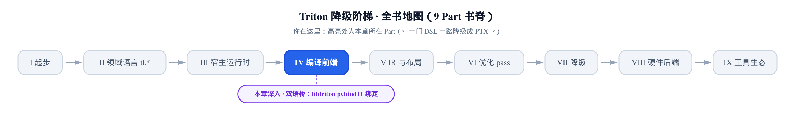
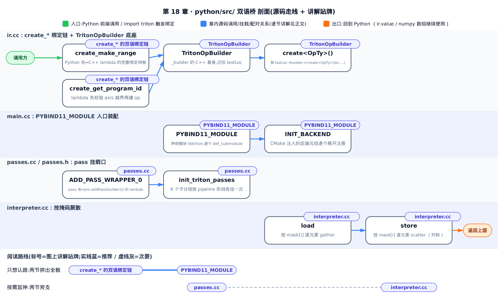
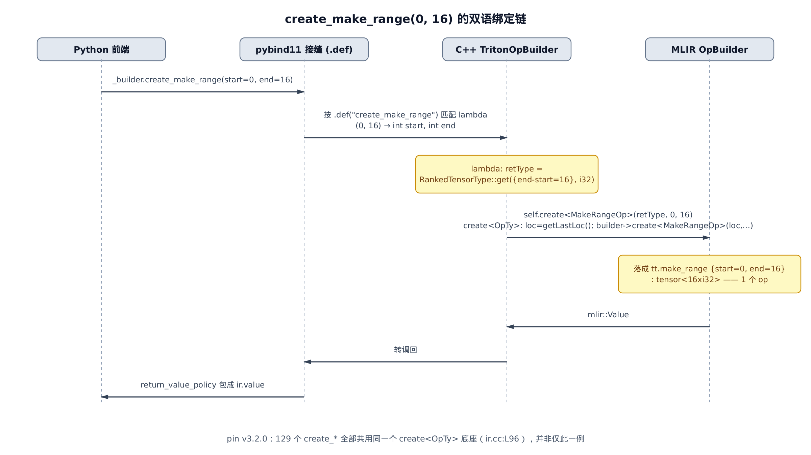
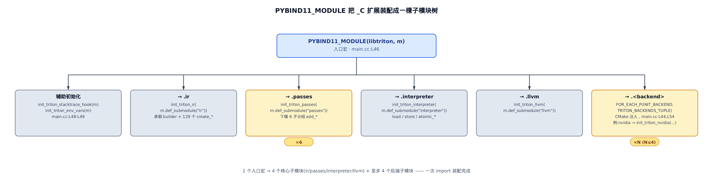

# 双语桥：libtriton 的 pybind11 绑定层



- 上一章把 Python 的 `if`/`for` 翻成了 MLIR 的结构化控制流。
- 这一章往下挖一层：那些 `_builder.create_*` 调用的 C++ 真身。
- 下一章起进入 Part V，开始逐个认识 `tt.*` 方言算子。

从 Part II 的 `tl.arange` 到 Part IV 的控制流下降，你在正文里见过无数次 `self.builder.create_xxx(...)`——`create_make_range`、`create_dot`、`create_load`……它们像一排贴着标签的按钮，按一下，MLIR 图上就多出一个 op。但按钮背后是什么？`create_make_range` 这个 Python 方法，到底在哪段 C++ 代码里落地？

这一章不给你新的性能旋钮。它给你一副透视镜：**看穿 Python 与 C++ 之间那道最贴身的接缝**。搞清楚这道缝，你在读栈回溯、调 `TRITON_INTERPRET`、或者好奇「我这一行 `tl.load` 到底建出了什么」时，就知道该往哪儿看。这是 Part IV 的收尾——把前面几章反复借用的「前端建 op」这件事，坐实到 `python/src/` 里那几百行 C++。

> 只想认路：读完前三节——[create_* 的双语绑定链](#create_-的双语绑定链)、[TritonOpBuilder：_builder 的 C++ 真身](#tritonopbuilder_builder-的-c-真身)、[PYBIND11_MODULE：一次-import-装配整个-_c-扩展](#pybind11_module一次-import-装配整个-_c-扩展)——即可拼出全貌；`passes.cc` 与 `interpreter.cc` 两节是往两侧的延伸，可按需跳读。



图上这条路线和上面这句选读指引说的是同一件事：核心走 §1–§3 三站就拼出全貌，`passes.cc`、`interpreter.cc` 是图两侧的延伸站，对照文字指引按需跳读。

`python/src/` 这个目录，是整个 Triton 里唯一一处 Python 与 C++ 平起平坐、逐字对话的地方。往上是纯 Python 的前端（追踪、AST 遍历），往下是纯 C++/MLIR 的编译器。这一层的工具叫 **pybind11**——一个把 C++ 类和函数直接暴露成 Python 可调对象的绑定库。它把 C++ 世界的 `TritonOpBuilder` 变成你在 Python 里拿到的 `_builder`，把 C++ 的一个 lambda 变成 Python 里的 `create_make_range`。

---

## create_* 的双语绑定链

### 直觉：一扇翻译窗口

把 `create_make_range` 想成一扇翻译窗口。

Python 这边递进去一张字条：「我要一段 `0..16` 的整数序列」——字条上就写着两个数字，`0` 和 `16`。窗口后面坐着一位 C++ 职员（那段 lambda），照章办事：算出「这要装进一个能放 16 个 `i32` 的盒子」，然后在正在搭的 MLIR 图纸上盖一个 `tt.make_range` 印章，再把印章编号（一个值）从窗口递回来。

窗口本身只干一件事：把字条上的字从 Python 话翻成 C++ 话，把回执从 C++ 话翻回 Python 话。真正建 op 的活，是窗口后面那位职员。前几章你反复写的每一个 `create_xxx`，都是这样一扇窗口。

下图把这次调用穿过的四条泳道摊开——从 Python 前端，经 pybind11 接缝，到 C++ 的 `TritonOpBuilder`，最终落到 MLIR：



### 机制：一次调用，逐层看它变成什么

拿最常见的一次调用做麻雀：`_builder.create_make_range(0, 16)`。这里的 `16` 就是 Part II 里 `tl.arange(0, BLOCK)` 最常见的 `BLOCK` 取值；`end - start = 16 > 0`，是个非退化区间，会实打实算出一个非空的张量类型，不触发 `start == end` 的空区间边角。

下面把这次调用逐层拆开：每一层做了什么、关键标量是多少、产物去哪、对应哪行源码。

<!-- trace: m1-create-star-binding -->

| 层 | 动作 | 关键标量 | 产物/去向 | 源码锚 |
|---|---|---|---|---|
| ① Python 前端 | `_builder.create_make_range(0, 16)` | `start=0, end=16` | 调 `_builder`（其类型即下节要讲的 `ir.builder`）上名为 `create_make_range` 的方法 | — |
| ② pybind11 派发 | 按 `.def("create_make_range", …)` 的方法名匹配到对应 C++ lambda，把 `(0,16)` 转成 `int start` / `int end` | `start=0, end=16` | 进入 lambda 体，签名即 Python 调用签名 | `ir.cc:L883-884` |
| ③ lambda 算返回类型 | `RankedTensorType::get({end-start}, getI32Type())` → `{16-0}={16}`，元素 `i32` | `shape=[16], dtype=i32`（32 位） | `retType = tensor<16xi32>` | `ir.cc:L885-886` |
| ④ 落到公共底座 | `self.create<MakeRangeOp>(retType,0,16)`；`create<OpTy>` 先 `getLastLoc()` 取 loc，再 `builder->create<MakeRangeOp>(loc,retType,0,16)` | `loc=lastLoc`（单一来源，1 个） | 在当前插入点建出 1 个 MLIR op | `ir.cc:L887 → L96-99` |
| ⑤ MLIR op 产出 | `MakeRangeOp` 落成 | `start=0, end=16` | `tt.make_range {start=0:i32, end=16:i32} : tensor<16xi32>` | — |
| ⑥ 返回 Python | 结果 `mlir::Value` 按 `return_value_policy` 包成 `ir.value` | 1 个 value | Python 侧拿到 `ir.value` 继续追踪 | `ir.cc:L884` |

几个术语一次说清：**op** 是 MLIR 里的一条指令节点（前面几章见过的 `tt.make_range`、`tt.dot` 都是 op）；**loc**（location）是这条 op 的源码位置标签，用于报错和调试时把 IR 回指到你写的哪一行 Python；**`RankedTensorType`** 是「带秩的张量类型」，`get({16}, i32)` 就是「16 个 `i32` 元素的一维张量」；**`return_value_policy`** 是 pybind11 决定返回值怎么交回 Python（拷贝还是引用）的策略。**`ir.value`** 就是前几章你在追踪期反复传来传去的那个 SSA 值句柄。

**不变量**：一次 `create_*` 调用，恰好在图上建出 1 个 op，且这个 op 的 loc 恒等于调用时刻的 `lastLoc`——不多、不少、来源唯一。

为什么敢这么说？看第 ④ 层落到的公共底座——这个底座的两行定义，**下一节**马上贴出：它的函数体只有两行，先取一次 `lastLoc`、再转调一次 `builder->create`，没有循环、没有条件分支。所以「进一次底座 ↔ 出一个 op」是严格的一对一，且每个 op 的 loc 必然等于取值那一刻的 `lastLoc`。上层几百个 `create_*` lambda 各自只是算好参数后调一次这个底座，动不了这个一对一关系。

### 源码：`.def` 麻雀的每一根骨头

先看这扇窗口是怎么「挂」上去的。pybind11 用 `py::class_<T>` 声明一个 Python 类，然后链式 `.def(...)` 一个个把 C++ 方法挂成 Python 方法：

```cpp
# python/src/ir.cc:L584-L591
  py::class_<TritonOpBuilder>(m, "builder", py::module_local(),
                              py::dynamic_attr())
      .def(py::init<MLIRContext *>())
      // getters
      .def("create_module",
           [](TritonOpBuilder &self) -> ModuleOp {
             return self.create<ModuleOp>();
           })
```

`py::class_<TritonOpBuilder>(m, "builder", …)` 这行的意思是：把 C++ 的 `TritonOpBuilder` 类，暴露成 Python 侧名叫 `builder` 的类——这就是你写 `triton._C.libtriton.ir.builder` 拿到的东西，也就是 `_builder` 背后的类型。紧跟的每一个 `.def("方法名", lambda)`，都往这个类上挂一个方法。第一个 `.def` 挂的是 `create_module`，往后还链着几百个同构的 `create_*`。（`py::module_local()` 让绑定只在本扩展可见，`py::dynamic_attr()` 允许给 `builder` 对象动态挂属性——都是 pybind11 的类选项，知道用途即可。）

再看那扇 `create_make_range` 窗口的完整样子：

```cpp
# python/src/ir.cc:L883-L888
      .def("create_make_range",
           [](TritonOpBuilder &self, int start, int end) -> Value {
             auto retType = RankedTensorType::get(
                 {end - start}, self.getBuilder().getI32Type());
             return self.create<MakeRangeOp>(retType, start, end);
           })
```

一根一根拆：

- **`.def` 第一参 `"create_make_range"`**——这就是 Python 侧看到的方法名。上面表格第 ② 层「按方法名匹配」匹配的正是它。
- **第二参那段 lambda**——它的签名 `(TritonOpBuilder &self, int start, int end) -> Value` 就是 Python 调用的签名：`self` 对应 `_builder` 本身，`start`/`end` 对应你传的 `0` 和 `16`，返回一个 `Value`（回到 Python 就是 `ir.value`）。pybind11 负责把 Python 的两个整数转成 C++ 的两个 `int`，再把返回的 `Value` 包回 Python。
- **lambda 体第一句**——`RankedTensorType::get({end - start}, …I32Type())`，算出返回类型 `tensor<16xi32>`。这是表格第 ③ 层。
- **lambda 体第二句**——`self.create<MakeRangeOp>(retType, start, end)`，把活交给公共底座。这是第 ④ 层的入口。

注意：算返回类型、建什么 op、传什么参数，全写在这一小段 lambda 里。所以「一个 `create_*` = 一段手写 lambda」，而不是宏批量生成的。为什么不用宏省事？因为各个 `create_*` 差异太大——有的要算张量类型，有的要做参数校验，有的要从操作数反推返回类型。手写 lambda 比宏更直白、能逐个塞不同的逻辑。看第二个样板就懂了：

```cpp
# python/src/ir.cc:L1405-L1410
      .def("create_get_program_id",
           [](TritonOpBuilder &self, int axis) -> Value {
             if (axis < 0 || axis > 3)
               throw pybind11::index_error("program_id must be in [0,3]");
             return self.create<GetProgramIdOp>(axis);
           })
```

这段 lambda 里多了一步参数校验：`axis` 越界就抛 `pybind11::index_error`——回到 Python 侧，它自动变成一个 `IndexError`。这是 pybind11 内置的异常映射机制：`index_error`、`key_error`、`value_error` 等一批预置的 C++ 异常类型，各自绑定着一个确定的 Python 异常（`index_error` 绑定的正是 `IndexError`），pybind11 为每个绑定方法生成的统一 catch 逻辑一旦捕获到这类异常就自动转换成对应的 Python 异常抛出，不需要写任何额外的转换代码。这就是 Part I 里 `tl.program_id(axis)` 传了个非法轴号时，你在 Python 拿到 `IndexError` 的出处。校验通过才 `self.create<GetProgramIdOp>(axis)` 建 op。同一个「Python 名 ↔ C++ lambda ↔ `self.create<XxxOp>`」的骨架，塞进了不同的血肉。

至于「几百个 `create_*` 到底有多少个」，`ir.cc` 里数一下 `.def("create_...")` 的行数：pin 的这一版是 **129** 个。它们全部落到同一个底座——下一节的主角。

---

## TritonOpBuilder：`_builder` 的 C++ 真身

### 直觉：一位带记忆的助手

上一节反复提到「公共底座」`self.create<...>`。它是 `TritonOpBuilder` 这个类身上的一个方法。而 `TritonOpBuilder` 本身，就是你在 Python 里握着的 `_builder` 的 C++ 真身。

它不是 MLIR 原生的类。MLIR 自带一个 `OpBuilder`（建 op 的原生工具），但原生 `OpBuilder` 每次建 op 都要你亲手报一遍「这条 op 对应源码哪一行」（那个 loc）——几百个 `create_*` 谁都不想操心这件事。于是 Triton 在外面套了一层：`TritonOpBuilder` 是一位**带记忆的助手**，它替你记住最近一次的源码位置 `lastLoc`（最近一次设定的 loc），建 op 时自动补上。这就是为什么上一节那 129 个 lambda 里，没有一个需要显式传 loc。

### 机制：把 loc 从每个 lambda 里省掉

看这层「套子」的定义头：

```cpp
# python/src/ir.cc:L40-L48
// A custom op builder that keeps track of the last location
class TritonOpBuilder {
public:
  TritonOpBuilder(MLIRContext *context) {
    builder = std::make_unique<OpBuilder>(context);
    lastLoc = std::make_unique<Location>(builder->getUnknownLoc());
  }

  OpBuilder &getBuilder() { return *builder; }
```

构造时它做两件事：捏一个 MLIR 原生 `OpBuilder` 揣兜里（`builder`），再把 `lastLoc` 初始化成「未知位置」。往后每追踪到一行 Python 源码，前端就更新一次 `lastLoc`；建 op 时这个记忆就派上用场。（类里还有一批 `setLastLoc`/`setInsertionPoint*` 方法只是转调内部 `builder` 并同步 `lastLoc`，读者知道「它帮你记住插入点和源码位置」即可。）

记忆怎么用？就在那个所有 `create_*` 共享的模板底座里：

```cpp
# python/src/ir.cc:L96-L99
  template <typename OpTy, typename... Args> OpTy create(Args &&...args) {
    auto loc = getLastLoc();
    return builder->create<OpTy>(loc, std::forward<Args>(args)...);
  }
```

两行，就是上一节不变量的证据。第一行 `auto loc = getLastLoc()`——loc 唯一来自 `lastLoc` 这一个字段，来源唯一。第二行 `builder->create<OpTy>(loc, …)`——把记住的 loc 补到最前面，转调 MLIR 原生的建 op，一次。`create<MakeRangeOp>`、`create<GetProgramIdOp>`、`create<DotOp>`……不管 `OpTy` 是谁，全都走这两行。无循环、无分支，所以「进一次 ↔ 出一个 op」严格成立。因此：只要建 op，就一定经过这两行——loc 必然来自 `lastLoc`，不存在绕过记忆、裸传 loc 的 `create_*`。

这层套子还连着一个开关：类里有个 `lineInfoEnabled` 字段，由环境变量 `TRITON_DISABLE_LINE_INFO` 控制。关掉它，op 就不挂真实行号——某些场景下想让编译产物不带源码位置信息时用得上。这也说明「记住 loc」这件事，本身就是这层自定义 builder 存在的理由。

小结这两节：Python 侧的 `_builder`，是 C++ 的 `TritonOpBuilder` 实例；你调的每个 `create_*`，是它身上的一个 lambda 方法；每个 lambda 最后都落到 `create<OpTy>` 这个共享底座，一次调用换来一个 op。**这就是全书最贴身的那道双语接缝的全部机制**——接下来的问题是：`_builder` 这个 Python 对象，连同 `passes`、`interpreter`，是怎么被装配起来、让 `import triton` 之后就能用的？

---

## PYBIND11_MODULE：一次 import 装配整个 _C 扩展

### 直觉：合上一排闸刀

前面讲的 `ir.builder`，全名是 `triton._C.libtriton.ir.builder`。这个 `_C` 是什么？它是编译好的那个 C++ 扩展——磁盘上的 `libtriton.so`。**pybind11** 提供一个入口宏 `PYBIND11_MODULE`，它是整栋楼的总配电箱：`import triton` 触发它一次，函数体像合上一排闸刀——`ir` / `passes` / `interpreter` / `llvm` 各点亮一个楼层（子模块），最后再把编译时缝进来的后端各点一盏。

点完，Python 侧的 `triton._C.libtriton.ir`、`.passes`、`.interpreter`、`.llvm`、`.<backend>` 就全部通电可用。`_C` 扩展的内容，就这么多。

下图是这棵装配树的全貌：



### 机制与源码：一个入口宏，逐个 `def_submodule`

整个装配入口就这一段：

```cpp
# python/src/main.cc:L38-L55
void init_triton_env_vars(pybind11::module &m);
void init_triton_ir(pybind11::module &&m);
void init_triton_llvm(pybind11::module &&m);
void init_triton_interpreter(pybind11::module &&m);
void init_triton_passes(pybind11::module &&m);
void init_triton_stacktrace_hook(pybind11::module &m);
FOR_EACH_P(DECLARE_BACKEND, TRITON_BACKENDS_TUPLE)

PYBIND11_MODULE(libtriton, m) {
  m.doc() = "Python bindings to the C++ Triton API";
  init_triton_stacktrace_hook(m);
  init_triton_env_vars(m);
  init_triton_ir(m.def_submodule("ir"));
  init_triton_passes(m.def_submodule("passes"));
  init_triton_interpreter(m.def_submodule("interpreter"));
  init_triton_llvm(m.def_submodule("llvm"));
  FOR_EACH_P(INIT_BACKEND, TRITON_BACKENDS_TUPLE)
}
```

`PYBIND11_MODULE(libtriton, m)` 声明模块名叫 `libtriton`，`m` 是它的句柄。函数体里每一行 `init_triton_xxx(m.def_submodule("xxx"))` 干的是同一件事：`m.def_submodule("ir")` 建一个名叫 `ir` 的子模块，再把它交给 `init_triton_ir` 去填充。这四行——`ir`、`passes`、`interpreter`、`llvm`——就是 Python 侧 `triton._C.libtriton.<sub>` 那四个命名空间的来历。上一节讲的 `py::class_<TritonOpBuilder>("builder")`，正是 `init_triton_ir` 往 `ir` 子模块里挂的东西之一。

`def_submodule` 是关键动词：它把庞大的 C++ API 面按职责切成一层层 Python 命名空间。前端要建 op 就找 `.ir`，要挂 pass 就找 `.passes`，要走解释器就找 `.interpreter`——各取所需。

最后那行 `FOR_EACH_P(INIT_BACKEND, TRITON_BACKENDS_TUPLE)` 处理后端。看这两个宏：

```cpp
# python/src/main.cc:L34-L36
#define DECLARE_BACKEND(name) void init_triton_##name(pybind11::module &&m);

#define INIT_BACKEND(name) init_triton_##name(m.def_submodule(#name));
```

`INIT_BACKEND(nvidia)` 展开后就是 `init_triton_nvidia(m.def_submodule("nvidia"))`——和上面那四行核心子模块一模一样的套路，只是名字换成后端名。`FOR_EACH_P(...)` 是把 `TRITON_BACKENDS_TUPLE` 元组里每个后端名各套一遍这个宏。而 `TRITON_BACKENDS_TUPLE` 这个元组，是 **CMake 在编译期注入**的——`libtriton.so` 缝进哪些后端，编译时就钉死了，不是运行期扫插件。这也正是全书开篇讲过的「[最多 4 个后端](../../ch01-what-is-triton/narrative/chapter.md)」那条硬边界的由来：`FOR_EACH_P` 这套逐参展开的宏，只实现到 4 元。（`FOR_EACH_P` 宏本体在[开篇那一章](../../ch01-what-is-triton/narrative/chapter.md)已内嵌讲过，这里不重述宏机制。）

一句话收束这棵树：**一个 `PYBIND11_MODULE` 入口宏，闸下 4 个核心子模块加至多 4 个后端子模块**。Python 侧 `triton._C.libtriton.<sub>` 的每一层，都对得上 `main.cc` 里的一行 `def_submodule`。想反过来验证也不难——`import triton` 之后 `dir(triton._C.libtriton.ir.builder)` 能看到 `create_make_range` 这些方法名，`triton._C.libtriton.passes.ttir` 能看到 `add_combine`，正好和 `.cc` 里的 `.def` / `ADD_PASS_WRAPPER` 名字对上。

---

## passes.cc：pass 从 Python 被挂上的那个口

`passes` 子模块和 `ir` 结构一样，只是挂的不是 `create_*` 而是 `add_*`。但这里有个容易误会的点，值得单独点破：**`add_*` 是往流水线上挂零件的挂钩，不是按启动键。**

机制的核心是一个宏：

```cpp
# python/src/passes.h:L1-L2
#define ADD_PASS_WRAPPER_0(name, builder)                                      \
  m.def(name, [](mlir::PassManager &pm) { pm.addPass(builder()); })
```

`ADD_PASS_WRAPPER_0(name, builder)` 把一个 pass 名绑成一段 lambda：这段 lambda 收到一个 `PassManager`（MLIR 的 pass 流水线管理器，简称 `pm`），就调 `pm.addPass(builder())`，把 pass **挂**进流水线——仅此而已。`builder()` 造出一个 pass 对象，`addPass` 把它排进队列。注意：pass 的逻辑一行都没跑。真正开机是后面 `pm.run()` 的事——那属于[编译主循环](../../ch14-compile-driver-loop/narrative/chapter.md)，不在这一层。

所以 Python 侧写 `passes.ttir.add_combine(pm)`，含义精确到「把 combine 这个零件挂到传送带上」，不是「运行 combine」。看这批挂载口按编译阶段的分组（这是 `ttir` 阶段那一组）：

```cpp
# python/src/passes.cc:L36-L46
void init_triton_passes_ttir(py::module &&m) {
  using namespace mlir::triton;
  ADD_PASS_WRAPPER_0("add_combine", createCombineOpsPass);
  ADD_PASS_WRAPPER_0("add_reorder_broadcast", createReorderBroadcastPass);
  ADD_PASS_WRAPPER_0("add_rewrite_tensor_pointer",
                     createRewriteTensorPointerPass);
  ADD_PASS_WRAPPER_0("add_loop_unroll", createLoopUnrollPass);
  ADD_PASS_WRAPPER_4("add_convert_to_ttgpuir",
                     createConvertTritonToTritonGPUPass, const std::string &,
                     int, int, int);
}
```

每行 `ADD_PASS_WRAPPER_0("add_combine", createCombineOpsPass)` 就是一个挂载口：Python 侧 `passes.ttir.add_combine(pm)` ↔ C++ 侧把 `createCombineOpsPass()` 造的 pass 挂上。（末尾 `ADD_PASS_WRAPPER_4` 只是多带几个参数的变体，机制同构。）这些 pass 内部到底做什么——combine 怎么合并算子、convert 怎么把 `tt.*` 降到 `ttg.*`——是 Part V 到 Part VIII 一整段旅程的主题，这里只认「挂载口」，不拆内部。

这些分组本身也用 `def_submodule` 装配。整个 `passes` 子模块的骨架是：

```cpp
# python/src/passes.cc:L95-L102
void init_triton_passes(py::module &&m) {
  init_triton_analysis(m.def_submodule("analysis"));
  init_triton_passes_common(m.def_submodule("common"));
  init_triton_passes_convert(m.def_submodule("convert"));
  init_triton_passes_ttir(m.def_submodule("ttir"));
  init_triton_passes_ttgpuir(m.def_submodule("ttgpuir"));
  init_triton_passes_llvmir(m.def_submodule("llvmir"));
}
```

6 个子分组——`analysis`、`common`、`convert`、`ttir`、`ttgpuir`、`llvmir`——按编译 pipeline 的阶段切开。前端在编译时按阶段取用对应的 `add_*`，把一条 pass 流水线拼出来。这就是「pass 怎么从 Python 被挂上」的全部答案：一层 `def_submodule` 分组 + 一个 `ADD_PASS_WRAPPER` 宏。

---

## interpreter.cc：按掩码聚散的一瞥

最后往另一侧的缝看一眼。当你设 `TRITON_INTERPRET=1`（Part III 讲过的解释器模式），`tl.load`/`tl.store` 不再建 op，而是掉进 `interpreter.cc` 这段纯 CPU 代码。这里只作 C++ 侧的一瞥，解释器的整体机理（AST 重写、逐 grid 执行等）已在[解释器那一章](../../ch13-triton-interpret/narrative/chapter.md)讲过。

看 `load` 的实现：

```cpp
# python/src/interpreter.cc:L330-L350
  m.def("load",
        [](py::array_t<uint64_t> ptr, py::array_t<bool> mask, py::array other,
           py::dtype ret_dtype) -> py::array {
          int numel = ptr.size();
          auto shape =
              std::vector<ptrdiff_t>(ptr.shape(), ptr.shape() + ptr.ndim());
          py::array ret(ret_dtype, py::array::ShapeContainer{numel});
          py::array_t<uint64_t> reshaped_ptr = ptr.reshape({numel});
          py::array_t<bool> reshaped_mask = mask.reshape({numel});
          py::array reshaped_others = other.reshape({numel});
          for (size_t i = 0; i < ptr.size(); ++i) {
            if (reshaped_mask.at(i))
              memcpy(ret.mutable_data(i),
                     reinterpret_cast<void *>(reshaped_ptr.at(i)),
                     ret_dtype.itemsize());
            else
              memcpy(ret.mutable_data(i), reshaped_others.data(i),
                     ret_dtype.itemsize());
          }
          return ret.reshape(shape);
        });
```

它收三个等长的 numpy 数组：`ptr`（每个元素是一个内存地址）、`mask`（每个元素是真/假）、`other`（掩码为假时的兜底值）。然后逐元素扫一遍，像挨个查快递柜：`mask[i]` 为真，就从 `ptr[i]` 指向的地址 `memcpy` 一个元素回来——这叫 **gather（按掩码聚集）**；为假，就从 `other[i]` 取兜底值。这正是 `TRITON_INTERPRET=1` 下 `tl.load` 的 C++ 真身。

对称地，`store` 是 **scatter（按掩码散布）**：`mask[i]` 为真才把值 `memcpy` 写回 `ptr[i]`。这个「按掩码逐元素聚散」的直觉，和解释器那一章的 gather/scatter 图是同一幅画。这里点到即止——这段代码在这道双语缝里的角色，就是「Python 的 `m.def("load", …)` ↔ C++ 的这段 numpy 循环」，和 `create_*`、`add_*` 是同一个 pybind11 机制的又一个实例。

---

## 小结：三种绑定，同一台机器

这一章把 `python/src/` 那道双语缝拆到了底。收回来看，它其实只有一个机制、三副面孔：

- **`create_*`**（`ir.cc`）——`.def("方法名", lambda)`，lambda 里 `self.create<XxxOp>` 建一个 op。你写的每一行 `_builder.create_xxx` 走的是这条。
- **`add_*`**（`passes.cc`）——`ADD_PASS_WRAPPER` 宏，lambda 里 `pm.addPass` 挂一个 pass，只挂不跑。
- **`load`/`store`**（`interpreter.cc`）——`m.def("load", lambda)`，lambda 里按掩码逐元素聚散。

三者都是 pybind11 的 `.def(name, callable)`：`name` 是 Python 属性名，`callable`（一段 C++ lambda）负责参数从 Python 转成 C++、干活、返回值再包回 Python。认得这一条，`create_*` / `add_*` / `load` 全是同一台机器的不同工件。而把它们装到一起、让 `import triton` 之后就能用的，是 `main.cc` 里那一个 `PYBIND11_MODULE` 入口，闸下几个 `def_submodule`。

更重要的是那条贯穿始终的分界线：**Python 描述，C++/MLIR 执行**。`create_*` 只建一个 op、不算一个数；`add_*` 只挂一个 pass、不跑一遍；`load` 才是真动内存的地方。这就是「双语桥」这个名字的分量——桥的一头是意图，另一头是执行，缝就在 `.def` 那一行。

到这里，Part IV 的前端旅程收尾了：从追踪期建 op，到控制流下降，再到这道把 Python 意图翻成 C++ op 的接缝。而每一次 `create_*` 建出的那个 op——`tt.make_range`、`tt.dot`、`tt.load`——到底是什么、带着哪些语义承诺，我们一直没细看。[下一章](../../ch19-tt-dialect-vocabulary/narrative/chapter.md)起进入 Part V，翻开 `tt.*` 方言的词汇表，学会读懂任意一段 TTIR dump。
