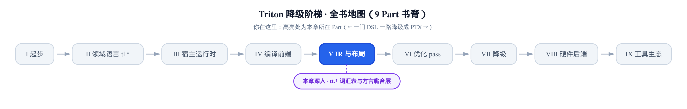
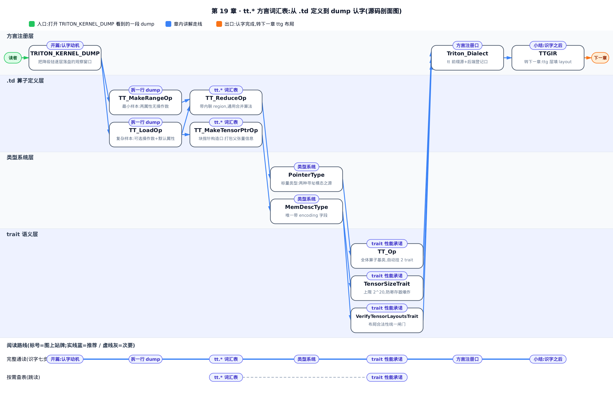
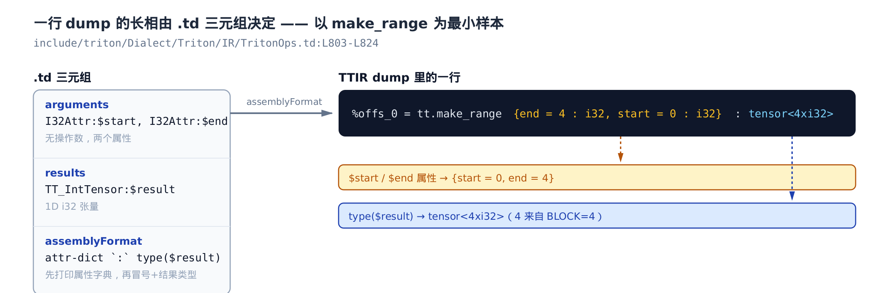
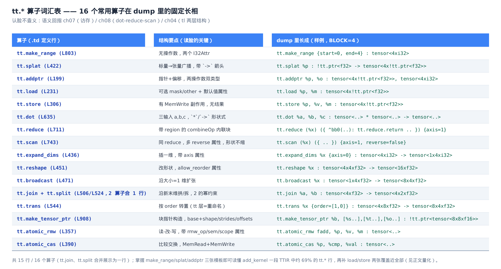
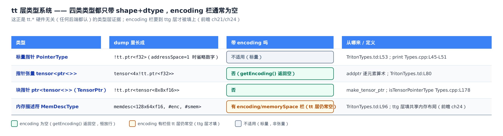
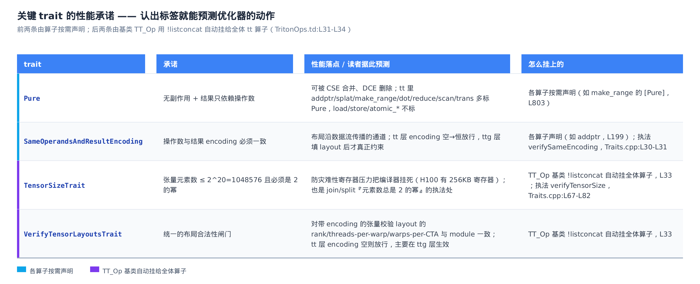

# tt.\* 方言词汇表：读懂任何一段 IR dump 的入门词典

> **你在这里**：Part V「IR 与布局」开篇。
> 前面几章都在 Python 前端打转。
> 本章第一次切进 MLIR/C++ 层，教你读 dump。
> 认得 IR 长相，才谈得上看它找性能问题。



打开 `TRITON_KERNEL_DUMP`（把降级链逐层落盘的环境变量，前面几章的公共观察窗口），第一件砸到脸上的东西就是一大段 MLIR（Multi-Level IR，多级中间表示——Triton 用它表示各级 IR）文本：

```
%offs_0 = tt.make_range {end = 4 : i32, start = 0 : i32} : tensor<4xi32>
%x = tt.splat %x_ptr : !tt.ptr<f32> -> tensor<4x!tt.ptr<f32>>
%x_4 = tt.addptr %x, %offs_2 : tensor<4x!tt.ptr<f32>>, tensor<4xi32>
%x_5 = tt.load %x_4, %mask_3 : tensor<4x!tt.ptr<f32>>
```

（为先聚焦 `tt.*` 本身，这里略去了中间计算 `%offs_1`/`%offs_2`、`%mask_3` 的几行 `arith.*` 算术——所以上面 `%offs_2`/`%mask_3` 看着像没定义就被用了；下文表格同理，这段 TTIR 的完整行数本节末尾会交代。）

看不懂它，后面所有「看 IR 找性能问题」的话都无从谈起——合并访存有没有发生、哪个冗余 op 该被消掉、循环流水了几级，全写在这些行里。这一章不教新语义（那些前面都讲透了），只教一件事：**认字**。把上面每一行拆回「谁、干什么、什么类型」，就像认得超市小票的排版就能读任何一张小票。

先给一个立竿见影的例子。这段 dump 里所有 `tt.*` 算子都悄悄扛着一条硬约束：张量元素数不得超过 `1048576`。这个数不是随口定的——

```cpp
# include/triton/Dialect/Triton/IR/Traits.h:L16-L23
// The rationale for this trait is to prevent users from creating programs
// that would have catastrophic register pressure and cause the compiler to
// hang.
// Since H100 has 256KB registers, we should allow users to create tensors
// of size up to 256K elements. It will spill for datatypes wider than 1B,
// but we probably should limit number of elements (rather than bytes) to
// keep specs simple
int constexpr maxTensorNumElements = 1048576;
```

`1048576` = `` $`2^{20}`$ ``。注释把动机写得明明白白：张量太大 → 灾难性寄存器压力 → 编译器挂死；H100 一共 256KB 寄存器，所以把上限钉在 256K 个元素。你写 kernel 时 `BLOCK_SIZE` 乘起来一旦逼近这个数，别怪编译器变慢或报错——它是 IR 层替你设的护栏。**看得懂 dump，就看得见这类护栏。** 这就是识字课的意义：本章带你把 `tt.*` 这门小语言的常用词、类型、以及贴在算子上的性能标签，一个个认全。

`tt` 是 Triton 最上层、硬件无关的 IR 方言（dialect，一门子语言的算子与类型的集合），也叫 TTIR（Triton IR）。它的张量只有形状和 dtype、几乎不带任何「数据在硬件上怎么摆」的信息——所以任何后端都认它。这一层长什么样、为什么这么设计，是接下来布局那几章的地基。



只想查表认脸——遇到一个不认识的 `tt.*` 算子、或想知道某条 trait 意味着什么——直接跳「`tt.*` 词汇表：认脸不查义」节和「trait 的性能承诺：认标签预测优化器」节；想跟着「打开 dump→认第一行→顺藤摸瓜」的完整顺序读完全部六节，从下面「一行 dump 长什么样」开始往后读到小结。

## 一行 dump 长什么样：`.td` 三元组

**直觉。** 每个 `tt.*` 算子在 dump 里都长成一个固定格式：`%结果 = tt.算子 操作数 {属性} : 类型`。各栏怎么排、什么时候出现，不是印出来时临时决定的，而是这个算子的**定义文件**里写死的一张「排版模板」。认得模板，就能把任意一行 dump 正反解析：正着念，模板 → dump 行；倒着念，dump 行 → 操作数/属性/类型。

Triton 的算子定义写在 TableGen（`.td`，MLIR 用来声明式生成算子样板代码的 DSL）文件里。每个算子的长相由三样东西决定：

- `arguments`（ins）：输入——操作数 + 属性；
- `results`（outs）：输出结果；
- `assemblyFormat`：打印/解析这一行的模板。

最好的入门样本是 `make_range`，因为它结构最小——没有操作数，只有两个属性：

```cpp
# include/triton/Dialect/Triton/IR/TritonOps.td:L803-L824
def TT_MakeRangeOp : TT_Op<"make_range", [Pure]> {
    let summary = "make range";

    let description = [{
        Returns an 1D int32 tensor.

        Values span from $start to $end (exclusive), with step = 1
    }];

    // WARNING: MLIR generates getStart()/getEnd() functions which return
    // uint32_t, even though these arguments are to be interpreted as *signed*
    // int32 values.  If this matters, use get{Start,End}Attr().getInt(), which
    // return int64_t.
    let arguments = (ins I32Attr:$start, I32Attr:$end);

    let results = (outs TT_IntTensor:$result);

    let assemblyFormat = "attr-dict `:` type($result)";

    let hasFolder = 1;
    let hasVerifier = 1;
}
```

逐段读（`TT_Op<"make_range", [Pure]>` 方括号里的 `Pure` 是贴在算子上的一种许可标签（trait，「trait 的性能承诺」一节专讲），连同末尾的 `hasFolder`/`hasVerifier` 这里都先跳过，只看排版三元组）：`arguments` 是 `(ins I32Attr:start, I32Attr:end)`——两个 32 位整数属性 start／end，**没有操作数**。`results` 是 `(outs TT_IntTensor:result)`——结果是一维 i32 张量。`assemblyFormat` 是 `attr-dict : type(result)`——先打印属性字典（attr-dict），再一个字面冒号，再结果类型。于是 dump 里它必然长成：

```
%offs_0 = tt.make_range {end = 4 : i32, start = 0 : i32} : tensor<4xi32>
```

`{end = 4, start = 0}` 就是 `attr-dict`，`tensor<4xi32>` 就是 `type($result)`，那个 `4` 来自 kernel 里 `BLOCK=4` 这个常量。下面这张图把这条「三元组 → dump 行」的映射画成一眼可核对的对照：



**机制：从最小样本逐步加操作数。** 把 `make_range` 当基例，往上叠三个算子，看模板每加一样东西、dump 行就多一栏。用一段真实的逐元素加 kernel（`add_kernel`，`BLOCK=4`）的 TTIR 做样本：

<!-- trace: m1-read-a-dump -->

| tt 算子 | `.td` arguments（ins） | `.td` results（outs） | assemblyFormat 模板 | dump 里长成（BLOCK=4） |
| --- | --- | --- | --- | --- |
| `make_range`（TritonOps.td:L803） | `I32Attr:start, I32Attr:end`（无操作数，两个属性） | `TT_IntTensor:result`（1D i32 张量） | `attr-dict : type(result)`（L820） | `%offs_0 = tt.make_range {end = 4 : i32, start = 0 : i32} : tensor<4xi32>` |
| `splat`（L422） | `TT_Type:src`（一个标量操作数） | `TT_Tensor:result` | `src attr-dict : type(src) -> type(result)`（L431） | `%x = tt.splat %x_ptr : !tt.ptr<f32> -> tensor<4x!tt.ptr<f32>>` |
| `addptr`（L199） | `TT_PtrLike:ptr, TT_IntLike:offset`（两个操作数） | `TT_PtrLike:result`（TypesMatchWith——类型相等谓词，下文详解——钉成与 ptr 同型） | `ptr , offset attr-dict : type(result) , type(offset)`（L209） | `%x_4 = tt.addptr %x, %offs_2 : tensor<4x!tt.ptr<f32>>, tensor<4xi32>` |
| `load`（L231） | `AnyTypeOf<[TT_PtrLike,TT_TensorPtr]>:ptr, Optional:mask/other` + 5 个默认值属性(cache/evict/…) | `TT_Type:result`（InferTypeOpInterface 推出） | `oilist(cache/evict…) ptr (, mask)? attr-dict : type(ptr)`（L281-L302） | `%x_5 = tt.load %x_4, %mask_3 : tensor<4x!tt.ptr<f32>>` |

从上到下读这张表，就是「模板加一样、dump 多一栏」的过程：`make_range` 无操作数 → `splat` 加一个操作数 src 和一个 `->` 箭头类型 → `addptr` 加到两个操作数、两段类型 → `load` 再加可选操作数（mask／other）和一串默认值属性。每一步，`assemblyFormat` 里多一个操作数占位符，dump 行里就多一栏对应的东西。

`splat`、`addptr` 的 `.td` 定义印证了这一点（下面 `addptr`／`load` 方括号里那串 trait，除本节要用的 `TypesMatchWith`、以及留到「trait 的性能承诺」一节细讲的 `Pure`/`SameOperandsAndResultEncoding` 外，其余几条——`Elementwise`/`SameOperandsAndResultShape`/`AttrSizedOperandSegments`/`DeclareOpInterfaceMethods<...>` 等——本章不展开，认得它们是贴在算子上的标签、先跳过即可）：

```cpp
# include/triton/Dialect/Triton/IR/TritonOps.td:L199-L211
def TT_AddPtrOp : TT_Op<"addptr",
                     [Pure,
                      Elementwise,
                      SameOperandsAndResultShape,
                      SameOperandsAndResultEncoding,
                      TypesMatchWith<"result type matches ptr type",
                                     "result", "ptr", "$_self">]> {
    let arguments = (ins TT_PtrLike:$ptr, TT_IntLike:$offset);

    let results = (outs TT_PtrLike:$result);

    let assemblyFormat = "$ptr `,` $offset attr-dict `:` type($result) `,` type($offset)";
}
```

`assemblyFormat` 里 ptr、offset 依次占位，所以 dump 里读成 `tt.addptr %x, %offs_2`；末尾的 `: type(result) , type(offset)` 决定了它打印两段类型 `tensor<4x!tt.ptr<f32>>, tensor<4xi32>`（`!tt.ptr<f32>` 是「指向 f32 的指针」，后面类型系统一节细讲）。trait 列表里那条 `TypesMatchWith`（一条 TableGen 谓词，声明两个类型槽必须相等、或经某个变换后相等，供 verifier（验证器，MLIR 对每个算子跑的合法性检查，后文细讲）在建 IR 时校验）在这里把 `result` 钉成与 `ptr` 同型——所以 `addptr` 的结果类型不必在 dump 里单独写出，由它推得。

`load` 是这套模板里最复杂的样本，专治「可选操作数 + 默认值属性」：

```cpp
# include/triton/Dialect/Triton/IR/TritonOps.td:L231-L258
def TT_LoadOp : TT_Op<"load", [
  SameLoadStoreOperandsAndResultShape,
  SameLoadStoreOperandsAndResultEncoding,
  AttrSizedOperandSegments,
  DeclareOpInterfaceMethods<MemoryEffectsOpInterface>,
  DeclareOpInterfaceMethods<InferTypeOpInterface>,
  TypesMatchWith<"result matches ptr type", "ptr", "result", "getPointeeType($_self)">,
  # … 省略：mask / other 的两条 TypesMatchWith 谓词 …
]> {
    let summary = "Load from a tensor of pointers or from a tensor pointer";

    let arguments = (
      ins
      AnyTypeOf<[TT_PtrLike, TT_TensorPtr]>:$ptr,
      Optional<TT_BoolLike>:$mask,
      Optional<TT_Type>:$other,

      DefaultValuedAttr<DenseI32ArrayAttr, "::llvm::ArrayRef<int32_t>{}">:$boundaryCheck,
      OptionalAttr<TT_PaddingOptionAttr>:$padding,
      DefaultValuedAttr<TT_CacheModifierAttr, "::mlir::triton::CacheModifier::NONE">:$cache,
      DefaultValuedAttr<TT_EvictionPolicyAttr, "::mlir::triton::EvictionPolicy::NORMAL">:$evict,
      DefaultValuedAttr<BoolAttr, "false">:$isVolatile
    );

    let results = (outs TT_Type:$result);
    # … 省略：OpBuilder 与 assemblyFormat（用 oilist 让 cache/evict 顺序无关地打印成字符串）…
}
```

三处细节值得读者认脸：其一，ptr 的类型是 `AnyTypeOf<[TT_PtrLike, TT_TensorPtr]>`——`TT_PtrLike` 本身既含标量指针也含指针张量（正式定义见下一节），在张量访存场景下它取「指针张量」这一支，与 `TT_TensorPtr`（块指针）合起来，正是 `tt.load` 支持的两种寻址模态（语义见[第 7 章的访存](../../ch07-blocks-shape-and-memory-access/narrative/chapter.md)，本章只讲长相）。其二，mask／other 是 `Optional`，dump 里没写就是没传。其三，那五个可选属性（`boundaryCheck`/`padding`/`cache`/`evict`/`isVolatile`，多数带默认值、`padding` 是 `OptionalAttr`）只在偏离默认状态时才现身——所以样本里 `tt.load %x_4, %mask_3 : ...` 干干净净，什么属性都没打。结果类型不用手写，由 `InferTypeOpInterface`（一个「让算子自己推结果类型」的接口）经 `getPointeeType`（声明在 `include/triton/Dialect/Triton/IR/Types.h`）推出：把指针张量 `tensor<4x!tt.ptr<f32>>` 剥一层指针，得到 `tensor<4xf32>`。

**不变量：三元组 ↔ dump 行是双射。** 为什么「认得模板就能读任何一行」站得住？归纳地看：基例是 `make_range`，`assemblyFormat` 只有 `attr-dict : type(result)`，没有操作数占位，所以 dump 行完全由两个属性和结果类型决定，一一对应、无歧义。归纳步是——`assemblyFormat` 是一串有序指令，每个操作数占位符恰好绑定 `arguments`/`results` 里同名的一个槽，反引号里的字面字符原样打印；给算子加一个操作数，就在模板里加一个占位符指令，打印位置固定、解析可逆。于是从 `make_range` 一路加到 `load`，每一步都保持「槽 ↔ 指令」的双射，dump 行始终能由三元组唯一重建。

**这值多少？** 这段 `add_kernel` 的 TTIR 一共 13 行 `tt.*` 算子（`tt.splat`×5、`tt.addptr`×3、`tt.load`×2、`tt.make_range`×1、`tt.get_program_id`×1、`tt.store`×1），外加 5 行 `arith.*`。只要掌握 `make_range`/`splat`/`addptr` 三张模板，就能读懂其中 5+3+1=9 行——约占全部 `tt.*` 的 69%；再补上 `load`/`store` 两张，就覆盖到 12 行。剩下那行 `tt.get_program_id` 比 `make_range` 还简单：无操作数、一个 `axis` 属性、结果是标量 i32——认脸不需要专门的模板，一眼可认。至此这段 TTIR 没有一行是黑话了。识字成本 ≈ 记住几张排版模板。

## `tt.*` 词汇表：认脸不查义

**直觉。** 把 `tt.*` 当一门小语言的常用词表：每个算子在 dump 里都有一副固定长相——几个操作数、带不带内嵌代码块（region）、结果类型怎么写。认脸即可，语义不必每次回去查（访存类见[第 7 章](../../ch07-blocks-shape-and-memory-access/narrative/chapter.md)，`dot`/`reduce`/`scan` 见[第 8 章](../../ch08-dot-reduce-scan/narrative/chapter.md)，`tl.*` 前端两层结构见[第 4 章](../../ch04-tl-surface-and-constexpr/narrative/chapter.md)）。下面这张词汇表把 16 个常用算子的长相列全，写 kernel 时对着 dump 查即可：



上一节那条「三元组 → dump 行是双射」的结论，对下面词汇表里全部 16 个算子**同样成立**——`reduce`/`scan`/`trans`/`make_tensor_ptr` 结构再复杂，也只是操作数、属性、region 的数量与花色不同，拆法不变，不是要死记硬背的清单。region 在 `assemblyFormat` 里同样由一个占位符触发，跟操作数占位符是同一套「槽 ↔ 指令」双射机制的自然延伸，不是新规则。所以表里绝大多数算子读上一节那套模板就能拆开，这里只挑三个「长得不一样」的认脸。

**带 region 的算子：`reduce`/`scan`。** `dot`/`reduce`/`scan` 的语义[第 8 章](../../ch08-dot-reduce-scan/narrative/chapter.md)已讲透，本章只看它们在 IR 里长什么样。`reduce` 特别之处是带一个 region（本节开头已提到：MLIR 算子内部嵌的一段子代码块）：

```cpp
# include/triton/Dialect/Triton/IR/TritonOps.td:L711-L731
def TT_ReduceOp: TT_Op<"reduce",
                       [Pure,
                        SameOperandsShape,
                        SameOperandsEncoding,
                        SingleBlock,
                        DeclareOpInterfaceMethods<InferTypeOpInterface>]> {
    let summary = "Reduction using generic combination algorithm";
    let arguments = (ins Variadic<TT_Tensor>:$srcs, I32Attr:$axis);
    let results = (outs Variadic<TT_Type>:$result);
    let regions = (region SizedRegion<1>:$combineOp);
    # … 省略：builders / verifier / extraClassDeclaration …
}
```

`regions` 那一行（`region SizedRegion<1>:combineOp`）就是它长相特殊的根源：dump 里 `tt.reduce` 后面跟着一个 `({ ^bb0(...): tt.reduce.return ... })` 内联块（`^bb0(...)` 是 MLIR 基本块的标签写法，读作「这个 region 里的第一个基本块，参数是括号里那几个」——不必深究，认得它标志着一段内联代码块的起点即可），块里是那个逐元素二元合并函数——正是[第 8 章](../../ch08-dot-reduce-scan/narrative/chapter.md)讲的「通用合并算法」在 IR 里的样子。`Variadic<TT_Tensor>:srcs` 说明它支持多输入并行 reduce。`scan` 与 `reduce` 同构，只多一个 `reverse` 属性、且结果形状不缩（`Variadic<TT_Tensor>`），dump 里认脸方法一样。

**为布局章埋钩子的 `trans`。** `tt.trans`（转置）在这一层有个反直觉的性质，它的文档写得很清楚。下面这段注释会几次提到 encoding——这里先直观理解成「张量元素落在哪个 GPU 线程手里」的标签即可，它在类型系统里的正式位置下一节会给出：

```cpp
# include/triton/Dialect/Triton/IR/TritonOps.td:L557-L575
      ## Implementation note on encodings:

      In the TritonGPU dialect (and probably others), an encoding is chosen for
      this op's output so it's a nop from the perspective of code generation.

      For example, suppose tensor x has an encoding such that GPU thread [i,j,k]
      has a register containing element [i,j,k] of the tensor.  Now we transpose
      x with order [2,1,0], i.e. we reverse the order of its dimensions.  In
      TritonGPU, we will choose a layout for the output of the transpose so that
      GPU thread [i,j,k] has element [k,j,i] of transpose(x).  But this is the
      same element it had before!  All we've done is "rename" the element that
      thread [i,j,k] has.

      The "real" transpose -- i.e. moving data between GPU threads -- occurs in
      convertLayout ops that appear before and/or after the operation.
```

这段是全章唯一直接前瞻布局的地方，先记住它的结论：`tt` 层的 `trans` 只是**给每个 GPU 线程手里的元素改个名**，真正的数据搬运（跨线程移动）发生在前后的 `convertLayout` 算子里——而那是下一层 `ttg.*` 的事。为什么 `tt` 层敢这么「偷懒」？因为这一层的张量根本不带 layout 信息，转置对它而言只是形状元数据的重排。这个悬念，正好引出下一节：`tt` 层的类型系统里到底有什么、没有什么。

**块指针的构造口 `make_tensor_ptr`。** 词汇表里 `addptr` 和 `make_tensor_ptr` 是两种指针进 IR 的分水岭。`addptr` 逐元素算地址（前面已认脸），`make_tensor_ptr` 则把整块的元信息打包成一个「块指针」：

```cpp
# include/triton/Dialect/Triton/IR/TritonOps.td:L908-L934
def TT_MakeTensorPtrOp : TT_Op<"make_tensor_ptr",
                               [Pure,
                                SameVariadicOperandSize,
                                TypesMatchWith<"infer pointer type from the result type",
                                               "result", "base",
                                               "getPointerType(getElementTypeOfTensorPointerType($_self), getAddressSpace($_self))">]> {
  let summary = "Make a tensor pointer type with meta information of the parent tensor and the block specified";

  let description = [{
      `tt.make_tensor_ptr` takes both meta information of the parent tensor and the block tensor, then it returns a
      pointer to the block tensor, e.g. returns a type of `tt.ptr<tensor<8x8xf16>>`.
  }];

  let arguments = (ins
    TT_Ptr:$base,
    Variadic<I64>:$shape,
    Variadic<I64>:$strides,
    Variadic<I32>:$offsets,
    DenseI32ArrayAttr:$order
  );

  let results = (outs TT_TensorPtr:$result);

  let assemblyFormat = "$base `,` `[` $shape `]` `,` `[` $strides `]` `,` `[` $offsets `]` attr-dict `:` type($result)";
}
```

它吃一个标量指针 `$base` 加父张量的 `shape`/`strides`/`offsets`/`order`，产出一个 `TT_TensorPtr`——也就是 `!tt.ptr<tensor<8x8xf16>>` 这样的「指向张量的指针」。认脸要点：结果类型里带着 `tensor<...>`。这与 `addptr` 产出的 `tensor<...x!tt.ptr<...>>`（指针张量）恰好是相反的嵌套，两者服务离散 gather 与连续块两类访存（语义见[第 7 章](../../ch07-blocks-shape-and-memory-access/narrative/chapter.md)）。顺带一提，词汇表里每个算子——不管是 `dot` 还是 `atomic_cas`——都自动扛着 `include/triton/Dialect/Triton/IR/Traits.h` 里那两条 trait（上限护栏与布局闸门），后面 trait 一节揭晓它们是怎么挂上去的。

## `tt` 层的类型系统：只有 shape + dtype

**直觉。** `tt` 层的类型系统只回答三个问题：这是什么形状、什么 dtype、是不是指针。它**绝口不提**「数据在硬件上怎么摆」——那是下一层 `ttg.*` 的 layout encoding（encoding，贴在张量类型上、描述元素落到哪些线程的属性）要管的事。正因为不带硬件信息，同一段 `tt` IR 任何后端都认——它是最上层、硬件无关的 IR。这张图把四类类型摊开，重点看「带 encoding 吗」那一栏：



**机制：四类类型的骨架。** `tt` 层唯一的自定义标量类型是指针，其余靠内建的 `RankedTensor` 拼：

```cpp
# include/triton/Dialect/Triton/IR/TritonTypes.td:L53-L93
def TT_PtrType : TritonTypeDef<"Pointer", "ptr"> {
    let summary = "Pointer type (`::mlir::triton::PointerType`) in Triton IR type system";
    # … 省略：description …
    let parameters = (ins "Type":$pointeeType, "int":$addressSpace);
    # … 省略：builders / hasCustomAssemblyFormat …
}

// Scalar Pointer Type: `ptr<>`
def TT_Ptr : TT_PtrOf<[AnyType]>;

// Tensor of Pointer Type: `tensor<ptr<>>`
def TT_PtrTensor : RankedTensorOf<[TT_Ptr]>;

// Tensor of Pointer Type or Pointer type: `tensor<ptr<>>` or `ptr<>`
def TT_PtrLike : AnyTypeOf<[TT_Ptr, TT_PtrTensor]>;

// Tensor Type
def TT_FpIntTensor : RankedTensorOf<[TT_Float, TT_Int]>;
def TT_Tensor : RankedTensorOf<[TT_Float, TT_Int, TT_Ptr]>;

// Pointer Type to Tensor Type: `ptr<tensor<>>`
def TT_TensorPtr : TT_PtrOf<[TT_Tensor]>;

// Any Type in Triton IR
def TT_Type : AnyTypeOf<[TT_FloatLike, TT_IntLike, TT_PtrLike, TT_TensorPtr]>;
```

`PointerType` 只有两个参数：`pointeeType`（指向谁）和 `addressSpace`（地址空间，如 1=global）。注意两种嵌套的对称：`TT_PtrTensor` = `tensor<ptr<>>`（指针张量，`addptr` 逐元素算术的产物），`TT_TensorPtr` = `ptr<tensor<>>`（块指针，`make_tensor_ptr` 的产物）。它们都由同一个 `PointerType` 拼出，区别只在谁套谁。代码块里还印了另外三支：`TT_FpIntTensor` 是纯浮点/整型张量（`tensor<4xf32>` 这种就是它），`TT_Tensor` 在此基础上再允许指针元素（所以它也涵盖指针张量），`TT_Type` 则把标量/张量/指针各支全并成「任意合法类型」——`splat` 的输入槽、`load` 的结果槽写的就是它。关键点透：这些类型统统只带 shape、dtype、加指针的 `pointeeType`/`addressSpace`——**没有一个 layout encoding 字段**。

唯一带 encoding 栏的是内存描述符：

```cpp
# include/triton/Dialect/Triton/IR/TritonTypes.td:L96-L120
def TT_MemDescType : TritonTypeDef<"MemDesc", "memdesc", [ShapedTypeInterface]> {
    let summary = "memory descriptor type (`::mlir::triton::MemDescType`) in Triton IR type system";
    # … 省略：description …
  let parameters = (ins
    ArrayRefParameter<"int64_t">:$shape,
    "Type":$elementType,
    "Attribute":$encoding,
    "Attribute":$memorySpace,
    "bool":$mutable_memory
  );
```

`MemDescType`（dump 里长成 `memdesc<128x64xf16, #enc, #smem>`）是 `tt` 层为「内存里的张量」预留的类型，比普通 tensor 多了 `encoding`/`memorySpace` 两栏。但即便是它，`encoding` 在 `tt` 层构造时也常传空——真正被填上共享内存布局，要到布局那几章的 `ttg` 层。本章只需认得 `memdesc<...>` 在 dump 里比普通 tensor 多两栏。

**dump 里指针长什么样，由 print 决定。** 为什么 dump 里绝大多数指针是干净的 `!tt.ptr<f32>` 而不带地址空间数字？看 `PointerType` 的打印实现：

```cpp
# lib/Dialect/Triton/IR/Types.cpp:L45-L51
void PointerType::print(AsmPrinter &printer) const {
  if (getAddressSpace() == 1) {
    printer << "<" << getPointeeType() << ">";
  } else {
    printer << "<" << getPointeeType() << ", " << getAddressSpace() << ">";
  }
}
```

`addressSpace == 1`（global，默认）时省略数字，只打印 `<pointeeType>`；否则才补上地址空间。绝大多数指针指向 global memory（全局显存），所以 dump 里满眼 `!tt.ptr<f32>`。

**两种寻址模态怎么区分。** `load`/`store`/`addptr` 的类型谓词反复调用两个辅助函数，它们声明在 `include/triton/Dialect/Triton/IR/Types.h`、实现在 `Types.cpp`：

```cpp
# lib/Dialect/Triton/IR/Types.cpp:L127-L182
Type getPointeeType(Type type) {
  if (auto tensorTy = dyn_cast<RankedTensorType>(type)) {
    // Tensor of pointers
    auto shape = tensorTy.getShape();
    auto ptrType = dyn_cast<PointerType>(tensorTy.getElementType());
    Type pointeeType = ptrType.getPointeeType();
    return RankedTensorType::get(shape, pointeeType, tensorTy.getEncoding());
  } else if (auto ptrType = dyn_cast<PointerType>(type)) {
    // scalar pointer
    Type pointeeType = ptrType.getPointeeType();
    return pointeeType;
  }
  return type;
}

# … 省略：getI32SameShape 等其余辅助函数 …

bool isTensorPointerType(Type type) {
  if (auto ptrType = dyn_cast<PointerType>(type))
    return isa<RankedTensorType>(ptrType.getPointeeType());
  return false;
}
```

`getPointeeType` 就是前面 `load` 推结果类型用的那个「解一层指针」：指针张量 `tensor<ptr<T>>` → `tensor<T>`（注意它把原张量的 `getEncoding()` 原样带回结果——布局在类型运算里是守恒量，这一点下一节会变成大文章）；标量指针 `ptr<T>` → `T`。`isTensorPointerType` 则是块指针与指针张量的分界线：只有 `ptr<tensor<>>`（指针里套张量）才返回 true。dump 里认脸——`!tt.ptr<tensor<64x64xf16>>` 是块指针，`tensor<64x!tt.ptr<f16>>` 是指针张量。

**不变量：`tt` 层张量 encoding 恒空。** 回到那个反复出现的观察：`tt` 层的 `RankedTensorType`，`getEncoding()` 返回一个空 `Attribute`。这不是巧合，而是设计——把 layout 推迟到 `ttg` 层，才能让前端与后端解耦、让同一段 `tt` IR 被任何后端接手。下一节讲 trait 时会看到，这个「encoding 恒空」直接决定了好几条 trait 在 `tt` 层形同虚设。

## trait 的性能承诺：认标签预测优化器

**直觉。** trait 是贴在算子上的「许可标签」：贴了 `Pure`，优化器就获准把冗余的它删掉或合并；贴了 `SameOperandsAndResultEncoding`，布局就获准沿数据流一路传过它；贴了 `TensorSizeTrait`，编译器就替你把关别让张量大到把寄存器挤爆。**看 dump 找性能问题，第一步就是认这些标签**——认出算子挂了哪些 trait，就能预测优化器对它能做什么、不能做什么。四条关键 trait 各给一条性能承诺：



**机制：两条 trait 是怎么挂到全体算子上的。** 前面每个算子都「自动扛着两条 trait」，源头在所有 `tt.*` 算子的公共基类：

```cpp
# include/triton/Dialect/Triton/IR/TritonOps.td:L31-L34
class TT_Op<string mnemonic, list<Trait> traits = []> :
    Op<Triton_Dialect, mnemonic,
       !listconcat(traits, [TensorSizeTrait, VerifyTensorLayoutsTrait])> {
}
```

这是全章最该记住的一行之一。`!listconcat(traits, [TensorSizeTrait, VerifyTensorLayoutsTrait])`——把每个算子自己声明的 `traits` 与固定两条 `[TensorSizeTrait, VerifyTensorLayoutsTrait]` 拼接。也就是说，**每一个 `tt` 算子都自动挂上这两条 trait**，无需逐算子声明、也无从遗漏。所以「张量元素数上限 `` $`2^{20}`$ ``」和「布局合法性闸门」对全体算子生效。`Pure` 和 `SameOperandsAndResultEncoding` 则相反，由各算子按需自己声明（如 `make_range` 的 `[Pure]`、`addptr` 的 `SameOperandsAndResultEncoding`）。

`TensorSizeTrait` 与 `VerifyTensorLayoutsTrait` 的 C++ 定义就在开篇那个 `1048576` 常量旁边：

```cpp
# include/triton/Dialect/Triton/IR/Traits.h:L41-L57
template <class ConcreteType>
class TensorSizeTrait : public TraitBase<ConcreteType, TensorSizeTrait> {
public:
  static LogicalResult verifyTrait(Operation *op) {
    return impl::verifyTensorSize(op);
  }
};

// Trait applied to all Triton MLIR ops.  Checks that the layouts of tensors are
// valid.
template <class ConcreteType>
class VerifyTensorLayoutsTrait
    : public TraitBase<ConcreteType, VerifyTensorLayoutsTrait> {
public:
  static LogicalResult verifyTrait(Operation *op) {
    return impl::verifyTensorLayouts(op);
  }
};
```

两条 trait 各转发到一个 verifier（就是前面 `addptr` 那节说的建 IR 时合法性检查器）。`TensorSizeTrait` 的执法处最能落到性能上：

```cpp
# lib/Dialect/Triton/IR/Traits.cpp:L67-L82
LogicalResult OpTrait::impl::verifyTensorSize(Operation *op) {
  for (auto opType : op->getOperandTypes()) {
    if (auto tensorType = dyn_cast<RankedTensorType>(opType)) {
      int64_t numElements = 1;
      for (int64_t s : tensorType.getShape())
        numElements *= s;
      if (numElements > maxTensorNumElements)
        return op->emitError("Maximum allowed number of elements is ")
               << maxTensorNumElements << ", but " << *op
               << " has more than that";
      if ((numElements & (numElements - 1)) != 0)
        return op->emitError("Number of elements must be power-of-two, but ")
               << *op << " doesn't follow the rule (" << numElements << ")"
               << " elements";
    }
  }
  # … 省略：对结果类型的 for 循环，与操作数循环逐字相同 …
}
```

两道关卡：元素数超 `` $`2^{20}`$ `` 直接报错（防寄存器压力爆炸）；`(numElements & (numElements - 1)) != 0` 判断非 2 的幂也报错。第二道正是 `tl` 层「块大小必须是 2 的幂」在 IR 校验层的落点，也是词汇表里 `join`/`split` 文档说「Triton 张量元素数总是 2 的幂」的执法处。写 kernel 时 `BLOCK_M * BLOCK_N` 必须是 2 的幂、且乘积别逼近 256K，就是这段代码在替你把关。

**不变量：一个 op 能不能被优化器消除，只由它贴没贴 `Pure` 决定。** 贴了就获准 CSE/DCE（合并/删除冗余算子，下段详解），没贴就不能——这条判据下面就地兑现，是全章最直接的「认标签预测优化器」样本。

**Pure 让 op 可被消除。** `Pure` = 无副作用 + 结果只依赖操作数。无副作用 → 结果没被用到就能安全删掉（DCE，死代码消除）；结果只依赖操作数 → 两个同操作数的 `Pure` 算子必产同值、可合并（CSE，公共子表达式消除）。`tt` 里 `addptr`/`splat`/`make_range`/`dot`/`reduce`/`scan`/`trans` 大多标 `Pure`；而 `load`（有内存读）、`store`（有内存写）、`atomic_*` 不标。读者据此就能预测：dump 里两个一模一样的 `tt.addptr` 会被优化器合成一个，而两个 `tt.load` 不会——哪怕参数完全相同，因为它们各自摸了一次显存。

除了这几条通用 trait，个别算子还挂着**只对自己有意义**的形状校验 trait。最典型的是 `dot`：它带一条 `DotLike`（C++ 定义在 `include/triton/Dialect/Triton/IR/Traits.h:L67`，与前面那两条通用 trait 同在这个文件里），负责三操作数的矩阵形状校验（2D/3D、批维对齐、输出形状 = 两输入非共享维拼接）。所以词汇表里 `dot` 除了那副 `A * B -> D` 的形状式长相，背后还有这条 trait 在建 IR 时替你挡下形状不合法的矩阵乘（乘法语义见[第 8 章](../../ch08-dot-reduce-scan/narrative/chapter.md)）。认 trait 不只是认通用标签，也包括认出这类算子专属的合法性闸门。

**布局沿数据流传播——但在 `tt` 层暂时休眠。** `SameOperandsAndResultEncoding` 承诺算子的操作数与结果 encoding 一致。它的执法处，正好把上一节「encoding 恒空」的伏笔收掉：

```cpp
# lib/Dialect/Triton/IR/Traits.cpp:L14-L31
static LogicalResult verifySameEncoding(Type typeA, Type typeB,
                                        bool allowTensorPointerType) {
  # … 省略：allowTensorPointerType 的说明注释 …
  auto getEncoding = [=](Type type) -> Attribute {
    Attribute ret;
    if (auto tensorType = dyn_cast<RankedTensorType>(type)) {
      ret = tensorType.getEncoding();
    }
    if (!allowTensorPointerType) {
      assert(!triton::isTensorPointerType(type));
    }
    return ret;
  };
  auto encodingA = getEncoding(typeA);
  auto encodingB = getEncoding(typeB);
  if (!encodingA || !encodingB)
    return success();
  return encodingA == encodingB ? success() : failure();
}
```

关键是 `if (!encodingA || !encodingB) return success();`——**任一端 encoding 为空，就直接放行**。而 `tt` 层张量的 `getEncoding()` 恰恰几乎总是返回空。于是这条 trait 在 `tt` 层等于恒真、形同虚设。这从代码上证明了「`tt` 硬件无关」不是一句口号，而是 verifier 短路的结果。那它什么时候才真正干活？等到 `ttg` 层给某个张量贴上 layout，`encodingA`/`encodingB` 不再为空，这条 trait 就沿着 use-def 链（值的定义-使用链）把「相邻算子输入输出 encoding 必须一致」的约束一路传下去——布局就这样沿数据流传播开来。这正是布局那几章 layout 传播机制的类型系统地基：本章你先认得这条标签，下一章看它真正发力。

## 方言注册口与枚举字符串

**认前缀 = 认哪一层 IR。** 整段 dump 里所有算子都带 `tt.` 前缀，源头就在方言注册的一行：

```cpp
# include/triton/Dialect/Triton/IR/TritonDialect.td:L6-L42
def Triton_Dialect : Dialect {
  let name = "tt";

  let cppNamespace = "::mlir::triton";

  let summary = "The Triton IR in MLIR";

  let description = [{
    Triton Dialect.

    Dependent Dialects:
      * Arith:
        * addf, addi, andi, cmpf, cmpi, divf, fptosi, ...
      * Math:
        * exp, sin, cos, log, ...
      * StructuredControlFlow:
        * for, if, while, yield, condition
      * ControlFlow:
        * br, cond_br
  }];

  let dependentDialects = [
    "arith::ArithDialect",
    "math::MathDialect",
    "scf::SCFDialect",
    "cf::ControlFlowDialect",
    "ub::UBDialect"
  ];

  let extraClassDeclaration = [{
    void registerTypes();
  }];

  let hasConstantMaterializer = 1;
  let useDefaultTypePrinterParser = 1;
  let usePropertiesForAttributes = 1;
}
```

`let name = "tt"` 就是所有 `tt.*` 前缀之源——认前缀就是认「这一行属于哪个方言、哪一层 IR」：`tt.*` 是最上层硬件无关层，`ttg.*` 是下一层带 layout。`dependentDialects` 声明 `tt` 层依赖的上游方言——`arith`（通用算术）、`math`、`scf`（结构化控制流）、`cf`、`ub`。这就是为什么开头那段 dump 里 `tt.addptr` 会和 `arith.muli`/`arith.addi`/`arith.cmpi` 混排：坐标算术、比较这些通用运算不属于 Triton 自己，`tt` 方言直接借上游方言的算子。这一整块是后端登记口的最上层——它与[第 14 章的后端契约](../../ch14-compile-driver-loop/narrative/chapter.md)（`add_stages` 把降级链一级级填出来）遥相呼应，也是本书后面讲后端注册与降级台阶时会一路走到的起点。`registerTypes` 钩子则把 `PointerType`/`MemDescType`（声明在 `include/triton/Dialect/Triton/IR/Types.h`）注册进方言，dump 里 `!tt.ptr<>`/`memdesc<>` 才认得出来。

**dump 里的可读字符串从哪来。** 最后收一个识字课本身受益的设计。dump 里 `load` 偶尔带 `cacheModifier = ca`、`dot` 带 `inputPrecision = tf32`——这些不是魔法字符串。每个枚举属性在 `.td` 里写死了「符号名、整数值、打印字符串」三元组：

```cpp
# include/triton/Dialect/Triton/IR/TritonAttrDefs.td:L7-L19
def TT_CacheModifierAttr : I32EnumAttr<
    "CacheModifier", "",
    [
        I32EnumAttrCase<"NONE", 1, "none">,
        I32EnumAttrCase<"CA", 2, "ca">,
        I32EnumAttrCase<"CG", 3, "cg">,
        I32EnumAttrCase<"WB", 4, "wb">,
        I32EnumAttrCase<"CS", 5, "cs">,
        I32EnumAttrCase<"WT", 6, "wt">,
        I32EnumAttrCase<"CV", 7, "cv">,
    ]> {
    let cppNamespace = "::mlir::triton";
}
```

`I32EnumAttrCase<"CA", 2, "ca">` 说的是：符号名 `CA`、底层整数值 `2`、打印成 `ca`。算子（如 `load`）又特意把 `cache`/`evict` 这些属性从默认的属性字典里移出、显式列进 `assemblyFormat`，就是为了让它们在 dump 里打印成人能读的字符串（`ca`、`evict_last`），而不是不透明的整数 `2`。`EvictionPolicy`、`MemSemantic`、`AtomicRMW`、`InputPrecision` 等枚举全是同一套路。所以 dump 里凡是这类小写字符串，回 `TritonAttrDefs.td` 一查就知道它对应哪个 case——识字课至此闭环。

## 小结：识字之后

这一章没教任何新语义，只把 `tt.*` 这门小语言的字认全了。回到开篇那个性能视角，你现在手里有一套读 dump 的定式，看 IR 找性能问题可以照这七步走：

1. **认前缀**——`tt.*` 是最上层硬件无关 IR，`ttg.*` 是下一层带 layout，`arith.*`/`scf.*` 是借来的上游方言。
2. **拆一行 op**——对着算子的 `.td` 三元组（`arguments`/`results`/`assemblyFormat`）把它拆回操作数/属性/类型。
3. **读类型**——`!tt.ptr<f32>`、`tensor<4x!tt.ptr<f32>>`（指针张量）、`!tt.ptr<tensor<...>>`（块指针）、`memdesc<...>`，且 `tt` 层张量不带 layout encoding。
4. **读属性字符串**——`ca`/`evict_last`/`tf32` 来自 `I32EnumAttr` 的 case 打印名。
5. **读 region 算子**——`reduce`/`scan` 后跟内联块，是用户合并函数的 IR 形态。
6. **认 trait 标签**——`Pure` → 可被 CSE/DCE 消除；`SameOperandsAndResultEncoding` → 布局沿它传播；`TensorSizeTrait` → 元素数 ≤ `1048576`（`include/triton/Dialect/Triton/IR/Traits.h`）且必须是 2 的幂，防寄存器爆炸。
7. **定位 `tt` 在栈里的位置**——`TRITON_KERNEL_DUMP` 出的第一段是 TTIR（`tt.*` 为主、encoding 空），随后 TTGIR（`ttg` 方言对应的那一层 IR，下一章正式登场）才给张量贴 layout。

留了一个悬念没解：`tt` 层张量的 encoding 为什么空、`ttg` 层填上去的到底是什么？下一章正面回答——布局其实是一个函数，把张量索引映射到「允许访问该处的线程集合」。认得了字，接下来就能读懂布局这门语法了。
