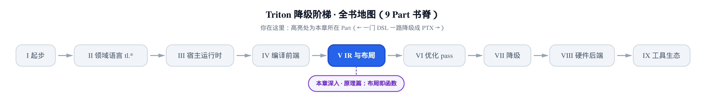
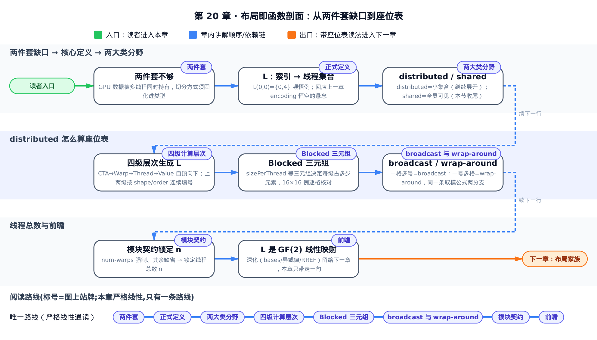
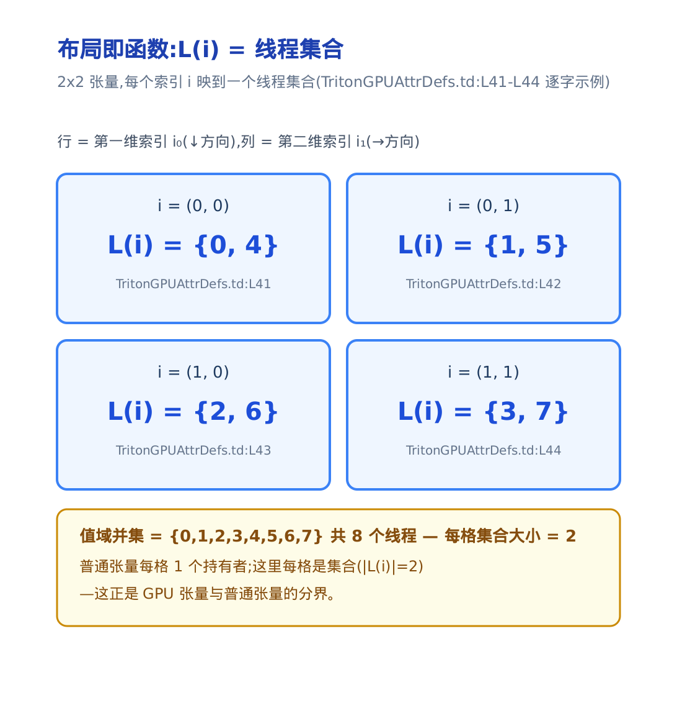
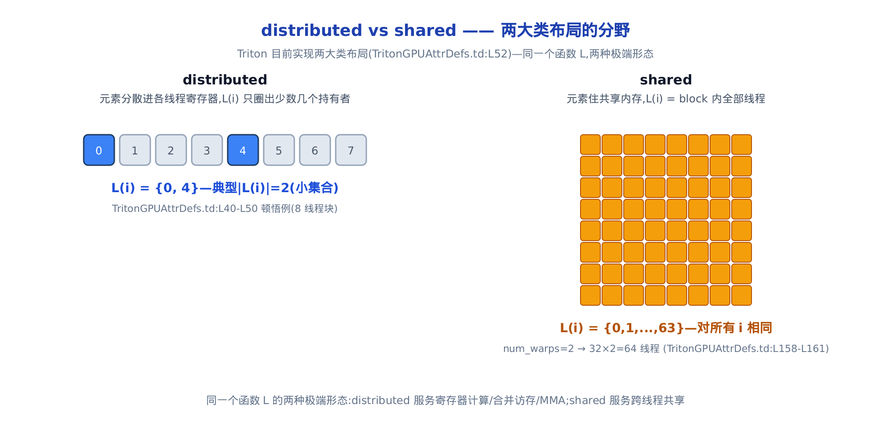
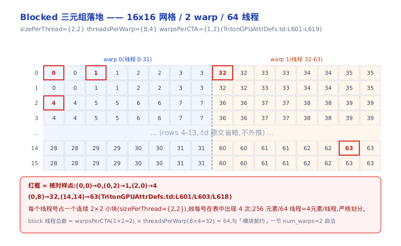
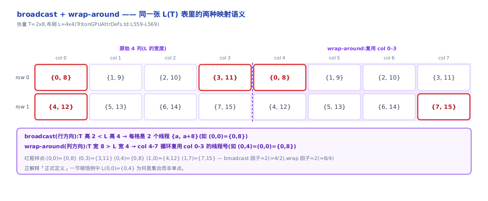

# 布局即函数：GPU 张量凭什么和普通张量不同

> **你在这里**：Part V「IR 与布局」第二站。
> 上一章识完字：`tt` 层张量只有 shape+dtype。
> 本章回答 `ttg` 层 encoding 到底填什么。
> 答案一句话：填的是一个函数。



[第 19 章](../../ch19-tt-dialect-vocabulary/narrative/chapter.md)结尾留了一个悬念：`tt` 层张量的 encoding（布局属性，贴在张量类型上、描述元素落到哪些线程的属性）恒为空，`verifySameEncoding` 见空就放行——「`tt` 硬件无关」是 verifier 短路给出的代码级证明，不是口号。那么下降到 TTGIR（给张量贴上布局之后的第二级 IR）时，encoding 里填进去的到底是什么东西？

本章就回答这一个问题。答案写在 `include/triton/Dialect/TritonGPU/IR/TritonGPUAttrDefs.td` 的开篇注释里，白纸黑字：**布局是一个函数**，把张量的多维索引映射到「允许访问该处数据的 CUDA 线程集合」。这一句是整个 TritonGPU 布局系统的钥匙。后面几章的一切——Blocked/MMA 各种布局、swizzle、布局转换的开销——全是这个函数的不同取值方式。

为什么值得花一整章讲一个定义？因为它是性能问题的**总钥匙**：同一个 `tl.dot`，布局对了合并访存自然发生、Tensor Core 一口吞下操作数；布局错了，编译器就得插入搬运指令跨线程倒腾数据，matmul 慢一个量级。看 TTGIR dump 找性能问题，第一步就是读懂张量类型尾巴上那段 `#triton_gpu.blocked<…>`——而它不过是这个函数的参数化写法。

全章的教法只有一条：**把张量画成格子，每格填上线程号**。抽象函数就变成一张能逐格对账的表。往下读时手边记住这张速查表：

| 记号 | 含义 | 首现于 |
|---|---|---|
| $`\mathcal{L}`$ | 布局函数：把张量索引映到「允许访问该格的线程集合」 | 正式定义 |
| $`i \in \mathbb{Z}^d`$ | 张量里一个格子的 $`d`$ 维整数坐标，$`\mathcal{L}`$ 的输入 | 正式定义 |
| $`d`$ | 张量的维数（rank），索引 $`i`$ 有 $`d`$ 个分量 | 正式定义 |
| $`\mathcal{P}(\cdot)`$ | 幂集：$`\mathcal{L}`$ 的值是线程 id 的**集合**，不是单个线程 | 正式定义 |
| $`n`$ | 一个 block 的线程总数，由模块契约锁定 | 模块契约 |
| $`L`$ | 布局张量：格子里填线程号的小张量，形状可与被编码张量不同 | broadcast 与 wrap-around |
| $`k_d`$ | 第 $`d`$ 维的平铺计数：每 +1 把布局张量在该维再铺一遍 | broadcast 与 wrap-around |
| `sizePerThread` 等三元组 | Blocked 布局的参数：每线程/每 warp/每 CTA 各占多少元素 | Blocked 三元组 |
| $`\oplus`$ | 按位异或，二元域上的加法 | 前瞻框 |



只想弄清 encoding 里到底填了什么、直接拿座位表核对——跳「正式定义」一节看完接着读「两大类分野」就够；关心 Blocked 布局具体怎么落地，另看「Blocked 三元组」「broadcast 与 wrap-around」两节；想跟全程从函数定义推到线性结构，按序读到「前瞻」收尾。

## 普通张量的两件套，为什么在 GPU 上不够

一个 NumPy 或 PyTorch CPU 张量，回答两个问题就完整了：什么形状（shape），什么元素类型（dtype）。数据躺在一段连续内存里，「谁来读它」不是类型的一部分——反正就是那一两个线程顺序访问。

GPU 不是这样。同一个张量的元素被成百上千个 CUDA 线程**同时**持有——本章的运行例里，一张 16×16 的表就由 2 个 warp 共 64 个线程瓜分；这个总数从哪来，「模块契约」一节会给出精确公式。某个元素落在哪个线程的寄存器里，直接决定[第 2 章](../../ch02-gpu-execution-model/narrative/chapter.md)那三把性能尺子的读数：warp 内相邻线程是否拿着相邻数据（合并访存）、共享内存访问撞不撞存储体（bank conflict，多线程同拍撞上同一存储体、被迫串行）、MMA 指令（Tensor Core 的矩阵乘加，见[第 8 章](../../ch08-dot-reduce-scan/narrative/chapter.md)）能否直接吃到摆放正确的操作数。「数据如何跨线程切分」必须在编译期确定、能被 pass 传播和校验——所以它被固化进了类型，成为 GPU 张量比普通张量多出的第三样东西：encoding。

`.td`（MLIR 的 TableGen 声明文件，上一章拆过它的三元组）开篇第一句就把动机点破（`include/triton/Dialect/TritonGPU/IR/TritonGPUAttrDefs.td:L35-L36`）：

> *TritonGPU tensors differ from usual tensors in that they contain a **layout** attribute which determines how the data should be partitioned across CUDA threads.*

TritonGPU 张量与普通张量的差别，就在这个决定「数据怎么跨 CUDA 线程切分」的 layout 属性。上一章 `tt` 层刻意不带它，才换来任何后端都认的硬件无关性；本章 `ttg` 层把它贴上去，硬件相关的一切从此有了落点。`tt` 到 `ttg` 的下降，正是「硬件无关抽象」落地为「硬件相关布局」的分水岭。

## 正式定义：一个把索引映到线程集合的函数

encoding 里存的不是一张具体的表，而是「如何构造一个函数」的参数。这个函数的正式定义，源码一句话给全（`TritonGPUAttrDefs.td:L36-L38`）：

> *Formally speaking, we define a layout as a function $`\mathcal{L}`$ that maps a multi-dimensional tensor index $`i \in \mathbb{Z}^d`$ to a set of integers $`T`$ corresponding to the indices of the CUDA threads allowed to access some data at index $`i`$.*

写成数学（$`n`$ 是 block 的线程总数，谁来定它是后面「模块契约」一节的事）：

```math
\mathcal{L}\colon\ \mathbb{Z}^{d} \longrightarrow \mathcal{P}\big(\{0,1,\dots,n-1\}\big),
\qquad i \longmapsto \mathcal{L}(i)
```

输入是张量里一个格子的 $`d`$ 维坐标 $`i`$，输出是**允许访问该格数据的线程 id 集合**。注意值域是幂集 $`\mathcal{P}`$——一个格子可以同时归多个线程。为什么必须是集合而不是单个线程号？这是本章后半的主线（broadcast 一节正面回答），先把源码自带的例子逐格看完（`TritonGPUAttrDefs.td:L34-L53`）：

```
// include/triton/Dialect/TritonGPU/IR/TritonGPUAttrDefs.td:L34-L53
  let description = [{
TritonGPU tensors differ from usual tensors in that they contain a _layout_ attribute which determines
how the data should be partitioned across CUDA threads. Formally speaking, we define a layout as a function
\mathcal{L} that maps a multi-dimensional tensor index $i \in \mathbb{Z}^d$ to a set of integers T corresponding
to the indices of the CUDA threads allowed to access some data at index $i$.

For example, let us consider the layout function:
\mathcal{L}(0, 0) = {0, 4}
\mathcal{L}(0, 1) = {1, 5}
\mathcal{L}(1, 0) = {2, 6}
\mathcal{L}(1, 1) = {3, 7}

Then, attaching $\mathcal{L} to a tensor $T$ would mean that:
- T[0,0] is owned by both cuda thread 0 and 4
- T[0,1] is owned by both cuda thread 1 and 5
- T[1,0] is owned by both cuda thread 2 and 6
- T[1,1] is owned by both cuda thread 3 and 7

Right now, Triton implements two main classes of layouts: shared, and distributed.
  }];
```

把这四行函数值摆成格子表，每格填线程集合：

<!-- trace: m02-layout-as-function -->

| 索引 $`i`$ | $`\mathcal{L}(i)`$ = 线程集合 | 源码原文的读法 | 出处 |
|---|---|---|---|
| (0, 0) | {0, 4} | T[0,0] 同时归线程 0 和 4 | TritonGPUAttrDefs.td:L41 |
| (0, 1) | {1, 5} | T[0,1] 同时归线程 1 和 5 | TritonGPUAttrDefs.td:L42 |
| (1, 0) | {2, 6} | T[1,0] 同时归线程 2 和 6 | TritonGPUAttrDefs.td:L43 |
| (1, 1) | {3, 7} | T[1,1] 同时归线程 3 和 7 | TritonGPUAttrDefs.td:L44 |

对一下账：四个格子、每格 2 个线程，共 4×2=8 个「线程-槽位」；四个集合求并恰好是 {0,1,2,3,4,5,6,7}，8 个线程各出现一次，无重无漏。这个例子里 $`\mathcal{L}`$ 是良定义的：每个索引都有确定的值，且线程分配自洽。布局就是一张**座位表**——这是本章唯一的比喻，它把「抽象函数」变成「可核对的表」：



到这里可以正面收掉上一章的悬念了：`tt` 层张量 encoding 恒空，是因为「谁持有哪个元素」在那一层**故意不回答**；`ttg` 层的 encoding 填进去的，就是构造 $`\mathcal{L}`$ 的参数。同一段 IR，从 TTIR 到 TTGIR，张量类型多出的那段 `#triton_gpu.…` 属性，读法从此确定：它描述一张座位表。

定义之后，源码立刻分家（`TritonGPUAttrDefs.td:L52`）：*Right now, Triton implements two main classes of layouts: shared, and distributed.* 两大类，往下逐个看。

## 两大类分野：distributed 与 shared

两类布局是同一个函数 $`\mathcal{L}`$ 的两种极端形态：

| | distributed | shared |
|---|---|---|
| 数据住在哪 | 分散在各线程的**寄存器**里 | **共享内存**，block 内可见 |
| $`\mathcal{L}(i)`$ 长什么样 | 小集合（常见 1 或 2 个线程），由四级层次算出 | 对所有 $`i`$ 都等于 block 内全部线程 |
| 典型用途 | 寄存器计算、合并访存、MMA 操作数 | 跨线程交换数据、swizzle 消 bank conflict |

先对一下具体数字：例如 `num_warps=2` 时，shared 布局对所有 $`i`$ 都是 $`\{0,\dots,63\}`$——64 个线程，正是本章开篇「16×16 表由 2 个 warp 共 64 个线程瓜分」里的那个 64。「模块契约」一节会给出这个 64 的通用公式，两处互证。

shared 一侧的 $`\mathcal{L}`$ 极简，源码一句话定义完（`TritonGPUAttrDefs.td:L158-L163`）：

```
// include/triton/Dialect/TritonGPU/IR/TritonGPUAttrDefs.td:L158-L163
An encoding for tensors whose elements may be simultaneously accessed by
different cuda threads in the programs, via shared memory. In other words,
for all indices i \in Z^d, \mathcal{L}(i) = {0, 1, ..., 32*num_warps - 1}.

In order to avoid shared memory bank conflicts, elements may be swizzled.
```

对**所有**索引 $`i`$，$`\mathcal{L}(i)`$ 都是同一个集合 `{0, 1, ..., 32*num_warps - 1}`——block 内全部线程（每 warp 32 线程 × warp 数，这个乘法的另一半藏在模块契约里，稍后揭晓）。元素住共享内存，谁都能读，座位表退化成「全员共有」。shared 布局额外携带 swizzle（按位异或打乱列序）参数来避开 bank conflict，机理留给讲共享内存编码的下下章，本章只需记住：swizzle 改的是元素在共享内存里的**摆放**，不改 $`\mathcal{L}`$「全员可见」的语义。

distributed 一侧则相反：元素散落在各线程的寄存器里，$`\mathcal{L}(i)`$ 只圈出少数几个持有者。开篇 2×2 的顿悟例（每格 2 个线程）就是一个 distributed 布局。两种形态一图对照：



shared 的 $`\mathcal{L}`$ 已经定义完了；接下来的问题全在 distributed 这边——它的座位表**怎么算出来**？

## distributed 怎么算：四级计算层次

distributed 布局不物化一张大表。它借用 GPU 硬件自己的执行层次来生成 $`\mathcal{L}`$（`TritonGPUAttrDefs.td:L469-L484`）：

```
// include/triton/Dialect/TritonGPU/IR/TritonGPUAttrDefs.td:L469-L484
The Distributed encoding describes the layout L with the 4-level compute hierarchy on GPU.
It is abstracted from the top to the bottom as CTAs Per CGA->Warps Per CTA->Threads Per Warp->Values Per Thread.

For CTAs Per CGA and Warps Per CTA level, the linear id is distributed contiguously with the shape and order.
For example, for a shape/order pair defines a distribution layout
shape = [4, 4]
order = [0, 1] // The fastest-changing axis first
->
layout = [0  4  8  12]
         [1  5  9  13]
         [2  6  10 14]
         [3  7  11 15]

For the Threads Per Warp and Values Per Thread level, the linear id distribution is variant for each sub-class encoding.
```

自顶向下四级：**CTAs Per CGA → Warps Per CTA → Threads Per Warp → Values Per Thread**。CTA（线程块 block 在 PTX 里的名字）、warp、lane 的硬件原理[第 2 章](../../ch02-gpu-execution-model/narrative/chapter.md)已立，这里只多一个新面孔：CGA（thread group cluster，Hopper 引入的线程块簇，多个 CTA 组团）。四级恰好与硬件执行层次同构——簇里切给各 CTA，CTA 里切给各 warp，warp 里切给 32 个 lane，每个 lane 再持有若干个元素。**用与硬件同构的四级参数生成座位表，而不是存表**，这是 distributed 的核心设计决策：极少的参数就能生成规整、合并访存友好的布局。

上两级（CTA、Warp）的编号规则是统一的：linear id 沿着 `shape`/`order` **连续填号**。源码例子 shape=[4,4]、order=[0,1]（最快变化的轴排前面，此处第 0 维即行方向最快）——于是编号先沿行方向数满一列，再跳下一列，得到列优先的 0,1,2,3｜4,5,6,7｜8,9,10,11｜12,13,14,15。对一下账：16 个格子、16 个连续 linear id（0-15）各恰好出现一次——这是一个双射，CTA/Warp 两级的编号规则保证不漏号也不重号。底两级（Thread、Value）的编号规则**因子类而异**，这正是 Blocked、MMA 等各种 distributed 布局互相区别的地方：

![四级嵌套层次自顶向下生成 L：CGA 里切 CTA，CTA 里切 warp，warp 里切 lane，lane 里放 value；右侧 shape=[4,4]/order=[0,1] 的 linear-id 列优先填号表逐格可核](../diagrams/fig-four-level-hierarchy.png)

最顶层（CTA 级）的切分参数由 `CTALayoutAttr` 承担：`CTAsPerCGA`/`CTASplitNum`/`CTAOrder` 三个数组，张量切成 `CTASplitNum` 份分给 `CTAsPerCGA` 个 CTA（`TritonGPUAttrDefs.td:L75-L105`）。多 CTA per CGA 目前是 Hopper（sm90）上的实验特性、默认不开；textual IR 里可以整个省略，Triton 会补上全 1 的缺省值——单 CTA 就是常态。所以日常读 dump，注意力放在底下三级即可。

## Blocked 三元组：把座位表压缩成三组小数字

四级层次里「因子类而异」的底两级，最直白的落地是 `BlockedEncodingAttr`——每个 warp 拥有张量的一块**连续**区域，服务 load/store 的合并访存（`TritonGPUAttrDefs.td:L595-L619`）：

```
// include/triton/Dialect/TritonGPU/IR/TritonGPUAttrDefs.td:L595-L619
An encoding where each warp owns a contiguous portion of the target tensor. This is typically the kind of data layout
used to promote memory coalescing in LoadInst and StoreInst.
It is characterized by three tuples -- thread tile size, warp tile size, and block tile size -- which
specify the amount of elements owned by each CUDA thread, warp and CTA respectively.

Example 1, a row-major coalesced layout may partition a 16x16 tensor over 2 warps (i.e. 64 threads) as follows:

[ 0  0  1  1  2  2  3  3  ; 32 32 33 33 34 34 35 35 ]
[ 0  0  1  1  2  2  3  3  ; 32 32 33 33 34 34 35 35 ]
[ 4  4  5  5  6  6  7  7  ; 36 36 37 37 38 38 39 39 ]
[ 4  4  5  5  6  6  7  7  ; 36 36 37 37 38 38 39 39 ]
...
[ 28 28 29 29 30 30 31 31 ; 60 60 61 61 62 62 63 63 ]
[ 28 28 29 29 30 30 31 31 ; 60 60 61 61 62 62 63 63 ]

for

#triton_gpu.blocked_layout<{
  sizePerThread = {2, 2}
  threadsPerWarp = {8, 4}
  warpsPerCTA = {1, 2}
  CTAsPerCGA = {1, 1}
  CTASplitNum = {1, 1}
}>
```

三元组各管一级：`sizePerThread`（每线程占多少连续元素，Values-Per-Thread 级）、`threadsPerWarp`（warp 的 32 个 lane 铺成什么形状，Threads-Per-Warp 级）、`warpsPerCTA`（各 warp 怎么铺，Warps-Per-CTA 级）。三组小数字逐级相乘，整张座位表就生成出来了——先推一遍尺寸账：每个 warp 的地盘 = `threadsPerWarp`×`sizePerThread` = (8·2)×(4·2) = 16×8；`warpsPerCTA={1,2}` 把两个 warp 沿列向并排，16×8 拼成 16×16，恰好盖满张量。上面那张逐格线程号表就是结果：每个线程号占一个连续 2×2 小块（`sizePerThread={2,2}`），warp 0 拿左半 8 列、warp 1（`;` 右侧，线程号从 32 起）拿右半。抽几个格子逐一核对（五个样点均可与 `.td` 里的线程号数据行逐字对上：第 0 行在 `TritonGPUAttrDefs.td:L603`、第 2 行在 `L605`、第 14 行在 `L608`；三元组参数本身在 `L614-L616`）：

<!-- trace: m05-blocked-triple -->

| 索引（行，列） | warp 归属 | 持有线程 | 三元组推理 |
|---|---|---|---|
| (0, 0) | warp 0（左半） | {0} | 行块 0、列块 0 → 线程 0，占 2×2 小块 |
| (0, 2) | warp 0 | {1} | 同行右移一个小块 → 列向线程 +1 |
| (2, 0) | warp 0 | {4} | 下移一个小块 → 行向线程 +4（每行 4 个列线程） |
| (0, 8) | warp 1（右半） | {32} | 列 8 起进 warp 1，线程号从 32 起 |
| (14, 14) | warp 1 | {63} | 行块 7、列块 3 → 7×4+3=31，加 32 → 63 |

这个布局是一个严格划分：16×16=256 个元素、2 warp = 64 线程，每线程恰好 256/64 = 4 个元素，等于 `sizePerThread` 的乘积 2×2——供需两侧对得上；且小块平铺不重叠，每个元素恰好一个持有者，$`|\mathcal{L}(i)|=1`$，无 broadcast、无空洞。这就是开篇那张「座位表」在真实布局上的样子：



注意「每线程 4 个**连续**元素」不是巧合而是意图：源码明说这类布局用于促进合并访存——相邻线程拿相邻数据，warp 的访存请求合并成最少的事务。你写 kernel 时无须手配这些数字，编译器的 Coalesce pass（`lib/Dialect/TritonGPU/Transforms/Coalesce.cpp`，按访存连续性分析构造 `BlockedEncodingAttr`）会自动选三元组；但看 dump 时认得它们，就能一眼判断「这个 load 的布局是不是合并友好的」。Blocked 在本章只作「distributed 最直白的一种」的例子，它的兄弟们（Slice、MMA、DotOperand）留给下一章逐个拆。

## broadcast 与 wrap-around：形状不匹配的两种对称语义

还差最后一块拼图：开篇顿悟例里 $`\mathcal{L}(0,0)=\{0,4\}`$ 那个**集合**是怎么来的？答案在 distributed 布局的完整定义里——$`\mathcal{L}`$ 由一个 $`d`$ 维**布局张量** $`L`$ 完全刻画，而 $`L`$ 的形状不必与被编码张量相同（`TritonGPUAttrDefs.td:L539-L570`）：

```
// include/triton/Dialect/TritonGPU/IR/TritonGPUAttrDefs.td:L539-L570
Distributed encodings have a layout function L that is entirely characterized
by a d-dimensional tensor T. Note that L doesn't need to have the same shape
(or even the same rank) as the tensor it is encoding.

The layout function \mathcal{L} of this layout is then defined, for an
index `i` \in Z^d, as follows:

\mathcal{L}(T)[i_d] = L[(i_d + k_d*T.shape[d]) % L.shape[d]] \forall k_d such as i_d + k_d*T.shape[d] < L.shape[d]

Intuitively, when the tensor dim size T.shape[d] is larger than the layout
dim size L.shape[d], on that particular dim, we distribute values from the
tensor to threads mapped in the layout in a "wrapped around" manner, with
each thread owning multiple values.

OTOH, when the tensor dim size T.shape[d] is smaller than the layout
dim size L.shape[d], on that particular dim, we distribute values from the
tensor to threads mapped in the layout in a "broadcasted" manner, with
each value owned by multiple threads.

For example, for a tensor/layout pair
T = [x  x  x  x  x  x  x  x]
    [x  x  x  x  x  x  x  x]
L = [0  1  2  3 ]
    [4  5  6  7 ]
    [8  9  10 11]
    [12 13 14 15]

Then the data of T would be distributed as follow between the 16 CUDA threads:
L(T) = [ {0,8} , {1,9} , {2,10}, {3,11}, {0,8} , {1, 9} , {2, 10}, {3, 11},
         {4,12}, {5,13}, {6,14}, {7,15}, {4,12}, {5, 13}, {6, 14}, {7, 15} ]
```

先对齐记号——这段注释的字母用法前后不一：首句的 layout function *L* 就是本章的 $`\mathcal{L}`$，被它刻画的 tensor *T* 反而是本章说的布局张量 $`L`$；而紧接着的公式与例子里，$`T`$ 又换指被编码张量、$`L`$ 才是布局张量。本章一律沿用速查表的约定：$`\mathcal{L}`$ 是函数、$`L`$ 是布局张量、$`T`$ 是被编码张量。另外 $`\mathcal{L}(T)[i]`$ 就是前文的 $`\mathcal{L}(i)`$——把布局贴到张量 $`T`$ 之后，在索引 $`i`$ 处查出的线程集合。

映射公式抄成数学（`TritonGPUAttrDefs.td:L547`）：

```math
\mathcal{L}(T)[i_d] \;=\; L\big[\,(i_d + k_d \cdot T.\mathrm{shape}[d]) \bmod L.\mathrm{shape}[d]\,\big]
\qquad \forall\, k_d \ \ \mathrm{s.t.}\ \ i_d + k_d \cdot T.\mathrm{shape}[d] < L.\mathrm{shape}[d]
```

逐维读它：把张量坐标 $`i_d`$ 加上若干个 $`T.\mathrm{shape}[d]`$ 的整数倍（$`k_d`$ 就是平铺计数），凡是仍落在布局张量内的位置全都取上，再对 $`L.\mathrm{shape}[d]`$ 取模去查线程号。有一处别按字面死抠：$`k_d`$ 的枚举条件只在 broadcast 方向筛出多个值；wrap-around 方向的越界坐标（如下例列 4，$`4 + 8k_d < 4`$ 无非负解）按字面找不到合法 $`k_d`$，此时按源码紧随其后的直觉段读——取 $`k_d = 0`$、直接取模就是答案（列 4 对 4 取模落回列 0）。一条公式同时容纳两种形状不匹配，语义完全对称：

- **张量比布局大**（$`T.\mathrm{shape}[d] > L.\mathrm{shape}[d]`$）：取模让线程号在该维**循环复用**——wrap-around，一个线程持有多个元素。
- **张量比布局小**（$`T.\mathrm{shape}[d] < L.\mathrm{shape}[d]`$）：多个 $`k_d`$ 都合法，同一格查出**多个**线程——broadcast，一个元素被多个线程同时持有。

公式是逐维给出的——沿每一维 $`d`$ 算出 $`L`$ 里合法的坐标集合后，把各维坐标做笛卡尔积、再到布局张量 $`L`$ 里逐一查号，才凑成最终的线程集合 $`\mathcal{L}(i)`$。下面的 2×8 例就是这条组合规则的一次具体实例。

用源码的例子过一遍数：张量 $`T`$ 是 2×8，布局 $`L`$ 是 4×4。行方向 $`T`$ 高 2、$`L`$ 高 4 → broadcast：$`k_0`$ 可取两个值，行 0 同时映到 $`L`$ 的行 0 和行 2，相差 2 行 = 8 个线程号，所以每格都是 {a, a+8} 这样的一对。列方向 $`T`$ 宽 8、$`L`$ 宽 4 → wrap-around：列 4 到列 7 取模后复用列 0 到列 3 的线程号。抽样点核对：

<!-- trace: m06-broadcast-wraparound -->

| 索引（行，列） | $`\mathcal{L}(T)[i]`$ = 线程集合 | 触发的语义 | 怎么来的 | 出处 |
|---|---|---|---|---|
| (0, 0) | {0, 8} | broadcast（行） | T 高 2 < L 高 4 → L 的行 0 与行 2 都映到它 | TritonGPUAttrDefs.td:L568 |
| (0, 3) | {3, 11} | broadcast（行） | 同理 → {3, 3+8} | TritonGPUAttrDefs.td:L568 |
| (0, 4) | {0, 8} | wrap-around（列） | T 宽 8 > L 宽 4 → 列 4 取模复用列 0 | TritonGPUAttrDefs.td:L568 |
| (1, 0) | {4, 12} | broadcast（行） | 行 1 映到 L 的行 1 与行 3 → {4, 12} | TritonGPUAttrDefs.td:L569 |
| (1, 7) | {7, 15} | 两者叠加 | 列 7 取模复用列 3，行向再 broadcast → {7, 15} | TritonGPUAttrDefs.td:L569 |

对账：张量 2×8 = 16 个元素，行向 broadcast 因子 = 4/2 = 2，每格 $`|\mathcal{L}|=2`$，共 16×2 = 32 个线程-槽位；另一侧 16 个线程（$`L`$ 是 4×4），列向 wrap 因子 = 8/4 = 2，每个线程恰好出现 2 次，16×2 = 32——两向计数相等，公式对每个 $`i`$ 都有定义、不越界。画在格子表里两种语义一眼可辨：**broadcast 让一格里出现多个号，wrap-around 让同一个号出现在多格**。



现在可以回填开篇的悬念：顿悟例 $`\mathcal{L}(0,0)=\{0,4\}`$ 正是一个行向 broadcast 的产物——它对应布局张量 $`L=[[0,1],[2,3],[4,5],[6,7]]`$（4×2，比开篇 2×2 张量高一倍），行向 broadcast 后 $`\mathcal{L}(0,0)=\{L[0,0],L[2,0]\}=\{0,4\}`$；值域必须是集合，因为 broadcast 天然让一个元素归多个线程。这不是异常情况，而是 Triton 表达「同一份数据要在多个线程里各留一份拷贝」的正规手段；至于值域为什么不干脆定成单点再打补丁——因为集合把独占（单元素集合）与共享（多元素集合）统一成了一种代数对象，后续所有布局变换 pass 都只需处理一种语义。

## 谁决定线程一共有多少：模块契约

$`\mathcal{L}`$ 的值域是线程 id 集合，但「一共有多少线程」这件事不在任何张量的 encoding 里——它是整个 program 的全局事实，所有张量共享。它挂在 module 级属性上（`include/triton/Dialect/TritonGPU/IR/TritonGPUDialect.td:L23-L47`）：

```cpp
// include/triton/Dialect/TritonGPU/IR/TritonGPUDialect.td:L23-L47
  let extraClassDeclaration = [{
    static std::string getNumWarpsAttrName() { return "triton_gpu.num-warps"; }
    static int getNumWarps(ModuleOp mod) {
      if (!mod->hasAttr("triton_gpu.num-warps"))
        llvm::report_fatal_error(
            "TritonGPU module should contain a triton_gpu.num-warps attribute");
      return cast<IntegerAttr>(mod->getAttr("triton_gpu.num-warps")).getInt();
    }
    static int getNumCTAs(ModuleOp mod) {
      if (!mod->hasAttr("triton_gpu.num-ctas"))
        return 1;
      return cast<IntegerAttr>(mod->getAttr("triton_gpu.num-ctas")).getInt();
    }
    void registerTypes();

    static std::string getThreadsPerWarpAttrName() { return "triton_gpu.threads-per-warp"; }

    static int getThreadsPerWarp(ModuleOp mod) {
      Attribute threadsPerWarp = mod->getDiscardableAttr("triton_gpu.threads-per-warp");
      if(!threadsPerWarp) {
        return 32;
      }
      return cast<IntegerAttr>(threadsPerWarp).getInt();
    }
  }];
```

三个契约属性，三种缺省策略，各有讲究：

| 属性 | 缺失时 | 含义 |
|---|---|---|
| `triton_gpu.num-warps` | `report_fatal_error`（**强制**） | 每个 program 的 warp 数 |
| `triton_gpu.num-ctas` | 返回 1 | 每个 CGA 的 CTA 数（Hopper 多 CTA 特性） |
| `triton_gpu.threads-per-warp` | 返回 32 | 每 warp 的线程数 |

`num-warps` 缺失直接致命错误——它是你写 kernel 时传的 `num_warps` 参数在 IR 里的落点，没有它整张座位表的规模无从谈起，所以必须显式声明。`threads-per-warp` 缺省 32 对应 NVIDIA 硬件的 warp 宽度；`num-ctas` 缺省 1 呼应前面 CTALayout 的「单 CTA 是常态」。于是：

```math
n \;=\; \mathrm{num\_warps} \times \mathrm{threads\_per\_warp}
```

这正是本章开头两处伏笔的闭环：shared 布局 $`\mathcal{L}(i)=\{0,1,\dots,32\cdot\mathrm{num\_warps}-1\}`$ 里的 32 就是 `threads-per-warp` 的缺省值；Blocked 例子「2 warp = 64 线程」也是同一笔账。布局参数（`warpsPerCTA`/`threadsPerWarp`/`CTAsPerCGA`）描述「怎么分」，模块契约锁定「一共有多少个」，二者必须自洽——`warpsPerCTA` 的乘积对不上 `num-warps`，verifier 当场拒收。这也解释了一个常见的调优现象：改 `num_warps` 不只是改并行度，它同时改写了所有张量座位表的规模，编译器要重新选一整套布局参数。

## 前瞻：这张表其实是线性的

> **[前瞻·深化见 LinearLayout 一章]** 到这里 $`\mathcal{L}`$ 还只是一张「索引 → 线程集合」的对照表，但它其实不是任意函数，而是二元域 GF(2) 上的**线性映射**——Triton 把这套统一模型叫 LinearLayout（思路归功于 Adam P. Goucher，`include/triton/Tools/LinearLayout.h` 头注释）。关键事实：只需给出 $`\mathcal{L}`$ 在「2 的幂次输入」上的取值（称为 bases，基向量），其余全部函数值都能靠异或线性律 $`\mathcal{L}(a \oplus b) = \mathcal{L}(a) \oplus \mathcal{L}(b)`$ 推出来。因为是线性的，两个布局的复合与求逆退化成 GF(2) 上的矩阵行化简（RREF），源码由 `third_party/f2reduce` 的 `inplace_rref_strided` 用 Four Russians 分块查表法完成（`lib/Tools/LinearLayout.cpp:L151`）。学术出处见 arXiv:2505.23819《Linear Layouts: Robust Code Generation of Efficient Tensor Computation Using F2》。本章到此为止，只带走一句：布局不是杂乱的表，而是几条基向量加异或就能压缩表示的线性对象——这套代数是后面 LinearLayout 一章的主角。

## 小结：一个函数，一张表

本章只立了一个定义，但它是往后所有布局章节的公共语言：

1. **布局即函数**——$`\mathcal{L}\colon \mathbb{Z}^d \to \mathcal{P}(\{0,\dots,n-1\})`$，把张量索引映到「允许访问该格的线程集合」（`TritonGPUAttrDefs.td:L36-L38`）。encoding 存的是构造它的参数。这正面回答了[第 19 章](../../ch19-tt-dialect-vocabulary/narrative/chapter.md)的悬念：`tt` 层 encoding 恒空守住硬件无关，`ttg` 层填上 $`\mathcal{L}`$ 落地硬件相关。
2. **两大类**——shared：对所有 $`i`$ 全员可见（`{0,...,32*num_warps-1}`）；distributed：小集合，由四级层次 CTA→Warp→Thread→Value 算出，不物化大表。
3. **Blocked 三元组**——`sizePerThread`/`threadsPerWarp`/`warpsPerCTA` 三组小数字生成严格划分的座位表，连续小块服务合并访存。
4. **集合值域的来源**——broadcast（一格多号）与 wrap-around（一号多格），同一条取模公式的两个对称分支。
5. **线程总数是模块契约**——`num-warps` 强制、`threads-per-warp` 缺省 32、`num-ctas` 缺省 1；布局说「怎么分」，契约定「有多少」。

性能主线上，这个定义给了你一副新眼镜：从此看 TTGIR dump，每个张量类型尾巴上的 encoding 都是一张可以画出来的座位表——它决定这次 load 合并不合并、这个 `tl.dot` 的操作数要不要跨线程搬运。下一章就用这副眼镜逐个端详 distributed 家族的成员：Blocked 的兄弟们、给 Tensor Core 喂数的 MMA 编码、以及归约时把维度「切」掉的 Slice。座位表怎么画，决定你的 kernel 跑多快。
