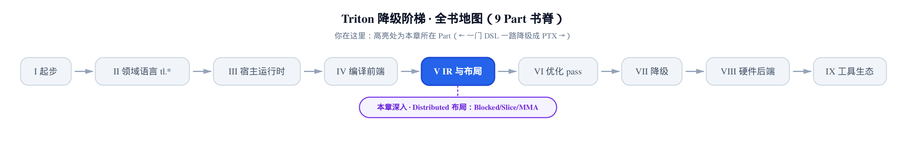
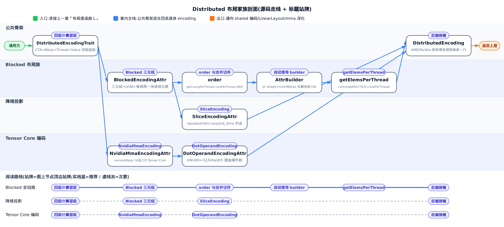
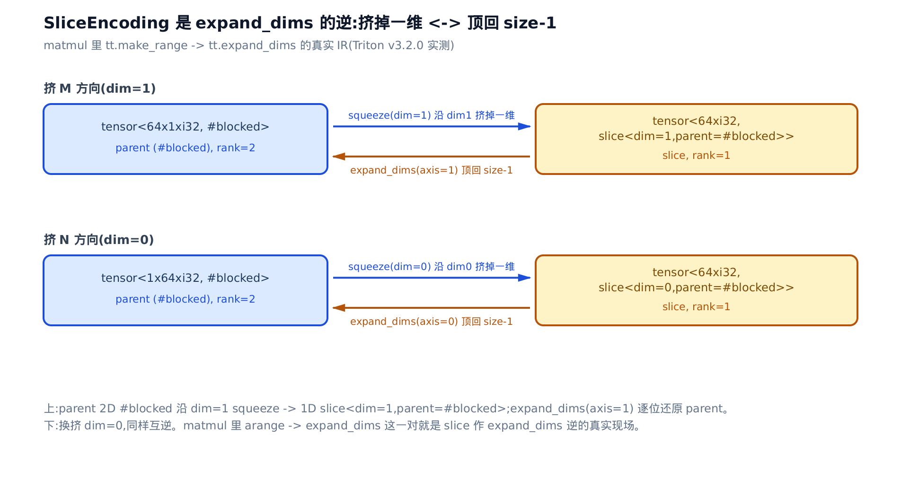

# Distributed 布局：Blocked、Slice、MMA 与 DotOperand 编码

> **你在这里**：Part V「IR 与布局」第三站。
> 上一章：布局是「索引 → 线程集合」的函数。
> 本章：这个函数落成的具体 encoding 长啥样。
> 下一章：shared 编码怎么躲 bank 冲突。



[上一章](../../ch20-layout-is-a-function/narrative/chapter.md)把布局钉成了一个抽象：布局是一个函数 $`\mathcal{L}`$，把张量的多维索引映射到「允许访问该处数据的 CUDA 线程集合」。但抽象归抽象——当你 dump 一段 TTGIR（Triton GPU IR，给张量贴上布局之后的第二级 IR），张量类型尾巴上真正印着的是 `#triton_gpu.blocked<{sizePerThread = [1, 1], ...}>` 这种带一堆参数的东西。这些参数就是 $`\mathcal{L}`$ 的具体取值方式。本章要做的，就是把最常见的四种 distributed 布局（分布式布局：把张量元素摊派给成百上千个线程持有的编码族）逐个拆开，看清每个参数在函数里扮演什么角色。

**为什么这一章值钱？** 因为读懂这些参数，你就能一眼判死自己 kernel 的两条性能命脉。第一条是**合并访存**（coalescing，同一 warp 的 32 个地址若落在同一 128 字节对齐段，硬件合并成一笔事务；否则事务数暴涨、有效带宽被除以事务数）——它成不成立，全写在 Blocked 布局的三个参数里，`order` 选错就从 1 笔事务退化成 32 笔。第二条是**命中 Tensor Core**（NVIDIA 自 Volta 起每个 SM 内置的矩阵乘累加硬件单元，一次吞一小块 $`A \times B`$）——操作数得按硬件挑食的方式摆盘，摆错了编译器就得插搬运指令跨线程倒腾数据，matmul 慢一个量级。这两条性能杠杆，本章都会落到「所以你写 kernel 时该怎么摆布局」。

全章的读法和上一章一脉相承：**把张量画成格子，每格填上线程号**，抽象函数就变成一张能逐格对账的表。这四种编码全部声明在同一个 TableGen 文件 `include/triton/Dialect/TritonGPU/IR/TritonGPUAttrDefs.td` 里，布局算术则落在 `lib/Dialect/TritonGPU/IR/Dialect.cpp`。我们从所有 distributed 布局共享的骨架讲起，再依次落到 Blocked、Slice、以及 Tensor Core 那一对 MMA / DotOperand 编码。



只想弄清 sizePerThread/threadsPerWarp/order 三元组怎么决定访存能不能合并，看「Blocked 三元组」接着读「order 决定一块 load 能不能合并成一笔事务」就够；想知道降维和 Tensor Core 操作数编码长什么样，另看「SliceEncoding」「NvidiaMmaEncoding」「DotOperandEncoding」三节；想跟全程从公共骨架推到后端接缝，按序读。

## 四级计算层级：所有 distributed 布局的公共骨架

**直觉。** 把一张张量发给全班同学：先分组（CTA，Cooperative Thread Array，即线程块 block 在 PTX 里的名字），每组再分小队（warp，硬件调度的最小单位，32 个 lane 锁步执行同一条指令），每队 32 个人（thread），每人手里攥几张牌（value）。四级从粗到细，谁拿哪几格由一个布局函数一次算定——所谓 distributed 布局，就是这套四级分发规则的统称。

**机制。** 源码开篇就把这四级层级写死了（`include/triton/Dialect/TritonGPU/IR/TritonGPUAttrDefs.td`）：

```cpp
# include/triton/Dialect/TritonGPU/IR/TritonGPUAttrDefs.td:L470-L483
The Distributed encoding describes the layout L with the 4-level compute hierarchy on GPU.
It is abstracted from the top to the bottom as CTAs Per CGA->Warps Per CTA->Threads Per Warp->Values Per Thread.

For CTAs Per CGA and Warps Per CTA level, the linear id is distributed contiguously with the shape and order.
For example, for a shape/order pair defines a distribution layout
shape = [4, 4]
order = [0, 1] // The fastest-changing axis first
->
layout = [0  4  8  12]
         [1  5  9  13]
         [2  6  10 14]
         [3  7  11 15]

For the Threads Per Warp and Values Per Thread level, the linear id distribution is variant for each sub-class encoding.
```

四级从粗到细是 `CTAsPerCGA → WarpsPerCTA → ThreadsPerWarp → ValuesPerThread`（CGA 即 Cooperative Grid Array，Hopper 上的线程块簇；本书主线单 CTA，这一级恒为 1）。关键在最后一句划的那道线：**上两级**（CTA、warp）分发规则是**共享**的——按 shape 和 order 连续铺线性 id；**下两级**（thread、value）才由每个子类编码各自定义。上面那个 `shape=[4,4]`、`order=[0,1]` 的小例子演示了共享规则：`order[0]=0` 说明 dim0 是最快变化轴，所以线性 id 沿 dim0 连续铺（首列 0,1,2,3），跨到 dim1 才每步跳 4（首行 0,4,8,12）。

这就是 order 的第一层含义：**它决定线性 id 沿哪根轴连续铺**。记住这一点，等会儿讲合并访存时它会再次登场。

![四级计算层级是本章一切 encoding 的公共骨架：上两级 CTAsPerCGA/WarpsPerCTA 共享「按 shape+order 连续铺线性 id」，下两级 ThreadsPerWarp/ValuesPerThread 由 Blocked/Slice/Mma/DotOperand 各自定义；右侧 shape=[4,4]、order=[0,1] 的网格演示首列 0,1,2,3 沿 dim0 连续、首行 0,4,8,12 每步跨 4](../diagrams/fig-distributed-hierarchy.png)

**不变量（证明见[上一章](../../ch20-layout-is-a-function/narrative/chapter.md)）。** 当被编码张量比布局张量大时，某维会 wrap-around（一个线程持有该维多个元素，取模复用线程号）；比布局张量小时则 broadcast（一个值被多个线程共享）。这两条正是上一章 $`\mathcal{L}`$ 值域为线程**集合**而非单个线程的原因；本章不重复推导，只需记住：四级层级 + wrap-around/broadcast 是所有子类编码站立的地基。往下每一种编码，都只是在填「下两级怎么分」这道填空题。

## Blocked 三元组：把张量切成每线程一块连续元素

**直觉。** 发扑克有两种发法。一种是一张一张轮流发——相邻的牌散到不同人手里；另一种是每人一次抓「连续的一小叠」。Blocked 布局选后者：`sizePerThread` 就是这一小叠的大小，`threadsPerWarp` 和 `warpsPerCTA` 决定这些小叠怎么在牌桌上拼成整副。相邻的人抓相邻的叠——这正是等会儿能合并访存的物理前提。

**机制。** 源码文档头一句就道破了 Blocked 的用途，还附了一个手算 example（`TritonGPUAttrDefs.td`）：

```cpp
# include/triton/Dialect/TritonGPU/IR/TritonGPUAttrDefs.td:L595-L619
An encoding where each warp owns a contiguous portion of the target tensor. This is typically the kind of data layout
used to promote memory coalescing in LoadInst and StoreInst.
It is characterized by three tuples -- thread tile size, warp tile size, and block tile size -- which
specify the amount of elements owned by each CUDA thread, warp and CTA respectively.

Example 1, a row-major coalesced layout may partition a 16x16 tensor over 2 warps (i.e. 64 threads) as follows:

[ 0  0  1  1  2  2  3  3  ; 32 32 33 33 34 34 35 35 ]
[ 0  0  1  1  2  2  3  3  ; 32 32 33 33 34 34 35 35 ]
[ 4  4  5  5  6  6  7  7  ; 36 36 37 37 38 38 39 39 ]
[ 4  4  5  5  6  6  7  7  ; 36 36 37 37 38 38 39 39 ]
...
#triton_gpu.blocked_layout<{
  sizePerThread = {2, 2}
  threadsPerWarp = {8, 4}
  warpsPerCTA = {1, 2}
  ... 省略：CTAsPerCGA / CTASplitNum 单 CTA 恒为 1 ...
}>
```

先把这张线程号网格读透。`sizePerThread = {2, 2}` 说明每个线程占一个 2×2 的连续块——这就是为什么每个线程号在网格里**连续出现两次两行**（thread 0 铺满 rows 0-1、cols 0-1）。这就是四级层级里最底层 `ValuesPerThread` 的具体名字——Blocked 编码里它叫 `sizePerThread`。`threadsPerWarp = {8, 4}` 说明一个 warp 的 32 个 lane 沿 row 方向排 8 个、沿 col 方向排 4 个，正好 8×4=32 覆盖 16 行 × 8 列的左半张量。`warpsPerCTA = {1, 2}` 让第二个 warp（线程 32-63）沿 col 方向接上去，覆盖右半 8 列。两个 warp 沿列拼出整张 16×16。

源码原文写的是 row-major（英文，即最后一维——列——连续）——翻成 order 语言就是 `order=[1,0]`。逐格追一遍（col 是最快变化轴），把「相邻 lane 拿相邻元素」这句话坐实：

<!-- trace: blocked-triple -->

| 张量坐标 (row,col) | 落到哪个线程 | 为什么 | 同 warp 内相邻关系 |
|---|---|---|---|
| (0,0) | thread 0 | warp0；sizePerThread=2×2 → thread0 占 rows0-1×cols0-1 的连续 2×2 块 | 起点 |
| (0,1) | thread 0 | 仍在 thread0 的 2×2 块内（col 方向 sizePerThread=2） | 同一线程的连续元素 |
| (0,2) | thread 1 | 跨过 thread0 的 2 列 → 下一线程，lane 沿 order[0]=col 方向 +1 | 相邻 lane 拿相邻列块 |
| (2,0) | thread 4 | row 方向每跨 sizePerThread=2 行换一批 lane（threadsPerWarp 沿 row=8） | 沿 dim0 的下一排线程 |
| (0,8) | thread 32 | 跨过 warp0 覆盖的左半 8 列 → warp1（warpsPerCTA 沿 col=2） | 换 warp，非相邻 lane |

读这张表要盯住第 3 行和第 4 行的对比：col 方向每跨一个 2 元素小叠就换相邻 lane（0→1），row 方向却要跨完整块才换 lane（0→4）。哪根轴上「相邻 lane 拿相邻元素」，取决于 order——这里 `order=[1,0]` 隐含在网格的行主序里，让 col 成为最快变化轴。

**不变量。** 每维的 `sizePerThread · threadsPerWarp · warpsPerCTA` 相乘，正好等于该维一个 CTA-tile 覆盖的元素数（这正是访问器 `getShapePerCTATile` 的返回值）；且同一线程握着的 `sizePerThread` 个元素在张量里地址连续。为什么连续这条对任意合法三元组都成立？源码给了一句斩钉截铁的保证（`TritonGPUAttrDefs.td`）：

```cpp
# include/triton/Dialect/TritonGPU/IR/TritonGPUAttrDefs.td:L758-L765
  let extraClassDeclaration = extraDistributedDeclaration # [{
    SliceEncodingAttr squeeze(int axis);

    SmallVector<unsigned> getContigPerThread() {
      // Block encoding is dense stride layout. The elements per thread are contiguous.
      return getSizePerThread();
    };
  }];
```

`getContigPerThread`（每线程连续元素数）在 Blocked 里**恒等于** `getSizePerThread`。注释把原因说白了：blocked 是 dense stride layout（稠密步长布局），每线程的元素在张量里紧挨着。数一下 Example 1：16×16 = 256 个元素 / 64 个线程 = 每线程 4 个，恰好等于 `sizePerThread` 的乘积 2×2=4。warp0 的 32 个 lane（8×4）覆盖 16 行 × 8 列的左半，warp1 覆盖右半——严丝合缝。

顺带记下那行 `SliceEncodingAttr squeeze(int axis);`——它是从 Blocked 通往下一种编码（降维投影）的入口，本章后半会用到。

![把 .td Example 1 的线程号网格图化：每个数字占一个 2×2 连续块（sizePerThread=[2,2]），相邻线程 0,1,2,3 沿列方向拿相邻列块；threadsPerWarp=[8,4] 把 warp0 的 32 lane 铺成 8×4 覆盖左半 cols 0-7，warpsPerCTA=[1,2] 让 warp1（线程 32-63）沿列拼出右半 cols 8-15——相邻线程拿相邻列块，这就是访存合并的编码层长相](../diagrams/fig-blocked-triple.png)

## order 决定一块 load 能不能合并成一笔事务

这是本章的性能落点。前面反复出现的 order，到底怎么把合并访存这件事固化进编码层？

**直觉。** 32 个人去仓库取货。如果他们的货位是连着的一排（0..31 号），保安一次就能开一整段货架放行——一笔事务。如果每人的货位隔着一整行远（0、64、128... 号），保安得开 32 次锁。order 决定这 32 个 lane 的「货位」沿哪根轴排：排到连续维（stride=1 的维）上就合并，排错就跨步。

**机制。** 拿一个真实的 64×64 fp16 matmul 编译出来，取它操作数 load 那一步实发的 `#blocked`，只换 order 对比一下：

<!-- trace: coalescing-encoding-condition -->

| order | 32 lane 落在哪 | 地址跨度 | 事务数 |
|---|---|---|---|
| [1,0]（实发，order[0]=1=列=连续维） | 同一行的 32 个连续列 | 32 元素连续 = 64 字节 | 1 笔（合并） |
| [0,1]（反例，order[0]=0=行=跨步维） | 同一列的 32 个不同行 | 每行相隔 64 元素 = 128 字节 | 32 笔（跨步） |

同一块 warp-load、同一份数据，只换 order：合并版 1 笔事务，跨步版 32 笔——事务数相差 32 倍。

**不变量。** 当且仅当 `order[0]` 指向 stride=1 维、且该维上每线程的 `sizePerThread` 连续块首尾相接时，一个 warp 的 32 个 lane 覆盖一段无洞连续地址。论证很直接：lane 沿 `order[0]` 维以步长 `sizePerThread` 递增（就是上一节那条 `getContigPerThread ≡ sizePerThread`），于是第 $`i`$ 个 lane 的物理地址是

```math
\mathrm{addr}(i) = \mathrm{base} + i \cdot \mathrm{sizePerThread} \cdot \mathrm{elemBytes}
```

32 个 lane 铺成一段连续区间，GPU 把它合并成 $`\lceil B / 128 \rceil`$ 笔（$`B`$ 为这段区间的字节数；本例 64 字节 < 128 字节 → 1 笔）。若把 `order[0]` 换成 stride=行宽 的维，相邻 lane 地址就相隔一整行——无连续区间可合并，退化到每 lane 一笔。

这也正是编译器里那个专门的 coalescing pass 干的事（`lib/Dialect/TritonGPU/Transforms/Coalesce.cpp`）：

```cpp
# lib/Dialect/TritonGPU/Transforms/Coalesce.cpp:L40-L41,L98-L99
    auto contiguity = axisInfoAnalysis.getAxisInfo(ptr)->getContiguity();
    SmallVector<unsigned> order = argSort(contiguity);
# ... 省略：把同 order 的指针归并、算 perThread ...
    SmallVector<unsigned> sizePerThread(refTensorType.getRank(), 1);
    sizePerThread[order[0]] = perThread;
```

pass 先做一次访存分析（axis info analysis，静态推断每根轴上指针的连续度 contiguity），再 `argSort` 把最连续的维排到 `order[0]`——正是把「连续维放最前」这条合并条件直接落进 order。然后只给 `order[0]` 那一维放大 `sizePerThread`（向量化搬运），其余维保持 1。你不用手写 order，但你 kernel 里指针算术是否让编译器**看得出**某根轴连续（比如别把 stride 写成运行期变量），直接决定它 argSort 得对不对。

**所以你写 kernel 时该怎么做？** 合并访存的硬件成因，[第 2 章](../../ch02-gpu-execution-model/narrative/chapter.md)讲过 warp 锁步发射 32 个地址、[第 7 章](../../ch07-blocks-shape-and-memory-access/narrative/chapter.md)讲过它是访存的第一现场；本章告诉你它在编码层的固化点就是 order。实践上你很少手写 order——编译器按下一节的自动推导算法替你选。但当你 dump TTGIR 排查一个「带宽只跑到峰值 1/32」的 kernel 时，第一件事就是看那段 `#blocked` 的 `order[0]` 是不是指向了你数据的连续维。指错了，就是这里的 32 倍事务惩罚。

![同一 warp、同一份数据，只换 order：左（order=[1,0]，编译器实发）32 lane 贴着一行的连续列，一段 64 字节合并成 1 笔事务；右（order=[0,1]，反例）32 lane 竖着落在 32 行、彼此相隔 128 字节，退化成 32 笔事务](../diagrams/fig-coalescing-order.png)

## 自动推导 builder：从 shape + numWarps 反解各级 tile

既然 order 选对就合并，那给定张量形状和 warp 数，编译器怎么**自动**切出一个合并友好的布局？答案是一个反解 builder。

**直觉。** 算法像分蛋糕：从最连续那根轴（`order[0]`）开刀，先尽量让一个 warp 的 32 把刀吃满这根轴；剩下的刀和 warp 再分给下一根轴；最后一根轴兜底，吃掉所有没分完的 lane 和 warp。

**机制。** builder 就写在 `.td` 里（`TritonGPUAttrDefs.td`）：

```cpp
# include/triton/Dialect/TritonGPU/IR/TritonGPUAttrDefs.td:L692-L728
    AttrBuilder<(ins "ArrayRef<int64_t>":$shape,
                     "ArrayRef<unsigned>":$sizePerThread,
                     "ArrayRef<unsigned>":$order,
                     "unsigned":$numWarps,
                     "unsigned":$numThreadsPerWarp,
                     "CTALayoutAttr":$CTALayout), [{
      unsigned rank = sizePerThread.size();
      SmallVector<unsigned, 4> threadsPerWarp(rank);
      SmallVector<unsigned, 4> warpsPerCTA(rank);
      SmallVector<int64_t> shapePerCTA = getShapePerCTA(CTALayout.getCTASplitNum(), shape);

      unsigned remainingLanes = numThreadsPerWarp;
      unsigned remainingThreads = numWarps * numThreadsPerWarp;
      unsigned remainingWarps = numWarps;
      unsigned prevLanes = 1;
      unsigned prevWarps = 1;

      // starting from the contiguous dimension
      for (unsigned d = 0; d < rank - 1; ++d) {
        unsigned i = order[d];
        unsigned threadsPerCTA = std::clamp<unsigned>(remainingThreads, 1, std::max<unsigned>(1, shapePerCTA[i] / sizePerThread[i]));
        threadsPerWarp[i] = std::clamp<unsigned>(threadsPerCTA, 1, remainingLanes);
        warpsPerCTA[i] = std::clamp<unsigned>(threadsPerCTA / threadsPerWarp[i], 1, remainingWarps);
        remainingWarps /= warpsPerCTA[i];
        remainingLanes /= threadsPerWarp[i];
        remainingThreads /= threadsPerCTA;
        prevLanes *= threadsPerWarp[i];
        prevWarps *= warpsPerCTA[i];
      }

      // Expand the last dimension to fill the remaining lanes and warps
      threadsPerWarp[order[rank - 1]] = numThreadsPerWarp / prevLanes;
      warpsPerCTA[order[rank - 1]] = numWarps / prevWarps;

      return $_get(context, sizePerThread, threadsPerWarp, warpsPerCTA, order, CTALayout);
    }]>,
```

循环从 `order[0]` 起，每轮 `clamp` 三连：先算这根轴能吃多少线程（不超过 `shapePerCTA[i] / sizePerThread[i]`，即该维能容纳的线程数），再 clamp 到剩余 lane 得 `threadsPerWarp[i]`，再 clamp 到剩余 warp 得 `warpsPerCTA[i]`。末维不进循环，直接令它吃掉所有剩下的 lane 和 warp。这里 `shapePerCTA` 是「一个 CTA 分到的形状」——本书主线单 CTA、`CTASplitNum=1`，故 `shapePerCTA` 恒等于张量整体 shape，下面直接拿 64、1024 代入。本例复用行主序张量的默认约定：`sizePerThread` 全 1、`order=[1,0]`（下文 `getDefaultBlockedEncoding` 会给出这两条默认值的来源）。拿真实 64×64 matmul 走一遍（这次编译 `numWarps=4`、硬件 warp size=32 即 `numThreadsPerWarp=32`）：

<!-- trace: blocked-auto-builder -->

| 步 | 处理轴 i | threadsPerCTA=clamp(remainingThreads, 1, shape/size) | threadsPerWarp[i] | warpsPerCTA[i] |
|---|---|---|---|---|
| d=0（连续维） | order[0]=1 | clamp(128, 1, 64/1=64) = 64 | clamp(64,1,32) = 32 | clamp(64/32=2,1,4) = 2 |
| 末维（兜底） | order[1]=0 | — | 32/prevLanes=32/32 = 1 | 4/prevWarps=4/2 = 2 |

得到 `threadsPerWarp=[1,32]`、`warpsPerCTA=[2,2]`：连续维 dim1 吃满一个 warp 的 32 个 lane——正好把合并访存编进了推导结果。这个反解结果与 pin 编译实发的 `#blocked` 逐位吻合。退化到 1D `[1024]`：`rank-1=0` 轮循环，直接兜底 → `threadsPerWarp=[32]`、`warpsPerCTA=[4]`。

**不变量。** 循环恰跑 `rank-1` 轮必终止；且各维 tile 精确铺满 lane 与 warp：

```math
\prod_i \mathrm{threadsPerWarp}[i] = \mathrm{numThreadsPerWarp}, \qquad \prod_i \mathrm{warpsPerCTA}[i] = \mathrm{numWarps}
```

lane 和 warp 不多不少全部分完。终止性靠单调量：每轮 `remainingLanes/Warps/Threads` 都除以本轮 clamp 出的正整数，严格非增，有限步必停。守恒靠末维那两行：前 `rank-1` 轮累乘出 `prevLanes/prevWarps`，末维直接补 `numThreadsPerWarp/prevLanes` 和 `numWarps/prevWarps`，相乘即还原总数。

最省事的默认入口是 `getDefaultBlockedEncoding`——当一个张量还没任何布局线索时就贴它（`lib/Dialect/TritonGPU/IR/Dialect.cpp`）：

```cpp
# lib/Dialect/TritonGPU/IR/Dialect.cpp:L519-L532
triton::gpu::BlockedEncodingAttr
getDefaultBlockedEncoding(MLIRContext *context, ArrayRef<int64_t> shape,
                          int numWarps, int threadsPerWarp, int numCTAs) {
  int rank = shape.size();
  llvm::SmallVector<unsigned> order(rank);
  std::iota(order.begin(), order.end(), 0);
  std::reverse(order.begin(), order.end());
  llvm::SmallVector<unsigned> sizePerThread(rank, 1);
  triton::gpu::BlockedEncodingAttr encoding =
      triton::gpu::BlockedEncodingAttr::get(context, shape, sizePerThread,
                                            order, numWarps, threadsPerWarp,
                                            numCTAs);
  return encoding;
}
```

它给了两个默认约定：`order` 是 `[rank-1, ..., 1, 0]`（`iota` 后 `reverse`，即最后一维最快变化，行主序张量的连续维），`sizePerThread` 全 1（每线程先只拿一个元素）。剩下的 `threadsPerWarp/warpsPerCTA` 交给上面那个反解 builder 算。这就是「拿到张量形状和 warp 数，自动切出合并友好布局」的默认路径——把张量变成 TTGIR 的那一步（属于编译前端的下降 pass）会大量调用它。

## getElemsPerThread：CPU 就能验的布局算术

布局定好了，一个很实际的问题是：**每个线程到底要在寄存器里攥几个元素？** 这个数直接关系到寄存器压力和循环展开。答案是一段纯整数算术，不需要 GPU 就能算。

**直觉。** 布局的一个 tile 像一块地砖，张量是地板。地板比地砖大时就得铺好几层砖（wrap-around），每铺一层，每个线程手里就多攒一份元素。`getElemsPerThread` 就是在数：这块地板要几层砖、每层每人分几个。

**机制。** 源码是一个逐维的循环（`lib/Dialect/TritonGPU/IR/Dialect.cpp`）：

```cpp
# lib/Dialect/TritonGPU/IR/Dialect.cpp:L632-L652
SmallVector<unsigned>
BlockedEncodingAttr::getElemsPerThread(ArrayRef<int64_t> shape,
                                       Type eltTy) const {
  size_t rank = shape.size();
  auto sizePerThread = getSizePerThread();
  auto warpsPerCTA = getWarpsPerCTA();
  auto threadsPerWarp = getThreadsPerWarp();
  auto shapePerCTA = getShapePerCTA(*this, shape);
  // ... 省略：rank 一致性 assert ...
  SmallVector<unsigned> elemsPerThread(rank);
  for (size_t i = 0; i < rank; ++i) {
    unsigned t = sizePerThread[i] * threadsPerWarp[i] * warpsPerCTA[i];
    elemsPerThread[i] = ceil<unsigned>(shapePerCTA[i], t) * sizePerThread[i];
  }
  return elemsPerThread;
}
unsigned BlockedEncodingAttr::getTotalElemsPerThread(ArrayRef<int64_t> shape,
                                                     Type eltTy) const {
  return product<unsigned>(getElemsPerThread(shape, eltTy));
}
```

`t = sizePerThread · threadsPerWarp · warpsPerCTA` 是一个 CTA-tile 沿该维覆盖的元素数（正是上一节的不变量），`ceil(shapePerCTA / t)` 是需要铺几块 tile（张量比布局大就 wrap-around 复用），再乘 `sizePerThread` 得每线程该维的元素数。总元素数是各维乘积。拿 1D copy 实发的 `#blocked` 算一遍：

这里 `sizePerThread=[1]`、`threadsPerWarp=[32]`、`warpsPerCTA=[4]`，代入公式 `t = sizePerThread × threadsPerWarp × warpsPerCTA` 得一个 tile 跨度：

<!-- trace: blocked-elems-arithmetic -->

| 量 | 公式 | 值 |
|---|---|---|
| 一个 CTA-tile 跨度 t | sizePerThread × threadsPerWarp × warpsPerCTA | 128 |
| 需几块 tile | ceil(shape / t) = ceil(1024 / 128) | 8 |
| 每线程元素数 | ceil(shape/t) × sizePerThread | 8 |
| 交叉验证 | shape / (numWarps × warpSize) = 1024 / 128 | 8 |

`[1024]` over 4 warps：一个 tile 覆盖 128 个元素，铺 8 层，每线程攒 8 个，总计 8 × 128 = 1024 恰好盖满、零浪费。

**不变量。** 每线程该维元素数

```math
\mathrm{elemsPerThread}[i] = \left\lceil \frac{\mathrm{shapePerCTA}[i]}{t[i]} \right\rceil \cdot \mathrm{sizePerThread}[i] \ \ge\ \mathrm{sizePerThread}[i] > 0
```

且所有线程元素数之积乘线程总数 $`\ge`$ 张量元素数：整除时取等（无浪费），不整除时 `ceil` 向上取整、末块 wrap-around 补齐使左式严格更大。本例 1024 恰是 128 的整数倍，无冗余；若张量换成 `[1000]`，则 `ceil(1000/128)` 仍是每线程 8 个，但 8 × 128 = 1024 大于 1000，末块有 24 个元素是 wrap-around 的冗余占位。这解释了一个实践现象：**张量维度不是 CTA-tile 的整数倍时，会摊出边界浪费**——这也是为什么 autotune 挑的 `BLOCK_SIZE` 常常正好整除问题规模。

## SliceEncoding：挤掉一维的降维投影

前三种算术都在 Blocked 一族里打转。接下来是一个形态完全不同的编码：它自己不带三元组，靠寄生在别的布局上活着。

**直觉。** SliceEncoding 是「把一张 2D 布局压扁成 1D」的规则：沿某一维把它挤没（squeeze）。它和 `expand_dims`（升维，插入一个 size-1 的维）是一对互逆操作——`tl.arange` 拿到的行/列索引就是被挤掉一维的 slice 布局，`expand_dims` 再把那一维顶回来，恢复成原来的 2D blocked。

**机制。** 它的参数极简，只有 `dim` 和 `parent`（`TritonGPUAttrDefs.td`）：

```cpp
# include/triton/Dialect/TritonGPU/IR/TritonGPUAttrDefs.td:L1256-L1290
    Given a `parent` layout and a `dim`, squeezes the given `dim` in the `parent`
    layout and distributes values in a tensor T according to the new layout.

    For example, given
    ... 省略：dim=0 与 dim=1 两种挤法的线程分布手算表 ...
    This is useful for constructing the inverse layout of an expand_dims operation
    during some optimization passes.
  }];

  let parameters = (
    ins
    "unsigned":$dim,
    // TODO: constraint here to only take distributed encodings
    "Attribute":$parent
  );
```

没有 sizePerThread、没有 order——只有「挤掉哪一维」和「从谁身上挤」。所有布局算术都委托给 parent。看它怎么算每线程元素数（`lib/Dialect/TritonGPU/IR/Dialect.cpp`）：

```cpp
# lib/Dialect/TritonGPU/IR/Dialect.cpp:L690-L718
template <class T>
SmallVector<T> SliceEncodingAttr::paddedShape(ArrayRef<T> shape) const {
  size_t rank = shape.size();
  unsigned dim = getDim();
  SmallVector<T> retShape(rank + 1);
  for (unsigned d = 0; d < rank + 1; ++d) {
    if (d < dim)
      retShape[d] = shape[d];
    else if (d == dim)
      retShape[d] = 1;
    else
      retShape[d] = shape[d - 1];
  }
  return retShape;
}
// ... 省略：unsigned / int64_t 两个显式模板实例化 ...
SmallVector<unsigned>
SliceEncodingAttr::getElemsPerThread(ArrayRef<int64_t> shape,
                                     Type eltTy) const {
  auto parent = getParent();
  auto parentElemsPerThread =
      ::getElemsPerThread(parent, paddedShape(shape), eltTy);
  parentElemsPerThread.erase(parentElemsPerThread.begin() + getDim());
  return parentElemsPerThread;
}
```

套路一眼看穿：`paddedShape` 在被挤掉的 `dim` 位置回填一个 1，把 slice 的 `rank-1` 形状抬回 parent 的 rank；然后按 parent 的算术在这个 padded 形状上算，最后 `erase` 掉第 `dim` 项。**回填 → 按 parent 算 → 抹掉该维**——所有降维语义都由这一对操作实现。这样 slice 的每维访问器都与 parent 除 dim 外逐维一致，squeeze 和 expand_dims 才能严格互逆。

在真实 matmul 里，`tl.arange` 生成行/列索引时就出现了这对操作：

<!-- trace: slice-squeeze -->

| IR 操作 | 结果类型 / 布局 | 语义 |
|---|---|---|
| tt.make_range(0,64)（M 方向索引） | tensor<64xi32, slice<dim=1,parent=#blocked>> | 沿 parent 的 dim1 挤掉一维，得 1D 布局 |
| tt.expand_dims axis=1 | tensor<64x1xi32, #blocked> | 把 dim1 顶回成大小为 1 的维 → 正是 slice<dim=1> 的逆，还原 parent |
| tt.make_range(0,64)（N 方向索引） | tensor<64xi32, slice<dim=0,parent=#blocked>> | 换挤 dim0，得另一根轴上的 1D 布局 |
| tt.expand_dims axis=0 | tensor<1x64xi32, #blocked> | 把 dim0 顶回，同样还原 parent |

squeeze(dim=1) 前，parent `#blocked` 沿 dim1 排布的 32 个 lane（即上一节实发编码里 `threadsPerWarp` 沿 dim1 那个 32）只保留了 dim0 方向的线程映射，rank 从 2 降到 1；expand_dims(axis=1) 再把这 32 lane 的排布信息顶回 size-1 维，rank 复位为 2。

**不变量。** `paddedShape` 令 parent 的 rank 恰比 slice 多 1（`rank(parent) = rank(slice) + 1`），据此 `squeeze(dim)` 与 `expand_dims(axis=dim)` 在 dim 位置一致时严格互逆——因为回填与 erase 互为逆操作，expand_dims 恢复的正是原 parent 布局。这就是 SliceEncoding 不自带参数的设计理由：降维布局若独立存三元组，会与 parent 冗余、还容易漂移；委托 parent 保证了 slice 与其 parent 的 warp/thread 排布永远严格一致。除了 arange，`reduce`（沿某维归约）和 `broadcast` 的结果布局也套 SliceEncoding——凡是「张量少了一维、但线程排布要沿用」的场合都归它。



## NvidiaMmaEncoding：Tensor Core 输出布局

到这里，前面几种布局都还是「软件想怎么切就怎么切」。接下来两种不一样——它们的形态是硬件定死的。

**直觉。** Tensor Core 是硬件里的矩阵乘专用电路，它算完把结果按一套固定格式塞进各线程的寄存器。这个格式不是软件说了算，是电路定死的。NvidiaMmaEncoding 只是忠实描述这套硬件格式，用一个整数 `versionMajor` 就区分了三代电路。

**机制。** 源码文档头说得很白：这是「由 tensor cores 产出的张量的布局」（`TritonGPUAttrDefs.td`）：

```cpp
# include/triton/Dialect/TritonGPU/IR/TritonGPUAttrDefs.td:L1049-L1061
An encoding for tensors that have been produced by tensor cores.

It is characterized by two parameters:
- A 'versionMajor' which specifies the generation the tensor cores
  whose output is being partitioned:
  - 1 for first-gen tensor cores (Volta), and
  - 2 for second-gen tensor cores (Turing/Ampere).
- A 'versionMinor' which indicates the specific layout of a tensor core
  generation, e.g. for Volta, there might be multiple kinds of layouts
  annotated by 0,1,2 and so on.
- A `blockTileSize` to indicate how data should be partitioned between warps.
```

这段文档注释只手数了 versionMajor/versionMinor/blockTileSize 三项，但真正的 `parameters` 列表（.td 里另一处声明）还多带一个字段：

```cpp
# include/triton/Dialect/TritonGPU/IR/TritonGPUAttrDefs.td:L1130-L1137
  let parameters = (
    ins
    "unsigned":$versionMajor,
    "unsigned":$versionMinor,
    ArrayRefParameter<"unsigned">:$warpsPerCTA__,
    "CTALayoutAttr":$CTALayout,
    ArrayRefParameter<"unsigned">:$instrShape
  );
```

`instrShape`——它就是 MMA 指令的 $`M \times N`$ 形状（`instrShape`：instruction shape，硬件矩阵乘指令一次处理的分块尺寸）。整个 Nvidia MMA 分支逻辑全靠四个版本谓词分派（`lib/Dialect/TritonGPU/IR/Dialect.cpp`）：

```cpp
# lib/Dialect/TritonGPU/IR/Dialect.cpp:L1858-L1866
bool NvidiaMmaEncodingAttr::isVolta() const { return getVersionMajor() == 1; }

bool NvidiaMmaEncodingAttr::isTuring() const {
  return getVersionMajor() == 2 && getVersionMinor() == 1;
}

bool NvidiaMmaEncodingAttr::isAmpere() const { return getVersionMajor() == 2; }

bool NvidiaMmaEncodingAttr::isHopper() const { return getVersionMajor() == 3; }
```

一个整数字段 `versionMajor` 编码了三代 Tensor Core：1=Volta、2=Ampere/Turing、3=Hopper。注意 `isAmpere()` 只查 `versionMajor==2`，并不排除 `versionMinor==1` 的 Turing——两者在 versionMajor 层面重叠，真要把 Turing 单摘出来得靠 `isTuring()` 再查一次 `versionMinor`；多数访问器不细分、就统一走 `isAmpere()` 分支。`getThreadsPerWarp`、`getElemsPerThread` 这些访问器内部都按这几个谓词分支，把每代硬件的寄存器排布硬编码进去——比如 Ampere 的 `getThreadsPerWarp` 返回 `[8, 4]`。本章那个 64×64 fp16 matmul 实发的正是 `versionMajor=2`、`versionMinor=0`、`instrShape=[16,8]`，对应 Ampere 的 `mma.16816` 指令（M16-N8-K16 的矩阵乘加）。

为什么布局非长成这样不可？因为 MMA 指令的输出寄存器排布是硬件定死的（Volta 的 `mma.884`：M8-N8-K4 的第一代 Tensor Core 矩阵乘；Ampere 的 `mma.16816`；Hopper 的 `wgmma`：warp-group matrix multiply-accumulate，按 warp 组整体发射的矩阵乘加），布局只能忠实描述、不能自由设计。这套「布局形态 ↔ 硬件 MMA 指令」的精确对应，是后面 Tensor Core 与 MMA 布局那一章的主题；本章点到为止，只带走一句：**mma 布局不是设计出来的，是从硬件反推出来的**。

![NvidiaMmaEncoding 用一个整数 versionMajor 分派三代 Tensor Core：1=Volta、2=Ampere/Turing、3=Hopper，谓词 isVolta/isAmpere/isHopper 据它选布局分支；instrShape 携带 MMA 指令的 M×N，本章 fp16 matmul 实发 versionMajor=2、instrShape=[16,8] 对应 mma.16816](../diagrams/fig-nvidia-mma-version.png)

## DotOperandEncoding：喂饱 Tensor Core 的操作数布局

Tensor Core 输出有专属布局，那喂进去的两个操作数呢？也得按它挑食的方式摆——这就是 DotOperandEncoding。

**直觉。** 要喂饱 Tensor Core，两个操作数得按它挑食的方式摆盘：每个线程沿收缩维 K（矩阵乘 $`M \times K`$ 乘 $`K \times N`$ 里被求和消去的那一维）攥住恰好凑满一次搬运的连续几个数。`kWidth`（沿 K 每线程存的连续元素数）就是这个「连续几个」——它不能拍脑袋，由数据类型定死。

**机制。** 先看参数（`TritonGPUAttrDefs.td`）：

```cpp
# include/triton/Dialect/TritonGPU/IR/TritonGPUAttrDefs.td:L1309-L1329
In the TritonGPU dialect, given `d = tt.dot a, b, c` tt.dot's operands a and b
must be of DotOperandEncodingAttr layout, if the dot is MMA v1 or v2 (i.e.
pre-Hopper). ...

a's opIdx is 0, b's opIdx is 1.

The parent field is the layout of d.

kWidth defines number of consecutive elements stored by one thread along k dimension.
... 省略：不用 kWidth 的布局说明 ...
  }];

  let parameters = (
    ins
    "unsigned":$opIdx,
    "Attribute":$parent,
    DefaultValuedParameter<"unsigned", "0">:$kWidth
  );
```

三个参数：`opIdx`（操作数编号，a=0、b=1，决定 K 维在哪一侧）、`parent`（= dot 结果 d 的布局，通常就是上一节的 mma）、`kWidth`。`kWidth` 怎么定？Ampere 有个专用 builder 一锤定音（`TritonGPUAttrDefs.td`）：

```cpp
# include/triton/Dialect/TritonGPU/IR/TritonGPUAttrDefs.td:L1331-L1343
  let builders = [
        // Specially for MMAV1(Volta)
    AttrBuilder<(ins "unsigned":$opIdx,
                     "Attribute":$parent,
                     "Type":$eltTy), [{
      NvidiaMmaEncodingAttr parentAttr = mlir::dyn_cast<NvidiaMmaEncodingAttr>(parent);
      if (!parentAttr || !parentAttr.isAmpere())
        return $_get(context, opIdx, parent, 0);
      unsigned bitwidth = eltTy.getIntOrFloatBitWidth();
      unsigned MMAv2kWidth = 32 / bitwidth;
      return $_get(context, opIdx, parent, MMAv2kWidth);
    }]>
  ];
```

`kWidth = 32 / bitwidth`——即「每线程沿 K 恰好凑满 32 bit」。有了 kWidth，每线程沿各维的尺寸由 parent mma 的 `getSizePerThreadForOperand` 给出（`lib/Dialect/TritonGPU/IR/Dialect.cpp`）：

```cpp
# lib/Dialect/TritonGPU/IR/Dialect.cpp:L2145-L2159
NvidiaMmaEncodingAttr::getSizePerThreadForOperand(int kWidth, int opIdx) const {
  assert(isAmpere() && "mmaLayout version = 1 is not implemented yet");
  auto rank = getWarpsPerCTA().size();
  auto sizePerThread = SmallVector<unsigned>(rank, 1);
  if (opIdx == 0) {
    sizePerThread[rank - 2] = 2;
    sizePerThread[rank - 1] = 2 * kWidth;
  } else if (opIdx == 1) {
    sizePerThread[rank - 2] = 2 * kWidth;
    sizePerThread[rank - 1] = 1;
  } else {
    llvm::report_fatal_error("DotOperandEncodingAttr opIdx must be 0 or 1");
  }
  return sizePerThread;
}
```

拿 fp16 走一遍这套数字：

<!-- trace: dot-operand-encoding -->

| 量 | 公式 / 来源 | 代入 | 值 |
|---|---|---|---|
| kWidth | 32 / bitwidth（Ampere builder） | 32 / 16 | 2 |
| a 每线程尺寸 (M,K) | opIdx=0 → [2, 2·kWidth] | [2, 2·2] | [2, 4] |
| b 每线程尺寸 (K,N) | opIdx=1 → [2·kWidth, 1] | [2·2, 1] | [4, 1] |
| a 沿 K 连续元素 | 2·kWidth | 2·2 | 4（凑满 `ldmatrix`——把共享内存矩阵块搬进寄存器供 mma 直接吃的指令——一次搬运） |

fp16 一个数 16 位，凑满 32 位得 2 个，所以 `kWidth=2`。于是 a（opIdx=0，$`M \times K`$）每线程沿 K 攥住 $`2 \times \mathrm{kWidth} = 4`$ 个连续 fp16——恰好对齐 Ampere `ldmatrix` 一次搬运的粒度。这与编译器实发的 `dot_op<opIdx=0/1, parent=#mma, kWidth=2>` 逐字吻合。

**不变量。** Ampere 下 kWidth 由 `kWidth × bitwidth = 32` 唯一确定，且 verify（属性合法性校验）强制 `kWidth ≠ 0`——非法组合在编译期就被拦。对 2 的幂位宽整除精确：fp16→2、fp32/tf32→1、fp8→4。这就是「命中 Tensor Core 的操作数布局条件」的量化：**kWidth 不容你自选，dtype 一定它就定了**。

**所以你写 kernel 时该怎么做？** 这解释了一个常见困惑：为什么同一个 `tl.dot`，换个 dtype 性能天差地别。dtype 决定 kWidth，kWidth 决定每线程沿 K 搬多少连续数据、能不能凑满 `ldmatrix` 一次搬运。用了 Tensor Core 不认的 dtype 组合、或形状对不齐 `instrShape`，编译器要么退回慢路径、要么插一堆 layout 转换。你要做的就是让 dot 的 dtype 和形状落在硬件的甜点上——具体甜点在哪，留给后面专讲 mma 布局的那一章。

![Ampere fp16 下 kWidth=32/16=2：getSizePerThreadForOperand 给 a(opIdx=0,M×K) 每线程 [M=2,K=4]、b(opIdx=1,K×N) 每线程 [K=4,N=1]，收缩维 K 上都攥 4 个连续 fp16 凑满一次 mma.16816 操作数搬运，由 dtype+MMA 指令定死](../diagrams/fig-dot-operand-sizes.png)

## 后端接缝：矩阵乘布局是一个开放集

最后补一个结构上的观察，它决定了这套布局系统好不好扩展。

Blocked、Slice、NvidiaMma、DotOperand，还有没细讲的 AMD 那两种，全都从同一行模板派生（`TritonGPUAttrDefs.td`）：

```cpp
# include/triton/Dialect/TritonGPU/IR/TritonGPUAttrDefs.td:L535-L537
class DistributedEncoding<string name, string attrMnemonic, list<Trait> traits = [],
                     Dialect dialect = TritonGPU_Dialect>
  : TritonGPU_Attr<name, attrMnemonic, !listconcat([DistributedEncodingTrait], traits), dialect> {
```

继承 `DistributedEncoding` 就自动获得 `DistributedEncodingTrait` 接口（暴露 `getWarpsPerCTA`、`getThreadsPerWarp`、`getSizePerThread`、`getContigPerThread` 那一套访问器）。妙处在这里：AMD 的 `AMDMfmaEncodingAttr`、`AMDWmmaEncodingAttr`（AMD Matrix/Wave 矩阵乘布局）与 NvidiaMma 并排住在同一个 `.td` 文件里，同样一行 `DistributedEncoding<...>` 继承。这意味着 distributed 布局族是一个**开放集**：后端要加自己的矩阵乘布局，只需照抄一行继承 + 实现接口方法，无需动公共框架。这是 Triton 支持多后端的一处关键接缝——你要给一款新加速器写后端时，新增布局族就走这条路。

## 小结：布局参数就是性能开关

这一章把上一章那个抽象的布局函数 $`\mathcal{L}`$，落成了四种能逐格对账的具体 encoding。回头看，每一种都只是在填「四级层级里下两级怎么分」这道填空题：

- **Blocked** 用 `sizePerThread/threadsPerWarp/warpsPerCTA` 三元组 + `order`，把张量切成每线程一块连续元素（`include/triton/Dialect/TritonGPU/IR/TritonGPUAttrDefs.td`）。`getContigPerThread ≡ sizePerThread` 保证连续，`order[0]` 指向连续维就合并访存——这是你排查带宽问题时第一个要看的参数。
- **Slice** 不带参数，靠 `paddedShape` 回填 + `erase(dim)` 寄生在 parent 上，作 `expand_dims`/`reduce`/`broadcast` 的降维投影。
- **NvidiaMma** 用一个整数 `versionMajor` 分派三代 Tensor Core，`instrShape` 携带 MMA 指令尺寸；形态由硬件反推。
- **DotOperand** 用 `opIdx/parent/kWidth` 描述操作数摆盘，`kWidth=32/bitwidth` 由 dtype 定死——这是你换 dtype 时性能突变的根源。

两条性能主线都在这里落了地：合并访存固化成 `order` + `sizePerThread`，命中 Tensor Core 固化成 mma/dot-operand 那套被硬件定死的排布。读懂这些参数，你就有了看 TTGIR 判性能的第一副眼镜。

接下来还有两块拼图。distributed 布局管的是寄存器里怎么分数据，但共享内存有它自己的一套心智模型——[下一章](../../ch22-shared-encoding-swizzle/narrative/chapter.md)讲 shared 编码与 swizzle，看它怎么用另一种方式躲开 bank 冲突（那是和本章 distributed 完全平行的两套模型，别混用）。再往后，你可能已经发现这四种布局虽形态各异，底子上都是「索引 → 线程」的某种规整映射——有没有一个统一的代数把它们全装进去？有，那就是 LinearLayout 那一章要讲的：布局其实是二元域上的线性映射，本章各处一句带过的 `toLinearLayout` 接口，就是通往那套统一模型的门。
