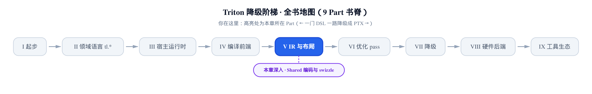
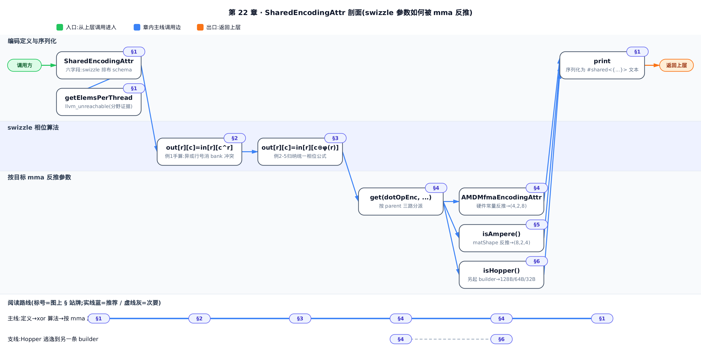
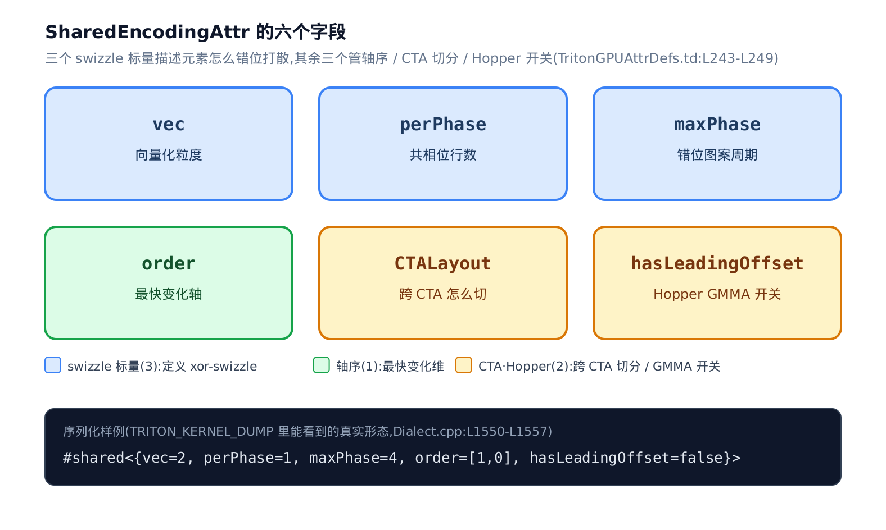
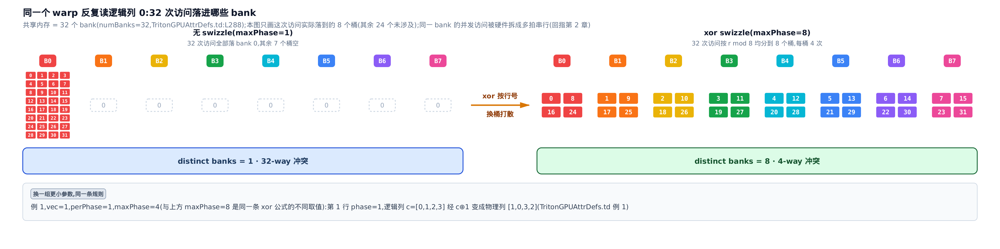
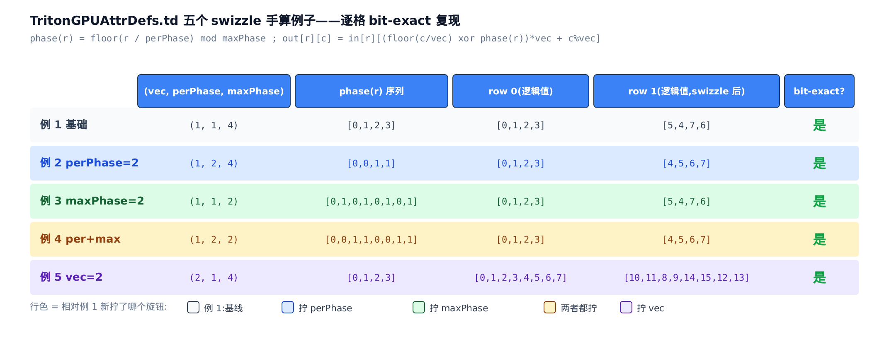
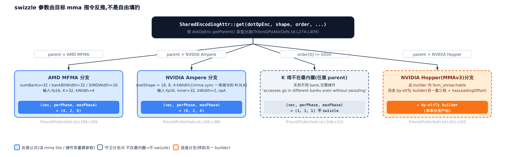

# Shared 编码与 swizzle：共享内存里如何避开 bank 冲突



> **你在这里** ——第 V 部分「IR 与布局」的第三站。
> 上一章：distributed 布局把张量元素分给寄存器里的每个线程。
> 本章：换一套心智模型——元素摆进共享内存，怎么摆才不撞 bank。
> 下一章：一个抽象把所有布局统一成线性代数。

上一章你学会给张量戴上 **distributed 编码**（分布式布局，管「每个线程分到哪几个元素、访存连不连续」）的帽子，落点是寄存器与 global 访存的合并。但同一个张量在数据流里还会换一顶帽子：当它要喂给 Tensor Core（GPU 里做矩阵乘的专用硬件单元）做矩阵乘，编译器先把它搬进**共享内存**（SRAM，片上一块所有线程都能直接读写的高速暂存），这时管它排布的就不再是 distributed，而是本章的主角 `SharedEncodingAttr`（共享内存编码属性，定义在 `include/triton/Dialect/TritonGPU/IR/TritonGPUAttrDefs.td:L155`）。它要解决的性能问题只有一个词：**bank 冲突**（bank conflict，共享内存被切成 32 个可并行访问的存储体，多个线程同时挤向同一个 bank 会被硬件强行串行化——硬件为什么这样，[第 2 章](../../ch02-gpu-execution-model/narrative/chapter.md)已经讲过，这里只用它的结论）。

这一章的性能杠杆就是**消 bank 冲突**。读完你能回答两个问题：一，为什么把 `in[r][c]` 存到 `out[r][c^phase]` 这么一个位运算，就能把原本挤在同一个 bank 的一整列访问打散开；二，`vec`／`perPhase`／`maxPhase` 这三个 swizzle 参数不是你或前端能拍脑袋填的，而是被下游那条 mma（matrix-multiply-accumulate，矩阵乘累加）指令的共享内存访问模式**反推钉死**的。这条 shared-memory 路径和上一章的 distributed 路径是**两套独立的心智模型**——一个管寄存器里怎么分，一个管共享内存里怎么摆——本章从头到尾都在跟上一章做对照。



只想弄清 xor swizzle 为什么能消 bank 冲突，读 §2、§3 就够；关心某条具体 mma 指令的参数是怎么反推出来的，直接跳 §4（AMD MFMA）或 §5（NVIDIA Ampere）；想跟全程从字段定义走到参数反推，按序读到 §6。

## §1 shared 布局不是「谁持有」，而是「怎么摆」

先把 stakes 立住。`SharedEncodingAttr` 的定义开头一段注释，一句话点破它和 distributed 的本质区别（`include/triton/Dialect/TritonGPU/IR/TritonGPUAttrDefs.td:L155-L164`）：

```cpp
# include/triton/Dialect/TritonGPU/IR/TritonGPUAttrDefs.td:L155-L164
def SharedEncodingAttr : TritonGPU_Attr<"SharedEncoding", "shared_encoding"> {
  let mnemonic = "shared";

  let description = [{
An encoding for tensors whose elements may be simultaneously accessed by
different cuda threads in the programs, via shared memory. In other words,
for all indices i \in Z^d, \mathcal{L}(i) = {0, 1, ..., 32*num_warps - 1}.

In order to avoid shared memory bank conflicts, elements may be swizzled.
Here are some examples.  In all cases, the input tensor is [0, 1, ..., n-1].
```

关键是那行布局函数（`num_warps` 是一个 program 里的 warp 数，一个 warp 固定 32 个 lane）：

```math
\mathcal{L}(i) = \{0,\ 1,\ \dots,\ 32 \cdot \mathrm{num\_warps} - 1\}
```

上一章的 distributed 编码，`` $`\mathcal{L}(i)`$ `` 把每个下标 `i` 映到**某一个**线程——元素归它私有。shared 这里把每个下标映到**全体**线程：这块共享内存里的任一元素，所有线程都能经共享内存同时访问。**元素不归谁私有，swizzle 只是为了让大家同时访问时不撞 bank。** 这就是本章第一句要你记住的话。

这个分野在代码里有一处硬证据。distributed 布局的核心问题是「每个线程分到几个元素」，可 shared 布局对这个问题直接拒答（`lib/Dialect/TritonGPU/IR/Dialect.cpp:L947-L957`）：

```cpp
# lib/Dialect/TritonGPU/IR/Dialect.cpp:L947-L957
SmallVector<unsigned>
SharedEncodingAttr::getElemsPerThread(ArrayRef<int64_t> shape,
                                      Type eltTy) const {
  llvm_unreachable("getElemsPerThread is not supported for shared layout");
  return SmallVector<unsigned>();
}
unsigned SharedEncodingAttr::getTotalElemsPerThread(ArrayRef<int64_t> shape,
                                                    Type eltTy) const {
  llvm_unreachable("getElemsPerThread is not supported for shared layout");
  return 0;
}
```

`getElemsPerThread`（返回「每个线程持有几个元素」的接口）在 shared 上是 `llvm_unreachable`（MLIR 里标「不该走到这」的断言，走到就崩）。上一章那些 Blocked／MMA 编码全都实现了它，shared 偏偏不实现——因为对一块「大家共享访问」的内存问「每线程几个」是没意义的。这是两套心智模型在源码层面的第一道分水岭。

### 六个字段：一张排布说明书

那 `SharedEncodingAttr` 到底怎么描述「元素在共享内存里怎么摆」？靠六个字段（`include/triton/Dialect/TritonGPU/IR/TritonGPUAttrDefs.td:L240-L250`）：

```cpp
# include/triton/Dialect/TritonGPU/IR/TritonGPUAttrDefs.td:L240-L250
  // swizzle info: vec, perPhase, maxPhase
  // order: the fastest-changing axis first
  let parameters = (
    ins
    "unsigned":$vec,
    "unsigned":$perPhase,
    "unsigned":$maxPhase,
    ArrayRefParameter<"unsigned">:$order,
    "CTALayoutAttr":$CTALayout,
    "bool":$hasLeadingOffset
  );
```

把这六个字段分成三组看（下图）：



- **三个 swizzle 标量**：`vec`（向量化搬运的不可拆粒度）、`perPhase`（多少连续行共用一次错位）、`maxPhase`（错位图案多少行循环一次）。这三个是本章 §2、§3 的绝对主角，合起来定义一次 xor 错位。
- **`order`**：最快变化轴在前（`the fastest-changing axis first`），即「沿哪个维度看 bank 冲突」。它直接决定要不要 swizzle——§4 会看到，K 维不落最内圈时压根不用错位。
- **`CTALayout`（跨 CTA 切分）+ `hasLeadingOffset`（Hopper GMMA 硬件 swizzle 开关）**：两个收尾字段，处理 Hopper 这一代的 CGA（协作线程组）与硬件 swizzle，§6 补。

这六个字段不是凭空来的抽象。最朴素的构造函数就是让调用方直接把三个 swizzle 标量填进去（`include/triton/Dialect/TritonGPU/IR/TritonGPUAttrDefs.td:L252-L260`）：

```cpp
# include/triton/Dialect/TritonGPU/IR/TritonGPUAttrDefs.td:L252-L260
  let builders = [
    AttrBuilder<(ins "unsigned":$vec,
                     "unsigned":$perPhase,
                     "unsigned":$maxPhase,
                     "ArrayRef<unsigned>":$order,
                     "CTALayoutAttr":$CTALayout), [{
        bool hasLeadingOffset = false; // default value
        return $_get(context, vec, perPhase, maxPhase, order, CTALayout, hasLeadingOffset);
    }]>,
```

`hasLeadingOffset` 默认 `false`，也就是走非 Hopper 的软件 swizzle 路径。记住这条「直接给参数」的朴素路径——它是 §4 那条会自动反推参数的巨型构造函数的对照组。

最后，这六个字段会被序列化成一段你亲眼能看到的文本。打开 `TRITON_KERNEL_DUMP`（环境变量，让编译器把每级 IR——中间表示——落盘）你会在 IR dump 里读到 `#shared<{...}>`，它就是下面这个 `print` 打出来的（`lib/Dialect/TritonGPU/IR/Dialect.cpp:L1549-L1558`）：

```cpp
# lib/Dialect/TritonGPU/IR/Dialect.cpp:L1549-L1558
void SharedEncodingAttr::print(AsmPrinter &printer) const {
  printer << "<{"
          << "vec = " << getVec() //
          << ", perPhase = " << getPerPhase()
          << ", maxPhase = " << getMaxPhase() //
          << ", order = [" << getOrder() << "]";
  maybePrintCTALayout(getContext(), printer, getCTALayout(),
                      /*rank=*/getOrder().size());
  printer << ", hasLeadingOffset = " << getHasLeadingOffset() << "}>";
}
```

于是抽象字段接回了你能观测的东西：`#shared<{vec=2, perPhase=1, maxPhase=4, order=[1,0], hasLeadingOffset=false}>`。接下来两节，我们就把 `vec`／`perPhase`／`maxPhase` 这三个数字逐个讲透。

## §2 xor swizzle 命门：`out[r][c]=in[r][c^phase]` 为什么消冲突

先给一个能装进脑子的画面。把共享内存的一列想成**一摞牌全塞进了同一个格子**（bank）：一个 warp 的 32 个 lane 想同时把整列取出来，硬件却只能一张一张递给你——这就是 bank 冲突把并行访问拆成多拍串行（[第 2 章](../../ch02-gpu-execution-model/narrative/chapter.md)讲过原理，32 个访问全撞一个 bank 就是 32-way 冲突、32 倍延迟）。xor swizzle 干的事，是**按行号给每行错一格**：第 `r` 行的列号统一异或 `r`，这摞牌就被摊到好几个不同格子，一次并行取完。

下图把「消冲突」这件事一眼摆清：



左边未 swizzle，32 个 lane 读同一逻辑列，物理列全相同 → 全落 bank 0 → `distinct_banks=1`、32-way 冲突；右边 xor swizzle（`maxPhase=8`），按行号错位后摊到 8 个 bank → 4-way。**冲突从 32 倍延迟降到 4 倍，这就是 swizzle 消冲突的全部机理。**

### 手算例 1：一行一相位

`.td` 的注释里现成给了五个逐步加料的手算例子。最基础的例 1（`include/triton/Dialect/TritonGPU/IR/TritonGPUAttrDefs.td:L166-L175`）：

```cpp
# include/triton/Dialect/TritonGPU/IR/TritonGPUAttrDefs.td:L166-L175
1. Basic swizzling

  #shared<{vec=1, perPhase=1, maxPhase=4, order=[1,0]}>
  [ 0,  1,  2,  3],  // xor with 0
  [ 5,  4,  7,  6],  // xor with 1
  [10, 11,  8,  9],  // xor with 2
  [15, 14, 13, 12]   // xor with 3

Here elements of row r are xor'ed with r (or more properly, in[r][c] ->
out[r][c^r]).
```

输入张量是行主序的 `[0, 1, …, 15]`（第 `r` 行原本是 `[4r, 4r+1, 4r+2, 4r+3]`）。规则就一句：`out[r][c] = in[r][c^r]`，第 `r` 行的每个列号异或 `r`。逐行手算，逐格对上注释里那张表：

<!-- trace: xor-swizzle-core -->

| 行 `r` | phase = `r % maxPhase`(=4) | 逻辑列 0,1,2,3 → 物理列 `c^phase` | out 行（逻辑值 `r*4`+物理列） | 与 .td 例 1 一致？ |
|---|---|---|---|---|
| 0 | 0 | [0, 1, 2, 3] | [0, 1, 2, 3] | 是 |
| 1 | 1 | [1, 0, 3, 2] | [5, 4, 7, 6] | 是 |
| 2 | 2 | [2, 3, 0, 1] | [10, 11, 8, 9] | 是 |
| 3 | 3 | [3, 2, 1, 0] | [15, 14, 13, 12] | 是 |

看第 1 行：逻辑列 `[0,1,2,3]` 异或 1 得物理列 `[1,0,3,2]`，取出的值就是 `[5,4,7,6]`——和注释 `// xor with 1` 那行一字不差。四行全对得上。

### 为什么偏偏是 xor

这里藏着一个「一句话换一层理解」的洞见：**对固定的行 `r`，映射 `` $`c \mapsto c \oplus r`$ `` 是 `{0,1,…,n-1}` 上的一个置换**（`n` 是 2 的幂）。异或一个常量在 2 的幂宽度上是双射——每个输出值恰有一个输入，不碰撞、不丢元素。所以同一行内 `n` 个元素被打到 `n` 个**互不相同**的物理列（行内自己不冲突）；而跨行时 `phase(r)` 取遍不同值，同一条逻辑列 `c` 在不同行落到 `c⊕phase(r)`，于是被摊到 `maxPhase` 个不同 bank。基例（行内是排列）加归纳步（跨行相位不同），就证明了 swizzle 既不破坏行内、又打散了列。

量化一下这个「打散」值多少：一个 warp 沿列方向读，冲突倍数是

```math
\mathrm{conflict} = \Big\lceil \frac{R}{\min(R,\ \mathrm{maxPhase})} \Big\rceil
```

`R` 是参与读的行数——因为 `phase(r)` 在 `0..maxPhase-1` 上循环取值，`R` 行按余数分组后，每组大约 `R/maxPhase` 行会落进同一个 bank，最挤的那个 bank 就决定了冲突倍数，取上取整是因为行数不一定整除 `maxPhase`。用 32 行读同一逻辑列实测：无 swizzle（相位恒 0）全落 1 个 bank，32-way；`maxPhase=8` 落 8 个 bank，降到 4-way；`maxPhase=4` 落 4 个 bank，8-way。**`maxPhase` 每翻一倍，冲突倍数减半，直到 `maxPhase` 追平行数就一点不剩。**

至于「为什么不用加法或取模来错位」——xor 有三条别的运算给不了的好处：它**自逆**（错两次自动复原，读写用同一套地址算术）、**无进位**（不会把错位溢出到高位污染别的元素）、而且**一条位运算**就能在硬件地址计算里零开销完成。设计者选它不是随手，是这三条一起决定的。

## §3 三个旋钮凑出一条统一公式

例 1 只动了「一行一相位」。真实的 swizzle 还要能表达「几行共用一相位」「图案多少行循环」「一次搬几个元素不许拆」——这正是 `perPhase`、`maxPhase`、`vec` 三个旋钮各管的一个自由度。`.td` 从例 2 到例 5 每次只拧一个，最后凑出一条统一公式。

**例 2 拧 `perPhase`**（`include/triton/Dialect/TritonGPU/IR/TritonGPUAttrDefs.td:L177-L186`）：

```cpp
# include/triton/Dialect/TritonGPU/IR/TritonGPUAttrDefs.td:L177-L186
2. Multiple rows per phase

  #shared<{vec=1, perPhase=2, maxPhase=4, order=[1,0]}>
  [ 0,  1,  2,  3],  // phase 0 (xor with 0)
  [ 4,  5,  6,  7],
  [ 9,  8, 11, 10],  // phase 1 (xor with 1)
  [13, 12, 15, 14]

Elements of row r are xor'ed with r/2.  In other words, perPhase=2
means that pairs of 2 rows get the same swizzling.
```

异或值从 `r` 改成 `⌊r/perPhase⌋`（整除）。`perPhase=2` 意思是**每 2 行共用一个相位**：第 0、1 行都异或 0（原样），第 2、3 行都异或 1。为什么允许相邻两行不错开？因为当一个 bank 行的宽度容得下不止一行元素时，这几行本就落在不同 bank、不冲突，不必分开打散。`perPhase` 就是「几行本来就不打架，可以共相位」。

**例 3 拧 `maxPhase`**（`include/triton/Dialect/TritonGPU/IR/TritonGPUAttrDefs.td:L188-L201`）：

```cpp
# include/triton/Dialect/TritonGPU/IR/TritonGPUAttrDefs.td:L188-L201
3. Max-phase applied

  $shared<{vec=1, perPhase=1, maxPhase=2, order=[1,0]}>
  [ 0,  1,  2,  3],  // phase 0 (xor with 0)
  [ 5,  4,  7,  6],  // phase 1 (xor with 1)
  [ 8,  9, 10, 11],  // phase 0
  [13, 12, 15, 14],  // phase 1
  [16, 17, 18, 19],  // ...
  [21, 20, 23, 22],
  [24, 25, 26, 27],
  [29, 28, 31, 30]

Elements of row r are xor'ed with (r/2) % 2.  In other words, maxPhase=m has the
effect of limiting the maximum value of the xor to m-1.
```

（顺带一提：这行 `$shared` 是原注释的一个笔误，应为 `#shared`；逐字保留，别被它绊住。）异或值再对 `maxPhase` 取模，把相位封顶在 `0..maxPhase-1` 循环。`maxPhase=2` 就是相位只在 0、1 之间来回——图案两行一循环。`maxPhase` 是「错位图案的行周期」，也就是这一列最多能被摊到几个 bank。

**例 4 两个一起拧**（`include/triton/Dialect/TritonGPU/IR/TritonGPUAttrDefs.td:L203-L217`）：

```cpp
# include/triton/Dialect/TritonGPU/IR/TritonGPUAttrDefs.td:L203-L217
4. Max-phase and per-phase

  #shared<{vec=1, perPhase=2, maxPhase=2, order=[1,0]}>
  [ 0,  1,  2,  3],  // phase 0 (xor with 0)
  [ 4,  5,  6,  7],  // phase 0
  [ 9,  8, 11, 10],  // phase 1 (xor with 1)
  [13, 12, 15, 14],  // phase 1
  [16, 17, 18, 19],  // phase 0
  [20, 21, 22, 23],  // phase 0
  [25, 24, 27, 26],  // phase 1
  [29, 28, 31, 30]]  // phase 1

Here the xor value (the "phase", I guess?) changes every perPhase rows, up to a
maximum value of maxPhase-1.  In other words, elements of row r are xor'ed with
(r/2) % 2.
```

到这里注释自己给出了合并后的相位公式：**相位每 `perPhase` 行变一次，封顶到 `maxPhase-1`**，写成一行就是

```math
\phi(r) = \big(\lfloor r/\mathrm{perPhase}\rfloor\big) \bmod \mathrm{maxPhase}
```

`` $`\phi(r)`$ `` 就是第 `r` 行要异或的那个数（相位）。`perPhase` 当分母（几行共相位），`maxPhase` 当模数（图案多久重复）——两个旋钮正交，各调各的。

**例 5 拧 `vec`**（`include/triton/Dialect/TritonGPU/IR/TritonGPUAttrDefs.td:L219-L237`）：

```cpp
# include/triton/Dialect/TritonGPU/IR/TritonGPUAttrDefs.td:L219-L237
5. Adding vec

  #shared<{vec=2, perPhase=1, maxPhase=4, order=[1,0]}>
  [ 0,  1,  2,  3,  4,  5,  6,  7],
  [10, 11,  8,  9, 14, 15, 12, 13],
  [20, 21, 22, 23, 16, 17, 18, 19],
  [30, 31, 28, 29, 26, 27, 24, 25]

When vec=2, elements are swizzled in pairs of 2.  In other words, the element at
(r,c) has value

  ((c / 2) ^ r) * 2 + (c % 2).

For MMAv3 eg Hopper GMMA, hasLeadingOffset should be true. In this case,
when the matrix is stored in shared memory, there will be an offset not
only in the stride dimension, but also in the leading dimension. For example,
a matrix of size 16x128 and data type I8 is stored in the shared memory with
64B-swizzle mode. The offset of the element with index (0, 64) will be 16*64,
compared to 1*64 when the hasLeadingOffset is false.
```

`vec=2` 是「以 2 个元素为一个不可拆的整体来错位」。为什么要不可拆？因为向量化 ld/st（load/store，一条指令一次搬 `vec` 个连续元素）不能被打散——搬运的最小单元是 `vec`，swizzle 只能作用在「第几个 `vec` 组」上，组内的 `c % vec` 位保持不动。注释给的闭式正是这个意思——先把列号除以 2 分组，组号异或 `r`，再乘回 2，最后补上组内偏移：

```math
\mathrm{out}[r][c] = \big((c/2)\oplus r\big)\cdot 2 + (c \bmod 2)
```

### 一条公式复现全部五例

把三个旋钮合起来，就是全章的统一 swizzle 公式：

```math
\mathrm{out}[r][c] = \mathrm{in}[r]\Big[\big(\lfloor c/\mathrm{vec}\rfloor \oplus \phi(r)\big)\cdot \mathrm{vec} + (c \bmod \mathrm{vec})\Big]
```

`` $`\lfloor c/\mathrm{vec}\rfloor`$ `` 是「第几个 vec 组」，异或相位 `` $`\phi(r)`$ `` 后乘回 `vec`、补上组内位 `` $`c \bmod \mathrm{vec}`$ ``。`vec=1` 时它退化成 `out[r][c]=in[r][c⊕φ(r)]`（例 1-4）；`vec=2` 时给出例 5 的闭式。下面这张表把五个例子并排，用同一条公式逐格复现，每一格都和 `.td` 手写表 bit-exact：



<!-- trace: swizzle-five-examples -->

| 例 | (vec, perPhase, maxPhase) | phase(r) 逐行 | 复现表前两行（逻辑值） | 与 .td bit-exact？ |
|---|---|---|---|---|
| 1 基础 | (1, 1, 4) | [0,1,2,3] | [0,1,2,3] / [5,4,7,6] | 是 |
| 2 perPhase=2 | (1, 2, 4) | [0,0,1,1] | [0,1,2,3] / [4,5,6,7] | 是 |
| 3 maxPhase=2 | (1, 1, 2) | [0,1,0,1,0,1,0,1] | [0,1,2,3] / [5,4,7,6] | 是 |
| 4 per+max | (1, 2, 2) | [0,0,1,1,0,0,1,1] | [0,1,2,3] / [4,5,6,7] | 是 |
| 5 vec=2 | (2, 1, 4) | [0,1,2,3] | [0,1,2,3,4,5,6,7] / [10,11,8,9,14,15,12,13] | 是 |

这三个标量为什么能各调各的、互不干扰：`vec` 只决定异或作用在第几个 vec 组（组内 `c % vec` 位纹丝不动），`perPhase` 只改 `phase(r)` 的行分母，`maxPhase` 只改 `phase(r)` 的取模上界——三者各管一个自由度，谁也不碰谁的地盘。正因如此，这条公式对任意 `(vec, perPhase, maxPhase)` 组合都成立，不止这五组。那么问题来了：一次具体编译里，这三个数字究竟填几？下一节揭晓——它们不是你填的。

例 5 末尾还冒出了 `hasLeadingOffset` 那段，讲的是 Hopper GMMA 的硬件 swizzle，放到 §6 再收。

## §4 swizzle 参数不是拍脑袋——被目标 mma 指令反推钉死

这是全章的第三个、也是最重的论点。前面一直把 `vec`／`perPhase`／`maxPhase` 当已知数在算，可它们从哪来？答案：编译器在一个巨型构造函数里，**看下游那条 mma 指令一次要从共享内存读多大一块 tile，反推出正好把那块访问打散到不同 bank 的参数**。像照着门框的尺寸裁门——门框（mma tile）定了，门（swizzle）的尺寸就被钉死。

这个入口是 `SharedEncodingAttr::get(dotOpEnc, shape, order, CTALayout, typeWidthInBit, needTrans)`（`include/triton/Dialect/TritonGPU/IR/TritonGPUAttrDefs.td:L274-L409`）。它按 `dotOpEnc`（`DotOperandEncodingAttr`，dot 操作数编码，携带 `opIdx`＝A 是 0／B 是 1、`kWidth`（dot 操作数沿 K 维方向、单个线程一次连续持有／搬运的元素数，决定了 tile 的 K 维宽度）、以及 `parent`＝目标 mma 编码）的 `parent` 类型分派到 MFMA／WMMA／Volta／Ampere／Hopper 各自的反推公式：



<!-- trace: mma-driven-derivation -->

| 目标 mma(parent) | 关键硬件锚 | 具体输入 | 反推出 (vec,perPhase,maxPhase) | 出处 |
|---|---|---|---|---|
| AMD MFMA | numBanks=32/bankBitWidth=32/SIMDWidth=16 | fp16, K=32, kWidth=4 | (4, 2, 8) | TritonGPUAttrDefs.td:L288-L299 |
| NVIDIA Ampere | matShape={8,8,4·kWidth} | fp16, inner=32, kWidth=2, A | (8, 2, 4) | TritonGPUAttrDefs.td:L366-L380 |
| 任意（K 维不在最内圈） | accesses go in different banks even without swizzling | order[0]≠kDim | (1, 1, 1) 不 swizzle | TritonGPUAttrDefs.td:L306-L310 |
| NVIDIA Hopper（MMAv3） | 此 builder llvm_unreachable → 改走 by-eltTy builder | isHopper() | → by-eltTy 三档 + hasLeadingOffset | TritonGPUAttrDefs.td:L401-L405 |

先看 AMD MFMA（Matrix Fused Multiply-Add，AMD 的矩阵乘指令）这一支，它把「参数被硬件钉死」讲得最干净（`include/triton/Dialect/TritonGPU/IR/TritonGPUAttrDefs.td:L282-L311`）——代码顶上那行注释 `begin GFX908/GFX90A`（GFX908/GFX90A：AMD MI100／MI200 的 CDNA 架构代号，对应本节这条 MFMA 分支）标出了它服务的硬件世代：

```cpp
# include/triton/Dialect/TritonGPU/IR/TritonGPUAttrDefs.td:L282-L311
        // ---- begin GFX908/GFX90A ----
        if (auto mfmaEnc = mlir::dyn_cast<AMDMfmaEncodingAttr>(dotOpEnc.getParent())) {
          int kDimNum = dotOpEnc.getOpIdx() == 0 ? 1 : 0;
          if (needTrans)
            kDimNum = 1 - kDimNum;
          bool isKDimInner = (order[0] == kDimNum);
          if (isKDimInner) {
            const int numBanks = 32;
            const int bankBitWidth = 32;
            const int SIMDWidth = 16;

            // number of inner dimension rows per one pattern repeat
            int innerDimLength = shape[order[0]];
            int elemsPerOneBanksRow = (numBanks * bankBitWidth) / typeWidthInBit;

            int perPhase = std::max(1, elemsPerOneBanksRow / innerDimLength);
            // vecSize is set to kWidth of the dotop layout
            int vecSize = dotOpEnc.getKWidth();
            int maxPhase = std::min(SIMDWidth / perPhase, innerDimLength / vecSize);

            // TODO (zhanglx): figure out better parameters for mfma4
            if (mfmaEnc.getMDim() == 4)
              maxPhase = 4;

            return get(context, vecSize, perPhase, maxPhase, order, CTALayout);
          } else {
            // Do not swizzle in case k dimension is not innermost.
            // In this case accesses will go in different banks even without swizzling.
            return get(context, 1, 1, 1, order, CTALayout);
          }
        }
```

三个细节值得停一下。

其一，`kDimNum`（K 维应该排在 `order` 的第几位）先按 `opIdx` 猜一次——A 操作数（`opIdx==0`）猜 1、B 猜 0——`needTrans` 再决定要不要反着来。`needTrans` 标记这个操作数喂给 mma 前是否需要转置（例如 B 矩阵在共享内存里按行存，但 mma 要求按列读，就得转置一次）：一旦需要转置，原本按未转置形状算出的 K 维位置就跟着换了边，`kDimNum = 1 - kDimNum` 正是这次换位。下面 §5 的 Ampere 分支里 `m`／`k` 按 `needTrans` 互换，是同一个道理。

其二，`numBanks=32`、`bankBitWidth=32`、`SIMDWidth=16`（AMD 一个 SIMD 单元一拍执行的 lane 数）全是**写死的硬件常量**——参数的量纲全锚在硬件上，没有一处是可调的。

其三，`else` 分支正是本章命门的反证：`isKDimInner` 为假（K 维不在最内圈）时，直接返回 `(1,1,1)` **不 swizzle**，注释写得明白——`accesses will go in different banks even without swizzling`。若访问的连续维天然就跨不同 bank，swizzle 是纯浪费。**这句话反过来坐实：swizzle 只为消 bank 冲突服务，冲突不存在就不做。**

### MFMA 逐步反推

把 `isKDimInner` 为真那支的算术，用 fp16（16 位半精度）、`innerDimLength=32`、`kWidth=4` 代进去逐行走一遍：

<!-- trace: mfma-param-derivation -->

| 步 | 源码表达式(file:L) | 代入 | 值 |
|---|---|---|---|
| 1 | elemsPerOneBanksRow=(numBanks·bankBitWidth)/typeWidthInBit (L294, 常量 L288-L289) | (32·32)/16 | 64 |
| 2 | perPhase=max(1, elemsPerOneBanksRow/innerDimLength) (L296) | max(1, 64/32) | 2 |
| 3 | vecSize=dotOpEnc.getKWidth() (L298) | kWidth | 4 |
| 4 | maxPhase=min(SIMDWidth/perPhase, innerDimLength/vecSize) (L299, SIMDWidth=16 @L290) | min(16/2, 32/4)=min(8,8) | 8 |

一步步的量纲直觉是这样：`elemsPerOneBanksRow` 是「一整轮 32 个 bank（每 bank 32 bit）能装几个这种类型的元素」＝64；`perPhase` 是「一个 bank 行装得下几整行」＝64/32＝2（这么多行本就不冲突，共用一相位）；`vec` 直接取向量搬运宽度 `kWidth`＝4；`maxPhase` 被 SIMD 宽度和可用组数双重封顶＝min(8,8)＝8。结果 `(4,2,8)`——`maxPhase=8` 意味着这块共享内存的列读被打散到 8 个 bank，冲突降到 1/8。

每一步的分子分母不是硬件常量就是张量尺寸，**没有一处可以拍脑袋**。换个输入验证这点：fp16／`K=64`／`kWidth=4` 时，`innerDim` 翻倍使 `perPhase` 从 2 降到 1、`maxPhase` 从 8 升到 16，结果 `(4,1,16)`——参数随张量尺寸确定性地变，印证 `perPhase` 就是「一个 bank 行装得下几整行」的量纲。

## §5 Ampere 分支：`matShape` 把 vec 和 maxPhase 钉死

NVIDIA Ampere 这一支，把「参数被 mma 指令钉死」写得最字面（`include/triton/Dialect/TritonGPU/IR/TritonGPUAttrDefs.td:L364-L398`）：

```cpp
# include/triton/Dialect/TritonGPU/IR/TritonGPUAttrDefs.td:L364-L398
        // ---- begin Ampere ----
        if (mmaEnc.isAmpere()) {
          int perPhase = 128 / (shapePerCTA[order[0]] * 4 / dotOpEnc.getKWidth());
          perPhase = std::max<int>(perPhase, 1);
          std::vector<size_t> matShape = {8, 8, 4 * dotOpEnc.getKWidth()};
          int vecWidth = 32 / typeWidthInBit;
          if (vecWidth != dotOpEnc.getKWidth() && order[0] == inner) {
              perPhase = std::max<int>(perPhase, 2 * vecWidth);
          }
          int rank = order.size();
          // --- handle A operand ---
          if (opIdx == 0) { // compute swizzling for A operand
              int m = (needTrans) ? matShape[2] : matShape[0];
              int k = (needTrans) ? matShape[0] : matShape[2];
              int vec = (order[0] == rank-1) ? k : m;
              int mmaStride = (order[0] == rank-1) ? m : k;
              int maxPhase = mmaStride / perPhase;
              return get(context, vec, perPhase, maxPhase, order, CTALayout);
          }
          # … 省略：B operand 分支与 A 完全对称，把 m 换成 n、k 换成对应维即可 …
        }
```

命门在这一行：`matShape = {8, 8, 4 * kWidth}`。这三个数就是 Ampere `mma.sync`（一条 Tensor Core 指令）一次处理的 M／N／K tile 形状。往下看 A operand（`opIdx==0`）怎么用它：`vec` 取 `matShape` 的 K 维或 M 维（看 `order`），`maxPhase = mmaStride / perPhase`，而 `mmaStride` 也取自 `matShape`。**`vec` 和 `maxPhase` 两个参数的取值范围完全由 mma tile 决定，前端无从插手。** 逐步代进 fp16／`inner=32`／`kWidth=4`／A operand（选 `kWidth=4` 而非 2，是为了让 `matShape` 的 K 维和 M 维不相等，下面能看清 `order` 到底在挑哪一个）：

<!-- trace: ampere-param-derivation -->

| 步 | 源码表达式(file:L) | 代入 | 值 |
|---|---|---|---|
| 1 | perPhase=128/(shapePerCTA[order[0]]·4/kWidth) (L366), max(·,1) (L367) | 128/(32·4/4)=128/32 | 4 |
| 2 | matShape={8,8,4·kWidth} (L368) —— 目标 mma tile M,N,K | {8,8,4·4} | {8,8,16} |
| 3 | vecWidth=32/typeWidthInBit (L369)；≠kWidth，但 order[0]≠inner(1≠0)，条件仍不成立，不抬 perPhase (L370-372) | 32/16=2 (≠kWidth=4，但 order[0]≠inner) | 2 |
| 4 | opIdx==0: k=matShape[2], m=matShape[0]; vec=k(order0==rank-1) (L377-378) | vec=matShape[2]=16 | 16 |
| 5 | mmaStride=m (L379); maxPhase=mmaStride/perPhase (L380) | maxPhase=8/4 | 2 |

结果 `(16,4,2)`：`m=matShape[0]=8`、`k=matShape[2]=4·kWidth=16`——这次 `k≠m`，`vec` 到底取哪个就看得出 `order` 在做选择了：`order[0]==rank-1`（K 维落在最快变化轴）时 `vec` 取 `k=16`；若 `order[0]≠rank-1`，`vec` 会取 `m=8` 而不是 `16`。这正是分支代码 `vec=(order[0]==rank-1)?k:m` 存在的意义。（`kWidth=2` 时 `k=m=8`，两个分支的结果碰巧相同，看不出区别——这是我们改用 `kWidth=4` 的原因。）`maxPhase=mmaStride/perPhase=8/4=2`，列读打散到 2 个 bank。

这里两类量纲各归其位，值得点破：把 `inner` 从 32 换成 64，结果变成 `(16,2,4)`——`vec` 恒为 `matShape[2]=16` **不随 inner 变**（它锚在 mma tile 上），而 `perPhase`／`maxPhase` 随张量尺寸调整（锚在张量上：`perPhase` 从 4 降到 2、`maxPhase` 从 2 升到 4）。`vec` 由指令钉死、`perPhase` 由数据尺寸决定，这就是「swizzle 参数被下游 mma 指令钉死」最直接的代码证据：换一条 mma 指令，`matShape` 变，swizzle 参数跟着变。

至此第三个论点闭环。回头看 §4 那张分派表的第三行——K 维不在最内圈时返回 `(1,1,1)` 不 swizzle——和这里的 `matShape` 反推是一体两面：参数只为消 bank 冲突而生，有冲突就按 mma tile 精确反推，没冲突就干脆不做。

§4 分派表里还提过一句的 Volta（`isVolta()` 分支）与 WMMA（AMD GFX11 那一支，GFX11：AMD RDNA3 架构代号，对应 WMMA——Wave Matrix Multiply-Accumulate——指令分支）呢？它们是同一套「`perPhase`＝128 字节（一轮 32 bank×4B）除以连续维字节数、`maxPhase` 由目标 mma 的打散度封顶」骨架的另两种特化——具体系数不同（Volta 多一层 `is_vec4`／`pack_size` 特判，WMMA 干脆把 `maxPhase` 写死成 `16/perPhase`），但反推逻辑的骨架和 AMD MFMA、NVIDIA Ampere 一模一样。你不需要记住这些系数，只需要知道：这套「被目标 mma 访问模式钉死」的反推逻辑，覆盖了 Triton 支持的全部目标 mma 世代，没有例外。

## §6 两个收尾字段：Hopper 硬件 swizzle 与跨 CTA 切分

前面五节讲的是软件 swizzle（编译器算地址偏移）。还剩两个字段收尾，都跟 Hopper（NVIDIA H100 那一代）有关。

**`hasLeadingOffset`——Hopper GMMA 的硬件 swizzle 开关。** Hopper 的 MMAv3（GMMA，第三代 mma）不走 §4 那条 dotOperand 反推路径。你回头看巨型构造函数里 Hopper 那支，它直接 `llvm_unreachable`（`include/triton/Dialect/TritonGPU/IR/TritonGPUAttrDefs.td:L400-L408`）：

```cpp
# include/triton/Dialect/TritonGPU/IR/TritonGPUAttrDefs.td:L400-L408
        // ---- begin version 3 ----
        if (mmaEnc.isHopper()) {
          llvm_unreachable("SharedEncodingAttr builder when the MMAEncodingAttr"
                           " is Hopper has not been implemented yet");
          return $_get(context, 1, 1, 1, order, CTALayout, true);
        }

        // ---- not implemented ----
        llvm_unreachable("unsupported swizzling for provided MMA version");
```

这解释了为什么 Hopper 参数不出现在那条巨型 `if` 链里——它改由另一条按元素类型选 swizzle 模式的构造函数承担（`include/triton/Dialect/TritonGPU/IR/TritonGPUAttrDefs.td:L430-L456`）：

```cpp
# include/triton/Dialect/TritonGPU/IR/TritonGPUAttrDefs.td:L430-L456
    AttrBuilder<(ins "ArrayRef<int64_t>":$shape,
                     "ArrayRef<unsigned>":$order,
                     "CTALayoutAttr":$CTALayout,
                     "Type":$eltTy), [{
        auto shapePerCTA = getShapePerCTA(CTALayout.getCTASplitNum(), shape);

        int32_t eleBitWidth = eltTy.getIntOrFloatBitWidth();
        int32_t vec = 128 / eleBitWidth, perPhase = 1, maxPhase = 1;

        // get proper shared memory swizzling mode from the contiguous dimension
        // size of the origin blocked layout.
        auto contigDimSizeInByte = shapePerCTA[order[0]] * eleBitWidth / 8;
        if (contigDimSizeInByte >= 128 && contigDimSizeInByte % 128 == 0) {
          perPhase = 1;
          maxPhase = 8;
        } else if (contigDimSizeInByte >= 64 && contigDimSizeInByte % 64 == 0) {
          perPhase = 2;
          maxPhase = 4;
        } else if (contigDimSizeInByte >= 32 && contigDimSizeInByte % 32 == 0) {
          perPhase = 4;
          maxPhase = 2;
        } else {
          llvm_unreachable("unsupported shared memory layout for MMAv3");
        }

        return $_get(context, vec, perPhase, maxPhase, order, CTALayout, true);
    }]>
```

它按连续维的字节数落进三档硬件 swizzle 模式，每档钉死 `(perPhase, maxPhase)`，末位 `hasLeadingOffset=true`：

| 连续维字节数 | swizzle 模式 | (perPhase, maxPhase) | vec |
|---|---|---|---|
| ≥128 且整除 128 | 128B | (1, 8) | 128/eltBit |
| ≥64 且整除 64 | 64B | (2, 4) | 128/eltBit |
| ≥32 且整除 32 | 32B | (4, 2) | 128/eltBit |

注意三档的 `perPhase × maxPhase` 都等于 8，正是硬件 swizzle 图案固定的 8 行周期。`hasLeadingOffset=true` 的语义在例 5 末尾那段注释里：GMMA 存进共享内存时，不只在 stride 维、连 leading 维也带偏移（`16x128` 的 I8 矩阵用 64B-swizzle 模式，元素 `(0,64)` 的偏移是 `16*64` 而非 `1*64`）。软件 swizzle 是编译器算地址，硬件 swizzle 是 GPU 按物理地址自己错——这是第六个字段存在的全部理由。

**`CTALayout`——跨 CTA 怎么切。** 第五个字段 `CTALayoutAttr` 描述张量在一个 CGA（Cooperative Grid Array，Hopper 引入的协作线程组，一组 CTA 能共享彼此的共享内存）里怎么切分（`include/triton/Dialect/TritonGPU/IR/TritonGPUAttrDefs.td:L80-L96`）：

```cpp
# include/triton/Dialect/TritonGPU/IR/TritonGPUAttrDefs.td:L80-L96
The tensor is divided up into CTASplitNum pieces, which are distributed among
the CTAsPerCGA thread blocks.  Each CTA processes a subtensor of shape
`tensor_shape / CTASplitNum`.

Example 0: The tensor shape is [64, 128] and, there are two CTAs, each
processing half the tensor [64, 64]. Then CTAsPerCGA = [1, 2] and
CTASplitNum = [1, 2].

Example 1: The tensor shape is [64, 128] and, there are two CTAs, both
processing the complete tensor [64, 128]. This happens when multicast is
enabled. In this case, CTAsPerCTA = [1, 2] but CTASplitNum = [1, 1].
# … 省略：Example 2 各操作数的 CTASplitNum 具体取值 …
```

两个字段一对比就懂：`CTAsPerCGA` 是「CGA 里有几个 CTA」，`CTASplitNum` 是「张量切成几片」。两者相等（例 0）＝切开分给各 CTA；`CTASplitNum` 小于 `CTAsPerCGA`（例 1）＝**multicast**（同一片广播到多个 CTA）。这两个字段属次要论点，知道它们在描述 Hopper CGA 的跨 CTA 切分即可。

## §7 总结：两条访存路径，两把不同的尺

回到开篇那个性能问题。这一章你多了一把量共享内存的尺：

- **`SharedEncodingAttr` 描述的是「元素在共享内存里怎么摆」**，六个字段里三个 swizzle 标量是主角。它和上一章的 distributed 编码是[两套心智模型](../../ch21-distributed-layouts/narrative/chapter.md)——distributed 管寄存器/global 路径的合并访存（每线程分到谁），shared 管共享内存路径的 bank 冲突（大家共享的元素怎么错开）。同一张量在数据流不同阶段戴不同帽子，`getElemsPerThread` 在 shared 上 `llvm_unreachable` 就是这道分野的代码印章。（布局即函数的总观见[第 20 章](../../ch20-layout-is-a-function/narrative/chapter.md)，这里不重讲。）
- **xor swizzle 消 bank 冲突的机理**：`out[r][c]=in[r][c^φ(r)]`，异或的自逆＋无进位＋一条位运算，把同一逻辑列打散到 `maxPhase` 个 bank，冲突降到 1/maxPhase。`.td` 五个手算例子逐格 bit-exact 佐证了统一公式。
- **参数被下游 mma 指令钉死**：`vec`／`perPhase`／`maxPhase` 不是你填的。AMD MFMA 靠 `numBanks`/`SIMDWidth` 硬件常量反推 `(4,2,8)`，NVIDIA Ampere 靠 mma tile 的 `matShape={8,8,4·kWidth}` 反推 `(8,2,4)`，Hopper 另起一条按字节数分三档，K 维不落最内圈时干脆 `(1,1,1)` 不 swizzle。

**所以你写 kernel 时能做的决策是什么？** 当你的 matmul 慢在共享内存这一段，别去手调 swizzle——它由 mma 指令的 tile 形状定死了。真正的抓手在**你选的数据类型、K 维大小、以及 dot 操作数的连续维是不是 K**：这些通过 `kWidth`、`innerDim`、`order` 反推出 swizzle 参数，进而决定列读打散到几个 bank。看懂了这条反推链，你就能预判某个 tile 配置会不会退化成 `(1,1,1)` 不 swizzle、或者 `maxPhase` 够不够大压住冲突。

本章只讲到 `SharedEncodingAttr` 怎么**描述**排布。这三个标量最终怎么落成每个元素的物理地址偏移——`lib/Dialect/TritonGPU/IR/LinearLayoutConversions.cpp:L366-L368` 把 `getVec()`/`getPerPhase()`/`getMaxPhase()` 读出来做的那套线性代数——是本书后面讲 LinearLayout（把所有布局统一成线性映射的抽象）时的内容。而 mma／dot-operand 编码本身为什么长这样、`matShape` 从哪来，留到后面讲 Tensor Core 与 mma 布局那一章深入。这一章只需你记住一件事：**共享内存里 swizzle 消 bank 冲突，参数被目标 mma 指令的访问模式钉死。**
