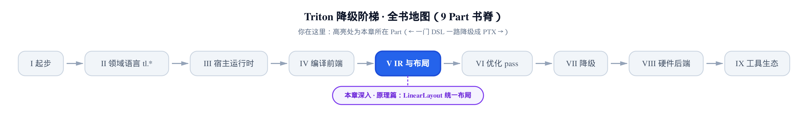
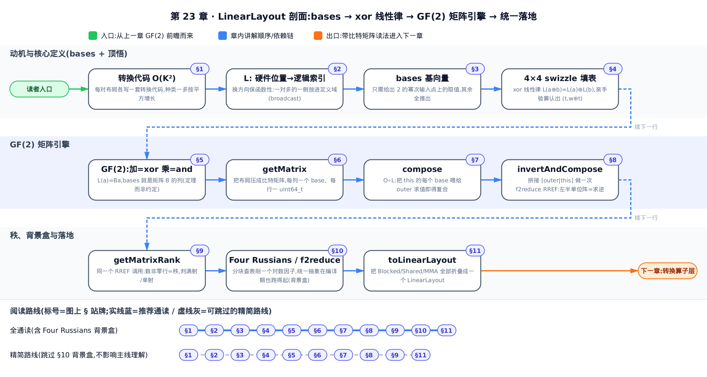
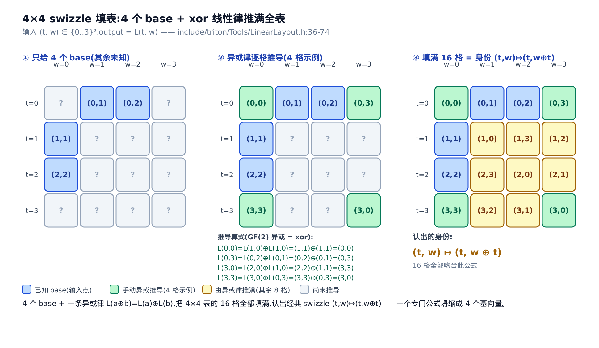
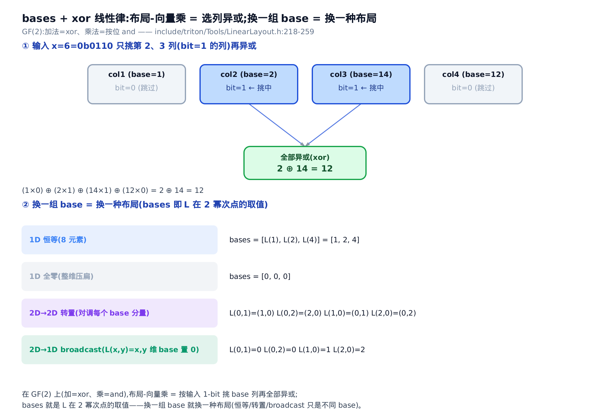

# LinearLayout：一个抽象统一所有布局



> **你在这里** ——第 V 部分「IR 与布局」的收官高潮。
> 前两章：[Distributed 家族](../../ch21-distributed-layouts/narrative/chapter.md)与 [Shared 的 swizzle](../../ch22-shared-encoding-swizzle/narrative/chapter.md)，各讲一族布局。
> 本章：一条异或线性律，统一以上全部。
> 下一章：带着统一模型，去读布局转换的算子层。

[第 20 章](../../ch20-layout-is-a-function/narrative/chapter.md)结尾我们许过一个愿：布局函数 $`\mathcal{L}`$ 不是一张任意的对照表，而是二元域 GF(2)（两元素域，只有 0 和 1，加法是异或）上的 **线性映射** ——那里只给了结论一句，说展开留给专门一章。本章就是兑现。

先说这件事跟你的 kernel 性能有什么关系。每次 `tl.dot` 前后的布局切换、每次寄存器到共享内存的搬运，编译器都要算一笔账：**哪个线程手里的哪个值，该搬到哪**。老办法是每对布局写一段专门的转换代码——布局种类一多，成对代码按平方增长，新硬件的新布局形态就加不动了。Triton 的答案叫 **LinearLayout**（线性布局，下文简称 LL；想法归功于 Adam P. Goucher，`include/triton/Tools/LinearLayout.h:L20` 逐字）：把每种布局压成同一种数据——几个 **基向量（bases）** ；把每种转换压成同一个算法——GF(2) 上的矩阵求逆。学术出处是论文 arXiv:2505.23819《Linear Layouts: Robust Code Generation of Efficient Tensor Computation Using F2》，其摘要的说法是：用 $`\mathbb{F}_2`$ 上的线性代数建模布局，实现 *generic layout-to-layout conversions, eliminating the quadratic explosion*（通用的布局间转换，消除二次爆炸）。读完本章，「布局转换」对你就不再是黑魔法，而是一次可以手算的行化简——后面各优化 pass 里所有关于减少布局转换的账，都记在这套代数上。



全通读按 §1→§11 顺序即可；赶时间的话，§10 的 Four Russians 只是解释矩阵引擎为何跑得快的背景盒，跳过它直接从 §9 走到 §11 也不影响主线理解。

本章符号先立好，后文随用随查：

| 符号 | 含义 | 首现 |
|---|---|---|
| $`\mathcal{L}`$ | [第 20 章](../../ch20-layout-is-a-function/narrative/chapter.md)的布局函数：张量索引 → 允许访问该处的线程集合 | 开篇 |
| $`L`$ | LinearLayout：硬件位置 → 逻辑张量索引的函数，本章揭示它是 GF(2) 线性映射 | §2 |
| $`\oplus`$ | GF(2) 的加法，就是按位异或（xor）；布局求值只用它，无乘法 | §4 |
| $`\mathbb{F}_2`$ | 二元域 GF(2)＝{0,1}：加法＝xor，乘法＝按位 and | §5 |
| $`B_j`$ | 第 j 个基向量（base）＝ $`L`$ 在 2 的幂次输入点上的取值 | §3 |
| $`L(a)=Ba`$ | 布局写成比特矩阵-向量乘：$`B`$ 每列一个 base | §5 |
| $`O\circ L`$ | 布局复合：先跑 $`L`$ 再跑 $`O`$ | §7 |
| $`B^{-1}`$ | 布局求逆：比特矩阵在 GF(2) 上的逆，由行化简得到 | §8 |
| $`(t,w)\mapsto(t,w\oplus t)`$ | 经典 swizzle 布局的身份，§4 的 4×4 表填满后就是它 | §4 |

## §1 每族布局各写各的规则——转换代码二次爆炸

[第 20 章](../../ch20-layout-is-a-function/narrative/chapter.md)把 encoding 定义成函数 $`\mathcal{L}`$，并用逐格座位表把它讲到能对账。但那之后的两章暴露了一个问题：**表太多了**。[第 21 章](../../ch21-distributed-layouts/narrative/chapter.md)里 Blocked 用三元组逐级相乘、Slice 靠回填投影、MMA（Tensor Core 矩阵乘加指令）按硬件世代排布，各有各的 index 算术；[第 22 章](../../ch22-shared-encoding-swizzle/narrative/chapter.md)的 Shared 编码又带一套 swizzle 相位公式。每加一种布局，就要加一个布局类、一套求值代码，还要给 **它与既有每种布局之间** 的转换各写一段——种类数为 $`K`$ 时是 $`O(K^2)`$ 段成对代码。

LinearLayout.h 的头注释把设计意图讲得很直白（`include/triton/Tools/LinearLayout.h:L76-L85`）：

```cpp
// include/triton/Tools/LinearLayout.h:L76-L85
// Indeed the whole point of LLs is that they allow us to specify transposed and
// swizzled layouts as a "general case".  Instead of a layout class for
// registers in a thread, and another layout for registers in a thread but in
// MMAv2 order, and so on, all of these can be represented by different LLs.
// This gets rid of special cases and lets us write more general code.
//
// In this example, L was a 2D -> 2D function, but LLs are general MD -> ND
// functions.  In practice, a GPU register layout usually has input dims (reg,
// thread-id, warp-id, block-id), where reg represents the fact that one thread
// may store values for the tensor in multiple registers.
```

转置、swizzle 这些过去的「特殊情况」，全都变成同一个「一般情况」的不同实例。这个一般情况是什么？答案分四步：换方向（§2）、压成 bases（§3）、用异或律求值（§4-§5）、把复合与求逆交给矩阵行化简（§6-§9）。最后 §11 看它如何把前两章的所有布局收编。

## §2 先换个方向：从硬件位置出发，布局才是一个函数

LL 与 $`\mathcal{L}`$ 描述同一件事——值放在哪——但方向相反。$`\mathcal{L}`$ 从张量索引出发问「谁能访问」；LL 从硬件位置出发问「装的是哪个元素」。定义与全章最关键的事实（key fact）在头注释开篇（`include/triton/Tools/LinearLayout.h:L18-L34`）：

```cpp
// include/triton/Tools/LinearLayout.h:L18-L34
// # High-level overview of linear layouts
//
// The idea for linear layouts is due to Adam P. Goucher.
//
// In Triton, a linear layout (LL) is a function that maps from a "hardware
// location" to a "logical tensor index".
//
// For example, suppose we have a 2D tensor T stored in GPU registers.  T's
// layout (i.e., L) is the function that, given a "hardware location" tuple of
// (thread-id, warp-id), returns an index (x,y) into T.  In other words, if
// L(t,w) = (x,y) is our linear layout func, then a register in thread t in warp
// w contains the value T[x,y].
//
// The key fact about LLs is, the mapping from (t,w) to (x,y) is not arbitrary.
// We only need to specify the value of L(t,w) at certain special points
// (namely, the values L(t,0) and L(0,w) where t and w are powers of 2), and
// from those we can compute all the other values of L.
```

为什么非要换方向？因为同一件货可以放进仓库的好几个格子，但每个格子只装一件货。[第 20 章](../../ch20-layout-is-a-function/narrative/chapter.md)讲过，broadcast 时一个张量元素同时住在多个线程手里——若从张量索引出发，一个输入对多个输出，就 **不是函数** 了。源码专门解释了这个设计决策（`include/triton/Tools/LinearLayout.h:L169-L181`）：

```cpp
// include/triton/Tools/LinearLayout.h:L169-L181
// ## Why map hardware loc -> tensor index and not the other way around?
//
// In Triton, a linear layout usually tells us which logical tensor value is
// stored at a particular place in the hardware.  For example, an LL might map
// the tuple (thread-id, warp-id, block-id) to a 2D index into a tensor, (x,y),
// meaning that the register at (t,w,b) has value tensor[x,y].  Or it might map
// from a shared memory (offset, block) to a tensor index.
//
// It might seem more natural to go the other way around, from tensor index to
// place in the hardware.  But a particular tensor[x,y] value might be stored in
// more than one place in the hardware, so if we went in this direction, the
// layout would no longer be a proper function.  This would complicate
// everything else.
```

这里有个点透一层的工程真义：**「一对多」的那一侧永远放进定义域，函数性就是白拿的**。代价是 LL 一般不是单射——多个硬件位置可以映到同一个逻辑元素（`LinearLayout.h:L164-L167`），这恰好就是「同一元素存多份」的正面表达，§9 求秩时我们还会用它。真实的 GPU 寄存器布局里，输入维通常是 `(reg, thread-id, warp-id, block-id)` 四元组（上面 `:L82-L85` 已给出）——`reg` 表示一个线程可能用多个寄存器各存一个元素，LL 是一般的多维到多维函数。

## §3 bases：一个布局压缩成一小组基向量

上面 key fact 说：只需给出 $`L`$ 在「2 的幂次输入点」上的取值，其余全部函数值都能推出来。这些特殊取值就叫 **基向量（basis vectors / bases）** （`LinearLayout.h:L46-L47` 逐字）。它像背乘法表——你其实只背了少数几行，其余靠规律推；LL 更极致，一个 4×4 输入域的 2D→2D 布局看似要填 16 格，实际 **只需选 4 个值**：$`L(1,0)`$、$`L(2,0)`$、$`L(0,1)`$、$`L(0,2)`$。

「换一组 bases 就换一种布局」不是修辞。头注释列了六个例子（`include/triton/Tools/LinearLayout.h:L106-L148`），摘三个最有代表性的：

```cpp
// include/triton/Tools/LinearLayout.h:L106-L148
// # Examples of linear layouts
//
// 1. The 1D identity layout.  This maps L(x) = x.
//
//    Recall that our bases are the values of L(x) where x is a power of two.
//    So for e.g. an 8-element layout, we have L(1) = 1, L(2) = 2, L(4) = 4, and
//    therefore our bases are [1, 2, 4].
//
// … 省略：例 2（1D 全零布局，bases = [0, 0, 0]）、例 3（2D→2D 恒等布局） …
//
// 4. A 2D -> 2D transpose layout.  For a 4x4 layout, we have:
//
//    - L(0,1) = (1,0)
//    - L(0,2) = (2,0)
//    - L(1,0) = (0,1)
//    - L(2,0) = (0,2).
//
// … 省略：例 5（1D→1D 重排布局） …
//
// 6. A 2D -> 1D broadcasted layout.  L(x,y) = x.  For a 4x4 -> 4 layout, our
//    bases are
//
//    - L(0,1) = 0
//    - L(0,2) = 0
//    - L(1,0) = 1
//    - L(2,0) = 2.
```

对照例 3 的恒等布局（$`L(0,1){=}(0,1)`$、$`L(1,0){=}(1,0)`$，各分量原样返回），看例 4 和例 6 各改了什么：**转置＝把每个 base 的两个分量对调；broadcast＝把某一维的 base 全部置零**（该维取什么值都不再影响输出，这一维被「压扁」了）。过去各写一个布局类的操作，现在都是「换一组 bases」。

这不只是数学抽象，`LinearLayout` 类真的就存这么点东西（`include/triton/Tools/LinearLayout.h:L313-L323`）：

```cpp
// include/triton/Tools/LinearLayout.h:L313-L323
class LinearLayout {
private:
  // bases[inDim][i] = L(0, ..., inDim=2^i, ..., 0).  All other values of L are
  // computed by xor'ing bases together, using the linearity rule.  In addition:
  //
  // - Each inDim has the same set of outDims, in the same order.
  // - The order of dims is minor-to-major, although this only affects reshape.
  llvm::MapVector<StringAttr /*inDim*/,
                  std::vector<std::vector<int32_t> /*size=getNumOutDims()*/>
                  /*size=getInDimSizeLog2(inDim)*/>
      bases;
```

`MapVector`（LLVM 的保序映射容器）以 `StringAttr`（MLIR 驻留字符串属性，这里当维度名用，如 `"lane"`、`"warp"`）为键，值就是每个输入维在其各个 2 的幂次点上的 $`L`$ 值列表。字段注释第一行就是本章的中心命题：**其余一切函数值，靠把 bases 异或起来算**（"xor'ing bases together, using the linearity rule"）。这条 linearity rule（线性律）是下一节的主角。

## §4 xor 线性律：亲手填满一张 4×4 swizzle 表

bases 只钉住了「2 的幂次输入」上的值，其余格子靠一条规则补全。头注释把规则和一个 **可以亲手验算的 4×4 例子** 摆在一起——这段注释是全章的顿悟抓手，值得逐字读完（`include/triton/Tools/LinearLayout.h:L36-L74`）：

```cpp
// include/triton/Tools/LinearLayout.h:L36-L74
// Here's an example LL where we have 4 warps and 4 threads per warp, and the
// tensor T has shape 4x4.  We define the function L by choosing the values of
// L(0,1), L(0,2), L(1,0), and L(2,0).  Our choices are shown below.
//
//               t/w    0     1     2    3
//               0      ? (0,1) (0,2)    ?
//    L(t,w) =   1  (1,1)     ?     ?    ?
//               2  (2,2)     ?     ?    ?
//               3      ?     ?     ?    ?
//
// You only need to specify these four values to define the whole linear layout.
// These special values are called the "basis vectors" or "bases" of the layout.
// We complete the table by xor'ing together the bases, according to the
// following rule.  (I write "⊕" for xor.)
//
//    L(t1 ⊕ t2, w1 ⊕ w2) = L(t1, w1) ⊕ L(t2, w2)  (linearity rule).
//
// The linearity rule plus our four choices allows us to fill in the whole
// table.  Here's how we might compute some of the values.
//
//    L(0,0) = L(1 ⊕ 1, 0 ⊕ 0) = L(1,0) ⊕ L(1,0) = (1,1) ⊕ (1,1) = (0,0)
//    L(0,3) = L(0 ⊕ 0, 2 ⊕ 1) = L(0,2) ⊕ L(0,1) = (0,2) ⊕ (0,1) = (0,3)
//    L(3,0) = L(2 ⊕ 1, 0 ⊕ 0) = L(2,0) ⊕ L(1,0) = (2,2) ⊕ (1,1) = (3,3)
//    L(3,3) = L(3 ⊕ 0, 0 ⊕ 3) = L(3,0) ⊕ L(0,3) = (3,3) ⊕ (0,3) = (3,0).
//
// (Notice it's a consequence of the linearity rule that L(0,0) = (0,0), no
// matter what values we chose for the table.)
//
// The whole table looks like this.
//
//              t/w   0     1     2     3
//              0  (0,0) (0,1) (0,2) (0,3)
//    L(t,w) =  1  (1,1) (1,0) (1,3) (1,2)
//              2  (2,2) (2,3) (2,0) (2,1)
//              3  (3,3) (3,2) (3,1) (3,0).
//
// Careful readers will recognize this as a classic "swizzled" layout where
// (t, w) -> (t, w ⊕ t).  To go from this formula to an LL, you only need to
// compute the results at input points (0,1), (0,2), (1,0), and (2,0).
```

规则本身就一行——任何输入拆成两半，函数值等于两半函数值的异或（`LinearLayout.h:L49-L51`；arXiv:2505.23819 称之为 $`\mathbb{F}_2`$-线性性）：

```math
L(t_1 \oplus t_2,\ w_1 \oplus w_2) \;=\; L(t_1, w_1) \oplus L(t_2, w_2)
```

其中 $`t_1, t_2, w_1, w_2`$ 是任取的输入坐标，$`\oplus`$ 是按位异或。这条规则为什么够用？因为任意非负整数都能 **唯一** 拆成若干个 2 的幂次之异或（就是它的二进制展开）：$`a = \bigoplus_{i:\,a_i=1} 2^i`$，$`a_i`$ 是 $`a`$ 的第 $`i`$ 个二进制位。反复套线性律，就得到「求任意点＝挑中若干 bases 再异或」：

```math
L(a) \;=\; L\Big(\bigoplus_{i:\,a_i=1} 2^i\Big) \;=\; \bigoplus_{i:\,a_i=1} L(2^i)
```

右边的每个 $`L(2^i)`$ 都是 base——这正是 §3 说「其余全部能推出」的机制本体（`LinearLayout.h:L31-L34`）。还有一条白送的推论：把 $`x`$ 和自己异或得 0，所以

```math
L(0) \;=\; L(x \oplus x) \;=\; L(x) \oplus L(x) \;=\; 0
```

无论 bases 怎么选，$`L(0,0)`$ 永远是 $`(0,0)`$——线性函数必过原点（`LinearLayout.h:L61-L62` 特意点出）。这也解释了为什么 bases 里没有 $`L(0,0)`$ 这一项：它没有信息量。

现在拿笔跟着填表。四个 base 是 $`L(0,1){=}(0,1)`$、$`L(0,2){=}(0,2)`$、$`L(1,0){=}(1,1)`$、$`L(2,0){=}(2,2)`$，每一格的算法：把输入坐标拆成 2 的幂次，挑出对应 base，逐分量按位异或。

<!-- trace: m3-xor-linearity-4x4 -->

| 目标格 L(t,w) | 输入按 2 幂次拆分 | 代 base 异或式 | 逐分量异或 | 结果 (x,y) | 对照身份 (t, w⊕t) |
|---|---|---|---|---|---|
| L(0,0) | t=1⊕1, w=0⊕0 | L(1,0)⊕L(1,0) | (1,1)⊕(1,1) = (1⊕1, 1⊕1) | (0,0) | (0, 0⊕0)=(0,0) ✓ |
| L(0,3) | t=0, w=2⊕1 | L(0,2)⊕L(0,1) | (0,2)⊕(0,1) = (0⊕0, 10₂⊕01₂) | (0,3) | (0, 3⊕0)=(0,3) ✓ |
| L(3,0) | t=2⊕1, w=0 | L(2,0)⊕L(1,0) | (2,2)⊕(1,1) = (10₂⊕01₂, 10₂⊕01₂) | (3,3) | (3, 0⊕3)=(3,3) ✓ |
| L(3,3) | t=3, w=3(用 L(3,0)⊕L(0,3)) | L(3,0)⊕L(0,3) | (3,3)⊕(0,3) = (11₂⊕00₂, 11₂⊕11₂) | (3,0) | (3, 3⊕3)=(3,0) ✓ |
| L(2,1) | t=2, w=1 | L(2,0)⊕L(0,1) | (2,2)⊕(0,1) = (2⊕0, 10₂⊕01₂) | (2,3) | (2, 1⊕2)=(2,3) ✓ |

全程只有异或，零次乘法。注意最后一列：每个结果都吻合 $`(t, w \oplus t)`$。把 16 格全部填完（源码 `:L66-L70` 给了完整答案，上表任选几格可自行复核），你会「认出」这张表的身份——它就是经典的 **swizzle 布局** $`(t,w)\mapsto(t,w\oplus t)`$（`LinearLayout.h:L72-L74` 逐字）。[第 22 章](../../ch22-shared-encoding-swizzle/narrative/chapter.md)你已经见过它的亲戚：SharedEncodingAttr 列坐标里的 $`\lfloor c/\mathrm{vec}\rfloor \oplus \mathrm{phase}(r)`$，正是同款「坐标交叉异或」项。那里 swizzle 是一条专门的相位公式；在 LL 里，它只是「base 里带了交叉项」的普通布局——4 个基向量，一条异或律，完整表示。



两个还没回答的问题得说清楚，否则填表只是巧合。**其一，填表结果唯一吗？** 同一格往往有多种拆法（$`L(3,3)`$ 也可拆成 $`L(3,0)\oplus L(0,2)\oplus L(0,1)`$）。答案是唯一：输入的二进制展开唯一，而异或满足交换律与结合律，任何拆法最终都化成「同一批 bases 的异或」，与分组方式无关——填表良定义。**其二，压缩率是多少？** 4 个 base 完全决定 16 个函数值；一般地，$`M`$ 个输入 bit 的布局只需存 $`M`$ 个 base，却决定 $`2^M`$ 个函数值——指数级压缩。这就是 §3 那个 `MapVector` 字段敢只存几个向量的底气。

## §5 为什么是 GF(2)：线性律不是巧合

「线性律」三个字用得理直气壮，是因为 LL 真的是线性代数——只是把标量域换了。头注释的数学背景小节给出通用定义（`LinearLayout.h:L188-L212`）：线性函数就是能写成

```math
L(a) \;=\; a_1 B_1 \oplus a_2 B_2 \oplus \cdots \oplus a_M B_M \;=\; Ba
```

的函数（下标从 1 起数，$`B_j`$ 对应 §4 里 $`2^{j-1}`$ 那个幂次点）。这里 $`a = [a_1,\dots,a_M]`$ 是输入向量、$`a_i`$ 是标量系数，$`B_j`$ 是第 $`j`$ 个基向量，$`B`$ 是把各 $`B_j`$ 排成列的 $`N \times M`$ 矩阵——$`M`$ 个输入 bit 进、$`N`$ 个输出 bit 出。普通线性代数里标量取实数；LL 把标量域换成 GF(2)，加法和乘法同时被替换（`include/triton/Tools/LinearLayout.h:L214-L266`）：

```cpp
// include/triton/Tools/LinearLayout.h:L214-L266
// Usually when we do linear algebra, the field 𝔽 from which `ai` and `bij` are
// drawn is the real or complex numbers.  But in linear layouts, we let	𝔽 be a
// different field: GF(2).
//
// GF(2) is the two-element field of bits.  To define a field, I need to give
// you the set of elements and also addition and multiplication operations.  For
// GF(2) the elements are simply {0,1}.  We define addition as xor, and
// multiplication as binary `and`.
//
// … 省略：4×4 比特矩阵-向量乘的逐位展开写法 …
//
// This works, but it's cumbersome.  It's more compact to think of the vector
// `a` as an M-bit integer, and each column Bi of the matrix B as an N-bit
// integer.  Here's the same matrix-vector product written this way.
//
//   = | 1 2 14 12 | × 6
//   = | 1 2 14 12 | × 0b0110
//   = (1 × 0) ⊕ (2 × 1) ⊕ (14 × 1) ⊕ (12 × 0)
//   = 2 ⊕ 14
//   = 12.
//
// Notice that the function F(a) is fully specified by the matrix B, and that
// the four columns of B tell us the values of F at power-of-two values for `a`,
// namely F(1), F(2), F(4), and F(8).
```

在 GF(2) 里系数 $`a_i`$ 只能取 0 或 1，「乘法＝and」意味着每个 base 要么整个被选中（$`a_i=1`$），要么整个被丢弃（$`a_i=0`$）；「加法＝xor」意味着把选中的 bases 异或起来。于是矩阵-向量乘退化成上面那个紧凑算法：**把输入当成 M-bit 整数，按它的每个 1-bit 挑出对应列，全部异或**。注释里的数值例可当场心算复核：输入 $`6 = 0b0110`$，1-bit 在第 2、3 位，挑中列值 2 和 14，$`2 \oplus 14 = 12`$。

注释最后一句把 §3 的 key fact 从「约定」升格成「定理」：矩阵 $`B`$ 的第 $`j`$ 列，恰好就是 $`F`$ 在 2 的幂次点 $`F(2^{j-1})`$ 的取值——bases 不是人为规定的接口，是线性函数在 GF(2) 上的 **必然坐标**。§4 那条 xor 线性律同样不是巧合，它就是「$`L`$ 在 GF(2) 上线性」这句话本身。回忆 §3 的恒等、转置（对调分量）、broadcast（某维置零）——它们之所以能统一用「换一组 base」表达，正是因为矩阵-向量乘在 GF(2) 上退化成「按输入位选列、再异或」。



多维输入怎么办？源码的处理很朴素：把多维输入的 bit「摞」成一个 1D 位串，做常规 1D 计算，再拆回多维（`LinearLayout.h:L266-L277`）。此时 §4 的多维线性律退化成最朴素的形式：

```math
L(x \oplus y) \;=\; L(x) \oplus L(y)
```

这正是「线性函数」定义的一部分（`LinearLayout.h:L268-L277` 称之为 1D linearity rule，并收束道：*That's all we need in order to define linear layouts mathematically!*）。定义 LL 需要的数学，到此为止全齐了。接下来是收获季：既然布局是矩阵，布局代数就是矩阵代数。

## §6 布局变成比特矩阵：getMatrix

从这一节起进入 `lib/Tools/LinearLayout.cpp`。第一步是把「bases 的列表」物化成真正的比特矩阵——`getMatrix` 干的就是 §5 里「每列一个 base」那件事（`lib/Tools/LinearLayout.cpp:L65-L113`）：

```cpp
// lib/Tools/LinearLayout.cpp:L65-L113
// Build a matrix of size sum(outDimSizeLog2) x sum(inDimSizeLog2) representing
// the bases of the given layout.  This can then be used by f2reduce.
//
// This function is called from the constructor of LinearLayout, so be careful
// not to use any functions that create LLs in here.
std::unique_ptr<uint64_t[]> getMatrix(const LinearLayout &layout) {
  int numRows = layout.getTotalOutDimSizeLog2();
  int numCols = layout.getTotalInDimSizeLog2();

  // Don't handle giant LLs.  This makes some things easier; for example, each
  // row can be a single uint64_t.
  assert(numCols <= 64 && "LinearLayout too large");
  assert(numRows <= 64 && "LinearLayout too large");

  // Suppose we have a layout specified by the following values.
  //
  //   L(0,1) = (0b01, 0b1)
  //   L(0,2) = (0b10, 0b0)
  //   L(1,0) = (0b10, 0b0)
  //   L(2,0) = (0b11, 0b0)
  //
  // We will create one column per entry above.  The max bit width of the
  // codomain is (2,1), so our matrix will have 2+1=3 rows.  The final matrix
  // will be
  //
  //  | L(0,1)[0] L(0,2)[0] L(1,0)[0] L(2,0)[0] |   | 0b1001 |
  //  |    ↓         ↓         ↓         ↓      |   | 0b0111 |
  //  | L(0,1)[1] L(0,2)[1] L(1,0)[1] L(2,0)[1] | = | 0b1000 |
  //  |    ↓         ↓         ↓         ↓      |
  //
  // … 省略：uint64_t 数组零初始化的写法提示 …
  std::unique_ptr<uint64_t[]> m(new uint64_t[numRows]());
  int r = 0;
  for (StringAttr outDim : layout.getOutDimNames()) {
    int c = 0;
    for (StringAttr inDim : layout.getInDimNames()) {
      for (int i = 0; i < layout.getInDimSizeLog2(inDim); i++) {
        uint64_t basis = layout.getBasis(inDim, i, outDim);
        for (int j = 0; j < layout.getOutDimSizeLog2(outDim); j++) {
          m[r + j] |= ((basis >> j) & 1) << c;
        }
        c++;
      }
    }
    r += layout.getOutDimSizeLog2(outDim);
  }

  return m;
}
```

行数＝输出 bit 总数，列数＝输入 bit 总数（各维尺寸取 log2 后求和——这就是 §5「摞成 1D」的落地）。函数开头的注释自带一个可核对的演算：4 个 base、输出位宽 (2,1) 共 3 行，摆出来的三行分别是 `0b1001`、`0b0111`、`0b1000`——你可以对着 4 个 base 的比特逐列验证（比如第一行是各 base 输出第一分量的最低位：1、0、0、1）。两个 `assert` 是清醒的工程取舍：**每行打包进一个 `uint64_t`（64 位无符号整数），布局最多 64 个输入/输出 bit**——真实 GPU 布局远小于此，换来矩阵操作的简单高效。

比特矩阵是布局的「DNA」提取物。有了它，布局代数就能交给一个通用的 GF(2) 消元引擎——先看两种代数运算长什么样。

## §7 复合：只对 base 求值，就是比特矩阵相乘

第一种运算是复合。契约在头文件（`include/triton/Tools/LinearLayout.h:L620-L637`）：

```cpp
// include/triton/Tools/LinearLayout.h:L620-L637（有省略）
  // Creates a new layout which is equivalent to running this layout, then
  // running `outer`.  That is,
  //
  //  - let this layout be L(x), and
  //  - let `outer` be O(x).
  //  - Then compose(outer) returns the layout (O∘L)(x), aka O(L(x)).
  //
  // … 省略：维度名匹配与尺寸的 Requires/Postcondition 条款 …
  [[nodiscard]] LinearLayout compose(const LinearLayout &outer) const;
```

$`(O \circ L)(x) = O(L(x))`$，先跑 $`L`$ 再跑 $`O`$。要算复合布局，天真做法是枚举全部输入逐个求值。但两次线性还是线性，复合布局也由它的 bases 唯一决定——而复合布局的第 $`i`$ 个 base 就是 $`O(L(2^i))`$。推一遍（对任意 $`x`$，先按 §4 把 $`L(x)`$ 拆开，再用 $`O`$ 的线性）：

```math
O(L(x)) \;=\; O\Big(\bigoplus_{i:\,x_i=1} L(2^i)\Big) \;=\; \bigoplus_{i:\,x_i=1} O\big(L(2^i)\big)
```

所以 **只需把 $`L`$ 的每个 base 喂给 $`O`$ 求值**，得到的就是复合布局的全部 bases——这等价于两个比特矩阵相乘（每列过一遍 $`O`$）。实现忠实于此，核心就一层对 bases 的循环（`lib/Tools/LinearLayout.cpp:L813-L841`）：

```cpp
// lib/Tools/LinearLayout.cpp:L813-L841（有省略）
LinearLayout LinearLayout::compose(const LinearLayout &outer) const {
  assertDimsEqualIgnoringOrder(getOutDimNames(), outer.getInDimNames());
  // … 省略：各 outDim 尺寸不超过 outer 对应 inDim 的断言 …

  BasesT newBases;
  for (const auto &[inDim, inDimBases] : bases) {
    auto &newInDimBases = newBases[inDim];
    for (const auto &basis : inDimBases) {
      SmallVector<std::pair<StringAttr, int32_t>> bases;
      for (auto [outDim, b] : llvm::zip(getOutDimNames(), basis)) {
        bases.push_back({outDim, b});
      }
      auto newBases = outer.apply(bases);
      auto newBasesRange = llvm::make_second_range(newBases);
      newInDimBases.push_back(
          std::vector<int32_t>(newBasesRange.begin(), newBasesRange.end()));
    }
  }
  // … 省略：复合结果满射性的判定 …
  return LinearLayout(std::move(newBases), llvm::to_vector(outer.outDims),
                      compositionIsSurjective);
}
```

`apply` 是 LinearLayout 的求值方法（输入索引 → 输出索引，内部就是 §5 的选列异或）。拿一组最小参数手推一遍：$`L`$ 与 $`O`$ 都是 1D→1D、2 个输入 bit（域共 4 个元素），$`L`$ 的 bases 为 `[2, 1]`，$`O`$ 的 bases 为 `[1, 3]`。复合 bases 按上式只需算两次：$`O(L(1))=O(2)=3`$、$`O(L(2))=O(1)=1`$，得 `composed=[3,1]`。它对 **非幂次** 输入也对吗？逐格验证：

<!-- trace: m6-compose -->

| 输入 x | L(x)=按 x 的 1-bit 选 L_base 异或 | O(L(x))=按 L(x) 的 1-bit 选 O_base 异或 | 用 composed=[3,1] 直接算 apply(composed,x) | 是否一致 |
|---|---|---|---|---|
| x=1 (base 位0) | L(1)=2 | O(2)=O_base1=3 | composed_base0 = O(L(1)) = 3 | 3=3 ✓ |
| x=2 (base 位1) | L(2)=1 | O(1)=O_base0=1 | composed_base1 = O(L(2)) = 1 | 1=1 ✓ |
| x=3 (=1⊕2, 非幂次) | L(3)=L(1)⊕L(2)=2⊕1=3 | O(3)=O(1)⊕O(2)=1⊕3=2 | 3⊕1 = 2 | 2=2 ✓ |
| x=0 | L(0)=0 | O(0)=0 | 0 | 0=0 ✓ |

第三行是关键：$`x=3`$ 不是 2 的幂次，`composed` 里没有为它存任何东西，但选列异或算出的 $`3 \oplus 1 = 2`$ 与老老实实先 $`L`$ 后 $`O`$ 的结果一致——上面的推导对全部 $`2^M`$ 个输入成立，不止对 bases。复合一个 $`M`$ 输入 bit 的布局只需 $`M`$ 次 `outer.apply`（本例 2 次），而非枚举 $`2^M`$ 个输入。「基向量足以定义整个映射」在这里第一次变成生产力。

## §8 求逆：拼接两张矩阵，做一次 RREF

真正的重头戏是布局 **转换**。典型场景在 `invertAndCompose` 的契约注释里（`include/triton/Tools/LinearLayout.h:L639-L672`）：

```cpp
// include/triton/Tools/LinearLayout.h:L639-L672（有省略）
  // Inverts or pseudo-inverts `outer` and composes it with `this`.
  //
  // Formally, if C = A.invertAndCompose(B), then for all x, C(x) = y implies
  // A(x) = B(y), or in other words A(x) = B(C(x)).  If B is invertible, then
  // C(x) = B^-1(A(x)), which is how this function gets its name.
  //
  // For example, suppose you have the following two LLs.
  //
  //   - R is an LL representing registers, mapping (lane, warp) to a 2D index.
  //   - S is an LL representing shared memory, mapping offset to a 2D index.
  //
  // Suppose you want to store tensor values from registers into shared memory.
  // That is, given a (lane, warp), you want to know the corresponding shared
  // memory offset to store into.
  //
  // This is equivalent to converting a (lane, warp) into a 2D index (i.e.
  // applying R), then converting a 2D index into a shmem offset (i.e. applying
  // the inverse of S).  R.invertAndCompose(S) computes this transformation.
  //
  // … 省略：对输出维名一致、S 满射、S 值域覆盖 R 值域的前置要求 …
  [[nodiscard]] LinearLayout invertAndCompose(const LinearLayout &outer) const;
```

读一遍这个例子就明白它为什么是布局转换的核心操作：寄存器布局 $`R`$ 说「(lane, warp) 手里是张量的哪一格」，共享内存布局 $`S`$ 说「offset 处放张量的哪一格」；要把寄存器的值存进共享内存，需要的正是「(lane, warp) → offset」＝ **先 $`R`$、再 $`S^{-1}`$** 。一般地，$`C = A.\mathrm{invertAndCompose}(B)`$ 求的是满足 $`A(x) = B(C(x))`$ 的 $`C`$；$`B`$ 可逆时 $`C = B^{-1} \circ A`$，函数名由此而来。

求逆怎么做？高斯消元的经典技巧：把 $`B`$、$`A`$ 两张比特矩阵 **水平拼接** 成 $`[B \mid A]`$，做 RREF（row-reduced echelon form，行最简梯形形——高斯消元一路做到每个主元列只剩一个 1 的规范终态）。RREF 的每一步都是可逆行变换，不改变各列间的线性关系；当左半被消成单位阵时，整套变换合起来就是「左乘 $`B^{-1}`$」，于是右半自动变成 $`B^{-1}A`$——正是 $`C`$ 的比特矩阵。实现逐句对应（`lib/Tools/LinearLayout.cpp:L887-L923`）：

```cpp
// lib/Tools/LinearLayout.cpp:L887-L923（有省略）
  auto [matThis, numRowsThis, numColsThis] = getInjectiveMat(*this);
  auto [matOuter, numRowsOuter, numColsOuter] = getInjectiveMat(
      outer.transposeOuts(llvm::to_vector(this->getOutDimNames())));

  // Concatenate `matOuter` and `matThis` horizontally (i.e. `matThis`
  // is to the right of `matOuter`).
  int combinedNumRows = std::max(numRowsThis, numRowsOuter);
  int combinedNumCols = numColsThis + numColsOuter;
  assert(combinedNumCols <= 64 && "Can't handle huge layouts");

  std::unique_ptr<uint64_t[]> m(new uint64_t[combinedNumRows]());
  for (int r = 0; r < numRowsOuter; r++) {
    m[r] = matOuter[r];
  }
  for (int r = 0; r < numRowsThis; r++) {
    m[r] |= matThis[r] << numColsOuter;
  }

  // Perform Gaussian elimination on `m`.  Because `outer` was modified to
  // be bijective, the first half of the matrix should be the identity
  // matrix.  The remaining half are the bases for the combined
  // transformation.
  //
  // … 省略：stride 参数以 64 位字为单位的说明 …
  f2reduce::inplace_rref_strided(m.get(), combinedNumRows, combinedNumCols,
                                 /*stride=*/1);

  // Check that the first half of the matrix is indeed the identity.
  for (int r = 0; r < std::min(numRowsOuter, numColsOuter); r++) {
    for (int c = 0; c < std::min(numColsOuter, numRowsOuter); c++) {
      if (((m[r] >> c) & 1) != (r == c ? 1 : 0)) {
        llvm::report_fatal_error("First half of the matrix was not the "
                                 "identity, bug in invertAndCompose");
      }
    }
  }
```

三处细节值得点破。其一，开头的 `getInjectiveMat`（`lib/Tools/LinearLayout.cpp:L115-L137`）先把两个布局都扩成单射：给全零列补一行新的 1，等价于给「压扁」的自由维补上可区分的坐标。对 `outer` 这样做是数学必须——非单射函数没有逆；对 `this` 也这样做则是工程偏好——当 $`C(x)`$ 有多个合法取值时（比如两个 block 存了同样的数据），选「不跨 block」的那个，因为跨 block 搬运昂贵（`:L850-L886` 的长注释专讲这个取舍）。其二，`m[r] |= matThis[r] << numColsOuter` 一行完成拼接——左移 `numColsOuter` 位，恰好把 $`A`$ 的矩阵贴到 $`B`$ 右边，比特打包的好处立现。其三，RREF 之后有一段运行期自检：左半必须是单位阵，否则 `report_fatal_error`（LLVM 的立即终止报错）——「$`B`$ 已被扩成双射」这一数学事实被写成了可执行断言。

拿一组小参数把整个流程手推一遍：$`A`$ 的 bases 为 `[3, 2]`，$`B`$ 的 bases 为 `[2, 3]`，都是 1D→1D、2 个输入 bit 且可逆。

<!-- trace: m7-invert-compose-rref -->

| 步骤 | 矩阵状态([matOuter=B \| matThis=A],GF(2)) | 关键判定 | 读出 |
|---|---|---|---|
| 1. bases→列打包 | matB(列=2,3)= 行[0 1 / 1 1]；matA(列=3,2)= 行[1 0 / 1 1] | 每列一个 base、每行一 uint64 | — |
| 2. 横向拼接 [B\|A] | 行0: [0 1 \| 1 0]；行1: [1 1 \| 1 1] | 左 2 列=B,右 2 列=A | combinedCols=4≤64 |
| 3. RREF 第一步(选主元 col0,交换两行) | 行0: [1 1 \| 1 1]；行1: [0 1 \| 1 0] | col0 主元就位 | — |
| 4. RREF 消 col1(行0 ⊕ 行1) | 行0: [1 0 \| 0 1]；行1: [0 1 \| 1 0] | 左半 = 单位阵 ✓(否则 report_fatal_error) | 右半 = C 的比特矩阵 |
| 5. 右半读回 bases | 右半列0=(0,1)ᵀ=2, 列1=(1,0)ᵀ=1 | C_bases=[2,1] | C = B⁻¹∘A |

GF(2) 里的消元步骤只有两种：换行、把一行异或到另一行——没有除法（唯一的非零标量是 1），比实数消元还干净。终止性也直观：每列至多产生一个主元、主元行号严格递增，至多 4 步（列数）必停。语义收口：对 $`x = 0,1,2,3`$ 逐一代入可验 $`A(x) = B(C(x))`$ 全部成立（例如 $`x=1`$：$`C(1)=2`$，$`B(2)=3`$，而 $`A(1)=3`$ ✓）。

![布局代数三件套：getMatrix 把 4 个 base 压成 3×4 比特矩阵；compose 只对每个 base 求值即得复合；invertAndCompose 拼接 [B|A] 做一次 RREF——左半消成单位阵、右半自动浮现复合 bases](../diagrams/fig-compose-invert-rref.png)

## §9 求秩也是它：一个 RREF 调用扛住全部重活

上一节 RREF 的执行者 `f2reduce::inplace_rref_strided`，来自仓库内置的 `third_party/f2reduce` 库，签名与位打包语义如下（`third_party/f2reduce/f2reduce.h:L7-L24`）：

```cpp
// third_party/f2reduce/f2reduce.h:L7-L24（有省略）
/**
 * Converts a matrix over F_2 into row-reduced echelon form.
 *
 * The matrix should be in row-major format. The stride parameter specifies
 * the offset (in 64-bit words, *not* bytes!) between successive rows of the
 * matrix, …
 *
 * We adopt 'little-endian' semantics: the element in row i and column j+64*k
 * of the matrix (zero-indexed) is given by (matrix[i * stride + k] >> j) & 1.
 *
 * The matrix is overwritten in place with its row-reduced echelon form.
 */
void inplace_rref_strided(uint64_t *matrix, uint64_t rows, uint64_t cols, uint64_t stride);
```

little-endian 位语义（第 $`i`$ 行第 $`j`$ 列＝ `(matrix[i*stride+k] >> j) & 1`）与 `getMatrix` 每行一个 `uint64_t` 的打包方式严丝合缝。这个函数在 `LinearLayout.cpp` 里被调用三次，扛住布局代数的全部重活：求逆复合（`:L912`，§8 刚看过）、求秩（`:L151`）、自由变量掩码（`:L966`）。看求秩这一处——秩回答的问题很实际：这个布局有几个「真正独立的旋钮」？（`lib/Tools/LinearLayout.cpp:L139-L159`）

```cpp
// lib/Tools/LinearLayout.cpp:L139-L159
// Compute the rank of the matrix formed by taking the bases for the given
// outDim as columns.  In other words, finds the number of linearly-independent
// bases for this output dimension.
int getMatrixRank(std::unique_ptr<uint64_t[]> m, int numRows, int numCols) {
  // f2reduce underflows if the number of cols is 0, return the rank early in
  // this case.
  if (numCols == 0) {
    return 0;
  }
  // stride is specified in number of 64-bit words per row, and we pack our
  // matrix so that there's only one uint64_t per row.
  assert(numCols <= 64);
  f2reduce::inplace_rref_strided(m.get(), numRows, numCols, /*stride=*/1);

  // The rank of the reduced matrix is simply the number of nonzero rows.
  int rank = 0;
  for (int i = 0; i < numRows; i++) {
    if (m[i] != 0)
      rank++;
  }
  return rank;
}
```

RREF 之后数非零行就是秩（主元个数，与消元顺序无关）。这站得住脚，正是 §8 说过的那条终止性——每列至多一个主元、主元行号严格递增、有限步必收敛到同一个约化终态，所以终态数出的非零行数是唯一确定的整数，不依赖消元顺序。它的用途是判定布局的满射/单射性——LL 对满射有激进的断言文化（`LinearLayout.h:L159-L163`）。举个 base 之间线性相关的例子：bases 为 `[1, 2, 3]`、输出声明 3 bit。第三个 base 是前两个的异或（$`3 = 1 \oplus 2`$），消元会把多出来的行消成零：

<!-- trace: m8-rank-rref -->

| 步骤 | 比特矩阵(3 列 = 3 个 base；3 行 = 输出 bit0/1/2) | 非零行数 | 结论 |
|---|---|---|---|
| 1. bases→列打包 | 行bit0=[1 0 1]；行bit1=[0 1 1]；行bit2=[0 0 0] | 2 | base 位2 列=(1,1,0)ᵀ = 前两列异或 → 相关 |
| 2. RREF(已近乎约化，col2 无主元) | 行bit0=[1 0 1]；行bit1=[0 1 1]；行bit2=[0 0 0] | 2 | rank = 2 |
| 3. 判定 | rank 2 < 3 个 base | — | 非单射：L(3)=L(1⊕2)=1⊕2=3 且 L(4)=3 → 两输入撞同一输出 |
| 4. 满射判定 | rank 2 < 输出 3 bit(bit2 行恒 0) | — | 非满射：输出永远到不了 bit2=1 的那 4 个值 |

秩比 base 个数少 1，暴露两件事：有两个输入撞到同一输出（非单射——§2 说过这对应「同一元素存多份」，是合法状态）；输出的 bit2 永远是 0（非满射——若声明的输出域真有 3 bit，这个布局盖不满它）。复合、求逆、求秩、自由变量，四件事最终都是「摆好比特矩阵，调一次 RREF」——这就是「统一」在实现层的样子。

## §10 背景盒：Four Russians——统一抽象为何在编译期跑得起

> **[背景 · f2reduce 与四俄罗斯人法]** 布局代数发生在编译期，每次布局转换都要做 RREF，慢不得。`f2reduce` 的 README 自陈身份与优化手段（`third_party/f2reduce/README.md:L1-L25`，逐字）：它是 *a MIT-licenced library for Gaussian elimination over GF(2)*，采用的第一项优化就是 *Kronrod's algorithm ('method of four Russians')*——四俄罗斯人法，由苏联学者 Arlazarov、Dinitz、Kronrod、Faradžev 于 1970 年提出（Wikipedia: Method of Four Russians）。核心手法是把矩阵切成 $`t \times t`$ 小块、每块预建查表，用查表替代逐格消元；取 $`t = \log n`$ 时，整体复杂度较标准 $`O(n^3)`$ 的消元约削去一个对数因子。README 同时坦白取舍：不用 Strassen，大且列满秩的矩阵会被 M4RI 库反超，但在 **小、宽、低秩** 矩阵上明显更快——而 LL 的比特矩阵至多 64 列（§6 的 `assert`），恰好全部命中它的强项区间。头注释也说了（`LinearLayout.h:L185-L186`）：不懂这套数学也能用 LL——但知道它，你就明白「一个抽象统一所有布局」不只在纸面成立，在编译耗时上也成立。

## §11 落地：toLinearLayout 把 Blocked/Shared/MMA 全部收编

统一不是宣言，有一个真实的收编入口。[第 21 章](../../ch21-distributed-layouts/narrative/chapter.md)与[第 22 章](../../ch22-shared-encoding-swizzle/narrative/chapter.md)讲过的那些 encoding 属性——Blocked 的三元组、Slice 的投影、MMA 的世代参数、Shared 的 swizzle 三标量——统统经由一个函数折叠成 LinearLayout（`include/triton/Dialect/TritonGPU/IR/LinearLayoutConversions.h:L13-L45`）：

```cpp
// include/triton/Dialect/TritonGPU/IR/LinearLayoutConversions.h:L13-L45（有省略）
// - BlockedEncodingAttrs have the following input dimensions.
//
//   "register": elements in one thread
//   "lane": threads in a warp
//   "warp": warps in a block/CTA
//   "block": blocks in a cluster
//
// - An n-dimensional SharedEncodingAttr has the following input dimensions.
//
//   "offset": the n'th element in the allocation, within a particular thread
//      block (i.e. within a CTA).  The offset is measured in elements, not
//      bytes.
//   "block": blocks in a cluster
//
// … 省略：输出维 "dimi" 命名与 elemBitWidth 参数（Hopper 共享布局需要）的说明 …
//
// Returns std::nullopt if the given layout can't be converted to an LL.
// TODO(jlebar): Remove the std::optional once all layouts are supported.
//
std::optional<LinearLayout>
toLinearLayout(ArrayRef<int64_t> shape, Attribute layout,
               std::optional<int32_t> elemBitWidth = std::nullopt);
```

输入维名就是 §2 承诺的四元组：寄存器布局用 `(register, lane, warp, block)`，共享内存布局用 `(offset, block)`。返回 `std::optional` 是迁移期的诚实：并非所有旧布局都已支持转换；而头注释早把终局说明白了（`LinearLayout.h:L100-L104` 逐字）：TTGIR 降级到 LLVM 时把 Triton 布局转成 LL 再求值，*In the future, we intend to remove the Triton layouts entirely*——旧布局类的最终归宿是被 LL 全部取代。

收编之后，账就好算了。$`K`$ 种布局的任意转换不再是 $`O(K^2)`$ 段专用代码，而是同一句 `A.invertAndCompose(B)`——先把双方压成比特矩阵，拼接，一次 RREF。这正是论文（arXiv:2505.23819）摘要里 *eliminating the quadratic explosion* 的机制本体。对你写 kernel 的意义也随之落地：`tl.trans`、broadcast、swizzle 过的共享内存中转，编译器都在同一套 GF(2) 代数里替你解方程算搬运公式；后面讲优化 pass 的章节里「减少布局转换」的每一笔账，记的都是这里的 `invertAndCompose`。

## 小结：一条线性律，一次 RREF

把全章串成一条链，「一个抽象统一所有布局」不是口号，每一环都有源码可核：

1. **任意布局＝一小组 bases**（§3，`LinearLayout.h:L313-L323` 的字段就是全部状态）——Blocked、MMA、Shared、转置、broadcast 被压成同一种数据；
2. **求值＝xor 线性律**（§4，$`L(a)=\bigoplus_{i:a_i=1}L(2^i)`$）——不再每种布局各写一套 index 算术，4 个 base 推满 16 格、认出 swizzle $`(t,w)\mapsto(t,w\oplus t)`$；
3. **线性律＝GF(2) 上线性的直接后果**（§5）——加法换成 xor、乘法换成 and，bases 就是矩阵 $`B`$ 的列；
4. **复合/求逆/求秩＝比特矩阵运算，全部归到 RREF**（§6-§9，`f2reduce::inplace_rref_strided`）——$`O(K^2)`$ 种成对转换坍缩成一个通用算法；
5. **RREF 由 Four Russians 加速**（§10）——统一抽象在编译期也跑得起。

[第 20 章](../../ch20-layout-is-a-function/narrative/chapter.md)说「布局是函数」；本章补完了那句话的后半句——**是 GF(2) 上的线性函数**，所以能被几个基向量压缩、被异或求值、被行化简复合与求逆。下一章回到算子层：布局转换在 IR 里长成什么算子、异步拷贝怎么衔接，届时每个 `convert_layout` 背后，你都能看见这一章的比特矩阵在转动。
