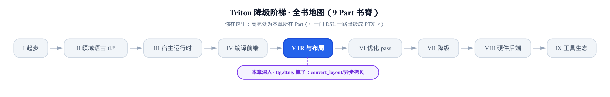
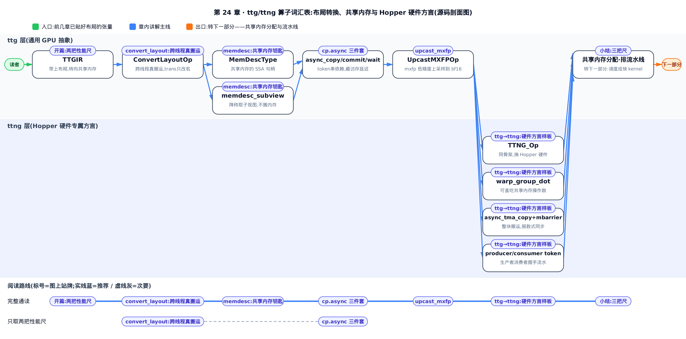
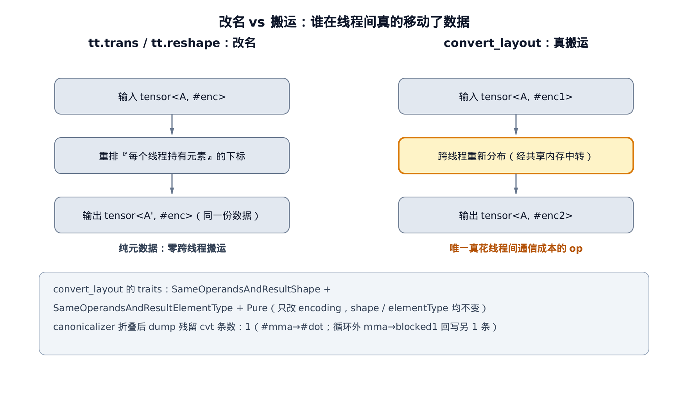
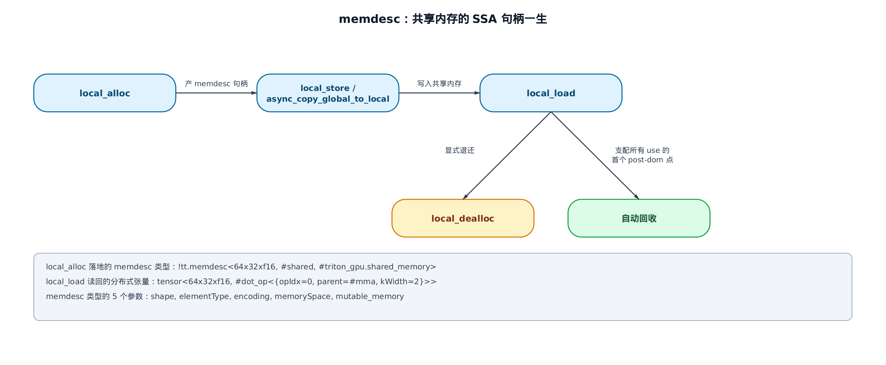
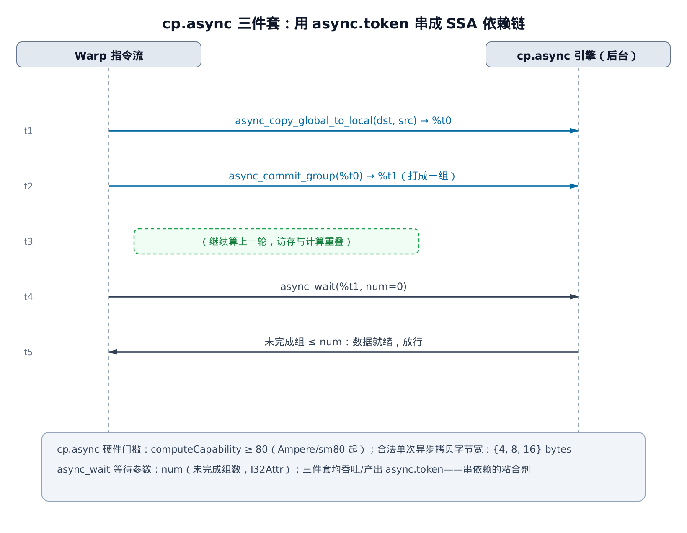
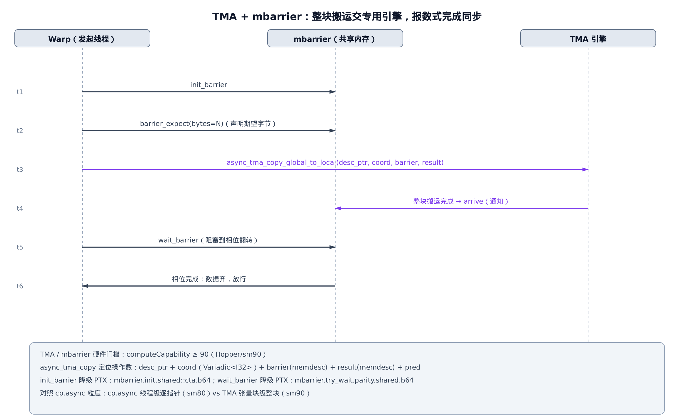

# ttg.* 与 ttng.* 算子：布局转换、异步拷贝与 Hopper 硬件方言



> **你在这里** ——第 V 部分「IR 与布局」的收官。
> 前四章：张量拿到了布局（layout，贴在张量类型上、说清每个元素落到哪个线程的标签）。
> 本章：带着布局，去认识与共享内存 / 异步 / 硬件打交道的那批算子。

前面四章把布局的代数讲透了，但布局本身不搬一个字节的数据——它只是一张「谁拿哪个元素」的标签。真正拿着这张标签去干活的，是另一批算子：把数据在不同布局间倒腾的 `convert_layout`、把张量落进共享内存的 `local_alloc`／`local_load`、把访存和计算叠起来跑的 `cp.async` 三件套。它们都定义在 `include/triton/Dialect/TritonGPU/IR/TritonGPUOps.td` 里，是 TTGIR（Triton GPU IR，给张量贴上布局后的第二级 IR）真正的「操作词汇表」。

**先说这一章能帮你做什么性能决策。** 两条，都能直接在 dump 里落地：

- **数 `convert_layout`。** 它是整个 ttg 层里**唯一真正在线程间搬数据**的算子——`tt.trans`（转置）只是给每个线程手里的元素改个名、纯元数据零搬运（[第 19 章](../../ch19-tt-dialect-vocabulary/narrative/chapter.md)核实过）；`reshape` 多数时候也只是重解释形状，但设了 `allow_reorder` 时编译器可自由重排元素、未必零搬运（细节本章不展开）。所以你打开 dump，数一数编译器化简后还剩几条 `convert_layout`，就估出了这个 kernel 要付多少布局转换开销。这是布局优化的头号命门。
- **认出 `cp.async` 三件套。** 它是「隐藏访存延迟」这件事的硬件基元：发起 global→shared 拷贝后不阻塞，让访存和上一轮计算重叠。你调的 `num_stages`（软件流水线档位，[第 17 章](../../ch17-control-flow-lowering-scf/narrative/chapter.md)建立）旋钮，底层压出来的就是它。



选读指引：只想拿走这两把性能尺，读 §1 和 §3 足矣；想认全 ttg 算子词汇，按序读到 §4；§5 是 ttng 层（NVIDIA Hopper 硬件专属方言）的词汇表与结构样板，赶时间可略读，但它埋着姊妹篇 NPU 书的配对脊柱，值得一瞥。

## convert_layout：唯一真正在线程间搬数据的算子

上一部分我们读 `tt` 层的 `tt.trans`（转置）时，留了一个悬念。它的文档里有句反直觉的话：转置在 `tt` 层只是给每个 GPU 线程手里的元素**改个名**（纯元数据重排），真正的跨线程数据搬运，发生在它前后的 `convertLayout` 算子里——而那是下一层 `ttg` 的事（原文见[第 19 章读 `tt.trans` 的那一节](../../ch19-tt-dialect-vocabulary/narrative/chapter.md)）。现在到了 `ttg` 层，就来把这句话兑现。

**直觉：改名 vs 搬运。** 想象两位同学都拿着同一叠卡片。`tt.trans` 只是让每人把手里的卡片「改个称呼」——卡还在原主手上，没人起身，纯元数据、零搬运（`reshape` 多数时候也是这种重解释，唯有设了 `allow_reorder` 才可能真动元素，属特例，本章不展开）。`convert_layout` 才是真让大家按新座位表交换卡片：有人得走到别人桌前把卡递过去，这就是跨线程搬数据，最坏还得经共享内存这张公共桌子中转一趟。所以 dump 里 `convert_layout` 有几条，就意味着有几次真搬运。



**源码：它的类型签名就把话说死了。** 看它在 `.td` 里的定义：

```cpp
# include/triton/Dialect/TritonGPU/IR/TritonGPUOps.td:L22-L40
class TTG_Op<string mnemonic, list<Trait> traits = []> :
    Op<TritonGPU_Dialect, mnemonic,
       !listconcat(traits, [VerifyTensorLayoutsTrait])> {
}

def TTG_ConvertLayoutOp : TTG_Op<"convert_layout",
                                 [SameOperandsAndResultShape,
                                  SameOperandsAndResultElementType,
                                  Pure]> {
  let summary = "convert layout";

  let arguments = (ins TT_Tensor:$src);

  let results = (outs TT_Tensor:$result);

  let hasCanonicalizer = 1;

  let assemblyFormat = "$src attr-dict `:` type($src) `->` type($result)";
}
```

第一段是基类：`TTG_Op` 给**每个** ttg 算子都追加一条 `VerifyTensorLayoutsTrait`（一条 trait——MLIR 给算子挂的「标签」，声明它满足某种性质，这条要求算子落地时校验张量布局合法）。这是本方言（dialect——MLIR 里一组算子和类型的命名空间）的公共门禁，后面每个算子都带着它，不再复述。

重点看 `convert_layout` 挂的三条 trait：`SameOperandsAndResultShape`（输入输出同形状）、`SameOperandsAndResultElementType`（同元素类型）、`Pure`（纯函数，无副作用）。它的入参和出参都是一个普通 `TT_Tensor`。把这三条合起来读：**形状不变、元素类型不变、无副作用，唯一能变的只有布局（encoding）**。它就是一个「同一份数据，换一种在硬件上的摆法」的算子。可它偏偏是最贵的——因为换摆法就得让线程之间真把元素递来递去。改名的 `trans` 免费，改摆法的 `convert_layout` 要命，差别全写在类型签名里。

**机制：为什么 dump 里剩下的每一条都省不掉。** 既然 `convert_layout` 只改布局，那 IR 里会冒出一大堆冗余的、可以合并的转换——它的 `hasCanonicalizer = 1` 就是为此存在的。canonicalizer（规范化器，MLIR 里把 IR 化简到规范形式的一类重写）会把能省的都省掉。核心那条重写模式长这样：

```cpp
# lib/Dialect/TritonGPU/IR/Dialect.cpp:L2842-L2874
struct CanonicalizeConvertFromConvert
    : public OpRewritePattern<ConvertLayoutOp> {
  using OpRewritePattern::OpRewritePattern;

  mlir::LogicalResult
  matchAndRewrite(ConvertLayoutOp op,
                  PatternRewriter &rewriter) const override {
    // Convert to the same layout is redundant.
    if (op->getResultTypes() == op->getOperandTypes()) {
      rewriter.replaceOp(op, op->getOperands());
      return success();
    }

    // We don't handle conversions to DotOperandEncodingAttr.  This is a
    // heuristic to accommodate fused attention.
    auto srcType = op.getSrc().getType();
    auto dstType = op.getType();
    if (mlir::isa<DotOperandEncodingAttr>(dstType.getEncoding()) &&
        mlir::isa<NvidiaMmaEncodingAttr>(srcType.getEncoding()))
      return failure();

    // for hopper MMAv3
    if (mlir::isa<SharedEncodingAttr>(dstType.getEncoding()) &&
        mlir::isa<NvidiaMmaEncodingAttr>(srcType.getEncoding()) &&
        llvm::any_of(op.getResult().getUsers(), [](Operation *dot) {
          return dot->hasTrait<OpTrait::DotLike>();
        })) {
      return failure();
    }

    Operation *arg = op.getSrc().getDefiningOp();
    if (!arg)
      return failure();

    // … 省略：紧接着是一串「把 convert 折进上游 op」的同构分支，见下 …
    return failure();
  }
};
```

拿到 `arg`（`convert_layout` 的输入是由哪个上游算子产出的）之后，紧跟着是一串「把 convert 折进上游 op」的同构分支：只要 src 由某个 op 定义、且折叠安全，就让那个上游算子直接产出目标布局、把 convert 消掉。真实源码里这串分支依次是 `cvt(reshape)`／`cvt(histogram)`／`cvt(local_load)`／`cvt(cat)`／`cvt(cvt)`／`cvt(splat)`／`cvt(make_range)`／`cvt(constant)`，规律一致。这里单挑最直观的一条——物理上排在第五位的**两跳合并** `cvt(cvt)`——原样拎出来看：

```cpp
# lib/Dialect/TritonGPU/IR/Dialect.cpp:L2930-L2938
    // cvt(cvt(x, type1), type2) -> cvt(x, type2)
    if (auto cvt = dyn_cast<ConvertLayoutOp>(arg)) {
      auto srcType = op.getSrc().getType();
      auto origAttrs = op->getAttrs();
      auto newOp = rewriter.replaceOpWithNewOp<triton::gpu::ConvertLayoutOp>(
          op, op->getResultTypes().front(), cvt.getSrc());
      newOp->setAttrs(origAttrs);
      return success();
    }
```

两跳 `cvt(cvt(x))` 直接并成一跳 `cvt(x)`：把中间那次布局转换整个跳过，只保留首尾一次。

三种动作，一眼看穿：**同布局冗余直接删**（`resultTypes == operandTypes` 那条，`cvt` 到自己的布局等于没转）；**两跳并一跳**（`cvt(cvt(x))→cvt(x)`）；**能塞回上游就塞回去**（`cvt(local_load)→local_load`、`cvt(reshape)→reshape`……让上游算子直接产出目标布局）。开头那两处 `return failure()` 是启发式豁免：碰到 fused-attention 的 dot 操作数布局、碰到 Hopper 那条 MMAv3 直接吃共享内存的路径，就主动不折叠，免得破坏后端要的形态（MMAv3 具体是什么硬件路径，留到 §5 讲 `warp_group_dot`／WGMMA 时揭晓）。

顺带打通两处叫法。其一，代码里的 `DotOperandEncodingAttr`／`NvidiaMmaEncodingAttr`／`SharedEncodingAttr`，就是本书一直用的简写 `#dot`／`#mma`／`#shared` 在 C++ 里的正式类名——同一样东西的两套名字。其二，第一处 `return failure()` 里的 fused attention（融合注意力），指的是把 softmax 与 QK、PV 两次矩阵乘融进同一个 kernel 的写法：第一次 dot 的输出不经中转、直接当第二次 dot 的操作数，那条特殊的 `#mma`→`#dot` 布局转换正是这条数据通路要的，所以主动放过、不折叠掉。

不妨把这台 canonicalizer 看成一台「重写机器」——反复套用上面那些重写分支，扫一遍 IR、能改就改，直到没有分支能再匹配为止。拿一段最小 IR 喂给这台机器，看它怎么把三条转换收敛到一条。这段 IR 是为讲清折叠规律构造的示教例（不是真实 dump）：

```mlir
// 构造示例：一个 #mma 张量派生出三条 convert_layout
%a = ...                                     // 某 #mma 布局张量
%b = triton_gpu.convert_layout %a : #mma -> #mma    // 同布局，冗余
%c = triton_gpu.convert_layout %a : #mma -> #blocked
%d = triton_gpu.convert_layout %c : #blocked -> #dot
```

对着这段 IR 逐轮走一遍：

<!-- trace: m5 -->

| 轮次 | 目标 cvt | 匹配分支（源码锚点） | 重写动作 | 结果 |
|---|---|---|---|---|
| 1 | %b（#mma→#mma） | 同布局冗余：resultTypes==operandTypes (Dialect.cpp:L2849-2853) | replaceOp(%b, %a) | %b 删除，用处改用 %a |
| 2 | %d（#blocked→#dot） | cvt(cvt(x,t1),t2)→cvt(x,t2) (Dialect.cpp:L2930-2938) | 新建 cvt %a:#mma→#dot，%c 若无它用被 DCE | 两跳并成一跳 |
| 3 | 残留 cvt %a:#mma→#dot | 命中启发式豁免：dst=#dot 且 src=#mma，正是前面讲的 fused-attention 保护（同一条）→ return failure() (Dialect.cpp:L2855-2861) | 不再重写 | 收敛，留在 dump（真开销） |

三条 `convert_layout` 进去，一条真跨布局（`#mma`→`#dot`，`#mma` 是 Tensor Core 的 MMA 布局、`#dot` 是喂给矩阵乘的操作数布局，都在前面布局那几章建立过）的搬运出来——省掉三分之二。这里的 `#mma`／`#blocked`／`#dot` 都是布局编码的记号；`DCE` 是死代码消除（Dead Code Elimination），`%c` 没人再用就被顺手删掉。

**这台机器一定会停。** 每一步重写要么删掉一个 `cvt`（同布局冗余分支），要么把一个 `cvt` 折进上游、少一个节点（`cvt(cvt)`／`cvt(reshape)`／`cvt(local_load)`……）——IR 里 `convert_layout` 的计数因此**严格单调递减**，且是非负整数；某条 `cvt` 匹配不到任何分支时就 `return failure()`，停止对它的重写。单调递减加上有下界，有限步内所有 `cvt` 都停在「不可再折叠」的不动点。于是——**dump 里剩下的每一条 `convert_layout`，都是编译器已经尽力也省不掉的真搬运**。数它，就是数这个 kernel 的布局转换开销。

（回头看本节开头「改名 vs 搬运」那张图底部的计数：它数的是**真实 fp16 matmul** dump 折叠后残留的 `convert_layout`——循环体内一条 `#mma`→`#dot` 的真搬运，循环外还有一条把 `#mma` 累加器转回 `#blocked1`、好写回 global 的收尾转换。上面这段三条的示教 IR 是为讲清折叠规律而简化的，和真实 dump 不是同一个场景，条数各算各的、不冲突。）

## memdesc：共享内存的一把钥匙

`convert_layout` 最坏要经共享内存中转。那共享内存（shared memory，[第 7 章](../../ch07-blocks-shape-and-memory-access/narrative/chapter.md)讲过的片上暂存，block 内共享、比 global 快一个数量级）在 IR 里是怎么表示的？答案是一个专门的类型：`memdesc`。

**直觉：一把钥匙串起一个储物柜的一生。** `memdesc`（memory descriptor，内存描述符）就像共享储物柜的一把钥匙，是共享内存的 SSA 句柄（SSA=静态单赋值，每个值只被定义一次，[第 5 章](../../ch05-type-system-and-tensor/narrative/chapter.md)、[第 15 章](../../ch15-ssa-and-structured-control-flow/narrative/chapter.md)讲过）。`local_alloc` 领柜子拿钥匙，`local_store`／`async_copy` 往柜里放东西，`local_load` 从柜里取回自己那份，`local_dealloc` 退柜——不写退柜，编译器也会在「所有人都用完之后的第一时刻」自动回收。钥匙可以配几把、各看柜子的不同格子（`subview`），但柜子本身（底层内存）一动不动。



**源码：钥匙本身是什么。** `memdesc` 类型定义在 Triton 方言的类型表里：

```cpp
# include/triton/Dialect/Triton/IR/TritonTypes.td:L95-L112
// Memory descriptor type.
def TT_MemDescType : TritonTypeDef<"MemDesc", "memdesc", [ShapedTypeInterface]> {
    let summary = "memory descriptor type (`::mlir::triton::MemDescType`) in Triton IR type system";

    let description = [{
        Memory descriptor contains a base pointer (scalar) and a descriptor of the memory.
        If mutable memory is false that means the memory is constant and can only be allocated and stored once.
        A constant memory allocation is different than a tensor as it can have multiple views and the descriptor
        can be changed without changing the underlying memory.
    }];

  let parameters = (ins
    ArrayRefParameter<"int64_t">:$shape,
    "Type":$elementType,
    "Attribute":$encoding,
    "Attribute":$memorySpace,
    "bool":$mutable_memory
  );
```

一把钥匙带五个参数：`shape`、`elementType`、`encoding`（共享内存的 shared 布局）、`memorySpace`、`mutable_memory`。注释点破了它和普通张量的本质区别：**同一块底层内存可以有多个 view，descriptor 可以变而底层内存不变**——这正是待会儿 `subview` 的立足点。为什么不把共享内存当成「另一种张量布局」？因为张量是 SSA 的值语义（一次赋值、不可变），而共享内存是**可变、可多视图、有生命周期的资源**。用一个带 `mutable_memory` 和 `memorySpace` 的独立类型，才能让 alloc／dealloc／load／store 各自带上精确的副作用，参与后续的公共子表达式消除、死代码消除与屏障分析（barrier 分析留给后面讲共享内存分配的那一章）。

**源码：钥匙串起的五个动作。** 先看开柜子的 `local_alloc`：

```cpp
# include/triton/Dialect/TritonGPU/IR/TritonGPUOps.td:L137-L173
// Allocate shared memory
def TTG_LocalAllocOp : TTG_Op<"local_alloc", [DeclareOpInterfaceMethods<MemoryEffectsOpInterface>]> {
  let summary = "allocate tensor";
  let description = [{
    This operation allocates buffer in shared memory and return a descriptor
    containing the address and a view of the buffer.

    Explicitly deallocating a buffer is optional; see local_dealloc.
  }];
  let arguments = (
    ins
    Optional<TT_Tensor>:$src,
    OptionalAttr<I32Attr>:$alignment
  );
  // … 省略：三个 OpBuilder 重载（可选 src、可选 alignment 的 C++ 构造糖）…
  let extraClassDeclaration = [{
    bool isSharedMemoryAlloc() {
      return getType().getMemorySpace() &&
             isa<SharedMemorySpaceAttr>(getType().getMemorySpace());
    }
    int32_t getAlignmentOrDefault();
  }];
  let assemblyFormat = [{$src attr-dict `:` functional-type(operands, results)}];

  let results = (outs TT_MemDescType:$result);
  let hasFolder = 1;
  let hasVerifier = 1;
}
```

它开一块共享内存 buffer，产出一个 `memdesc`（`results` 那行）。可选的 `src` 是「分配即用这个分布式张量初始化」的糖。剩下四件，一起看：

```cpp
# include/triton/Dialect/TritonGPU/IR/TritonGPUOps.td:L176-L257
def TTG_LocalDeallocOp : TTG_Op<"local_dealloc", [MemoryEffects<[MemFree<SharedMemory>]>]> {
  let summary = "dealloc buffer";
  let description = [{
    This operation deallocates a buffer explicitly. Using the buffer after this
    operation is undefined.

    This operation is optional.  If you don't explicitly dealloc a buffer, the
    compiler assumes it's deallocated at the first point that post-dominates all
    uses of the alloc.
    // … 省略：一段关于 warp_group_dot_wait 也要收下 memdesc 的说明 …
  }];

  let arguments = (ins TT_MemDescType:$src);
  let assemblyFormat = [{$src attr-dict `:` qualified(type($src))}];
}

def TTG_MemDescSubviewOp : TTG_Op<"memdesc_subview", [Pure]> {
  let summary = "take a subview of the descriptor.";
  let description = [{
    This operation returns a new descriptor representing a subview of the buffer.
    It doesn't affect the underlying memory. The subview can be rank-reduced.

    For example, suppose that
     - the input shape is 2x4x16xf16,
     - the output shape is 4x4xf16, and
     - offsets = [1, 0, 4].

    Then in Python syntax, the subview covers input[1][0:4][4:8].
  }];
  let arguments = (
    ins TT_MemDescType:$src, Variadic<I32>:$offsets);
  let assemblyFormat = [{$src `[` $offsets `]` attr-dict `:` qualified(type($src)) `->` qualified(type($result))}];
  let results = (outs TT_MemDescType:$result);
  let hasVerifier = 1;
}

def TTG_LocalLoadOp : TTG_Op<"local_load", [DeclareOpInterfaceMethods<MemoryEffectsOpInterface>]> {
  let summary = "Load a buffer from local memory into a distributed tensor";
  let arguments = (ins TT_MemDescType:$src, Optional<TTG_AsyncToken> :$token);
  // … 省略：token 缺省为 null 的 OpBuilder 构造糖 …
  let assemblyFormat = [{$src (`token` $token^)? attr-dict `:` qualified(type($src)) `->` type($result)}];
  let results = (outs TT_Tensor:$result);
}

def TTG_LocalStoreOp : TTG_Op<"local_store", [DeclareOpInterfaceMethods<MemoryEffectsOpInterface>]> {
  let summary = "Store a distributed tensor into a buffer in local memory";
  let arguments = (ins TT_Tensor:$src, TT_MemDescType:$dst);
  let hasVerifier = 1;
  let assemblyFormat = [{
    $src `,` $dst attr-dict `:` type($src) `->` qualified(type($dst))
  }];
}
```

`local_dealloc` 是**可选**的退柜——它的描述写得明白：不显式退，编译器就假设 buffer 在「支配所有 use 的第一个 post-dominate 点」自动回收（把握不准就别写，交给编译器）。代码块里紧跟着的 `memdesc_subview`（从一把钥匙切出只看某几个格子的新钥匙——共享内存的切片、取子视图，底层内存原封不动）先记个脸熟，它是下文专节的主角。`local_load` 从 `memdesc` 读回一个分布式张量（distributed tensor——元素分散在各线程寄存器里的张量），`local_store` 反过来把分布式张量写进 `memdesc`。这里源码 summary 里的 local memory 和前面 `local_alloc` 说的 shared memory 是同一回事——都是本节讲的片上共享内存；别和 CUDA 里那个线程私有、由寄存器溢出到 global 的 local memory 搞混，Triton 这套 `local_*` 前缀只是它内部的命名习惯。这三个动作的读写副作用与合法性校验，落在语义实现里：

```cpp
# lib/Dialect/TritonGPU/IR/Dialect.cpp:L2977-L3062
// LocalAllocOp
void LocalAllocOp::getEffects(
    SmallVectorImpl<SideEffects::EffectInstance<MemoryEffects::Effect>>
        &effects) {
  Operation *op = getOperation();
  // If allocation is immutable, mark it as no side effect allow things like
  // CSE, DCE to work in early compiler passes.
  if (!getType().getMutableMemory() && !op->hasAttr("allocation.offset"))
    return;
  effects.emplace_back(MemoryEffects::Allocate::get(),
                       mlir::triton::gpu::SharedMemory::get());
  if (getSrc())
    effects.emplace_back(MemoryEffects::Write::get(),
                         getOperation()->getOpResult(0),
                         mlir::triton::gpu::SharedMemory::get());
}
// … 省略：LocalAllocOp::fold（alloc(local_load(x)) 类型一致时折回 x）与 verify …

// LocalStoreOp
LogicalResult LocalStoreOp::verify() {
  if (!getDst().getType().getMutableMemory())
    return emitOpError("Cannot store into immutable memory");
  return success();
}

void LocalStoreOp::getEffects(
    SmallVectorImpl<SideEffects::EffectInstance<MemoryEffects::Effect>>
        &effects) {
  effects.emplace_back(MemoryEffects::Write::get(), &getDstMutable(),
                       mlir::triton::gpu::SharedMemory::get());
}

// AsyncCopyGlobalToLocalOp
LogicalResult AsyncCopyGlobalToLocalOp::verify() {
  if (!getResult().getType().getMutableMemory())
    return emitOpError("Cannot store into immutable memory");
  return success();
}

void AsyncCopyGlobalToLocalOp::getEffects(
    SmallVectorImpl<SideEffects::EffectInstance<MemoryEffects::Effect>>
        &effects) {
  effects.emplace_back(MemoryEffects::Read::get(), &getSrcMutable(),
                       mlir::triton::GlobalMemory::get());
  effects.emplace_back(MemoryEffects::Write::get(), &getResultMutable(),
                       mlir::triton::gpu::SharedMemory::get());
}
```

三处细节值得记住。其一，不可变的 `local_alloc` **不登记任何副作用**（那句 early `return`）——这样常量分配在早期 pass 里能自由参与 CSE／DCE；等到内存偏移算出来了，才补上真正的副作用。其二，`local_store` 和 `async_copy` 的 `verify` 都拦一条铁律：**不能写入 immutable 内存**。其三，`async_copy` 的副作用清清楚楚——**读 GlobalMemory、写 SharedMemory**，这正是它「从 global 搬到 shared」的语义在 IR 上的登记，也是 §3 的主角。

**这些 IR 长什么样？** 拿 `pip install triton==3.2.0`（与本书钉的版本逐字节相同）headless 编译（不接真实 GPU 跑，只把 kernel 编到指定中间阶段、拿出 IR 文本）一个 fp16 矩阵乘，dump 出布局阶段之后的 TTGIR，循环体里能看到这把钥匙的真实形态：

```mlir
// TTGIR（fp16 matmul，make_ttgir @ sm80，num_stages=3），循环体片段
%46 = tt.load %arg8 : tensor<64x32x!tt.ptr<f16>, #blocked>
%47 = triton_gpu.local_alloc %46 : (tensor<64x32xf16, #blocked>) -> !tt.memdesc<64x32xf16, #shared, #triton_gpu.shared_memory>
%48 = tt.load %arg9 : tensor<32x64x!tt.ptr<f16>, #blocked1>
%49 = triton_gpu.local_alloc %48 : (tensor<32x64xf16, #blocked1>) -> !tt.memdesc<32x64xf16, #shared1, #triton_gpu.shared_memory>
%50 = triton_gpu.local_load %47 : !tt.memdesc<64x32xf16, #shared, #triton_gpu.shared_memory> -> tensor<64x32xf16, #triton_gpu.dot_op<{opIdx = 0, parent = #mma, kWidth = 2}>>
%51 = triton_gpu.local_load %49 : !tt.memdesc<32x64xf16, #shared1, #triton_gpu.shared_memory> -> tensor<32x64xf16, #triton_gpu.dot_op<{opIdx = 1, parent = #mma, kWidth = 2}>>
%52 = tt.dot %50, %51, %arg7, inputPrecision = tf32 : ... -> tensor<64x64xf32, #mma>
```

一条数据流水到底：`tt.load` 出来的 `#blocked` 张量（`#blocked` 是全局访存的分块布局，[第 21 章](../../ch21-distributed-layouts/narrative/chapter.md)建立），经 `local_alloc` 落进 `!tt.memdesc<64x32xf16, #shared, ...>`（钥匙到手），再 `local_load` 读成 `#dot_op` 布局（喂给 `tt.dot` 的 Tensor Core 操作数），最后 `tt.dot` 算出 `#mma` 结果。钥匙的类型里，`shape`（`64x32`）、`elementType`（`f16`）、`encoding`（`#shared`）、`memorySpace`（`#triton_gpu.shared_memory`）四栏都亮在眼前——这就是那把钥匙落地的样子。

**subview：一把钥匙看柜子的一格。** 多缓冲的环形 buffer 要按轮次取当前那一片，靠的就是 `memdesc_subview`——它按 `offsets` 从大 buffer 里夹出一个子视图，还能顺手压掉一维（降秩），全程不动底层内存。`.td` 的描述自带一个算例：输入 `2x4x16xf16`、输出 `4x4xf16`、`offsets=[1,0,4]`，子视图覆盖 `input[1][0:4][4:8]`。它的 `verify` 把这个算例的每一步都校验一遍：

```cpp
# lib/Dialect/TritonGPU/IR/Dialect.cpp:L3064-L3107
LogicalResult MemDescSubviewOp::verify() {
  auto srcTy = getSrc().getType();
  auto dstTy = getType();

  if (srcTy.getElementType() != dstTy.getElementType()) {
    return emitError("result element type must match desc element type");
  }
  if (getOffsets().size() != srcTy.getRank()) {
    return emitError("offsets must have the same rank as input");
  }
  if (srcTy.getRank() < dstTy.getRank()) {
    return emitError("result rank must be less than or equal to input rank");
  }
  auto rankDiff = srcTy.getRank() - dstTy.getRank();
  for (int i = 0; i < dstTy.getRank(); i++) {
    if (dstTy.getDimSize(i) > srcTy.getDimSize(i + rankDiff)) {
      return emitError(
                 "result shape cannot be larger than input shape at dimension ")
             << i;
    }
  }
  // … 省略：src/dst 必须同为 SharedEncodingAttr 的校验，与降秩 subview 的已知技术债注释 …
  return success();
}
```

把 `.td` 的算例对着 `verify` 逐轴走一遍：

<!-- trace: m3 -->

| 输入轴 | 输入尺寸 | offset | 映射到输出 | 覆盖区间 | verify 判定（源码锚点） |
|---|---|---|---|---|---|
| dim0 | 2 | 1 | 被降秩丢弃（rankDiff=1） | index 1 → input[1] | srcRank 3 ≥ dstRank 2 ✓ (Dialect.cpp:L3074) |
| dim1 | 4 | 0 | dst dim0（尺寸 4） | [0:4] | dstDim 4 ≤ srcDim1 4 ✓ (Dialect.cpp:L3078-3084) |
| dim2 | 16 | 4 | dst dim1（尺寸 4） | [4:8] | dstDim 4 ≤ srcDim2 16 ✓ (Dialect.cpp:L3078-3084) |

**子视图恒落在 buffer 边界内，越不了界。** `verify` 遍历每个 dst 维 `i`，逐一校验 `dstDim[i] ≤ srcDim[i+rankDiff]`；再加上 `offsets` 秩必须等于 src 秩、dst 秩不超 src 秩两道闸。三条约束合起来：每个输出维的尺寸都不超过对应输入维，任一越界立即 `emitError` 拒绝。所以能通过 `verify` 的 subview，覆盖区间必是输入形状的合法子集。整块输入 buffer 有 `2×4×16 = 128` 个 f16 元素，这个子视图只覆盖 `input[1][0:4][4:8]` = `4×4 = 16` 个（占八分之一），且不搬一个字节——纯 descriptor 改写。环形 buffer 每一轮取当前片，就是这么取的。

## cp.async 三件套：把访存延迟藏进上一轮计算

上面 `local_alloc` 后面跟的是同步的 `tt.load`＋`local_store`：把数据从 global 读进寄存器，再写进共享内存，线程得一直等着。有没有办法「发起搬运后就走人，去算别的」？有——这就是 `cp.async`（Ampere/sm80 起的异步拷贝硬件指令），Triton 用三个算子把它包起来。

**直觉：像点外卖。** `async_copy` 是下单（付完款就走人，不站门口干等）；`async_commit_group` 是把这几单打成一批、记个号；`async_wait` 是「我这批里还差 `num` 单没到就先等着」。下单和取餐之间那段时间，你可以去干别的（算上一轮）——这就是隐藏访存延迟。串起这三步的小票，就是 `async.token`。



**源码：先看那张小票。** `async.token` 是个专门的类型，定义只有寥寥几行，但一句话点透了它的用途：

```cpp
# include/triton/Dialect/TritonGPU/IR/TritonGPUTypes.td:L26-L35
def TTG_AsyncToken : TTG_TypeDef<"AsyncToken",
                                    "async.token", []> {
  let summary = "async token type";
  let description = [{
    `ttg.async.token` is a type returned by an asynchronous operation.
    It is used to establish an SSA-based link between async operations
    and operations that group or synchronize the async operations.
  }];
}
```

它是异步算子返回的一个 SSA 值，专门用来在「异步 op」与「后续 group／synchronize」之间建立 SSA 依赖。为什么非要它不可？因为 `cp.async` 的语义是「发起后不阻塞」——如果不在 IR 里用一根显式的 token 把「哪个 wait 等哪批 copy」写清楚，调度器根本不知道能不能安全地重排、能不能流水。token 就是那根显式的线。

**源码：三件套本体。** 三个算子放在一起看，会发现它们都在吞吐或产出这根线：

```cpp
# include/triton/Dialect/TritonGPU/IR/TritonGPUOps.td:L42-L134
def TTG_AsyncWaitOp : TTG_Op<"async_wait"> {
  let summary = "async wait";
  let arguments = (ins Variadic<TTG_AsyncToken>:$asyncToken, I32Attr:$num);
  let results = (outs TTG_AsyncToken:$retToken);
  let assemblyFormat = "$asyncToken attr-dict";
  let extraClassDeclaration = [{
    static bool isSupported(int computeCapability) {
      return computeCapability >= 80;
    }
  }];
}

def TTG_AsyncCommitGroupOp : TTG_Op<"async_commit_group"> {
  let summary = "async commit group";
  let results = (outs TTG_AsyncToken:$asyncToken);
  let arguments = (ins Variadic<TTG_AsyncToken>:$inputTokens);
  let assemblyFormat = [{ $inputTokens attr-dict }];
  // … 省略：与 async_wait 同款的 isSupported(computeCapability >= 80) …
}

def TTG_AsyncCopyGlobalToLocalOp : TTG_Op<"async_copy_global_to_local", [
  AttrSizedOperandSegments,
  DeclareOpInterfaceMethods<MemoryEffectsOpInterface>,
  // … 省略：两条 TypesMatchWith（从 src 类型推 mask/other 类型的推断细节）…
]> {
  let summary = "copy data from global memory to local memory asynchronously";
  let hasVerifier = 1;
  let description = [{
    This operation copies data from global memory to local memory asynchronously.
    This is analogue to tt.load except the data are copied to local memory pointed
    by by the memory descriptor instread of a distributed tensor. The rest of the
    operands are the same as tt.load.
  }];
  let arguments = (
    ins TT_PtrTensor:$src,
    TT_MemDescType:$result,
    Optional<I1Tensor>:$mask,
    Optional<TT_Type>:$other,
    // … 省略：cache / evict / isVolatile 三个带默认值的属性 …
  );
  // … 省略：builders（C++ 构造入口）…
  let results = (outs TTG_AsyncToken:$token);

  let extraClassDeclaration = [{
    static DenseSet<unsigned> getEligibleLoadByteWidth(int computeCapability) {
      DenseSet<unsigned> validLoadBytes;
      if (computeCapability >= 80) {
        validLoadBytes = {4, 8, 16};
      }
      return validLoadBytes;
    }
  }];
  // … 省略：assemblyFormat …
}
```

读法：`async_copy_global_to_local` 发起 global→shared 的异步拷贝，入参是源指针张量 `src` 和目标 `memdesc`（跟 `tt.load` 几乎一样，只是终点从分布式张量换成了共享内存的 memdesc），产出一根 `token`。它挂的 `AttrSizedOperandSegments`（MLIR trait：允许可选／变长操作数各自独立计数，而非共享一个长度）正是为 `mask`／`other` 这两个可选入参准备的——有几个操作数存在、各占几个，靠它记账。`async_commit_group` 把已发起的若干异步拷贝打成一组，也产出一根 `token`。`async_wait` 收下若干 token 和一个 `num`，等到未完成的组数 `≤ num` 才放行。**三者都在吞吐／产出 `TTG_AsyncToken`**——这就是它们能串成一条依赖链的机械原因。

两个硬件事实写在代码里，值得记住：`isSupported` 卡 `computeCapability >= 80`——`cp.async` 是 Ampere（sm80，一代 GPU 的 compute capability 代号）起才有的基元；`getEligibleLoadByteWidth` 给出合法的单次异步拷贝字节宽只有 `{4, 8, 16}`。这些门槛，后端降级期要据此选路。

**一个诚实的观测。** 你可能期待前面那段 `num_stages=3` 的 dump 里直接看到 `cp.async`。实际没有——那个 case 的流水线 pass 停在了同步的 `local_alloc`／`local_load` 形态，没把循环多缓冲成异步拷贝。这不矛盾：`num_stages` 是否压出 `cp.async`，取决于流水线 pass 对具体循环的判断，`.td` 定义才是这套算子语义的准绳。把它讲清楚，是为了让你在**自己的** dump 里认得出这三件套——一旦流水线 pass 决定多缓冲，你就会看到 `async_copy`→`async_commit_group`→`async_wait` 用 token 串起来，访存和上一轮计算叠着跑。它正是软件流水线那几章的底层原语。

## upcast_mxfp：低精度操作数的上采样入口

ttg 层还有一个算子值得点个名：`upcast_mxfp`。

```cpp
# include/triton/Dialect/TritonGPU/IR/TritonGPUOps.td:L259-L277
def TTG_UpcastMXFPOp : TTG_Op<"upcast_mxfp", [Pure, DeclareOpInterfaceMethods<InferTypeOpInterface>]> {
  let summary = "Convert an mxfp tensor to bf16";
  let hasVerifier = 1;
  let description = [{
    Compute the bf16 encoded in the given mxfp number as per
    https://www.opencompute.org/documents/ocp-microscaling-formats-mx-v1-0-spec-final-pdf
  }];
  let arguments = (ins
                   TT_Tensor:$src,
                   TT_Tensor:$scale,
                   TT_F8F6F4TypeAttr:$fp_type);
  let results = (outs TT_Tensor:$result);
  // … 省略：assemblyFormat …
}
```

它把 mxfp（microscaling 低精度浮点，一个共享缩放因子配一小块低位宽尾数，按 OCP MX 规范定义）张量按规范上采样成 bf16（brain float 16，一种 16 位浮点）。它带一个 `scale`（缩放因子）操作数和一个 `fp_type`（说明源是哪种 fp8／fp6／fp4）属性。本章只需认得它是「低精度矩阵乘的操作数上采样入口」；它怎么和 scaled dot 拼在一起，留给后面讲加速矩阵乘布局优化的那一章展开。

## 从 ttg 到 ttng：硬件专属方言的样板

到此，ttg 层的通用词汇认得差不多了。它有个关键定位：**后端无关**——`convert_layout`、共享内存生命周期、`cp.async`，NVIDIA 和 AMD 都能用。可 Hopper（sm90，Hopper 架构的 compute capability 代号）上还有一批**只有 NVIDIA 才有**的杀手锏：warpgroup 级矩阵乘、整块搬运引擎、硬件屏障。它们不该污染通用层，于是 Triton 把它们单独隔进另一个方言：`TritonNvidiaGPU`（ttng）。

**样板：骨架对称，内容换硬件。** ttng 的基类，和 ttg 的基类长得一模一样：

```cpp
# include/triton/Dialect/TritonNvidiaGPU/IR/TritonNvidiaGPUOps.td:L41-L44
class TTNG_Op<string mnemonic, list<Trait> traits = []> :
    Op<TritonNvidiaGPU_Dialect, mnemonic,
       !listconcat(traits, [VerifyTensorLayoutsTrait])> {
}
```

把它和本章开头那个 `TTG_Op` 摆在一起——同样 `!listconcat(traits, [VerifyTensorLayoutsTrait])`，同样的骨架，只是把 `TritonGPU_Dialect` 换成了 `TritonNvidiaGPU_Dialect`。这不是巧合，而是一个可复制的**结构样板**：通用 GPU 抽象放 ttg，硬件专属算子放一个同骨架的方言，换硬件就 fork 一个同骨架方言、把内容换掉。这正是本书姊妹篇——面向昇腾 NPU 的那本——的配对脊柱：整个 `TritonNvidiaGPU` 方言，就是 NPU 硬件方言逐结构对位的模子。**「硬件专属方言」这个位置是通用的，换硬件换内容、不换骨架。** 下面这批算子，本章只作词汇表登记，微架构深挖留给后续降级章；你要记的是它们各自占了这套样板里的哪个格子。

**格子一：warpgroup 级矩阵乘（WGMMA）。**

```cpp
# include/triton/Dialect/TritonNvidiaGPU/IR/TritonNvidiaGPUOps.td:L129-L171
def TTNG_WarpGroupDotOp : TTNG_Op<"warp_group_dot", [DeclareOpInterfaceMethods<InferTypeOpInterface>,
                                                     DeclareOpInterfaceMethods<MemoryEffectsOpInterface>,
                                                     DotLike,
                                                     // … 省略：result 类型须匹配 accumulator 的 TypesMatchWith …
                                                     ]> {
    let summary = "warp group dot";
    let description = [{ $d = matrix_multiply($a, $b) + $c. For docs on InputPrecisionAttr, see TT_DotOp }];
    let arguments = (ins TT_TensorOrMemDesc:$a,
                         TT_TensorOrMemDesc:$b,
                         TT_FpIntTensor:$c,
                         Optional<I1>:$useC,
                         // … 省略：inputPrecision / maxNumImpreciseAcc 两个属性 …
                         DefaultValuedAttr<BoolAttr, "false">:$isAsync);
    let results = (outs TT_FpIntTensor:$d);
    // … 省略：assemblyFormat 与 needsPartialAccumulator 声明 …
}

def TTNG_WarpGroupDotWaitOp : TTNG_Op<"warp_group_dot_wait", ...> {
  let summary = "warp group dot wait";
  let arguments = (ins Variadic<TT_TensorOrMemDesc>:$inputs, I32Attr:$pendings);
  let results = (outs Variadic<TT_TensorOrMemDesc>:$outputs);
  let description = [{
    Waits until there are $pendings or fewer outstanding async dot operations.
  }];
}
```

`warp_group_dot` 就是 WGMMA（Warp-Group Matrix-Multiply-Accumulate，Hopper 上由一个 warpgroup——4 个 warp、128 线程——协同完成的矩阵乘加）：算 `$d = $a * $b + $c`，操作数 `a`／`b` 可以**直接吃 memdesc**（共享内存，不必先搬进寄存器），`isAsync` 表示异步；配套的 `warp_group_dot_wait` 等到未完成的异步 dot `≤ pendings`。它是后面 MMAv3 特判的落点算子——把 §1 埋的悬念收掉：`warp_group_dot`／WGMMA 就是前面 canonicalizer 里那条「for hopper MMAv3」点到的 MMAv3，即 Hopper 上直接吃共享内存操作数的第三代 Tensor Core 矩阵乘路径，区别于必须先把操作数搬进寄存器的上一代 MMAv2。canonicalizer 之所以对「`#mma`→`#shared` 且下游是 dot」这条转换不折叠，就是要给它留出这条直吃共享内存的形态。

**格子二：TMA 整块搬运 + mbarrier 报数式同步。** 这里正好兑现一个更早的伏笔。[第 7 章讲访存](../../ch07-blocks-shape-and-memory-access/narrative/chapter.md)时，我们点过 Hopper 的一个杀手锏：TMA（Tensor Memory Accelerator，张量内存加速器）把整块张量的搬运 descriptor 化，交给一个专用引擎——当时说它真正降级到硬件方言要等到这里。就是这个落点：

```cpp
# include/triton/Dialect/TritonNvidiaGPU/IR/TritonNvidiaGPUOps.td:L246-L307
def TTNG_AsyncTMACopyGlobalToLocalOp : TTNG_Op<"async_tma_copy_global_to_local", [DeclareOpInterfaceMethods<MemoryEffectsOpInterface>]> {
  let summary = "copy data based on descriptor from global memory to local memory asynchronously";
  let description = [{
    This operation copies data from global memory to local memory
    asynchronously.  This is analogue to tt.load except the data are copied to
    local memory pointed by the memory descriptor instread of a distributed
    tensor. The data copied depends on the global memory descriptor pointed to
    by `desc_ptr`.
  }];
  let hasVerifier = 1;
  let arguments = (
    ins TT_PtrType:$desc_ptr,
    Variadic<I32>:$coord,
    TT_MemDescType:$barrier,
    TT_MemDescType:$result,
    I1:$pred,
    // … 省略：cache / evict / isVolatile 三个属性 …
  );
  // … 省略：assemblyFormat；反方向的 async_tma_copy_local_to_global 与 async_tma_store_wait 结构对称 …
}
```

对照 §3 的 `cp.async`：`cp.async` 是每个线程各自去仓库搬自己那一小格货（线程级、逐指针）；`async_tma_copy` 则是把一张「整块提货单」（global descriptor `desc_ptr` + 坐标 `coord`）交给专用引擎，一次把一整块张量搬进 `result` 指的共享内存。搬运粒度从**线程级升到张量块级**——这就是[第 7 章](../../ch07-blocks-shape-and-memory-access/narrative/chapter.md)那个伏笔真正落到硬件方言的样子。

它的完成同步不再用 `async.token`，而用一套 mbarrier（memory barrier，共享内存里的硬件屏障对象）：

```cpp
# include/triton/Dialect/TritonNvidiaGPU/IR/TritonNvidiaGPUOps.td:L173-L243
def TTNG_InitBarrierOp : TTNG_Op<"init_barrier", [DeclareOpInterfaceMethods<MemoryEffectsOpInterface>]> {
    let summary = "Initialize a barrier in the given shared memory allocation.";
    let description = [{
        Initializes a shared memory allocation with mbarrier information.
        `alloc` is a descriptor to the shared memory allocation. `count` is the
        number of arrives expected by the barrier.

        This lowers to PTX mbarrier.init.shared::cta.b64.
    }];
    let arguments = (ins TT_MemDescType:$alloc, I32Attr:$count);
    // … 省略：hasVerifier / assemblyFormat …
}

def TTNG_BarrierExpectOp : TTNG_Op<"barrier_expect", [DeclareOpInterfaceMethods<MemoryEffectsOpInterface>]> {
  let summary = "Signal a barrier of an expected number of bytes to be copied.";
  let description = [{
    This signal the barrier that `size` bytes are expected to be copied. The
    associated barrier wait will block until the expected number of bytes are copied.
  }];
  let arguments = (ins TT_MemDescType:$alloc, I32Attr:$size, I1:$pred);
  // … 省略：hasVerifier / assemblyFormat …
}

def TTNG_WaitBarrierOp : TTNG_Op<"wait_barrier", [DeclareOpInterfaceMethods<MemoryEffectsOpInterface>]> {
    let summary = "wait until the mbarrier phase completes.";
    let description = [{
      Blocks the program progress until the mbarrier object in `alloc` completes
      its current phase.

      This lowers a waitloop using PTX instruction mbarrier.try_wait.parity.shared.b64.
    }];
    let arguments = (ins TT_MemDescType:$alloc, I32:$phase);
    // … 省略：inval_barrier（复用前失效）与 hasVerifier / assemblyFormat …
}
```

一条时序：`init_barrier`（建屏障，降级到 PTX 的 `mbarrier.init.shared::cta.b64`）→ `barrier_expect`（声明「这次要到 `size` 字节」）→ `async_tma_copy`（交引擎搬）→ 引擎搬完，靠 `mbarrier_arrive` 向屏障报到 → `wait_barrier`（阻塞到相位翻转，降级到 `mbarrier.try_wait.parity.shared.b64`）放行。这套 TMA + mbarrier 是 sm90 的硬件基元。

补两个词。其一，那声「报到」有名有姓——`mbarrier_arrive`（`TTNG_MBarrierArriveOp`，`include/triton/Dialect/TritonNvidiaGPU/IR/TritonNvidiaGPUOps.td:L46-L76`）就是通用的到达信号算子（带 `trackAsyncOp`／`pred` 等参数，按需给）；TMA 流程里「引擎搬完向屏障报到」这一步，硬件层面正是靠它（或 TMA 引擎对它的隐式调用）完成的。`init_barrier`／`mbarrier_arrive`／`wait_barrier` 凑齐，才是完整的 mbarrier「全家桶」。其二，`wait_barrier` 等的那个「相位」（phase／parity）：mbarrier 内部有一个 0／1 交替翻转的相位位，翻转一次就代表「这一轮该到的都到齐了」——靠它，同一个屏障对象能在流水线的每一轮里反复重用，不必每轮重新 `init`。下面 warp-specialization 那套 `producer_acquire`／`consumer_wait` 也带 `phase`，是同一套机制。



**格子三：warp-specialization 的流水词汇 + cluster 同步。** 最后一格是一套生产者-消费者握手的词汇：

```cpp
# include/triton/Dialect/TritonNvidiaGPU/IR/TritonNvidiaGPUOps.td:L321-L369
def TTNG_CreateTokenOp : TTNG_Op<"create_token"> {
  let results = (outs TensorOf<[TTNG_TokenType]>:$result);
  let arguments = (ins I32Attr:$num);
  // … 省略：builders / assemblyFormat …
}

def TTNG_ProducerAcquireOp : TTNG_Op<"producer_acquire"> {
  let arguments = (ins TensorOf<[TTNG_TokenType]>:$token, I32:$idx, I1:$phase);
}
def TTNG_ProducerCommitOp : TTNG_Op<"producer_commit"> {
  let arguments = (ins TensorOf<[TTNG_TokenType]>:$token, I32:$idx);
}
def TTNG_ConsumerWaitOp : TTNG_Op<"consumer_wait"> {
  let arguments = (ins TensorOf<[TTNG_TokenType]>:$token, I32:$idx, I1: $phase);
}
def TTNG_ConsumerReleaseOp : TTNG_Op<"consumer_release"> {
  let arguments = (ins TensorOf<[TTNG_TokenType]>:$token, I32:$idx);
}

def TTNG_RegAllocOp : TTNG_Op<"reg_alloc", []> {
  let summary = "register allocation";
  let arguments = (ins I32Attr: $regCount);
}
// … 省略：reg_dealloc（对称的寄存器回收）…
```

`create_token` 建一张同步 token 张量；`producer_acquire`／`producer_commit` 和 `consumer_wait`／`consumer_release` 是生产者、消费者按 `idx`＋`phase` 的握手；`reg_alloc`／`reg_dealloc` 在 warpgroup 之间重新分配寄存器。warp-specialization（把一个 warpgroup 专门做搬运、另一个专门做计算）那一 pass 会消费这套词汇，本章只登记它占了样板里的这一格。此外 ttng 还有 `cluster_arrive`／`cluster_wait` 一对，做 Hopper 线程块簇（cluster，多个 CTA——协作线程数组，[第 2 章](../../ch02-gpu-execution-model/narrative/chapter.md)建立的硬件线程块——组成的一簇）内的同步。这些握手怎么拼成一条真流水，留给后面讲预取与 warp specialization 的那一章。

## 小结：你带走的三把尺

这一章把「张量带上布局之后」的操作词汇过了一遍。回到开篇那两条性能决策，现在它们有了源码根基：

- **数 `convert_layout`（`include/triton/Dialect/TritonGPU/IR/TritonGPUOps.td` 里那个同形、同类型、`Pure` 的算子）。** 它是 ttg 层唯一真在线程间搬数据的 op；canonicalizer 会把冗余和可折叠的都省掉，所以 dump 里剩下的每一条都是真开销。数它，就估出了布局转换成本——`tt.trans` 是免费的改名（[第 19 章](../../ch19-tt-dialect-vocabulary/narrative/chapter.md)核实），`reshape` 多数时候也只是重解释形状（唯 `allow_reorder` 时才可能真动元素），都不是你数 `convert_layout` 时要操心的对象。
- **认 `cp.async` 三件套。** `async_copy`→`async_commit_group`→`async_wait` 用 `async.token` 串成依赖链，把 global→shared 的访存藏进上一轮计算。你调 `num_stages` 想要的重叠，底层就是它；在 dump 里认出它，就知道流水线 pass 到底有没有替你把访存叠起来。
- **记住 ttng 的样板位置。** WGMMA、TMA + mbarrier、warp-specialization 都是 Hopper 专属，隔在一个与 ttg 同骨架的方言里。换硬件，就换一个同骨架方言换内容——这个「硬件专属方言」的位置，是贯穿本书与姊妹篇的配对脊柱。

`memdesc` 与共享内存生命周期是这一切的地基：数据要在布局间搬、要异步预取、要喂给 Tensor Core，都得先在共享内存这张公共桌子上中转。下一部分，我们就带着这批算子，去看编译器怎么替它们分配共享内存、插屏障、排流水——把「操作词汇」真正调度成一个快 kernel。
