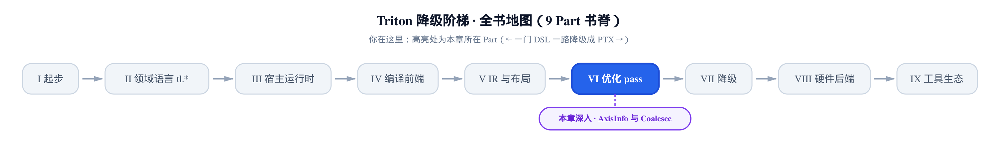
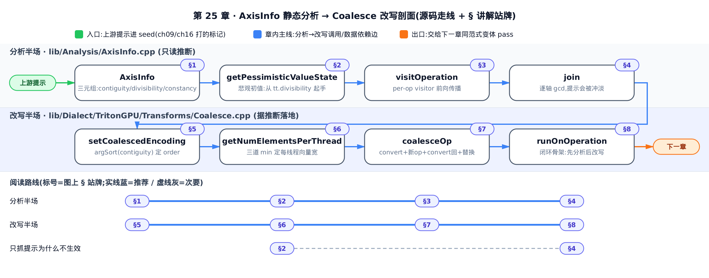
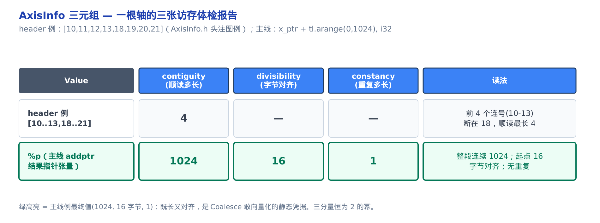
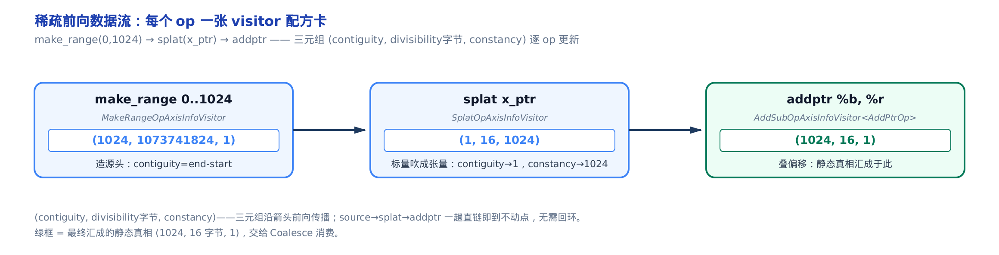
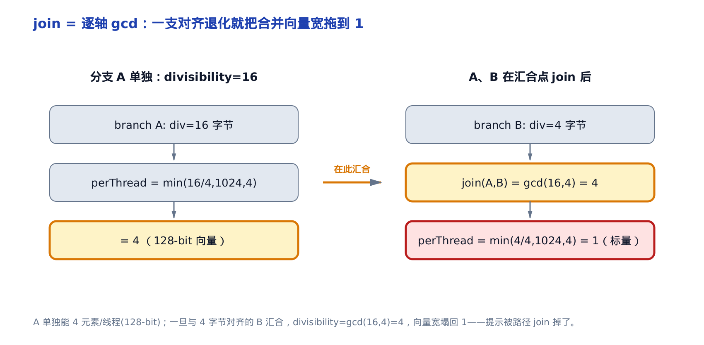
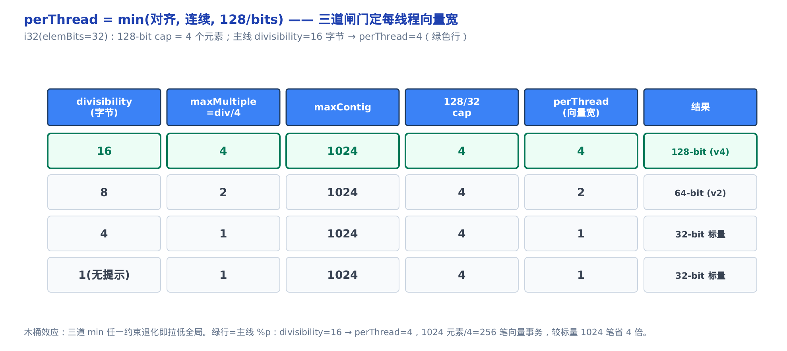
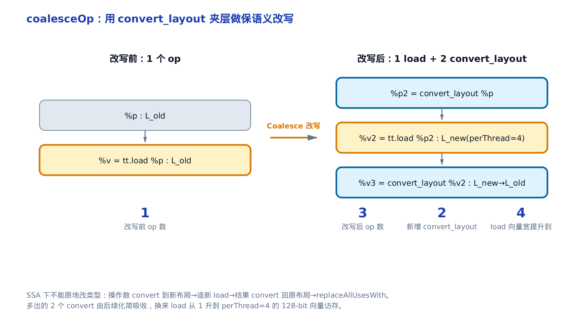
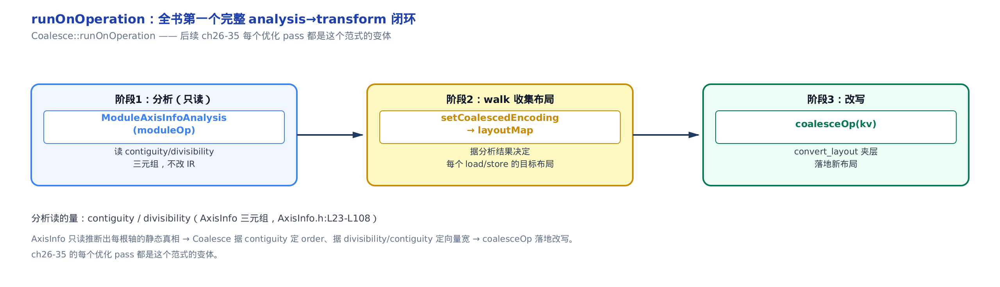

# 所有访存优化的静态真相源：AxisInfo 静态分析与 Coalesce 改写

> **你在这里**：全书从一门 DSL 一路降到 PTX，来到「优化 pass」这一部分。
> 上一章：Part V 收尾，张量都贴上了布局，layout 是一个函数。
> 本章：第一个「分析 → 改写」闭环——AxisInfo 只读推断、Coalesce 据此改写。
> 下一章：沿这个范式，继续做别的访存与流水线优化。



你在 kernel 里写了 `tl.multiple_of(offsets, 16)`，满心期待编译器把 `load` 打包成一条 128-bit 的向量访存。有时它照办、带宽拉满；有时它无动于衷、退回一个元素一个元素地读。**同一行提示，为什么结果两样？** 答案不在你的 Python 代码里，而在编译器的一个静态分析结构——`AxisInfo`——里：它为每个张量的每根轴推断出「这段能连续读多长、起点对齐到几字节、重复多长」，这份推断就是所有访存优化读取的**静态真相源**。你的提示进没进这份真相、进来后有没有被别的路径冲淡，直接决定 `load` 能不能向量化。

这一章讲透两件事，它们合起来是全书**第一个完整的「分析 → 改写」最短闭环**：`lib/Analysis/AxisInfo.cpp` 里的 AxisInfo 分析（只读推断，不碰 IR），和 `lib/Dialect/TritonGPU/Transforms/Coalesce.cpp` 里的 Coalesce 改写 pass（据推断改布局）。分析算出真相、改写据真相动手——后面所有优化 pass 都是这个范式的变体。

一路上会兑现两笔早先埋下的账。其一，[第 1 章](../../ch01-what-is-triton/narrative/chapter.md)说 `constexpr`（编译期常量）是全书性能主线，标了它编译器才能特化、向量化、合并访存——本章看到它在访存这条线上具体怎么兑现。其二，[第 7 章](../../ch07-blocks-shape-and-memory-access/narrative/chapter.md)给出了合并访存（coalescing，同一 warp 的 32 条 lane 若访问连续对齐的地址就并成一笔内存事务）的人工判据 $`N_{txn}`$（一笔访存要拆成几条内存事务，完整式子在 §6 展开）——本章看到编译器怎么把这条要你手算的公式，自动化成静态分析加改写 pass。

全章八节。**分析半场**：三元组是什么（§1）、悲观初值从哪来（§2）、怎么沿数据流前向传播（§3）、控制流汇合处怎么 join（§4）。**改写半场**：怎么定布局的轴序（§5）、怎么定每线程向量宽（§6）、怎么落地改写（§7），最后收束成 analysis→transform 范式（§8）。只想抓「我的提示为什么不生效」，直奔 §2 与 §4；想看改写怎么动 IR，跳 §7。全程用钉死的 Triton v3.2.0 做源码取证。



地图上半程是分析半场、下半程是改写半场，中间那道 join 就是提示会不会被冲淡的分界线。只想搞懂自己的提示为什么没生效，沿上半程走到 §4 就够；想看三元组怎么变成真的向量化访存，接着往下半程走完 §7。

## §1 三元组：一根轴的三张访存体检报告

**直觉**。合并访存需要回答的不是一个是非题，而是三个数量问题：这根轴上能一口气顺读多少个连续元素？这段的起点按字节对齐到 2 的几次幂？同一个值连续重复了多长？AxisInfo 就给每根轴发三张「体检报告」，分别叫 **contiguity（连续度）**、**divisibility（对齐度，单位字节）**、**constancy（重复度）**。像书架上连号的书：contiguity 是最长的一段连号有多少本，divisibility 是这段第一本卡在哪个整边界（16 / 32 / 128 字节），constancy 是同一本书重复摆了几格（掩码与广播要用）。

三个数都强制是 2 的幂。原因有两层：它们最终要对上硬件 32 / 64 / 128-bit 的向量访存宽度；而且只有在「2 的幂 + 整除」这个结构上，多条路径汇合时的合并才能用最大公约数（gcd）闭合（§4 详解）。

**机制**。看源码头注里的一个例子。二维数组

```
[[10, 11, 12, 13, 18, 19, 20, 21],
 [20, 21, 22, 23, 28, 29, 30, 31]]
```

沿最内层（第 1 维）看每一行：`10,11,12,13` 是连号，到 `18` 断了；所以最长连续段是 4，contiguity 在这维是 4。这就是「顺读多长」的精确含义——不是整行长度，而是**最短的那段连续跑**。

再看主线例子，也是本章从头贯穿到尾的那个：`x_ptr + tl.arange(0, 1024)`，元素类型 i32（32-bit 整数），`x_ptr` 这个函数参数带着 `tt.divisibility = 16`（16 字节对齐）的标记。它会拆成三个 IR 动作 `make_range`、`splat`、`addptr`，逐个把三元组算出来：

<!-- trace: axisinfo-triple -->

| Value | op | contiguity | divisibility（字节） | constancy | 读法 |
|---|---|---|---|---|---|
| `x_ptr`（函数参数） | seed（函数参数，非算子，下节详解） | 1 | 16 | 1 | 标量指针：AxisInfo 把标量当成退化张量（秩为一）处理，同样发一份三元组，这里只有「16 字节对齐」这一条静态事实 |
| `%r = make_range 0..1024` | make_range | 1024 | 1073741824 | 1 | arange 是一根满连续轴：顺读 1024 个（divisibility 这个逾十亿的大数是对起点零取最高二次幂因子的形式化上限，不是真实字节对齐，见下文详解） |
| `%b = splat x_ptr` | splat | 1 | 16 | 1024 | 同一指针重复 1024 次：constancy 拉满、contiguity 塌成 1 |
| `%p = addptr %b, %r` | addptr | 1024 | 16 | 1 | 指针张量：1024 连续、起点 16 字节对齐——这就是给 Coalesce 的静态真相 |

最后一行 `%p` 的 `(1024, 16, 1)`（divisibility 单位字节）就是主线结论：这根轴整段 1024 连续、起点对齐 16 字节（= 4 个 i32，正好凑一条 128-bit 事务）、无重复。Coalesce 后面所有决策都读这三个数。



**源码**。`AxisInfo` 本身就是一个简单的值对象——三个 `DimVectorT`（每维一个 `int64_t` 的小向量）加一个可选的常量值：

```cpp
# include/triton/Analysis/AxisInfo.h:L23-L39
class AxisInfo {
public:
  typedef SmallVector<int64_t> DimVectorT;

public:
  AxisInfo() : AxisInfo({}, {}, {}) {}

  AxisInfo(DimVectorT contiguity, DimVectorT divisibility, DimVectorT constancy)
      : AxisInfo(contiguity, divisibility, constancy, std::nullopt) {}

  AxisInfo(DimVectorT contiguity, DimVectorT divisibility, DimVectorT constancy,
           std::optional<int64_t> constantValue)
      : contiguity(contiguity), divisibility(divisibility),
        constancy(constancy), constantValue(constantValue) {
    assert(divisibility.size() == contiguity.size());
    assert(constancy.size() == contiguity.size());
  }
```

三个分量的精确语义写在紧跟的头注里，逐字保留了 contiguity / divisibility / constancy 的定义（省略各自的图例）：

```cpp
# include/triton/Analysis/AxisInfo.h:L41-L46, L66-L67, L91-L99
// contiguity[d] is the length of the shortest sequence of contiguous integers
// along dimension d.
//
// If we have an array of N elements with a contiguity value C, then the array
// can be divided into a list of N/C sequences of C contiguous elements.
// Since we have N = 2^k, C must be a power of two.
// …省略：divisibility / constancy 的图例…
// divisibility[d] is the largest power of two that divides the first element
// of all groups of length contiguity[d] along dimension d.
// …
// constancy[d] is the length of the shortest sequence of repeating integers
// along dimension d.
```

三句定义一环扣一环：contiguity 划出连续段，divisibility 是**这些段起点**的最大 2 幂公因子，constancy 是重复段长。注意 `constantValue`——当整个张量是同一个编译期常量时它记下那个值，它的合并语义（两侧值完全相等才保留）留到 §4 的 join 里讲。

## §2 悲观初值：真相的源头是你打的提示

**直觉**。AxisInfo 没有水晶球——它不可能凭空知道运行时某个指针会对齐到哪。所以它从**最悲观**处起手：默认每根轴都是 `(1, 1, 1)`，谁也不信（divisibility=1 对任何地址都成立，contiguity=1 / constancy=1 对任何张量都成立，绝不会误判连续而放行错误向量化）。唯一能把这个初值抬高的信息来源，是**函数参数上前端打的标记**：`tt.divisibility` / `tt.contiguity` / `tt.constancy`。

这正是[第 7 章](../../ch07-blocks-shape-and-memory-access/narrative/chapter.md)那条合并判据的「进门」一刻。你在[第 9 章](../../ch09-self-hosted-libraries/narrative/chapter.md)用 `tl.multiple_of` / `tl.max_contiguous` 打的标记、以及 JIT 按 `constexpr` 特化时在[第 16 章](../../ch16-codegenerator-ast-visitor/narrative/chapter.md)经 `set_arg_attr` 写进 IR 的 `tt.divisibility`——本章不重讲它们怎么打，只看它们怎么被**消费**：读进来当 seed（初始格值——「格」lattice 是按整除关系排序的偏序结构，§4 详解），没标记就退回全 1。

**机制**。同一个 `x_ptr`，提示进没进来，seed 差一个量级：

<!-- trace: pessimistic-seed -->

| 情形 | `tt.divisibility` attr | seed contiguity | seed divisibility | seed constancy |
|---|---|---|---|---|
| 有提示 `x_ptr` | 16 | 1 | 16 | 1 |
| 无提示 `x_ptr` | （缺省） | 1 | 1 | 1 |
| `scf.for` 结果（控制流值） | N/A | 最乐观 2^62 | 最乐观 2^62 | 最乐观 2^62 |

前两行是分水岭：有 `tt.divisibility=16`，seed 的 divisibility 就是 16 字节，经后面传播能撑到 `%p` 仍是 16，最终每线程读 4 个元素（128-bit）；无提示，seed divisibility=1，一路 gcd 下去 `%p` 也是 1，每线程只读 1 个（标量）。同一段代码，提示进没进 seed，向量宽差 4 倍。

第三行是个例外：控制流算子（`scf.for` / `scf.if` 的结果）反而给**最乐观**的初值 `2^62`。因为它们的真实值要靠后续的 join 收敛决定（§4），数据流分析要求这类值从格（lattice，按 gcd/整除关系排序的偏序集合，§4 详解）的「顶」（偏序的最大元）起手，才能被后续 join 单调地压下去。这个 `2^62` 来自 `highestPowOf2Divisor<int64_t>(0)`——控制流分支显式用 8 字节的 `int64_t` 实例化，取上限 `1 << 62`；它比 §3 里 `make_range` 那条路径的 `2^30` 大得多，因为后者的 `highestPowOf2Divisor(start)` 里 `start` 是 4 字节的 `uint32_t`（`make_range` 的 `getStart()` 返回类型），上限只到 `1 << 30`。同一个函数、两种模板实例化，上限就差了一个 `2^32`。

**源码**。悲观初值的入口是 `getPessimisticValueState`。它先按类型定出轴数 rank，再看这个 Value 是不是函数入口的块参数（block argument）——是的话就去读函数的 arg attr：

```cpp
# lib/Analysis/AxisInfo.cpp:L1124-L1157
/*static*/ AxisInfo AxisInfo::getPessimisticValueState(Value value) {
  auto rank = 1;
  if (TensorType ty = dyn_cast<TensorType>(value.getType()))
    rank = ty.getRank();
  if (triton::PointerType ty = dyn_cast<triton::PointerType>(value.getType()))
    if (TensorType elemTy = dyn_cast<TensorType>(ty.getPointeeType()))
      rank = elemTy.getRank();

  DimVectorT knownContiguity(rank, 1);
  DimVectorT knownDivisibility(rank, 1);
  DimVectorT knownConstancy(rank, 1);

  BlockArgument blockArg = dyn_cast<BlockArgument>(value);

  if (blockArg && blockArg.getOwner()->isEntryBlock()) {
    Operation *op = blockArg.getOwner()->getParentOp();
    if (auto fun = dyn_cast<FunctionOpInterface>(op))
      initPessimisticStateFromFunc(blockArg.getArgNumber(), fun,
                                   &knownContiguity, &knownDivisibility,
                                   &knownConstancy);
  // …省略：LLVM 函数分支同此；控制流算子(scf.for/if)分支给最乐观初值 highestPowOf2Divisor<int64_t>(0)=2^62…
```

三行 `knownXxx(rank, 1)` 就是「谁也不信」的默认全 1。抬高它的唯一路径是 `initPessimisticStateFromFunc`——它逐个读三个 attr，把整数值填进对应分量：

```cpp
# lib/Analysis/AxisInfo.cpp:L1102-L1122
template <class T>
void AxisInfo::initPessimisticStateFromFunc(int argNumber, T funcOp,
                                            DimVectorT *contiguity,
                                            DimVectorT *divisibility,
                                            DimVectorT *constancy) {
  // liast of attributes that we care about
  SmallVector<std::pair<DimVectorT *, std::string>> retVecs;
  retVecs.push_back({contiguity, "tt.contiguity"});
  retVecs.push_back({divisibility, "tt.divisibility"});
  retVecs.push_back({constancy, "tt.constancy"});
  // initialize attributes one by one
  for (auto [vec, attrName] : retVecs) {
    Attribute attr = funcOp.getArgAttr(argNumber, attrName);
    if (auto int_attr = dyn_cast_or_null<IntegerAttr>(attr))
      *vec = DimVectorT(contiguity->size(), int_attr.getValue().getZExtValue());
    if (auto dense_attr = dyn_cast_or_null<DenseElementsAttr>(attr)) {
      auto vals = dense_attr.getValues<int>();
      *vec = DimVectorT(vals.begin(), vals.end());
    }
  }
}
```

`getArgAttr(argNumber, "tt.divisibility")` 拿到你打的那个 16，填进 divisibility 向量。这三行 `push_back` 就是[第 9 章](../../ch09-self-hosted-libraries/narrative/chapter.md)与[第 16 章](../../ch16-codegenerator-ast-visitor/narrative/chapter.md)打的标记与本章分析之间的**唯一接口**——标记进不了这里，后面全是白搭。

## §3 前向传播：每个算子一张配方卡

**直觉**。有了 seed，分析像沿数据流管道「递水」：每个算子有一张专属的「配方卡」（visitor，访问器），拿上游张量的三元组算出自己输出的三元组，往下传，直到全图不再变化（到达不动点）。`make_range` 是源头，凭空造出一根连续轴；`splat` 把标量吹成一片重复；`addptr` 把偏移叠到基址上。几十张配方卡，模式都一样：**读上游三元组 → 按本算子语义映射 → join 进结果**。

**机制**。主线三步一趟到底，无需回环（直链、无控制流）：

<!-- trace: sparse-forward-visitors -->

| op | 配方卡（visitor） | contiguity | divisibility | constancy | 本 op 干了什么 |
|---|---|---|---|---|---|
| `make_range 0..1024` | `MakeRangeOpAxisInfoVisitor` | 1024 | 1073741824 | 1 | 造源头：contiguity=end−start，divisibility=highestPowOf2Divisor(0) |
| `splat x_ptr` | `SplatOpAxisInfoVisitor` | 1 | 16 | 1024 | 标量吹成张量：contiguity→1，constancy→整维长 1024 |
| `addptr %b, %r` | `AddSubOpAxisInfoVisitor<AddPtrOp>` | 1024 | 16 | 1 | 叠偏移：contiguity 取 gcd 组合、divisibility 乘 elemSize 再 gcd |
| `broadcast`（size1 维） | `BroadcastOpAxisInfoVisitor` | 1 | （原样） | retShape | 沿长度 1 的维复制：该维 contiguity→1、constancy→目标长 |

`make_range` 的 divisibility 是 `1073741824`——即 $`2^{30}`$，`highestPowOf2Divisor(start=0)` 的约定值（起点 0 被任何 2 的幂整除，取上限；这条路径的 `start` 是 4 字节 `uint32_t`，上限落在 `2^30`，与 §2 控制流那条 `int64_t` 路径的 `2^62` 不是一码事）。到 `addptr` 汇成 `(1024, 16, 1)`，正是 §1 那张体检报告的最后一行。表末的 `broadcast` 行不在主线例子里，单列出来只为补全常见访问器：kernel 里对某个长度 1 的维做 `tl.broadcast_to` 复制时，该维 contiguity 会被拍平到 1、constancy 顶到目标长度——遇到时按此规则读即可。



**源码**。前向传播的主循环是 `visitOperation`：找匹配的 visitor 算出 `curr`，允许算子上的 `tt.*` 标记覆盖它，再 join 进每个结果的格：

```cpp
# lib/Analysis/AxisInfo.cpp:L1048-L1083
LogicalResult AxisInfoAnalysis::visitOperation(
    Operation *op, ArrayRef<const dataflow::Lattice<AxisInfo> *> operands,
    ArrayRef<dataflow::Lattice<AxisInfo> *> results) {
  // …
  AxisInfo curr = visitors.apply(op, operands);
  if (curr.getRank() == 0) {
    setAllToEntryStates(results);
    return success();
  }
  // override with hint
  auto newContiguity = curr.getContiguity();
  auto newDivisibility = curr.getDivisibility();
  auto newConstancy = curr.getConstancy();
  if (Attribute attr = op->getDiscardableAttr("tt.contiguity")) {
    auto vals = cast<DenseElementsAttr>(attr).getValues<int>();
    newContiguity = AxisInfo::DimVectorT(vals.begin(), vals.end());
  }
  if (Attribute attr = op->getDiscardableAttr("tt.divisibility")) {
    auto vals = cast<DenseElementsAttr>(attr).getValues<int>();
    newDivisibility = AxisInfo::DimVectorT(vals.begin(), vals.end());
  }
  if (Attribute attr = op->getDiscardableAttr("tt.constancy")) {
    auto vals = cast<DenseElementsAttr>(attr).getValues<int>();
    newConstancy = AxisInfo::DimVectorT(vals.begin(), vals.end());
  }
  curr = AxisInfo(newContiguity, newDivisibility, newConstancy,
                  curr.getConstantValue());
  // join all lattice elements
  for (auto *result : results)
    propagateIfChanged(result, result->join(curr));
  return success();
}
```

`visitors.apply` 按注册顺序找到第一个匹配算子类型的 visitor。那三段 `getDiscardableAttr` 是 §2 的对称机制：除了函数参数的 seed，中间算子也能被显式标注（如某些 pass 注入的提示），这里让标注直接覆盖前向规则算出的值、不被冲掉。末尾 `propagateIfChanged` + `join` 就是「传播直到不动点」的引擎——只有某个 result 真变了才通知它的后继重算。

源头 visitor 最简单，看 `make_range` 这张卡：

```cpp
# lib/Analysis/AxisInfo.cpp:L219-L233
class MakeRangeOpAxisInfoVisitor final
    : public AxisInfoVisitorImpl<triton::MakeRangeOp> {
public:
  using AxisInfoVisitorImpl<triton::MakeRangeOp>::AxisInfoVisitorImpl;

  AxisInfo
  getAxisInfo(triton::MakeRangeOp op,
              ArrayRef<const dataflow::Lattice<AxisInfo> *> operands) override {
    auto start = op.getStart();
    auto end = op.getEnd();
    return AxisInfo(/*contiguity=*/{end - start},
                    /*divisibility=*/{highestPowOf2Divisor(start)},
                    /*constancy=*/{1});
  }
};
```

一行代码定了源头：contiguity = `end - start` = 1024（这根轴整段连续），divisibility = `highestPowOf2Divisor(start)`。注意 `start` / `end` 直接从算子取整数——它们必须是编译期已知的具体数字才能算得出。这是下文「`constexpr` 精度」那笔账兑现的关键。

### addptr：从「元素连续」翻译成「字节对齐」

**直觉**。指针加偏移在**元素**上连续（第 0、1、2、3 个元素），但硬件对齐讲的是**字节**。i32 一个元素占 4 字节，元素步长 1 对应字节步长 4——所以 `addptr` 的 divisibility 必须把偏移的对齐乘上 `elemSize` 才是真正的字节对齐。这是唯一把 `addptr` 和普通整数加法区分开的一步。

**机制**。看源码注释里的原例 `addptr [16], [0,1,2,3]`：

<!-- trace: addptr-elem-to-byte -->

| lane | range 值（元素偏移） | 字节地址 = 16 + 4×range | 元素位置 |
|---|---|---|---|
| 0 | 0 | 16 | 4 |
| 1 | 1 | 20 | 5 |
| 2 | 2 | 24 | 6 |
| 3 | 3 | 28 | 7 |

字节地址 `[16, 20, 24, 28]` 步长 4、起点 16——divisibility = 16 字节 = 4 个 i32，恰好一条 128-bit 事务的对齐边界。

**源码**。`addptr` 的 divisibility 逻辑就干这件事：

```cpp
# lib/Analysis/AxisInfo.cpp:L290-L315
  int64_t getDivisibility(OpTy op, const AxisInfo &lhs, const AxisInfo &rhs,
                          int dim) override {
    // lhs = k * d_lhs = k * k' * gcd(d_lhs, d_rhs)
    // rhs = p * d_rhs = p * p' * gcd(d_lhs, d_rhs)
    // lhs + rhs = k * d_lhs + p * d_rhs = (k * k' + p * p') * gcd(d_lhs, d_rhs)
    auto rhsDivisibility = rhs.getDivisibility(dim);
    if constexpr (std::is_same_v<OpTy, triton::AddPtrOp>) {
      //  %ptr = addptr %lhs, %rhs
      // is equivalent to
      //  %0 = mul %rhs, %elemSize
      //  %ptr = add %lhs, %0
      // …
      auto rank = lhs.getRank();
      auto elemSize = std::max<int64_t>(
          1, triton::getPointeeBitWidth(op.getPtr().getType()) / 8);
      rhsDivisibility = multiplyDivisor(rhs.getDivisibility(dim), elemSize);
    }
    return gcd(lhs.getDivisibility(dim), rhsDivisibility);
  }
```

普通 `addi` 直接 `gcd(d_lhs, d_rhs)`（注释头三行证明了「和的对齐 = 两个对齐的 gcd」）；`addptr` 多一步 `multiplyDivisor(..., elemSize)`，`elemSize = pointeeBitWidth / 8`，i32 得 4。基址 16 字节对齐、偏移对齐乘 4 后溢出夹到很大的 2 幂，`gcd` 出 16——即注释所谓「元素连续但字节按 16 对齐」。若换 f16（`elemSize=2`），同样的 range 字节步长变 2，对齐语义随之改变——`elemSize` 是元素与字节的换算枢纽。

### constexpr → 精确 divisibility

**直觉**。现在兑现[第 1 章](../../ch01-what-is-triton/narrative/chapter.md)埋的主线。编译器只能对**它看得见的具体数字**算出精确对齐。你写 `BLOCK: tl.constexpr = 1024`，追踪期它就是字面 1024，`highestPowOf2Divisor(1024) = 1024`——编译器立刻知道「这个偏移必是 1024 的倍数」。

**机制**。换成运行时变量，它只能耸肩退回 1：

<!-- trace: constexpr-precise-divisibility -->

| BLOCK 情形 | constant 1024 的 divisibility | muli(pid, BLOCK) 的 divisibility | arange(0, BLOCK) contiguity |
|---|---|---|---|
| `constexpr = 1024` | 1024 | 1024 | 1024 |
| 运行时变量 | 1（非常量，无 ConstantOp） | 1 | 未知（退回 1） |

`1024 = 2` 的 10 次幂。只有当 `BLOCK` 是追踪期常量时，`highestPowOf2Divisor` 才走得到那个精确分支；乘法的 divisibility 是 `multiplyDivisor(lhs, rhs)`，`pid(1) × 常量(1024) = 1024`，而 `pid(1) × 运行时(1) = 1`；`arange` 也要常量上下界才给得出静态 contiguity。三条链的起点都是 `constexpr`：它精确，下游才可能精确。一个 `constexpr` 关键字，决定 `load` 能否向量化——这就是「标了 constexpr 编译器才能特化」在访存这条线上的落地。

**源码**。这条机制不另贴代码——它的源码就是上文 §3 的 `MakeRangeOpAxisInfoVisitor`（`lib/Analysis/AxisInfo.cpp:L219-L233`）里 `highestPowOf2Divisor(start)` 那一行：`start` 是不是 `constexpr` 具体数字，正是「算得出精确 divisibility」与「退回 1」之间的分水岭。

## §4 join = 逐轴 gcd：提示为什么会被冲淡

**直觉**。两条路（`if` 的两支、循环的回边）在某点汇合，编译器只敢相信「两边都成立」的对齐与连续性。gcd 就是「同时整除两边的最大 2 幂」——最紧的保守上界。像两个人各自承诺「我这批货每 16 个一箱」和「我每 4 个一箱」，合流后你只能保证「每 4 个一箱」（$`\gcd(16,4)=4`$）。一旦某支承诺退到 1，合流后全程按 1 算，向量化就此崩塌。

**机制**。设分支 A 的指针对齐 16 字节、分支 B 对齐 4 字节，在汇合点 join：

<!-- trace: lattice-join-gcd -->

| 轴量 | 分支 A | 分支 B | join = gcd | 后果 |
|---|---|---|---|---|
| contiguity | 1024 | 1024 | 1024 | 连续性两边都在 → 保住 |
| divisibility（字节） | 16 | 4 | 4 | 对齐退到两边公因子 4 字节 |
| constancy | 1 | 1 | 1 | 都非重复 → 1 |
| → perThread | 4 | 1 | 1 | A 单独可 4 元素/线程；合并后塌成 1，向量化失效 |

A 单独时 perThread = $`\min(16/4,\,1024,\,4)=4`$，即 128-bit 向量；与 B 汇合后 divisibility = $`\gcd(16,4)=4`$，三道 min 里对齐这一道从 16/4=4 退到 4/4=1，perThread 随之塌成 1，退回 32-bit 标量（perThread 那道 min 式见 §6）。同理，若某支是 gather 指针 contiguity=1，join 后该轴 contiguity 取 gcd(1024,1) 也塌成 1。**这就是「你的 `tl.multiple_of` 提示为什么有时不生效」的机制答案：它被某条路径 join 掉了。**



**不变量**。join 结果每轴 ≤ 两输入对应轴的最小值，且是它们的公因子；反复 join 单调下降、下有界 1，必达不动点。证明：`gcd(a,b)` 整除 a 与 b，故 ≤ `min(a,b)`；一根轴的值域是有限的 2 幂链 `{…,4,2,1}`，每次 join 要么不变、要么严格降一级，下界是 1——严格递减的有界整数序列有限步收敛。这既保证了数据流分析终止，也正是那条失败面的根源：任一路径把某轴拉到 1，gcd 后全程锁死 1。

**源码**。join 就是逐轴取 gcd，一目了然：

```cpp
# lib/Analysis/AxisInfo.cpp:L1186-L1206
/*static*/ AxisInfo AxisInfo::join(const AxisInfo &lhs, const AxisInfo &rhs) {
  // If one argument is not initialized, return the other.
  if (lhs.getRank() == 0)
    return rhs;
  if (rhs.getRank() == 0)
    return lhs;
  DimVectorT contiguity;
  DimVectorT divisibility;
  DimVectorT constancy;
  for (auto d = 0; d < lhs.getRank(); ++d) {
    contiguity.push_back(gcd(lhs.getContiguity(d), rhs.getContiguity(d)));
    divisibility.push_back(gcd(lhs.getDivisibility(d), rhs.getDivisibility(d)));
    constancy.push_back(gcd(lhs.getConstancy(d), rhs.getConstancy(d)));
  }
  std::optional<int64_t> constantValue;
  if (lhs.getConstantValue().has_value() &&
      rhs.getConstantValue().has_value() &&
      lhs.getConstantValue() == rhs.getConstantValue())
    constantValue = lhs.getConstantValue();
  return AxisInfo(contiguity, divisibility, constancy, constantValue);
}
```

三行 `gcd` 是格（lattice，值上的偏序结构，这里是「2 的幂 + 整除」）的合并操作。常量值只在两侧完全相等时才保留（下面 `constantValue` 那段）——汇合后连常量身份都要两边一致才敢认。同一套 gcd 逻辑还跨函数用：`ModuleAxisInfoAnalysis` 按 CallGraph（调用图）把每个调用点的实参 axis info 以 gcd 合进被调函数的参数——同一函数被多处调用，参数对齐取所有调用点的公约数，保守但正确。

## §5 定 order：最连续的轴排到最内层

分析半场到此结束——`%p` 拿到了 `(1024, 16, 1)`。**改写半场**开始：Coalesce 怎么把这份真相变成一个合并友好的布局。

**直觉**。合并访存的硬性要求是：相邻的 lane（warp 内的执行通道，见[第 2 章](../../ch02-gpu-execution-model/narrative/chapter.md)）必须访问相邻的地址。所以布局里「最连续的那根轴」必须放到最内层（stride 最小）。`argSort` 就干这一件事：把各轴按 contiguity 从大到小排，最连续的轴排第一（`order[0]`），再把整个向量宽度全压在这根轴上。

**机制**。1D 主线太平凡（`contiguity=[1024]` → `order=[0]`），换个 2D 例子才看得出门道：行主序的 `32×64` 张量，最内层 axis1 连续 64、外层 axis0 连续 1：

<!-- trace: coalesce-order -->

| 轴 | contiguity | argSort 排名（order 位置） | 含义 |
|---|---|---|---|
| `axis1`（内层） | 64 | `order[0]`（第 1） | 最连续 → 放最内层，相邻 lane 连号 |
| `axis0`（外层） | 1 | `order[1]`（第 2） | 不连续 → 放外层 |
| → order | — | `[1,0]` | `sizePerThread[order[0]=1]=perThread`，向量宽压在 axis1 |

`order=[1,0]`：把 64 长连续的 axis1 放最内层，相邻 lane 地址步长 1，落在同一合并事务里。若误取自然序 `order=[0,1]`，相邻 lane 会沿 axis0 跨 64 个元素跳（stride 64），完全不合并——事务数放大 64 倍。

![合并访存要求相邻 lane 访问相邻地址。argSort 把 contiguity=64 的 axis1 排到 order[0]（最内层），向量宽全压这根轴；若按自然序把不连续的 axis0 放内层，事务数放大 64 倍](../diagrams/fig-coalesce-order.png)

**源码**。`setCoalescedEncoding` 是消费 AxisInfo 的核心：读 contiguity → argSort 定 order → getNumElementsPerThread 定 perThread → 构造 `BlockedEncodingAttr`（Triton GPU 的分块布局类型）：

```cpp
# lib/Dialect/TritonGPU/Transforms/Coalesce.cpp:L26-L105
  void
  setCoalescedEncoding(ModuleAxisInfoAnalysis &axisInfoAnalysis, Operation *op,
                       int numWarps, int threadsPerWarp,
                       llvm::MapVector<Operation *, Attribute> &layoutMap) {
    Value ptr = getMemAccessPtr(op);
    auto refTensorType = cast<RankedTensorType>(ptr.getType());

    auto contiguity = axisInfoAnalysis.getAxisInfo(ptr)->getContiguity();
    SmallVector<unsigned> order = argSort(contiguity);

    // …省略：跨相关访存(memAccessesSameOrder)取最大 divisibility 的工程增强…

    auto shapePerCTA = triton::gpu::getShapePerCTA(refTensorType);
    int numElems = product<int64_t>(shapePerCTA);
    int numThreads = numWarps * threadsPerWarp;

    unsigned perThread = getNumElementsPerThread(op, order, axisInfoAnalysis);
    // …省略：对同 order 的相关访存取 perThread 最大值…

    perThread = std::min<int>(perThread, std::max(numElems / numThreads, 1));

    if (!dyn_cast<triton::LoadOp>(op)) {
      // For ops that can result in a global memory write, we should enforce
      // that each thread handles at most 128 bits.
      perThread = std::min<int>(
          perThread, getNumElementsPerThread(op, order, axisInfoAnalysis));
    }
    SmallVector<unsigned> sizePerThread(refTensorType.getRank(), 1);
    sizePerThread[order[0]] = perThread;

    auto CTALayout = triton::gpu::getCTALayout(refTensorType.getEncoding());
    layoutMap[op] = triton::gpu::BlockedEncodingAttr::get(
        &getContext(), refTensorType.getShape(), sizePerThread, order, numWarps,
        threadsPerWarp, CTALayout);
  }
```

`getAxisInfo(ptr)->getContiguity()` 就是 Coalesce 消费分析结果的**实际调用点**。`argSort` 本身就一个稳定降序排序：

```cpp
# lib/Dialect/TritonGPU/Transforms/Utility.cpp:L81-L87
SmallVector<unsigned, 4> argSort(const SmallVector<int64_t> &arr) {
  SmallVector<unsigned, 4> ret(arr.size());
  std::iota(ret.begin(), ret.end(), 0);
  std::stable_sort(ret.begin(), ret.end(),
                   [&](unsigned x, unsigned y) { return arr[x] > arr[y]; });
  return ret;
}
```

`stable_sort` 以 `arr[x] > arr[y]` 为序——严格降序，contiguity 最大的下标必居首；稳定性保证 contiguity 相等时保持原轴序、结果确定。所以「最连续轴排最内层」这一合并前提被机械保证，与你写张量时的轴序无关。

**对外查询**。下游 pass 通常不直接翻三元组，而是问几个封装好的问题。`getPtrAlignment`（对齐到几个元素）与 `getPtrContiguity`（每线程能安全连读几个）把 `(divisibility, contiguity)` 折算成元素级的安全宽度：

<!-- trace: ptr-alignment-query -->

| 查询 | 公式 | 代入 | 值 |
|---|---|---|---|
| `getPtrAlignment` | min(max(div/elemBytes, 1), contiguity) | min(max(16/4, 1), 1024) | 4 |
| `getPtrContiguity` | min(getPtrAlignment, uniqueContigPerThread) | min(4, 4) | 4 |

式中 `uniqueContigPerThread` 是「同一 `order[0]` 轴上、按线程去重后仍保持连续的元素数」，由已定的 Blocked 布局（§6 的 `getNumElementsPerThread` 结果）反推得来，本例恰与 contiguity 一致故仍为 4——这个数暂时直接采信，§6 会给出它的精确算法（三道 min），现在看不懂它的来源是正常的。两个查询层层取 min，只会更保守、绝不高估。主线 `%p` 得「每线程可安全连读 4 个 i32」= 128-bit——和下面 `getNumElementsPerThread` 算的是同一件事的不同封装。

## §6 每线程向量宽：把 N_txn 判据自动化

**直觉**。每个线程一次能向量化读几个元素，受三道闸门卡住，取最小：① 字节对齐 `divisibility / elemBytes`；② 连续长度 `contiguity`（且不能超过该轴形状）；③ 硬件单条向量访存最宽 128-bit。三者 min 就是每线程向量宽。这正是把[第 7 章](../../ch07-blocks-shape-and-memory-access/narrative/chapter.md)那条要你手算的判据交给编译器自动算——**「合并判据自动化」那笔账在这里彻底兑现**。那条判据是

```math
N_{txn} = \lceil 32 \cdot s_{elem} / s_{txn} \rceil
```

（一个 warp 的 32 条 lane 各读 $`s_{elem}`$ 字节，除以单笔内存事务宽 $`s_{txn}`$、向上取整，就是这笔访存要拆成的事务数）；编译器不再要你代入它，而是用下面 `getNumElementsPerThread` 的三道 min 直接算出每线程向量宽。

**机制**。i32（elemBits=32）下 128-bit cap = 4 个元素。看 divisibility 一路掉下去，向量宽怎么退化（表中 v4/v2 = 每线程一次打包 4/2 个元素的向量宽度记号）：

<!-- trace: perthread-vec-width -->

| divisibility（字节） | maxMultiple=div/4 | maxContig | alignment | 128/32 cap | perThread | 向量宽 |
|---|---|---|---|---|---|---|
| 16 | 4 | 1024 | 4 | 4 | 4 | 128-bit (v4) |
| 8 | 2 | 1024 | 2 | 4 | 2 | 64-bit (v2) |
| 4 | 1 | 1024 | 1 | 4 | 1 | 32-bit 标量 |
| 1 | 1 | 1024 | 1 | 4 | 1 | 32-bit 标量 |

divisibility ≥ 16 字节即饱和 128-bit（v4）；掉到 8 字节 → v2（64-bit）；掉到 4 字节、或根本无提示（1）→ 标量。主线 `%p` 的 divisibility=16 → perThread=4，1024 个元素分 256 笔向量事务，较标量 1024 笔省 4 倍——正是那条 $`N_{txn}`$ 判据的编译器自动版。木桶效应：三道 min 里最弱的一环封顶，对齐、连续、硬件宽任缺一即拉低全局。



**源码**。`getNumElementsPerThread` 把三道 min 一行行代下来：

```cpp
# lib/Dialect/TritonGPU/Transforms/Utility.cpp:L111-L130
unsigned getNumElementsPerThread(Operation *op, SmallVector<unsigned> order,
                                 ModuleAxisInfoAnalysis &axisInfoAnalysis) {
  Value val = getMemAccessPtr(op);
  auto ty = cast<RankedTensorType>(val.getType());
  auto shapePerCTA = triton::gpu::getShapePerCTA(ty);
  AxisInfo &valInfo = *axisInfoAnalysis.getAxisInfo(val);
  unsigned elemNumBits = getElementBitWidth(ty);
  unsigned elemNumBytes = std::max(elemNumBits / 8, 1u);
  unsigned maxMultipleBytes = valInfo.getDivisibility(order[0]);
  unsigned maxMultiple = std::max(maxMultipleBytes / elemNumBytes, 1u);
  unsigned maxContig =
      std::min(valInfo.getContiguity(order[0]), shapePerCTA[order[0]]);
  unsigned alignment = std::min(maxMultiple, maxContig);
  unsigned currPerThread = std::min(alignment, 128 / elemNumBits);
  return currPerThread;
}
```

`getDivisibility(order[0])` 只读**最内层轴**（`order` 已由 argSort 排好）。`maxMultiple = 对齐字节 / elemBytes` 是对齐闸门，`maxContig = min(contiguity, shape)` 是连续闸门，`alignment` 取二者 min，末尾再 `min(alignment, 128 / elemNumBits)` 夹上硬件宽——三道 min 层层收，正确性（不越界读）与性能（尽量宽）由同一条式子同时保证。§5 里 store（会写回全局显存的算子）额外再夹一次 128-bit，因为写回没有 L1 缓存兜底空洞，比 load 更保守。

## §7 落地改写：换水管接头不断水

**直觉**。分析算出了目标布局，但 SSA（静态单赋值，每个值只被定义一次）下不能原地改一个算子的结果类型——下游全依赖它。做法像换水管接头不断水：先给操作数套一个 `convert_layout`（布局转换算子）转成新布局 → 造一个同名新算子产出新布局结果 → 再 `convert` 回原布局 → 把下游对旧结果的引用全指到新结果 → 删旧算子。多出来的 `convert` 由后续化简 pass 抹掉。

**机制**。一个 `tt.load %p` 改写成 3 个算子：

<!-- trace: coalesce-rewrite -->

| 步骤 | IR | 布局 |
|---|---|---|
| 改写前 | `%v = tt.load %p` | `%p, %v : L_old` |
| 插操作数 convert | `%p2 = convert_layout %p` | `L_old → L_new` |
| 造同名新 op | `%v2 = tt.load %p2` | `L_new` |
| 结果 convert 回 | `%v3 = convert_layout %v2` | `L_new → L_old` |
| 替换 & 删除 | `replaceAllUsesWith(%v→%v3)`；旧 op erase | 下游仍见 `L_old` |

新算子产出 `L_new` 结果后立刻 convert 回 `L_old` 再 `replaceAllUsesWith`——下游所有引用拿到的仍是 `L_old` 类型的值，类型系统与语义丝毫不受扰动。多出的 2 个 `convert_layout` 大多会被后续布局传播 / 消除 pass 吸收进相邻算子或抵消，净代价趋近 0，换来 load 从标量升到 128-bit 向量访存。



**源码**。`coalesceOp` 就是这五步：

```cpp
# lib/Dialect/TritonGPU/Transforms/Coalesce.cpp:L113-L154
  void coalesceOp(Attribute encoding, Operation *op) {
    OpBuilder builder(op);
    // Convert operands
    SmallVector<Value, 4> newArgs;
    for (auto operand : op->getOperands()) {
      auto tensorType = dyn_cast<RankedTensorType>(operand.getType());
      if (tensorType &&
          !isa<triton::gpu::SharedEncodingAttr>(tensorType.getEncoding())) {
        Type newType = getNewType(tensorType, encoding);
        newArgs.push_back(builder.create<triton::gpu::ConvertLayoutOp>(
            op->getLoc(), newType, operand));
      } else {
        newArgs.push_back(operand);
      }
    }

    // Convert output types
    SmallVector<Type, 4> newTypes;
    for (auto t : op->getResultTypes()) {
      bool isAsync = isa<triton::gpu::AsyncCopyGlobalToLocalOp>(op);
      newTypes.push_back(isAsync ? t : getNewType(t, encoding));
    }

    // Construct new op with the new encoding
    Operation *newOp =
        builder.create(op->getLoc(), op->getName().getIdentifier(), newArgs,
                       newTypes, op->getAttrs());

    // Cast the results back to the original layout
    for (size_t i = 0; i < op->getNumResults(); i++) {
      Value newResult = newOp->getResult(i);
      if (newTypes[i] != op->getResultTypes()[i]) {
        newResult = builder.create<triton::gpu::ConvertLayoutOp>(
            op->getLoc(), op->getResult(i).getType(), newResult);
      }
      op->getResult(i).replaceAllUsesWith(newResult);
    }
    op->erase();
  }
```

第一个循环给操作数插 convert（跳过共享内存布局）；中段用 `builder.create(..., op->getName()...)` 造出同名新算子（`tt.load` 还是 `tt.load`，只是布局换了）——其中 `isAsync` 那一支单独判 `AsyncCopyGlobalToLocalOp`（把全局显存异步拷进共享内存的算子，留给后续流水线优化章节详解），它的结果直接写进共享内存缓冲区、不经这套 Blocked 布局，故结果类型不套 convert（读到这行可先略过，不影响本节主线的 `tt.load` 三步改写）；最后一个循环把结果 convert 回原类型、`replaceAllUsesWith`、`erase` 旧算子。这是 analysis→transform 范式里「局部改写、全局收敛」的典型：每处只做保语义的局部替换，冗余留给后续统一化简。

## §8 最短闭环：后面所有 pass 的母范式

**直觉**。把两半场拼起来，就是 `runOnOperation`——全书第一个完整的 analysis→transform 闭环。三个阶段：先跑只读分析（AxisInfo），再 walk 每个访存算子据分析结果算目标布局，最后逐个改写。

**源码**。整个 pass 的骨架短得惊人：

```cpp
# lib/Dialect/TritonGPU/Transforms/Coalesce.cpp:L156-L192
  void runOnOperation() override {
    // Run axis info analysis
    ModuleOp moduleOp = getOperation();
    ModuleAxisInfoAnalysis axisInfoAnalysis(moduleOp);

    // For each i/o operation, we determine what layout
    // the pointers should have for best memory coalescing
    llvm::MapVector<Operation *, Attribute> layoutMap;
    moduleOp.walk([&](Operation *curr) {
      Value ptr = getMemAccessPtr(curr);
      if (!ptr)
        return;
      // We only convert `tensor<tt.ptr<>>` load/store
      bool isPtrTensor = false;
      if (auto tensorType = dyn_cast<RankedTensorType>(ptr.getType()))
        isPtrTensor = isa<PointerType>(tensorType.getElementType());
      if (!isPtrTensor)
        return;
      auto mod = curr->getParentOfType<ModuleOp>();
      int numWarps = triton::gpu::TritonGPUDialect::getNumWarps(mod);
      int threadsPerWarp =
          triton::gpu::TritonGPUDialect::getThreadsPerWarp(mod);
      setCoalescedEncoding(axisInfoAnalysis, curr, numWarps, threadsPerWarp,
                           layoutMap);
    });

    // For each memory op that has a layout L1:
    // 1. Create a coalesced memory layout L2 of the pointer operands
    // 2. Convert all operands from layout L1 to layout L2
    // 3. Create a new memory op that consumes these operands and
    //    produces a tensor with layout L2
    // 4. Convert the output of this new memory op back to L1
    // 5. Replace all the uses of the original memory op by the new one
    for (auto &kv : layoutMap) {
      coalesceOp(kv.second, kv.first);
    }
  }
```

第一行 `ModuleAxisInfoAnalysis axisInfoAnalysis(moduleOp)` 触发**整模块的只读分析**（§1–§4）；`walk` 遍历每个张量指针的 load/store，`setCoalescedEncoding` 据 contiguity/divisibility 算布局存进 `layoutMap`（§5–§6）；最后的 `for` 循环逐个 `coalesceOp` 落地改写（§7）。分析、收集、改写，三段泾渭分明——`ch26` 起本部分后续每一个优化 pass，都是「先建一个分析、再据其结果改写」这一母范式的变体。



**收束到你的 kernel**。回到开篇那个问题——为什么同一行 `tl.multiple_of` 结果两样？现在有了完整的机制答案，两笔账在这里一并结清：

- **其一（`constexpr` 精度账）**：`make_range` 的 divisibility = `highestPowOf2Divisor(start)`、`addptr`/`mul` 沿最高 2 幂因子传播——只有形状/偏移是 `constexpr` 具体数字时才算得出大 divisibility（1024→1024）；运行时值退回 1。**标不标 `constexpr`，决定 AxisInfo 推不推得出精确对齐。**
- **其二（合并判据自动化账）**：你的 `tl.multiple_of` 标记经 `initPessimisticStateFromFunc` 成为 AxisInfo 悲观初值；`getNumElementsPerThread` 用 `min(alignment, contiguity, 128/bits)` 把[第 7 章](../../ch07-blocks-shape-and-memory-access/narrative/chapter.md)的 $`N_{txn}`$ 判据算成每线程向量宽；Coalesce 按 `argSort(contiguity)` 定 order 产出合并最优布局。

所以你写 kernel 时的两条性能准则，本章给了它们编译器内部的依据：**把能标 `constexpr` 的形状标上**（否则 divisibility 退 1），**用 `tl.multiple_of` 给指针如实打对齐提示**（否则 seed 退 1）——只要提示进得了 seed、又不被某条控制流路径 join 掉，Coalesce 才敢把你的 `load` 改成向量化布局。提示没进来、或被 join 成 1，后面就合并不动。这，就是 AxisInfo 作为「所有访存优化的静态真相源」的全部分量。
