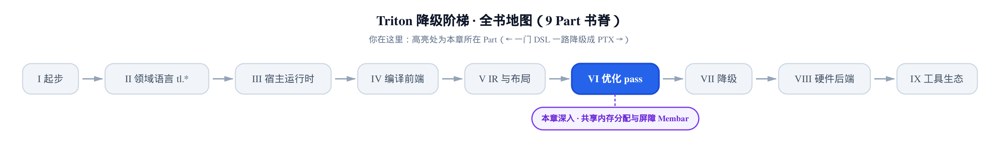
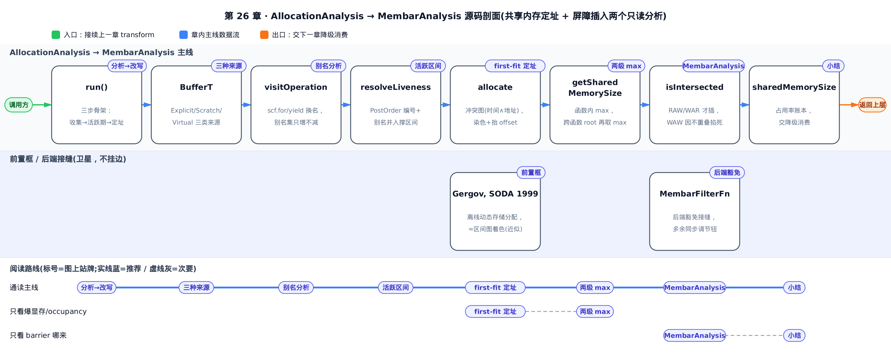
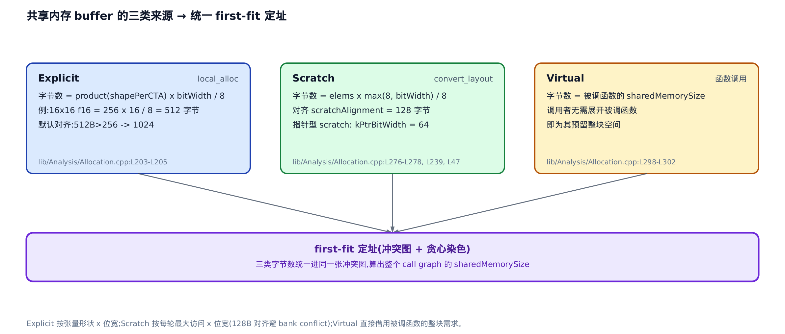
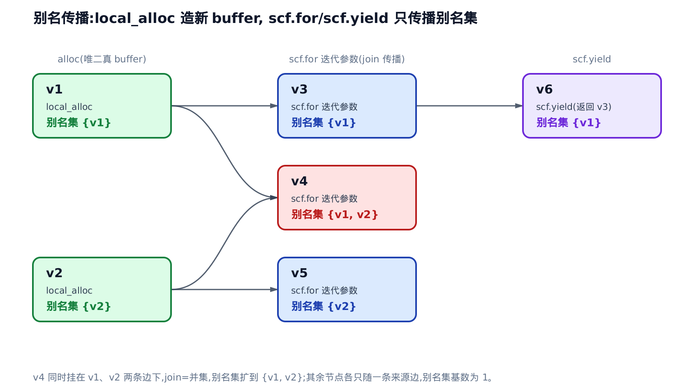
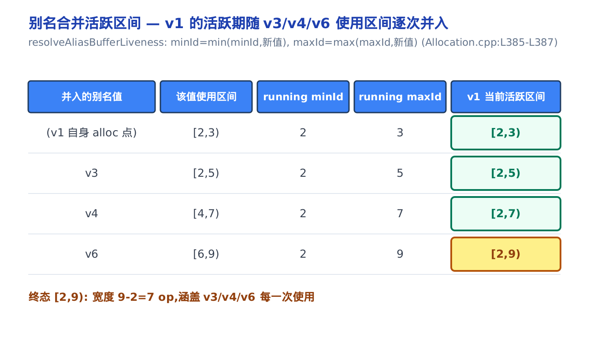
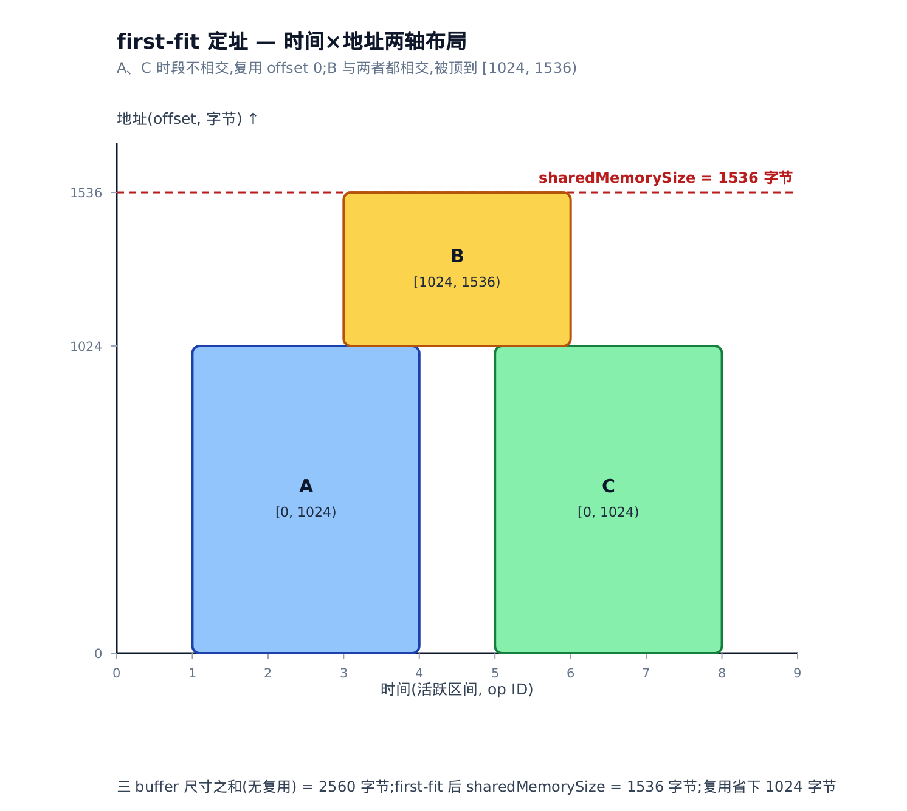
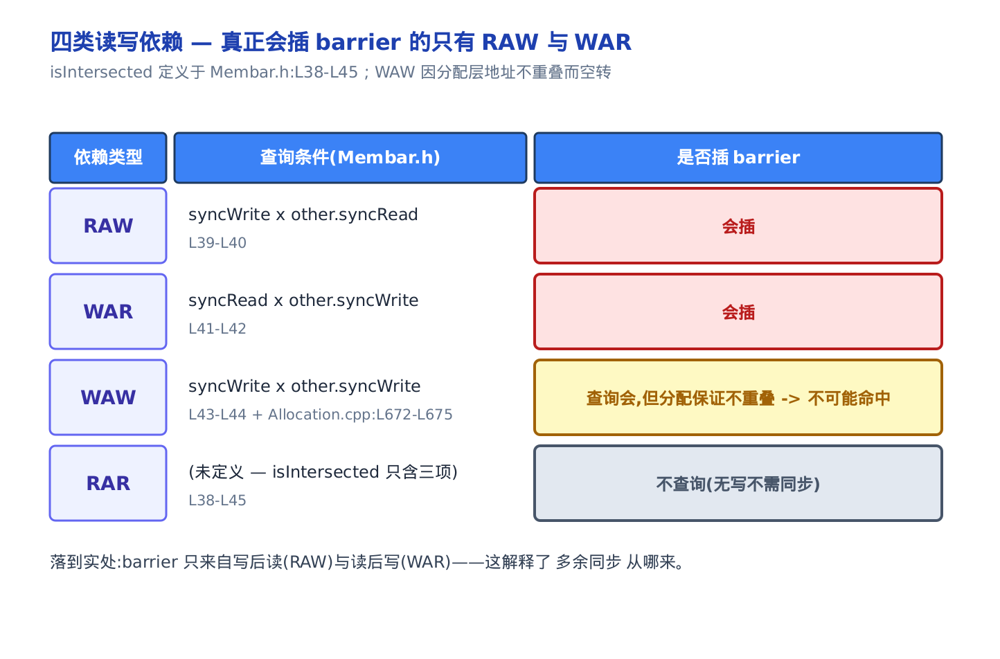
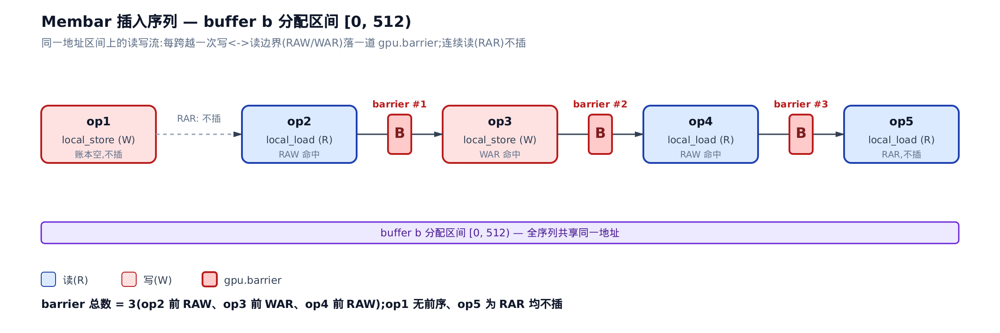

# 共享内存分配与屏障：Allocation、Alias 与 Membar



> 上一章立了什么：AxisInfo 静态分析驱动 Coalesce 改写，一个只读分析喂一个 transform。
> 本章解决什么：两个只读分析——给共享内存 buffer 定地址、在读写之间插屏障。
> 下一章接什么：把这两份分析结果真正降级成 PTX 里的地址与 `barrier`。

你把 `BLOCK_M` 从 64 调到 256，编译器直接甩你一句 `out of resource: shared memory`，或者悄悄把 occupancy 压到只剩两个 block 驻留——**occupancy（占用率，每个 SM 上同时驻留的活跃 block 数占硬件上限的比例）** 一低，访存延迟就藏不住了。这两件事的账本都记在同一个数字上：**sharedMemorySize**，编译器上报给 runtime 的「这个 kernel 每个 block 要占多少共享内存」。

本章讲清这个数字怎么算出来——谁在抢共享内存、每块要多大、活跃期怎么求、地址怎么定；再讲它的孪生分析：在这些 buffer 的读写之间，编译器凭什么决定「这里得插一道同步」。两件事分别落在 `lib/Analysis/Allocation.cpp` 和 `lib/Analysis/Membar.cpp` 两个文件里。搞懂了，你就能回答两个实打实的性能问题：**block 开多大会爆共享内存**，以及 **dump 里那些 `gpu.barrier` 到底是哪来的、哪些是省不掉的**。



只想搞清「block 开大了为什么爆共享内存」：直接看定址那两节（谁在抢黑板、first-fit 怎么挤格子）。只想知道「dump 里的 barrier 哪来的」：跳到 Membar 那节。想跟全程从三步骨架一路推到底：按序读。

## 又一次「分析 → 改写」：这次是两个只读分析

[上一章](../../ch25-axisinfo-coalesce/narrative/chapter.md)把 Triton 优化 pass 的母范式拆给你看了：一个只读的静态分析爬一遍 IR、算出每个值的某种属性，一个 transform 拿着这份属性去改写。本章是同一个范式的又一个实例——不重讲范式本身，只看它这次长什么样。

区别在于：这一回是**两个**只读分析，串成一条流水线：

- **AllocationAnalysis**：给每个要用共享内存的 buffer 算出大小、活跃区间，再 first-fit 定出 offset，最后汇成整个 call graph 的 sharedMemorySize。
- **MembarAnalysis**：拿着上一步定好的 buffer 地址区间，沿指令流走一遍，在真正会出数据竞争的读写之间插 `gpu.barrier`。

两者都是「只读分析」——AllocationAnalysis 只往一旁的 `Allocation` 容器里写结果、不碰 IR；MembarAnalysis 严格说会插一条 `gpu.barrier` op，但它的决策完全由前一步的 buffer 区间驱动，不改任何计算逻辑。真正把 offset 钉进 IR、把总量写进模块属性的降级动作，留到后面讲 `ConvertLayoutOp` 降级的那一章。

> 只想知道「我 block 开大了为什么爆共享内存」：直接跳 [first-fit 定址](#first-fit-定址谁跟谁挤同一格储物柜) 和 [两级 max](#两级-max一个-kernel-到底要多少共享内存)。
> 想知道「dump 里的 barrier 哪来的」：跳 [Membar](#membaranalysis屏障插在哪)。
> 想跟全程从「谁要共享内存」一路推到底：按序读。

AllocationAnalysis 的算法骨架就三步，摆在 `run()` 里一目了然：

```c++
# lib/Analysis/Allocation.cpp:L188-L192
  void run() {
    getValuesAndSizes();
    resolveLiveness();
    computeOffsets();
  }
```

先收集「谁要共享内存、各要多大」（`getValuesAndSizes`），再求每个 buffer「活到什么时候」（`resolveLiveness`），最后按活跃区间把地址挤紧（`computeOffsets`）。下面按这三步走，每一步都是一个核心机制。

## 谁在抢这块公用黑板：三种 buffer 来源

**直觉。** 共享内存是一块 block 内所有线程共用的黑板，容量很小、大家抢着写。跟它打交道的只有三类「人」：自己带笔上台写字的（**Explicit**，你在 kernel 里显式 `local_alloc` 出来的）、临时借块草稿纸打个转手的（**Scratch**，`convert_layout` 换布局时要的中转区）、以及把黑板转租给下属函数用的（**Virtual**，函数调用——按被调函数的需要替它占好位）。三类来源不同、算大小的公式不同，但最后都要在同一块有限黑板上排地盘。

`local_alloc`、`convert_layout`、`memdesc` 这些算子的表面语义[第 24 章](../../ch24-ttg-ttng-operations/narrative/chapter.md)讲过了——本章不重讲它们长什么样，只讲这些 buffer 怎么被分析、定址。

**机制。** 三类来源在数据结构上是同一个 `BufferT`，用一个 `BufferKind` 枚举区分：

```c++
# include/triton/Analysis/Allocation.h:L175-L204
  /// A class that represents a shared memory buffer
  struct BufferT {
    /// Explicit: triton_gpu.local_alloc
    /// Scratch: triton_gpu.convert_layout
    /// Virtual: triton.call
    enum class BufferKind { Explicit, Scratch, Virtual };

    // … 省略：线程安全的自增 id 计数器 …
    BufferKind kind;
    BufferId id;
    size_t size;
    size_t alignment;
    size_t offset;
    // … 省略：regionIds / sharingGroup（warp-spec 才用） …

    size_t setOffsetAligned(size_t newOffset) {
      return offset = llvm::alignTo(newOffset, alignment);
    }
  };
```

一个 buffer 就是一条 `(kind, size, alignment, offset)`。**`setOffsetAligned`（对齐定址的唯一入口）** 值得记住：定 offset 永远经它，`llvm::alignTo` 把地址向上取整到 `alignment` 的倍数——所有对齐要求都收口在这一行。

三类 buffer 的字节数各有各的算法。Explicit 最直白——一个 `LocalAllocOp`（`local_alloc` 算子在 IR 里的类）的字节数就是张量元素数乘以位宽：

```c++
# lib/Analysis/Allocation.cpp:L195-L222
  void getExplicitValueSize(Operation *op) {
    for (Value result : op->getResults()) {
      auto alloc = result.getDefiningOp<triton::gpu::LocalAllocOp>();
      if (alloc && alloc.isSharedMemoryAlloc()) {
        auto allocType = alloc.getType();
        auto shapePerCTA = triton::gpu::getShapePerCTA(allocType);
        auto bytes = product<int64_t>(shapePerCTA) *
                     allocType.getElementTypeBitWidth() / 8;
        auto alignment = alloc.getAlignmentOrDefault();
        // … 省略：调试 dump 与 warp-spec 的 sharingGroup 读取 …
        allocation->addBuffer<BufferT::BufferKind::Explicit>(
            result, bytes, alignment, 0, sharingGroup);
      }
    }
  }
```

`shapePerCTA`（**CTA（Cooperative Thread Array，即一个 GPU block）** 内单块张量的形状）的元素数乘位宽再除 8，就是字节数。举个数：一块 `16×16` 的 f16 张量，元素数 `256`，位宽 `16`，字节数 `256 × 16 / 8 = 512` 字节。这个字节数还要经 `setOffsetAligned` 里那步 `alignTo` 向上取整到 buffer 的 `alignment`——**默认对齐策略是：字节数超过 256 就对齐到 1024**（换更规整的 bank 访问）。512 大于 256，于是被对齐到 `1024`。

Scratch 和 Virtual 在 `getScratchValueSize` 里。`convert_layout` 的 scratch 区，字节数按「每轮最大访问元素数 × 位宽」算；函数调用的 Virtual buffer 更妙——它的大小**直接等于被调函数的 sharedMemorySize**：

```c++
# lib/Analysis/Allocation.cpp:L258-L304
    } else if (auto cvtLayout = dyn_cast<triton::gpu::ConvertLayoutOp>(op)) {
      auto srcTy = cvtLayout.getSrc().getType();
      auto dstTy = cvtLayout.getType();
      auto srcEncoding = srcTy.getEncoding();
      auto dstEncoding = dstTy.getEncoding();
      if (mlir::isa<SharedEncodingAttr>(srcEncoding) ||
          mlir::isa<SharedEncodingAttr>(dstEncoding)) {
        // Conversions from/to shared memory do not need scratch memory.
        return;
      }
      auto scratchConfig = getScratchConfigForCvt(srcTy, dstTy);
      auto elems = getNumScratchElements(scratchConfig.paddedRepShape);
      auto bytes =
          isa<triton::PointerType>(srcTy.getElementType())
              ? elems * kPtrBitWidth / 8
              : elems * std::max<int>(8, srcTy.getElementTypeBitWidth()) / 8;
      maybeAddScratchBuffer<BufferT::BufferKind::Scratch>(op, bytes,
                                                          scratchAlignment);
    }
    // … 省略：reduce / scan / histogram / atomic 等分支，同一模式：算 bytes → maybeAddScratchBuffer<Scratch> …
    else if (auto callOp = dyn_cast<CallOpInterface>(op)) {
      auto callable = callOp.resolveCallable();
      auto funcOp = dyn_cast<FunctionOpInterface>(callable);
      auto *funcAlloc = &(*funcAllocMap)[funcOp];
      auto bytes = funcAlloc->getSharedMemorySize();
      maybeAddScratchBuffer<BufferT::BufferKind::Virtual>(op, bytes,
                                                          scratchAlignment);
    }
```

几个数字点一下：**`scratchAlignment`（scratch 的对齐）** 是 128 字节（`Allocation.cpp:L239`）——源码在这一行没写为什么取这个数。一个常识性的解释是：共享内存一般按 32 bank × 4 字节 = 128 字节一行错位，128 对齐能让不同 scratch buffer 的起始地址落到错开的 bank 上，是常见的规避 **bank conflict（共享内存 bank 冲突，多个线程撞同一个 bank 导致访问串行化）** 的手法（这层考量源码确实点过，但在别处——`paddedRepShape` 的 `Allocation.h:L26`、`Allocation.cpp:L80` 注释针对的是 padding 而非这里的 scratchAlignment，所以上面这个归因算推测、不是从 L239 读出来的）。指针型 scratch 用 **`kPtrBitWidth`（指针位宽）= 64**。注意第一个分支：`convert_layout` 只要源或目标有一端已经在共享内存里，就直接 `return`——从/到共享内存的转换不需要额外草稿纸。

Virtual 那条是本设计的巧思：调用者**无需展开被调函数**，只要读一下它算好的 `getSharedMemorySize()`，就替它占下一整块等大的空间。这也解释了为什么 `getValuesAndSizes` 要按 call graph 后序遍历——被调函数先算完，调用者才拿得到这个数。



## 别名分析：循环里换了名字的同一张草稿纸

**直觉。** 麻烦出在循环。循环里的一块共享内存，每一轮迭代「同一张草稿纸换了个名字」又传回来——`scf.for`（结构化 for 循环）的迭代参数是一个新名字、`scf.yield`（把循环体结果传回下一轮）的返回值又是一个新名字，但它们指的还是同一张原始草稿纸。**别名分析（alias analysis）** 就是给这些不同名字贴上「你其实指向哪张原始草稿纸」的标签。关键洞察：只有 `local_alloc` 会真的「买一张新纸」；`subview`（切一角）、`trans`（转个方向）只是给同一张纸改个名，名字变了纸没变。

**机制。** 这份分析是 MLIR 数据流框架里的一个转移函数，格值（lattice value）= 「这个值别名到的原始 alloc 的集合」，join = 求并集。转移规则短得只有三条：

```c++
# lib/Analysis/Alias.cpp:L24-L60
LogicalResult SharedMemoryAliasAnalysis::visitOperation(
    Operation *op, ArrayRef<const dataflow::Lattice<AliasInfo> *> operands,
    ArrayRef<dataflow::Lattice<AliasInfo> *> results) {
  AliasInfo aliasInfo;
  bool pessimistic = true;
  auto result = op->getResult(0);
  // skip ops that return memdesc in a different memory space.
  if (auto memdescTy = dyn_cast<triton::MemDescType>(result.getType())) {
    if (!isa_and_nonnull<triton::gpu::SharedMemorySpaceAttr>(
            memdescTy.getMemorySpace()))
      return success();
  }

  // Only LocalAllocOp creates a new buffer.
  if (isa<triton::gpu::LocalAllocOp>(op)) {
    aliasInfo.insert(result);
    pessimistic = false;
  } else if (isa<triton::gpu::MemDescSubviewOp, triton::TransOp>(op)) {
    aliasInfo = AliasInfo(operands[0]->getValue());
    pessimistic = false;
  } else {
    // … 省略：断言「未知的 memdesc 制造者」 …
  }

  if (pessimistic) {
    setAllToEntryStates(results);
    return success();
  }
  for (auto *result : results)
    propagateIfChanged(result, result->join(aliasInfo));
  return success();
}
```

三条规则：`LocalAllocOp` → `insert(result)` 造一个全新别名集，`pessimistic=false`；`MemDescSubviewOp`/`TransOp` → 原样继承第一个 operand 的别名集；其余一律 `pessimistic`（保守，交给框架的 entry state）。而 `scf.for` 的迭代参数、`scf.yield` 的返回值，是 block 参数和 region 传递——由 MLIR 数据流框架自动沿控制流边 `join`，不需要这里手写。

源码头注释给了一张规范图例，直接把这套传播规则钉死了：

```c++
# include/triton/Analysis/Alias.h:L42-L59
  /// Example:
  ///    alloc v1                  alloc v2
  ///       |                         |
  ///    |--------------|   |------------|
  ///  scf.for v3     scf.for v4       scf.for v5
  ///    |
  /// scf.yield v6
  ///
  /// v1's alloc [v1]
  /// v2's alloc [v2]
  /// v3's alloc [v1]
  /// v4's alloc [v1, v2]
  /// v5's alloc [v2]
  /// v6's alloc [v1]
  ///
  /// Therefore, v1's liveness range is the union of v3, v4, and v6
```

两块真 alloc：`v1`、`v2`。三个 `scf.for` 迭代参数 `v3`/`v4`/`v5`、一个 `scf.yield` 返回值 `v6`。逐值套转移规则，别名集是这样长出来的：

<!-- trace: alias-analysis -->

| 值 | 产生它的 op | 转移规则(Alias.cpp) | 别名集(alloc 集合) |
|----|-------------|---------------------|---------------------|
| v1 | local_alloc | isa<LocalAllocOp> → insert(result)，pessimistic=false | {v1} |
| v2 | local_alloc | isa<LocalAllocOp> → insert(result) | {v2} |
| v3 | scf.for 迭代参数(源自 v1) | block 参数经框架 join 源的别名集 | {v1} |
| v4 | scf.for 迭代参数(源自 v1 与 v2) | 两条边 join → 取并集 | {v1, v2} |
| v5 | scf.for 迭代参数(源自 v2) | block 参数 join | {v2} |
| v6 | scf.yield(返回 v3) | yield 值传递 v3 的别名集 | {v1} |

`v4` 是全场唯一同时挂在两条来源边下的值——它的两个 operand 分别别名 `v1` 和 `v2`，join = 并集，于是别名集撑成 `{v1, v2}`。其余每个值只随一条边，别名集基数都是 1。

**这份分析必然收敛，且步数有限。** 论证很短：格值是「别名到的 alloc 集合」，join = 并集，集合在并集下只增不减（单调）；而全模块的 alloc 数量有限（本例 2 个），每个值的别名集被这个有限全集封顶。单调递增 + 有上界 ⇒ 有限步必达不动点。本例 alloc 全集大小是 2，所以任一值的别名集基数 `≤ 2`——`v4` 恰好顶到上界 2，其余都是 1。正因为这条性质，它才能安心交给 MLIR 前向数据流框架自动跑。



这张别名图的**直接后果**是下一节的输入：`v1` 这张原始草稿纸，它的活跃期必须涵盖 `v3`、`v4`、`v6` 每一次使用——否则分配器会以为 `v1` 在循环体里早就死了，把它的地址复用给别人，数据当场损坏。

## 活跃区间：从「第一次碰」到「最后一次碰」

**直觉。** 一个 buffer 的「活着区间」= 从第一次碰它到最后一次碰它。要给这个区间量个尺，先得给每条指令编号。编号用 **PostOrder（后序：先给子 op 编号，父 op 的编号必比它所有子 op 都大）**——这一步很讲究：如果父 op 编号比子 op 小，那么「循环外定义、循环内使用」的 buffer 会被误判成在循环体开始前就死了。后序编号保证父 op ID 更大，活跃期不会早退。

**机制。** `resolveLiveness` 先后序编号，再用 MLIR 自带的 `Liveness` 分析求每个值的活跃 op 集，取其中最小、最大 ID 拼成半开区间 `[minId, maxId)`：

```c++
# lib/Analysis/Allocation.cpp:L445-L484
    DenseMap<Operation *, size_t> operationId;
    operation->walk<WalkOrder::PostOrder>(
        [&](Operation *op) { operationId[op] = operationId.size(); });

    Liveness liveness(operation);
    auto getValueLivenessRange = [&](Value value, BufferT *buffer) {
      auto liveOperations = liveness.resolveLiveness(value);
      // … 省略：min/max 初值 …
      std::for_each(
          liveOperations.begin(), liveOperations.end(), [&](Operation *liveOp) {
            if (operationId[liveOp] < minId) {
              minId = operationId[liveOp];
            }
            if ((operationId[liveOp] + 1) > maxId) {
              maxId = operationId[liveOp] + 1;
            }
          });
      return Interval(minId, maxId);
    };

    resolveExplicitBufferLiveness(getValueLivenessRange);
    resolveAliasBufferLiveness(getValueLivenessRange);
    resolveScratchBufferLiveness(operationId);
```

三条 `resolve*` 分别处理三类活跃期：explicit buffer 直接取其活跃 op 集的区间；scratch/virtual 的活跃期就是它所在那一个 op 的 `[id, id+1)`；而 **alias buffer 是关键**——它得把每个别名值的使用区间并进来。这一步落在 `resolveAliasBufferLiveness`：

```c++
# lib/Analysis/Allocation.cpp:L374-L392
  void resolveAliasBufferLiveness(
      function_ref<Interval<size_t>(Value value, BufferT *buffer)>
          getLiveness) {
    for (auto aliasBufferIter : allocation->aliasBuffer) {
      auto value = aliasBufferIter.first;
      auto buffers = aliasBufferIter.second;
      auto range = getLiveness(value, buffers.front());
      for (auto *buffer : buffers) {
        auto minId = range.start();
        auto maxId = range.end();
        if (bufferRange.count(buffer)) {
          // Extend the allocated buffer's range
          minId = std::min(minId, bufferRange[buffer].start());
          maxId = std::max(maxId, bufferRange[buffer].end());
        }
        bufferRange[buffer] = Interval(minId, maxId);
      }
    }
  }
```

对每个别名值，`minId = min(minId, 现值)`、`maxId = max(maxId, 现值)`——区间只扩不缩。承接上一节：`v1` 被 `v3`/`v4`/`v6` 别名，给这几个别名各赋一段（构造的）后序 ID 使用区间，看 `v1` 的活跃期怎么被逐次撑开：

<!-- trace: liveness-interval -->

| 并入的别名值 | 该值使用区间 | running minId | running maxId | v1 当前活跃区间 |
|--------------|--------------|---------------|---------------|------------------|
| (v1 自身 alloc 点) | [2,3) | 2 | 3 | [2,3) |
| v3 | [2,5) | min(2,2)=2 | max(3,5)=5 | [2,5) |
| v4 | [4,7) | min(2,4)=2 | max(5,7)=7 | [2,7) |
| v6 | [6,9) | min(2,6)=2 | max(7,9)=9 | [2,9) |

`v1` 若只看自己的 alloc 点，只活 `[2,3)`，宽度 1。但 `v3`/`v4`/`v6` 的使用逼着它取三者之并，活跃期撑到 `[2,9)`，宽度 `9 − 2 = 7` 个 op——别名合并把活跃期扩大了 6 个 op，这 6 个 op 内 `v1` 的地址被锁死、不可复用。

**合并后的区间是每个别名使用区间的超集**，所以任何别名使用都不会落在 buffer 活跃期之外。归纳一下：基例是 buffer 自身 `[2,3)`；每并入一个别名区间 `[a,b)`，`minId` 只减、`maxId` 只增，新区间必 ⊇ 旧区间 ∪ `[a,b)`。故终态 `[2,9)` 涵盖 `v3`/`v4`/`v6` 的每一次使用——分配器绝不会在别名还活着时把 `v1` 的地址让给别人。这段活跃区间正是下一步冲突图判「时间相交」的输入。



## first-fit 定址：谁跟谁挤同一格储物柜

拿到了每个 buffer 的活跃区间和大小，剩下的就是定地址。这本质上是一个经典的编译期问题——源码注释里直接点了名：

> **前置：这是一个「离线动态存储分配」问题。**
> 运行期的 `malloc`/`free` 是在线的——你不知道下一个请求什么时候到。但编译期不一样：所有 buffer 的活跃区间**此刻全部已知**。给每个 buffer 一段连续地址、让活跃期相交的 buffer 不重叠，正是 **offline dynamic storage allocation（离线动态存储分配）**，也就是区间图着色的一个变体。这是 NP-hard 的一般问题，Triton 用 **first-fit（首次适配：给每个 buffer 挑第一个不与邻居冲突的位置）** 作实用近似。你不需要它的最优性证明，接受「first-fit 是个够用的贪心近似」就能往下读。源码引的是 Gergov,《Algorithms for Compile-Time Memory Optimization》,SODA 1999。

**直觉。** 把每个 buffer 想成一件「占用某个时段的行李」，共享内存是一排储物格（地址从 0 往上）。两件行李只有「同一时段 **且** 占了重叠格子」才真冲突。做法分三拍：先都堆到 0 号格试试 → 画出谁跟谁冲突的图 → 贪心染色，再按邻居的最高占用把该抬的抬高。抬高后可能又冒出新冲突，于是重画冲突图再抬，直到没冲突。**收益就是那句话：时段不重叠的两件行李能共用同一格子。**

**机制。** 冲突图的定义是全章的题眼——**两个条件都满足才连边**：

```c++
# lib/Analysis/Allocation.cpp:L641-L681
  void buildInterferenceGraph(const SmallVector<BufferT *> &buffers,
                              GraphT &interference) {
    interference.clear();
    for (auto x : buffers) {
      for (auto y : buffers) {
        if (x == y)
          continue;
        // … 省略：取 x/y 的 offset 与 size …
        Interval xSizeRange = {xStart, xStart + xSize};
        Interval ySizeRange = {yStart, yStart + ySize};
        auto xOpRange = bufferRange.lookup(x);
        auto yOpRange = bufferRange.lookup(y);
        if (xOpRange.intersects(yOpRange) &&
            xSizeRange.intersects(ySizeRange)) {
          interference[x].insert(y);
        }
        // … 省略：inDifferentRegion 分支（warp-spec 才触发） …
      }
    }
  }
```

`xOpRange.intersects(yOpRange)`（时间：活跃区间相交）**且** `xSizeRange.intersects(ySizeRange)`（空间：地址区间相交），才算冲突。这里同一个 `Interval`（半开区间 `[start, end)`）既量时间又量空间，`intersects` 一个函数两处复用。**把「时间相交」和「地址相交」拆成两个独立条件，正是省内存的机器**：时段错开的两个 buffer，哪怕地址完全一样也无边、可以共址。

染色和定址在 `allocate`：first-fit 找第一个没被邻居占的颜色，再按邻居的最高终点抬 offset，末尾顺手更新 sharedMemorySize：

```c++
# lib/Analysis/Allocation.cpp:L684-L725
  void allocate(const SmallVector<BufferT *> &buffers,
                const GraphT &interference) {
    allocation->sharedMemorySize = 0;
    // First-fit graph coloring
    DenseMap<BufferT *, int> colors;
    for (auto value : buffers) {
      colors[value] = (value == buffers[0]) ? 0 : -1;
    }
    SmallVector<bool> available(buffers.size());
    for (auto x : buffers) {
      std::fill(available.begin(), available.end(), true);
      for (auto y : interference.lookup(x)) {
        int color = colors[y];
        if (color >= 0) {
          available[color] = false;
        }
      }
      auto it = std::find(available.begin(), available.end(), true);
      colors[x] = std::distance(available.begin(), it);
    }
    // Finalize allocation
    for (auto x : buffers) {
      size_t newOffset = 0;
      for (auto y : interference.lookup(x)) {
        newOffset = std::max(newOffset, y->offset + y->size);
      }
      if (colors.lookup(x) != 0)
        x->setOffsetAligned(newOffset);
      allocation->sharedMemorySize =
          std::max(allocation->sharedMemorySize, x->offset + x->size);
    }
  }
```

抬 offset 会引出一个微妙的坑：把某个 buffer 顶高之后，它可能跟原本地址不交的另一个 buffer 撞上了。所以 `computeOffsets` 用一个不动点循环，`allocate` 完就重建冲突图，反复到冲突图为空：

```c++
# lib/Analysis/Allocation.cpp:L559-L564
    GraphT interference;
    buildInterferenceGraph(buffers, interference);
    do {
      allocate(buffers, interference);
      buildInterferenceGraph(buffers, interference);
    } while (!interference.empty());
```

（初始 offset 由 `calculateStarts` 用一张 `tripleMap`（`(offset → 该处可用空隙区间)` 的空隙表）先 first-fit 落一遍，这里从略。这遍 first-fit 是**轻量、不看冲突图**的粗略占位——只给每个 buffer 一个非负下界、不保证彼此无冲突；真正消解地址冲突靠下面 `buildInterferenceGraph` + `allocate` 的不动点循环。所以下表首行三个 buffer 全落在 offset 0、却仍标着冲突，并不矛盾：calculateStarts 这遍恰好把它们都放到了 0，冲突留给后续循环处理。为聚焦这套核心手法，下表**假设 calculateStarts 给了个最松的初值——都从 0 开始**；实际上 calculateStarts 自己那套 tripleMap 空隙表已会利用活跃期错开信息抢跑一部分复用，「全 0」是教学简化、不代表它真这么糙。）拿三个 explicit buffer 走一遍这套循环——A、C 时段错开，B 跟两者都撞：

<!-- trace: first-fit-allocation -->

| 轮次 | offset(A,B,C) | 冲突图(时间∧地址相交) | 染色/动作 | sharedMemorySize |
|------|---------------|------------------------|-----------|-------------------|
| 初始(calculateStarts 松初值，全 0) | 0,0,0 | A-B, B-C（A-C 时段不交无边） | 初始定址皆 0，进入不动点循环 | — |
| allocate 第 1 轮 | 0,1024,0 | 空 | 染色 A=0,B=1,C=0；B(色1)抬到 max(A:0+1024)=1024，C(色0)保持 0 | max(1024,1536,1024)=1536 |
| 重建冲突图 第 2 轮 | 0,1024,0 | 空 → 不动点，退出 | 收敛：A[0,1024) 与 C[0,1024) 时段不交共用 offset 0，B 独占 [1024,1536) | 1536 |

A 活跃 `[1,4)`、C 活跃 `[5,8)`，时段完全错开，于是**共用地址 `[0,1024)`**；B 活跃 `[3,6)` 跟两者都重叠，被顶到 `[1024,1536)`。三个 buffer 尺寸和是 `1024 + 512 + 1024 = 2560` 字节，first-fit 后总量只要 `1536` 字节——**复用省下 `2560 − 1536 = 1024` 字节**。



**这个循环必然停，且终态一定不踩内存。** 终止性看单调量：`allocate` 只把 offset 往邻居的 `max(offset+size)` 抬、绝不降低，每抬一次就让一对原本地址相交的冲突分开，冲突边只减不增；冲突数是非负整数、严格递减，有限步归零、`do-while` 退出。正确性看染色：冲突边 = 时间相交 ∧ 地址相交，first-fit 令相邻节点异色、异色即被 max-offset 推到不重叠地址；终态无边 ⇒ 任意时段相交的两个 buffer 地址不交 ⇒ 不会有两个同时存活的 buffer 踩同一字节。复杂度上，`buildInterferenceGraph` 每轮 `O(N²)` 判交、外层不动点至多 `O(N)` 轮，总 `O(N³)` 上界（N = buffer 数）。

## 两级 max：一个 kernel 到底要多少共享内存

**直觉。** sharedMemorySize 就是刚才 `allocate` 末尾那行 `max(offset+size)` 的最终值——所有 buffer「地址终点」里最高的那个。但一个 kernel 可能调别的函数，所以要取两级最大值：函数内取自己所有 buffer 的最高终点，跨函数再把调用图上各根函数的量取 max。跨函数这一级靠 Virtual buffer 兜底——调用者用一个 Virtual buffer 替被调函数占下它的整块需求，于是被调的量自动计进了调用者的 max。

**机制。** call graph 层的封装 `ModuleAllocation::getSharedMemorySize` 就是对各 root 函数取 max：

```c++
# include/triton/Analysis/Allocation.h:L268-L275
  size_t getSharedMemorySize() {
    size_t size = 0;
    for (auto funcOp : getRoots()) {
      auto *alloc = getFuncData(funcOp);
      size = std::max(size, alloc->getSharedMemorySize());
    }
    return size;
  }
```

拿一个「foo 调 bar」的例子把两级 max 走一遍。foo 自有 buffer 总量 1536 字节（就是上一节的 A/B/C），bar 自身 sharedMemorySize 是 2048 字节；foo 在调用点用一个 Virtual buffer 替 bar 占 2048 字节。这个 Virtual buffer 的活跃区间就是那次调用——晚于 A、B、C 全部结束之后，跟三者时段都不相交。于是它照搬上一节刚建立的「时间不相交则地址可复用」那条规则，first-fit 把它落回 offset 0（A/B/C 此刻都已死，`[0,2048)` 整段空出来）：

<!-- trace: shared-memory-size -->

| 层级 | 量 | 取值 | 规则(源码) |
|------|-----|------|-------------|
| 函数内 (foo 自有) | max_buffer(offset+size) | 1536 字节 | lib/Analysis/Allocation.cpp:L722-L724 |
| 被调函数 bar | bar.sharedMemorySize | 2048 字节 | bar 自身 allocate 末尾 max |
| 调用点 Virtual buffer | = bar.sharedMemorySize | 2048 字节(复用 offset 0) | lib/Analysis/Allocation.cpp:L298-L302 |
| 函数 foo 总量 | max(自有 1536, Virtual 2048) | 2048 字节 | 同一 allocate 的 max(offset+size) |
| 模块(call graph) | max over roots | 2048 字节 | include/triton/Analysis/Allocation.h:L268-L275 getSharedMemorySize |

逐层套 max：foo 自有 1536，加上替 bar 占的 Virtual 2048，foo 总量 `max(1536, 2048) = 2048`；模块层再对各 root 取 max，还是 2048。**模块 sharedMemorySize ≥ 调用图里任一函数、任一 buffer 的 offset+size**——逐层 max 的复合仍是 max，结果支配调用图中每一处需求，绝不漏报。

**这就是本章的性能命门。** 把这个 2048 字节接到 occupancy 账本上：以每 SM 可配 48 KiB = 49152 字节共享内存计，仅共享内存一项限制的驻留 block 数就是 49152 除以每 block 需求再向下取整：

```math
N_{\mathrm{block}} = \left\lfloor \frac{49152}{\mathrm{sharedMemorySize}} \right\rfloor
```

代进去：需求 2048 字节 → `24` 个 block；你把 block 开大让需求涨到 8192 字节 → 只剩 `6` 个 block；再开到 24576 字节 → 只剩 `2` 个 block。**共享内存需求每翻几倍，occupancy 成反比跌落。** 这条链就是「block 开太大为什么爆共享内存 / 为什么 occupancy 掉」的完整答案：要么直接超过硬件每 block 上限编不出来，要么虽然编得出、但每 SM 驻留的 block 数被压到藏不住访存延迟。

到这里 AllocationAnalysis 讲完了——它把每个 buffer 的 offset 和整个 kernel 的 sharedMemorySize 都定了下来。接下来是它的孪生分析：既然地址定了，读写这些地址之间要不要同步？

## MembarAnalysis：屏障插在哪

**直觉。** GPU 上共享内存的读写要靠 `gpu.barrier` 同步——一个线程写了共享内存，别的线程要读到，中间得有一道 barrier 保证「写完了才读」。MembarAnalysis 的活就是：沿着指令流走，在真会出竞争的读写之间插 barrier，不该插的地方一个不插（多插一道就是白白多一次全 block 同步开销）。

要不要在两个访问之间同步，只看**四种读写组合**里的三种：

- **RAW（Read After Write，写后读）**：先写后读同一地址，读必须等写完 → 要 barrier。
- **WAR（Write After Read，读后写）**：先读后写同一地址，写必须等读完 → 要 barrier。
- **WAW（Write After Write，写后写）**：两个写同一地址 → 本该要，但**这套分配下压根不可能命中**。
- **RAR（Read After Read，读后读）**：两个读、没有写 → 无所谓先后，**不需要同步**。

WAW 为什么不可能？因为「两个写撞同一地址」的前提是它俩地址相交；而地址相交在这套分配下，只发生在活跃期不相交的 buffer 之间（时段相交的 buffer 一定被分到不重叠地址）——活跃期不交，就不会在指令流里同时被两个写盯上。**分配层的「时段相交 ⇒ 地址不重叠」保证，直接让屏障层的 WAW 空转。**

**机制。** 屏障账本是 `BlockInfo`：两本「地址区间 → 读/写它的 op 集」的流水，一本记读、一本记写。判定核心 `isIntersected` 显式只查三项：

```c++
# include/triton/Analysis/Membar.h:L18-L45
struct BlockInfo {
  using IntervalMapT = std::map<Interval<size_t>, std::set<Operation *>>;

  IntervalMapT syncReadIntervals;
  IntervalMapT syncWriteIntervals;

  BlockInfo() = default;

  BlockInfo &join(const BlockInfo &other) {
    // … 省略：两个 map 求并 …
  }

  bool isIntersected(const BlockInfo &other, MembarFilterFn filter) const {
    return /*RAW*/ isIntersected(syncWriteIntervals, other.syncReadIntervals,
                                 filter) ||
           /*WAR*/
           isIntersected(syncReadIntervals, other.syncWriteIntervals, filter) ||
           /*WAW*/
           isIntersected(syncWriteIntervals, other.syncWriteIntervals, filter);
  }
```

三行注释 `RAW`/`WAR`/`WAW` 明晃晃写在源码里——**RAR 根本不在其中**，因为没有写参与、无需同步。`MembarFilterFn`（**后端豁免回调**）是留给后端的接缝：两个 op 访问同一共享内存不一定真需 barrier（比如异步拷贝自带同步），后端可以用更细的知识把某些 op 对豁免掉——这是「多余同步」的调节旋钮，点到为止。



**插入逻辑。** `update` 逐 op 演化 `BlockInfo`：碰到 barrier op 就 `sync()` 清账；否则按 `MemoryEffect`（MLIR 的内存副作用标注，说明这个 op 对某个值是读还是写）把这次访问的地址区间填进 `curBlockInfo` 的读/写集：

```c++
# lib/Analysis/Membar.cpp:L101-L155
void MembarAnalysis::update(Operation *op, BlockInfo *blockInfo,
                            FuncBlockInfoMapT *funcBlockInfoMap,
                            OpBuilder *builder) {
  if (isa<gpu::BarrierOp>(op)) {
    // If the current op is a barrier, we sync previous reads and writes
    blockInfo->sync();
    return;
  }
  // … 省略：AsyncWait 分支（后端异步拷贝接缝）；CallOp 分支（跨函数查表） …
  BlockInfo curBlockInfo;
  auto scratchBufferId = Allocation::InvalidBufferId;
  if (isa<triton::CallOp>(op)) {
    // … 省略 …
  } else {
    if (auto memoryEffectOpInterface = dyn_cast<MemoryEffectOpInterface>(op)) {
      SmallVector<SideEffects::EffectInstance<MemoryEffects::Effect>>
          effectInstances;
      memoryEffectOpInterface.getEffects(effectInstances);
      for (auto effectInstance : effectInstances) {
        if (auto value = effectInstance.getValue()) {
          for (auto bufferId : allocation->getBufferIds(value)) {
            if (bufferId != Allocation::InvalidBufferId) {
              if (isa<MemoryEffects::Write>(effectInstance.getEffect()))
                curBlockInfo
                    .syncWriteIntervals[allocation->getAllocatedInterval(
                        bufferId)]
                    .insert(op);
              else if (isa<MemoryEffects::Read>(effectInstance.getEffect()))
                curBlockInfo
                    .syncReadIntervals[allocation->getAllocatedInterval(
                        bufferId)]
                    .insert(op);
            }
          }
        }
      }
    }
    scratchBufferId = allocation->getBufferId(op);
  }
```

`getAllocatedInterval` 是连接两份分析的接口：它把 buffer 的 id 映射回上半章 first-fit 定好的地址区间——Membar 判「区间相交」用的正是 Allocation 算出的 offset。填完这次访问，就拿 `curBlockInfo` 跟历史账本 `blockInfo` 对账，命中就插 barrier 再清账：

```c++
# lib/Analysis/Membar.cpp:L161-L184
  if (scratchBufferId != Allocation::InvalidBufferId) {
    // … 省略：scratch buffer 不应带既有依赖的断言 …
    auto interval = allocation->getAllocatedInterval(scratchBufferId);
    curBlockInfo.syncWriteIntervals[interval].insert(op);
    if (blockInfo->isIntersected(curBlockInfo, filter)) {
      builder->setInsertionPoint(op);
      insertBarrier(op, builder);
    }
    // Ops with a scratch buffer internally syncs read/write on shared memory
    blockInfo->sync();
    curBlockInfo.syncReadIntervals[interval].insert(op);
  } else if (blockInfo->isIntersected(curBlockInfo, filter)) {
    builder->setInsertionPoint(op);
    insertBarrier(op, builder);
    blockInfo->sync();
  }
  blockInfo->join(curBlockInfo);
```

两条路：普通 op 走 `else if`——区间相交就 `setInsertionPoint` + `insertBarrier`（真正插 `gpu.barrier` 的动作）+ `sync()` 清账。scratch buffer（如 `convert_layout`）走上面那条——它本身是「先写共享内存再读」，所以先当写检查一次是否与前序冲突，`sync` 清账，再登记为读。

拿一段对同一 buffer `b`（分配区间 `[0,512)`）的读写序列走一遍，看 barrier 恰好落在哪：

<!-- trace: membar-insert -->

| op | 效果 | 对账(blockInfo × cur) | 命中？ | 插 barrier? | 账本 after |
|----|------|------------------------|-------|-------------|-------------|
| op1 local_store b | W [0,512) | 账本空 | 否 | 否 | write={[0,512):op1} |
| op2 local_load b | R [0,512) | RAW: write[op1] × read[op2] | 是(RAW) | 在 op2 前插，然后 sync | read={[0,512):op2} |
| op3 local_store b | W [0,512) | WAR: read[op2] × write[op3] | 是(WAR) | 在 op3 前插，然后 sync | write={[0,512):op3} |
| op4 local_load b | R [0,512) | RAW: write[op3] × read[op4] | 是(RAW) | 在 op4 前插，然后 sync | read={[0,512):op4} |
| op5 local_load b | R [0,512) | RAR: 无写可对 → isIntersected 假 | 否 | 否 | read={[0,512):op4,op5} |

5 个访问（3 读 2 写）沿途恰插 **3 道** barrier：op2 前（RAW）、op3 前（WAR）、op4 前（RAW）。op1 无前序不插；op5 对 op4 是 RAR，两侧皆读、`isIntersected` 恒假，不插。

**barrier 只在真依赖处插一道，不重复。** 每次命中就 `insertBarrier` 后立刻 `sync()` 清空两本区间集——清完账本为空，紧接的下一个 op 除非与「本 op 之后新记的访问」再成 RAW/WAR，否则不会再命中，同一依赖不会被重复插。假如把 op5 换成对 `b` 的写，那 op4(读)→op5(写) 就成了 WAR，barrier 数升到 4——**每多一个跨越读写边界的访问，就多一道全 block 同步开销**。这正是 `MembarFilterFn` 后端豁免想削减的目标。



## 小结：两个分析，一本性能账

本章走完了 AllocationAnalysis → MembarAnalysis 这条只读分析流水线——同一个「分析 → 改写」母范式的又一实例：

- **AllocationAnalysis** 把三类来源（Explicit / Scratch / Virtual）的 buffer 收齐，用别名分析把循环里换名的同一张纸认出来、把活跃期撑对，再 first-fit 定 offset，两级 max 汇成 **sharedMemorySize**。这个数字就是你「block 开多大会爆共享内存 / occupancy 掉多少」的账本：需求每翻倍，驻留 block 数成反比跌。
- **MembarAnalysis**（`lib/Analysis/Membar.cpp`）拿着定好的地址区间，在 RAW / WAR 处插 `gpu.barrier`——WAW 被分配层的「时段相交 ⇒ 地址不重叠」保证掐死、RAR 无写不查。dump 里每一道 barrier，都能对到一次跨越读写边界的共享内存访问；想减 barrier，就减这类边界。

这两份分析此刻只写进一旁的容器、还没落进 IR。把 offset 钉成 IR 属性、把总量写进模块的 `triton_gpu.shared`、把 `ConvertLayoutOp` 真正降级成走寄存器/shuffle/共享内存往返的三条搬运路径——那是后面 ConvertLayout 降级那一章的活；共享内存降级与全局访存向量化的收尾在再往后一章。本章到分析结果为止，降级消费留后。
