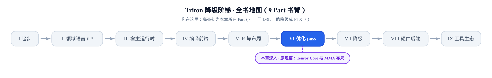
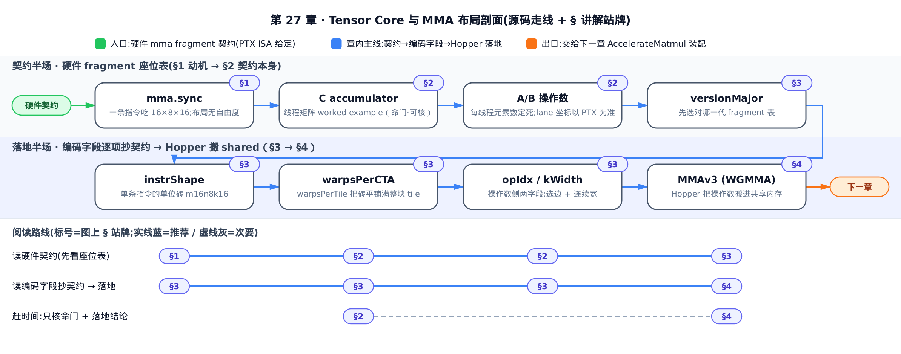
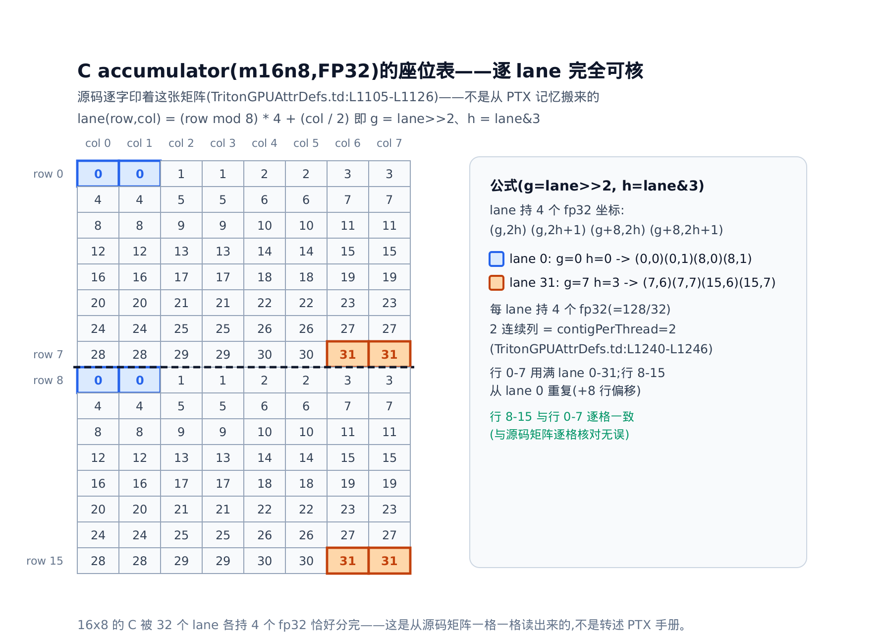
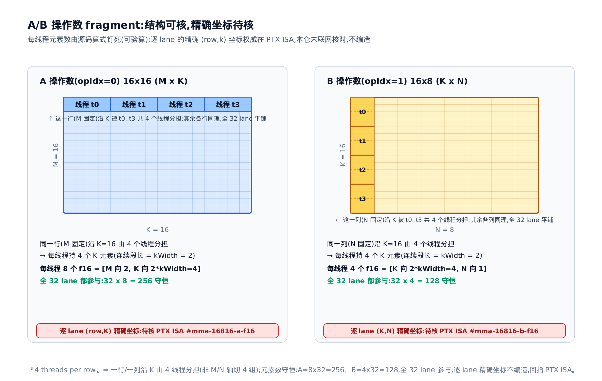
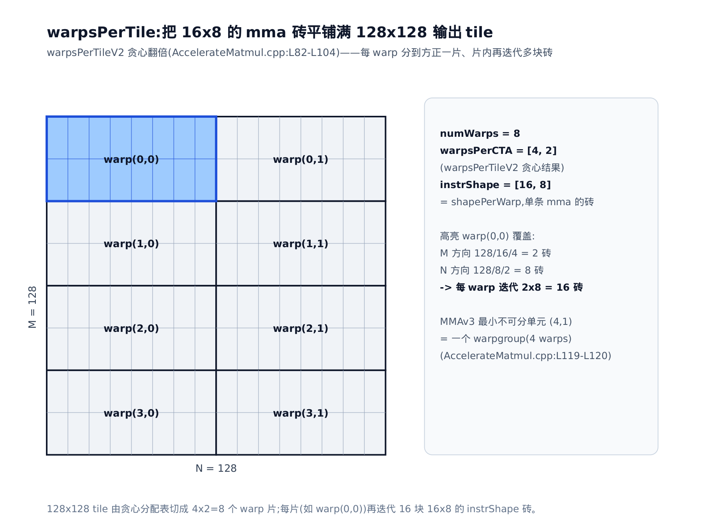
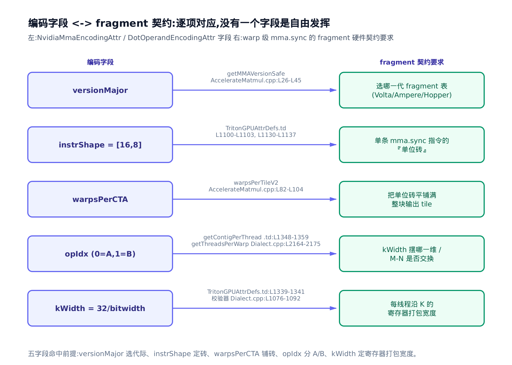
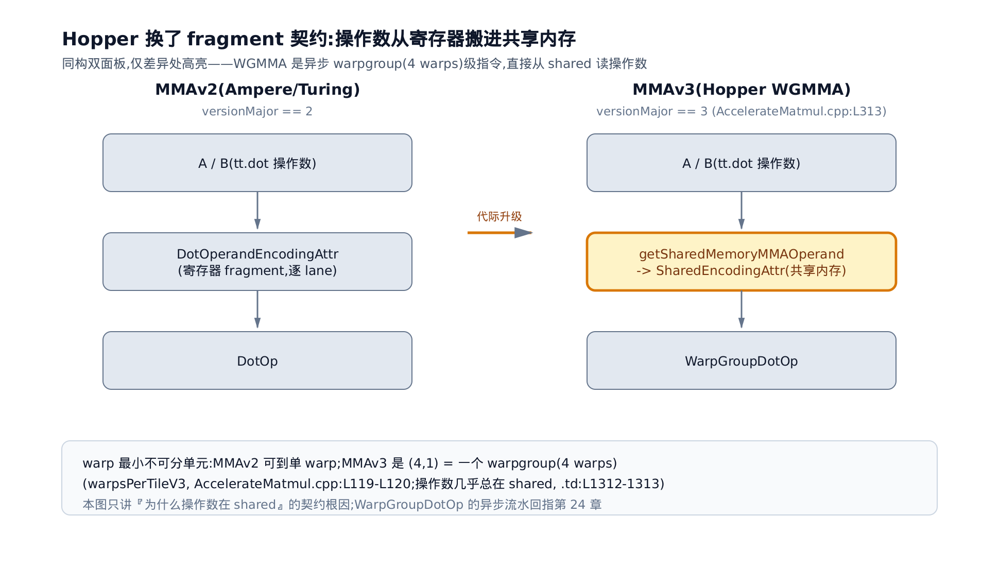

# Tensor Core 与 MMA 布局：mma/dot-operand 编码为什么长这样



> **你在这里**——第 VI 部分「优化 pass」的深入原理篇。
> 前面：[第 21 章](../../ch21-distributed-layouts/narrative/chapter.md)见过 MMA 编码的长相。
> 本章：回答这套编码为什么长这样。
> 下一章：AccelerateMatmul 把它装配上场。

先算性能账。你写下一个 `tl.dot`（[第 8 章](../../ch08-dot-reduce-scan/narrative/chapter.md)的块级矩阵乘），编译器面前有两条路：降成 Tensor Core（张量核心，GPU 上专算小块矩阵乘加的硬件单元）的 `mma` 指令，一条指令吃掉一整块 $`16\times8\times16`$ 的乘加；或者退回 FMA（fused multiply-add，标量乘加指令）循环逐元素磨。矩阵乘的吞吐差距就在这一步分出档次。而能不能走上快路，取决于一件事：`tt.dot` 的两个操作数和累加器的**布局**，是否与硬件要求的数据分布严丝合缝。本章讲清这个「硬件要求」本身。懂了它，`NvidiaMmaEncodingAttr` 与 `DotOperandEncodingAttr` 的每个字段都有机械的解释，你也能判断自己的 kernel 为什么没命中 Tensor Core。

本章符号先立好，随用随查：

| 符号 | 含义 | 首现 |
|---|---|---|
| $`\mathcal{L}`$ | 布局函数：张量索引 → 允许访问该处的线程集合（[第 20 章](../../ch20-layout-is-a-function/narrative/chapter.md)） | §1 |
| $`t`$ | warp 内线程（lane）编号，0–31（[第 2 章](../../ch02-gpu-execution-model/narrative/chapter.md)） | §2 |
| $`g=\lfloor t/4\rfloor`$ | C 座位表里 lane 的「组号」（即 `lane>>2`），决定落在哪一行 | §2.1 |
| $`h=t\bmod 4`$ | lane 的「组内序」（即 `lane&3`），决定持哪 2 个连续列 | §2.1 |
| $`(g,2h)\ (g,2h{+}1)\ (g{+}8,2h)\ (g{+}8,2h{+}1)`$ | 一个 lane 在 C 里持有的 4 个坐标 | §2.1 |
| $`\mathrm{kWidth}`$ | 一个线程沿 K 维一次连续持有的元素数 | §3.4 |
| $`b`$ | 元素位宽（f16=16、fp8=8、E2M1=4） | §3.4 |
| $`[M,N]=[16,8]`$ | instrShape：单条 mma 指令算的一小砖 | §3.2 |



想跳读的话：§2 是本章命门——C accumulator 的线程矩阵 worked example 可以逐格核对，看懂它整章就通了；§3 讲 versionMajor / instrShape / warpsPerCTA / opIdx / kWidth 五个编码字段如何逐项抄写 fragment 契约；只赶结论的读者可直接跳到 §4，看 MMAv3（Hopper WGMMA）为什么把操作数搬进共享内存。

## §1 动机：MMA 布局不是设计出来的，是抄出来的

[第 20 章](../../ch20-layout-is-a-function/narrative/chapter.md)把 encoding 讲成函数 $`\mathcal{L}`$：张量的每个元素，物理上落在哪个线程的哪个寄存器。对 Blocked、Slice 这些布局，$`\mathcal{L}`$ 是 Triton 自己**为访存效率挑的**，有自由度；[第 23 章](../../ch23-linear-layout/narrative/chapter.md)还证明了这类函数全是 GF(2) 上的线性映射。但 Tensor Core 布局没有自由度。

Tensor Core 只认一族 warp 级指令——`mma.sync`（如 `mma.sync.aligned.m16n8k16.row.col.f32.f16.f16.f32`）。以第二代 Tensor Core（Turing/Ampere）的主力 `m16n8k16` 为例，一条指令由一个 warp 的 32 个线程协同完成：

```math
C_{16\times 8} \mathrel{+}= A_{16\times 16}\; B_{16\times 8}
```

这里 $`C`$ 是 fp32 累加器（accumulator，乘加结果的累积矩阵），$`A`$、$`B`$ 是 f16 操作数。硬件规定：指令发出前，三块矩阵的元素必须**已经**按一张固定的表分散在 32 个线程的寄存器里——线程 $`t`$ 持有 A 的哪几个元素、B 的哪几个、C 的哪几个，一位都不能错。这张「线程 → 元素」的固定分布表，就是 **fragment 布局**（fragment：warp 内每个线程分到的那一小片固定切块；表的出处是 NVIDIA PTX ISA——GPU 虚拟指令集手册——的 `mma.16816` 小节）。

于是 Triton 的处境是：要发出 `mma.sync`，就必须先把参与 `tt.dot` 的张量重排成这张 fragment 表。`NvidiaMmaEncodingAttr` 与 `DotOperandEncodingAttr` 就是「把 fragment 表编码成 layout」的产物——**它们长得怪，是因为它们在忠实抄写一份硬件契约，不是在做优雅的软件设计**。

源码把这个抄写关系写得很直白。`NvidiaMmaEncodingAttr` 的文档注释开门见山（`include/triton/Dialect/TritonGPU/IR/TritonGPUAttrDefs.td:L1050-L1059`，逐字）：

> *An encoding for tensors that have been produced by tensor cores.*
> *It is characterized by two parameters:*
> *- A 'versionMajor' which specifies the generation the tensor cores whose output is being partitioned: 1 for first-gen tensor cores (Volta), and 2 for second-gen tensor cores (Turing/Ampere).*
> *- A 'versionMinor' which indicates the specific layout of a tensor core generation …*

关键词是 **partitioned**：这个 encoding 描述的是「Tensor Core 的输出如何在 warp 的线程间切分」。切分规则由哪一代 Tensor Core 决定——不同代的 `mma` 指令 fragment 表不一样，所以头两个参数就是代际号。注释甚至把 PTX ISA 的 URL 和小节名逐字钉进源码（`TritonGPUAttrDefs.td:L1064-L1067` 的 `mma.884` 小节指 Volta，`:L1100-L1103` 的 `mma.16816` 小节指 Turing/Ampere）——这是「源码 → PTX 契约」的实锤，不需要任何转述。

下面分三步走：先把 fragment 契约本身看清（§2），再看编码字段怎么逐项抄它（§3），最后看 Hopper 为什么把契约的一半搬进共享内存（§4）。

## §2 fragment 契约：那张固定座位表长什么样

### §2.1 累加器 C：源码注释里逐字印着线程矩阵

最幸运的一点：C 的 fragment 布局**逐字印在 Triton 源码注释里**，不用翻 NVIDIA 手册就能核对。`NvidiaMmaEncodingAttr` 的注释给出 MMAv2、`blockTileSize=[32,16]` 时的线程矩阵 $`L`$——正体 $`L`$ 沿用源码注释自己的记号，就是 §1 的抽象布局函数 $`\mathcal{L}`$ 在 C 上摊开的一张具体制表（每格填「谁持有此元素」）——是那个抽象函数在 C accumulator 上的一次具体取值，不是符号表里的 $`\mathcal{L}`$ 本身，也不是新符号：

```
// include/triton/Dialect/TritonGPU/IR/TritonGPUAttrDefs.td:L1100-L1115（文档注释,逐字）
For second-gen tensor cores, the implicit warpTileSize is [16, 8].
Information about this layout can be found in the official PTX documentation
https://docs.nvidia.com/cuda/parallel-thread-execution/index.html
(mma.16816 section, FP32 accumulator).

For example, the matrix L corresponding to blockTileSize=[32,16] is:
                warp 0                          warp 2
-----------------/\-------------  ----------------/\-------------
[ 0   0   1   1   2   2   3   3   32  32  33  33  34  34  35  35
[ 4   4   5   5   6   6   7   7   36  36  37  37  38  38  39  39
[ ..............................  ..............................
[ 28  28  29  29  30  30  31  31  60  60  61  61  62  62  63  63
[ 0   0   1   1   2   2   3   3   32  32  33  33  34  34  35  35
[ 4   4   5   5   6   6   7   7   36  36  37  37  38  38  39  39
[ ..............................  ..............................
[ 28  28  29  29  30  30  31  31  60  60  61  61  62  62  63  63
// … 省略：warp 1 / warp 3 半张（L1117-L1126）——结构同 warp 0/2,只是 lane 号整体 +64
```

矩阵里的数字是 lane 编号，格子位置是 C 元素坐标 $`(\mathrm{row},\mathrm{col})`$。取 warp 0 的左上 $`8\times8`$ 块，一格一格读：

- **行 0** 是 `0 0 1 1 2 2 3 3`：lane 0 持 $`C(0,0)`$、$`C(0,1)`$，lane 1 持 $`C(0,2)`$、$`C(0,3)`$……lane 3 持 $`C(0,6)`$、$`C(0,7)`$。一行 8 列由 4 个线程分担，**每线程 2 个连续列**。
- **行 1** 是 `4 4 5 5 6 6 7 7`：**相邻行就换下一组 4 个线程**。往下依此类推——行 2 是 lane 8–11，行 3 是 lane 12–15，直到行 7 是 lane 28–31。8 行正好用满一个 warp 的 lane 0–31。
- **行 8 起数字从 0 重复**：lane 0 除了 $`C(0,0)/C(0,1)`$，还持 $`C(8,0)/C(8,1)`$——同一批线程带着 +8 的行偏移再坐一轮。

把三条规律拼起来，先说人话：lane 号除以 4 定行、余数定列，每人坐「上下两行各一对」。写成坐标（出处即上面那张源码矩阵，PTX ISA 侧对应 `#mma-16816-c` 小节）：

```math
(g,\;2h),\quad (g,\;2h{+}1),\quad (g{+}8,\;2h),\quad (g{+}8,\;2h{+}1),
\qquad g=\lfloor t/4\rfloor,\quad h=t\bmod 4
```

即**每个 lane 在 $`16\times8`$ 的 C 里恰好持 4 个 fp32**。代入几个 lane 亲手核一遍（每一行都能在源码矩阵里找到对应格子）：

<!-- trace: c-accumulator-thread-matrix -->

| lane | g=lane>>2 | h=lane&3 | 持有的 4 个 (row,col) | 对应源码矩阵位置 |
|---|---|---|---|---|
| 0 | 0 | 0 | (0,0) (0,1) (8,0) (8,1) | 行0 列0-1 印着 0 / 行8 列0-1 印着 0(L1105-L1126) |
| 1 | 0 | 1 | (0,2) (0,3) (8,2) (8,3) | 行0 列2-3 印着 1 |
| 4 | 1 | 0 | (1,0) (1,1) (9,0) (9,1) | 行1 列0-1 印着 4(相邻行换下一组 4 线程) |
| 8 | 2 | 0 | (2,0) (2,1) (10,0) (10,1) | 行2 列0-1 印着 8 |
| 31 | 7 | 3 | (7,6) (7,7) (15,6) (15,7) | 行7 列6-7 印着 31(8 行用满 lane 0-31) |

注意 lane 4 落在**行 1**，不是行 4——公式 $`g=\lfloor 4/4\rfloor=1`$ 与源码矩阵行 1 印着 `4 4 5 5 6 6 7 7` 互相印证。这张座位表还满足一个不变量：**128 个 fp32 被 32 个 lane 无重叠、无遗漏地分完**。论证很短——$`t\mapsto(g,h)`$ 是双射（$`g\in 0..7`$、$`h\in 0..3`$ 共 32 组）；列坐标 $`2h`$ 与 $`2h{+}1`$ 随 $`h`$ 走遍 0..7，行坐标 $`g`$ 与 $`g{+}8`$ 随 $`g`$ 走遍 0..15；故 $`32\times4=128`$ 个坐标互不相同且填满 $`16\times8`$。

这个「2 个连续列」不是巧合，`NvidiaMmaEncodingAttr` 把它钉死成了接口（[第 21 章](../../ch21-distributed-layouts/narrative/chapter.md)见过的 `getContigPerThread`，每线程最内维连续元素数）：

```cpp
// include/triton/Dialect/TritonGPU/IR/TritonGPUAttrDefs.td:L1240-L1246
SmallVector<unsigned> getContigPerThread() {
  assert(isVolta() || isAmpere() || isHopper());
  auto rank = getWarpsPerCTA().size();
  SmallVector<unsigned> contigPerThread(rank, 1);
  contigPerThread[rank - 1] = 2;
  return contigPerThread;
};
```

最内维恒为 2——正是座位表里每人那 2 个连续列。两份独立的源码事实交叉对上了。整张座位表画出来是这样：



### §2.2 操作数 A/B：每线程元素数算得死，逐 lane 坐标以 PTX 为准

A、B 的 fragment，源码没有印整张线程矩阵，但把**每线程元素数**用算式钉死了。先看每个 warp tile 的形状：

```cpp
// lib/Dialect/TritonGPU/IR/Dialect.cpp:L2016-L2021
SmallVector<int64_t> NvidiaMmaEncodingAttr::getMMAv2RepForOperand(
    ArrayRef<int64_t> shape, int bitwidth, int kWidth, int opIdx) const {
  auto rank = shape.size();
  auto warpsPerCTA = getWarpsPerCTA();

  SmallVector<int> shapePerWarp = {1, 16, 8, 4 * 64 / bitwidth};
  // … 省略：把张量每维除成若干块 warp tile 的重复数(rep)计算 …
```

四个数依次是 batch、M=16、N=8，以及 K 维的 `4 * 64 / bitwidth`。对 f16（位宽 16），K 维每 warp 覆盖 4×64/16 = 16——正好是 `m16n8k16` 的 K=16，算式与指令名对账成功。（`4*64` 这个因子拆法源码未加注释，读它时当作整体常量 256 对待、逐位宽核对商即可，不必给两个因子各找一个物理解释。）拿低位宽代入时商会变大——8 位输入商是 256/8 = 32——这不是算式与指令名对不上，而是低位宽本来就走 K 更长的 mma 变体：lowering 的指令表里 s8 与 fp8 对应的都是 `m16n8k32`（`third_party/nvidia/lib/TritonNVIDIAGPUToLLVM/DotOpToLLVM/MMAv2.cpp:L265`、`:L271`）。本章通篇以 f16 的 `m16n8k16` 为例，商 = 16 = K。再看每线程沿各维持有几个元素：

```cpp
// lib/Dialect/TritonGPU/IR/Dialect.cpp:L2144-L2159
SmallVector<unsigned>
NvidiaMmaEncodingAttr::getSizePerThreadForOperand(int kWidth, int opIdx) const {
  assert(isAmpere() && "mmaLayout version = 1 is not implemented yet");
  auto rank = getWarpsPerCTA().size();
  auto sizePerThread = SmallVector<unsigned>(rank, 1);
  if (opIdx == 0) {
    sizePerThread[rank - 2] = 2;
    sizePerThread[rank - 1] = 2 * kWidth;
  } else if (opIdx == 1) {
    sizePerThread[rank - 2] = 2 * kWidth;
    sizePerThread[rank - 1] = 1;
  } else {
    llvm::report_fatal_error("DotOperandEncodingAttr opIdx must be 0 or 1");
  }
  return sizePerThread;
}
```

`opIdx` 是操作数序号（0=A、1=B，下一节细讲）。对 f16 会取 $`\mathrm{kWidth}=2`$——这个值怎么来的、K 维为什么还要乘一个 2，都留到 §3.4 推导，此处先拿具体值代进去验算：

<!-- trace: ab-operand-fragment-elems -->

| 操作数 | 矩阵 (维) | 总元素 | /32 lane | sizePerThread | 每线程元素数 | 逐 lane 精确坐标 |
|---|---|---|---|---|---|---|
| A (opIdx=0) | 16x16 (M x K) | 256 | 8 | [M=2, K=2*kWidth=4] | 2*4 = 8 个 f16 | 待核 -> PTX ISA #mma-16816-a-f16 |
| B (opIdx=1) | 16x8 (K x N) | 128 | 4 | [K=2*kWidth=4, N=1] | 4*1 = 4 个 f16 | 待核 -> PTX ISA #mma-16816-b-f16 |

两行都以「元素数守恒」收口：A 侧 $`8\times32=256=16\times16`$，B 侧 $`4\times32=128=16\times8`$，分配无缺无重。结构上还有一条源码注释锁定的事实——A 的每一行（沿 K=16）由 4 个线程分担：

```cpp
// lib/Dialect/TritonGPU/Transforms/AccelerateMatmul.cpp:L504-L509
    // For bf16, we have 4 threads per row
    // https://docs.nvidia.com/cuda/parallel-thread-execution/index.html#mma-16816-a-f16
    // and each of them needs to get every scale in that row.
    // It turns out that the layout for the output of type bf16 gives us exactly
    // this layout when the number of mxfp vectors is equal to two (K = 64)
    // https://docs.nvidia.com/cuda/parallel-thread-execution/index.html#mma-16816-c
```

「4 threads per row」意味着每线程分担一行里 $`16/4=4`$ 个 K 元素，与上表 K 方向 `2*kWidth=4` 又对上了（这 4 个在 K 轴上如何分段连续，见 §3.4——连续段长由 kWidth 钉死）。但要诚实划一条边界：**A/B 里每个 lane 具体坐哪几个 $`(\mathrm{row},k)`$ 格子，权威在 PTX ISA 的 `#mma-16816-a-f16` / `#mma-16816-b-f16` 小节**（URL 逐字印在上面注释里）。本章只写源码算式能证明的结构——每线程元素数、每行线程数——精确坐标请以 PTX 原表为准，此处不凭记忆复述。



**本节小结**：C 的座位表源码逐字可核，每 lane 4 个 fp32；A/B 的每线程元素数（8 和 4）由算式钉死。这就是 fragment 契约。接下来看编码字段怎么逐项抄它。

## §3 展开：编码字段逐项对应 fragment 要求

`NvidiaMmaEncodingAttr` 的参数列表一共五项：

```cpp
// include/triton/Dialect/TritonGPU/IR/TritonGPUAttrDefs.td:L1130-L1137
let parameters = (
  ins
  "unsigned":$versionMajor,
  "unsigned":$versionMinor,
  ArrayRefParameter<"unsigned">:$warpsPerCTA__,
  "CTALayoutAttr":$CTALayout,
  ArrayRefParameter<"unsigned">:$instrShape
);
```

`CTALayout` 是 CTA（thread block）间的切分，[第 21 章](../../ch21-distributed-layouts/narrative/chapter.md)已立、与 fragment 无关；剩下的字段没有一个是自由旋钮，逐个对。

### §3.1 versionMajor：先选对哪一代的 fragment 表

不同代 Tensor Core 的 fragment 表不同——Volta 是 `mma.884`、Turing/Ampere 是 `mma.16816`、Hopper 换成 WGMMA（§4）。**选错版本 = 抄错表 = 生成非法 mma**，所以它排字段第一位，而且不给用户填，按 GPU 算力号（computeCapability，如 Ampere=80、Hopper=90）自动选：

```cpp
// lib/Dialect/TritonGPU/Transforms/AccelerateMatmul.cpp:L26-L45
static int getMMAVersionSafe(int computeCapability, DotOp op) {
  // List supported mma version in order of preference.
  SmallVector<int> versionsSupported;
  if (computeCapability < 75) {
    versionsSupported = {1};
  } else if (computeCapability < 90) {
    versionsSupported = {2};
  } else if (computeCapability < 100) {
    versionsSupported = {3, 2};
  } else {
    assert(false && "computeCapability not supported");
  }
  for (int baseVersion : versionsSupported) {
    if (supportMMA(op, baseVersion))
      return baseVersion;
    if (baseVersion == 3)
      op.emitRemark() << "Warning: can't use MMA V3 for the dot op";
  }
  return 0;
}
```

值得注意 Hopper 一档是 `{3, 2}`：优先 v3（WGMMA），条件不满足就**回退 v2**——同一块 H100 上，你的 dot 走的可能是上一代路径，性能剖析时这是第一个要查的分岔。代际判定接口就是对 `versionMajor` 的直译：

```cpp
// lib/Dialect/TritonGPU/IR/Dialect.cpp:L1858-L1866
bool NvidiaMmaEncodingAttr::isVolta() const { return getVersionMajor() == 1; }

bool NvidiaMmaEncodingAttr::isTuring() const {
  return getVersionMajor() == 2 && getVersionMinor() == 1;
}

bool NvidiaMmaEncodingAttr::isAmpere() const { return getVersionMajor() == 2; }

bool NvidiaMmaEncodingAttr::isHopper() const { return getVersionMajor() == 3; }
```

这四行里也藏着 `versionMinor` 的语义（§1 引文里被省略号带过的后半句）：它在同一大代内细分具体布局变体——文档注释举例 Volta 一代就有编号 0、1、2 的多种布局（`TritonGPUAttrDefs.td:L1057-L1059`）。到 v2 一代它只剩一个用途：标记 Turing。装配时按算力号直接给定 `versionMinor = computeCapability == 75 ? 1 : 0`（`AccelerateMatmul.cpp:L297`，sm_75 即 Turing）——这正是 `isTuring` 要同时核对 major 与 minor、而 `isAmpere` 只看 `major==2` 的原因。也注意按这套判定 Turing 同时满足 `isAmpere`：`isTuring` 不是并列分支，是其中更细的子判定。

### §3.2 instrShape：单条指令的「单位砖」

`instrShape` 就是单条 `mma` 指令输出的 $`[M,N]`$——MMAv2 是 $`[16,8]`$（§2 注释里的 warpTileSize）。它是 fragment 的最小单位：整块 `tt.dot` 输出会被切成若干块 $`[16,8]`$ 的砖，每块砖用一条 `mma.sync` 算。§2.1 那张座位表，画的就是**一块砖内**的线程分布。

### §3.3 warpsPerCTA：把砖平铺满整块输出 tile

一条 `mma` 只算一块 $`[16,8]`$ 砖，一个 warp 一次也只做一块。但 `tt.dot` 的输出常是 $`128\times128`$ 这种大 tile——得让多个 warp 各包一片、片内再迭代多块砖。`warpsPerCTA` 就是「warp 沿 M/N 摆成几行几列」的分配表，由 `warpsPerTileV2` 算出：

```cpp
// lib/Dialect/TritonGPU/Transforms/AccelerateMatmul.cpp:L74-L104
  if (hasChainedDot) {
    if (shape[0] >= shape[1]) {
      return {(unsigned)numWarps, 1};
    } else {
      return {1, (unsigned)numWarps};
    }
  }

  SmallVector<unsigned> ret(rank, 1);
  SmallVector<int64_t> shapePerWarp(rank, 1);
  shapePerWarp[rank - 1] = 8;
  shapePerWarp[rank - 2] = 16;
  // … 省略：4 行 TODO 注释 …
  do {
    if (ret[0] * ret[1] >= numWarps)
      break;
    if (shape[0] / shapePerWarp[0] / ret[0] >=
        shape[1] / (shapePerWarp[1] * 2) / ret[1]) {
      if (ret[0] < shape[0] / shapePerWarp[0]) {
        ret[0] *= 2;
      } else
        ret[1] *= 2;
    } else {
      ret[1] *= 2;
    }
  } while (true);
  return ret;
```

起点 `shapePerWarp=[16,8]` 恰好等于 `instrShape`——每 warp 的最小覆盖就是一块砖。然后贪心翻倍：warp 数不够就看哪一维「离铺满还差得多」（两个整除式的比较），朝那一维把 `ret` 翻倍。比较式里有个容易漏看的常量：N 侧分母写的是 `shapePerWarp[1] * 2` 而非裸的 8——把 N 的剩余量折半计，条件就更容易成立，效果是同等条件下偏向先沿 M 翻倍。源码没有注释这个 2 的来历，把它当给定的启发式偏置、按下表核对数值即可。拿 `shape=128x128`、`numWarps=8` 逐拍走一遍：

<!-- trace: warps-per-tile-tiling -->

| 迭代 | ret 进入时 | ret[0]*ret[1] >= 8 ? | 比较 shape[0]/16/ret0 vs shape[1]/16/ret1 | 动作 | ret 退出时 |
|---|---|---|---|---|---|
| 1 | [1,1] | 1>=8 否 | 8 >= 8 真 | ret[0]*=2 (M 未满) | [2,1] |
| 2 | [2,1] | 2>=8 否 | 4 >= 8 假 | ret[1]*=2 (N 轴优先) | [2,2] |
| 3 | [2,2] | 4>=8 否 | 4 >= 4 真 | ret[0]*=2 (M 未满) | [4,2] |
| 4 | [4,2] | 8>=8 是 | - | break | [4,2] |

结果 `warpsPerCTA=[4,2]`：8 个 warp 摆成 4 行 2 列，每 warp 包 32×64 一片，片内迭代 M 方向 128/16/4 = 2 砖、N 方向 128/8/2 = 8 砖，共 2×8 = 16 块。终止性也有一句话的证明：每轮未 break 必把 `ret[0]` 或 `ret[1]` 翻倍，乘积严格递增，对数步内必触发 `ret[0]*ret[1] >= numWarps`——本例 1→2→4→8 三轮到位。



开头那个 `hasChainedDot` 分支值得单独点破：若检测到后续还有 dot（flash-attention 式链式矩阵乘），就放弃方正划分、把 warp 全压到单轴（`{numWarps,1}` 或 `{1,numWarps}`）——让第二个 dot 的 K 维归约留在同一 warp 内，省掉跨 warp 的数据交换。你的 attention kernel 里两个 `tl.dot` 的布局为什么长得和单 dot 不一样，根因在这。

MMAv3 的对应函数把最小单元抬高了一档：

```cpp
// lib/Dialect/TritonGPU/Transforms/AccelerateMatmul.cpp:L119-L121
  // For MMAv3, the smallest indivisible unit of warp shape is (4, 1).
  SmallVector<unsigned, 2> ret = {4, 1};
  SmallVector<int64_t, 2> shapePerWarp = {16, instrShape[1]};
```

最小不可分单元 $`(4,1)`$——因为 Hopper 的 WGMMA 是一个 warpgroup（4 个 warp 共 128 线程，[第 24 章](../../ch24-ttg-ttng-operations/narrative/chapter.md)已立）协同的指令，4 个 warp 绑在一起是硬件下限。

这些字段最终在 `AccelerateMatmul` 的主重写里装配成型（pass 全貌留给下一章，这里只看实例化一眼）：

```cpp
// lib/Dialect/TritonGPU/Transforms/AccelerateMatmul.cpp:L250-L302
    int versionMajor = getMMAVersionSafe(computeCapability, dotOp);
    // … 省略：版本合法性检查 …
    auto instrShape = mmaVersionToInstrShape(
        versionMajor, retShapePerCTA, dotOp.getA().getType().getElementType(),
        numWarps);
    // … 省略：v1(Volta)专用 builder 分支 …
      auto warpsPerTile = getWarpsPerTile(dotOp, retShapePerCTA, versionMajor,
                                          numWarps, instrShape);
      mmaEnc = NvidiaMmaEncodingAttr::get(oldRetType.getContext(), versionMajor,
                                          versionMinor, warpsPerTile, CTALayout,
                                          instrShape);
```

### §3.4 opIdx 与 kWidth：操作数侧的两个字段

轮到 A、B 的布局 `DotOperandEncodingAttr`。它的文档注释把三个字段的语义一次说完（`TritonGPUAttrDefs.td:L1310-L1319`，逐字，节选）：

> *given `d = tt.dot a, b, c` tt.dot's operands a and b must be of DotOperandEncodingAttr layout, if the dot is MMA v1 or v2 (i.e. pre-Hopper). … a's opIdx is 0, b's opIdx is 1. The parent field is the layout of d. kWidth defines number of consecutive elements stored by one thread along k dimension.*

```cpp
// include/triton/Dialect/TritonGPU/IR/TritonGPUAttrDefs.td:L1324-L1329
let parameters = (
  ins
  "unsigned":$opIdx,
  "Attribute":$parent,
  DefaultValuedParameter<"unsigned", "0">:$kWidth
);
```

**`parent`** 直接挂上输出 d 的 MMA 布局——操作数布局不独立存在，它是输出 fragment 的派生。**`opIdx`** 区分 A（0）与 B（1），作用是决定 `kWidth` 摆在哪一维。先提防一个同名陷阱：下面这个 `getContigPerThread` 是 `DotOperandEncodingAttr` 自己的实现，描述操作数、返回 kWidth——与 §2.1 那个 `NvidiaMmaEncodingAttr` 的同名方法（描述累加器 C、最内维恒为 2）是两个类各自的接口，不是同一函数自相矛盾：

```cpp
// include/triton/Dialect/TritonGPU/IR/TritonGPUAttrDefs.td:L1348-L1359
SmallVector<unsigned> getContigPerThread() {
  auto rank = getWarpsPerCTA().size();
  assert(rank == 2 || rank == 3);
  SmallVector<unsigned> contigPerThread(rank, 1);
  auto kWidth = getKWidth();
  assert(kWidth != 0 && "Do not support kWidth=0");
  if (getOpIdx() == 0)
    contigPerThread[rank - 1] = kWidth;
  else
    contigPerThread[rank - 2] = kWidth;
  return contigPerThread;
};
```

A 的 K 维是最内维（$`M\times K`$ 按行看），B 的 K 维是次内维（$`K\times N`$）——`opIdx` 一个开关，把「沿 K 连续」这条契约摆到各自正确的维上。配套地，线程网格在 B 侧要转置（`lib/Dialect/TritonGPU/IR/Dialect.cpp:L2164-L2175` 的 `getThreadsPerWarp` 在 `opIdx==1` 时 `std::swap` 交换 M/N 两维的线程数）——对应 §2.2 里 A、B 元素数一个 $`[2,2\mathrm{kWidth}]`$、一个 $`[2\mathrm{kWidth},1]`$ 的镜像结构。

**`kWidth`** 是本章最值得点透的字段：一个线程沿 K 维一次连续持有几个元素。它的默认取值写在 builder 里：

```cpp
// include/triton/Dialect/TritonGPU/IR/TritonGPUAttrDefs.td:L1336-L1341
NvidiaMmaEncodingAttr parentAttr = mlir::dyn_cast<NvidiaMmaEncodingAttr>(parent);
if (!parentAttr || !parentAttr.isAmpere())
  return $_get(context, opIdx, parent, 0);
unsigned bitwidth = eltTy.getIntOrFloatBitWidth();
unsigned MMAv2kWidth = 32 / bitwidth;
return $_get(context, opIdx, parent, MMAv2kWidth);
```

$`\mathrm{kWidth}=32/b`$。翻成人话：**让每个线程沿 K 一次装满一个 32 位寄存器**。`mma` 和 `ldmatrix`（按 fragment 布局从共享内存装载寄存器的 PTX 指令）搬操作数都以 32 位寄存器为粒度，K 方向凑成 32 位的连续段，才能一次搬进 fragment、不浪费寄存器带宽。f16（16 位）凑 2 个正好 32 位，$`\mathrm{kWidth}=2`$；fp8（8 位）凑 4 个。这不是旋钮，是被寄存器粒度倒推出来的。写成不变量：默认路径下恒有 $`\mathrm{kWidth}\times b=32`$（f16 侧 $`2\times16`$、fp8 侧 $`4\times8`$）——每线程沿 K 恰好装满一个 32 位寄存器。§2.2 表里 K 维的 `2*kWidth` 还差一个因子 2 没交代——两条源码算式并排读就看清了结构：`getContigPerThread` 给的**连续段**长是 kWidth，`getSizePerThreadForOperand` 给的**总数**是 `2*kWidth`（两段均已在 §2.2/上文内嵌），即每线程沿 K 持有**两段**、每段 kWidth 个连续元素。至于这两段落在 K 轴的哪两个位置——那是逐 lane 坐标问题，与 §2.2 划的边界一致，权威在 PTX ISA `#mma-16816-a-f16`，此处不凭记忆展开。

但别把 $`32/b`$ 当万能公式——它只是**默认 builder** 的取法。另一条重写模式 `ScaledBlockedToMMAv2`（`AccelerateMatmul.cpp:L394` 起，匹配的算子是 `tt.dot_scaled`——带块级缩放因子的低精度点积；`F8F6F4Type` 即这族 8/6/4 位浮点格式的枚举）给操作数**显式硬编码**了 kWidth：

> 先修一句：E5M2/E4M3 是两种 8 位浮点编码（5/4 位指数配 2/3 位尾数，取舍见 arXiv:2209.05433）；E2M1 是 4 位浮点，来自 MXFP 微缩放格式——32 个低位元素共享一个 2 的幂缩放因子（arXiv:2310.10537）。这里只需要知道它们的位宽是 8 和 4。

```cpp
// lib/Dialect/TritonGPU/Transforms/AccelerateMatmul.cpp:L468-L481
      if (type == F8F6F4Type::E2M1) {
        // … 省略：局部变量与注释 …
        auto newVEncoding = DotOperandEncodingAttr::get(
            ctx, idx, newRetType.getEncoding(), /*kWidth=*/4);
        // … 省略：ConvertLayoutOp 收尾 …
      } else {
        assert(type == F8F6F4Type::E5M2 || type == F8F6F4Type::E4M3);
        auto newVEncoding = DotOperandEncodingAttr::get(
            ctx, idx, newRetType.getEncoding(), /*kWidth=*/8);
        // … 省略：Bitcast 与转 bf16 收尾 …
      }
```

先核对算术：这两个硬编码值**不满足** $`32/b`$——E2M1 位宽 4，公式会给 8，源码写 4；E5M2/E4M3 位宽 8，公式会给 4，源码写 8，恰好互为对调。这不是笔误，是约束换了：这条模式服务的是 mxfp 缩放点积，操作数布局要迁就「每个线程拿得到它那一行的共享缩放因子」——紧邻的注释（`AccelerateMatmul.cpp:L504-L509`，§2.2 引过）写明 *4 threads per row … each of them needs to get every scale in that row*。这里的 kWidth 是该布局技巧里的给定常量，源码没有给出类似 $`32/b`$ 的推导式；读者对这两行只需核对数值与锚点，不要试图用寄存器打包公式去反推。汇总成一张表——**前两行**走默认式 $`32/b`$（这两行里确实位宽越低、单寄存器塞的 K 元素越多），**后两行**是缩放点积路径的显式覆写、不套这条公式：

<!-- trace: kwidth-register-packing -->

| 元素类型 | bitwidth | kWidth | 取法 | sizePerThread K=2*kWidth | 源码锚点 |
|---|---|---|---|---|---|
| f16 / bf16 | 16 | 2 | 默认 32/16 | 4 | TritonGPUAttrDefs.td:L1340 |
| fp8 (默认 builder) | 8 | 4 | 默认 32/8 | 8 | TritonGPUAttrDefs.td:L1340 |
| E2M1 (mxfp, 4-bit) | 4 | 4 | 显式挑选 | 8 | AccelerateMatmul.cpp:L474 |
| E5M2 / E4M3 (fp8) | 8 | 8 | 显式挑选 | 16 | AccelerateMatmul.cpp:L481 |

最后，这份契约有校验器把关——kWidth 是且仅是 Ampere fragment 的必填项：

```cpp
// lib/Dialect/TritonGPU/IR/Dialect.cpp:L1076-L1084
  if (auto parentAttr = mlir::dyn_cast<NvidiaMmaEncodingAttr>(parent)) {
    if (kWidth != 0 && !parentAttr.isAmpere())
      return emitError() << "triton_gpu.dot_op kWidth parameter can only be "
                            "non-zero for Ampere MMA parent";
    if (kWidth == 0 && parentAttr.isAmpere())
      return emitError()
             << "triton_gpu.dot_op kWidth parameter is mandatory for "
                "Ampere MMA parent";
    return success();
  }
```

Volta 与 Hopper 沿 K 的元素数由别的机制固定，填了反而语义矛盾——所以非 Ampere 禁填。一个字段能被校验器钉成「必填/禁填」二选一，恰说明它不是风格偏好，是契约条款。

到此五个字段全部对上号，一图收束本节：



## §4 落地：MMAv3（Hopper WGMMA）为什么把操作数放共享内存

前三节全是 pre-Hopper 的故事：A、B 以 `DotOperandEncodingAttr` 布局待在**寄存器**里喂给 `mma.sync`。到 Hopper（`versionMajor==3`）契约变了。`DotOperandEncodingAttr` 的注释自己点破（`TritonGPUAttrDefs.td:L1312-L1313`，逐字）：

> *For MMA v3, the operands are \*almost always\* in a regular shared encoding, but sometimes the LHS is also a dot-operand encoding.*

操作数「几乎总在」常规的共享内存编码里。落点在主重写的 v3 分支：

```cpp
// lib/Dialect/TritonGPU/Transforms/AccelerateMatmul.cpp:L313-L321
    if (versionMajor == 3) {
      auto eltType = dotOp.getA().getType().getElementType();
      // In MMAV3 tranpose is only supported for f16 and bf16.
      bool allowTranspose = eltType.isF16() || eltType.isBF16();
      a = getSharedMemoryMMAOperand(a, rewriter, 0, allowTranspose);
      b = getSharedMemoryMMAOperand(b, rewriter, 1, allowTranspose);
      newDot = taskIdRewriter.create<triton::nvidia_gpu::WarpGroupDotOp>(
          dotOp.getLoc(), newRetType, a, b, newAcc, nullptr,
          dotOp.getInputPrecision(), dotOp.getMaxNumImpreciseAcc(), false);
    }
```

对照其后的 v2 分支（`:L322-L344`）——那边把 A/B 转成 `DotOperandEncodingAttr` 再发普通 `DotOp`；这边两个操作数都过 `getSharedMemoryMMAOperand`，产物也换成了 `WarpGroupDotOp`。搬运函数本身很短：

```cpp
// lib/Dialect/TritonGPU/Transforms/AccelerateMatmul.cpp:L136-L166
static Value getSharedMemoryMMAOperand(Value v, mlir::PatternRewriter &rewriter,
                                       int opIdx, bool allowTranspose) {
  OpBuilder::InsertionGuard g(rewriter);
  Value arg = v;
  if (auto cvtOp = v.getDefiningOp<ConvertLayoutOp>())
    arg = cvtOp.getSrc();
  auto argType = cast<RankedTensorType>(arg.getType());
  // … 省略：不允许转置时按 opIdx 选定 newOrder …
  auto newLayout =
      SharedEncodingAttr::get(argType.getContext(), argType.getShape(),
                              newOrder, CTALayout, argType.getElementType());
  auto newType = MemDescType::get(argType.getShape(), argType.getElementType(),
                                  newLayout, SharedMemorySpace);
  rewriter.setInsertionPointAfterValue(arg);
  return rewriter.create<LocalAllocOp>(arg.getLoc(), newType, arg);
}
```

开头先剥掉操作数上挂着的 `ConvertLayoutOp`（布局转换算子，[第 24 章](../../ch24-ttg-ttng-operations/narrative/chapter.md)已立）拿到原始值，然后给它套上 `SharedEncodingAttr`（[第 22 章](../../ch22-shared-encoding-swizzle/narrative/chapter.md)的共享内存编码），再用 `LocalAllocOp` 真正分配进共享内存。**为什么 Hopper 要这样改**：WGMMA 是一条**异步的、warpgroup 级**的指令——4 个 warp 共 128 线程协同，直接从共享内存读操作数矩阵（可选从寄存器读 A），单条指令吞下远大于 $`16\times8`$ 的砖，且执行期与访存重叠。操作数既然从共享内存整块读，「逐 lane 寄存器 fragment」那套 `DotOperandEncodingAttr` 编码对 A/B 就失去了意义——这正是 §3.3 里 warp 最小单元变 $`(4,1)`$、以及本节注释里「almost always in a regular shared encoding」的共同根因。`WarpGroupDotOp` 的异步流水与 lowering 是[第 24 章](../../ch24-ttg-ttng-operations/narrative/chapter.md)的正题，此处不重讲——本章只补上它缺的那块拼图：**为什么它的操作数在共享内存**。



## §5 收束：五个字段，五条契约

「MMA 布局为什么长这样」现在有了机械的答案：

1. **Tensor Core 只认 `mma.sync`**，它要求 A/B/C 预先按固定 fragment 表分散在 32 个 lane 的寄存器里（§2）——C 的座位表源码逐字可核，每 lane 4 个 fp32；A/B 每线程 8/4 个 f16 由算式钉死。
2. **`versionMajor/versionMinor`** 选哪一代的 fragment 表——选错即非法指令，故按算力自动定（§3.1）。
3. **`instrShape`** 是单条指令的 $`[16,8]`$ 砖；**`warpsPerCTA`** 用贪心翻倍把砖铺满整块输出，链式 dot 时压成单轴保住 warp 内归约（§3.2–3.3）。
4. **`opIdx`** 把「沿 K 连续」摆到 A/B 各自正确的维；**`kWidth`** 默认取 32/位宽、让每线程沿 K 装满一个 32 位寄存器，mxfp 缩放点积路径则显式覆写（4/8），校验器钉成 Ampere 必填（§3.4）。
5. **Hopper 换契约**：WGMMA 从共享内存读操作数，A/B 改挂 `SharedEncodingAttr`，warp 最小单元变一个 warpgroup（§4）。

一句话：**这两个 encoding 的每个字段，都是把一份 NVIDIA fragment 硬件契约逐项抄进 layout**。回到开篇的性能账——你的 `tl.dot` 要走上 Tensor Core 快路，前提就是编译器能把这五项全部对齐 fragment；对不齐（元素类型不合、shape 不能整除砖、版本回退），就滑向慢路。下一章拆 AccelerateMatmul pass 本体时，你会看到这些字段被装配的完整现场，以及 dot 前后布局转换的删减术。

> 姊妹篇预告：Ascend 分册的对应章会把本章的「NVIDIA PTX mma 砖模型」整体换成 Ascend cube 单元的 tile 模型——fragment 要求换了一副面孔，「编码字段逐项抄硬件契约」的骨架原样保留。
