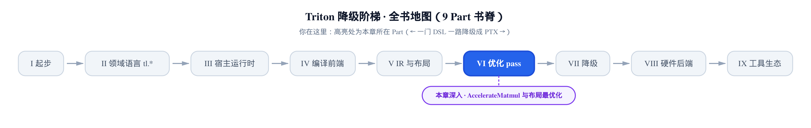
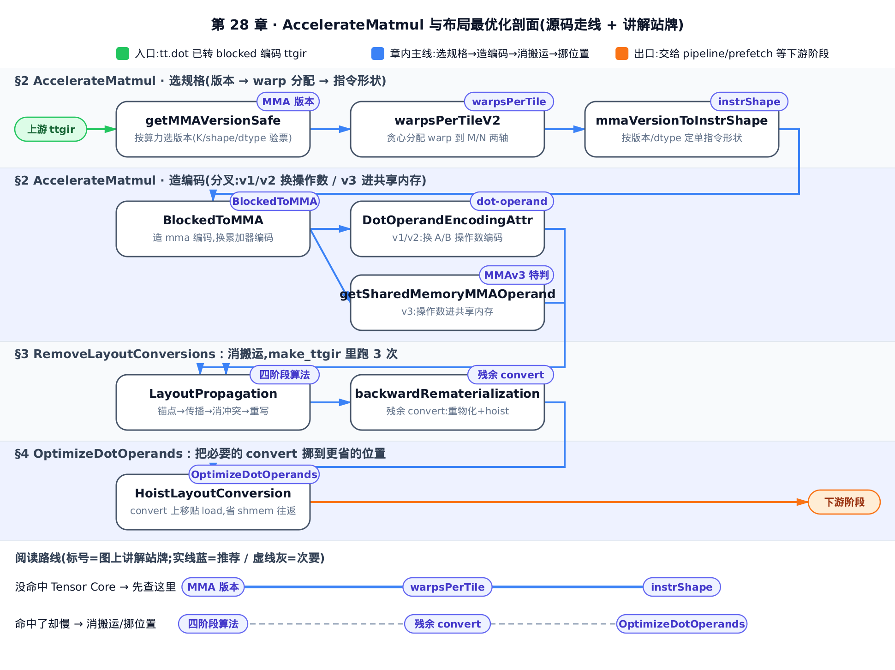
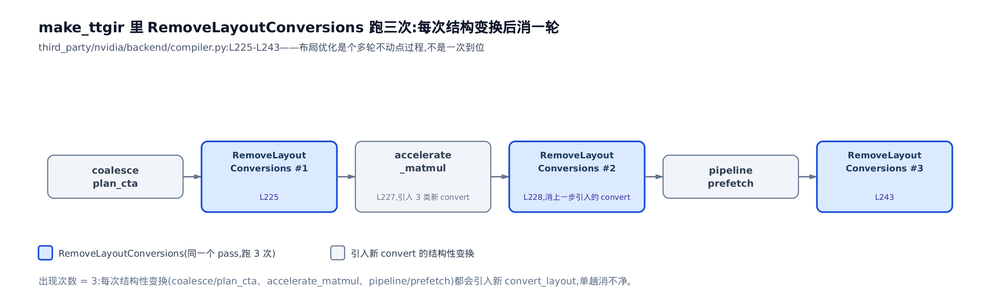
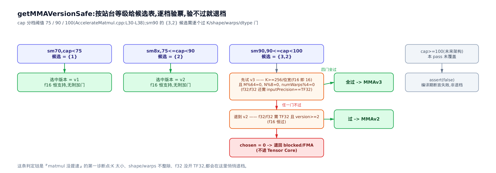
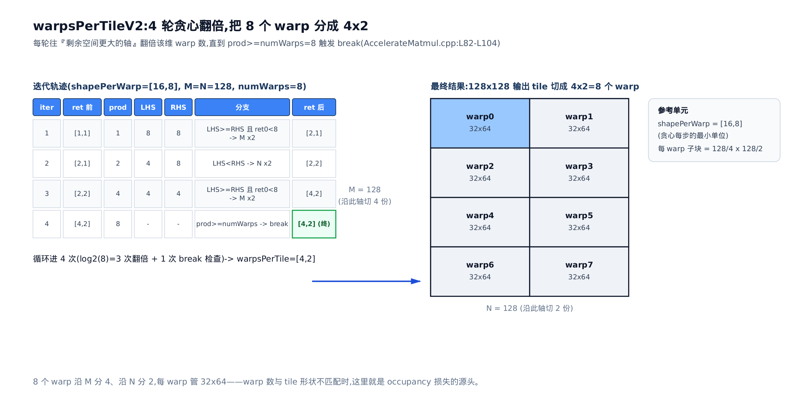
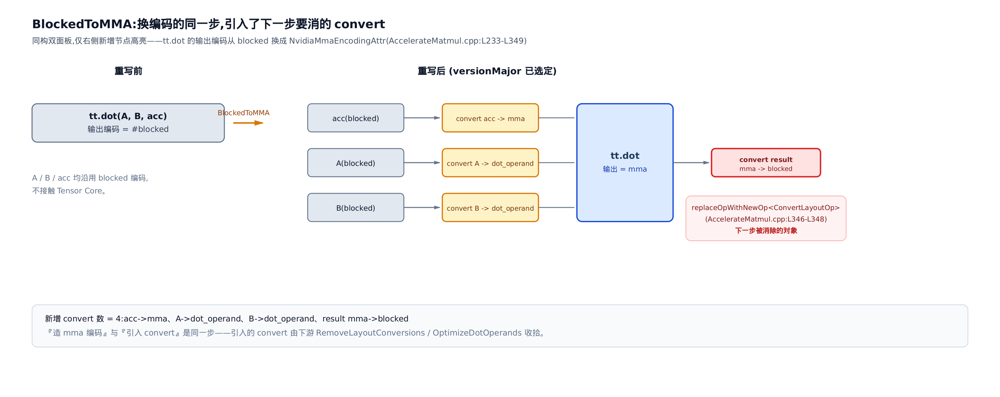
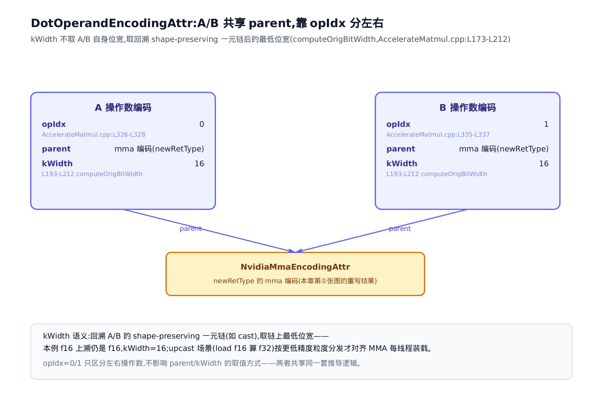
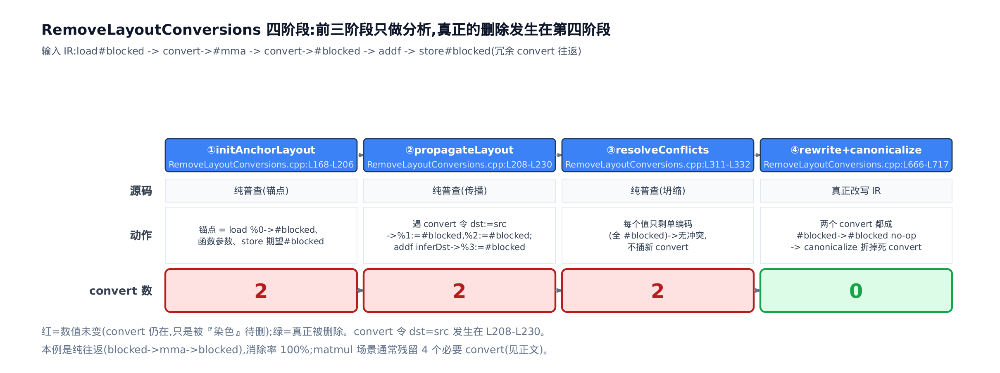
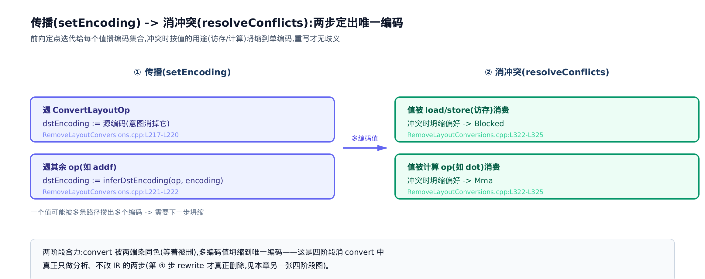
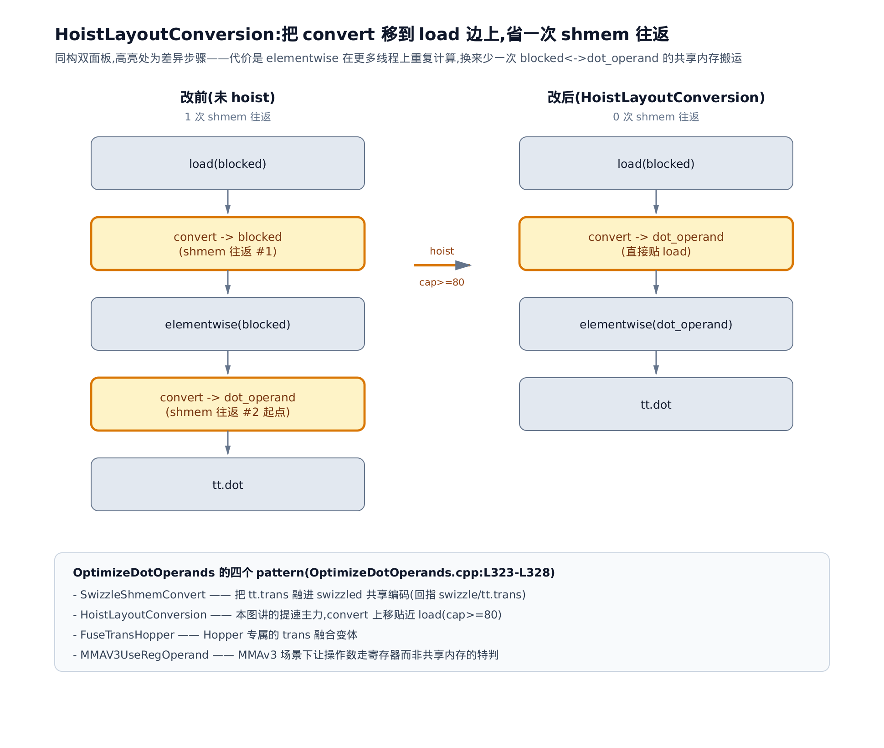

# AccelerateMatmul 与布局最优化：tt.dot→MMA、减少 convert_layout



> **你在这里**——第 VI 部分「优化 pass」的落地施工篇。
> 前面：[第 27 章](../../ch27-tensor-core-mma-layout/narrative/chapter.md)讲清了 MMA 编码为什么长那样。
> 本章：把那套编码真正装配到 `tt.dot` 上，并消掉多余搬运。
> 下一章：[软件流水线](../../ch29-software-pipelining-primer/narrative/chapter.md)接手，让搬运和计算叠起来跑。

先算性能账。你写下一个 `tl.dot`（[第 8 章](../../ch08-dot-reduce-scan/narrative/chapter.md)的块级矩阵乘），profile 一跑却发现它慢得离谱——没命中 Tensor Core（张量核心，GPU 上专算小块矩阵乘加的硬件单元），退回了 FMA（fused multiply-add，标量乘加）循环逐元素磨。或者命中了 Tensor Core，但一堆看不见的 `convert_layout`（[第 24 章](../../ch24-ttg-ttng-operations/narrative/chapter.md)：GPU 上唯一的跨线程数据搬运）在流水线里反复倒腾数据，把省下的算力又吃回去。这两种「matmul 慢」的根因，答案都在本章讲的三个 pass 里。

[第 27 章](../../ch27-tensor-core-mma-layout/narrative/chapter.md)交代了 `NvidiaMmaEncodingAttr`（NVIDIA 专属的 MMA 输出布局属性）和 `DotOperandEncodingAttr`（dot 操作数布局属性）这两套编码**为什么**长成那样——它们在忠实抄写硬件 fragment 契约。本章是那份原理的**落地 pass**：`AccelerateMatmul` 负责把 `tt.dot` 的编码从 `blocked`（普通张量的分块布局）换成 `mma`，`RemoveLayoutConversions` 和 `OptimizeDotOperands` 负责把换编码过程中冒出来的搬运消到最少。这三个 pass 都挂在 `third_party/nvidia/backend/compiler.py` 的 `make_ttgir` 编译管线里。懂了它们的判据，你就有了一张「我的 dot 为什么没提速」的核对清单。

本章高频记号先立好，随用随查（都是编译器内部量，不是数学符号）：

| 记号 | 含义 | 首现 |
|---|---|---|
| compute capability | GPU 架构代号：sm70/sm80/sm90 对应 Volta/Ampere/Hopper | §1 |
| MMA 版本 v1/v2/v3 | 三代 Tensor Core 指令；v3 即 Hopper WGMMA | §2.1 |
| `warpsPerTile` | 一个输出 tile 沿 M/N 两轴各切给几个 warp | §2.2 |
| `instrShape` | 单条 MMA 指令算的 $`[m,n,k]`$ 小砖 | §2.3 |
| `kWidth` | dot 操作数里，一个线程沿 K 维一次连续持有的元素数（[第 27 章](../../ch27-tensor-core-mma-layout/narrative/chapter.md)§3.4） | §2.5 |
| 锚点（anchor） | 布局有性能意义、必须保住的 op（dot、贵 load/store 等） | §3.2 |

想跳读的话：§2.1 是「没命中 Tensor Core」的第一诊断点，赶时间可只读它；想弄清「命中了却还是慢」，直奔 §3 看 `convert_layout` 怎么被消到最少；§4、§5 讲最后的操作数优化与三个 pass 的共同骨架，只赶结论可略读。



地图从左到右就是这一章的施工顺序：§2 把 `tt.dot` 的编码从 blocked 换成 mma，§3、§4 把换编码过程中冒出来的 `convert_layout` 消到最少、挪到最省。只想确认「我的 dot 有没有命中 Tensor Core」，看完 §2 就够；想接着弄清「命中了为什么还是慢」，往 §3、§4 走完。

## §1 全景：三个 pass 在 make_ttgir 里的落点

先把地形看清。TTGIR（贴了布局标注的张量 IR）的优化发生在 NVIDIA 后端的 `make_ttgir` 里。把和本章相关的几行拎出来（`third_party/nvidia/backend/compiler.py:L220-L246`，逐字）：

```python
# third_party/nvidia/backend/compiler.py:L220-L246
        passes.ttgpuir.add_coalesce(pm)
        if capability // 10 >= 8:
            passes.ttgpuir.add_f32_dot_tc(pm)
        # TODO(Qingyi): Move PlanCTAPass to the front of CoalescePass
        nvidia.passes.ttnvgpuir.add_plan_cta(pm, cluster_info)
        passes.ttgpuir.add_remove_layout_conversions(pm)          # ← 第 1 次 (L225)
        passes.ttgpuir.add_optimize_thread_locality(pm)
        passes.ttgpuir.add_accelerate_matmul(pm)                  # ← 造 mma 编码 (L227)
        passes.ttgpuir.add_remove_layout_conversions(pm)          # ← 第 2 次 (L228)
        passes.ttgpuir.add_optimize_dot_operands(pm, capability >= 80)
        passes.common.add_cse(pm)
        # … 省略：capability>=8 的 warp-spec / pipeline / ws-lowering 一大段（本章不涉及）…
        passes.ttgpuir.add_prefetch(pm)
        passes.ttgpuir.add_optimize_dot_operands(pm, capability >= 80)
        passes.ttgpuir.add_remove_layout_conversions(pm)          # ← 第 3 次 (L243)
        passes.ttgpuir.add_reduce_data_duplication(pm)
```

三件事一眼可见。`accelerate_matmul`（L227）夹在两次 `remove_layout_conversions`（L225 / L228）之间；`optimize_dot_operands` 出现两次；而 **`remove_layout_conversions` 出现三次**（L225 / L228 / L243）。这个「跑三次」不是笔误——它是本章第一个要讲透的核心机制。

### 为什么 `RemoveLayoutConversions` 要跑三次

**直觉。** 布局优化不是一次到位的，是个多轮不动点过程。每一次结构性变换都会**引入新的** `convert_layout`：`coalesce`/`plan_cta` 调完访存布局留下一批，`accelerate_matmul` 换 mma 编码时又会补一批（下一节细看），`pipeline`/`prefetch` 把循环拆开后再冒一批。所以每做完一轮结构变换，就得再消一遍搬运——单趟消不净。

**机制。** 三次的分工是错开的：

- 第 1 次（L225）：清 `coalesce`/`plan_cta` 阶段留下的多余 convert，给 `accelerate_matmul` 一个干净的输入。
- 第 2 次（L228）：专门收拾 `accelerate_matmul` 刚引入的那批 convert（累加器、A/B 操作数、结果各一个）。
- 第 3 次（L243）：`pipeline`/`prefetch` 把循环重构后，再清一轮残余。

**源码。** 这三行就是上面代码块里标了注释的 `add_remove_layout_conversions(pm)`。它们调的是同一个 pass，只是在管线里被放了三处。



记住这张地形图：本章后面 §2 讲的是 `accelerate_matmul`（造编码、引入搬运），§3 讲的是 `remove_layout_conversions`（消搬运），§4 讲 `optimize_dot_operands`（把必要的搬运挪到更省的位置）。三者在 `make_ttgir` 里交替上场，合力把 matmul 压到最快。

## §2 AccelerateMatmul：把 tt.dot 换成 MMA

`accelerate_matmul` 这个 pass 的入口极短，先看它的骨架（`lib/Dialect/TritonGPU/Transforms/AccelerateMatmul.cpp:L552-L567`，逐字）：

```cpp
// lib/Dialect/TritonGPU/Transforms/AccelerateMatmul.cpp:L552-L567
  void runOnOperation() override {
    MLIRContext *context = &getContext();
    ModuleOp m = getOperation();

    auto computeCapability = getNVIDIAComputeCapability(m);

    mlir::RewritePatternSet patterns(context);
    patterns.add<BlockedToMMA, ScaledBlockedToMMAv2>(context,
                                                     computeCapability);
    if (applyPatternsAndFoldGreedily(m, std::move(patterns)).failed()) {
      signalPassFailure();
    }
    // Now that we have picked the mma type, decompose dot that are not natively
    // supported.
    decomposeMixedModeDotOp(m, computeCapability);
  }
```

三步：`getNVIDIAComputeCapability`（从 module 的 `target` 属性 `cuda:NN` 里解析出架构代号）——**这一句就是整章硬绑 NVIDIA 的证据**，它读的是 NVIDIA 专属的 compute capability，Ascend 姊妹篇要在这里 fork 一份等价 pass、换成自己的硬件判据（本章不展开）；接着加两个重写 pattern（`BlockedToMMA` 是主角，`ScaledBlockedToMMAv2` 处理带 scale 的低精度 dot）贪心应用；最后 `decomposeMixedModeDotOp` 兜底混合精度。

主角是 `BlockedToMMA`。它做四件事，我们逐件拆：**选 MMA 版本**（§2.1）→ **算 warpsPerTile**（§2.2）→ **算 instrShape**（§2.3）→ **造 mma 编码并换掉操作数/累加器编码**（§2.4–§2.6）。前三件是「用什么规格的 Tensor Core 指令」，最后一件是「把张量摆成那个规格要的样子」。

### §2.1 选 MMA 版本：getMMAVersionSafe + supportMMA

**直觉。** 站台等级决定你能坐哪档车。compute capability 就是站台等级：sm70 只停绿皮车（MMA v1），sm8x 是特快（v2），sm90 才有高铁 WGMMA（v3）。但光站台够高还不行——车厢太短（K 太小，一节都填不满）、或没买对票（f32 没开 TF32），照样上不了高铁，只能退回下一档。`getMMAVersionSafe` 就是这个「按站台发候选表、逐档验票、取能上的最高档」的售票员。

**机制。** 先看候选表怎么发、验票怎么验（`lib/Dialect/TritonGPU/Transforms/AccelerateMatmul.cpp:L25-L45`，逐字）：

```cpp
// lib/Dialect/TritonGPU/Transforms/AccelerateMatmul.cpp:L25-L45
// Get the highest version supported for the hardware and the dot.
static int getMMAVersionSafe(int computeCapability, DotOp op) {
  // List supported mma version in order of preference.
  SmallVector<int> versionsSupported;
  if (computeCapability < 75) {
    versionsSupported = {1};
  } else if (computeCapability < 90) {
    versionsSupported = {2};
  } else if (computeCapability < 100) {
    versionsSupported = {3, 2};
  } else {
    assert(false && "computeCapability not supported");
  }
  for (int baseVersion : versionsSupported) {
    if (supportMMA(op, baseVersion))
      return baseVersion;
    if (baseVersion == 3)
      op.emitRemark() << "Warning: can't use MMA V3 for the dot op";
  }
  return 0;
}
```

读法：候选表按 compute capability 硬编码。注意 sm90 给的是 `{3, 2}`——**两个候选、按偏好降序**。循环逐个拿去 `supportMMA` 验票，第一个通过的就返回；一个都不过就返回 `0`（后面会退回 blocked/FMA，完全不碰 Tensor Core）。sm90 上 v3 验票失败会打一句 remark 再退 v2，这就是「我的 dot 没用上 WGMMA」最常见的现场。

验票的判据在 `supportMMA` 里，v3 那段是重点（`lib/Analysis/Utility.cpp:L481-L521`，逐字）：

```cpp
// lib/Analysis/Utility.cpp:L481-L521
bool supportMMA(triton::DotOp op, int version) {
  // … 省略：PTX ISA 文档链接注释 …
  auto aElemTy = op.getA().getType().getElementType();
  auto bElemTy = op.getB().getType().getElementType();
  if (version == 3) {
    if (triton::tools::getBoolEnv("DISABLE_MMA_V3"))
      return false;
    auto retType = op.getType();
    RankedTensorType typeA = op.getA().getType();
    int k = typeA.getShape().back();
    // If k size is smaller than the native mma size, we cannot use MMA.
    if (k < 256 / aElemTy.getIntOrFloatBitWidth())
      return false;
    auto retShapePerCTA = getShapePerCTA(retType);
    auto rank = retShapePerCTA.size();
    auto mod = op->getParentOfType<ModuleOp>();
    int numWarps = TritonGPUDialect::getNumWarps(mod);
    // TODO(Keren): for now, fallback to MMAv2 if handling batch matmul.
    if (rank == 3)
      return false;
    if (!(numWarps % 4 == 0 && retShapePerCTA[rank - 2] % 64 == 0 &&
          retShapePerCTA[rank - 1] % 8 == 0 &&
          (aElemTy.isFloat8E5M2() || aElemTy.isFloat8E4M3FN() ||
           aElemTy.isInteger(8) || aElemTy.isF16() || aElemTy.isBF16() ||
           aElemTy.isF32()))) {
      return false;
    }
    // … 省略：fp8 累加特判（不能在 MMA 里用 F32 累加 fp8 的边界 case）…
  }
  if (aElemTy.isF32() && bElemTy.isF32()) {
    return op.getInputPrecision() == InputPrecision::TF32 && version >= 2;
  }
  return supportMMA(op.getA(), version) && supportMMA(op.getB(), version);
}
```

v3 的门有五道，逐条翻译成人话：① `k < 256 / 位宽` 就退——native MMA 一次要吃满 256 bit 的 K，f16（16 bit）即要求 $`K \ge 16`$；② batched（rank==3）退回 v2；③ `numWarps % 4 == 0`；④ 输出 M（倒数第二维）`% 64 == 0`、N（倒数末维）`% 8 == 0`；⑤ dtype 得在 `{fp8, int8, f16, bf16, f32}` 内。任一不满足，v3 验票失败。最后两行是 dtype 专项：f32×f32 必须开了 TF32（`InputPrecision::TF32`）且版本 ≥ 2 才行，否则**连 v2 都过不了**，直接掉进 FMA。

把这套判据在几个典型场景上跑一遍，就是一张诊断表（除 cap/K/dtype/prec 外，本表固定 M=N=128、numWarps=4，只在这四个变量上变化，M%64、N%8、numWarps%4 的判定因此恒成立）：

<!-- trace: mma-version-select -->

| 场景（cap, A/B, K, prec） | 候选表 versionsSupported | 逐版本 supportMMA | 选中版本 | 为什么 |
|---|---|---|---|---|
| sm70, f16/f16, K=64, ieee | {1} | v1:True | v1 | cap<75→只给 v1；f16 恒支持 |
| sm80, f16/f16, K=64, ieee | {2} | v2:True | v2 | 75≤cap<90→只给 v2 |
| sm90, f16/f16, K=64, ieee | {3,2} | v3:True | v3 | K=64≥256/16=16、M=128%64=0、N=128%8=0、nW=4%4=0 全过→命中 WGMMA |
| sm90, f16/f16, K=8, ieee | {3,2} | v3:False, v2:True | v2 | K=8<256/16=16→v3 失败退 v2（「我的 dot 没用上 WGMMA」头号原因） |
| sm90, f32/f32, K=64, TF32 | {3,2} | v3:True | v3 | f32/f32 需 inputPrecision==TF32 且 version≥2 |
| sm90, f32/f32, K=64, ieee | {3,2} | v3:False, v2:False | v0(退回 FMA) | f32 未开 TF32→v3/v2 都失败，根本不进 Tensor Core |

**不变量。** 候选表长度 ≤ 2 且按版本降序，`supportMMA` 只做布尔判定不改状态，循环遇首个成立即返回、遍历完返回 0——所以返回值必是「硬件和这个 dot 都支持的最高 MMA 版本」，否则 0。有限性来自候选表最多两个元素，循环至多两次必停。

**你能拿它做什么。** 这张表就是「matmul 没提速」的第一诊断点。K 维凑不够 native 尺寸、warp 数不是 4 的倍数、输出 M/N 不对齐、f32 忘了开 TF32——每一条都会让你的 dot 在这里悄悄退档，甚至退回 FMA。下面这张图把整条判定链画全了：



### §2.2 warpsPerTile：把 warp 沿 M/N 分到 tile

**直觉。** 8 个工人（warp）分一块 128×128 的地（输出 tile）。每人一次至少能耕 16×8 的一畦（`shapePerWarp`）。贪心分工：每一步看「行方向还剩几畦、列方向还剩几畦」，往剩得多的那边再派一个人（该维 warp 数 ×2），直到 8 个人派光。

**机制。** 看 `warpsPerTileV2` 的循环（`lib/Dialect/TritonGPU/Transforms/AccelerateMatmul.cpp:L47-L104`，逐字）：

```cpp
// lib/Dialect/TritonGPU/Transforms/AccelerateMatmul.cpp:L47-L104
SmallVector<unsigned> warpsPerTileV2(DotOp dotOp, const ArrayRef<int64_t> shape,
                                     int numWarps) {
  auto rank = shape.size();
  // Early exit for batched matmul
  if (rank == 3)
    return {(unsigned)numWarps, 1, 1};

  auto filter = [&dotOp](Operation *op) {
    return op->getParentRegion() == dotOp->getParentRegion() &&
           !isa<TransOp>(op);
  };
  auto slices = multiRootGetSlice(dotOp, {filter}, {filter});
  bool hasChainedDot = false;
  for (Operation *op : slices) {
    if (isa<DotOp>(op) && (op != dotOp)) {
      auto chainedDot = cast<DotOp>(op);
      auto resTy = chainedDot.getResult().getType();
      if (resTy.getRank() != rank) {
        continue;
      }
      if (auto mmaEncoding =
              dyn_cast<NvidiaMmaEncodingAttr>(resTy.getEncoding())) {
        return getWarpsPerCTA(mmaEncoding);
      }
      hasChainedDot = true;
    }
  }
  if (hasChainedDot) {
    if (shape[0] >= shape[1]) {
      return {(unsigned)numWarps, 1};
    } else {
      return {1, (unsigned)numWarps};
    }
  }

  SmallVector<unsigned> ret(rank, 1);
  SmallVector<int64_t> shapePerWarp(rank, 1);
  shapePerWarp[rank - 1] = 8;
  shapePerWarp[rank - 2] = 16;
  // … 省略：TODO 说明 …
  do {
    if (ret[0] * ret[1] >= numWarps)
      break;
    if (shape[0] / shapePerWarp[0] / ret[0] >=
        shape[1] / (shapePerWarp[1] * 2) / ret[1]) {
      if (ret[0] < shape[0] / shapePerWarp[0]) {
        ret[0] *= 2;
      } else
        ret[1] *= 2;
    } else {
      ret[1] *= 2;
    }
  } while (true);
  return ret;
}
```

三条路径：batched（rank==3）直接把全部 warp 堆到第一维；**链式 dot**（如 flash-attention 里前后两个 back-to-back dot）走中间那段——若上游已有 mma 布局就直接复用，否则把 warp 全挤到更长的那条轴上，让归约留在同一个 warp 内、省掉跨 warp 的规约搬运；普通单 dot 走最后的 `do-while` 贪心循环，从 `{1,1}` 起、每步把 warp 数沿 M 或 N 翻倍。

单 dot 的循环逐拍展开（`[M,N]=[128,128]`, `numWarps=8`, `shapePerWarp=[16,8]`）：

<!-- trace: warps-per-tile -->

| iter | ret 前 | prod | LHS=M/16/ret0 | RHS=N/16/ret1 | 分支 | ret 后 |
|---|---|---|---|---|---|---|
| 1 | [1,1] | 1 | 8 | 8 | LHS>=RHS 且 ret0<8 → M×2 | [2,1] |
| 2 | [2,1] | 2 | 4 | 8 | LHS<RHS → N×2 | [2,2] |
| 3 | [2,2] | 4 | 4 | 4 | LHS>=RHS 且 ret0<8 → M×2 | [4,2] |
| 4 | [4,2] | 8 | — | — | prod>=numWarps → break | [4,2] |

四拍后 `warpsPerTile=[4,2]`：沿 M 放 4 个 warp、沿 N 放 2 个，共 8 个，每个 warp 独占 `[128/4, 128/2]=[32,64]` 的子块。

**不变量。** 每次迭代恰有一维 ×2，故乘积 `ret[0]*ret[1]` 每轮严格翻倍；`numWarps` 有上界，至多 $`\log_2(\mathrm{numWarps})`$ 次翻倍后 `prod>=numWarps` 触发 `break`（终止性）。而 M×2 分支带了 `ret[0] < M/shapePerWarp[0]` 守卫——warp 不会沿某维过度切分超出 tile 能容纳的 warp-tile 数（非过度切分）。

**你能拿它做什么。** warp 数与 tile 形状不匹配时，这里就是 occupancy（占用率，[第 2 章](../../ch02-gpu-execution-model/narrative/chapter.md)）损失的源头——比如给一个瘦长 tile 配了对不上的 `num_warps`，warp 会被摊得七零八落。下图把贪心分配的迭代轨迹和最终 4×2 网格并排画出：



v3（Hopper）的 `warpsPerTileV3` 逻辑更简单：最小 warp 单元固定 `(4,1)`，flash-attention 这类链式 dot 同样只沿一轴分，理由和 v2 链式分支一致——让归约留在 warp 内。

### §2.3 instrShape：按版本/dtype/numWarps 定指令形状

选完版本、分完 warp，还要定单条 MMA 指令算多大的砖 `[m,n,k]`。看 `mmaVersionToInstrShape` 的开头（`lib/Dialect/TritonGPU/Transforms/Utility.cpp:L26-L37`，逐字）：

```cpp
// lib/Dialect/TritonGPU/Transforms/Utility.cpp:L26-L37
SmallVector<unsigned, 3> mmaVersionToInstrShape(int version,
                                                const ArrayRef<int64_t> &shape,
                                                Type eltType, int numWarps) {
  if (version == 1)
    return {16, 16};
  else if (version == 2) {
    auto rank = shape.size();
    SmallVector<unsigned, 3> ret(rank, 1);
    ret[rank - 1] = 8;
    ret[rank - 2] = 16;
    return ret;
  } else if (version == 3) {
    // … 省略：v3 分支——k=256/位宽、m=16，按 dtype 给 validN 候选表，
    //        用 numWarps 拆 mWarps/nWarps 反推 maxN，选首个能整除 shape[1]
    //        且 <=maxN 的 n → {m=16, n, k} …
```

v1/v2 是固定砖：v1 恒 `[16,16]`、v2 恒 `[16,8]`。v3（WGMMA）的砖可大可小——N 方向有一张从 256 往下的候选表 `validN`，但一个 warp-group 分到的 N 预算 `maxN` 封顶，于是取「能整除输出 N 且不超预算的最大砖」，砖越大每条指令干的活越多。v3 公式：`k = 256/位宽`；`m = 16`；`mWarps = max(M/16, 1)`；`nWarps = max(numWarps/mWarps, 1)`；`maxN = max(N/nWarps, 8)`；`n` = validN 降序里首个满足 `N % n == 0` 且 `n <= maxN` 的值。

在 f16 上跑两组 shape：

<!-- trace: instr-shape -->

| version | shape[M,N] | numWarps | k=256/16 | mWarps | nWarps | maxN | 选中 n | instrShape |
|---|---|---|---|---|---|---|---|---|
| v1 | 任意 | — | — | — | — | — | — | [16,16] (固定) |
| v2 | 任意 | — | — | — | — | — | — | [16,8] (固定) |
| v3 f16 | [128,128] | 4 | 16 | 8 | 1 | 128 | 128 | [16,128,16] |
| v3 f16 | [32,128] | 8 | 16 | 2 | 4 | 32 | 32 | [16,32,16] (maxN 夹到 32) |

看最后两行的对比：**同样 f16、同样 N=128**，仅因第二组 warp 沿 M 摊薄（mWarps 从 8 降到 2），每 warp-group 的 N 预算 `maxN` 从 128 缩到 32，砖就从 `[16,128,16]` 缩成 `[16,32,16]`。

**不变量。** v3 沿 `validN` 降序遍历返回首个合法者，必是不超每 warp-group N 预算、又能整除输出 N 的最大合法砖；`validN` 末元素为 8，而入口已保证 `N % 8 == 0`、`maxN >= 8`，故 `n=8` 至少满足双条件——遍历必命中，不会走到末尾 assert。

### §2.4 BlockedToMMA 主重写：造 mma 编码、换编码、replace 回旧编码

**直觉。** 这一步的核心矛盾是——把 dot 提速上 Tensor Core 和留下搬运是同一个动作的两面：造好 mma 编码的同时，必然要在累加器、操作数、结果各处补一次 `convert_layout`，把张量从旧编码倒进新编码。所以下面这段代码里「换编码」和「插 convert」是交织出现的，读的时候盯住每个 convert 是给谁准备的即可。

前三节都是「算规格」，这一节是「按规格摆张量」。`BlockedToMMA::matchAndRewrite` 的前半段（`lib/Dialect/TritonGPU/Transforms/AccelerateMatmul.cpp:L233-L311`，逐字）：

```cpp
// lib/Dialect/TritonGPU/Transforms/AccelerateMatmul.cpp:L233-L311
  mlir::LogicalResult
  matchAndRewrite(triton::DotOp dotOp,
                  mlir::PatternRewriter &rewriter) const override {
    if (computeCapability < 70)
      return failure();
    RankedTensorType oldRetType = dotOp.getType();
    if (!oldRetType.getEncoding() ||
        mlir::isa<NvidiaMmaEncodingAttr>(oldRetType.getEncoding()))
      return failure();

    // get MMA encoding for the given number of warps
    auto retShapePerCTA = getShapePerCTA(oldRetType);
    auto mod = dotOp->getParentOfType<mlir::ModuleOp>();
    int numWarps = TritonGPUDialect::getNumWarps(mod);
    auto CTALayout = getCTALayout(oldRetType.getEncoding());

    int versionMajor = getMMAVersionSafe(computeCapability, dotOp);
    if (!(versionMajor >= 1 && versionMajor <= 3))
      return failure();

    auto instrShape = mmaVersionToInstrShape(
        versionMajor, retShapePerCTA, dotOp.getA().getType().getElementType(),
        numWarps);
    // operands
    Value a = dotOp.getA();
    Value b = dotOp.getB();
    auto oldAType = dotOp.getA().getType();
    auto oldBType = dotOp.getB().getType();

    NvidiaMmaEncodingAttr mmaEnc;
    if (versionMajor == 1) {
      // … 省略：MMAv1/Volta 分支——靠回溯 convert 链探操作数行主/列主，sm70 老架构 …
    } else {
      assert(versionMajor == 2 || versionMajor == 3);
      int versionMinor = computeCapability == 75 ? 1 : 0;
      auto warpsPerTile = getWarpsPerTile(dotOp, retShapePerCTA, versionMajor,
                                          numWarps, instrShape);
      mmaEnc = NvidiaMmaEncodingAttr::get(oldRetType.getContext(), versionMajor,
                                          versionMinor, warpsPerTile, CTALayout,
                                          instrShape);
    }
    PatternRewriterWithAsyncTaskIds taskIdRewriter(rewriter, dotOp);
    auto newRetType = RankedTensorType::get(
        oldRetType.getShape(), oldRetType.getElementType(), mmaEnc);
    // convert accumulator
    auto oldAcc = dotOp.getOperand(2);
    auto newAcc =
        rewriter.create<ConvertLayoutOp>(oldAcc.getLoc(), newRetType, oldAcc);
```

两条守卫先挡掉不该重写的：`computeCapability < 70` 直接放弃；输出已经是 `NvidiaMmaEncodingAttr` 也放弃（幂等，避免重复重写）。然后把前三节的结果拼进 `NvidiaMmaEncodingAttr::get`——`versionMajor`（选中版本）、`warpsPerTile`、`instrShape` 全在参数里，这就是[第 27 章](../../ch27-tensor-core-mma-layout/narrative/chapter.md)讲的那套编码字段被真正**填值**的地方。造好 `newRetType` 后第一次 `ConvertLayoutOp`：把累加器从旧编码转成新 mma 编码。

后半段按版本分两条路（`lib/Dialect/TritonGPU/Transforms/AccelerateMatmul.cpp:L312-L348`，逐字）：

```cpp
// lib/Dialect/TritonGPU/Transforms/AccelerateMatmul.cpp:L312-L348
    Operation *newDot = nullptr;
    if (versionMajor == 3) {
      auto eltType = dotOp.getA().getType().getElementType();
      // In MMAV3 tranpose is only supported for f16 and bf16.
      bool allowTranspose = eltType.isF16() || eltType.isBF16();
      a = getSharedMemoryMMAOperand(a, rewriter, 0, allowTranspose);
      b = getSharedMemoryMMAOperand(b, rewriter, 1, allowTranspose);
      newDot = taskIdRewriter.create<triton::nvidia_gpu::WarpGroupDotOp>(
          dotOp.getLoc(), newRetType, a, b, newAcc, nullptr,
          dotOp.getInputPrecision(), dotOp.getMaxNumImpreciseAcc(), false);
    } else {
      // convert operands
      int minBitwidth =
          std::min(computeOrigBitWidth(a), computeOrigBitWidth(b));
      Type minType = rewriter.getIntegerType(minBitwidth);
      // convert A operand
      auto newAEncoding = DotOperandEncodingAttr::get(
          oldAType.getContext(), 0, newRetType.getEncoding(),
          minBitwidth > 0 ? minType : oldAType.getElementType());
      auto newAType = RankedTensorType::get(
          oldAType.getShape(), oldAType.getElementType(), newAEncoding);
      a = rewriter.create<ConvertLayoutOp>(a.getLoc(), newAType, a);
      // convert B operand
      auto newBEncoding = DotOperandEncodingAttr::get(
          oldBType.getContext(), 1, newRetType.getEncoding(),
          minBitwidth > 0 ? minType : oldBType.getElementType());
      auto newBType = RankedTensorType::get(
          oldBType.getShape(), oldBType.getElementType(), newBEncoding);
      b = rewriter.create<ConvertLayoutOp>(b.getLoc(), newBType, b);
      newDot = taskIdRewriter.create<DotOp>(dotOp.getLoc(), newRetType, a, b,
                                            newAcc, dotOp.getInputPrecision(),
                                            dotOp.getMaxNumImpreciseAcc());
    }
    // convert dot instruction
    rewriter.replaceOpWithNewOp<ConvertLayoutOp>(dotOp, oldRetType,
                                                 newDot->getResult(0));
    return success();
```

数一下这一步造了几个 `ConvertLayoutOp`：累加器 1 个（前半段）、A 操作数 1 个、B 操作数 1 个（v1/v2 分支），最后 `replaceOpWithNewOp<ConvertLayoutOp>` 把 mma 结果**转回旧编码** 1 个——**共 4 个 convert**。最后这个「结果 convert」尤其关键：它把 mma 输出接回下游还在用旧 blocked 编码的代码，**正是 §3 的 `RemoveLayoutConversions` 稍后要消的头号对象**。

这就是本章的一条暗线：**「造 mma 编码」和「引入 convert」是同一步**。`BlockedToMMA` 一边把 dot 提速上 Tensor Core，一边留下一地搬运，交给下游 pass 收拾。



### §2.5 给 A/B 换 dot-operand 编码：opIdx / parent / kWidth

上面 v1/v2 分支里给 A、B 各造的 `DotOperandEncodingAttr`，三个参数值得单看。[第 27 章](../../ch27-tensor-core-mma-layout/narrative/chapter.md)讲清了这套编码**为什么**这么设计（它抄的是 MMA 每线程的 fragment 装载粒度），这里看它**怎么填值**：

- `opIdx`：A 传 `0`、B 传 `1`，区分左右操作数（源码 `DotOperandEncodingAttr::get(..., 0, ...)` 与 `..., 1, ...`）。
- `parent`：都传 `newRetType.getEncoding()`，即刚造好的那个 mma 编码——两个操作数**共享同一个 parent**，因为它们要喂给同一条 mma 指令。
- 位宽：传 `minBitwidth > 0 ? minType : ...`，这个 `minBitwidth` 来自 `computeOrigBitWidth`，就是 dot-operand 的 `kWidth`。

`kWidth` 为什么不直接取 A/B 自身的位宽，而要走 `computeOrigBitWidth` 回溯？看它（`lib/Dialect/TritonGPU/Transforms/AccelerateMatmul.cpp:L193-L212`，逐字）：

```cpp
// lib/Dialect/TritonGPU/Transforms/AccelerateMatmul.cpp:L193-L212
  static int computeOrigBitWidth(Value x) {
    int finalBitWidth = getElementTypeOrSelf(x).getIntOrFloatBitWidth();
    int origBitWidth = finalBitWidth;
    SetVector<Operation *> slice;
    mlir::BackwardSliceOptions opt;
    opt.omitBlockArguments = true;
    opt.filter = bwdFilter;
    getBackwardSlice(x, &slice, opt);
    for (auto op : slice) {
      if (Value arg = op->getOperand(0))
        if (auto argTy = dyn_cast<RankedTensorType>(arg.getType())) {
          auto argBitWidth = argTy.getElementType().getIntOrFloatBitWidth();
          if (argBitWidth != origBitWidth) {
            origBitWidth = std::min<int>(origBitWidth, argBitWidth);
            break;
          }
        }
    }
    return origBitWidth;
  }
```

它沿一条 shape-preserving 一元链（只穿 `FpToFp`/`Bitcast`/`ConvertLayout` 这类不改形状的一元 op）往回追，取链上**最低的**位宽。为什么取最低？考虑 upcast 场景：kernel 从内存 load 进 f16，再 cast 成 f32 去算。此时元素在寄存器里的**原生分发粒度**是按 f16（低精度）排的，`kWidth` 必须取 f16 的 16 才能对齐 MMA 每线程的实际装载粒度——取最终的 f32 就错位了。本例纯 f16 上溯仍是 f16，`kWidth=16`。



### §2.6 MMAv3 特判：操作数进共享内存 + WarpGroupDot

v3 分支不走 dot-operand 寄存器编码，而是把操作数搬进共享内存。原因是 Hopper WGMMA 从共享内存读操作数——这个微架构细节[第 24 章](../../ch24-ttg-ttng-operations/narrative/chapter.md)讲过 `WarpGroupDotOp`，这里只看 `accelerate_matmul` 怎么给它备料（`lib/Dialect/TritonGPU/Transforms/AccelerateMatmul.cpp:L136-L166`，逐字）：

```cpp
// lib/Dialect/TritonGPU/Transforms/AccelerateMatmul.cpp:L136-L166
// Returns a shared memory allocation that can be used by a dotMMA op for the
// given value.
static Value getSharedMemoryMMAOperand(Value v, mlir::PatternRewriter &rewriter,
                                       int opIdx, bool allowTranspose) {
  OpBuilder::InsertionGuard g(rewriter);
  Value arg = v;
  if (auto cvtOp = v.getDefiningOp<ConvertLayoutOp>())
    arg = cvtOp.getSrc();
  auto argType = cast<RankedTensorType>(arg.getType());
  assert(argType.getEncoding() && "unexpected tensor type");
  auto newOrder = getOrder(argType.getEncoding());

  // If the MMA op doesn't support transpose pick the layout expected by the MMA
  // op.
  if (!allowTranspose) {
    if (opIdx == 1) {
      newOrder = {0, 1};
    } else {
      newOrder = {1, 0};
    }
  }

  Attribute SharedMemorySpace =
      SharedMemorySpaceAttr::get(argType.getContext());
  auto CTALayout = getCTALayout(argType.getEncoding());
  auto newLayout =
      SharedEncodingAttr::get(argType.getContext(), argType.getShape(),
                              newOrder, CTALayout, argType.getElementType());
  auto newType = MemDescType::get(argType.getShape(), argType.getElementType(),
                                  newLayout, SharedMemorySpace);
  rewriter.setInsertionPointAfterValue(arg);
  return rewriter.create<LocalAllocOp>(arg.getLoc(), newType, arg);
}
```

关键一句在 `matchAndRewrite` 里：`bool allowTranspose = eltType.isF16() || eltType.isBF16()`——**MMAv3 只对 16-bit 浮点开放转置融合**，别的 dtype 传 `allowTranspose=false`，就落进上面 `if (!allowTranspose)` 分支按 `opIdx` 强制定 order。转置是硬件特性，只对 f16/bf16 开放。备好料后 `create<WarpGroupDotOp>` 出场，代替普通 `DotOp`。

### §2.7 兜底两条支线

pass 收尾还有两条支线，各一句带过。`decomposeMixedModeDotOp`（`AccelerateMatmul.cpp:L362-L392`）是混合精度兜底：mma 类型选定后，若操作数精度组合非原生支持（如 fp8 在 sm<89），插一个 `FpToFp` 把操作数升到 f16 再算。`ScaledBlockedToMMAv2`（`AccelerateMatmul.cpp:L394-L539`）是另一个 pattern，处理带 scale 的 `tt.dot_scaled`（mxfp/fp8 量化 dot）：固定走 mmav2 编码，用 `toMMABf16` 换 dot-operand 编码，再 `create<UpcastMXFPOp>` 把 scale 施加上去。两者都不是本章主线，知道它们兜住了 fp8/mxfp 这些边角 case 即可。

## §3 RemoveLayoutConversions：把多余搬运消到最少

§2 造了一地 convert。现在轮到消。回顾[第 24 章](../../ch24-ttg-ttng-operations/narrative/chapter.md)：`convert_layout` 是 GPU 上**唯一**的跨线程数据搬运，`blocked→dot_operand` 这种 convert 还要走共享内存往返——它是 matmul 的隐藏开销。`RemoveLayoutConversions` 的任务就是把这些 convert 数量压到最少。

### §3.1 四阶段算法：锚点→传播→消冲突→支配序重写

**直觉。** 一堆搬运工（convert）在流水线上把数据从一种排布倒成另一种。这个 pass 不逐个 peephole（局部窥孔改写），而是先「全局普查」：① 认定哪些环节的排布必须保住（锚点）；② 让锚点的排布顺着数据流往下游「染色」，碰到搬运工就故意让它两端同色，使它变成白干；③ 一个值被多个锚点染成多色时坍缩到一色；④ 最后按支配序一遍重写，两端同色的搬运工被当死代码折掉。

**机制。** 这四步源码里有一段总述注释，逐字印着（`lib/Dialect/TritonGPU/Transforms/RemoveLayoutConversions.cpp:L43-L60`，逐字）：

```cpp
// lib/Dialect/TritonGPU/Transforms/RemoveLayoutConversions.cpp:L43-L60
// The current algorithm works by analyzing the IR and doing a one-shot rewrite
// based on the analysis. The algorithm is as follows.
//
// 1. Find all the anchor ops. These are ops that have a layout we want to
//    preserve.
//
// 2. For each anchor, propagate its layout to all its descendants.
//    An op can have multiple ancestors that are anchors, so at this stage an op
//    may have multiple layouts associated with it.
//
// 3. Resolve conflicts by deciding which of the multiple layouts the op should
//    keep, inserting convert-layout ops to resolve conflicts.  After this
//    stage, each value has only one layout associated with it.
//
// 4. Rewrite the IR by walking the function in dominance order. Since we
//    assume the IR is structured we just need to process the regions in the
//    correct order. For each op, rewrite it using the layout decided by the
//    analysis phase.
```

pass 入口把这四步串起来（`lib/Dialect/TritonGPU/Transforms/RemoveLayoutConversions.cpp:L1126-L1185`，逐字）：

```cpp
// lib/Dialect/TritonGPU/Transforms/RemoveLayoutConversions.cpp:L1126-L1185
  void runOnOperation() override {
    MLIRContext *context = &getContext();
    ModuleOp m = getOperation();

    // 1. Propagate layout forward starting from "anchor" ops.
    m.walk([](FuncOp funcOp) {
      LayoutPropagation layoutPropagation(funcOp);
      layoutPropagation.initAnchorLayout();
      layoutPropagation.propagateLayout();
      layoutPropagation.resolveConflicts();
      layoutPropagation.rewrite();
    });
    // … 省略：每阶段后的 LLVM_DEBUG dump …
    RewritePatternSet cleanUpPatterns(context);
    ConvertLayoutOp::getCanonicalizationPatterns(cleanUpPatterns, context);
    if (applyPatternsAndFoldGreedily(m, std::move(cleanUpPatterns)).failed()) {
      signalPassFailure();
    }
    // … 省略 …
    // 2. For remaining convert ops, try to rematerialize the slice of producer
    // operation to avoid having to convert.
    backwardRematerialization(m);
    // … 省略 …
    // 3. For remaining converts, try to hoist them above cast generating larger
    // size types in order to reduce the cost of the convert op.
    hoistConvert(m);
    // … 省略 …
    // 4. Apply clean up patterns to remove remove dead convert and dead code
    // generated by the previous transformations.
    RewritePatternSet cleanUpPatterns2(context);
    populateForOpDeadArgumentElimination(cleanUpPatterns2);
    scf::ForOp::getCanonicalizationPatterns(cleanUpPatterns2, context);
    scf::IfOp::getCanonicalizationPatterns(cleanUpPatterns2, context);
    ConvertLayoutOp::getCanonicalizationPatterns(cleanUpPatterns2, context);
    if (applyPatternsAndFoldGreedily(m, std::move(cleanUpPatterns2)).failed()) {
      signalPassFailure();
    }
  }
```

四步分析-重写（`initAnchorLayout`→`propagateLayout`→`resolveConflicts`→`rewrite`）跑完，接着 canonicalize 把两端同编码的 no-op convert 折掉，再 `backwardRematerialization`（向后重物化消残余 convert）和 `hoistConvert`（把 convert 抬到扩位之上降成本），最后一轮死代码清理。其中末步的 `rewrite()` 内部由 `rewriteRegion` 逐 op 派发给 `rewriteOp` 完成实际改写——把前三步分析出的目标编码真正落到每个 op 上。

拿一个最典型的冗余往返走一遍：`load#blocked → convert→#mma → convert→#blocked → addf → store#blocked`（`coalesce`/`plan_cta` 常留这种「转过去又转回来」）。初始 2 个 convert，逐阶段追踪：

<!-- trace: remove-layout-four-phase -->

| 阶段 | 源码 | 动作 | convert 数 |
|---|---|---|---|
| ①initAnchorLayout | L168-L206 | 锚点 = load %0→#blocked、函数参数、store 期望#blocked（本例无 dot/atomic） | 2 |
| ②propagateLayout | L208-L230 | 前向定点迭代：遇 convert 令 dst:=src → %1:=#blocked、%2:=#blocked；addf inferDst → %3:=#blocked | 2 |
| ③resolveConflicts | L311-L332 | 每个值只剩单编码（全 #blocked）→无冲突，不插新 convert | 2 |
| ④rewrite+canonicalize | L666-L717 | 两个 convert 都成 #blocked→#blocked no-op → canonicalize 折掉死 convert | 0 |

**读这张表最要紧的一件事：前三阶段 convert 数一直是 2，纹丝不动。** 因为①②③全是纯分析——找锚点、攒编码、坍缩冲突，都不碰 IR。真正的删除只发生在第四阶段：被染成两端同色的 convert 成了 `#blocked→#blocked` 的 no-op，`canonicalize` 一把折掉，2→0。

**不变量。** `propagateLayout` 的定点迭代必收敛：每个值的编码集合只增不减且有上界（编码种类有限），故工作队列有限步内清空。整体消除量 ≥ 0，不会新增净 convert——③冲突只在必要处插 convert，换取「每个值只有一个编码」。



**你能拿它做什么。** 本例是纯往返，消除率 100%。但 matmul 场景里 `BlockedToMMA` 后残留的 4 个 convert 不会全消：累加器若是 splat 常量会被向后重物化消掉，结果 convert 被 store 消费则作为**必要** convert 存活，而两个 dot-operand convert 被向后重物化**故意跳过**（下一节讲原因），存活到 `OptimizeDotOperands` 才处理。单趟消不净——这正是 §1 那张「跑三次」地形图的由来。

### §3.2 锚点、传播、消冲突：一个值怎么定出唯一编码

四步里前三步的实现值得单看。先看**谁是锚点**（`lib/Dialect/TritonGPU/Transforms/RemoveLayoutConversions.cpp:L168-L206`，逐字）：

```cpp
// lib/Dialect/TritonGPU/Transforms/RemoveLayoutConversions.cpp:L168-L206
bool isLayoutAnchor(Operation *op) {
  if (isa<LoadOp, StoreOp>(op))
    return isExpensiveLoadOrStore(op);
  if (isa<DotOp, nvidia_gpu::WarpGroupDotOp, AtomicRMWOp, AtomicCASOp>(op))
    return true;

  // Heuristic: Mark permuting reshape as a layout anchor. …
  if (auto reshape = dyn_cast<ReshapeOp>(op))
    return reshape.getAllowReorder();

  return false;
}

void LayoutPropagation::initAnchorLayout() {
  auto addAnchor = [&](Value v) {
    if (auto tensorType = dyn_cast<RankedTensorType>(v.getType())) {
      layouts.insert({v, LayoutInfo(tensorType.getEncoding())});
    }
  };

  // Consider function args as anchors. …
  for (auto arg : funcOp.getArguments()) {
    addAnchor(arg);
  }

  funcOp.walk([&](Operation *op) {
    if (isLayoutAnchor(op)) {
      for (auto result : op->getResults()) {
        addAnchor(result);
      }
    }
  });
}
```

锚点判据：dot、WarpGroupDot、贵 load/store、atomic、permuting reshape——它们的布局有性能意义、要保住；函数参数也当锚点（方便写测试）。这就是「哪些编码不能动」的名单。

再看**传播**（`lib/Dialect/TritonGPU/Transforms/RemoveLayoutConversions.cpp:L208-L230`，逐字）：

```cpp
// lib/Dialect/TritonGPU/Transforms/RemoveLayoutConversions.cpp:L208-L230
void LayoutPropagation::setEncoding(ValueRange values, LayoutInfo &info,
                                    SmallVector<Value> &changed,
                                    Operation *op) {
  for (Value value : values) {
    if (!isa<RankedTensorType>(value.getType()))
      continue;
    bool hasChanged = false;
    for (auto encoding : info.encodings) {
      std::optional<Attribute> dstEncoding;
      if (isa<ConvertLayoutOp>(op)) {
        // Try to remove the convert by making the dst encoding match the source
        // encoding.
        dstEncoding = encoding;
      } else {
        dstEncoding = inferDstEncoding(op, encoding);
      }
      if (dstEncoding)
        hasChanged |= layouts[value].encodings.insert(*dstEncoding);
    }
    if (hasChanged)
      changed.push_back(value);
  }
}
```

这里藏着消 convert 的核心一手：**遇到 `ConvertLayoutOp` 时，直接把源编码当目标编码传下去**（`dstEncoding = encoding`）。意图就是让 convert 两端编码相同、变成 no-op，随后被折掉。其余 op 用 `inferDstEncoding` 正常推断结果编码。

最后看**消冲突**（`lib/Dialect/TritonGPU/Transforms/RemoveLayoutConversions.cpp:L311-L332`，逐字）：

```cpp
// lib/Dialect/TritonGPU/Transforms/RemoveLayoutConversions.cpp:L311-L332
void LayoutPropagation::resolveConflicts() {
  for (auto &it : layouts) {
    Operation *op = it.first.getDefiningOp();
    LayoutInfo &info = it.second;
    if (info.encodings.size() <= 1)
      continue;
    // Hacky resolve, prefer block encoding.
    // TODO: add a proper heuristic.
    Attribute encoding = *info.encodings.begin();
    bool isLoadOrStore =
        op && isa<LoadOp, StoreOp, AtomicRMWOp, AtomicCASOp>(op);
    for (Attribute e : info.encodings) {
      if ((isLoadOrStore && isa<BlockedEncodingAttr>(e)) ||
          (!isLoadOrStore && isa<MmaEncodingTrait>(e))) {
        encoding = e;
        break;
      }
    }
    info.encodings.clear();
    info.encodings.insert(encoding);
  }
}
```

一个值被多个锚点染上多种编码时，这里坍缩到一个：**load/store（访存）偏 Blocked，其余（计算）偏 Mma**。理由是访存 op 在 blocked 布局下合并访问最优、计算 op 在 mma 布局下命中 Tensor Core。源码自己标了 `Hacky`/`TODO`——这是条经验规则，不是最优解。传播加消冲突两步做完，每个值只剩一个编码，第四步重写才无歧义。



### §3.3 残余 convert：向后重物化 + hoist，且为 attention 让路

四步分析跑完还会剩一些真必要的 convert。`backwardRematerialization` 和 `hoistConvert` 是两个补充手段：前者把 convert 的源头计算切片向后重算一遍以消掉 convert，后者把 convert 抬到扩位/broadcast 之上（在小数据量上转比在大数据量上转便宜）。这里的 `hoistConvert` 实际调用的是 `LayoutRematerialization::hoistConvertOnTopOfExtOrBroadcast`——名字就点明了它专挑 ext（扩位）和 broadcast 这两类「放大数据量」的算子，把 convert 抬到它们上游。

一个关键设计决策：**这两个手段都跳过「到 DotOperandEncoding 的转换」**（`RemoveLayoutConversions.cpp:L975-L977`）。为什么放着不消？因为要给 fused attention 让路——dot-operand 的 convert 交给专门的 `OptimizeDotOperands` 处理，在这里乱动会破坏 attention 的融合结构。这就解释了 §3.1 结尾说的「两个 dot-operand convert 存活到 `OptimizeDotOperands`」——不是消不掉，是**故意留给下一个 pass**。

## §4 OptimizeDotOperands：把必要的 convert 挪到更省的位置

到这里，冗余 convert 消完了，剩下的是**必要**的 dot-operand convert。`OptimizeDotOperands` 不是再删几个，而是把这些必要的 convert 挪到成本更低的位置。

**直觉。** 一个 `blocked→dot_operand` 的 convert 要走共享内存（shmem）往返，很贵。但如果这个 convert 前面还有 elementwise 运算，就能把 convert **上移**、穿过 elementwise、贴到最初的 load 处——让数据一从 shmem load 出来就是 dot_operand 布局，省掉一整趟 shmem 往返。代价是 elementwise 要在更多线程上重复算一点，但换来省一次共享内存搬运，划算。

**机制。** pass 入口挂了四个 pattern（`lib/Dialect/TritonGPU/Transforms/OptimizeDotOperands.cpp:L315-L332`，逐字）：

```cpp
// lib/Dialect/TritonGPU/Transforms/OptimizeDotOperands.cpp:L315-L332
  void runOnOperation() override {
    MLIRContext *context = &getContext();
    ModuleOp m = getOperation();

    mlir::PassManager pm(m.getContext());
    pm.addPass(mlir::createCanonicalizerPass());
    auto ret = pm.run(m);

    mlir::RewritePatternSet patterns(context);
    patterns.add<SwizzleShmemConvert>(context);
    if (this->hoistLayoutConversion.getValue())
      patterns.add<HoistLayoutConversion>(context);
    patterns.add<FuseTransHopper>(context);
    patterns.add<MMAV3UseRegOperand>(context);
    ConvertLayoutOp::getCanonicalizationPatterns(patterns, context);
    if (failed(applyPatternsAndFoldGreedily(m, std::move(patterns))))
      signalPassFailure();
  }
```

四个 pattern 各司其职：`SwizzleShmemConvert` 把 `tt.trans`（张量转置，[第 24 章](../../ch24-ttg-ttng-operations/narrative/chapter.md)）融进 swizzled 共享编码（swizzle 是[第 22 章](../../ch22-shared-encoding-swizzle/narrative/chapter.md)讲的避 bank 冲突手法）；`HoistLayoutConversion` 是提速主力（上移 convert，就是 `make_ttgir` 里以 `capability >= 80` 传入的那个开关控制的）；`FuseTransHopper` 和 `MMAV3UseRegOperand` 是 MMAv3 专项优化。

主力 `HoistLayoutConversion` 的意图注释把「省一次 shmem 往返」写得很直白（`lib/Dialect/TritonGPU/Transforms/OptimizeDotOperands.cpp:L76-L98`，逐字）：

```cpp
// lib/Dialect/TritonGPU/Transforms/OptimizeDotOperands.cpp:L76-L98
// Move convert-to-dot-operand "up" past elementwise ops:
//
//  convert(elementwise(x)) #dot_operand ->
//  elementwise(convert(x, #dot_operand)).
//
// The goal is to put the convert right next to the originating load.  If we can
// accomplish this, then we can save a shmem round-trip:
//
//   Before:
//     - Load from global into shmem using an async copy.
//     - Load from shmem into a #blocked layout.
//     - Do elementwise ops over #blocked layout.
//     - Convert to #dot_operand (round-trip through shmem).
//     - Do dot.
//
//   After:
//     - Load from global into shmem using an async copy (same as before).
//     - Load from shmem into a #dot_operand layout.
//     - Do elementwise ops over #dot_operand layout.
//     - Do dot.
```

Before/After 对比一目了然：改前 elementwise 在 blocked 布局上做、之后再 convert 到 dot_operand（一次 shmem 往返）；改后 load 出来直接是 dot_operand 布局、elementwise 就地在 dot_operand 上做，convert 消失、往返归零。这个上移之所以保持语义不变，是因为 `convert_layout` 只重排数据在线程间的分布（[第 24 章](../../ch24-ttg-ttng-operations/narrative/chapter.md) 已讲清它不改变元素值），而 elementwise 是逐元素独立运算——两者顺序可交换，先转后算和先算后转数值上等价，只是代价不同。

**你能拿它做什么。** 如果你的 matmul 前面有 elementwise 预处理（如 scale、bias、激活），这个 pass 会把布局转换提前折叠进 load——你写 kernel 时不必手动纠结布局，但要知道：`capability >= 80` 才开这个 hoist（sm70 享受不到）。下图把改前改后并排画出：



## §5 一条母范式，三个 layout 层的实例

回头看这三个 pass，会发现它们长得出奇地像。`AccelerateMatmul`、`RemoveLayoutConversions`、`OptimizeDotOperands` 全是[第 25 章](../../ch25-axisinfo-coalesce/narrative/chapter.md)那条 analysis→transform 母范式（先静态分析、再一次性改写）的实例：

- `AccelerateMatmul` 先**分析**（选版本、算 warpsPerTile、查回溯链定 kWidth），再**重写**（造 mma 编码、换操作数编码）——入口 `AccelerateMatmul.cpp:L552`。
- `RemoveLayoutConversions` 先**分析**（找锚点、传播编码、消冲突），再**重写**（按支配序一遍改）——入口 `RemoveLayoutConversions.cpp:L1126`。
- `OptimizeDotOperands` 先**分析**（匹配 convert-over-elementwise 模式），再**重写**（上移 convert）——入口 `OptimizeDotOperands.cpp:L315`。

而且三者都在**同一个 layout 层**做优化——布局选得好、搬运消得净，matmul 就快。这不是巧合：编码（哪个张量用什么布局）和搬运（convert_layout 把布局倒来倒去）本就是一体两面，选编码必然引入搬运，消搬运又反过来定编码。三个 pass 在 `make_ttgir` 里交替上场（§1 的地形图），就是在这个 layout 层上反复迭代，直到不动点。

关于硬件绑定，值得点一句：这三个 pass 从头到尾绑死 NVIDIA——`getNVIDIAComputeCapability` 读 compute capability、`NvidiaMmaEncodingAttr` 是 NVIDIA 专属编码、v3 走 `WarpGroupDotOp`（Hopper WGMMA）。Ascend 姊妹篇没有这套 Tensor Core 抽象，必须 fork 一份等价的 `AccelerateMatmul`，把版本判据、编码属性、指令形状全换成自己 cube 单元的规格——这属于那本书的内容，此处不展开。

**小结，回扣性能命门。** 「matmul 慢」的两大根因，本章都给了核对清单：**没命中 Tensor Core**，去查 §2.1 的判定链——K 够不够 native 尺寸、warp 数是不是 4 的倍数、M/N 对不对齐、f32 开没开 TF32；**命中了却还是慢**，那是隐藏的 `convert_layout` 在流水线里反复搬运，§3 的 `RemoveLayoutConversions`（消冗余往返）和 §4 的 `OptimizeDotOperands`（把必要的 convert 挪到贴 load、省 shmem 往返）就是干这个的。你写 kernel 时够不着这些 pass 的内部旋钮，但看懂了它们的判据，就能倒推出「怎么把 shape、num_warps、dtype、precision 配得让编译器一路走上快路」。下一章[软件流水线](../../ch29-software-pipelining-primer/narrative/chapter.md)接着讲：光把 dot 算快还不够，还得让搬运和计算在时间上叠起来跑。
