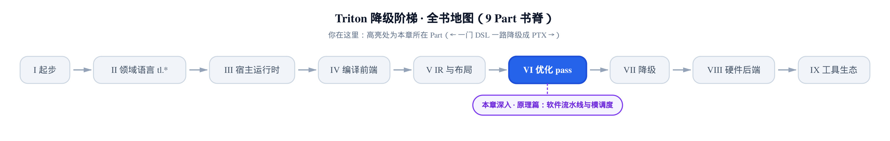
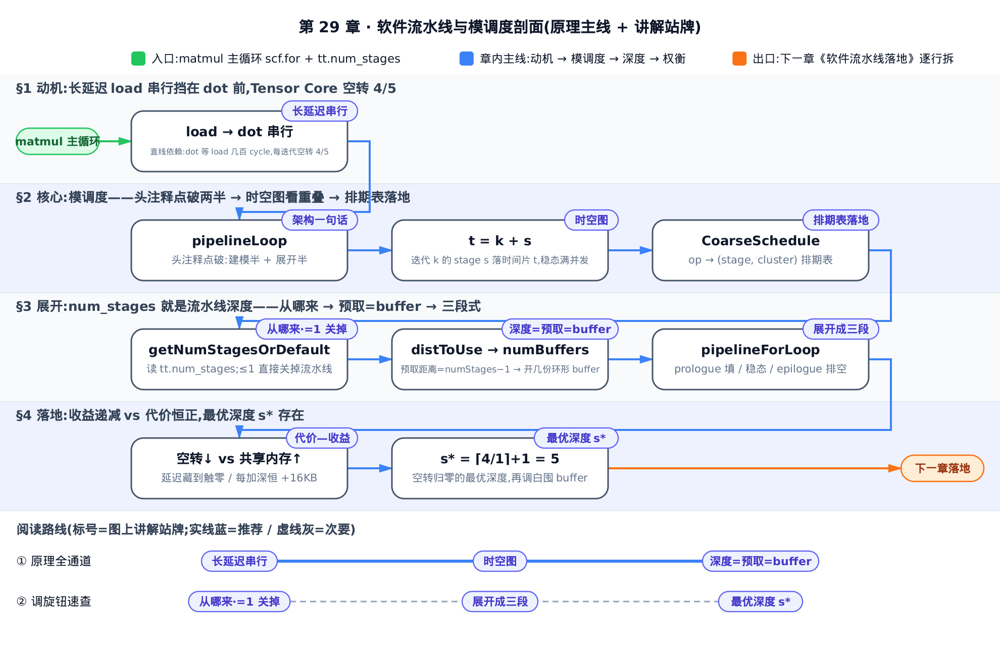
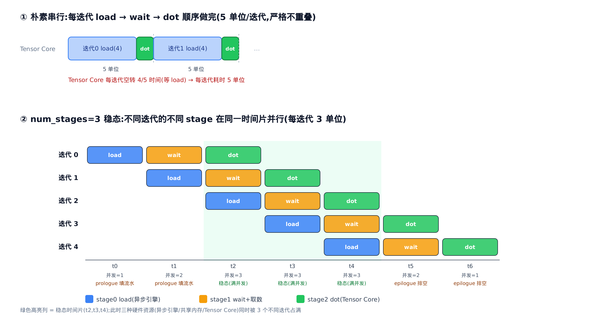
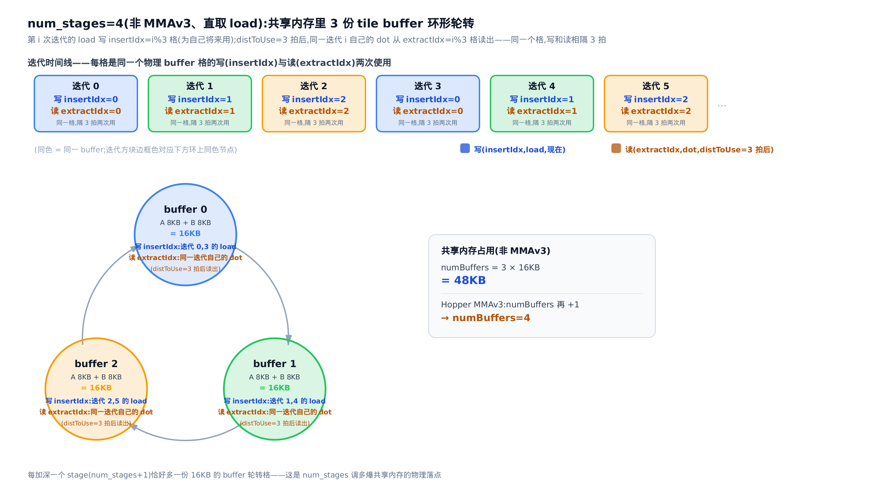
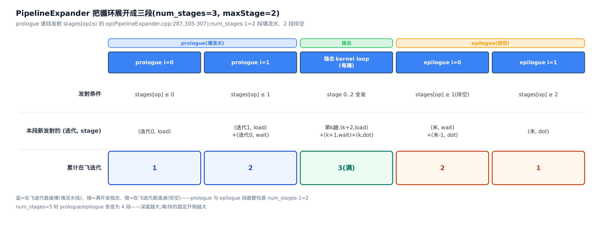

# 软件流水线与模调度：num_stages 到底调度了什么



> **你在这里**——第 VI 部分「优化 pass」的原理篇。
> 上一章：[dot 已经送上 Tensor Core](../../ch28-accelerate-matmul-layout-opt/narrative/chapter.md)。
> 本章：让搬运和计算在时间上叠起来。
> 下一章：这套流水线的逐行落地。

写 matmul kernel 的人都摸过这个旋钮：`tl.range(..., num_stages=N)`，或 autotune 配置里的 `num_stages`。调到 3、4，吞吐上一个台阶；再往上，共享内存爆掉、编译失败，或者反而更慢。[第 4 章](../../ch04-tl-surface-and-constexpr/narrative/chapter.md)讲过它只是挂在循环上的一个提示；[第 17 章](../../ch17-control-flow-lowering-scf/narrative/chapter.md)讲过它随循环下降，落成 `scf.for` 上的 `tt.num_stages` 属性。但有个问题一直悬着：**这个数字到底调度了什么？**

答案是一套经典编译理论——**软件流水线**（software pipelining，编译期把循环体重排、跨迭代重叠、生成新循环）加**模调度**（modulo scheduling，给循环体每个 op 分配一个流水级）。看懂本章的「迭代 × stage」时空图，你就能回答三件事：什么时候该调大 `num_stages`；每调大一格要付出几份共享内存；为什么存在一个再调也不会更快的深度。

本章符号先立好，随用随查：

| 符号 | 含义 | 首现 |
|---|---|---|
| `num_stages` | 流水线深度——循环体切成几级 stage，也是最多提前预取几个未来迭代 | §1 |
| stage | 一个 op 属于流水线第几级（0 到 `num_stages`−1），决定它比消费者提前几个迭代执行 | §2.2 |
| cluster | 同一 stage 内 op 的先后分组——stage 管「差几个迭代」，cluster 管「同迭代内谁先谁后」 | §2.3 |
| `distToUse` | 一个 load 从发起到被 dot 用掉，跨了几个 stage（= dot 的 stage − load 的 stage） | §3.2 |
| `numBuffers`（`distance`） | 共享内存里轮转的 tile buffer 份数 = 所有 load 里 `distToUse` 的最大值（MMAv3 再 +1） | §3.2 |
| `maxStage` | 排期里最大的 stage 下标（= `num_stages`−1）；prologue/epilogue 各这么多段 | §3.3 |
| `insertIdx` / `extractIdx` | 环形 buffer 的写格 / 读格编号 | §3.2 |
| $`t_{\mathrm{load}}`$、$`t_{\mathrm{dot}}`$ | 教学模型里的 load 延迟与 dot 耗时（逻辑单位，非硬件 cycle） | §1 |
| II（initiation interval，发起间隔） | 经典模调度里相邻迭代发起的固定间隔；此词不出现在 Triton 源码里，仅作理论背景 | §2.2 |
| steady state（稳态） | 流水线填满后满并发的那段循环；此词同样不出现在源码里 | §2.2 |

先给全章一张地图，四条泳道就是本章的四段主线：从 §1 的串行空转，到 §2 的模调度重叠，到 §3 的 num_stages 深度与 buffer 轮转，落到 §4 的代价—收益权衡。



命门是两站：§2.2 的时空图看软件流水线怎么让不同迭代的不同 stage 同时在飞，§4 的权衡表看 num_stages 为什么存在一个「再调也不更快」的最优深度 s*。只想快速调旋钮，可沿图上「② 调旋钮速查」直奔 §3.1（=1 关掉）、§3.3（三段式）与 §4（最优深度）。

## §1 动机：长延迟的 load 串行挡在 dot 前面

matmul 主循环在 Triton 层面就是 `tl.range` 里一个 `tl.load` 喂一个 `tl.dot`（[第 8 章](../../ch08-dot-reduce-scan/narrative/chapter.md)）。下降成 `scf.for` 后，循环体的数据依赖是一条直线：

```
每次迭代 i：
  a = load(A_ptr + i)      ← 从 global memory 搬，延迟几百个 cycle
  b = load(B_ptr + i)      ← 同上
  acc = dot(a, b, acc)     ← Tensor Core 计算，必须等 a、b 到齐
```

问题出在**依赖**。`dot` 用到 `a`、`b`，必须等两个 `load` 落地才能开始；而 global memory 的延迟是几百个 cycle（[第 2 章](../../ch02-gpu-execution-model/narrative/chapter.md)的内存延迟金字塔塔底），Tensor Core 却很快。于是每一轮的时间线都是「长长的等 load → 短短的 dot → 又长长的等 load」，计算单元大部分时间在空转。

把这笔账放进一个贯穿全章的教学模型：设 load 延迟 $`t_{\mathrm{load}}=4`$ 个单位、dot 耗时 $`t_{\mathrm{dot}}=1`$ 个单位（逻辑单位，非硬件 cycle）。朴素串行每迭代耗时 4+1=5 个单位，其中 4 个单位纯等待——Tensor Core 的利用率只有 1/5。

破局点是一个观察：**第 $`i{+}1`$ 次迭代的 `load` 和第 $`i`$ 次迭代的 `dot` 之间没有依赖**。下一轮的输入地址是编译期就能推出来的，不用等这一轮算完。既然无依赖，为什么要排队？能不能在做第 $`i`$ 次 `dot` 的同时，就把第 $`i{+}1`$ 次的数据异步搬过来，让计算时间把搬运延迟**盖住**？

这正是软件流水线要做的事，也是 `num_stages` 存在的全部理由。叫「软件」流水线，是因为它不像硬件流水线靠电路自动重叠——它靠**编译器在编译期改写循环**。Triton 里这个 pass 叫 `TritonGPUPipeline`，入口在 `lib/Dialect/TritonGPU/Transforms/Pipeliner/SoftwarePipeliner.cpp`。

## §2 核心：模调度——给每个 op 分配 stage

### §2.1 源码头注释把架构一句话点透

`SoftwarePipeliner.cpp` 的文件头注释，就是本章的理论骨架（逐字）：

```cpp
// lib/Dialect/TritonGPU/Transforms/Pipeliner/SoftwarePipeliner.cpp:L19-L27
//===----------------------------------------------------------------------===//
// This file will create a schedule that will be handed over to the pipeline
// expander.
// Software pipeliners are usually separated into two pieces, one that create a
// modulo schedule and an expander that rewrites the loop and emits a prologue
// and epilogue. This pass first calls a helper that will pre-process the IR
// to create async operations and create a modulo schedule. Then we call the
// expander to generate the prologue and new loop.
//===----------------------------------------------------------------------===//
```

软件流水线器拆成**两半**：

1. **建模（create a modulo schedule）**——一个 helper 预处理 IR，把同步 load 换成异步算子，并产出一张**模调度表**：循环体里每个 op 属于哪一个 stage。这一半在 `MatmulLoopPipeline.cpp` 的 `preProcessLoopAndGetSchedule`（§3.2）。
2. **展开（expander … emits a prologue and epilogue）**——拿着排期表把循环重写成三段：prologue（序幕，把流水线灌满）＋ 稳态循环体 ＋ epilogue（尾声，把流水线排空）。这一半在 `PipelineExpander.cpp` 的 `pipelineForLoop`（§3.3）。

拆两半是分离关注点：建模只管「每个 op 属于哪个 stage」（策略），展开只管「把排期表机械地重写成三段式循环」（机制）——换调度策略不必动展开器。`pipelineLoop` 把两半串起来（逐字）：

```cpp
// lib/Dialect/TritonGPU/Transforms/Pipeliner/SoftwarePipeliner.cpp:L73-L94
static bool pipelineLoop(scf::ForOp forOp, int numStages) {
  mlir::triton::PipeliningOption options;
  if (!preCondition(forOp))
    return false;

  bool foundSchedule = false;
  foundSchedule = preProcessLoopAndGetSchedule(forOp, numStages, options);

  // TODO: add more pipelines strategy.
  if (!foundSchedule)
    return false;

  IRRewriter rewriter(forOp->getContext());
  rewriter.setInsertionPoint(forOp);
  FailureOr<scf::ForOp> newForOp =
      mlir::triton::pipelineForLoop(rewriter, forOp, options);

  if (failed(newForOp))
    return false;
  mlir::triton::asyncLaunchDots(newForOp.value());
  return true;
}
```

`IRRewriter` 是 MLIR 的改写器句柄，负责安全地替换 IR；开头的 `preCondition` 会跳过带跨多轮依赖（distance>1）的循环和外层循环；收尾的 `asyncLaunchDots` 是 Hopper WGMMA（[第 27 章](../../ch27-tensor-core-mma-layout/narrative/chapter.md)的 warpgroup 矩阵乘）的后处理。这三者的细节都留给下一章，本章只走主干：**建模 → 展开**。

> **理论出处与诚实边界。** 头注释里 `modulo schedule`、`prologue`、`epilogue` 三个词是逐字印在源码里的；它们的学术源头是 Lam 1988 的模调度奠基论文（PLDI '88，DOI:10.1145/53990.54022，面向 VLIW——超长指令字机器——的循环调度）与 Allan 等 1995 年的软件流水线综述（ACM Computing Surveys，DOI:10.1145/192724.192731）。你不需要读这两篇也能跟上本章：Triton 的 pipeliner 是 **stage-based** 的——直接给每个 op 分配 stage，并不显式计算经典理论里的 **II（initiation interval，发起间隔）**；II 与 **steady state（稳态）** 的严格定义、II 的下界公式，两词在 Triton 的 `Pipeliner/` 目录里根本不出现，本章一律只用其直觉、出处回指上述 DOI（待核），不给公式。

### §2.2 时空图：让不同迭代的不同 stage 同时在飞

模调度的直觉像洗车流水线：三辆车各占一个工位同时动，而不是一辆车走完三个工位下一辆才进来。把循环体切成 3 个 stage（`num_stages=3`）：

- **stage 0**：发起 load（异步引擎搬 A、B 进共享内存）；
- **stage 1**：等 load 完成、从共享内存取数；
- **stage 2**：dot（Tensor Core 计算）。

再按一条排期规则错开各迭代的起点：**迭代 $`k`$ 的 stage $`s`$ 落在时间片 $`t=k+s`$**（每深一级 stage 晚一个时间片）。5 次迭代的完整时间线摊开是：

<!-- trace: modulo-schedule-spacetime -->
| 时间片 | stage 0：load（异步引擎） | stage 1：wait＋取数 | stage 2：dot（Tensor Core） | 在飞迭代数 | 阶段 |
|---|---|---|---|---|---|
| t0 | 迭代 0 | — | — | 1 | prologue 填流水 |
| t1 | 迭代 1 | 迭代 0 | — | 2 | prologue 填流水 |
| t2 | 迭代 2 | 迭代 1 | 迭代 0 | 3 | 稳态（满并发） |
| t3 | 迭代 3 | 迭代 2 | 迭代 1 | 3 | 稳态（满并发） |
| t4 | 迭代 4 | 迭代 3 | 迭代 2 | 3 | 稳态（满并发） |
| t5 | — | 迭代 4 | 迭代 3 | 2 | epilogue 排空 |
| t6 | — | — | 迭代 4 | 1 | epilogue 排空 |

这张表值得逐列读一遍 t2：迭代 0 在 dot、迭代 1 在 wait、迭代 2 在 load——**同一个时间片里，三种硬件资源（异步拷贝引擎、共享内存、Tensor Core）被三个不同迭代的三个不同 stage 同时占用**。load 的长延迟没有消失，它被**别的迭代的 dot** 盖住了。这就是「异步 load 隐藏访存延迟」的全部含义。



满并发不是巧合，可以归纳论证。基例：t0 只有迭代 0 在 stage 0，并发 1。归纳步：每前进一个时间片，最前沿的迭代进下一个 stage，同时一个新迭代进 stage 0，并发 +1；跑过 `num_stages`−1 个时间片后并发到达 `num_stages`（表中 t2）并保持恒定。而排期规则 $`t=k+s`$ 保证：同一时间片上，不同迭代（$`k`$ 两两不同）的 stage $`s=t-k`$ 也两两不同——**每个 stage 至多一个迭代，资源无冲突**。这段满并发区间，就是教科书说的稳态；经典理论里相邻迭代在稳态中错开的固定间隔叫 II，其严格定义与下界回指 Lam 1988（DOI:10.1145/53990.54022，待核），此处只用重叠直觉。

收益可以量化。教学模型下（load 延迟 4、dot 耗时 1），朴素串行每迭代 5 个单位；`num_stages=3` 的稳态里，dot 前的空转被压到 $`\max(0,\,4-2)=2`$ 个单位，每迭代 3 个单位——同一个循环体，5 → 3。空转为什么是「减 2」？因为 load 提前了 2 个 stage 发起，dot 开始前它已经在飞了 2 个单位的计算时间。这笔账 §4 会算全。

### §2.3 排期表落地：CoarseSchedule 给每个 op 一个 (stage, cluster)

「模调度」在 Triton 里不是论文里的抽象，是一个具体的数据结构——`CoarseSchedule`（粗排期表），一张 `op → (stage, cluster)` 的映射（逐字，节选）：

```cpp
// include/triton/Dialect/TritonGPU/Transforms/Schedule.h:L69-L78
  CoarseSchedule(int numStages) : numStages(numStages) {}
  int numStages;
  ClusterList clusters;
  using Cluster = decltype(clusters)::iterator;

  DenseMap<Operation *, std::pair<int, Cluster>> opToStageAndCluster;

  void insert(Operation *op, int stage, Cluster cluster) {
    opToStageAndCluster[op] = {stage, cluster};
  }
```

`DenseMap` 是 LLVM 的哈希表容器；表的两个维度各司其职：

- **stage**（0 到 `numStages`−1）：这个 op 属于流水线第几级——**决定它比它的消费者提前几个迭代执行**。load 放前面的 stage（提前预取），dot 放最后的 stage。
- **cluster**：**同一 stage 内部**的执行顺序分组（`ClusterList` 是一个有序链表，可从两头插入）。stage 决定「差几个迭代」，cluster 决定「同一迭代内谁先谁后」。

两个维度正交，分开表达两种调度自由度——这是 Triton 在经典 stage 概念之外自己加的工程抽象。排期完成后，`createFinalSchedule` 把二维表拍平成一个有序的 `(op, stage)` 序列（逐字）：

```cpp
// lib/Dialect/TritonGPU/Transforms/Pipeliner/Schedule.cpp:L72-L80
std::vector<std::pair<Operation *, unsigned>>
tt::CoarseSchedule::createFinalSchedule(scf::ForOp forOp) {
  SmallVector<std::tuple<Operation *, int, tt::CoarseSchedule::Cluster>>
      opsInOrder = getOpsInOrder(forOp);
  std::vector<std::pair<Operation *, unsigned>> schedule;
  for (auto [op, stage, cluster] : opsInOrder)
    schedule.push_back({op, stage});
  return schedule;
}
```

`getOpsInOrder`（`lib/Dialect/TritonGPU/Transforms/Pipeliner/Schedule.cpp:L45-L70`）先按 cluster 把 op 排好序，然后 cluster 完成使命、被丢弃——**这个 `(op, stage)` 序列就是头注释所说的 modulo schedule，展开器唯一需要的输入**。

## §3 展开：num_stages 就是流水线深度

### §3.1 num_stages 从哪来、等于 1 为什么就是关掉

先接上前面章节埋的线。`num_stages` 的读取在 `getNumStagesOrDefault`——优先用挂在循环上的属性，否则用全局默认（逐字）：

```cpp
// lib/Dialect/TritonGPU/Transforms/Pipeliner/SoftwarePipeliner.cpp:L100-L108
  int getNumStagesOrDefault(scf::ForOp forOp) {
    // Use the attribute attached to the loop if it exists otherwise use the
    // global control.
    if (!forOp->hasAttr(mlir::triton::kNumStagesAttrName))
      return numStages;
    return mlir::cast<IntegerAttr>(
               forOp->getAttr(mlir::triton::kNumStagesAttrName))
        .getInt();
  }
```

`kNumStagesAttrName` 就是那个 `tt.num_stages` 属性名常量：你在 `tl.range(..., num_stages=N)` 写的 `N`（[第 4 章](../../ch04-tl-surface-and-constexpr/narrative/chapter.md)），经[第 17 章](../../ch17-control-flow-lowering-scf/narrative/chapter.md)的控制流下降挂到 `scf.for` 上，到这里被读出来。而 pass 入口对深度不足的循环直接跳过（逐字）：

```cpp
// lib/Dialect/TritonGPU/Transforms/Pipeliner/SoftwarePipeliner.cpp:L112-L116
    getOperation()->walk([&](scf::ForOp forOp) {
      // Bail out for loops with num_stage <= 1.
      if (getNumStagesOrDefault(forOp) > 1)
        loops.push_back(forOp);
    });
```

这五行就是「`num_stages=1` 等于关掉流水线」的实现根据：深度 1 意味着没有「提前的迭代」，无从跨迭代重叠，连收集都不收集。

### §3.2 深度 = 预取几个未来迭代 = 共享内存里几份 buffer

`num_stages` 作为「深度」，落到 matmul 上的物理含义是一条三步链：**提前几个迭代发起 load → 同时有几份数据在飞（已发起、还没被 dot 用掉）→ 共享内存里要几份 buffer 轮转**。逐步看建模半怎么把这条链写出来。

**第一步：把同步 load 换成异步三件套。** `createAsyncCopy` 把每个喂 dot 的 `tt.load` 换成「发起—提交—等待」（逐字，节选）：

```cpp
// lib/Dialect/TritonGPU/Transforms/Pipeliner/MatmulLoopPipeline.cpp:L87-L103（createAsyncCopy 节选）
// … 省略：前置的布局转换分支与共享内存回读分支 …
  tt::MemDescType allocTy = cast<tt::MemDescType>(alloc.getType());
  SmallVector<Value> copyOffsets(allocTy.getRank(), zero);
  copyOffsets[0] = insertIdx;
  Attribute sharedMemorySpace =
      triton::gpu::SharedMemorySpaceAttr::get(forOp.getContext());
  tt::MemDescType subviewTy = tt::MemDescType::get(
      allocTy.getShape().drop_front(), allocTy.getElementType(),
      allocTy.getEncoding(), sharedMemorySpace, /*mutableMemory=*/true);
  auto view =
      builder.create<ttg::MemDescSubviewOp>(loc, subviewTy, alloc, copyOffsets);
  Operation *copy = builder.create<ttg::AsyncCopyGlobalToLocalOp>(
      loc, src, view, mask, other, loadOp.getCache(), loadOp.getEvict(),
      loadOp.getIsVolatile());
  Operation *commmit =
      builder.create<ttg::AsyncCommitGroupOp>(loc, copy->getResult(0));
  Operation *wait =
      builder.create<ttg::AsyncWaitOp>(loc, commmit->getResult(0), 0);
```

这三件套（`AsyncCopyGlobalToLocalOp` + `AsyncCommitGroupOp` + `AsyncWaitOp`）正是[第 24 章](../../ch24-ttg-ttng-operations/narrative/chapter.md)立过的 `cp.async` 算子面孔——那一章讲它们「是什么」，本章讲它们**被谁、为了什么而插进循环**：`cp.async` 发起后不阻塞，线程可以继续算上一轮的 dot，直到真正要用数据才 `AsyncWaitOp`。这是「用计算盖住访存延迟」的硬件落点。同样注意 `copyOffsets[0] = insertIdx`：拷贝的目的地不是整块 buffer，而是经 `MemDescSubviewOp`（[第 24 章](../../ch24-ttg-ttng-operations/narrative/chapter.md)的 memdesc 切片）取出的**第 `insertIdx` 格**——格子从哪来，第三步揭晓。

**第二步：定每个 op 的 stage，量出「预取距离」。** `scheduleLoads` 把 load 的最终消费者（root use，matmul 里就是 dot）放到最后一个 stage，把 load 放到前面的 stage，两者之差记为 `distToUse`（逐字，节选）：

```cpp
// lib/Dialect/TritonGPU/Transforms/Pipeliner/MatmulLoopPipeline.cpp:L568-L597（scheduleLoads 节选）
  tt::CoarseSchedule::Cluster rootUsersCluster = schedule.clusters.newAtFront();
  // Put the root uses of the loads in the last stage.
  for (auto &[loadOp, dist, use] : loadOpToIndLevelAndUse) {
    if (loadToInfo.count(loadOp) == 0)
      continue;
    // Non-LoadOp(s) are the root uses of all LoadOp(s) and should be
    // always present in the opInfo
    if (!isa<tt::LoadOp>(use)) {
      schedule.insert(use, numStages - 1, rootUsersCluster);
      rootUsers.insert(use);
    }
  }

  SmallVector<tt::CoarseSchedule::Cluster> loadsClusters;
  for (int i = 0; i < maxIndirectionLevel + 1; i++) {
    loadsClusters.push_back(schedule.clusters.newAtBack());
  }
  // Assign stages to the loads.
  for (auto [loadOp, indLevel, _] : loadOpToIndLevelAndUse) {
    if (loadToInfo.count(loadOp) == 0)
      continue;
    int stage = (maxIndirectionLevel - indLevel) * stagesBetweenLoads;
    schedule.insert(loadOp, stage, loadsClusters[indLevel]);
  }

  // Distance from the load to the use.
  for (auto [loadOp, _, use] : loadOpToIndLevelAndUse) {
    if (loadToInfo.count(loadOp) == 0)
      continue;
    loadToInfo[loadOp].distToUse = schedule[use].first - schedule[loadOp].first;
  }
```

`indLevel` 是间接寻址层级——「load 的地址是否又依赖另一个 load」，`stagesBetweenLoads` 是相邻两级 load 之间的 stage 间隔（`ceil(numStages-2, maxIndirectionLevel+1)`，`MatmulLoopPipeline.cpp:L565-L566`）；分级细节留给下一章。本章只需要最常见的直取情形（`maxIndirectionLevel=0`，A、B tile 直接按地址取）：load 的 stage 恒为 `(0-0)*stagesBetweenLoads`，即 0；dot 的 stage 恒为 `numStages-1`。还要点破一处教学与实现的错位：`scheduleLoads` 只显式钉**两端**——load 与 dot；§2.2 把「wait＋取数」单列成 stage 1 只是教学直观化，真实排期里 wait、取数这些中间算子由随后的依赖排程（`scheduleDependencies` 等，下一章拆）自动补齐 stage。对本章承重的不变量只有一条：`distToUse` = dot 的 stage − load 的 stage。代入源码算式逐档推演：

<!-- trace: stage-assignment-distToUse -->
| num_stages | stagesBetweenLoads | load 的 stage | dot 的 stage | distToUse |
|---|---|---|---|---|
| 2 | 0 | 0 | 1 | 1 |
| 3 | 1 | 0 | 2 | 2 |
| 4 | 2 | 0 | 3 | 3 |
| 5 | 3 | 0 | 4 | 4 |

不变量一眼可见：直取时 `distToUse = numStages - 1`，一条斜率为 1 的直线——load 永远严格早于 dot（否则无从预取），且 **`num_stages` 每加深一格，`distToUse` 精确 +1**。这个量就是「预取距离」：dot 开始时，有 `distToUse` 个未来迭代的 load 已经发起、正在飞。

**第三步：几份数据在飞，就开几份 buffer。** 在飞的数据要有地方落脚，且互不覆盖。`createAlloc` 的做法是把 buffer 的形状**在最前面插一维 `distance`**（逐字）：

```cpp
// lib/Dialect/TritonGPU/Transforms/Pipeliner/MatmulLoopPipeline.cpp:L774-L790
// Create an allocation that can hold distance number of loadOp shapes.
static Value createAlloc(scf::ForOp &forOp, Operation *loadOp,
                         ttg::SharedEncodingAttr sharedEnc, unsigned distance) {
  OpBuilder builder(forOp);
  Attribute sharedMemorySpace =
      triton::gpu::SharedMemorySpaceAttr::get(forOp.getContext());
  auto ty = cast<RankedTensorType>(loadOp->getResultTypes()[0]);
  SmallVector<int64_t> bufferShape(ty.getShape().begin(), ty.getShape().end());
  bufferShape.insert(bufferShape.begin(), distance);
  Type memdescType = mlir::triton::MemDescType::get(
      bufferShape, ty.getElementType(), sharedEnc, sharedMemorySpace,
      /*mutableMemory*/ true);
  Value alloc = builder.create<mlir::triton::gpu::LocalAllocOp>(
      loadOp->getLoc(), memdescType, Value());
  return alloc;
}
```

签名里的 `LocalAllocOp` 与 `sharedEnc` 分别是[第 24 章](../../ch24-ttg-ttng-operations/narrative/chapter.md)的 local_alloc 和[第 22 章](../../ch22-shared-encoding-swizzle/narrative/chapter.md)的共享内存 swizzle 编码——这里只借用，不重讲。要看的是那行 `insert`：一个 `[BLOCK_M, BLOCK_K]` 的 tile 被扩成 `[distance, BLOCK_M, BLOCK_K]`——`distance` 份 buffer 首尾相接，组成一个**环形缓冲**：第 $`i`$ 次迭代的 `cp.async` 写第 `insertIdx` 格（第一步看到的 `copyOffsets[0]`），dot 从 `extractIdx` 格读，格号随迭代轮转。像旋转寿司的传送带：要让 N 份菜同时在路上，就得有 N 个盘位轮流用。

`distance` 取多大？`createAsyncOps` 给出答案——所有 load 里 `distToUse` 的最大值（逐字，节选）：

```cpp
// lib/Dialect/TritonGPU/Transforms/Pipeliner/MatmulLoopPipeline.cpp:L940-L955（createAsyncOps 节选）
  // Calculate the number of buffers needed for each load.
  // TODO pawel: we could do more fine-grained allocation here and
  // allocate only the number of buffers that specific loads need.
  // Instead, we allocate the maximum number of buffers needed by any load.
  int numBuffers =
      llvm::max_element(llvm::make_second_range(loadToInfo), [](auto &lhs,
                                                                auto &rhs) {
        return lhs.distToUse < rhs.distToUse;
      })->distToUse;
  bool hasMMAV3 =
      llvm::any_of(loadToInfo, [](auto &kv) { return kv.second.loadIsMMAV3; });
  if (hasMMAV3) {
    // For MMAv3, we need an extra buffer as this is assumed in the wgmma
    // pipelining post-processing.
    numBuffers++;
  };
```

取 max 而不逐 load 精细分配，是源码 TODO 里承认的实现简化：用最大距离统一开 buffer，保证任何 load 从发起到被用都有格子可占、不被覆盖。MMAv3（Hopper 的 WGMMA，[第 27 章](../../ch27-tensor-core-mma-layout/narrative/chapter.md)）额外 +1 份，是 wgmma 后处理的前提假设。

这里得和 §2.2 的时空表对一次账，否则会卡在一个差 1 上：稳态确实有 `num_stages` 个**迭代**在飞（每级 stage 各一个），buffer 却只开 `distToUse` = `num_stages`−1 份。差的那一份正是处于 dot 级的迭代——它这一拍正在读出并交还自己的格子，真正压着格子的是「已发起、尚未被 dot 消费」的那 `num_stages`−1 个未来迭代的 load。**非 MMAv3 时，buffer 数恒比在飞迭代数少 1**：数迭代要连正在消费的那个一起数，数 buffer 只数还压着数据的。MMAv3 的额外 +1 恰好补回这一份——buffer 数与在飞迭代数打平，下表 MMAv3 列等于 `num_stages` 不是算错，是 wgmma 后处理要求多囤的那份。

三步串起来就是本章的**落地闭环**：`num_stages` ↑ → `distToUse` ↑ → `numBuffers = max(distToUse)` ↑ → `createAlloc` 的 `distance` 维 ↑。**每多一个 stage，共享内存里就多一份 tile 大小的 buffer。** 拿一组常见参数把账算实——`BLOCK_M=BLOCK_N=128`、`BLOCK_K=32`、fp16（2 字节），一份 buffer = 一个 A tile（128×32×2 = 8KB）+ 一个 B tile（32×128×2 = 8KB）= 16KB：

<!-- trace: multi-buffer-ring -->
| num_stages | distToUse | numBuffers（非 MMAv3） | 共享内存（numBuffers×16KB） | numBuffers（MMAv3 再 +1） |
|---|---|---|---|---|
| 2 | 1 | 1 | 16KB | 2 |
| 3 | 2 | 2 | 32KB | 3 |
| 4 | 3 | 3 | 48KB | 4 |



共享内存的步长恒为一份 tile（本例 16KB）——这就是 `num_stages` 调多了爆共享内存的**算式级根据**，代价那头 §4 结账。

### §3.3 展开成三段：prologue 填流水、稳态、epilogue 排空

建模半交出 `(op, stage)` 排期表，展开半把循环真正重写掉。这一半住在 `PipelineExpander.cpp`——文件头写明它是从上游 MLIR fork 来的通用循环流水线器（`lib/Dialect/TritonGPU/Transforms/Pipeliner/PipelineExpander.cpp:L13-L14`，「Fork of upstream pipeliner」；MLIR 这套可复用基建的设计哲学见 arXiv:2002.11054，[第 15 章](../../ch15-ssa-and-structured-control-flow/narrative/chapter.md)引用过它）。主入口 `pipelineForLoop` 自带五步编号（逐字，节选）：

```cpp
// lib/Dialect/TritonGPU/Transforms/Pipeliner/PipelineExpander.cpp:L789-L841（pipelineForLoop 节选）
FailureOr<ForOp>
mlir::triton::pipelineForLoop(RewriterBase &rewriter, ForOp forOp,
                              const triton::PipeliningOption &options,
                              bool *modifiedIR) {
  // … 省略：modifiedIR 标志维护 …
  LoopPipelinerInternal pipeliner;
  if (!pipeliner.initializeLoopInfo(forOp, options))
    return failure();

  // 1. Emit prologue.
  if (failed(pipeliner.emitPrologue(rewriter)))
    return failure();

  // 2. Track values used across stages. When a value cross stages it will
  // need to be passed as loop iteration arguments.
  llvm::MapVector<Value, LoopPipelinerInternal::LiverangeInfo>
      crossStageValues = pipeliner.analyzeCrossStageValues();

  // … 省略：loopArgMap 声明 …
  // 3. Create the new kernel loop and return the block arguments mapping.
  ForOp newForOp =
      pipeliner.createKernelLoop(crossStageValues, rewriter, loopArgMap);
  if (failed(pipeliner.createKernel(newForOp, crossStageValues, loopArgMap,
                                    rewriter)))
    return failure();

  llvm::SmallVector<Value> returnValues =
      newForOp.getResults().take_front(forOp->getNumResults());
  if (options.peelEpilogue) {
    // 4. Emit the epilogue after the new forOp.
    rewriter.setInsertionPointAfter(newForOp);
    if (failed(pipeliner.emitEpilogue(rewriter, returnValues)))
      return failure();
  }
  // 5. Erase the original loop and replace the uses with the epilogue output.
  if (forOp->getNumResults() > 0)
    rewriter.replaceOp(forOp, returnValues);
  else
    rewriter.eraseOp(forOp);

  return newForOp;
}
```

五步里的三个主角，各自回答一个「为什么」：

**Prologue（序幕）解决冷启动。** 稳态循环体假设「每个时间片都有 `num_stages` 个迭代在飞」，可循环刚开始时一个都没有。`emitPrologue` 的声明注释（逐字）：

```cpp
// lib/Dialect/TritonGPU/Transforms/Pipeliner/PipelineExpander.cpp:L90-L92
  /// Emits the prologue, this creates `maxStage - 1` part which will contain
  /// operations from stages [0; i], where i is the part index.
  LogicalResult emitPrologue(RewriterBase &rewriter);
```

第 $`i`$ 段只包含 stage $`[0;i]`$ 的 op——实现里就是一个逐段放行的过滤循环（逐字，节选）：

```cpp
// lib/Dialect/TritonGPU/Transforms/Pipeliner/PipelineExpander.cpp:L287-L307（emitPrologue 节选）
  for (int64_t i = 0; i < maxStage; i++) {
    // … 省略：造第 i 段的归纳变量 iv = lb + i*step 与动态循环的谓词 …
    for (Operation *op : opOrder) {
      if (stages[op] > i)
        continue;
      // … 省略：cloneAndUpdateOperands 克隆该 op 并重映射操作数 …
    }
  }
```

实现里 `maxStage` 是最大 stage 下标（= `numStages`−1），循环条件 `i < maxStage` 恰好发射 `maxStage` = `numStages`−1 段「不完整」的迭代，把前几个迭代的 load 提前放出去——**逐段把流水线灌满**。有一处要替读者挡掉：声明注释说的 「creates `maxStage - 1` part」 按段数字面读会与实现差一——段的下标从 0 数到 `maxStage`−1，注释里的 `maxStage - 1` 只能对上**最后一段的下标**，不是段数；以循环边界和下文 `num_stages=3` 推演出的两段 prologue 为准。

**稳态 kernel loop 是重叠的本体。** `createKernelLoop` + `createKernel` 生成的新循环体，一次迭代**同时包含所有 stage 的 op**：第 $`k`$ 趟里，第 $`k{+}2`$ 个迭代的 load、第 $`k{+}1`$ 个迭代的 wait、第 $`k`$ 个迭代的 dot 挨在一起。这带来一个新问题：stage 0 载入的值要到两趟之后才被 stage 2 消费，**值的生命期跨了循环体边界**。第 2 步的 `analyzeCrossStageValues` 就是在清点这些跨 stage 存活值，把它们接进新循环的 `iter_args`（[第 17 章](../../ch17-control-flow-lowering-scf/narrative/chapter.md)的 loop-carried 机制——那一章铺的轨道，这里跑上了真车）。

**Epilogue（尾声）解决收尾。** 声明注释与 prologue 完全对称（逐字）：

```cpp
// lib/Dialect/TritonGPU/Transforms/Pipeliner/PipelineExpander.cpp:L107-L110
  /// Emits the epilogue, this creates `maxStage - 1` part which will contain
  /// operations from stages [i; maxStage], where i is the part index.
  LogicalResult emitEpilogue(RewriterBase &rewriter,
                             llvm::SmallVector<Value> &returnValues);
```

循环跑完时，最后几个迭代还悬在半空（load 发了、dot 没算），epilogue 再跑 `numStages`−1 段「不完整」迭代把它们排空（注释的 `maxStage - 1` 同 prologue，按末段下标读）。把 `num_stages=3` 的三段全程推演一遍：

<!-- trace: prologue-epilogue-expansion -->
| 阶段 | 段 | 发射条件 | 本段新发射的（迭代，stage） | 在飞迭代 |
|---|---|---|---|---|
| prologue | i=0 | stages[op]≤0 | （迭代 0，load） | 1 |
| prologue | i=1 | stages[op]≤1 | （迭代 1，load）+（迭代 0，wait） | 2 |
| 稳态 kernel loop | 每趟 | stage 0..2 全发 | 第 k 趟：（k+2，load）+（k+1，wait）+（k，dot） | 3（满） |
| epilogue | i=0 | stages[op]≥1 | （末，wait）+（末-1，dot） | 2 |
| epilogue | i=1 | stages[op]≥2 | （末，dot） | 1 |

在飞迭代数 1→2→3（满）→2→1，正是 §2.2 时空表里 t0–t6 那条曲线的另一种切法：**prologue 的第 $`i`$ 段把在飞数从 $`i`$ 提到 $`i{+}1`$，epilogue 对称地降回去，填与排各恰好 `num_stages`−1 段**。



段数正比于深度，这是深度的**固定开销**：`num_stages=5` 时填/排各 4 段。迭代总数不多的短循环里，这些「不完整」迭代占比可观——`num_stages` 不宜盲目调大的第一个理由，在这里就现形了。不过上表画的是展开器**剥离式**的形态，而 Triton 的 matmul 路径恰恰没走这一支——这个口子必须当场缝上，否则固定开销的结论会悬空：matmul 建模把 `options.peelEpilogue` 关掉了（逐字，节选）：

```cpp
// lib/Dialect/TritonGPU/Transforms/Pipeliner/MatmulLoopPipeline.cpp:L1120-L1129（preProcessLoopAndGetSchedule 尾部节选）
  std::vector<std::pair<Operation *, unsigned>> schedule =
      coarseSchedule.createFinalSchedule(forOp);

  // … 省略：把 schedule 填进 options.getScheduleFn …
  options.peelEpilogue = false;
  options.predicateFn = tt::predicateOp;
```

不物理剥离 epilogue，改用谓词化（predication，给 op 挂条件掩码、越界的迭代原地空转）在稳态循环里收尾——少一份代码膨胀。省的只是代码体积，排空本身一步没少：剥离时 `createKernelLoop` 会把 kernel loop 的上界减掉 `maxStage * step`（`lib/Dialect/TritonGPU/Transforms/Pipeliner/PipelineExpander.cpp:L441-L454`），不剥离就不减——稳态循环因此**多跑 `numStages`−1 趟尾部迭代**，`createKernel` 为除末级外的每个 stage 造谓词 `iv < ub - (maxStage - i) * step`（`PipelineExpander.cpp:L482-L500`），尾部各趟里靠前的 stage 逐级被掩掉、只剩排空工作在跑——上表 epilogue 两行描述的事原样发生，只是从独立代码段搬进了循环体内。所以「填/排各 `numStages`−1 段」的固定开销结论对 matmul 路径同样成立。展开器两条路都支持，这只是 Triton 的实现选择；谓词化的机械细节，连同 `scheduleLoads` 的间接寻址分级、`asyncLaunchDots` 的 WGMMA 后处理，都在下一章《软件流水线落地》逐行拆。

## §4 落地：什么时候调大、为什么调多了反而慢

把 §2 和 §3 的两条线拧成一股，就是 `num_stages` 调优的代价—收益权衡。

**收益线**：深度 $`s`$ 让 load 提前 $`s-1`$ 个 stage 发起，dot 开始前有 $`(s-1)\,t_{\mathrm{dot}}`$ 的计算窗口垫在下面。教学模型下每迭代的空转与耗时是：

```math
\mathrm{stall}(s)=\max\bigl(0,\;t_{\mathrm{load}}-(s-1)\,t_{\mathrm{dot}}\bigr),\qquad
T_{\mathrm{iter}}(s)=t_{\mathrm{dot}}+\mathrm{stall}(s)
```

第一式说：预取窗口每加宽一格，空转就少 $`t_{\mathrm{dot}}`$，直到被 $`\max`$ 钳在 0；第二式说：稳态每迭代耗时 = 干活时间 + 剩余空转。（提醒一遍：load 延迟 4、dot 耗时 1 是教学单位；stage↔buffer↔共享内存那半条链是源码算式，时间这半条是模型。II 的严格式待核，回指 DOI:10.1145/53990.54022。）

**代价线**：§3.2 的闭环——每加深一格，共享内存恒定多一份 tile（本例 16KB），无上限、无饱和。两条线放进同一张表：

<!-- trace: perf-payoff-tradeoff -->
| num_stages s | 预取窗口 (s-1)×t_dot | stall/迭代 | 稳态每迭代耗时 | 共享内存 (s-1)×16KB | 边际 |
|---|---|---|---|---|---|
| 1 | 0 | 4 | 5 | 0（关流水线） | 无重叠，全空转 |
| 2 | 1 | 3 | 4 | 16KB | 开始藏延迟 |
| 3 | 2 | 2 | 3 | 32KB | 继续藏 |
| 4 | 3 | 1 | 2 | 48KB | 快盖住了 |
| 5 | 4 | 0 | 1 | 64KB | 延迟全藏住（最优深度 s*） |
| 6 | 5 | 0 | 1 | 80KB | 吞吐无收益，只多一份 buffer |

表里藏着一个结构性事实：耗时列随 $`s`$ 单调下降、在 stall 归零处触底不再动；共享内存列每行恒加 16KB、永不回头。收益边际递减触零，代价边际恒正——**两条曲线必然交叉，最优深度存在**。空转恰好归零的深度是：

```math
s^{*}=\left\lceil t_{\mathrm{load}}/t_{\mathrm{dot}}\right\rceil+1
```

代入本例 $`s^{*}=\lceil 4/1\rceil+1=5`$：每迭代 1 个单位，相对串行的 5 提速五倍；再往上到 $`s=6`$，吞吐纹丝不动，白囤 16KB。真实 kernel 里 $`s^{*}`$ 取决于访存延迟、tile 大小、数据位宽——所以 `num_stages` 是 [autotune](../../ch12-driver-backend-autotune-cache/narrative/chapter.md) 候选 Config 里的常客，靠搜而不靠算。

超过 $`s^{*}`$ 还不只是「不赚」，往往倒赔。共享内存是每个 SM 上所有活跃 block 瓜分的稀缺资源——[第 26 章](../../ch26-shared-memory-allocation-membar/narrative/chapter.md)的 `sharedMemorySize` 正是把本章 `createAlloc` 开出的 buffer 全部计入后的总账。三条赔法：

- 共享内存用量 ↑ → 每 SM 驻留的 block 数（occupancy，占用率）↓——没有足够的 warp 互相掩护，反而更慢；
- 稳态循环里在飞迭代多了，跨 stage 存活值（§3.3 的 `iter_args`）占用更多寄存器，可能触发寄存器溢出（spill 到 local memory，[第 26 章](../../ch26-shared-memory-allocation-membar/narrative/chapter.md)与[第 2 章](../../ch02-gpu-execution-model/narrative/chapter.md)的另一把尺）；
- 极端时共享内存直接超 SM 上限，编译失败或回退。

## 小结：num_stages 到底调度了什么

现在可以一句话回答标题：**`num_stages` 是模调度表的行数**——它决定循环体被切成几级 stage（`CoarseSchedule` 的 `op → (stage, cluster)`）、load 比 dot 提前几个迭代发起（`distToUse = numStages−1`）、共享内存里开几份 buffer 轮转（`numBuffers = max(distToUse)`）、以及展开后 prologue/epilogue 各几段（`numStages−1`）。调大它，是用共享内存换「别的迭代的计算盖住这个迭代的访存」；调过头，共享内存与寄存器的账单会把省下的延迟赔回去，最优深度在 stall 归零处触底。

本章给你的是原理骨架：时空图、排期表、三段式、代价闭环。`MatmulLoopPipeline` 的完整建模（间接寻址分级、MMAv3 特殊路径）与 `PipelineExpander` 的完整展开（模变量扩展、谓词化收尾），下一章《软件流水线落地》逐行见真章。
