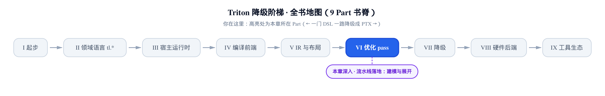
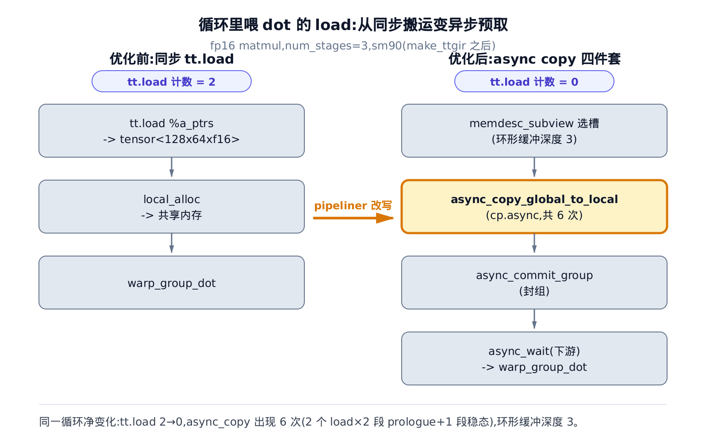
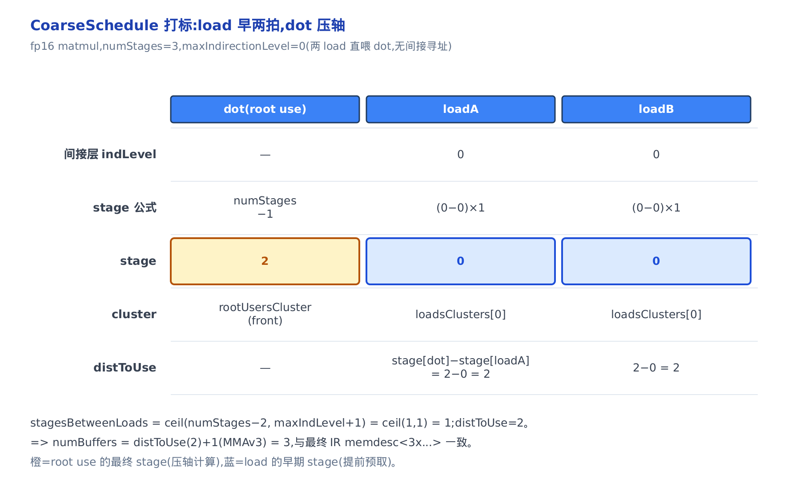
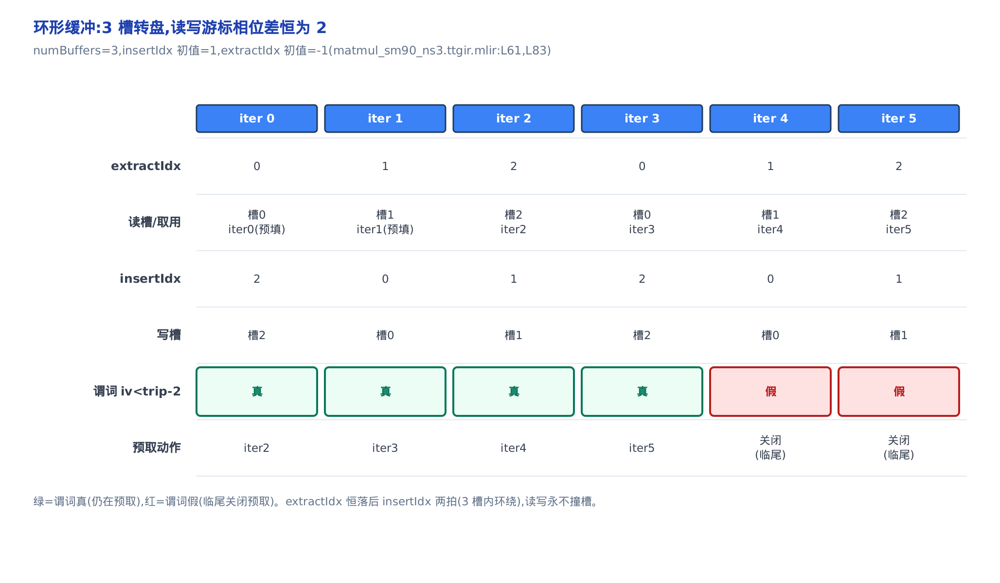
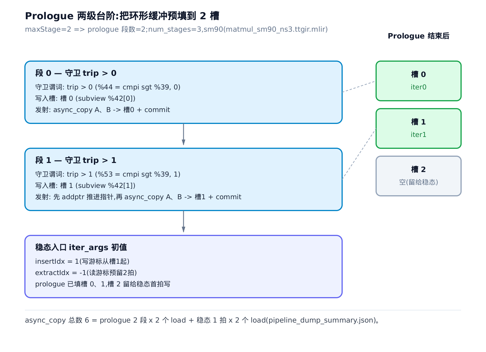
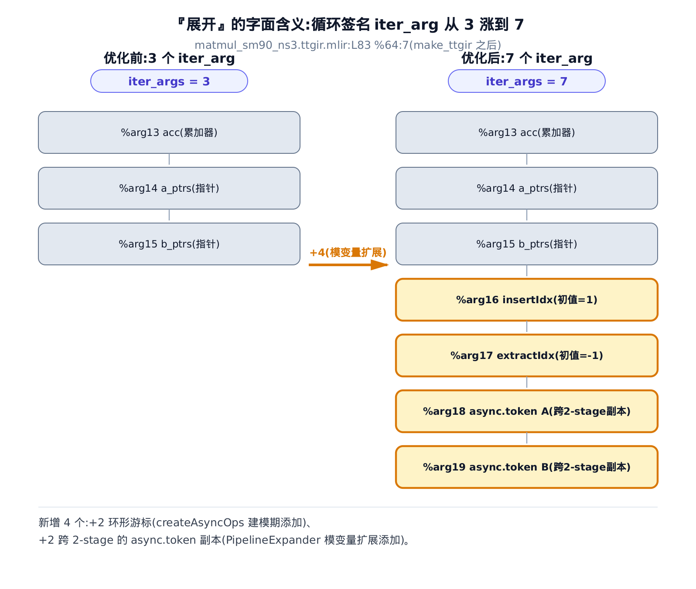
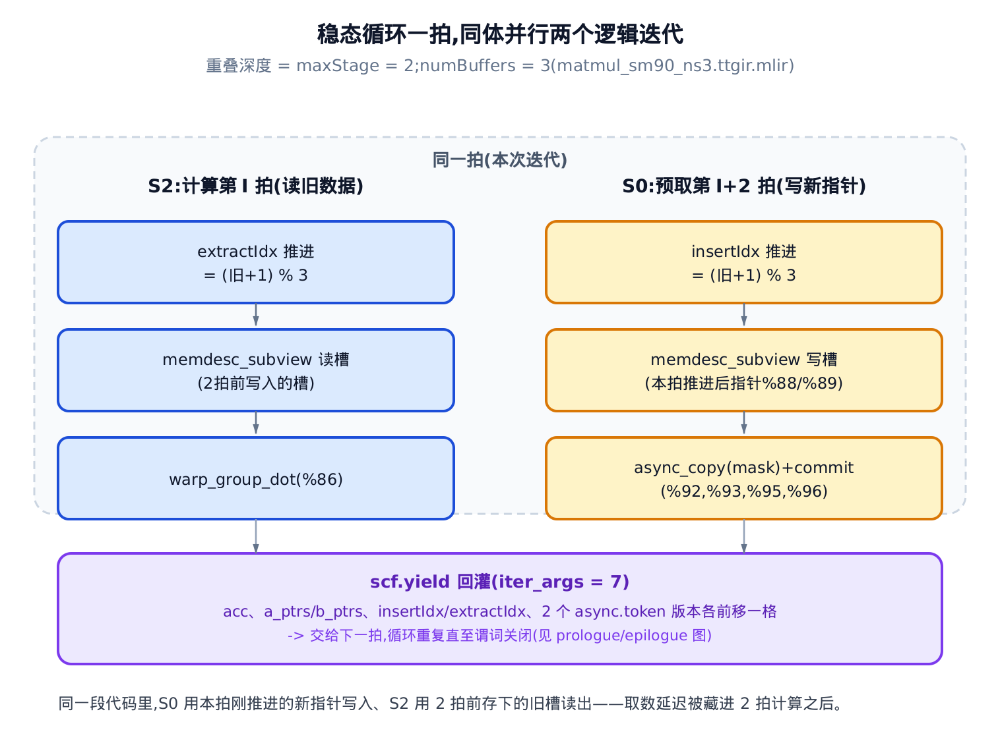
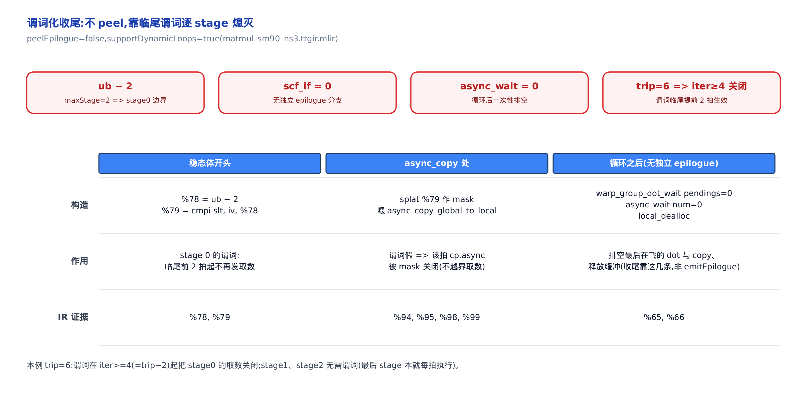

# 软件流水线落地：MatmulLoopPipeline 建模与 PipelineExpander 展开



- 上一章把「模调度」讲成了一张时空图：`num_stages` 到底调度了什么。
- 本章是那张图的**落地 pass**——编译器怎么把它真变成 IR。
- 下一章转向流水线之外的重叠旋钮：Prefetch 与 Warp Specialization。

---

先看一组数字。同一段 fp16 matmul kernel，只改 `tl.range(..., num_stages=k)` 这一个旋钮，编译到 make_ttgir 之后（软件流水线 pass 跑完），循环里的异步拷贝指令数是这样变的：

| `num_stages` | 环形缓冲深度（memdesc 首维） | `async_copy` 条数 | 稳态 `iter_args` |
|:---:|:---:|:---:|:---:|
| 2 | 2 | 4 | — |
| 3 | 3 | 6 | 7 |
| 4 | 4 | 8 | — |

（取自 `matmul_sm90_ns{2,3,4}.ttgir.mlir`，driver 见本章末尾的复现说明；稳态 `iter_args` 一列仅对 `num_stages=3` 逐项核算，ns=2/4 可用同样方法从各自 dump 数出、原理不变，「—」表示本章未展开核算、并非不存在。）

`num_stages` 每加一档，共享内存里那块环形缓冲就多吃一层（`memdesc<2x…>` → `<3x…>` → `<4x…>`），预取的异步拷贝也多发一批。干这件事的 pass 入口在 `lib/Dialect/TritonGPU/Transforms/Pipeliner/SoftwarePipeliner.cpp`。这就是本章的性能命门：**`num_stages` 越大，预取越深、越能掩住访存延迟，但共享内存占用线性上涨、可能把 occupancy（占用率，一个 SM 上能同时驻留多少 warp）挤下去。** 上一章[《软件流水线与模调度》](../../ch29-software-pipelining-primer/narrative/chapter.md)给了「最优深度 $`s^*`$」的直觉；本章要把这条代价—收益曲线从源码里挖出来——看清楚那块缓冲**是谁、在哪一行、按什么公式申请的**。

还有一根伏笔要在本章收口。早在[《控制流下降到 scf》](../../ch17-control-flow-lowering-scf/narrative/chapter.md)里，我们看到前端在追踪期（还没跑任何 pass）就把 `num_stages` 挂成了循环 op 的一个属性 `tt.num_stages = 3 : i32`，当时只点名它是「前端写下的意图标签」，没说谁读、怎么用。本章就是读它、用它的地方。（ch17 当时其实是成对挂下两个属性——`tt.num_stages` 与 `tt.loop_unroll_factor`；本章只读前者，后者是循环展开 pass 的输入、不在本章范围。）


只想搞清「`num_stages` 到底怎么变成共享内存占用」：直接看建模半那两节——给每个算子发两个号、多 buffer 环形缓冲怎么定维度。只想搞清「循环体怎么被撑成流水线」：跳展开半——先空转几拍把流水灌满、iter_args 从 3 撑到 7 那两节。想跟全程从两半分工一路推到 Hopper 尾声：按序读。

## 一条 pass 的两半：建模，然后展开

软件流水线在 Triton 里是一个 TritonGPU 层的 pass，入口在 `SoftwarePipeliner.cpp`。它做的第一件事，就是把那个前端标签读出来：

```cpp
// lib/Dialect/TritonGPU/Transforms/Pipeliner/SoftwarePipeliner.cpp:L100-L128
  int getNumStagesOrDefault(scf::ForOp forOp) {
    // Use the attribute attached to the loop if it exists otherwise use the
    // global control.
    if (!forOp->hasAttr(mlir::triton::kNumStagesAttrName))
      return numStages;
    return mlir::cast<IntegerAttr>(
               forOp->getAttr(mlir::triton::kNumStagesAttrName))
        .getInt();
  }

  void runOnOperation() override {
    SmallVector<scf::ForOp> loops;
    getOperation()->walk([&](scf::ForOp forOp) {
      // Bail out for loops with num_stage <= 1.
      if (getNumStagesOrDefault(forOp) > 1)
        loops.push_back(forOp);
    });

    if (loops.empty())
      return;

    llvm::SmallSetVector<scf::ForOp, 8> outerLoops;
    for (scf::ForOp forOp : loops) {
      auto outerLoop = dyn_cast<scf::ForOp>(forOp->getParentOp());
      int loopNumStages = getNumStagesOrDefault(forOp);
      bool pipelined = pipelineLoop(forOp, loopNumStages);
```

`kNumStagesAttrName` 就是字符串 `"tt.num_stages"`（定义在 `include/triton/Dialect/TritonGPU/Transforms/PipeliningUtility.h:L10`）。ch17 埋的那个标签，在这里第一次有人读：**有就用循环自己标的深度，没有就退回 pass 的全局默认值**。而且注意那句 `num_stage <= 1` 的早退——`num_stages=1` 的循环根本不进流水线。前端一句 `num_stages=k` 写下的意图，到这里兑现成了「这个循环要不要流水、流水多深」的第一道开关。

> **不变式**：`num_stages ≤ 1` 的循环直接早退、不进流水线；进流水线的循环，深度取自己标的 `tt.num_stages`、缺省则退回 pass 全局默认。

`scf.for` 是 MLIR 的结构化 for 循环 op；`walk` 是 MLIR 遍历所有嵌套 op 的标准手法。收集完够格的循环，逐个交给 `pipelineLoop`。这个函数只有二十行，却把整章的骨架划成了两半：

```cpp
// lib/Dialect/TritonGPU/Transforms/Pipeliner/SoftwarePipeliner.cpp:L73-L94
static bool pipelineLoop(scf::ForOp forOp, int numStages) {
  mlir::triton::PipeliningOption options;
  if (!preCondition(forOp))
    return false;

  bool foundSchedule = false;
  foundSchedule = preProcessLoopAndGetSchedule(forOp, numStages, options);

  // TODO: add more pipelines strategy.
  if (!foundSchedule)
    return false;

  IRRewriter rewriter(forOp->getContext());
  rewriter.setInsertionPoint(forOp);
  FailureOr<scf::ForOp> newForOp =
      mlir::triton::pipelineForLoop(rewriter, forOp, options);

  if (failed(newForOp))
    return false;
  mlir::triton::asyncLaunchDots(newForOp.value());
  return true;
}
```

两半是这样分工的：

1. **建模**——`preProcessLoopAndGetSchedule`：识别喂 dot 的 load、换成异步拷贝、申请多 buffer 环形缓冲、给每个 op 打上「第几拍执行」的标签。产物全部塞进一个 `options` 结构体（类型 `PipeliningOption`）。
2. **展开**——`pipelineForLoop`：拿到 `options` 里那张调度表，发射填充段、把循环签名撑开、改写稳态循环体、以谓词化收尾。
3. 尾巴上还有一道 `asyncLaunchDots`，专门处理 Hopper 的异步矩阵乘。

**这两半之间只有 `options` 一座桥。** 记住这一点，它就是本章最后要点破的接缝：建模端满是 NVIDIA 语义（`cp.async`、wgmma），展开端却对这些一无所知——它是一段纯 SCF 变换，后端无关。

只想看「`num_stages` 怎么变成共享内存占用」，读前半的[环形缓冲一节](#多-buffer-环形缓冲num_stages-变成共享内存的那一维)就够；想跟完整的「一条循环怎么被撕成流水线」，按序读。

## 前半 · 建模：把顺序循环读成一张调度表

### 喂 dot 的 load，就地换成异步预取

先看最直观的一步。流水线的全部收益都来自一件事：**别让计算干等 load**。

> **直觉**：同步的 `tt.load` 像站在全局内存的取货窗口前，货没到手不能走；异步拷贝（`cp.async`，Ampere sm80 起支持的异步搬运指令，见[《ttg/ttng 算子表面》](../../ch24-ttg-ttng-operations/narrative/chapter.md)建立的 `async_copy`）像发一张搬运单就走人——你去算别的，货自己搬到共享内存的货架上，等真要用了再回来取。搬运和计算就此重叠。

机制上，pipeliner 把循环里每个「喂 dot 的 load」原地拆成一套四件套。下面是同一段 kernel 前后对照的算子序列——数据取自实际 dump 的 IR：

<!-- trace: m2 -->

| 阶段 | A 操作数 load 的形态 | 算子序列 | 说明 |
|---|---|---|---|
| make_ttir 之后（pipeliner 前） | tt.load %a_ptrs -> tensor<128x64xf16>；紧跟 local_alloc 进共享内存 | tt.load → local_alloc → warp_group_dot | 同步：dot 必须等 load 落地 |
| make_ttgir 之后（pipeliner 后） | memdesc_subview 选环形缓冲槽 → async_copy_global_to_local（cp.async 发射，带 mask）→ async_commit_group（封组） | subview → async_copy → async_commit …（远处）… async_wait → warp_group_dot | 异步：发搬运单即走，wait 在下游才对账 |
| 全循环净变化 | 2 个 tt.load 归零（ttgir_tt_load=0），换成 3 缓冲深度的 async 三件套 | async_copy 出现 6 次 = 2 load ×（2 段 prologue + 1 稳态） | tt.load 2→0，local_alloc 仍 2（两块环形缓冲） |

读法：原来「`tt.load` → `local_alloc`（搬进共享内存）→ `warp_group_dot`」三步一条直线，现在头两步被换成了「选槽 → 异步发射 → 封组」，而**等待被推到了很远的下游**，紧挨 dot 才 `async_wait`。两个 load 的同步版本彻底归零，换来 6 条 `async_copy`（后面讲 prologue 时会看到这个 6 = 2×3 是怎么来的）。



源码里干这件事的是 `createAsyncCopy`。它的写入端这样落地：

```cpp
// lib/Dialect/TritonGPU/Transforms/Pipeliner/MatmulLoopPipeline.cpp:L87-L110
  tt::MemDescType allocTy = cast<tt::MemDescType>(alloc.getType());
  SmallVector<Value> copyOffsets(allocTy.getRank(), zero);
  copyOffsets[0] = insertIdx;
  // … 省略：共享内存空间属性与 subview 类型构造 …
  auto view =
      builder.create<ttg::MemDescSubviewOp>(loc, subviewTy, alloc, copyOffsets);
  Operation *copy = builder.create<ttg::AsyncCopyGlobalToLocalOp>(
      loc, src, view, mask, other, loadOp.getCache(), loadOp.getEvict(),
      loadOp.getIsVolatile());
  Operation *commmit =
      builder.create<ttg::AsyncCommitGroupOp>(loc, copy->getResult(0));
  Operation *wait =
      builder.create<ttg::AsyncWaitOp>(loc, commmit->getResult(0), 0);

  bool isMMV3Load = loadToInfo[loadOp].loadIsMMAV3;
  auto [stage, cluster] = schedule[loadOp];
  schedule.erase(loadOp);
  schedule.insert(copy, stage, cluster);
  schedule.insert(commmit, stage, cluster);
```

`MemDescSubviewOp` 从环形缓冲（`alloc`）里按 `insertIdx`（写游标，下一节讲）取出本次要写的那一槽的子视图；`AsyncCopyGlobalToLocalOp` 就是 `cp.async` 的 IR 形态，把全局内存 `src` 异步搬进这个槽；`AsyncCommitGroupOp` 封组（把刚发出的这批拷贝打个包，好让下游按组等待）；`AsyncWaitOp` 是等待点。最后三行是关键账务：**原来的 load 从调度表里抹掉，把它的 `(stage, cluster)` 标签原样过继给 copy 和 commit**——异步拷贝顶替了同步 load 的位置。（`(stage, cluster)` 这套二维标签里，stage 决定第几拍、cluster 决定同拍内顺序——下一节 CoarseSchedule 会展开这套记账法。）

读出端稍有分叉，取决于是不是 Hopper 的 wgmma：

```cpp
// lib/Dialect/TritonGPU/Transforms/Pipeliner/MatmulLoopPipeline.cpp:L112-L153
  // Extract part.
  SmallVector<Value> loadOffsets(allocTy.getRank(), zero);
  loadOffsets[0] = extractIdx;
  auto viewLoad =
      builder.create<ttg::MemDescSubviewOp>(loc, subviewTy, alloc, loadOffsets);
  if (isMMV3Load) {
    auto alloc = cast<ttg::LocalAllocOp>((*loadOp->getUsers().begin()));
    replaceUsesAndPropagateType(builder, alloc, viewLoad.getResult());
    alloc.erase();
  } else {
    // … 省略：把 loadOp 的各 LocalAllocOp 用户改指向 viewLoad …
    auto sharedLoad = builder.create<ttg::LocalLoadOp>(
        loc, loadOp.getType(), viewLoad, wait->getResult(0));
    auto result = sharedLoad->getResults();
    // … 省略：非零 other 的 select 补偿 …
    loadOp->replaceAllUsesWith(result);

    // Prefetch load if is not MMAV3 and is used by the dot.
    if (loadToInfo[loadOp].usedByDot) {
      schedule.insert(wait, numStages - 2, prefetchCluster);
      schedule.insert(viewLoad, numStages - 2, prefetchCluster);
    }
  }
  loadOp.erase();
```

`extractIdx` 是读游标。Hopper（sm90）走 `isMMV3Load` 分支：数据留在共享内存，直接把子视图喂给 wgmma，连寄存器都不落——这就是为什么 sm90 的 dump 里 `local_load` 计数为 0。Ampere（sm80）走 else 分支：补一条 `LocalLoadOp` 把数据从共享内存读回寄存器（dump 里 `local_load=10`）。最后那个 `usedByDot` 分支把读回操作**提前塞进 `numStages-2` 这一 stage 的独立 prefetch cluster**——早一拍取，多藏一层延迟。

**这里有一条读者极易踩的坑，值得单独记住。** 上面这套异步化，前提是 load 够「宽」。`assignMemoryLayouts` 会算每个 load 的访存连续度 `vec`（连续能取几个元素）乘位宽，若 `width = vec × bitWidth < 32` 就直接 `continue` 跳过这个 load（`MatmulLoopPipeline.cpp:L430-L432`），它不进流水、原样保留同步 `tt.load`。这个 32 不是随手定的：`cp.async` 这类异步搬运指令的最小连续搬运粒度就是 4 字节（32 bit），凑不满一次的搬运发出去没有意义，编译器索性不把这种「太碎」的 load 送进流水线。

> **不变式**：每个被流水的 load 的 `async_copy` 必与恰好一个 `async_commit_group` 配对、并被下游某个 `async_wait` 覆盖；未满足 `width≥32` 的 load 不进流水、原样保留同步 `tt.load`。理由见上面 `createAsyncCopy` 里 copy→commit→wait 的一一建立，与 `assignMemoryLayouts` 的 `width<32` 跳过分支——两条合起来：进流水的必配对，不配对的必没进流水。

量化一下这条坑有多致命：本例 fp16、指针 16B 对齐、内维 stride==1，于是连续度 vec=8，width=8×16(fp16 每元素 16 bit)=128bit≥32，两个 load 都合格。**但如果编译时 kernel 没拿到真实 launch 的对齐特化标签**（指针 16B 对齐、内维 stride==1；Triton 会依据实参指针的对齐/步长做 JIT 特化、编出不同版本，这里假设走的是特化后、对齐信息已知的那一版），axis-info（编译器对指针连续性的静态分析）会判连续度 vec=1、width=16bit<32——两个 load 全被跳过，pipeliner 对整个循环 bail，ttgir 里 `tt.load` 仍是 2、`async_copy` 是 0。**流水线一条没生成，而你可能毫无察觉。** 写 kernel 时保证内维连续、对齐达标，是让 `num_stages` 真正起效的隐形前提。

### CoarseSchedule：给每个算子发两个号

load 换成异步预取只是搭好了管道。真正决定「谁提前几拍跑」的，是给循环体里**每个 op** 打的一对标签。

> **直觉**：给每个算子发两个号。**stage 号**说它属于第几拍——决定跨迭代的时间错位；**cluster 号**说它在同一拍内排第几——决定同拍先后。喂 dot 的 load 发「第 0 拍」，dot 本人发「最后一拍」，中间隔出的拍数就是预取的提前量。

这套 `(stage, cluster)` 二维标签装在一个叫 `CoarseSchedule` 的账本里（[《软件流水线与模调度》](../../ch29-software-pipelining-primer/narrative/chapter.md)建立：它就是模调度在 Triton 里的承载物）。对本章这段最简单的 matmul——两个 load 直接喂一个 dot、没有间接寻址——打标结果是这样：

<!-- trace: m4 -->

| op | 间接层 indLevel | stage 公式 | stage | cluster | distToUse |
|---|---|---|---|---|---|
| dot（root use） | — | numStages−1 | 2 | rootUsersCluster（front） | — |
| loadA | 0 | (maxIndLevel−indLevel)×stagesBetweenLoads=(0−0)×1 | 0 | loadsClusters[0] | stage[dot]−stage[loadA]=2−0=2 |
| loadB | 0 | (0−0)×1 | 0 | loadsClusters[0] | 2−0=2 |

dot 被钉在最后一拍（stage = `numStages−1` = 2），两个 load 排在第 0 拍。它们的 `distToUse`（从 load 到用它的 dot，隔了几个 stage）都是 2——**这个 2，就是预取提前量，也马上会变成共享内存缓冲的深度。**



打标核心在 `scheduleLoads`：

```cpp
// lib/Dialect/TritonGPU/Transforms/Pipeliner/MatmulLoopPipeline.cpp:L558-L598
  // Calculate the stage distance between applicable loads.
  int maxIndirectionLevel = -1;
  for (auto [loadOp, dist, use] : loadOpToIndLevelAndUse) {
    if (loadToInfo.count(loadOp) == 0)
      continue;
    maxIndirectionLevel = std::max(maxIndirectionLevel, dist);
  }
  unsigned stagesBetweenLoads =
      ceil<unsigned>(numStages - 2, maxIndirectionLevel + 1);

  tt::CoarseSchedule::Cluster rootUsersCluster = schedule.clusters.newAtFront();
  // Put the root uses of the loads in the last stage.
  for (auto &[loadOp, dist, use] : loadOpToIndLevelAndUse) {
    // … 省略：跳过 use 仍是 load 的间接链条 …
    if (!isa<tt::LoadOp>(use)) {
      schedule.insert(use, numStages - 1, rootUsersCluster);
      rootUsers.insert(use);
    }
  }
  // … 省略：为每个间接层建一个 loadsClusters …
  // Assign stages to the loads.
  for (auto [loadOp, indLevel, _] : loadOpToIndLevelAndUse) {
    if (loadToInfo.count(loadOp) == 0)
      continue;
    int stage = (maxIndirectionLevel - indLevel) * stagesBetweenLoads;
    schedule.insert(loadOp, stage, loadsClusters[indLevel]);
  }

  // Distance from the load to the use.
  for (auto [loadOp, _, use] : loadOpToIndLevelAndUse) {
    // … 省略：跳过没进 loadToInfo 的 load …
    loadToInfo[loadOp].distToUse = schedule[use].first - schedule[loadOp].first;
  }
```

三步很清楚：先把 root dot 钉进最后 stage（`numStages - 1`）；再按 `stage = (maxIndLevel − indLevel) × stagesBetweenLoads` 给每个 load 赋 stage——间接层越浅（越直接喂 dot）stage 越小、越早预取；最后 `distToUse` 就是「use 的 stage 减 load 的 stage」。本例 `maxIndirectionLevel = 0`，`stagesBetweenLoads = ceil(numStages−2, 0+1) = ceil(1, 1) = 1`，两个 load 的 stage = 0、distToUse = 2。

> **不变式**：root use（dot）恒在最后 stage（`numStages−1`），每个 load 的 stage 随其间接层单调前移，故任一 load 的 `distToUse = stage[use] − stage[load] ≥ 1`——每条进流水线的 load 都有真实的预取提前量。理由：`scheduleLoads` 先把非 load 的 root use 钉在 `numStages−1`（L568），再按 `stage = (maxIndLevel − indLevel) × stagesBetweenLoads` 给 load 赋 stage（L590-592）；`indLevel ≤ maxIndLevel` 且 `stagesBetweenLoads = ceil(numStages−2, maxIndLevel+1)` 保证该 stage 恒小于 `numStages−1`，两者相减即得 `distToUse ≥ 1`。

这些 load 与 dot 的 op 是 `loadOpsToIndirectionLevelAndUse` 用 DFS 反推出来的——从每个 dot 沿操作数往回走，遇到 load 就记下它和间接层级。这里还藏着 f16 伏笔的第二个读点：

```cpp
// lib/Dialect/TritonGPU/Transforms/Pipeliner/MatmulLoopPipeline.cpp:L358-L375
  for (Operation &op : forOp.getBody()->without_terminator()) {
    if (!op.hasTrait<OpTrait::DotLike>())
      continue;
    seen.clear();
    dfs(&op, 0, &op);
  }

  // If the loop has numStages attribute, also consider pipelining other loads
  // that are not directly used by dot ops.
  if (forOp->hasAttr(tt::kNumStagesAttrName)) {
    for (Operation &op : forOp.getBody()->without_terminator()) {
      if (!isa<tt::LoadOp, tt::ExperimentalDescriptorLoadOp>(op))
        dfs(&op, 0, &op);
    }
  }

  return loadOpToIndLevelAndUse;
}
```

看那个 `if (forOp->hasAttr(tt::kNumStagesAttrName))`：**当循环显式标了 `tt.num_stages`，连不直接喂 dot 的 load 也被纳入流水候选。** ch17 埋的那个标签，不只决定深度，还放宽了「哪些 load 值得异步预取」。前端一句 `num_stages=k`，在编译器里兑现成了两处行为——这就是「前端意图标签」四个字的全部分量。

### 依赖调度：把漏网的 op 各归各位

打完 load 和 dot 的 stage，循环体里还有一堆 op 没标：dot 的操作数链、推进指针的 `addptr`、各种中间算术。它们得各归各位，否则展开引擎会因为「有 op 没 stage」而拒绝干活。

> **直觉**：dot 的直接依赖要跟 dot 同拍（别把它甩到别的迭代去）；而「下一拍才用得上」的循环携带值（比如指针自增 `addptr`，它算出的新指针要喂给下一拍的预取）要提前一拍、排在那一拍的最前面，好让预取有料可取。

这里的 anchor，就是前面两步已经钉好 stage 的那批 op——喂 dot 的 load 与 dot 本身。

<!-- trace: m5 -->

| op | 与 anchor 的关系 | 适用规则 | 落点 (stage, cluster) |
|---|---|---|---|
| subview/wait（dot 的操作数链） | 同迭代前驱（distance 0） | scheduleDependencies：拉到 anchor 同 stage | (2, dot 的 cluster 之前) |
| addptr 推进指针 | 循环携带、下一拍才被 async_copy 用（distance 1） | scheduleDistanceOneDependencies：放到 next stage、当前 cluster 之前 | (stage+1, 前置 cluster) |
| 其余未定 op | 无 anchor 约束 | scheduleRemainingToLastStage 兜底 | (numStages−1=2, 保序) |

三条规则接力（源码在 `MatmulLoopPipeline.cpp:L663-L730` 的 `scheduleDependencies` / `scheduleDistanceOneDependencies`，与 `L732-L773` 的 `scheduleRemainingToLastStage`）：同迭代依赖并进 anchor 的 stage；跨一拍的 distance-1 携带依赖提前排进 next stage 的前置 cluster；剩下没人管的全部兜底进最后 stage、保持原序。收尾还有一步 `schedulePrologueAndEpilogue`（`MatmulLoopPipeline.cpp:L606-L661`）：把将来展开出的 prologue/epilogue 里那些 `scf.if` 守卫尽量往循环头尾推，减少稳态体内的分支——一个纯排布优化，不改谁在第几拍。

> **不变式**：调度结束后循环体里每个 op 都恰有一个 `(stage, cluster)`，且 use 的 cluster 绝不排在其 def 的 cluster 之前。这正是展开引擎的输入契约「每个 op 都有 stage 且顺序合法」。三步覆盖全部 op，故展开端那句「op not assigned a pipeline stage → BAIL」不会触发。

本例的 distance-1 携带值是两组指针自增（`a_ptrs`、`b_ptrs`），各被提前一拍安排，其结果在稳态循环体末尾经 `scf.yield` 回灌成下一拍的 `iter_arg`（对应最终 IR 里的 `%88`、`%89`）。这里也有一道硬边界：展开引擎只接受 distance≤1 的循环携带依赖，distance>1 直接 bail——模变量扩展的版本管理假定值最多来自前一迭代（下一节展开时会看到为什么）。

### 多 buffer 环形缓冲：num_stages 变成共享内存的那一维

现在到了性能命门。上面那个 `distToUse = 2`，马上要变成一块实打实占用共享内存的缓冲。

> **直觉**：共享内存不是一块、而是一排 N 个格子的转盘。写货的手（`insertIdx`）和取货的手（`extractIdx`）各转各的、相位差固定：写第 k 格时，取的是几拍之前写进另一格的货。转盘满一圈就回到 0（模 N 环绕）。

缓冲槽数怎么定？

```cpp
// lib/Dialect/TritonGPU/Transforms/Pipeliner/MatmulLoopPipeline.cpp:L940-L955
  // Calculate the number of buffers needed for each load.
  // TODO pawel: we could do more fine-grained allocation here and
  // allocate only the number of buffers that specific loads need.
  // Instead, we allocate the maximum number of buffers needed by any load.
  int numBuffers =
      llvm::max_element(llvm::make_second_range(loadToInfo), [](auto &lhs,
                                                                auto &rhs) {
        return lhs.distToUse < rhs.distToUse;
      })->distToUse;
  bool hasMMAV3 =
      llvm::any_of(loadToInfo, [](auto &kv) { return kv.second.loadIsMMAV3; });
  if (hasMMAV3) {
    // For MMAv3, we need an extra buffer as this is assumed in the wgmma
    // pipelining post-processing.
    numBuffers++;
  };
```

`numBuffers` 取所有 load 里最大的 `distToUse`（那个 TODO 老实承认：本可以逐 load 精调，现在图省事用统一最大值）。本例 `distToUse = 2`，是 Hopper 的 MMAv3 于是再 +1，`numBuffers = 3`。缓冲本身这样申请：

```cpp
// lib/Dialect/TritonGPU/Transforms/Pipeliner/MatmulLoopPipeline.cpp:L776-L790
// Create an allocation that can hold distance number of loadOp shapes.
static Value createAlloc(scf::ForOp &forOp, Operation *loadOp,
                         ttg::SharedEncodingAttr sharedEnc, unsigned distance) {
  OpBuilder builder(forOp);
  Attribute sharedMemorySpace =
      triton::gpu::SharedMemorySpaceAttr::get(forOp.getContext());
  auto ty = cast<RankedTensorType>(loadOp->getResultTypes()[0]);
  SmallVector<int64_t> bufferShape(ty.getShape().begin(), ty.getShape().end());
  bufferShape.insert(bufferShape.begin(), distance);
  Type memdescType = mlir::triton::MemDescType::get(
      bufferShape, ty.getElementType(), sharedEnc, sharedMemorySpace,
      /*mutableMemory*/ true);
  Value alloc = builder.create<mlir::triton::gpu::LocalAllocOp>(
      loadOp->getLoc(), memdescType, Value());
  return alloc;
}
```

看那句 `bufferShape.insert(bufferShape.begin(), distance)`：**在 load 原本的 tile 形状前面插一维 `distance`**，得到 `[numBuffers, ...tileShape]` 的共享内存 `memdesc`。这就是本章开头那张表里 `memdesc<3x128x64xf16>` 的 `3` 的来历，也是 dump 第 61 行看得见的那块 alloc：

```mlir
// matmul_sm90_ns3.ttgir.mlir:L61（make_ttgir 之后）
%42 = triton_gpu.local_alloc : () -> !tt.memdesc<3x128x64xf16, #shared, ...>
```

**`num_stages`↑ → `distToUse`↑ → `numBuffers`↑ → 缓冲首维↑ → 共享内存占用线性上涨。** 这条链就是「`num_stages` 并非越大越好」的第一类代价的源头。[《共享内存分配与 membar》](../../ch26-shared-memory-allocation-membar/narrative/chapter.md)讲了这块内存怎么分配、总量怎么算预算；本章补上的是「它是被这个 pass、按 `num_stages` 申请出来的」。上一章[《软件流水线与模调度》](../../ch29-software-pipelining-primer/narrative/chapter.md)的最优深度 $`s^*`$，本质就是在「预取够深」和「SRAM 别爆、别挤垮 occupancy」之间求平衡——现在你看到了曲线的一端在源码哪一行。

缓冲有了，还得有两只手在上面转。游标算术在 `createAsyncOps` 里：

```cpp
// lib/Dialect/TritonGPU/Transforms/Pipeliner/MatmulLoopPipeline.cpp:L992-L1015
  unsigned newOperandIndex = forOp.getBody()->getNumArguments();
  // Patch the loop to add the new loop carried dependencies.
  scf::ForOp newForOp =
      replaceForOpWithNewSignature(builder, forOp, newOperands);
  forOp.erase();
  forOp = newForOp;
  insertIdx = newForOp.getBody()->getArgument(newOperandIndex);
  extractIdx = newForOp.getBody()->getArgument(newOperandIndex + 1);
  // … 省略：定位新加的 iter_arg …
  // Create two counters for the insert and extract indices to avoid creating
  // long liverange.
  builder.setInsertionPoint(newForOp.getBody(), newForOp.getBody()->begin());
  insertIdx = builder.create<arith::AddIOp>(loc, insertIdx, one);
  Value cndIns = builder.create<arith::CmpIOp>(loc, arith::CmpIPredicate::slt,
                                               insertIdx, numBuffersVal);
  insertIdx = builder.create<arith::SelectOp>(loc, cndIns, insertIdx, zero);

  extractIdx = builder.create<arith::AddIOp>(loc, extractIdx, one);
  Value cndExt = builder.create<arith::CmpIOp>(loc, arith::CmpIPredicate::slt,
                                               extractIdx, numBuffersVal);
  extractIdx = builder.create<arith::SelectOp>(loc, cndExt, extractIdx, zero);
```

两只游标同一套递推：`idx = (idx+1 < numBuffers) ? idx+1 : 0`——加一，到顶就绕回 0。`insertIdx` 是写游标、`extractIdx` 是读游标，它们本身作为**新增的 `iter_arg`**（loop-carried 变量，[《控制流下降到 scf》](../../ch17-control-flow-lowering-scf/narrative/chapter.md)建立的循环携带槽）挂上循环签名。追一遍 6 拍循环（`trip = 6`），看这两只手怎么转：

<!-- trace: m3 -->

| iter | extractIdx=(旧+1)%3 | 读槽/取用 | insertIdx=(旧+1)%3 | 写槽 | 谓词 iv<trip-2 | 预取 |
|---|---|---|---|---|---|---|
| 0 | 0 | 槽0 / iter0（prologue 预填） | 2 | 槽2 | 真 | iter2 |
| 1 | 1 | 槽1 / iter1（prologue 预填） | 0 | 槽0 | 真 | iter3 |
| 2 | 2 | 槽2 / iter2 | 1 | 槽1 | 真 | iter4 |
| 3 | 0 | 槽0 / iter3 | 2 | 槽2 | 真 | iter5 |
| 4 | 1 | 槽1 / iter4 | 0 | 槽0 | 假 | 关闭（临尾） |
| 5 | 2 | 槽2 / iter5 | 1 | 槽1 | 假 | 关闭（临尾） |

关键在初值：`insertIdx` 从 1 起、`extractIdx` 从 −1 起（都是 IR 里的 iter_arg 初值），于是每拍加一后，写游标恒领先读游标 2 拍。第 i 拍**读的正是 iter i 本身的数据**（早就写好了），**写的是 iter i+2 的数据**（2 拍后才会被消费的空档）——读写永远错开一个安全距离，绝不互相覆盖。



> **不变式**：读游标与写游标始终保持相位差 = 流水深度（2 拍）：迭代 i 消费 i 本身的数据，写入 i+2 的数据；两游标都在 [0,3) 内环绕，永不越界。证明：两游标同一递推、值域恒 [0,3)；初值令 extract 落后 insert 恰 2 拍，且被 prologue 预填的槽 0、1 兜住；每拍 pop 一格 push 一格，占用数守恒 = 深度，有限 trip 必然排空。

表的最后两拍谓词转「假」，是收尾逻辑——`iter ≥ trip−2` 时关掉预取，别发「会越过循环尾」的 `cp.async`。这留到[谓词化收尾](#谓词化收尾不另写-epilogue把排空折进主循环)再讲。

### 建模的交付物：四行代码封装一座桥

前半到此收束。所有分析——调度表、缓冲、游标——最后打包成 `options`，一交了之：

```cpp
// lib/Dialect/TritonGPU/Transforms/Pipeliner/MatmulLoopPipeline.cpp:L1118-L1144
  // Create the final schedule for the kernel loop. This will dictate the
  // stages and order of operations to the pipeline expander.
  std::vector<std::pair<Operation *, unsigned>> schedule =
      coarseSchedule.createFinalSchedule(forOp);

  // Fill out the pipeline options.
  options.getScheduleFn =
      [schedule](scf::ForOp forOp,
                 std::vector<std::pair<Operation *, unsigned>> &s) {
        s = std::move(schedule);
      };
  options.peelEpilogue = false;
  options.predicateFn = tt::predicateOp;
  options.supportDynamicLoops = true;
  options.annotateFn = [](Operation *op, ...) {};
  // Insert a wait 0 after the loop
  OpBuilder builder(forOp);
  builder.setInsertionPointAfter(forOp);
  builder.create<ttg::AsyncWaitOp>(forOp.getLoc(), ValueRange({}), 0);
  // Invalidate any mbarrier create
  invalidateBarriers(builder, barriers);
  // Explicitly deallocate allocated tensors after the wait op
  for (auto alloc : allocs)
    builder.create<ttg::LocalDeallocOp>(forOp.getLoc(), alloc);
  return true;
```

`createFinalSchedule` 把二维的 `CoarseSchedule` 按 `(cluster, stage)` 展平成一张线性的 `(op, stage)` 表，装进 `options.getScheduleFn`。剩下两个布尔开关（peelEpilogue/supportDynamicLoops）加一个回调函数（predicateFn）是给展开引擎的全部指令：

- `peelEpilogue = false`——收尾不 peel 独立 epilogue，走谓词化（回指[上一章](../../ch29-software-pipelining-primer/narrative/chapter.md)对 peel 与谓词化两条收尾路线的对比）。
- `predicateFn = predicateOp`——谓词化时用哪个回调改写各类 op。
- `supportDynamicLoops = true`——支持循环次数运行期才知。

**这张 `(op, stage)` 表加两个布尔开关（peelEpilogue/supportDynamicLoops）与一个回调函数（predicateFn=用哪个函数做谓词化改写），就是建模端向展开端交付的全部信息。** 展开引擎不认识 `cp.async`、不认识 wgmma、不认识 Triton——它只看这张表。桥就是这么窄。

> **不变式**：建模端与展开端之间只有 `options` 一座桥；跨桥的全部信息就是一张 `(op, stage)` 表、两个布尔开关加一个回调函数，别无其他。

## 后半 · 展开：把一张调度表撑成流水线

### 五步总控与那张时空图

展开的总控是 `pipelineForLoop`，五步走完：

```cpp
// lib/Dialect/TritonGPU/Transforms/Pipeliner/PipelineExpander.cpp:L789-L841
FailureOr<ForOp>
mlir::triton::pipelineForLoop(RewriterBase &rewriter, ForOp forOp,
                              const triton::PipeliningOption &options,
                              bool *modifiedIR) {
  // … 省略：构造 LoopPipelinerInternal …
  LoopPipelinerInternal pipeliner;
  if (!pipeliner.initializeLoopInfo(forOp, options))
    return failure();
  // 1. Emit prologue.
  if (failed(pipeliner.emitPrologue(rewriter)))
    return failure();
  // 2. Track values used across stages.
  llvm::MapVector<Value, LoopPipelinerInternal::LiverangeInfo>
      crossStageValues = pipeliner.analyzeCrossStageValues();
  // 3. Create the new kernel loop and return the block arguments mapping.
  ForOp newForOp =
      pipeliner.createKernelLoop(crossStageValues, rewriter, loopArgMap);
  if (failed(pipeliner.createKernel(newForOp, crossStageValues, loopArgMap,
                                    rewriter)))
    return failure();

  llvm::SmallVector<Value> returnValues =
      newForOp.getResults().take_front(forOp->getNumResults());
  if (options.peelEpilogue) {
    // 4. Emit the epilogue after the new forOp.
    rewriter.setInsertionPointAfter(newForOp);
    if (failed(pipeliner.emitEpilogue(rewriter, returnValues)))
      return failure();
  }
  // 5. Erase the original loop and replace the uses with the epilogue output.
  if (forOp->getNumResults() > 0)
    rewriter.replaceOp(forOp, returnValues);
  else
    rewriter.eraseOp(forOp);

  return newForOp;
}
```

注意第 4 步那个 `if (options.peelEpilogue)`——Triton 把它设成了 `false`，所以 `emitEpilogue` **根本不会被调用**，收尾另有安排。这也是理解全章接缝的关键：`LoopPipelinerInternal` 这个类是上游 MLIR pipeliner 的 fork，一段纯 SCF 变换，对 NVIDIA 语义一无所知。

它要产出的结构，源码注释里直接画好了：

```cpp
// include/triton/Dialect/TritonGPU/Transforms/PipelineExpander.h:L73-L96
/// For example if we break a loop into 3 stages named S0, S1, S2 we would
/// generate the following code with the number in parenthesis as the iteration
/// index:
///
///   S0(0)                        // Prologue
///   S0(1) S1(0)                  // Prologue
///   scf.for %I = %C0 to %N - 2 {
///     S0(I+2) S1(I+1) S2(I)       // Pipelined kernel
///   }
///   S1(N) S2(N-1)                // Epilogue
///   S2(N)                        // Epilogue
```

这就是「你在这里」的时空图：prologue 用阶梯把流水线灌满，稳态循环体一次并行跑三个不同迭代的不同 stage（`S0(I+2)` / `S1(I+1)` / `S2(I)`），epilogue 排空。三拍并行，正是软件流水线的全部魔法。下面逐步看它怎么生成——建模端已经保证了输入合法（每个 op 有 stage、依赖顺序合法），展开端拿到就直接干：

```cpp
// lib/Dialect/TritonGPU/Transforms/Pipeliner/PipelineExpander.cpp:L148-L174
  std::vector<std::pair<Operation *, unsigned>> schedule;
  options.getScheduleFn(forOp, schedule);
  // … 省略：空调度早退 …
  for (auto &opSchedule : schedule) {
    maxStage = std::max(maxStage, opSchedule.second);
    stages[opSchedule.first] = opSchedule.second;
    opOrder.push_back(opSchedule.first);
  }

  // All operations need to have a stage.
  for (Operation &op : forOp.getBody()->without_terminator()) {
    if (!stages.contains(&op)) {
      op.emitOpError("not assigned a pipeline stage");
      return false;
    }
  }
  // … 省略：verifySchedule 校验顺序合法 …
```

`initializeLoopInfo` 读回那张表，反推出 `maxStage`（= `num_stages − 1` = 2），建好 op→stage 映射和 `opOrder` 顺序。那句「每个 op 都必须有 stage，否则 BAIL」，正是前半 `scheduleRemainingToLastStage` 兜底打标的存在理由——两半的契约在这里对上暗号。

### Prologue：先空转几拍把流水灌满

> **直觉**：开跑前先「空转几拍把流水灌满」。第 0 段只发第 0 次迭代的取数；第 1 段发第 0、1 次迭代该做的事……像上电梯前先让前几层的人依次进厢。灌到 `maxStage` 段，稳态循环才接手。

<!-- trace: m8 -->

| prologue 段 | 守卫谓词 | 写入槽 | 发射内容 | IR 证据 |
|---|---|---|---|---|
| 段 0 | trip > 0（%44 = cmpi sgt %39, 0） | 槽 0（subview %42[0]） | async_copy A、B 进槽 0 + commit | %45–%52 |
| 段 1 | trip > 1（%53 = cmpi sgt %39, 1） | 槽 1（subview %42[1]） | 先 addptr 推进指针，再 async_copy A、B 进槽 1 + commit | %54–%63 |
| 稳态入口 iter_args 初值 | — | insertIdx=1, extractIdx=-1 | prologue 已填槽 0、1，故写游标从 1 起、读游标从 -1 起 | %64:7 的 %arg16=1,%arg17=-1 |

两段 prologue 把迭代 0、1 的取数提前发出、预填缓冲的槽 0 和槽 1，留槽 2 给稳态第一拍写 iter2。这也解释了本章开头那个 `async_copy = 6`：**2 段 prologue × 2 个 load + 1 段稳态 × 2 个 load = 6**。



发射代码是一个双层循环：

```cpp
// lib/Dialect/TritonGPU/Transforms/Pipeliner/PipelineExpander.cpp:L305-L346
    for (Operation *op : opOrder) {
      if (stages[op] > i)
        continue;
      Operation *newOp =
          cloneAndUpdateOperands(rewriter, op, [&](OpOperand *newOperand) {
            auto it = valueMapping.find(newOperand->get());
            if (it != valueMapping.end()) {
              Value replacement = it->second[i - stages[op]];
              newOperand->set(replacement);
            }
          });
      int predicateIdx = i - stages[op];
      if (predicates[predicateIdx]) {
        // … 省略：动态循环时用谓词裹住本段的 op …
        newOp = predicateFn(rewriter, newOp, predicates[predicateIdx]);
      }
      // … 省略：把各结果按版本号 i-stages[op] 存回 valueMapping …
      setValueMapping(op->getResult(destId), newOp->getResult(destId),
                      i - stages[op]);
    }
```

外层 `i` 从 0 走到 `maxStage − 1`；第 i 段只克隆 `stages[op] ≤ i` 的 op——也就是「提前跑到第 i 拍就该完成的所有早 stage 工作」。克隆出的每个值按填充轮次存进 `valueMapping[值][i − stage]`，好让后续段和稳态体索引到正确的那份版本。动态循环时每段裹上谓词 `predicates[i]`——trip 不够时不误发（这就是表里 `trip > 0`、`trip > 1` 两道守卫谓词的来历）。

> **不变式**：prologue 段数 = `maxStage` = `num_stages − 1`；第 i 段只克隆 stage≤i 的 op，克隆出的每个值按轮次存入 `valueMapping[值][i − stage]`。

### 跨 stage 活跃期：一个值要在飞几拍

灌完流水线，问题来了：稳态循环体一拍要同时握着好几个「半空中」的迭代的数据。哪些值需要「跨拍保管」、各要保管几份？先量出来。

> **直觉**：有些值「这一拍造、好几拍后才用」——比如发出去的搬运单（async token），`commit` 在早 stage、`wait` 在晚 stage。要把它从造到最后一次用之间的跨度量出来，才知道循环里得替它留几个副本。

<!-- trace: m9 -->

| 跨 stage 值 | defStage（造） | lastUseStage（末用） | 活跃跨度 = 末−造 | 需保留副本数 |
|---|---|---|---|---|
| A 的 async_commit token | 0（copy/commit 所在 stage） | 2（wait 所在 stage） | 2 | 2 |
| B 的 async_commit token | 0 | 2 | 2 | 2 |

本例有两个跨 stage 值：A、B 各自的 async token（`async_commit_group` 的结果，代表「这批拷贝已发出」的凭据）。它们在 stage 0 造出、到 stage 2 才被 `wait` 消费，活跃跨度 = 2 − 0 = 2，各要保留 2 份。

**留意「需保留副本数」不等于「新增 iter_arg 数」。** 跨度 2 说的是同一时刻有 2 个版本在飞；但其中一个版本正是稳态体**本拍刚产出**的那份新 token——它走的是每个循环携带值都有的普通 `scf.yield` 通道，不占额外槽；只有另一个更旧的在飞版本才需要一个专门的新 `iter_arg` 兜住。所以每个跨 2-stage 的 token 最终只多补 **1** 个 `iter_arg`（下一节将看到的 `%arg18`、`%arg19`），而非 2 个——两个 token 合计新增 2 个，正是 `iter_args` 从 3 涨到 7 里除去两只游标之外的那一半。

```cpp
// lib/Dialect/TritonGPU/Transforms/Pipeliner/PipelineExpander.cpp:L352-L379
llvm::MapVector<Value, LoopPipelinerInternal::LiverangeInfo>
LoopPipelinerInternal::analyzeCrossStageValues() {
  llvm::MapVector<Value, LoopPipelinerInternal::LiverangeInfo> crossStageValues;
  for (Operation *op : opOrder) {
    unsigned stage = stages[op];
    auto analyzeOperand = [&](OpOperand &operand) {
      auto [def, distance] = getDefiningOpAndDistance(operand.get());
      if (!def)
        return;
      auto defStage = stages.find(def);
      if (defStage == stages.end() || defStage->second == stage ||
          defStage->second == stage + distance)
        return;
      assert(stage > defStage->second);
      LiverangeInfo &info = crossStageValues[operand.get()];
      info.defStage = defStage->second;
      info.lastUseStage = std::max(info.lastUseStage, stage);
    };
    for (OpOperand &operand : op->getOpOperands())
      analyzeOperand(operand);
    // … 省略：区域内引用的外部值同样分析 …
  }
  return crossStageValues;
}
```

逻辑：对每个操作数，取它的 def 所在 stage，若 def 与 use 同 stage（`defStage == stage`）、或跨度正好等于循环携带距离（`defStage == stage + distance`，说明它走的是正常的 yield 通道），就不登记；否则记下 `(defStage, lastUseStage)`。

> **不变式**：只有 `defStage ≠ useStage` 且 `useStage ≠ defStage + distance` 的值才登记为跨 stage 值；活跃跨度 `lastUseStage − defStage` 恒 ≥ 1，且等于它在稳态循环里所需的额外 iter_arg 副本数。

这个跨度直接喂给下一步——它就是「同一原值要同时代表几个在飞迭代」的份数。

### 模变量扩展：iter_args 从 3 撑到 7

到了「展开」二字最字面的一步。

> **直觉**：同一句 `a = load(...)` 在展开后要同时代表好几个正在半空中的迭代的 a。办法是给循环多挂几个 `iter_arg` 当「不同拍的 a 的存档」——一个 SSA（静态单赋值，每个值只被赋一次的 IR 形式）名，背后其实排着一列在飞版本。

看这段 kernel 的循环签名怎么从 3 个 `iter_arg` 撑到 7 个：

<!-- trace: m10 -->

| iter_arg | 来历 | 谁添加的 | 初值 |
|---|---|---|---|
| %arg13 acc | 原循环携带（累加器） | 原 kernel | %cst_0 |
| %arg14 a_ptrs / %arg15 b_ptrs | 原循环携带（指针） | 原 kernel | %54 / %55 |
| %arg16 insertIdx / %arg17 extractIdx | 环形缓冲读写游标 | createAsyncOps（建模期） | 1 / -1 |
| %arg18 / %arg19 async.token | 跨 stage 活跃的搬运单版本（模变量扩展补出） | PipelineExpander createKernelLoop | %52 / %63 |

原来 3 个（累加器 + 两个指针），建模期加了 2 个游标，展开期的模变量扩展又补了 2 个 async token 副本——正好对应上一节量出的两个跨 2-stage 的 token。IR 第 83 行那个 `%64:7 = scf.for ... iter_args(...)` 亲眼可见。



补副本的代码：

```cpp
// lib/Dialect/TritonGPU/Transforms/Pipeliner/PipelineExpander.cpp:L427-L439
  for (auto escape : crossStageValues) {
    LiverangeInfo &info = escape.second;
    Value value = escape.first;
    for (unsigned stageIdx = 0; stageIdx < info.lastUseStage - info.defStage;
         stageIdx++) {
      Value valueVersion =
          valueMapping[value][maxStage - info.lastUseStage + stageIdx];
      assert(valueVersion);
      newLoopArg.push_back(valueVersion);
      loopArgMap[std::make_pair(value, info.lastUseStage - info.defStage -
                                           stageIdx)] = newLoopArg.size() - 1;
    }
  }
```

对每个跨 stage 值，按活跃跨度补对应份数的 `iter_arg`（`for stageIdx in [0, 跨度)`），并在 `loopArgMap` 里登记「(值，stage 差) → 新 iter_arg 下标」。这张映射表下一步就要用来把稳态体里的操作数接回正确版本。

> **不变式**：每个活跃期跨 k 个 stage 的值补 k 份 iter_arg，且 `loopArgMap` 的「(值，stage 差) → iter_arg 下标」一一对应，使 `createKernel` 能按 `useStage − defStage` 精确接回对应版本。

这里也回答了前面留的问号：为什么展开引擎只接受 distance≤1 的携带依赖？因为这套版本管理假定「一个值最多来自前一迭代」；distance>1 需要更复杂的多版本簿记，当前 fork 没实现。

**这是流水加深的第二类代价。** SRAM 是第一类；`iter_arg` 膨胀是第二类——`num_stages` 越深、活跃跨度越大，循环签名里补的副本越多，寄存器压力随之上涨。两类代价合起来，才是「`num_stages` 并非越大越好」的完整账。

### 稳态体改写：同一段代码，各操作数接各拍版本

签名撑开了，现在改写循环体本身——让同一段代码在一拍里承载三个迭代的不同 stage。

> **直觉**：稳态循环体一拍干几件事，但分属不同迭代：给 I+2 次迭代发取数（S0）、给 I 次迭代算 dot（S2）。同一段代码，操作数各接各拍的版本——早 stage 用刚算的新值，晚 stage 用几拍前存下的旧档。

<!-- trace: m11 -->

| 稳态体内动作 | 属于哪拍迭代 | 操作数版本来源 | IR 证据 |
|---|---|---|---|
| extractIdx 推进 → memdesc_subview 读槽 → warp_group_dot | S2：本拍 I 计算 | 读的是 2 拍前 prologue/前序写入的槽（extractIdx=(旧+1)%3） | %82,%83,%86 |
| insertIdx 推进 → memdesc_subview 写槽 → async_copy(mask) → commit | S0：为 I+2 拍取数 | 写的是当前指针 %88/%89（本拍推进后） | %92,%93,%95,%96 |
| scf.yield 回灌 | 把本拍产物交给下一拍 | acc、指针、两游标、async.token 版本轮转 | yield %87#0,%88,%89,%92,%82,… |



同一段代码，左半（S2）用 2 拍前存下的旧槽算 dot、右半（S0）用本拍刚推进的新指针发下一次预取，尾部 `scf.yield` 把 7 个 `iter_arg` 各前移一格。取数延迟就这样被藏进了 2 拍计算之后。接操作数版本的核心逻辑：

```cpp
// lib/Dialect/TritonGPU/Transforms/Pipeliner/PipelineExpander.cpp:L552-L565
      // For operands defined in a previous stage we need to remap it to use
      // the correct region argument. We look for the right version of the
      // Value based on the stage where it is used.
      Operation *def = source.getDefiningOp();
      if (!def)
        continue;
      auto stageDef = stages.find(def);
      if (stageDef == stages.end() || stageDef->second == useStage)
        continue;
      auto remap = loopArgMap.find(
          std::make_pair(operand->get(), useStage - stageDef->second));
      assert(remap != loopArgMap.end());
      nestedNewOp->setOperand(operand->getOperandNumber(),
                              newForOp.getRegionIterArgs()[remap->second]);
```

克隆每个 op，凡操作数来自更早 stage，就按 `useStage − defStage` 查 `loopArgMap`，接到对应版本的 region iter-arg。诱导变量（循环归纳变量）还按 `(maxStage − stage) × step` 加偏移——于是同体一拍里 S0 用本拍新值、S2 用 depth 拍前的旧版本，语义与原顺序循环等价。

> **不变式**：稳态体克隆每个 op 后，跨 stage 操作数按 `(useStage − defStage)` 查 `loopArgMap` 接到对应版本 iter-arg，诱导变量按 `(maxStage − stage) × step` 加偏移；`yield` 再把各版本前移一格，维持转盘不变式。

本例稳态体单拍同时推进读游标（覆盖 iter I）和写游标（覆盖 iter I+2），重叠深度 2——`num_stages=3` 时理论上能让 dot 几乎不等 load（前提是 SRAM 够、occupancy 没被挤垮，回指[上一章](../../ch29-software-pipelining-primer/narrative/chapter.md)的 $`s^*`$ 与[共享内存预算](../../ch26-shared-memory-allocation-membar/narrative/chapter.md)）。

### 谓词化收尾：不另写 epilogue，把排空折进主循环

时空图里画了 epilogue 两段，但 Triton 一段都不生成。收尾另有巧法。

> **直觉**：不另写一段代码去排空流水，而是让稳态体自己「临尾自觉收手」：给每个早 stage 挂一个谓词「还没到最后 (maxStage−i) 拍才干」。越接近循环尾，早 stage 一个个自动闭嘴，等价于把排空折进主循环——还天然支持循环次数运行期才知。

<!-- trace: m12 -->

| 位置 | 构造 | 作用 | IR 证据 |
|---|---|---|---|
| 稳态体开头 | %78 = ub − 2；%79 = cmpi slt, iv, %78 | stage 0 的谓词：临尾前 2 拍起不再发取数 | %78,%79 |
| async_copy 处 | splat %79 作 mask 喂 async_copy_global_to_local | 谓词假 ⇒ 该拍 cp.async 被 mask 关闭（不越界取数） | %94,%95,%98,%99 |
| 循环之后（无独立 epilogue） | warp_group_dot_wait pendings=0；async_wait num=0；local_dealloc | 排空最后在飞的 dot 与 copy、释放缓冲——收尾靠这几条而非 emitEpilogue | %65,%66 |



谓词是这样造的：

```cpp
// lib/Dialect/TritonGPU/Transforms/Pipeliner/PipelineExpander.cpp:L482-L501
  SmallVector<Value> predicates(maxStage + 1, nullptr);
  if (!peelEpilogue) {
    // Create a predicate for each stage except the last stage.
    Location loc = newForOp.getLoc();
    Type t = ub.getType();
    for (unsigned i = 0; i < maxStage; i++) {
      // c = ub - (maxStage - i) * step
      Value c = rewriter.create<arith::SubIOp>(
          loc, ub,
          rewriter.create<arith::MulIOp>(
              loc, step,
              rewriter.create<arith::ConstantOp>(
                  loc, rewriter.getIntegerAttr(t, int64_t(maxStage - i)))));
      Value pred = rewriter.create<arith::CmpIOp>(
          newForOp.getLoc(), arith::CmpIPredicate::slt,
          newForOp.getInductionVar(), c);
      predicates[i] = pred;
    }
  }
```

`peelEpilogue = false` 时，给每个早 stage i（`i < maxStage`）造一个谓词，边界是

```math
iv < ub - (\mathrm{maxStage}-i)\cdot\mathrm{step}
```

stage 越早、边界越靠前、关得越早。谓词化用 `predicateFn` 把对应 stage 的 op 裹住——谓词为假时 op 被关闭（比如 `cp.async` 的 mask 变全假，不越界取数）。

这里要跟前面 [Prologue 一节](#prologue先空转几拍把流水灌满)那个 `predicates[i]` 对个账：两处名字一样、用意也一样（都是「trip 不够时别误发」的边界守卫），但**是两套分别构造的谓词**，因为构造它们时循环状态不同。Prologue 阶段循环还没建出来，`emitPrologue` 里把第 i 段的静态段号直接代进边界（`iv = lb + i×step` 折叠成常量），于是那条 `iv < ub` 化简成 `trip > i`——这就是表里 `trip > 0`、`trip > 1`（`cmpi sgt`）的来历。稳态体里循环已经建好，用的是运行期的归纳变量 `iv`，边界公式就是上面那条 `iv < ub − (maxStage−i)×step`（`cmpi slt`）。同一道边界思想，在「循环尚未存在」和「循环正在跑」两个时点各具体化了一次。

> **不变式**：`peelEpilogue = false` 时不发独立 epilogue；稳态体给每个 stage i<maxStage 造谓词（边界 `ub − (maxStage−i)×step`），逼近尾部时早 stage 逐个关闭，等价排空且对动态 trip 成立。理由：`pipelineForLoop` 仅在 `options.peelEpilogue` 时才调 `emitEpilogue`，Triton 设为 false 故第 4 步跳过；收尾完全由这些递减边界的谓词 + 循环后一条 `async_wait 0` 完成。

本例 `maxStage = 2`，只有 stage 0 需要谓词（边界 `ub − 2×step`），stage 2 是最后 stage 本就每拍执行。代价几乎为零：dump 里 `scf.if = 0`——**收尾没被展开成任何分支块，代码体积不随收尾膨胀**，纯靠 mask 谓词加循环后一条 `async_wait num=0` 排空。这也正是 `supportDynamicLoops = true` 能成立的原因：循环次数 `ub` 运行期才知也没关系，谓词是拿 `ub` 现算的。

## Hopper 收尾：让两个 wgmma 真正流起来

还剩最后一道，专属 Hopper。前面 `pipelineLoop` 尾巴上那句 `asyncLaunchDots`，处理的是 MMAv3——也就是 [`warp_group_dot`](../../ch24-ttg-ttng-operations/narrative/chapter.md)（一整个 warpgroup 作为矩阵乘单元，对应 sm90 的 `wgmma.mma_async` 硬件指令，ch24 建立）。

> **直觉**：Hopper 的 wgmma 本就是「发射即返回」的异步指令。默认保守：每个 dot 后紧跟一条 `wait 0` 把它变回同步；只有当能证明安全（结果只被下一个 wgmma 当累加数吃、操作数在多 buffer 里稳住、且这个 dot 的操作数/结果在循环体里不被除下一个 wgmma 以外的 op 引用——否则编译器没法保证提前复用是安全的），才免掉紧跟的 wait，让两个 dot 真正流起来、深度到 2。

<!-- trace: m14 -->

| 位置 | 构造 | 含义 | IR 证据 |
|---|---|---|---|
| 稳态体 dot | warp_group_dot {isAsync = true} | asyncLaunchDots 把 wgmma 置异步 | %86 isAsync = true |
| 稳态体 dot 之后 | warp_group_dot_wait {pendings = 1} | 允许 1 个 wgmma 在飞（深度 2 的等待水位），不是 pendings=0 的全同步 | %87 pendings = 1 |
| 循环之后 | warp_group_dot_wait {pendings = 0} | 排空最后在飞的 wgmma，取回最终 acc | %65 pendings = 0 |

```cpp
// lib/Dialect/TritonGPU/Transforms/Pipeliner/MatmulLoopPipeline.cpp:L1610-L1635
  IRRewriter builder(forOp.getContext());
  llvm::MapVector<Operation *, int /*iterArgIdx*/> properlyAsyncDots;
  for (auto WarpGroupDotOp : forOp.getBody()->getOps<ttng::WarpGroupDotOp>()) {
    WarpGroupDotOp.setIsAsync(true);
    if (auto iterArgIdx = dotCanBeProperlyAsync(WarpGroupDotOp, forOp)) {
      properlyAsyncDots[WarpGroupDotOp] = *iterArgIdx;
    } else {
      builder.setInsertionPointAfter(WarpGroupDotOp);
      auto wait = builder.create<ttng::WarpGroupDotWaitOp>(
          WarpGroupDotOp.getLoc(), ArrayRef<Value>{},
          /*pendings=*/0);
      SmallVector<Value> waitOperands = {WarpGroupDotOp.getResult()};
      threadValuesThroughWait(wait, waitOperands);
    }
  }
  // … 省略：无 properlyAsync dot 则早退 …
  // Next, insert a wait inside the loop.
  insertAsyncWarpGroupDotWaitInLoop(forOp, properlyAsyncDots);
```

流程：先把每个 `WarpGroupDot` 置 `isAsync = true`；`dotCanBeProperlyAsync` 若返回一个下标就登记进 `properlyAsyncDots`（可以省 wait），否则紧插一条 `pendings = 0` 的 `WarpGroupDotWait` 把它拉回同步。随后 `insertAsyncWarpGroupDotWaitInLoop` 按流水深度在循环内插 `pendings = 1` 的 wait（允许 1 个 wgmma 在飞），循环后再补一条 `pendings = 0` 等最终迭代。

> **不变式**：满足 `dotCanBeProperlyAsync` 三规则的 wgmma 才免紧跟 `wait 0`，否则紧插 `pendings = 0` 的 `WarpGroupDotWait`。省 wait 的安全性不是空口，而是三条可判定规则的合取（结果仅被下个 wgmma 当 c 操作数消费、操作数来自多 buffer、循环内使用受限；规则细节见 `dotCanBeProperlyAsync`，`MatmulLoopPipeline.cpp:L1392-L1507`，回指 [ch24 的 warp_group_dot 语义](../../ch24-ttg-ttng-operations/narrative/chapter.md)）。

保守默认同步、可证安全才放开——这是编译器面对异步硬件的典型姿态。本例三规则满足，循环内水位 `pendings = 1`：dot 的等待被推后一拍，与下一拍的取数/计算重叠。若不满足，则退化为每拍 `pendings = 0` 全同步，wgmma 的异步优势归零。

## 接缝：一半 NVIDIA，一半后端无关

回头看整条 pass，接缝清清楚楚地长在中间。

**建模端**（`MatmulLoopPipeline.cpp`）满是 NVIDIA 语义：`cp.async`、`async_commit_group`、wgmma、共享内存布局、MMAv3。它把所有硬件相关的决策做完，压缩成一张 `(op, stage)` 表加两个布尔开关与一个回调函数。

**展开端**（`PipelineExpander.cpp`）是上游 MLIR pipeliner 的 fork，一段**纯 SCF 变换**：它读调度表、发 prologue、撑 iter_args、改稳态体、造收尾谓词——全程只跟 `scf.for`、`scf.yield`、通用 op 打交道，**从头到尾没有一个 NVIDIA 概念**。谓词怎么落到具体 op 上，也是通过 `options.predicateFn` 这个回调外包给建模端的。

这道接缝有实际分量：真正带硬件语义的只有那几个 async copy op。姊妹篇要把这套流水线搬到别的后端，**换掉 async copy 的语义即可，整套展开骨架原样复用**——prologue 阶梯、模变量扩展、谓词化收尾这些通用机制，与你用的是 `cp.async` 还是别的异步搬运指令毫无关系。窄接口的价值，就在这种可移植性上。

> **不变式**：整条 pass 里只有 async copy 那几个 op 携带硬件语义；换掉它们的语义即可把整套展开骨架（prologue 阶梯 / 模变量扩展 / 谓词化收尾）原样搬到别的后端——这就是窄接口换来的可移植性。

## 小结：num_stages 该怎么调

这一章把上一章的时空图落成了真实的 pass。回到最初那个旋钮——现在你能算清它的账了。

调大 `num_stages` 买到的是**预取深度**：稳态体一拍里同时在飞的迭代数 = `maxStage` = `num_stages − 1`。深度越大，越能把访存延迟藏进计算之后，GEMM 类访存受限循环越接近「dot 不等 load」。

代价有两类，都从源码里看得见：

1. **共享内存**：`numBuffers` 随 `num_stages` 单调增，缓冲首维 = `numBuffers`（`lib/Dialect/TritonGPU/Transforms/Pipeliner/MatmulLoopPipeline.cpp` 的 `createAlloc` 那一维），占用 ≈ Σ_load (numBuffers × tileBytes)。stage 越多，SRAM 吃得越多，一个 SM 上能同时驻留的 warp 越少——occupancy 被挤下去，可能反而变慢。
2. **iter_arg 膨胀**：活跃跨度越大、模变量扩展补的副本越多，循环签名越长、寄存器压力越大。

所以 `num_stages` **不是越大越好**，存在一个最优深度 $`s^*`$（上一章的核心结论）：太浅藏不住延迟，太深爆 SRAM / 挤 occupancy。实操上：

- **访存受限、tile 不大、SRAM 有余**：往上调，2 → 3 → 4 试，看是否继续提速。
- **tile 已经很大、共享内存吃紧**：`num_stages` 加一档就可能溢出预算，反而掉速——先看[共享内存预算](../../ch26-shared-memory-allocation-membar/narrative/chapter.md)还剩多少。
- **循环里的 load 没对齐、内维不连续**：先解决这个——`width < 32` 的 load 根本不进流水，`num_stages` 调多少都是白搭（本章开头那条坑）。
- **不标就用全局默认**：`tl.range(..., num_stages=k)` 显式标注不仅定深度，还放宽了哪些 load 值得预取；不确定时先让 autotune 扫几档。

下一章转向流水线之外的两个重叠旋钮——Prefetch 让共享内存到寄存器的搬运也和计算重叠，Hopper 的 Warp Specialization 按 producer/consumer 拆分 warpgroup。它们和本章的软件流水线并肩，共同决定一个 kernel 能把硬件的并行度榨到几成。

---

> **本章 IR 取证复现**：pin `triton==3.2.0`，headless 编译一段 `num_stages=3` 的 fp16 row-major matmul kernel（BLOCK_M=128, BLOCK_N=128, BLOCK_K=64），dump 到 make_ttgir 之后（软件流水线 pass 已运行）。驱动脚本与产物见本章素材目录；`num_stages` 取 2/3/4、sm 取 80/90 各跑一份对照。所有 IR 行号（如 `matmul_sm90_ns3.ttgir.mlir:L61`、`L83`）以该 dump 为基线。关键前提：kernel 必须打真实 launch 的特化标签（指针 16B 对齐、内维 stride==1），否则 load 因 `width < 32` 全被跳过、流水线一条不生成。
