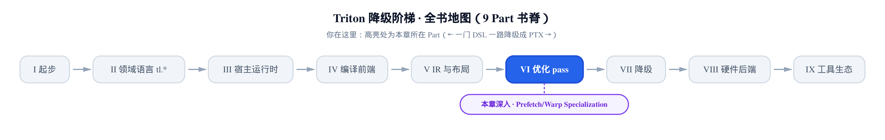
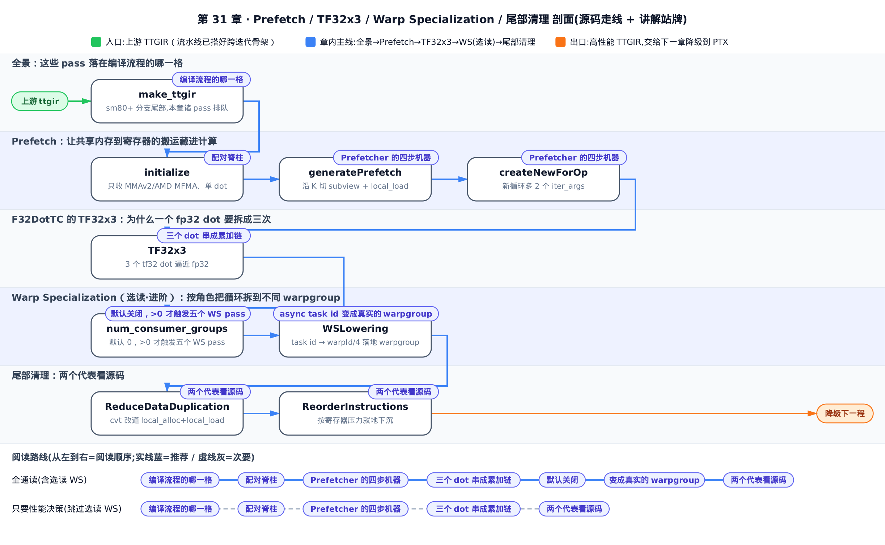
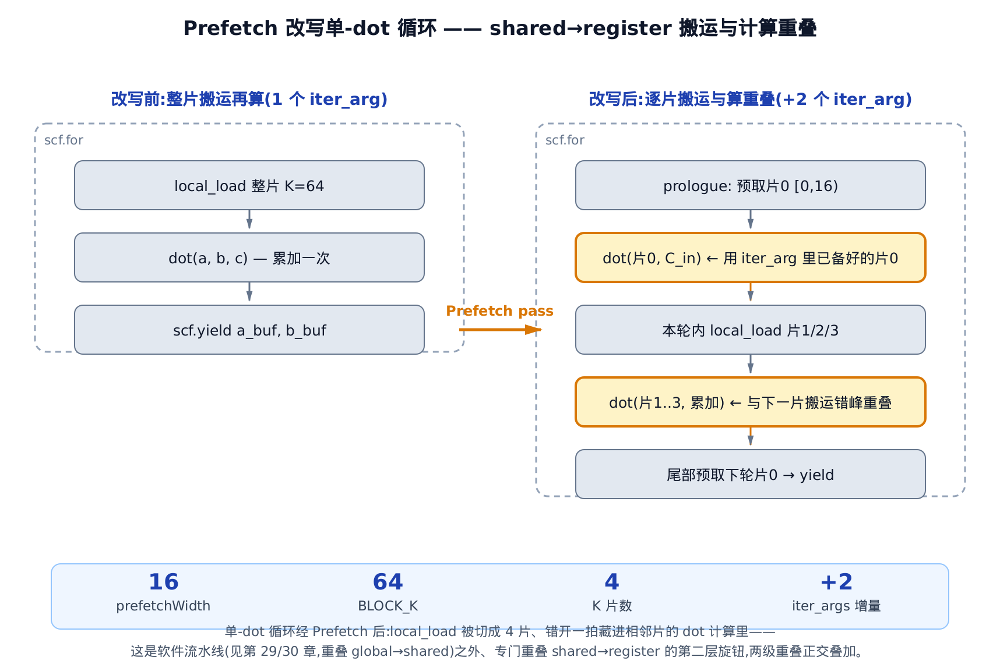
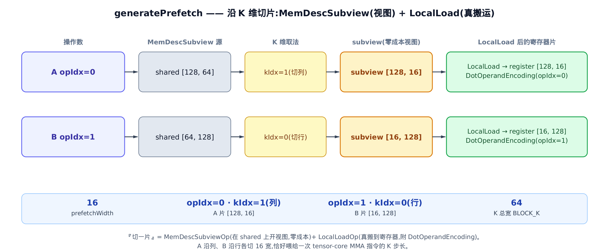
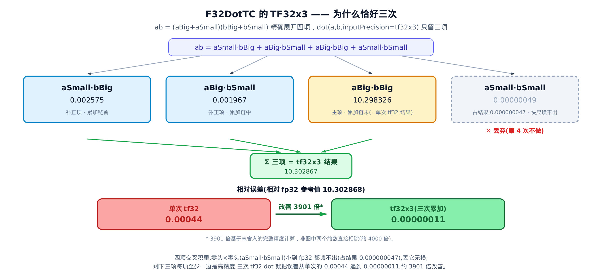
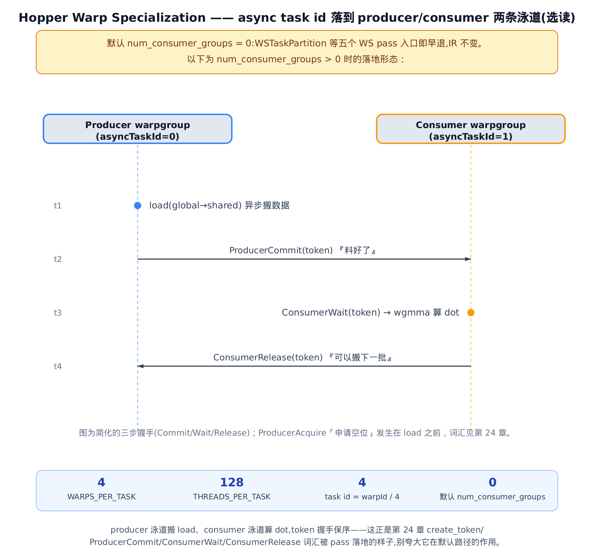

# Prefetch、Warp Specialization 与杂项清理 pass——流水线之外的进阶重叠旋钮



> 上一章把软件流水线（software pipelining）落成了真实 IR：`num_stages` 越大，环形缓冲越深、`global→shared` 的搬运越能藏进计算。
> 本章接着问：`shared→register` 这一段搬运，还能不能再藏一层？
> 下一章翻篇进第七部分——张量贴上布局之后，怎么一路降级成 PTX。

读到这里，你手里已经有了一把很重的性能扳手：软件流水线（见 [第 29 章](../../ch29-software-pipelining-primer/narrative/chapter.md) 的建模原理、[第 30 章](../../ch30-software-pipelining-landing/narrative/chapter.md) 的落地）把「从显存搬到共享内存」的延迟盖进了计算里。但一次 `tt.dot` 真正喂给 Tensor Core 之前，数据还要从共享内存再走一段到寄存器（`shared→register`，就是 [第 24 章](../../ch24-ttg-ttng-operations/narrative/chapter.md) 建立的 `local_load`）。这一段，软件流水线管不着——它盯的是跨迭代的异步拷贝，不是循环体内部 `local_load` 与 `dot` 的先后。

本章讲的 **Prefetch** pass（源码在 `lib/Dialect/TritonGPU/Transforms/Prefetch.cpp`），就是专门重叠这一段的第二层旋钮。它和软件流水线正交：一个藏 `global→shared`，一个藏 `shared→register`，两级重叠叠加。这是本章的性能命门。

顺带，本章还收尾三件散活儿，它们都排在软件流水线之后、共同把「朴素但正确的 IR」磨成「高性能 IR」：

- **F32DotTC 的 TF32x3**——把一个 fp32 的 `dot` 拆成 3 个 tf32 的 `dot` 逼近，用 3 倍 Tensor Core 吞吐换接近 fp32 的精度。为什么恰好三次，本章会算给你看。
- **Hopper Warp Specialization**（选读·进阶）——把循环按角色拆到不同 warpgroup，producer 专搬数据、consumer 专算 `dot`。它默认关闭，只在你显式打开 `num_consumer_groups` 时才触发，别高估它在默认路径的分量。
- **尾部一串轻量 layout 清理 pass**——`ReduceDataDuplication`、`ReorderInstructions` 等，点名 + 各挑一个代表看源码。

> 只想拿走能立刻用的性能决策，读到 Prefetch 与 TF32x3 两节即可；想把 Hopper 的进阶重叠也吃透，再往下读 Warp Specialization。尾部清理 pass 作背景知识，快速扫过即可。

作为第六部分「优化 pass」的收官，本章不引入新的降级台阶——它是在已经搭好的流水线骨架上，再叠几层重叠与清理。



只要性能决策，读完开篇全景后直接跳到「Prefetch」与「F32DotTC 的 TF32x3」两节，跳过 Warp Specialization 节；想连 Hopper 的进阶重叠也吃透，再按序读到底。

## 这些 pass 落在编译流程的哪一格

先给全景。Triton 的 NVIDIA 后端在 `make_ttgir`（构造带布局的 Triton GPU IR，即 TTGIR）里，把本章所有 pass 排在同一段队列末尾。看真实源码：

```python
# third_party/nvidia/backend/compiler.py:L231-L245
        if capability // 10 >= 8:
            passes.ttgpuir.add_optimize_accumulator_init(pm)
            passes.ttgpuir.add_combine_tensor_select_and_if(pm)
            passes.ttgpuir.add_ws_task_partition(pm, opt.num_consumer_groups)
            passes.ttgpuir.add_taskid_propagate(pm, opt.num_consumer_groups)
            passes.ttgpuir.add_ws_data_partition(pm, opt.num_consumer_groups)
            passes.ttgpuir.add_ws_code_partition(pm, opt.num_buffers_warp_spec, opt.num_consumer_groups,
                                                 opt.reg_dec_producer, opt.reg_inc_consumer)
            passes.ttgpuir.add_pipeline(pm, opt.num_stages)
            passes.ttgpuir.add_ws_lowering(pm, opt.num_consumer_groups)
        passes.ttgpuir.add_prefetch(pm)
        passes.ttgpuir.add_optimize_dot_operands(pm, capability >= 80)
        passes.ttgpuir.add_remove_layout_conversions(pm)
        passes.ttgpuir.add_reduce_data_duplication(pm)
        passes.ttgpuir.add_reorder_instructions(pm)
```

三件事一眼可读：

1. **全在 `capability // 10 >= 8` 分支里**——`capability`（GPU 算力，如 80 表示 sm80/Ampere）除以 10 取整 ≥ 8，即 sm80 及以上才有 Tensor Core 的 tf32 与异步能力，这些优化才有意义。
2. **`add_pipeline`（软件流水线）在前，`add_prefetch` 恒在其后**——这就坐实了 Prefetch 是「流水线之外再叠一层」：先让流水线搭好跨迭代骨架，Prefetch 再在骨架内做片级重叠。
3. **五个 WS pass 全部受 Warp Specialization 的旋钮门控**——它们是 `add_ws_task_partition`、`add_taskid_propagate`、`add_ws_data_partition`、`add_ws_code_partition`、`add_ws_lowering`（注意字面只有四个带 `ws_` 前缀，`add_taskid_propagate` 是没前缀的第五个）。`num_consumer_groups` 是 Warp Specialization 的总开关，默认 0；下面会看到，这五个 pass 入口都在相关旋钮为 0 时早退（四个直接看 `num_consumer_groups`，`add_ws_code_partition` 看的是它另一个形参 `num_buffers_warp_spec`——也默认 0，门控节细讲），所以默认路径里它们形同不存在。**夹在它们中间的 `add_pipeline` 是个例外**：它只吃 `opt.num_stages`（软件流水线的级数，默认 3，见上一章），与 `num_consumer_groups` 毫无关系——它排在 WS pass 中间只是流程顺序使然（流水线要在 WS 分好 task id 之后才跑），但默认路径里它照常把跨迭代骨架搭好、绝不早退。所以「形同不存在」只对五个 WS pass 成立，`add_pipeline` 不在其列。（`add_ws_code_partition` 末尾那两个实参 `reg_dec_producer` / `reg_inc_consumer` 控制 producer/consumer 两个 warpgroup 之间的寄存器配额再分配——producer 让出寄存器、consumer 拿到更多，细节超出本章范围。）

`add_optimize_accumulator_init`（累加器初始化优化）和 `add_combine_tensor_select_and_if`（合并 tensor select 与 if）不在本章范围、此处略过——它们和下面五个 WS pass 挂同一 capability 分支，但各自逻辑与本章主题（重叠 / 精度折中 / 清理）无关。

`add_optimize_dot_operands`（`OptimizeDotOperands`，把 dot 操作数的 convert 挪到成本更低的位置）已在 [第 28 章](../../ch28-accelerate-matmul-layout-opt/narrative/chapter.md) 讲过，这里不重复。剩下的 `add_reduce_data_duplication`、`add_reorder_instructions` 放到本章末尾看代表。

下面从本章的主角 Prefetch 开始。

## Prefetch：让共享内存到寄存器的搬运藏进计算

### 直觉：流水线上的工人不等整箱到齐才开工

想象流水线上的一个工位：算一次 `dot` 要沿 K 维分好几拍，每拍先把一片数据从货架（共享内存）搬到工作台（寄存器），再让 Tensor Core 算。朴素写法是每拍「先搬满整片 K，再算」，搬和算严格串行——算的时候搬运单元闲着，搬的时候 Tensor Core 闲着。

Prefetch 的手法，就是老练工人的直觉：**上一道工序快收尾时，先把下一箱的头几件递到手边**。算本片 K 时，下一片「从货架搬到工作台」已经在路上；搬运的等待，被藏进了相邻片的 Tensor Core 计算里。

要做到这一点，pass 得改写整个循环：循环外先预取第一片，循环内一边算本片、一边把下一片 `local_load` 发出去，靠**额外的 `iter_args`**（loop-carried 变量，见 [第 30 章](../../ch30-software-pipelining-landing/narrative/chapter.md)）把预取好的片跨迭代传下去。注意这里和软件流水线用 `iter_args` 是**同一手法、不同目的**：流水线用它传异步拷贝的 token 和游标来藏 `global→shared`，Prefetch 用它传寄存器里的预取片来藏 `shared→register`。

下图把改写前后的循环并排画出来：



### 机制：一次 dot 沿 K 维怎么被切开、错峰

用一组小到能心算的参数走一遍。设一次 `dot` 的 K 维块大小 `BLOCK_K = 64`，操作数是 fp16。后面会看到 pass 据此把每片宽度 `prefetchWidth` 定成 16，于是整片 K 被切成 `64 / 16 = 4` 片。

下表逐片追踪：每一片什么时候 `local_load`（从共享内存搬到寄存器），对应哪一次 sub-dot，和谁重叠。看「重叠对象」这一列——除了第一片，每片的搬运都压在前一片的计算上。

<!-- trace: prefetch-loop-rewrite -->

| K 片 | K 区间 | 本片 local_load 时机 | dot 动作（累加输入） | 重叠对象 |
|---|---|---|---|---|
| 片0 | [0, 16) | 上一轮末尾已预取，存于 iter_arg `%a_prefetch_arg` / `%b_prefetch_arg` | firstDot(片0, C_in) | 无需等待，进循环即算 |
| 片1 | [16, 32) | 本轮体内 subview + local_load | dot(片1, 累到 firstDot) | 片1 的搬运 与 firstDot 的计算重叠 |
| 片2 | [32, 48) | 本轮体内 subview + local_load | dot(片2, 累到片1) | 片2 搬运 与 片1 dot 重叠 |
| 片3 | [48, 64) | 本轮体内 subview + local_load | dot(片3, 累到片2) | 片3 搬运 与 片2 dot 重叠 |
| 下轮片0 | 下一轮 [0, 16) | 本轮体尾预取 → 塞进 yield | 供下一轮 firstDot 用 | 下轮首片搬运 藏在本轮尾 |

读法：第一片（片0）进循环就能算，因为它在**上一轮循环的末尾**已经被预取好、塞进了 `iter_args`——这正是表格最后一行做的事，本轮尾部再预取一片喂下一轮。中间三片（片1/2/3）在本轮体内即搬即算，每片的搬运都和前一片的 `dot` 错开一拍。于是整条链上，`shared→register` 的延迟几乎都被 Tensor Core 的计算盖住了。

两点说明。其一，表里的 `firstDot` 是本表自造的讲解标签、不是源码标识符，专指循环体内第一个吃 `%a_prefetch_arg` 的那个 `dot`；带 `%` 的名字（`%a_prefetch_arg`、`%a_tmp_rem` 等）才是下面源码引文里能逐字查到的原文。其二，有个边界要摘出来说：循环**第一次**执行时的片0 并非来自「上一轮」——那一刻还没有上一轮——而是来自循环外 `emitPrologue` 那次预取（下面源码小节会看到它就是循环外调一次 `generatePrefetch(isPrologue=true)`）；从第二轮起，表格这行说的「上一轮末尾」才真正成立。

### 不变量：切开之后，数值还等价吗

重写循环最怕改错语义。这里要证两件事：**切片不重不漏、累加结果与原来的单个整-K `dot` 逐位等价**；**循环体内的 sub-dot 数目有限**。

先看覆盖。每片按 `prefetchWidth = 16` 的步长连续拼接：[0,16)、[16,32)、[32,48)、[48,64)，无缝铺满 [0,64)，不重不漏。累加链是 `C_in → 片0 → 片1 → 片2 → 片3`，即

```math
C_{\mathrm{out}} = C_{\mathrm{in}} + \sum_{k=0}^{3} a_k \cdot b_k
```

而右边那个和，正是原来单个整-K `dot` 展开的 $`\sum_k a_k \cdot b_k`$。切片只是把一次大矩阵乘拆成沿 K 维的分块求和——这在数学上是 K 维求和的结合律，逐块累加与整块一次算的结果相等。故数值等价。

再看有限性。设循环体内待处理的剩余 K 宽为 `kRem`，从 `BLOCK_K - prefetchWidth = 48` 出发；每轮 `kOff += prefetchWidth`、`kRem -= prefetchWidth`。这是一个严格递减的非负整数序列，到 `kRem == 0` 停。有限步必终止，循环体内 sub-dot 数恰为 `BLOCK_K / prefetchWidth = 4`。切开不会引入无界展开。

### 源码：Prefetcher 的四步机器

Prefetch 的实现是一个叫 `Prefetcher` 的类，对循环里**单个** `dot` 做四步：筛选并回溯源（`initialize`）→ 循环外预取首片（`emitPrologue`）→ 重建带额外 `iter_args` 的新循环（`createNewForOp`）→ 而「切一片」这个原子操作由 `generatePrefetch` 完成。

上面是 pass 的**执行**顺序；下面**讲解**顺序反过来——先把最原子的 `generatePrefetch`（切一片）讲透，再到 `createNewForOp`（重建循环），`initialize`（筛选与接纳判断）留到最后一节「配对脊柱」单讲。`emitPrologue` 不另开小节：它就是循环外调一次 `generatePrefetch(isPrologue=true)` 预取首片，这个用法在讲 `generatePrefetch` 的 `isPrologue` 参数时就会点到。

pass 顶部的 doc 注释已经把整个 IR 变换画成了「改写前 → 改写后」，直接读它最省事：

```cpp
// lib/Dialect/TritonGPU/Transforms/Prefetch.cpp:L1-L27
//===----------------------------------------------------------------------===//
//
// This pass tries to prefetch operands (a and b) of tt.dot.
// Those ConvertLayoutOps will be lowered to shared memory loads.
//
// For example:
// %a: tensor<128x32xf16, #enc>
// scf.for %iv = ... iter_args(%a_arg = %a, ...) {
//   %d = tt.dot %a_arg, %b, %c
//   ...
//   scf.yield %a_next, ...
// }
//
// will be translated to
//
// %a: tensor<128x32xf16, #enc>
// %a_tmp = tensor.subview %a[0, 0] [128, 16]
// %a_prefetch = triton_gpu.local_load %a_tmp
// scf.for %iv = ... iter_args(%a_buf = %a, ..., %a_prefetch_arg = %a_prefetch)
// {
//   %x = tt.dot %a_prefetch_arg, %b, %c
//   %a_tmp_rem = tensor.subview %a_buf[0, 16] [128, 16]
//   %a_prefetch_next = triton_gpu.local_load %a_tmp_rem
//   ...
//   scf.yield %next_a, ..., %a_prefetch_next
// }
//===----------------------------------------------------------------------===//
```

对照看：改写前循环里 `%a_arg` 是整片；改写后循环签名多出一个 `%a_prefetch_arg`（就是那个额外 `iter_args`），`dot` 直接吃它；循环体内再切一个 `%a_tmp_rem = tensor.subview %a_buf[0, 16]`（从第 16 列起的剩余片）`local_load` 出 `%a_prefetch_next`，最后塞进 `scf.yield`。这张注释就是上面那张改写前后图的源码版。

**「切一片」怎么落成 IR**。核心是 `generatePrefetch`：给一个共享内存操作数，沿 K 维切出 `prefetchWidth` 宽的一片。

```cpp
// lib/Dialect/TritonGPU/Transforms/Prefetch.cpp:L112-L150
Value Prefetcher::generatePrefetch(Value v, unsigned opIdx, bool isPrologue,
                                   Attribute dotEncoding, OpBuilder &builder,
                                   std::optional<int64_t> offsetK,
                                   std::optional<int64_t> shapeK) {
  // opIdx: 0 => a, 1 => b
  auto type = cast<triton::MemDescType>(v.getType());
  SmallVector<int64_t> shape{type.getShape().begin(), type.getShape().end()};
  SmallVector<int64_t> offset{0, 0};
  Type elementType = type.getElementType();

  // k => (prefetchWidth, k - prefetchWidth)
  int64_t kIdx = opIdx == 0 ? 1 : 0;

  offset[kIdx] = isPrologue ? 0 : prefetchWidth;
  shape[kIdx] = isPrologue ? prefetchWidth : (shape[kIdx] - prefetchWidth);

  if (shapeK)
    shape[kIdx] = *shapeK;
  if (offsetK)
    offset[kIdx] = *offsetK;

  SmallVector<Value> offsetsVal;
  for (int64_t off : offset)
    offsetsVal.push_back(
        builder.create<arith::ConstantIntOp>(v.getLoc(), off, 32));
  Value newSmem = builder.create<triton::gpu::MemDescSubviewOp>(
      v.getLoc(),
      triton::MemDescType::get(shape, elementType, type.getEncoding(),
                               type.getMemorySpace()),
      v, offsetsVal);

  auto dotOperandEnc = triton::gpu::DotOperandEncodingAttr::get(
      builder.getContext(), opIdx, dotEncoding, prefetchWidth / 8);
  Value prefetchSlice = builder.create<triton::gpu::LocalLoadOp>(
      v.getLoc(), RankedTensorType::get(shape, elementType, dotOperandEnc),
      newSmem);

  return prefetchSlice;
}
```

两个 op 是关键：

- `MemDescSubviewOp`——在共享内存的内存描述符（memdesc，见 [第 24 章](../../ch24-ttg-ttng-operations/narrative/chapter.md)）上开一个子视图。它零成本：只是圈出「货架上要拿的那一格」，不搬数据。`kIdx` 决定切哪一维：`opIdx == 0`（操作数 A）时 `kIdx = 1`（切列），`opIdx == 1`（操作数 B）时 `kIdx = 0`（切行）——因为 A 的 K 维是列、B 的 K 维是行。
- `LocalLoadOp`——真把这一格从共享内存搬到寄存器（`shared→register`），并附上 `DotOperandEncodingAttr`（dot 操作数的布局，见 [第 27 章](../../ch27-tensor-core-mma-layout/narrative/chapter.md)），让 Tensor Core 认得。Prefetch 要重叠的，就是这一步的延迟。

`isPrologue` 控制取哪一片：为 `true` 时取首片 `[0, prefetchWidth)`（循环外预取用），否则取剩余片 `[prefetchWidth, k)`。下图把 A、B 两个操作数「切一片」的两步流程摆出来：



**「切多宽一片」的旋钮**。`prefetchWidth` 不是随便定的——它要对齐 Tensor Core 的 MMA 指令 K 步长才划算：

```cpp
// lib/Dialect/TritonGPU/Transforms/Prefetch.cpp:L233-L242
    // works better with nvidia tensor cores
    unsigned elementWidth = aType.getElementTypeBitWidth();
    if (aKWidth == 0)
      prefetchWidth = 256 / elementWidth;
    else
      prefetchWidth = 8 * aKWidth;

    // Skip prefetching if kSize is less than prefetchWidth
    if (kSize < prefetchWidth)
      continue;
```

`aKWidth`（操作数 A 的 `DotOperandEncoding` 里那个 `kWidth`，每线程沿 K 连续存的元素数）为 0 时按 `256 / elementWidth` 算：fp16 的 `elementWidth = 16`，得 `256 / 16 = 16`——这正是前面 worked example 里 `prefetchWidth = 16` 的来源。否则按 `8 * kWidth`。最后一道保险：K 维总宽 `kSize`（就是前面 worked example 里的 `BLOCK_K`，那组参数下等于 64）比 `prefetchWidth` 还小就直接跳过不预取——K 太小分片没收益反增开销。

**重建新循环**。`createNewForOp` 的开头就是那个「多出 2 个 `iter_args`」的动作：

```cpp
// lib/Dialect/TritonGPU/Transforms/Prefetch.cpp:L289-L299
  SmallVector<Value> loopArgs;
  for (auto v : forOp.getInitArgs())
    loopArgs.push_back(v);
  for (triton::DotOp dot : dots) {
    loopArgs.push_back(operand2headPrefetch[dot.getA()]);
    loopArgs.push_back(operand2headPrefetch[dot.getB()]);
  }

  auto newForOp = builder.create<scf::ForOp>(
      forOp.getLoc(), forOp.getLowerBound(), forOp.getUpperBound(),
      forOp.getStep(), loopArgs);
```

新循环的 init 参数 = 旧循环全部 `initArgs` + 每个 `dot` 追加 A/B 两个「头预取片」。一个 dot、A 和 B 各一片，所以正好 **多出 2 个** `iter_args`——图底部信息条里那个「+2」就是这么来的。这两个头预取片，来自 `emitPrologue` 在循环外用 `generatePrefetch(isPrologue=true)` 预取的首片。

**末尾预取下一轮首片**。循环体尾部，把 dot 的 yield 操作数（下一轮的完整片）再切一个 prologue 首片、`local_load` 出来，追加进新 `yield`：

```cpp
// lib/Dialect/TritonGPU/Transforms/Prefetch.cpp:L392-L411
  // prefetch next iteration
  SmallVector<Value> yieldValues;
  for (Value v : forOp.getBody()->getTerminator()->getOperands())
    yieldValues.push_back(mapping.lookupOrDefault(v));
  for (triton::DotOp dot : dots) {
    Attribute dotEncoding = dot.getType().getEncoding();
    Value aToYield = generatePrefetch(mapping.lookup(dot2aYield[dot]), 0, true,
                                      dotEncoding, builder);
    cloneElementwiseOps(aToYield, dot2aVals[dot], builder);
    yieldValues.push_back(aToYield);
    // bToYield
    Value bToYield = generatePrefetch(mapping.lookup(dot2bYield[dot]), 1, true,
                                      dotEncoding, builder);
    cloneElementwiseOps(bToYield, dot2bVals[dot], builder);
    yieldValues.push_back(bToYield);
  }
```

于是下一轮进来，寄存器里已经有备好的首片可用——首片的搬运被藏在了本轮计算之后。这就闭合了整个错峰链。

### 配对脊柱：通用 pass 怎么接纳第三方的 MMA 编码

回到四步机器的第一步 `initialize`。之所以给它起「配对脊柱」这个名字：它是整条重写逻辑的脊梁——所有「循环里这一对 dot 操作数该不该配上 prefetch 改写」的准入判断都收束在这一步，认哪几种 MMA 编码、在这里一锤定音，下面几百行重写代码都建立在它点头之后。它是循环重写的入口筛选，其中有一处特别值得停一下——它同时接受两种 `dot` 结果编码：

```cpp
// lib/Dialect/TritonGPU/Transforms/Prefetch.cpp:L159-L179
  SmallVector<triton::DotOp> dotsInFor;
  for (Operation &op : *loop)
    if (auto dotOp = dyn_cast<triton::DotOp>(op)) {
      // Only accepts dotOps encoded as Nvidia MMA v2 or AMD MFMA
      auto dstMmaEnc =
          dyn_cast<NvidiaMmaEncodingAttr>(getEncoding(dotOp.getResult()));
      auto dstMfmaEnc =
          dyn_cast<AMDMfmaEncodingAttr>(getEncoding(dotOp.getResult()));
      if (!dstMfmaEnc && (!dstMmaEnc || dstMmaEnc.getVersionMajor() != 2))
        // Don't rewrite if any other type is found.
        return failure();
      dotsInFor.push_back(dotOp);
    }

  if (dotsInFor.empty())
    return failure();

  // TODO: segfault (original for still has uses)
  // when used in flash attention that has 2 dots in the loop
  if (dotsInFor.size() > 1)
    return failure();
```

`NvidiaMmaEncodingAttr` 是 NVIDIA Tensor Core 的矩阵乘加布局（`versionMajor == 2` 即 Turing/Ampere 的 mma.sync 那一代，见 [第 27 章](../../ch27-tensor-core-mma-layout/narrative/chapter.md)）；`AMDMfmaEncodingAttr` 是 AMD 显卡上 MFMA（Matrix Fused Multiply-Add，AMD 的矩阵乘加指令）的对应布局。Prefetch 对两者一视同仁——只要 `dyn_cast` 命中其中之一就接纳。

这是「**第三方 MMA 编码挂进通用 pass**」的现成范例：Prefetch 的循环重写逻辑与具体硬件无关，一个第三方后端想复用整条 prefetch，只需在这里加一句 `dyn_cast` 认出自家的 MMA 编码即可，不必碰下面几百行重写代码。本书的姊妹篇（在昇腾平台上重写 Triton 后端）挂自己那套 MMA 编码，走的正是这条口子——一句 `dyn_cast` 接进来，通用重叠逻辑白拿。

外加两条保守约束：不是这两种编码之一直接 `failure`（不乱改）；循环里多于一个 `dot` 也 `failure`——源码 TODO 直陈原因：flash-attention 那种循环里两个 `dot` 会导致旧循环仍有 use，`erase` 时 segfault。宁可早退不做，也不冒正确性的险。

## F32DotTC 的 TF32x3：为什么一个 fp32 dot 要拆成三次

### 直觉：用快尺量微米，量三遍就够

Tensor Core 的 tf32（TensorFloat-32，砍掉尾数低位、只留 10 bit 尾数的浮点，见 [第 8 章](../../ch08-dot-reduce-scan/narrative/chapter.md) 的 tf32/ieee 两档精度）跑得快，但精度不如 fp32（23 bit 尾数）。想在 Tensor Core 上算出接近 fp32 的结果，`inputPrecision == tf32x3` 这一档用了个漂亮的技巧。

打个比方：一把只读得到毫米刻度的快尺（tf32），去量微米级的长度（fp32）。技巧是——先量个大概（主体 × 主体）；再用同一把快尺，单独去量「刚才量漏的零头」——零头 × 主体、主体 × 零头两笔补正；至于零头 × 零头，小到快尺根本读不出，干脆不量。三次快量加起来，精度逼近真值，而每次用的还是那把快尺（Tensor Core 的 tf32 通路）。

### 机制：四项交叉积，为什么只留三项

把一个 fp32 数 `a` 拆成高位 `aBig`（tf32 能精确表示的部分）和残差 `aSmall = a - aBig`；`b` 同理拆成 `bBig + bSmall`。那么精确乘积展开有四项：

```math
a \cdot b = (a_{\mathrm{Big}} + a_{\mathrm{Small}})(b_{\mathrm{Big}} + b_{\mathrm{Small}}) = a_{\mathrm{Big}} b_{\mathrm{Big}} + a_{\mathrm{Big}} b_{\mathrm{Small}} + a_{\mathrm{Small}} b_{\mathrm{Big}} + a_{\mathrm{Small}} b_{\mathrm{Small}}
```

关键在量级。残差 $`|a_{\mathrm{Small}}| \sim 2^{-10}|a|`$、$`|b_{\mathrm{Small}}| \sim 2^{-10}|b|`$（tf32 尾数约 10 bit），所以：

- 前三项每项至少一边是高精度（`aBig` 或 `bBig`）——这里说的「残差」不是这一项本身的大小（如 `aBig·bBig` 本身和 `ab` 同量级，见下表 10.298326），而是这一项若单用 tf32 计算、被截断后引入的误差量级，约 $`2^{-20}|ab|`$，足够小、值得各用一次 tf32 `dot` 换来。
- 末项 $`a_{\mathrm{Small}} b_{\mathrm{Small}} \sim 2^{-20}|ab|`$ 再被 tf32 截断，实际贡献远低于 fp32 尾数末位——**丢弃无损**。

拿一组真实数值走一遍，看这四项的量级差多少。参数 `K = 4`，`a = [1.3, 2.7, 0.9, 3.14159]`，`b = [0.7, 1.1, 2.2, 1.41421]`，fp32 参考值是 10.302868。

<!-- trace: f32-dot-tc-tf32x3 -->

| 交叉项 | 数值 | 相对结果量级 | 处置（累加链位置） |
|---|---|---|---|
| aBig·bBig（主体 × 主体） | 10.298326 | 主体项 | 保留 · 累加链末（最后加，即单次 tf32 结果） |
| aSmall·bBig（零头 × 主体） | 0.002575 | 补正项 | 保留 · 累加链首（最先加） |
| aBig·bSmall（主体 × 零头） | 0.001967 | 补正项 | 保留 · 累加链中 |
| aSmall·bSmall（零头 × 零头） | 0.00000049 | 占结果 0.000000047 | 丢弃（量级低于 fp32 末位，快尺读不出） |

看数字就懂了：主项 10.298326 恰好是单次 tf32 `dot` 的结果——如果只算这一项，相对误差约 0.00044。补上两笔补正项（0.002575 和 0.001967），三项累加逼到 10.302867，与 fp32 参考值 10.302868 只差在小数点后第 6 位，相对误差降到约 0.00000011，约 **3901 倍改善**（3901 是用未四舍五入的完整精度相对误差算的；拿正文这两个约数 0.00044 与 0.00000011 直接相除会得到约 4000 倍，量级一致，差异只来自约数本身的舍入）。而被丢弃的第四项只有 0.00000049，占结果的 0.000000047——比 tf32x3 剩余的总残差（约 0.00000011）还小。下图把这条「四项 → 留三丢一 → 求和 → 误差对比」的链画全：



### 不变量：补第四次 dot 收益为零

「只做三次、不做第四次」是无损的，这可以算清楚。三项之和等于 fp32 真值减去丢弃项 $`a_{\mathrm{Small}} b_{\mathrm{Small}}`$。而实测里丢弃项占结果 0.000000047，比 tf32x3 的总相对残差 0.00000011 还小——这说明剩余误差主要来自三个保留 `dot` 各自的 tf32 截断，**不是**来自丢弃项。既然丢弃项已经淹没在截断噪声之下，补第四次 `dot` 去算它，收益为零、白花一次 Tensor Core 吞吐。

还有一个细节是累加顺序。两笔补正项量级相近（都在 $`10^{-3}`$ 级，看上表是 0.002575 与 0.001967），谁先谁后对精度影响可忽略；真正要紧的是**主项 `aBig·bBig` 一定最后加**——浮点累加里把最大项留到最后、先让两个小量彼此加完，能减少舍入损失，这是免费的精度。

代价这边也要摆明：三次 tf32 `dot`，吞吐约为单次 tf32 的 1/3。但它仍远快于让硬件用 IEEE fp32 软件仿真去算——所以 TF32x3 是「拿 3 倍 tf32 吞吐、换接近 fp32 精度」的一档折中，autotuner 或用户在精度敏感又不想彻底退回慢路径时选它。

### 源码：守门 + 三个 dot 串成累加链

这个变换的出处不是论文，是 NVIDIA CUTLASS 社区的一个讨论帖（3xTF32 trick）。pass 顶部注释把算式定义得清清楚楚：

```cpp
// lib/Dialect/TritonGPU/Transforms/F32DotTC.cpp:L14-L22
// nb. We call the trick TF32x3 as C++ disallows varaibles starting with numbers
// Implement 3xTF32 trick https://github.com/NVIDIA/cutlass/discussions/385
// For a, b f32
// dot(a, b, inputPrecision="tf32x3") ->
//  let aBig = f32ToTF32(a), aSmall = a - aBig;
//  let bBig = f32ToTF32(b), bSmall = b - bBig;
//  dot(aSmall, bBig, inputPrecision="tf32") +
//  dot(aBig, bSmall, inputPrecision="tf32") +
//  dot(aBig, bBig, inputPrecision="tf32")
```

`TF32x3` 这个名字的来历有点好笑：C++ 不允许变量名以数字开头，所以「3xTF32」写不了，只好倒过来叫 `TF32x3`。落地逻辑是一个 `OpRewritePattern<DotOp>`：

```cpp
// lib/Dialect/TritonGPU/Transforms/F32DotTC.cpp:L34-L81
    if (!(dotOp.getInputPrecision() == InputPrecision::TF32x3 &&
          isF32(dotOp.getA()) && isF32(dotOp.getB()))) {
      return failure();
    }

    // Aux functions
    auto f32ToTF32 = [&](Value value) -> Value {
      return rewriter
          .create<ElementwiseInlineAsmOp>(dotOp.getLoc(), value.getType(),
                                          "cvt.rna.tf32.f32 $0, $1;", "=r,r",
                                          /*isPure=*/true, /*pack=*/1,
                                          ArrayRef<Value>{value})
          .getResult()[0];
    };
    auto dot = [&](Value a, Value b, Value c) -> Value {
      return rewriter.create<DotOp>(dotOp->getLoc(), c.getType(), a, b, c,
                                    InputPrecision::TF32,
                                    dotOp.getMaxNumImpreciseAcc());
    };

    auto aBig = f32ToTF32(dotOp.getA());
    auto aSmall = sub(dotOp.getA(), aBig);

    auto bBig = f32ToTF32(dotOp.getB());
    auto bSmall = sub(dotOp.getB(), bBig);

    auto zero = zeroLike(dotOp.getC());

    auto dot1 = dot(aSmall, bBig, zero);
    auto dot2 = dot(aBig, bSmall, dot1);
    auto dot3 = dot(aBig, bBig, dot2);

    auto sum = add(dot3, dotOp.getC());

    rewriter.replaceOp(dotOp, sum);
    return success();
    // … 省略：zeroLike / add / sub 三个平凡的 arith 构造 lambda（上面已点明其作用）…
```

逐段对照直觉：

- **守门**：只有 `inputPrecision == TF32x3` 且 A、B 都是 f32 时才触发，否则 `failure` 原样放过。所以这是用户显式选的精度档，不是默认路径——默认 `dot` 的 input precision 是单次 tf32。
- **`f32ToTF32`**：一条 inline PTX 汇编 `cvt.rna.tf32.f32`（round-to-nearest 把 f32 截成 tf32 高位）取出 `aBig`；`aSmall = a - aBig` 就是残差。这就是比喻里「量个大概」和「量漏的零头」怎么来的。
- **三个 `dot` 串成累加链**：`dot1 = dot(aSmall, bBig, zero)` 起于 0，`dot2 = dot(aBig, bSmall, dot1)` 累到 dot1 上，`dot3 = dot(aBig, bBig, dot2)` 累到 dot2 上。顺序上两笔补正项先加、主项 `aBig·bBig` 压在最后——对上了前面「主项留到最后减舍入」的说法。四项里的 `aSmall*bSmall` 根本没出现，就是被丢弃的那一项。
- 最后 `+C` 补上原累加器，`replaceOp` 把原来那个 fp32 `dot` 换成这条链。

守门条件还叠了一层硬件前提：整段在 `make_ttgir` 的 sm80+ 分支里跑（前面全景那段的 `capability // 10 >= 8`），因为 tf32 Tensor Core 从 Ampere 起才有。

## Warp Specialization：按角色把循环拆到不同 warpgroup（选读·进阶）

> 这一节是选读的进阶旋钮。它默认关闭，只在 Hopper（sm90）上、且你显式设 `num_consumer_groups > 0` 时才触发。想先拿走能立刻用的性能决策，可以跳过本节。

### 直觉：把车间分成搬运班和加工班

[第 24 章](../../ch24-ttg-ttng-operations/narrative/chapter.md) 建立过 warp specialization（warp 专化）的词汇：把一个 warpgroup（Hopper 上 4 个 warp、128 线程，作为一个 wgmma 矩阵乘单元调度）里不同的 warp 分派到不同角色，producer 专搬数据、consumer 专算 `dot`，用一套 token 握手词汇做流控：`create_token` 建交接牌，`ProducerAcquire`/`ProducerCommit` 是生产端「申请空位 / 提交『料好了』」，`ConsumerWait`/`ConsumerRelease` 是消费端「等牌开算 / 用完回牌」。那一章讲的是词汇；本章讲这套词汇**怎么被 pass 落地**。

比喻还是那个车间：分成「搬运班」和「加工班」两班人（两个 warpgroup），各占一片工位。搬运班只管把料从仓库（global/shared）搬到工位，加工班只管开机床（wgmma）算；两班用交接牌（token）对暗号——搬运班放牌「料好了」，加工班等到牌才动、用完回牌「可以搬下一批」。两班并行，搬与算就重叠到了 warpgroup 粒度。

下图把这条握手时序画成两条泳道：



### 门控：默认关闭，>0 才触发五个 WS pass

这是本节最重要的一句话，别搞错它的分量。前面全景里那五个 WS pass 都受 Warp Specialization 的旋钮门控，但触发它们的具体变量并不完全相同：`WSTaskPartition`、`TaskIdPropagate`、`WSDataPartition`、`WSLowering` 四个在入口处直接对 `num_consumer_groups == 0` 早退；`WSCodePartition` 是例外——它早退看的是自己的另一个形参 `num_buffers_warp_spec == 0`（就是全景代码里 `add_ws_code_partition` 的第一个实参，见 `third_party/nvidia/backend/compiler.py:L96`，同样默认 0）；它的入口守卫写作 `if (numBuffers == 0) return;`（`numBuffers` 即 `num_buffers_warp_spec`，见 `lib/Dialect/TritonGPU/Transforms/WSCodePartition.cpp:L2166-2169`），和上面四棒查的变量名不同、但同样是「旋钮为 0 就早退」。两个旋钮默认都是 0，所以默认路径里五个 pass 仍然全部形同不存在，只是读它们的源码时别指望入口守卫都写着同一个变量名。夹在它们中间的 `add_pipeline` 则不在此列——它吃的是 `num_stages`，默认路径照常跑（见前文全景）。看第一棒 `WSTaskPartition`，它的守卫就是最典型的 `num_consumer_groups == 0` 那种：

```cpp
// lib/Dialect/TritonGPU/Transforms/WSTaskPartition.cpp:L126-L158
  // Annoate the program with task ids
  SmallVector<AsyncTaskId, 1> producerTaskIds{0};
  SmallVector<AsyncTaskId, 2> consumerTaskIds;
  for (unsigned i = 0; i < numConsumerGroups; ++i) {
    consumerTaskIds.push_back(i + producerTaskIds.size());
  }

  for (auto op : producerOps) {
    setAsyncTaskIds(op, producerTaskIds);
  }

  for (auto op : consumerOps) {
    setAsyncTaskIds(op, consumerTaskIds);
  }
  // … 省略：LLVM_DEBUG dump 块；下面是 pass 入口的早退守卫 …
  void runOnFuncOp(triton::FuncOp funcOp) {
    if (numConsumerGroups == 0)
      return;
    doPartition(funcOp, numConsumerGroups);
  }
```

`doPartition` 干的是分派 async task id（异步任务号，标记每个 op 属于哪个角色）：producer 固定 task 0，consumer 按 `num_consumer_groups` 摊到 task 1..N，把数据依赖里的 load 标成 producer、`dot` 标成 consumer。但 `runOnFuncOp` 入口一句 `if (numConsumerGroups == 0) return;`——默认 `num_consumer_groups = 0` 时，这个 pass 什么都不做直接返回，IR 原样不动。

默认值 0 就写在 NVIDIA 后端的编译选项里：

```python
# third_party/nvidia/backend/compiler.py:L97
        num_consumer_groups: int = 0
```

所以：**默认路径里五个 WS pass 全部早退、IR 完全不变**（软件流水线 `add_pipeline` 不在此列，它照常生效）。它是一个你要主动打开的 autotune 旋钮，不是每个 kernel 都在走的路。这也是为什么本节标「选读」——别把它当默认性能来源。

### 落地：async task id 变成真实的 warpgroup

如果真的开了 `num_consumer_groups > 0`，五个 WS pass 跑完之后，最后一棒 `WSLowering` 把抽象的 async task id 落成真实的 warpgroup id：

```cpp
// lib/Dialect/TritonGPU/Transforms/WSLowering.cpp:L39-L51
// Lower to use GetCanonicalWarpIdOp.
// In Hopper, each task is a warpgroup consisting of 4 warps.
static const int WARPS_PER_TASK = 4;
static const int THREADS_PER_TASK = 128;
void lowerGetAsyncTaskIdOp(Operation *parentOp, int numConsumerGroups) {
  // … 省略：walk lambda 的 OpBuilder 构造与尾部 erase …
    Value _4 = builder.create<arith::ConstantIntOp>(loc, WARPS_PER_TASK, 32);
    Value warpId = builder.create<ttng::GetCanonicalWarpIdOp>(loc);
    Value asyncTaskId = builder.create<arith::DivUIOp>(loc, warpId, _4);
    op.getResult().replaceAllUsesWith(asyncTaskId);
```

映射简单直接：Hopper 上每个 task = 一个 warpgroup = 4 个 warp（`WARPS_PER_TASK = 4`，`THREADS_PER_TASK = 128`），所以 `asyncTaskId = warpId / 4`。task 0 是 warp 0-3（producer warpgroup），task 1 是 warp 4-7（consumer warpgroup），以此类推。这就是 [第 24 章](../../ch24-ttg-ttng-operations/narrative/chapter.md) 那套 producer/consumer warpgroup 词汇在 IR 里最终的落地形态——一个整数除法，把「谁是搬运班、谁是加工班」钉死到 warp 编号上。中间那几棒（`TaskIdPropagate` 沿 def-use 把 task id 补全、`WSDataPartition`、`WSCodePartition` 建 token 并把每个 task specialize 成独立代码区）是把这套分工铺开的过渡，选读到此够用。

## 尾部清理：两个代表看源码

软件流水线和 Prefetch 之后，`make_ttgir` 还挂了几个轻量 layout 清理 pass，各修一处小账。它们不改算法、只调布局与调度，把峰值寄存器压下去、把冗余数据消掉。这里点名 + 挑两个代表看源码，其余作背景。

**`ReduceDataDuplication`——用一趟共享内存消寄存器冗余**。当一个 `ConvertLayoutOp`（布局转换）从 blocked 编码转到 dot-operand 编码时，会在寄存器里给每个线程冗余存一份数据。这个 pass 把它改道成「先写共享内存、再读回」：

```cpp
// lib/Dialect/TritonGPU/Transforms/ReduceDataDuplication.cpp:L34-L72
    mod.walk([&](triton::gpu::ConvertLayoutOp cvtOp) -> void {
      OpBuilder builder(cvtOp);
      auto srcType = cast<RankedTensorType>(cvtOp.getSrc().getType());
      auto dstType = cast<RankedTensorType>(cvtOp.getType());
      auto srcEncoding = srcType.getEncoding();
      if (isa<triton::gpu::SharedEncodingAttr>(srcEncoding))
        return;
      auto dstDotOp =
          dyn_cast<triton::gpu::DotOperandEncodingAttr>(dstType.getEncoding());
      if (!dstDotOp)
        return;
      if (!cvtNeedsSharedMemory(srcType, dstType))
        return;
      // … 省略：sharedOrder / tmpType 的构造（rank==3 的特殊排序是次要细节）…
      auto tmp = builder.create<triton::gpu::LocalAllocOp>(
          cvtOp.getLoc(), tmpType, cvtOp.getSrc());
      auto newConvert = builder.create<triton::gpu::LocalLoadOp>(cvtOp.getLoc(),
                                                                 dstType, tmp);
      cvtOp.replaceAllUsesWith(newConvert.getResult());
      cvtOp.erase();
    });
```

三道守门（源不是共享内存、目标是 dot-operand、且这个 cvt 确实需要共享内存）过了，就把 `cvtOp` 换成 `LocalAllocOp`（申共享内存并写入）+ `LocalLoadOp`（读回成 dot-operand 布局）。用一趟共享内存往返，换掉寄存器里那份重复数据——寄存器是比共享内存稀缺得多的资源，这笔交易值。

**`ReorderInstructions`——按寄存器压力就地下沉指令**。这个 pass 的判据核心是一个「哪些 op 会抬高寄存器压力」的谓词：

```cpp
// lib/Dialect/TritonGPU/Transforms/ReorderInstructions.cpp:L30-L40
static bool willIncreaseRegisterPressure(Operation *op) {
  if (isa<triton::gpu::LocalLoadOp>(op))
    return true;
  auto cvt = dyn_cast<triton::gpu::ConvertLayoutOp>(op);
  if (!cvt)
    return false;
  if (mlir::isa<triton::gpu::DotOperandEncodingAttr>(
          cvt.getType().getEncoding()))
    return true;
  return false;
}
```

`LocalLoadOp`（把数据搬进寄存器）和转成 dot-operand 布局的 `cvt` 都会占用寄存器。pass 据此把这类 op 尽量下沉到贴近使用点的位置（源码里有五组就地移动：下沉 cvt、alloc 贴 load、trans 贴定义、按 opIdx 排序 local_load 等），缩短这些值的活跃区间，削掉寄存器峰值。这是纯调度微调，不动语义。

同一批收尾 pass 里，还有几个只点名、不展开的：`OptimizeThreadLocality`（优化线程局部性）、`RemoveLayoutConversions`（消冗余布局转换）——它们都属同一类「把布局与调度磨顺」的收尾工。前面讲过的 F32DotTC，也是在同一段队列里、以同样「pattern 命中即改写」的方式工作的一员。

## 小结：两级重叠 + 一档精度折中

回到开篇那把扳手。学完本章，你对自己的 Triton 算子多了几个明确的性能决策：

- **Prefetch 是软件流水线之外的第二层重叠**，且默认就开——它把 `shared→register` 的 `local_load` 沿 K 维切成多片、错开一拍藏进相邻片的 `dot` 计算里。它和流水线的 `global→shared` 重叠正交叠加。你写 kernel 时能借它的力，但也要知道它的边界：只对循环里**单个** MMA v2 / MFMA 的 `dot` 生效，多个 `dot`（如 flash-attention）它会保守退出——这时那段 `shared→register` 延迟就得靠别的手段藏。
- **TF32x3 是一档精度/速度折中**：`inputPrecision="tf32x3"` 把一个 fp32 `dot` 拆成 3 个 tf32 `dot`，相对误差从单次 tf32 的约 0.00044 逼到约 0.00000011，代价是 3 倍 tf32 吞吐。精度敏感又不想退回慢路径时，这是你手里的中间档。
- **Warp Specialization 默认关闭**——它是 Hopper 上 `num_consumer_groups > 0` 才触发的进阶旋钮，把循环拆到 producer/consumer 两条 warpgroup。默认路径里它完全不动 IR，别把它当成免费的默认加速。
- **尾部清理 pass 帮你削寄存器、消冗余**——`ReduceDataDuplication.cpp`、`ReorderInstructions.cpp` 这些大多在背后自动生效，理解它们的存在能帮你读懂 TTGIR 里为什么会冒出 `local_alloc + local_load` 这类看似多余的往返。

到这里，第六部分「优化 pass」讲完了：从贴布局、加速 matmul、软件流水线，到本章的片级重叠与清理，一个朴素但正确的 TTGIR 已经被磨成了高性能 TTGIR。

但它终究还是带布局的张量 IR，离机器能跑的 PTX 还隔着好几级台阶。[下一章](../../ch32-five-stages-ttir-to-ttgir/narrative/chapter.md) 翻篇进第七部分「降级」，从五级台阶的全景和第一跳 TTIR→TTGIR 讲起——看每个张量是怎么被贴上布局、`tt.dot` 那两个操作数又是怎么被强制变成 DotOperand 并插进 convert_layout 胶水的。
