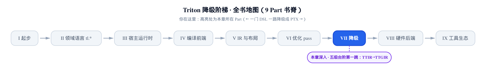
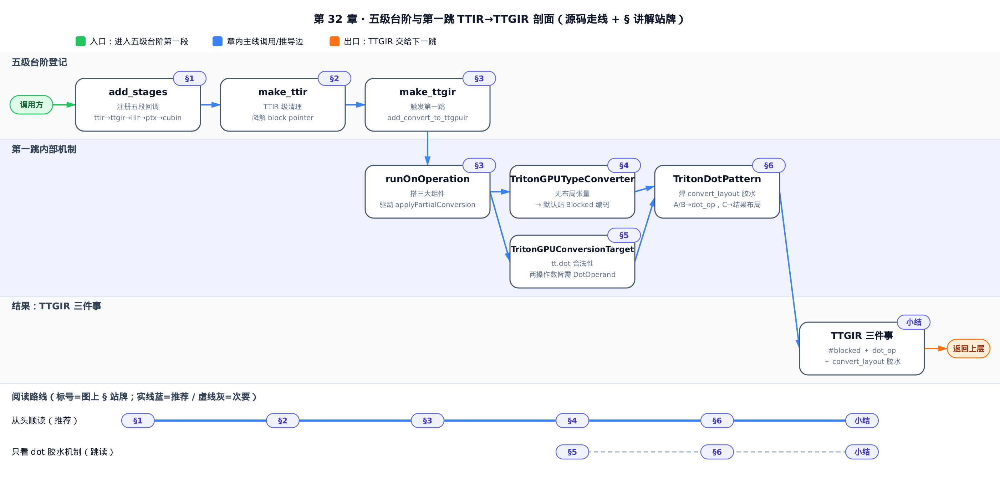
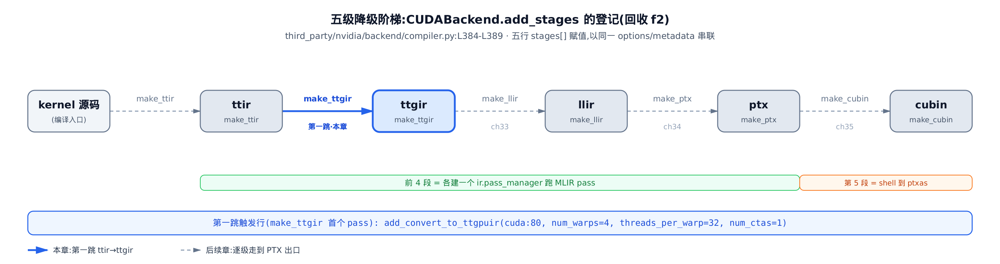
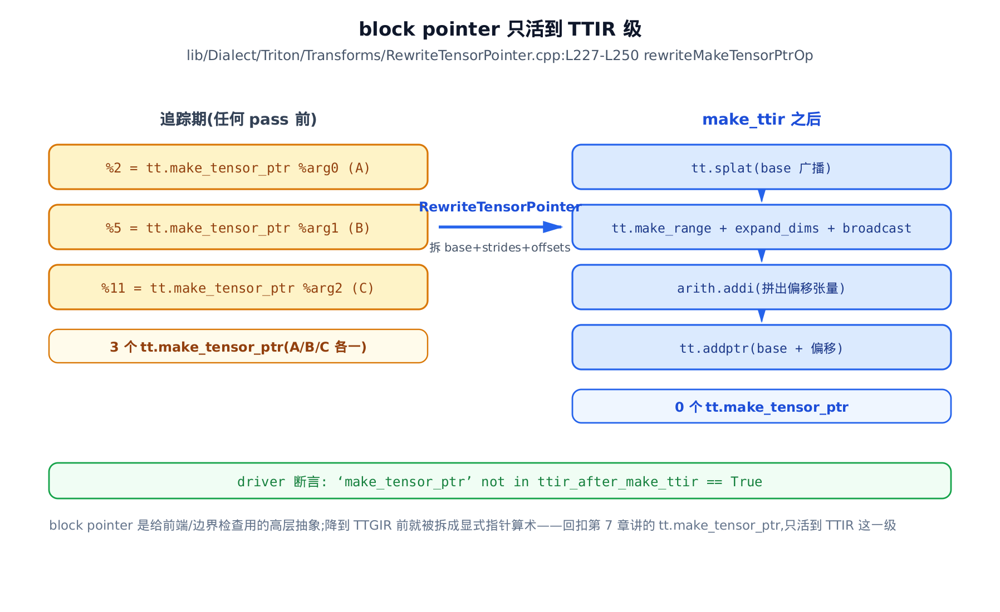
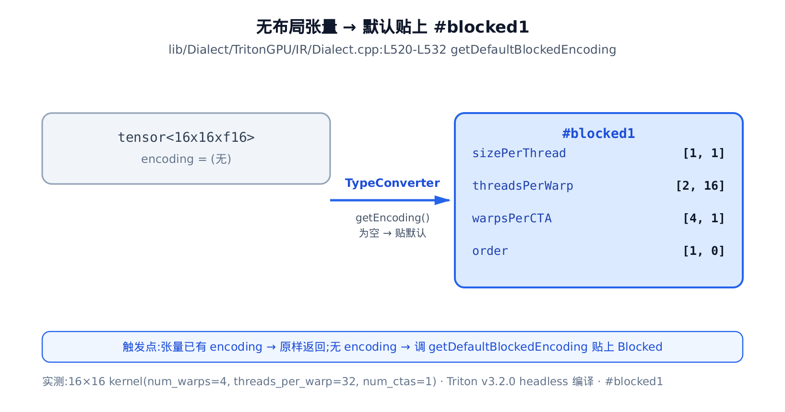
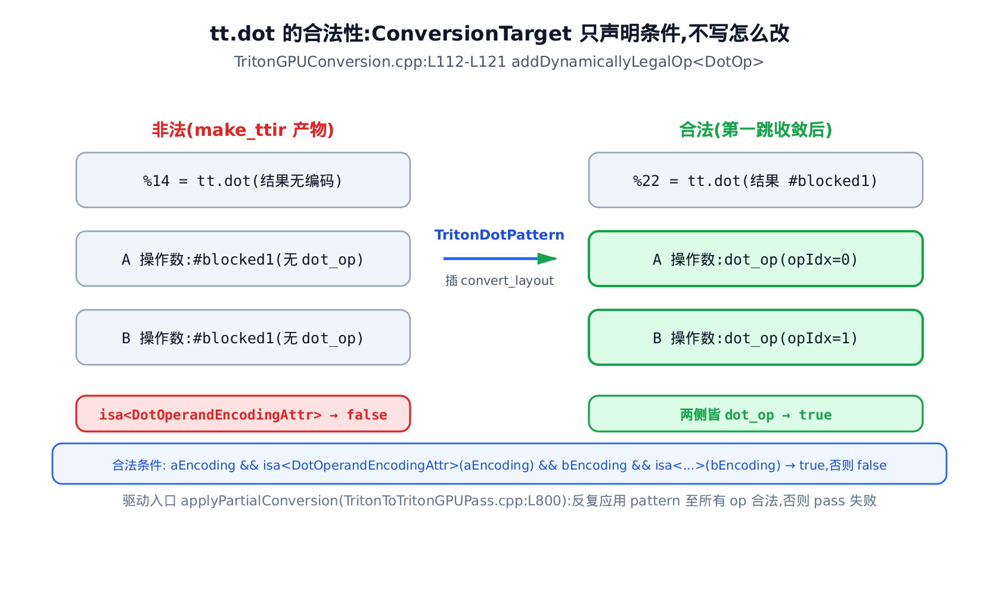
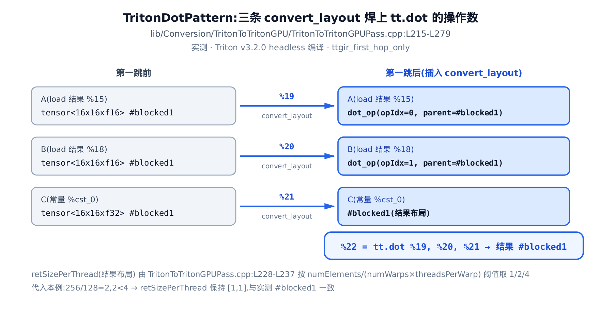

# 五级台阶与第一跳 TTIR→TTGIR：给每个张量贴上布局

> **你在这里**：全书是一门 DSL 一路降到 PTX 的旅程，现在走进「降级」这一部分。
> 上一部分把 TTGIR 上的优化 pass 逐个拆开看了个遍。
> 本章退一步，先给出五级降级台阶的全貌，再正式走第一跳 TTIR→TTGIR。
> 接下来几章顺着台阶往下，一直走到 PTX 出口。



你已经会读 TTGIR（Triton GPU IR，给张量贴上布局之后的第二级中间表示，方言前缀 `#triton_gpu`）了：满屏的 `#blocked`、`tt.dot` 两边裹着一圈 `convert_layout`。但你有没有问过——**这些东西是从哪一步冒出来的？** 谁给每个张量贴上了 `#blocked`？为什么 `tt.dot` 周围总长着那圈 `convert_layout` 胶水？

这一章要解锁的性能杠杆，就是**读 TTGIR 定位布局问题的看图起点**。读完你能一眼分清三件事：其一，满屏的默认 `#blocked` 是**基线、不是最优解**——它只是「先给每个张量一个能用的布局」，后续 pass 会按需改写它；其二，`tt.dot` 两边的 `convert_layout` **不是谁手工加的，是合法性约束逼出来的**；其三，这批 `convert_layout` 里，哪些是跨硬件布局必需的、哪些是默认布局与理想布局不合留下的、可被消掉的开销。这三件事认全了，你才知道一段慢 kernel 的布局账该往哪一级去查。

本章反复回到两处源码：五级降级台阶的登记在 `third_party/nvidia/backend/compiler.py`，第一跳贴布局的重写逻辑在 `lib/Conversion/TritonToTritonGPU/TritonToTritonGPUPass.cpp` 和它旁边的 `TritonGPUConversion.cpp`。

只想知道五级台阶长什么样、每级在哪里 dump，读「§1 五级台阶」就够；想搞清 `#blocked` 从哪来，跳「§4 默认贴 Blocked」；想弄明白 `tt.dot` 那圈胶水的来龙去脉，跳「§5 声明合法性」和「§6 焊上胶水」；想从头顺着第一跳走一遍，就从 §1 读到底。



只想弄清 `tt.dot` 两操作数那圈 `convert_layout` 胶水怎么焊上去的，直接跳「§5 声明合法性」接着「§6 焊上胶水」就够；想从五级台阶怎么注册、第一跳怎么触发看起，就顺着 §1 读到小结。

## §1 五级台阶：一段 kernel 的降级地图

**直觉**。你写的一段 Triton kernel，从 Python 源码到 GPU 上能跑的机器码，中间不是一步到位，而是**踩着五级台阶一级一级下来**：TTIR → TTGIR → LLIR → PTX → cubin。每一级都是一种中间表示，越往下离硬件越近。这五级台阶正是[开篇那一章](../../ch01-what-is-triton/narrative/chapter.md)埋下的伏笔——当时只点了名，说 `TRITON_KERNEL_DUMP` 能逐级看见产物；现在我们把这张地图的全貌摊开，并正式走第一跳。

先认一遍这五级都是什么：**TTIR**（Triton IR，五级里最高层、硬件无关的张量 IR，方言前缀 `tt.`），是追踪器刚吐出来的样子，张量上还没有任何布局；**TTGIR**，给张量贴上布局之后的样子；**LLIR**（LLVM IR，编译器通用的底层中间表示）；**PTX**（NVIDIA 的虚拟汇编，Parallel Thread Execution）；**cubin**（CUDA binary，`ptxas` 汇编出的真机器码二进制）。



**机制**。这张台阶不是硬编码在某个函数里的调用链，而是**注册出来的**。NVIDIA 后端 `CUDABackend`（`third_party/nvidia/backend/compiler.py`，本书的 NVIDIA 后端接缝，负责把 Triton 编译流程挂到 CUDA 上）有个 `add_stages` 方法，它把五级台阶一行一个登记进一张 `stages` 字典：

```python
# third_party/nvidia/backend/compiler.py:L384-L389
    def add_stages(self, stages, options):
        stages["ttir"] = lambda src, metadata: self.make_ttir(src, metadata, options)
        stages["ttgir"] = lambda src, metadata: self.make_ttgir(src, metadata, options, self.capability)
        stages["llir"] = lambda src, metadata: self.make_llir(src, metadata, options, self.capability)
        stages["ptx"] = lambda src, metadata: self.make_ptx(src, metadata, options, self.capability)
        stages["cubin"] = lambda src, metadata: self.make_cubin(src, metadata, options, self.capability)
```

五行，五段台阶，逐字对上前面那张图。每一行把一个阶段名（`"ttir"`、`"ttgir"`…）绑到一个 `lambda` 上，`lambda` 里调对应的 `make_*` 方法。它们共享同一个 `options`（编译选项，带 `num_warps`、`capability` 等）和 `self.capability`（GPU 算力号，本例 `80` 即 Ampere），并靠传进来的 `metadata` 串联——上一段的产物喂给下一段。

为什么用「注册进字典」而不是写死一串函数调用？因为这样后端可插拔：每个后端（NVIDIA、AMD…）自己实现一份 `add_stages`，编译器主循环只管按顺序把 `stages` 里的回调跑一遍。**五级台阶因此成了一张可枚举的定向地图**——你想在哪一级看 IR，就 dump 哪一级的产物。

这里还藏着一条分界：**前四段和第五段不是一回事**。`make_ttir`、`make_ttgir`、`make_llir`、`make_ptx` 都是在进程内建一个 MLIR `pass_manager`（pass 管理器，把一串编译变换 pass 排成流水线依次跑），做 IR 到 IR 的变换；只有最后一段 `make_cubin` 是 shell 出去调 `ptxas`（NVIDIA 的 PTX 汇编器，独立可执行程序）把 PTX 汇编成二进制。前四段是「编译器内部的 IR 变换」，第五段是「交给外部工具出机器码」。

本章只走这五段里的**第一跳**：`make_ttir`（TTIR 级内部清理）之后，`make_ttgir` 的第一个 pass 就把 TTIR 变成 TTGIR。这一跳干的活只有一件——**给每个张量贴上布局**。后续几章顺着台阶往下，逐级走到 PTX 出口。

## §2 第一段 make_ttir：TTIR 级的清理，和 block pointer 的消失

在第一跳之前，`make_ttir` 这一段先在 TTIR 内部做一轮清理。它建一个 `pass_manager`，排上一串 pass：

```python
# third_party/nvidia/backend/compiler.py:L188-L201
    @staticmethod
    def make_ttir(mod, metadata, opt):
        pm = ir.pass_manager(mod.context)
        pm.enable_debug()
        passes.common.add_inliner(pm)
        passes.ttir.add_rewrite_tensor_pointer(pm)
        passes.ttir.add_combine(pm)
        passes.common.add_canonicalizer(pm)
        passes.ttir.add_reorder_broadcast(pm)
        passes.common.add_cse(pm)
        passes.common.add_licm(pm)
        passes.common.add_symbol_dce(pm)
        passes.ttir.add_loop_unroll(pm)
        pm.run(mod)
        return mod
```

这里面大半是通用 MLIR 清理——`add_inliner`（内联）、`add_canonicalizer`（规范化）、`add_cse`（公共子表达式消除）、`add_licm`（循环不变量外提）、`add_symbol_dce`（死符号消除）、`add_loop_unroll`（循环展开）——它们跟布局无关，不展开。真正值得点名的是三个 `ttir.*` 专属 pass：`add_rewrite_tensor_pointer`、`add_combine`、`add_reorder_broadcast`。

其中 `add_combine` 是窥孔合并（peephole，只看局部相邻几条指令做的模式合并），把 `dot`+`add` 融成一条带累加的 dot、把 `select`+带掩码的 `load` 合并、把 `addptr`（指针加偏移）链拼短、把作用在常量上的 `broadcast` 直接折叠。`add_reorder_broadcast` 调整 `broadcast` 的位置好让后续合并更顺。这两个是纯优化，产物仍是无布局的 TTIR。

真正要讲透的是第一个——`add_rewrite_tensor_pointer`。

**直觉**。你在[造块那一章](../../ch07-blocks-shape-and-memory-access/narrative/chapter.md)学过 block pointer（block 指针，用 `tt.make_tensor_ptr` 把 base、shape、strides、offsets 一次性打包成一个带边界信息的指针）。它是个方便的高层抽象——一句话就把一整块张量的寻址和边界检查都写清楚了。但**它只活到 TTIR 这一级**：降到 TTGIR 之前，`RewriteTensorPointer` 这个 pass 会把它拆散，还原成一堆显式的指针张量算术。所以你在 TTGIR 里**永远看不到 `tt.make_tensor_ptr`**——想看它，得在第一段 `make_ttir` 跑之前 dump。



**机制**。拿本章那段 matmul kernel（`matmul_bp`，A、B、C 三块 `16×16` 张量，A/B 是 `fp16`、C 是 `fp32`）实测：追踪期（任何 pass 跑之前）IR 里有 **3 个** `tt.make_tensor_ptr`（A、B、C 各一个）；`make_ttir` 跑完之后，`tt.make_tensor_ptr` 变成 **0 个**，全换成了 `tt.splat`（把标量广播成张量）、`tt.make_range`+`expand_dims`+`broadcast`（拼出坐标张量）、`arith.addi`（拼偏移）、`tt.addptr`（base 加偏移）这一串显式算术。这不是本例恰好——`rewriteMakeTensorPtrOp` 对 IR 里每一次出现的 `tt.make_tensor_ptr` 无差别调用 + erase，所以只要 `make_ttir` 跑完，不会有漏网。driver 脚本里那句「`make_tensor_ptr` 已不在 TTIR 里」的断言，实测为真。

**源码**。降解的实现是 `rewriteMakeTensorPtrOp`：

```cpp
// lib/Dialect/Triton/Transforms/RewriteTensorPointer.cpp:L227-L250
  Operation *rewriteMakeTensorPtrOp(OpBuilder &builder,
                                    triton::MakeTensorPtrOp op,
                                    std::stack<Operation *> &eraser) {
    // Save info for later use
    auto ptrType = cast<triton::PointerType>(op.getType());
    auto tensorType = cast<RankedTensorType>(ptrType.getPointeeType());

    // Cast I32 offsets into I64
    SmallVector<Value> i64Offsets;
    for (auto offset : op.getOffsets()) {
      auto i64Offset = builder.create<arith::ExtSIOp>(
          op.getLoc(), builder.getI64Type(), offset);
      i64Offsets.push_back(i64Offset);
    }

    // Save information
    rewritedInfo[op.getResult()] =
        RewritedInfo(op.getBase(), op.getShape(), op.getStrides(), i64Offsets,
                     tensorType.getShape());

    // Erase the original operation
    eraser.push(op);
    return nullptr;
  }
```

它把 `tt.make_tensor_ptr` 拆开：base、shape、strides、还有升成 `i64` 的 offsets，全存进一张 `rewritedInfo` 表里备用；原来那个 op 压进 `eraser` 栈（延迟删除，不当场删是因为后续的 `load`/`store` 还要查这张表来生成真正的指针算术）。等到后面 `load`/`store` 用到这个 tensor pointer 时，就从表里取出这些信息、生成显式的 `addptr` 算术。等这一遍走完，原始的 `tt.make_tensor_ptr` 全被 erase 掉。

为什么要在 TTIR 级就把 block pointer 拆掉？因为它是给前端和边界检查用的高层糖衣；降到 TTGIR 之前拆成统一的显式指针算术，**后端就只需要处理一种寻址形式**，不用为 block pointer 单开一套降级路径。糖衣好写，但不能一路带到底。

清理做完，TTIR 仍是无布局的。下面第一跳才开始贴布局。

## §3 第一跳的触发：make_ttgir 的第一个 pass

第二段 `make_ttgir` 开头建好 `pass_manager`，它排的第一个 pass 就是第一跳：

```python
# third_party/nvidia/backend/compiler.py:L204-L218
    @staticmethod
    def make_ttgir(mod, metadata, opt, capability):
        cluster_info = nvidia.ClusterInfo()
        if opt.cluster_dims is not None:
            cluster_info.clusterDimX = opt.cluster_dims[0]
            cluster_info.clusterDimY = opt.cluster_dims[1]
            cluster_info.clusterDimZ = opt.cluster_dims[2]
        # Set up Diagnostic
        if os.environ.get("MLIR_ENABLE_REMARK", "0") == "1":
            srcMgr = llvm.source_mgr()
            diag = ir.source_mgr_diag(srcMgr, mod.context)
            mod.context.printOpOnDiagnostic(True)
        # TTIR -> TTGIR
        pm = ir.pass_manager(mod.context)
        pm.enable_debug()
        passes.ttir.add_convert_to_ttgpuir(pm, f"cuda:{capability}", opt.num_warps, 32, opt.num_ctas)
```

前面那几行 `cluster_info` 和 `MLIR_ENABLE_REMARK` 是 Hopper 的 cluster 配置和诊断开关，跟第一跳无关。关键是最后那句 `add_convert_to_ttgpuir`——**这一行就是 TTIR→TTGIR 第一跳的入口**。它带着四个参数：`cuda:{capability}`（目标平台加算力，本例 `cuda:80`）、`opt.num_warps`（一个 program 用几个 warp，本例 `4`；warp 是 GPU 硬件调度的最小单位，32 个 lane 锁步执行）、写死的 `32`（每个 warp 的线程数 `threadsPerWarp`）、`opt.num_ctas`（几个 CTA，本例 `1`）。

这四个参数不是摆设——它们正是**贴布局要用的并行度**。`num_warps` 乘 `threadsPerWarp` 得到线程总数，布局要把张量的每个元素分派给某个线程，靠的就是这个规模。这一句之后，`make_ttgir` 里还排了一长串 `ttgpuir.*` 优化 pass（合并访存的 Coalesce、把 `tt.dot` 加速成 MMA 的 AccelerateMatmul 等），那些是[优化 pass 那一部分](../../ch25-axisinfo-coalesce/narrative/chapter.md)已经拆过的内容，本章只到 `add_convert_to_ttgpuir` 这一跳的**纯净态**——只贴布局、还没做任何优化改写。

这个 pass 的本体是 `ConvertTritonToTritonGPU::runOnOperation`。它一上来先搭三样东西，最后一把驱动整套重写：

```cpp
// lib/Conversion/TritonToTritonGPU/TritonToTritonGPUPass.cpp:L762-L807
  void runOnOperation() override {
    MLIRContext *context = &getContext();
    ModuleOp mod = getOperation();
    // type converter
    TritonGPUTypeConverter typeConverter(context, numWarps, threadsPerWarp,
                                         numCTAs);
    TritonGPUConversionTarget target(*context, typeConverter);
    // rewrite patterns
    RewritePatternSet patterns(context);
    // add rules
    populateArithPatternsAndLegality(typeConverter, patterns, target);
    populateMathPatternsAndLegality(typeConverter, patterns, target);
    populateTritonPatterns(typeConverter, patterns, numCTAs);
    // TODO: can we use
    //    mlir::scf::populateSCFStructurealTypeConversionsAndLegality(...) here?
    populateSCFPatterns(typeConverter, patterns);
    populateCFPatterns(typeConverter, patterns);

    auto inti = llvm::APSInt(32, false);
    auto i32_ty = IntegerType::get(mod->getContext(), 32);

    mod->setAttr(
        AttrNumWarpsName,
        IntegerAttr::get(i32_ty, llvm::APInt(32, numWarps.getValue())));
    mod->setAttr(
        AttrNumThreadsPerWarp,
        IntegerAttr::get(i32_ty, llvm::APInt(32, threadsPerWarp.getValue())));

    mod->setAttr(AttrNumCTAsName,
                 IntegerAttr::get(i32_ty, llvm::APInt(32, numCTAs.getValue())));

    if (this->target.getValue().empty()) {
      mod.emitError("expected target specification to attach to the module op");
      return signalPassFailure();
    }
    mod->setAttr(AttrTargetName,
                 StringAttr::get(context, this->target.getValue()));

    if (failed(applyPartialConversion(mod, target, std::move(patterns))))
      return signalPassFailure();
  }
```

三样东西对应三个概念，这是整章的骨架，先认清：

- **`TritonGPUTypeConverter`（类型转换器）**——管「一个张量类型该变成什么样」。它带着 `numWarps`/`threadsPerWarp`/`numCTAs`，负责给无布局张量贴默认布局。§4 讲它。
- **`TritonGPUConversionTarget`（转换目标）**——管「什么样的 IR 才算合法」。它声明一批合法性条件，其中就有 `tt.dot` 那条。§5 讲它。
- **`patterns`（重写规则集）**——管「怎么把非法的改成合法的」。`populate*` 一批批往里装 arith、math、triton、scf、cf 各方言的规则。§6 讲其中最关键的 `TritonDotPattern`。

中间那几行 `mod->setAttr` 把 `num-warps`、`num-threads-per-warp`、`num-ctas`、`target` 作为模块级属性钉到 IR 上——这就是为什么你 dump TTGIR 时，模块头上会看到 `triton_gpu.num-warps = 4` 这些字段。

最后一句 `applyPartialConversion` 才是发动机：它拿着 target 和 patterns，反复应用规则，直到所有 op 都满足 target 声明的合法性。这套「声明合法性 + 提供规则 + 框架收敛」的机制叫 **dialect-conversion**（MLIR 的方言转换框架），是理解第一跳的钥匙。下面三节顺着这三样东西讲。

## §4 无布局张量默认贴 Blocked

**直觉**。TTIR 里的张量是「裸」的——只有形状和元素类型，没有布局。第一跳做的第一件事，就是给**每一个**这样的裸张量贴上一个默认布局：Blocked 编码（`#blocked`，distributed 布局家族里最通用的一种，每个线程连续持有一小块元素）。为什么先贴 Blocked？因为它最通用——任何 elementwise、load、store 都能用它表达。**先给所有张量一个能用的默认，再靠后续 pass 按需改写**，比一上来就求最优要稳。你读 TTGIR 时满屏的 `#blocked`，就是这一步的产物。



**机制**。贴布局的唯一出处是 `TritonGPUTypeConverter` 对张量类型的转换规则。它的逻辑就一句话：**张量已有布局就原样返回，没有就贴默认。**

```cpp
// lib/Conversion/TritonToTritonGPU/TritonGPUConversion.cpp:L26-L36
  // Add encoding for tensor
  addConversion([this](RankedTensorType tensorType) -> RankedTensorType {
    // types with encoding are already in the right format
    // TODO: check for layout encodings more specifically
    if (tensorType.getEncoding())
      return tensorType;
    ArrayRef<int64_t> shape = tensorType.getShape();
    triton::gpu::BlockedEncodingAttr encoding =
        getDefaultBlockedEncoding(this->context, shape, this->numWarps,
                                  this->threadsPerWarp, this->numCTAs);
    return RankedTensorType::get(shape, tensorType.getElementType(), encoding);
  });
```

`getEncoding()` 有值就直接返回、什么都不做；为空才调 `getDefaultBlockedEncoding` 造一个 Blocked 编码贴上。这个「无布局→Blocked」的转换是全 IR 唯一的默认布局来源。

那这个默认 Blocked 长什么样？看 `getDefaultBlockedEncoding`：

```cpp
// lib/Dialect/TritonGPU/IR/Dialect.cpp:L520-L532
getDefaultBlockedEncoding(MLIRContext *context, ArrayRef<int64_t> shape,
                          int numWarps, int threadsPerWarp, int numCTAs) {
  int rank = shape.size();
  llvm::SmallVector<unsigned> order(rank);
  std::iota(order.begin(), order.end(), 0);
  std::reverse(order.begin(), order.end());
  llvm::SmallVector<unsigned> sizePerThread(rank, 1);
  triton::gpu::BlockedEncodingAttr encoding =
      triton::gpu::BlockedEncodingAttr::get(context, shape, sizePerThread,
                                            order, numWarps, threadsPerWarp,
                                            numCTAs);
  return encoding;
}
```

两个默认约定写死在这里：`order` 是 `iota` 后 `reverse`，也就是 `[rank-1, ..., 0]`——行主序，最后一维最 minor（变化最快）；`sizePerThread` 全填 `1`——每个线程先只拿一个元素。剩下的 `threadsPerWarp`、`warpsPerCTA` 由 `BlockedEncodingAttr::get` 从 `shape`、`numWarps`、`threadsPerWarp` 反解出来。

拿本例那块 `16×16` 的 `fp16` 张量实测，贴出来的默认 Blocked 是：

`#blocked1 = #triton_gpu.blocked<{sizePerThread = [1, 1], threadsPerWarp = [2, 16], warpsPerCTA = [4, 1], order = [1, 0]}>`

对上了——`sizePerThread = [1, 1]`（全 1）、`order = [1, 0]`（行主序）是写死的约定；`threadsPerWarp = [2, 16]`（32 个 lane 铺成 2×16）、`warpsPerCTA = [4, 1]`（4 个 warp 全铺到行方向）是从形状和 `num_warps=4` 反解的。这些三元组字段本身的含义，[Distributed 布局那一章](../../ch21-distributed-layouts/narrative/chapter.md)已经讲透，本章只讲它们**怎么被默认贴上**。

记住这个 `#blocked1`——它是基线，不是最优。后续的合并访存、MMA 加速 pass 会按需把某些张量的布局改写掉。读 TTGIR 定位性能问题，第一步就是认出这个满屏的默认 `#blocked`。

## §5 声明合法性，让框架自己找路

给张量都贴上默认布局之后，问题来了：`tt.dot`（矩阵乘）可**不接受**默认的 `#blocked` 操作数。Tensor Core 对参与矩阵乘的 A、B 两个操作数的线程—数据映射有硬性形状要求，[Tensor Core 那一章](../../ch27-tensor-core-mma-layout/narrative/chapter.md)讲过：操作数必须是 DotOperand 编码（`dot_op`，专为喂给 MMA 指令设计的操作数布局）。默认的 `#blocked` 不合格。

那 Triton 怎么把 `tt.dot` 的操作数从 `#blocked` 改成 `dot_op`？这里是本章最该点透的一层——**它不是靠某段代码显式去改写 `tt.dot`，而是靠「声明什么样合法」逼出来的**。

**直觉**。dialect-conversion 框架把两件事解耦了：`ConversionTarget` 只负责**声明**「什么样的 IR 才合法」，`Pattern` 只负责**提供**「怎么从一种形态变到另一种」，至于「反复应用哪条规则、直到全都合法」由框架自己收敛。你不写循环、不写遍历，只声明目标——框架去找路。



**机制**。`tt.dot` 的合法性条件声明在 `ConversionTarget` 里，用 `addDynamicallyLegalOp`——「动态合法」意思是合法与否要看这个 op 的实际参数、运行时判：

```cpp
// lib/Conversion/TritonToTritonGPU/TritonGPUConversion.cpp:L112-L121
  // We have requirements for the data layouts
  addDynamicallyLegalOp<triton::DotOp>([](triton::DotOp dotOp) -> bool {
    Attribute aEncoding =
        cast<RankedTensorType>(dotOp.getA().getType()).getEncoding();
    Attribute bEncoding =
        cast<RankedTensorType>(dotOp.getB().getType()).getEncoding();
    if (aEncoding && isa<triton::gpu::DotOperandEncodingAttr>(aEncoding) &&
        bEncoding && isa<triton::gpu::DotOperandEncodingAttr>(bEncoding))
      return true;
    return false;
  });
```

判据就一条：A、B 两个操作数的 encoding **都**得是 `DotOperandEncodingAttr` 才返回 `true`（合法），否则 `false`（非法）。刚贴完默认布局时，A、B 都是 `#blocked1`、不是 `dot_op`，于是这条谓词返回 `false`——`tt.dot` 被判非法。

框架一看它非法，就去 patterns 里找一条能把它变合法的规则——找到的就是下一节的 `TritonDotPattern`。这个「非法→合法」的约束，就是驱动整个 `tt.dot` 重写的发动机。

**收敛靠什么？** 回到上一节末尾那句 `applyPartialConversion`。它的语义是**不动点**：反复应用 patterns，直到 IR 里所有 op 都满足 target 声明的合法性；如果有 op 非法、又找不到任何 pattern 能救它，整个 pass 就 `signalPassFailure` 失败。理解这一点，你才真正读懂那句话——**为什么 `tt.dot` 周围一定会长出 `convert_layout`？** 因为合法性要求两操作数是 `dot_op`，而它们初始是 `#blocked`，框架为了让 `tt.dot` 合法，**必须**插入布局转换。这不是谁的手工选择，是合法性约束逻辑上的必然。

## §6 焊上胶水：TritonDotPattern 怎么改写 tt.dot

现在看框架找到的那条规则——`TritonDotPattern`，它就是把非法的 `tt.dot` 变合法的那只手。

**直觉**。`tt.dot` 像一台只认特定插头的插座：Tensor Core 对 A、B 两个操作数的线程—数据映射有硬性形状要求（就是 DotOperand）。你手里的张量原来是什么插头（默认 Blocked）它不管，统统得先过一个转接头（`convert_layout`）才能插进去。第一跳就把这些转接头当场焊好。

**机制**。拿本例那条 `tt.dot` 追一遍这次重写。`make_ttir` 产物里那条 `tt.dot`（结果无编码，两操作数是 `#blocked1`）被 `TritonDotPattern` 抓住，逐个操作数处理。下表把这次重写摊开，SSA 编号（Static Single Assignment，MLIR 里每个值一个唯一编号如 `%19`）和结果编码全部取自第一跳纯净态实测。先认一下表里 DotOperandEncodingAttr 的两个关键字段：`opIdx` 标记这是 `tt.dot` 的第几个操作数（`0`=A，`1`=B），`parent` 记录转换前那个底层 Blocked 布局，供后续 pass 知道原始数据摆放方式（详见[第 27 章](../../ch27-tensor-core-mma-layout/narrative/chapter.md)）。

<!-- trace: m5-dot-operand-glue -->

| 操作数 | 第一跳前类型 | 合法性判定 / pattern 动作 | 插入的 convert_layout（SSA） | 转成的目标编码 |
|---|---|---|---|---|
| A 操作数（load 结果 %15） | tensor<16x16xf16> #blocked1 | 非 dot_op → 需转 | %19 | dot_op opIdx=0 parent=#blocked1 |
| B 操作数（load 结果 %18） | tensor<16x16xf16> #blocked1 | 非 dot_op → 需转 | %20 | dot_op opIdx=1 parent=#blocked1 |
| C 累加器（常量 %cst_0） | tensor<16x16xf32> #blocked1 | 转到结果布局 | %21 | #blocked1（结果布局） |
| tt.dot 结果（%22） | make_ttir 产物 tensor<16x16xf32> 无编码 | 两侧皆 dot_op → 现合法，replaceOpWithNewOp | 无（结果直接带 dEncoding） | tensor<16x16xf32> #blocked1 |

读法：A（`%15`）不是 `dot_op`，插一个 `convert_layout` 得到 `%19`，转成 `opIdx=0` 的 DotOperand；B（`%18`）同理插 `%20`，转成 `opIdx=1`；累加器 C（`%cst_0`）也 `convert` 到结果布局得到 `%21`（matmul kernel 里 C 通常先用 `tl.zeros` 清零初始化，这段初始化在 IR 里就是一个常量张量，是 `tt.dot` 的第三个操作数即累加器输入，不是从内存 load 来的）；最后新造一条 `%22 = tt.dot %19, %20, %21`，两操作数都是 `dot_op` 了——合法。**这三条 `convert_layout` 就是 TTGIR 里 `tt.dot` 周围那圈胶水的来源。**



**不变量**。第一跳收敛之后，IR 里**每一个** `tt.dot` 的两个操作数类型必然是 `DotOperandEncodingAttr`，不可能残留 `#blocked` 操作数的 `tt.dot`。为什么？基例：若某个 `tt.dot` 操作数已经是 `dot_op`，`ConversionTarget` 判它合法、不动它。归纳步：否则判非法，框架调 `TritonDotPattern`——它对每个非 `dot_op` 操作数插一个 `convert_layout` 转到 `dot_op`，再 `replaceOpWithNewOp` 换上带 `dot_op` 操作数的新 `tt.dot`；新 `tt.dot` 满足合法性、不再回退。而 `applyPartialConversion` 的不动点语义要求所有 op 合法才算成功，否则 pass 失败。所以只要 pass 成功了，所有 `tt.dot` 两侧必为 `dot_op`。

**源码**。把上面这套逻辑落到代码：

```cpp
// lib/Conversion/TritonToTritonGPU/TritonToTritonGPUPass.cpp:L215-L279
struct TritonDotPattern : public OpConversionPattern<triton::DotOp> {
  using OpConversionPattern::OpConversionPattern;

  LogicalResult
  matchAndRewrite(triton::DotOp op, OpAdaptor adaptor,
                  ConversionPatternRewriter &rewriter) const override {
    RankedTensorType origType = op.getType();
    auto origShape = origType.getShape();
    auto typeConverter = getTypeConverter<TritonGPUTypeConverter>();
    int numWarps = typeConverter->getNumWarps();
    int threadsPerWarp = typeConverter->getThreadsPerWarp();
    int numCTAs = typeConverter->getNumCTAs();
    auto rank = origShape.size();
    SmallVector<unsigned> retSizePerThread(rank, 1);
    auto numElements = product<int64_t>(origShape);
    if (numElements / (numWarps * threadsPerWarp) >= 4) {
      retSizePerThread[rank - 1] = 2;
      retSizePerThread[rank - 2] = 2;
    }
    if (numElements / (numWarps * threadsPerWarp) >= 16) {
      retSizePerThread[rank - 1] = 4;
      retSizePerThread[rank - 2] = 4;
    }
    SmallVector<unsigned> retOrder(rank);
    for (unsigned i = 0; i < rank; ++i)
      retOrder[i] = rank - 1 - i;
    Attribute dEncoding = triton::gpu::BlockedEncodingAttr::get(
        getContext(), origShape, retSizePerThread, retOrder, numWarps,
        threadsPerWarp, numCTAs);
    RankedTensorType retType =
        RankedTensorType::get(origShape, origType.getElementType(), dEncoding);
    // a & b must be of smem layout
    auto aType = cast<RankedTensorType>(adaptor.getA().getType());
    auto bType = cast<RankedTensorType>(adaptor.getB().getType());
    Type aEltType = aType.getElementType();
    Type bEltType = bType.getElementType();
    Attribute aEncoding = aType.getEncoding();
    Attribute bEncoding = bType.getEncoding();
    if (!aEncoding || !bEncoding)
      return failure();
    Value a = adaptor.getA();
    Value b = adaptor.getB();
    Value c = adaptor.getC();
    if (!mlir::isa<triton::gpu::DotOperandEncodingAttr>(aEncoding)) {
      Attribute encoding = triton::gpu::DotOperandEncodingAttr::get(
          getContext(), 0, dEncoding, aEltType);
      auto dstType =
          RankedTensorType::get(aType.getShape(), aEltType, encoding);
      a = rewriter.create<triton::gpu::ConvertLayoutOp>(a.getLoc(), dstType, a);
    }
    if (!mlir::isa<triton::gpu::DotOperandEncodingAttr>(bEncoding)) {
      Attribute encoding = triton::gpu::DotOperandEncodingAttr::get(
          getContext(), 1, dEncoding, bEltType);
      auto dstType =
          RankedTensorType::get(bType.getShape(), bEltType, encoding);
      b = rewriter.create<triton::gpu::ConvertLayoutOp>(b.getLoc(), dstType, b);
    }
    c = rewriter.create<triton::gpu::ConvertLayoutOp>(c.getLoc(), retType, c);

    addNamedAttrs(rewriter.replaceOpWithNewOp<triton::DotOp>(
                      op, retType, a, b, c, adaptor.getInputPrecision(),
                      adaptor.getMaxNumImpreciseAcc()),
                  adaptor.getAttributes());
    return success();
  }
};
```

逐段对着上表读：

开头先给**结果 D** 算一个 Blocked 编码 `dEncoding`。GEMM 惯例里 D = A×B + C——C 是喂进去的累加器（输入），D 是 `tt.dot` 吐出来的新值（输出），二者形状/dtype 相同但是两个不同的 SSA 值，所以要分开编码。`retSizePerThread` 初值全 `1`，然后按 `numElements / (numWarps * threadsPerWarp)` 的比值抬——`≥ 4` 抬到 `2`、`≥ 16` 抬到 `4`。这是个纯启发式：结果元素越多、每线程分块越大，减少线程间协作次数。代入本例：`16×16` 的 `numElements` 是 `256`，分母 `numWarps * threadsPerWarp` 是 `4 × 32 = 128`，比值 `256 / 128 = 2`。`2 < 4`，所以 `retSizePerThread` 保持 `[1, 1]`——和实测 `#blocked1` 的 `sizePerThread = [1, 1]` 一致。（作为同一公式的手算外推：`32×32` 是 `1024/128 = 8 ≥ 4` 抬到 `[2, 2]`；`64×64` 是 `4096/128 = 32 ≥ 16` 抬到 `[4, 4]`。这只是启发式初值，不是最终布局——加速 MMA 的 pass 之后会把 parent 换成 mma 布局。）

中段两个 `if`：A 的 encoding 若不是 `DotOperandEncodingAttr`，就造一个 `opIdx=0`、`parent=dEncoding` 的 DotOperand，`create<ConvertLayoutOp>` 把 A 转过去（这就是 `%19`）；B 同理，`opIdx=1`（`%20`）。累加器 C 无条件 `convert` 到结果布局 `retType`（`%21`）。

结尾 `replaceOpWithNewOp<triton::DotOp>` 把原 `tt.dot` 换成一条带 `dot_op` 操作数、`#blocked1` 结果的新 `tt.dot`（`%22`），返回 `success()`。至此这条 `tt.dot` 合法了。

**这些 convert_layout 从哪冒出来的？** 上面 `TritonDotPattern` 是显式 `create<ConvertLayoutOp>`。但还有一批 `convert_layout` 不是任何 pattern 显式造的，而是框架在「值的实际布局和期望布局对不上」时自动补的——出处是 `TypeConverter` 的 `addTargetMaterialization`：

```cpp
// lib/Conversion/TritonToTritonGPU/TritonGPUConversion.cpp:L77-L82
  addTargetMaterialization([&](OpBuilder &builder, RankedTensorType tensorType,
                               ValueRange inputs, Location loc) {
    auto cast =
        builder.create<triton::gpu::ConvertLayoutOp>(loc, tensorType, inputs);
    return cast.getResult();
  });
```

当某个值的布局与下游期望不一致，框架就回调这里，`create` 一个 `ConvertLayoutOp` 把值搬到目标布局。所以 TTGIR 里满屏的 `convert_layout`，一部分是 `TritonDotPattern` 这种规则显式焊的，一部分是这里自动补的——**但殊途同归，唯一能在线程间真正搬数据的算子就是 `convert_layout`**（[ttg 算子那一章](../../ch24-ttg-ttng-operations/narrative/chapter.md)讲过，`trans`/`reshape` 只改名不搬运，只有 `convert_layout` 让线程互递元素）。数它，就是数布局转换的开销。

顺带一提，`tt.dot` 不是唯一「自带布局推导规则」的算子。每个算子都有一条「我的结果该是什么布局、我的操作数该是什么布局」的规则。比如 `expand_dims`（插一个尺寸 1 的维）的 pattern：给结果算一个 Blocked，再把源操作数贴成对应的 SliceEncoding（[Distributed 布局那一章](../../ch21-distributed-layouts/narrative/chapter.md)讲的切片布局），并插一个 `convert_layout` 把源转过去。而 `broadcast`（把某维从尺寸 1 拉伸成 N）这类算子干脆不用心算新布局——它把源操作数的 encoding 原样搬到结果类型上（`TritonBroadcastPattern`），是逐算子推导规则里最省事的一种：一头「重新计算」新布局（如 `expand_dims`），一头「直接继承」源布局（如 `broadcast`），并非每个算子都要重新算一遍布局。`tt.dot` 只是其中约束最硬、最直观的一个例子。

## 小结：TTGIR 那三样东西，你现在都认得来路了

回到开头那个问题——TTGIR 里满屏的东西是从哪冒出来的。走完第一跳，答案齐了：

- **满屏的 `#blocked`**：`TritonGPUTypeConverter` 给每个无布局张量默认贴的 Blocked（`getDefaultBlockedEncoding`，`sizePerThread` 全 1、`order` 行主序）。它是基线，不是最优。
- **`tt.dot` 两边的 `dot_op`**：`ConversionTarget` 声明「两操作数皆 DotOperand 才合法」，把默认的 `#blocked` 操作数逼成非法，框架调 `TritonDotPattern` 强制转成 DotOperand。
- **那圈 `convert_layout` 胶水**：`TritonDotPattern` 显式焊的三条（A/B/C）+ `TritonGPUConversion.cpp` 里 `addTargetMaterialization` 在布局不匹配处自动补的。不是谁手工加的，是合法性约束的必然产物。

**这对你写 kernel 有什么用？** 读一段慢 matmul 的 TTGIR 时，你现在能把 `tt.dot` 那三条 `convert_layout` 归好类：A/B 两条转成 `dot_op` 是 Tensor Core 的形状要求，必需、省不掉；C 那条转到结果布局，如果 C 原本的默认布局恰好已等于 `dEncoding`（比如本例这种小 kernel），这条转换语义上是恒等的、理论上可被后续 pass 折叠——但 pattern 本身并不检查这点，无条件插入。而如果你看到某个张量被反复 `convert_layout` 在几种 `#blocked` 之间来回倒，那多半是默认布局和理想布局不合留下的开销——正是后续 `remove-layout-conversions` 优化要消的东西。认出哪些是必需、哪些是可消，就是布局调优的第一步判断。

这一跳只到「贴上布局」为止。张量都有了布局、`tt.dot` 也合法了，但 `convert_layout` 到底怎么在线程间搬数据、共享内存怎么分配、`tt.dot` 怎么选出真正的 MMA 指令——这些是接下来几章顺着台阶往下的事，一直走到 PTX 出口。
