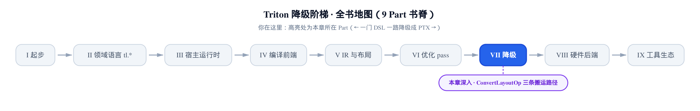
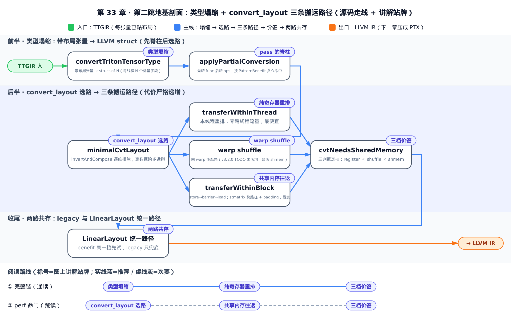
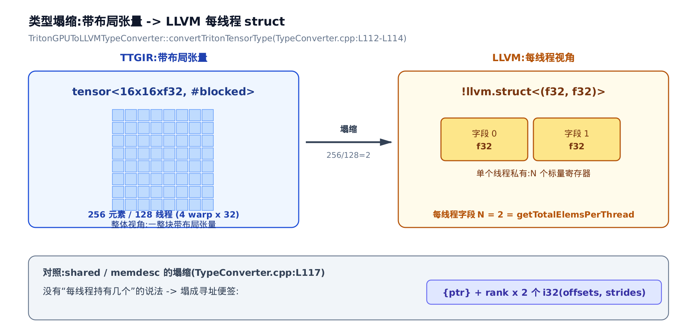
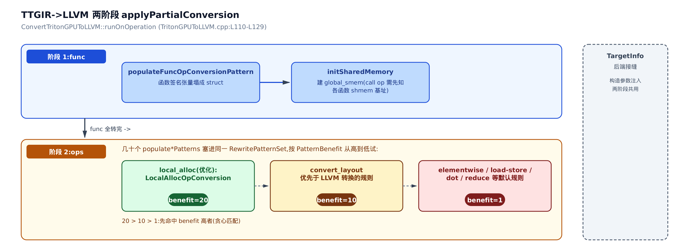
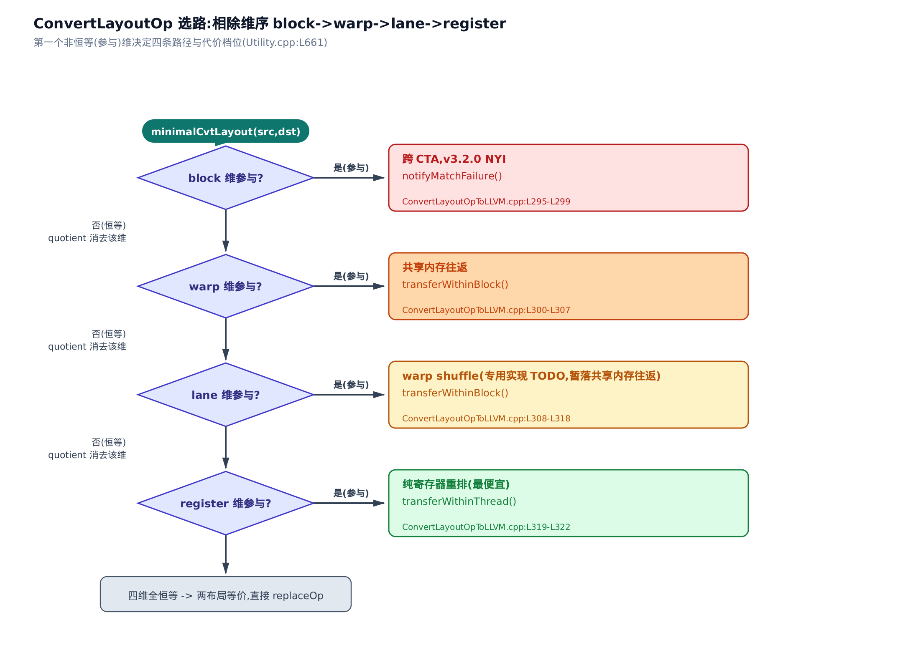
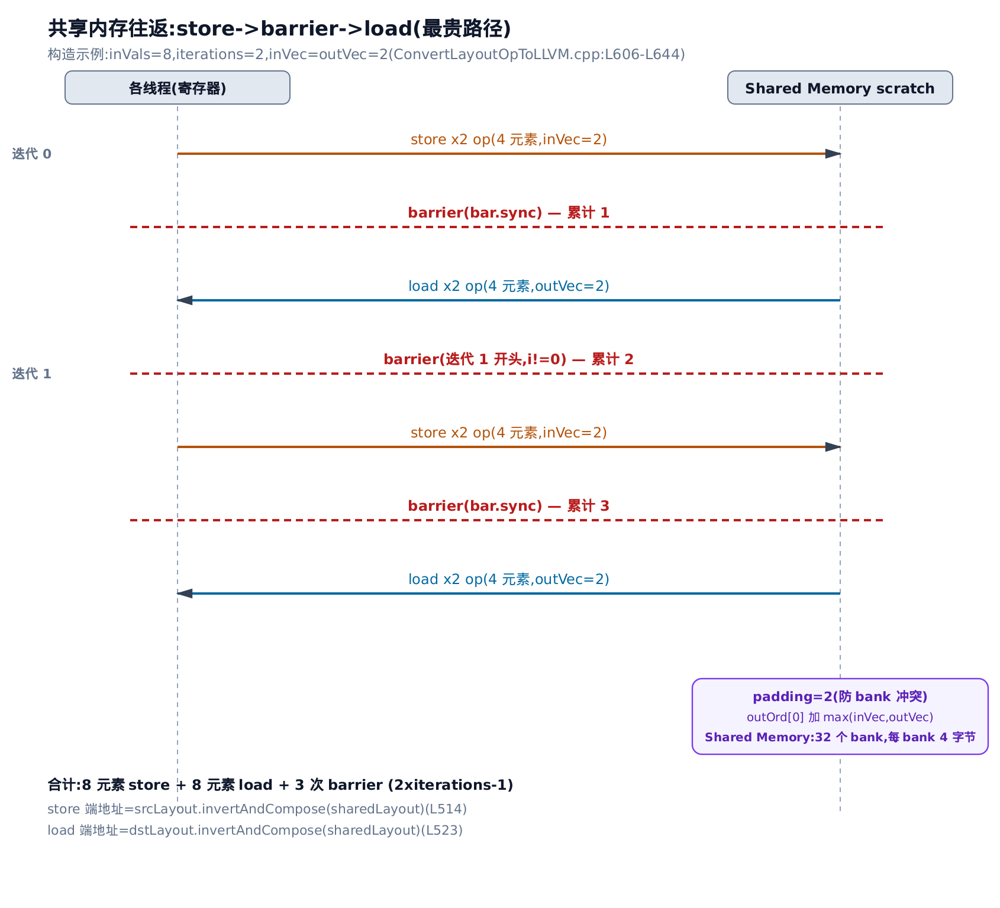
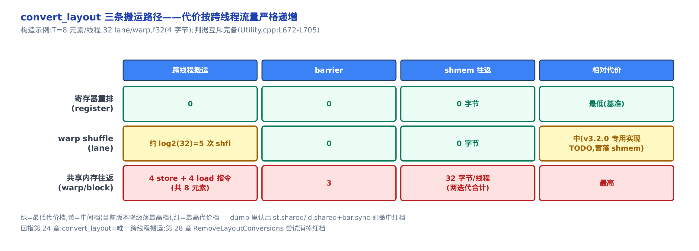

# 第二跳的地基：类型塌缩与 ConvertLayoutOp 的三条搬运路径



> 上一章：第一跳 TTIR→TTGIR 给每个张量贴上了布局。
> 本章：第二跳的地基——布局张量塌成 LLVM struct，convert_layout 挑三条搬运路径之一。
> 下一章：把降到 LLVM 的这堆 op 继续压成 PTX、交给硬件后端。

上一章的第一跳，把每个张量贴上了 `#blocked`、`#mma` 这样的**布局（layout）**——一张规定「哪个元素坐在哪个线程的哪个寄存器上」的座位表。座位贴好了，可 TTGIR（Triton GPU IR，带布局的中间表示）里那个 `tensor<16x16xf32, #blocked>` 到了 LLVM 层还是没法直接生成机器码：LLVM 不认识「张量」，也不认识「布局」。第二跳 TTGIR→LLVM 要做的第一件事，就是把这层抽象**塌缩**掉。

而这一跳里藏着一个直接决定 kernel 快慢的开关。当两个相邻算子要的布局不一样，TTGIR 里会插一个 `convert_layout`（布局转换算子，见[第 24 章：ttg.\* 与 ttng.\* 算子](../../ch24-ttg-ttng-operations/narrative/chapter.md)——它是**唯一**能跨线程搬数据的算子）。这一个 op，降级时会展开成三种截然不同的代价：

- **纯寄存器重排**——数据全在本线程手里，只是换个顺序读，零跨线程流量，几乎免费；
- **warp shuffle**——数据在同一个 warp 里的别的线程手里，用 shfl 指令互换，便宜；
- **共享内存往返**——数据在别的 warp 手里，只能先写进共享内存、全体等一下、再读回来，**最贵**。

这就是本章要交给你的性能杠杆：**读 make_llir（Triton 编译驱动里把 TTGIR 降到 LLVM IR 的那一步，内部即调本章这趟 pass）dump 出来的 IR，一旦看到某个 convert_layout 展开成 `st.shared` + `bar.sync` + `ld.shared`，那就是账单上最贵的一笔，是明确的优化目标**——回头看能不能靠布局优化（[第 28 章：RemoveLayoutConversions](../../ch28-accelerate-matmul-layout-opt/narrative/chapter.md)）把它消掉、或降档到寄存器/shuffle。

本章分两半。前半讲**类型塌缩**：带布局张量怎么变成 LLVM struct（规则表在 `lib/Conversion/TritonGPUToLLVM/TypeConverter.cpp`），整趟 pass 的脊柱怎么搭（入口 `third_party/nvidia/lib/TritonNVIDIAGPUToLLVM/TritonGPUToLLVM.cpp:L85`）。后半讲**选路**：convert_layout 凭什么在三条路径里挑一条（`lib/Conversion/TritonGPUToLLVM/ConvertLayoutOpToLLVM.cpp:L277`），代价为什么严格递增。全程内嵌真实 C++ 源码逐段读。

> 想直接抓 perf 命门，跳 §33.3 起的选路四步 + §33.6 的三档价签表；想跟完整脊柱，按序读。本章不推 LinearLayout 的 GF(2) 代数（那是[第 23 章](../../ch23-linear-layout/narrative/chapter.md)的事），只**用**它选路。



> 读图指引：想通读就顺蓝色主线从「类型塌缩」走到「两路共存」；只想抓 perf 命门，照图底虚线路线直奔 §33.3 选路 + §33.5 共享内存往返 + §33.6 三档价签这三节。

---

## §33.1 类型塌缩：张量变成每线程一个 struct

### 直觉：把座位表摊平成一排格子

带布局的张量就像一张座位表——它规定了每个元素坐在哪个线程的哪个寄存器上。**塌缩**就是把每个线程名下的座位摊平成一排固定格子（LLVM struct 的字段）：从此 LLVM 层不再有「张量」这个整体，只剩每个线程私有的 N 个标量寄存器。



### 机制：字段数 N 就是每线程持有的元素数

拿一个具体的小张量走一遍。`tensor<16x16xf32, #blocked>` 一共 16×16 = 256 个 f32 元素。假设 `numWarps=4`（每个线程块 4 个 warp）、`threadsPerWarp=32`（每个 warp 32 条 lane），那就是 128 个线程。塌缩后每个线程分到几个元素？

<!-- trace: type-collapse-tensor -->

| 输入类型 | 布局与线程数 | 每线程元素 N | LLVM 塌缩结果 | 源码锚 |
|---|---|---|---|---|
| `tensor<16x16xf32, #blocked>` | Blocked / 4 warp × 32 = 128 线程 | 256 / 128 = 2 | `!llvm.struct<(f32, f32)>` | TypeConverter.cpp:L112-L114 |
| 同张量，改 numWarps=8 | Blocked / 8 warp × 32 = 256 线程 | 256 / 256 = 1 | `!llvm.struct<(f32)>` | TypeConverter.cpp:L112-L114 |

第一行：256 元素摊到 128 线程，每线程 N=2，塌成两个 f32 字段的 struct。第二行：把 warp 数翻倍到 8，线程数变 256，每线程只剩 N=1。注意**总量守恒**：128×2 = 256 = 256×1，元素一个不多一个不少，只是「张量整体视角」换成了「线程私有视角」。

这个守恒不是巧合。布局是元素到 `(register, lane, warp, block)` 坐标的**双射**——每个张量元素恰好归属唯一一对 `(thread, register)`。对固定线程枚举它的 register 维，就得到这个线程的字段序列；字段数 = register 维的大小 = 每线程持有的元素数。所以 struct 字段数恒等于 `getTotalElemsPerThread(type)`（一个从布局算出每线程元素数的工具函数），不增不减。

### 源码：addConversion 登记塌缩规则

塌缩规则表是 `TritonGPUToLLVMTypeConverter`（类型转换器，继承自 MLIR 的 `LLVMTypeConverter`）。它在构造时用 `addConversion` 逐条登记「遇到某种 Triton 类型，塌成什么 LLVM 类型」：

```cpp
// lib/Conversion/TritonGPUToLLVM/TypeConverter.cpp:L18
TritonGPUToLLVMTypeConverter::TritonGPUToLLVMTypeConverter(
    MLIRContext *ctx, LowerToLLVMOptions &option,
    const TargetInfoBase &targetInfo, const DataLayoutAnalysis *analysis)
    : LLVMTypeConverter(ctx, option, analysis) {
  addConversion([&](triton::PointerType type) -> std::optional<Type> {
    return convertTritonPointerType(type);
  });
  addConversion([&](RankedTensorType type) -> std::optional<Type> {
    return convertTritonTensorType(type, targetInfo);   // ← 带布局张量走这里
  });
  addConversion([&](MemDescType type) -> std::optional<Type> {
    return convertMemDescType(type, targetInfo);         // ← shared/memdesc 走这里
  });
  // … 省略：AsyncToken→i32，与下面 fp8 逐条同构 …
  addConversion([&](mlir::Float8E4M3FNType type) -> std::optional<Type> {
    return IntegerType::get(type.getContext(), 8);       // ← fp8 → i8
  });
  // … 省略：另外三种 fp8 编码（E4M3FNUZ / E5M2 / E5M2FNUZ）同样塌成 i8 …
}
```

三点值得停一下。第一，`RankedTensorType`（带布局的普通张量）走 `convertTritonTensorType`——就是上面塌成 struct-of-N 的那条。第二，`MemDescType`（共享内存描述符）走另一条 `convertMemDescType`，塌法完全不同（马上讲）。第三，四种 fp8 编码（`Float8E4M3FN` 等，8 位浮点的不同尾数/指数划分）统统塌成 `i8`——因为 LLVM 没有 fp8 算术类型，降级阶段只当它是「8 位的位袋子」搬运，等真要算时再解释。

还有个细节埋在参数里：`const TargetInfoBase &targetInfo`。它是**后端接缝**——共享内存地址空间号、store/load 指令怎么发，全经它问。换到 AMD 后端只需要换这个 `TargetInfoBase` 的实现，塌缩主干代码一行不动。这条缝下面还会反复出现，记住它。

塌成 struct 的核心就三行：

```cpp
// lib/Conversion/TritonGPUToLLVM/TypeConverter.cpp:L90
Type TritonGPUToLLVMTypeConverter::convertTritonTensorType(
    RankedTensorType type, const TargetInfoBase &targetInfo) {
  auto ctx = type.getContext();
  Attribute layout = type.getEncoding();
  // … 省略：shape 变量、eltType=getElementTypeForStruct(...)（讲解见正文）与 shared 布局分支（见下一小节）…

  unsigned numElementsPerThread = getTotalElemsPerThread(type);   // N
  SmallVector<Type, 4> types(numElementsPerThread, eltType);      // N 份 eltType
  return LLVM::LLVMStructType::getLiteral(ctx, types);            // struct<(elt,…,elt)>
}
```

`getTotalElemsPerThread(type)` 算出 N，`SmallVector<Type, 4> types(N, eltType)` 造一个装 N 份元素类型的列表，`getLiteral` 打包成 struct。上面表里那个 `!llvm.struct<(f32, f32)>`，就是 N=2、`eltType=f32` 的结果。塌缩就此完成：布局语义物化成了 struct 的宽度。

### 对照：shared/memdesc 塌成寻址便签

同样是「张量」，为什么共享内存要走 `convertMemDescType`？因为共享内存是**全 warp/block 共享**的一块黑板，没有「哪个元素归哪个线程」的说法。塌成 struct-of-N 毫无意义——该塌成一张**寻址便签**：基址加每维的 offset/stride。

```cpp
// lib/Conversion/TritonGPUToLLVM/TypeConverter.cpp:L117
Type TritonGPUToLLVMTypeConverter::convertMemDescType(
    MemDescType type, const TargetInfoBase &targetInfo) {
  auto ctx = type.getContext();
  SmallVector<Type, 4> types;
  // base ptr
  auto ptrType =
      LLVM::LLVMPointerType::get(ctx, targetInfo.getSharedAddressSpace());
  types.push_back(ptrType);                          // 第 1 个字段：基址指针
  // offsets + strides
  auto rank = type.getShape().size();
  for (auto i = 0; i < rank * 2; i++) {
    types.push_back(IntegerType::get(ctx, 32));       // 后 2×rank 个字段：i32 偏移/步长
  }
  return LLVM::LLVMStructType::getLiteral(ctx, types);
}
```

一个 `{ptr}` 加 `2×rank` 个 i32——rank=2 的张量就是 `{ptr, off0, off1, str0, str1}`。指针的地址空间号 `targetInfo.getSharedAddressSpace()` 又是经 TargetInfo 拿的。到此，塌缩的两种形态齐了：**分布式张量→每线程 N 个标量寄存器；共享内存→一张寻址便签**。前者关心「每线程几个」，后者只关心「从哪儿开始、怎么走」。

---

## §33.2 pass 的脊柱：两阶段转换 + benefit 排序

### 直觉：先定函数签名，再转函数体

塌缩规则表建好了，谁来驱动它把整个 module 从 TTGIR 翻成 LLVM？答案是 `ConvertTritonGPUToLLVM` 这趟 pass。它的脊柱有个反直觉的地方：**分两口气**。先只把函数签名里的张量参数塌成 struct，再转函数体里的每个 op。为什么不一口气转完？因为 `call` op 下译时，必须先知道被调函数的共享内存基址——所以得先把函数签名塌好、`global_smem`（全局共享内存符号）建好，才能转函数体。



### 机制 + 源码：两阶段 applyPartialConversion

```cpp
// third_party/nvidia/lib/TritonNVIDIAGPUToLLVM/TritonGPUToLLVM.cpp:L91
    TargetInfo targetInfo(computeCapability, ptxVersion);           // TargetInfo=TargetInfoBase 的 NVIDIA 具体实现(即"后端接缝")
    TritonGPUToLLVMTypeConverter typeConverter(context, option, targetInfo);
    int numWarps = triton::gpu::TritonGPUDialect::getNumWarps(mod);
    // … 省略：num-warp-groups-per-cta 的 WSLowering hack（只修正 numWarps）…

    // Allocate shared memory and set barrier
    ModuleAllocation allocation(mod);
    ModuleMembarAnalysis membarPass(&allocation, NVIDIA::canSkipBarSync);
    membarPass.run();                                              // 先算好各处 scratch(每趟 convert 临时借用的共享内存草稿区,§33.5 细讲)+barrier

    // Lower functions ——第一阶段
    {
      RewritePatternSet funcPatterns(context);
      mlir::triton::populateFuncOpConversionPattern(typeConverter, funcPatterns,
                                                    numWarps, targetInfo,
                                                    patternBenefitDefault);
      // … 省略：cf 控制流 pattern …
      if (failed(
              applyPartialConversion(mod, funcTarget, std::move(funcPatterns))))
        return signalPassFailure();
    }

    // initSharedMemory is run before the conversion of call and ret ops,
    // because the call op has to know the shared memory base address of each
    // function
    initSharedMemory(typeConverter);                              // 建 global_smem

    RewritePatternSet patterns(context);                          // 第二阶段的 pattern 池
    int benefit = patternBenefitPrioritizeOverLLVMConversions;    // = 10
    mlir::triton::NVIDIA::populateConvertLayoutOpToLLVMOptimizedPatterns(
        typeConverter, targetInfo, patterns,
        patternBenefitConvertLayoutOptimizedPattern);             // benefit=20:名字带 ConvertLayout,实际挂 local_alloc(见下)
    mlir::triton::NVIDIA::populateConvertLayoutOpToLLVMPatterns(
        typeConverter, targetInfo, patterns, benefit);            // convert_layout 等一批算子,benefit=10
    // … 省略：dot / elementwise / load-store / reduce 等几十个 populate*Patterns，同构拼进 patterns …
```

`membarPass`（内存屏障分析，见[第 26 章：共享内存分配与屏障](../../ch26-shared-memory-allocation-membar/narrative/chapter.md)）先跑，把每个 convert_layout/reduce 要用的 scratch 共享内存和 barrier 位置都算好。然后第一阶段那个花括号块只干一件事：`populateFuncOpConversionPattern` 把函数签名里的张量塌成 struct，`applyPartialConversion`（MLIR 的部分转换驱动，把匹配到的 op 逐个改写）跑完它。紧接着 `initSharedMemory` 建 `global_smem`。这之后才进第二阶段。这里有一条不可颠倒的**次序不变量**：func 阶段建好的 `global_smem` 基址，是 ops 阶段 `call` op 下译时查基址的前置条件——两阶段一旦对调，`call` 就无从得知被调函数的共享内存基址（源码注释把这条因果写在了 `initSharedMemory` 调用上方）。

`applyPartialConversion` 是「部分」转换——它按一个 `RewritePatternSet`（改写规则集合）里的 pattern 反复贪心改写，直到没有 illegal op 剩下。第二阶段把几十个 `populate*Patterns`（convert_layout / dot / elementwise / load-store / reduce…）**全塞进同一个** `patterns` 池，一趟改写全下译。

### benefit：谁先试

塞进同一个池，命中顺序谁说了算？`PatternBenefit`（pattern 优先级，数越大越先试）。这几个常量定了档位：

```cpp
// include/triton/Conversion/TritonGPUToLLVM/PatternTritonGPUOpToLLVM.h:L25
constexpr int patternBenefitDefault = 1;                         // 默认档
constexpr int patternBenefitPrioritizeOverLLVMConversions = 10;  // 优先于 LLVM 通用转换
// … 省略：patternBenefitClampOptimizedPattern = 20（服务 Clamp pattern，与 convert_layout 选路无关）…
constexpr int patternBenefitConvertLayoutOptimizedPattern = 20;  // 名字带 ConvertLayout,实际服务 local_alloc
```

`PatternBenefit` 只定「谁先被试」，不定「谁一定命中」：贪心改写按 benefit 从高到低逐个试，第一个咬住并合法改写的 pattern 赢。这里得拆穿一个命名陷阱——`patternBenefitConvertLayoutOptimizedPattern` 虽然名字带 `ConvertLayout`、又挂到最高的 benefit=20，可它 populate 进去的其实是 `LocalAllocOpConversion`：处理的是 `local_alloc`（把 MMA 结果显式搬进共享内存、走 stmatrix）这个**另一个** TritonGPU 算子，跟本章的 convert_layout 选路毫无关系（全仓仅此一处引用这个常量）。真正决定 convert_layout 两条竞争实现谁先命中的 benefit，要到 §33.7 才揭晓——那里 LinearLayout 统一路径拿 11、legacy 拿 10，只差一档。本节记住脊柱的形状就够：**两阶段转换（先 func 后 ops）＋ 一池 pattern 按 benefit 贪心命中**。

> `computeCapability`（GPU 算力，如 80 表示 Ampere）、`ptxVersion`（PTX 汇编版本）从 module 属性读出，喂给 `TargetInfo` 构造。后端换代只改这里的数，选路与塌缩逻辑不变。

---

## §33.3 convert_layout 选路：相除取最小转换

现在进本章核心。第二阶段改写到一个 convert_layout 时，`ConvertLayoutOpUsingLinearLayoutsConversion`（在 convert_layout 的几条实现里 benefit 最高、总是先试，确切档位见 §33.7 揭晓）咬住它。它要回答一个问题：**这趟布局转换，数据到底要跨多远搬？** 答案决定走三条路径的哪一条。

### 直觉：搬家前先问「跨不跨楼」

选路像搬家前先问「这趟要跨多远」：先问跨不跨楼（block，即 CTA/线程块）、跨不跨层（warp）、跨不跨房间（lane，warp 内的线程）——全不跨，就只在自己桌上挪东西（register）。GPU 的线程坐标恰好是这四层：`(block, warp, lane, register)`。**相除（quotient）** 就是逐层划掉「根本没动」的那些维，剩下最粗的一维，决定要用多贵的搬法。



### 机制：minimalCvtLayout 逐维相除

选路的唯一依据是 `minimalCvtLayout`。它先把源布局和目标布局都转成 LinearLayout（统一布局代数，见[第 23 章：LinearLayout](../../ch23-linear-layout/narrative/chapter.md)），算出「从 src 生成 dst」的转换映射 `comp = dstLayout.invertAndCompose(srcLayout)`（`invertAndCompose` = 求逆再复合，也是[第 23 章](../../ch23-linear-layout/narrative/chapter.md)的工具），然后按 `block→warp→lane→register` 的顺序逐维试除。

拿一个「同一个 warp 内跨 lane 的转置」当例子：这个转换在 block、warp 维是恒等（数据没跨楼、没跨 warp），只在 lane 维真动。看四轮试除怎么走：

<!-- trace: cvt-path-selection -->

| 轮次 | 试除维 dim | comp 在该维恒等？ | quotient 成功？ | comp 变化 | 循环动作 |
|---|---|---|---|---|---|
| 1 | block | 是 | 成功 | 消去 block 维 | 继续（免分布式 shmem，即前面说的共享内存） |
| 2 | warp | 是 | 成功 | 消去 warp 维 | 继续（可退到 warp shuffle 档） |
| 3 | lane | 否 | 失败 | 不变 | break——lane 是真正要跨的最粗粒度 |
| 判定 | 剩余 dims={lane, register} | — | — | — | matchAndRewrite 命中 `is_contained(dims,"lane")`（L308）→ transferWithinBlock（共享内存往返；warp-shuffle 专用实现 TODO 未做） |

quotient 在某维成功，意味着转换在那维是恒等、可整除消去；失败就 `break`。这里前两轮消掉 block、warp，第三轮撞上 lane——lane 就是这趟转换**真正要跨的最细粒度**，它唯一地定了代价档位。

这个循环一定停：`dims` 长度固定为 4，每轮要么消一维（严格递减）、要么 break，至多 4 轮。而且**第一个 quotient 失败的维唯一决定档位**——block 失败最贵（跨 CTA），依次 warp、lane，register 最便宜。若四轮全成功、`comp` 空了，说明两个布局压根等价，直接 `replaceOp` 把 convert 删掉。

### 源码：minimalCvtLayout 与四分支

```cpp
// lib/Analysis/Utility.cpp:L643
// We get the smallest submap of srcTy^{-1} * dstTy that is not the identity
// under kBlock, kWarp or kLane (in that order). The idea here is that if we
// have a transformation that's the identity on kBlock, we don't need to use
// distributed shared memory. If it's also the identity on kWarp, we can
// transfer via warp-shuffles, and if it's the identity on kLane just have to
// reorder the registers
std::optional<LinearLayout> minimalCvtLayout(RankedTensorType srcTy,
                                             RankedTensorType dstTy) {
  // … 省略：srcLayout/dstLayout = toLinearLayout(...)，缺失则返回 nullopt …
  // comp describes the layout function to create dst from src.
  LinearLayout comp = dstLayout->invertAndCompose(*srcLayout);
  // We try to quotient by the largest subspace first
  auto dims = SmallVector<StringRef>{"block", "warp", "lane", "register"};
  for (auto dim : dims) {
    auto quotient = comp.quotient(StringAttr::get(ctx, dim));
    if (!quotient.has_value()) {
      break;                       // 第一个不能整除的维——就是它了
    }
    comp = *quotient;              // 整除成功:消去这一维,继续
  }
  return comp;                     // 剩下的最小转换,其 out 维即"要跨的维"
}
```

顶上那段注释就是设计意图的原话：block 恒等→免分布式共享内存；warp 也恒等→可用 warp shuffle；lane 也恒等→只需重排寄存器。这段循环把它精确实现成「逐维相除」。

拿到最小转换后，`matchAndRewrite` 看它剩下哪一维参与，分四条路：

```cpp
// lib/Conversion/TritonGPUToLLVM/ConvertLayoutOpToLLVM.cpp:L277
  matchAndRewrite(ConvertLayoutOp op, OpAdaptor adaptor,
                  ConversionPatternRewriter &rewriter) const override {
    auto conversion = minimalCvtLayout(srcTy, dstTy);
    if (!conversion.has_value()) {
      return rewriter.notifyMatchFailure(op, "NYI. ... don't implement LLs yet");
    }
    auto dims = conversion->getInDimNames();
    if (llvm::is_contained(dims, str_attr("block"))) {
      // Case 1: 跨 CTA,需要分布式共享内存
      return rewriter.notifyMatchFailure(op, "NYI: Transfer between different CTAs");
    } else if (llvm::is_contained(dims, str_attr("warp"))) {
      // Case 2: 跨 warp,走共享内存
      // … 省略:重建 srcLayout/dstLayout …
      return transferWithinBlock(op, srcLayout, dstLayout, adaptor, rewriter);
    } else if (llvm::is_contained(dims, str_attr("lane"))) {
      // Case 3: 跨 lane,本应 warp shuffle,但专用实现 TODO 未做,暂落共享内存
      // TODO(Keren): implement warp shuffle instead of using shared memory
      return transferWithinBlock(op, srcLayout, dstLayout, adaptor, rewriter);
    } else if (llvm::is_contained(dims, str_attr("register"))) {
      // Case 4: 只在同线程内,重排寄存器即可
      return transferWithinThread(op, *conversion, adaptor, rewriter);
    } else {
      // 两布局等价,直接删掉这个 convert
      rewriter.replaceOp(op, adaptor.getSrc());
      return success();
    }
  }
```

读代码要留意一个当前版本的现实：**block 分支跨 CTA，v3.2.0 还没实现（NYI，Not Yet Implemented，直接 notifyMatchFailure）**；warp 和 lane **都**落到 `transferWithinBlock`（共享内存往返）——因为 lane 那条本该走 warp shuffle 的专用实现是个 TODO，暂时也走共享内存；只有 register 分支落 `transferWithinThread`（纯寄存器重排）。也就是说，代价的**理论排序是四档，当前版本实际只兑现了两档**：纯寄存器 vs 共享内存往返，中间的 warp shuffle 还没落地。下面三节分别拆开这几条路。

---

## §33.4 第一条路：纯寄存器重排（最便宜）

### 直觉：只是把手里的牌重排

最便宜的「搬运」其实根本不搬——数据全在本线程的寄存器里，只是把 struct 的字段换个顺序读，像把手里几张牌重新排列，零跨人传递、零等待。选路走到 register 分支时就是这个情形。

### 机制：一次双射置换

设某线程持有 N=4 个寄存器，转换要求把中间两张牌对调（置换 `{0→0, 1→2, 2→1, 3→3}`）。逐个 dst 寄存器算它该从哪个 src 寄存器取值：

<!-- trace: path-register-reorder -->

| i（dst 寄存器） | conversion.apply({register:i}) = srcIdx | outVals[i] = inVals[srcIdx] | 跨线程流量 |
|---|---|---|---|
| 0 | 0 | inVals[0] | 0 |
| 1 | 2 | inVals[2] | 0 |
| 2 | 1 | inVals[1] | 0 |
| 3 | 3 | inVals[3] | 0 |

四次寄存器读，跨线程流量一栏全是 0——没有共享内存、没有 barrier、没有 shuffle 指令。为什么敢保证零跨线程？因为进入这条路径前有一道断言 `assert(!cvtNeedsSharedMemory(...))`（`cvtNeedsSharedMemory` 判断这趟 convert 是否得落共享内存，它和另外两个判据的全貌见 §33.6）：最小转换的 out 维只含 register，`conversion.apply` 只把本线程的 register 索引映到 register 索引，是一次**双射置换**。每个 `outVals[i]` 恰来自唯一的 `inVals[srcIdx]`，元素守恒、零数据移动。

### 源码：transferWithinThread

```cpp
// lib/Conversion/TritonGPUToLLVM/ConvertLayoutOpToLLVM.cpp:L331
  transferWithinThread(ConvertLayoutOp op, const LinearLayout &conversion,
                       OpAdaptor adaptor,
                       ConversionPatternRewriter &rewriter) const {
    StringAttr kRegister = str_attr("register");
    assert(!cvtNeedsSharedMemory(op.getSrc().getType(), op.getType()));  // 保证零 shmem

    auto inVals = unpackLLElements(loc, adaptor.getSrc(), rewriter);     // 拆开源 struct
    SmallVector<Value> outVals;
    outVals.resize(conversion.getInDimSize(kRegister));                  // N 个输出寄存器
    for (int i = 0; i < conversion.getInDimSize(kRegister); i++) {
      auto srcIdx = conversion.apply({{kRegister, i}}).begin()->second;  // dst i ← src srcIdx
      outVals[i] = inVals[srcIdx];
    }
    Value result = packLLElements(loc, getTypeConverter(), outVals, rewriter,
                                  op.getType());                         // 打包成 dst struct
    rewriter.replaceOp(op, result);
    return success();
  }
```

整个函数就是「拆 struct → 按置换重排 → 打包 struct」。`unpackLLElements` 把源 struct 拆成 N 个 Value，循环按 `conversion.apply` 求出的 srcIdx 重排到 `outVals`，`packLLElements` 再打包。没有一条访存指令。这是三条路里的**基准价：0 跨线程搬运、0 barrier、0 共享内存字节**。dump 里这种 convert_layout 展开后只剩寄存器移动，看到它不用管——它几乎不要钱。

---

## §33.5 最贵的一条路：共享内存往返

### 直觉：落地中转、鸣哨集合

最贵的搬运要「落地中转」：每个线程先把自己的元素写进共享内存（store），全体鸣哨等一下（barrier）确保都写完，再按新布局各取所需读回（load）。像大家把行李堆上公共传送带、鸣哨集合、再按新座位各自取走——多了一次落地写和一次全员等待。选路走到 warp/block 分支（当前 lane 也暂时走这里）就是它。



### 机制：store→barrier→load 逐迭代

设 `inVals` 有 8 个元素、分 2 次迭代、store/load 每次向量宽度 `inVec=outVec=2`。数每次迭代的 op 和 barrier：

<!-- trace: path-shmem-roundtrip -->

| 迭代 i | 迭代开头 barrier(i!=0) | store op 数（4 元素 / inVec=2） | store 后 barrier | load op 数（4 元素 / outVec=2） | 累计 barrier |
|---|---|---|---|---|---|
| 0 | 无 | 2 | 1 | 2 | 1 |
| 1 | 1 | 2 | 1 | 2 | 3 |

每次迭代严格 `store → barrier → load`。迭代 0 开头不插 barrier（`i==0`），store 完插一次同步，再 load；迭代 1 开头因 `i!=0` 再补一次 barrier。所以 8 个元素往返，跑 **4 次向量化 store（每次搬 inVec=2 个）+ 4 次向量化 load（每次 outVec=2 个）+ 3 次 barrier**——store/load 指令数 = 每迭代 2 条 × 2 迭代 = 4（内层循环 `j += inVec` 每迭代走 2 趟，别把 8 个元素错当成 8 条指令），barrier 数 = 2×迭代数 − 1 = 3。这三次全员等待，就是最贵档的代价来源。

为什么读回来的正是写进去的值？因为地址不是手工推的，而是靠 `invertAndCompose`（[第 23 章](../../ch23-linear-layout/narrative/chapter.md)那个工具）算出的双射：store 端地址 = `srcLayout.invertAndCompose(sharedLayout)`，load 端 = `dstLayout.invertAndCompose(sharedLayout)`。可逆映射保证寄存器↔共享内存偏移一一对应，无覆盖、无丢失；store 后 load 前那道 barrier 建立了「先写完再读」的顺序。

### 源码：定址与主循环

入口函数 `transferWithinBlock`（L353）只做外围杂务——处理 sub-byte 类型（如塌成 i8 的 fp8）和指针的打包、把 block 维从转换里剥掉，然后把真正的往返搬运委托给内层的 `transferWithinBlockImpl`（L473，往返代价的具体来源就在这里）。下面两段代码正是 `transferWithinBlockImpl` 的主体。先看两端地址怎么来：

```cpp
// lib/Conversion/TritonGPUToLLVM/ConvertLayoutOpToLLVM.cpp:L492
    auto scratchConfig =
        getScratchConfigForCvt(op.getSrc().getType(), op.getType());  // 定 scratch:形状/向量宽/padding
    LinearLayout sharedLayout = chooseShemLayoutForRegToRegConversion(
        ctx, tensorShapePerCTA, scratchConfig.repShape, scratchConfig.order);

    // store 端布局:优先试 stmatrix 快路径
    std::optional<LinearLayout> shmemStoreLayout =
        chooseStMatrixLayout(ctx, op.getSrc().getType(), scratchConfig.repShape,
                             scratchConfig.paddedRepShape, scratchConfig.order,
                             /*swizzleByteSize=*/0);
    bool isStMatrix = shmemStoreLayout.has_value();
    if (!isStMatrix) {
      shmemStoreLayout = srcLayout.invertAndCompose(sharedLayout);    // 普通 store 地址
    }
    // … 省略:store layout 的 offset 不超分配的断言 …
    // load 端布局
    LinearLayout shmemLoadLayout = dstLayout.invertAndCompose(sharedLayout);   // load 地址
```

`getScratchConfigForCvt` 定好 scratch 共享内存的形状、向量宽度和 padding。store 端先问 `chooseStMatrixLayout`：若布局对得上就走 **stmatrix 快路径**（`st.matrix` PTX 指令，一条指令让整个 warp 协作写一个 8×8=64 元素的块；同样 64 个元素若走普通 `storeDShared` 得拆成多条向量化 store，stmatrix 一条抵一批，指令数近似降一个数量级），返回空才退回普通的 `invertAndCompose` 地址。load 端直接 `dstLayout.invertAndCompose(sharedLayout)`。

再看往返主循环——这是最贵路径的中枢：

```cpp
// lib/Conversion/TritonGPUToLLVM/ConvertLayoutOpToLLVM.cpp:L606
    for (int i = 0; i < iterations; i++) {
      if (i != 0)
        insertBarrier(rewriter, op);                    // 迭代开头的 barrier(i!=0)

      auto inVec = isStMatrix ? shmemStoreLayout->getNumConsecutiveInOut()
                              : scratchConfig.inVec;
      for (int j = 0; j < inVals.size() / iterations; j += inVec) {
        Value vecAddr = getVecAddr(*shmemStoreLayout, storeBase, inRegSlice);
        // … 省略:打包 inVec 个元素成向量 …
        if (isStMatrix) {
          targetInfo.storeMatrixShared(rewriter, loc, vecAddr, valsVec);   // 快路径:st.matrix
        } else {
          targetInfo.storeDShared(rewriter, loc, vecAddr, ..., valsVec, ...);  // 普通 store
        }
      }

      insertBarrier(rewriter, op);                      // store 完的 barrier

      for (int j = 0; j < outSize / iterations; j += scratchConfig.outVec) {
        auto vecAddr = getVecAddr(shmemLoadLayout, loadBase, outRegSlice);
        Value valsVec =
            targetInfo.loadDShared(rewriter, loc, vecAddr, ...);           // load 回寄存器
        // … 省略:拆向量写回 outVals …
      }
    }
```

结构就是表里那两行：迭代开头（`i!=0`）一道 barrier、一批 store、一道 barrier、一批 load。`storeDShared` / `loadDShared` / `storeMatrixShared` 全经 `targetInfo`——又是后端接缝，AMD 换实现就在这几个点。`getVecAddr` 里藏着地址计算，包括下面的 padding。

### 为什么要 padding：防 bank 冲突

共享内存有 32 个 bank，连续 4 字节落连续 bank（见[第 26 章](../../ch26-shared-memory-allocation-membar/narrative/chapter.md)的 bank 冲突）。如果 store/load 沿最内维步长恰是 32 的倍数，所有访问会全撞同一个 bank、排队串行。解法是在往返 scratch 的最内访问维加一小段 padding，错开每行的起始 bank：

```cpp
// lib/Analysis/Allocation.cpp:L159
  // No padding is required if the tensor is 1-D, or if all dimensions except
  // the first accessed dimension have a size of 1.
  if (rank <= 1 || product(repShape) == repShape[outOrd[0]])
    return scratchConfig;

  auto paddedSize = std::max(scratchConfig.inVec, scratchConfig.outVec);
  scratchConfig.paddedRepShape[outOrd[0]] += paddedSize;   // 最内维加宽 paddedSize
  return scratchConfig;
```

`paddedSize = max(inVec, outVec)`——本例 `max(2,2)=2`。`outOrd` 是输出访问顺序数组，`outOrd[0]` 即最内（访问最频繁）的那一维；在它上面加 2 个元素宽度，把每行起始错开一个 bank，冲突就散开了。一维张量或除最内维外都是 1 的情形不需要 padding，直接早退。这段 padding 之所以重要：它是「最贵路径」里为了不让共享内存访问雪上加霜而付的小额保险。

---

## §33.6 三档价签：读 dump 找优化点

### 直觉：三档价签

前面三条路径讲完了，把它们并排就是三档价签：桌上挪牌（register）免费、warp 内传纸条（shuffle）便宜、堆到公共货架再取（shmem）最贵还得全体等。这一节把代价量化，落到你读 dump 时的判据。



### 机制：代价严格递增

设 convert 涉及每线程 T=8 个元素。三档摆一起：

<!-- trace: cost-ordering-perf -->

| 路径 | 参与最粗维 | 跨线程搬运 | barrier | shmem 往返 | 相对代价 |
|---|---|---|---|---|---|
| transferWithinThread（寄存器重排） | register | 0 | 0 | 0 字节 | 最低（基准） |
| warp shuffle | lane | 约 log2(32)=5 次 shfl | 0 | 0 字节 | 中（v3.2.0 专用实现 TODO 未做，暂落 shmem） |
| transferWithinBlock（shmem 往返） | warp / block | 4 store + 4 load 指令（共 8 元素） | 3 | 8×4=32 字节/线程（两迭代合计） | 最高 |

代价严格递增 register < warp shuffle < shmem 往返，根因是**跨线程数据流量**严格递增：register 档 0 跨线程；lane 档在 warp 内用约 `` $`\log_2 32 = 5`$ `` 次 shfl 互换；warp/block 档必须把数据落地共享内存再取回，还要 barrier 同步。流量单调，代价就单调。

三档的划分由三个互斥完备的判据决定：`cvtReordersRegisters`（out 维只含 register→纯寄存器重排）、`cvtNeedsWarpShuffle`（out 维恰为 register+lane→warp shuffle）、`cvtNeedsSharedMemory`（既非纯寄存器、也非 dot operand 的几种专用捷径→落共享内存；那些 dot 捷径正是 §33.7 legacy 路径要兜底的情形）。每个 convert 落唯一一档。它们的骨架和 `minimalCvtLayout` 同源：

```cpp
// lib/Analysis/Utility.cpp:L671
bool cvtReordersRegisters(RankedTensorType srcTy, RankedTensorType dstTy) {
  auto layout = minimalCvtLayout(srcTy, dstTy);
  // … 省略:ctx 声明、layout 缺失返回 false …
  auto kRegister = StringAttr::get(ctx, "register");
  auto outDims = llvm::to_vector(layout->getOutDimNames());
  return outDims.empty() || ArrayRef(outDims) == ArrayRef({kRegister});   // 只剩 register
}
// cvtNeedsWarpShuffle / cvtNeedsSharedMemory 结构对称,判 out 维是否恰含 lane / 是否需落 shmem
```

### 落到 perf：dump 里认出最贵档

这就是本章交给你的读 dump 判据：**看到某个 convert_layout 展开成 `st.shared` + `bar.sync` + `ld.shared`，它就命中了最贵档**（`transferWithinBlock`）。这是账单上最贵的一笔，值得回头做两件事之一——要么靠[第 28 章](../../ch28-accelerate-matmul-layout-opt/narrative/chapter.md)的 RemoveLayoutConversions 把这个 convert 整个消掉，要么调整上下游布局让它降档到寄存器重排（免费）或 warp shuffle（便宜）。反过来，若 dump 里 convert_layout 只剩寄存器移动、没有 `st.shared`，那它几乎不花钱，不必操心。

一句话记住：**convert_layout 是唯一跨线程搬运的算子（[第 24 章](../../ch24-ttg-ttng-operations/narrative/chapter.md)），而跨线程搬运的代价在这里分三档——你的优化目标永远是把它往下压一档。**

---

## §33.7 两路共存：legacy 与 LinearLayout 统一路径

读源码时你会撞见一个容易困惑的事实：同一个 convert_layout，代码库里有**两套**下译实现并存。上面讲的 `ConvertLayoutOpUsingLinearLayoutsConversion`（相除选路）是新的**统一路径**；另有一套旧的、按布局类型 if-else 分支的 **legacy 路径** `ConvertLayoutOpConversion`。为什么留着两套？

```cpp
// lib/Conversion/TritonGPUToLLVM/ConvertLayoutOpToLLVM.cpp:L28
// XXX(Keren): A temporary knob to control the use of legacy MMA conversion
// because LinearLayout seems to have some performance issues.
constexpr bool useLegacyMMAConversion = false;               // 默认:新路当家

struct ConvertLayoutOpConversion
    : public ConvertOpToLLVMPattern<ConvertLayoutOp> {
  matchAndRewrite(ConvertLayoutOp op, OpAdaptor adaptor,
                  ConversionPatternRewriter &rewriter) const override {
    Attribute srcLayout = op.getSrc().getType().getEncoding();
    Attribute dstLayout = op.getType().getEncoding();
    if (isSupported(srcLayout, dstLayout)) {                  // 只吃 Blocked/Mma/Slice
      return lowerDistributedToDistributed(op, adaptor, rewriter, targetInfo);
    }
    return failure();                                        // 不支持就让位
  }
  bool isSupported(Attribute srcLayout, Attribute dstLayout) const {
    return isa<BlockedEncodingAttr, MmaEncodingTrait, SliceEncodingAttr>(srcLayout) &&
           isa<BlockedEncodingAttr, MmaEncodingTrait, SliceEncodingAttr>(dstLayout) &&
           !isLayoutMmaV1(srcLayout) && !isLayoutMmaV1(dstLayout);
  }
```

关键在两套 pattern 的注册 benefit。populate 时，LinearLayout 统一路径拿到的 benefit 比 legacy **高一档**：

```cpp
// lib/Conversion/TritonGPUToLLVM/ConvertLayoutOpToLLVM.cpp:L685
  // We prefer using the linear layout conversion, so it gets a higher benefit.
  // Eventually the LL conversion will subsume all of the others and be the only
  // one left.
  mlir::triton::populateConvertLayoutOpUsingLinearLayoutsToLLVMPattern(
      typeConverter, targetInfo, patterns, benefit.getBenefit() + 1);   // LL:高一档,先命中
  // … 省略：ConvertLayoutOpBlockedToDotOpShortcutConversion（同 benefit 的另一条 dot 捷径，不在本章讨论范围）…
  patterns.add<ConvertLayoutOpConversion>(typeConverter, targetInfo, benefit); // legacy:后备
```

所以 LL 路径**总是先试**；只有它 `notifyMatchFailure`（比如遇到还没覆盖的 dot operand 布局）时，才退回 legacy 做同样的 padding 共享内存往返。注释把话说明白了：LL 路径终将吞掉其余全部实现、成为唯一。但迁移未完（源码里那个 `FIXME [Dot LL]`——部分 dot operand、AMD MFMA（AMD 的矩阵乘加指令，功能上对应 NVIDIA 的 MMA/tensor core）尚未覆盖），legacy 就留着兜底。`useLegacyMMAConversion=false` 这个常量，就是「新路当家」的直接开关证据。

读到这里，两路共存不再是困惑，而是一个正在收尾的迁移期快照：**你看到的 convert_layout 绝大多数已经走 LinearLayout 相除选路，legacy 只是还没退休的备胎。**

---

## 小结与取证

第二跳 TTGIR→LLVM 的地基就此拆完。两件事：

**类型塌缩**——带布局张量塌成每线程 N 个字段的 `!llvm.struct<...>`（N = `getTotalElemsPerThread`），共享内存塌成 `{ptr, offsets, strides}` 寻址便签，fp8 当 i8 搬。整趟 pass 分两阶段（先 func 后 ops），几十个 `populate*Patterns` 按 PatternBenefit 排序贪心命中，TargetInfo 作后端接缝。

**convert_layout 选路**——`minimalCvtLayout`（`lib/Analysis/Utility.cpp:L649`）按 `block→warp→lane→register` 逐维相除，第一个非恒等维定档；三条路径代价严格递增：纯寄存器重排（`transferWithinThread`，免费）< warp shuffle（便宜，v3.2.0 暂未落地）< 共享内存往返（`transferWithinBlock`，最贵，store→barrier→load，padding 防 bank 冲突，`lib/Conversion/TritonGPUToLLVM/ConvertLayoutOpToLLVM.cpp:L606`）。

落到你的 kernel：**读 make_llir dump，认出走共享内存往返的 convert_layout（`st.shared`+`bar.sync`+`ld.shared`），那就是明确的优化目标**——消掉它，或把它降档。

想亲手验证，配方是 pin 的精确编译。`pip install triton==3.2.0`（与本章所引源码逐字节同、headless 无 GPU 可编），写一段会产生 convert_layout 的 kernel（如经 `tl.trans` 或 reduce 引入布局变换），走编译栈观测各 stage：`ttir → ttgir → llir`（`make_llir` 内部即调本章这趟 `ConvertTritonGPUToLLVM`）。在 ttgir 里找 convert_layout op、看它的 src/dst encoding（这是**选路的输入**）；在 llir 里看张量塌成 `!llvm.struct<(f32, ...)>`、看 convert_layout 展开成纯寄存器重排、还是 `st.shared`+`bar.sync`+`ld.shared` 往返（这是**塌缩+选路的结果**）。据此判档位，就把本章的三条路径落到了自己的 IR 上。

塌缩完成、选路定案，convert_layout 这些 op 已经变成 LLVM 层的 store/load/shuffle。降级阶梯还差最后几级——把这堆 LLVM dialect 的 op 继续压成 PTX、交给硬件后端。那是 Part VIII 的事。
