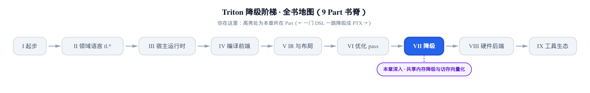
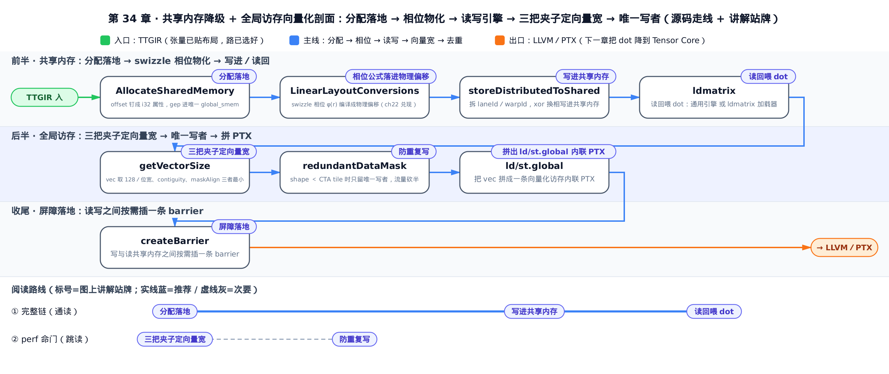
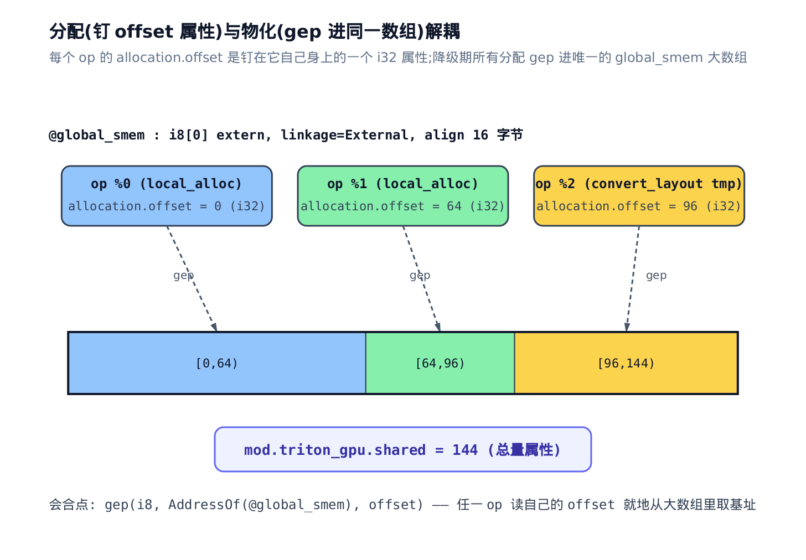
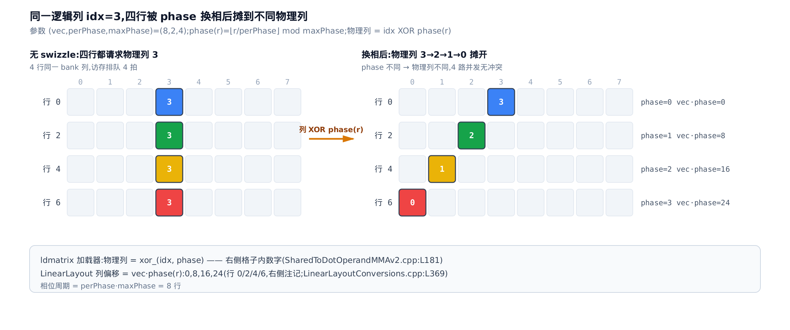
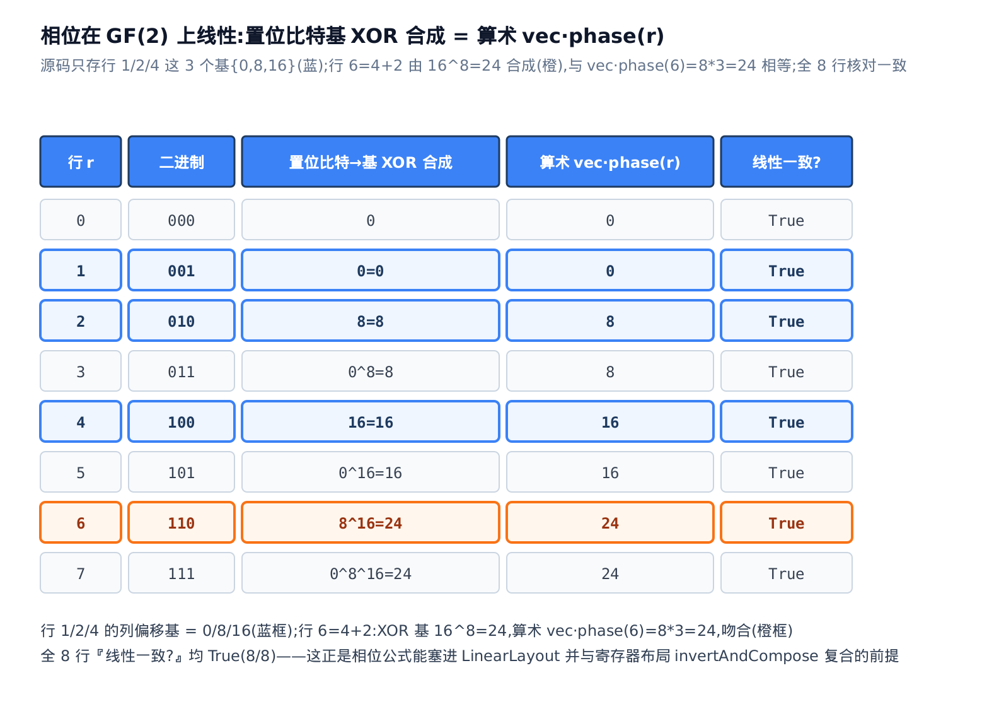
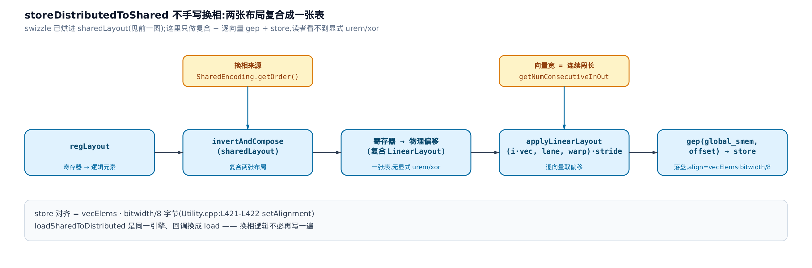
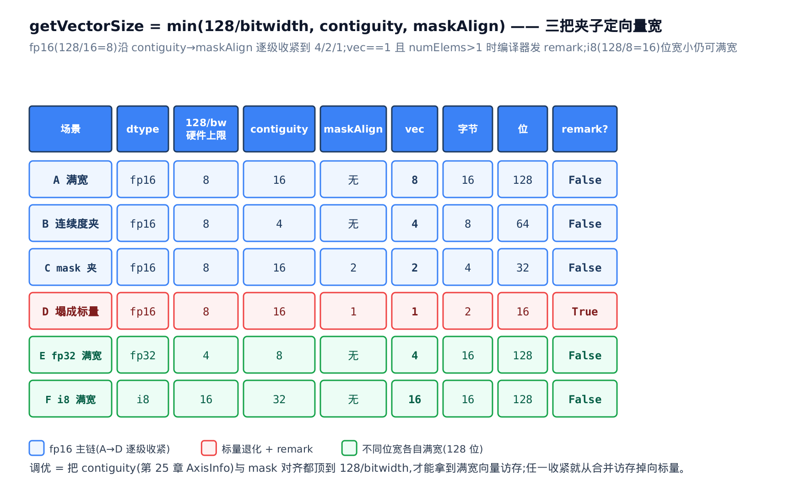
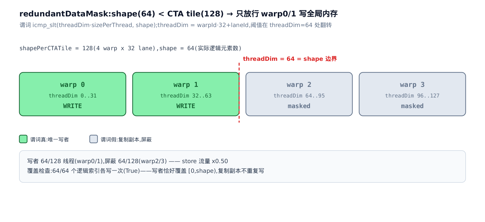

# 共享内存降级与全局访存向量化

> **你在这里**：一门 DSL 一路降到 PTX，本章在「降级」这一部分。
> 上一章把带布局的张量塌成 LLVM struct，也替 `convert_layout` 选好了路。
> 本章把共享内存的分配与访存真正降到 LLVM／PTX。
> 下一章把 `dot` 降成 Tensor Core 指令，走完出口。



[上一章](../../ch33-type-collapse-convertlayout-paths/narrative/chapter.md)结束时，一个带布局的张量已经变成了 `!llvm.struct`，`convert_layout` 也在三条路径里挑好了一条。但那条路径要落地，绕不开一块物理资源——**共享内存**（shared memory，片上一块由整个 block 共享的高速暂存区）。张量要先写进它、换个布局再读出来喂 `dot`；而张量要进 GPU、结果要出 GPU，又都得穿过**全局内存**（global memory，显存）。这两趟访存，就是一个 kernel 快慢的两个命门。

**这一章要解锁的性能杠杆，是访存带宽这本账。** 你读完能算三件事。其一，一次全局访存到底搬多少字节，由一条 `min` 公式定死（§5 展开）：向量宽取「硬件上限、指针连续度、mask 对齐」三者的最小值——**contiguity 不够或 mask 不对齐，你的 fp16 kernel 就从 128 位合并访存掉到标量访存，带宽只剩八分之一**，而且编译器会当场给你发一条 remark 警告。其二，共享内存的 bank conflict 怎么被 swizzle 换相消解——这是[第 22 章](../../ch22-shared-encoding-swizzle/narrative/chapter.md)埋下的公式在物理层真正兑现的地方。其三，广播布局下同一份数据被多个线程各持一份时，编译器怎么只让一个线程写全局内存、把 store 流量精确砍半。

本章反复回到几个文件：共享内存分配落地在 `lib/Conversion/TritonGPUToLLVM/AllocateSharedMemory.cpp`，写读共享内存的引擎在 `lib/Conversion/TritonGPUToLLVM/Utility.cpp`，swizzle 相位烘进布局在 `lib/Dialect/TritonGPU/IR/LinearLayoutConversions.cpp`，全局访存这场带宽战役在 `third_party/nvidia/lib/TritonNVIDIAGPUToLLVM/LoadStoreOpToLLVM.cpp`。全程内嵌真实 C++ 源码逐段读。

只想算向量化那本带宽账，直接跳「§5 三把夹子定向量宽」和「§6 防重复写」；只想看 bank conflict 怎么被换相消解，跳「§2 相位公式落进物理偏移」；想从共享内存怎么定址一路读到全局访存，就从 §1 开始。



> **怎么用这张图**：想通读就走蓝色实线①，从 §1 分配落地一路读到 §4 读回喂 dot；只想抠带宽命门，走虚线②直接跳 §5、§6 两节；每个站牌就是下面对应的 `§` 分节。

## §1 分配落地：offset 钉成属性，全 kernel 共用一个 global_smem

**直觉。** 分配共享内存这件事，被拆成了「算」和「用」两半，中间只靠一个整数属性接头。[第 26 章](../../ch26-shared-memory-allocation-membar/narrative/chapter.md)那套分析已经算出了每个 buffer 该放在共享内存的哪个字节区间——它的产物就是一串 `offset`。本章要做的不是重算，而是把这串 `offset` **钉**到每个 op 身上，再在降级时让每个 op 读自己的 `offset`，从同一块大数组里 `gep`（LLVM 的 `getelementptr`，按元素或字节算地址偏移的指令）出自己的基址。分配与物化就此解耦：降级期任何需要共享内存的 op，只看自己那个整数就够了，不必重跑分配。



> **先修一步｜编译期共享内存分配 = 离线存储分配问题。** 把哪个 buffer 放在共享内存的哪段字节，等价于给一批有生命周期的区间做无冲突的存储布置——这可归约为区间图着色 / 离线动态存储分配问题，有经典的 2-近似算法（Gergov，SODA 1999）。你不需要看它的证明：接受「有一套分析能算出一组不打架的 `offset`」这个结论就能往下读。那套分析的算法本体（活跃区间、冲突图、first-fit）在[第 26 章](../../ch26-shared-memory-allocation-membar/narrative/chapter.md)已经讲透；本章只负责把它算出的 `offset` 物化成 `gep`。

**机制。** `AllocateSharedMemory` 是一个 `ModuleOp` 上的 pass（这里还在 TritonGPU 层，尚未碰 LLVM）。它做三件事：跑一遍分配、把每个 op 的 `offset` 钉成属性、把总量钉成模块属性。看它的主体：

```cpp
// lib/Conversion/TritonGPUToLLVM/AllocateSharedMemory.cpp:L23-L52
void runOnOperation() override {
    ModuleOp mod = getOperation();
    MLIRContext *ctx = &getContext();
    ModuleAllocation allocation(mod);

    mod.walk([&](FunctionOpInterface funcOp) {
      funcOp.walk([&](Operation *op) {
        auto *funcAllocation = allocation.getFuncData(funcOp);
        auto oBufferId = funcAllocation->getBufferId(op);
        int offset = -1;
        if (oBufferId != Allocation::InvalidBufferId)
          offset = funcAllocation->getOffset(oBufferId);
        else if (op->getNumResults() == 1) {
          Value value = op->getResult(0);
          auto vBufferId = funcAllocation->getBufferId(value);
          if (vBufferId != Allocation::InvalidBufferId)
            offset = funcAllocation->getOffset(vBufferId);
        }
        if (offset == -1)
          return;
        if (op->hasAttr("allocation.offset"))
          return;
        op->setAttr("allocation.offset",
                    IntegerAttr::get(IntegerType::get(ctx, 32), offset));
      });
    });
    mod->setAttr("triton_gpu.shared",
                 mlir::IntegerAttr::get(mlir::IntegerType::get(ctx, 32),
                                        allocation.getSharedMemorySize()));
}
```

第一行 `ModuleAllocation allocation(mod)` 就是把[第 26 章](../../ch26-shared-memory-allocation-membar/narrative/chapter.md)那套分析跑一遍——它的染色 / 生命周期算法本体本章不重讲，我们只关心它吐出来的结果 `offset`。`walk` 里对每个 op 取 `getBufferId → getOffset`（op 自己是个 buffer，或者它唯一的 result value 是个 buffer，两种情况都覆盖）；拿到 `offset` 后一句 `op->setAttr("allocation.offset", …)`，把它钉成一个 **i32 属性**（32 位整数属性）。最后一句 `mod->setAttr("triton_gpu.shared", …)`，把整块共享内存的总字节数钉成模块级属性——launch 时驱动就按它开辟动态共享内存。

**源码：offset 属性怎么变成真地址。** 属性只是个整数，它得和一块真实内存汇合。那块内存在整个 pass 起手时就建好了，只有一块，全 kernel 共用：

```cpp
// third_party/nvidia/lib/TritonNVIDIAGPUToLLVM/TritonGPUToLLVM.cpp:L203-L220
void initSharedMemory(LLVMTypeConverter &typeConverter) {
    ModuleOp mod = getOperation();
    OpBuilder b(mod.getBodyRegion());
    auto ctx = mod.getContext();
    auto loc = mod.getLoc();
    auto elemTy = typeConverter.convertType(b.getIntegerType(8));
    // Set array size 0 and external linkage indicates that we use dynamic
    // shared allocation to allow a larger shared memory size for each kernel.
    //
    // Ask for 16B alignment on global_smem because that's the largest we should
    // ever need (4xi32).
    auto arrayTy = LLVM::LLVMArrayType::get(elemTy, 0);
    auto global = b.create<LLVM::GlobalOp>(
        loc, arrayTy, /*isConstant=*/false, LLVM::Linkage::External,
        "global_smem", /*value=*/Attribute(), /*alignment=*/16,
        static_cast<unsigned>(NVVM::NVVMMemorySpace::kSharedMemorySpace));
}
```

这里造出的 `global_smem`，是一个类型为 `i8[0]`（长度为 0 的字节数组）、`External` linkage（外部链接，即符号由外部提供、本模块不写死大小）的全局变量。**长度写 0 不是笔误**：它是「动态共享内存」的约定——真实大小推迟到 launch 时按上面那个 `triton_gpu.shared` 传入，好让同一个 kernel 能申请超过静态上限的共享内存。所有 buffer 都是这块大数组里的一段字节区间。对齐要 16 字节，因为最宽的一次访问是 `4xi32`（128 位）。

`offset` 和 `global_smem` 的汇合点在 `getSharedMemoryBase`：

```cpp
// include/triton/Conversion/TritonGPUToLLVM/Utility.h:L398-L411
inline Value getSharedMemoryBase(Location loc, RewriterBase &rewriter,
                                 const TargetInfoBase &target, Operation *op) {
  auto ptrTy = LLVM::LLVMPointerType::get(rewriter.getContext(),
                                          target.getSharedAddressSpace());
  FunctionOpInterface func =
      op->template getParentOfType<FunctionOpInterface>();
  assert(op->hasAttr("allocation.offset"));
  size_t offset = cast<IntegerAttr>(op->getAttr("allocation.offset"))
                      .getValue()
                      .getZExtValue();
  Value offVal = i32_val(offset);
  Value base = gep(ptrTy, i8_ty, LLVM::getStackPointer(rewriter, func), offVal);
  return base;
}
```

一句 `assert(op->hasAttr("allocation.offset"))`——降级到这里，op 身上必须已经有那个属性，否则前面的 pass 漏钉了。读出 `offset`，`getStackPointer` 对 kernel 函数返回的正是 `AddressOf(global_smem)`——名字里的「Stack」是个抽象叫法：它把这块共享内存当成每个 kernel 一份、由各 op 按 `offset` 切段复用的「栈」来看待（概念上像栈帧分配），并不真指向硬件调用栈，返回的就是那唯一的 `global_smem` 基址。`gep(i8, base, offVal)` 就把这个 op 的共享基址算了出来。一句话：**分配算好的字节偏移，在这里变成了指进大数组的一根指针**。图里三个 op 各自的 `offset`（0／64／96）对应大数组里 `[0,64)`／`[64,96)`／`[96,144)` 三段，模块总量属性是 144——就是这个意思。

## §2 相位公式落进物理偏移：第 22 章的悬念在这里兑现

[第 22 章](../../ch22-shared-encoding-swizzle/narrative/chapter.md)讲清了共享内存为什么要 swizzle（换相）：GPU 的共享内存分成 32 个 bank（存储体），一个 warp 的 32 个线程若同一拍都去访同一个 bank 的不同地址，就得排队串行——这叫 bank conflict。swizzle 的办法是把「逻辑列」按行号做一个错位，让本该撞同一 bank 的访问散到不同 bank。那一章给出了错位量的公式与六个参数（`vec`／`perPhase`／`maxPhase`／`order`／`CTALayout`／`hasLeadingOffset`）的来历，但留了一个悬念：这个数学公式，在真正降级到 LLVM 时，到底怎么变成一串地址算术？**这一节就是那个悬念的兑现。**

**直觉。** 把它想成图书馆按行斜着摆书：第 0 排放原位，往下每隔几排整体右移一格，本该挤在同一列（同一 bank）的书就散到不同货架，多人同时取书不用抢同一架。「斜移量」就是这一行的相位 `` $`\phi(r)`$ ``，「移法」就是把列号和相位做异或。这一节要看的，就是这个「斜移」怎么变成一串真实的地址算术。

先把公式抄在手边（符号含义见[第 22 章](../../ch22-shared-encoding-swizzle/narrative/chapter.md)，这里只用不推）：

```math
\phi(r) = \left\lfloor \frac{r}{\mathrm{perPhase}} \right\rfloor \bmod \mathrm{maxPhase}
```

`` $`\phi(r)`$ `` 是第 `` $`r`$ `` 行的相位（错位挡数）：每 `perPhase` 行共享一个相位（所以有取整），相位在 `maxPhase` 内循环（所以有取模）。物理列 = 逻辑列 XOR `` $`\phi(r)`$ ``，错位的偏移粒度是 `vec`。注意下面那张表会把同一个相位按两种粒度体现：`ldmatrix` 路径按矩阵**索引**直接异或相位（不乘 `vec`），`LinearLayout` 路径按字节**列偏移**要乘上 `vec`——本质是同一个相位，只是度量单位不同，别被两栏数字不一样绊住。

**兑现有两处，走两条不同的降级路径。** 一处在通用路径：相位被烘进共享内存的 `LinearLayout`（线性布局，[第 23 章](../../ch23-linear-layout/narrative/chapter.md)那套用比特线性映射描述布局的框架）的基向量里，由 `storeDistributedToShared` 间接消费（§3 讲）。另一处在 Tensor Core 专用的 `ldmatrix`（load matrix，一条让整个 warp 协作从共享内存搬矩阵进寄存器的指令，§4 详讲）加载器里，把 `` $`\phi(r)`$ `` 显式写成 `urem`／`udiv`／`xor_`，好把矩阵直接摆成 `MMAv2`（Ampere 第二代 Tensor Core 的矩阵乘累加，见[第 27 章](../../ch27-tensor-core-mma-layout/narrative/chapter.md)）`dot` 要的布局。先看数值，再看两处源码。

**机制：一个逻辑列被摊开的全过程。** 取一组非平凡参数 `vec=8, perPhase=2, maxPhase=4`，盯住逻辑列 `idx=3`，看它在 8 行里落到哪。

<!-- trace: m2-swizzle-phase-to-physical-offset -->

| 行 r | ⌊r/perPhase⌋ | phase = mod maxPhase | ldmatrix 列 = 3 XOR phase | LinearLayout 列偏移 = vec·phase | XOR 基复合（基 {1:0, 2:8, 4:16}） | 线性一致？ |
|---|---|---|---|---|---|---|
| 0 | 0 | 0 | 3 | 0 | 0 | True |
| 1 | 0 | 0 | 3 | 0 | 0 | True |
| 2 | 1 | 1 | 2 | 8 | 8 | True |
| 3 | 1 | 1 | 2 | 8 | 8 | True |
| 4 | 2 | 2 | 1 | 16 | 16 | True |
| 5 | 2 | 2 | 1 | 16 | 16 | True |
| 6 | 3 | 3 | 0 | 24 | 24 | True |
| 7 | 3 | 3 | 0 | 24 | 24 | True |
| 8 | 4 | 0 | 3 | 0 | （周期回绕 → 同行 0） | period=8 |

一路读下来：`perPhase=2` 让相邻两行共享相位（行 0／1 相位都是 0，行 2／3 都是 1），`maxPhase=4` 让相位在 4 内循环——行 8 相位回到 0，说明相位周期是 `perPhase × maxPhase = 8` 行。逻辑列 3 在行 0／2／4／6 分别被换到物理列 3／2／1／0，本来四行都挤在列 3（撞同一 bank），现在摊成了四个不同列。



**机制：为什么它能塞进 LinearLayout？** 表里最右那两列（XOR 基复合、线性一致）藏着关键。`LinearLayout` 只能表达 **GF(2) 线性**映射（GF(2) 即二元有限域，运算就是比特异或与比特与；线性意味着「整体 = 各置位比特贡献的异或和」）。相位公式凭什么算线性？因为源码里**只存 2 的幂行的相位基**——行 1 的基 0、行 2 的基 8、行 4 的基 16——任意行的偏移由它二进制里的置位比特把对应基 XOR 起来。看行 6：二进制 `110 = 4+2`，XOR 基 = `16 XOR 8 = 24`，而算术相位 `vec·phase(6) = 8×3 = 24`，两者相等。全 8 行「线性一致」列都是 True，这不是巧合。

**不变量。** 相位公式在 GF(2) 上线性——只要存下 2 的幂行的基 `{行1:0, 行2:8, 行4:16}`，任意行的偏移就能由它二进制里的置位比特把对应基 XOR 合成，而这个合成值处处等于算术相位 `` $`\mathrm{vec}\cdot\phi(r)`$ ``。正因如此它才能塞进 `LinearLayout`、进而和寄存器布局复合（§3 的 `invertAndCompose` 靠的就是这个）；非线性的映射没法这样只存 3 个基就复原全表。



**源码兑现①：相位烘进 LinearLayout 基。** 这段逻辑住在 `sharedToLinearLayoutNoLeadingOffset`（把无 leading-offset 的共享布局转成 `LinearLayout` 的函数）里，就是把上面那张表的「LinearLayout 列偏移」一列写成代码的地方：

```cpp
// lib/Dialect/TritonGPU/IR/LinearLayoutConversions.cpp:L360-L372
  std::vector<std::vector<int>> bases2D;
  for (int logCol = 0; logCol < llvm::Log2_32(numCols); logCol++) {
    bases2D.push_back({0, 1 << logCol});
  }
  for (int logRow = 0; logRow < llvm::Log2_32(numRows); logRow++) {
    int row = 1 << logRow;
    int vec = shared.getVec();
    int perPhase = shared.getPerPhase();
    int maxPhase = shared.getMaxPhase();
    bases2D.push_back({row, (vec * ((row / perPhase) % maxPhase)) % numCols});
  }
  LinearLayout ctaLayout =
      LinearLayout({{S("offset"), bases2D}}, {rowDimName, colDimName});
```

外层循环只遍历 `logRow`，`row = 1 << logRow`——它只对 `row = 1, 2, 4, …` 这些 **2 的幂行**求基，一共 `log2(numRows)` 个。每个基的列分量正是 `(vec * ((row / perPhase) % maxPhase)) % numCols`，逐字就是相位公式 `` $`\mathrm{vec}\cdot\phi(r)`$ ``。`rowDimName`／`colDimName` 取自 `shared.getOrder()` 的第一、第二维——这就是[第 22 章](../../ch22-shared-encoding-swizzle/narrative/chapter.md)说的「按 `order` 换相」的落点，`order` 决定哪一维当行、哪一维当列。**换相被烘进了共享布局的基向量，谁消费这张布局，谁就自动带上了 swizzle。**

**源码兑现②：ldmatrix 加载器里的显式相位。** Tensor Core 那条路径不走通用 `LinearLayout`，它有自己固定的 8×8 矩阵搬运语义，直接把相位写成算术：

```cpp
// third_party/nvidia/lib/TritonNVIDIAGPUToLLVM/ConvertLayoutOpToLLVM/SharedToDotOperandMMAv2.cpp:L162-L192
  Value phase = urem(udiv(rowInMat, i32_val(perPhase)), i32_val(maxPhase));
  // … 省略：numPtrs 之外的坐标准备 …
  for (int i = 0; i < numPtrs; ++i) {
    Value contiguousIndex =
        add(contiguousMatIndex, i32_val(i * contiguousLoadMatOffset));
    if (warpsPerCTA[order[0]] > contiguousTileNumMats ||
        contiguousTileNumMats % warpsPerCTA[order[0]] != 0)
      contiguousIndex = urem(contiguousIndex, i32_val(contiguousTileNumMats));
    contiguousIndex = add(contiguousIndex, contiguousSliceMatOffset);
    Value contiguousIndexSwizzled = xor_(contiguousIndex, phase);
    if (tileShape[0] != 1) {
      Value batchOffset =
          mul(warpB, i32_val(tileShape[order[0]] * tileShape[order[1]]));
      offs[i] =
          add(batchOffset,
              add(mul(contiguousIndexSwizzled, i32_val(contiguousMatShape)),
                  mul(rowOffset, stridedSmemOffset)));
    } else {
      offs[i] = add(mul(contiguousIndexSwizzled, i32_val(contiguousMatShape)),
                    mul(rowOffset, stridedSmemOffset));
    }
  }
```

第一行 `phase = urem(udiv(rowInMat, perPhase), maxPhase)`——`udiv`（无符号整除）就是相位公式里除以 `perPhase` 再取整那一半，`urem`（无符号取模）就是对 `maxPhase` 取模那一半，**逐字就是相位公式 `` $`\phi(r)`$ ``**。往下 `contiguousIndexSwizzled = xor_(contiguousIndex, phase)`——列索引异或相位，正是表里「ldmatrix 列 = 3 XOR phase」那一列。这就是最字面意义上的「相位公式编译成物理偏移算术」：bank 换相 = 按行异或列。算出的 `offs[i]` 就是每个线程要读的 swizzle 后共享地址。至此，[第 22 章](../../ch22-shared-encoding-swizzle/narrative/chapter.md)的悬念在两条路径上都兑现了：通用路径把它烘进布局基，`ldmatrix` 路径把它写成 `urem`／`xor`。

## §3 写进共享内存：storeDistributedToShared 不手写换相

上一节看到相位已经烘进了 `LinearLayout`。那么把一个分布式张量真正写进 swizzle 过的共享内存时，代码里反而**看不到**任何 `urem` 或 `xor`——它们都藏在布局复合里。这一节看这条写入流水。

**直觉。** 写入引擎干的是一件复合的事：它手上有两张「地图」。一张是**寄存器布局**（哪个线程的哪个寄存器，对应逻辑张量的哪个元素）；另一张是**共享布局**（逻辑元素落到 swizzle 后的哪个物理共享地址，相位已烘在里面）。把这两张地图**复合**一次，就直接得到「寄存器 → 物理共享偏移」的一张总表。之后只是逐向量按表 `gep` 出地址、`store` 下去，没有任何显式换相算术——它已经被复合进那张表了。



**机制。** 入口是 `lowerDistributedToShared`。它先取出换相要用的 `order`，建好共享内存对象，就把活交给 `storeDistributedToShared`：

```cpp
// lib/Conversion/TritonGPUToLLVM/MemoryOpToLLVM.cpp:L18-L37
// blocked -> shared.
// Swizzling in shared memory to avoid bank conflict. Normally used for
// A/B operands of dots.
void lowerDistributedToShared(Location loc, Value src, Value dst,
                              Value adaptorSrc,
                              const SharedMemoryObject &smemObj,
                              const LLVMTypeConverter *typeConverter,
                              ConversionPatternRewriter &rewriter,
                              const TargetInfoBase &targetInfo) {
  auto srcTy = cast<RankedTensorType>(src.getType());
  auto dstTy = cast<MemDescType>(dst.getType());
  auto outOrd = mlir::cast<SharedEncodingAttr>(dstTy.getEncoding()).getOrder();
  // … 省略：3D rank 合法性 assert（仅作维度检查，不影响主流程）…
  auto elemTy = typeConverter->convertType(srcTy.getElementType());

  auto smemBase = smemObj.getBase();
  auto dstStrides = smemObj.getStrides();
  auto inVals = unpackLLElements(loc, adaptorSrc, rewriter);
  storeDistributedToShared(dstTy, srcTy, elemTy, inVals, smemBase, dstStrides,
                           loc, rewriter, targetInfo);
}
```

`outOrd = SharedEncodingAttr.getOrder()` 就是「按 `order` 换相」里那个 `order` 的来源。`storeDistributedToShared` 本身是薄封装，它只负责在每个向量地址处把寄存器值 `insert` 进一个向量再 `store`——真正的地址算术全在它调用的 `emitTransferBetweenRegistersAndShared` 里：

```cpp
// lib/Conversion/TritonGPUToLLVM/Utility.cpp:L403-L424
void storeDistributedToShared(MemDescType dstTy, RankedTensorType srcTy,
                              Type elemLlvmTy, ArrayRef<Value> srcVals,
                              Value smemBase, ArrayRef<Value> dstStrides,
                              Location loc, RewriterBase &rewriter,
                              const TargetInfoBase &target) {
  bool success = emitTransferBetweenRegistersAndShared(
      srcTy, dstTy, elemLlvmTy, /*maxVecElems=*/std::nullopt, smemBase,
      dstStrides, loc, rewriter, target, [&](VectorType vecTy, Value vecAddr) {
        ArrayRef<Value> vals = srcVals.take_front(vecTy.getNumElements());
        srcVals = srcVals.drop_front(vecTy.getNumElements());

        Value vec = undef(vecTy);
        for (int i = 0; i < vals.size(); i++) {
          vec = insert_element(vec, vals[i], i32_val(i));
        }
        store(vec, vecAddr)
            .setAlignment(vecTy.getNumElements() *
                          elemLlvmTy.getIntOrFloatBitWidth() / 8);
      });
  if (!success)
    llvm::report_fatal_error("Failed to emit transfer from register to shared");
}
```

注意那个 lambda：它拿到的 `vecAddr` **已经是算好的物理地址**，它只管把值填进向量、`store` 下去，`setAlignment` 定为 `向量元素数 × 位宽 / 8` 字节。换相在哪？在 `emitTransferBetweenRegistersAndShared` 内部。看它的核心两步——先复合，后逐向量取地址：

```cpp
// lib/Conversion/TritonGPUToLLVM/Utility.cpp:L282-L310
  std::optional<LinearLayout> regLayout =
      triton::gpu::toLinearLayout(shape, registerTy.getEncoding());
  std::optional<LinearLayout> sharedLayout = triton::gpu::toLinearLayout(
      shape, sharedTy.getEncoding(), elemLlvmTy.getIntOrFloatBitWidth());
  if (!regLayout.has_value() || !sharedLayout.has_value()) {
    return false;
  }
  auto sharedOrder = triton::gpu::getOrder(sharedTy.getEncoding());
  // ...
  // regToSharedLayout maps from (register, lane, warp, block) to (offsetX1,
  // ..., offsetXN, block), where the offsetX's are in minor-to-major order.
  LinearLayout regToSharedLayout = regLayout->invertAndCompose(*sharedLayout);
```

`sharedLayout` 就是 §2 那张烘了相位的共享布局。关键在最后一句 `regLayout->invertAndCompose(*sharedLayout)`：`invertAndCompose`（求逆再复合）把「寄存器 → 逻辑元素」这张图求逆、和「逻辑元素 → swizzle 物理地址」这张图接上，复合成 `regToSharedLayout`——一张「寄存器 → 物理共享偏移」的总表。**swizzle 已经在 `sharedLayout` 里，复合之后它自然进了总表**，后面没人再写换相。这一步能成立，靠的正是 §2 证过的「相位在 GF(2) 上线性」——非线性的映射没法这样复合。

有了总表，逐向量取地址就是机械活：

```cpp
// lib/Conversion/TritonGPUToLLVM/Utility.cpp:L341-L374
  const int vecElems =
      std::min(regToSharedLayout.getNumConsecutiveInOut(),
               maxVecElems.value_or(std::numeric_limits<int>::max()));

  Value threadId = getThreadId(rewriter, loc);
  Value threadsPerWarp = i32_val(regToSharedLayout.getInDimSize(kLane));
  Value laneId = urem(threadId, threadsPerWarp);
  Value warpId = udiv(threadId, threadsPerWarp);

  int numElems = regToSharedLayout.getInDimSize(kRegister);
  auto vecTy = vec_ty(elemLlvmTy, vecElems);
  auto ptrTy = shmemBase.getType();
  Value zero = i32_val(0);
  for (int i = 0; i < numElems / vecElems; i++) {
    auto multiDimShmemOffset =
        llvm::to_vector(llvm::drop_end(llvm::make_second_range(
            applyLinearLayout(loc, rewriter, regToSharedLayout,
                              {{kRegister, i32_val(i * vecElems)},
                               {kLane, laneId},
                               {kWarp, warpId},
                               {kBlock, zero}}))));
    Value shmemOffset = dot(rewriter, loc, multiDimShmemOffset,
                            applyPermutation(shmemStrides, sharedOrder));
    auto vecAddr = gep(ptrTy, elemLlvmTy, shmemBase, shmemOffset);
    vecAddr.setInbounds(true);
    perVectorCallback(vecTy, vecAddr);
  }
  return true;
```

向量宽 `vecElems = getNumConsecutiveInOut()`——总表里连续寄存器映射到连续共享元素的**最长连续段**，一次能搬多少就搬多少。循环里 `applyLinearLayout` 把 `(register, lane, warp)` 代进总表，吐出多维偏移，和 stride 点积成标量 `shmemOffset`，`gep` 出地址交给回调 `store`。（上面那两句 `urem`／`udiv` 别看错——它们只是拆 `threadId` 算 `laneId`／`warpId` 的线程坐标运算，和 §2 换相用的 phase `urem`／`xor` 是两回事。）**§2 那种换相 `urem`／`xor` 才是在这里消失的**：`applyLinearLayout` 已经把它们具现成了一串 LLVM 的位运算与加法，读者看不到，但物理效果和 §2 那张表逐行相符。读回路径 `loadSharedToDistributed` 是同一个引擎，只是回调从 `store` 换成 `load`。

## §4 读回喂 dot：通用路径与 ldmatrix 加载器

数据写进 swizzle 共享内存后，要读回来喂给 `dot`（矩阵乘）。这里有两条路，选哪条取决于目标布局。

**通用路径。** `LocalLoadOpConversion`（`local_load` op 的降级模式）处理大多数情况：读回成 Blocked、MMA、Slice 布局，或 Ampere 上 `kWidth==8`（`kWidth` 指 dot 操作数每个线程沿 K 维打包的元素个数）的窄 dot 操作数。它走的是 §3 那同一个引擎——`lowerSharedToDistributed → loadSharedToDistributed → emitTransferBetweenRegistersAndShared`，只是回调换成 `load`；Ampere 上再把 i8／bf16 打包成 i32 喂给 MMA。**它不发 `ldmatrix`**，全程通用 `LinearLayout`——你在 §3 已看过这套引擎（`emitTransferBetweenRegistersAndShared`）的完整代码，里面只有拆 `laneId`／`warpId` 的 `urem`／`udiv`，没有一条 `ldmatrix` 或显式 swizzle 指令。

**ldmatrix 路径。** 喂 MMAv2（[第 27 章](../../ch27-tensor-core-mma-layout/narrative/chapter.md)讲的 Ampere 第二代 Tensor Core 矩阵乘累加）操作数时，走的是 §2 兑现②那个手写显式 swizzle 的加载器，末尾发一条专用指令：

```cpp
// third_party/nvidia/lib/TritonNVIDIAGPUToLLVM/ConvertLayoutOpToLLVM/SharedToDotOperandMMAv2.cpp:L350-L358
    // ldmatrix.m8n8.x4 returns 4x2xfp16(that is 4xb32) elements for a
    // thread.
    auto resArgs = builder.newListOperand(4, "=r");
    auto addrArg = builder.newAddrOperand(readPtr, "r");

    auto ldmatrix = builder.create("ldmatrix.sync.aligned.m8n8.x4")
                        ->o("trans", needTrans /*predicate*/)
                        .o("shared.b16");
    ldmatrix(resArgs, addrArg);
```

`ldmatrix`（load matrix，一条让整个 warp 协作从共享内存搬矩阵进寄存器的指令）这一条 `ldmatrix.sync.aligned.m8n8.x4`，让 32 个线程配合搬 4 张 8×8 的 b16 矩阵进寄存器，**一步就摆成 MMAv2 `dot` 操作数所需的线程-寄存器布局**（[第 27 章](../../ch27-tensor-core-mma-layout/narrative/chapter.md)那套 MMA 编码）。`needTrans` 决定要不要转置搬运。这条路径为什么值得手写、不复用通用引擎？因为 `ldmatrix` 有固定的 8×8 矩阵语义和 warp 内线程-地址约定，需要按矩阵坐标**精确**算 `phase` 和列异或来对齐 bank——它是更贴 NVIDIA 硬件的加载器，比通用路径省掉了一次布局转换。**所以你写 kernel 时，让 `dot` 的操作数走 MMA 布局、命中这条 `ldmatrix` 路径，就是在省 Tensor Core 喂数的开销。**

## §5 三把夹子定向量宽：全局访存的带宽命门

到这里数据已经能在共享内存里换相流转。但张量进出 GPU 要穿全局内存，而全局访存的带宽，全押在一个数上：**一次访存搬几个元素（向量宽 `vec`）**。这一节是本章的性能核心。

**直觉。** 搬家时你一次能抱几个箱子，取决于三件事：货车一趟最多装 128 斤（硬件上限）、这批箱子在货架上是不是挨着（contiguity，指针连续度）、以及提货单是不是按整组开的（mask 对齐）。三者取最小，才是你实际一次能抱走的数量；任一不满足，就退化到一次抱一个——标量访存。

**机制。** 向量宽由 `getVectorSize` 定，公式就一行：

```math
\mathrm{vec} = \min\!\left(\frac{128}{\mathrm{bitwidth}},\ \mathrm{contiguity},\ \mathrm{maskAlign}\right)
```

`` $`128/\mathrm{bitwidth}`$ `` 是硬件天花板（NVIDIA 单条访存物理上限 128 位，fp16 能塞 8 个、fp32 塞 4 个、i8 塞 16 个）；`contiguity` 是[第 25 章](../../ch25-axisinfo-coalesce/narrative/chapter.md) `AxisInfo` 在编译期证出的指针连续度；`maskAlign` 是 mask 的对齐粒度。三者取最小。拿六个场景走一遍：

<!-- trace: m5-global-load-vectorization -->

| 场景 | dtype | bitwidth | 128/bw | contiguity | maskAlign | vec | 字节 | 位 | remark 警告？ |
|---|---|---|---|---|---|---|---|---|---|
| A 满宽 | fp16 | 16 | 8 | 16 | 无 | 8 | 16 | 128 | False |
| B 连续度夹 | fp16 | 16 | 8 | 4 | 无 | 4 | 8 | 64 | False |
| C mask 夹 | fp16 | 16 | 8 | 16 | 2 | 2 | 4 | 32 | False |
| D 塌成标量 | fp16 | 16 | 8 | 16 | 1 | 1 | 2 | 16 | True |
| E fp32 满宽 | fp32 | 32 | 4 | 8 | 无 | 4 | 16 | 128 | False |
| F i8 满宽 | i8 | 8 | 16 | 32 | 无 | 16 | 16 | 128 | False |

一路看下来就是一条 `min` 链在收紧。场景 A：fp16、`contiguity=16` 顶满硬件上限 8、无 mask，`vec=8` → 128 位满带宽。场景 B：`contiguity` 掉到 4，`vec=4` → 64 位，**带宽当场减半**。场景 C：mask 只对齐到 2，`vec=2` → 32 位。场景 D：mask 只对齐到 1，`vec` 塌成 1 → 16 位标量，**带宽只剩八分之一**，而且触发编译器 remark。场景 E／F 是不同位宽下的满宽：fp32 塞 4 个、i8 塞 16 个，都恰好 128 位——**位宽越小，一次能搬的元素越多**。（六个场景的完整数字都在上表；下图把逐级收紧的过程连同满宽对照一并画出。）



**不变量。** `vec` 沿 `min` 链单调不增，同时受三个上限约束、下界为 1：

```math
\mathrm{vec} \le \frac{128}{\mathrm{bitwidth}}, \qquad \mathrm{vec} \le \mathrm{contiguity}, \qquad \mathrm{vec} \le \mathrm{maskAlign}
```
等号只在三个上限都放行时取到满宽 128 位；任一收紧，`vec` 只会更小或不变（场景 A→C→D 随 `maskAlign` 从 16→2→1，`vec` 从 8→2→1 严格下降）。各项都是正整数，故 `vec ≥ 1`——这就是它的终值，无需迭代。

**源码。** 公式的两半分在两处。先看 `getVectorSize`：

```cpp
// third_party/nvidia/lib/TritonNVIDIAGPUToLLVM/LoadStoreOpToLLVM.cpp:L132-L142
  unsigned getVectorSize(Value ptr) const {
    auto tensorTy = dyn_cast<RankedTensorType>(ptr.getType());
    if (!tensorTy)
      return 1;
    auto contiguity = getContiguity(ptr);
    auto pointeeBitWidth = triton::getPointeeBitWidth(tensorTy);
    LDBG("getVectorSize contiguity = " << contiguity << " pointeeBitWidth = "
                                       << pointeeBitWidth);
    // The maximum vector size is 128 bits on NVIDIA GPUs.
    return std::min<unsigned>(128 / pointeeBitWidth, contiguity);
  }
```

`getContiguity(ptr)` 直接转发 `axisAnalysisPass.getPtrContiguity(ptr)`——就是[第 25 章](../../ch25-axisinfo-coalesce/narrative/chapter.md) `AxisInfo` 推断的连续度。返回值 `min(128 / pointeeBitWidth, contiguity)`，逐字就是公式前两半。mask 那一刀在调用处：

```cpp
// third_party/nvidia/lib/TritonNVIDIAGPUToLLVM/LoadStoreOpToLLVM.cpp:L185-L201
    unsigned vec = getVectorSize(ptr);
    unsigned numElems = getTotalElemsPerThread(ptr.getType());
    unsigned vecOrig = vec;
    if (llMask) {
      LLVM_DEBUG(DBGS() << "vec = " << vec
                        << " mask_alignment = " << getMaskAlignment(mask));
      vec = std::min<size_t>(vec, getMaskAlignment(mask));
      LLVM_DEBUG(llvm::dbgs() << " vec = " << vec << '\n');
    }

    if (vec == 1 && numElems > 1) {
      int maskValue = !llMask ? -1 : getMaskAlignment(mask);
      op->emitRemark() << "Warning: vectorization fails vec = " << vec
                       << " origin vec = " << vecOrig
                       << " numElems = " << numElems << " mask is " << maskValue
                       << "\n";
    }
```

有 mask 就 `vec = min(vec, getMaskAlignment(mask))`——第三把夹子。最下面那个 `if`：`vec` 塌到 1 而本可向量化（`numElems > 1`）时，`op->emitRemark()` 发一条警告。**这条 remark 是你调优时能真实看到的编译器提示**：它在告诉你「这个访存本该向量化，被 mask 或连续度打回标量了」。store 侧结构完全对称。所以调优的目标很直接——把 contiguity 和 mask 对齐这两把夹子都顶到 `` $`128/\mathrm{bitwidth}`$ ``，才拿得到满宽合并访存（coalescing，warp 内 32 线程的地址落在连续段、被硬件合并成一次事务）。

## §6 防重复写：redundantDataMask 只留唯一写者

向量宽定了一次搬多少，但还有个正确性 + 带宽的坑：广播布局下，同一份数据被多个线程各持一份副本，**若都往全局内存写，同一个地址就被写好几遍**——白耗带宽，甚至竞态。`redundantDataMask` 就是那条只留一个写者的规矩。

**直觉。** 一份公告被抄给了整栋楼每层各一份，但只需要往公示栏贴一次。`redundantDataMask` 就是那条规矩：同一份数据被多个线程各持一份时，只让「排在真实名额内」的那个线程去写，其余持副本的线程闭嘴。

**机制。** 判据是：某维若 `shape[dim] < shapePerCTATile[dim]`（逻辑形状小于一个 CTA tile 覆盖的宽度，CTA 即 cooperative thread array，也就是一个 thread block），说明这维数据在 tile 内被复制了。对复制的那批线程，用 `icmp_slt(threadDim × sizePerThread, shape)`（有符号小于比较）判定：起始索引落在真实形状内的才当写者。取一组会触发去重的参数走一遍：`shape=64`，`shapePerCTATile=128`（= `sizePerThread 1 × threadsPerWarp 32 × warpsPerCTA 4`），`sizePerThread=1`。

<!-- trace: m6-redundant-data-mask -->

| warp | lane | threadDim = warp×32+lane | threadDim × sizePerThread | < shape(64)？ | 动作 |
|---|---|---|---|---|---|
| 0 | 0 | 0 | 0 | True | WRITE |
| 0 | 31 | 31 | 31 | True | WRITE |
| 1 | 0 | 32 | 32 | True | WRITE |
| 1 | 31 | 63 | 63 | True | WRITE |
| 2 | 0 | 64 | 64 | False | masked |
| 2 | 31 | 95 | 95 | False | masked |
| 3 | 0 | 96 | 96 | False | masked |
| 3 | 31 | 127 | 127 | False | masked |

`shape=64 < tile=128`，复制倍数 = `128/64 = 2`——每个逻辑元素被两个线程各持一份。阈值恰在 `threadDim=64` 翻转：warp0／warp1（`threadDim` 0..63）起始索引都 `<64`，是唯一写者；warp2／warp3（64..127）谓词（predicate，这里指那个决定线程写不写的真假开关）为假，被屏蔽。128 个线程里 64 个写、64 个静默，**store 全局流量精确砍到 0.50**，而每个真实地址恰被写一次。



**不变量。** 每个真实全局地址恰被写一次。线程 `threadDim` 负责逻辑索引区间 `[threadDim × sizePerThread, threadDim × sizePerThread + sizePerThread)`；谓词 `threadDim × sizePerThread < shape` 选出的写者，起始索引都 `<shape`。因 `sizePerThread=1` 且 `threadDim` 遍历 0..127，写者恰为 `threadDim ∈ [0,64)`，无缝覆盖索引 0..63 各一次——满射且单射。warp2／warp3 起始索引 `≥64`，正是那 2× 复制的副本，被屏蔽。

**源码。** 掩码从 `mask = 1`（全真）出发，逐维收紧：

```cpp
// third_party/nvidia/lib/TritonNVIDIAGPUToLLVM/LoadStoreOpToLLVM.cpp:L29-L63
Value redundantDataMask(Type valueTy, ConversionPatternRewriter &rewriter,
                        Location loc, const NVIDIA::TargetInfo &targetInfo) {
  auto tensorTy = dyn_cast<RankedTensorType>(valueTy);
  Value mask = int_val(1, 1);
  auto tid = tid_val();
  auto clusterCTAId = targetInfo.getClusterCTAId(rewriter, loc);
  if (tensorTy) {
    auto layout = tensorTy.getEncoding();
    auto shape = tensorTy.getShape();
    unsigned rank = shape.size();
    auto sizePerThread = triton::gpu::getSizePerThread(layout);
    auto threadsPerWarp = triton::gpu::getThreadsPerWarp(layout);
    auto warpsPerCTA = triton::gpu::getWarpsPerCTA(layout);
    auto order = triton::gpu::getOrder(layout);
    auto warpOrder = triton::gpu::getWarpOrder(layout);
    auto shapePerCTATile = triton::gpu::getShapePerCTATile(layout, shape);
    Value warpSize = i32_val(32);
    Value laneId = urem(tid, warpSize);
    Value warpId = udiv(tid, warpSize);
    SmallVector<Value> multiDimWarpId =
        delinearize(rewriter, loc, warpId, warpsPerCTA, warpOrder);
    SmallVector<Value> multiDimThreadId =
        delinearize(rewriter, loc, laneId, threadsPerWarp, order);
    for (unsigned dim = 0; dim < rank; ++dim) {
      // if there is no data replication across threads on this dimension
      if (shape[dim] >= shapePerCTATile[dim])
        continue;
      // Otherwise, we need to mask threads that will replicate data on this
      // dimension. Calculate the thread index on this dimension for the CTA
      Value threadDim =
          add(mul(multiDimWarpId[dim], i32_val(threadsPerWarp[dim])),
              multiDimThreadId[dim]);
      mask = and_(mask, icmp_slt(mul(threadDim, i32_val(sizePerThread[dim])),
                                 i32_val(shape[dim])));
    }
```

循环里 `if (shape[dim] >= shapePerCTATile[dim]) continue`——这维没复制就跳过，不加任何限制。否则算出这维的 `threadDim`（`warpId × threadsPerWarp + laneId`），一句 `mask = and_(mask, icmp_slt(threadDim × sizePerThread, shape))`，把「起始索引超出真实形状」的复制线程谓词压成假。这就是表里那一列判定的源头。最终这个 `mask` 会和用户的 mask 相与，一起当 store 的谓词——**既要用户 mask 为真、又要是唯一写者，两者与之后才真的写全局内存**。

## §7 拼出 ld/st.global 内联 PTX

向量宽和写者掩码都定了，最后一步是把它们拼成真正的访存指令——一条内联 PTX（NVIDIA 的虚拟汇编）。load 侧：

```cpp
// third_party/nvidia/lib/TritonNVIDIAGPUToLLVM/LoadStoreOpToLLVM.cpp:L276-L298
      auto &ld = ptxBuilder.create<>("ld")
                     ->o("volatile", op.getIsVolatile())
                     .global()
                     .o("ca", op.getCache() == triton::CacheModifier::CA)
                     .o("cg", op.getCache() == triton::CacheModifier::CG)
                     .o("L1::evict_first",
                        op.getEvict() == triton::EvictionPolicy::EVICT_FIRST)
                     .o("L1::evict_last",
                        op.getEvict() == triton::EvictionPolicy::EVICT_LAST)
                     .o("L1::cache_hint", hasL2EvictPolicy)
                     .v(nWords)
                     .b(width);

      PTXBuilder::Operand *evictOpr{};

      if (!evictOpr)
        ld(dstsOpr, addrOpr).predicate(pred, "b");
      else
        ld(dstsOpr, addrOpr, evictOpr).predicate(pred, "b");
```

（代码里 `evictOpr` 只声明未赋值，是略去了 `L1::cache_hint` 为真时对它赋值那几行后的骨架：有 L2 淘汰提示就走 `else` 带 `evictOpr` 的分支，否则走 `if`。）

拼出的 PTX 形如 `@%pred ld.global.ca.v4.b32 {…}, {[%addr]}`。逐个后缀看：`.global` 是地址空间；`.ca`／`.cg` 是 **cache-modifier**（缓存修饰，`.ca` 走 L1 缓存、`.cg` 绕过 L1 只用 L2）；`L1::evict_first`／`evict_last` 是 **evict-policy**（L1 淘汰提示，暗示这块数据优先／最后被踢出缓存）；`.v(nWords)` 是向量宽、`.b(width)` 是位宽——两者由 §5 定出的 `vec` 换算而来。整条由 `predicate(pred)` **谓词化**——把 §6 那个真假开关挂到整条指令上，谓词为假的线程静默不执行：mask 为假就不发访存，无需分支即实现掩码访存。

store 侧同构，谓词多与了一层去重掩码：

```cpp
// third_party/nvidia/lib/TritonNVIDIAGPUToLLVM/LoadStoreOpToLLVM.cpp:L426-L492
    Value mask = redundantDataMask(valueTy, rewriter, loc, targetInfo);
    const size_t dtsize =
        std::max<int>(1, valueElemTy.getIntOrFloatBitWidth() / 8);
    const size_t valueElemNBits = dtsize * 8;
    // ...
      Value maskVal = llMask ? and_(mask, maskElems[vecStart]) : mask;

      auto *asmAddr =
          ptxBuilder.newAddrOperand(ptrElems[vecStart], "l", in_off);

      auto &ptxStoreInstr =
          ptxBuilder.create<>("st")
              ->global()
              .o("wb", op.getCache() == triton::CacheModifier::WB)
              .o("cg", op.getCache() == triton::CacheModifier::CG)
              .o("cs", op.getCache() == triton::CacheModifier::CS)
              .o("wt", op.getCache() == triton::CacheModifier::WT)
              .o("L1::evict_first",
                 op.getEvict() == triton::EvictionPolicy::EVICT_FIRST)
              .o("L1::evict_last",
                 op.getEvict() == triton::EvictionPolicy::EVICT_LAST)
              .v(nWords)
              .b(width);
      ptxStoreInstr(asmAddr, asmArgList).predicate(maskVal, "b");
```

第一行 `mask = redundantDataMask(...)` 就是 §6 的去重掩码。往下 `maskVal = and_(mask, maskElems[vecStart])`——**store 谓词 = 去重掩码 ∧ 用户 mask**，两者都真才写。store 侧的 cache-modifier 是 `.wb`／`.cg`／`.cs`／`.wt`（写回／绕 L1／流式／直写），语义和 load 侧对称。至此，一个张量从共享内存换相、到全局内存合并访存、到去重写回的完整降级链就走通了。

## §8 屏障落地：什么时候真插一条 barrier

还有最后一根线头：共享内存被写了又读，中间要不要插同步屏障？这归[第 26 章](../../ch26-shared-memory-allocation-membar/narrative/chapter.md)的 `ModuleMembarAnalysis`（分析主体在 `include/triton/Analysis/Membar.h:L80-L145`）管——本章是它的降级落地端。那套分析维护每个 buffer 的读写区间，只在「写后读」或「读后写」且区间相交处才需要一条 barrier；`canSkipBarSync` 判定能不能省掉一次同步（比如后端认定安全的接缝）。真正 `createBarrier` 插进 IR 的时机由它定（落地端在 `third_party/nvidia/lib/TritonNVIDIAGPUToLLVM/LoadStoreOpToLLVM.cpp:L507-L516`），本章不重讲分析逻辑——你只需知道：**共享内存换相流转背后，有一套分析在替你精确地插最少的屏障**，插多了拖慢、插少了出错，都不是本章降级代码自己拍脑袋决定的。

## 小结：三把夹子，一条相位公式，一个唯一写者

这一章把共享内存与全局访存真正降到了 LLVM／PTX（分配落地 `lib/Conversion/TritonGPUToLLVM/AllocateSharedMemory.cpp:L23-L52`、访存战役 `third_party/nvidia/lib/TritonNVIDIAGPUToLLVM/LoadStoreOpToLLVM.cpp:L132-L142`），落到你写 kernel 时能用的三个决策：

- **向量宽是带宽命门。** 向量宽 = 「硬件上限、连续度、mask 对齐」三者取最小（§5 那条 `min` 公式）。想要 fp16 的 128 位满宽合并访存，就得让 `AxisInfo` 证出的连续度和 mask 对齐都顶到 8——任一不足，带宽成倍掉，编译器还会发 remark 点名。这是[第 25 章](../../ch25-axisinfo-coalesce/narrative/chapter.md) `AxisInfo` 在降级端的兑现。
- **bank conflict 靠换相消解，而换相是一条会编译的公式。** [第 22 章](../../ch22-shared-encoding-swizzle/narrative/chapter.md)埋的相位公式 `` $`\phi(r)`$ ``（§2 那一式），在这里两处落地：烘进共享 `LinearLayout` 的基向量、由 `storeDistributedToShared` 经 `invertAndCompose` 复合消费；以及在 `ldmatrix` 加载器里显式写成 `urem`／`xor` 喂 MMAv2 `dot`。让 `dot` 操作数命中 `ldmatrix` 路径，就是在省 Tensor Core 喂数的开销。
- **广播布局要防重复写。** `redundantDataMask` 用一条线性阈值只留唯一写者，把 store 流量精确砍到 `1/复制倍数`——这既是正确性（不竞态），也是带宽（不空写）。

下一章接着走完出口：把 `dot` 本身降成 Tensor Core 指令，一路吐出最终的 PTX。
