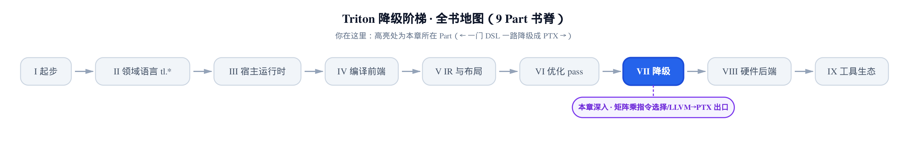
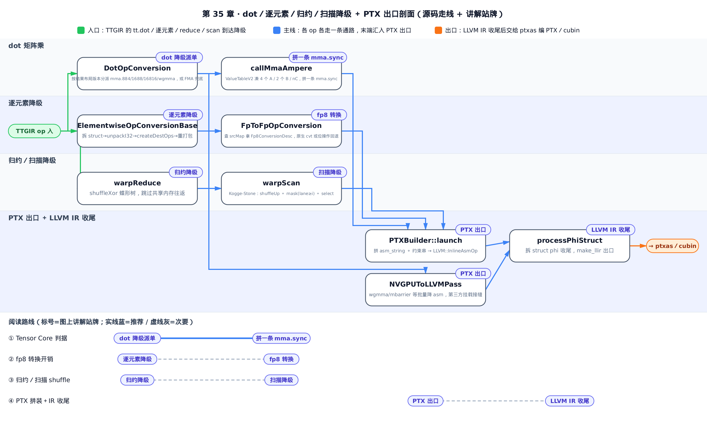
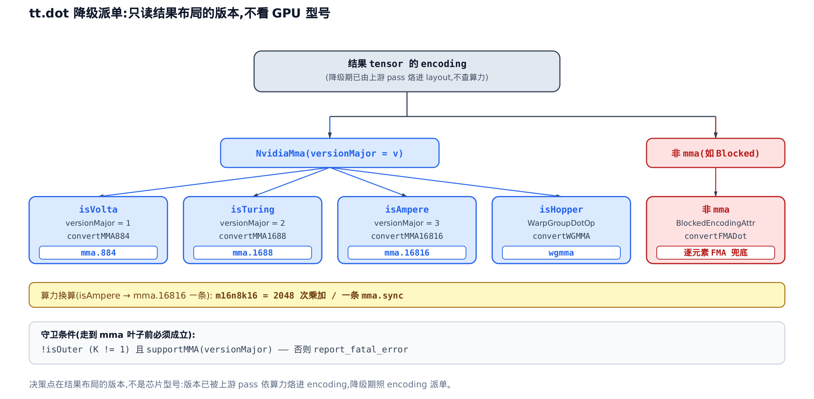
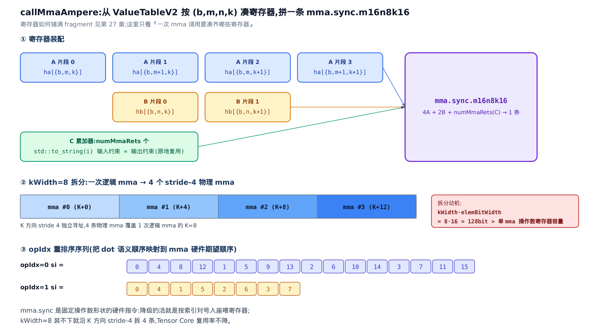
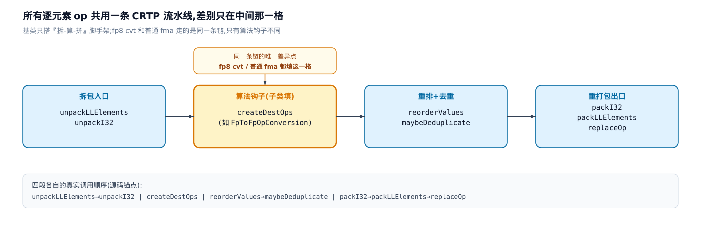
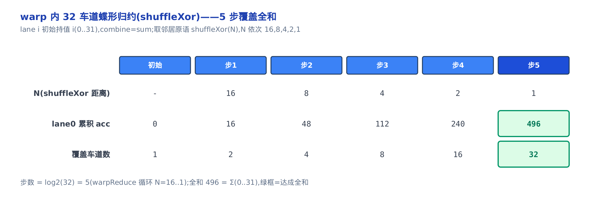
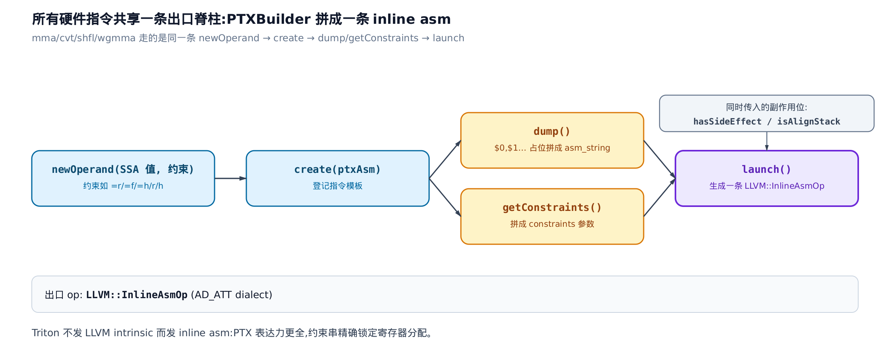
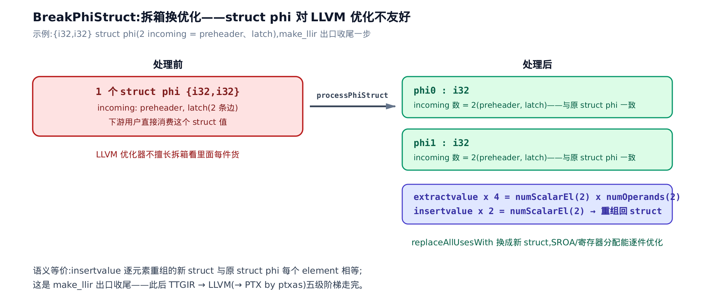

# 矩阵乘指令选择、逐元素／归约降级与 LLVM→PTX 出口

> **你在这里**：一门 DSL 一路降到 PTX，本章给「降级」这一部分收官。
> 上一章把共享内存与全局访存降到了 LLVM。
> 本章把 `dot`／逐元素／归约降完，拼出 PTX、收尾 LLVM IR。
> 下一章把这些降级 pass 注入真实编译管线。



[上一章](../../ch34-shared-memory-lowering-vectorization/narrative/chapter.md)把共享内存的分配、访存和全局访存的向量化都降到了 LLVM／PTX。一块张量进 GPU、换布局、再喂进计算单元的通路已经铺好。可到这里，`tt.dot`（Triton 的矩阵乘 op）、逐元素的类型转换、`tt.reduce`／`tt.scan` 这几个**真正干活的 op** 还悬在半空——它们还是 TritonGPU 层的高层算子，没有一条对应的硬件指令。本章就把这最后一段路走完：把每个 op 降成它该落的那条 PTX 指令，再把所有 PTX 拼成 LLVM 的 `inline asm`，最后收尾一遍 LLVM IR。走完这一步，全书那条 **TTGIR → LLVM →（PTX）** 的五级降级阶梯就到头了。

**这一章要解锁的性能杠杆，是「你的矩阵乘到底有没有用上 Tensor Core」这本账。** 一个 `tt.dot` 降级时只有两种命运：要么落到 `mma.16816` / `wgmma` 这类 Tensor Core 指令，一条抵两千次乘加；要么掉回 `convertFMADot`，退化成逐元素的标量乘加，慢一个数量级。决定命运的既不是你的 GPU 型号、也不是你写的 `tl.dot` 长什么样，而是**结果张量身上那个布局属性的版本号**。读完本章你就能对着 dump 出的 PTX / SASS 一眼认出：这条 `dot` 是真降到了 `wgmma`，还是悄悄掉进了 FMA 兜底。顺带你会看清 fp8 转换在新老架构上差 20 倍指令数的根、以及 `reduce` 为什么快在「不碰共享内存」。

本章反复回到这几个文件：`dot` 降级的分派表在 `third_party/nvidia/lib/TritonNVIDIAGPUToLLVM/DotOpToLLVM.cpp`，`mma` 操作数拼装在同目录的 `DotOpToLLVM/MMAv2.cpp`；逐元素模板在 `include/triton/Conversion/TritonGPUToLLVM/ElementwiseOpToLLVMBase.h`，fp8 转换在 `third_party/nvidia/lib/TritonNVIDIAGPUToLLVM/ElementwiseOpToLLVM.cpp`；归约与扫描在 `lib/Conversion/TritonGPUToLLVM/ReduceOpToLLVM.cpp` 和 `ScanOpToLLVM.cpp`；PTX 拼装脊柱在 `PTXAsmFormat.cpp` 与 `NVGPUToLLVMPass.cpp`；LLVM IR 收尾在 `lib/Target/LLVMIR/LLVMIRBreakPhiStruct.cpp`。全程内嵌真实 C++ 源码逐段读。

只想核对「dot 有没有降到 Tensor Core」，直接跳 §1；只想抠 fp8 转换开销，跳 §4；想跟归约／扫描怎么用 warp shuffle，读 §5、§6；想看 PTX 到底怎么拼出来、五级阶梯怎么收尾，读 §7、§8。想跟全程就从 §1 顺着读。



> **怎么用这张图**：想核对自己的 dot 有没有吃到 Tensor Core，走实线①，从 §1 dot 降级派单读到 §2 拼一条 mma.sync；只想抠 fp8 转换开销，走虚线②跳 §3→§4；只想看归约／扫描怎么用 warp shuffle，走虚线③跳 §5→§6；只想看 PTX 怎么拼出来、五级阶梯怎么收尾，走虚线④跳 §7→§8。

## §1 dot 降级派单：只读结果布局的版本，不看 GPU 型号

**直觉。** 把 `tt.dot` 降级想成一个派单员。他面前有四种 Tensor Core 指令（Volta 的 `mma.884`、Turing 的 `mma.1688`、Ampere 的 `mma.16816`、Hopper 的 `wgmma`）和一个标量兜底（`convertFMADot`，逐元素 FMA——fused multiply-add，融合乘加）。你可能以为派单员会去问「现在跑在哪块 GPU 上」，其实不会。他只低头看一样东西：**结果张量身上那个布局属性的版本号**。版本号是更早的 pass 依目标算力选好、烙进张量 encoding 的（见[第 27 章](../../ch27-tensor-core-mma-layout/narrative/chapter.md)——那里讲了 `NvidiaMmaEncodingAttr` 的版本怎么定），降级期照单派活即可，指令选择与降级就此解耦。



**机制。** 派单逻辑是一棵两层决策树。第一层的守卫：结果 encoding 必须是 `NvidiaMmaEncodingAttr`（Tensor Core 布局），且 `!isOuter`（`K != 1`，不是退化成外积的情形），且 `supportMMA` 认这个版本——三者齐备才进 `mma` 分支。第二层照 `versionMajor` 分派：`isVolta`（版本 1）走 `mma.884`、`isTuring`（版本 2）走 `mma.1688`、`isAmpere`（版本 3）走 `mma.16816`。任何一档没匹配上就 `report_fatal_error`——这等于要求上游 pass 必须已经保证了合法性。反过来，如果结果 encoding 根本不是 `mma` 布局（比如是 `BlockedEncodingAttr`，一种朴素的按块布局），那就掉进第二条出路：`convertFMADot`，逐元素标量乘加。

这两条出路的算力差是数量级的。一条 `mma.sync.aligned.m16n8k16` 做的是 `16×8×16` 的乘加块 = 2048 次乘加，由一个 warp（32 线程）协同一拍打完；而 FMA 兜底是每线程每周期 1 次乘加。所以「你的 dot 降到了哪条指令」，就是「用没用上 Tensor Core」的判据源头——这也是本章开头那个性能杠杆的落点。

**源码。** 派单表就是 `DotOpConversion::matchAndRewrite` 本体，短得可以整段读：

```cpp
// third_party/nvidia/lib/TritonNVIDIAGPUToLLVM/DotOpToLLVM.cpp:L34-L68
LogicalResult
matchAndRewrite(triton::DotOp op, OpAdaptor adaptor,
                ConversionPatternRewriter &rewriter) const override {
  Location loc = op->getLoc();
  // D = A * B + C
  Value A = op.getA();
  Value D = op.getResult();

  // Here we assume the DotOp's operands always comes from shared memory.
  auto AShapePerCTA = getShapePerCTA(A.getType());
  size_t reduceAxis = 1;
  unsigned K = AShapePerCTA[reduceAxis];
  bool isOuter = K == 1;

  NvidiaMmaEncodingAttr mmaLayout = dyn_cast<NvidiaMmaEncodingAttr>(
      cast<RankedTensorType>(D.getType()).getEncoding());
  if (!isOuter && mmaLayout && supportMMA(op, mmaLayout.getVersionMajor())) {
    if (mmaLayout.isVolta())
      return convertMMA884(op, adaptor, getTypeConverter(), rewriter);
    if (mmaLayout.isTuring())
      return convertMMA1688(op, adaptor, getTypeConverter(), rewriter);
    if (mmaLayout.isAmpere())
      return convertMMA16816(op, adaptor, getTypeConverter(), rewriter);

    llvm::report_fatal_error(
        "Unsupported MMA kind found when converting DotOp to LLVM.");
  }

  if (isa<BlockedEncodingAttr>(
          cast<RankedTensorType>(D.getType()).getEncoding()))
    return convertFMADot(op, adaptor, getTypeConverter(), rewriter);

  llvm::report_fatal_error(
      "Unsupported DotOp found when converting TritonGPU to LLVM.");
}
```

注意决策依据全在 `D.getType()`（结果类型）的 encoding 上——从头到尾没出现过「当前架构」这样的运行时判断。整个 `DotOpConversion` 只是一张分派表，真正的 `mma` 指令拼装在 `convertMMA884/1688/16816` 里（§2 拆开 Ampere 这条）。

Hopper 那条 `wgmma`（warpgroup 异步矩阵乘）走的是一个孪生的 pattern，`WarpGroupDotOpConversion`，结构和上面一模一样，只是分派目标只剩 `isHopper` 一档：

```cpp
// third_party/nvidia/lib/TritonNVIDIAGPUToLLVM/DotOpToLLVM.cpp:L90-L101
// … 省略：前面取 A / K / isOuter 的样板，与 DotOp 完全一致 …
NvidiaMmaEncodingAttr mmaLayout = dyn_cast<NvidiaMmaEncodingAttr>(
    cast<RankedTensorType>(D.getType()).getEncoding());
if (!isOuter && mmaLayout &&
    supportMMA(op.getOperand(0), mmaLayout.getVersionMajor())) {
  if (mmaLayout.isHopper()) {
    return convertWGMMA(op, adaptor, getTypeConverter(), rewriter,
                        getThreadId(rewriter, loc));
  }

  llvm::report_fatal_error(
      "Unsupported MMA kind found when converting WarpGroupDotOp to LLVM.");
}
```

Turing 和 Ampere 更是同一个主体、只靠一个布尔参数区分——它们都转发进同一个 `convertMMA`，`isTuring` 决定去查哪张指令表：

```cpp
// third_party/nvidia/lib/TritonNVIDIAGPUToLLVM/DotOpToLLVM/MMAv2.cpp:L505-L516
LogicalResult convertMMA1688(triton::DotOp op, triton::DotOp::Adaptor adaptor,
                             const LLVMTypeConverter *typeConverter,
                             ConversionPatternRewriter &rewriter) {
  return convertMMA(op, adaptor, typeConverter, rewriter, true /*isTuring*/);
}

// Convert to mma.m16n8k16
LogicalResult convertMMA16816(triton::DotOp op, triton::DotOp::Adaptor adaptor,
                              const LLVMTypeConverter *typeConverter,
                              ConversionPatternRewriter &rewriter) {
  return convertMMA(op, adaptor, typeConverter, rewriter, false /*isTuring*/);
}
```

派单讲完，接下来钻进 Ampere 这条，看 `mma.sync` 的操作数是怎么一个寄存器一个寄存器凑出来的。

## §2 从 ValueTableV2 凑操作数，拼一条 mma.sync

**直觉。** `mma.sync` 是一条**形状固定**的硬件指令：它吃的 A、B、C 片段各占几个寄存器、按什么顺序排，是硬件规定死的。降级在这一步的活，不是「怎么算矩阵乘」——那是 Tensor Core 的事——而是纯粹的**对号入座**：从一张寄存器表里，按 `(b, m, n, k)` 索引，把 4 个 A 片段、2 个 B 片段、若干个 C 累加器一个不差地掏出来，塞进 `mma.sync` 的操作数位。这些片段在寄存器里怎么铺满，是[第 27 章](../../ch27-tensor-core-mma-layout/narrative/chapter.md)讲过的 fragment 布局，本章不重讲。



**机制。** 这张寄存器表叫 `ValueTableV2`，是一个 `{b,m,k} → Value` 的映射；`getValuesFromDotOperandLayoutStruct` 把 A／B 操作数的寄存器 struct 拆进它。这里藏着一个 Ampere 特有的拆分：当 `kWidth=8`（每个元素占 8 个通道，`kWidth` 即每线程沿 K 方向连续持有的元素数）且父布局是 Ampere 时，`kWidth × elemBitWidth = 8 × 16 = 128 bit`，超过了单条 `mma.16816` 操作数寄存器能装的量。装不下怎么办？沿 K 方向按 stride 4 把寄存器重排，把**一次逻辑 mma 拆成 4 个 stride-4 的物理 mma**——总的 K 覆盖不变，Tensor Core 复用率不降：

```cpp
// third_party/nvidia/lib/TritonNVIDIAGPUToLLVM/DotOpToLLVM/MMAv2.cpp:L68-L99
// FIXME [Dot LL]
// [ez] Generalize the logic below for kWidth * elemBitWidth > 32
auto dot = cast<DotOperandEncodingAttr>(type.getEncoding());
auto largeK = dot.getKWidth() == 8 &&
              cast<NvidiaMmaEncodingAttr>(dot.getParent()).isAmpere();
if (largeK) {
  llvm::SmallVector<unsigned> si;

  // For kWidth = 8, split the mma into 4 mmas with "stride 4" along K
  if (dot.getOpIdx() == 0) {
    // …
    // To derive four independent MMA operations, a stride of 4 is applied to
    // the original register layout:
    //
    //   1st MMA: [0, 4, 8, 12]
    //   2nd MMA: [1, 5, 9, 13]
    //   3rd MMA: [2, 6, 10, 14]
    //   4th MMA: [3, 7, 11, 15]
    si = llvm::SmallVector<unsigned>{0, 4, 8,  12, 1, 5, 9,  13,
                                     2, 6, 10, 14, 3, 7, 11, 15};
  } else {
    // …
    si = llvm::SmallVector<unsigned>{0, 4, 1, 5, 2, 6, 3, 7};
  }
```

`opIdx == 0`（A 操作数）按 16 个位置重排，`opIdx == 1`（B 操作数）按 8 个——正是图里 ③ 那两行序列。

**源码。** 真正把操作数喂进 `mma` 的是 `callMmaAmpere`。这里的 `builder` 就是 §7 要讲的 `PTXBuilder`——它把 `ha`/`hb`/`fc` 这些寄存器值登记成操作数、最终拼成一条 inline asm（内联汇编），这里先只看它怎么按 `(b,m,n,k)` 挑寄存器。看它凑操作数那一段：

```cpp
// third_party/nvidia/lib/TritonNVIDIAGPUToLLVM/DotOpToLLVM/MMAv2.cpp:L360-L377
auto retArgs =
    builder.newListOperand(numMmaRets, isIntMMA || isAccF16 ? "=r" : "=f");
auto cArgs = builder.newListOperand();
for (int i = 0; i < numMmaRets; ++i) {
  cArgs->listAppend(builder.newOperand(
      fc[(m * colsPerThread + 4 * n) / numCPackedElem + i + batchOffset * b],
      std::to_string(i)));
  // reuse the output registers
}
auto aArgs = builder.newListOperand({
    {ha[{b, m, k}], "r"},
    {ha[{b, m + 1, k}], "r"},
    {ha[{b, m, k + 1}], "r"},
    {ha[{b, m + 1, k + 1}], "r"},
});
auto bArgs =
    builder.newListOperand({{hb[{b, n, k}], "r"}, {hb[{b, n, k + 1}], "r"}});
mma(retArgs, aArgs, bArgs, cArgs);
```

数一数就是图里 ① 那三组：`ha[...]` 取 4 个 A 片段寄存器、`hb[...]` 取 2 个 B 片段寄存器、`fc[...]` 取 `numMmaRets` 个 C 累加器。C 那组有个巧思——它的输入约束用 `std::to_string(i)`（即 `"0"`、`"1"`…），把输出寄存器**原地复用为输入**，累加器 `D = A*B + C` 就地更新，省掉搬运。最后 `mma(retArgs, aArgs, bArgs, cArgs)` 把它们拼成一条指令。

至于每条 `mma.sync` 具体是哪个 PTX 串，来自一张 `(输入／累加 dtype 组合) → 指令串` 的查表 `mmaInstrPtxAmpere`：

```cpp
// third_party/nvidia/lib/TritonNVIDIAGPUToLLVM/DotOpToLLVM/MMAv2.cpp:L253-L256
{TensorCoreType::FP32_FP16_FP16_FP32,
 "mma.sync.aligned.m16n8k16.row.col.f32.f16.f16.f32"},
{TensorCoreType::FP32_BF16_BF16_FP32,
 "mma.sync.aligned.m16n8k16.row.col.f32.bf16.bf16.f32"},
```

完整的表含 int8／tf32／fp8 等十余条，这里引 fp16／bf16 两条代表。`dot` 讲到这，我们从「哪个 op」跳到「怎么落地」：接下来看逐元素 op 共享的那条通用降级流水线。

## §3 逐元素降级：一条「拆-算-拼」的通用流水线

**直觉。** 所有逐元素 op——类型转换、加减乘、`exp`、`fma`——降级时都走同一条流水线，差别只在中间那一格。想象一条流水线：先把打包的结果 struct 拆成一个个标量（拆），逐元素调子类填的算法算一遍（算），再把结果打包回 struct（拼）。`fp8` 转换和普通 `fma` 跑的是**同一条链**，唯一不同是「算」那一格里子类填了什么。



**机制。** 这条流水线用的是 CRTP（curiously recurring template pattern，奇异递归模板模式——基类把子类当模板参数，静态地调子类方法，没有虚函数开销）。基类 `ElementwiseOpConversionBase` 搭好「拆-算-拼」的骨架，把「算」那一格留给子类的 `createDestOps` 去填。顺着数据流走一遍：

1. `unpackLLElements` 把结果 struct 拆成标量向量；
2. `unpackI32` 再把 32-bit 里打包的多个小元素（比如两个 fp16 挤在一个 i32 里）拆开；
3. 逐组调子类的 `createDestOps`——真正的数值算法在这里；
4. `reorderValues` 把顺序摆回硬件期望的排列，`maybeDeduplicate` 做常量折叠去重；
5. `packI32` 把小元素重新打包回 32-bit，`packLLElements` 装回 struct；
6. `replaceOp` 用新 struct 替换原 op。

**源码。** 整个 `matchAndRewrite` 就是这条流水线的直白翻译，逐段对应上面六步：

```cpp
// include/triton/Conversion/TritonGPUToLLVM/ElementwiseOpToLLVMBase.h:L178-L224
LogicalResult
matchAndRewrite(SourceOp op, OpAdaptor adaptor,
                ConversionPatternRewriter &rewriter) const override {
  auto resultTy = op.getType();
  Location loc = op->getLoc();
  // element type
  auto resultElementTy = getElementTypeOrSelf(resultTy);
  Type elemTy = this->getTypeConverter()->convertType(resultElementTy);
  SmallVector<SmallVector<Value>> allOperands;
  for (auto operand : adaptor.getOperands()) {
    auto argTy = op->getOperand(0).getType();
    auto subOperands = unpackLLElements(loc, operand, rewriter);
    subOperands = unpackI32(subOperands, argTy, rewriter, loc,
                            this->getTypeConverter());
    allOperands.resize(subOperands.size());
    for (auto v : llvm::enumerate(subOperands))
      allOperands[v.index()].push_back(v.value());
  }
  if (allOperands.size() == 0)
    allOperands.push_back({});

  SmallVector<Value> resultVals;
  for (auto it = allOperands.begin(), end = allOperands.end(); it != end;) {
    auto curr = static_cast<const ConcreteT *>(this)->createDestOps(
        op, adaptor, rewriter, elemTy, MultipleOperandsRange(it, end), loc);
    if (curr.size() == 0)
      return failure();
    for (auto v : curr) {
      if (!static_cast<bool>(v))
        return failure();
      resultVals.push_back(v);
    }
    it += curr.size();
  }
  if (op->getNumOperands() > 0) {
    auto argTy = op->getOperand(0).getType();
    resultVals = reorderValues(resultVals, argTy, resultTy);
  }
  resultVals = maybeDeduplicate(op, resultVals);
  resultVals =
      packI32(resultVals, resultTy, rewriter, loc, this->getTypeConverter());
  Value view = packLLElements(loc, this->getTypeConverter(), resultVals,
                              rewriter, resultTy);
  rewriter.replaceOp(op, view);

  return success();
}
```

那句 `static_cast<const ConcreteT *>(this)->createDestOps(...)` 就是「算」那一格的钩子——CRTP 在这里静态派发到子类。下一节就钻进最有代表性的一个子类：fp8 转换。

## §4 fp8 转换：查表拿一条打包 cvt

**直觉。** `fp8`（8-bit 浮点，见[第 5 章](../../ch05-type-system-and-tensor/narrative/chapter.md)的 `e4m3` / `e5m2` 两种格式）只有 8 位，两个正好塞进一个 16-bit 寄存器一趟运走。所以硬件给了 `x2` 打包 `cvt` 指令：一条 `cvt` 同时转两个元素，像两人合乘一辆车。fp8 转换这个子类要做的，就是查一张表，拿到这条 `cvt` 的 PTX 串和它两端的寄存器位宽。这里的「表」以「源类型、目标类型、舍入模式」三元组为键。类型提升与转换的语义在[第 6 章](../../ch06-type-promotion-broadcast/narrative/chapter.md)讲过，这里只讲它降到哪条硬件指令。

**机制。** 查表入口是 `srcMap`，一张 `(TypeID, TypeID, RoundingMode) → Fp8ConversionDesc` 的三元组映射（键里的 `RoundingMode` 有两种具名取值：`RTNE`（round-to-nearest-even，就近偶数舍入）与 `RTZ`（round-toward-zero，向零舍入）；不关心舍入的方向记 `undefRounding`）：

```cpp
// third_party/nvidia/lib/TritonNVIDIAGPUToLLVM/ElementwiseOpToLLVM.cpp:L414-L435
static DenseMap<std::tuple<TypeID, TypeID, RoundingMode>, Fp8ConversionDesc>
    srcMap = {
        // F8 -> F16
        {{F8E4M3TyID, F16TyID, undefRounding}, Fp8E4M3Nv_to_Fp16},
        {{F8E5M2TyID, F16TyID, undefRounding},
         Fp8E5M2_to_Fp16(computeCapability >= 90)},
        {{F16TyID, F8E4M3TyID, RoundingMode::RTNE}, Fp16_to_Fp8E4M3Nv},
        {{F16TyID, F8E5M2TyID, RoundingMode::RTNE},
         Fp16_to_Fp8E5M2_RTNE(computeCapability >= 90)},
        {{F16TyID, F8E5M2TyID, RoundingMode::RTZ}, Fp16_to_Fp8E5M2_RTZ},
        // F8 -> BF16
        {{F8E5M2TyID, BF16TyID, undefRounding},
         Fp8E5M2_to_Bf16(computeCapability >= 90)},
        {{F8E4M3TyID, BF16TyID, undefRounding}, Fp8E4M3Nv_to_Bf16},
        // BF16 -> F8
        {{BF16TyID, F8E5M2TyID, RoundingMode::RTNE},
         Bf16_to_Fp8E5M2(computeCapability >= 90)},
        {{BF16TyID, F8E4M3TyID, RoundingMode::RTNE}, Bf16_to_Fp8E4M3Nv},
        // F32 -> F8
        {{F32TyID, F8E4M3TyID, RoundingMode::RTNE}, Fp32_to_Fp8E4M3Nv},
        {{F32TyID, F8E5M2TyID, RoundingMode::RTNE}, Fp32_to_Fp8E5M2},
    };
```

**门槛辨析。** 这里的布尔选择不是「有无原生指令」的开关，而是在两种 **都存在** 的原生打包指令里选哪一种（Hopper 专属变体 vs Ada 基线变体）。`e4m3` 的两条转换（`Fp8E4M3Nv_to_Fp16`、`Fp16_to_Fp8E4M3Nv`）不带这个判断，说明它从 `sm_89` 起就统一用同一条指令。真正掉回约 20 条指令模拟的，是 `sm_89` 以下、fp8 tensor core 还不存在的架构（这条分支本节没展开代码）。

每个 value 是一个 `Fp8ConversionDesc`——描述一条转换的 PTX 串加两端位宽。取 `e4m3 ↔ fp16` 这一对方向相反的看：

```cpp
// third_party/nvidia/lib/TritonNVIDIAGPUToLLVM/ElementwiseOpToLLVM.cpp:L179-L191
// Fp8E4M3 (x2) -> Fp16 (x2) (packed)
static const Fp8ConversionDesc Fp8E4M3Nv_to_Fp16 = {
    "{ \n"
    "cvt.rn.f16x2.e4m3x2 $0, $1; \n"
    "}",
    16, 32, 2};

// Fp16 (x2) -> Fp8E4M3 (x2) (packed)
static const Fp8ConversionDesc Fp16_to_Fp8E4M3Nv = {
    "{ \n"
    "cvt.rn.satfinite.e4m3x2.f16x2 $0, $1; \n"
    "}",
    32, 16, 2};
```

`Fp8ConversionDesc` 的字段顺序是 `{ptx, inVecWidthBits, outVecWidthBits, numElements}`。**两个方向的位宽字段互为镜像，这是理解 fp8 转换的关键**，逐字读：

- `Fp8E4M3Nv_to_Fp16`（fp8→fp16）= `16, 32, 2`：输入是 `fp8×2 = 2×8 = 16 bit`，输出是 `fp16×2 = 2×16 = 32 bit`；
- `Fp16_to_Fp8E4M3Nv`（fp16→fp8）= `32, 16, 2`：方向反过来，输入 `fp16×2 = 32 bit`，输出 `fp8×2 = 16 bit`。

位宽定死后，寄存器约束也跟着镜像——16-bit 走半字寄存器 `h`，32-bit 走字寄存器 `r`。把两个方向摆成一张账，逐格核对位宽守恒：

<!-- trace: fp8-conversion -->

| 方向 | srcMap 查表命中 | cvt ptx 串 | 输入位宽→约束 | 输出位宽→约束 | 一条 cvt 转元素数 |
|------|------------------|------------|----------------|----------------|--------------------|
| fp16→fp8 | `{F16TyID,F8E4M3TyID,RTNE}` → `Fp16_to_Fp8E4M3Nv` (L420,L187) | `cvt.rn.satfinite.e4m3x2.f16x2 $0,$1` | 2×16=32bit → `"r"` | 2×8=16bit → `"=h"` | 2 |
| fp8→fp16 | `{F8E4M3TyID,F16TyID,undef}` → `Fp8E4M3Nv_to_Fp16` (L417,L180) | `cvt.rn.f16x2.e4m3x2 $0,$1` | 2×8=16bit → `"h"` | 2×16=32bit → `"=r"` | 2 |

**不变量：打包 cvt 的位宽守恒。** `inVecWidthBits = numElements × srcBits`、`outVecWidthBits = numElements × dstBits`；两方向互为镜像 `(16,32) ↔ (32,16)`。代入验证：fp16→fp8 输入 `2×16=32` ✓、输出 `2×8=16` ✓；反向对称。这不是巧合，是源码常量固定死的。

**源码：约束从位宽推出。** `makeConverterFromPtx` 是 fp8 转换和 PTXBuilder 的接缝，它把描述里的位宽翻成寄存器约束，再把 PTX 串喂给 PTXBuilder（§7 讲的脊柱）：

```cpp
// third_party/nvidia/lib/TritonNVIDIAGPUToLLVM/ElementwiseOpToLLVM.cpp:L286-L309
PTXBuilder builder;
SmallVector<PTXBuilder::Operand *> operands;
auto outConstriant = outVecWidthBits == 16 ? "=h" : "=r";
auto inConstraint = inVecWidthBits == 16 ? "h" : "r";
for (int i = 0; i < outNums; i++) {
  operands.push_back(builder.newOperand(outConstriant));
}

for (Value inVal : inPacked) {
  operands.push_back(builder.newOperand(inVal, inConstraint));
}

auto &ptxOp = *builder.create(ptxAsm);
ptxOp(operands, /*onlyAttachMLIRArgs=*/true);
auto outVecTy = vec_ty(outType, outVecWidth);
SmallVector<Value> outPacked;
if (outNums == 1)
  outPacked.push_back(builder.launch(rewriter, loc, outVecTy, false));
else {
  auto outStructTy = struct_ty(SmallVector<Type>(outNums, outVecTy));
  auto outStruct = builder.launch(rewriter, loc, outStructTy, false);
  for (int i = 0; i < outNums; i++)
    outPacked.push_back(extract_val(outVecTy, outStruct, i));
}
```

`outVecWidthBits == 16 ? "=h" : "=r"` 和 `inVecWidthBits == 16 ? "h" : "r"` 就是上面那张表最后两列的来路——位宽定，约束就定。

**跨代性能账。** 上面这条一条转两元素的 `cvt`，只在 `sm_89`+ 上存在（如上文所辨，`srcMap` 里那些 `computeCapability >= 90` 的三元选择是在两种原生变体间挑，不是「有没有原生指令」的开关；真正没有原生打包 `cvt` 的是 `sm_89` 以下）。老架构没有原生打包 `cvt`，同一个逻辑转换会退化成一长串 `prmt` / `lop3` / `shr` / `mul` 位操作来模拟——`e5m2` 的回退分支大约要 20 条指令。同一个 fp8 cast，跨代指令数差约 20 倍，直接压在 fp8 kernel 的转换开销上。所以你在老卡上跑 fp8 kernel 发现「转换比算得还慢」，根就在这里。

逐元素讲完，转向另一类需要跨线程协作的 op：归约与扫描。它们的降级要用到 warp shuffle。

## §5 归约降级：warp 内蝶形树，快在不碰共享内存

**直觉。** 一个 warp 里 32 个车道要把各自的值求和，像 32 个人围成一圈玩「击鼓传花对折版」：每一轮所有人同时和「对折位置」的邻居交换手里的数并相加，能覆盖的人数每轮翻倍；`log₂32 = 5` 轮之后，每个人手里都是全场总和。全程不碰共享内存，只用 warp shuffle（车道间直接交换寄存器值的原语，机制见[第 33 章](../../ch33-type-collapse-convertlayout-paths/narrative/chapter.md)）。`tt.reduce` 的语言表面在[第 8 章](../../ch08-dot-reduce-scan/narrative/chapter.md)讲过，这里讲它怎么降到 shuffle。



**机制。** `reduce` 降级是三段式：先 `reduceWithinThreads`（每个线程把自己那份沿归约轴串行 combine），再 `reduceWithinWarps`（warp 内 shuffle 蝶形树），最后**如果归约维跨了多个 warp** 才落共享内存做第二轮。看主干：

```cpp
// lib/Conversion/TritonGPUToLLVM/ReduceOpToLLVM.cpp:L33-L75
auto srcValues = unpackInputs(loc, op, adaptor, rewriter);
std::map<SmallVector<unsigned>, SmallVector<Value>> accs;
std::map<SmallVector<unsigned>, SmallVector<Value>> indices;
// First reduce all the values along axis within each thread.
reduceWithinThreads(helper, srcValues, accs, indices, rewriter);

// Then reduce across threads within a warp.
reduceWithinWarps(helper, accs, rewriter);

if (helper.isWarpSynchronous()) {
  // If all the values to be reduced are within the same warp there is
  // nothing left to do.
  packResults(helper, accs, rewriter);
  return success();
}

// Compute a shared memory base per operand.
auto smemShape = helper.getScratchRepShape();

SmallVector<Value> smemBases =
    getSmemBases(op, product<unsigned>(smemShape), rewriter, targetInfo);

storeWarpReduceToSharedMemory(helper, accs, indices, smemBases, rewriter);

sync(rewriter, loc, op);

// The second round of shuffle reduction
//   now the problem size: sizeInterWarps, s1, s2, .. , sn
accumulatePartialReductions(helper, smemBases, rewriter);

sync(rewriter, loc, op);

// set output values
loadReductionAndPackResult(helper, smemShape, smemBases, rewriter);

return success();
```

关键在那个 `if (helper.isWarpSynchronous())`：归约维完全落在一个 warp 内时，直接 `packResults` 收工，**整个共享内存往返（store + barrier + load + 再 barrier）全部跳过**。省掉的两次 `sync`（barrier）就是 `reduce` 快的关键。跨 warp 才付这笔共享内存代价。所以你写 kernel 时，让归约维尽量落进单个 warp，能省掉两次全 block 同步。

**源码：蝶形树的心脏。** warp 内那步是 `warpReduce`，一个 `N` 从 `numLane/2` 逐次减半的循环：

```cpp
// lib/Conversion/TritonGPUToLLVM/ReduceOpToLLVM.cpp:L154-L173
void warpReduce(ConversionPatternRewriter &rewriter, Location loc,
                SmallVector<Value> &acc, triton::ReduceOp op,
                unsigned numLaneToReduce, unsigned interleave,
                Value pred = {}) const {
  auto success = targetInfo.warpReduce(rewriter, loc, acc, op,
                                       numLaneToReduce, interleave);
  if (success)
    return;

  auto mod = op->getParentOfType<ModuleOp>();
  unsigned iWarpSize = triton::gpu::TritonGPUDialect::getThreadsPerWarp(mod);

  for (unsigned N = numLaneToReduce / 2; N > 0; N >>= 1) {
    SmallVector<Value> shfl(acc.size());
    for (unsigned i = 0; i < acc.size(); ++i) {
      shfl[i] = targetInfo.shuffleXor(rewriter, loc, acc[i], N * interleave);
    }
    accumulate(op.getLoc(), rewriter, op.getCombineOp(), acc, shfl, pred);
  }
}
```

每步用 `shuffleXor`（对 lane 号做异或，取「对折」邻居）拿到邻居的 `acc`，再 `accumulate` 把 combine 作用上去。`shuffleXor` 底层就降成 `shfl.sync.bfly.b32` 这条 PTX——`bfly` 即 butterfly，蝶形。把这个循环在 32 车道、初值 `lane i = i`、combine 为求和上跑一遍，追踪 lane 0 的累积（每步覆盖的车道数翻倍）：

<!-- trace: reduce-shfl-tree -->

| 步 | N (shuffleXor 距离) | lane0 伙伴(0^N) | 本步新并入车道集 | 本步并入和 | lane0 累积 acc | 覆盖车道数 |
|----|----------------------|------------------|-------------------|-------------|-----------------|-------------|
| 0 | - | - | {0} | 0 | 0 | 1 |
| 1 | 16 | 16 | {16} | 16 | 16 | 2 |
| 2 | 8 | 8 | {8,24} | 32 | 48 | 4 |
| 3 | 4 | 4 | {4,20,12,28} | 64 | 112 | 8 |
| 4 | 2 | 2 | {2,18,10,26,6,22,14,30} | 128 | 240 | 16 |
| 5 | 1 | 1 | 其余 16 个车道 | 256 | 496 | 32 |

**不变量：覆盖数每步翻倍。** 记第 k 步后每个车道的 acc 已覆盖的车道数为 c(k)，归纳可证它按 2 的幂增长：

```math
c(k) = 2^k, \qquad c(0)=1,\ \ c(5)=32
```

基例第 0 步只覆盖自身；归纳步第 k 步 `shuffleXor` 取到的伙伴，其 acc 已覆盖另一个互不相交的一半（蝶形异或保证两半无交），combine 后覆盖翻倍。覆盖数 `1→2→4→8→16→32` 严格递增、上界 32，5 步必达全和。

表里 lane0 累积 `16→48→112→240→496`，与 `Σ(0..31)=496` 吻合，每格都可心算：`{8,24}=32`、`{4,20,12,28}=64`、`{2,18,10,26,6,22,14,30}=128`。

**复杂度。** 蝶形树 step 数 = `log₂32 = 5`，每步 32 车道全并行；对比串行归约的 31 次加法，step 从 `O(N)` 降到 `O(log N)`。

**源码：combine region 落成什么。** 上面反复出现的 `accumulate` / `op.getCombineOp()` 是用户在 `tl.reduce` 里传的那段 combine 逻辑（比如 `a + b`、`max(a, b)`）。它不是一次运行时函数调用，而是被**克隆内联**进每步 shuffle 之后的指令流。看 `applyCombineOp`：

```cpp
// lib/Conversion/TritonGPUToLLVM/ReduceScanCommon.h:L50-L82
inline SmallVector<Value> applyCombineOp(Location loc,
                                         ConversionPatternRewriter &rewriter,
                                         Region &combineOp, ValueRange acc,
                                         ValueRange cur, Value pred = {}) {
  // Allows for passing an unitialized acc and use cur as the neutral element
  if (acc.size() == 0) {
    return cur;
  }
  assert(cur.size() == acc.size());

  // Create a new copy of the combine block, and try to speculatively inline it
  Block *currentBlock = rewriter.getBlock();
  Region &parent = *currentBlock->getParent();

  rewriter.cloneRegionBefore(combineOp, parent,
                             std::next(currentBlock->getIterator()));
  Block &newCombine = *currentBlock->getNextNode();

  llvm::SmallVector<Value> combineArgs(2 * acc.size());
  for (unsigned i = 0; i < acc.size(); ++i) {
    combineArgs[i] = acc[i];
    combineArgs[acc.size() + i] = cur[i];
  }

  auto isRegionSpeculatable =
      std::all_of(newCombine.begin(), newCombine.end(),
                  [](auto &op) { return isSpeculatable(&op); });

  if (!pred || isRegionSpeculatable) {
    // Fast path, region has no side effects so we can unconditionally execute
    return inlineCombineBlock(rewriter, newCombine, currentBlock,
                              rewriter.getInsertionPoint(), combineArgs);
  }
```

`cloneRegionBefore` 复制这段 combine，无副作用就走快路径 `inlineCombineBlock` 直接内联——combine 和 shuffle 融成一段直线代码，没有函数调用开销。有 `pred` 且含副作用才包一层条件分支走慢路径。这就是「用户的 combine lambda 降到哪去了」的答案：物化进每步 shuffle 后的指令。

归约是「对折交换」，前缀扫描则是「单向前传」——下一节看它。

## §6 扫描降级：Kogge-Stone 前缀，单向前传

**直觉。** 前缀和像排队接力累计：每一轮，每个人把自己当前的小计传给「后面第 $`i`$ 个」人；只有站得够靠后（`lane ≥ i`）的人才接得住——前面的人没有那么远的前驱。$`i`$ 每轮翻倍 `1→2→4`，$`\log_2`$ 步后每个人手里就是「我和我前面所有人」的和。和归约的对折交换不同，扫描是**单向往前传**（`tl.associative_scan` 的表面见[第 8 章](../../ch08-dot-reduce-scan/narrative/chapter.md)）。

![warp 内 8 车道 Kogge-Stone 前缀和 3 步（i=1,2,4），每步 shuffleUp(i)+mask(lane≥i)+select，车道向量从全 1 逐步变成完整前缀和 [1..8]](../diagrams/fig-scan-kogge-stone.png)

**机制与源码。** warp 内前缀用 Kogge-Stone：`i` 从 1 倍增到 `scanDim/2`，每步 `shuffleUp(i)` 取前 `i` 个车道的值，`mask(lane ≥ i)` 挡住越界前驱，`select` 决定是否累加：

```cpp
// lib/Conversion/TritonGPUToLLVM/ScanOpToLLVM.cpp:L60-L80
for (unsigned srcIndex = 0; srcIndex < srcValues.size(); srcIndex++) {
  unsigned elementIdx = (srcIndex / elementStride) % scanElementsPerThreads;
  // Only consider the last element of each contiguous chunk of elements.
  if (elementIdx != scanElementsPerThreads - 1)
    continue;
  // Reduce within warps.
  SmallVector<Value> acc = srcValues[srcIndex];
  for (unsigned i = 1; i <= scanDim / 2; i <<= 1) {
    SmallVector<Value> shfl(acc.size());
    for (unsigned j = 0; j < acc.size(); ++j) {
      shfl[j] = targetInfo.shuffleUp(rewriter, loc, acc[j], i * threadStride);
    }
    Value mask = icmp_sge(laneIdAxis, i32_val(i));
    SmallVector<Value> tempAcc =
        accumulate(helper, rewriter, shfl, acc, mask);
    for (unsigned j = 0; j < acc.size(); ++j) {
      acc[j] = select(mask, tempAcc[j], acc[j]);
    }
  }
  srcValues[srcIndex] = std::move(acc);
}
```

`icmp_sge(laneIdAxis, i32_val(i))` 就是 `lane ≥ i` 这个 mask，`select(mask, tempAcc, acc)` 让前 `i` 个车道保持原值不越界累加。把它缩到 8 车道、初值全 1 跑一遍（`i` 序列 `1,2,4`，共 3 步）：

<!-- trace: scan-kogge-stone -->

| 步 | i (shuffleUp 距离) | mask 生效车道(lane≥i) | acc[0..7] 车道向量 |
|----|---------------------|------------------------|---------------------|
| 0 | - | - | [1,1,1,1,1,1,1,1] |
| 1 | 1 | lane≥1 | [1,2,2,2,2,2,2,2] |
| 2 | 2 | lane≥2 | [1,2,3,4,4,4,4,4] |
| 3 | 4 | lane≥4 | [1,2,3,4,5,6,7,8] |

**不变量：前缀覆盖数倍增。** 记第 k 步后 lane j 已累加的前驱个数为 $`p_k(j)`$，它随 k 倍增、被 j+1 封顶：

```math
p_k(j) = \min(2^k,\ j+1)
```

基例第 0 步每个 lane 只含自身（1 个）。归纳步第 k 步 `shuffleUp` 距离 $`i = 2^{k-1}`$，取 lane j−i 的值（已含前 $`\min(2^{k-1}, j-i+1)`$ 个前驱）；`lane ≥ i` 时 combine 使覆盖翻倍，`lane < i` 时 mask 假、`select` 保持原值不越界。

验证第 3 步：lane7 = `4 + acc[3] = 8` = `Σ(1..8)` ✓，lane4 = `4 + acc[0] = 5` ✓，lane0..3 因 `lane < 4` 保持 `[1,2,3,4]`。

**复杂度。** step 数 = `log₂(scanDim)`（此例 3 步）；work = `O(N·log N)`，不是 work-efficient 的 Brent-Kung，但 step = `O(log N)`，SIMD 下每步免费并行，所以 warp 内选 step-efficient 的 Kogge-Stone。跨 warp 前缀再用共享内存传 warp 级前缀。

到这里，`dot` / 逐元素 / `reduce` / `scan` 都各自降成了一条条 PTX 指令。可这些 PTX 串是怎么变成 LLVM IR 里一条真正的 op 的？下一节揭开那条所有指令共享的出口脊柱。

## §7 PTX 出口：每条硬件指令拼成一条 inline asm

**直觉。** 前面每一节末尾拿到的都是「一个 PTX 指令串 + 一组操作数和约束」。它们最终都要落成 LLVM IR 里的一个 op——但 Triton 不发 LLVM intrinsic，而是发 `inline asm`（内联汇编）。为什么？因为 PTX 的表达力比 LLVM intrinsic 全，而且约束串（`$0,$1` 占位符配 `=r`／`r`／`=f`／`=h`）能**精确锁定寄存器分配**。所有 NVIDIA 硬件指令（`mma` / `cvt` / `shfl` / `wgmma`）都经同一条脊柱 `PTXBuilder` 出关。



**机制。** 用 `PTXBuilder` 拼一条指令是四步：`newOperand` 登记每个 SSA 值和它的约束；`create(ptxAsm)` 登记指令模板；`dump()` 把模板里的 `$0,$1` 占位符和指令拼成最终的 `asm_string`，`getConstraints()` 把各操作数约束拼成约束串；`launch()` 把这两串加上操作数生成一条 `LLVM::InlineAsmOp`。前面 §2 的 `mma`、§4 的 `cvt`、§5 的 `shfl` 走的都是这一条。

**源码。** `launch` 本体就是构造一个 `InlineAsmOp`，参数一一对应上面四步的产物：

```cpp
// third_party/nvidia/lib/TritonNVIDIAGPUToLLVM/PTXAsmFormat.cpp:L98-L114
mlir::Value PTXBuilder::launch(OpBuilder &rewriter, Location loc, Type resTy,
                               bool hasSideEffect, bool isAlignStack,
                               ArrayRef<Attribute> attrs) const {
  auto *ctx = rewriter.getContext();
  auto inlineAsm = rewriter.create<LLVM::InlineAsmOp>(
      loc, resTy, getAllMLIRArgs(), // operands
      dump(),                       // asm_string
      getConstraints(),             // constraints
      hasSideEffect,                // has_side_effects
      isAlignStack,                 // is_align_stack
      LLVM::AsmDialectAttr::get(ctx,
                                LLVM::AsmDialect::AD_ATT), // asm_dialect
      ArrayAttr::get(ctx, attrs)                           // operand_attrs
  );

  return inlineAsm.getRes();
}
```

`dump()` 出 `asm_string`、`getConstraints()` 出 `constraints`、`AD_ATT` 是汇编方言——一条 `inline asm` 就此成形。

**配对脊柱：NVGPU dialect 批量降 asm。** 还有一类高层 op（`wgmma`、`mbarrier`、`fence`、`named_barrier` 等）先被收进一个独立的 NVGPU dialect，再由**另一个** pass `NVGPUToLLVMPass` 批量降成 `inline asm`。它的注册处是这样一张挂载表：

```cpp
// third_party/nvidia/lib/NVGPUToLLVM/NVGPUToLLVMPass.cpp:L595-L625
void runOnOperation() override {
  MLIRContext *context = &getContext();
  ModuleOp mod = getOperation();
  RewritePatternSet patterns(context);

#define POPULATE_NVGPU_OP(SRC_OP, ASM)                                         \
  patterns.add<NVGPUOpGenericPattern<SRC_OP>>(context, ASM, Constraints(),     \
                                              Constraints());
  POPULATE_NVGPU_OP(ttn::RegAllocOp, Reg_Alloc_Op)
  POPULATE_NVGPU_OP(ttn::WGMMAFenceOp, Wgmma_Fence_Op)
  POPULATE_NVGPU_OP(ttn::WGMMACommitGroupOp, Wgmma_Commit_Group_Op)
  POPULATE_NVGPU_OP(ttn::ClusterWaitOp, Cluster_Wait_Op)
  POPULATE_NVGPU_OP(ttn::RegDeallocOp, Reg_Dealloc_Op)
#undef POPULATE_NVGPU_OP
  patterns.add<NVGPUOpGenericPattern<ttn::NamedBarrierArriveOp>>(
      context, Named_Barrier_Arrive_Op, Constraints(),
      Constraints({"r", "r"}));
  patterns.add<NVGPUOpGenericPattern<ttn::NamedBarrierWaitOp>>(
      context, Named_Barrier_Wait_Op, Constraints(), Constraints({"r", "r"}));
  patterns.add<NVGPUOpGenericPattern<ttn::ClusterCTAIdOp>>(
      context, Cluster_Cta_Id_Op, Constraints({"=r"}), Constraints());
  patterns.add<NVGPUOpGenericPattern<ttn::CanonicalWarpIdOp>>(
      context, Canonical_Warp_Id_Op, Constraints({"=r"}), Constraints());

  patterns.add<FenceAsyncSharedOpPattern, StoreMatrixOpPattern,
               MBarrierArriveOpPattern, ClusterArriveOpPattern,
               WGMMAOpPattern, WGMMAWaitGroupOpPattern>(context);

  if (applyPatternsAndFoldGreedily(mod, std::move(patterns)).failed())
    signalPassFailure();
}
```

简单 op 用 `NVGPUOpGenericPattern<Op>`（一个模板 PTX 串 + 输入／输出约束表）一行注册；复杂 op（`wgmma`、`store_matrix`、`mbarrier`）各写专属 Pattern。所有这些 pattern 又汇到同一个出口 `rewriteAsPtxAsm`——它先把模板里的 `#pendings` 等占位符按 op 属性回填，再走 `PTXBuilder`：

```cpp
// third_party/nvidia/lib/NVGPUToLLVM/NVGPUToLLVMPass.cpp:L633-L662
nvgpu::rewriteAsPtxAsm(Operation *op, PatternRewriter &rewriter,
                       std::string ptxAsm,
                       const OperandsAndConstraints &operandsAndConstraints,
                       const Constraints &outputConstraints) {
  auto ctx = rewriter.getContext();
  auto loc = op->getLoc();
  ptxAsm = patchPtxAsm(op, std::move(ptxAsm));
  auto hasSideEffects = !isMemoryEffectFree(op);

  PTXBuilder ptxBuilder;
  auto ptxOutputs = getPtxOutputs(outputConstraints, ptxBuilder);
  auto ptxOperands =
      getPtxOperands(operandsAndConstraints, ptxBuilder, loc, rewriter);
  SmallVector<PTXBuilder::Operand *> outputsAndOperands = ptxOutputs;
  outputsAndOperands.append(ptxOperands.begin(), ptxOperands.end());
  auto &ptxInstr = *ptxBuilder.create<PTXInstr>(ptxAsm);
  ptxInstr(outputsAndOperands, /*onlyAttachMLIRArgs=*/true);
  auto retTy =
      op->getNumResults() == 0 ? void_ty(ctx) : op->getResult(0).getType();
  auto res = ptxBuilder.launch(rewriter, loc, retTy,
                               /*hasSideEffects*/ hasSideEffects);
  // … 省略：按有无结果 eraseOp / replaceOp …
```

看那句 `ptxBuilder.launch(...)`——和 §7 开头那条 `dot`/`cvt` 走的是同一个 `PTXBuilder` 脊柱。把 NVGPU 单独抽成一个 dialect 加一个 pass，是**第三方后端挂载自己 `dialect → asm` 降级的接缝范式**：姊妹后端（如 Ascend）在对应位置挂自己的 dialect 和降级 pattern，脊柱复用同一套。

所有 op 都成了 `inline asm`，LLVM IR 基本成形。最后还差一道收尾——这也是全书降级阶梯的最后一级台阶。

## §8 LLVM IR 收尾：拆 struct phi，走完五级阶梯

**直觉。** Triton 大量用 `struct`（打包的寄存器组）在循环边界当 `phi`（LLVM 的 φ 节点，在控制流汇合处按来路选值）。可 LLVM 后续的优化器不擅长「拆箱」看 struct phi 里的每件货。`struct phi` 像在循环入口整箱交接货物——这个 pass 在块首把一个装 N 件的箱子拆成 N 个单件 phi（每件一条），再用 `insertvalue` 把它们重新装回一个箱子替换原用户。下游的 SROA（scalar replacement of aggregates，聚合体标量替换）和寄存器分配就能逐件优化了。



**机制与源码。** 核心是 `processPhiStruct`，一个双层循环：外层遍历 struct 的每个元素建一个标量 phi，内层遍历每条 incoming 边、在其 terminator 处 `extractvalue` 抽出该元素：

```cpp
// lib/Target/LLVMIR/LLVMIRBreakPhiStruct.cpp:L12-L38
static bool processPhiStruct(PHINode *phiNode) {
  StructType *STy = dyn_cast<StructType>(phiNode->getType());
  if (!STy)
    return false;
  IRBuilder<> builder(phiNode);
  unsigned numOperands = phiNode->getNumIncomingValues();
  unsigned numScalarEl = STy->getNumElements();
  Value *newStruct = UndefValue::get(STy);
  builder.SetInsertPoint(phiNode->getParent()->getFirstNonPHI());
  llvm::IRBuilderBase::InsertPoint insertInsertPt = builder.saveIP();
  for (unsigned i = 0; i < numScalarEl; i++) {
    builder.SetInsertPoint(phiNode);
    PHINode *newPhiNode =
        builder.CreatePHI(STy->getElementType(i), numOperands);
    for (unsigned j = 0; j < numOperands; ++j) {
      Value *operand = phiNode->getIncomingValue(j);
      builder.SetInsertPoint(phiNode->getIncomingBlock(j)->getTerminator());
      newPhiNode->addIncoming(builder.CreateExtractValue(operand, i),
                              phiNode->getIncomingBlock(j));
    }
    builder.restoreIP(insertInsertPt);
    newStruct = builder.CreateInsertValue(newStruct, newPhiNode, i);
    insertInsertPt = builder.saveIP();
  }
  phiNode->replaceAllUsesWith(newStruct);
  return true;
}
```

拿一个 `{i32, i32}` 的 struct phi（`numScalarEl = 2`）、2 条 incoming 边（循环的 preheader + latch，`numOperands = 2`）跑一遍，逐元素数指令：

<!-- trace: break-phi-struct -->

| 外层元素 i | 新建标量 phi | extractvalue(每 incoming 各 1) | 累积 insertvalue | 该标量 phi 的 incoming 数 |
|------------|---------------|--------------------------------|-------------------|----------------------------|
| -(处理前) | 1 个 struct phi {i32,i32} | 0 | 0 | 2 |
| 0 | phi0 : i32 | 2 (op0→槽0, op1→槽0) | 1 (装入槽 0) | 2 |
| 1 | phi1 : i32 | 2 (op0→槽1, op1→槽1) | 2 (装入槽 1) | 2 |

**不变量：语义等价。** 输出标量 phi 数 = `numScalarEl` = 2；每个标量 phi 的 incoming 数 = `numOperands` = 2（与原 struct phi 一致）；`extractvalue` 总数 = `numScalarEl × numOperands` = `2×2 = 4`；`insertvalue` 数 = `numScalarEl` = 2。外层 `for i < numScalarEl` 跑 2 次、内层 `for j < numOperands` 每次抽 1 个 `extractvalue`，乘起来正是 4。`insertvalue` 逐元素重组的 `newStruct` 与原 struct phi 每个 element 相等，`replaceAllUsesWith` 把所有下游使用点原样转过去，无副作用改变。

`runOnFunction` 扫描时只看每个 block 开头连续的那段 phi（遇到非 phi 立即 break，因为 phi 必在块首），逐个交给 `processPhiStruct`。这是 `make_llir`（Triton 生成 LLVM IR 的那步）的出口收尾——**此后 LLVM IR 就交给 LLVM 自己的后端，由 `ptxas` 编成 PTX 再编成 cubin**。全书那条 TTGIR → LLVM →（PTX）的五级降级阶梯，到这里正式走完。

## 小结：从一个 op 到一条 PTX，判据都在布局里

这一章把 Part VII 收了尾。回头看，从 `tt.dot` 到一条 `inline asm`，每个环节的决策都不神秘：

- **`dot` 派单（`DotOpToLLVM.cpp`）只看结果布局的版本号**，不看 GPU 型号——版本已被上游 pass 依算力烙进 encoding。落到 `mma.16816` / `wgmma` 是用上了 Tensor Core（一条抵 2048 次乘加），掉回 `convertFMADot` 是标量兜底（慢一个数量级）。
- **逐元素 op 共用一条「拆-算-拼」流水线**，`fp8` cvt 和普通 `fma` 只差中间那一格的算法；fp8 的原生打包 `cvt` 只在 `sm_89`+ 有，老架构退化成约 20 倍指令数的位操作。
- **`reduce` 用 shuffle 蝶形树、`scan` 用 Kogge-Stone 前缀**，纯 warp 内归约跳过共享内存往返、省两次 barrier，是它快的关键。
- **所有硬件指令统一经 `PTXBuilder` → `LLVM::InlineAsmOp` 出关**，NVGPU dialect 那条配对脊柱是第三方后端的挂载接缝；最后 `BreakStructPhiNodes` 拆 struct phi 收尾。

落到你写 kernel 的手上，这一章给的是一把**核对尺**：dump 出 PTX / SASS，搜一眼有没有 `mma.sync` / `wgmma`——有，你的 `dot` 真用上了 Tensor Core；只见一堆标量乘加，那就是掉进了 FMA 兜底，得回头查布局为什么没选上 `mma`（shape 太小、dtype 不支持、或 `K==1` 外积）。同理，fp8 kernel 慢，先看 `cvt` 是一条还是一长串；`reduce` 慢，先看有没有多余的共享内存往返。

降级阶梯走完了，可这些 pass 是按什么顺序、在什么条件下被注入编译管线的？[下一章](../../ch36-cudabackend-inject-stages/narrative/chapter.md)就把 CUDABackend 那五段 stages 摊开，看你每个 kernel 实际都要过的那条真实 pass 序列。
