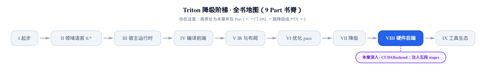
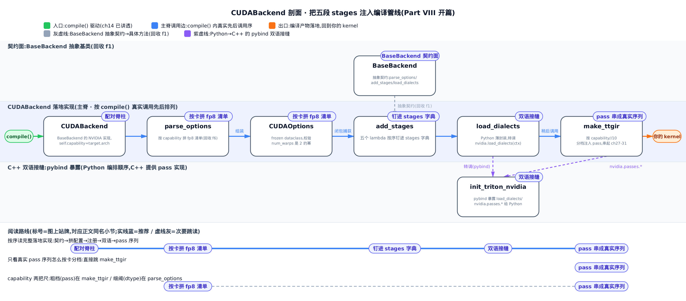
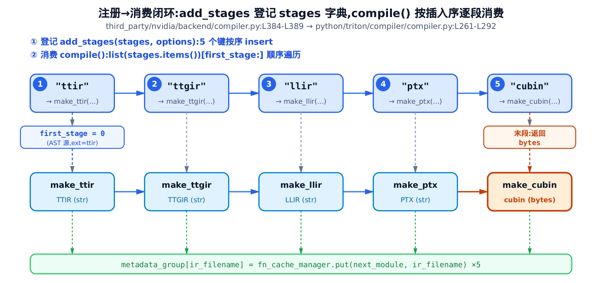
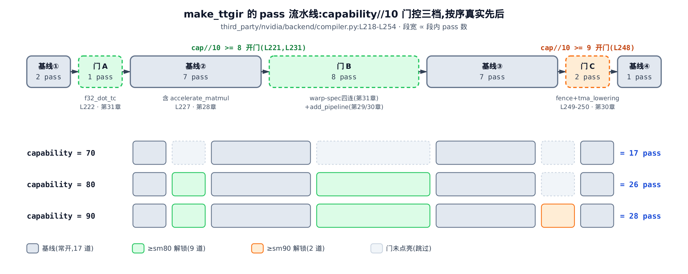

# CUDABackend：把五段 stages 注入编译管线



> 你在这里：Part VIII 硬件后端开篇。
> 上一程：五级降级阶梯已铺到 PTX。
> 这一章：CUDABackend 把五段 stages 钉进管线。

前面几个 Part 把编译器拆成了一地零件：前端追踪出 TTIR（Triton IR，硬件无关的张量 IR），一串 pass 把它揉成 TTGIR（Triton GPU IR，贴了布局的第二级 IR），再一路降到 PTX。可这些零件是**谁**按**什么顺序**串起来的？答案就一个类——`CUDABackend`（`third_party/nvidia/backend/compiler.py`）。它是 NVIDIA 卡这一端的「落地端」：把散落各章的 pass 收成一条真实的编译序列，把 fp8 能力清单按你手里的卡拼出来，最后交给主控 `compile()` 逐段跑。

读懂这一章，你能拿到两个实打实的性能决策抓手。**第一**，看清你每个 kernel 实际都要过的那条 pass 流水线——`accelerate_matmul`、`add_pipeline(num_stages)`、warp specialization（warp 专化）四连，哪些开、哪些不开，全看你的卡是 `sm80` 还是 `sm90`；不命中 Tensor Core 的 kernel，往往就是 pass 门没开。**第二**，看清 `CUDAOptions` 对 `num_warps`（一个 program 用多少个 warp）的硬约束——它必须是 2 的幂，写 3 或 6 直接 assert 拒编。机制是手段，写出更快的 kernel 是目的。

> 只想看那条真实 pass 序列怎么按卡分档，直接跳「[make_ttgir：把前面各章的 pass 串成真实序列](#make_ttgir把前面各章的-pass-串成真实序列)」；想从「一块新卡怎么接进来」跟全程，按序读。



只想弄清 CUDABackend 怎么把这五段注入管线，直接跳「add_stages 把五段编译函数钉进 stages 字典」一节，接着看「make_ttgir：把前面各章的 pass 串成真实序列」一节；只想看 fp8 清单怎么按卡拼出来，跳「CUDAOptions 与 parse_options：按卡拼 fp8 清单」一节就够；想完整看清后端这道缝怎么接、C++ 和 Python 怎么打通，就从下一节「一块新卡怎么接进来」读到底。

## 一块新卡怎么接进来：BaseBackend 契约面

在[第 1 章](../../ch01-what-is-triton/narrative/chapter.md)我们埋过一句话：Triton 支持一块新硬件，靠的是一道**后端接缝**——不改编译器主干，只往一个抽象基类里填几个方法。那道缝的契约面，就是 `BaseBackend`（所有后端必须实现的抽象契约基类）。

它是个 `ABCMeta`（抽象基类元类）修饰的类，声明了一组 `@abstractmethod`（抽象方法）当钩子：`supports_target`（挑后端）、`hash`（喂缓存键）、`parse_options`（归一化选项）、`add_stages`（填降级链）、`load_dialects`（装 MLIR 方言）、`get_module_map`（建 context）。主控 `compile()` 只认这层抽象、不认具体是哪块卡。我们把与本章最相关的三个接缝方法拎出来看——`parse_options`、`add_stages`、`load_dialects`：

```python
# python/triton/backends/compiler.py:L258-L283
    @abstractmethod
    def parse_options(self, options: dict) -> object:
        """
        Converts an `options` dictionary into an arbitrary object and returns it.
        This function may contain target-specific heuristics and check the legality of the provided options
        """
        raise NotImplementedError

    @abstractmethod
    def add_stages(self, stages: dict, options: object) -> None:
        """
        Populates `stages` dictionary with entries of the form:
        ir_name [str] => Function[(src: str, metadata: dict) -> str|bytes]
        The value of each entry may populate a `metadata` dictionary.
        Stages will be run sequentially (in inseriton order) and can communicate using `metadata`.
        All stages are expected to return a `str` object, except for the last stage which returns
        a `bytes` object for execution by the launcher.
        """
        raise NotImplementedError

    @abstractmethod
    def load_dialects(self, context):
        """
        Load additional MLIR dialects into the provided `context`
        """
        raise NotImplementedError
    # … 省略：同类的 hash() / get_module_map() 抽象方法与若干默认实现（L249-L305）…
```

这三段 docstring 就是「一块新卡怎么接进来」的全部承诺。注意 `add_stages` 的文档写死了两条铁律：**stages 按插入顺序依次跑**（"in inseriton order"，源码里的拼写笔误照抄不改）；**除末段外每段返回 `str`，末段返回 `bytes`** 交给 launcher 执行。这两条等下会在 `CUDABackend` 里被逐字兑现——`CUDABackend` 就是 `BaseBackend` 的一个具体实现。编译驱动本身怎么调这些钩子，[第 14 章](../../ch14-compile-driver-loop/narrative/chapter.md)已经讲透，本章只关心 CUDA 这端怎么把缝填满。

## add_stages 把五段编译函数钉进 stages 字典

### 直觉：一张有序的工序登记表

`stages` 字典像车间墙上一张**工序登记表**。`CUDABackend` 走到 `add_stages` 时，把五道工序——`ttir` → `ttgir` → `llir` → `ptx` → `cubin`，每道等于「一个名字 + 一段做法」——按顺序钉进表里。主控 `compile()` 不认识任何一道具体工序，它只干一件事：照着表**从上往下**逐道执行。谁先钉进去谁先跑。

关键在于：这五段**不是**硬编码在 `compile()` 里的。是后端往一张字典里**注册**进去的。换个后端，就能注册不同的段数、不同的末产物——这正是后端接缝在「编译阶段」这个维度上的样子。

### 机制：注册顺序即执行顺序

拿一段普通的 `@triton.jit` kernel 编译，看这五段怎么从登记到消费。它的源是 AST（抽象语法树），源扩展名 `src.ext='ttir'`，所以从第一段起跑。

<!-- trace: m1-add-stages-register -->

| 轮次 | 阶段键 | 登记处（backend/compiler.py） | 输入 IR | 输出 IR / 产物 |
|------|--------|------------------------------|---------|----------------|
| 1 | `ttir` | L385 | `make_ir` 产的 TTIR | TTIR (str) |
| 2 | `ttgir` | L386 | TTIR | TTGIR (str) |
| 3 | `llir` | L387 | TTGIR | LLIR (str) |
| 4 | `ptx` | L388 | LLIR | PTX (str) |
| 5 | `cubin` | L389 | PTX | cubin (bytes，末段) |

第一段的输入输出都写着 TTIR，别读成空转：`make_ir` 产出的只是「毛坯」TTIR，`make_ttir` 这一段还要在它上面再跑一轮 TTIR 级别的整理 pass（内联、规范化等），产物仍是 TTIR、但已经过处理——同名不同货。

读这张表要抓住一个不变量：**五段恰好各跑一次，顺序固定为 ttir→ttgir→llir→ptx→cubin，且末段（也只有末段）产 `bytes`**。为什么必然如此？这是两件事合在一起的结果：`add_stages` 按这个顺序把 5 个键 `insert` 进 dict，而 Python 3.7 起 dict 保留插入序；`compile()` 又用 `list(stages.items())[first_stage:]` 切片再 `for` 逐个消费，这个切片是一串单调前进的下标——既不跳段也不回头，故每段被访问且仅一次。末段产 `bytes` 则是 `BaseBackend` 契约白纸黑字规定的，CUDA 的末段 `make_cubin` 兑现它。

段数不是天定的：AST 源 `src.ext='ttir'` → `first_stage=0` → 跑满 5 段。若你喂的是一个 `.ttgir` 中间文件，`first_stage=1` 且因为是 IR 源再 `+1` 跳过该段自身 → 只跑 `llir`/`ptx`/`cubin` 共 3 段。这就是为什么调试时可以从半路的 IR 文件接着编。五级阶梯的原理本身见[第 32 章](../../ch32-five-stages-ttir-to-ttgir/narrative/chapter.md)，这里只讲后端怎么把这五段**注册**进去。



### 源码：五个 lambda + 一个 for 循环

注册端只有六行。每段编译函数外面包一层 `lambda`（匿名闭包）：

```python
# third_party/nvidia/backend/compiler.py:L384-L389
    def add_stages(self, stages, options):
        stages["ttir"] = lambda src, metadata: self.make_ttir(src, metadata, options)
        stages["ttgir"] = lambda src, metadata: self.make_ttgir(src, metadata, options, self.capability)
        stages["llir"] = lambda src, metadata: self.make_llir(src, metadata, options, self.capability)
        stages["ptx"] = lambda src, metadata: self.make_ptx(src, metadata, options, self.capability)
        stages["cubin"] = lambda src, metadata: self.make_cubin(src, metadata, options, self.capability)
```

为什么要用 `lambda` 裹一层？看后四段——`make_ttgir`/`make_llir`/`make_ptx`/`make_cubin` 都需要 `self.capability`（这块卡的计算能力代号），而 `make_ttir` 不需要。可 `compile()` 的循环想用一个**统一签名** `compile_ir(module, metadata)` 逐段调用，不想知道每段到底要几个参数。`lambda` 闭包正好把 `options` 与 `self.capability` **藏进去**：对外都是 `(src, metadata)` 两参，对内各段拿到的配置各异。签名统一、参数各异，靠的就是这层闭包。

消费端在编译驱动里。`add_stages` 把字典填满后，`compile()` 定位起点、装方言、然后一个 `for` 循环把五段跑起来：

```python
# python/triton/compiler/compiler.py:L261-L292
    # run compilation pipeline  and populate metadata
    stages = dict()
    backend.add_stages(stages, options)
    first_stage = list(stages.keys()).index(src.ext)
    # when the source is an IR file, don't apply the passes related to this stage. This makes it easier to write IR level tests.
    if ir_source:
        first_stage += 1
    context = ir.context()
    ir.load_dialects(context)
    backend.load_dialects(context)
    codegen_fns = backend.get_codegen_implementation()
    module_map = backend.get_module_map()
    try:
        module = src.make_ir(options, codegen_fns, module_map, context)
    except Exception as e:
        filter_traceback(e)
        raise
    use_ir_loc = os.environ.get("USE_IR_LOC", None)
    for ext, compile_ir in list(stages.items())[first_stage:]:
        next_module = compile_ir(module, metadata)
        ir_filename = f"{file_name}.{ext}"
        # … 省略：override / dump / USE_IR_LOC 三个环境变量旁路 IO，不改主控制流 …
        metadata_group[ir_filename] = fn_cache_manager.put(next_module, ir_filename)
        module = next_module
```

三处对上了机制表：`first_stage = list(stages.keys()).index(src.ext)` 就是「从哪段起跑」的定位；`if ir_source: first_stage += 1` 就是喂 IR 文件时多跳一段；`for ext, compile_ir in list(stages.items())[first_stage:]` 就是那把单调前进的切片。每跑完一段，`next_module` 经 `fn_cache_manager.put` 落进缓存，再把 `module = next_module` 递给下一段。这就是「注册→消费」的闭环——`add_stages` 钉进去的五段，在这里被真正逐段跑起来、逐级落盘。至于这里的 `load_dialects` 那行往下会单独讲。

## CUDAOptions 与 parse_options：按卡拼 fp8 清单

### 直觉：门口那块「本店支持的支付方式」告示牌

上面 `add_stages` 的每个 `lambda` 都捕获了一个 `options`。它是什么？就是 `CUDAOptions`——一个 `frozen dataclass`（冻结数据类，实例化后字段不可改），装着这一次编译的全部配置。其中一个字段 `supported_fp8_dtypes` 特别有意思：它像店门口的「本店支持的支付方式」告示牌。

一块新卡进来，店长 `parse_options` 先看车型（`capability`），按型号在默认牌子上**现场增删**——Ada 及以上补上原生的 `fp8e4nv`，Hopper（`sm90`）把老旧的 `fp8e4b15` 划为「不推荐」——再把这块牌子钉进 `builder.options`。前端的 `dtype.to_ir` 一查便知当前卡能用哪种 fp8。查的那一端在[第 5 章](../../ch05-type-system-and-tensor/narrative/chapter.md)，本章讲**清单怎么拼出来**。

先认一下这三种 fp8：`fp8e5` 是 e5m2；`fp8e4b15` 是 Triton 用软件模拟、老卡也能用的一种带偏置 fp8；`fp8e4nv` 是 Ada（`sm89`）起硬件原生的 e4m3。（capability 数字与 NVIDIA 架构代号的对应：70≈Volta、80/86≈Ampere、89≈Ada、90≈Hopper——后文数字与代号混用时可回查这里。）清单默认值写在 `CUDAOptions` 的字段里：

```python
# third_party/nvidia/backend/compiler.py:L91-L114
@dataclass(frozen=True)
class CUDAOptions:
    num_warps: int = 4
    num_ctas: int = 1
    num_stages: int = 3
    num_buffers_warp_spec: int = 0
    num_consumer_groups: int = 0
    reg_dec_producer: int = 0
    reg_inc_consumer: int = 0
    # maxnreg corresponds to the ptx parameter .maxnreg, which controls the
    # maximum number of 32-bit registers used by one thread.
    maxnreg: Optional[int] = None
    cluster_dims: tuple = (1, 1, 1)
    ptx_version: int = None
    enable_fp_fusion: bool = True
    supported_fp8_dtypes: Tuple[str] = ("fp8e5", "fp8e4b15")
    deprecated_fp8_dtypes: Tuple[str] = ()
    default_dot_input_precision: str = "tf32"
    allowed_dot_input_precisions: Tuple[str] = ("tf32", "tf32x3", "ieee")
    max_num_imprecise_acc_default: bool = None
    extern_libs: dict = None
    debug: bool = False
    backend_name: str = 'cuda'
    sanitize_overflow: bool = True
```

默认 `supported_fp8_dtypes = ("fp8e5", "fp8e4b15")`——只有软件模拟的两种。`num_warps` 默认 4、`num_stages`（软件流水的缓冲级数）默认 3、`cluster_dims`（线程块簇维度）默认 `(1,1,1)`、`num_ctas`（一个 cluster 里有几个线程块／CTA，Cooperative Thread Array）默认 1——`cluster_dims` 定簇的形状、`num_ctas` 定簇里线程块的总数，两者互补。这些字段就是你写 `@triton.jit(num_warps=..., num_stages=...)` 时最终落脚的地方。

### 机制：capability 一变，清单跟着变

拿默认 `opts={}`（用户没显式覆盖任何字段），分别喂 `sm86`、`sm89`、`sm90` 三块卡，看告示牌怎么改：

<!-- trace: m2-parse-options-fp8 -->

| capability | ≥89 补 fp8e4nv？ | ≥90 弃 fp8e4b15？ | supported_fp8_dtypes（排序后） | 有效可用 = supported∖deprecated | max_num_imprecise_acc_default |
|-----------|-----------------|-------------------|-------------------------------|-------------------------------|-------------------------------|
| 86 | 否 | 否 | (fp8e4b15, fp8e5) | (fp8e4b15, fp8e5) | 0 |
| 89 | 是 | 否 | (fp8e4b15, fp8e4nv, fp8e5) | (fp8e4b15, fp8e4nv, fp8e5) | 0 |
| 90 | 是 | 是(fp8e4b15) | (fp8e4b15, fp8e4nv, fp8e5) | (fp8e4nv, fp8e5) | 1073741824 |

这张表藏着一个漂亮的设计不变量：**`supported_fp8_dtypes` 随 `capability` 单调不减；被弃用的种类不从 supported 里删掉，而是由 `deprecated_fp8_dtypes` 旁路标记，有效可用 = supported 去掉 deprecated**。看 `sm90` 那行——`fp8e4b15` 还「列」在 supported 里（老代码引用它不会炸），但同时被写进 deprecated（有效集里减掉了）。「支持」和「弃用」由两个字段各自承载，互不干扰。这样跨代升级时既不破坏旧代码，又能表达「这种类型不推荐了」。

顺带看最后一列：`max_num_imprecise_acc_default` 只有 `capability==90` 时是 $`2^{30}`$（即 1073741824），其余都是 0——这是 Hopper 上 fp8 矩阵乘累加的一个精度旋钮，别的卡用不上。

### 源码：一段 heuristic 拼出清单

拼清单的逻辑就在 `parse_options` 里，它同时也是组装 `CUDAOptions` 的地方：

```python
# third_party/nvidia/backend/compiler.py:L144-L159
    def parse_options(self, opts) -> Any:
        args = {k: opts[k] for k in CUDAOptions.__dataclass_fields__.keys() if k in opts}
        if "supported_fp8_dtypes" not in args:
            supported_fp8_dtypes = set(CUDAOptions.supported_fp8_dtypes)
            if self.capability >= 89:
                supported_fp8_dtypes.add("fp8e4nv")
            args["supported_fp8_dtypes"] = tuple(sorted(supported_fp8_dtypes))

        if "deprecated_fp8_dtypes" not in args:
            if self.capability >= 90:
                args["deprecated_fp8_dtypes"] = ("fp8e4b15", )

        if "enable_fp_fusion" not in args:
            args["enable_fp_fusion"] = os.getenv("TRITON_DEFAULT_FP_FUSION", "1") == "1"
        args["max_num_imprecise_acc_default"] = 2**30 if self.capability == 90 else 0
        return CUDAOptions(**args)
```

逐行对上机制表。第一行 `args = {...}` 只从用户 `opts` 里挑出 `CUDAOptions` 认识的键——你没给的字段不会误入。接着，**只在你没显式给 `supported_fp8_dtypes` 时**才走默认启发式：以默认集为底，`self.capability >= 89` 就 `add("fp8e4nv")`（对应表里 sm89/sm90 那两行的「是」），`sorted` 后成 tuple。`deprecated_fp8_dtypes` 同理：`>= 90` 才把 `fp8e4b15` 标进去（只有 sm90 那行「是」）。最后 `max_num_imprecise_acc_default` 那行三元表达式，就是最后一列 `2^30 vs 0` 的来历。`CUDAOptions(**args)` 组装成对象返回，随后在 `compile()` 里被存进 `builder.options`——[第 5 章](../../ch05-type-system-and-tensor/narrative/chapter.md)里 `dtype.to_ir` 查的那份 `builder.options.supported_fp8_dtypes`，就是在这里拼好塞进去的。接缝的两端，到此对接上了。

### 组装那一刻：`__post_init__` 的两件事

`CUDAOptions(**args)` 一执行，`__post_init__` 立刻在冻结前做两件收尾：

```python
# third_party/nvidia/backend/compiler.py:L116-L123
    def __post_init__(self):
        default_libdir = Path(__file__).parent / 'lib'
        extern_libs = {} if self.extern_libs is None else dict(self.extern_libs)
        if not extern_libs.get('libdevice', None):
            extern_libs['libdevice'] = os.getenv("TRITON_LIBDEVICE_PATH", str(default_libdir / 'libdevice.10.bc'))
        object.__setattr__(self, 'extern_libs', tuple(extern_libs.items()))
        assert self.num_warps > 0 and (self.num_warps & (self.num_warps - 1)) == 0, \
               "num_warps must be a power of 2"
```

**第一件**：往 `extern_libs` 注入 `libdevice`（NVIDIA 的数学函数 bitcode 库）——如果你没自带，就填默认的 `libdevice.10.bc`（可用环境变量 `TRITON_LIBDEVICE_PATH` 覆盖）。注意这是个 frozen dataclass，正常改不了字段，所以它用 `object.__setattr__` 绕过冻结、把 dict 冻成 tuple。

**第二件**，也是对你写 kernel 直接有约束的一件：`assert self.num_warps > 0 and (self.num_warps & (self.num_warps - 1)) == 0`——**`num_warps` 必须是 2 的幂**。位运算 `n & (n-1) == 0` 对正数当且仅当只有一个二进制位置位时成立，正好卡住 2 的幂。为什么这么严？因为 warp 到线程块的划分、layout 推导都假设了 2 的幂，非幂会破坏 tiling 和合并访存的整除假设。实测下来 `num_warps=1/2/4/8` 放行，`3` 和 `6` 直接 assert 拒编。你调优时写 `num_warps=6` 编译报错，根子就在这一行。

## make_ttgir：把前面各章的 pass 串成真实序列

### 直觉：一条装了两个「按机型解锁」工位区的流水线

`add_stages` 注册的第二段 `make_ttgir`，是本章真正的重头戏。它把 TTIR 揉成 TTGIR，中间跑一长串 pass。这些 pass 你在 Part VI/VII 已经一个个见过了——`accelerate_matmul`、software pipeline、warp specialization、TMA lowering……本章不重讲它们内部干什么，只讲一件前面没讲过的事：**它们在真实管线里的先后顺序，以及谁在什么卡上才被打开**。

把它想成一条工序固定的流水线，但中间装了两个「按机型解锁」的工位区。所有卡都走 **17 道基线工序**；`cap//10 >= 8`（`sm80` 起）解锁一区共 **9 道**——Tensor Core 的 f32 快路、warp specialization 四连、软件流水；`cap//10 >= 9`（`sm90`）再解锁一区 **2 道**——fence 插入、TMA（Tensor Memory Accelerator，Hopper 上专管异步大块数据搬运的引擎）lowering。同一段 kernel，卡越高走的工位越多，顺序始终按源码里 `pm.add_*` 的书写先后。

### 机制：卡越高，走的 pass 越多

拿一段带 `tl.dot` 的 matmul kernel，分别在 `sm70`/`sm80`/`sm90` 上数它走多少道 pass：

<!-- trace: m3-ttgir-pass-pipeline -->

| capability | cap//10 | 基线段（L218-247 + L251 常开） | ≥sm80 段（L222+L232-240） | ≥sm90 段（L249-250） | 总 pass 数 |
|-----------|---------|------------------------|--------------------------|---------------------|-----------|
| 70 | 7 | 17 | 0（门关） | 0（门关） | 17 |
| 80 | 8 | 17 | 9 | 0（门关） | 26 |
| 90 | 9 | 17 | 9 | 2 | 28 |

不变量是**单调包含**：基线 pass 集 ⊆ sm80 档 ⊆ sm90 档。为什么？17 道基线无条件 add；`cap//10>=8` 的门只在基线之上**追加** 9 道、从不删已有的；`cap//10>=9` 的门再往上追加 2 道。门都是 `>=` 判定，`capability` 增则门只从关变开、绝不回退。所以高档 pass 集必然包含低档，且 `pm.run` 严格按 add 序执行。总数就成了一道阶梯：`sm70=17`，`sm80/sm86/sm89=26`，`sm90=28`。

这张图把这条阶梯画了出来——三色分层显示 `capability//10` 怎么把前面各章讲过的 pass 门控进真实先后：



各 pass 落在哪、归哪一章，图里标了：`accelerate_matmul` 在基线段（见[第 28 章](../../ch28-accelerate-matmul-layout-opt/narrative/chapter.md)）；`f32_dot_tc` 快路与 warp specialization 四连都在 ≥sm80 段（见[第 31 章](../../ch31-prefetch-warp-specialization-cleanup/narrative/chapter.md)）；`add_pipeline(num_stages)` 同样在 ≥sm80 段（见[第 29 章](../../ch29-software-pipelining-primer/narrative/chapter.md)、[第 30 章](../../ch30-software-pipelining-landing/narrative/chapter.md)）；`fence_insertion` + `tma_lowering` 在 ≥sm90 段（见[第 30 章](../../ch30-software-pipelining-landing/narrative/chapter.md)）。Tensor Core 的布局原理见[第 27 章](../../ch27-tensor-core-mma-layout/narrative/chapter.md)。

### 源码：一条从头到尾的真实序列

现在看这条序列的真身。为了看清门控，我把两个 `if capability // 10 >= …` 的位置留着：

```python
# third_party/nvidia/backend/compiler.py:L203-L254
    @staticmethod
    def make_ttgir(mod, metadata, opt, capability):
        cluster_info = nvidia.ClusterInfo()
        if opt.cluster_dims is not None:
            cluster_info.clusterDimX = opt.cluster_dims[0]
            cluster_info.clusterDimY = opt.cluster_dims[1]
            cluster_info.clusterDimZ = opt.cluster_dims[2]
        # … 省略：MLIR_ENABLE_REMARK 诊断分支（L211-L214），只影响调试输出、不改 IR …
        # TTIR -> TTGIR
        pm = ir.pass_manager(mod.context)
        pm.enable_debug()
        passes.ttir.add_convert_to_ttgpuir(pm, f"cuda:{capability}", opt.num_warps, 32, opt.num_ctas)
        # optimize TTGIR
        passes.ttgpuir.add_coalesce(pm)
        if capability // 10 >= 8:
            passes.ttgpuir.add_f32_dot_tc(pm)
        # TODO(Qingyi): Move PlanCTAPass to the front of CoalescePass
        nvidia.passes.ttnvgpuir.add_plan_cta(pm, cluster_info)
        passes.ttgpuir.add_remove_layout_conversions(pm)
        passes.ttgpuir.add_optimize_thread_locality(pm)
        passes.ttgpuir.add_accelerate_matmul(pm)
        passes.ttgpuir.add_remove_layout_conversions(pm)
        passes.ttgpuir.add_optimize_dot_operands(pm, capability >= 80)
        passes.common.add_cse(pm)
        if capability // 10 >= 8:
            passes.ttgpuir.add_optimize_accumulator_init(pm)
            passes.ttgpuir.add_combine_tensor_select_and_if(pm)
            passes.ttgpuir.add_ws_task_partition(pm, opt.num_consumer_groups)
            passes.ttgpuir.add_taskid_propagate(pm, opt.num_consumer_groups)
            passes.ttgpuir.add_ws_data_partition(pm, opt.num_consumer_groups)
            passes.ttgpuir.add_ws_code_partition(pm, opt.num_buffers_warp_spec, opt.num_consumer_groups,
                                                 opt.reg_dec_producer, opt.reg_inc_consumer)
            passes.ttgpuir.add_pipeline(pm, opt.num_stages)
            passes.ttgpuir.add_ws_lowering(pm, opt.num_consumer_groups)
        passes.ttgpuir.add_prefetch(pm)
        passes.ttgpuir.add_optimize_dot_operands(pm, capability >= 80)
        passes.ttgpuir.add_remove_layout_conversions(pm)
        passes.ttgpuir.add_reduce_data_duplication(pm)
        passes.ttgpuir.add_reorder_instructions(pm)
        passes.common.add_cse(pm)
        passes.common.add_symbol_dce(pm)
        if capability // 10 >= 9:
            nvidia.passes.ttnvgpuir.add_fence_insertion(pm)
            nvidia.passes.ttnvgpuir.add_tma_lowering(pm)
        passes.common.add_canonicalizer(pm)
        pm.run(mod)
        metadata["cluster_dims"] = (cluster_info.clusterDimX, cluster_info.clusterDimY, cluster_info.clusterDimZ)
        return mod
```

从上往下读，这就是你每个 kernel 的 TTGIR 都要走的**真实序列**。开头建一个 `pm = ir.pass_manager`，此后每个 `pm.add_*`（或 `nvidia.passes.*`）都往里排一道 pass，最后 `pm.run(mod)` 一次性按排队顺序执行。第一道 `add_convert_to_ttgpuir` 把 `num_warps`、每 warp 32 线程、`num_ctas` 一起喂进去——这就是 `num_warps` 落进 IR 的时刻，也是它为什么必须是 2 的幂的下游。

两个 `if capability // 10 >= 8` 块合起来正是机制表里的 9 道：第一个块里 `add_f32_dot_tc` 一道，第二个块里 `optimize_accumulator_init` + `combine_tensor_select_and_if` + warp specialization 四连（`ws_task_partition`/`taskid_propagate`/`ws_data_partition`/`ws_code_partition`）+ `add_pipeline(opt.num_stages)` + `ws_lowering` 共 8 道。看清楚 `add_pipeline` 那行——它把你的 `num_stages` 直接传给软件流水 pass；`num_stages` 调大调小，改的就是这一道的行为。末尾 `if capability // 10 >= 9` 块里 `add_fence_insertion` + `add_tma_lowering` 两道，只有 Hopper 才排进队。这就是那 2 道 sm90 专属工序。

所以调优的因果链很清楚：你的卡决定 `cap//10` 落哪档，档决定这条队列排进哪些 pass，pass 决定你的 `tl.dot` 能不能落到 Tensor Core、能不能软件流水起来。`sm70` 上写得再讲究也开不出 warp specialization——因为门就没开。

## capability//10：一个自变量喂两把尺

你可能已经发现一件怪事：`make_ttgir` 门控 pass 用 `capability // 10 >= 8`（`third_party/nvidia/backend/compiler.py:L221`），而 `parse_options` 门控 fp8 用 `capability >= 89`（同文件 L148）。**同一个 `capability`，为什么两处用不同粒度？**

因为这里有**两把尺并行**。`capability//10` 像看车牌前两位分「省份档」：整除 10 拿到主代号（`70→7`、`80/86/89→8`、`90→9`），定**粗档**，用来门控 pass。另有更细的 `>=89`、`>=90` 两把尺定**细档**，用来门控 fp8 dtype。粗档控 pass、细阈控 dtype。把五档 capability 一起喂进来看得最清楚：

<!-- trace: m4-capability-gate -->

| capability | cap//10 | ge8 门（pass：f32dottc/warp-spec/pipeline） | ge9 门（pass：fence/tma） | cap≥89（补 fp8e4nv） | cap≥90（弃 fp8e4b15） |
|-----------|---------|-------------------------------------------|-------------------------|---------------------|----------------------|
| 70 | 7 | False | False | False | False |
| 80 | 8 | True | False | False | False |
| 86 | 8 | True | False | False | False |
| 89 | 8 | True | False | True | False |
| 90 | 9 | True | True | True | True |

看 `sm86` 和 `sm89` 这两行——它们 `cap//10` 都是 8，**走的 pass 完全一样**（粗档相同）；可 `sm89` 过了 `>=89` 细阈、补上了 `fp8e4nv`，`sm86` 没过。同一个自变量喂给两把不同粒度的尺，得到不同的切分。这正是为什么 Ada 和 Ampere 的 RTX 卡在 pass 层面一致、却在 fp8 支持上分家。

每道门都是形如 `capability >= 阈值` 或 `capability // 10 >= 阈值` 的**单调不减布尔函数**：`capability` 一涨，门只从 False 变 True、绝不回退。所以随卡升级，开启的门只会越来越多——这就是前面两张表里那两条阶梯（pass 数 17→26→28、fp8 清单 2→3→3 种）背后同一个道理。五档 capability 经 `//10` 映射到三个粗档 `{7,8,9}`，配合 89/90 两个细阈，一共只产生四种门开关组合：全关（sm70）、只 ge8（sm80/sm86）、ge8 加细阈 89（sm89）、全开（sm90）。一个后端用两把尺，就覆盖了 Volta 到 Hopper 五代硬件，不必为每代各写一个 backend。

## 双语接缝：Python 编排，C++ 实现

细心的你会注意到 `make_ttgir` 里那些 pass 分两类：`passes.ttgpuir.add_*` 和 `nvidia.passes.ttnvgpuir.add_*`。还有 `compile()` 里那行 `backend.load_dialects(context)`。这些 `nvidia.*` 的名字是从哪来的？答案是——它们是 C++ 写的，经 pybind 暴露成 Python 名字。Python 后端负责**编排顺序**，C++ 负责**pass 实现**，这是一道 C++/Python 双语接缝。

Python 这端薄得只有一行：

```python
# third_party/nvidia/backend/compiler.py:L184-L185
    def load_dialects(self, ctx):
        nvidia.load_dialects(ctx)
```

它转手就调 `nvidia.load_dialects`。这个 `nvidia` 模块和它下面的 `load_dialects`、`ClusterInfo`、`passes.*`，全在 C++ 侧的 pybind 注册代码里被造出来：

```cpp
// third_party/nvidia/triton_nvidia.cc:L42-L71
void init_triton_nvidia(py::module &&m) {
  auto passes = m.def_submodule("passes");
  init_triton_nvidia_passes_ttgpuir(passes.def_submodule("ttgpuir"));
  init_triton_nvidia_passes_ttnvgpuir(passes.def_submodule("ttnvgpuir"));

  // cluster info
  py::class_<mlir::triton::nvidia_gpu::ClusterInfo>(m, "ClusterInfo")
      .def(py::init<>())
      .def_readwrite("clusterDimX", &mlir::triton::nvidia_gpu::ClusterInfo::clusterDimX)
      // … 省略：clusterDimY/Z 的 def_readwrite 与 __repr__ …

  // load dialects
  m.def("load_dialects", [](mlir::MLIRContext &context) {
    mlir::DialectRegistry registry;
    registry.insert<mlir::triton::nvidia_gpu::TritonNvidiaGPUDialect,
                    mlir::triton::nvgpu::NVGPUDialect>();
    mlir::registerNVVMDialectTranslation(registry);
    context.appendDialectRegistry(registry);
    context.loadAllAvailableDialects();
  });
  // … 省略：set_nvvm_reflect_ftz 与 cublas 子模块（L74-L162），与本章接缝主线无关 …
```

一一对上：Python 的 `nvidia.load_dialects(ctx)` 就是这里 `m.def("load_dialects", ...)` 注册的那个 lambda，它往 MLIR context 里挂上 `TritonNvidiaGPU`、`NVGPU` 两个 dialect（方言，MLIR 里一组自定义 op 的命名空间）。`nvidia.ClusterInfo` 就是这里 `py::class_` 暴露的那个 C++ 类，`make_ttgir` 开头 `nvidia.ClusterInfo()` 建的就是它。

那 `make_ttgir` 里调的 `nvidia.passes.ttnvgpuir.add_plan_cta` / `add_fence_insertion` / `add_tma_lowering` 呢？在另一个注册函数里，用一个宏把 MLIR pass 构造函数包成 pybind 可调用：

```cpp
// third_party/nvidia/triton_nvidia.cc:L31-L40
void init_triton_nvidia_passes_ttnvgpuir(py::module &&m) {
  ADD_PASS_WRAPPER_1("add_plan_cta", mlir::createTritonNvidiaGPUPlanCTAPass,
                     mlir::triton::nvidia_gpu::ClusterInfo *);
  ADD_PASS_WRAPPER_0("add_fence_insertion",
                     mlir::createTritonNvidiaGPUFenceInsertionPass);
  ADD_PASS_WRAPPER_0("add_tma_lowering",
                     mlir::createTritonNvidiaGPUTMALoweringPass);
  ADD_PASS_WRAPPER_0("add_nvgpu_to_llvm",
                     mlir::triton::createConvertNVGPUToLLVMPass);
}
```

`ADD_PASS_WRAPPER_0/_1` 宏（数字是这个 pass 除 PassManager 外还吃几个参数）把每个 `create...Pass` 的 C++ 构造函数注册成一个 Python 名字。`make_ttgir` 末尾那两道 sm90 专属 pass `add_fence_insertion`、`add_tma_lowering`，源头就在这三行。到此，Python 后端排的每一道 `nvidia` pass，都在 C++ 侧找到了定义。pybind 机制本身不是本章要挖的，点到为止：**记住这道分工——Python 决定顺序与门控，C++ 提供 pass 本体**。

## 配对脊柱：CUDABackend 是姊妹篇 ascend 后端的对位样板

回到开篇那个问题：一块新卡怎么接进来？现在答案完整了。`CUDABackend` 就是 `BaseBackend`（`python/triton/backends/compiler.py`）的一个具体实现——它实现 `parse_options`（按 capability 拼选项）、`add_stages`（登记五段降级链）、`load_dialects`（挂方言），再加上 `make_ttir`/`ttgir`/`llir`/`ptx`/`cubin` 五段的具体做法。填满这道缝，NVIDIA 卡就接进了 Triton 的编译驱动。这正是[第 1 章](../../ch01-what-is-triton/narrative/chapter.md)埋下的那道后端接缝的兑现。

而这道缝的价值在于**它是通用的**。姊妹篇《Triton-Ascend 源码解读》讲的昇腾后端，走的是同一道缝：往 `python/triton/backends/` 塞一个 `ascend/` 目录（Triton 启动时自动扫描 `backends/` 下的子目录来注册后端，另有 `TRITON_PLUGIN_DIRS` 侧门供 out-of-tree 插件），在里面实现自己的一套 `parse_options`/`add_stages`/`load_dialects`——它的 `add_stages` 最后一段产出的是昇腾二进制而非 cubin，它的 `load_dialects` 挂的是 ascend dialect 而非 `TritonNvidiaGPU`。契约面一字不改，落地端各写各的。本章的 `CUDABackend` 就是这套配对脊柱的 CUDA 样板端；姊妹篇逐结构对着它讲昇腾那端，正是靠这道缝对得上位。

回到你的 kernel。懂了这一章，两个决策抓手落袋：一，你现在能对着 `make_ttgir` 那条序列，判断自己这块卡到底开了哪些优化 pass——`sm80` 以下别指望 warp specialization，`sm90` 才有 TMA；二，你写 `@triton.jit` 时 `num_warps` 只能填 2 的幂、`num_stages` 直接喂给 `add_pipeline`，这些约束和旋钮都攥在 `CUDAOptions` 手里。编译器把五段 stages 注入管线的这套机制，最终就落到你手边这几个能调的参数上。
