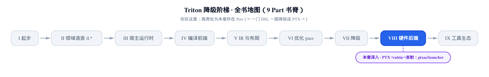
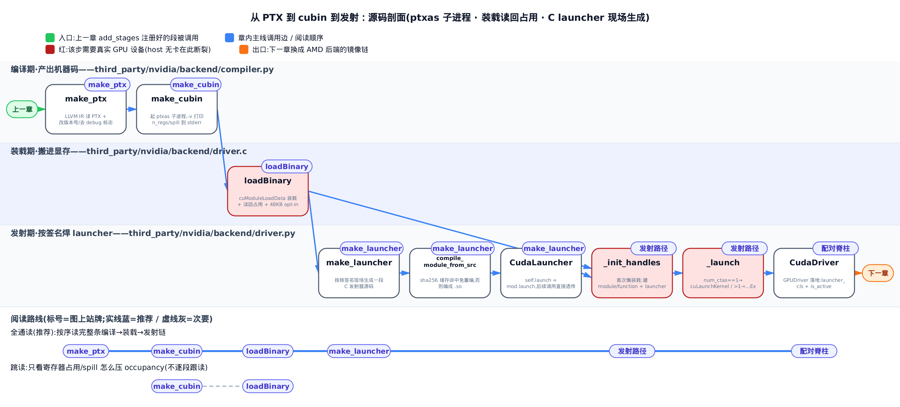
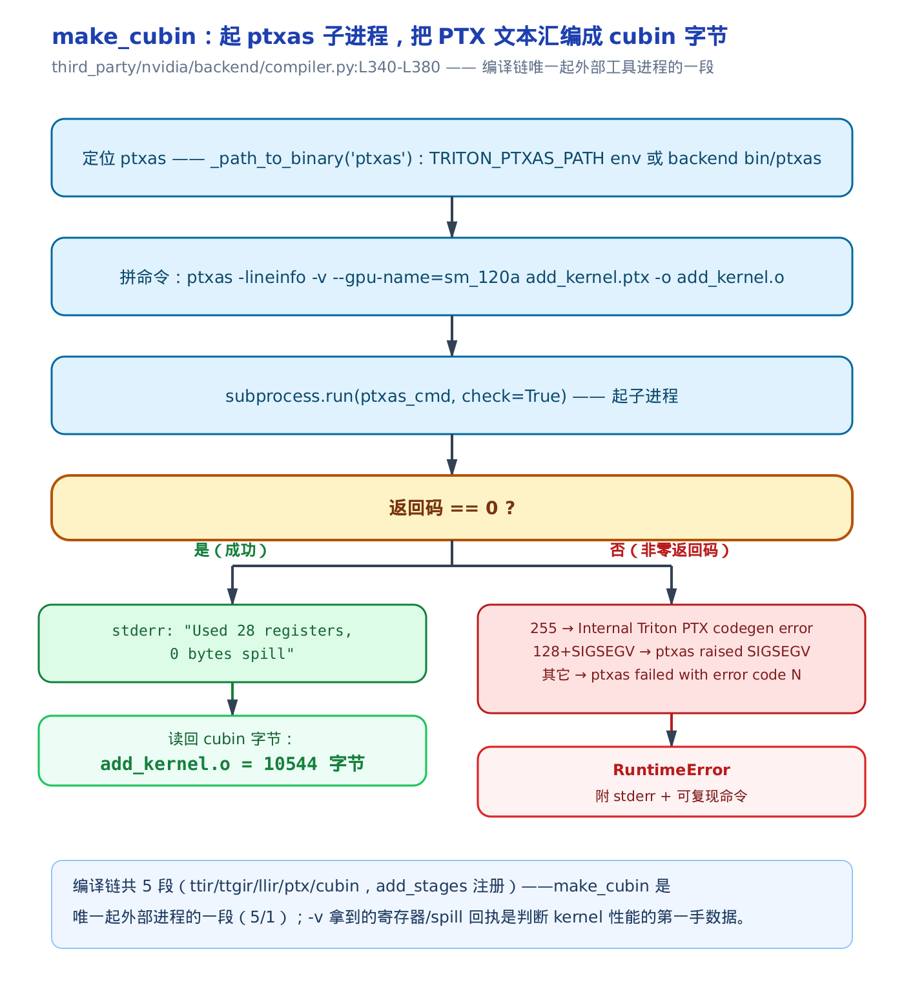
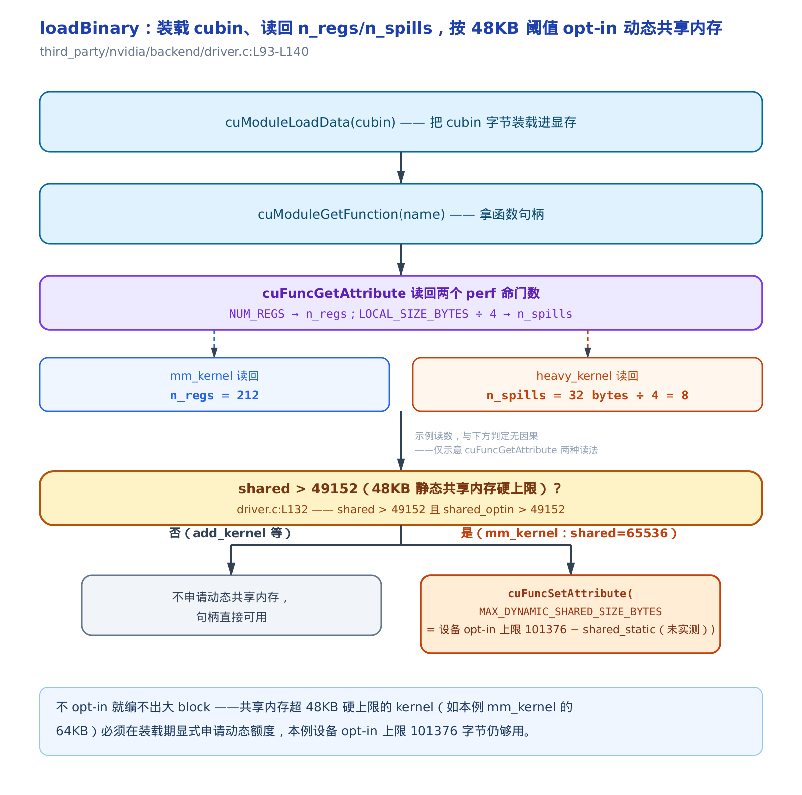
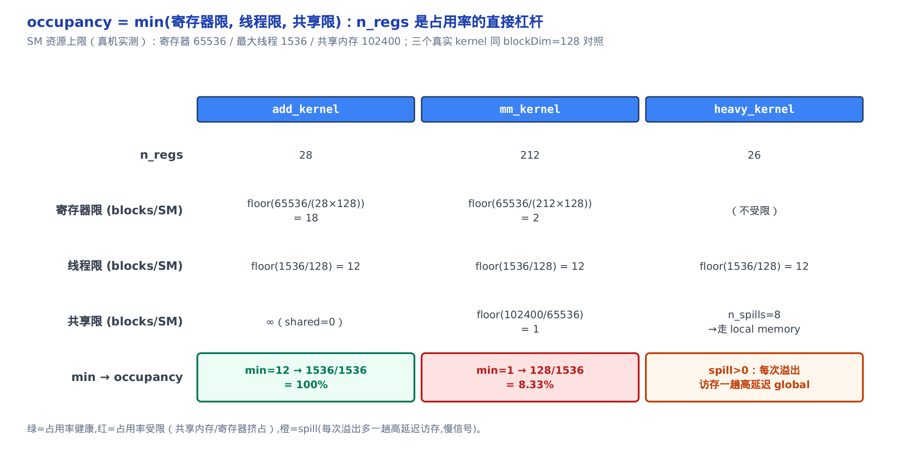
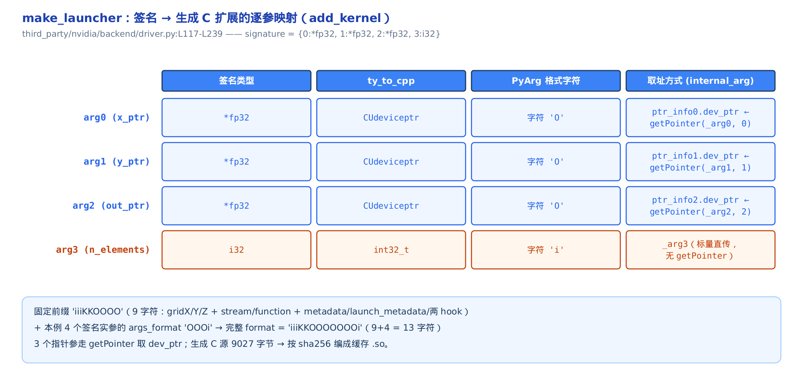

# 从 PTX 到 cubin 到发射：ptxas、二进制装载与 launcher



> 你在这里：Part VIII 硬件后端，落地段。
> 上一章：CUDABackend 把五段 stages 钉进管线。
> 这一章：最后两段真正产出机器码、装进显存、发射。

[上一章](../../ch36-cudabackend-inject-stages/narrative/chapter.md)结尾，`add_stages` 把五段编译函数钉进了 stages 字典：`ttir → ttgir → llir → ptx → cubin`。前四段都在进程内把 IR（中间表示）揉来揉去，最后一段 `cubin` 段却写死了要返回 `bytes`——因为到这里，字符串形态的 IR 必须变成 GPU 真正能跑的机器码。本章就讲最后两段（`make_ptx`、`make_cubin`）内部**怎么产出机器码**，cubin 编好后**怎么装进显存**，以及一句 `kernel[grid](*args)` 背后 **kernel 怎么发射**出去。

读懂这一章，你能拿到三个实打实的性能抓手。**第一**，寄存器压力的直接指标就在这里——`ptxas -v` 打印的 `n_regs`（每线程占用的寄存器数）和 `n_spills`（溢出计数），装载时被驱动读回；`n_spills > 0` 就是性能警报。**第二**，共享内存越过 48KB 硬线，装载期必须显式 opt-in（主动申请）动态额度，不申请就编不出大 block——这解释了为何某些 `BLOCK_SIZE` 配置会在装载期直接失败。**第三**，Triton 首次调用一个 kernel 有一段额外延迟，来源之一就是这里现场生成、现场编译的 C launcher（发射器）。机制是手段，写出更快的 kernel 是目的。

> 只想弄清寄存器/spill 怎么压占用率，直接跳「[寄存器占用、spill 与 occupancy](#寄存器占用spill-与-occupancy一间自习室能坐几个-block)」一节；想从 PTX 文本一路跟到 GPU 发射，按序读。

本章要走的这条落地链，涉及四个源文件、两种语言：Python 侧的 `make_ptx` / `make_cubin`（`third_party/nvidia/backend/compiler.py`）负责出 PTX、起 ptxas；C 侧的 `loadBinary`（`third_party/nvidia/backend/driver.c`）负责装载；Python 侧的 `make_launcher` / `CudaLauncher` / `CudaDriver`（`third_party/nvidia/backend/driver.py`）负责发射。我们按数据流的顺序，一段一段读真实源码。



图上标了两条读法：想通读整条落地链，按编译期→装载期→发射期从左到右走；只想抓寄存器/spill/共享内存这几个性能判据，沿 make_cubin→loadBinary 这两站跳读即可，对应正文「寄存器占用、spill 与 occupancy」一节。

## make_ptx：LLVM IR 出成 PTX 文本

### 直觉：给说明书改版号、撕掉批注

上一个 Part 把 kernel 一路降到了 LLVM IR（LLVM 的中间表示，硬件无关的低层 IR），Triton 内部叫它 LLIR。但 LLVM IR 还不是 GPU 汇编。`make_ptx` 这一段调 LLVM 的 NVPTX 后端，把 LLIR 翻成 **PTX**（Parallel Thread Execution，NVIDIA 的虚拟指令集，一种「伪汇编」文本）。

LLVM 出的 PTX 像刚打印出的说明书：内容齐了，但版本号印的是草稿号、页边还夹着给排版工的批注（debug 标志）。`make_ptx` 做三件收尾——抄下唯一的函数名备查、把版本号改成汇编器认得的、撕掉那些会让汇编器不敢优化的批注——然后才交给下一道工序。

### 机制：一次翻译 + 三步后处理

对一段最简单的向量加 kernel `add_kernel`（`BLOCK_SIZE=1024` 是 `constexpr`（编译期常量，不进运行时签名）），在 Blackwell 卡（capability 120）上观测 `make_ptx` 的四步，得到下面这张轨迹表：

<!-- trace: m1-make-ptx -->

| 步骤 | 动作 | 输入/条件 | 输出/判定 |
|---|---|---|---|
| 1 | `llvm.translate_to_asm` 出 PTX 文本 | LLIR（LLVM IR 字符串）+ triple `nvptx64` + proc `sm_90a`/`sm_120a` | `.version 8.8` / `.target sm_120a` / `.visible .entry add_kernel` |
| 2 | 正则抓 kernel 名 | `re.findall('.visible .entry (\w+)')` 扫全 PTX | 唯一匹配 `add_kernel` → `metadata['name']='add_kernel'`；`assert len(names)==1` |
| 3 | 改写 `.version` | `re.sub('.version \d+.\d+')` → 目标 `ptx_version` | `.version 8.8 → 8.7`；不改则 ptxas 报 `fatal: Unsupported .version 8.8; current version is '8.7'` |
| 4 | 去 debug 标志 | `re.sub(',\s*debug|debug,\s*','')` | 删掉会阻止 ptxas 优化的 debug 标志，返回干净 PTX |

三步后处理各买到一样东西。第 2 步抄下唯一的 `.visible .entry` 名字写进 `metadata['name']`——这个名字下游装载时要靠它去取函数句柄。第 3 步把版本号规约成 `major.minor` 再整体替换：LLVM 后端可能出 `8.8`，但随 wheel 打包的 ptxas 只吃到 `8.7`，版本号对不上 ptxas 会直接罢工。第 4 步删掉 debug 标志——注释写得很直白，带 debug 标志会**阻止 ptxas 优化代码**，保留就是白白牺牲性能。

**不变量：一个编译单元恰产出一个 kernel 入口。** 第 2 步的 `assert len(names) == 1` 守护的就是这个「恰一个」。正则扫遍 PTX 里所有 `.visible .entry`，Triton 一个编译单元只降出一个核，故匹配数应恒为 1。若为 0（没生成入口）或大于 1（意外多入口内联），断言当场失败。它必须成立的理由在下游：装载时靠这唯一的 `metadata['name']` 去 `cuModuleGetFunction` 取句柄，个数不为 1 就无法确定取哪一个。这是断言式不变量，其正当性挂在下游取句柄的单值依赖上。

### 源码：三行正则收尾

```python
# third_party/nvidia/backend/compiler.py:L317-L337
    @staticmethod
    def make_ptx(src, metadata, opt, capability):
        ptx_version = get_ptx_version_from_options(opt)

        triple = 'nvptx64-nvidia-cuda'
        proc = 'sm_90a' if capability == 90 else f'sm_{capability}'
        features = get_features(opt)
        ret = llvm.translate_to_asm(src, triple, proc, features, ['nvptx-short-ptr'], opt.enable_fp_fusion, False)
        # Find kernel names (there should only be one)
        names = re.findall(r".visible .entry ([a-zA-Z_][a-zA-Z0-9_]*)", ret)
        assert len(names) == 1
        metadata["name"] = names[0]
        # post-process
        ptx_version = f'{ptx_version//10}.{ptx_version%10}'
        ret = re.sub(r'\.version \d+\.\d+', f'.version {ptx_version}', ret, flags=re.MULTILINE)
        # Remove the debug flag that prevents ptxas from optimizing the code
        ret = re.sub(r",\s*debug|debug,\s*", "", ret)
        # … 省略：NVPTX_ENABLE_DUMP 分支只是把 PTX 打到屏幕，纯调试旁路 …
        return ret
```

整段的重量全在 `llvm.translate_to_asm` 那一行——它是真正做翻译的地方，其余都是文本收尾。`proc` 那行值得留意：pin v3.2.0 的源码**只对** capability 90（Hopper）特判成 `sm_90a`（`a` 后缀表示带架构专属特性如 wgmma、TMA 的变体）；其它 capability 一律直接拼 `sm_{capability}`——照这段源码，capability 120 本应拼出 `sm_120`。返回的 `ret` 是一段纯文本 PTX，接着交给 `make_cubin`。

> ⚠️ 那本章 worked example 里反复出现的 `sm_120a` 是怎么来的？取证跑在一台 Blackwell（capability 120）真机上，用的是**支持 Blackwell 的更新版 triton**——它把 「a」 后缀的判据从「仅 90」扩展到了包含 Blackwell，所以产出 `sm_120a`。按上面 pin v3.2.0 的源码（只对 `== 90` 加 `a`），capability 120 本应得 `sm_120`。这里展示的是 pin 源码的判据逻辑 + 本机真实取证的数字，两者的 triton 版本不同、已注明——别把 `sm_120a` 当成 pin v3.2.0 对 120 的输出。

## make_cubin：起 ptxas 子进程出 cubin

### 直觉：把稿子寄给唯一的印刷厂

PTX 还是「伪汇编」，真正的机器码——**SASS**（Streaming ASSembler，GPU 上真正执行的原生指令集）——只有 NVIDIA 的闭源汇编器 **ptxas**（PTX 汇编器，随 Triton wheel 自带的一个 CPU 程序）能出。这也是整条编译链**唯一**起外部进程的一段。

`make_cubin` 就像把稿子寄给唯一的印刷厂：写进临时 `.ptx` 文件、命令行喊一声 ptxas、附上 `-v` 让印刷厂把「这活儿占了多少寄存器、有没有溢出」的回执一起打回来；印坏了（非零返回码）按错误码翻译成人话报错，还附上能自己重跑的命令。产出的 **cubin**（CUDA binary，装了 SASS 机器码的可装载二进制模块）是一串字节。

这里有个对无卡开发很关键的事实：ptxas 是 CPU 程序，跟你机器上有没有 GPU **完全无关**。所以 host 上没有 CUDA 卡，也照样能一路跑到 cubin——本章的 PTX/寄存器/spill 数字，全是这样在无卡 host 上真机取证的。

### 机制：拼命令、起进程、分类报错

对 `add_kernel`（目标 `sm_120a`，bundled ptxas V12.8.93）观测 `make_cubin` 的四个阶段：

<!-- trace: m2-make-cubin-ptxas -->

| 阶段 | 动作 | 关键量 | 结果 |
|---|---|---|---|
| 1 | 定位 ptxas | `_path_to_binary('ptxas')`：`TRITON_PTXAS_PATH` env 或 backend `bin/ptxas` | 找到 ptxas——编译链唯一的外部工具进程 |
| 2 | 拼命令 | `ptxas_cmd = [ptxas, '-lineinfo', '-v', '--gpu-name=sm_120a', file.ptx, '-o', file.o]` | `ptxas -lineinfo -v --gpu-name=sm_120a add_kernel.ptx -o add_kernel.o` |
| 3 | 起子进程（成功） | `subprocess.run(check=True)` 返回码 0 | stderr：`Used 28 registers, 0 bytes spill`；读回 cubin `add_kernel.o = 10544` 字节 |
| 4 | 起子进程（失败） | `CalledProcessError` 按 returncode 分类 | `255→Internal Triton PTX codegen error`；`128+SIGSEGV→ptxas raised SIGSEGV`；其它 `→ptxas failed with error code N`；均附 stderr + repro 命令 |

命令里两个开关最要紧。`--gpu-name=sm_120a` 定目标架构，由 `sm_{capability}{suffix}` 拼出（`sm_120a` 的由来见上一节的诚实注记：本机 Blackwell 真机 + 支持 Blackwell 的更新版 triton；pin v3.2.0 源码对 capability 120 只出 `sm_120`）。`-v` 让 ptxas 把每核的寄存器占用/spill 打到 stderr——这正是读者判断寄存器压力的第一手数据。`add_kernel` 实测报 28 个寄存器、0 bytes spill，产出 cubin 10544 字节。



**不变量：ptxas 要么成功产出 cubin、要么抛带 stderr 与可复现命令的错误，绝不静默返回半成品。** `subprocess.run(check=True)` 在返回码非零时抛 `CalledProcessError`，被 `except` 捕获后按 returncode 映射成可读 error 串（255 / 128+SIGSEGV / 其它三档），拼上 log 内容与完整命令抛 `RuntimeError`；只有返回码为 0，代码才走到 `open(fbin,'rb').read()` 读回 cubin。两条路径由 try/except 结构互斥且穷尽——外部工具失败对用户本是黑盒，分类加可复现命令让报错可读可调。

### 源码：定位工具 + 起子进程

先看 ptxas 怎么被定位到——这是编译链唯一外部工具进程的入口：

```python
# third_party/nvidia/backend/compiler.py:L21-L37
@functools.lru_cache()
def _path_to_binary(binary: str):
    paths = [
        os.environ.get(f"TRITON_{binary.upper()}_PATH", ""),
        os.path.join(os.path.dirname(__file__), "bin", binary),
    ]

    for bin in paths:
        if os.path.exists(bin) and os.path.isfile(bin):
            result = subprocess.check_output([bin, "--version"], stderr=subprocess.STDOUT)
            if result is not None:
                version = re.search(r".*release (\d+\.\d+).*", result.decode("utf-8"), flags=re.MULTILINE)
                if version is not None:
                    return bin, version.group(1)
    raise RuntimeError(f"Cannot find {binary}")
```

定位有两个候选：先看环境变量 `TRITON_PTXAS_PATH`（允许你指定自己的 ptxas），再退回 backend 目录下自带的 `bin/ptxas`。`@functools.lru_cache()` 让这次探测只做一遍。再看主体：

```python
# third_party/nvidia/backend/compiler.py:L339-L382
    @staticmethod
    def make_cubin(src, metadata, opt, capability):
        ptxas, _ = _path_to_binary("ptxas")
        with tempfile.NamedTemporaryFile(delete=False, mode='w', suffix='.ptx') as fsrc, \
            tempfile.NamedTemporaryFile(delete=False, mode='r', suffix='.log') as flog:
            fsrc.write(src)
            fsrc.flush()
            fbin = fsrc.name + '.o'

            line_info = [] if os.environ.get('TRITON_DISABLE_LINE_INFO') else ['-lineinfo']
            fmad = [] if opt.enable_fp_fusion else ['--fmad=false']
            suffix = 'a' if capability == 90 else ''
            opt_level = ['--opt-level', '0'] if os.environ.get("DISABLE_PTXAS_OPT", "0") == "1" else []
            ptxas_cmd = [
                ptxas, *line_info, *fmad, '-v', *opt_level, f'--gpu-name=sm_{capability}{suffix}', fsrc.name, '-o', fbin
            ]
            try:
                subprocess.run(ptxas_cmd, check=True, close_fds=False, stderr=flog)
                # … 省略：成功后删临时 .ptx/.log 文件 …
            except subprocess.CalledProcessError as e:
                with open(flog.name) as log_file:
                    log = log_file.read()
                # … 省略：删临时 .log 文件 …
                if e.returncode == 255:
                    error = 'Internal Triton PTX codegen error'
                elif e.returncode == 128 + signal.SIGSEGV:
                    error = '`ptxas` raised SIGSEGV'
                else:
                    error = f'`ptxas` failed with error code {e.returncode}'

                raise RuntimeError(f'{error}\n'
                                   f'`ptxas` stderr:\n{log}\n'
                                   f'Repro command: {" ".join(ptxas_cmd)}\n')

            with open(fbin, 'rb') as f:
                cubin = f.read()
            # … 省略：删临时 .o 文件 …
        return cubin
```

整个函数就是「写文件 → 拼命令 → 起进程 → 读回或报错」四步。注意 `-v` 是写死在命令里的，不受任何开关控制——占用回执永远会打出来。`stderr=flog` 把 ptxas 的打印重定向到临时 log 文件；成功时这份 log 被丢弃，失败时它被读出来拼进报错。这个 `Repro command` 尤其体贴：直接复制那行命令就能在 shell 里手动重跑 ptxas，把黑盒问题变成可调的白盒。

到这里，编译链的最后一段跑完了：cubin 字节随 `CompiledKernel`（编译产物对象）落盘缓存。但字节躺在磁盘上还不能跑——得先搬进显存。

## loadBinary：装载 cubin、读回寄存器占用

### 直觉：搬进显存，顺手问两个数

cubin 编好只是躺在磁盘上的字节；`loadBinary` 是把它搬进显存、拿到可调用句柄的那一刻。搬进去顺手做两件事：问驱动「这个核每线程占几个寄存器、溢出了多少」（两个 perf 命门数），以及——如果这个核要的共享内存越过了 48KB 这条硬线——显式打报告申请动态额度，不申请就装不下大 block。

从这里起进的是 C 代码（`third_party/nvidia/backend/driver.c`），直接调 CUDA driver API。这一步要真机 CUDA 才跑得起来（要把字节搬进真实显存），下面的数字都来自真机取证。

触发点在 Python 侧的懒装载——kernel 第一次要发射时才装：

```python
# python/triton/compiler/compiler.py:L379-L391
    def _init_handles(self):
        if self.module is not None:
            return
        device = driver.active.get_current_device()
        # create launcher
        self.run = driver.active.launcher_cls(self.src, self.metadata)
        # not enough shared memory to run the kernel
        max_shared = driver.active.utils.get_device_properties(device)["max_shared_mem"]
        if self.metadata.shared > max_shared:
            raise OutOfResources(self.metadata.shared, max_shared, "shared memory")
        # TODO: n_regs, n_spills should be metadata generated when calling `ptxas`
        self.module, self.function, self.n_regs, self.n_spills = driver.active.utils.load_binary(
            self.name, self.kernel, self.metadata.shared, device)
```

`_init_handles` 一次性做了两件事：先建 launcher（下一大节讲），再 `load_binary` 把 cubin 装载。`load_binary` 就是 C 侧 `loadBinary` 经工具类暴露出来的名字，它一口气返回 `(module, function, n_regs, n_spills)` 四样东西——`n_regs`、`n_spills` 就这样从底层被读回、挂到编译产物上。装载前还有一道闸：若 `metadata.shared`（本核要的共享内存字节数）超过设备 `max_shared`，直接抛 `OutOfResources`，编都不让编。

### 机制：装载、读属性、48KB 分叉

C 侧 `loadBinary` 的流程是一条主干加一个分叉：



主干三步：`cuModuleLoadData(cubin)` 把字节装进显存模块 → `cuModuleGetFunction(name)` 用刚才 `make_ptx` 抄下的名字取函数句柄 → `cuFuncGetAttribute` 读两个属性。读回时有个换算细节：CUDA 没有直接的 spill 计数，`n_spills` 取的是 `LOCAL_SIZE_BYTES`（每线程 local memory 字节数，spill 的代理指标），再除以 4 换算成 32-bit 寄存器槽位数。实测一个矩阵乘核 `mm_kernel` 读回 `n_regs = 212`，一个人为堆寄存器的 `heavy_kernel` 读回 `n_spills = 8`（正是 32 字节 local ÷ 4）。

分叉在共享内存的 48KB 硬线上。硬件对**静态**共享内存有 48KB（49152 字节）的硬上限——这条线，[第 26 章](../../ch26-shared-memory-allocation-membar/narrative/chapter.md)算 `sharedMemorySize` 时反复撞到过。要用更大的共享内存（如大 tile 的 GEMM/attention），必须显式 opt-in 动态额度。`mm_kernel` 要 65536 字节（64KB）> 49152，就走了这条 opt-in 路径：`cuFuncSetAttribute` 把动态额度设成「设备 opt-in 上限 − 已被静态共享内存占用的部分」。本例设备 opt-in 上限 101376 字节，扣掉静态部分后仍够 64KB 用。不 opt-in，这个大 block 就装载失败——这就是你 `BLOCK_SIZE` 开大后偶尔在装载期报错的底层原因。

**不变量：动态共享内存 opt-in 只在「核确实要超 48KB」与「设备确实支持超 48KB」两个门同时为真时才触发；任一门不满足，装载就维持 49152 字节的静态额度不动。** 这是一个 AND-门条件：`shared > 49152` 拦住不需要大共享内存的普通核、`shared_optin > 49152` 拦住硬件根本不支持的老设备，两个都成立才 `cuFuncSetAttribute` 抬额度。

### 源码：装载 + 读属性 + opt-in

```c
// third_party/nvidia/backend/driver.c:L93-L152
static PyObject *loadBinary(PyObject *self, PyObject *args) {
  const char *name;
  const char *data;
  Py_ssize_t data_size;
  int shared;
  int device;
  if (!PyArg_ParseTuple(args, "ss#ii", &name, &data, &data_size, &shared,
                        &device)) {
    return NULL;
  }
  CUfunction fun;
  CUmodule mod;
  int32_t n_regs = 0;
  int32_t n_spills = 0;
  CUcontext pctx = 0;
  // … 省略：确保当前有 CUcontext（没有就 cuDevicePrimaryCtxRetain 取一个）…
  CUDA_CHECK_AND_RETURN_NULL_ALLOW_THREADS(cuModuleLoadData(&mod, data));
  CUDA_CHECK_AND_RETURN_NULL_ALLOW_THREADS(
      cuModuleGetFunction(&fun, mod, name));
  // get allocated registers and spilled registers from the function
  CUDA_CHECK_AND_RETURN_NULL_ALLOW_THREADS(
      cuFuncGetAttribute(&n_regs, CU_FUNC_ATTRIBUTE_NUM_REGS, fun));
  CUDA_CHECK_AND_RETURN_NULL_ALLOW_THREADS(
      cuFuncGetAttribute(&n_spills, CU_FUNC_ATTRIBUTE_LOCAL_SIZE_BYTES, fun));
  n_spills /= 4;
  // set dynamic shared memory if necessary
  int shared_optin;
  CUDA_CHECK_AND_RETURN_NULL_ALLOW_THREADS(cuDeviceGetAttribute(
      &shared_optin, CU_DEVICE_ATTRIBUTE_MAX_SHARED_MEMORY_PER_BLOCK_OPTIN,
      device));
  if (shared > 49152 && shared_optin > 49152) {
    CUDA_CHECK_AND_RETURN_NULL_ALLOW_THREADS(
        cuFuncSetCacheConfig(fun, CU_FUNC_CACHE_PREFER_SHARED));
    int shared_total, shared_static;
    CUDA_CHECK_AND_RETURN_NULL_ALLOW_THREADS(cuDeviceGetAttribute(
        &shared_total, CU_DEVICE_ATTRIBUTE_MAX_SHARED_MEMORY_PER_MULTIPROCESSOR,
        device));
    CUDA_CHECK_AND_RETURN_NULL_ALLOW_THREADS(cuFuncGetAttribute(
        &shared_static, CU_FUNC_ATTRIBUTE_SHARED_SIZE_BYTES, fun));
    CUDA_CHECK_AND_RETURN_NULL_ALLOW_THREADS(
        cuFuncSetAttribute(fun, CU_FUNC_ATTRIBUTE_MAX_DYNAMIC_SHARED_SIZE_BYTES,
                           shared_optin - shared_static));
  }
  // … 省略：释放 GIL 的 Py_END_ALLOW_THREADS 包裹与错误检查 …
  return Py_BuildValue("(KKii)", (uint64_t)mod, (uint64_t)fun, n_regs,
                       n_spills);
}
```

四个 CUDA API 各司其职。`cuModuleLoadData` 是唯一真正碰显存的调用（把 cubin 字节装进去）。`cuFuncGetAttribute` 连查两个属性，`NUM_REGS` 直接给 `n_regs`、`LOCAL_SIZE_BYTES` 除 4 给 `n_spills`。opt-in 的两个门 `shared > 49152 && shared_optin > 49152` 都过了才动手——第一个门是「这个核确实要超 48KB」，第二个门是「设备确实支持超过 48KB 的动态额度」，两个都成立才 `cuFuncSetAttribute`。opt-in 分支里还多一次 `cuFuncSetCacheConfig(fun, CU_FUNC_CACHE_PREFER_SHARED)`——把 SM 的 L1/shared 划分策略偏向共享内存，配合马上要扩大的动态共享内存额度使用。最后 `Py_BuildValue` 把 module/function 两个句柄和两个占用数打包回 Python。

`n_regs` 和 `n_spills` 读回来了，可它们到底怎么决定 kernel 跑多快？这就是下一节的正题。

## 寄存器占用、spill 与 occupancy：一间自习室能坐几个 block

### 直觉：座位、储物柜、人头上限

一个 SM（流式多处理器，GPU 的基本计算单元）像一间自习室：寄存器是座位、共享内存是储物柜、线程数是人头上限。每个线程占几个寄存器（`n_regs`）决定这间自习室能同时塞下几个 block——`n_regs` 越大座位越快用光，能并发的线程就越少，**occupancy**（占用率，SM 上活跃 warp 数占硬件上限的比例）越低。

spill 更糟：座位不够、把东西堆到走廊（local memory，实为 global 显存里的线程私有区），每次取用都要跑一趟高延迟访存，是性能杀手——所以 `n_spills > 0` 应当作立即优化的信号。

### 机制：occupancy = 三条上限取最小

一个 block 能不能驻留 SM，要同时过三道闸：寄存器够不够、共享内存够不够、线程数没超上限。每道闸各给一个「每 SM 能放几个 block」的上限，实际驻留数是三者取最小：

```math
\mathrm{blocks/SM} = \min\!\left(
\left\lfloor \frac{R_{SM}}{n_{regs}\cdot b} \right\rfloor,\;
\left\lfloor \frac{T_{SM}}{b} \right\rfloor,\;
\left\lfloor \frac{S_{SM}}{s} \right\rfloor
\right)
```

其中 $`R_{SM}`$ 是 SM 的寄存器总数、$`n_{regs}`$ 是每线程寄存器数、$`b`$ 是 blockDim（每 block 线程数）、$`T_{SM}`$ 是 SM 最大线程数、$`S_{SM}`$ 是 SM 共享内存总量、$`s`$ 是每 block 共享内存。三项分别是寄存器限、线程限、共享限。算出 blocks/SM 后，occupancy 就是实际驻留线程占硬件线程上限的比例：

```math
\mathrm{occupancy} = \frac{\mathrm{blocks/SM}\cdot b}{T_{SM}}
```

拿三个真核在同一台 Blackwell 卡上对照（SM 寄存器总数 65536、最大线程 1536、共享内存 102400——这是每 SM 物理总量 `MAX_SHARED_MEMORY_PER_MULTIPROCESSOR`，和上一节 opt-in 用的「每 block opt-in 上限」101376 是同一块卡上的两个不同 CUDA 属性，别看混），一眼看清 `n_regs` 的杠杆有多硬：

<!-- trace: m4-reg-occupancy-theory -->

| kernel | n_regs | 寄存器限 blocks/SM | 线程限 | 共享内存限 | min → occupancy |
|---|---|---|---|---|---|
| add_kernel | 28 | `floor(65536/(28×128))=18` | `floor(1536/128)=12` | ∞（shared=0） | min=12 → 12×128=1536 → 1536/1536=100% |
| mm_kernel | 212 | `floor(65536/(212×128))=2` | 12 | `floor(102400/65536)=1` | min=1 → 128 → 128/1536=8.33% |
| heavy_kernel\* | 26 | （不受限） | 12 | n_spills=8 → 走 local memory | spill>0：每次溢出访存一趟高延迟 global，慢信号 |

\* `heavy_kernel` 这一行的用途和上面两行不同：它不走完整的「三闸取最小」流程，而是单独演示 `n_spills` 非零这个慢信号——所以「共享内存限 / min → occupancy」两列填的不是 blocks/SM 数值，而是 spill 备注。

对照鲜明。`add_kernel` 只占 28 个寄存器、不用共享内存，寄存器限 18、线程限 12、共享限无穷，取 min = 12 个 block，刚好铺满 1536 线程——100% occupancy，瓶颈在线程数、寄存器富余。`mm_kernel` 占 212 个寄存器、要 64KB 共享内存，寄存器限被压到 2、共享限只剩 1，取 min = 1 个 block，只驻留 128 线程——8.33% occupancy。同样的 `blockDim=128`，`n_regs` 从 28 涨到 212，单把寄存器限从 18 压到 2。



瓶颈还会转移。若把 `mm_kernel` 的 `n_regs` 降到 128，寄存器限升到 `floor(65536/(128×128))=4`，但共享限仍卡在 1 个 block——瓶颈从寄存器搬到了共享内存。所以优化占用率不能只盯一个数，得看三条闸谁最紧。`heavy_kernel` 则演示了另一种病：`n_spills = 8`（32 字节 local ÷ 4），非零就意味着每次 spill 都是一趟高延迟 global 访存。

**不变量：occupancy 由三条独立上限的最小值决定；固定其余量，`n_regs` 单增则 occupancy 单调不升。** 单调性一眼可证：其余量固定时，`n_regs` 单增 → 分母 $`n_{regs}\cdot b`$ 单增 → 寄存器限 $`\lfloor\cdot\rfloor`$ 非增 → 三者取 min 非增。所以 `ptxas -v`（`third_party/nvidia/backend/compiler.py:L351` 写死的开关）打印的、`loadBinary` 读回的那个 `n_regs`，就是 occupancy 的直接杠杆——它越大，占用率只会跌不会涨。这把「读一个数」变成了「做一个决策」：看到 `n_regs` 偏高或 `n_spills` 非零，就该回头调 `num_warps`、砍寄存器压力，或用 `maxnreg` 设上限。

## make_launcher：按签名现场焊一段 C 发射器

### 直觉：按订单尺寸现做卡槽

cubin 装好、句柄拿到，就差最后一步：把用户传的实参喂给 GPU、发射。难点在每种 kernel 的实参列表都不同——几个指针、几个标量、类型各异。与其写一个「什么都能收」的通用发射器（要在运行时反射类型、慢），Triton 干脆按这次的签名现场焊一段专用 C 代码：用定长的 `PyArg_ParseTuple`（CPython 的 C API，按格式串解析参数元组）一次解析、指针实参走 `getPointer` 取设备地址、标量直传，编成 `.so` 缓存复用。

像按订单尺寸现做一个卡槽托盘——第一次要开模（编译），之后同款直接取。这个「第一次开模」正是 Triton 首次调用某 kernel 额外延迟的来源之一。

### 机制：签名逐参映射成 C 代码槽位

对一个具体签名——`add_kernel(x_ptr, y_ptr, out_ptr, n_elements)`，即 `{0:*fp32, 1:*fp32, 2:*fp32, 3:i32}`（`BLOCK_SIZE` 是 `constexpr`、不进签名）——`make_launcher` 逐参生成三样东西：C 类型、`PyArg` 格式字符、取址方式。

<!-- trace: m5-make-launcher-codegen -->

| 实参 | 签名类型 | C 类型（`ty_to_cpp` 转换） | PyArg 格式字符 | 取址方式（internal_arg） |
|---|---|---|---|---|
| arg0 (x_ptr) | *fp32 | CUdeviceptr | O（`_extracted_type→PyObject*`） | `ptr_info0.dev_ptr ← getPointer(_arg0,0)` |
| arg1 (y_ptr) | *fp32 | CUdeviceptr | O | `ptr_info1.dev_ptr ← getPointer(_arg1,1)` |
| arg2 (out_ptr) | *fp32 | CUdeviceptr | O | `ptr_info2.dev_ptr ← getPointer(_arg2,2)` |
| arg3 (n_elements) | i32 | int32_t | i | `_arg3`（标量直传，无 getPointer） |

三个指针参各得一个 `O`（`PyArg` 里表示任意 Python 对象），经 `getPointer` 取出设备地址；一个 `i32` 标量得 `i`、直接传。完整的 `PyArg` 格式串是固定前缀 `iiiKKOOOO`（9 字符：`gridX/Y/Z` 三个 `i` + stream/function 两个 `K` + metadata/launch_metadata/两个 hook（launch 前后各一个用户可选回调，如埋点计时；本章聚焦参数传递本身，不展开语义）四个 `O`）拼上本例的 `args_format`（`OOOi`），得 `iiiKKOOOOOOOi`，共 9 + 4 = 13 字符。生成的 C 源约 9027 字节，交给下一步按 sha256 编成缓存 `.so`。



**不变量：格式串长度恰等于 9（固定前缀）+ 签名参数个数，且每个非 constexpr 实参在 `params[]` 与 `_launch` 调用里各出现恰一次。** `args_format` 由 `signature.values()` 逐一映射得来，长度就是 `len(signature)`；前缀 `iiiKKOOOO` 恒为 9 字符。取址按类型三分且穷尽互斥——指针（`ty[0]=='*'`）走 `ptr_info{i}.dev_ptr`、TMA 描述符走 `*tma_ptr{i}`、其余标量走 `_arg{i}`——所以签名到生成代码是一一对应，无遗漏无重复。本例 4 参对上 13 字符格式串、4 个 `params` 槽，正好。

### 源码：字符串拼装成 C 扩展

`make_launcher` 的开头就是这套逐参映射的落地——注意它产出的是**一段 C 源码字符串**：

```python
# third_party/nvidia/backend/driver.py:L117-L159
def make_launcher(constants, signature, ids):
    arg_decls = ', '.join(f"{ty_to_cpp(ty)} arg{i}" for i, ty in signature.items())

    def _extracted_type(ty):
        if ty[0] == '*':
            return "PyObject*"
        if ty == "nvTmaDesc":
            return "PyObject*"
        return ty_to_cpp(ty)

    def format_of(ty):
        return {
            "PyObject*": "O",
            "float": "f",
            "double": "d",
            "long": "l",
            "int8_t": "b",
            "int16_t": "h",
            "int32_t": "i",
            "int64_t": "l",
            "uint8_t": "B",
            "uint16_t": "H",
            "uint32_t": "I",
            "uint64_t": "K",
        }[ty]

    args_format = ''.join([format_of(_extracted_type(ty)) for ty in signature.values()])
    format = "iiiKKOOOO" + args_format
    args_list = ', ' + ', '.join(f"&_arg{i}" for i, ty in signature.items()) if len(signature) > 0 else ''

    internal_args_list = []
    for i, ty in signature.items():
        if ty[0] == "*":
            internal_args_list.append(f"ptr_info{i}.dev_ptr")
        elif ty == "nvTmaDesc":
            # … 省略：TMA 描述符是 Hopper 专属特化，主流程不经过 …
            internal_args_list.append(f"*tma_ptr{i}")
        else:
            internal_args_list.append(f"_arg{i}")
```

`format_of` 那张字典就是「C 类型 → `PyArg` 格式字符」的翻译表，`_extracted_type` 先把指针和 TMA 描述符归一成 `PyObject*`（它们在 Python 侧是对象、不是裸整数）。`args_format` 逐参 map 出格式串，`internal_args_list` 逐参决定「进 `cuLaunchKernel` 时用哪个变量」。这些字符串接着被拼进一个大 f-string 模板，生成完整的 C 扩展。

模板里最关键的两块，一是取指针的 `getPointer`，二是真正发射的 `_launch`。先看 `getPointer`：

```c
// third_party/nvidia/backend/driver.py:L246-L289（f-string 模板：{{ }} 是转义的 C 花括号）
static inline DevicePtrInfo getPointer(PyObject *obj, int idx) {{
  DevicePtrInfo ptr_info;
  ptr_info.dev_ptr = 0;
  ptr_info.valid = true;
  if (PyLong_Check(obj)) {{
    ptr_info.dev_ptr = PyLong_AsUnsignedLongLong(obj);
    return ptr_info;
  }}
  if (obj == Py_None) {{
    // valid nullptr
    return ptr_info;
  }}
  PyObject *ptr = PyObject_GetAttrString(obj, "data_ptr");
  if(ptr){{
    // … 省略：调 obj.data_ptr() 拿到 64-bit 整数地址 …
    ptr_info.dev_ptr = PyLong_AsUnsignedLongLong(ret);
    if(!ptr_info.dev_ptr)
      return ptr_info;
    uint64_t dev_ptr;
    int status = cuPointerGetAttribute(&dev_ptr, CU_POINTER_ATTRIBUTE_DEVICE_POINTER, ptr_info.dev_ptr);
    if (status == CUDA_ERROR_INVALID_VALUE) {{
        PyErr_Format(PyExc_ValueError,
                     "Pointer argument (at %d) cannot be accessed from Triton (cpu tensor?)", idx);
        ptr_info.valid = false;
    }} else if (status != CUDA_SUCCESS) {{
        CUDA_CHECK(status);  // Catch any other cuda API errors
        ptr_info.valid = false;
    }}
    ptr_info.dev_ptr = dev_ptr;
    // … 省略：引用计数收尾 …
    return ptr_info;
  }}
  PyErr_SetString(PyExc_TypeError, "Pointer argument must be either uint64 or have data_ptr method");
  ptr_info.valid = false;
  return ptr_info;
}}
```

`getPointer` 处理三种输入：裸整数直接当地址用；`None` 当合法空指针；否则调对象的 `data_ptr()`（PyTorch tensor 就有这个方法）拿到地址，再用 `cuPointerGetAttribute` 校验它确实是**设备**指针。这道校验专门拦「你不小心传了 CPU tensor」——那种情况 `cuPointerGetAttribute` 返回 `CUDA_ERROR_INVALID_VALUE`，`getPointer` 报出人话错误「cpu tensor?」，而不是让 kernel 在半路崩掉。

### 源码：编成 .so 缓存复用

生成的 C 源字符串交给 `compile_module_from_src`——它把 launch overhead 的来龙去脉说清楚了：

```python
# third_party/nvidia/backend/driver.py:L48-L64
def compile_module_from_src(src, name):
    key = hashlib.sha256(src.encode("utf-8")).hexdigest()
    cache = get_cache_manager(key)
    cache_path = cache.get_file(f"{name}.so")
    if cache_path is None:
        with tempfile.TemporaryDirectory() as tmpdir:
            src_path = os.path.join(tmpdir, "main.c")
            with open(src_path, "w") as f:
                f.write(src)
            so = _build(name, src_path, tmpdir, library_dirs(), include_dir, libraries)
            with open(so, "rb") as f:
                cache_path = cache.put(f.read(), f"{name}.so", binary=True)
    import importlib.util
    spec = importlib.util.spec_from_file_location(name, cache_path)
    mod = importlib.util.module_from_spec(spec)
    spec.loader.exec_module(mod)
    return mod
```

缓存键是 `sha256(src)`——生成的 C 源。相同签名生成相同 C 源、相同 sha256、命中缓存 `.so`，跳过编译。不同签名首次触发 `_build`（一次 gcc 编译）再落盘。这就是那句「第一次开模、之后直接取」的实现：稳态下命中缓存，发射路径退化成一次 `PyArg` 解析加一次 `cuLaunchKernel`；只有换了新签名，才付一次编译的代价。

把这些串起来的是 `CudaLauncher`——它是后端 `launcher_cls`（发射器类）的落地实现：

```python
# third_party/nvidia/backend/driver.py:L431-L444
class CudaLauncher(object):

    def __init__(self, src, metadata):
        ids = {"ids_of_const_exprs": src.fn.constexprs if hasattr(src, "fn") else tuple()}
        constants = src.constants if hasattr(src, "constants") else dict()
        cst_key = lambda i: src.fn.arg_names.index(i) if isinstance(i, str) else i
        constants = {cst_key(key): value for key, value in constants.items()}
        signature = {cst_key(key): value for key, value in src.signature.items()}
        src = make_launcher(constants, signature, ids)
        mod = compile_module_from_src(src, "__triton_launcher")
        self.launch = mod.launch

    def __call__(self, *args, **kwargs):
        self.launch(*args, **kwargs)
```

`__init__` 就是一条流水线：从 `src` 收签名和常量 → `make_launcher` 生成 C 源 → `compile_module_from_src` 编/取缓存 → 把编出来的 `mod.launch` 存成 `self.launch`。之后每次 `__call__` 直接透传给它。这个 `self.launch`，就是 `_init_handles` 里那句 `self.run = driver.active.launcher_cls(...)` 建出来的东西。

## 发射路径：从 kernel[grid](*args) 到 cuLaunchKernel

### 直觉：第一次要开机，之后只喂参数

前面的零件都齐了，现在把 `kernel[grid](*args)` 这一句背后的全程串起来。第一次调用要先「开机」——懒装载 cubin、焊好 launcher；之后每次调用就是把实参喂进那段生成的 C 代码，它解析参数、取指针、最后调一次 `cuLaunchKernel` 把活儿交给 GPU。普通发射走经典 API；只有 Hopper 的 cluster（thread block cluster，多个 CTA 组队协作的单元）才切到带 cluster 维度的 `cuLaunchKernelEx`。

### 机制：懒装载 → runner → launch → _launch

 到 cuLaunchKernel 的发射调用链，_launch 按 num_ctas 分派](../diagrams/ch37-fig-launch-dispatch-chain.png)

先把名字对上：`kernel[grid]` 触发的正是 `CompiledKernel.__getitem__`——它先调 `_init_handles()`，再定义并返回一个叫 `runner` 的闭包，`(*args)` 就是在调这个 `runner`。于是调用链自上而下四跳。`kernel[grid](*args)` 经 `__getitem__` 拿到 `runner`，首次调用先跑 `_init_handles`（懒装载：`load_binary` 填 module/function/n_regs/n_spills、建 launcher）；runner 再调 `self.run(grid, stream, function, metadata, hooks, *args)`；这个 `self.run` 就是生成的 `launch`，它 `PyArg_ParseTuple` 解析实参、`getPointer` 取指针；最后落到 `_launch`。真正发射的分派逻辑全在 `_launch` 里：

```c
// third_party/nvidia/backend/driver.py:L208-L239（f-string 模板）
static void _launch(int gridX, int gridY, int gridZ, int num_warps, int num_ctas, int clusterDimX, int clusterDimY, int clusterDimZ, int shared_memory, CUstream stream, CUfunction function{', ' + arg_decls if len(arg_decls) > 0 else ''}) {{
  void *params[] = {{ {', '.join(f"&arg{i}" for i in params)} }};
  if (gridX*gridY*gridZ > 0) {{
    if (num_ctas == 1) {{
      CUDA_CHECK(cuLaunchKernel(function, gridX, gridY, gridZ, 32*num_warps, 1, 1, shared_memory, stream, params, 0));
    }} else {{
      CUlaunchAttribute launchAttr[2];
      launchAttr[0].id = CU_LAUNCH_ATTRIBUTE_CLUSTER_DIMENSION;
      launchAttr[0].value.clusterDim.x = clusterDimX;
      launchAttr[0].value.clusterDim.y = clusterDimY;
      launchAttr[0].value.clusterDim.z = clusterDimZ;
      launchAttr[1].id = CU_LAUNCH_ATTRIBUTE_CLUSTER_SCHEDULING_POLICY_PREFERENCE;
      launchAttr[1].value.clusterSchedulingPolicyPreference = CU_CLUSTER_SCHEDULING_POLICY_SPREAD;
      CUlaunchConfig config;
      config.gridDimX = gridX * clusterDimX;
      config.gridDimY = gridY * clusterDimY;
      config.gridDimZ = gridZ * clusterDimZ;
      config.blockDimX = 32 * num_warps;
      config.blockDimY = 1;
      config.blockDimZ = 1;
      config.sharedMemBytes = shared_memory;
      config.hStream = stream;
      config.attrs = launchAttr;
      config.numAttrs = 2;
      static cuLaunchKernelEx_t cuLaunchKernelExHandle = NULL;
      if (cuLaunchKernelExHandle == NULL) {{
        cuLaunchKernelExHandle = getLaunchKernelExHandle();
      }}
      CUDA_CHECK(cuLaunchKernelExHandle(&config, function, params, 0));
    }}
  }}
}}
```

`_launch` 里有两个判定。外层 `gridX*gridY*gridZ > 0`：空 grid 不发射，直接跳过。内层 `num_ctas == 1`：普通核走经典 `cuLaunchKernel`，其中 blockDim 写作 `32*num_warps`（每个 warp 恰 32 个 lane）；`num_ctas` 大于 1 才组 `CUlaunchConfig` 带两个 cluster 属性（cluster 维度 + 调度策略偏好），走 `cuLaunchKernelEx`。

**不变量：`_launch` 的两条发射路径由 `num_ctas == 1` 互斥且穷尽二分——普通核走 `cuLaunchKernel`，`num_ctas > 1` 走 `cuLaunchKernelEx`，不存在第三态。** 外层的空 grid 判定只决定「发不发」，内层的 `num_ctas` 才决定「走哪条 API」，两条分支覆盖全部 `num_ctas ≥ 1` 的合法取值。

这里有个可移植性的巧思：`cuLaunchKernelEx` 不是直接调，而是先 `getLaunchKernelExHandle()` 用 `dlsym`（运行时从动态库取符号）取出来。因为它是较新 CUDA driver 才有的符号——`dlsym` 运行时探测，让这段生成的 C 代码在旧 driver 上也能编译加载，不硬依赖新符号。cluster 场景还有个配套查询，同样走 `dlsym` 取 `cuOccupancyMaxActiveClusters`——它是 occupancy 判据在 cluster 场景下的姊妹函数（给定 cluster 维度和共享内存，算最大并发 cluster 数）。本章不展开，cluster/分布式场景的硬件章节会用到。

到这一步，一段 Triton kernel 从字符串 IR 到 GPU 上真正跑起来的全程就走完了。

## 配对脊柱：CudaDriver 是这一切的落地端

前面所有零件——`launcher_cls`、装载、发射——都挂在一个类下面：`CudaDriver`。它是 `GPUDriver`（所有 GPU 后端 driver 的抽象基类）在 NVIDIA 这一端的具体实现：

```python
# third_party/nvidia/backend/driver.py:L447-L468
class CudaDriver(GPUDriver):

    def __init__(self):
        self.utils = CudaUtils()  # TODO: make static
        self.launcher_cls = CudaLauncher
        super().__init__()

    def get_current_target(self):
        device = self.get_current_device()
        capability = self.get_device_capability(device)
        capability = capability[0] * 10 + capability[1]
        warp_size = 32
        return GPUTarget("cuda", capability, warp_size)

    def get_device_interface(self):
        import torch
        return torch.cuda

    @staticmethod
    def is_active():
        import torch
        return torch.cuda.is_available() and (torch.version.hip is None)
```

`__init__` 就装两样东西：`utils`（`CudaUtils`，把 `driver.c` 编成扩展、暴露 `load_binary` 等符号）和 `launcher_cls = CudaLauncher`。`get_current_target` 把设备 capability 折成一个整数（如 `(12,0)→120`）、`warp_size` 写死 32，组成 `GPUTarget`。`is_active` 判 `torch.cuda.is_available()` 且 `torch.version.hip is None`——因为同一个 torch 可能是 ROCm（AMD）构建，排除 hip 才是真 NVIDIA CUDA，避免和 AMD 后端打架。

这个 `is_active` 里的 `hip is None`，正是本书「配对脊柱」结构的接缝：另一端的 AMD HIP 后端会换上自己的 driver 和 launcher，把 `hip is None` 那句反过来判。同一套抽象（`GPUDriver` / `launcher_cls` / `add_stages`），两种硬件各填一份落地——你在本章读到的 `make_ptx→make_cubin→loadBinary→CudaLauncher` 这条链，在 AMD 侧有一条形状相同、工具不同的镜像链。

## 小结：三个数字，三个决策

这一章把编译管线的最后两段和发射全程落了地。回到开篇的三个性能抓手——它们现在都成了你能读、能改的具体动作：

- **`ptxas -v` 的 `n_regs` / `n_spills`**：`make_cubin` 起 ptxas 时写死带 `-v`，占用回执打到 stderr，装载时 `cuFuncGetAttribute` 读回。`n_regs` 是 occupancy 的直接杠杆（三条闸取最小、单调不升），`n_spills > 0` 是立即优化的警报。看到这两个数不对，就回头调 `num_warps`、砍寄存器压力。
- **48KB opt-in**：静态共享内存硬上限 49152 字节，超了 `loadBinary` 必须 `cuFuncSetAttribute` 显式申请动态额度。你 `BLOCK_SIZE` 开大后偶尔装载期报错，根子就在这条线上——要么 opt-in、要么缩 tile。
- **launch overhead**：`make_launcher`（`third_party/nvidia/backend/driver.py:L117`）按签名现场生成 C 源、`compile_module_from_src` 按 sha256 编成缓存 `.so`。首次调用一个新签名付一次 gcc 编译，稳态命中缓存。这解释了「第一次调用慢」的一部分来源。

下一站，我们把镜头转到同一套抽象的另一种落地——换一块厂商的卡，看这条 `PTX→cubin→发射` 链在不同工具链下长成什么样。
