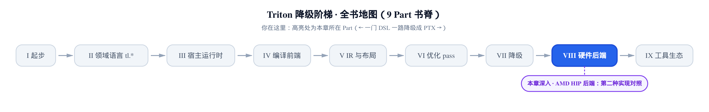
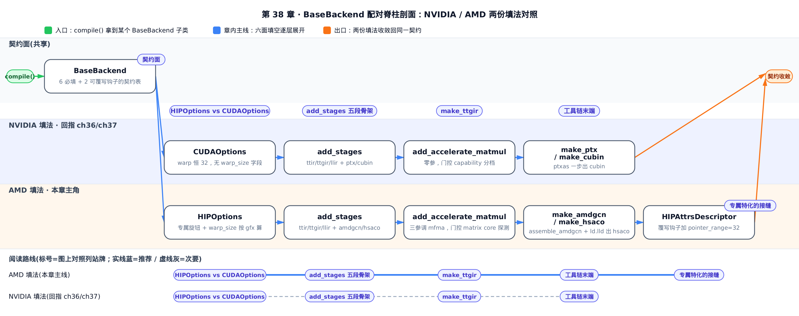
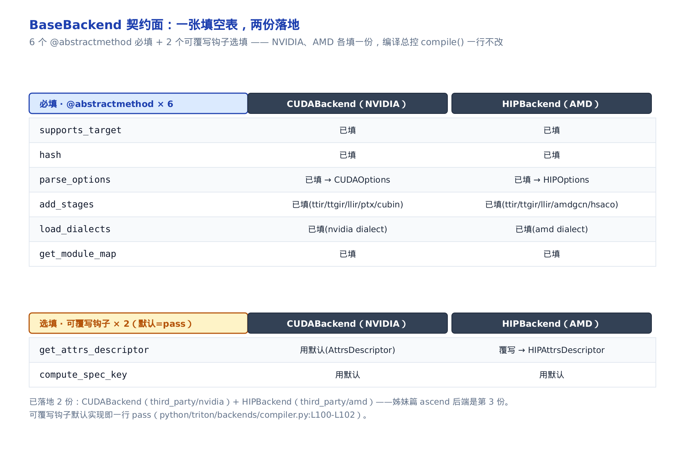
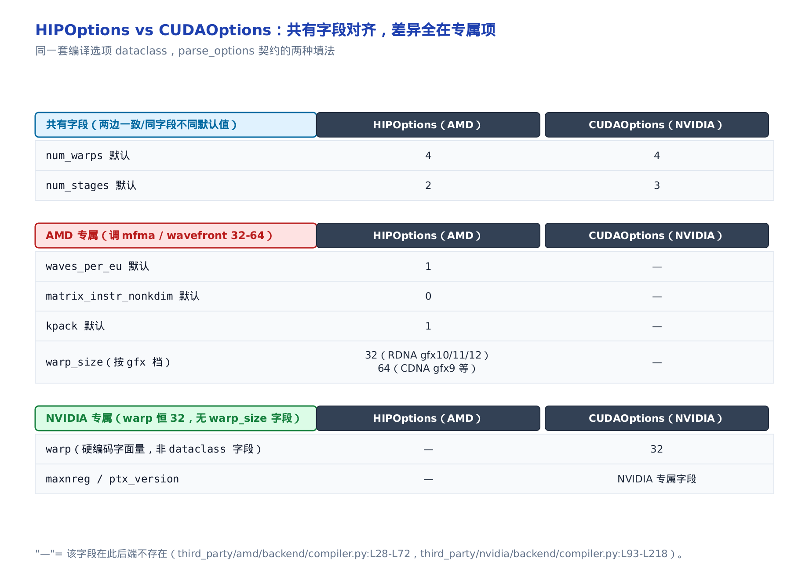
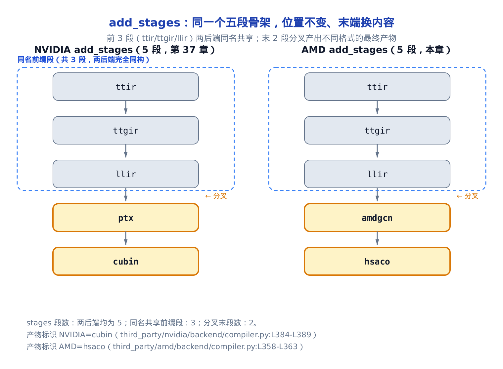
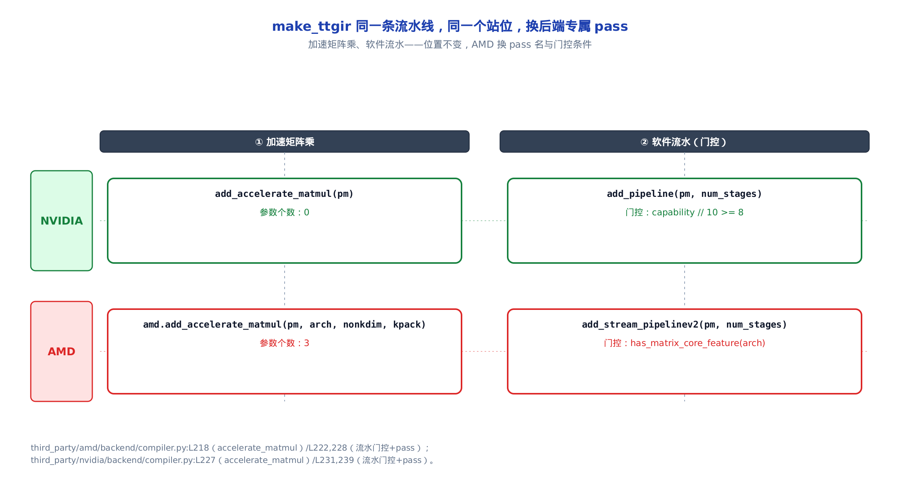
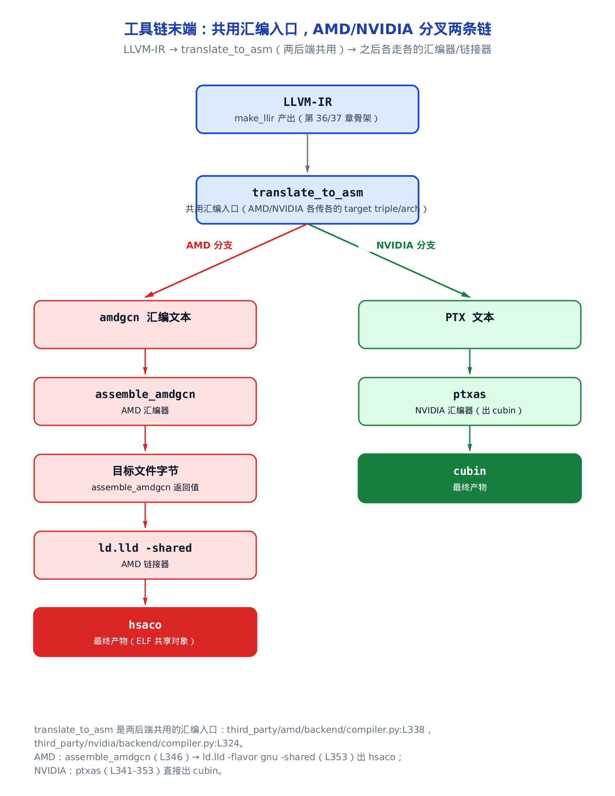

# 对照落地：AMD HIP 后端——同一抽象的第二种实现



> 你在这里：Part VIII 硬件后端，收官对照。
> 前两章：CUDABackend 把五段 stages 钉进管线、一路降到 cubin 发射。
> 这一章：把 AMD 后端与 NVIDIA 逐面对照，坐实配对脊柱主线。

[第 36 章](../../ch36-cudabackend-inject-stages/narrative/chapter.md)和[第 37 章](../../ch37-ptx-cubin-launch/narrative/chapter.md)读完，你已经把 NVIDIA 这一条落地链摸透了：`CUDABackend` 填好 `BaseBackend` 的六个抽象方法、`add_stages` 钉进 `ttir → ttgir → llir → ptx → cubin` 五段、末端靠 `ptxas` 出 cubin。现在换一个问题：**如果要把一块新的加速卡接进 Triton，到底要填哪几个方法，哪些是这块卡专属的特化？**

本章不再重讲 NVIDIA 那条链，而是把 **AMD HIP 后端**（HIP 是 Heterogeneous-compute Interface for Portability，AMD 对标 CUDA 的编程接口，落地在 `third_party/amd/backend/compiler.py`）搬来当活样板，与 NVIDIA 逐面对照。你会看到一件反直觉的事：两个后端的骨架**一模一样**——同一套 `BaseBackend` 契约、同一个 `add_stages` 五段、同一条 `make_ttgir` pass 流水线的站位——差异全部收敛在每段填的**血肉**里。这正是姊妹篇《Triton-Ascend 源码解读》要讲的施工图：看懂 AMD 怎么接进来，就懂昇腾（ascend）后端该怎么接。AMD 是第二份实现，ascend 是第三份。

读懂这一章，你能拿到一个实打实的性能抓手：**跨厂商的性能旋钮对照表**。写一个要在 NVIDIA 和 AMD 上都快的 kernel 时，有几个旋钮**必须分档**——AMD 侧独有 `waves_per_eu`、`matrix_instr_nonkdim`、`kpack` 调 matrix core（AMD 的矩阵乘加速单元，对标 NVIDIA 的 Tensor Core），`warp_size` 因硬件不同是 32 或 64（NVIDIA 恒 32），还有一个 `pointer_range=32` 属性能解锁 AMD 专属的 buffer load/store 访存指令。这些旋钮在 NVIDIA 侧根本不存在。搞清哪些是共有、哪些是后端专属，autotune 配置才不会张冠李戴。

> 只想拿到跨厂商旋钮对照，直接跳「[HIPOptions vs CUDAOptions：差异全在专属项](#hipoptions-vs-cudaoptions差异全在专属项)」和「[后端专属特化的接缝：buffer load/store](#后端专属特化的接缝buffer-loadstore)」两节；想跟完整个「填空」全过程，按序读。



图上实线蓝标的是 AMD 这条主线，虚线灰回指的是 NVIDIA 那边已经讲过的对照点。只想抓「AMD 到底怎么填」这一条，跟着实线从头读到尾就够；想顺手把每一处和 NVIDIA 的差异也钉一遍，虚线经过的那几节多停一停。

## BaseBackend 契约面：一张填空表，两份落地

### 直觉：抽象类是一张填空表

接一个新后端，第一步不是写代码，而是打开 `BaseBackend`（后端抽象基类）看它要你填什么。这个类本身不干活——它只用 Python 的 `@abstractmethod`（抽象方法，子类必须实现否则无法实例化）把「一个后端必须提供哪些能力」定死成一张表。NVIDIA 填一份成了 `CUDABackend`，AMD 填一份成了 `HIPBackend`，两份填的是**同一张表**。

### 机制：6 个必填 + 2 个选填

翻开 `python/triton/backends/compiler.py`，`BaseBackend` 用六个 `@abstractmethod` 列出后端契约：

```python
# python/triton/backends/compiler.py:L226-L290
class BaseBackend(metaclass=ABCMeta):

    def __init__(self, target: GPUTarget) -> None:
        self.target = target
        assert self.supports_target(target)

    @abstractclassmethod
    def supports_target(target: GPUTarget):
        raise NotImplementedError

    @abstractmethod
    def hash(self) -> str:
        """Returns a unique identifier for this backend"""
        raise NotImplementedError

    @abstractmethod
    def parse_options(self, options: dict) -> object:
        """
        Converts an `options` dictionary into an arbitrary object and returns it.
        This function may contain target-specific heuristics and check the legality of the provided options
        """
        raise NotImplementedError

    @abstractmethod
    def add_stages(self, stages: dict, options: object) -> None:
        """
        Populates `stages` dictionary with entries of the form:
        ir_name [str] => Function[(src: str, metadata: dict) -> str|bytes]
        The value of each entry may populate a `metadata` dictionary.
        Stages will be run sequentially (in inseriton order) and can communicate using `metadata`.
        All stages are expected to return a `str` object, except for the last stage which returns
        a `bytes` object for execution by the launcher.
        """
        raise NotImplementedError

    @abstractmethod
    def load_dialects(self, context):
        """
        Load additional MLIR dialects into the provided `context`
        """
        raise NotImplementedError

    @abstractmethod
    def get_module_map(self) -> Dict[str, ModuleType]:
        """
        Return a map of interface modules to their device-specific implementations
        """
        raise NotImplementedError
```

六个必填方法的分工，`add_stages` 的 docstring 已经把配对脊柱的命门写死了：stages 字典里每一段是 `(src, metadata) -> str|bytes` 的函数，**按插入顺序依次执行**，除最后一段返回 `bytes`（给 launcher 执行的机器码），其余都返回 `str`。这条契约对 NVIDIA 和 AMD 一字不差——两个后端唯一能改的，是往里填几段、每段填什么。

除了六个必填，`BaseBackend` 还留了两个**可覆写钩子**（有默认实现、后端可选择要不要覆写）：

```python
# python/triton/backends/compiler.py:L292-L304
    def get_attrs_descriptor(self, params, args):
        """
        Return an attribute descriptor: given a set of parameters and arguments
        the descriptor stores a set of compile time properties that can improve code
        generation. Different backends might benefit from different properties
        """
        return AttrsDescriptor(params, args)

    def compute_spec_key(self, arg, align):
        """
        Return the ascii key for a given argument with a given set of properties
        """
        return AttrsDescriptor.get_property_key(arg, align)
```

`get_attrs_descriptor`（返回参数属性描述符，供代码生成用）默认返回基类 `AttrsDescriptor`。这个「默认返回基类」是关键——AMD 就是靠**覆写它**塞进后端专属属性，本章最后一节会看到；NVIDIA 不覆写，用默认的就够了。默认实现真的只是一行，`AttrsDescriptor` 基类里留给后端的那个钩子彻底是空的：

```python
# python/triton/backends/compiler.py:L100-L102
    def _add_backend_properties(self, params=None, values=None):
        """ This method is for different subclasses to implement their own compile-time properties """
        pass
```

`pass` 一个字——这就是抽象接口留给后端专属特化的空位。谁需要就覆写它，谁不需要就沿用这个 `pass`。

**不变量：编译总控不因新后端而改。** 六个必填加两个可覆写钩子，把「后端要提供什么」全部封在契约面里。于是编译总控 `compile()` 拿到任何一个 `BaseBackend` 子类，只调这几个约定好的方法，**一行都不用改**就能驱动一个全新后端。这是「开放-封闭」原则的教科书落地：对扩展开放（加后端=新填一份），对修改封闭（总控不动）。度量也很干脆——接一个新后端要写的量，就是这 6 个必填方法加下面 `add_stages` 里注入的 5 个 `make_*` 函数，可覆写钩子按需覆写。

下面这张对照表把「填空」摊开：哪些必填、哪些选填，NVIDIA 与 AMD 各填了什么，一目了然。



到这里，配对脊柱的骨架已经立住：一张 6+2 的填空表，已有两份落地（`CUDABackend` 在 `third_party/nvidia`、`HIPBackend` 在 `third_party/amd`），ascend 是等着填的第三份。接下来逐面看 AMD 这份填了什么——先从最能体现「后端专属」的编译选项开始。

## HIPOptions vs CUDAOptions：差异全在专属项

### 直觉：同一张表格，多填几栏

`parse_options` 这个必填方法，产出的是一个装编译选项的 dataclass（数据类）。NVIDIA 的叫 `CUDAOptions`，AMD 的叫 `HIPOptions`。两者绝大多数字段**逐字段对齐**——`num_warps`、`num_stages`、`num_ctas` 这些跨厂商通用的旋钮，名字和含义都一样。差异只在少数几栏：AMD 多填了调自家硬件的专属项，NVIDIA 多填了自己的。就像两份同款表格，各自在末尾多勾了几个专属选项。

### 机制：共有字段一致，专属字段分叉

看 `HIPOptions` 的字段定义（`third_party/amd/backend/compiler.py`）：

```python
# third_party/amd/backend/compiler.py:L28-L52
@dataclass(frozen=True)
class HIPOptions:
    num_warps: int = 4
    waves_per_eu: int = 1
    num_stages: int = 2
    num_ctas: int = 1
    num_buffers_warp_spec: int = 0
    num_consumer_groups: int = 0
    reg_dec_producer: int = 0
    reg_inc_consumer: int = 0
    extern_libs: dict = None
    cluster_dims: tuple = (1, 1, 1)
    debug: bool = False
    sanitize_overflow: bool = True
    arch: str = None
    supported_fp8_dtypes: Tuple[str] = ("fp8e5", )
    deprecated_fp8_dtypes: Tuple[str] = ()
    default_dot_input_precision: str = "ieee"
    allowed_dot_input_precisions: Tuple[str] = ("ieee", )
    enable_fp_fusion: bool = True
    matrix_instr_nonkdim: int = 0
    kpack: int = 1
    allow_flush_denorm: bool = False
    max_num_imprecise_acc_default: int = 0
    backend_name: str = 'hip'
```

`num_warps` 默认 4，和 NVIDIA 一样；`num_stages` 默认 2，NVIDIA 是 3——同一个字段、不同默认值，因为两家的软件流水策略不同。真正只属于 AMD 的是这三个：

- `waves_per_eu` 默认 1：每个 EU（Execution Unit，AMD 的执行单元）上驻留几个 wave（波，AMD 的线程调度单位），是占用率旋钮，后面会看到它被直接写进内核属性。
- `matrix_instr_nonkdim` 默认 0：调 mfma（Matrix Fused Multiply-Add，AMD matrix core 的矩阵乘加指令）变体的非-K 维尺寸。
- `kpack` 默认 1：与 `matrix_instr_nonkdim` 搭配，控制 mfma 的 K 维打包。

这三个都是喂给 AMD matrix core 的旋钮，NVIDIA 的 MMA（Matrix Multiply-Accumulate，NVIDIA Tensor Core 指令）指令形态不同，`CUDAOptions` 里根本没有它们。反过来，NVIDIA 独有 `maxnreg`（每线程寄存器上限）、`ptx_version`，AMD 也没有。

下面这张对照表把三类字段——共有、AMD 专属、NVIDIA 专属——分组摊开：



### warp_size：一个不能写死的字段

有一个字段特别值得单独拎出来，因为它是配对脊柱最尖锐的差异点：**`warp_size`**。

NVIDIA 的 warp（一次 SIMD 调度的 lane 数）恒为 32，所以 `CUDAOptions` 里压根没有 `warp_size` 字段——需要用到 32 的地方直接写字面量。看 NVIDIA 把 TTIR 转成 TTGIR（Triton GPU IR，带硬件布局信息的中间表示，见[第 20 章](../../ch20-layout-is-a-function/narrative/chapter.md)）时的那一行：

```python
# third_party/nvidia/backend/compiler.py:L218
        passes.ttir.add_convert_to_ttgpuir(pm, f"cuda:{capability}", opt.num_warps, 32, opt.num_ctas)
```

第三个实参 `32` 是硬编码的字面量——NVIDIA 永远不需要问「一个 warp 多少 lane」。

AMD 不行。AMD 的 wavefront（对应 NVIDIA 的 warp）在不同架构上大小不同：RDNA 架构（gfx10/11/12，gfx 是 AMD GPU 的架构代号，如 gfx1100）是 32，CDNA 架构（gfx9 等，面向数据中心）是 64。wavefront 就是前面 `waves_per_eu` 里那个 wave 的全称——同一个执行组，一边说驻留几个（`waves_per_eu`）、一边说每个多宽（`warp_size`）。所以 `HIPOptions` 必须把 `warp_size` 做成一个**计算出来的字段**，在 `__post_init__`（dataclass 初始化后自动调用的钩子）里按 arch 现算：

```python
# third_party/amd/backend/compiler.py:L61-L72
    def __post_init__(self):
        default_libdir = Path(__file__).parent / 'lib'
        extern_libs = {} if self.extern_libs is None else dict(self.extern_libs)
        # Ignore user-defined warp size for gfx9
        warp_size = 32 if 'gfx10' in self.arch or 'gfx11' in self.arch or 'gfx12' in self.arch else 64
        object.__setattr__(self, 'warp_size', warp_size)
        libs = ["ocml", "ockl"]
        for lib in libs:
            extern_libs[lib] = str(default_libdir / f'{lib}.bc')
        object.__setattr__(self, 'extern_libs', tuple(extern_libs.items()))
        assert self.num_warps > 0 and (self.num_warps & (self.num_warps - 1)) == 0, \
               "num_warps must be a power of 2"
```

一行三目就把 `warp_size` 定了：gfx10/11/12 → 32，否则 → 64。因为 dataclass 是 `frozen=True`（不可变），赋值得走 `object.__setattr__` 绕过冻结。顺带这里还注入了 `ocml`、`ockl`（AMD 的两个 device library bitcode，提供数学函数等运行时实现）的路径——这也是后端专属，NVIDIA 挂的是自己的 libdevice。

把这两处并排看，warp_size 的两种「填法」就出来了：

| 后端 | warp/wavefront | warp_size 怎么定 |
|---|---|---|
| NVIDIA | 恒 32 | 无字段，`add_convert_to_ttgpuir` 处硬编码字面量 32 |
| AMD RDNA（gfx10/11/12） | 32 | `__post_init__` 按 arch 算出 32 |
| AMD CDNA（gfx9 等） | 64 | `__post_init__` 按 arch 算出 64 |

**为什么它必须是后端可变量，而不是常量？** 因为 `warp_size` 会作为参数传进 `add_convert_to_ttgpuir`（AMD 侧传的是 `options.warp_size`），直接影响 TTGIR 里每个 warp 摊多少线程（threads-per-warp）的布局决策。写死成 32 会让 CDNA 卡上的布局全错。这就是配对脊柱的道理：同一个契约位置（`parse_options` 产出的选项、`add_convert_to_ttgpuir` 的入参），NVIDIA 填常量、AMD 填计算项——**位置不变，填法因硬件而异**。

**不变量：`parse_options` 的契约位置不变——两边都产出一个装编译选项的 dataclass；变的只是塞进去的专属字段、以及某字段是常量字面量还是 `__post_init__` 计算项。**

**性能提示**：`waves_per_eu`、`matrix_instr_nonkdim`、`kpack` 这三个旋钮，autotune 时只在 AMD 配置里出现才有意义；`warp_size` 你改不了（它由 arch 定死），但要知道 CDNA 卡上一个 wavefront 是 64 lane——block 尺寸、向量化宽度的心算基数跟 NVIDIA 不是一回事。

## 填六个方法：parse_options 与 pybind 双语接缝

把选项讲清了，回头看 `HIPBackend` 是怎么把六个必填方法真正填上的。这一节走 `parse_options`、`get_codegen_implementation`、`load_dialects`、`get_module_map` 四个方法（`add_stages` 单独一节讲），看 AMD 版填了什么。

```python
# third_party/amd/backend/compiler.py:L128-L161
    def parse_options(self, opts) -> Any:
        args = {'arch': self.target.arch}

        if "supported_fp8_dtypes" not in opts:
            supported_fp8_dtypes = set(HIPOptions.supported_fp8_dtypes)
            if self.target.arch in ('gfx940', 'gfx941', 'gfx942'):
                supported_fp8_dtypes.update({'fp8e4b8', 'fp8e5b16'})
            args["supported_fp8_dtypes"] = tuple(sorted(supported_fp8_dtypes))

        if "enable_fp_fusion" not in opts:
            args["enable_fp_fusion"] = os.getenv("TRITON_DEFAULT_FP_FUSION", "1") == "1"
        args.update({k: opts[k] for k in HIPOptions.__dataclass_fields__.keys() if k in opts})
        return HIPOptions(**args)

    def pack_metadata(self, metadata):
        return (
            metadata.num_warps,
            metadata.num_ctas,
            metadata.shared,
            metadata.cluster_dims[0],
            metadata.cluster_dims[1],
            metadata.cluster_dims[2],
        )

    def get_codegen_implementation(self):
        codegen_fns = {"min_dot_size": min_dot_size(self.target)}
        return codegen_fns

    def get_module_map(self) -> Dict[str, ModuleType]:
        from triton.language.extra.hip import libdevice
        return {"triton.language.extra.libdevice": libdevice}

    def load_dialects(self, ctx):
        amd.load_dialects(ctx)
```

`parse_options` 里有一处 AMD 专属的动态逻辑：只有 `gfx940/941/942`（CDNA 3.0 的几款）才补充 `fp8e4b8`、`fp8e5b16` 两个 fp8 数据类型——因为只有这几款硬件支持它们。这是「按 gfx 档补能力」的典型，NVIDIA 侧对应的是按 capability（算力版本号）判断支持的 dtype。补完后组装成 `HIPOptions` 返回。

后三个方法体现的是**pybind 双语接缝**（pybind 是 Python 绑定 C++ 的库）。`load_dialects` 调 `amd.load_dialects(ctx)` 挂 AMD 的 MLIR dialect（方言，一组 IR 操作的定义，见[第 19 章](../../ch19-tt-dialect-vocabulary/narrative/chapter.md)）；`get_module_map` 挂 `triton.language.extra.hip.libdevice`。NVIDIA 侧一模一样的方法签名，只是换成 `nvidia.load_dialects`、`cuda` 的 libdevice——**同一个方法、换后端的 C++ 扩展命名空间**。`get_codegen_implementation` 也是同理，AMD 只塞一个 `min_dot_size`：

```python
# third_party/amd/backend/compiler.py:L15-L25
def min_dot_size(target: GPUTarget):
    arch_str = target.arch
    # CDNA 3.0 supports k==8 in all mfma variants except for int8
    # (where the smallest `k` supported is 16)
    if "gfx94" in arch_str:
        return lambda lhsType, rhsType: (16, 16, 16) if (lhsType.is_int8() or rhsType.is_int8()) else (16, 16, 8)
    # CDNA 2.0 always supports `k==8`
    if "gfx9" in arch_str:
        return lambda lhsType, rhsType: (16, 16, 8)
    # Other architectures will only support 16,16,16
    return lambda lhsType, rhsType: (16, 16, 16)
```

`min_dot_size` 返回一个 lambda，告诉编译器这块卡的 mfma 支持的最小矩阵形状——按 gfx 档三分支：CDNA 3.0（gfx94）int8 要 K≥16、其余 K≥8，CDNA 2.0（gfx9）恒 K≥8，其余架构只支持 16×16×16。NVIDIA 的 `min_dot_size` 是同名函数，但里面是按 Tensor Core 支持的形状写的另一张硬件表。又一次：同名、同位置、换硬件表。

这四个方法填完，`HIPBackend` 已经能被编译总控识别成一个合法后端了。接下来是最能体现配对脊柱的一段——`add_stages` 怎么钉五段。

## add_stages 五段骨架：前三段同名，只分叉末两段

### 直觉：照抄五格，只改最后两格

`add_stages` 是配对脊柱的命门。它要往 stages 字典里钉进「一个 kernel 从 IR 到机器码」要走的每一段。NVIDIA 钉了五段，AMD 也钉五段——而且**前三段连名字都一样**。差异只发生在产码的最后两段：NVIDIA 是 `ptx → cubin`，AMD 是 `amdgcn → hsaco`（amdgcn 是 AMD GCN 架构的汇编文本，hsaco 是 AMD 的 GPU 可执行二进制格式——对位 NVIDIA 的 ptx/cubin，具体工具链留到本章末端「工具链末端」一节详解）。

### 机制：五段骨架并排看

AMD 的 `add_stages` 全文就这么几行：

```python
# third_party/amd/backend/compiler.py:L358-L363
    def add_stages(self, stages, options):
        stages["ttir"] = lambda src, metadata: self.make_ttir(src, metadata, options)
        stages["ttgir"] = lambda src, metadata: self.make_ttgir(src, metadata, options)
        stages["llir"] = lambda src, metadata: self.make_llir(src, metadata, options)
        stages["amdgcn"] = lambda src, metadata: self.make_amdgcn(src, metadata, options)
        stages["hsaco"] = lambda src, metadata: self.make_hsaco(src, metadata, options)
```

NVIDIA 的 `add_stages`（[第 36 章](../../ch36-cudabackend-inject-stages/narrative/chapter.md)已细讲）并排放：

```python
# third_party/nvidia/backend/compiler.py:L384-L389
    def add_stages(self, stages, options):
        stages["ttir"] = lambda src, metadata: self.make_ttir(src, metadata, options)
        stages["ttgir"] = lambda src, metadata: self.make_ttgir(src, metadata, options, self.capability)
        stages["llir"] = lambda src, metadata: self.make_llir(src, metadata, options, self.capability)
        stages["ptx"] = lambda src, metadata: self.make_ptx(src, metadata, options, self.capability)
        stages["cubin"] = lambda src, metadata: self.make_cubin(src, metadata, options, self.capability)
```

一眼看下去：`ttir`、`ttgir`、`llir` 三段，两边**键名一字不差**。差异有两处，都很轻：NVIDIA 的 lambda 多传一个 `self.capability`（算力版本），AMD 不用（arch 已经在 `options` 里了）；末两段的键名，NVIDIA 是 `ptx/cubin`，AMD 是 `amdgcn/hsaco`。

而这个键名对应的产物类型，在 `__init__` 里就用 `binary_ext`（二进制扩展名）标好了：AMD 是 `'hsaco'`，NVIDIA 是 `'cubin'`。

配对脊柱在这里最清楚：



**不变量：stages 顺序执行、前段 str、末段 bytes。** 这条来自 `BaseBackend.add_stages` 的 docstring 契约，两个后端照单全收。五段按插入顺序跑，`ttir/ttgir/llir/amdgcn` 四段返回字符串形态的 IR/汇编，`hsaco` 段返回 `bytes`（真机器码），恰好对齐 NVIDIA 的 `cubin` 段返回 bytes。**接一个新后端，本质上就是照填这五个 `make_*` 函数、只改末两段的目标格式。** ascend 后端也一样——前三段 `make_ttir/make_ttgir/make_llir` 骨架照抄，末两段换成昇腾的汇编与二进制格式。

骨架看清了，接下来两节钻进具体的段：先看 `make_ttgir` 里 AMD 的 pass 序列怎么换，再看末端 `amdgcn/hsaco` 的工具链。

## make_ttgir：同一条流水线，换后端专属 pass

### 直觉：同一个站位，换一台机器

`make_ttgir` 是一条 pass（编译趟，一次 IR 变换）流水线，把 TTIR 优化并降成带布局的 TTGIR。这条流水线的**站位顺序**跨后端是一致的：先合并访存、再加速矩阵乘、再软件流水……AMD 没有重排这些站，只是在「加速矩阵乘」和「软件流水」这两站，换上了自家的 pass、换了开关的判据。像同一条产线的同一个工位，换了一台适配自家零件的机器。

### 机制：两站换 pass，门控换判据

看 AMD 的 `make_ttgir`（截取核心段）：

```python
# third_party/amd/backend/compiler.py:L206-L244
    @staticmethod
    def make_ttgir(mod, metadata, options):
        pm = ir.pass_manager(mod.context)
        pm.enable_debug()
        passes.ttir.add_convert_to_ttgpuir(pm, f"hip:{options.arch}", options.num_warps, options.warp_size,
                                           options.num_ctas)
        pm.run(mod)
        pm = ir.pass_manager(mod.context)
        pm.enable_debug()
        passes.ttgpuir.add_coalesce(pm)
        passes.ttgpuir.add_remove_layout_conversions(pm)
        passes.ttgpuir.add_optimize_thread_locality(pm)
        amd.passes.ttgpuir.add_accelerate_matmul(pm, options.arch, options.matrix_instr_nonkdim, options.kpack)
        passes.ttgpuir.add_remove_layout_conversions(pm)
        amd.passes.ttgpuir.add_optimize_epilogue(pm)
        passes.ttgpuir.add_optimize_dot_operands(pm, True)
        if amd.has_matrix_core_feature(options.arch):
            assert options.num_stages != 0, ("Triton AMD backend pipeliner has been updated. "
                                             "We used to trigger software pipelining with "
                                             "num_stages == 0. Now it will not happen anymore; "
                                             "please update to use num_stages == 2 for "
                                             "equivalent behavior in the past.")
            amd.passes.ttgpuir.add_stream_pipelinev2(pm, options.num_stages)
            passes.common.add_canonicalizer(pm)
        amd.passes.ttgpuir.insert_instruction_sched_hints(pm)
        passes.ttgpuir.add_optimize_dot_operands(pm, True)
        passes.ttgpuir.add_remove_layout_conversions(pm)
        passes.ttgpuir.add_reduce_data_duplication(pm)
        if amd.has_matrix_core_feature(options.arch):
            amd.passes.ttgpuir.add_reorder_instructions(pm)
        if os.environ.get("AMDGCN_USE_BUFFER_OPS", "0") == "1":
            amd.passes.ttgpuir.add_canonicalize_pointers(pm)
            passes.common.add_canonicalizer(pm)
            amd.passes.ttgpuir.add_convert_to_buffer_ops(pm)
        passes.common.add_canonicalizer(pm)
        passes.common.add_cse(pm)
        passes.common.add_symbol_dce(pm)
        pm.run(mod)
        return mod
```

注意几处带 `amd.` 前缀的 pass——它们来自 AMD 的 C++ 扩展，是后端专属的。对照 NVIDIA 同一位置（[第 36 章](../../ch36-cudabackend-inject-stages/narrative/chapter.md)已讲）：

```python
# third_party/nvidia/backend/compiler.py:L226-L239
        passes.ttgpuir.add_optimize_thread_locality(pm)
        passes.ttgpuir.add_accelerate_matmul(pm)
        passes.ttgpuir.add_remove_layout_conversions(pm)
        passes.ttgpuir.add_optimize_dot_operands(pm, capability >= 80)
        passes.common.add_cse(pm)
        if capability // 10 >= 8:
            passes.ttgpuir.add_optimize_accumulator_init(pm)
            passes.ttgpuir.add_combine_tensor_select_and_if(pm)
            passes.ttgpuir.add_ws_task_partition(pm, opt.num_consumer_groups)
            passes.ttgpuir.add_taskid_propagate(pm, opt.num_consumer_groups)
            passes.ttgpuir.add_ws_data_partition(pm, opt.num_consumer_groups)
            passes.ttgpuir.add_ws_code_partition(pm, opt.num_buffers_warp_spec, opt.num_consumer_groups,
                                                 opt.reg_dec_producer, opt.reg_inc_consumer)
            passes.ttgpuir.add_pipeline(pm, opt.num_stages)
```

两站对照，差异极其规整：

**第一站，加速矩阵乘。** NVIDIA 是 `passes.ttgpuir.add_accelerate_matmul(pm)`，**零后端参数**——Tensor Core 的形状选择由 pass 内部按 capability 定。AMD 是 `amd.passes.ttgpuir.add_accelerate_matmul(pm, options.arch, options.matrix_instr_nonkdim, options.kpack)`，**多带三个后端参数**：`arch`、`matrix_instr_nonkdim`、`kpack`——正是上一节 `HIPOptions` 里那三个 mfma 旋钮，喂进来调 matrix core 变体。这个 pass 的机制本身（把 dot 提升成硬件矩阵乘布局）[第 28 章](../../ch28-accelerate-matmul-layout-opt/narrative/chapter.md)已经讲透，这里只看它的两种「填法」。

**第二站，软件流水。** NVIDIA 的门控是 `if capability // 10 >= 8`——按算力分档，Ampere（算力 8x）及以上才开，开的是 `add_pipeline`。AMD 的门控是 `if amd.has_matrix_core_feature(options.arch)`——探测这块卡有没有 matrix core，有就开 `add_stream_pipelinev2`（AMD 自己的流水 pass v2 版）。软件流水的原理见[第 29 章](../../ch29-software-pipelining-primer/narrative/chapter.md)和[第 30 章](../../ch30-software-pipelining-landing/narrative/chapter.md)，此处只对照：**同一个「开不开流水」的门，NVIDIA 用算力数分档，AMD 用硬件特性探测。**

这里还能看到 AMD 独有的一段：末尾 `AMDGCN_USE_BUFFER_OPS` 环境开关一旦打开，就多跑 `add_canonicalize_pointers` 和 `add_convert_to_buffer_ops` 两个 pass——这正是下一节 buffer load/store 的落地入口，NVIDIA 完全没有这段。

**不变量：`make_ttgir` 流水线里「加速矩阵乘」「软件流水」两站的位置不变——两后端都在同一站位插入对应 pass；变的只是塞进去的 pass 实现和门控判据。**

下面这张对照图把两站的差异钉在一起：



**性能提示**：`matrix_instr_nonkdim` 和 `kpack` 就是在这一站生效的——它们决定了 dot 用哪种 mfma 变体、K 维怎么打包。autotune 一个 AMD 上的矩阵乘 kernel，这两个旋钮往往和 `num_warps`、`num_stages` 一起扫；在 NVIDIA 上它们根本不存在，扫也没用。

## make_llir：给 AMDGPU 设 control constants

`make_llir` 把 TTGIR 降成 LLVM IR，这一段的骨架（TTGIR → LLVM-MLIR → LLVM-IR）两后端同构，[第 36 章](../../ch36-cudabackend-inject-stages/narrative/chapter.md)已讲。AMD 在这里做了一件 NVIDIA 不做的事：往 LLVM module 上设一批 **AMDGPU control constants**（控制常量）和内核属性，让 device library 能解析、让后端优化知道 wavefront 大小。截取这一段：

```python
# third_party/amd/backend/compiler.py:L294-L308
        # Set various control constants on the LLVM module so that device
        # libraries can resolve references to them.
        amd.set_isa_version(llvm_mod, options.arch)
        amd.set_abi_version(llvm_mod, 400)
        amd.set_bool_control_constant(llvm_mod, "__oclc_finite_only_opt", False)
        amd.set_bool_control_constant(llvm_mod, "__oclc_correctly_rounded_sqrt32", True)
        amd.set_bool_control_constant(llvm_mod, "__oclc_unsafe_math_opt", False)
        amd.set_bool_control_constant(llvm_mod, "__oclc_wavefrontsize64", options.warp_size == 64)

        # Set kernel attributes first given this may affect later optimizations.
        fns = [fn for fn in llvm_mod.get_functions() if not fn.is_declaration()]
        # The public kernel should be kernel 0.
        fns[0].set_calling_conv(amd.CALLING_CONV_AMDGPU_KERNEL)
        fns[0].add_fn_attr("amdgpu-flat-work-group-size", f"1,{options.num_warps*options.warp_size}")
        fns[0].add_fn_attr("amdgpu-waves-per-eu", f"{options.waves_per_eu}")
```

这里三个 `HIPOptions` 字段直接落地成 LLVM 属性，串起了整条链：`__oclc_wavefrontsize64` 这个控制常量的值 = `options.warp_size == 64`，直连上一节 `__post_init__` 按 gfx 档算的 warp_size——CDNA 卡上它为真、RDNA 卡上为假，device library 据此选对的 wavefront 实现。`amdgpu-flat-work-group-size` 用 `num_warps * warp_size` 算出一个 work group 的线程数——这个属性是 `min,max` 格式的一对值，`1` 是下界（min）、`num_warps * warp_size` 算出的是上界（max），是 LLVM 对 flat-work-group-size 的固定格式要求。`amdgpu-waves-per-eu` 直接取 `waves_per_eu` 字段——那个占用率旋钮在这里变成了后端能读懂的内核属性。NVIDIA 的 `make_llir` 里没有这些 `__oclc_*` 常量，它设的是自己那套。又一次印证：同一段的骨架相同，AMD 往里填自家的硬件常量。

## 工具链末端：amdgcn/hsaco 对照 ptx/cubin

### 直觉：换一套汇编器和链接器

到了最后两段，才真正分叉成两条产码链。但连分叉点都是**共用**的：两个后端都调同一个 `translate_to_asm`（LLVM 出汇编的入口）把 LLVM IR 翻成各自的汇编文本，只是喂进不同的 target triple（目标三元组，描述目标平台的字符串）和 arch。之后 AMD 走自己的汇编器、链接器出 hsaco，NVIDIA 走 `ptxas` 出 cubin（[第 37 章](../../ch37-ptx-cubin-launch/narrative/chapter.md)已讲）。同一段工具链，换一套后端汇编器/链接器。

### 机制：amdgcn 汇编 → ld.lld 链接出 hsaco

AMD 的末两段：

```python
# third_party/amd/backend/compiler.py:L329-L356
    @staticmethod
    def make_amdgcn(src, metadata, options):
        # Find kernel names (there should only be one)
        # We get the name at the last possible step to accomodate `triton.compile`
        # on user-provided LLVM
        names = re.findall(r"define amdgpu_kernel void @([a-zA-Z_][a-zA-Z0-9_]*)", src)
        assert len(names) == 1
        metadata["name"] = names[0]
        # llvm -> hsaco
        amdgcn = llvm.translate_to_asm(src, amd.TARGET_TRIPLE, options.arch, '', [], options.enable_fp_fusion, False)
        if os.environ.get("AMDGCN_ENABLE_DUMP", "0") == "1":
            print("// -----// AMDGCN Dump //----- //")
            print(amdgcn)
        return amdgcn

    @staticmethod
    def make_hsaco(src, metadata, options):
        hsaco = amd.assemble_amdgcn(src, options.arch, '')

        rocm_path = HIPBackend.path_to_rocm_lld()
        with tempfile.NamedTemporaryFile() as tmp_out:
            with tempfile.NamedTemporaryFile() as tmp_in:
                with open(tmp_in.name, 'wb') as fd_in:
                    fd_in.write(hsaco)
                subprocess.check_call([rocm_path, '-flavor', 'gnu', '-shared', tmp_in.name, '-o', tmp_out.name])
            with open(tmp_out.name, 'rb') as fd_out:
                ret = fd_out.read()
        return ret
```

`make_amdgcn` 干的和 NVIDIA 的 `make_ptx` 对称：正则抓唯一的 kernel 名写进 `metadata['name']`（`assert len(names) == 1` 守护「恰一个入口」，和 NVIDIA 一样），然后 `llvm.translate_to_asm` 出 amdgcn（AMD GCN 架构的汇编文本）。注意入口 `translate_to_asm` 就是 NVIDIA 出 PTX 用的同一个函数，只是第二、三个实参传的是 `amd.TARGET_TRIPLE` 和 AMD 的 arch。

`make_hsaco` 才是和 NVIDIA 分道扬镳的地方。NVIDIA 是一步 `ptxas` 出 cubin；AMD 是**两步**：先 `amd.assemble_amdgcn` 把 amdgcn 汇编成目标文件字节，再用 ROCm（AMD 的计算软件栈）的 `ld.lld`（LLVM 的链接器）以 `-shared` 模式链接成 **hsaco**（Heterogeneous System Architecture Code Object，AMD 的 GPU 二进制格式，本质是个 ELF 共享对象）。那个 `path_to_rocm_lld()` 负责按「环境变量 → wheel 内置 → `/opt/rocm` → 系统路径」的顺序找到 `ld.lld` 链接器。

整条末端链并排看：



**不变量：末段返回 bytes。** `make_hsaco` 读回链接产物返回 `bytes`，恰好对齐 `add_stages` 契约里「最后一段返回 bytes 给 launcher」——和 NVIDIA 的 `make_cubin` 返回 cubin bytes 一致。产物格式不同（hsaco vs cubin），但契约面上都是「一段 bytes」，所以上层的装载、发射逻辑能用同一套骨架接住。

## 后端专属特化的接缝：buffer load/store

前面几节看的都是「同一位置、换填法」。最后这一节看配对脊柱的另一面——**后端专属特化的接缝**：AMD 有一个 NVIDIA 完全没有的访存能力，它是怎么「插」进这套通用抽象的？

### 直觉：抽象留的空位，只有 AMD 来填

还记得本章开头那个 `_add_backend_properties` 空钩子（就一个 `pass`）吗？它就是抽象接口专门给后端专属特化留的空位。NVIDIA 不需要，就让它空着；AMD 需要，就覆写它，把一条 NVIDIA 没有的属性塞进 IR，从而解锁自家的 buffer load/store 指令。

### 机制：覆写钩子，注入 pointer_range=32

AMD 定义了 `AttrsDescriptor` 的子类 `HIPAttrsDescriptor`，覆写那个空钩子：

```python
# third_party/amd/backend/compiler.py:L79-L98
@register_descriptor
class HIPAttrsDescriptor(AttrsDescriptor):
    # This property asserts if the underlying storage area of a given pointer
    # can be resepresented as a 32 bit integer. When this is true, we can be
    # sure that all indices into the tensor behind that pointer can use 32-bit
    # indexing. That opens the door for the AMD backend to use buffer load/store
    # instrinsics, which requires this property. Buffer load/store intrinsics
    # gives direct out-of-bound support and simplifies index calculation for
    # lower register pressure.
    __slots__ = ("pointer_range_32")

    def _add_backend_properties(self, params=None, values=None):
        self.property_values["tt.pointer_range"] = 32
        if params is None or values is None:
            return

        self.arg_properties["tt.pointer_range"] = [
            param.num for param, arg in zip(params, values) if HIPAttrsDescriptor.is_within2gb(arg)
            and not param.do_not_specialize and not param.do_not_specialize_on_alignment
        ]
```

（类头那行 `@register_descriptor` 装饰器只是把这个子类登记进后端可发现的描述子表，跟本节主线——覆写 `_add_backend_properties`——无关，读时可略过。）

覆写后的钩子做一件事：给 IR 注入 `tt.pointer_range = 32` 这条属性，并把满足条件的参数一一标记。条件是 `is_within2gb(arg)`——这个指针背后的张量存储不超过 2GiB（即所有索引能用 32 位整数表示，$`2^{31}-1`$ 字节以内）。

注释把「为什么要这条属性」写得很清楚：一旦确定所有索引都能用 32 位寻址，AMD 后端就能改用 **buffer load/store intrinsics**（AMD 硬件的一类访存指令）。它有两个好处——**自带硬件级越界处理**（out-of-bound support，越界访问直接被硬件挡掉，不用软件判边界）、**简化索引计算从而降低寄存器压力**。而它的**前提**就是指针能 32 位寻址，所以要靠这条编译期属性把「这个指针 ≤2GiB」这个事实注进 IR。这条属性接着被上一节 `make_ttgir` 里 `AMDGCN_USE_BUFFER_OPS` 开关下的 `add_convert_to_buffer_ops` pass 消费，真正把访存换成 buffer 指令。

对照 NVIDIA：`CUDABackend` **不覆写** `get_attrs_descriptor`，用的是 `BaseBackend` 默认返回的基类 `AttrsDescriptor`，那个 `_add_backend_properties` 就是空的 `pass`——NVIDIA 没有 buffer load/store 这条路径，也就不需要这条属性。

**不变量：`_add_backend_properties` 钩子在两后端间的调用位置和签名不变；变的是要不要覆写它。**

**这就是配对脊柱的第四面，也是最微妙的一面。** 前几面是「同一位置、换填法」，这一面是「抽象在基类里预留了空位（可覆写钩子），后端专属能力从这个空位长出来」。基类不知道 buffer load/store 是什么，它只提供 `_add_backend_properties` 这个 `pass`；AMD 覆写它，就把自家硬件特性优雅地接了进来，一行没碰基类。ascend 后端如果有昇腾专属的访存或属性，走的也是同一个空位。

**性能提示**：如果你的 AMD kernel 里张量都在 2GiB 以内，开 `AMDGCN_USE_BUFFER_OPS` 可能省下索引寄存器、拿到硬件越界保护；张量超 2GiB 时 `is_within2gb` 判否，这条属性不会加到那些参数上，也就不会误用 buffer 指令。

## 小结：配对脊柱与第三份落地

把六个面收成一张表，配对脊柱就完整了。同一套 `BaseBackend` 契约（`python/triton/backends/compiler.py`），`CUDABackend`（`third_party/nvidia/backend/compiler.py`）和 `HIPBackend`（`third_party/amd/backend/compiler.py`）各填一份：

| 面 | 契约位置 | NVIDIA 填 | AMD 填 |
|---|---|---|---|
| 编译选项 | `parse_options` | `CUDAOptions`，warp 恒 32 无字段 | `HIPOptions`，多 `waves_per_eu`/`matrix_instr_nonkdim`/`kpack`，`warp_size` 按 gfx 档算 32/64 |
| 五段骨架 | `add_stages` | `ttir/ttgir/llir` + `ptx/cubin` | `ttir/ttgir/llir` + `amdgcn/hsaco` |
| pass 流水线 | `make_ttgir` | `add_accelerate_matmul(pm)` 零参、pipeline 门控 `capability//10>=8` | `add_accelerate_matmul(pm,arch,nonkdim,kpack)` 三参、pipeline 门控 `has_matrix_core_feature` |
| 工具链末端 | `make_*`（末两段） | `ptxas` 一步出 cubin | `assemble_amdgcn` + `ld.lld -shared` 出 hsaco |
| 双语接缝 | `load_dialects`/`get_module_map` | `nvidia.*` 命名空间 | `amd.*` 命名空间 |
| 专属特化 | `_add_backend_properties` 空钩子 | 不覆写（用基类默认 `pass`） | 覆写加 `tt.pointer_range=32` 启用 buffer load/store |

六个面，六种「同一位置、两种填法」。骨架一行不改，血肉全在后端专属——编译总控 `compile()` 拿到哪个后端都只调那几个约定好的方法。这就是抽象接口的力量：**加一个后端 = 新填一份实现，而不是改一遍编译器。**

回到开头那个问题——一块新卡怎么接进 Triton？答案现在很具体：填 `BaseBackend` 的六个方法、往 `add_stages` 钉五段（前三段照抄、末两段换成你的汇编与二进制格式）、在 `make_ttgir` 的既有站位换上你的 pass、需要专属特化就覆写那两个钩子。AMD 是第二份填法，姊妹篇《Triton-Ascend 源码解读》里的昇腾后端就是照着这张施工图填的第三份——你在那本书里会看到 `AscendBackend` 在完全相同的六个面上，填进昇腾自己的选项、pass 和二进制格式。看懂了 AMD 这份对照，那份就是同一套抽象的又一次落地。
