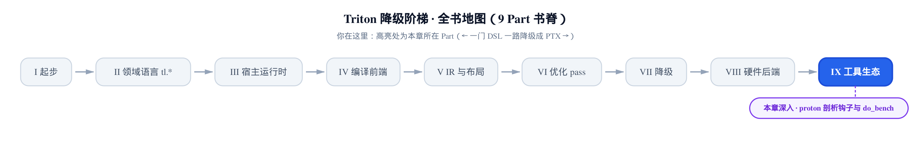
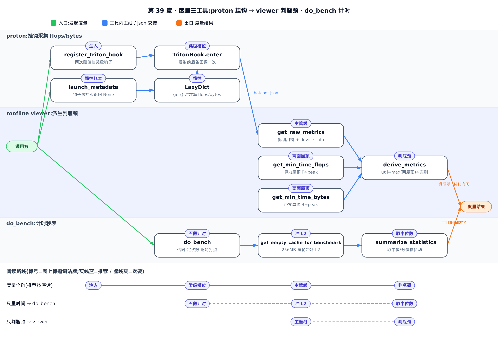
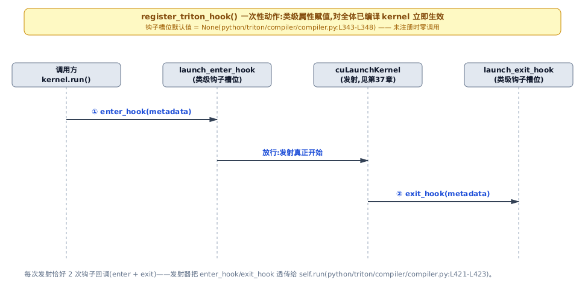
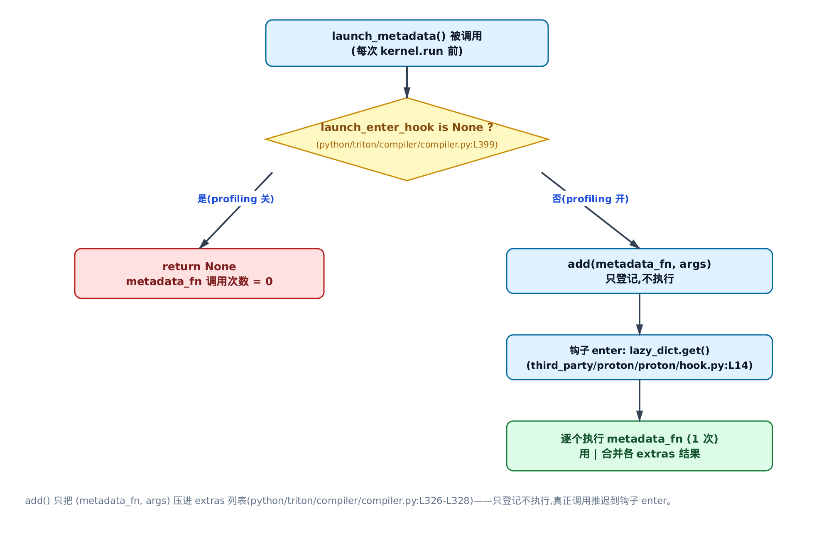
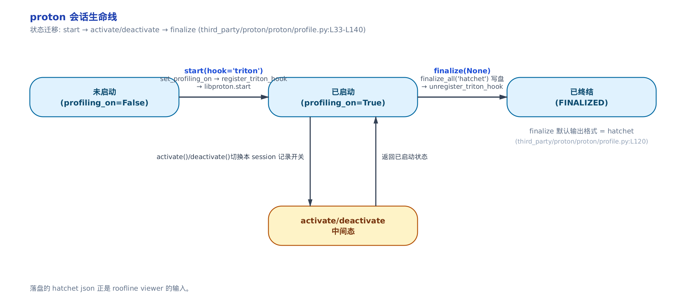
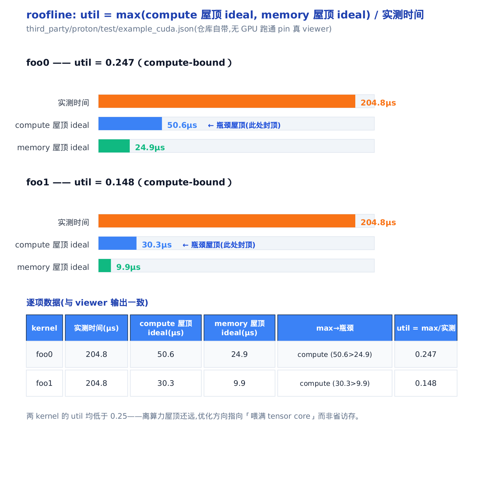
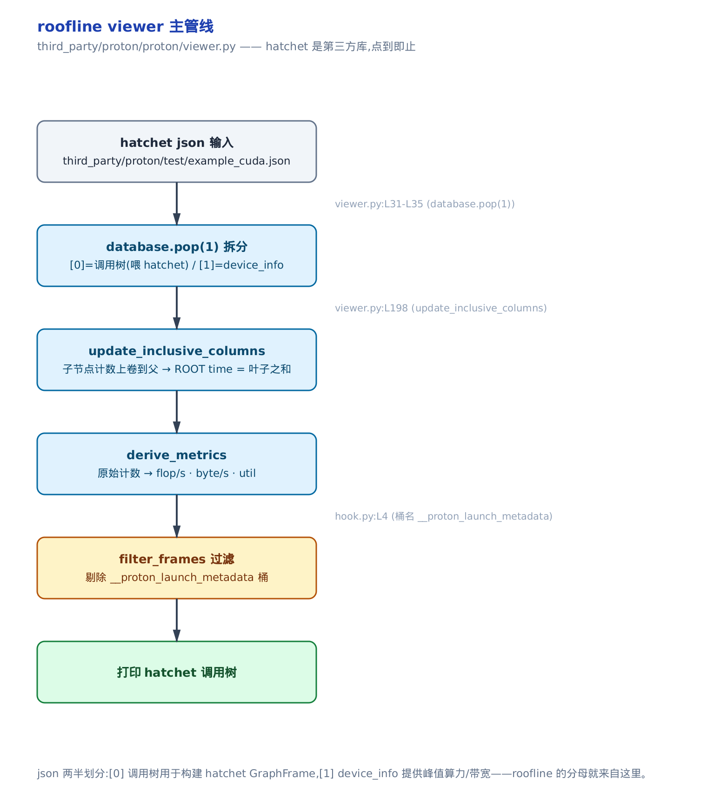
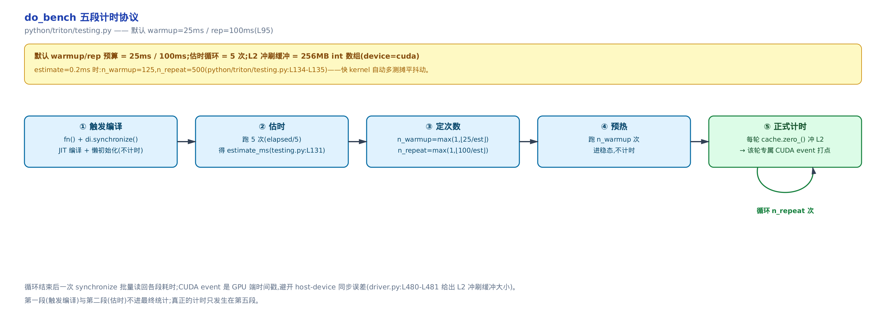

# 度量：proton 钩子、roofline viewer 与 do_bench



> 你在这里：Part IX 工具生态，度量站。
> 上一章：HIP 后端把 kernel 落到 AMD GPU。
> 这一章：怎么量一个 kernel 快不快、瓶颈在哪。

前面每一章都在教你怎么写出更快的 kernel——合并访存、避开 bank 冲突、命中 Tensor Core、调 `num_stages`。但有个前提一直没摆到台面上：**你凭什么说某个改法「更快」？** 前面所有出现「实测 X 微秒」「快了 1.8 倍」的地方，数字都得有个可信的来源；不然优化就是拍脑袋。本章把这个来源拆开，讲三件量东西的工具，它们回答两个问题——**这个 kernel 到底跑了多久**，以及**它是被算力卡住还是被访存卡住**。

- **proton**（Triton 自带的剖析器 / profiler）：不改一行核代码，就在每次 kernel 发射前后挂上这次调用的 flops（浮点运算数）与 bytes（访存字节数）。
- **roofline viewer**：把 proton 采到的原始计数派生成一个利用率数字 `util`，一眼判定 kernel 是**算力受限**（compute-bound）还是**访存受限**（memory-bound）——这直接决定你该往哪个方向优化。
- **do_bench**（`python/triton/testing.py`）：全书 benchmark 的那把秒表，估时、预热、每轮冲缓存、取分位数，教你把 kernel 时间量准。

> 只想把 kernel 时间量对，直接跳「[do_bench：全书性能数字的秒表](#do_bench全书性能数字的秒表)」；想判断瓶颈在算力还是访存，跳「[roofline viewer：一个数判瓶颈](#roofline-viewer一个数判瓶颈)」；想弄懂 proton 怎么零侵入挂上度量，按序读。

三件工具里，proton 的「零侵入」是本章的技术核心，先从它讲起。



> 上图三条泳道即三件工具。想只把时间量准，直接跳 do_bench 一节；想只判瓶颈在算力还是访存，跳 roofline viewer 一节；想弄懂零侵入挂载，按序读 proton 一节。

## proton：不改一行核代码，挂上 flops 与 bytes

### 直觉：给运转中的机器装一对红外感应门

给一台正在生产的机器加装监控，最怕停机改造。proton 的做法是装一对红外感应门：机器本身一个零件都不动，门只在每件产品**进出时各响一声**，把这次加工的「理论工作量」记在旁边的账本上。这对门就是挂在 kernel 发射路径上的一对钩子——发射前响一声、发射后响一声，核代码里不插一行。

### 机制：钩子是类级槽位，挂在发射路径上

先看这对「门」长在哪。它是 `CompiledKernel`（编译产物句柄，本身见[第 11 章](../../ch11-run-launch-pipeline/narrative/chapter.md)）上的两个**类级**属性，默认是 `None`：

```python
# python/triton/compiler/compiler.py:L343-L348
class CompiledKernel:

    # Hooks for external tools to monitor the execution of triton kernels
    # TODO: move out of this namespace since it's a runtime thing
    launch_enter_hook = None
    launch_exit_hook = None
```

两个细节值得停一下。第一，它们是**类级**（写在 `class` 体里、不在 `__init__` 里）而不是实例级——意味着赋值一次，对进程里**全体已编译的 kernel** 立即生效，不用逐个句柄去挂。第二，默认 `None`——没开 profiling 时，下面会看到发射路径首行就短路返回，连度量对象都不构造，是真正的零成本。

这对钩子怎么被调用？回到 kernel 发射路径。多数 `@triton.jit` 场景下（本书从[第 11 章](../../ch11-run-launch-pipeline/narrative/chapter.md)起所有例子用的 `add_kernel[grid](...)` 都是这种），`kernel[grid](*args)` 走的是 `JITFunction.run()`，`run()` 里直接调 `kernel.run(...)`，把这对类级钩子透传下去：

```python
# python/triton/runtime/jit.py:L653-L654
            kernel.run(grid_0, grid_1, grid_2, stream, kernel.function, kernel.packed_metadata, launch_metadata,
                       self.CompiledKernel.launch_enter_hook, self.CompiledKernel.launch_exit_hook, *non_constexpr_vals)
```

这条主发射路径[第 11 章](../../ch11-run-launch-pipeline/narrative/chapter.md)已拆讲过（含 `launch_metadata` 首行短路的同一论点），本章不重复，只强调钩子就挂在这里。另有一条更直接的入口——当你手里已经是一个编译产物 `CompiledKernel`（如 `triton.compile()` 的返回值，常见于直接吃 IR 的测试 / AOT 场景），对它 `kernel[grid](*args)` 会走 `CompiledKernel.__getitem__`，它返回一个 `runner`、同样把两个钩子连同元数据透传给 `self.run`：

```python
# python/triton/compiler/compiler.py:L415-L426
    def __getitem__(self, grid):
        self._init_handles()

        def runner(*args, stream=None):
            if stream is None:
                device = driver.active.get_current_device()
                stream = driver.active.get_current_stream(device)
            launch_metadata = self.launch_metadata(grid, stream, *args)
            self.run(grid[0], grid[1], grid[2], stream, self.function, self.packed_metadata, launch_metadata,
                     CompiledKernel.launch_enter_hook, CompiledKernel.launch_exit_hook, *args)

        return runner
```

两条路径殊途同归：都在发射前把 `launch_enter_hook`、`launch_exit_hook` 透传给 `self.run`。`self.run` 就是[第 37 章](../../ch37-ptx-cubin-launch/narrative/chapter.md)讲的、`make_launcher` 现场焊出来的 C 发射器。发射器在真正 `cuLaunchKernel` 前调一次 `enter`、后调一次 `exit`——**每次发射恰好两次回调**。钩子就挂在这条发射路径上，这正是 proton「零侵入」挂载点的通用性所在。发射器本体怎么生成是那一章的事，本章只讲钩子挂在它上面。



**不变量。** 类级赋值对全体已编译 kernel 立即生效，且每次发射恰好一次 `enter` 与一次 `exit` 严格配对。论证：`launch_enter_hook`/`launch_exit_hook` 是类属性而非实例属性，Python 类属性查找对所有实例（含赋值前就已存在的 `CompiledKernel` 对象）即时可见，故 `register_triton_hook` 一次赋值无需遍历已编译 kernel；发射路径每次调用都从 `CompiledKernel.launch_enter_hook`/`launch_exit_hook` 现读现传给 `self.run`，一次发射对应严格一次 `enter`、一次 `exit`，不跳过、不重复。这就是「类级槽位」相对「逐句柄挂钩」买到的东西：全局一次注入、全体即时生效。

### 源码：注入就是两次赋值

现在看 proton 侧怎么把自己的实现塞进那两个槽位。答案朴素得出人意料——就是两句赋值：

```python
# third_party/proton/proton/hook.py:L7-L33
class TritonHook:
    flops_width = [8, 16, 32, 64]
    metrics = [f"flops{width}" for width in flops_width] + ["bytes"] + ["flops"]

    @staticmethod
    def enter(lazy_dict: LazyDict) -> None:
        enter_scope(COMPUTE_METADATA_SCOPE_NAME)
        metadata = lazy_dict.get()
        exit_scope()
        fn_metrics = {k: metadata[k] for k in TritonHook.metrics if k in metadata}
        enter_scope(metadata["name"], triton_op=True, metrics=fn_metrics)

    @staticmethod
    def exit(lazy_dict: LazyDict) -> None:
        exit_scope(triton_op=True)


def register_triton_hook() -> None:
    if CompiledKernel.launch_enter_hook is None:
        CompiledKernel.launch_enter_hook = TritonHook.enter
        CompiledKernel.launch_exit_hook = TritonHook.exit


def unregister_triton_hook() -> None:
    if CompiledKernel.launch_enter_hook == TritonHook.enter:
        CompiledKernel.launch_enter_hook = None
        CompiledKernel.launch_exit_hook = None
```

`register_triton_hook()` 全部的「注入」就是把 `TritonHook.enter/exit` 赋给那两个类级槽位——因为是类级，这一次赋值对全体 kernel 生效，核代码零改动。`unregister` 反着来，还原成 `None`。

`TritonHook.enter` 里做了两件事。先用 `COMPUTE_METADATA_SCOPE_NAME`（值是 `"__proton_launch_metadata"`）包一个临时作用域（scope），把 `lazy_dict.get()` ——即真正跑用户代码算 flops/bytes 的开销——单独计到一个可被 viewer 过滤掉的桶里；`exit_scope` 后再调 `enter_scope(metadata["name"], triton_op=True, metrics=fn_metrics)`，把算出来的 flops/bytes 挂到**这个 kernel 的作用域**上。`metrics` 列表里的 `flops8/16/32/64` 对应不同位宽的乘加——同一 kernel 用 8 位算的浮点运算，和用 64 位算的，峰值上限不一样（这个「上限」就是下一节 roofline 的「屋顶」），得分开记。列表末尾还有一个不带位宽后缀的纯 `flops`（不分位宽的合计），它不参与下一节 roofline 的取 max 计算，是留给只想看总浮点量、不看屋顶的场景的字段，本章可以先不管它。

`enter_scope` / `exit_scope` 本身在 `scope.py` 里，`triton_op` 这个开关决定走哪条底层调用：

```python
# third_party/proton/proton/scope.py:L78-L105
def enter_scope(name: str, *, triton_op: bool = False, metrics=None, properties=None) -> int:
    if not get_profiling_on():
        return -1
    id = libproton.record_scope()
    if not hasattr(thread_local_scopes, "scopes"):
        thread_local_scopes.scopes = []
    thread_local_scopes.scopes.append((id, name))
    if triton_op:
        libproton.enter_op(id, name)
    else:
        libproton.enter_scope(id, name)
    if metrics:
        libproton.add_metrics(id, metrics)
    # … 省略：properties 分支 …
    return id


def exit_scope(triton_op: bool = False) -> int:
    if not get_profiling_on():
        return -1
    id, name = thread_local_scopes.scopes.pop()
    if triton_op:
        libproton.exit_op(id, name)
    else:
        libproton.exit_scope(id, name)
    return id
```

首行 `if not get_profiling_on(): return -1` 是零成本的**第二道闸**——profiling 关着时，`enter`/`exit` 都是空转。（第一道闸在发射路径更上游：`CompiledKernel.launch_enter_hook is None` 时 `launch_metadata` 首行直接 `return None`、连度量对象都不建，下一节「惰性的账本」细看。那道闸挡住整个 metadata 的构造，这道闸挡住 `enter_scope`/`exit_scope` 本身；两道叠起来，没开 profiling 时用户代码零调用。）`thread_local_scopes.scopes` 是每线程一个的作用域栈，`append`/`pop` 保证进出配对。`triton_op=True` 时走 `libproton.enter_op`（把这个作用域标成 triton 算子语义，viewer 里它就是承载 flops/bytes 的那个节点），否则走普通 `enter_scope`。`add_metrics` 把 flops/bytes 绑到该作用域的 `id` 上。`libproton.*` 是 C++ 侧的采集引擎，本章点到即止、不深挖。

### 惰性的账本：flops/bytes 只在开 profiling 时才算

上面看到 `enter` 里有一句 `metadata = lazy_dict.get()`。先接一根线：这里的形参 `lazy_dict`，就是发射路径里那句 `launch_metadata = ...launch_metadata(grid, stream, *args)` 算出来的那个 `LazyDict`——经 `self.run` 透传给 C 发射器，发射器回调 `enter` 钩子时原样把它当实参交进来。所以「登记」和「执行」发生在同一个对象上，只是隔了一次发射。这个 `lazy_dict` 是关键——它让「算 flops/bytes」这段用户代码，**只在 profiling 真开着时才跑一次，关着时一次都不跑**。

**直觉。** 账本不预先填数，只夹一张欠条：「要用时再算」。关掉 profiling，这张欠条一次都不兑现——用户算 flops/bytes 的代码零调用；打开 profiling，钩子进门时才兑现欠条把数算出来。

**机制。** 构造这张「欠条」的地方是 `launch_metadata`，它首行就是零成本闸门：

```python
# python/triton/compiler/compiler.py:L398-L413
    def launch_metadata(self, grid, stream, *args):
        if CompiledKernel.launch_enter_hook is None:
            return None
        ret = LazyDict({"name": self.name, "function": self.function, "stream": stream})
        if not isinstance(self.src, ASTSource) or self.src.fn.launch_metadata is None:
            return ret
        arg_dict = {}
        arg_idx = 0
        for i, arg_name in enumerate(self.src.fn.arg_names):
            if i in self.src.fn.constexprs:
                arg_dict[arg_name] = self.src.constants[arg_name]
            else:
                arg_dict[arg_name] = args[arg_idx]
                arg_idx += 1
        ret.add(self.src.fn.launch_metadata, (grid, self.metadata, arg_dict))
        return ret
```

首行 `if launch_enter_hook is None: return None`——没挂钩子时整段零成本，连 `LazyDict` 都不建。往下，它把 constexpr（编译期常量，见[第 4 章](../../ch04-tl-surface-and-constexpr/narrative/chapter.md)）与运行时实参对齐成 `{参数名: 值}` 的 `arg_dict`，喂给用户注册的那个 `launch_metadata` 函数（下称 metadata_fn，用户写的、返回本次调用 flops/bytes 的回调）。它长什么样？签名收下 `(grid, metadata, arg_dict)`、返回一个字典，键名必须与 `TritonHook.metrics` 里的名字对齐（`flops8/16/32/64`、`bytes`），值就是这次调用的理论计数——典型写法形如 `def my_meta(grid, metadata, args): return {"flops32": 2*M*N*K, "bytes": (M*K+K*N+M*N)*4}`（一次 `M×N×K` 矩阵乘约 `2MNK` 次 fp32 乘加、三块 fp32 张量各 4 字节/元素）。`enter` 钩子里那句 `{k: metadata[k] for k in TritonHook.metrics if k in metadata}` 就是靠这套键名把用户返回的数挑进 `fn_metrics` 的。**注意最后一句是 `ret.add(...)` 而不是当场调用**——只登记，不执行。

登记与执行分开，靠的就是 `LazyDict`：

```python
# python/triton/compiler/compiler.py:L314-L328
class LazyDict:

    def __init__(self, data):
        self.data = data
        self.extras = []

    def get(self) -> None:
        for func, args in self.extras:
            self.data = self.data | func(*args)
        self.extras.clear()
        return self.data

    def add(self, func, args):
        self.extras.append((func, args))
```

`add()` 只把 `(metadata_fn, args)` 压进 `extras` 列表；直到 `get()` 被调用，才逐个 `func(*args)` 执行并用 `|` 合并进 `data`。把两条读法摆成一张小账，惰性一眼看清：

| 时刻 | profiling 开关 | `launch_metadata` 首行 | metadata_fn 被调用 |
|---|---|---|---|
| 第 1 次发射（关） | `hook is None` | `return None`，不建 LazyDict | 零次 |
| 第 2 次发射（开） | 钩子已挂 | 建 LazyDict、`add()` 登记 | 一次（在 `enter` 里 `get()` 时） |

**不变量。** metadata_fn 的调用次数 = profiling 开着的发射次数，与「关着的发射」无关。论证：关时 `launch_metadata` 首行短路，`extras` 根本没被填；开时每次发射 `add` 登记一条、`enter` 里 `get()` 消费一条并 `clear()`，一进一出，不累积、不重放。所以未开 profiling 时用户那段可能挺贵的 flops 计算代码是**零调用**——这是 proton 敢默认「随时可挂」的底气。



### 会话生命线：start → activate/deactivate → finalize

钩子挂上只是开关的「开」这一侧。**直觉**：整段 profiling 是一段有开有关的录制会话——`start` 按下录制键，`finalize` 停止并导出。先看 `start` 的收尾：

```python
# third_party/proton/proton/profile.py:L70-L85
    if is_command_line():
        # Ignore the start() call if the script is run from the command line.
        return

    if name is None:
        name = DEFAULT_PROFILE_NAME

    if backend is None:
        backend = _select_backend()

    _check_env(backend)

    set_profiling_on()
    if hook and hook == "triton":
        register_triton_hook()
    return libproton.start(name, context, data, backend)
```

三步收尾：`set_profiling_on()` 翻开全局 `profiling_on` 开关（`scope.py` 里那两道零成本闸查的就是它）→ 若 `hook=='triton'` 则 `register_triton_hook()` 挂上 flops/bytes 钩子 → `libproton.start` 开会话。`is_command_line()` 时直接忽略——命令行下由 proton 的 CLI 统管会话，脚本里的 `start()` 让位。

`backend` 从哪来？`_select_backend` 按当前目标 GPU 选采集后端：

```python
# third_party/proton/proton/profile.py:L13-L20
def _select_backend() -> str:
    backend = triton.runtime.driver.active.get_current_target().backend
    if backend == "cuda":
        return "cupti"
    elif backend == "hip":
        return "roctracer"
    else:
        raise ValueError("No backend is available for the current target.")
```

这里是 proton 组织元数据与厂商 tracer 实际计时之间的分界：proton 自己**不测时间**，它把 kernel 时间的采集交给厂商 tracer——NVIDIA 走 CUPTI（NVIDIA 的剖析采集库）、AMD 走 roctracer（AMD 对应物）。厂商 tracer 直接从驱动/硬件计数器拿 kernel 时间，比 host 侧掐表精确；proton 只负责作用域与元数据的组织。CUPTI/roctracer 都是第三方库，点到即止。

会话的另一头是 `finalize`：

```python
# third_party/proton/proton/profile.py:L120-L136
def finalize(session=None, output_format: str = "hatchet") -> None:
    if session is None:
        set_profiling_off()
        libproton.finalize_all(output_format)
        unregister_triton_hook()
    else:
        # … 省略：单 session 收口分支 …
        libproton.finalize(session, output_format)
```

`finalize(None)` 收口三步：`set_profiling_off()` 关全局开关 → `finalize_all` 把全部会话写盘（默认 `hatchet` 格式，即下一节 viewer 要吃的 json）→ `unregister_triton_hook()` 摘掉钩子、还原现场。`start → activate/deactivate → finalize` 就是一条会话生命线，中间的 `activate/deactivate` 只翻某个 session 的记录开关（可暂停/续录某一段），不动全局。本章只讲最常见的单会话场景（`finalize(None)` 收口全部）；`finalize` 的 `session` 形参是一个具体会话的句柄，一次 profiling 也可以开多个具名 session 分别 `finalize`，那条 `else` 分支就是为它准备的，细节从略。



落盘的这份 hatchet json，正是 viewer 的输入。

## roofline viewer：一个数判瓶颈

proton 采到的是一堆原始计数——每个 kernel 的 flops、bytes、实测时间。这些数字本身不告诉你该干嘛。viewer 的活是把它们**派生成一个利用率 `util`**，让你一眼看出瓶颈在算力还是访存。

### 直觉：给车间算产能上限

屋顶模型（roofline）像给车间算产能上限：**算力屋顶** = 机器最快能加工多少件，**带宽屋顶** = 传送带最快能送多少料。谁先撞到顶谁就是瓶颈——去补另一头是白费力。`util` 就是你现在离那面屋顶多近（1.0 = 贴顶）。

### 机制：两面屋顶取 max

给一个 kernel 的浮点运算数 `` $`F`$ `` 与访存字节数 `` $`B`$ ``，两面屋顶各给一个「理论最快时间」：

```math
t_{\mathrm{compute}} = \frac{F}{\mathrm{peak\_flops}}, \qquad t_{\mathrm{mem}} = \frac{B}{\mathrm{peak\_bw}}
```

`` $`t_{\mathrm{compute}}`$ `` 是「算力打满该跑多久」，`` $`t_{\mathrm{mem}}`$ `` 是「带宽打满该跑多久」。峰值带宽由显存参数硬算：

```math
\mathrm{peak\_bw} = \frac{2 \times \mathrm{bus\_width} \times \mathrm{mem\_clock}}{8}
```

因子 `2` 是 DDR 的双数据沿（一个时钟周期传两拍），`bus_width` 是显存位宽（bit），`mem_clock` 是显存时钟（Hz），除 `8` 把 bit 换算成 byte。util 就是两面屋顶取 max、再除以实测时间：

```math
\mathrm{util} = \frac{\max(t_{\mathrm{compute}},\ t_{\mathrm{mem}})}{t_{\mathrm{measured}}}
```

取 `max` 的物理含义：即便算力与带宽**都**打满，kernel 也至少要 `max(两者)` 那么久——**瓶颈资源决定下界**。哪个 `` $`t`$ `` 大，哪面屋顶就是你现在贴着的。

先看算力屋顶怎么算。下面两个派生函数都吃同一个 `device_info`——它是 viewer 从 hatchet json 里 `pop` 出来的第二个元素（本节末尾主管线里的 `database.pop(1)`），装着每块 GPU 的硬件规格：`arch`（架构代号，即 GPU 计算能力编号，如 `80`=A100、`90`=H100）、`num_sms`、`clock_rate`、`bus_width` 等。下面两个派生函数除了 `device_info`，还都吃第一个形参 `df`——它是按 kernel 调用展开的那张原始计数表（即后面 `derive_metrics` 里传进来的 `gf.dataframe`，每行一次调用，列含 `device_id`、`flops8/16/32/64`、`bytes`）。`get_min_time_flops` 就按 `df` 每行的 `device_id` 找到对应 GPU、按 `arch` 查出峰值算力，对每个位宽累加理论时间：

```python
# third_party/proton/proton/viewer.py:L38-L68
def get_min_time_flops(df, device_info):
    min_time_flops = pd.DataFrame(0.0, index=df.index, columns=["min_time"])
    for device_type in device_info:
        for device_index in device_info[device_type]:
            arch = device_info[device_type][device_index]["arch"]
            num_sms = device_info[device_type][device_index]["num_sms"]
            clock_rate = device_info[device_type][device_index]["clock_rate"]
            for width in TritonHook.flops_width:
                idx = df["device_id"] == device_index
                device_frames = df[idx]
                if f"flops{width}" not in device_frames.columns:
                    continue
                max_flops = 0
                if device_type == "CUDA":
                    if arch == "80":
                        max_flops = 624e12 / (width / 8)
                    # … 省略：arch 89 分支 …
                    elif arch == "90":
                        # 114 sms and 1755mhz is the base number of sms and clock rate of H100 pcie
                        max_flops = ((num_sms / 114 * clock_rate / (1755 * 1e3) * 1513) * 1e12) / (width / 8)
                # … 省略：HIP gfx90a/gfx942 分支 …
                min_time_flops.loc[idx, "min_time"] += device_frames[f"flops{width}"].fillna(0) / max_flops
    return min_time_flops
```

峰值算力是按 arch 硬编码的基准。H100（arch `90`）相对 H100 PCIe 基线（114 个 SM、1755 MHz）线性缩放：

```math
\mathrm{peak\_flops} = \left(\frac{\mathrm{num\_sms}}{114} \times \frac{\mathrm{clock}}{1755\,\mathrm{MHz}} \times 1513\right)\,\mathrm{TFLOP/s}
```

最后源码里还有一步 `/(width/8)`——**位宽越窄峰值越高**：`flops8` 的峰值是 `flops64` 的 8 倍，所以同一 kernel 用 fp8 算的屋顶比 fp32 高。每个位宽把「该位宽 flops 数 / 峰值」累加进 `min_time`，得到算力屋顶的理论时间。

带宽屋顶对称，就是上面那条峰值带宽公式：

```python
# third_party/proton/proton/viewer.py:L71-L81
def get_min_time_bytes(df, device_info):
    min_time_bytes = pd.DataFrame(0.0, index=df.index, columns=["min_time"])
    for device_type in device_info:
        for device_index in device_info[device_type]:
            idx = df["device_id"] == device_index
            device_frames = df[idx]
            memory_clock_rate = device_info[device_type][device_index]["memory_clock_rate"]  # in khz
            bus_width = device_info[device_type][device_index]["bus_width"]  # in bits
            peak_bandwidth = 2 * bus_width * memory_clock_rate * 1e3 / 8
            min_time_bytes.loc[idx, "min_time"] += device_frames["bytes"] / peak_bandwidth
    return min_time_bytes
```

两面屋顶取 max、除实测时间的那一步，落在 `derive_metrics` 里：

```python
# third_party/proton/proton/viewer.py:L114-L129
    for metric in metrics:
        if metric == "util":  # Tensor core only
            min_time_bytes = get_min_time_bytes(gf.dataframe, device_info)
            min_time_flops = get_min_time_flops(gf.dataframe, device_info)
            time_sec = get_time_seconds(gf.dataframe)
            gf.dataframe["util (inc)"] = min_time_flops["min_time"].combine(min_time_bytes["min_time"], max) / time_sec
            gf.dataframe.loc[internal_frame_indices, "util (inc)"] = np.nan
            derived_metrics.append("util (inc)")
        elif metric in derivable_metrics:  # flop<width>/s, <t/g>byte/s
            derivable_metric = derivable_metrics[metric]
            # … 省略：flop/s、byte/s 派生分支 …
            gf.dataframe[f"{metric} (inc)"] = (gf.dataframe[matched_metric_name] / (get_time_seconds(gf.dataframe)) /
                                               metric_factor_dict[metric])
            derived_metrics.append(f"{metric} (inc)")
```

`min_time_flops.combine(min_time_bytes, max) / time_sec` 就是那条判据。分子 `max` 取瓶颈资源，分母是实测时间。代码里 `if metric == "util":` 旁那句 `# Tensor core only` 注释是历史遗留提示，不必深究——`util` 的分子（`flops`）是按位宽逐项累加的，无论 kernel 是否真走 Tensor Core 都能算出来。同一个 `derive_metrics` 顺带派生 `flop/s`、`byte/s`（实测计数 / 实测时间 / 单位因子），供你看绝对吞吐。

**取证。** 拿仓库自带的 `third_party/proton/test/example_cuda.json` 喂 pin 版真 viewer（host 无 GPU 也能跑通，因为这一步纯读 json 派生）。里头两个 kernel `foo0`、`foo1`，各自的实测时间、两面屋顶理论时间、util 如下：

<!-- trace: m6 -->

| kernel | 实测时间（µs） | compute 屋顶（µs） | memory 屋顶（µs） | max→瓶颈 | util = max/实测 |
|---|---|---|---|---|---|
| foo0 | 204.8 | 50.6 | 24.9 | compute（50.6 > 24.9） | 0.247 |
| foo1 | 204.8 | 30.3 | 9.9 | compute（30.3 > 9.9） | 0.148 |

先提一句：两个 kernel 落在不同 device、计数也差一个数量级。`foo0` 在 `device_id=1`（arch `90`），计数 `flops8=1e11`、`bytes=1e8`，下面就用正文推导的 H100 缩放公式手算；`foo1` 在 `device_id=0`（arch `89`），计数 `flops8=1e10`、`bytes=1e7`（比 `foo0` 小一个数量级），走的是上面代码块里被 `# … 省略：arch 89 分支 …` 省掉的那条硬编码峰值 `330.3e12/(width/8)`——它与 arch 90 一样是源码里按 arch 硬编码的常数，本章不逐档展开，视为已知即可；公式形状不同，读法一致，仍是「flops / 该架构峰值算力」。所以下面只手算 `foo0`；`foo1` 留给你仿照同一套算法自行代入 arch 89 峰值核对表中的 30.3 / 9.9 两个数（`1e10/330.3e12≈30.3µs`、`1e7/(2×384×10501000×10^3/8)≈9.9µs`）。若拿 arch 90 公式去复算 `foo1` 则会对不上。

以 `foo0` 手算核一遍。已知量全部取自 `example_cuda.json` 的 `device_info`（那台 arch `90` 的 GPU）：`num_sms=132`、`clock=1980MHz`、`bus_width=6144` bit、`mem_clock=2619MHz`（即 json 里 `memory_clock_rate=2619000` kHz）；`foo0` 的计数是 `flops8=1e11`、`bytes=1e8`。算力屋顶——把上面峰值算力公式代入，`` $`\mathrm{width}=8`$ `` 时：

```math
t_{\mathrm{compute}} = \frac{10^{11}}{\left(\dfrac{132}{114}\cdot\dfrac{1980}{1755}\cdot 1513\right)\times 10^{12}} \approx \frac{10^{11}}{1.977\times 10^{15}} \approx 50.6\,\mu\mathrm{s}
```

带宽屋顶——峰值带宽 `` $`\approx 4.02\times 10^{12}`$ `` byte/s：

```math
t_{\mathrm{mem}} = \frac{10^{8}}{2\times 6144\times 2619\times 10^{6}/8} \approx \frac{10^{8}}{4.02\times 10^{12}} \approx 24.9\,\mu\mathrm{s}
```

max 落在算力侧，`util = 50.6/204.8 = 0.247`——与 viewer 打印的树逐位吻合。

**不变量。** `` $`\mathrm{util} \in (0, 1]`$ ``：实测时间不可能快过资源打满的理论下界。论证：分子 `max(两屋顶)` 是「即便算力与带宽都打满也至少要这么久」的理论下界，必然不超过实测时间，故比值不超过 1；flops、bytes 均为正且实测时间有限，故比值为正。util 越接近 1 越贴屋顶，越小说明瓶颈资源越没喂满。



这两个数直接指方向：`foo0`、`foo1` 都是 compute-bound（算力屋顶时间 > 带宽屋顶时间），且 util 都不到 `0.25`——离算力屋顶还远。优化该往「喂满 Tensor Core」（见[第 27 章](../../ch27-tensor-core-mma-layout/narrative/chapter.md)，如提高算术强度、换更宽的 tile）走，**而不是**省访存——因为 max 取的是算力侧，减少访存对它们几乎没用。这就是 roofline 的价值：一个数省掉你在错误方向上的力气。

### viewer 主管线：从 json 到调用树

上面三个派生函数是主管线里的一站。**直觉**：把一叠原始计数整理成一张利润表——先把 json 拆成调用树与硬件规格，再逐行派生出 util、flop/s、byte/s。整条管线从 hatchet json 走到打印一棵树：

```python
# third_party/proton/proton/viewer.py:L192-L201
def parse(metrics, filename, include=None, exclude=None, threshold=None, depth=100, format=None):
    with open(filename, "r") as f:
        gf, raw_metrics, device_info = get_raw_metrics(f)
        gf = format_frames(gf, format)
        assert len(raw_metrics) > 0, "No metrics found in the input file"
        gf.update_inclusive_columns()
        metrics = derive_metrics(gf, metrics, raw_metrics, device_info)
        # TODO: generalize to support multiple metrics, not just the first one
        gf = filter_frames(gf, include, exclude, threshold, metrics[0])
        print(gf.tree(metric_column=metrics, expand_name=True, depth=depth, render_header=False))
        emit_warnings(gf, metrics)
```

第一步 `get_raw_metrics` 内部只有几行，前面几处提到的 `database` 这个名字就出在这里：

```python
# third_party/proton/proton/viewer.py:L31-L35
def get_raw_metrics(file):
    database = json.load(file)
    device_info = database.pop(1)
    gf = ht.GraphFrame.from_literal(database)
    return gf, gf.show_metric_columns(), device_info
```

json 顶层是个两元素列表：`database.pop(1)` 弹出第 1 元当 `device_info`（峰值算力/带宽的来源，也就是上面 `arch`、`bus_width` 的出处），剩下的第 0 元 `database` 喂给 hatchet 这个第三方调用树库，`from_literal` 构建出 `GraphFrame`（调用树）。

回到 `parse` 的五步：`get_raw_metrics` 把 json 拆成调用树与 `device_info` 两半（即上面那两行）；`update_inclusive_columns` 把子节点计数上卷到父（所以 ROOT 的 time 是叶子之和）；`derive_metrics` 派生 util、flop/s、byte/s；`filter_frames` 顺带剔除那个算 flops/bytes 本身开销的 `__proton_launch_metadata` 桶（还记得 `enter` 里包的临时作用域吗），不让它污染 kernel 统计；最后打印 hatchet 树。hatchet 是第三方库，点到即止。



roofline 告诉你**方向**，但它的分母——实测时间——从哪来、量得准不准，是另一件独立的事。这就是 do_bench。

## do_bench：全书性能数字的秒表

proton 那条线依赖真机采集。还有一把更轻、纯 Python 的秒表：`do_bench`。它不挂钩子、不派生屋顶，只干一件事——**把一个函数的 GPU 执行时间量准**。全书所有「实测 X 微秒」的数字，口径都在这里。

### 直觉：给 kernel 掐秒表，还要掐得公平

给 kernel 掐秒表有三个坑：第一次冷启动特别慢、偶发卡顿骗你、上一轮的数据赖在缓存里让下一轮假性变快。`do_bench` 的对策是：先空跑几次让 GPU 时钟/缓存热身进稳态（不计时），再连测很多次、每次开测前把「桌面」（L2 缓存）擦干净，最后取中间成绩。测多少次不写死：快的多测、慢的少测，凑够大致相同的墙钟预算。

### 机制：五段计时协议

整个 `do_bench` 是五段骨架：

```python
# python/triton/testing.py:L95-L158
def do_bench(fn, warmup=25, rep=100, grad_to_none=None, quantiles=None, return_mode="mean"):
    assert return_mode in ["min", "max", "mean", "median", "all"]
    import torch

    di = runtime.driver.active.get_device_interface()

    fn()
    di.synchronize()

    cache = runtime.driver.active.get_empty_cache_for_benchmark()

    # Estimate the runtime of the function
    start_event = di.Event(enable_timing=True)
    end_event = di.Event(enable_timing=True)
    start_event.record()
    for _ in range(5):
        cache.zero_()
        fn()
    end_event.record()
    di.synchronize()
    estimate_ms = start_event.elapsed_time(end_event) / 5

    # compute number of warmup and repeat
    n_warmup = max(1, int(warmup / estimate_ms))
    n_repeat = max(1, int(rep / estimate_ms))
    start_event = [di.Event(enable_timing=True) for i in range(n_repeat)]
    end_event = [di.Event(enable_timing=True) for i in range(n_repeat)]
    # Warm-up
    for _ in range(n_warmup):
        fn()
    # Benchmark
    for i in range(n_repeat):
        # … 省略：grad_to_none 清梯度分支（含反向时用）…
        # we clear the L2 cache before each run
        cache.zero_()
        # record time of `fn`
        start_event[i].record()
        fn()
        end_event[i].record()
    # Record clocks
    di.synchronize()
    times = torch.tensor([s.elapsed_time(e) for s, e in zip(start_event, end_event)], dtype=torch.float)
    return _summarize_statistics(times, quantiles, return_mode)
```

拆五段读：

1. **触发编译**：先 `fn()` + `synchronize` 跑一遍，把 JIT 编译与懒初始化的一次性开销挤掉，**不计时**。
2. **估时**：跑 5 次（每次 `cache.zero_()` 冲 L2），用一对 CUDA event（GPU 端的时间戳事件）量总时长再 `/5`，得 `estimate_ms`。
3. **定次数**：把毫秒预算换算成次数——`n_warmup=max(1, int(warmup/estimate_ms))`、`n_repeat=max(1, int(rep/estimate_ms))`，并给每次 repeat 各配一对专属 event。
4. **预热**：空跑 `n_warmup` 次进稳态，不计时。
5. **正式测**：每轮先 `cache.zero_()` 冲冷 L2，再用该轮专属的 event 对打点；循环里**不** sync，循环后一次 `synchronize` 批量读回所有间隔。

为什么 warmup/rep 以毫秒预算给、内部再换算成次数？因为 kernel 快慢差几个数量级，固定次数要么测不准要么太慢。用默认 `warmup=25ms`、`rep=100ms` 换算，快慢 kernel 自动落到大致相同的墙钟预算：

<!-- trace: m9 -->

| 估时 estimate_ms | n_warmup = max(1, ⌊25/est⌋) | n_repeat = max(1, ⌊100/est⌋) | 解读 |
|---|---|---|---|
| 0.2 | 125 | 500 | 快 kernel：自动多测摊平抖动 |
| 2.0 | 12 | 50 | 中等 kernel |
| 50.0 | 1 | 2 | 慢 kernel：下取整触发 max(1,·) 兜底，少测控总时长 |

**不变量。** `n_warmup ≥ 1` 且 `n_repeat ≥ 1`，基准循环有限步必停。论证：两者都是 `max(1, int(budget/estimate_ms))`；即便 `estimate_ms > budget`（慢 kernel）使 `int(·)` 下取整为 0，外层 `max(1, 0)=1` 兜底至少测一次；`n_repeat` 是有限整数，`for i in range(n_repeat)` 有限步必然终止——不会因 kernel 太慢而空转或死循环。

这里为什么用 CUDA event 而不是 `time.time()`？kernel 是异步下发的：host 端 `time.time()` 量的是「下发到看到」含 host-device 同步的墙钟；CUDA event 在 GPU 流上打时间戳，`elapsed_time` 是纯 GPU 执行时间，精度到微秒且不含 host 抖动。循环内只 `record`（入队不阻塞）、循环后一次 `synchronize` 再批量 `elapsed_time`，避免逐次 sync 的 host-device 往返污染节奏。



### 为什么每轮都要冲 L2

第 5 段里那句 `cache.zero_()` 是计时公平性的命门。少了它，第 2 次起 kernel 会命中 L2 里上一轮留下的输入/输出，**假性变快**。这个 `cache` 来自后端：

```python
# third_party/nvidia/backend/driver.py:L474-L481
    def get_empty_cache_for_benchmark(self):
        import torch

        # We maintain a buffer of 256 MB that we clear
        # before each kernel call to make sure that the L2 cache
        # doesn't contain any input data before the run
        cache_size = 256 * 1024 * 1024
        return torch.empty(int(cache_size // 4), dtype=torch.int, device='cuda')
```

**直觉**：擦黑板。**机制**：256 MB 是刻意选的——它远大于任何现役 GPU 的 L2：A100 的 L2 是 40 MB、H100 是 50 MB（均为 NVIDIA 架构白皮书公开规格），256 MB 相对它们留了 5 倍以上余量。（L2 是内存延迟金字塔里紧挨片上的那层，见[第 2 章](../../ch02-gpu-execution-model/narrative/chapter.md)。）每轮 `cache.zero_()` 把这块缓冲整个写一遍，就把上一轮 kernel 留在 L2 的数据全挤出去。这样每次计时都是**冷 L2** 的公平起点，测出的是 kernel 真从显存取数的时间，而非侥幸命中缓存的时间。AMD 后端有同名方法、同理。

**不变量。** 只要冲刷缓冲大小 > 目标 GPU 的 L2 容量，`zero_()` 写完后 L2 中不再残留上一轮 kernel 的数据。论证：`zero_()` 把整块缓冲逐字节写一遍，写入总量超过 L2 总容量，被写数据的覆盖面积就必然填满整个 L2——写满即驱逐，无论硬件用哪种替换策略，新写入的零都会把旧内容悉数逐出（无需知道具体替换算法，只要覆盖面积 ≥ 总容量即可）。256 MB 相对 40–50 MB 的 L2 是 5 倍以上余量，这个前提在任何现役 GPU 上都成立——这正是 256 MB 不是随手一个数、而是刻意选择的原因。这条不起眼的一行，是全书性能数字可比的地基。

### 取中位数而非均值：抗抖动收尾

最后一段 `_summarize_statistics` 决定你拿到哪个数：

```python
# python/triton/testing.py:L20-L29
def _summarize_statistics(times, quantiles, return_mode):
    import torch
    if quantiles is not None:
        ret = torch.quantile(times, torch.tensor(quantiles, dtype=torch.float)).tolist()
        if len(ret) == 1:
            ret = ret[0]
        return ret
    if return_mode == "all":
        return times.tolist()
    return getattr(torch, return_mode)(times).item()
```

**直觉**：一场比赛跑很多轮，偶尔一轮被别的进程抢资源特别慢。取平均会被这一下拖偏，取中位数（成绩排队站正中间那位）则纹丝不动。

**机制。** 拿 5 个样本 `[1.02, 0.98, 5.00, 1.01, 0.99]`（4 个稳态轮约 1.0 ms + 1 个 5.00 ms 的调度尖峰）逐字喂 pin 版 `_summarize_statistics`，四种口径的输出：

<!-- trace: m11 -->

| 口径 | 调用 | 输出（ms） | 抗尖峰？ |
|---|---|---|---|
| mean | torch.mean | 1.8 | 否——被 5.0 尖峰拖偏 |
| median | torch.median | 1.01 | 是——排序中点，单尖峰不动 |
| min / max | torch.min / torch.max | 0.98 / 5.0 | min 是稳态下界；max 恰是尖峰本身 |
| quantiles [0.5,0.2,0.8] | torch.quantile（do_bench 默认口径） | 1.01 / 0.988 / 1.816 | 是——中位数 + 两侧分位 |

均值被单点尖峰拖高到 `1.8`，而中位数纹丝不动停在 `1.01`。`do_bench` 默认给的 `quantiles=[0.5, 0.2, 0.8]`——中位数外加低/高两侧分位，既报典型值又报波动带；高侧分位 `1.816` 显示尖峰只泄漏进上尾、不污染典型值。

**不变量。** median 对单点离群不敏感（击穿点 50%）：单个尖峰不移动中位数。论证：`torch.quantile(0.5)` 取排序后的中点值；改动任一非中点样本（如把某轮从约 1.0 ms 变成 5.0 ms）不改变中点位置，须**过半**样本同时变坏中位才会移动。故本例 1 个尖峰下 median 恒定，而 mean 随尖峰线性被污染。这就是全书性能数字取中位/分位而非均值的根据。

## 小结：量准了才谈得上优化

三件工具连成一条度量链，回答本章开头那两个问题：

- **量多久**：`do_bench`（`python/triton/testing.py`）估时、预热、每轮冲冷 L2、CUDA event 打点、取中位/分位——给你一个可信、可比的时间。它也是 autotune 挑 config 时的计时来源（见[第 12 章](../../ch12-driver-backend-autotune-cache/narrative/chapter.md)），前面各章那些「实测」数字，口径都在这。
- **量瓶颈在哪**：proton 零侵入挂上 flops/bytes，`third_party/proton/proton/viewer.py` 用 `util = max(算力屋顶、带宽屋顶) / 实测时间` 判定 compute-bound 还是 memory-bound。util 贴近 1 说明已贴屋顶、没多少油水；远小于 1 且瓶颈在算力，就去喂满 Tensor Core，别在访存上白使劲。

一句话收束：**量不准，优化就是拍脑袋。** proton 的类级钩子 + LazyDict 惰性让度量零成本可挂，roofline 把一堆计数收敛成一个指方向的数，do_bench 的冲 L2 与分位让时间数字公平可比——这三样凑齐，前面所有章教你的优化手段才有了验收的尺子。下一章转向另一类工具：出错时怎么把 kernel 调通。
