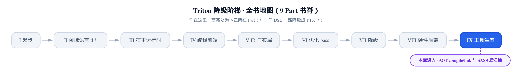
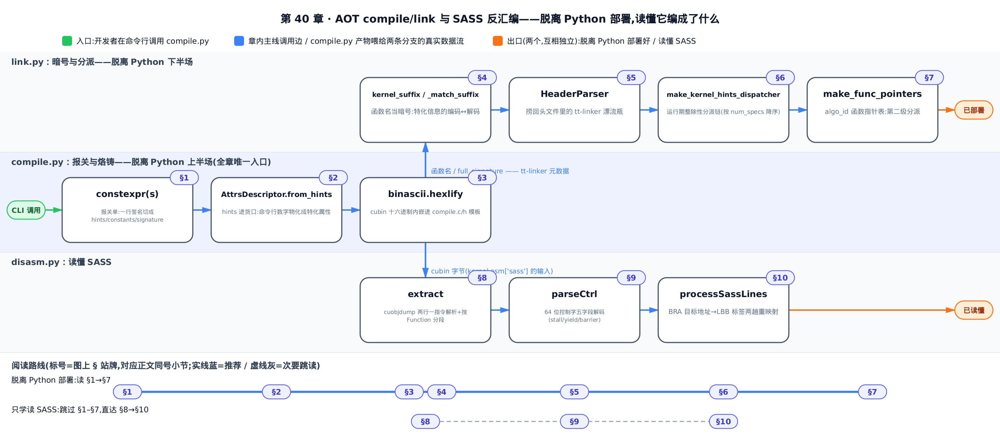
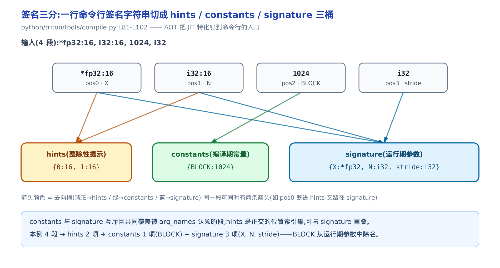
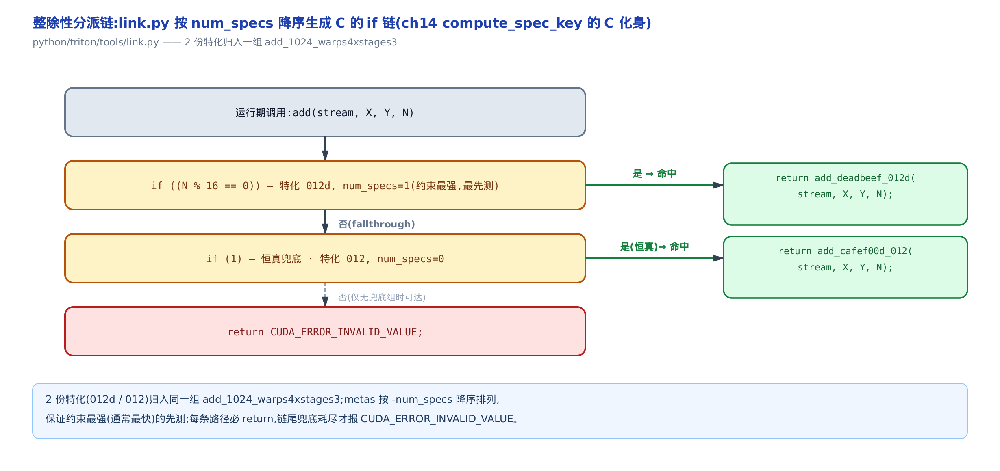
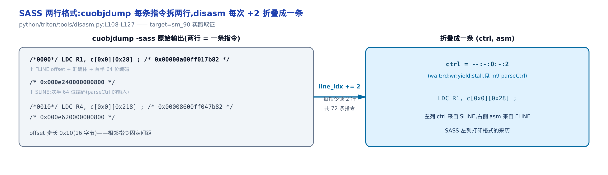
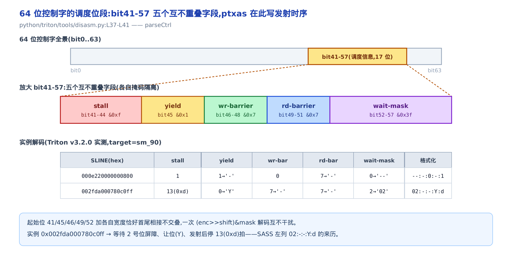

# 把核脱离 Python：AOT compile/link 与读懂 SASS

> **你在这里**：全书是一门 DSL 一路降到 PTX 的旅程，这是「工具生态」部分的一章。
> 前面几章把一个核从 Python 一路编到 cubin，都还在 Python 运行时里。
> 本章把它彻底拽出来：烙成自包含 C 部署，再反汇编看它到底编成了什么机器码。



你的 `@triton.jit`（just-in-time，即时编译）核跑得很快，但它有个尾巴甩不掉：**每次上卡都得拖着 Python 解释器**。生产环境里那条尾巴是负担——你想要的是一个 `.so`，`dlopen` 就能用，没有 Python、没有 triton、连旁边挂个 `.cubin`（CUDA 二进制核对象）文件都嫌多。这就是 AOT（ahead-of-time，提前编译）要解决的事：把一个特化好的核**烙成一份自包含的 C 源码**，编进你的二进制。

这一章解锁两个部署命门。**其一是「脱离 Python」**：`compile.py` 怎么把 cubin 逐字节抄进 C 数组、`link.py` 怎么把好几份特化版链接成一个运行期分派器——这决定你能不能把 Triton 核当普通 C 库交付。**其二是「读懂产物」**：`disasm.py` 怎么调 `cuobjdump`（NVIDIA 官方反汇编工具）出 SASS（Streaming ASSembler，GPU 的最终机器汇编）、怎么解出每条指令后附的调度控制字——这决定你 profile 一个慢核时，能不能看懂 ptxas 到底把它排成了什么样、卡在哪。本章反复回到三处真实源码：`python/triton/tools/` 下的 `compile.py`、`link.py`、`disasm.py`，各只有一两百行，但每一段都在做一件很实在的事。

只想把核脱离 Python 部署，读 §1–§7（compile 与 link）；只想学会读 SASS、看懂 profiler 里那串控制码，直接跳 §8；想顺着「编出来 → 链起来 → 读懂它」全程走，就从 §1 开始。

本章不重讲两件已经讲过的事：特化（specialization）机制本身——`AttrsDescriptor`、`equal_to_1`、`divisibility_16` 这套怎么从参数值推断，见 [JITFunction 与缓存键那章](../../ch10-jitfunction-and-cache-keys/narrative/chapter.md)；以及 ptxas 怎么把 PTX 汇编成 cubin，见 [从 PTX 到 cubin 那章](../../ch37-ptx-cubin-launch/narrative/chapter.md)。本章站在它们的下游：AOT 是把前者的特化**钉到命令行**，读 SASS 是往后者的 cubin **再下一层**看结果。



只想把核脱离 Python 部署，顺着读 §1→§7；只想学会读 SASS、看懂 profiler 里那串控制码，跳过 §1–§7 直达 §8→§10；两条命门都想拿全，就从 §1 一路读到 §10。

---

## §1 报关单：一行签名被切成三张表

**直觉**。JIT 期，triton 拿着**真实参数值**去推断特化——`N=1024` 恰好能被 16 整除，就开向量化。AOT 期没有实参，怎么办？改由**人在命令行里报数**。你给 `compile.py` 一条签名字符串，像这样：

```
*fp32:16, i32:16, 1024, i32
```

这就是一张给编译器的**报关单**，而 `constexpr`（编译期常量）判据是海关。每一段过关时问两个问题：**带冒号吗？冒号后能读成数吗？** 答案把它分进三张互不相同的表——带冒号且冒号后是数的（`:16`）是「整除性提示」，进 hints；裸的、整段能读成数的（`1024`）是「编译期常量」，进 constants，并且**从运行期清单里除名**；剩下读不成数的（`i32`）才是运行期真要传的参数，进 signature。



**机制**。用上面那条签名走一遍。这个核的形参名是 `[X, N, BLOCK, stride]`，逐段判定：

<!-- trace: m1-signature-tripartition -->

| 签名段（位置，参数名） | 有冒号？ | 冒号后/整段可转数？ | → hints | → constants | → signature（运行期） |
|---|---|---|---|---|---|
| `*fp32:16` (pos0, X) | 是 | 16 → int ✓ | hints[0]=16 | — | X:*fp32 |
| `i32:16` (pos1, N) | 是 | 16 → int ✓ | hints[1]=16 | — | N:i32 |
| `1024` (pos2, BLOCK) | 否 | 1024 → int ✓ | — | BLOCK=1024 | —（入常量，从签名除名） |
| `i32` (pos3, stride) | 否 | i32 → 非数 | — | — | stride:i32 |

结果：`hints={0:16, 1:16}`、`constants={BLOCK:1024}`、`signature={X:*fp32, N:i32, stride:i32}`。4 段一次线性扫描切完。

**不变量**：constants 与 signature **互斥且共同覆盖**每一个被形参名认领的段；而 hints 是**正交**的位置索引集，可以和 signature 重叠。看得出这点很关键：`X` 的 `:16` 只进 hints，`X` 本身仍留在 signature——整除性提示不改变「要不要传这个参数」，只改变「编译器怎么优化它」。而裸的 `1024` 一旦进 constants 就从 signature 除名，因为它编译期已知、不必再传。本例 4 段恰好 = constants 1 项（BLOCK）+ signature 3 项（X, N, stride），每段判定一次，不重不漏。

**源码**。三分就是紧挨着的三个字典推导，逐段对应上面的判据：

```python
# python/triton/tools/compile.py:L81-L102
    def constexpr(s):
        try:
            ret = int(s)
            return ret
        except ValueError:
            pass
        try:
            ret = float(s)
            return ret
        except ValueError:
            pass
        return None

    hints = {i: constexpr(s.split(":")[1]) for i, s in enumerate(signature) if ":" in s}
    hints = {k: v for k, v in hints.items() if v is not None}
    constants = {kernel.arg_names[i]: constexpr(s) for i, s in enumerate(signature)}
    constants = {k: v for k, v in constants.items() if v is not None}
    signature = {
        kernel.arg_names[i]: s.split(":")[0]
        for i, s in enumerate(signature)
        if kernel.arg_names[i] not in constants
    }
```

`constexpr(s)` 就是那道海关：`int(s)` 或 `float(s)` 能过就返回数、否则返回 `None`。三个推导各读一次这道判据——hints 只看**带冒号**的段、取冒号后半 `s.split(":")[1]`；constants 看**整段**能否转数；signature 收**其余**、且 `if kernel.arg_names[i] not in constants` 这一句正是「互斥」不变量的代码兑现：一个名字进了 constants，就绝不再进 signature。`s.split(":")[0]` 把 `*fp32:16` 的 `:16` 后缀削掉，只留类型 `*fp32`。

这一段就是 AOT 的灵魂：**它把 JIT 期「从值推断特化」的那套机制，改成了「从命令行报数」**。同一套 hints，JIT 期是算出来的，AOT 期是你写出来的。

---

## §2 hints 的进货口：from_hints 把命令行数字变成特化

**直觉**。`AttrsDescriptor`（记录一个核每个参数有哪些编译期特化属性的对象，特化机制本身前面已建立）有两条进货渠道：JIT 期从真实参数值推断，AOT 期从命令行报的数构造。后者就是 `from_hints`——它拿着一张「什么值算什么属性」的对照表，把你报的每个位号对号入座。表很短，只有两项：**16 = 可被 16 整除**（`tt.divisibility`），**1 = 恒等于 1**（`tt.equal_to`）。所以命令行只有 `:16` 和 `:1` 两种提示合法，别的值没有特化意义。

**机制**。看两个 case 怎么归类：

<!-- trace: m2-hints-to-attrs -->

| 输入 hints | property 匹配 | tt.divisibility 组 | tt.equal_to 组 | get_constants() |
|---|---|---|---|---|
| `{0:16, 1:16}` | 16 == tt.divisibility(=16) | [0, 1] | [] | {}（空） |
| `{0:16, 2:1}` | 1 == tt.equal_to(=1) | [0] | [2] | {2: 1} |

第一个 case 两位全报 16，全进 divisibility 组，`get_constants()` 为空。第二个 case 里位 2 报了 `1`，它进 equal_to 组，而且 `get_constants()` 把它**并成一个常量 `{2: 1}`**——注意这一步的后果：位 2 从此被当编译期常量，它将从运行期原型里消失（§3 会亲眼看到）。

**不变量**：每个 hint 值先被 `assert` 卡在 `{1, 16}` 里，而 16 与 1 互异、各自恰好匹配一个 property，所以**每个 hint 位被分进恰好一列，绝不双重归类**。

**源码**。先是 `compile.py` 里的校验 + 物化，跨进 compiler 子系统拿 cubin：

```python
# python/triton/tools/compile.py:L107-L115
    # compile ast into cubin
    for h in hints.values():
        assert h in [1, 16], f"Only 1 and 16 are valid hints, got {h}"
    attrs = triton.backends.compiler.AttrsDescriptor.from_hints(hints)
    for p, v in attrs.get_constants().items():
        constants.update({kernel.arg_names[p]: v})
    src = triton.compiler.ASTSource(fn=kernel, constants=constants, signature=signature, attrs=attrs)
    opts = {"num_warps": args.num_warps, "num_stages": args.num_stages}
    ccinfo = triton.compile(src, options=opts)
```

`assert h in [1, 16]` 是那张对照表的定义域守门；`from_hints(hints)` 把 hints 物化成 `attrs`；紧接着的循环把 `get_constants()`（即 `:1` 的参数）**并回 constants 表**——这就是「`:1` 从运行期消失」的起点。最后 `ASTSource` + `triton.compile` 走的正是前面讲过的 ttir→ttgir→ptx→ptxas→cubin 全流水，本章只取它的产物 `ccinfo.asm["cubin"]`，不再展开。`triton.compile` 返回的是一个 `CompiledKernel`（此处即 `ccinfo`），它带一个 `asm` 字典，按阶段名（`ttir`/`ptx`/`cubin`/`sass`…）分别存各级产物；`asm["cubin"]` 就是编译好的那串 cubin 字节，后文反汇编时取的 `kernel.asm["sass"]` 也是同一个字典换个键。

`from_hints` 本身住在后端契约里，短得像一张查表：

```python
# python/triton/backends/compiler.py:L172-L187
    @classmethod
    def from_hints(cls, hints: List[Tuple[int, int]]):
        """
        Create the class from a set of hints that are passed in.

        Instead of deducing the properties from a list of paramaters and values,
        the user can pass in a list of `hints=[(param_index, val)]` ...
        """
        attrs_descriptor = cls()
        for prop_name, prop_val in attrs_descriptor.property_values.items():
            attrs_descriptor.arg_properties[prop_name] = [i for i, h in hints.items() if h == prop_val]
        attrs_descriptor._init_slots()
        return attrs_descriptor
```

它遍历 `property_values`（pin 版里就 `tt.divisibility=16` 与 `tt.equal_to=1` 两项），对每项收集**所有报了这个值的位号**。docstring 第一句自己点破了它和 JIT 路径的区别：「Instead of deducing the properties from a list of parameters and values」——不从参数值推断，直接吃命令行给的 `{位号: 值}`。同一个 `AttrsDescriptor`，两条构造路径，这就是 AOT 与 JIT 在特化上的唯一分岔。

---

## §3 把 cubin 烙进 C：参数三桶与十六进制内嵌

**直觉**。现在手里有一段编译好的 cubin（一串 GPU 机器码字节），目标是打包一个**免安装绿色版**：把这串字节**一个一个抄进一段 C 数组**，再配上「开机自加载」（从内存直接 `cuModuleLoadData`）和「一键启动」（`cuLaunchKernel`）。生成的 `.c` 编进 `.so` 之后，不再需要 Python，也不需要旁边挂个 `.cubin` 文件——这就是「自包含」四个字的字面意思。

但落笔前还有一道分桶：参数清单要出**两份**。一份是对外的**运行期清单**（你调用时真要传的），一份是给链接器留档的**全清单**（含那些被折叠掉的 `:1` 参数）。为什么留档？因为 `link.py` 之后要靠它还原完整签名（§5）。

![cubin 内嵌：5648 字节的二进制经 binascii.hexlify 逐字节展成 C 数组 CUBIN_NAME[11296]，与 cuModuleLoadData（内存直读）+ cuLaunchKernel 一起构成脱离 Python 的自包含 C](../diagrams/fig-m3-cubin-embed.png)

**机制**。先看分桶。拿一个 `add(X, Y, Out, stride)` 核，把 `stride` 报成 `:1`（`equal_to_1`）来演示折叠：

<!-- trace: m3-arg-partition-and-embed -->

| 参数（位置） | in constants? | in equal_to_1? | → full_signature（arg_names，留档） | → 运行期 signature（arg_names_not_1） |
|---|---|---|---|---|
| X (0) | 否 | — | ✓ X | ✓ X |
| Y (1) | 否 | — | ✓ Y | ✓ Y |
| Out (2) | 否 | — | ✓ Out | ✓ Out |
| stride (3) | 是(=1) | 是(∈ equal_to_1) | ✓ stride | ✗ 省略 |
| 合计 | | | full = 4 形参 | runtime = 3 形参 |

**一个 `:1` 就让 C 原型少一个形参**。这就是不变量 `arg_names_not_1 ⊆ arg_names`：运行期原型恰是全原型去掉 `equal_to_1` 参数的子集。

再看内嵌的真实数字。另编一个不含 `:1` 的真核，落出真 `compile.c`：cubin 是 **5648 字节**，`binascii.hexlify`（把二进制转成十六进制文本）后 **1 字节变 2 个字符**，得 **11296 个十六进制字符**，于是 C 里声明成 `unsigned char CUBIN_NAME[11296]`。数组头 6 字节是 `0x7f 0x45 0x4c 0x46 0x02 0x01`——正是 **ELF 魔数**（可执行文件格式的开头标识；cubin 本质是个 ELF 文件）。入口那行 `cuLaunchKernel(func, 1,1,1, 4*32, 1,1, 0, stream, args, NULL)`：grid 是 1×1×1、`num_warps*32 = 4*32 = 128` 个线程、shared 内存 0。

**源码**。先是分桶循环——三个分支正好对应上表三种命运：

```python
# python/triton/tools/compile.py:L116-L128
    arg_names = []
    arg_types = []
    arg_names_not_1 = []
    arg_types_not_1 = []
    for i, arg_name in enumerate(kernel.arg_names):
        if arg_name not in constants:
            arg_names.append(arg_name)
            arg_types.append(signature[arg_name])
            arg_names_not_1.append(arg_name)
            arg_types_not_1.append(signature[arg_name])
        elif i in attrs.equal_to_1:
            arg_names.append(arg_name)
            arg_types.append(signature[arg_name])
```

非常量 → 两份都进；是常量但 `i in attrs.equal_to_1` → **只进留档的 `arg_names`、不进运行期的 `arg_names_not_1`**；纯常量（如 `BLOCK`）→ 两份都不进，`elif` 之后没有 `else`，直接跳过。

然后是内嵌与落盘：

```python
# python/triton/tools/compile.py:L130-L155
    # dump C stub code
    suffix = kernel_suffix(signature.values(), attrs)
    func_name = '_'.join([out_name, sig_hash, suffix])
    hex_ = str(binascii.hexlify(ccinfo.asm["cubin"]))[2:-1]
    params = {
        "kernel_name": func_name,
        "triton_kernel_name": args.kernel_name,
        "bin_size": len(hex_),
        "bin_data": ", ".join([f"0x{x}{y}" for x, y in zip(hex_[::2], hex_[1::2])]),
        "signature": ", ".join([f"{ty_to_cpp(ty)} {name}" for name, ty in zip(arg_names_not_1, arg_types_not_1)]),
        "full_signature": ", ".join([f"{ty_to_cpp(ty)} {name}" for name, ty in zip(arg_names, arg_types)]),
        "arg_pointers": ", ".join([f"&{arg}" for arg in arg_names_not_1]),
        # … 省略：num_args / shared / algo_info / gridX,Y,Z / _placeholder 等模板变量 …
    }
    for ext in ['h', 'c']:
        template_path = Path(__file__).parent / f"compile.{ext}"
        with out_path.with_suffix(f".{sig_hash}_{suffix}.{ext}").open("w") as fp:
            fp.write(Path(template_path).read_text().format(**params))
```

头两行先拼出这份特化的身份：`suffix` 是把这份特化的整除性提示编码成的一段短字符串（下一节 §4 展开它的格式），这里先把它当一个不透明的身份标签用；`sig_hash`（这份特化签名算出的一段哈希，随后写进函数名里当身份证）已在更早的省略代码里算好，这里只是拿来和 `out_name`、`suffix` 拼成唯一的 `func_name`。`hexlify(cubin)` 得到 `b'7f454c46...'`，`str(...)[2:-1]` 削掉 `b'` 和 `'` 两头的包装。`bin_data` 那句 `zip(hex_[::2], hex_[1::2])` 把字符两两配对、拼成 `0x7f, 0x45, ...`——这就是数组体。`signature` 用运行期表，`full_signature` 用留档表，两份都经 `ty_to_cpp` 把 triton 类型翻成 C 类型。最后 `for ext in ['h', 'c']` 读 `compile.h`/`compile.c` 两个模板，`.format(**params)` 把这些变量灌进去，落成两个文件。

`ty_to_cpp` 是那张类型对照表，NVIDIA 后端专属：

```python
# third_party/nvidia/backend/driver.py:L94-L114
def ty_to_cpp(ty):
    if ty[0] == '*':
        return "CUdeviceptr"
    return {
        "i1": "int32_t", "i8": "int8_t", "i16": "int16_t", "i32": "int32_t", "i64": "int64_t",
        # … 省略：无符号整型 u1..u64 …
        "fp16": "float", "bf16": "float", "fp32": "float", "f32": "float", "fp64": "double",
        "nvTmaDesc": "CUtensorMap",
    }[ty]
```

任何指针类型（`ty[0] == '*'`）统一成 `CUdeviceptr`（CUDA 设备指针的整数句柄），标量按位宽映。注意 `fp16`/`bf16`/`fp32` 都映成 C 的 `float`——C 原型只需要知道**按几字节传**，半精度在设备侧才有意义。

**产物长什么样**。模板填完，`compile.c` 里那段自包含 C 是这样（`{{ }}` 是 `.format` 的转义花括号，填出来是单花括号）：

```c
// python/triton/tools/compile.c:L27-L67
// globals
#define CUBIN_NAME {kernel_name}_cubin
CUmodule {kernel_name}_mod = NULL;
CUfunction {kernel_name}_func = NULL;
unsigned char CUBIN_NAME[{bin_size}] = {{ {bin_data} }};

// TODO: some code duplication with `runtime/backend/cuda.c`
void load_{kernel_name}() {{
    int dev = 0;
    void *bin = (void *)&CUBIN_NAME;
    int shared = {shared};
    CUDA_CHECK(cuModuleLoadData(&{kernel_name}_mod, bin));
    CUDA_CHECK(cuModuleGetFunction(&{kernel_name}_func, {kernel_name}_mod, "{triton_kernel_name}"));
    // … 省略：shared 超 48KB 时的 opt-in 设置 …
}}

CUresult {kernel_name}(CUstream stream, {signature}) {{
    if ({kernel_name}_func == NULL)
       load_{kernel_name}();
    unsigned int gX = {gridX};
    unsigned int gY = {gridY};
    unsigned int gZ = {gridZ};
    void *args[{num_args}] = {{ {arg_pointers} }};
    // TODO: shared memory
    if(gX * gY * gZ > 0)
      return cuLaunchKernel({kernel_name}_func, gX, gY, gZ, {num_warps} * 32, 1, 1, {shared}, stream, args, NULL);
}}
```

看清楚三件事就懂了「自包含」：**①** `CUBIN_NAME[...]` 里就是那 11296 个字节，二进制随源码走；**②** `cuModuleLoadData(&mod, bin)` 从**内存数组** `bin` 直接加载模块，参数不是文件路径而是 `&CUBIN_NAME`——所以旁边不需要任何 `.cubin` 文件；**③** 入口函数 `{kernel_name}(...)` 里 `if (func == NULL) load()` 做一次性懒加载，然后 `cuLaunchKernel` 用 `{num_warps} * 32` 算出线程数发射。整份 `.c` 除了 CUDA driver，什么都不依赖。这就是 Triton 核脱离 Python 的落地。

---

## §4 函数名当暗号：kernel_suffix ↔ _match_suffix

**直觉**。`compile.py` 和 `link.py` 是两个各自独立的命令行程序，内存不共享。那 `compile.py` 编好一份特化，怎么把「这份的第 2 个参数对齐了 16」告诉 `link.py`？答案很妙：**把特化信息写进函数名本身当暗号**。`kernel_suffix` 是发报机，逐参数拼上位号，再看这个参数是不是恒 1（记 `c`）或对齐 16（记 `d`）；`link.py` 的 `_match_suffix` 是收报机，扫这串名字把暗号解回每个参数的提示。函数名就成了跨进程传递特化的隐形信道。

**机制**。3 个参数、只有第 2 位对齐 16，走一个来回：

<!-- trace: m4-suffix-codec -->

| 方向 | 输入 | 逐参数处理 | 输出 |
|---|---|---|---|
| 编码 kernel_suffix | signature_len=3, divisibility_16=[2] | 逐参数拼位号，divisibility_16 追加 'd' | suffix='012d' |
| 解码 _match_suffix | suffix='012d', c_sig 有 3 参数 | 定位每参数位再读紧邻字符：d→16, c→1, 无→None | num_specs=1, sizes=[null, null, 16] |
| 往返校验 | 编码 → 解码 | 复原 sizes | roundtrip_ok = true |

**不变量**：参数数较少时，编码与解码互为逆运算——编完再解，`sizes` 原样复原。

**源码**。编码端在前端，一个简单的拼串：

```python
# python/triton/compiler/code_generator.py:L1260-L1269
def kernel_suffix(signature, specialization):
    # suffix format:
    # <argid><'c' if equal to 1><'d' if divisible by 16><'e' if divisible by 8>
    suffix = ''
    for i, _ in enumerate(signature):
        suffix += str(i)
        if i in specialization.equal_to_1:
            suffix += 'c'
        if i in specialization.divisibility_16:
            suffix += 'd'
    return suffix
```

逐参数先拼位号 `str(i)`，再按属性追加 `c`/`d`。3 参数、位 2 对齐 16 → `'0' + '1' + '2' + 'd'` = `'012d'`。

解码端在 `link.py`，是本章最烧脑的一段，逐字保留：

```python
# python/triton/tools/link.py:L86-L107
    def _match_suffix(self, suffix: str, c_sig: str):
        args = c_sig.split(",")
        s2i = {"c": 1, "d": 16}
        num_specs = 0
        sizes = []
        # scan through suffix, first find the index,
        # then see if it is followed by d or c
        for i in range(len(args)):
            pos = suffix.find(str(i))
            if pos == -1:
                raise LinkerError(f"{suffix} is not a valid kernel suffix")
            pos += len(str(i))
            if self.arg_suffix.match(suffix, pos):
                num_specs += 1
                sizes.extend([None] * (i - len(sizes)))
                sizes.append(s2i[suffix[pos]])
                pos += 1
            if i < len(args) - 1:
                suffix = suffix[pos:]
            else:
                sizes.extend([None] * (len(args) - len(sizes)))
        return num_specs, sizes
```

对每个参数位 `i`：`suffix.find(str(i))` 定位它，`pos += len(str(i))` 跳过位号，`arg_suffix.match`（那条 `[c,d]` 正则）看紧邻字符——是 `d` 就 `s2i['d']=16`、是 `c` 就 `1`、没有就补 `None`。走 `'012d'`：位 0 后无字符 → None；位 1 后无 → None；位 2 后是 `d` → 16、`num_specs=1`。得 `sizes=[None, None, 16]`，与编码前对上。

这对编解码是 `compile.py`（发）与 `link.py`（收）跨进程传递特化的**唯一信道**——函数名本身就是元数据。有个已知的小陷阱：`find(str(i))` 在多位数位号下会有歧义（找 `'1'` 可能先命中 `'10'` 里的 `'1'`），参数少时不触发，工具够用。

---

## §5 漂流瓶：HeaderParser 捞回 tt-linker 指令

**直觉**。`compile.py` 把链接要用的元数据编成一行注释，投进头文件当**漂流瓶**；`link.py` 的 `HeaderParser` 用三条正则把瓶子捞回来、拆成结构化的元数据。这行漂流瓶就是 `compile.h` 尾部那句：

```c
// python/triton/tools/compile.h:L11-L14
void unload_{kernel_name}(void);
void load_{kernel_name}(void);
// tt-linker: {kernel_name}:{full_signature}:{algo_info}
CUresult{_placeholder} {kernel_name}(CUstream stream, {signature});
```

第 13 行的 `// tt-linker:` 注释是 `compile.py` 与 `link.py` 之间**唯一的字符串契约**——两个独立工具靠它耦合，改一处格式要动两处。注意它用的是 `full_signature`（留档全清单），所以被折叠的 `:1` 参数在这里还留着记录。

**机制**。读到一行真实的 tt-linker 指令，四步拆解：

<!-- trace: m5-header-parse -->

| tt-linker 指令片段 | 解析器 | 结果 |
|---|---|---|
| `add_deadbeef_012d` | _match_name（三段正则） | name=add, sig_hash=deadbeef, suffix=012d |
| `CUdeviceptr X, CUdeviceptr Y, int32_t N` | _match_c_sig | ctypes=[CUdeviceptr ×2, int32_t], names=[X, Y, N] |
| `012d` | _match_suffix | sizes=[null, null, 16], num_specs=1 |
| 归组键 | `'{name}_{algo_info}'` | add_1024_warps4xstages3（组内 2 份特化） |

**不变量**：同一归组键下所有元数据的 `arg_ctypes` 必须逐位相等，否则 `_add_kernel` 抛 `LinkerError`——同名核不同签名是错误。本例两份特化（`012d` 与 `012`）的 ctypes 都是 `[CUdeviceptr, CUdeviceptr, int32_t]`，校验通过，一起归入 `add_1024_warps4xstages3` 组。这里的 `algo_info`（`1024_warps4xstages3`，即常量值 + warps/stages 元信息）是区分「同名但不同 tile/配置」的键。

**源码**。三条正则 + 主解析循环：

```python
# python/triton/tools/link.py:L29-L67
class HeaderParser:

    def __init__(self) -> None:
        import re
        # [kernel_name, c signature]
        self.linker_directives = re.compile("//[\\s]*tt-linker:[\\s]*([\\w]+):(.+):(.+)")
        # [name, hash, suffix]
        self.kernel_name = re.compile("^([\\w]+)_([\\w]+)_([\\w]+)$")
        # [(type, name)]
        self.c_sig = re.compile("[\\s]*(\\w+)\\s(\\w+)[,]?")
        # [d|c]
        self.arg_suffix = re.compile("[c,d]")
        self.kernels = defaultdict(list)

    def extract_linker_meta(self, header: str):
        for ln in header.splitlines():
            if ln.startswith("//"):
                m = self.linker_directives.match(ln)
                if _exists(m):
                    ker_name, c_sig, algo_info = m.group(1), m.group(2), m.group(3)
                    name, sig_hash, suffix = self._match_name(ker_name)
                    c_types, arg_names = self._match_c_sig(c_sig)
                    num_specs, sizes = self._match_suffix(suffix, c_sig)
                    self._add_kernel(
                        "_".join([name, algo_info]),
                        KernelLinkerMeta(
                            orig_kernel_name=name, arg_names=arg_names, arg_ctypes=c_types,
                            sizes=sizes, sig_hash=sig_hash, triton_suffix=suffix,
                            suffix=suffix, num_specs=num_specs,
                        ),
                    )
```

`linker_directives` 那条 `//tt-linker: (\w+):(.+):(.+)` 把一行拆成三大组：核名、C 签名、algo_info。核名再进 `_match_name`（那条 `^(\w+)_(\w+)_(\w+)$`）拆成 name/hash/suffix，C 签名进 `_match_c_sig` 拆成类型和参数名，suffix 进 §4 的 `_match_suffix` 还原 sizes。全塞进一个 `KernelLinkerMeta`（一份特化产物的元数据），按 `name_algo_info` 归组。注意这里 `triton_suffix=suffix` 和 `suffix=suffix` 两个字段塞的是同一个 `suffix` 值——本章后续只用得到其中一个，另一个是留给别处（如打印诊断）的冗余字段，不必深究。一份漂流瓶 → 一份结构化元数据，链接的原料就齐了。

---

## §6 交通警察：运行期整除性分派链

**直觉**。同一个核可能编了好几份特化版——有的假设 `N` 能被 16 整除、跑得更快，有的不假设、通用但慢些。运行期到底调哪份？`link.py` 生成一段 C 的 `if` 链当**交通警察**：先试约束最强（最特化）的那份，它的条件（`N%16==0`）成立就走它；不成立退而求其次；全不中就报错。**这正是 JIT 期那个从参数真实值推断 hints 的函数——`compute_spec_key`（[第 10 章](../../ch10-jitfunction-and-cache-keys/narrative/chapter.md)讲过）——的 C 化身**：JIT 期它在运行时算出「这个 `N` 对齐了 16」这把选实现的钥匙，AOT 期同一件事被提前编成了这段运行期 C 代码。



**机制**。两份特化 `add`：`012d`（`N` 提示 16，num_specs=1）和 `012`（无提示，num_specs=0）：

<!-- trace: m6-hints-dispatcher -->

| 特化（suffix） | num_specs | 生成的分派条件 | 命中则调用 |
|---|---|---|---|
| 012d（N 提示 16） | 1 | `if ((N % 16 == 0))` | add_deadbeef_012d(stream, X, Y, N) |
| 012（无提示） | 0 | `if (1)` — 恒真兜底 | add_cafef00d_012(stream, X, Y, N) |
| 皆不命中 | — | — | return CUDA_ERROR_INVALID_VALUE |

**不变量**：分派链对任意运行期实参都有**确定返回**——命中某特化即 `return`，否则 `if(1)` 兜底 `return`，再否则 `return CUDA_ERROR_INVALID_VALUE`，每条路径必 `return`。排序是关键：`metas` 按 `-num_specs` **降序**排列，约束最强（通常最快）的先试。末尾 num_specs=0 那份 `any(sizes)` 为假，生成 `if(1)` 恒真兜底。

**源码**。`cond_fn` 把提示翻成 C 条件，降序循环拼出整条链：

```python
# python/triton/tools/link.py:L161-L187
def make_kernel_hints_dispatcher(name: str, metas: Sequence[KernelLinkerMeta]) -> str:
    src = f"// launcher for: {name}\n"
    for meta in sorted(metas, key=lambda m: -m.num_specs):
        src += f"CUresult {meta.orig_kernel_name}_{meta.sig_hash}_{meta.suffix}(CUstream stream, {gen_signature(meta)});\n"
    src += "\n"

    src += (f"CUresult {name}(CUstream stream, {gen_signature_with_full_args(metas[-1])}){{")
    src += "\n"
    for meta in sorted(metas, key=lambda m: -m.num_specs):
        cond_fn = (
            lambda val, hint: f"({val} % {hint} == 0)" if hint == 16
            else f"({val} == {hint})" if hint == 1
            else None)
        conds = " && ".join([
            cond_fn(val, hint)
            for val, hint in zip(meta.arg_names, meta.sizes) if hint is not None
        ])
        src += (f"  if ({conds})\n" if any(meta.sizes) else "if (1)\n")
        arg_names = [arg for arg, hint in zip(meta.arg_names, meta.sizes) if hint != 1]
        src += f"    return {meta.orig_kernel_name}_{meta.sig_hash}_{meta.suffix}(stream, {', '.join(arg_names)});\n"
    src += "\n"
    src += "  return CUDA_ERROR_INVALID_VALUE;\n"
    src += "}\n"
    # … 省略：load/unload 两段与分派同构 …
    return src
```

`cond_fn` 对 `hint==16` 出 `(val % 16 == 0)`、对 `hint==1` 出 `(val == 1)`。`sorted(metas, key=lambda m: -m.num_specs)` 就是那句降序。`any(meta.sizes)` 为真才拼条件、否则退成 `if (1)`。注意 `arg_names` 那句 `if hint != 1`——传参时把 `:1` 的参数**滤掉**（它恒为 1，被调函数编译期已知，不必传）。真跑一遍，生成的分派器逐字如下：

```c
CUresult add_1024_warps4xstages3(CUstream stream, CUdeviceptr X, CUdeviceptr Y, int32_t N){
  if ((N % 16 == 0))
    return add_deadbeef_012d(stream, X, Y, N);
if (1)
    return add_cafef00d_012(stream, X, Y, N);

  return CUDA_ERROR_INVALID_VALUE;
}
```

运行期传进来一个 `N`，先问「能被 16 整除吗」——是就调那份向量化的 `012d`，否则 `if(1)` 恒真调通用的 `012`。**最特化的先试，保证选到能用且尽量优的实现**。这段 C `if` 链，就是 JIT 期那把特化钥匙在部署侧的样子。

---

## §7 第二级分派：algo_id 函数指针表

**直觉**。§6 的整除性分派管的是「**同一 tile 配置下的整除变体**」，运行期自动选。但还有一种版本差异：不同 tile 配置、不同 meta 参数（autotune 挑出来的那几组）。这类版本无法靠运行期条件区分——交给一张**函数指针表** `add_kernels[]`，调用方显式传一个 `algo_id`（版本下标）来选。两级分派正交：**先按 `algo_id` 选大版本，再进去按整除性选小变体**。

**机制**。本例只有单 tile 配置，表就 1 项：

<!-- trace: m7-algo-id-table -->

| 生成物 | 内容（真跑 link.py） | 作用 |
|---|---|---|
| 函数指针表 | `kernel_func_t add_kernels[] = { add_1024_warps4xstages3, }` | 1 项（单 tile 配置） |
| meta-const 分派 | `add(stream, X, Y, N, int algo_id){ assert(algo_id < sizeof(add_kernels)); return add_kernels[algo_id](stream, X, Y, N); }` | 按 algo_id 下标索引 |
| default 入口 | `add_default → add(stream, X, Y, N, 0)` | 固定 algo_id=0 |

**不变量**：`algo_id` 访问前 `assert` 越界，函数指针表索引恒在 `[0, num_algos)` 内。表长 = tile 配置数（本例 1），`add_default` 固定传 0，保证不越界解引用。多 tile 时（比如 autotune 出 4 组配置），表里就是 4 项，调用方传 `algo_id` 选。

**源码**。函数指针表与 meta-const 分派器，两个短生成器：

```python
# python/triton/tools/link.py:L202-L218
def make_kernel_meta_const_dispatcher(meta: KernelLinkerMeta) -> str:
    src = f"CUresult {meta.orig_kernel_name}(CUstream stream, {gen_signature_with_full_args(meta)}, int algo_id){{\n"
    src += f"  assert (algo_id < (int)sizeof({meta.orig_kernel_name}_kernels));\n"
    src += f"  return {meta.orig_kernel_name}_kernels[algo_id](stream, {', '.join(meta.arg_names)});\n"
    src += "}\n"
    return src


def make_func_pointers(names: str, meta: KernelLinkerMeta) -> str:
    # the table of hint dispatchers
    src = f"typedef CUresult (*kernel_func_t)(CUstream stream, {gen_signature_with_full_args(meta)});\n"
    src += f"kernel_func_t {meta.orig_kernel_name}_kernels[] = {{\n"
    for name in names:
        src += f"  {name},\n"
    src += "};\n"
    return src
```

`make_func_pointers` 拼出 `add_kernels[]` 那张表，每个 `name` 其实是 §6 生成的某个整除性分派器（如 `add_1024_warps4xstages3`）——**两级由此拼接**：表里每一项，本身就是一条整除性 `if` 链。`make_kernel_meta_const_dispatcher` 拼出带 `algo_id` 的顶层入口，`assert` 守界后 `add_kernels[algo_id](...)` 索引调用。最外层再包一个 `add_default` 固定 `algo_id=0`，给不关心版本的调用方一个省心入口。

至此 compile + link 全走完：**你手上有了一份 `.c` + `.h`，编进 `.so`，`add_default(stream, X, Y, N)` 一调，核就上卡了，全程没有 Python。** 部署命门的前半——脱离 Python——到此闭合。下半章换个方向：核编出来了，怎么读懂它编成了什么。

---

## §8 读产物 (1)：cuobjdump 的两行格式

**直觉**。核烙进 `.so` 只是部署，profile 一个慢核时你还想知道：ptxas 到底把它排成了什么样的机器指令？`disasm.py` 调 `cuobjdump -sass` 出 SASS，但 cuobjdump 的输出有个特点——**每条指令占两行**：第一行是人看的汇编体，加上这条指令编码的前半；第二行是纯十六进制的后半，藏着调度控制字（§9 的主角）。`disasm` 的解析器像双人舞，每次读两行、并成一条指令，指针一次前进 2。



**机制**。拿一个带循环的真核（sm_90，Hopper 架构），cuobjdump 出的前两条指令：

<!-- trace: m8-sass-two-line-parse -->

| FLINE（第一行：offset+汇编体+首半编码） | SLINE（第二行：次半编码=控制字） | 折叠成一条 (ctrl, asm) |
|---|---|---|
| `/*0000*/ LDC R1, c[0x0][0x28] ; /* 0x00000a00ff017b82 */` | `/* 0x000e240000000800 */` | asm='LDC R1, c[0x0][0x28] ;', ctrl='--:-:0:-:2' |
| `/*0010*/ LDC R4, c[0x0][0x218] ; /* 0x00008600ff047b82 */` | `/* 0x000e620000000800 */` | asm='LDC R4, c[0x0][0x218] ;', ctrl='--:-:1:-:1' |

**不变量**：SASS 体每条指令严格占两行（FLINE 紧跟 SLINE），解析指针每条 `+2`；且第 `idx` 条指令的 `offset = idx × 16`——cuobjdump 对 sm_90 每条指令定长 16 字节，所以 offset 逐条 `+0x10`（`0x0000 → 0x0010 → 0x0020`）。这个核共 **72 条指令**，SASS 体约 144 行。

**源码**。四条正则先定好两行的格式：

```python
# python/triton/tools/disasm.py:L29-L32
FLINE_RE = re.compile(r'\s*/\*\w{4}\*/\s*([^;]*;)\s*/\* 0x(\w{16}) \*/\s*')
SLINE_RE = re.compile(r'\s*/\* 0x(\w{16}) \*/\s*')
FNAME_RE = re.compile(r'\s*Function : (\w+)\s*')
BRA_RE = re.compile(r'(.*BRA(?:\.U)? )(0x\w+);')
```

`FLINE_RE` 锚定第一行：`/*0000*/` 是 offset、`([^;]*;)` 抓汇编体、`0x(\w{16})` 抓首半 64 位编码。`SLINE_RE` 锚定第二行的次半 64 位编码。`extract` 的主循环就靠它俩配对：

```python
# python/triton/tools/disasm.py:L108-L127
        fname = FNAME_RE.match(line).group(1)
        ret = ''
        ret += f'Function:{fname}\n'
        line_idx += 2  # bypass .headerflags
        line = sass_lines[line_idx].decode()
        # Remapping address to label
        labels = {}  # address -> label_idx
        asm_buffer = []
        while FLINE_RE.match(line) is not None:
            # First line (Offset ASM Encoding)
            fline = sass_lines[line_idx].decode()
            line_idx += 1
            # Second line (Encoding)
            sline = sass_lines[line_idx].decode()
            line_idx += 1
            asm_buffer.append(processSassLines(fline, sline, labels))
            # peek the next line
            line = sass_lines[line_idx].decode()
```

找到 `Function :` 头后 `line_idx += 2` 跳过 `.headerflags`，然后 `while FLINE_RE.match(line)`：读 `fline`（`+1`）、读 `sline`（`+1`）、`processSassLines` 把两行配成一条 `(ctrl, asm)` 塞进 `asm_buffer`。**每轮 `+2`**，这就是两行一指令的字面实现。同时它顺手登记了 BRA 跳转目标（`labels`），为 §10 的第二趟重标铺路。

---

## §9 读产物 (2)：64 位控制字 parseCtrl

**直觉**。这是全章最该看懂的一段。**从 Volta 架构起，NVIDIA 不再全靠硬件记分牌自动调度**——记分牌（scoreboard，硬件追踪指令间数据依赖的表）成本高，于是把「这条指令发射后停几拍、要不要让位、结果登记到哪个屏障、发射前等哪些屏障」直接**编进每条指令后附的 64 位控制字**。ptxas 排指令时，填的就是这些控制字。`parseCtrl` 拿位移 + 掩码把五个字段抠出来，格式化成 SASS 左列那串 `wait:read:write:yield:stall`。**读懂它 = 读懂 ptxas 的调度决策**——上游讲 ptxas 怎么把 PTX 编成 cubin，这里再往下一层，看它排出来的时序。



**机制**。两个真实的 SLINE 编码，解出五个字段：

<!-- trace: m9-parse-ctrl -->

| SLINE 编码(hex) | stall | yield | wr-barrier | rd-barrier | wait-mask | 格式化(wait:rd:wr:yld:stall) |
|---|---|---|---|---|---|---|
| 000e220000000800 | 1 | 1 → '-'(不让位) | 0 | 7 → '-'(无) | 0 → '--' | --:-:0:-:1 |
| 002fda000780c0ff | 13(0xd) | 0 → 'Y'(让位) | 7 → '-'(无) | 7 → '-'(无) | 2 → '02' | 02:-:-:Y:d |

第二例读出来：**等待 2 号位屏障、让位（Y）、发射后停 13(0xd) 拍**——这就是 SASS 左列 `02:-:-:Y:d` 的来历。

**不变量**：五个字段占 64 位控制字中**互不重叠**的位段（41-44, 45, 46-48, 49-51, 52-57），各自掩码隔离，一次解码互不干扰。起始位 41/45/46/49/52 加各自宽度恰好首尾相接、不交叠，所以任一字段的掩码不会漏进邻位。

**源码**。`parseCtrl` 就是五次「右移 + 掩码」加一点格式化：

```python
# python/triton/tools/disasm.py:L35-L47
def parseCtrl(sline):
    enc = int(SLINE_RE.match(sline).group(1), 16)
    stall = (enc >> 41) & 0xf
    yld = (enc >> 45) & 0x1
    wrtdb = (enc >> 46) & 0x7
    readb = (enc >> 49) & 0x7
    watdb = (enc >> 52) & 0x3f

    yld_str = 'Y' if yld == 0 else '-'
    wrtdb_str = '-' if wrtdb == 7 else str(wrtdb)
    readb_str = '-' if readb == 7 else str(readb)
    watdb_str = '--' if watdb == 0 else f'{watdb:02d}'
    return f'{watdb_str}:{readb_str}:{wrtdb_str}:{yld_str}:{stall:x}'
```

逐字段读懂它们的调度语义：

- **stall**（bit41-44，4 位，`&0xf`）：本条发射后**固定停顿的周期数**。stall 大 = 这条指令后要等很久，往往是长延迟指令的邻居。
- **yield**（bit45，1 位，`&0x1`）：是否**让出**给同一 warp-scheduler 上的其他 warp。注意源码里 `0` 才输出 `'Y'`（yield-hint 生效）——反直觉，但这是硬件编码约定。
- **wr-barrier / rd-barrier**（bit46-48 / bit49-51，各 3 位，`&0x7`，值 7=无）：本条指令的写/读结果**登记到哪个依赖屏障**（0-5 号）。可变延迟指令（如 `LDG` 全局访存、`MUFU` 特殊函数）延迟不定，用它通知后续「我算完了」。
- **wait-mask**（bit52-57，6 位，`&0x3f`）：本条发射前须**等待哪些屏障就绪**的位掩码。

`stall:x` 用十六进制打印，所以 13 显示成 `d`。这串 `wait:read:write:yield:stall` 正是 `kernel.asm['sass']` 每条指令最左侧那串数字。**ptxas 排指令时，正是在填这些控制字来隐藏访存和长延迟指令的延迟**——你 profile 时看到某段 stall 普遍很大、wait-mask 频繁命中，就是在读它「为了等数据回来，不得不插了多少空拍」。这比看 occupancy 数字更贴近真相。

顺带说一句出处：`disasm.py` 源自 Da Yan 的 cuobjdump 逆向工作（MIT 许可）。这些位定义**不是 NVIDIA 官方文档**，是逆向经验值，适用于 Volta~Hopper 世代，跨 SM 架构可能变动——读老架构或未来架构的 SASS 时，位布局未必照搬。

---

## §10 读产物 (3)：BRA→LBB 重标与惰性反汇编

**直觉**。cuobjdump 里的跳转 `BRA`（branch，分支指令）指向的是**裸十六进制地址**（`0x330`），人读起来像天书。`disasm` 走两趟：**第一趟**把每个被跳到的地址按首次出现的顺序编号（`0x330 → 0` 号），**第二趟**把跳转目标和落点都换成 `LBB0`/`LBB1` 这种人类可读标签——跟编译器给循环起名字一个道理。

**机制**。这个核有 6 条 BRA、但只产 5 个唯一标签（有两条 BRA 跳同一个 `0x330`，复用同一个 LBB0）：

<!-- trace: m10-bra-relabel -->

| BRA 位置(offset) | 原始目标(hex) | 目标 offset(dec) | 首见序 → 标签 | 重写后 |
|---|---|---|---|---|
| 0050 | 0x330 | 816 | 首见 #0 → LBB0 | @!P0 BRA LBB0; |
| 02e0 | 0x330 | 816 | 已登记 → 复用 LBB0 | @!P0 BRA LBB0; |
| 0390 | 0x390 | 912 | 首见 #4 → LBB4(自旋：指向自身) | BRA LBB4; |

**不变量**：BRA 目标地址 → LBB 标签是**首见序的确定映射**，重复目标复用同一标签，两趟后每个 BRA 恰有一个 LBB 名。最后那条 `LBB4: BRA LBB4`（控制字 `--:-:-:Y:0`）跳向自己，是经典的核末自旋/陷阱。

**源码**。第一趟在 `processSassLines` 里登记目标：

```python
# python/triton/tools/disasm.py:L50-L63
def processSassLines(fline, sline, labels):
    asm = FLINE_RE.match(fline).group(1)
    # Remove tailing space
    if asm.endswith(" ;"):
        asm = asm[:-2] + ";"
    ctrl = parseCtrl(sline)
    # BRA target address
    if BRA_RE.match(asm) is not None:
        target = int(BRA_RE.match(asm).group(2), 16)
        if target in labels:
            pass
        else:
            labels[target] = len(labels)
    return (f'{ctrl}', f'{asm}')
```

遇到 BRA，抓目标地址：没登记过就 `labels[target] = len(labels)`（当前字典长度就是下一个序号），登记过就 `pass`（幂等）。所以两条跳 `0x330` 的 BRA 共享 `LBB0`。第二趟在 `extract` 收尾时重写：

```python
# python/triton/tools/disasm.py:L130-L143
        for idx, (ctrl, asm) in enumerate(asm_buffer):
            # Print label if this is BRA target
            offset = idx * 16
            if offset in labels:
                label_name = f'LBB{labels[offset]}'
                ret += f'{label_name}:\n'
            ret += ctrl + '\t'
            # if this is BRA, remap offset to label
            if BRA_RE.match(asm):
                target = int(BRA_RE.match(asm).group(2), 16)
                target_name = f'LBB{labels[target]}'
                asm = BRA_RE.sub(rf'\1{target_name};', asm)
            ret += asm + '\n'
```

逐指令算 `offset = idx * 16`：若它是某 BRA 的落点（`offset in labels`），前面打一行 `LBB{i}:` 标签；每条 BRA 用 `BRA_RE.sub` 把裸地址换成 `LBBn`。两趟下来，`0x330` 的跳转变成可读的 `BRA LBB0`，落点处正好有 `LBB0:`。

**惰性反汇编**：最后一件小事。反汇编要 fork 一个 `cuobjdump` 子进程、写临时文件，开销不小，而多数编译根本不看 SASS。所以 `disasm` 采「用时才做、做了就存」：

```python
# python/triton/tools/disasm.py:L66-L81
@functools.lru_cache()
def get_sass(cubin_asm, fun=None):
    fd, path = tempfile.mkstemp()
    try:
        with open(fd, 'wb') as cubin:
            cubin.write(cubin_asm)
        sass = extract(path, fun)
    finally:
        os.remove(path)
    return sass


@functools.lru_cache()
def path_to_cuobjdump():
    from triton.backends.nvidia.compiler import _path_to_binary
    return _path_to_binary("cuobjdump")
```

`get_sass` 带 `@functools.lru_cache`（同参数只算一次的缓存装饰器）：只有当你访问 `kernel.asm['sass']` 时——这个键此前并不存在，访问它才触发按需计算——才真去写临时 cubin、fork cuobjdump 反汇编；同一个 cubin 反复访问，后续全走缓存，0 开销。这是「按需 + 缓存」的惰性求值，把重活推迟到真有人读 SASS 时。

---

## 小结：脱离 Python，与看穿它

这一章把一个 Triton 核推到了它一生的两个端点。

**前半是部署**。`compile.py` 把一行命令行签名三分成 hints/constants/signature（§1），走 `from_hints` 把 JIT 的特化机制钉到命令行（§2），再把 cubin 逐字节 hexlify 进 C 数组、配上 load/launch 烙成自包含 `.c`（§3）；`link.py` 靠函数名后缀这条隐形信道（§4）和头文件里的 tt-linker 漂流瓶（§5）把多份特化捞回来，生成运行期整除性分派链（§6）和 algo_id 函数指针表（§7）。**成品是一份不依赖 Python 的 C 库**——这是把 Triton 核交付到生产环境的路。

**后半是看穿**。`disasm.py` 调 cuobjdump 两行一指令解析（§8），`parseCtrl` 解出每条指令的 64 位控制字（§9），第二趟把 BRA 重标成 LBB（§10）。**看懂那串 `wait:read:write:yield:stall`，你就握住了 profile 慢核的一把硬尺**：stall 普遍偏大、wait-mask 频繁命中，说明核在等访存回来、被延迟卡住——那是该去优化合并访存、加 `num_stages` 流水、或换 tile 尺寸的信号，而不是盲目堆 occupancy。上游讲 ptxas 时告诉你 PTX 怎么编成 cubin，这一章告诉你**怎么亲眼验收它排得好不好**。

编出来、链起来、读懂它——一个核的部署与验收，到此走完。
