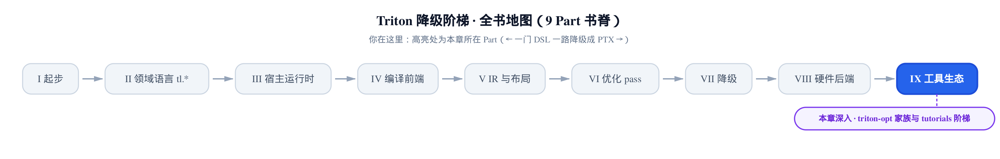
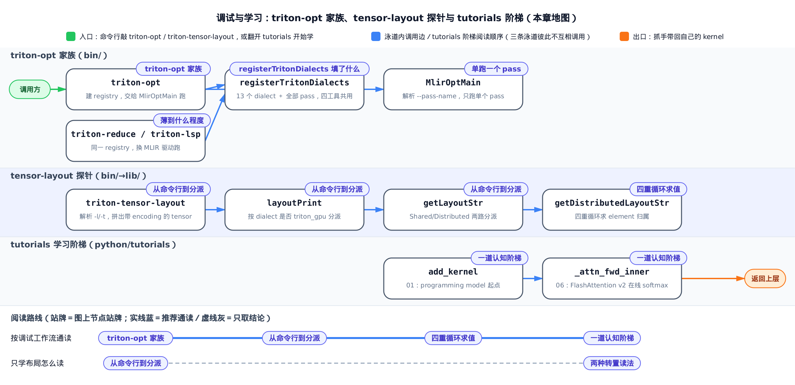
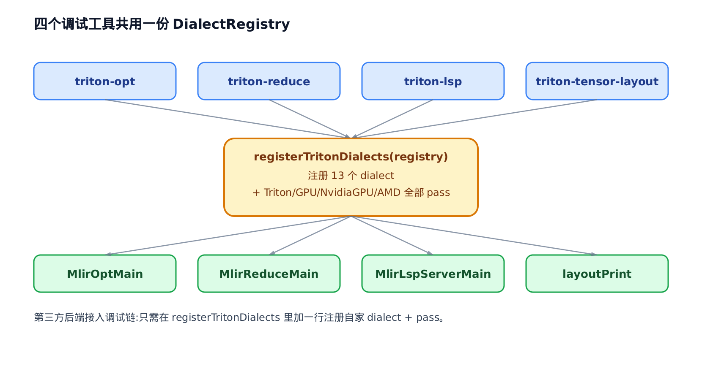
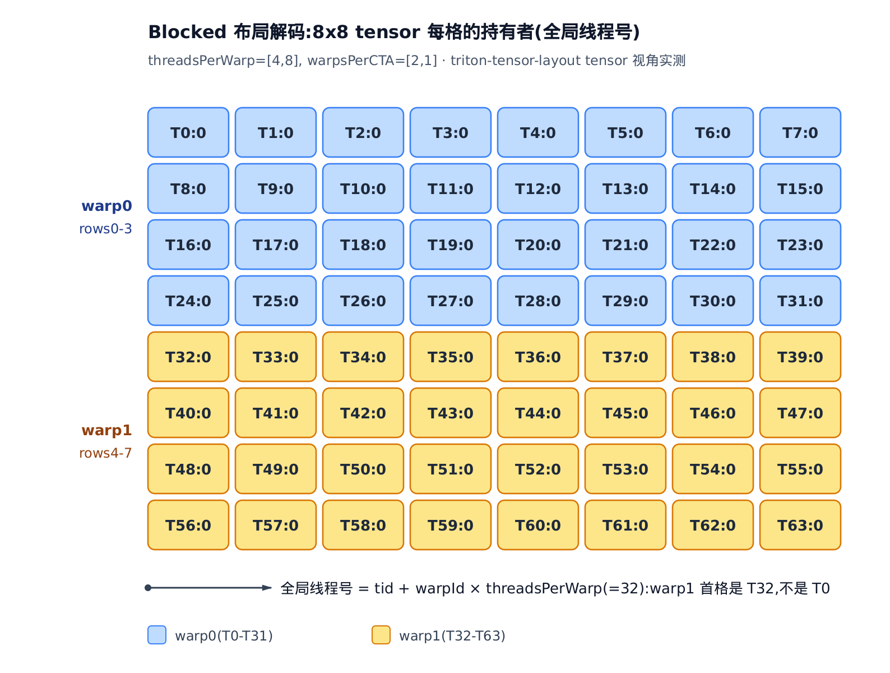
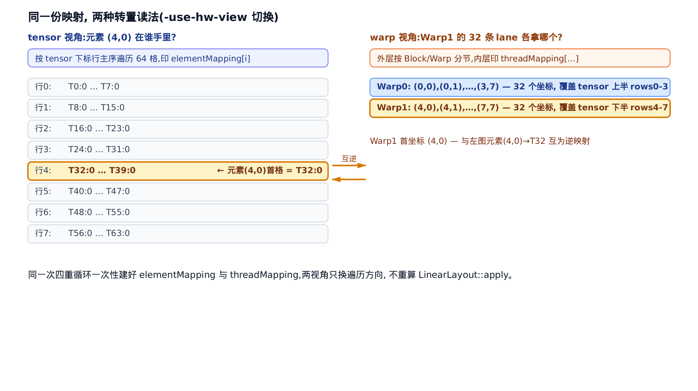
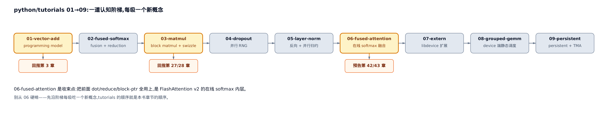

# 调试与学习：triton-opt 家族、tensor-layout 探针与 tutorials 阶梯



> 你在这里：Part IX 工具生态，收官段。
> 上一章：AOT 把编译产物提前烤成可链接的目标文件。
> 这一章：把全书学的原理，变成手里能敲的三件调试工具。

前面二十几章，我们把一段 Triton kernel 一路拆到了 PTX：`tl.*` 表面语法、`@triton.jit` 的缓存键、五段 IR（中间表示）降级、Blocked 布局怎么摊到线程、pipeline 怎么错峰。原理讲清了，可你真坐在自己的 kernel 前面，怎么**动手**验证这些？编译器把某个 tensor 的布局改坏了，你怎么揪出是哪一步干的？

这一章讲的就是这套动手工具箱，三件东西各解锁一个实打实的调试能力：

- **triton-opt** 让你单独跑某一个降级 pass（编译器里一趟独立的 IR 变换），把这一步的 IR 前后摆一起看——不再在几十个 pass 跑完的最终 IR 里大海捞针。
- **triton-tensor-layout** 给它一个布局字符串加一个 tensor 类型，它把抽象布局解码成一张座位表：tensor 的每个元素，到底落在哪个线程、哪个寄存器。[第 19–20 章](../../ch20-layout-is-a-function/narrative/chapter.md)学的抽象布局，一下子看得见摸得着。
- **tutorials 01→09** 是一道认知阶梯，每级只引入一个新概念，恰好对应本书从鸟瞰到 FlashAttention 实战的主线——它就是读者的 on-ramp（上手匝道）索引。

机制是手段，写出更快、更对的 kernel 是目的。这三件工具，是你把前面所有章节的知识落到自己算子上的抓手；而它们背后承重的代码其实只有薄薄一层——核心就压在 `bin/RegisterTritonDialects.h` 这一个头文件里，下面第一节就拆它。

> 只想会用 triton-tensor-layout 看布局，直接跳「[把布局解码成座位表](#把布局解码成座位表triton-tensor-layout-探针)」一节；想按调试工作流通读，按序读。



只想学会单独跑一个 pass 调试，看「四个薄壳，一份注册表：triton-opt 家族」一节；只想把布局解码成座位表，看「把布局解码成座位表：triton-tensor-layout 探针」一节；想知道 tutorials 该按什么顺序读，看最后一节。三节各自独立成局，挑一节看不影响读懂另外两节。

## 四个薄壳，一份注册表：triton-opt 家族

### 直觉：工具只是外壳，承重的是「认识谁」

`bin/` 目录下摆着一排调试工具：`triton-opt`（优化器驱动）、`triton-reduce`（把出错的 IR 自动缩到最小复现）、`triton-lsp`（编辑器的语言服务，LSP = Language Server Protocol）、`triton-tensor-layout`（布局探针）。你可能以为每个都是一大坨代码。恰恰相反——它们全是几行的薄壳。

真正承重的只有一件事：这些工具得**认识** Triton 的方言（dialect，MLIR 里一组自定义的算子与类型）和变换 pass。一个工具要能解析 `#triton_gpu.blocked<...>` 这种属性、要能跑 `--tritongpu-coalesce` 这个 pass，前提是有人事先把它们登记进一张表。这张表就是 `DialectRegistry`（方言注册表），而填表的活由一个共享函数 `registerTritonDialects` 一手包办。四个工具都调它，填出的是逐字节相同的一份表。



### 机制：薄到什么程度

先看 `triton-opt` 全文——它真的只有 11 行：

```cpp
// bin/triton-opt.cpp:L1-L11
#include "./RegisterTritonDialects.h"

#include "mlir/Tools/mlir-opt/MlirOptMain.h"

int main(int argc, char **argv) {
  mlir::DialectRegistry registry;
  registerTritonDialects(registry);

  return mlir::asMainReturnCode(mlir::MlirOptMain(
      argc, argv, "Triton (GPU) optimizer driver\n", registry));
}
```

三步，一步不多：建一个空的 `registry`（第 6 行）→ 调 `registerTritonDialects` 把它填满（第 7 行）→ 把填好的 `registry` 连同命令行参数一起交给 MLIR 官方的 `MlirOptMain` 去跑（第 9–10 行）。`MlirOptMain` 是 MLIR 框架自带的 opt 驱动，负责解析 `--pass-name`、读入 `.mlir` 文件、按管线跑 pass、把结果 IR 打到屏幕。**triton-opt 自己一行 pass 逻辑都没有**——它只负责喂一份「装满了 Triton 家当」的注册表。

这就是「薄壳等价性」的由来：`triton-opt` / `triton-reduce` / `triton-lsp` / `triton-tensor-layout` 四个入口调的是同一个 `registerTritonDialects`，没有哪个工具私自增删一个 pass 或 dialect。所以你在 `triton-opt` 下**单独跑**某个 pass，看到的行为，等同它在完整编译管线里那一步的行为——单跑复现是可信的。把 `triton-reduce` 和 `triton-lsp` 摆一起就更清楚了，除了换一个 MLIR 驱动，别的一模一样：

```cpp
// bin/triton-reduce.cpp:L5-L11
int main(int argc, char **argv) {
  mlir::DialectRegistry registry;
  registerTritonDialects(registry);

  mlir::MLIRContext context(registry);
  return mlir::failed(mlir::mlirReduceMain(argc, argv, context));
}
```

```cpp
// bin/triton-lsp.cpp:L5-L10
int main(int argc, char **argv) {
  mlir::DialectRegistry registry;
  registerTritonDialects(registry);

  return mlir::failed(mlir::MlirLspServerMain(argc, argv, registry));
}
```

`triton-reduce` 换成 `mlirReduceMain`（IR 缩减驱动），`triton-lsp` 换成 `MlirLspServerMain`（LSP 服务驱动）——前两行「建表 + 填表」逐字一样。承重全在那份共享注册表，驱动只管命令行与 I/O。

### 源码：registerTritonDialects 填了什么

那份表里到底填了什么？看 `registerTritonDialects` 的函数体：

```cpp
// bin/RegisterTritonDialects.h:L37-L76
inline void registerTritonDialects(mlir::DialectRegistry &registry) {
  mlir::registerAllPasses();
  mlir::registerTritonPasses();
  mlir::triton::gpu::registerTritonGPUPasses();
  mlir::registerTritonNvidiaGPUPasses();
  mlir::test::registerTestAliasPass();
  mlir::test::registerTestAlignmentPass();
  mlir::test::registerTestAllocationPass();
  mlir::test::registerTestMembarPass();
  mlir::triton::registerConvertTritonToTritonGPUPass();
  mlir::triton::registerAllocateSharedMemoryPass();
  mlir::triton::registerConvertTritonGPUToLLVMPass();
  mlir::triton::registerConvertNVGPUToLLVMPass();
  mlir::triton::registerDecomposeUnsupportedNVIDIAConversions();
  mlir::registerLLVMDIScope();

  // TritonAMDGPUToLLVM passes
  mlir::triton::registerConvertTritonAMDGPUToLLVM();
  mlir::triton::registerConvertBuiltinFuncToLLVM();
  mlir::triton::registerDecomposeUnsupportedAMDConversions();
  mlir::triton::registerOptimizeAMDLDSUsage();

  // TritonAMDGPUTransforms passes
  mlir::registerTritonAMDGPUAccelerateMatmul();
  mlir::registerTritonAMDGPUOptimizeEpilogue();
  mlir::registerTritonAMDGPUReorderInstructions();
  mlir::registerTritonAMDGPUStreamPipelineV2();
  mlir::registerTritonAMDGPUCanonicalizePointers();
  mlir::registerTritonAMDGPUConvertToBufferOps();

  // TODO: register Triton & TritonGPU passes
  registry.insert<mlir::triton::TritonDialect, mlir::cf::ControlFlowDialect,
                  mlir::triton::nvidia_gpu::TritonNvidiaGPUDialect,
                  mlir::triton::gpu::TritonGPUDialect, mlir::math::MathDialect,
                  mlir::arith::ArithDialect, mlir::scf::SCFDialect,
                  mlir::gpu::GPUDialect, mlir::LLVM::LLVMDialect,
                  mlir::NVVM::NVVMDialect, mlir::triton::nvgpu::NVGPUDialect,
                  mlir::triton::amdgpu::TritonAMDGPUDialect,
                  mlir::ROCDL::ROCDLDialect>();
}
```

函数体分两段，缺一不可：

**第一段是注册 pass**。`registerAllPasses()` 把 MLIR 全部标准 pass 登记进全局 pass 注册表，`registerTritonPasses` / `registerTritonGPUPasses` / `registerTritonNvidiaGPUPasses` 再各自登记 Triton、TritonGPU、NVIDIA 三家的变换 pass，后面一长串 AMD 的也一并登记。登记进这张表，命令行的 `--pass-name` 才认得这个 pass。

**第二段是注册 dialect**。末尾那个 `registry.insert<...>()` 一次登记 13 个 dialect：`TritonDialect`、`TritonGPUDialect`、`TritonNvidiaGPUDialect`、`NVGPUDialect`、`TritonAMDGPUDialect`，加上 MLIR 通用的 `ControlFlow`、`Math`、`Arith`、`SCF`、`GPU`、`LLVM`、`NVVM`、`ROCDL`。登记进去，parser（解析器）才认得 IR 里 `#triton_gpu.blocked<...>` 这种属性。两步缺任何一步，工具要么不认某个 pass、要么解析不了某个 dialect。

注意一个设计取舍：AMD 的 pass 和 NVIDIA 的 pass 是**一起无条件注册**的，末尾 `insert` 里 NVVM 和 ROCDL、`nvgpu` 和 `amdgpu` 同列。调试工具不做编译期后端裁剪——一份注册表得能读任意后端产出的 IR。这也正是**第三方后端接入调试链的接缝**：一个新后端（比如姊妹篇 triton-ascend 那样的独立硬件后端）要能被 `triton-opt` 调试，只需在这个函数里加一行，登记自己的 dialect 与 pass，四个工具立刻全部认得它——这就是本书反复提到的「配对脊柱」在工具层的落点。

### 单跑一个 pass：调试降级的手法

有了这层理解，triton-opt 最有用的调试姿势就浮出来了：**只跑一个 pass**。比如你怀疑合并访存那步（Coalesce）把某个 tensor 的布局改坏了，就单独跑它：

```
triton-opt --tritongpu-coalesce in.mlir
```

`in.mlir` 是你手写的、或让编译流程 dump 出来的某阶段 IR。这条命令在 triton-opt 内部经过的四个阶段，全都落在前面那 11 行里：

<!-- trace: m3-single-pass-dump -->

| 阶段 | triton-opt 内发生什么 | 依据（file:L） |
|---|---|---|
| ① 建空注册表 | `main()` 建一个空的 `mlir::DialectRegistry registry` | bin/triton-opt.cpp:L6 |
| ② 装满承重 | `registerTritonDialects(registry)`：先 `registerAllPasses` + registerTriton/GPU/NvidiaGPU/AMD Passes 把全部变换 pass 登记进全局 pass 注册表，再 `registry.insert<>` 登记 13 个 dialect | bin/triton-opt.cpp:L7 → bin/RegisterTritonDialects.h:L38-L75 |
| ③ 交给框架跑 | `MlirOptMain(argc, argv, ..., registry)`：解析命令行里的 `--tritongpu-coalesce`、读入 `in.mlir`、只执行这一个 pass、把 pass 后 IR 打到 stdout | bin/triton-opt.cpp:L9-L10 |
| ④ 对照定位 | 把 stdout 的 pass 后 IR 与输入 `in.mlir` 并排 diff——Coalesce 若改动了某个 tensor 的 `#triton_gpu.blocked<...>` 编码，差异一目了然 | bin/triton-opt.cpp:L9（MlirOptMain 打印结果 IR） |

关键在阶段 ④：因为 triton-opt 只跑了这一个 pass，pass 前（`in.mlir`）和 pass 后（stdout）就是一次单步变换的两张快照。哪个 tensor 的 `#triton_gpu.blocked<...>` 编码被动了、`order` 有没有翻，一 diff 就锁定。这套 IR 前后对照，正是排查[五段降级](../../ch32-five-stages-ttir-to-ttgir/narrative/chapter.md)里某一步出错的标准手法——那些 pass 的内部逻辑前面几章讲过了，这里给的是**怎么把某一步单独拎出来看**的钥匙。

## 把布局解码成座位表：triton-tensor-layout 探针

### 直觉：藏起来的座位表

一个抽象布局字符串，比如 `#triton_gpu.blocked<{sizePerThread=[1,1], threadsPerWarp=[4,8], warpsPerCTA=[2,1], order=[1,0]}>`，是一张藏起来的座位表：哪个线程、哪个寄存器，坐哪个 tensor 元素，肉眼根本看不出来。[布局即函数](../../ch20-layout-is-a-function/narrative/chapter.md)那章讲清了它数学上是个映射，可你想「亲眼看看第 (4,0) 号元素到底在谁手里」，还是得有工具把这张表打印出来。

triton-tensor-layout 就是干这个的。给它一个布局字符串（`-l`）加一个 tensor 类型（`-t`），它对 tensor 的每个格子标一个 `T{全局线程号}:{寄存器号}`。抽象布局一下子变成看得见的座位图。

### 机制：从命令行到分派

先看探针主入口怎么把两个输入拼成一个待解码的对象：

```cpp
// bin/triton-tensor-layout.cpp:L179-L214
int main(int argc, char **argv) {
  cl::HideUnrelatedOptions(PrinterCategory);
  cl::ParseCommandLineOptions(argc, argv, "tensor layout printer\n");

  DialectRegistry registry;
  registerTritonDialects(registry);

  MLIRContext ctx(registry);
  ctx.loadAllAvailableDialects();
  // … 省略：TensorStr 为空的报错分支 …
  mlir::Type parsedTy = parseType(TensorStr, &ctx);
  // … 省略：parse 失败与非 TensorType 的报错分支 …
  TensorType tensorType = dyn_cast<TensorType>(parsedTy);

  std::string storage;
  raw_string_ostream ss(storage);

  if (failed(printLayoutFromFile(&ctx, InputFile, AliasName, tensorType, ss)))
    return 1;

  if (failed(printLayoutFromString(&ctx, DataLayoutStr, tensorType, ss)))
    return 1;
  // … 省略：L216-L230 的 -o 输出分流（写文件或打屏）…
```

注意它复用的是**同一个** `registerTritonDialects(registry)`——和 triton-opt 完全一份。这正是探针能认识 `#triton_gpu.blocked<...>` 这种属性的原因。`-t` 给的 tensor 形状与元素类型（如 `tensor<8x8xf16>`）被 `parseType` 解析成 `RankedTensorType`；`-l` 给的布局字符串则作为 encoding（编码属性）附到这个 tensor 类型上。输入有两条路：`printLayoutFromFile` 从 `.mlir` 文件加 `-alias-names` 取一个命名布局，`printLayoutFromString` 直接吃 `-l` 给的字符串——两条殊途同归，正文用字符串这条讲。

拿到带 encoding 的 `RankedTensorType`，活交给 `layoutPrint` 分派：

```cpp
// bin/triton-tensor-layout.cpp:L82-L94
LogicalResult layoutPrint(RankedTensorType tensorType, raw_ostream &os) {
  StringRef dialectName = tensorType.getEncoding().getDialect().getNamespace();

  // Dispatch to the corresponding dialect helper function to print the layout.
  if (dialectName == "triton_gpu") {
    os << triton::gpu::getLayoutStr(tensorType, UseHWPointOfView);
    return success();
  }

  llvm::errs() << "Unsupported tensor layout attribute: "
               << tensorType.getEncoding() << "\n";
  return failure();
}
```

这段是探针的咽喉：取 tensor 的 encoding（就是那个布局属性），按它属于哪个 dialect 分派。当前只认 `triton_gpu`，把活全交给 `getLayoutStr`。`UseHWPointOfView` 是 `-use-hw-view` 开关，决定打哪种视角——后面细讲。`getLayoutStr` 顶层再分一次流：

```cpp
// lib/Dialect/TritonGPU/IR/Dialect.cpp:L3402-L3418
std::string mlir::triton::gpu::getLayoutStr(RankedTensorType tensorType,
                                            bool useHWPointOfView) {
  auto layout = tensorType.getEncoding();
  // … 省略：注释说明后面仍需 tensorType …
  if (auto sharedLayout = mlir::dyn_cast<SharedEncodingAttr>(layout)) {
    return getSharedLayoutStr(tensorType, useHWPointOfView);
  } else if (auto distributedLayout =
                 mlir::dyn_cast<DistributedEncodingTrait>(layout)) {
    return getDistributedLayoutStr(tensorType, useHWPointOfView);
  }

  // else unimplemented, return error
  llvm::report_fatal_error("Unimplemented usage of getLayoutStr");
  return "";
}
```

两条分支正对应前面学过的两大布局家族：[共享内存布局](../../ch22-shared-encoding-swizzle/narrative/chapter.md)（`SharedEncodingAttr`）走 `getSharedLayoutStr`；分布式布局（Blocked / Slice / MMA 等都实现了 `DistributedEncodingTrait`，见[第 21 章](../../ch21-distributed-layouts/narrative/chapter.md)）走 `getDistributedLayoutStr`。本章重点是后者——把分布式布局解码成 thread/reg 映射。

### 源码：四重循环求值

`getDistributedLayoutStr` 的核心是一个四重循环。它遍历每一个硬件坐标 `(block, warp, lane, register)`，问一句：这个坐标，落在 tensor 的哪个元素上？

```cpp
// lib/Dialect/TritonGPU/IR/Dialect.cpp:L3291-L3341
  std::optional<LinearLayout> ll =
      triton::gpu::toLinearLayout(tensorType.getShape(), layout);
  if (!ll.has_value())
    llvm::report_fatal_error("Failed to convert layout to linear layout");
  int64_t tensorSize = product(tensorType.getShape());
  std::vector<std::string> elementMapping(tensorSize);
  std::vector<std::string> threadMapping;
  for (int blockId = 0; blockId < numBlocks; ++blockId) {
    for (int warpId = 0; warpId < numWarpsPerCTA; warpId++) {
      for (int tid = 0; tid < threadsPerWarp; ++tid) {
        for (int idx = 0; idx < numElementsPerThreads; ++idx) {
          SmallVector<std::pair<StringAttr, int32_t>> inputs = {
              {kBlock, blockId},
              {kWarp, warpId},
              {kLane, tid},
              {kRegister, idx}};
          SmallVector<std::pair<StringAttr, int32_t>> outputs =
              ll->apply(inputs);
          int32_t linearizedIdx = 0;
          int stride = 1;
          for (int i = outputs.size() - 1; i >= 0; i--) {
            linearizedIdx += outputs[i].second * stride;
            stride *= tensorType.getDimSize(i);
          }
          std::string &value = elementMapping[linearizedIdx];
          if (!value.empty())
            value += "|";
          int padding = numCharacterPadding(blockId, numBlocks) +
                        numCharacterPadding(tid + warpId * threadsPerWarp,
                                            numWarpsPerCTA * threadsPerWarp) +
                        numCharacterPadding(idx, numElementsPerThreads);
          for (int i = 0; i < padding; i++)
            value += " ";
          if (numBlocks > 1)
            value += "B" + std::to_string(blockId) + ":";
          value += "T" + std::to_string(tid + warpId * threadsPerWarp) + ":" +
                   std::to_string(idx);
          // Now also compute the thread mapping.
          std::string threadInfo = "(";
          for (int i = 0; i < outputs.size(); i++) {
            if (i > 0)
              threadInfo += ",";
            threadInfo +=
                paddedString(outputs[i].second, tensorType.getDimSize(i));
          }
          threadInfo += ")";
          threadMapping.push_back(threadInfo);
        }
      }
    }
  }
```

逐段拆开看。第一步 `toLinearLayout` 把布局降成一个统一的 `LinearLayout`（线性布局，见[第 23 章](../../ch23-linear-layout/narrative/chapter.md)）——Blocked、Slice、MMA 各有各的复杂规则，但都能降到这个统一形式。这就是**为什么一套代码能打印所有分布式布局**：`getLayoutStr` 不为每种布局手写映射，而是先转成 `LinearLayout`，再用它的 `apply()` 求值。

四重循环体里，每个硬件坐标 `(blockId, warpId, tid, idx)`（`tid` 即 lane，warp 内的线程编号）打包成 `inputs`，喂给 `ll->apply(inputs)` 得到 `outputs`——也就是这个坐标落在 tensor 的哪个多维下标。这个 `apply` 就是 `LinearLayout` 的求值本体（`lib/Tools/LinearLayout.cpp:L796`），把一组输入维度的坐标线性组合成输出维度的坐标，正是[第 23 章](../../ch23-linear-layout/narrative/chapter.md)那套线性布局的落地。接着 row-major（行主序）线性化成 `linearizedIdx`，于是 `elementMapping[该元素]` 追加一条标注。

**这里有一个最容易看错的命门**：追加的标注是 `"T" + std::to_string(tid + warpId * threadsPerWarp) + ":" + ...`。线程号取的是 **全局** 值

```math
\mathrm{globalTid} = \mathrm{tid} + \mathrm{warpId}\times\mathrm{threadsPerWarp}
```

不是每个 warp 内从头数的局部 `tid`。也就是说，warp 1 的第 0 条 lane，打印出来是 `T32`（= 0 + 1×32），**不是** `T0`。多 block 时还会前缀 `B{blockId}:`（本例单 block，不出现）。中间那段 `padding` 只为让打印的列对齐，靠 `numCharacterPadding` 给全局线程号、寄存器号各补空格到等宽。本例全局线程号最大到 63（两位数），故个位数线程号（T0..T9）比两位数（T10..T63）多补 1 个空格，列宽由此对齐。

还有一处细节：`threadInfo`（供另一种视角用的坐标记录）是在循环体里**每次迭代无条件构建**的，跟视角开关无关——它按硬件坐标的遍历顺序，逐个记下「这个槽位对应 tensor 的哪个坐标」，压进 `threadMapping`。这一点下一节切换视角时会用上。

### 机制：跑一遍 8×8 的 Blocked 布局

把上面那个 `#triton_gpu.blocked<{sizePerThread=[1,1], threadsPerWarp=[4,8], warpsPerCTA=[2,1], order=[1,0]}>` 配 `tensor<8x8xf16>` 喂进去，逐个硬件坐标追一遍。这个布局下每个 warp 是 4×8 的线程排布、每 CTA 两个 warp，一个线程恰好持有一个元素（`sizePerThread=[1,1]`）。行列换算是：`row = lane//8 + 4*warp`，`col = lane%8`。挑几个关键坐标：

<!-- trace: m5-distributed-decode -->

| 硬件坐标 (warp, lane, reg) | 全局线程号 tid+warp*32 | LinearLayout::apply → (row,col) | elementMapping 里写入 | tensor 视角该格打印 |
|---|---|---|---|---|
| (warp0, lane0, reg0) | 0 | (0,0) | `elementMapping[0] += "T0:0"` | `[[ T0:0` |
| (warp0, lane8, reg0) | 8 | (1,0) | `elementMapping[8] += "T8:0"` | 第 2 行首格 T8:0 |
| (warp0, lane31, reg0) | 31 | (3,7) | `elementMapping[31] += "T31:0"` | 第 4 行末格 T31:0 |
| (warp1, lane0, reg0) | 32 | (4,0) | `elementMapping[32] += "T32:0"` | 第 5 行首格 T32:0（warp1 第一条 lane，不是 T0！） |
| (warp1, lane31, reg0) | 63 | (7,7) | `elementMapping[63] += "T63:0"` | 第 8 行末格 T63:0]] |

盯住第 4、5 两行的跳变：warp0 的最后一条 lane 是 `T31`，坐在 tensor 第 4 行末尾；紧接着 warp1 的第一条 lane 是 `T32`，坐在第 5 行开头——**不是回到 T0**。全局线程号让 warp 之间自然接续，warp1 整体比 warp0 同位置的 lane 号大 32。

这里有一条不变量兜底：四重循环跑 `numBlocks(1) × numWarpsPerCTA(2) × threadsPerWarp(32) × numElementsPerThreads(1) = 64` 次，恰好等于 `product(8,8) = 64` 个 tensor 元素。本例布局无复制，`ll->apply` 是硬件坐标到 tensor 下标的一一映射，所以每个格子恰有一个持有者，`elementMapping` 里不出现表示「多人共享」的 `|`。64 个硬件槽位，无重叠地铺满 64 个格子。

整张座位表长这样——把 8×8 的每个格子都标上它的全局线程号：



### 两种转置读法：tensor 视角 vs warp 视角

同一张座位表，两个人问法不同。老师问「第 (4,0) 号座位是谁坐？」——这是 tensor 视角，从元素问线程。学生问「我 warp1 的 32 个人各坐哪儿？」——这是 warp 视角，从线程问元素。triton-tensor-layout 两种都能打，`-use-hw-view` 一按就切。关键是：它**不重算**映射，只把同一张表换个方向念。

看排版这段源码，`if/else` 两个分支只做遍历、不再调 `ll->apply`：

```cpp
// lib/Dialect/TritonGPU/IR/Dialect.cpp:L3342-L3398
  std::string layoutStr;
  if (!useHWPointOfView) {
    // Printing the threads containing each elements of the tensor.
    int rank = tensorType.getRank();
    bool newLine = true;
    for (int i = 0; i < tensorSize; i++) {
      auto indices = delinearizeIndex(i, tensorType.getShape());
      // … 省略：按多维边界补 '[' 缩进、行首补空格 …
      layoutStr += elementMapping[i];
      // … 省略：按下一个下标补 ']' 与换行/逗号 …
    }
  } else {
    // Printing the elements in each physical reg/warps/threads.
    for (int blockId = 0; blockId < numBlocks; blockId++) {
      if (numBlocks > 1)
        layoutStr += "Block" + std::to_string(blockId) + ":\n";
      for (int warpId = 0; warpId < numWarpsPerCTA; warpId++) {
        layoutStr += "Warp" + std::to_string(warpId) + ":\n";
        for (int idx = 0; idx < numElementsPerThreads; ++idx) {
          for (int tid = 0; tid < threadsPerWarp; ++tid) {
            int linearizedIdx =
                blockId * numWarpsPerCTA * threadsPerWarp *
                    numElementsPerThreads +
                warpId * threadsPerWarp * numElementsPerThreads +
                tid * numElementsPerThreads + idx;
            layoutStr += threadMapping[linearizedIdx];
            if (tid < threadsPerWarp - 1)
              layoutStr += ", ";
          }
          layoutStr += "\n";
        }
      }
    }
  }
  return layoutStr;
```

`!useHWPointOfView`（tensor 视角）按 tensor 元素行主序走一遍，每个格子印 `elementMapping[i]`——读出来是「tensor 的第 (r,c) 个元素在哪个线程哪个寄存器」。`else`（warp 视角，`-use-hw-view`）外层按 Block / Warp 分节，内层枚举 `(register idx, lane tid)`，印 `threadMapping[...]`——读出来是「warp0 的 lane0 寄存器 0 拿的是 tensor 的哪个元素」。两个分支读的是**同一份**在四重循环里一次建好的 `elementMapping` 和 `threadMapping`，谁都没再求值。

真跑出来，两种视角的输出并排是这样：

```
===== tensor 视角（默认）=====
[[ T0:0,  T1:0,  T2:0,  T3:0,  T4:0,  T5:0,  T6:0,  T7:0]
[  T8:0,  T9:0, T10:0, T11:0, T12:0, T13:0, T14:0, T15:0]
[ T16:0, T17:0, T18:0, T19:0, T20:0, T21:0, T22:0, T23:0]
[ T24:0, T25:0, T26:0, T27:0, T28:0, T29:0, T30:0, T31:0]
[ T32:0, T33:0, T34:0, T35:0, T36:0, T37:0, T38:0, T39:0]
[ T40:0, T41:0, T42:0, T43:0, T44:0, T45:0, T46:0, T47:0]
[ T48:0, T49:0, T50:0, T51:0, T52:0, T53:0, T54:0, T55:0]
[ T56:0, T57:0, T58:0, T59:0, T60:0, T61:0, T62:0, T63:0]]

===== hardware/warp 视角（-use-hw-view）=====
Warp0:
(0,0), (0,1), (0,2), (0,3), (0,4), (0,5), (0,6), (0,7), (1,0), (1,1), (1,2), (1,3), (1,4), (1,5), (1,6), (1,7), (2,0), (2,1), (2,2), (2,3), (2,4), (2,5), (2,6), (2,7), (3,0), (3,1), (3,2), (3,3), (3,4), (3,5), (3,6), (3,7)
Warp1:
(4,0), (4,1), (4,2), (4,3), (4,4), (4,5), (4,6), (4,7), (5,0), (5,1), (5,2), (5,3), (5,4), (5,5), (5,6), (5,7), (6,0), (6,1), (6,2), (6,3), (6,4), (6,5), (6,6), (6,7), (7,0), (7,1), (7,2), (7,3), (7,4), (7,5), (7,6), (7,7)
```

把两种读法对起来，一格一格对得上：

<!-- trace: m6-two-views -->

| 问法 | 视角（源码分支） | 遍历顺序 | 读一格的含义 | 打印输出里对应片段 |
|---|---|---|---|---|
| 元素 (4,0) 在谁手里？ | tensor 视角（!useHWPointOfView，L3343） | 按 tensor 下标行主序走 64 格，每格印 elementMapping[i] | 第 5 行首格 = T32:0 → 元素(4,0)由全局线程 32 的寄存器 0 持有 | tensor 视角第 5 行 `T32:0, T33:0, …` |
| Warp0 的 32 条 lane 各拿哪个？ | warp 视角（useHWPointOfView，L3376） | 外层 Block/Warp、内层 (reg idx, lane tid)，印 threadMapping[...] | Warp0 一行 32 个坐标 = 该 warp 32 条 lane 各持的 (row,col) | `Warp0:` 下 `(0,0), (0,1), …, (3,7)` |
| Warp1 覆盖 tensor 哪一半？ | warp 视角（useHWPointOfView，L3376） | 同上，warpId=1 | Warp1 的 32 个坐标从 (4,0) 到 (7,7) → 正好是 tensor 下半 | `Warp1:` 下 `(4,0), (4,1), …, (7,7)` |

不变量：两种视角读的是同一份「硬件坐标 ↔ tensor 坐标」映射，一个按值域（tensor 下标）遍历、一个按定义域（硬件坐标）遍历，所以「元素 (4,0) → T32」和「warp1 的 lane0 → (4,0)」必然互为逆、恒不矛盾。这就是「转置一致性」——同一张表的两个方向。同一次解码产出两张视图、零重算：tensor 视角是 64 格的 8×8 表，warp 视角是 2 个 Warp 段各 32 个坐标，二者元素总数都是 64，只是遍历方向不同（值域 vs 定义域）。



回到调试。当你写的 kernel 出现莫名其妙的数值错误、或者访存不合并，八成是某个 tensor 的布局不是你以为的样子。把那个布局字符串喂给 triton-tensor-layout，两个视角一打，「到底哪个线程该拿哪个元素」黑纸白字摆出来——比在脑子里推 `LinearLayout` 靠谱得多。这就是[第 19–23 章](../../ch23-linear-layout/narrative/chapter.md)那套布局抽象最好的动手教具。

## tutorials 01→09：一道认知阶梯

工具会用了，接下来的问题是：官方 `python/tutorials/` 那一排例子，该按什么顺序读？答案是——按编号 01 到 09 顺着爬，因为它是一道**认知阶梯**，每一级只引入一个新概念，而且恰好对应本书的主线。



第一级 `01-vector-add`，立起最小的 programming model。它的 kernel 只有一屏：

```python
# python/tutorials/01-vector-add.py:L27-L52
@triton.jit
def add_kernel(x_ptr,  # *Pointer* to first input vector.
               y_ptr,  # *Pointer* to second input vector.
               output_ptr,  # *Pointer* to output vector.
               n_elements,  # Size of the vector.
               BLOCK_SIZE: tl.constexpr,  # Number of elements each program should process.
               # NOTE: `constexpr` so it can be used as a shape value.
               ):
    # There are multiple 'programs' processing different data. We identify which program
    # we are here:
    pid = tl.program_id(axis=0)  # We use a 1D launch grid so axis is 0.
    # This program will process inputs that are offset from the initial data.
    # For instance, if you had a vector of length 256 and block_size of 64, the programs
    # would each access the elements [0:64, 64:128, 128:192, 192:256].
    # Note that offsets is a list of pointers:
    block_start = pid * BLOCK_SIZE
    offsets = block_start + tl.arange(0, BLOCK_SIZE)
    # Create a mask to guard memory operations against out-of-bounds accesses.
    mask = offsets < n_elements
    # Load x and y from DRAM, masking out any extra elements in case the input is not a
    # multiple of the block size.
    x = tl.load(x_ptr + offsets, mask=mask)
    y = tl.load(y_ptr + offsets, mask=mask)
    output = x + y
    # Write x + y back to DRAM.
    tl.store(output_ptr + offsets, output, mask=mask)
```

这一屏正好把 SPMD（单程序多数据）分块模型的最小要素凑齐：`tl.program_id`（当前 program 的编号，回指[第 3 章鸟瞰](../../ch03-kernel-life-birdseye/narrative/chapter.md)讲的分块）、`BLOCK_SIZE`（`constexpr` 分块尺寸，编译期常量、能当形状用）、`tl.arange` 生成块内偏移、`mask` 挡越界、`tl.load`/`tl.store` 完成一次「读—加—写」。这是阶梯的第一级，也是往后每一级都要复用的地基。

顺着往上：`02-fused-softmax` 引入融合与归约，`03-matmul` 上 block matmul（对应[第 27 章](../../ch27-tensor-core-mma-layout/narrative/chapter.md)和[第 28 章](../../ch28-accelerate-matmul-layout-opt/narrative/chapter.md)的 MMA）和 L2 swizzle 调度（按 `GROUP_SIZE_M` 把 program-id 重排成分组蛇形、提升 L2 命中——教程自带的调度手法，本书未单列章），`04-dropout` 引入并行 RNG，`05-layer-norm` 上反向与并行归约。到第六级 `06-fused-attention`，前面攒的 dot / reduce / block-ptr 全用上了——它是 FlashAttention v2 的 Triton 实现：

```python
# python/tutorials/06-fused-attention.py:L1-L14
"""
Fused Attention
===============

This is a Triton implementation of the Flash Attention v2 algorithm from Tri Dao (https://tridao.me/publications/flash2/flash2.pdf)

Credits: OpenAI kernel team

Extra Credits:

* Original flash attention paper (https://arxiv.org/abs/2205.14135)
* Rabe and Staats (https://arxiv.org/pdf/2112.05682v2.pdf)

"""
```

它的内层循环，就是在线 softmax 的分块归一化：

```python
# python/tutorials/06-fused-attention.py:L45-L77
    # loop over k, v and update accumulator
    for start_n in range(lo, hi, BLOCK_N):
        start_n = tl.multiple_of(start_n, BLOCK_N)
        # -- compute qk ----
        k = tl.load(K_block_ptr)
        qk = tl.dot(q, k)
        if STAGE == 2:
            mask = offs_m[:, None] >= (start_n + offs_n[None, :])
            qk = qk * qk_scale + tl.where(mask, 0, -1.0e6)
            m_ij = tl.maximum(m_i, tl.max(qk, 1))
            qk -= m_ij[:, None]
        else:
            m_ij = tl.maximum(m_i, tl.max(qk, 1) * qk_scale)
            qk = qk * qk_scale - m_ij[:, None]
        p = tl.math.exp2(qk)
        l_ij = tl.sum(p, 1)
        # -- update m_i and l_i
        alpha = tl.math.exp2(m_i - m_ij)
        l_i = l_i * alpha + l_ij
        # -- update output accumulator --
        acc = acc * alpha[:, None]
        # update acc
        v = tl.load(V_block_ptr)
        if fp8_v:
            p = p.to(tl.float8e5)
        else:
            p = p.to(tl.float16)
        acc = tl.dot(p, v, acc)
        # update m_i and l_i
        m_i = m_ij
        V_block_ptr = tl.advance(V_block_ptr, (BLOCK_N, 0))
        K_block_ptr = tl.advance(K_block_ptr, (0, BLOCK_N))
    return acc, l_i, m_i
```

这段不在本章展开——`STAGE` 是是否做因果掩码（causal mask）的开关，`qk_scale` 是 $`1/\sqrt{d}`$ 的缩放系数，这些实现细节留给本书收尾的 FlashAttention 实战章；分块遍历 K/V、用 running max `m_i` 和 running sum `l_i` 增量归一化、`alpha` 重标定 `acc`，避免物化 N×N 的注意力矩阵，那套在线 softmax 的完整推导也是那一章的事。这里只引它当预告片，让你看一眼阶梯顶端长什么样：`tl.dot` / `tl.max` / `tl.sum` / `tl.advance` 全在这几行里齐活。别从 06 硬啃——先 01 立起 programming model，再沿阶梯每级吃一个新概念，到 06 时手里的零件都已就位。tutorials 的顺序，就是本书章节的顺序。

后面 `07-extern`（调 libdevice 外部函数）、`08-grouped-gemm`（device 端静态调度：把「多个形状各异的子矩阵乘，各自的 tile 该派给哪个 CTA」这套分配算法从 host 端预算搬进 kernel 内部去算）、`09-persistent`（persistent kernel 加 TMA：只起满 SM 数的常驻 CTA、让每个 CTA 在内部循环里吃完所有 tile，省掉反复 launch 的开销）继续往上，各对应一个更进阶的子系统。你要给自己找一个真实、能跑、带 benchmark 的范式做起点，这道阶梯就是索引。

## 小结：三件工具，三个抓手

这一章把全书的原理落回到手上，三件工具各给你一个抓手：

- **triton-opt 单跑一个 pass**：`triton-opt --<pass> in.mlir` 只让一趟变换作用在 IR 上，pass 前后一 diff，就锁定是哪一步把布局或形状改坏了。承重全在 `registerTritonDialects`（`bin/RegisterTritonDialects.h`）那份共享注册表——四个工具共用，新后端接入调试链只需在那里加一行。
- **triton-tensor-layout 解码布局**：给它布局字符串加 tensor 类型，`getDistributedLayoutStr`（`lib/Dialect/TritonGPU/IR/Dialect.cpp`）把抽象布局翻成一张座位表，tensor 每个格子标 `T{全局线程号}:{寄存器}`。记住那个命门——线程号是全局的，warp1 的 lane0 是 `T32` 不是 `T0`。tensor 视角和 warp 视角是同一映射的两种转置读法，排查布局问题时黑纸白字，比脑内推演靠谱。
- **tutorials 01→09 阶梯**：每级一个新概念，顺着爬就把 programming model → 融合 → MMA → 在线 softmax 一路走通，恰好复刻本书的主线。它是你把这些知识用到自己 kernel 上的现成范式。

到这里，一门 DSL 从表面语法一路降到 PTX、再到手里能敲的调试工具，全书的降级阶梯就走完了。接下来，我们把镜头转向注意力这条最热的赛道，先把 FlashAttention 的原理讲透，再落到一个端到端的实战算子上。
