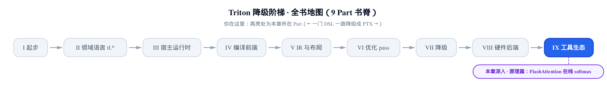
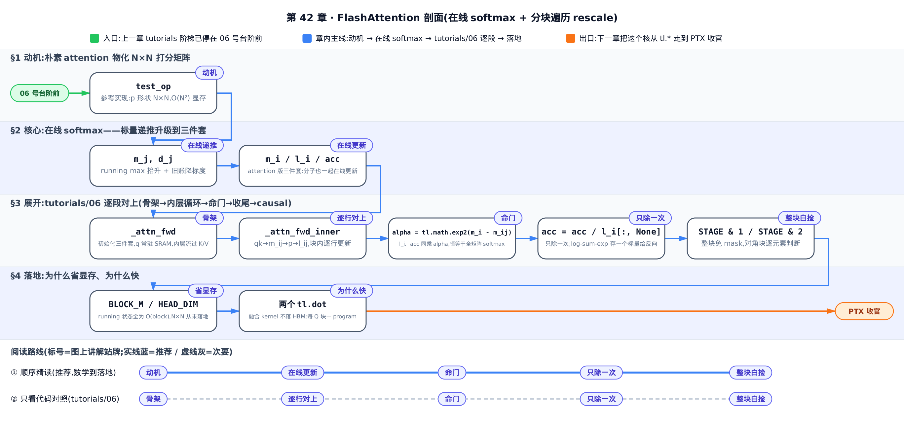
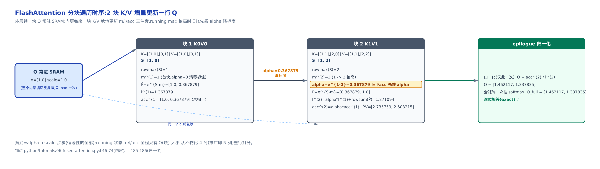
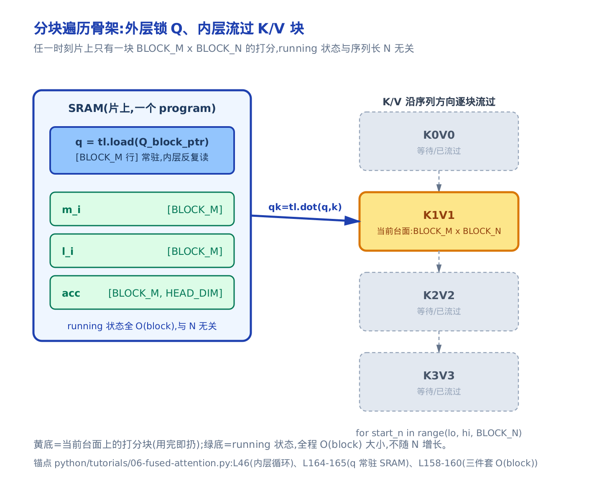
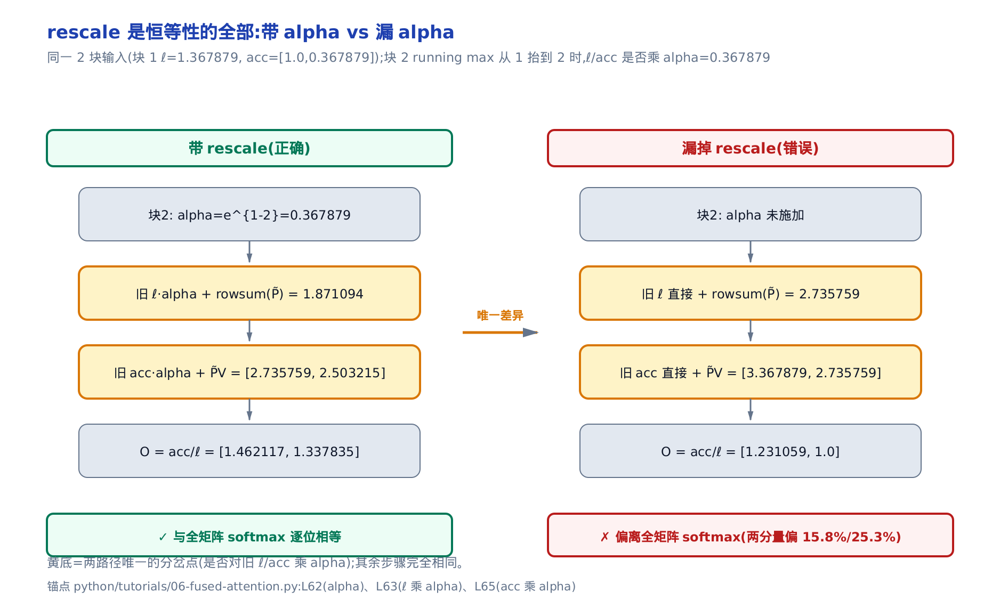

# FlashAttention：在线 softmax 与分块遍历



> **你在这里**——Part IX「工具生态」的原理篇，全书最后一个原理章。
> 上一章：[tutorials 阶梯](../../ch41-debug-tools-tutorials/narrative/chapter.md)爬到 06 号台阶前。
> 本章：台阶上的算法本身——FlashAttention。
> 下一章：把这个核从 `tl.*` 一路看到 PTX，收官。

`python/tutorials/06-fused-attention.py` 是 Triton 官方的旗舰 kernel：FlashAttention v2 的真实实现——文件 docstring 逐字写着 "This is a Triton implementation of the Flash Attention v2 algorithm from Tri Dao"（`python/tutorials/06-fused-attention.py:L5`）。[第 41 章](../../ch41-debug-tools-tutorials/narrative/chapter.md)的阶梯图劝你别从它硬啃，原因不在 Triton 语法——`tl.dot`、块指针、`tl.advance` 你在前面都见过——而在算法：内层循环里 `m_i`、`l_i`、`acc`、`alpha` 这套记账规则，不懂 FlashAttention 的数学就是天书。本章把这套数学从零推出来，再逐行按回代码上。

性能上的 stakes 也值得先亮出来。attention 是典型的访存受限（memory-bound）算子——瓶颈不是算力，是把中间矩阵在全局显存（HBM，[第 2 章](../../ch02-gpu-execution-model/narrative/chapter.md)内存延迟金字塔的塔底）和计算单元之间来回搬。FlashAttention 的全部收益来自两条对任何算子都成立的判断：**中间量能不物化就不物化**；**能融进一个 kernel 就不落回 HBM**。看懂它怎么做到「结果逐位不变、却从不物化 $`N\times N`$」，你对自己算子里「哪个中间张量其实可以流式消化掉」会有完全不同的眼光。



想先把数学吃透再回代码，按 §1→§4 顺序精读；只想对着 `tutorials/06` 逐行核对，可以直接跳 §3 沿图底部虚线路线走，回头需要哪块数学再翻 §2。

符号先立好，随用随查：

| 符号 | 含义 | 首现 |
|---|---|---|
| $`N`$ | 序列长度（代码 `N_CTX`）；朴素 attention 的打分矩阵是 $`N\times N`$，显存 $`O(N^2)`$ 的根源 | §1 |
| $`m`$ | 数值稳定 softmax 里减掉的那一行最大值——要先扫完整行才知道 | §2.1 |
| $`m_j`$ | 标量在线 softmax 扫到第 $`j`$ 个元素时的 running max（到目前为止的最大值） | §2.2 |
| $`d_j`$ | 标量在线 softmax 的 running 分母：以当前 $`m_j`$ 为基准、对已扫元素累加的和 | §2.2 |
| $`m^{(j)}`$ | attention 版：处理完第 $`j`$ 块 K/V 后的 running row-max（代码 `m_i`，块内新值 `m_ij`） | §2.3 |
| $`\ell^{(j)}`$ | attention 版：处理完第 $`j`$ 块后的 running 分母（代码 `l_i`），末尾用它一次性归一化 | §2.3 |
| $`O^{(j)}`$ | 输出累加器（代码 `acc`）：未归一化的加权 V 之和，随每块增量更新 | §2.3 |
| $`\alpha`$ | rescale 因子 $`e^{m^{(j-1)}-m^{(j)}}\le 1`$（代码 `alpha`）：running max 抬高时把旧账降标度到新基准 | §2.3 |
| $`S^{(j)}`$ | 第 $`j`$ 块的打分子矩阵（代码 `qk`）：只有 `BLOCK_M`×`BLOCK_N`，从不物化整行 | §2.3 |
| $`\tilde P^{(j)}`$ | 第 $`j`$ 块未归一化的注意力权重 $`e^{S^{(j)}-m^{(j)}}`$（代码 `p`），归一化推迟到收尾 | §2.3 |
| $`V_j`$ | 第 $`j`$ 块的 value 子矩阵；$`\tilde P^{(j)}V_j`$ 是本块对输出的增量贡献 | §2.3 |

## §1 动机：朴素 attention 把一张 N×N 矩阵摆上了显存

`tutorials/06` 的测试里自带朴素参考实现——它就是 attention 数学定义的逐行翻译，也是 FlashAttention 要逐位复现的黄金标准（`python/tutorials/06-fused-attention.py:L534-L541`）：

```python
# python/tutorials/06-fused-attention.py:L534-L541
    # reference implementation
    M = torch.tril(torch.ones((N_CTX, N_CTX), device="cuda"))
    p = torch.matmul(q, k.transpose(2, 3)) * sm_scale
    if causal:
        p[:, :, M == 0] = float("-inf")
    p = torch.softmax(p.float(), dim=-1).half()
    # p = torch.exp(p)
    ref_out = torch.matmul(p, v)
    # … 省略：紧随其后的反向对照（ref_out.backward 等），本章只讲前向 …
```

`causal` 分支是因果掩码——query 只能看它之前的 key，分块框架下它有个白捡的便宜，留到 §3.4。对应的数学定义（教科书共识，缩放因子 $`\sqrt{d}`$ 即代码里的 `sm_scale`，$`d`$ 是 head 维度 `HEAD_DIM`）：

```math
\mathrm{Attention}(Q,K,V)=\mathrm{softmax}\!\left(\frac{QK^\top}{\sqrt{d}}\right)V
```

盯住中间那个 `p`：形状 `N_CTX × N_CTX`，即 $`N\times N`$。朴素实现必须把它**完整算出来、写进 HBM，再读回来做 softmax，再读回来乘 V**。代价有两层：

- **显存**：$`p`$ 占 $`O(N^2)`$。序列长 8K 时单个 head 的打分矩阵就是 $`8192^2\approx 6.7\times 10^7`$ 个元素；32K、64K 时平方增长直接撑爆显存。这是长上下文的头号拦路虎。
- **访存带宽**：$`p`$ 在 HBM 上写一遍、读三遍（算 $`QK^\top`$ 写、softmax 读写、乘 V 读）。按[第 2 章](../../ch02-gpu-execution-model/narrative/chapter.md)的访存判据尺，这笔 $`O(N^2)`$ 的 HBM 流量才是瓶颈，算力反而闲着。

但 softmax 的每一行只依赖那一行的打分——真的需要把整张矩阵一次性摆在显存里吗？能不能让一行 Q 对所有 K 的打分**边算边消化，算完一块就扔**？拆开是两个子问题：

1. softmax 天然要「先看完整行找最大值，再逐个指数归一化」——怎么在没看完整行时就动手？→ §2 在线 softmax。
2. 就算能边扫边算，$`QK^\top`$ 还是个大矩阵——怎么切块、让每块只在片上过一遍？→ §3 分块遍历 + rescale。

## §2 核心：在线 softmax——一遍扫完

### §2.1 为什么 softmax 天生要看完整行

数值稳定的 softmax 标准写法是先减去该行最大值再取指数（否则 $`e^{x}`$ 上溢）。这里 $`m`$ 就是整行的最大值：

```math
\mathrm{softmax}(x)_i = \frac{e^{x_i - m}}{\sum_{k} e^{x_k - m}}, \qquad m = \max_k x_k
```

难点全在 $`m`$：得先扫完一整行才知道。所以教科书 softmax 是**三遍扫描**——第一遍找 max，第二遍算分母 $`\sum_k e^{x_k-m}`$，第三遍逐个归一化。要「一遍过」，就得在还没看完整行时先动手，等后面出现更大的值再回头修正。「修正」听起来危险——指数已经取过了，怎么改？这正是在线 softmax 的漂亮之处。

### §2.2 在线递推：running max 和 running sum 一趟联合维护

> 直觉：Milakov & Gimelshein 的关键观察是——softmax 的归一化分母可以「边扫边算」，不必先看完整行（arXiv:1805.02867）。你不需要读那篇论文——接受下面这条两行递推，跟着数值表亲手走一遍，本节稍后会归纳证明它成立；它还能从 `tutorials/06` 的代码里逐行反推出来（§3.2）。

扫到第 $`j`$ 个元素 $`x_j`$ 时，维护两个 running 标量。$`m_j`$ 是「到目前为止的最大值」：

```math
m_j = \max(m_{j-1},\, x_j)
```

$`d_j`$ 是「到目前为止、以当前 $`m_j`$ 为基准的分母」：

```math
d_j = d_{j-1}\, e^{\,m_{j-1}-m_j} + e^{\,x_j - m_j}
```

精髓在 $`d_j`$ 里那个 $`e^{m_{j-1}-m_j}`$ 因子。当新元素刷新最大值（$`m_j > m_{j-1}`$），之前累积的 $`d_{j-1}`$ 是以旧基准 $`m_{j-1}`$ 算的、整体偏大，乘上 $`e^{m_{j-1}-m_j}\le 1`$ 恰好把旧账**降标度**到新基准。像点钞：见到更大面额，就把旧流水整体折算到新面额基准，再把新钞加进去——全程不用回头重数。

拿一串具体数字走一遍，$`x = [1, 3, 2, 5]`$，初始 $`m_0=-\infty`$、$`d_0=0`$：

<!-- trace: m02-online-softmax-recurrence -->

| 轮次 $`j`$ | $`x_j`$ | $`m_j`$ | 是否刷新 max | 旧账降标度 $`d_{j-1}e^{m_{j-1}-m_j}`$ | 新增 $`e^{x_j-m_j}`$ | $`d_j`$（running 分母） |
|---|---|---|---|---|---|---|
| 1 | 1 | 1 | 否（首元素） | 0 | 1.0 | 1.0 |
| 2 | 3 | 3 | 是（1→3） | 0.135335 | 1.0 | 1.135335 |
| 3 | 2 | 3 | 否 | 1.135335 | 0.367879 | 1.503215 |
| 4 | 5 | 5 | 是（3→5） | 0.203438 | 1.0 | 1.203438 |

两次刷新（1→3、3→5）就是两次降标度：第 2 轮旧账 $`d_1=1.0`$ 被乘 $`e^{1-3}=0.135335`$；第 4 轮旧账 $`d_3=1.503215`$ 被折算成 0.203438。扫完的 $`d_4=1.203438`$ 与三遍法一次性算出的分母**逐位相等**。

![在线 softmax 递推：一遍扫过 [1,3,2,5]，running max 两次被刷新时旧分母被降标度因子折算，扫完 d_N=1.203438 与三遍法逐位相等（arXiv:1805.02867 的递推，锚点 python/tutorials/06-fused-attention.py:L57-L63）](../diagrams/online-softmax-recurrence-walk.png)

为什么这样恒等？归纳论证一遍（这是后面一切恒等性的原型，值得亲手过）。**不变式**：每扫完第 $`j`$ 个元素，$`d_j`$ 恰等于「以当前 $`m_j`$ 为基准、对前 $`j`$ 个元素累加的指数和」。基例 $`j=1`$：$`d_1=e^{x_1-m_1}`$，就是单元素和。归纳步：设 $`d_{j-1}`$ 满足不变式（旧基准 $`m_{j-1}`$ 下的前缀和），则

```math
d_j = d_{j-1}\,e^{m_{j-1}-m_j} + e^{x_j-m_j} = \sum_{k<j} e^{x_k-m_j} + e^{x_j-m_j} = \sum_{k\le j} e^{x_k-m_j}
```

降标度因子恰好把旧和从旧基准平移到新基准——指数律让乘 $`e^{m_{j-1}-m_j}`$ 等价于把每一项里的 $`m_{j-1}`$ 换成 $`m_j`$——不变式保持；又因 $`m_j`$ 单调不减，基准只升不降。扫到最后，$`d_N`$ 就是正确的 softmax 分母——这是 arXiv:1805.02867 递推的全部内容。

账面收益：本例长度 4 的行，在线法一遍扫过、全程只维护 2 个 running 标量；三遍法要扫 3 遍、还得物化整行的 $`e^{x-m}`$。推广到长度 $`N`$：访存从 $`3N`$ 降到 $`N`$ 次读，中间状态从 $`O(N)`$ 降到 $`O(1)`$。

### §2.3 attention 版：分子也一起在线更新

attention 要的不是分母，是 $`\mathrm{softmax}(S)\cdot V`$。所以除了 running max 和 running 分母，还要维护第三样东西——**输出累加器** $`O`$（未归一化的加权 V 之和，就是代码里的 `acc`）。同时把递推的单位从「一个标量元素」升级到「一块 K/V」：设已处理完第 $`j-1`$ 块，现在来了第 $`j`$ 块，块打分 $`S^{(j)}`$（$`q`$ 与本块 $`K_j^\top`$ 的点积乘 scale）只有 `BLOCK_M`×`BLOCK_N` 大。三件套联合更新（$`\mathrm{rowmax}`$／$`\mathrm{rowsum}`$ 是对每行取最大值／求和）：

```math
m^{(j)} = \max\!\big(m^{(j-1)},\ \mathrm{rowmax}(S^{(j)})\big), \qquad \alpha = e^{\,m^{(j-1)} - m^{(j)}}
```

$`\alpha`$ 就是 §2.2 那个降标度因子换了记号——running max 没抬高时 $`\alpha=1`$（不折算），抬高时 $`\alpha<1`$。本块的未归一化权重 $`\tilde P^{(j)}`$ 以新基准取指数，running 分母（就是 §2.2 的 $`d`$，升级到按块累加，记作 $`\ell`$）先折旧账再加新贡献：

```math
\tilde P^{(j)} = e^{\,S^{(j)} - m^{(j)}}, \qquad \ell^{(j)} = \alpha\,\ell^{(j-1)} + \mathrm{rowsum}(\tilde P^{(j)})
```

关键的第三行——输出累加器**也**先乘同一个 $`\alpha`$，再叠加本块的矩阵乘贡献：

```math
O^{(j)} = \alpha\,O^{(j-1)} + \tilde P^{(j)} V_j
```

为什么 $`O`$ 也要折算？接着 §2.2 的点钞类比：$`O`$ 就是点钞时手里已经数好的那一叠钱——面额基准一换，手里这叠也得按新面额折算，不能只折算流水账本（$`\ell`$）却不折算手里的钱（$`O`$）。落到代数上：$`O^{(j-1)}`$ 里每一项都带着旧基准的 $`e^{-m^{(j-1)}}`$ 公共因子，基准一换，它和 $`\ell`$ 一样整体偏大了同一倍数——**同乘同一个 $`\alpha`$**，两者始终保持同一基准。扫完所有块，最后一步归一化（对应「教科书共识 + arXiv:2205.14135 的分块算法」，§3.3 落到代码）：

```math
O = O^{(\mathrm{last})} \big/ \ell^{(\mathrm{last})}
```

小参数亲手走一遍。取一行 $`q=[1,0]`$，四个 K/V（$`K`$ 的四行为 $`[1,0],[0,1],[1,1],[2,0]`$，$`V`$ 的四行为 $`[1,0],[0,1],[1,1],[2,2]`$，scale 取 1.0），整行打分是 $`[1,0,1,2]`$；切成 2 块、每块 2 个：

<!-- trace: m03-attention-online-three-way -->

| 块 $`j`$ | 块内打分 $`S^{(j)}`$ | rowmax | $`m^{(j)}`$ | $`\alpha`$ | $`\tilde P^{(j)}`$ | $`\ell^{(j)}`$ | $`O^{(j)}`$（未归一） |
|---|---|---|---|---|---|---|---|
| 1 | [1, 0] | 1 | 1 | 0（首块，清零初值） | [1.0, 0.367879] | 1.367879 | [1.0, 0.367879] |
| 2 | [1, 2] | 2 | 2（1→2 抬高） | 0.367879 | [0.367879, 1.0] | 1.871094 | [2.735759, 2.503215] |
| 归一化（收尾） | — | — | 2 | — | — | 1.871094 | $`O = O^{(2)}/\ell^{(2)}`$ = [1.462117, 1.337835] |

第 2 块把 running max 从 1 抬到 2，旧 $`\ell=1.367879`$ 和旧 $`O=[1.0, 0.367879]`$ 同乘 $`\alpha=e^{1-2}=0.367879`$ 再累加。末尾归一化得 $`O=[1.462117, 1.337835]`$——和把 4 个打分一次性做全矩阵 softmax 再乘 V 的结果**逐位相等**（分母也相等：$`\ell=1.871094`$）。



恒等性的论证与 §2.2 同构，只是从标量归纳升级到「分母 + 累加器」联合归纳。**不变式**：处理完第 $`j`$ 块后，$`(\ell^{(j)}, O^{(j)})`$ 恰等于「把前 $`j`$ 块当成一整块、以 $`m^{(j)}`$ 为基准做未归一化 softmax·V」的结果。基例是第一块自身；归纳步里 $`\alpha`$ 把旧 $`\ell`$、旧 $`O`$ 同步平移到新基准，再加上第 $`j`$ 块以新基准算的贡献。真正承重的一句话是：**$`\ell`$ 与 $`O`$ 同乘同一个 $`\alpha`$，所以商 $`O/\ell`$ 里所有基准因子上下抵消**——最终结果与「分几块、每块多大、基准怎么换」全都无关，一次性取全局 max 算完只是这个商的特例。这就是 FlashAttention 自称 **exact attention** 的含义：不是近似，是恒等重排。

而代价端换来的是：任一时刻只持有 $`O(\mathrm{block})`$ 大小的 $`m^{(j)}`$、$`\ell^{(j)}`$、$`O^{(j)}`$，整行（推广即整张 $`N\times N`$）打分从未物化。§1 的两个子问题至此在数学上全部解决，剩下的是把它写成一个高效的 kernel。

## §3 展开：tutorials/06 逐段对上

### §3.1 骨架：外层锁一块 Q，内层流过 K/V 块

`_attn_fwd` 是前向核。每个 program（[第 2 章](../../ch02-gpu-execution-model/narrative/chapter.md)的执行单位）负责**一块 Q**（`BLOCK_M` 行）；Q/K/V 的块指针构造（`tl.make_block_ptr`，[第 7 章](../../ch07-blocks-shape-and-memory-access/narrative/chapter.md)）本章按下不表，只需知道 q、K、V 都按块 load。初始化段（`python/tutorials/06-fused-attention.py:L157-L165`）：

```python
# python/tutorials/06-fused-attention.py:L157-L165
    # initialize pointer to m and l
    m_i = tl.zeros([BLOCK_M], dtype=tl.float32) - float("inf")
    l_i = tl.zeros([BLOCK_M], dtype=tl.float32) + 1.0
    acc = tl.zeros([BLOCK_M, HEAD_DIM], dtype=tl.float32)
    # load scales
    qk_scale = sm_scale
    qk_scale *= 1.44269504  # 1/log(2)
    # load q: it will stay in SRAM throughout
    q = tl.load(Q_block_ptr)
```

对应关系一目了然：`m_i` = running max $`m`$、`l_i` = running 分母 $`\ell`$、`acc` = 输出累加器 $`O`$——三件套各一份、全是 $`O(\mathrm{block})`$ 形状（`[BLOCK_M]`、`[BLOCK_M]`、`[BLOCK_M, HEAD_DIM]`）。另有三处工程细节值得点破：

- **`qk_scale *= 1.44269504`（$`=1/\ln 2`$）**：代码全程用 `exp2`（以 2 为底的指数，GPU 原生快指令）而非 `exp`。靠恒等式 $`e^{x}=2^{x/\ln 2}`$，把打分预乘 $`1/\ln 2`$ 后，`exp2` 出来的值等于自然指数版——整套记账在「基-2 量纲」里进行，数值上与 §2 的自然指数推导逐位等价。纯性能优化，不改数学。
- **`q` 常驻 SRAM**：注释 `it will stay in SRAM throughout`（SRAM 泛指片上存储——寄存器与共享内存这一层）点破 FlashAttention「都在片上算」的关键。这块 Q 一次 load 进来，整个内层循环反复用，不回 HBM。
- **`l_i` 初值是 1.0 而不是 0**：看起来会污染分母。为什么没事？答案要等 `alpha` 出场（§3.2）。

内外层的分工先画成一张图：外层每个 program 锁一块 Q 常驻片上，内层沿序列方向以 `BLOCK_N` 为步长逐块流过 K/V（`for start_n in range(lo, hi, BLOCK_N)`，`python/tutorials/06-fused-attention.py:L46`）。任一时刻台面上只有一小块 `BLOCK_M`×`BLOCK_N` 的打分，用完即扔。



### §3.2 内层循环：三件套逐行对上

内层循环体在 `_attn_fwd_inner`：每次迭代吃一块 K/V，把 §2.3 的三个更新式落地（`python/tutorials/06-fused-attention.py:L45-L77`，先看非 causal 主路径）：

```python
# python/tutorials/06-fused-attention.py:L45-L77
    # loop over k, v and update accumulator
    for start_n in range(lo, hi, BLOCK_N):
        start_n = tl.multiple_of(start_n, BLOCK_N)
        # -- compute qk ----
        k = tl.load(K_block_ptr)
        qk = tl.dot(q, k)
        # … 省略：STAGE == 2（causal 对角块）分支，见 §3.4 …
        m_ij = tl.maximum(m_i, tl.max(qk, 1) * qk_scale)
        qk = qk * qk_scale - m_ij[:, None]
        p = tl.math.exp2(qk)
        l_ij = tl.sum(p, 1)
        # -- update m_i and l_i
        alpha = tl.math.exp2(m_i - m_ij)
        l_i = l_i * alpha + l_ij
        # -- update output accumulator --
        acc = acc * alpha[:, None]
        # update acc
        v = tl.load(V_block_ptr)
        # … 省略：fp8_v 分支（V 为 fp8 时 p 转 tl.float8e5）…
        p = p.to(tl.float16)
        acc = tl.dot(p, v, acc)
        # update m_i and l_i
        m_i = m_ij
        V_block_ptr = tl.advance(V_block_ptr, (BLOCK_N, 0))
        K_block_ptr = tl.advance(K_block_ptr, (0, BLOCK_N))
    return acc, l_i, m_i
```

逐行对上 §2.3 的数学——这是全章最该盯住的对照表：

| 代码 | 行 | 数学 | 含义 |
|---|---|---|---|
| `qk = tl.dot(q, k)` | L50 | $`S^{(j)}=q\,K_j^\top`$ | 本块打分，只 `BLOCK_M`×`BLOCK_N`，从不物化整行 |
| `m_ij = tl.maximum(m_i, tl.max(qk, 1) * qk_scale)` | L57 | $`m^{(j)}=\max(m^{(j-1)},\mathrm{rowmax}(S^{(j)}))`$ | running max 抬升 |
| `qk = qk * qk_scale - m_ij[:, None]` | L58 | $`S^{(j)}-m^{(j)}`$ | 减 running max，数值稳定 |
| `p = tl.math.exp2(qk)` | L59 | $`\tilde P^{(j)}=e^{S^{(j)}-m^{(j)}}`$ | 未归一化注意力权重 |
| `l_ij = tl.sum(p, 1)` | L60 | $`\mathrm{rowsum}(\tilde P^{(j)})`$ | 本块的分母贡献 |
| `alpha = tl.math.exp2(m_i - m_ij)` | L62 | $`\alpha=e^{m^{(j-1)}-m^{(j)}}`$ | **rescale 因子** |
| `l_i = l_i * alpha + l_ij` | L63 | $`\ell^{(j)}=\alpha\,\ell^{(j-1)}+\mathrm{rowsum}(\tilde P^{(j)})`$ | 分母先折旧账再累加 |
| `acc = acc * alpha[:, None]` | L65 | $`\alpha\,O^{(j-1)}`$ | **累加器 rescale** |
| `acc = tl.dot(p, v, acc)` | L72 | $`O^{(j)}=\alpha\,O^{(j-1)}+\tilde P^{(j)}V_j`$ | 增量矩阵乘（`tl.dot` 第三参 = 累加进 `acc`，[第 8 章](../../ch08-dot-reduce-scan/narrative/chapter.md)） |
| `m_i = m_ij` | L74 | 基准滚动 | 为下一块做准备 |

三处细节补齐。其一，L57 里 rowmax 取在未缩放的 `qk` 上再乘 `qk_scale`——因为 `qk_scale > 0`，「先取 max 再正缩放」与「先缩放再取 max」等价，省一次整块乘法。其二，两个 `tl.dot`（L50 的 $`QK^\top`$、L72 的 $`\tilde P V`$）就是[第 27 章](../../ch27-tensor-core-mma-layout/narrative/chapter.md)落到 Tensor Core 的那条 MMA 通路，本章不再展开。其三，`l_i` 初值之谜在此解开：第一块时 `m_i = -inf`，于是 `alpha = exp2(-inf) = 0`，`l_i * alpha` 把初值 1.0 清零、`acc * alpha` 把全零累加器原样保零——rescale 因子在第一次迭代天然吞掉任何初值，正确性不受影响。

命门是 `alpha` 同乘的那三行（L62、L63、L65）。新块可能带来更大的打分 → running max 从 `m_i` 抬到 `m_ij` → 旧 `acc` 和旧 `l_i` 都以旧基准计、整体偏大 → 同乘 $`\alpha\le 1`$ 降到新基准再累加。§2.3 已证这保证恒等；这里用同一组数字做个**反证**——故意漏掉 rescale、直接累加，看会错成什么样：

<!-- trace: m04-rescale-identity-alpha -->

| 步骤 | $`\alpha`$ 是否施加 | $`\ell`$（最终） | acc（未归一） | $`O=\mathrm{acc}/\ell`$ | 与全矩阵 softmax 逐位相等？ |
|---|---|---|---|---|---|
| 块 1（带 rescale） | $`\alpha`$ = 0（清零初值） | 1.367879 | [1.0, 0.367879] | （未完） | — |
| 块 2（带 rescale） | $`\alpha`$ = 0.367879 乘旧 $`\ell`$ 与旧 acc | 1.871094 | [2.735759, 2.503215] | [1.462117, 1.337835] | 是 ✓ |
| 漏掉 rescale（直接累加） | 未施加 | 2.735759 | [3.367879, 2.735759] | [1.231059, 1.0] | 否 ✗ |

同一输入，差别只在第 2 块那**一次** $`\alpha`$ 是否施加于旧账：带 rescale 得到正确的 $`[1.462117, 1.337835]`$；漏掉它得 $`[1.231059, 1.0]`$，两个分量分别偏离 15.8% 与 25.3%。这不是「小修正」——是恒等性的全部。也因为 $`m`$ 单调不减、$`\alpha\le 1`$ 恒成立，rescale 永远是「降标度」，不会放大旧账、不会引入数值爆炸。



### §3.3 收尾：只除一次，再存一个标量给反向

可以把这想成打烊结账——流水记了一整天，收银员不必每笔都算汇率，打烊时按最终汇率一次性折算总账；再把总额的对数（log-sum-exp）存成一个数，日后凭这一个数就能重建整行。对应到代码：内层循环从头到尾没做过除法——累加的一直是未归一化的 `acc` 和分母 `l_i`。归一化被推迟到所有块扫完，只做一次（`python/tutorials/06-fused-attention.py:L184-L189`）：

```python
# python/tutorials/06-fused-attention.py:L184-L189
    # epilogue
    m_i += tl.math.log2(l_i)
    acc = acc / l_i[:, None]
    m_ptrs = M + off_hz * N_CTX + offs_m
    tl.store(m_ptrs, m_i)
    tl.store(O_block_ptr, acc.to(Out.type.element_ty))
```

- `acc = acc / l_i[:, None]` 就是 §2.3 的收尾那一步——分子累加器除以分母，全程只在最后做这一次。**延迟归一化**：§2.3 的不变式保证扫完时 `acc` 与 `l_i` 都以最终的 running max 为同一基准，此时一次相除就是正确输出——与逐块归一化的结果相同，却把多次除法压成了一次。
- `m_i += tl.math.log2(l_i)` 把 running max 和 log(分母) 合成一个 **log-sum-exp**（LSE，对数-和-指数）标量存进 `M`——wrapper（这里指调用 `_attn_fwd[grid](...)` 发射核的**宿主侧 Python 函数**，源码里是 `attention.forward` 静态方法；与 [第 1 章](../../ch01-what-is-triton/narrative/chapter.md)、[第 4 章](../../ch04-tl-surface-and-constexpr/narrative/chapter.md)里 `@builtin` 装饰器内部那个同名 `wrapper` 是两回事）为每行 query 分配的标量缓冲（与 §1 参考实现里的掩码变量重名，两者无关）。恒等式：`l_i` 是以 `m_i` 为基准的 $`\sum e^{s-m}`$，故 $`m+\log(\ell)=\log\sum e^{s}`$——基准 $`m`$ 在和式里抵消，这个值与中间怎么换基准无关。反向传播重算 softmax 时，每行凭这一个标量就能重建归一化，不必保存 $`N\times N`$ 的权重矩阵（FlashAttention 的反向重算思想，出处 arXiv:2205.14135；反向核的推导超出本章范围，不展开）。

接着 §2.3 的小例子把收尾账算完。注意量纲：代码的 `m_i` 全程在基-2 量纲累加（寄存器里实为 $`2\times\log_2 e\approx 2.885`$），下表统一换算成自然基准便于与 §2 对齐——内层扫完时 `m_i` 的自然基准值为 2、`l_i = 1.871094`、`acc = [2.735759, 2.503215]`：

<!-- trace: m07-epilogue-lazy-norm-lse -->

| 阶段 | $`m_i`$ | $`l_i`$ | acc／输出 | 每行存储 |
|---|---|---|---|---|
| 内层扫完（未归一化） | 2（自然基准，换算注见表上） | 1.871094 | acc = [2.735759, 2.503215] | acc + l_i + m_i（临时，片上） |
| 归一化 acc/l_i（L186） | 2 | 1.871094 | O = [1.462117, 1.337835] | O 写回 HBM |
| 存 LSE m_i += log2(l_i)（L185） | 自然 LSE = 2.626523／代码基-2 M = 3.789272 | — | 只存 1 个标量给反向 | 1 个标量/行（vs 朴素 N×N） |

自然基准下 LSE 为 $`2+\ln(1.871094)=2.626523`$，正是整行打分的 $`\ln\sum e^{s}`$；代码在基-2 量纲里存的是它乘 $`1/\ln 2`$ 后的 3.789272（即 $`\log_2\sum e^{s}`$）。朴素实现若要支持反向，每行得为 $`N`$ 个权重留底；这里每行只留 1 个标量——反向侧的存储也从 $`O(N^2)`$ 掉到 $`O(N)`$。

### §3.4 causal mask：整块白捡，对角块单独一趟

因果 attention（causal，query 只能看它之前的 key）在分块框架下有个白捡的便宜：按块看下三角，**整块位于对角线严格以下的 K/V 块，query 全都可见，根本不用逐元素 mask**；只有对角线穿过的那一列块需要逐元素判断。`tutorials/06` 用 `STAGE` 把两种块拆成两趟循环（`python/tutorials/06-fused-attention.py:L166-L183`）：

```python
# python/tutorials/06-fused-attention.py:L166-L183
    # stage 1: off-band
    # For causal = True, STAGE = 3 and _attn_fwd_inner gets 1 as its STAGE
    # For causal = False, STAGE = 1, and _attn_fwd_inner gets 3 as its STAGE
    if STAGE & 1:
        acc, l_i, m_i = _attn_fwd_inner(acc, l_i, m_i, q, K_block_ptr, V_block_ptr,  #
                                        start_m, qk_scale,  #
                                        BLOCK_M, HEAD_DIM, BLOCK_N,  #
                                        4 - STAGE, offs_m, offs_n, N_CTX, V.dtype.element_ty == tl.float8e5  #
                                        )
    # stage 2: on-band
    if STAGE & 2:
        # … 省略：第二次调用，入参只有 STAGE 实参不同（传 2）…
```

wrapper 里 `stage = 3 if causal else 1`（`python/tutorials/06-fused-attention.py:L451`）：causal 时 `STAGE=3`，两趟都走——第一趟 off-band（传给 inner 的是 `4-STAGE=1`，遍历区间 `[0, start_m*BLOCK_M)`，全部整块可见、无 mask）；第二趟 on-band（传 2，只遍历对角块）。非 causal 时 `STAGE=1`，一趟扫完整个序列（inner 拿到 `4-STAGE=3`，落进 `lo, hi = 0, N_CTX` 的分支）。对角块的逐元素 mask 在 inner 的 `STAGE == 2` 分支（`python/tutorials/06-fused-attention.py:L51-L55`）：

```python
# python/tutorials/06-fused-attention.py:L51-L55
        if STAGE == 2:
            mask = offs_m[:, None] >= (start_n + offs_n[None, :])
            qk = qk * qk_scale + tl.where(mask, 0, -1.0e6)
            m_ij = tl.maximum(m_i, tl.max(qk, 1))
            qk -= m_ij[:, None]
```

比较式就是可见性判据「query 位置 ≥ key 位置」（`offs_m` 是本块 query 的全局行号，`start_n + offs_n` 是当前 K/V 块内各 key 的全局列号）；不可见位置的打分被打成 $`-10^6`$，`exp2` 之后趋近 0、对分母和累加器的贡献可忽略。注意对角块分支先 `qk * qk_scale` 再取 max（因为 mask 要加在已缩放的打分上），与 §3.2 主路径「先取 rowmax 再乘 `qk_scale`」只是同一等价写法的两种落法。妙处在结构：因果结构天然只需算下三角，逐元素实现里这是每个位置一次判断的开销；分块之后，「跳过整个上三角块」变成循环区间的边界（`lo, hi`），零成本——这笔便宜是分块框架送的。

## §4 落地：为什么省显存、为什么快

把前三节拼起来，FlashAttention 的两个收益都能落到具体代码行上。

**为什么省显存——running 状态全是 $`O(\mathrm{block})`$，$`N\times N`$ 从未出生。** 一块 Q 对应的全部中间状态就是初始化段那三行（`python/tutorials/06-fused-attention.py:L158-L160`）：`m_i [BLOCK_M]`、`l_i [BLOCK_M]`、`acc [BLOCK_M, HEAD_DIM]`——大小与序列长度 $`N`$ 无关，全程待在片上。对比 §1 朴素实现的 `p`（$`N\times N`$，`python/tutorials/06-fused-attention.py:L536`），整个前向从头到尾**没有任何一个 $`N\times N`$ 张量落地**。这就是长序列不爆显存的根因（「attention 不需要 $`O(n^2)`$ 内存」的思想出处是 Rabe & Staats，arXiv:2112.05682；其更强的 $`O(\log n)`$ 结论本章不引，只回指论文）。

**为什么快——$`QK^\top`$、softmax、乘 V 融成一个 kernel，不落 HBM。** attention 是访存受限的（§1），朴素实现的 $`O(N^2)`$ HBM 流量才是账单大头。融合之后：`q` 一次 load 常驻片上（L165），K/V 分块流过，打分、指数、累加全在寄存器完成，中间量从不写回 HBM——IO 从 $`O(N^2)`$ 降到 $`O(N)`$ 量级。这个 kernel 同时也是全书优化机制的集大成：两个 `tl.dot` 落到 Tensor Core（[第 27 章](../../ch27-tensor-core-mma-layout/narrative/chapter.md)的 MMA 布局），K/V 的分块搬运被软件流水线藏进 dot 的计算背后（[第 29 章](../../ch29-software-pipelining-primer/narrative/chapter.md)的 `num_stages`），块指针访存落成向量化的共享内存通路（[第 34 章](../../ch34-shared-memory-lowering-vectorization/narrative/chapter.md)）。

并行度上还有一层：wrapper 的 grid（`python/tutorials/06-fused-attention.py:L458`）——

```python
# python/tutorials/06-fused-attention.py:L458
        grid = lambda args: (triton.cdiv(q.shape[2], args["BLOCK_M"]), q.shape[0] * q.shape[1], 1)
```

第一维是 `cdiv(N_CTX, BLOCK_M)`：**每块 Q 一个 program**，第二维是 batch×head。这正是 FlashAttention-2 相对初版的主要改进——把并行度从「batch×head」扩展到序列块维度，长序列小 batch 时也能喂饱 GPU（v2 的工作划分细节与加速比数字见 arXiv:2307.08691，本章不引其内文；初版算法出处 arXiv:2205.14135）。

最后回到开篇那两条性能判断，它们现在有了可操作的形态：

- **中间量能不物化就不物化**——判据是「后续消费它的运算能不能改写成流式增量」。softmax 看似必须看完整行，在线递推 + rescale 证明它可以；你的算子里那个「先算完再归约」的中间张量，值得用同样的眼光审一遍。
- **能融进一个 kernel 就不落回 HBM**——访存受限算子省下的每一次 HBM 往返都直接兑换成吞吐。代价是像三件套这样的记账复杂度，而这笔复杂度是一次性的智力投资。

原理地基到此打完：`m_i`、`l_i`、`acc`、`alpha` 这套记账你已经能从数学上复述、在小例子上手算、在源码里逐行指认。下一章收官实战——把这个 fused-attention 核从 `tl.*` 出发，沿全书走过的降级阶梯一路看到 PTX，检验这趟旅程教会了你什么。
