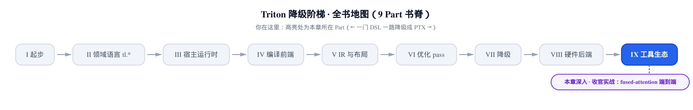
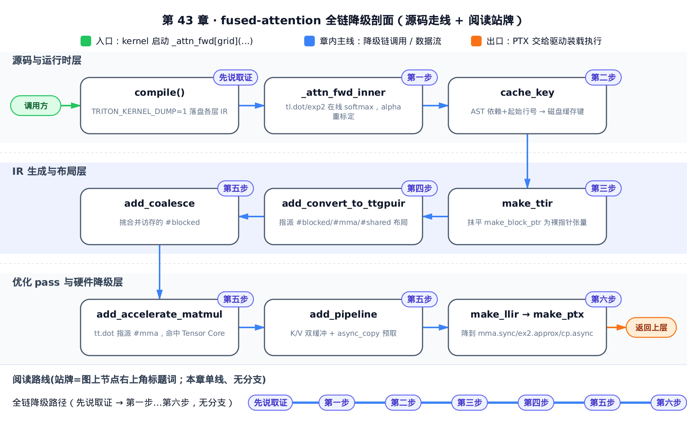
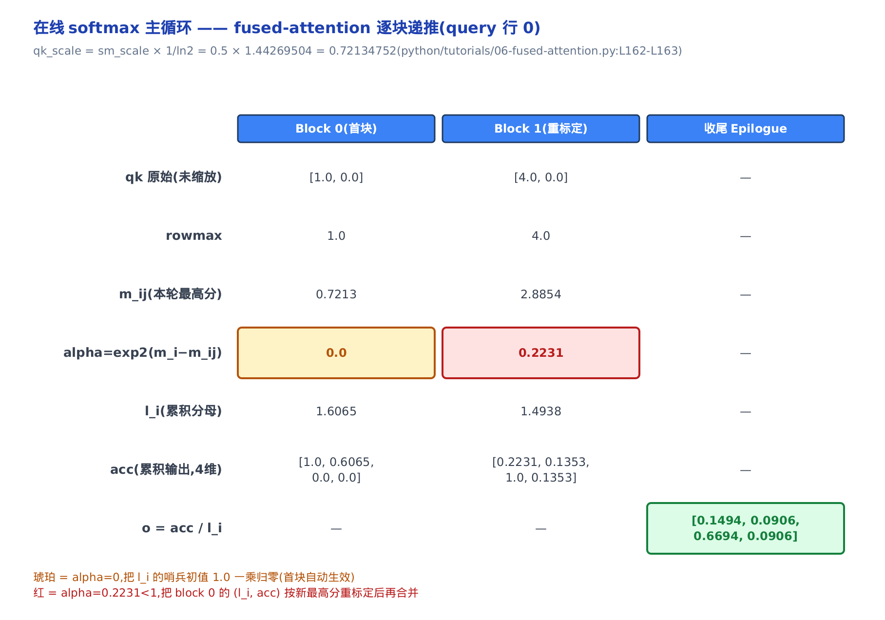
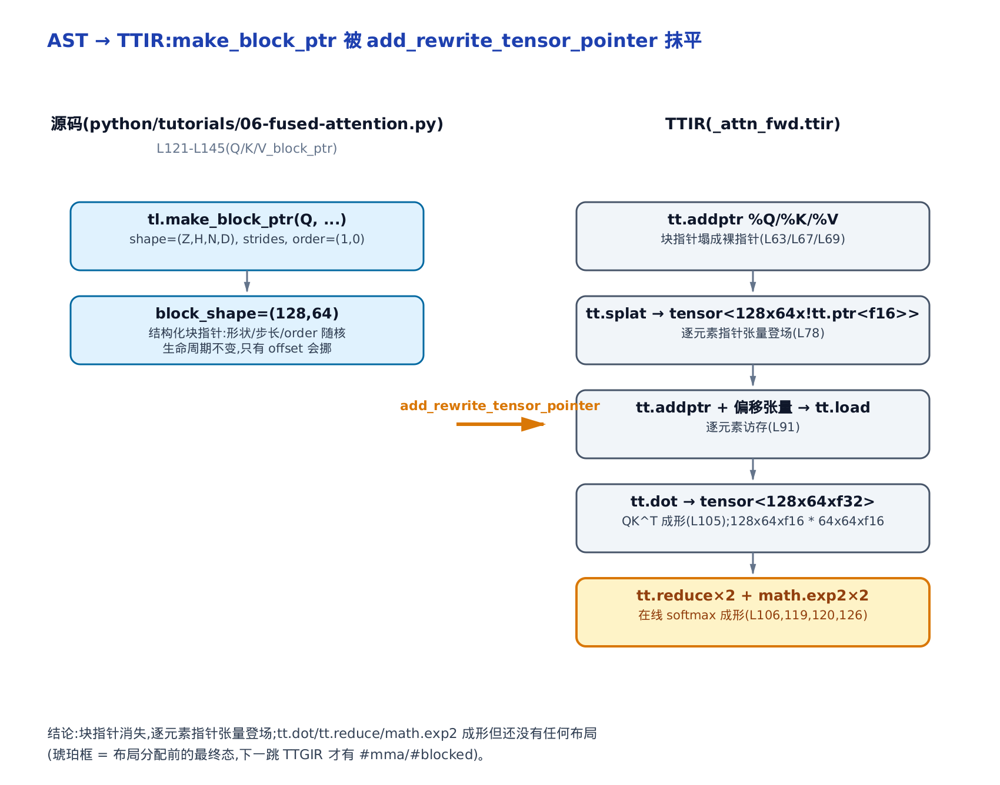
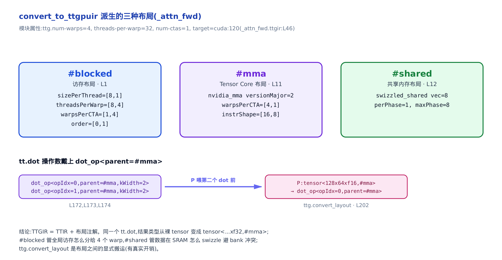
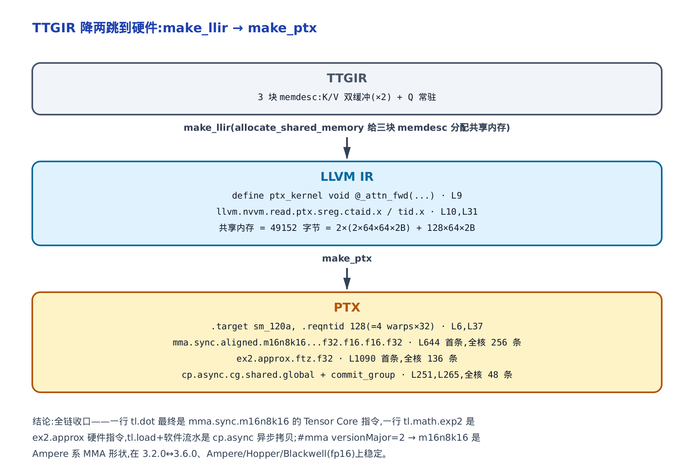

# 收官实战：fused-attention 从 tl.* 一路降到 PTX



> 你在这里：第 IX 部分 · 工具生态 · 全书最后一章。
> 前八部分：从 `tl.*` 表面一直降到 PTX，每层都单独拆过。
> 本章：把这九个部分在**同一个真核**上串起来跑一遍。

前四十二章像一排各自打磨的透镜：一章讲 `tl.dot` 怎么写，一章讲布局怎么指派，一章讲软件流水怎么建模。每一片单看都清楚，但读者心里总有个没落地的问题——**这些机制在一个真实的核上，到底是不是接力发生的？我改一行 `tl.*`，它一路会在哪几层 IR 上留下痕迹？**

这一章就把这些透镜叠成一根望远镜。标本是官方教程里的 Flash-Attention v2 前向核 `_attn_fwd`（`python/tutorials/06-fused-attention.py`）——一个你能实跑、能 dump、能逐层验尸的真核。我们对它设 `TRITON_KERNEL_DUMP=1`，把 TTIR（Triton 前端 IR）、TTGIR（带布局的 Triton GPU IR）、LLIR（LLVM IR）、PTX（NVIDIA 的虚拟汇编）四层 dump 全抓出来，然后一层一层指认：这一行在线 softmax，降到这层变成了什么，是哪个 pass 动的手。

**这章解锁的性能杠杆，是一份「验尸清单」**：读完你能对**自己的**核做同样的事——`TRITON_KERNEL_DUMP=1` 抓 dump，然后逐层查：我的 `tl.dot` 命中 Tensor Core 了吗（TTGIR 有没有 `#mma`、PTX 有没有 `mma.sync`）？我的 load 合并访存了吗（`#blocked` 的 `sizePerThread` 是几）？我的循环双缓冲了吗（有没有 `memdesc<2x...>` 和 `cp.async`）？我的 `exp` 落到硬件近似指令了吗（`ex2.approx`）？前四十二章教你每一项**为什么重要**，这一章教你**在 dump 里一眼认出它在不在**。

---



只想确认自己的 `tl.dot` 有没有吃到 Tensor Core，可以直接跳第四步和第五步「AccelerateMatmul」这一节看 `#mma` 布局怎么来、第六步看它落成的 `mma.sync`；关心软件流水的，跳第五步「Pipeliner」那一节；想完整跟一遍接力全程，就按顺序往下读。

## 先说取证：这些 dump 是怎么来的

正文接下来贴的每一段 IR 都是真机抓的，不是手写示意。抓法只有一个开关：给编译过程设 `TRITON_KERNEL_DUMP=1`。它落盘的机制，藏在编译总入口 `compile()` 那圈降级循环里。

先看入口怎么算缓存键、怎么开 dump：

```python
# python/triton/compiler/compiler.py:L217-L239
def compile(src, target=None, options=None):
    if target is None:
        target = driver.active.get_current_target()
    assert isinstance(target, GPUTarget), "target must be of GPUTarget type"
    backend = make_backend(target)
    ir_source = not isinstance(src, ASTSource)
    # create backend
    if ir_source:
        assert isinstance(src, str), "source must be either AST or a filepath"
        src = IRSource(src)
    extra_options = src.parse_options()
    options = backend.parse_options(dict(options or dict(), **extra_options))
    # create cache manager
    env_vars = get_cache_invalidating_env_vars()
    key = f"{triton_key()}-{src.hash()}-{backend.hash()}-{options.hash()}-{str(sorted(env_vars.items()))}"
    hash = hashlib.sha256(key.encode("utf-8")).hexdigest()
    fn_cache_manager = get_cache_manager(hash)
    # For dumping/overriding only hash the source as we want it to be independent of triton
    # core changes to make it easier to track kernels by hash.
    enable_override = os.environ.get("TRITON_KERNEL_OVERRIDE", "0") == "1"
    enable_ir_dump = os.environ.get("TRITON_KERNEL_DUMP", "0") == "1"
    fn_override_manager = get_override_manager(src.hash()) if enable_override else None
    fn_dump_manager = get_dump_manager(src.hash()) if enable_ir_dump else None
```

注意 `get_dump_manager(src.hash())`——dump 目录只用 `src.hash()`（**只哈希源码、不掺 triton 版本**）当键，所以你换了 triton 版本、只要核体没变，还能按同一个 hash 稳定找到它的各层 IR。这也是为什么本章的 dump 即便版本略有出入，落点仍可比对。

真正落盘发生在下面这段逐阶段循环——它就是**全章六步串讲的目录**：

```python
# python/triton/compiler/compiler.py:L261-L292
    # run compilation pipeline  and populate metadata
    stages = dict()
    backend.add_stages(stages, options)
    first_stage = list(stages.keys()).index(src.ext)
    # when the source is an IR file, don't apply the passes related to this stage.
    if ir_source:
        first_stage += 1
    context = ir.context()
    ir.load_dialects(context)
    backend.load_dialects(context)
    codegen_fns = backend.get_codegen_implementation()
    module_map = backend.get_module_map()
    try:
        module = src.make_ir(options, codegen_fns, module_map, context)
    except Exception as e:
        filter_traceback(e)
        raise
    # … 省略：USE_IR_LOC 定位快照分支 …
    for ext, compile_ir in list(stages.items())[first_stage:]:
        next_module = compile_ir(module, metadata)
        ir_filename = f"{file_name}.{ext}"
        # … 省略：TRITON_KERNEL_OVERRIDE 覆盖分支 …
        metadata_group[ir_filename] = fn_cache_manager.put(next_module, ir_filename)
        if fn_dump_manager is not None:
            fn_dump_manager.put(next_module, ir_filename)
        module = next_module
```

`stages` 是个**有序**字典，`add_stages` 按顺序往里塞五个阶段：

```python
# third_party/nvidia/backend/compiler.py:L384-L389
    def add_stages(self, stages, options):
        stages["ttir"] = lambda src, metadata: self.make_ttir(src, metadata, options)
        stages["ttgir"] = lambda src, metadata: self.make_ttgir(src, metadata, options, self.capability)
        stages["llir"] = lambda src, metadata: self.make_llir(src, metadata, options, self.capability)
        stages["ptx"] = lambda src, metadata: self.make_ptx(src, metadata, options, self.capability)
        stages["cubin"] = lambda src, metadata: self.make_cubin(src, metadata, options, self.capability)
```

循环每算出一层 `next_module`，就 `fn_dump_manager.put` 落一份到 `~/.triton/dump/<src.hash>/_attn_fwd.<ext>`。所以 `ttir → ttgir → llir → ptx` 这条链的每一跳，都会在磁盘上留一个完整快照。本章后面五节，就是沿这个字典顺序往下走。

> **一句版本声明（很重要，请别跳过）**：本章贴的 IR 片段抓自 triton 3.6.0 / `sm_120a`（Blackwell，`num_warps=4`、`num_stages=3`、`BLOCK_M=128`、`BLOCK_N=64`、`HEAD_DIM=64`、fp16、causal），而全书锚定的源码版本是 pin 的 3.2.0。二者细节数字（寄存器名、`loc` 行号、shared 字节数）会略有出入，但我们引用的都是**地标**——`tt.dot`、`#mma versionMajor=2`、`mma.sync.m16n8k16`、`ex2.approx`、`cp.async`——这些在 3.2.0↔3.6.0、Ampere/Hopper/Blackwell（fp16）之间是稳定的。请把 dump 当**地标勘测图**读，不要当逐字快照。另外，后文所有 IR 摘录里的 SSA 值名都已重命名为语义化短名以便阅读（如真机 dump 里的 `%q_28` 简写成 `%q`），且每行末尾的 `loc(#loc176)` 定位信息一律省去——**类型、属性、指令逐字未改**，完整的原始变量名与 `loc` 请对照你自己抓的 dump。

复现命令就一行（core 依赖 `TRITON_ALWAYS_COMPILE=1` 强制重编，原因下一节讲）：

```bash
TRITON_KERNEL_DUMP=1 TRITON_ALWAYS_COMPILE=1 python -c \
  "import test; test.test_op(...)"   # 跑 tutorials/06 的 test_op 即可
# dump 落到 ~/.triton/dump/<hash>/_attn_fwd.{ttir,ttgir,llir,ptx,cubin}
```

---

## 第一步：`tl.*` 表面——在线 softmax 主循环

**回指 [第 42 章：Flash-Attention 原理](../../ch42-primer-flash-attention/narrative/chapter.md)**——那一章推清了在线 softmax 为什么正确、为什么不溢出。这一章不重推，只把那几行数学在真核里认出来，然后看它一路降到哪。

### 直觉：边读边打分、随时纠偏的评委

把注意力想成一个**边读边打分、随时纠偏的评委**。K/V 序列太长，一次读不完，就分块喂进来。每读一块新 key，若发现新的最高分比之前记的更高，就把之前所有累积的分数按同一把新尺子缩小一点（这就是重标定因子 $`\alpha`$），再把新块加进来。这样两件事同时成立：永远不会因为某个超大分数把指数算爆（数值稳定），也永远不用把整张 $`N\times N`$ 的打分表摊在显存里。

递推本身是这几步（`m_i` 是 running rowmax、$`\ell_i`$ 是累积分母、`acc` 是累积输出，全部以 log2 为底）：

```math
m_{ij} = \max(m_i,\ \mathrm{rowmax}(qk)\cdot s), \quad
\alpha = 2^{\,m_i - m_{ij}}, \quad
\ell_i \leftarrow \ell_i\cdot\alpha + \textstyle\sum 2^{\,qk\cdot s - m_{ij}}, \quad
\mathrm{acc} \leftarrow \mathrm{acc}\cdot\alpha + 2^{\,qk\cdot s - m_{ij}}\cdot V
```

这里 `s` 是 `qk_scale`。重标定因子 $`\alpha`$ 是全部秘密：因为 `m_i` 沿 K 块单调非减，新最高分不小于旧值，所以 $`\alpha`$ 恒不大于 1，所有进 exp2 的指数都不为正，结果落在 0 与 1 之间——全程不溢出。

首块是个边界情况：`m_i` 初值为负无穷，于是 $`\alpha=0`$ 把哨兵值一次性清零；从第二块起 $`\alpha`$ 才真正落进 0 与 1 之间——下面的数值走查里 block 0 的 `alpha=0.0` 正是这个边界。

### 机制：一趟两块 K 的数值走查

取个最小非退化例子看它转起来：`HEAD_DIM=4`、`BLOCK_M=BLOCK_N=2`、`N_CTX=4`、`sm_scale=0.5`，追踪 query 行 0（`q=[1,0,1,0]`）。`qk_scale` 是源码里预乘出来的常数：

```python
# python/tutorials/06-fused-attention.py:L162-L163
    qk_scale = sm_scale
    qk_scale *= 1.44269504  # 1/log(2)
```

即 `qk_scale = 0.5 × 1.44269504 = 0.72134752`（为什么要预乘 $`1/\ln 2`$，第六步揭晓）。block 1 的 key 刻意跟 `q` 对齐，让它得分更高、真的触发一次 $`\alpha<1`$ 的重标定：

<!-- trace: m1-online-softmax-tl-surface -->

| 轮次 / K 块 | qk 原始(未缩放) | rowmax | m_ij(本轮最高分) | alpha | l_i(累积分母) | acc(累积输出，4 维) |
|---|---|---|---|---|---|---|
| 1 / block 0 | `[1.0, 0.0]` | `1.0` | `0.7213` | `0.0` | `1.6065` | `[1.0, 0.6065, 0.0, 0.0]` |
| 2 / block 1 | `[4.0, 0.0]` | `4.0` | `2.8854` | `0.2231` | `1.4938` | `[0.2231, 0.1353, 1.0, 0.1353]` |

怎么读这两行：

- **block 0（首块）**：`m_i` 初值是负无穷，所以 $`\alpha=2^{-\infty}=0`$，一乘就把 `l_i` 的哨兵初值 `1.0` 抹掉了（源码里 `l_i` 起手 `+1.0`，靠首块自动清零）。`acc` 从 0 起，直接吃第一块的 `p@v`（这里 `p` 就是递推公式里那个 `2^{qk·s − m_ij}` 指数项，源码里写作 `p = tl.math.exp2(qk)`，见本节末的主循环）。
- **block 1（重标定）**：新最高分 `2.8854 > 0.7213`，`m_i` 增长；$`\alpha=0.2231<1`$ 把上一轮的 `l_i` 和 `acc` 按同一把新尺子缩小，再加第二块——这一步就是在线 softmax 的核心。

（表里 `alpha`、`l_i` 两列只依赖 `qk` 分数，你能照上面递推公式手算复现；`acc` 列里 `alpha` 缩放的部分同样可复算，但 `p@v` 新增进来的部分依赖两块 `V` 的具体取值——这里为压缩例子把 `V_block0`/`V_block1` 的向量从略，`acc` 里这部分数字请直接采信。）

收尾（源码 `L184-L186`）：`acc /= l_i`、`M = m_i + log2(l_i)`。本例 `l_i=1.4938`，输出 `o = acc / l_i = [0.1494, 0.0906, 0.6694, 0.0906]`，`M = 2.8854 + log2(1.4938) = 3.4644`。图里把这两块的重标定画成了「琥珀→红」两格：



**不变量**：`m_i` 沿 K 块非减、上界为全序列最高打分，是个有界单调量，所以循环 `cdiv(N_CTX, BLOCK_N)`（`cdiv(a,b) = ` $`\lceil a/b \rceil`$，向上取整除法）步必停；每一步旧和乘 $`\alpha`$ 换算到新基准 `m_ij`、再加本块同基准的新和，两部分同基准，和仍是「前 t 块相对 `m_ij` 的精确未归一化和」。基准平移不改归一化后的商，故收尾 `acc/l_i` 与「对全序列一次性 softmax」逐位相等——分块只是省显存，不损精度。

**这买到了什么（性能落点）**：常驻累加器 `acc = BLOCK_M × HEAD_DIM = 128×64` f32 ≈ 32 KB（`128×64×4` 字节 = 32768 字节），**与 `N_CTX` 无关**；若物化整张 $`QK^\top`$，打个比方（下面两个 `N_CTX` 只是量级示意，与本章实抓的 dump 配置无关）：`N_CTX=1024` 时是 `128×1024` ≈ 512 KB（16× 于 `acc`），`N_CTX=8192` 时达 4 MB（128×）且随序列线性膨胀。主循环轮数 `= cdiv(1024, 64) = 16`，每轮两个 `tl.dot`。这就是 Flash-Attention 能吃长序列的原因。

### 源码：主循环本体

这些 `tl.*` 全在 `_attn_fwd_inner` 的主循环里。它每轮 `tl.load` 一块 K/V、`tl.dot` 算 $`qk`$、exp2 在线 softmax、`tl.dot(p, v, acc)` 累加，然后 `tl.advance` 把窗口沿序列维挪一格：

```python
# python/tutorials/06-fused-attention.py:L46-L77
    # loop over k, v and update accumulator
    for start_n in range(lo, hi, BLOCK_N):
        start_n = tl.multiple_of(start_n, BLOCK_N)
        # -- compute qk ----
        k = tl.load(K_block_ptr)
        qk = tl.dot(q, k)
        if STAGE == 2:
            mask = offs_m[:, None] >= (start_n + offs_n[None, :])
            qk = qk * qk_scale + tl.where(mask, 0, -1.0e6)
            m_ij = tl.maximum(m_i, tl.max(qk, 1))
            qk -= m_ij[:, None]
        else:
            m_ij = tl.maximum(m_i, tl.max(qk, 1) * qk_scale)
            qk = qk * qk_scale - m_ij[:, None]
        p = tl.math.exp2(qk)
        l_ij = tl.sum(p, 1)
        # -- update m_i and l_i
        alpha = tl.math.exp2(m_i - m_ij)
        l_i = l_i * alpha + l_ij
        # -- update output accumulator --
        acc = acc * alpha[:, None]
        # update acc
        v = tl.load(V_block_ptr)
        if fp8_v:
            p = p.to(tl.float8e5)
        else:
            p = p.to(tl.float16)
        acc = tl.dot(p, v, acc)
        # update m_i and l_i
        m_i = m_ij
        V_block_ptr = tl.advance(V_block_ptr, (BLOCK_N, 0))
        K_block_ptr = tl.advance(K_block_ptr, (0, BLOCK_N))
    return acc, l_i, m_i
```

（循环尾那两行 `p = p.to(...)` 里的 `fp8_v`，是外层按 `V.dtype.element_ty == tl.float8e5` 传进来的布尔值，决定喂给第二个 `tl.dot` 的 `p` 是转 fp8e5 还是 fp16——本章追的这份 dump 是 fp16 输入、走 `else` 分支，这个开关本身不影响后面的降级分析，可以放心跳过。）

窗口是外层建的——四个 `tl.make_block_ptr`（块指针，见 [第 7 章：块、形状与访存](../../ch07-blocks-shape-and-memory-access/narrative/chapter.md)）。这里正是那一章埋下那条写法的真实兑现：**`tl.advance` 沿 K/V 序列维滑窗时，窗口的 `block_shape`、`order`、`strides` 全程不变，只挪起点 `offset`**。`K_block_ptr` 每轮 `advance (0, BLOCK_N)` 沿 K 的序列维走，`V_block_ptr` 每轮 `advance (BLOCK_N, 0)` 沿 V 的序列维走——讲块指针那一章说「矩阵乘 / attention 主循环靠 `advance` 沿 K/序列维守恒滑窗」，就是这两行。

外层的建窗与两趟分派（off-band / on-band）在这里：

```python
# python/tutorials/06-fused-attention.py:L154-L189
    # initialize offsets
    offs_m = start_m * BLOCK_M + tl.arange(0, BLOCK_M)
    offs_n = tl.arange(0, BLOCK_N)
    # initialize pointer to m and l
    m_i = tl.zeros([BLOCK_M], dtype=tl.float32) - float("inf")
    l_i = tl.zeros([BLOCK_M], dtype=tl.float32) + 1.0
    acc = tl.zeros([BLOCK_M, HEAD_DIM], dtype=tl.float32)
    # load scales
    qk_scale = sm_scale
    qk_scale *= 1.44269504  # 1/log(2)
    # load q: it will stay in SRAM throughout
    q = tl.load(Q_block_ptr)
    # stage 1: off-band
    if STAGE & 1:
        acc, l_i, m_i = _attn_fwd_inner(acc, l_i, m_i, q, K_block_ptr, V_block_ptr,  #
                                        start_m, qk_scale,  #
                                        BLOCK_M, HEAD_DIM, BLOCK_N,  #
                                        4 - STAGE, offs_m, offs_n, N_CTX, V.dtype.element_ty == tl.float8e5  #
                                        )
    # stage 2: on-band
    if STAGE & 2:
        acc, l_i, m_i = _attn_fwd_inner(acc, l_i, m_i, q, K_block_ptr, V_block_ptr,  #
                                        start_m, qk_scale,  #
                                        BLOCK_M, HEAD_DIM, BLOCK_N,  #
                                        2, offs_m, offs_n, N_CTX, V.dtype.element_ty == tl.float8e5  #
                                        )
    # epilogue
    m_i += tl.math.log2(l_i)
    acc = acc / l_i[:, None]
    m_ptrs = M + off_hz * N_CTX + offs_m
    tl.store(m_ptrs, m_i)
    tl.store(O_block_ptr, acc.to(Out.type.element_ty))
```

`STAGE` 用位掩码分两趟：`STAGE & 1` 跑对角线以外的完整块（不用逐元素 mask），`STAGE & 2` 跑对角线上那一块（要 causal mask）。注意内层 `_attn_fwd_inner` 里的形参 `STAGE` 和外层这个 `STAGE` 是两个独立的量——外层按位掩码决定分派哪几趟，内层只看传进来的值是否等于 `2` 来决定这一趟要不要加 causal mask：off-band 趟传的是 `4 - STAGE`（恰好不等于 2，走无 mask 分支），on-band 趟直接传字面量 `2`（触发主循环里 `if STAGE == 2` 的 mask 分支）。`q` 一次 `tl.load` 进 SRAM（片上共享内存）常驻整个循环——这行 load 在第六步会变成一块常驻的 shared memory。记住这几个名字：两个 `tl.dot`、两个 `tl.math.exp2`、一个常驻 `q`、两条 `advance`。下面每一层，我们都回来点它们的名。

---

## 第二步：这个核怎么被特化、缓存键怎么算

**回指第 III 部分（[第 11 章：run 与 launch](../../ch11-run-launch-pipeline/narrative/chapter.md)）。** 上一节说复现要加 `TRITON_ALWAYS_COMPILE=1`，原因就在缓存键：triton 有两把锁串起来防重编，你不强制重编，第二次跑直接命中缓存、**根本不会走降级、也就没有 dump**。

第一把是**内存级钥匙**，同进程复用，在 `JITFunction.run` 里：

```python
# python/triton/runtime/jit.py:L580-L583
        bound_args, sig_and_spec, constexpr_vals, non_constexpr_vals, excess_kwargs = self.binder(*args, **kwargs)

        # compute cache key
        key = ''.join(sig_and_spec) + str((constexpr_vals, excess_kwargs))
        kernel = self.cache[device].get(key, None)
```

`sig_and_spec` 是签名 + 特化（specialization，比如指针 16 字节对齐、`N_CTX` 是不是 16 的倍数），`constexpr_vals` 是 `BLOCK_M`/`HEAD_DIM`/`STAGE` 这些编译期常量的具体值（constexpr，见 [第 4 章：tl.* 表面与 constexpr](../../ch04-tl-surface-and-constexpr/narrative/chapter.md)）。同一个核换一组 `BLOCK_M`，这把钥匙就变、触发一次新特化——这正是 `@triton.autotune` 遍历 config 的机制。

第二把是**磁盘级钥匙**，跨进程 / 跨机器复用，就是上一节 `compile()` 里那行 `sha256`：`hash = sha256(triton_key + src.hash + backend.hash + options.hash + env)`。关键在 `src.hash()` 里含 `fn.cache_key`：

```python
# python/triton/runtime/jit.py:L717-L725
    @property
    def cache_key(self):
        # TODO : hash should be attribute of `self`
        if self.hash is None:
            dependencies_finder = DependenciesFinder(name=self.__name__, globals=self.__globals__, src=self.src)
            dependencies_finder.visit(self.parse())
            self.hash = dependencies_finder.ret + str(self.starting_line_number)
            self.used_global_vals = dict(sorted(dependencies_finder.used_global_vals.items()))
        return self.hash
```

`DependenciesFinder` 遍历 AST 收集依赖、再拼上 `starting_line_number`（核在文件里的起始行号）。所以你**改一行核体、甚至只是往上挪几行**，`cache_key` 变、磁盘钥匙变、旧 cubin 作废、下次自动重编。反过来——核没动，`TRITON_ALWAYS_COMPILE=1` 就是你手动作废这把锁、逼它重走降级好抓 dump 的开关。

从这一步起，这个核被特化成了一份具体的 AST 源（`ASTSource`），带着确定的签名和 constexpr 值，交给 `make_ir` 生成第一层 IR。往下就是纯编译器的活了。

---

## 第三步：AST → TTIR——块指针被抹平

**回指第 IV 部分（[第 15 章：SSA 与结构化控制流](../../ch15-ssa-and-structured-control-flow/narrative/chapter.md)起）。** 第一跳 `make_ttir` 做的事，是把 Python/`tl` 表面语法降成 MLIR 的 `tt` 方言——但**还没有任何布局**。

### 直觉：前端便利糖在这里被拆掉

`tl.make_block_ptr` 是纯前端便利：一个带 `shape`/`strides`/`order` 的结构化块指针，让你写 `advance` 而不必手算偏移。到了 TTIR，这层糖被 `add_rewrite_tensor_pointer` 拆掉——块指针塌成裸的逐元素指针张量，`tl.load` 直接作用在 `tensor<128x64x!tt.ptr<f16>>` 上。同时 `tl.dot`/`tl.max`/`tl.sum`/`tl.math.exp2` 各自成形为 `tt.dot`/`tt.reduce`/`math.exp2`。

### 机制：pass 列表 + TTIR 地标

`make_ttir` 就是一串 MLIR pass，第二个就是抹平块指针的那个：

```python
# third_party/nvidia/backend/compiler.py:L188-L201
    @staticmethod
    def make_ttir(mod, metadata, opt):
        pm = ir.pass_manager(mod.context)
        pm.enable_debug()
        passes.common.add_inliner(pm)
        passes.ttir.add_rewrite_tensor_pointer(pm)
        passes.ttir.add_combine(pm)
        passes.common.add_canonicalizer(pm)
        passes.ttir.add_reorder_broadcast(pm)
        passes.common.add_cse(pm)
        passes.common.add_licm(pm)
        passes.common.add_symbol_dce(pm)
        passes.ttir.add_loop_unroll(pm)
        pm.run(mod)
        return mod
```

`add_inliner` 先把 `_attn_fwd_inner` 内联进 `_attn_fwd`（所以 TTIR 里看到两趟 `scf.for` 就是那两次 stage 调用）；`add_rewrite_tensor_pointer` 紧接着把 `make_block_ptr` 全抹平。dump 出来的地标是这样的（真机 TTIR 片段，以下几行摘自内联后的 `scf.for` 循环体内部，两层循环的外壳这里略去）：

```mlir
%qk = tt.dot %q, %k, %cst, inputPrecision = tf32 : tensor<128x64xf16> * tensor<64x64xf16> -> tensor<128x64xf32>
%m_ij = "tt.reduce"(%qk) <{axis = 1 : i32}> ({ ... tt.reduce.return ... })   // 在线 softmax 的 rowmax
%p = math.exp2 %qk : tensor<128x64xf32>
%l_ij = "tt.reduce"(%p) <{axis = 1 : i32}> ({ ... })                          // 在线 softmax 的 sum
%alpha = math.exp2 %m_i_minus_m_ij : tensor<128xf32>                          // 重标定因子
%acc = tt.dot %p, %v, %acc_in, inputPrecision = tf32 : ... -> tensor<128x64xf32>
```

（代码里 `tt.dot` 上那个 `inputPrecision = tf32` 是它的精度旋钮，`tf32`（TensorFloat-32，NVIDIA 的降精度累加模式）是这里的默认取值，对本核的 fp16 输入不生效，可直接跳过——本章不展开精度选择。）第一步里那两个 `tl.dot` 在这里就是两条 `tt.dot`，两个 `tl.math.exp2` 就是两条 `math.exp2`，`tl.max`/`tl.sum` 就是两条 `"tt.reduce"(axis=1)`。**注意这时 `tt.dot` 的类型是裸的 `tensor<128x64xf32>`——没有 `#mma`、没有 `#blocked`，布局是下一跳的事。** 而 `tl.make_block_ptr` 呢？在 dump 里已经找不到了，它变成了 `tt.splat` 出一整张指针张量、`tt.addptr` 加偏移、再 `tt.load`——这三步不在上面这段循环体摘录里，见下图把它们从块指针拆开的对照：



一句话记住这一跳：**语法降成 IR，算子成形，但张量还没「贴布局」。** 布局，是 TTGIR 才开始的事。

---

## 第四步：TTIR → TTGIR——三种布局登场

**回指第 V 部分（[第 20 章](../../ch20-layout-is-a-function/narrative/chapter.md)起，尤其 [第 23 章：LinearLayout](../../ch23-linear-layout/narrative/chapter.md)）。** 第二跳 `make_ttgir` 的头一个 pass `convert_to_ttgpuir` 干两件事：给模块打上 `num-warps`/`threads-per-warp`，并给每个张量**指派布局**。

### 直觉：TTGIR = TTIR + 布局注解

同一段 IR，现在每个张量类型后面多了个 `#...` 布局标签。布局回答的是「这张逻辑张量，物理上怎么摊到 4 个 warp × 32 线程 × 各自寄存器上」。这个核派生出三种：

- `#blocked`——**访存布局**，管全局内存怎么切给线程读（[第 21 章：Distributed 布局](../../ch21-distributed-layouts/narrative/chapter.md)）。
- `#mma`——**Tensor Core 布局**，`tt.dot` 的结果按 MMA（matrix-multiply-accumulate，Tensor Core 的矩阵乘累加）指令的碎片排布（[第 27 章：Tensor Core 与 MMA 布局](../../ch27-tensor-core-mma-layout/narrative/chapter.md)）。
- `#shared`——**共享内存布局**，带 swizzle（错位重排，避开 bank 冲突，见 [第 22 章：Shared 编码与 swizzle](../../ch22-shared-encoding-swizzle/narrative/chapter.md)）。

### 机制：pass 入口 + TTGIR 地标

`make_ttgir` 头几行就是布局指派入口和第一批优化 pass：

```python
# third_party/nvidia/backend/compiler.py:L215-L230
        # TTIR -> TTGIR
        pm = ir.pass_manager(mod.context)
        pm.enable_debug()
        passes.ttir.add_convert_to_ttgpuir(pm, f"cuda:{capability}", opt.num_warps, 32, opt.num_ctas)
        # optimize TTGIR
        passes.ttgpuir.add_coalesce(pm)
        if capability // 10 >= 8:
            passes.ttgpuir.add_f32_dot_tc(pm)
        # … 省略：PlanCTA / remove_layout_conversions / optimize_thread_locality …
        passes.ttgpuir.add_accelerate_matmul(pm)
        passes.ttgpuir.add_remove_layout_conversions(pm)
        passes.ttgpuir.add_optimize_dot_operands(pm, capability >= 80)
        passes.common.add_cse(pm)
```

`add_convert_to_ttgpuir(pm, "cuda:{capability}", opt.num_warps, 32, opt.num_ctas)`——`32` 就是 `threads-per-warp`。dump 出来，模块头和三种布局是这样的（真机 TTGIR，节选）：

```mlir
#blocked = #ttg.blocked<{sizePerThread = [8, 1], threadsPerWarp = [8, 4], warpsPerCTA = [1, 4], order = [0, 1]}>
#mma = #ttg.nvidia_mma<{versionMajor = 2, versionMinor = 0, warpsPerCTA = [4, 1], instrShape = [16, 8]}>
#shared = #ttg.swizzled_shared<{vec = 8, perPhase = 1, maxPhase = 8, order = [1, 0]}>
module attributes {"ttg.num-ctas" = 1 : i32, "ttg.num-warps" = 4 : i32, ttg.target = "cuda:120", "ttg.threads-per-warp" = 32 : i32} {
  %q = ttg.local_load %q_shared : !ttg.memdesc<128x64xf16, #shared, #smem> -> tensor<128x64xf16, #ttg.dot_op<{opIdx = 0, parent = #mma, kWidth = 2}>>
  %qk = tt.dot %q, %k, %cst, inputPrecision = tf32 : ... -> tensor<128x64xf32, #mma>
  %p = ttg.convert_layout %p_mma : tensor<128x64xf16, #mma> -> tensor<128x64xf16, #ttg.dot_op<{opIdx = 0, parent = #mma, kWidth = 2}>>
```

第三步里那条裸的 `tt.dot -> tensor<128x64xf32>`，现在结果类型变成了 `tensor<128x64xf32, #mma>`，两个操作数戴上了 `#ttg.dot_op<{parent = #mma}>`（其中 `kWidth = 2` 是每个操作数每次打包读取的元素宽度，也是这个 `dot_op` 布局携带的信息之一，这里不展开）。还多了一个第三步没有的算子——`ttg.convert_layout`：它把 `p`（第一个 dot 出来是 `#mma` 布局）显式转成 `dot_op` 布局，好喂给第二个 dot（P·V）。**这个 `convert_layout` 不是免费的，它是布局之间的真实数据搬运**，第 V 部分整章在讲怎么少插它。



到这里，「谁算什么」已经定了（`#mma` 意味着走 Tensor Core），但「怎么高效地喂数据、怎么和访存重叠」还没优化。那是下一步三个 pass 的活。

---

## 第五步：Coalesce / AccelerateMatmul / Pipeliner——各改一处

**回指第 VI 部分。** 上一步的布局刚指派完，`make_ttgir` 后半段一串优化 pass 接着上。本章只挑三个在这个核上留下**可指认痕迹**的，一人一处。

一句话摆正这三个 pass 的分工：上一步 TTIR→TTGIR 定的是「谁算什么」，接下来这三个 pass 定的是「怎么算得快」——各管一件事，合不合并访存（Coalesce）、上不上 Tensor Core（AccelerateMatmul）、流不流水（Pipeliner）。

### Coalesce——选出访存合并的 `#blocked`

`passes.ttgpuir.add_coalesce`（`third_party/nvidia/backend/compiler.py:L220`）看 `tl.load` 的访存模式，挑一个让**相邻线程读相邻地址**的 `#blocked`。地标就是上一步那行 `#blocked`（见上一步 TTGIR 摘录）里的 `sizePerThread = [8, 1]`——每个线程一次连续搬 8 个元素，凑成一次宽访存。见 [第 25 章：AxisInfo 与 Coalesce](../../ch25-axisinfo-coalesce/narrative/chapter.md)。这直接决定你这个核吃不吃满显存带宽。

### AccelerateMatmul——把 `tt.dot` 指派 `#mma`

`passes.ttgpuir.add_accelerate_matmul`（`L227`）就是上一步让 `tt.dot` 结果变成 `tensor<...xf32, #mma>`、操作数戴 `dot_op`（见上一步 TTGIR 摘录）的那只手——把一个平平无奇的矩阵乘**改写成走 Tensor Core**。地标是 `#mma = nvidia_mma versionMajor=2, instrShape=[16,8]`。见 [第 28 章：AccelerateMatmul 与布局最优化](../../ch28-accelerate-matmul-layout-opt/narrative/chapter.md)。你的 dot 命不命中 Tensor Core，就看这个 pass 有没有给它贴上 `#mma`。

### Pipeliner——K/V load 做成双缓冲 + 异步预取

`passes.ttgpuir.add_pipeline`（在 `capability >= 8` 分支内）是软件流水（software pipelining）：

```python
# third_party/nvidia/backend/compiler.py:L239-L241
            passes.ttgpuir.add_pipeline(pm, opt.num_stages)
            passes.ttgpuir.add_ws_lowering(pm, opt.num_consumer_groups)
        passes.ttgpuir.add_prefetch(pm)
```

（同块紧邻的 `add_ws_lowering` 是给 warp-specialization（warp 分工，让不同 warp 分别专职搬运或计算）场景做的降级 pass，`_attn_fwd` 没用到这个特性，`num_consumer_groups` 为 0，这里出现只因它和 `add_pipeline` 同属 pipelining 分支，可跳过。）它拿 `num_stages`（本次捕获是 3）把主循环里「搬下一块 K/V」和「算这一块」重叠起来。dump 里的痕迹最好认——K/V 的 `local_alloc` 首维变成 2（双缓冲），配上异步拷贝：

```mlir
%k_buf = ttg.local_alloc : () -> !ttg.memdesc<2x64x64xf16, #shared1, #smem, mutable>   // 双缓冲，首维 2
%v_buf = ttg.local_alloc : () -> !ttg.memdesc<2x64x64xf16, #shared, #smem, mutable>
%k_stage = ttg.memdesc_index %k_buf[%c0_i32] : ... -> !ttg.memdesc<64x64xf16, ...>
%k_async = ttg.async_copy_global_to_local %k_ptr, %k_stage mask %m : tensor<64x64x!tt.ptr<f16>, #blocked> -> <64x64xf16, ...>   // 异步 global→shared
```

`memdesc<2x64x64>` 的首维 `2` 就是双缓冲槽，`async_copy_global_to_local` 把 K/V 从全局内存**异步**搬进共享内存、不占寄存器、和当前这轮的 `tt.dot` 重叠跑。见 [第 29 章：软件流水线 primer](../../ch29-software-pipelining-primer/narrative/chapter.md) 与 [第 30 章：软件流水线落地](../../ch30-software-pipelining-landing/narrative/chapter.md)。你调 `num_stages` 到底调了什么，看的就是这个首维和 `cp.async` 的条数。

![三个 TTGIR 优化 pass 各在 _attn_fwd 留一处痕迹：Coalesce 选 #blocked sizePerThread=[8,1]、AccelerateMatmul 把 tt.dot 改成结果 #mma、Pipeliner 把 K/V load 做成 memdesc<2x64x64> 双缓冲 + async_copy 异步预取](../diagrams/fig-m5-three-passes-each-touch.png)

三处，三个 pass，三个性能维度：Coalesce 管**带宽**、AccelerateMatmul 管**算力**、Pipeliner 管**延迟隐藏**。第 VI 部分整整三章讲透的东西，在这个核上就是这三行 IR。

---

## 第六步：TTGIR → LLVM → PTX——落到硬件指令

**回指第 VII 部分（[第 32 章](../../ch32-five-stages-ttir-to-ttgir/narrative/chapter.md)起，含 [第 34 章：共享内存降级](../../ch34-shared-memory-lowering-vectorization/narrative/chapter.md)）。** 最后两跳，`make_llir` 把 TTGIR 降成 LLVM IR，`make_ptx` 再降成 PTX。

### 直觉：布局注解兑现成真实指令

前面所有的 `#mma`、`memdesc`、`async_copy` 到这里都要兑现成硬件能执行的东西：`#mma` 的 `tt.dot` → `mma.sync` Tensor Core 指令；`async_copy` → `cp.async` 异步拷贝指令；共享内存的 `memdesc` → 真实的字节偏移；`tl.math.exp2` → `ex2.approx` 硬件近似指令。

### 机制：allocate_shared_memory + to_llvmir，再到 PTX

`make_llir` 里两个关键 pass：`allocate_shared_memory` 给每块 `local_alloc` 分配共享内存字节偏移，`to_llvmir` 把 TTGIR op 逐个降成 LLVM/NVVM：

```python
# third_party/nvidia/backend/compiler.py:L273-L278
        nvidia.passes.ttgpuir.add_decompose_unsupported_conversions(pm)
        passes.ttgpuir.add_combine_tensor_select_and_if(pm)
        passes.convert.add_scf_to_cf(pm)
        passes.convert.add_index_to_llvmir(pm)
        passes.ttgpuir.add_allocate_shared_memory(pm)
        nvidia.passes.ttgpuir.add_to_llvmir(pm, capability, ptx_version)
```

（前四个 pass——`add_decompose_unsupported_conversions`、`add_combine_tensor_select_and_if`、`add_scf_to_cf`、`add_index_to_llvmir`——处理控制流与索引到 LLVM 方言的常规降级，属脚手架工序，本章只挑其中真正在 dump 里留下可指认痕迹的后两个讲。）`add_allocate_shared_memory` 把上一步那三块 `memdesc`（K 双缓冲 + V 双缓冲 + Q 常驻）落成具体字节：本次捕获是 `2×(2×64×64×2B) + 128×64×2B = 49152` 字节。共享内存怎么分配、怎么加屏障，见 [第 26 章：共享内存分配与屏障](../../ch26-shared-memory-allocation-membar/narrative/chapter.md)；怎么降级成 `cp.async`、怎么向量化，见 [第 34 章：共享内存降级](../../ch34-shared-memory-lowering-vectorization/narrative/chapter.md)。LLIR dump 里，核签名变成 `ptx_kernel`，`program_id` 变成 NVVM intrinsic，异步拷贝变成 inline-asm：

```llvm
define ptx_kernel void @_attn_fwd(ptr addrspace(1) %0, ptr addrspace(1) %1, ...) {
  %23 = tail call i32 @llvm.nvvm.read.ptx.sreg.ctaid.x()   ; = program_id(0)
  %42 = tail call i32 @llvm.nvvm.read.ptx.sreg.tid.x()     ; = 线程号
  tail call void asm sideeffect "cp.async.cg.shared.global [ $0 + 0 ], [ $1 + 0 ], 0x10, $2;", ...
  tail call void @llvm.nvvm.cp.async.commit.group()
}
```

`make_ptx` 再降一跳到最终 PTX。这是全链收口，第一步埋的每个名字都在这里兑现（真机 PTX，节选）：

```ptx
.version 8.8
.target sm_120a
.extern .shared .align 16 .b8 global_smem[];
.visible .entry _attn_fwd(...)
.reqntid 128                    // = 4 warps × 32
    ...
    mma.sync.aligned.m16n8k16.row.col.f32.f16.f16.f32 {...}, {...}, {...}, {...};   // tt.dot 落点
    cp.async.cg.shared.global [ %r716 + 0 ], [ %rd35 + 0 ], 0x10, %r95;             // async_copy 落点
    cp.async.commit_group;
    ex2.approx.ftz.f32  %r560, %r493;                                               // tl.math.exp2 落点
```

三条硬件指令，对上三个源头：

- 两个 `tl.dot` → 全核 **256 条** `mma.sync.aligned.m16n8k16`。这就是第一步埋的伏笔——`instrShape=[16,8]` 的 `#mma versionMajor=2` 在这里落成 `m16n8k16`。**关键点：即便 target 是 `sm_120a`（Blackwell），这个 fp16 dot 仍走 Ampere 系的 `mma.sync`，而非第五代的 `tcgen05`**（`tcgen05`：Blackwell 引入的第五代 Tensor Core 指令族，本书未展开，这里只需知道它和 `mma.sync` 是同类但更新的另一条路，可安全跳过）——`AccelerateMatmul` 按 dtype/形状/capability 选 MMA 版本，`fp16×fp16→f32、[16,8]` 这个经典组合就落到 `mma.sync`。这也正是本章地标在 3.2.0↔3.6.0、跨三代架构稳定的原因。
- 两个 `tl.math.exp2` → 全核 **136 条** `ex2.approx.ftz.f32`。**现在回答第一步的悬念**：源码为什么把 `qk_scale` 预乘 `1.44269504`（=$`1/\ln 2`$）、用 exp2 而不用 exp？因为 GPU 有 `ex2.approx` 这条单周期硬件指令，比 `exp` 快得多；把 scale 折进底数换成 $`2^x`$，softmax 就能直接吃这条指令。一行 `tl.math.exp2` = 一条 `ex2.approx`，这是 `tl.*` 到 PTX 最干净的一一对应。
- `async_copy` → 全核 **48 条** `cp.async.cg.shared.global` + `cp.async.commit_group`，就是 Pipeliner 那套双缓冲异步预取的硬件兑现。



从 `.version` 到 `.entry _attn_fwd`，这份 PTX 就是驱动最终喂给 GPU 的东西（再往下 `make_cubin` 汇编成二进制）。一根 `tl.dot`，六跳之后，是一条 Tensor Core 指令。

---

## 收官：这根望远镜，现在归你

我们在**一个真核**上把九个部分串完了。倒着看一遍这条脊柱，就是一份你能立刻用的验尸清单：

| 你在 dump 里找什么 | 落在哪层 | 说明它 | 前情 |
|---|---|---|---|
| `tt.dot` / `math.exp2` / `tt.reduce` | TTIR | 算子成形、还没布局 | 第 III–IV 部分 |
| `#blocked` 的 `sizePerThread` | TTGIR | 访存合不合并（带宽） | [第 25 章](../../ch25-axisinfo-coalesce/narrative/chapter.md) |
| `#mma` / `dot_op` | TTGIR | dot 命不命中 Tensor Core（算力） | [第 28 章](../../ch28-accelerate-matmul-layout-opt/narrative/chapter.md) |
| `memdesc<2x...>` / `async_copy` | TTGIR | 循环有没有双缓冲（延迟隐藏） | [第 29](../../ch29-software-pipelining-primer/narrative/chapter.md)–[30 章](../../ch30-software-pipelining-landing/narrative/chapter.md) |
| `mma.sync.m16n8k16` | PTX | dot 的最终 Tensor Core 指令 | [第 35 章](../../ch35-dot-elementwise-reduce-ptx-exit/narrative/chapter.md) |
| `ex2.approx.ftz` | PTX | exp2 的硬件近似指令 | [第 35 章](../../ch35-dot-elementwise-reduce-ptx-exit/narrative/chapter.md) |
| `cp.async.cg.shared.global` | PTX | 软件流水的异步拷贝 | [第 34 章](../../ch34-shared-memory-lowering-vectorization/narrative/chapter.md) |

前四十二章教你每一项**为什么重要**、写 kernel 时该怎么权衡；这一章教你**在自己核的 dump 里一眼认出它在不在**。下次你的算子慢了，别再盲猜——给它设 `TRITON_KERNEL_DUMP=1`（落盘机制就是 `python/triton/compiler/compiler.py` 里 `add_stages` 那圈逐阶段循环），照着这张表逐层看：布局对不对、dot 上没上 Tensor Core、循环有没有流水。标本 `python/tutorials/06-fused-attention.py` 的 `_attn_fwd` 能这么验尸，你自己的核也一样。从「一门 DSL」到「一路降级成 PTX」，这条路你现在能自己走完，也能自己回头验尸。全书到此闭环。
