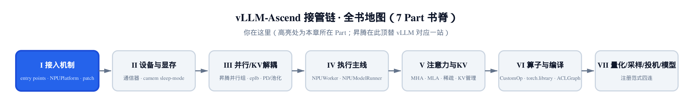
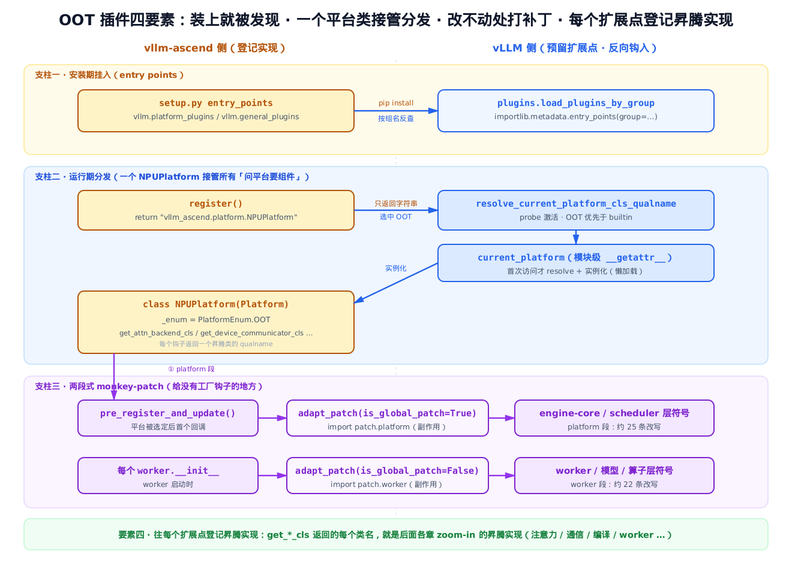
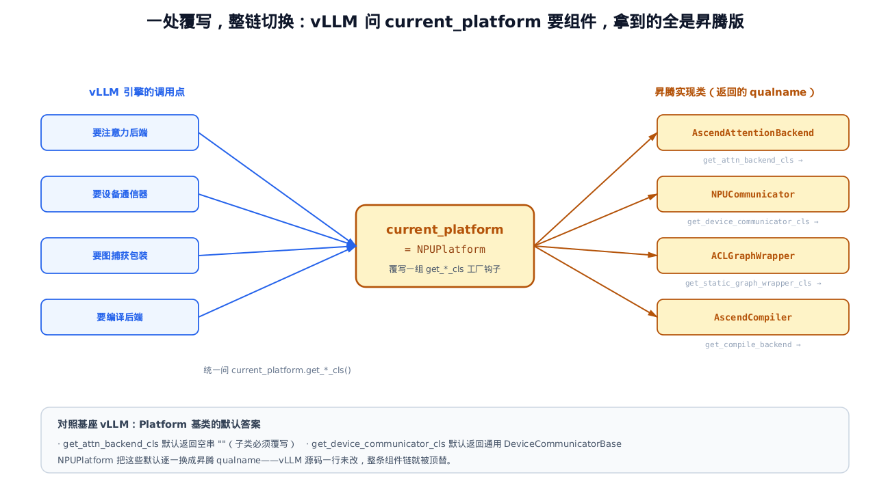
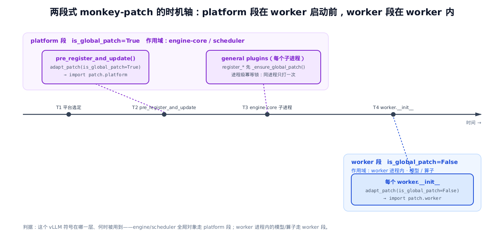

# 第 1 章 鸟瞰：一个不改 vLLM 却接管整条执行路径的 OOT 插件



> **你在这里**——全书的开篇鸟瞰。
> 上一章没有，这是第一站。
> 本章把心智模型搭起来：一个装在 vLLM 之外的包，凭什么接管整条执行路径。
> 下一章起，我们顺着这套机制逐站 zoom-in。

---

先看一件几乎不讲道理的事。

你在一台昇腾 NPU 机器上敲下 `pip install vllm-ascend`，然后照常 `vllm serve` 起一个模型。vLLM 的源码你一行没动——它里面根本没有 `vllm_ascend` 这个名字。可是模型跑起来之后，注意力算的是昇腾的 kernel，卡间通信走的是昇腾的 HCCL，图捕获用的是昇腾的 ACLGraph，连 worker 进程都换成了昇腾版。整套原本为 CUDA 写的执行路径，被一个「外人」从头到尾顶替了。

这就是 **out-of-tree（OOT，源码树外）插件**的魔法：vllm-ascend 不 fork vLLM、不改 vLLM 一行源码，而是作为一个独立的 pip 包挂在旁边，却能让 vLLM 每一站都改用昇腾实现。

它是怎么做到的？说穿了，整套接入的「声明」其实只落在 `setup.py`、`vllm_ascend/__init__.py`、`vllm_ascend/platform.py` 这几处、几十行代码里。本章不逐行抠源码——那是后面 29 章的事。本章只做一件事：**把这套机制的骨架立起来**，让你带着一张地图去读后面每一章。我们会挑三个最小的真实源码锚点，把「魔法」拆成四个可以说清的动作。

## 1.1 一句话心智模型：四个要素

先给结论。整套 OOT 接管，可以压缩成一句话：

> **装上就被发现（entry points）+ 一个平台类接管分发（NPUPlatform）+ 改不动的地方两段式打补丁（monkey-patch）+ 往每个扩展点登记昇腾实现。**

这四个要素不是并列的四件事，而是一条链：前一个是后一个的前提。它们分别落在 `setup.py`（声明）、`vllm_ascend/platform.py`（分发）、`vllm_ascend/patch/__init__.py`（打补丁）三处真源码上，全貌就是下面这张图——本章剩下的篇幅，都在解释这张图的每一格。



*图 1-1　左列是 vllm-ascend「登记实现」，右列是 vLLM「预留的扩展点」。安装期把自己写进包元数据（支柱一）；启动期 vLLM 反查、选中、懒加载出一个 NPUPlatform（支柱二）；对没有工厂钩子的地方，两段式打补丁（支柱三）；而每个钩子返回的类名，就是后面各章要展开的昇腾实现（要素四）。*

看图的关键是抓住**方向**：不是 vllm-ascend 主动去改 vLLM，而是 vLLM 处处留好了「接收口」，vllm-ascend 只是往这些口子里登记自己。所有权始终在 vLLM 手里，昇腾是被它**反向钩进来**的。这就是「不改一行源码」的底气所在。

下面三节，一根支柱一节。

## 1.2 支柱一：装上就被发现（entry points）

故事从打包开始。vllm-ascend 在 `setup.py` 里声明了两组 setuptools entry points：

```python
# setup.py:L540-L549
    entry_points={
        "vllm.platform_plugins": ["ascend = vllm_ascend:register"],
        "vllm.general_plugins": [
            "ascend_kv_connector = vllm_ascend:register_connector",
            "ascend_model_loader = vllm_ascend:register_model_loader",
            "ascend_service_profiling = vllm_ascend:register_service_profiling",
            "ascend_model = vllm_ascend:register_model",
        ],
    },
)
# … 省略：setup.py 前面数百行是 AscendC 自定义算子的 CMake 构建脚手架，与「插件如何被发现」无关 …
```

`entry_points` 是 Python 打包规范里的一张「广告牌」。`pip install` 时，setuptools 把这些声明写进包元数据（`*.dist-info` 里的 `entry_points.txt`）。任何程序都能用标准库 `importlib.metadata` 按**组名**去反查「谁在这个组里登记过」。

vLLM 约定了两个组名，正好对上这两组：

- **`vllm.platform_plugins`**——「我是一个平台后端」。这里只登记一条 `ascend = vllm_ascend:register`：组名 `ascend` 指向 `vllm_ascend` 包的 `register` 函数。它决定**用哪个平台**。
- **`vllm.general_plugins`**——「我要在每个进程里额外跑一些注册」。这里四条，分别指向 KV connector、模型加载器、profiling、模型的注册回调。它决定**在进程里额外挂哪些扩展**。

注意 entry point 写的是 `vllm_ascend:register` 这个**符号路径**，不是被执行的代码。安装期什么都没发生，只是把「将来想被找到」记进了元数据。

vLLM 侧的「接收口」在 `vllm/plugins/__init__.py`：

```python
# vllm/plugins/__init__.py:L28-L66
def load_plugins_by_group(group: str) -> dict[str, Callable[[], Any]]:
    """Load plugins registered under the given entry point group."""
    from importlib.metadata import entry_points

    allowed_plugins = envs.VLLM_PLUGINS

    discovered_plugins = entry_points(group=group)
    if len(discovered_plugins) == 0:
        logger.debug("No plugins for group %s found.", group)
        return {}
    # … 省略：一段纯日志，打印发现到的插件清单、是否受 VLLM_PLUGINS 白名单过滤 …

    plugins = dict[str, Callable[[], Any]]()
    for plugin in discovered_plugins:
        if allowed_plugins is None or plugin.name in allowed_plugins:
            # … 省略 日志：打印正在加载的插件名 …
            try:
                func = plugin.load()
                plugins[plugin.name] = func
            except Exception:
                logger.exception("Failed to load plugin %s", plugin.name)

    return plugins
```

整段的关窍就一句 `entry_points(group=group)`——用标准库按组名发现第三方插件，`plugin.load()` 拿到回调函数对象。（开头那行 `allowed_plugins = envs.VLLM_PLUGINS`：`envs` 是 vLLM 的环境变量模块，`VLLM_PLUGINS` 可显式指定只加载哪些插件，默认 `None` 即全部放行。）**这一句就是整个 OOT 机制的物理基础**：vLLM 没有写死任何硬件后端的名字，而是留了一个「谁登记过就用谁」的标准发现点。昇腾把自己登记进去，就被 vLLM 反向钩了进来。

这就是要素一「装上就被发现」的全部：**声明在包元数据里，发现靠 `importlib.metadata`，双方只约定组名，谁都不认识谁的源码**。这两组 entry point 从被发现到真正生效的完整旅程，是 [第 2 章](../ch02-entry-points-and-npuplatform/narrative/chapter.md) 的主线。

## 1.3 支柱二：一个平台类接管所有分发（NPUPlatform）

这一节我们只快速扫过一条链：vLLM 问平台 → 平台懒加载解析出一个类 → 这个类的一组 `get_*_cls` 钩子逐一吐回昇腾实现——沿途只点破每一步的设计意图，不逐行抠源码（那是后面各章的事）。下面接连几个代码块，看的是「形态」而非细节。

被发现之后呢？`platform_plugins` 组那条 `ascend = vllm_ascend:register`，指向的 `register` 函数小到出奇：

```python
# vllm_ascend/__init__.py:L40-L43
def register():
    """Register the NPU platform."""

    return "vllm_ascend.platform.NPUPlatform"
```

它只返回一个**字符串**——昇腾平台类的 qualname（全限定类名）。为什么不直接 `import NPUPlatform` 返回类对象？因为 vLLM 侧对 `current_platform` 的解析是**懒加载**的，其中的注释把原因写得很清楚：

```python
# vllm/platforms/__init__.py:L262-L281
def __getattr__(name: str):
    if name == "current_platform":
        # lazy init current_platform.
        # 1. out-of-tree platform plugins need `from vllm.platforms import
        #    Platform` so that they can inherit `Platform` class. Therefore,
        #    we cannot resolve `current_platform` during the import of
        #    `vllm.platforms`.
        # … 省略：注释 2 解释 import vllm 期间内部代码可能提前访问 current_platform …
        global _current_platform
        if _current_platform is None:
            platform_cls_qualname = resolve_current_platform_cls_qualname()
            _current_platform = resolve_obj_by_qualname(platform_cls_qualname)()
            global _init_trace
            _init_trace = "".join(traceback.format_stack())
        return _current_platform
    # … 省略：__getattr__ 其余分支（转发 globals() / 抛 AttributeError）…
```

注释点破了一个循环依赖：OOT 平台类要 `from vllm.platforms import Platform` 来**继承** vLLM 的基类，所以在 `vllm.platforms` 这个模块自己 import 的过程中，是**不能**去 resolve 平台的——否则成环。于是 `register()` 只敢返回字符串，把真正的 `import vllm_ascend.platform`（连带把 `torch_npu` 整个 NPU 运行时拉起来）推迟到最后一刻。

这个「懒加载单例」值得看清楚它跑两次会发生什么：

| 访问序号 | `_current_platform` 访问前 | 动作 | 访问后 | 返回 |
|---|---|---|---|---|
| 第 1 次 | `None` | resolve qualname → `resolve_obj_by_qualname(...)()` 实例化 | NPUPlatform 实例 | 该实例 |
| 第 2 次 | 非 `None` | `if` 判假，跳过 resolve 与实例化 | 不变 | **同一个**实例 |

一句话归纳它为什么只解析一次：`_current_platform` 是一个**单调的一次性写入量**——初值 `None`，第一次访问后被写成实例便再不回头，`if _current_platform is None` 这道门从此永远为假。所以整个进程里，`current_platform` 指的永远是同一个 NPUPlatform 实例。

那 vLLM 是怎么在一堆平台里**选中**昇腾的？答案在 `resolve_current_platform_cls_qualname`：

```python
# vllm/platforms/__init__.py:L212-L252（择要）
def resolve_current_platform_cls_qualname() -> str:
    platform_plugins = load_plugins_by_group(PLATFORM_PLUGINS_GROUP)

    activated_plugins = []

    for name, func in chain(builtin_platform_plugins.items(), platform_plugins.items()):
        try:
            assert callable(func)
            platform_cls_qualname = func()
            if platform_cls_qualname is not None:
                activated_plugins.append(name)
        except Exception:
            pass
    # … 省略：算出 activated_builtin_plugins 与 activated_oot_plugins 两个集合 …

    if len(activated_oot_plugins) >= 2:
        raise RuntimeError(...)          # 只允许一个 OOT 平台
    elif len(activated_oot_plugins) == 1:
        platform_cls_qualname = platform_plugins[activated_oot_plugins[0]]()
        logger.info("Platform plugin %s is activated", activated_oot_plugins[0])
    # … 省略：都没 OOT 激活时，回退到 builtin（cuda/rocm/…）或 UnspecifiedPlatform …
    return platform_cls_qualname
```

vLLM 把 builtin 平台（cuda/rocm/tpu/xpu/cpu）和 OOT 插件的回调**都 probe 一遍**：谁返回非 `None` 就算「激活」。昇腾的 `register()` 永远返回字符串，所以**恒激活**；而且判定顺序上 OOT 优先于 builtin——只要恰好一个 OOT 平台激活，就用它。在 NPU 机器上，选中的就是 `"vllm_ascend.platform.NPUPlatform"`。注意到这里为止，还**没有 import 昇腾的任何代码**，手里只有一个类名字符串。

被实例化出来的 `NPUPlatform`，长这样：

```python
# vllm_ascend/platform.py:L134-L186（类头 + 一个回调，中间为同类覆写，省略）
class NPUPlatform(Platform):
    _enum = PlatformEnum.OOT
    device_name: str = "npu"
    device_type: str = "npu"
    simple_compile_backend: str = "eager"  # Disable torch.compile()
    ray_device_key: str = "NPU"
    device_control_env_var: str = "ASCEND_RT_VISIBLE_DEVICES"
    ray_noset_device_env_vars: list[str] = [
        "RAY_EXPERIMENTAL_NOSET_ASCEND_RT_VISIBLE_DEVICES",
    ]
    dispatch_key: str = "PrivateUse1"
    # … 省略：supported_quantization 列表、is_sleep_mode_available、pass_key、
    #         get_pass_manager_cls / get_compile_backend 等一批同类覆写 …

    @classmethod
    def pre_register_and_update(cls, parser: FlexibleArgumentParser | None = None) -> None:
        # Adapt the global patch here.
        from vllm_ascend.utils import adapt_patch

        adapt_patch(is_global_patch=True)
        # … 省略：把 "ascend" 塞进 --quantization CLI choices、按芯片型号导入量化配置等 …
```

两点值得停一下。

第一，`_enum = PlatformEnum.OOT` 是昇腾的「树外」身份证——正是它让上面那段 `resolve_*` 把 NPUPlatform 归进 `activated_oot_plugins` 并优先选中。紧接着一批类属性（`device_name` / `dispatch_key` / `device_control_env_var`…）是一次**身份替换**：把 vLLM 眼里的「设备」整套换成昇腾口径（比如可见设备的环境变量从 `CUDA_VISIBLE_DEVICES` 换成 `ASCEND_RT_VISIBLE_DEVICES`）。

第二，`pre_register_and_update` 是平台被选定后 vLLM 回调的**第一个钩子**——昇腾在这里第一次打补丁（`adapt_patch(is_global_patch=True)`）。支柱二和支柱三就在这一行接上头，[§1.4](#14-支柱三改不动的地方两段式打补丁monkey-patch) 接着说。

现在看**分发**本身。`NPUPlatform` 覆写了一整组 `get_*_cls` 工厂钩子，形态高度一致，随手拎三个出来对照：

```python
# vllm_ascend/platform.py（三个非相邻方法拼在一起看，各自省略无关分支）
    @classmethod
    def get_attn_backend_cls(cls, selected_backend, attn_selector_config, num_heads: int | None = None):
        use_compress = getattr(attn_selector_config, "use_compress", False)
        # … 省略：先算出 key，再做 FA3 特判（命中则返回 fa3_v1.AscendFABackend）…
        backend_map = {
            (True, False, False): "vllm_ascend.attention.mla_v1.AscendMLABackend",
            (False, False, False): "vllm_ascend.attention.attention_v1.AscendAttentionBackend",
            (True, True, False): "vllm_ascend.attention.sfa_v1.AscendSFABackend",
            (True, False, True): "vllm_ascend.attention.dsa_v1.AscendDSABackend",
        }
        # … 省略：310P 芯片走另一张 backend_map_310 …
        return backend_map[(attn_selector_config.use_mla, attn_selector_config.use_sparse, use_compress)]

    @classmethod
    def get_device_communicator_cls(cls) -> str:
        return "vllm_ascend.distributed.device_communicators.npu_communicator.NPUCommunicator"

    @classmethod
    def get_static_graph_wrapper_cls(cls) -> str:
        # … 省略 docstring …
        return "vllm_ascend.compilation.acl_graph.ACLGraphWrapper"  # noqa
```

这几个方法形态相近，但**不必一刀切说成「都不做实际计算」**：它们都是 `@classmethod`、最终都只**吐回一个昇腾类的 qualname 字符串**、从不真算张量。差别在「怎么算出那个字符串」——多数工厂钩子（如 `get_device_communicator_cls` / `get_static_graph_wrapper_cls`）纯返回一个常量串；`get_attn_backend_cls` 稍复杂：它按运行时特性查一张 `backend_map` 表再分发到不同后端（那张表的 key 是 `(use_mla, use_sparse, use_compress)` 三元组，另有一张 310P 芯片专用的 `backend_map_310`，完整路由表见[第 18 章](../ch18-attention-backend-selection/narrative/chapter.md)），但查出来的同样只是个类名、不真算。vLLM 引擎要注意力后端就问 `get_attn_backend_cls`、要通信器就问 `get_device_communicator_cls`、要图捕获包装就问 `get_static_graph_wrapper_cls`——问的都是 `current_platform`，也就是 `NPUPlatform`，于是拿到的答案全是昇腾版。（这里只是随手拎三个；同一类钩子还有一个 `get_compile_backend`→`AscendCompiler`，下面图 1-2 里也一并列了，机理相同，留到[第 25 章](../ch25-ascend-compiler-aclgraph/narrative/chapter.md)展开。）

对照一下基座 vLLM 的默认答案，就知道昇腾在这里改了什么：

```python
# vllm/platforms/interface.py:L248-L255（对照基座：Platform 基类默认）
    @classmethod
    def get_attn_backend_cls(
        cls,
        selected_backend: "AttentionBackendEnum",
        attn_selector_config: "AttentionSelectorConfig",
        num_heads: int | None = None,
    ) -> str:
        """Get the attention backend class of a device."""
        return ""
```

基类默认返回空串——「我不知道，子类你来定」。`NPUPlatform` 把这个空答案换成昇腾 backend 的 qualname，一处覆写，整条注意力链就切到了昇腾。下面这张图把这个「一处覆写、整链切换」画清楚：



*图 1-2　vLLM 各处调用点统一问 `current_platform.get_*_cls()`，NPUPlatform 覆写后返回昇腾 qualname，再 import 实例化。基类默认要么是空串、要么是通用实现——昇腾把它们逐一换成自家类名，vLLM 源码一行未改。*

这也解释了本书后面 29 章大致在干什么：**逐个展开这些「返回的类名」背后的昇腾实现**。为什么全都返回字符串而不是类对象？还是那个「延迟 import」的考量——把重依赖的拉起推到真正要用的那一刻；而且这层字符串间接还顺手给了昇腾一个额外的调节点：像 `get_attn_backend_cls` 就能按 310P / MLA / 稀疏这些运行时条件返回不同的后端类（详见[第 18 章](../ch18-attention-backend-selection/narrative/chapter.md)），而不必让 vLLM 感知这些差异。

## 1.4 支柱三：改不动的地方，两段式打补丁（monkey-patch）

工厂钩子很优雅，但有个前提：vLLM 得**预留了钩子**。可现实里，vLLM 并非处处都留了平台钩子——像 distributed 的 all_reduce、multiproc_executor 的 daemon 标志、某些 triton 算子、kv_cache 工具函数，都是写死的、没有「问平台要」这一步。对这些**改不动**的地方，昇腾的办法是 monkey-patch：靠 import 副作用，把 vLLM 里的某个符号在运行时替换成昇腾实现。

机制本体小到只有一个 `if`：

```python
# vllm_ascend/utils.py:L511-L516
def adapt_patch(is_global_patch: bool = False):
    if is_global_patch:
        from vllm_ascend.patch import platform  # noqa: F401
    else:
        from vllm_ascend.patch import worker  # noqa: F401
```

`adapt_patch` 自己不做任何显式的「替换」动作，它只是 **import 一个包**。被 import 的 `patch.platform` 或 `patch.worker` 的 `__init__.py` 会按固定顺序逐个 import 每个补丁模块，而每个补丁模块**在被 import 时**就执行「把 vLLM 某符号换成昇腾实现」的副作用。import 完成，补丁也就打好了。

为什么分成 `platform` 段和 `worker` 段两拨？`patch/__init__.py` 顶部的官方注释就是这个「两段式」的定义本身：

```python
# vllm_ascend/patch/__init__.py:L17-L27
# ----------------------------------------------------------------------------------
# This module manage the patch for vllm. There are two folders in this module:
# - platform: contains the patches applied before worker starts. It's called by
#             `vllm_ascend.utils.adapt_patch(is_global_patch=True)` in
#             `vllm_ascend.platform.NPUPlatform.pre_register_and_update()` function.
# - worker: contains the patches applied when worker starts. It's called by
#           `vllm_ascend.utils.adapt_patch(is_global_patch=False)` in
#           each worker's `__init__` function.
#
# Once a new patch is added in vllm-ascend, please add the patch description into this file as well.
# ----------------------------------------------------------------------------------
```

两段的本质差别是**时机与作用域**：

- **platform 段**（`is_global_patch=True`）：worker 启动**前**打，由 `NPUPlatform.pre_register_and_update()` 触发（就是 [§1.3](#13-支柱二一个平台类接管所有分发npuplatform) 结尾那一行）。作用于 engine-core / scheduler 这些**全局对象**（engine-core 是 vLLM v1 里跑调度 / KV / 模型执行的核心子进程）。
- **worker 段**（`is_global_patch=False`）：每个 worker `__init__` 时打。作用于 worker 进程内的**模型 / 算子**。

两段合起来是二三十条这样的符号改写——platform 段偏多、worker 段略少（就是图 1-1 右侧标注的那两个量级；具体到每一条改了什么，逐条台账留到第 3 章）。

判据很直接：这个 vLLM 符号在哪一层、何时被用到——engine 侧的走 platform 段，worker 进程内的走 worker 段。下面这张时机轴把两段的触发点摆在一条时间线上：



*图 1-3　platform 段在 worker 启动前落地（pre_register_and_update，以及各 general-plugin 回调在子进程里补打）；worker 段在每个 worker `__init__` 里落地。两段作用于不同的 vLLM 层。*

这里有一处容易被忽略的工程细节。你可能以为 platform 段只在主进程打一次就够了，但注意图里那个中间时刻 `T3`：vLLM 会在 **engine-core 子进程**里加载 general plugins，而测试用的 conftest 钩子**不在子进程跑**（conftest 是 pytest 的测试期钩子文件——这里点它，是要说明光靠测试期钩子打补丁不够，必须在真正的执行路径上打）——所以影响 scheduler / engine 的全局补丁，必须**经每个 general-plugin 回调在每个进程里重新落地一次**。这正是 `vllm_ascend/__init__.py` 里那几个 `register_*` 回调开头都先打补丁的原因：

```python
# vllm_ascend/__init__.py:L20-L51
_GLOBAL_PATCH_APPLIED = False


def _ensure_global_patch():
    """Apply process-wide vLLM patches before engine-core initialization.

    vLLM loads general plugins in engine-core subprocesses. E2E test
    conftest hooks do not run there, so global patches that affect scheduler
    and engine code must also be applied through these plugin entry points.
    """
    global _GLOBAL_PATCH_APPLIED
    if _GLOBAL_PATCH_APPLIED:
        return

    from vllm_ascend.utils import adapt_patch

    adapt_patch(is_global_patch=True)
    _GLOBAL_PATCH_APPLIED = True

# … 省略：register()（前文已展示，就夹在这两个函数之间）…

def register_connector():
    _ensure_global_patch()

    from vllm_ascend.distributed.kv_transfer import register_connector

    register_connector()
```

`_GLOBAL_PATCH_APPLIED` 是个**进程级幂等锁**：保证同一个进程里，无论多少个回调都来调 `_ensure_global_patch()`，platform 段补丁只真正打一次。跟着两个先后到达的回调走一遍就清楚了：

| 调用次序（同一子进程内） | `_GLOBAL_PATCH_APPLIED` 前 | 动作 | 后 |
|---|---|---|---|
| `register_connector` 先到 | `False` | 判假 → `adapt_patch(True)` 真打补丁 → 置 `True` | `True` |
| `register_model_loader` 后到 | `True` | 判真 → 立即 `return`，**不重复打** | `True` |

归纳它的正确性：`_GLOBAL_PATCH_APPLIED` 是一个**只从 `False` 单向翻到 `True`** 的闸门，翻过去就锁死。所以「真正打补丁」这件事，每个进程恰好发生一次——既不会漏（第一个回调必打），也不会重（后续回调必跳）。

还有一处值得点出的**例外**：`general_plugins` 组里其实有四个回调，但只有 `register_connector` / `register_model_loader` / `register_service_profiling` 三个开头先调 `_ensure_global_patch()`。第四个 `register_model` 不打全局补丁——它只做 `from .models import register_model; register_model()`，把昇腾的模型类登记进 vLLM 的 ModelRegistry。因为模型注册是往一张注册表里塞类名，并不依赖 platform 段那批对 engine/scheduler 的符号改写，自然不必打补丁。

支柱三整套招式（五种 patch 手法、from-import 的缓存陷阱、逐条补丁台账）是 [第 3 章](../ch03-two-stage-monkey-patch/narrative/chapter.md) 的主场；platform 段具体改了引擎核心的哪些地方，[第 4 章](../ch04-patch-engine-core-kvcache/narrative/chapter.md) 细看。

## 1.5 要素四与全书地图：扩展点—登记实现

回头看这三支柱，会发现它们其实是**同一个范式**的三种形态：

> **vLLM 处处留扩展点，昇腾往每个扩展点登记实现。**

- entry point 组是扩展点，`register` 系列回调是登记；
- `vllm/platforms/interface.py` 里 `Platform` 基类的每个 `get_*_cls` 是扩展点，`vllm_ascend/platform.py` 里 `NPUPlatform` 的覆写是登记；
- 连没有正式钩子的地方，monkey-patch 也是在「硬造一个扩展点」再登记。

这就是要素四。它不是第四根独立支柱，而是把前三根**串成全书主线**的那条逻辑：本书后面 29 章，本质上都在回答同一个问题——「在某一站，vLLM 的扩展点长什么样，昇腾登记了什么实现」。

登记的手法有几档，读的时候可以对号入座：**纯注册**（返回类名字符串，如各 `get_*_cls`）、**薄壳继承**（子类化 vLLM 基类、只覆写少数方法）、**换头不换身**（继承基类的接口与注册位置，只替换 forward 实现）、以及**必要时的深度特化**（整类重写，如 NPUWorker）。

顺着全书地图（图上方那条 7-Part 书脊），每一站是这样展开的：

- **Part I 接入机制**——三支柱本身。[entry points 与平台选定](../ch02-entry-points-and-npuplatform/narrative/chapter.md)（第 2 章）、[两段式 monkey-patch 总纲](../ch03-two-stage-monkey-patch/narrative/chapter.md)（第 3 章）、[引擎核心的 KV-cache patch](../ch04-patch-engine-core-kvcache/narrative/chapter.md)（第 4 章）、[check_and_update_config 配置总闸](../ch05-check-and-update-config/narrative/chapter.md)（第 5 章）。
- **Part II 设备与显存**——把 CUDA 的底座换成昇腾：[NPUCommunicator 通信器](../ch06-npu-communicator/narrative/chapter.md)（第 6 章）、[sleep-mode 与 camem 显存分配器](../ch07-sleep-mode-camem-allocator/narrative/chapter.md)（第 7 章）。
- **Part III 并行、eplb 与 KV 解耦**——[昇腾并行组](../ch08-ascend-parallel-groups/narrative/chapter.md)（第 8 章）、[专家负载均衡 eplb](../ch09-eplb-expert-load-balancing/narrative/chapter.md)（第 9 章）、[PD 分离与 mooncake](../ch10-pd-disaggregation-mooncake/narrative/chapter.md)（第 10 章）、[KV 池化与 ascend_store](../ch11-kv-pooling-ascend-store/narrative/chapter.md)（第 11 章）、[KV 卸载到 host](../ch12-kv-offloading-host-cpu/narrative/chapter.md)（第 12 章）。
- **Part IV 执行主线**——全书执行脊柱：[NPUWorker 重写](../ch13-npuworker-execution-control/narrative/chapter.md)（第 13 章）、[NPUModelRunner 的 CUDA→NPU 猴补](../ch14-npumodelrunner-cuda-monkeypatch/narrative/chapter.md)（第 14 章）、[单步前向与 DP 同步](../ch15-single-step-forward-context-dp-sync/narrative/chapter.md)（第 15 章）、[KV cache 在昇腾上的落地](../ch16-kv-cache-allocation-reshape-bind/narrative/chapter.md)（第 16 章）、[310P 芯片特化](../ch17-310p-inference-chip-specialization/narrative/chapter.md)（第 17 章）。
- **Part V 注意力与 KV**——[后端选择](../ch18-attention-backend-selection/narrative/chapter.md)（第 18 章）、[标准 MHA](../ch19-ascend-attention-mha/narrative/chapter.md)（第 19 章）、[MLA 权重吸收](../ch20-mla-on-npu/narrative/chapter.md)（第 20 章）、[稀疏注意力 SFA/DSA](../ch21-sparse-attention-sfa-dsa/narrative/chapter.md)（第 21 章）、[KV 管理与调度器](../ch22-kv-manager-and-schedulers/narrative/chapter.md)（第 22 章）。
- **Part VI 自定义算子与编译**——[CustomOp 顶替](../ch23-customop-oot-replacement/narrative/chapter.md)（第 23 章）、[torch.library 与 meta 注册](../ch24-torch-library-and-meta/narrative/chapter.md)（第 24 章）、[AscendCompiler 与 ACLGraph](../ch25-ascend-compiler-aclgraph/narrative/chapter.md)（第 25 章）、[FusedMoE 与 batch-invariant](../ch26-fusedmoe-batch-invariant/narrative/chapter.md)（第 26 章）。
- **Part VII 量化、采样、投机与模型**——把「找扩展点→登记」的范式收束成四例：[量化框架](../ch27-ascend-quantization-framework/narrative/chapter.md)（第 27 章）、[采样的 NPU 对位](../ch28-sampling-npu-adaptation/narrative/chapter.md)（第 28 章）、[投机解码](../ch29-speculative-decode-npu/narrative/chapter.md)（第 29 章）、[模型/LoRA/netloader 注册](../ch30-model-lora-netloader-registration/narrative/chapter.md)（第 30 章）。

每章开头的 Roadmap，那个高亮的「你在这里」，挂的就是这张地图上的某一站。

## 1.6 姊妹篇：同一处，vLLM 原版长什么样

本书有一个贯穿始终的写法：**对照基座**。vllm-ascend `v0.21.0rc1` 配套依赖 vLLM `v0.21.0`，后者的源码就在手边。所以每讲到昇腾改了某处，我们都会把「同一处 vLLM 原版长什么样、昇腾改成什么样」成对摆出来——就像本章 [§1.3](#13-支柱二一个平台类接管所有分发npuplatform) 里，把 `NPUPlatform.get_attn_backend_cls`（返回昇腾类名）和 `Platform.get_attn_backend_cls`（基类默认返回 `""`）并排放的那样。

这一对照法在本章已经立了三对锚点，正好一根支柱一对：

| 支柱 | vLLM 原版（扩展点） | 昇腾（登记实现） |
|---|---|---|
| 一 · 发现 | `vllm/plugins/__init__.py` 的 `load_plugins_by_group` | `setup.py` 的 `entry_points` + `register` |
| 二 · 分发 | `vllm/platforms/interface.py` 的 `Platform` 基类钩子 | `vllm_ascend/platform.py` 的 `NPUPlatform` 覆写 |
| 三 · 打补丁 | 没有钩子、写死的那些符号 | `vllm_ascend/patch/` 的两段式改写 |

把这张对照表记住，后面每一章你都能自己问一句：「这一站，vLLM 的口子在哪、昇腾往里塞了什么？」——这就是读懂本书最省力的姿势。

## 小结

回到开头那件「不讲道理」的事。现在它讲得通了：vllm-ascend 不改 vLLM 一行源码，靠的是四个动作串成的一条链——

- **装上就被发现**：`setup.py` 的两组 entry point 写进包元数据，vLLM 用 `importlib.metadata` 按组名反查（支柱一）。
- **一个平台类接管分发**：`register()` 只返回类名字符串，懒加载出唯一的 `NPUPlatform`；它覆写一整组 `get_*_cls`，vLLM 每次「问平台要组件」拿到的都是昇腾版（支柱二）。
- **改不动的地方两段式打补丁**：`adapt_patch` 靠 import 副作用，在 platform 段与 worker 段两个时机改写 vLLM 里没留钩子的符号（支柱三）。
- **往每个扩展点登记昇腾实现**：这是把前三者串成全书主线的范式，后面 29 章逐站展开（要素四）。

握住这张地图，我们就可以走进第一站了。[第 2 章](../ch02-entry-points-and-npuplatform/narrative/chapter.md) 会把「装上就被发现、并顶替默认实现」这条链——从 entry point 到 `resolve_current_platform_cls_qualname` 再到懒加载——一步不落地走一遍。
