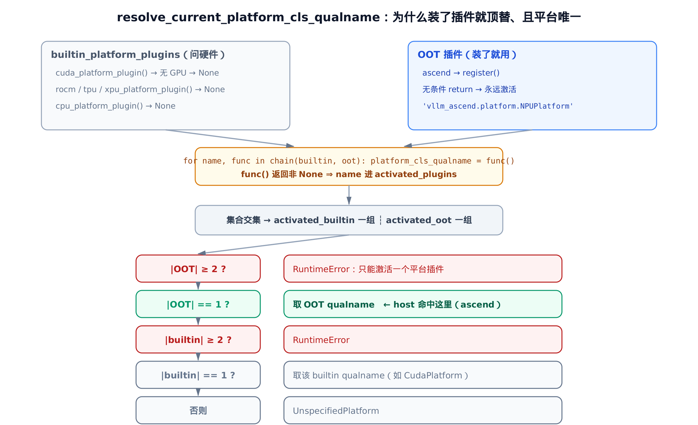
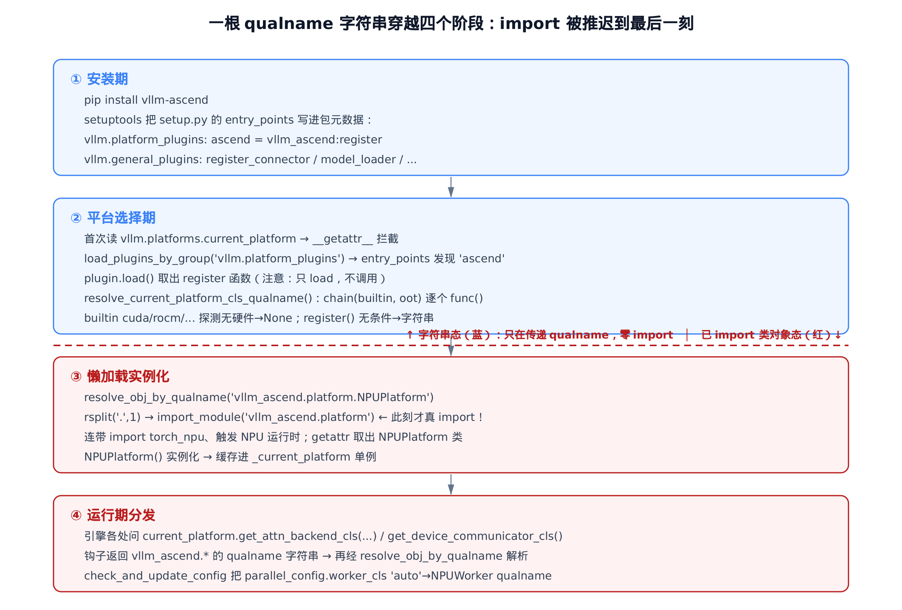
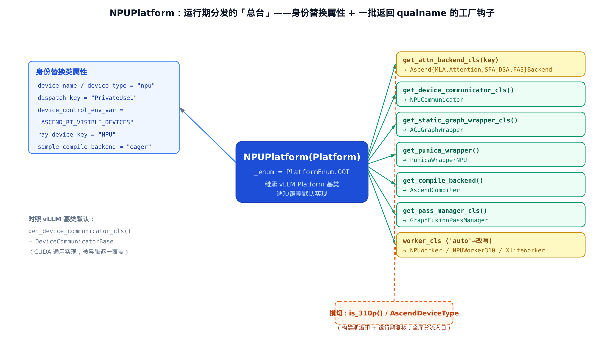

# 第 2 章 插件如何被 vLLM 发现并顶替：entry points 与 NPUPlatform


> **你在这里**——Part I「接入机制」的第一站。
> 上一章鸟瞰了「同一个 v0.21.0 引擎如何被搬上昇腾」。
> 本章解决最根上的问题：vllm-ascend 不改 vLLM 一行源码，凭什么能挤进去、还顶替默认实现？
> 下一章接着讲它怎么用两段式 monkey-patch 替换跑不动的内部函数。

---

vllm-ascend 是 vLLM 的 **out-of-tree（OOT，源码树外）平台插件**。它装在 vLLM 之外、是一个独立的 pip 包，却能让 `import vllm` 之后整套引擎自动改用昇腾 NPU 的算子、通信器、worker。这件事听上去有点违反直觉：vLLM 的源码里根本没有 `vllm_ascend` 这个名字，它是怎么「认出」并交权给一个素未谋面的包的？

答案是一条贯穿全章的主线——**一根 qualname（全限定类名）字符串，被推迟到最后一刻才 import**。从安装期写进包元数据的 entry point，到平台选择期 `vllm/platforms/__init__.py` 里的 `resolve_current_platform_cls_qualname`，到首次访问 `current_platform` 的懒加载，再到运行期 `vllm_ascend/platform.py` 那批 `get_*_cls` 工厂钩子，vLLM 自始至终传递的都是 `"vllm_ascend.platform.NPUPlatform"` 这样的**字符串**，而不是类对象。看懂这个「延迟绑定」模式，本章就通了。

我们就顺着这根字符串走一遍。

## 2.1 安装期：两个 entry-point 组

故事从 `setup.py` 开始。vllm-ascend 在打包时声明了两组 setuptools entry points：

```python
# setup.py:L540-L548
    entry_points={
        "vllm.platform_plugins": ["ascend = vllm_ascend:register"],
        "vllm.general_plugins": [
            "ascend_kv_connector = vllm_ascend:register_connector",
            "ascend_model_loader = vllm_ascend:register_model_loader",
            "ascend_service_profiling = vllm_ascend:register_service_profiling",
            "ascend_model = vllm_ascend:register_model",
        ],
    },
    # … 省略：setup() 其余参数（packages / install_requires / ext_modules / cmdclass）与本章无关 …
```

`entry_points` 是 Python 打包规范里的一张「广告牌」：包在安装时，setuptools 会把这些声明写进包元数据（`*.dist-info/entry_points.txt`）。任何程序都能用标准库 `importlib.metadata` 按**组名**去查「谁在这个组里登记过」。vLLM 约定了两个组名：

- **`vllm.platform_plugins`**——「我是一个平台后端」。这里只登记了一条 `ascend = vllm_ascend:register`，意思是：组名 `ascend` 对应的入口是 `vllm_ascend` 包里的 `register` 函数。
- **`vllm.general_plugins`**——「我要在引擎里注册一些扩展」。这里有四条，分别指向 KV connector、模型加载器、profiling 配置、自定义模型的注册回调。

两组的分工是本章的一条暗线，我们到 [§2.9](#29-另一组-entry-point在子进程里注册扩展) 再回头细说。先盯住第一组的那个 `register`——它是整条接管链的起点。

关键在于：entry point 写的是 `vllm_ascend:register` 这个**符号路径**，不是被执行的代码。安装期什么都没发生，只是把「将来想被找到」这件事记进了元数据。真正的发现，要等 vLLM 启动后主动来查。

## 2.2 发现：load_plugins_by_group——只 load，不调用

vLLM 启动后，由 `vllm/plugins/__init__.py` 的 `load_plugins_by_group` 负责按组发现插件：

```python
# vllm/plugins/__init__.py:L28-L66
def load_plugins_by_group(group: str) -> dict[str, Callable[[], Any]]:
    """Load plugins registered under the given entry point group."""
    from importlib.metadata import entry_points

    allowed_plugins = envs.VLLM_PLUGINS

    discovered_plugins = entry_points(group=group)
    if len(discovered_plugins) == 0:
        logger.debug("No plugins for group %s found.", group)
        return {}
    # … 省略：一段纯日志，打印发现到的插件清单、是否受 VLLM_PLUGINS 过滤 …

    plugins = dict[str, Callable[[], Any]]()
    for plugin in discovered_plugins:
        if allowed_plugins is None or plugin.name in allowed_plugins:
            try:
                func = plugin.load()
                plugins[plugin.name] = func
            except Exception:
                logger.exception("Failed to load plugin %s", plugin.name)

    return plugins
```

这段代码朴素得几乎没什么可讲，但有一处**极易被忽略、却是全章关窍**的细节：

> `func = plugin.load()` 把 entry point 指向的**对象本身**导进来，**并不调用它**。

对 `ascend` 这条来说，`plugin.load()` 做的是「import `vllm_ascend` 包，取出其中的 `register` 函数对象」，然后把这个**函数**放进返回的字典里。注意 `dict[str, Callable[[], Any]]` 这个类型标注——字典的 value 是「一个可调用对象」，而不是调用它的结果。调用发生在上一层。

为什么这个区分重要？因为 `import vllm_ascend` 这一步本身是「轻」的——稍后我们会看到 `vllm_ascend/__init__.py` 顶部几乎不做事，`register` 也只是个返回字符串的纯函数。真正「重」的 `import vllm_ascend.platform`（连带把 `torch_npu` 整个 NPU 运行时拉起来）被精心地藏在了 `register` 函数体之外——这次 import 究竟「重」在哪、为什么非推迟不可，留到 [§2.5](#25-推迟的-import为什么是字符串不是类) 讲透。`load_plugins_by_group` 只是把这枚「待引爆的开关」收集起来，什么时候按、由谁按，是下一节的事。

（`envs.VLLM_PLUGINS` 是个可选白名单：为 `None` 时加载全部，非 `None` 时只加载名字在册的插件。精简版里把它取成 `None`，因为 host 上没有 `vllm.envs` 这套环境配置——但控制流「发现→筛选→load→入字典」一字不差。）

## 2.3 选择：resolve_current_platform_cls_qualname——OOT 凭什么优先于 builtin

发现到的插件函数，交给 `vllm/platforms/__init__.py` 的 `resolve_current_platform_cls_qualname` 去「选出唯一平台」。这是本章的核心函数，我们整段读：

```python
# vllm/platforms/__init__.py:L203-L252
builtin_platform_plugins = {
    "tpu": tpu_platform_plugin,
    "cuda": cuda_platform_plugin,
    "rocm": rocm_platform_plugin,
    "xpu": xpu_platform_plugin,
    "cpu": cpu_platform_plugin,
}


def resolve_current_platform_cls_qualname() -> str:
    platform_plugins = load_plugins_by_group(PLATFORM_PLUGINS_GROUP)

    activated_plugins = []

    for name, func in chain(builtin_platform_plugins.items(), platform_plugins.items()):
        try:
            assert callable(func)
            platform_cls_qualname = func()
            if platform_cls_qualname is not None:
                activated_plugins.append(name)
        except Exception:
            pass

    activated_builtin_plugins = list(
        set(activated_plugins) & set(builtin_platform_plugins.keys())
    )
    activated_oot_plugins = list(set(activated_plugins) & set(platform_plugins.keys()))

    if len(activated_oot_plugins) >= 2:
        raise RuntimeError(
            "Only one platform plugin can be activated, but got: "
            f"{activated_oot_plugins}"
        )
    elif len(activated_oot_plugins) == 1:
        platform_cls_qualname = platform_plugins[activated_oot_plugins[0]]()
        logger.info("Platform plugin %s is activated", activated_oot_plugins[0])
    elif len(activated_builtin_plugins) >= 2:
        raise RuntimeError(
            "Only one platform plugin can be activated, but got: "
            f"{activated_builtin_plugins}"
        )
    elif len(activated_builtin_plugins) == 1:
        platform_cls_qualname = builtin_platform_plugins[activated_builtin_plugins[0]]()
        logger.debug(
            "Automatically detected platform %s.", activated_builtin_plugins[0]
        )
    else:
        platform_cls_qualname = "vllm.platforms.interface.UnspecifiedPlatform"
    return platform_cls_qualname
```

这个函数把 vLLM 内置的五个平台（cuda / rocm / tpu / xpu / cpu）与 OOT 插件**用 `chain()` 串成一条链**，逐个 `func()` 调用，谁返回非 `None` 谁就算「激活」。然后用集合交集把激活者分成两组——`activated_builtin` 与 `activated_oot`——再走一条 `elif` 链做最终裁决。

举个具体场景：一台机器同时装了 vllm-ascend 和带 CUDA 的 torch、还插着 GPU。此时 `cuda_platform_plugin` 数到了 GPU 而激活、`ascend` 也激活——两个都在册。但 OOT 那一支先判，最终选中的是 `NPUPlatform`，而不是 `CudaPlatform`。

裁决的顺序就是「OOT 优先」的全部秘密。我们把它画成一张决策图：



> *图注：builtin 探测函数「问硬件」，host 无对应硬件全返 None；OOT 的 register() 「装了就用」无条件返字符串。`elif` 链把 OOT 分支放在最前——只要有一个 OOT 激活，就走 OOT，根本不看 builtin。*

注意 `elif` 链的次序：`OOT≥2`（报错）→ `OOT==1`（取 OOT）→ `builtin≥2`（报错）→ `builtin==1`（取 builtin）→ 否则 `UnspecifiedPlatform`。把这串判定形式化一下。记 builtin 的激活集为 B、OOT 的激活集为 O，最终选中的平台 P 按如下优先级决定：

$$
P = \begin{cases} \mathrm{RuntimeError} & |O| \ge 2 \\ O\ \mathrm{的唯一元素} & |O| = 1 \\ \mathrm{RuntimeError} & |O|=0,\ |B| \ge 2 \\ B\ \mathrm{的唯一元素} & |O|=0,\ |B| = 1 \\ \mathrm{UnspecifiedPlatform} & |O|=|B|=0 \end{cases}
$$

人话翻译：**「只要装了一个 OOT 平台插件，就用它，并且不许同时装两个。」** OOT 那一支被放在 `builtin` 之前判定，所以哪怕你这台机器同时有 GPU（`cuda` 也激活了），只要 `ascend` 在场，最终选中的仍是昇腾。这正是「不改 vLLM 源码就能顶替默认行为」的机制落点——用户安装 vllm-ascend 的意图本就是「我要用昇腾」，代码无需再让用户显式去关掉 builtin 探测。同时，`|O| >= 2` 直接 `RuntimeError`，保证「平台唯一」这条硬约束。

## 2.4 两种「激活」的语义差：问硬件 vs 装了就用

上面那条链把 builtin 和 OOT 一视同仁地 `func()`，但这两类 `func` 的「激活」含义截然不同。看 builtin 一侧的代表 `cuda_platform_plugin`：

```python
# vllm/platforms/__init__.py:L60-L113
def cuda_platform_plugin() -> str | None:
    is_cuda = False
    logger.debug("Checking if CUDA platform is available.")
    try:
        from vllm.utils.import_utils import import_pynvml

        pynvml = import_pynvml()
        pynvml.nvmlInit()
        # … 省略：用 pynvml 数 GPU、排除 cpu build、Jetson 边界等探测细节 …
        is_cuda = (
            pynvml.nvmlDeviceGetCount() > 0
            and not vllm_version_matches_substr("cpu")
        )
    except Exception as e:
        # … 省略：NVML 不可用时的 Jetson 回退 …
        pass

    return "vllm.platforms.cuda.CudaPlatform" if is_cuda else None
```

builtin 探测函数会**真去问硬件**——`cuda_platform_plugin` 用 `pynvml`（NVIDIA 的设备查询库）数有没有 GPU，数到了才返回 `"vllm.platforms.cuda.CudaPlatform"` 这个 qualname，数不到就返回 `None`。也就是说，对 builtin 来说，「激活」= 「这块硬件物理在场」。

OOT 一侧恰好是它的**反面**。看 `vllm_ascend/__init__.py` 里那个 `register`：

```python
# vllm_ascend/__init__.py:L40-L43
def register():
    """Register the NPU platform."""

    return "vllm_ascend.platform.NPUPlatform"
```

就这四行。它**无条件**返回字符串 `"vllm_ascend.platform.NPUPlatform"`，从不返回 `None`——所以它永远「激活」。对 OOT 而言，「激活」退化成了「这个插件包装没装」：你既然 `pip install` 了 vllm-ascend，`register` 就一定能被发现、一定返回 qualname。「是否在场」从「硬件探测」降级成了「包是否安装」，决定权前移到了用户的安装动作上。

两种语义不同，却被 `resolve_current_platform_cls_qualname` 统一成了同一句话——「`func()` 返回非 `None` 即激活」。这是接口设计的漂亮之处：链上所有成员只需满足同一个契约（`() -> str | None`），各自的「在场判定」逻辑则完全自治。

但 `register` 还有一个更要紧的设计决策，藏在「它返回的是**字符串**而不是类」这件事里。

## 2.5 推迟的 import：为什么是字符串，不是类

`register` 大可以写成 `from vllm_ascend.platform import NPUPlatform; return NPUPlatform`，直接把类对象交出去。为什么偏偏返回一个字符串，让上层再费一道手去解析？

因为 `import vllm_ascend.platform` 这一行**代价高昂且时机敏感**。`vllm_ascend/platform.py` 在 import 时会连带 `import torch_npu`，而 `torch_npu` 一旦 import 就会触发昇腾 NPU 运行时的初始化。

打个比方：import `torch_npu` 像是「点火启动整套昇腾运行时 CANN（昇腾的算子与运行时软件栈）」。点火要去抢占设备、建立上下文，本身就是个重操作。更要命的是它「一锤定音」——按点火那一刻读到的环境与配置定型，之后你再改环境变量，它也不回头重读。所以你绝不想在「还没想清楚到底用不用昇腾」时就把它点着。

而 `register` 被调用的时刻——平台选择期——是 vLLM 刚启动、**还在探测「我到底在什么硬件上」**的极早期。此刻：

- 还没确定该不该用昇腾（万一这台机器装了 vllm-ascend 但用户其实想跑别的？选择逻辑还没跑完）；
- 选卡用的环境变量 `ASCEND_RT_VISIBLE_DEVICES` 可能还没生效；
- 在「平台尚未拍板」时就把 NPU 运行时拉起来，是有副作用且可能出错的。

所以 `register` 只递出一张「字符串名片」，把真正的 `import` 推迟到「确实要实例化这个平台」那一刻。承接这次推迟的，是 `vllm/utils/import_utils.py` 里的 `resolve_obj_by_qualname`：

```python
# vllm/utils/import_utils.py:L104-L110
def resolve_obj_by_qualname(qualname: str) -> Any:
    """
    Resolve an object by its fully-qualified class name.
    """
    module_name, obj_name = qualname.rsplit(".", 1)
    module = importlib.import_module(module_name)
    return getattr(module, obj_name)
```

它把 `"vllm_ascend.platform.NPUPlatform"` 用 `rsplit(".", 1)` 切成 `("vllm_ascend.platform", "NPUPlatform")`，`import_module` 那个模块、`getattr` 取出类对象。**`register` 推迟的那次 `import vllm_ascend.platform`（连带 `torch_npu`）真正发生在这一行**——而且只在确实需要把平台 new 出来时才发生。

这就是「qualname 间接层」的本质：把「谁来实现 X」从**编译期的 import 绑定**降级成**运行期的字符串解析**。代价是失去了静态类型检查、import 期的错误也不再前移；换来的是三件大事——延迟 import（不过早触发硬件初始化）、可替换（OOT 无需改 vLLM 源码即可顶替）、可按配置动态选实现。记住这个模式，因为本章后面它还会原样复用三遍。

## 2.6 懒加载单例：current_platform 的 __getattr__ 拦截

平台名字解析出来了，什么时候把它实例化成那个全局都在用的 `current_platform`？答案是「越晚越好，但要早于一切用到平台的代码」。vLLM 用了一个模块级 `__getattr__`（PEP 562）来做这件事：

```python
# vllm/platforms/__init__.py:L262-L281
def __getattr__(name: str):
    if name == "current_platform":
        # lazy init current_platform.
        # 1. out-of-tree platform plugins need `from vllm.platforms import
        #    Platform` so that they can inherit `Platform` class. Therefore,
        #    we cannot resolve `current_platform` during the import of
        #    `vllm.platforms`.
        # 2. when users use out-of-tree platform plugins, they might run
        #    `import vllm`, some vllm internal code might access
        #    `current_platform` during the import, and we need to make sure
        #    `current_platform` is only resolved after the plugins are loaded
        #    (we have tests for this, if any developer violate this, they will
        #    see the test failures).
        global _current_platform
        if _current_platform is None:
            platform_cls_qualname = resolve_current_platform_cls_qualname()
            _current_platform = resolve_obj_by_qualname(platform_cls_qualname)()
        return _current_platform
    # … 省略：name in globals() / else raise AttributeError 两个分支 …
```

源码里那段注释是官方对「为什么必须懒加载」的逐字解释，值得逐条读：

1. **OOT 插件需要 `from vllm.platforms import Platform` 来继承基类**。也就是说，`vllm_ascend.platform` 这个模块在被 import 时，反过来要 import `vllm.platforms`。如果 `vllm.platforms` 在自己 import 的过程中就去解析 `current_platform`（那会触发 import `vllm_ascend.platform`），就形成了循环依赖——而且是在插件还没装好时就解析。
2. 用户用 OOT 插件时常常先 `import vllm`，vLLM 内部某些代码会在 import 期就摸 `current_platform`，必须保证它**只在插件全部加载之后**才被解析。

`__getattr__` 把解析点推迟到「第一次有人真的去读 `vllm.platforms.current_platform` 这个属性」的那一刻。读到时，`_current_platform is None` 还成立，于是 `resolve_current_platform_cls_qualname()` 选出 qualname → `resolve_obj_by_qualname(...)()` 解析并**实例化**（注意末尾那对括号）→ 存进模块级 `_current_platform`。之后任何人再读，`_current_platform` 已非 `None`，直接返回同一个对象。一个标准的「懒加载单例」：只解析一次、之后命中缓存。

把前五节连起来，就是这根字符串穿越四个阶段的全程：



> *图注：蓝色阶段全程只在传字符串，零 import；红色虚线是分水岭——`resolve_obj_by_qualname` 那一刻才真 import `vllm_ascend.platform`（连带 torch_npu）。「平台确定」这件事被放到尽可能晚、但仍早于一切平台相关使用的位置。*

到此，vLLM 手里已经握着一个 `NPUPlatform` 的实例了。但这个实例凭什么能「代表昇腾」？答案在 `NPUPlatform` 这个类自己身上。

## 2.7 NPUPlatform：身份替换类属性

`NPUPlatform` 继承自 vLLM 的 `Platform` 基类（见 `vllm/platforms/interface.py`），它做的第一件事是用一批**类属性**宣告「我是什么设备」。先看基类那个把它认作 OOT 的枚举：

```python
# vllm/platforms/interface.py:L38-L47
class PlatformEnum(enum.Enum):
    """Enumeration of supported hardware platforms."""

    CUDA = enum.auto()
    ROCM = enum.auto()
    TPU = enum.auto()
    XPU = enum.auto()
    CPU = enum.auto()
    OOT = enum.auto()
    UNSPECIFIED = enum.auto()
```

`OOT` = out-of-tree。基类有个 `is_out_of_tree()`（`vllm/platforms/interface.py:L178`）就是 `return self._enum == PlatformEnum.OOT`。再看 `NPUPlatform` 怎么覆盖类属性：

```python
# vllm_ascend/platform.py:L134-L151
class NPUPlatform(Platform):
    _enum = PlatformEnum.OOT
    device_name: str = "npu"
    device_type: str = "npu"
    simple_compile_backend: str = "eager"  # Disable torch.compile()
    ray_device_key: str = "NPU"
    device_control_env_var: str = "ASCEND_RT_VISIBLE_DEVICES"
    ray_noset_device_env_vars: list[str] = [
        "RAY_EXPERIMENTAL_NOSET_ASCEND_RT_VISIBLE_DEVICES",
    ]
    dispatch_key: str = "PrivateUse1"

    supported_quantization: list[str] = [
        ASCEND_QUANTIZATION_METHOD,
        COMPRESSED_TENSORS_METHOD,
        FP8_METHOD,
        "deepseek_v4_fp8",
    ]
```

这就是「身份替换类属性」——`NPUPlatform` 继承了 `Platform` 的全部接口，靠**覆盖类属性**把基类里那些「我是什么设备 / 用哪个环境变量选卡 / PyTorch 用哪个 dispatch key」的答案，逐一改写成昇腾的版本：

- `_enum = PlatformEnum.OOT`——把自己标记成 out-of-tree，`is_out_of_tree()` 由此返回 `True`，全 vLLM 凡是判断「当前是不是 OOT 平台」的地方都据此分流。
- `device_name / device_type = "npu"`——设备名。vLLM 内部拼 `"npu:0"` 这种设备串、打日志、选 device 时都读它。
- `device_control_env_var = "ASCEND_RT_VISIBLE_DEVICES"`——「用哪个环境变量控制可见设备」。CUDA 是 `CUDA_VISIBLE_DEVICES`，昇腾换成自己的。
- `dispatch_key = "PrivateUse1"`——这是 PyTorch 给**外部后端**预留的派发键。PyTorch 的算子分发按 dispatch key 走，`torch_npu` 把 NPU 注册在 `PrivateUse1` 这个通用外部键上，`NPUPlatform` 据此告诉 vLLM「我的张量走 PrivateUse1 这条分发路径」。

一句话：基类 `Platform` 把所有问题都问了一遍（你叫什么、用哪个 env、哪个 dispatch key……），`NPUPlatform` 通过覆盖类属性把每个问题的答案换成昇腾的。这是继承最经典的用法——**子类不改控制流，只改数据**。

## 2.8 一批返回 qualname 的工厂钩子

身份属性解决了「我是谁」，但 vLLM 引擎跑起来还需要一大堆具体实现：attention backend、设备通信器、图包装器、LoRA 的 punica wrapper、编译后端……这些昇腾各有各的实现，`NPUPlatform` 怎么把它们顶替进去？

答案是**第 [2.5](#25-推迟的-import为什么是字符串不是类) 节那个延迟绑定模式的原样复用**：平台不直接返回类对象，而是用一批 `classmethod` 工厂钩子，每个**返回一个 `vllm_ascend.*` 的 qualname 字符串**，vLLM 拿到后再经 `resolve_obj_by_qualname` 解析。看这一族钩子的几个代表：

```python
# vllm_ascend/platform.py:L794-L820
    @classmethod
    def get_punica_wrapper(cls) -> str:
        return "vllm_ascend.lora.punica_npu.PunicaWrapperNPU"

    # … 省略：get_current_memory_usage 等几个非工厂方法 …

    @classmethod
    def get_device_communicator_cls(cls) -> str:
        return "vllm_ascend.distributed.device_communicators.npu_communicator.NPUCommunicator"

    # … 省略：is_pin_memory_available / opaque_attention_op 等非工厂方法 …

    @classmethod
    def get_static_graph_wrapper_cls(cls) -> str:
        """
        Get piecewise backend class for piecewise graph.
        """
        return "vllm_ascend.compilation.acl_graph.ACLGraphWrapper"  # noqa
```

外加分布在同一文件里的 `get_compile_backend`（返回 `AscendCompiler`）和 `get_pass_manager_cls`（返回 `GraphFusionPassManager`）。它们形态完全一致：一个 `@classmethod`，一句 `return "vllm_ascend.…"`。把整个 `NPUPlatform` 当成一个「运行期分发的总台」，它向外辐射的就是这两类东西——身份属性，和这一族 qualname 钩子：



> *图注：每个钩子返回一个 vllm_ascend 的类名字符串，顶替 vLLM 基类的默认实现（如 get_device_communicator_cls 默认是 DeviceCommunicatorBase）。橙色横切线是 is_310p——设备分代会让其中两个钩子分流。*

钩子「顶替」了什么，对照基类默认值最清楚。`vllm/platforms/interface.py:L770` 的基类 `get_device_communicator_cls` 默认返回 `"vllm.distributed.device_communicators.base_device_communicator.DeviceCommunicatorBase"`——一个 CUDA 通用实现；`NPUPlatform` 把它覆盖成 `NPUCommunicator`。把精简版跑起来对照这两个返回值，会看到它们确实不相等——昇腾的钩子真真切切顶替了 builtin 默认。

### 带条件分发的钩子：get_attn_backend_cls

钩子家族里最复杂的是 `get_attn_backend_cls`，它不是「一句 return」，而是按一把 key 查表分发：

```python
# vllm_ascend/platform.py:L739-L765
    @classmethod
    def get_attn_backend_cls(cls, selected_backend, attn_selector_config, num_heads: int | None = None):
        use_compress = getattr(attn_selector_config, "use_compress", False)
        key = (attn_selector_config.use_mla, attn_selector_config.use_sparse)

        if selected_backend == AttentionBackendEnum.FLASH_ATTN and cls._validate_fa3_backend(key, attn_selector_config):
            return "vllm_ascend.attention.fa3_v1.AscendFABackend"

        backend_map = {
            (True, False, False): "vllm_ascend.attention.mla_v1.AscendMLABackend",
            (False, False, False): "vllm_ascend.attention.attention_v1.AscendAttentionBackend",
            (True, True, False): "vllm_ascend.attention.sfa_v1.AscendSFABackend",
            (True, False, True): "vllm_ascend.attention.dsa_v1.AscendDSABackend",
        }
        backend_map_310 = {
            (False, False): "vllm_ascend._310p.attention.attention_v1.AscendAttentionBackend310",
            # … 省略：两行 TODO，说明 MLA/SFA 的 310P 实现待补 …
        }

        if is_310p():
            return backend_map_310.get(key, backend_map_310[(False, False)])

        return backend_map[(attn_selector_config.use_mla, attn_selector_config.use_sparse, use_compress)]
```

它按 `(use_mla, use_sparse[, use_compress])` 这把 key 在 `backend_map` 里查不同的昇腾 attention backend——MLA、稠密、SFA、DSA（MLA / SFA / DSA 是昇腾针对不同注意力模式的几种 backend 实现；MLA 即多头潜在注意力，SFA 由 `use_sparse` 稀疏路径选中，DSA（DeepSeek Sparse Attention）由 `use_compress` 量化路径选中）。`FLASH_ATTN` 是「训推一致」场景下的特例，先经 `_validate_fa3_backend` 校验通过才走（该校验依赖外部包 `flash_attn_npu_v3`，本章不展开）。

这里埋着一条**横切线索**：`if is_310p()` 这一支会整个改走 `backend_map_310`。而且注意两张表的 key 维度不同——非-310P 用 3 元组 key（含 `use_compress`），310P 用 2 元组 key。310P 是昇腾的纯推理卡，能力受限，连 attention backend 都另起一套（`vllm_ascend._310p.…`）。这个 `is_310p()` 究竟从哪来，我们 [§2.10](#210-设备分代is_310p-这条横切线) 揭晓。把精简版跑起来喂不同的 key，`(True,False,False)` 会拿到 `AscendMLABackend`、`(True,True,False)` 拿到 `AscendSFABackend`，而一旦把设备分代设成 310P，同样的 `(False,False)` 就改落到 `AscendAttentionBackend310`——查表分发与分代分流都能在 host 上纯 Python 复现。

### 同招不同落点：worker_cls 经 config 字段改写

`worker_cls`（vLLM 用哪个 Worker 类）是个有意思的例外。它**不是** `get_worker_cls` 钩子，而是平台在 `check_and_update_config` 里直接改写一个 config 字段：

```python
# vllm_ascend/platform.py:L602-L612（截取自 check_and_update_config）
        if parallel_config and parallel_config.worker_cls == "auto":
            # TODO: this is a tricky way to disable `use_sequence_parallel_moe` in vllm.
            if not vllm_config.compilation_config.pass_config.enable_sp:
                parallel_config.all2all_backend = "flashinfer_all2allv"
            if is_310p():
                parallel_config.worker_cls = "vllm_ascend._310p.worker_310p.NPUWorker310"
            elif ascend_config.xlite_graph_config.enabled:
                parallel_config.worker_cls = "vllm_ascend.xlite.xlite_worker.XliteWorker"
            else:
                parallel_config.worker_cls = "vllm_ascend.worker.worker.NPUWorker"
```

vLLM 的 worker 类由 `parallel_config.worker_cls` 这个**字符串字段**承载，默认值是哨兵 `"auto"`。平台在 `check_and_update_config` 里把它从 `"auto"` 改写成具体 `NPUWorker` 的 qualname——还是「写 qualname 字符串、推迟 import」那一招，只是**落点在 config 字段而非工厂方法**。这里第三次出现按设备分代分流：310P → `NPUWorker310`、openEuler Xlite 图模式 → `XliteWorker`、默认 → `NPUWorker`。跑精简版验证：`worker_cls="auto"` 在 A2 分代下被改写成 `NPUWorker`、在 310P 下变 `NPUWorker310`；而如果字段本来就不是 `"auto"`（用户显式指定了 worker），这段 `if` 整个跳过，不覆盖用户的选择。

`check_and_update_config` 这个方法本身远不止改 worker_cls 这一处——它还会校验 ACL graph、刷新 block size、调并行与显存配置等等。那是 [第 5 章：check_and_update_config](../ch05-check-and-update-config/narrative/chapter.md) 的主场，本章只截下 worker_cls 这一刀，看清「同一个延迟绑定招式，第四次复用」。

至此，那个延迟绑定模式在本章已经用满四遍：平台选择（`register`）、平台工厂钩子（`get_*_cls`）、worker_cls（config 字段）、attention backend 查表。同一个「写字符串、推迟 import、运行期解析」的思路，撑起了整个昇腾接管层。

## 2.9 另一组 entry point：在子进程里注册扩展

回到 [§2.1](#21-安装期两个-entry-point-组) 埋下的第二组 entry point——`vllm.general_plugins`。它和 platform_plugins 是两套截然不同的回调，差别全在「时机」与「副作用」上：

```python
# vllm_ascend/__init__.py:L20-L75
_GLOBAL_PATCH_APPLIED = False


def _ensure_global_patch():
    """Apply process-wide vLLM patches before engine-core initialization."""
    global _GLOBAL_PATCH_APPLIED
    if _GLOBAL_PATCH_APPLIED:
        return

    from vllm_ascend.utils import adapt_patch

    adapt_patch(is_global_patch=True)
    _GLOBAL_PATCH_APPLIED = True


def register():
    """Register the NPU platform."""

    return "vllm_ascend.platform.NPUPlatform"


def register_connector():
    _ensure_global_patch()

    from vllm_ascend.distributed.kv_transfer import register_connector

    register_connector()


def register_model_loader():
    _ensure_global_patch()
    # … 省略：import 并调用 netloader / rfork 两个下游注册函数 …


def register_service_profiling():
    _ensure_global_patch()
    # … 省略：生成 service profiling 配置 …


def register_model():
    from .models import register_model

    register_model()
```

把两组放在一起对比，分工就清楚了：

- **`register`（platform_plugins）是纯函数**——零副作用，只返回字符串。因为它在「平台选择」这个极早期被调用，此刻绝不该 import `torch_npu`（[§2.5](#25-推迟的-import为什么是字符串不是类) 讲透了原因）。
- **四个 `register_*`（general_plugins）是有副作用的真注册**——它们由 vLLM 的 `load_general_plugins()` 在 **engine-core 子进程**里 `func()` 调用，各自去注册 KV connector、模型加载器、自定义模型、profiling 配置。这些扩展必须在跑引擎的那个子进程里生效，所以走 general_plugins 这条道。

还有一处细节值得记下：`register_connector / register_model_loader / register_service_profiling` 都先调一遍 `_ensure_global_patch()`。这是因为 vLLM 在子进程里加载 general plugins，而 E2E 测试的 conftest 钩子不会在子进程跑——那些影响 scheduler、engine 的进程级 monkey-patch，必须借这几个 plugin 入口在子进程里**补打**一遍。`_GLOBAL_PATCH_APPLIED` 这个模块级标志位保证它**幂等**：打过就直接 return，不会重复打。把精简版跑起来能看到，连调两次 `_ensure_global_patch()` 后标志位稳定为 `True`，第二次是空操作。

这里只点出 general_plugins 会触发 `adapt_patch` 的 platform 段。`adapt_patch` 那套「platform 段 + worker 段」的两段式 monkey-patch——它具体替换了 vLLM 内部哪些函数、为什么分两段打——是 [第 3 章：两段式 monkey-patch](../ch03-two-stage-monkey-patch/narrative/chapter.md) 的主线。本章按下不表。

## 2.10 设备分代：is_310p 这条横切线

前面 `get_attn_backend_cls` 和 `worker_cls` 两处都撞见了 `is_310p()`。这条「设备分代」的横切线索，源头在 `vllm_ascend/utils.py`：

```python
# vllm_ascend/utils.py:L768-L816
class AscendDeviceType(Enum):
    A2 = 0
    A3 = 1
    _310P = 2
    A5 = 3


_ascend_device_type = None


def _init_ascend_device_type():
    global _ascend_device_type
    from vllm_ascend import _build_info  # type: ignore

    device_type = getattr(_build_info, "__device_type__", None)
    if device_type is None:
        soc_version = getattr(_build_info, "__soc_version__", "ASCEND910B1").upper()
        device_type = "_310P" if "310P" in soc_version else "A2"
    _ascend_device_type = AscendDeviceType[device_type]


def get_ascend_device_type():
    global _ascend_device_type
    if _ascend_device_type is None:
        _init_ascend_device_type()
    return _ascend_device_type
```

`AscendDeviceType` 把昇腾卡分成四代：`A2 / A3 / A5` 是训推一体卡，`_310P` 是纯推理卡（能力受限，自带 `vllm_ascend/_310p/` 子包另写一套实现）。分代怎么确定？两步走：

1. **构建期烙印**——`_init_ascend_device_type` 从打包时写入的 `vllm_ascend._build_info` 读 `__device_type__` / `__soc_version__`，也就是「这个安装包是面向哪一代编译的」。读不到就缺省回退 `A2`（`ASCEND910B1`）。
2. **运行期复核**——另有个 `check_ascend_device_type`（同文件）用 `torch_npu` 真去问硬件的 `soc_version`，按区间映射出实际分代（`220–225 → A2`、`250–255 → A3`、`200–205 → _310P`、`260 → A5`），与安装包的烙印**不符就 `assert` 报错**，防止「310P 的包跑在 910 上」这类装错包的事故。

`get_ascend_device_type` 是带模块级缓存的懒加载入口——又一个「只算一次」的单例。便利谓词 `is_310p()` 就建在它之上：

```python
# vllm_ascend/utils.py:L122-L123
def is_310p():
    return get_ascend_device_type() == AscendDeviceType._310P
```

全代码库到处用 `is_310p()` 做分支：本章见过的 worker_cls 选择、attention backend 选择，还有后续章节会碰到的 custom ops 开关等等。它是「设备分代」这个横切关注点最常见的入口——一个谓词，把一代卡的特殊性收束成一句 `if`。把精简版跑起来，把构建期烙印设成 `_310P`，`is_310p()` 即为 `True`，前面那两处分流随之改道；运行期复核那张 soc_version 映射表也能逐档验证，包括「310P 硬件配 A2 包」会如期 `assert` 失败。

## 2.11 把它跑起来：精简版交叉验证

本章涉及昇腾的真实算子（`torch_npu` / CANN）在没有 NPU 的机器上跑不动，但**接管链的骨架是纯 Python**——平台发现、OOT 优先选择、qualname 解析、懒加载单例、工厂钩子查表、设备分代分流，全都不碰硬件。精简版（与 `vllm/platforms/__init__.py`、`vllm/plugins/__init__.py`、`vllm_ascend/platform.py` 同名同结构、只删无关分支）把这些控制流原样跑起来，能观察到的关键数值：

- `register()` 返回的是**字符串** `"vllm_ascend.platform.NPUPlatform"`，`isinstance(out, str)` 为真——它故意不 import。
- `load_plugins_by_group` 返回的字典里，`ascend` 对应的 value **就是 `register` 函数本身**（`is` 判等成立），尚未被调用——印证「只 load 不调用」。
- builtin 全返 `None`、`ascend` 返字符串时，`resolve_current_platform_cls_qualname()` 选中昇腾；哪怕手动让 `cuda_platform_plugin` 也激活，结果仍是昇腾——**OOT 优先**被坐实；同时挂两个 OOT 则 `RuntimeError`。
- `current_platform` 连读两次是**同一个对象**，且内部解析只发生一次——懒加载单例成立。
- 工厂钩子 `get_device_communicator_cls()` 等返回的昇腾 qualname，与基类默认（`DeviceCommunicatorBase`）**不相等**——顶替生效。
- 把设备分代在 `A2` 与 `_310P` 之间切换，`get_attn_backend_cls` 与 `worker_cls` 两处分流**随之改道**——横切线索贯通。

这些断言全部通过，说明精简版忠实复现了真实源码的可观察行为。它不是主角，只是让你能「跑起来看数值」的交叉验证物——真正的接管，发生在装了 CANN 的昇腾机器上，`resolve_obj_by_qualname` 触发 `import vllm_ascend.platform` 的那一刻。

## 2.12 小结与承上启下

本章拆开了 vllm-ascend「不改 vLLM 一行源码就顶替默认实现」的接入机制，核心是一句话：**一根 qualname 字符串的延迟绑定**。

- 安装期，`setup.py` 把两组 entry points 写进包元数据；
- 平台选择期，`vllm/plugins/__init__.py` 发现插件（只 load 不调用），`vllm/platforms/__init__.py` 的 `resolve_current_platform_cls_qualname` 用「OOT 优先」选出 qualname——builtin 问硬件、OOT 装了就用；
- 懒加载期，`current_platform` 的 `__getattr__` 在首次访问时经 `resolve_obj_by_qualname` 实例化单例，**`import torch_npu` 推迟到此刻**；
- 运行期，`NPUPlatform` 作为「总台」，用身份替换类属性 + 一批返回 qualname 的工厂钩子，把 attention / 通信器 / 图包装器 / worker 逐站顶替成昇腾实现；
- 横切其间的是 `AscendDeviceType` / `is_310p` 这条设备分代线。

我们在路上埋了两颗将来要回收的种子：general_plugins 触发的 `adapt_patch` 两段式 monkey-patch，是 [第 3 章](../ch03-two-stage-monkey-patch/narrative/chapter.md) 的主题；`check_and_update_config` 那套完整的配置改写，留给 [第 5 章](../ch05-check-and-update-config/narrative/chapter.md)。

下一章我们就顺着 `adapt_patch` 往里走——看 vllm-ascend 在「选中平台」之后，如何用 monkey-patch 把 vLLM 内部那些在昇腾上跑不动、跑不快的函数，一段一段地换掉。
