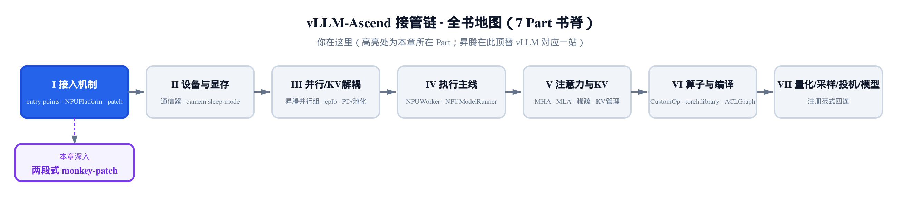
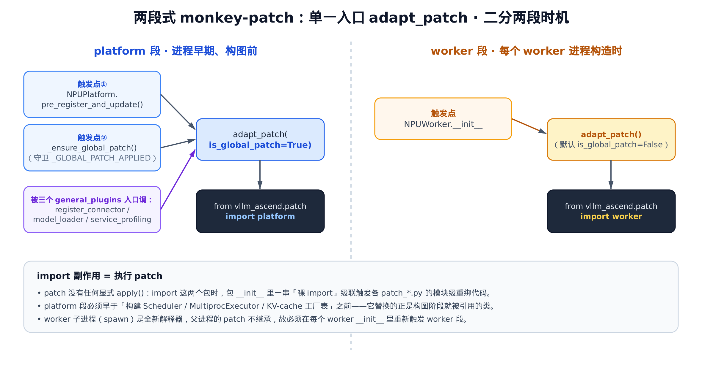
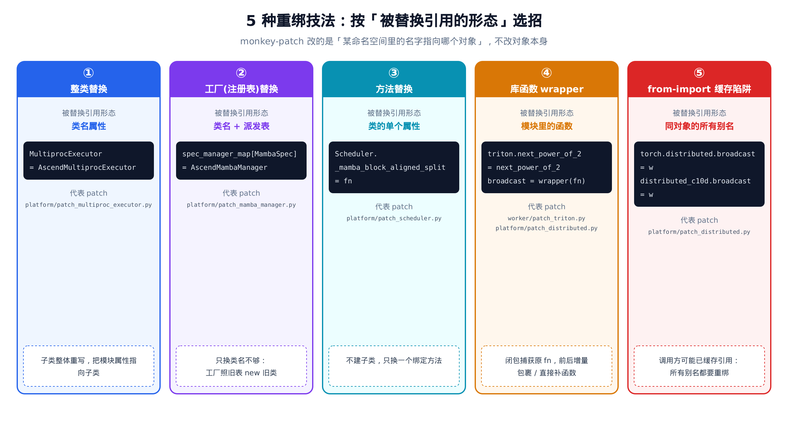
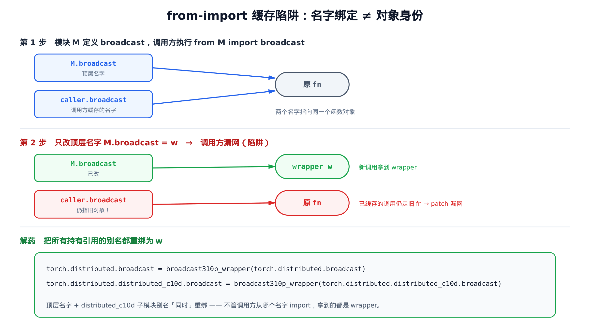

# 第 3 章 两段式 monkey-patch：不改 vLLM 一行源码就整体接管



> **你在这里**——Part I「接入机制」的旗舰地基章。
> 上一章讲清了 vllm-ascend 怎么被 vLLM 发现、并顶替成默认平台。
> 本章解决随之而来的硬问题：选中平台之后，怎么把 vLLM 内部跑不动的函数一段段换掉？
> 下一章顺着这套招式，钻进引擎核心：KV-cache 协调器与内存形态层的 patch。

---

[上一章](../ch02-entry-points-and-npuplatform/narrative/chapter.md)结尾，vllm-ascend 已经赢得了平台的「选举」：`import vllm` 之后，整套引擎认的是 `NPUPlatform`。但「认得这个平台类」只是第一步。vLLM 的源码里还有成百上千个函数、类、库调用，它们在 GPU 上写死了 CUDA 的假设——有的在昇腾 NPU 上根本跑不起来，有的能跑但慢，有的依赖 torch_npu 里压根没有的符号。

vllm-ascend 是 **out-of-tree（OOT，源码树外）插件**：它装在 vLLM 之外，是独立的 pip 包，**不允许改 vLLM 一行源码**。那它凭什么把 vLLM 内部那些函数换成昇腾版？

答案是 **monkey-patch**：在运行期，把 vLLM 某个命名空间里的名字，重新指向 vllm-ascend 自己的实现。这件事的全部精巧之处，被收敛进 `vllm_ascend/utils.py` 里一个只有五行的入口函数 `adapt_patch`。本章就从这五行出发，讲清三件事：**何时打**（两段式时机）、**怎么触发**（import 副作用）、**怎么换**（五种重绑技法）。

## 3.1 五行入口：adapt_patch

先看这个全章唯一的入口。它在 `vllm_ascend/utils.py` 里，短到可以一口气读完：

```python
# vllm_ascend/utils.py:L511-L515
def adapt_patch(is_global_patch: bool = False):
    if is_global_patch:
        from vllm_ascend.patch import platform  # noqa: F401
    else:
        from vllm_ascend.patch import worker  # noqa: F401
```

五行里藏了两个关键设计，值得逐字咂摸。

**第一，它不调用任何 `apply()`。** 你可能预期一个 patch 系统长这样：先收集一堆「补丁对象」，再逐个 `patch.apply()`。这里没有。`adapt_patch` 唯一做的事就是 **import 一个包**——`vllm_ascend.patch.platform` 或 `vllm_ascend.patch.worker`。patch 的执行，完全靠 import 这两个包时跑的「模块级副作用代码」。这套机制是 [§3.3](#33-靠-import-副作用执行-patch) 的主角。

**第二，一个布尔参数 `is_global_patch` 把 patch 劈成两段。** `True` 走 `platform` 包，`False`（默认）走 `worker` 包。为什么要分两段？这就要讲到「时机」。

## 3.2 两段时机：platform 段 vs worker 段

patch 不是越早打越好，也不能越晚越好——它必须卡在「被替换的符号即将被用到」之前那一刻。vllm-ascend 把所有 patch 按这个时机分成两堆，并在 `vllm_ascend/patch/__init__.py` 顶上写下了一段总纲注释，把规矩讲得明明白白：

```python
# vllm_ascend/patch/__init__.py:L17-L27
# ----------------------------------------------------------------------------------
# This module manage the patch for vllm. There are two folders in this module:
# - platform: contains the patches applied before worker starts. It's called by
#             `vllm_ascend.utils.adapt_patch(is_global_patch=True)` in
#             `vllm_ascend.platform.NPUPlatform.pre_register_and_update()` function.
# - worker: contains the patches applied when worker starts. It's called by
#           `vllm_ascend.utils.adapt_patch(is_global_patch=False)` in
#           each worker's `__init__` function.
#
# Once a new patch is added in vllm-ascend, please add the patch description into this file as well.
# ----------------------------------------------------------------------------------
```

- **platform 段**：在 **worker 进程启动之前**打，由 `NPUPlatform.pre_register_and_update()` 调 `adapt_patch(is_global_patch=True)` 触发。
- **worker 段**：在 **worker 进程启动时**打，由每个 worker 的 `__init__` 调 `adapt_patch()` 触发。

下面这张图把两段的触发链摆在一起，先看个全貌，再逐个拆。



> *图注：左半场是 platform 段——三个触发点都汇入 `adapt_patch(is_global_patch=True)`，再 import platform 包。右半场是 worker 段，由 `NPUWorker.__init__` 触发。竖虚线分隔「构图前」与「worker 构造时」两个时刻。底部三条说明了为什么必须分成两段。*

### platform 段触发点①：构图前、进程级

平台被选中后，vLLM 会回调平台类的 `pre_register_and_update`。vllm-ascend 在这个钩子里做的第一件事，就是打全局 patch：

```python
# vllm_ascend/platform.py:L181-L186
    @classmethod
    def pre_register_and_update(cls, parser: FlexibleArgumentParser | None = None) -> None:
        # Adapt the global patch here.
        from vllm_ascend.utils import adapt_patch

        adapt_patch(is_global_patch=True)
        # … 省略：随后把 "ascend" 量化方法注入 argparser、按 is_310p 导入量化配置、
        #         跑 config_deprecated_logging()——与 patch 主线无关 …
```

这个时机很关键：`pre_register_and_update` 跑在**进程早期、vLLM 还没开始构建配置/调度器/执行器图之前**。platform 段要替换的，正是构图阶段就会被引用的那批类——`Scheduler`、`MultiprocExecutor`、KV-cache manager 的工厂表。如果晚一步，等这些类已经被实例化，再去改名字就来不及了。

### platform 段触发点②：子进程里的兜底（回收 ch02 的伏笔）

[上一章](../ch02-entry-points-and-npuplatform/narrative/chapter.md)结尾埋了一颗种子：四个 `register_*`（`general_plugins` 入口）每个都先调一遍 `_ensure_global_patch()`，但当时只点到「会触发 platform 段」，没展开。现在把它讲全：

```python
# vllm_ascend/__init__.py:L20-L51
_GLOBAL_PATCH_APPLIED = False


def _ensure_global_patch():
    """Apply process-wide vLLM patches before engine-core initialization.

    vLLM loads general plugins in engine-core subprocesses. E2E test
    conftest hooks do not run there, so global patches that affect scheduler
    and engine code must also be applied through these plugin entry points.
    """
    global _GLOBAL_PATCH_APPLIED
    if _GLOBAL_PATCH_APPLIED:
        return

    from vllm_ascend.utils import adapt_patch

    adapt_patch(is_global_patch=True)
    _GLOBAL_PATCH_APPLIED = True


def register_connector():
    _ensure_global_patch()

    from vllm_ascend.distributed.kv_transfer import register_connector

    register_connector()
# … 省略：register_model_loader / register_service_profiling 同构——都先调 _ensure_global_patch()
#         再做各自的注册；register() 与 register_model() 不依赖 patch，不调它 …
```

docstring 把动机说透了：vLLM 由 `vllm/plugins/__init__.py` 在 **engine-core 子进程**里加载 `general_plugins`，而 E2E 测试的 conftest 钩子、平台回调不一定在子进程里跑。那些影响 scheduler、engine 的进程级 patch，必须借这几个 plugin 入口在子进程里**补打**一遍。所以触发点②不是触发点①的替代，而是它在另一条进程路径上的兜底。

这就带来一个新问题：触发点①②可能在同一个进程里都被命中（`register_connector` / `register_model_loader` / `register_service_profiling` 三个入口还会**互相**抢着触发）。patch 打两遍会怎样？对大多数重绑来说是幂等的（把名字再指一次同一个对象），但有些 patch 带状态（比如 wrapper 会**叠加**包裹，见 [§3.6](#36-综合样本一处文件三招齐发)），重复打就是 bug。

`_GLOBAL_PATCH_APPLIED` 这个模块级标志位就是为此设的守卫：第一次进来时它是 `False`，跑完 patch 后置 `True`；之后再进来，`if _GLOBAL_PATCH_APPLIED: return` 直接短路。把精简版跑起来，连调三次 `_ensure_global_patch()`，能看到守卫精确地只放行了一次：

| 调用 | 进入时 `_GLOBAL_PATCH_APPLIED` | 动作 | 累计 `adapt_patch(True)` 次数 | 返回后标志 |
|---|---|---|---|---|
| 第 1 次 | `False` | 不命中守卫 → 打 patch → 置 `True` | 1 | `True` |
| 第 2 次 | `True` | 命中守卫 → 直接 `return` | 1 | `True` |
| 第 3 次 | `True` | 命中守卫 → 直接 `return` | 1 | `True` |

三次调用后，`adapt_patch(is_global_patch=True)` 只被真正执行了一次。守卫的正确性靠一个**单调标志**：`_GLOBAL_PATCH_APPLIED` 只可能从 `False` 翻到 `True`、永不回头；一旦翻过，后续任意多次调用都走 `return` 分支，执行 patch 的那段代码再也到不了。这就是「至多一次」的保证。

至此，[上一章](../ch02-entry-points-and-npuplatform/narrative/chapter.md)埋下的那颗种子——`general_plugins` 怎样触发两段式 monkey-patch——算是正式接上了：它触发的就是 platform 段，而本章正在把这套两段式完整摊开。

### worker 段触发点：每个 worker 进程构造时

worker 段的触发点最朴素，就在 `NPUWorker.__init__` 里：

```python
# vllm_ascend/worker/worker.py:L99-L102
        # register patch for vllm
        from vllm_ascend.utils import adapt_patch

        adapt_patch()
        # … 省略：随后 ops.register_dummy_fusion_op() / register_ascend_customop(vllm_config) /
        #         init_ascend_config(vllm_config) 等 worker 构造逻辑 …
```

注意这里 `adapt_patch()` 不带参数，走默认的 `is_global_patch=False`，于是 import 的是 `worker` 包。

为什么 worker 段要推迟到每个 worker 构造时，不能跟 platform 段一起在进程早期打完？两个原因：

1. **它替换的符号构图阶段还用不到。** worker 段换的多是前向算子、模型层、通信器——这些在「搭引擎图」阶段还没被调用，推迟到 worker 里打来得及。
2. **worker 子进程不继承父进程的 patch。** vLLM 用 spawn 起 worker 子进程，spawn 出来的是**全新的 Python 解释器**，父进程在内存里改过的名字绑定一概不带过去。所以哪怕 platform 段在主进程打过了，worker 段也必须在每个 worker 进程内**重新**触发一遍。

## 3.3 靠 import 副作用执行 patch

回到 [§3.1](#31-五行入口adapt_patch) 留的那个悬念：`adapt_patch` 只 import 一个包，patch 是怎么就执行了的？

秘密在包的 `__init__.py`。Python 里 `import 一个包`，会执行该包 `__init__.py` 的顶层代码。vllm-ascend 把 platform 段的 `__init__.py` 写成了一串**裸 import 列表**——每条 import 一执行，就触发对应 `patch_*.py` 模块的顶层代码，而那些顶层代码干的正是「重绑某个 vLLM 符号」：

```python
# vllm_ascend/patch/platform/__init__.py:L17-L50
import os

import vllm_ascend.patch.platform.patch_camem_allocator  # noqa
import vllm_ascend.patch.platform.patch_distributed  # noqa
import vllm_ascend.patch.platform.patch_kv_cache_interface  # noqa
import vllm_ascend.patch.platform.patch_kv_cache_utils  # noqa
import vllm_ascend.patch.platform.patch_mla_prefill_backend  # noqa
from vllm_ascend.utils import is_310p

if not is_310p():
    import vllm_ascend.patch.platform.patch_mamba_config  # noqa
else:
    import vllm_ascend.patch.platform.patch_mamba_config_310  # noqa
# … 省略：一长串模型/协议特化 patch 的裸 import（minimax / glm / deepseek /
#         anthropic / tool_call_parser / torch_accelerator 等约 10 条，结构同上 …
import vllm_ascend.patch.platform.patch_mamba_manager  # noqa

if os.getenv("DYNAMIC_EPLB", "false").lower() in ("true", "1") or os.getenv("EXPERT_MAP_RECORD", "false") == "true":
    import vllm_ascend.patch.platform.patch_multiproc_executor  # noqa

# … 省略：patch_balance_schedule / patch_kv_cache_coordinator / patch_speculative_config 三条 …
import vllm_ascend.patch.platform.patch_scheduler  # noqa
```

读这段，要把它当成一份「按时机排好序的执行脚本」，而不是普通的 import 块。每一行 `import vllm_ascend.patch.platform.patch_xxx` 落地，就等于「打了一个补丁」。这套设计有个很省事的好处：**Python 的 import 天然幂等**——模块只在 `sys.modules` 里初始化一次，重复 import 不再跑顶层代码。所以 `adapt_patch` 被触发点①②反复调用也没关系，真正执行重绑的模块顶层代码只跑一次。（那 [§3.2](#platform-段触发点②子进程里的兜底回收-ch02-的伏笔) 的 `_GLOBAL_PATCH_APPLIED` 守卫到底防什么？它是**分层防护里的进程级一道**：import 本身已经幂等，它省的不是 import，而是每次 `from vllm_ascend.utils import adapt_patch` 再走一遍函数调用的开销，并为带状态的 patch 多加一道进程级保险。真正的防重入幂等，由各 wrapper 自己保证——见 [§3.6](#36-综合样本一处文件三招齐发)。）

更重要的是，这段裸 import 列表里藏了两处**条件加载**骨架——不同环境需要的 patch 集合不一样，用 `if` 包住对应 import 来精确裁剪：

- **SoC**（System on Chip，芯片型号）**分叉**：`if not is_310p()` 二选一加载 `patch_mamba_config` 还是 `patch_mamba_config_310`。310P 是较早的昇腾推理卡，和 A2/A3/A5 系列在某些算子上行为不同，得用不同实现。
- **环境变量门控**：`patch_multiproc_executor` 被 `DYNAMIC_EPLB` / `EXPERT_MAP_RECORD` 两个环境变量包住——**默认根本不加载**，只在开启 EPLB（专家负载均衡）场景才打。这意味着 [§3.4](#技法①整类替换) 要讲的「整类替换」样本，在普通跑法下压根不生效。

worker 段的 `__init__.py` 同理，但条件维度更多：

```python
# vllm_ascend/patch/worker/__init__.py:L18-L70
from vllm.triton_utils import HAS_TRITON

from vllm_ascend.utils import is_310p, vllm_version_is

# v2 model runner patches depend on upstream main APIs beyond v0.21.0.
_V2_MODEL_RUNNER_SUPPORTED = not vllm_version_is("0.21.0")

if HAS_TRITON:
    import vllm_ascend.patch.worker.patch_triton

    if _V2_MODEL_RUNNER_SUPPORTED:
        import vllm_ascend.patch.worker.patch_v2.patch_triton  # noqa

import vllm_ascend.patch.worker.patch_weight_utils  # noqa
import vllm_ascend.patch.worker.patch_distributed  # noqa
# … 省略：分散在各条件块前后的约 10 条无条件 worker patch（minimax / mamba_utils /
#         rejection_sampler / cudagraph / deepseek_mtp / gqa_c8 等），逐条同构、与条件加载主线无关 …

if not is_310p():
    # … 省略：is_310p 为否时加载 qwen3_5 / gdn_attn / qwen3_dflash / qwen3vl …
    pass
else:
    import vllm_ascend.patch.worker.patch_idex_310  # noqa

try:  # noqa: SIM105
    import vllm_ascend.patch.worker.patch_npugraph_ex_triton  # noqa
except ImportError:
    pass

if _V2_MODEL_RUNNER_SUPPORTED:
    # … 省略：patch_v2 整组（patch_uva / input_batch / model_state / block_table /
    #         attn_utils）+ patch_routed_experts_capture——本书基座下全部跳过 …
    pass
```

这里凑齐了四种条件加载维度，正好把「按需裁剪」讲全：

1. **能力门控** `if HAS_TRITON`：只有装了 Triton 后端才打 triton 相关 patch。
2. **版本门控** `_V2_MODEL_RUNNER_SUPPORTED = not vllm_version_is("0.21.0")`：v2 model runner 那组 patch 依赖 v0.21.0 **之后**的上游 API。本书钉死的基座**正是 v0.21.0**，所以这个标志是 `False`——`patch_v2` 整组连同 `patch_routed_experts_capture` **全部不加载**。这是「版本条件加载」最直观的例子：同一份 vllm-ascend 代码，挂在不同 vLLM 版本上，打出的 patch 集合不同。
3. **SoC 门控** `if not is_310p()`：跟 platform 段一样，按芯片型号分叉。
4. **可选依赖门控** `try/except ImportError`：`npugraph_ex` 只在装了对应组件时可用，CPU-only 环境里 import 失败就静默跳过。

把这两份 `__init__.py` 合起来看，「何时打、打哪些」这两个维度，完全由**裸 import 的顺序**和**包住它们的 `if`** 表达出来。没有注册表、没有调度器，就是一串按时机排好的 import。

## 3.4 五种重绑技法

知道了「何时打、怎么触发」，剩下最具体的问题：每个 `patch_*.py` 里到底**怎么换**?

monkey-patch 的本质，是改「某命名空间里的名字指向哪个对象」，**不改对象本身**。但「名字」有好几种形态——它可能是一个类名、一个工厂派发表的表项、一个类的方法、一个库模块里的函数。被换的引用形态不同，下手的招式就不同。vllm-ascend 全仓的 patch，归纳下来正好五招：



> *图注：五张卡片按「被替换引用的形态」排开。①整类替换换类名属性；②工厂替换还要改派发表；③方法替换只换一个绑定方法；④库函数 wrapper 闭包包裹原函数；⑤from-import 缓存陷阱要把同一对象的所有别名都重绑。*

下面挑三个最干净的样本，把前三招解剖清楚；第④⑤招因为牵扯一个微妙的陷阱，单独放 [§3.5](#35-from-import-缓存陷阱) 细讲。

### 技法①：整类替换

最直接的一招：写一个子类继承原类、整体重写关键方法，再把模块里那个**类名**直接指向子类。样本是 `patch_multiproc_executor.py`：

```python
# vllm_ascend/patch/platform/patch_multiproc_executor.py:L24-L211
class AscendMultiprocExecutor(MultiprocExecutor):
    def _init_executor(self) -> None:
        # … 省略：约 180 行从 vLLM 原 MultiprocExecutor 大段复制的执行器内部实现
        #         （消息队列、worker 拉起、ready/death pipe、failure 清理），
        #         核心差异只有下面 make_worker_process 里那一处 daemon=False …
        proc = context.Process(
            target=WorkerProc.worker_main,
            kwargs=process_kwargs,
            name=f"VllmWorker-{rank}",
            daemon=False,
        )
        # … 省略：proc.start() 与返回 UnreadyWorkerProcHandle 的细节 …


# 被替换的原类住在对照基座 vllm/v1/executor/multiproc_executor.py
vllm.v1.executor.multiproc_executor.MultiprocExecutor = AscendMultiprocExecutor
```

招式核心就是**最后一行**：`vllm.v1.executor.multiproc_executor.MultiprocExecutor = AscendMultiprocExecutor`。此后任何代码 `import` 这个模块去拿 `MultiprocExecutor`，拿到的都是昇腾子类。

子类内部那 180 行，绝大多数是从 vLLM 原类**原样复制**的，跟「整类替换」这招本身无关——它们是被替换类的业务体。真正的差异只有一处：`make_worker_process` 里子进程以 `daemon=False` 启动。台账记下的原因很具体：vLLM 原版用 `daemon=True` 起 worker，而 `daemon=True` 的进程**不允许再 fork 子进程**；EPLB 场景需要 worker 再拉起新进程，于是必须把它改成 `daemon=False`。

把精简版跑起来，能直接验证这一招的效果——重绑后模块属性确实换成了子类，且子类是原类的子类：

```text
m.MultiprocExecutor is AscendMultiprocExecutor      → True
issubclass(AscendMultiprocExecutor, MultiprocExecutor) → True
```

### 技法②：工厂（注册表）替换

整类替换有个隐藏前提：你得能拦住「所有 new 这个类的地方」。如果某个类不是被直接 `new`，而是被一张**工厂派发表**按类型查出来再造，那只换类名就不够了。`patch_mamba_manager.py` 就是这种情况：

```python
# vllm_ascend/patch/platform/patch_mamba_manager.py:L18-L53
class AscendMambaManager(MambaManager):
    def __init__(self, kv_cache_spec: MambaSpec, block_pool: BlockPool, **kwargs) -> None:
        super().__init__(kv_cache_spec, block_pool, **kwargs)
        if self.enable_caching:
            self.block_size = kv_cache_spec.block_size

    @classmethod
    def find_longest_cache_hit(cls, ...) -> tuple[list[KVCacheBlock], ...]:
        # … 省略：约 12 行块命中扫描实现（按 alignment 过滤、null_block 填充）…


# 类名与工厂派发表 spec_manager_map 都住在对照基座 vllm/v1/core/single_type_kv_cache_manager.py
single_type_kv_cache_manager.MambaManager = AscendMambaManager
single_type_kv_cache_manager.spec_manager_map[MambaSpec] = AscendMambaManager
```

注意**最后两行**。第一行是技法①那套——把类名 `MambaManager` 指向子类。但单这一行不够：vLLM 在构建 KV-cache 时，是按 `KVCacheSpec` 的类型去查一张派发表 `spec_manager_map`，查到哪个 manager 类就 `new` 哪个。这张表在 patch 之前，`MambaSpec` 这一项还指着**原版** `MambaManager`。

所以必须有第二行 `spec_manager_map[MambaSpec] = AscendMambaManager`，把派发表里 `MambaSpec` 对应的表项也改掉。否则即便类名换了，工厂照着旧表，依然会 `new` 出原版 manager——patch 形同虚设。一句话：**「谁来 new 这个类」决定了你必须连派发表一起改。**

精简版同时断言了这两处，缺一不可：

```text
m.MambaManager is AscendMambaManager                → True
m.spec_manager_map[MambaSpec] is AscendMambaManager → True
```

### 技法③：方法替换

有时候你不想动整个类——原类绝大部分都对，只有**一个方法**有问题。这时建子类太重，直接换那一个方法更干净。`patch_scheduler.py` 是教科书式的样本：

```python
# vllm_ascend/patch/platform/patch_scheduler.py:L1-L45
from vllm.v1.core.sched.scheduler import Scheduler
from vllm.v1.request import Request


def _mamba_block_aligned_split(
    self,
    request: Request,
    num_new_tokens: int,
    num_new_local_computed_tokens: int = 0,
    num_external_computed_tokens: int = 0,
) -> int:
    num_computed_tokens = request.num_computed_tokens + num_new_local_computed_tokens + num_external_computed_tokens
    if num_computed_tokens < max(request.num_prompt_tokens, request.num_tokens - 1):
        block_size = self.cache_config.block_size
        last_cache_position = request.num_tokens - request.num_tokens % block_size
        if self.use_eagle:
            last_cache_position = max(last_cache_position - block_size, 0)
        num_computed_tokens_after_sched = num_computed_tokens + num_new_tokens
        if num_computed_tokens_after_sched < last_cache_position:
            num_new_tokens = num_new_tokens // block_size * block_size
        elif num_computed_tokens < last_cache_position < num_computed_tokens_after_sched:
            num_new_tokens = last_cache_position - num_computed_tokens
        else:
            pass
    return num_new_tokens


# 被换掉的原方法住在对照基座 vllm/v1/core/sched/scheduler.py（那里多一句 assert）
Scheduler._mamba_block_aligned_split = _mamba_block_aligned_split
```

招式核心在**最后一行**，但要看懂它，先看函数签名第一个形参——`self`。这是个**带显式 `self` 的模块级普通函数**。Python 里，`Scheduler._mamba_block_aligned_split = _mamba_block_aligned_split` 把这个函数挂到类上之后，通过实例去调它（`scheduler._mamba_block_aligned_split(...)`），实例会被自动当作 `self` 传进去——和类里原生定义的方法行为一致。

跟技法①的区别要划清楚：**不建子类、不动其它任何方法，只换这一个绑定方法。** 原 `Scheduler` 类对象本身没变，类里别的方法、别的实例属性全照旧，只有 `_mamba_block_aligned_split` 这一个名字被换了指向。台账记的原因：原版 vLLM 这个方法里有一句 `assert`，当外部 KV connector 命中时会触发失败，昇腾版去掉了这句 `assert`。

精简版验证的正是「换了方法、但没换类」这件事：

```text
Scheduler._mamba_block_aligned_split is <新函数>  → True   # 方法被换
sched_mod.Scheduler is <原来那个 Scheduler 类>     → True   # 类没被换
```

## 3.5 from-import 缓存陷阱

技法④⑤都跟「换库里的一个函数」有关，但中间藏着一个能让 patch **悄悄漏网**的陷阱，必须单独讲透。

先说技法④——**库函数 wrapper**。最干净的样本只有一行，在 `patch_triton.py`：

```python
# vllm_ascend/patch/worker/patch_triton.py:L1-L20
from vllm.triton_utils import HAS_TRITON, triton
from vllm.utils.math_utils import next_power_of_2
# … 省略：causal_conv1d / fla 等昇腾算子的 import …

triton.next_power_of_2 = next_power_of_2
# … 省略：causal_conv1d 等若干算子在库模块上的同构重绑，以及 HAS_TRITON 为 False
#         时注入的两个纯 PyTorch 回退算子实现 …
```

`triton.next_power_of_2 = next_power_of_2`——把 vLLM 自带的 `next_power_of_2` 函数，直接挂到 `triton` 这个库模块上。台账原因很实在：torch_npu 捆绑的那个 Triton 没有 `next_power_of_2` 这个函数，而 vLLM 和 vllm-ascend 在 94 处以上调用它。这一招不涉及类、不涉及 `self`，就是「给库模块补/换一个函数」。

听起来很简单。但当被换的函数**已经被别人 `from ... import` 过**，麻烦就来了。

### 名字绑定 ≠ 对象身份

Python 里 `from M import f` 干的事，是在**导入方自己的命名空间**里新建一个名字、指向 `M.f` 当时指的那个函数对象。关键在于：这之后导入方持有的是「指向那个对象的独立引用」，**和 `M.f` 这个名字本身脱钩了**。

于是只要你后来做 `M.f = g`，你改的只是 `M` 命名空间里 `f` 的指向；那些早先 `from M import f` 的模块，它们手里缓存的名字**仍然指向旧对象**，根本不知道 `M.f` 已经换人了。patch 就这样漏网。



> *图注：第 1 步两个名字指向同一个原函数。第 2 步只改顶层 `M.broadcast`，调用方缓存的名字仍指旧 fn——patch 漏网。解药是把所有持有引用的别名一起重绑。*

vllm-ascend 在 `patch_distributed.py`（platform 段）里给 `torch.distributed.broadcast` 打 310P 补丁时，正面撞上了这个陷阱，也给出了标准解法——**技法⑤：把同一个对象的所有别名都重绑**：

```python
# vllm_ascend/patch/platform/patch_distributed.py:L33-L89
def communication_adaptation_310p():
    def broadcast310p_wrapper(fn):
        def broadcast310p(tensor, src=0, group=None, async_op=False, group_src=None):
            root = group_src if group_src is not None else src

            if tensor.device == torch.device("cpu"):
                return fn(tensor, src=root, group=group, async_op=async_op)
            rank = torch.distributed.get_rank(group)
            world_size = torch.distributed.get_world_size(group)
            tensor_list = [torch.empty_like(tensor) for _ in range(world_size)]
            tensor_list[rank] = tensor
            torch.distributed.all_gather(tensor_list, tensor, group=group)
            tensor[...] = tensor_list[src]
            if async_op:
                return NullHandle()
            else:
                return None

        return broadcast310p

    torch.distributed.broadcast = broadcast310p_wrapper(torch.distributed.broadcast)
    torch.distributed.distributed_c10d.broadcast = broadcast310p_wrapper(torch.distributed.distributed_c10d.broadcast)
    # … 省略：all_reduce 同款 wrapper——仅对 int64 张量走自定义归约，否则透传原 fn，
    #         并同样在 torch.distributed 与 distributed_c10d 两个名字下双绑 …


if get_ascend_device_type() == AscendDeviceType._310P:
    communication_adaptation_310p()
```

这段把技法④⑤一起演示了，逐层看：

**技法④（wrapper）**：`broadcast310p_wrapper(fn)` 是个闭包，用参数 `fn` **捕获原函数**，返回的新函数 `broadcast310p` 在前后补上 310P 的张量对齐逻辑。注意 `if tensor.device == torch.device("cpu"): return fn(...)` 这一句——条件不满足时**回落到原 fn**。这就是 wrapper 的精髓：增量包裹，而不是推倒重写；不该我管的输入，原样交还给原函数。

**技法⑤（双绑解陷阱）**：紧接着两行，把 wrapper 同时绑到 `torch.distributed.broadcast` 和 `torch.distributed.distributed_c10d.broadcast` 两个名字上。为什么是两个？因为**同一个函数对象，可能经多条 import 路径到达**——`torch.distributed.broadcast` 和 `torch.distributed.distributed_c10d.broadcast` 起初指的是同一个 fn（前者顺带一提是后者的再导出）。有些调用方写 `from torch.distributed.distributed_c10d import broadcast`，缓存的是子模块那条路径上的名字。只改顶层、不改子模块，这部分调用方就漏网了。两个名字都得 patch，才覆盖得了所有调用点。

还有一处运行期条件加载值得一提：整个 `communication_adaptation_310p()` 被最后那个 `if get_ascend_device_type() == AscendDeviceType._310P:` 包住。也就是说，**非 310P 设备 import 这个模块，顶层代码跑完什么 patch 都没打**——这跟 [§3.3](#33-靠-import-副作用执行-patch) 里 `__init__.py` 用 `if` 决定「要不要 import 某模块」是互补的两层裁剪：一层在「装不装」、一层在「装了之后跑不跑」。

把精简版跑起来，能同时验证④的回落和⑤的双绑都生效（这里用哨兵函数占住原 `fn`，看 wrapper 是否真捕获了它）：

```text
dist.broadcast(...)  == "TOP_FALLBACK"     # ④ 顶层 wrapper 回落到原 fn
c10d.broadcast(...)  == "C10D_FALLBACK"    # ⑤ 子模块别名也被换、且各自捕获了自己的原 fn
dist.broadcast.__name__ == "broadcast310p" # 换上去的确实是那个 wrapper
c10d.broadcast.__name__ == "broadcast310p"
```

两个名字各自回落到**各自**捕获的哨兵，说明它们是被独立重绑的两个 wrapper、都正确捕获了对应的原函数——双绑确实落到了实处。

## 3.6 综合样本：一处文件三招齐发

最后看一个把多招揉在一起的真实样本——worker 段的 `patch_distributed.py`。它一次性演示了整类替换、库函数 wrapper、from-import 双绑三招，正好给本章收尾：

```python
# vllm_ascend/patch/worker/patch_distributed.py:L79-L233
def _wrap_destroy_distributed_environment(destroy_fn):
    if getattr(cast(Any, destroy_fn), "_hccl_registry_clearing_wrapped", False) is True:
        return destroy_fn

    @wraps(destroy_fn)
    def wrapped(*args, **kwargs):
        try:
            return destroy_fn(*args, **kwargs)
        finally:
            _HCCL_PG_REGISTRY.clear()

    cast(Any, wrapped)._hccl_registry_clearing_wrapped = True
    return wrapped


def _patch_destroy_distributed_environment():
    destroy_fn = _wrap_destroy_distributed_environment(vllm.distributed.parallel_state.destroy_distributed_environment)
    vllm.distributed.parallel_state.destroy_distributed_environment = destroy_fn
    vllm.distributed.destroy_distributed_environment = destroy_fn


class GroupCoordinatorPatch(GroupCoordinator):
    def __init__(self, group_ranks, local_rank, torch_distributed_backend, use_device_communicator, ...):
        # … 省略：约 100 行 HCCL pg 复用注册表 / NPUCommunicator / gloo cpu_group 的构造细节 …

    def destroy(self):
        # … 省略：cpu_group / device_communicator 等逐项释放 …

    def all_to_all(self, input_, scatter_dim=0, gather_dim=-1, scatter_sizes=None, gather_sizes=None):
        if self.world_size == 1:
            return input_
        # … 省略：scatter_dim / gather_dim 合法性 assert …
        return self.device_communicator.all_to_all(input_, scatter_dim, gather_dim, scatter_sizes, gather_sizes)


# 被替换的原 GroupCoordinator / destroy_distributed_environment 住在对照基座 vllm/distributed/parallel_state.py
vllm.distributed.parallel_state.GroupCoordinator = GroupCoordinatorPatch
_patch_destroy_distributed_environment()
```

三招对号入座：

- **技法①（整类替换）**：`GroupCoordinatorPatch` 继承 `GroupCoordinator`，末行 `vllm.distributed.parallel_state.GroupCoordinator = GroupCoordinatorPatch` 把类名换掉。替换的核心动机，是子类新增了一个 `all_to_all` 方法——vLLM 原版 `GroupCoordinator` **根本没有这个方法**，而昇腾的 MoE 需要它。
- **技法④（wrapper）**：`_wrap_destroy_distributed_environment` 用 `@wraps` 把原 `destroy_fn` 包一层，在原函数跑完后的 `finally` 里清 HCCL 进程组注册表。这里有个比 [§3.5](#35-from-import-缓存陷阱) 更讲究的细节——**幂等标记**：包好的函数被打上 `wrapped._hccl_registry_clearing_wrapped = True`；下次再调 `_wrap_destroy_distributed_environment`，开头那句 `if getattr(..., "_hccl_registry_clearing_wrapped", False): return destroy_fn` 会发现「这个已经包过了」，直接原样返回，**绝不二次包裹**。这正回应了 [§3.2](#platform-段触发点②子进程里的兜底回收-ch02-的伏笔) 的担忧：带状态的 wrapper 重复打就是 bug，所以它自己也得防重入。
- **技法⑤（双绑）**：`_patch_destroy_distributed_environment` 把同一个 `destroy_fn` 同时绑到 `parallel_state.destroy_distributed_environment` 和再导出别名 `vllm.distributed.destroy_distributed_environment` 两个名字上——又是一次堵 from-import 缓存陷阱的双绑。

精简版把三招连同那个幂等标记一起验证了，其中最值得看的是「再包一次会被挡回」这条：

```text
ps.GroupCoordinator is GroupCoordinatorPatch                 → True   # ① 整类替换
GroupCoordinatorPatch 有 all_to_all、原 GroupCoordinator 没有 → True   # ① 的动机
ps.destroy... is dist.destroy...                            → True   # ⑤ 两个别名同绑一个 wrapper
wrapped._hccl_registry_clearing_wrapped                      → True   # ④ 幂等标记已打
_wrap_destroy_distributed_environment(wrapped) is wrapped    → True   # ④ 再包一次被挡回、不叠加
wrapped() == "destroyed"                                     → True   # ④ wrapper 仍委托原函数
```

## 小结

这一章把 vllm-ascend「不改 vLLM 一行源码就整体接管」的招式总纲拆完了。三条主线收束成一句话：**一个五行入口 `adapt_patch`，靠一个布尔参数二分两段时机，靠 import 副作用执行 patch，靠五种重绑技法换掉具体符号。**

- **时机**：platform 段卡在构图前（触发点①平台回调 + 触发点②子进程兜底，带 `_GLOBAL_PATCH_APPLIED` 幂等守卫）；worker 段卡在每个 worker 构造时——因为 spawn 子进程不继承父进程的 patch。
- **触发**：没有 `apply()`，patch 全靠 import 包时的模块级副作用；`is_310p` / `HAS_TRITON` / `vllm_version_is` / 环境变量四个维度的条件加载，精确裁剪每个环境该打哪些 patch。本书钉死的 v0.21.0 基座上，`patch_v2` 整组被版本门控挡在门外。
- **技法**：整类替换换类名（`patch_multiproc_executor.py`）；工厂替换连派发表一起改（`patch_mamba_manager.py`）；方法替换只换一个绑定方法（`patch_scheduler.py`）；库函数 wrapper 闭包包裹原 fn（`patch_triton.py`）；from-import 缓存陷阱要把同一对象的所有别名都重绑（`patch_distributed.py`）。

[下一章](../ch04-patch-engine-core-kvcache/narrative/chapter.md)我们就拿着这套招式总纲，钻进引擎核心——看 KV-cache 协调器与内存形态层这几处最要紧的 platform 段 patch，具体替换了 vLLM 的哪些行为、又为什么非换不可。
