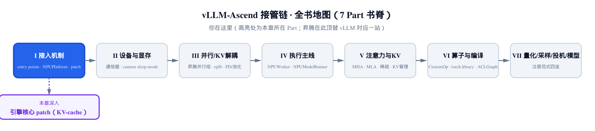
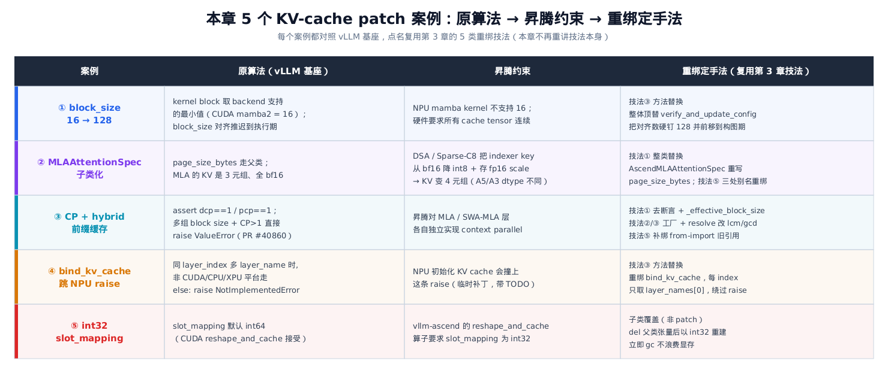
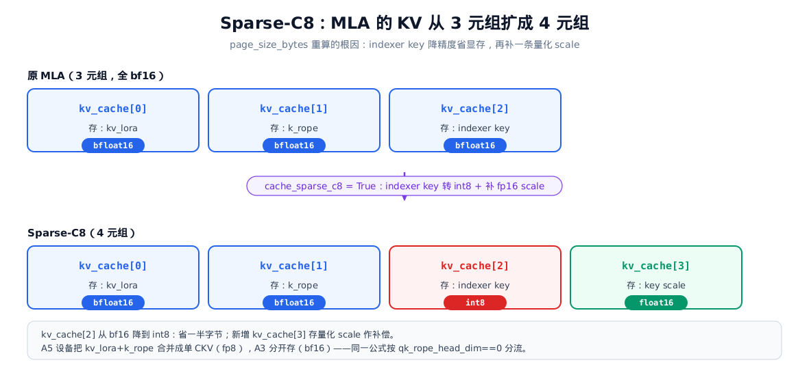
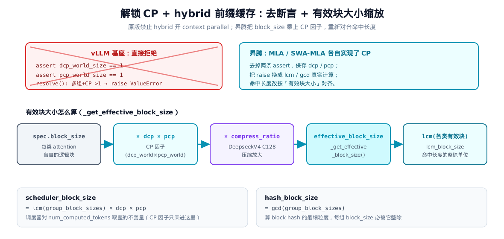

# 第 4 章 顶替引擎核心：KV-cache 与内存形态层的昇腾化 patch



> **你在这里**——Part I「接入机制」的落地章。
> 上一章备齐了 5 种 monkey-patch 技法，那是工具箱。
> 本章拿这套工具，钻进引擎核心最硬的一层：KV-cache。
> 下一章仍在 Part I：第三种接管手段。
> 不改源码，只填一份 config 的 check_and_update_config。

---

[上一章](../ch03-two-stage-monkey-patch/narrative/chapter.md)把 vllm-ascend 接管 vLLM 的「手法」讲透了：两段式时机、靠 import 副作用触发、5 种重绑技法。但那一章举的例子是教学性的——挑短小好懂的来演示招式。真正考验工程功力的，是把这些招式用在引擎最核心、最不容出错的地方：**KV-cache**。

KV-cache 是大模型推理的命根子。每个 token 的注意力 key/value 都缓存在这里，按「块（block）」分页管理，跨请求复用前缀。它的形态——块多大、每块多少字节、什么数据类型、命中怎么对齐——同时被三件事卡死：**模型结构**（MLA、mamba、稀疏注意力各有各的张量布局）、**并行策略**（context parallel 把序列切给多个 rank）、**硬件算子**（昇腾 NPU 的 kernel 对块大小、连续性、dtype 有自己的硬约束）。vLLM 的原实现，处处写死了 CUDA 的假设——比如 `vllm/v1/core/kv_cache_coordinator.py` 里那两条 `assert dcp_world_size == 1`（DCP，decode context parallel，解码期上下文并行）/ `assert pcp_world_size == 1`（PCP，prefill context parallel，预填期上下文并行），干脆禁掉了 hybrid 模型开 context parallel。要让它在昇腾上既正确又跑得动，就得逐处对照、逐处重绑。

本章不再重讲技法本身（要回顾招式，翻 [上一章](../ch03-two-stage-monkey-patch/narrative/chapter.md)），而是讲**怎么把招式用对地方**。我们挑 5 个真实案例，每个都走同一条三段式叙事线：

1. **原算法**——vLLM 基座原来怎么算；
2. **昇腾约束**——为什么这套算法在 NPU 上不成立；
3. **重绑定手法**——patch 怎么改，点名它用了上一章哪一招。



> *图注：5 个案例按「原算法 → 昇腾约束 → 重绑定手法」三段对照排开。注意最右列：每个案例都点名复用第 3 章的某一类技法，本章只点名、不重讲招式。案例 ⑤ 是个例外——它不在 `patch/` 目录里，是昇腾自有 worker 的子类覆盖，放在这里作收尾，凑齐「KV-cache 形态被硬件约束改写」的全景。*

这 5 个案例不是随便挑的。前两个（block_size、MLAAttentionSpec）改的是 **KV-cache 的几何形态**——块多大、每块多少字节；第三个（CP+hybrid）改的是 **命中对齐的算术**；后两个（bind_kv_cache、slot_mapping）改的是 **绑定与寻址的实现细节**。从形态到对齐到寻址，正好覆盖了 KV-cache 从「定义」到「使用」的全链路。

---

## 4.1 案例一：block_size 从 16 到 128

### 原算法：vLLM 把对齐推迟，按 backend 的最小 kernel 块走

先看 mamba 这类混合注意力模型的麻烦在哪。这种模型一半层是标准注意力、一半层是 mamba（状态空间模型）。两类层的 KV-cache 长得完全不一样：注意力层按 token 存 key/value，mamba 层存的是一团固定大小的「状态」。vLLM 要求二者的「页（page）」大小能对齐——注意力的页必须 ≥ mamba 的页，否则内存账算不平。

vLLM 基座怎么处理？它在模型配置的早期验证阶段**故意什么都不算**，把对齐推迟到后面：

```python
# vllm/model_executor/models/config.py:L195-L215
class HybridAttentionMambaModelConfig(VerifyAndUpdateConfig):
    @classmethod
    def verify_and_update_config(cls, vllm_config: "VllmConfig") -> None:
        """
        Perform early validation and setup for hybrid attention/mamba models.

        Block size alignment with mamba page sizes is handled later by
        Platform.update_block_size_for_backend(), which runs after model
        layers are constructed and the attention backend is known.
        ...
        """
        cache_config = vllm_config.cache_config
        # … 省略：calculate_kv_scales 关闭的告警分支 …
        # Enable FULL_AND_PIECEWISE by default
        MambaModelConfig.verify_and_update_config(vllm_config)
```

docstring 写得很明白：block size 对齐是**后面** `Platform.update_block_size_for_backend()` 干的活，那一步要等模型层构建完、注意力后端确定之后才跑。为什么推迟？因为「对齐到多大」取决于后端 kernel 支持的块粒度，而后端要晚一点才知道。真到对齐那一步，算法长这样：

```python
# vllm/platforms/interface.py:L614-L644
        # Get kernel block alignment from the backend's supported sizes
        with set_current_vllm_config(vllm_config):
            kernel_block_alignment_size = max(
                min(
                    s.base if isinstance(s, MultipleOf) else s
                    for s in backend_cls.get_supported_kernel_block_sizes()
                ),
                cache_config.block_size,
            )
        # … 省略：mamba_cache_mode == "all" 的 chunk 对齐分支 …
        else:
            # Without prefix caching, use minimum block size that satisfies
            # both backend alignment and mamba page size compatibility
            attn_block_size = kernel_block_alignment_size * cdiv(
                mamba_page_size,
                kernel_block_alignment_size * attn_page_size_1_token,
            )
```

关键在 `kernel_block_alignment_size`——它取 `backend_cls.get_supported_kernel_block_sizes()` 里的最小值。对 CUDA 的 mamba2 后端，这个最小值是 **16**。也就是说，注意力块大小会被对齐到 16 的倍数。

### 昇腾约束：NPU 的 mamba kernel 不认 16

问题来了：昇腾 NPU 的 mamba kernel 根本不支持 16 这个块粒度。它处理状态的最小单位是 **128**。如果还按 16 对齐，kernel 直接跑不起来。

更狠的还有一条硬件约束：昇腾要求**所有 cache tensor 在显存里严格连续**。这意味着注意力的页大小必须和 mamba 的页大小**恰好相等**，不能只是「≥」。差一个字节，张量就不连续，NPU 不接受。

### 重绑定手法：技法③ 整体顶替 verify_and_update_config

昇腾的对策是用**技法③（方法替换）**，把整个 `verify_and_update_config` 顶替掉。它做两件事：把对齐数硬钉成 128，并把对齐计算**前移**到配置阶段（不再推迟）。核心是这一段：

```python
# vllm_ascend/patch/platform/patch_mamba_config.py:L39-L83
    kernel_block_size = 128
    model_cls, _ = ModelRegistry.resolve_model_cls(
        model_config.architecture,
        model_config=model_config,
    )

    # get mamba block size
    mamba_shapes = model_cls.get_mamba_state_shape_from_config(vllm_config)
    mamba_dtypes = model_cls.get_mamba_state_dtype_from_config(vllm_config)
    mamba_sizes = []
    for shape, dtype in zip(mamba_shapes, mamba_dtypes):
        mamba_sizes.append(math.prod(shape) * get_dtype_size(dtype))
    ssm_block_page_size, conv_block_page_size = max(mamba_sizes), min(mamba_sizes)

    # … 省略：纯线性注意力（只有 SSM 无 conv）的 conv_block_page_size=0 分支 …

    # NOTE(zxr): because of the limit of Ascend Hardware, we need to keep
    # all cache tensors contiguous, so we align the page size of ssm_block
    # and single attn_block
    if model_config.use_mla:
        # … 省略：MLA 路径的单 token K/rope 字节核算 …
    else:
        attn_num_kv_heads = model_config.get_num_kv_heads(parallel_config)
        attn_head_size = model_config.get_head_size()
        attn_single_token_k_page_size = attn_head_size * attn_num_kv_heads * get_dtype_size(kv_cache_dtype)
        attn_token_page_size = 2 * attn_head_size * attn_num_kv_heads * get_dtype_size(kv_cache_dtype)

    attn_block_size = kernel_block_size * cdiv(ssm_block_page_size, kernel_block_size * attn_single_token_k_page_size)
    assert attn_single_token_k_page_size * attn_block_size == ssm_block_page_size, (
        "Cannot align ssm_page_size and attn_page_size."
    )

    # override attention block size if either (a) the
    # user has not set it or (b) the user has set it
    # too small.
    if cache_config.block_size is None or cache_config.block_size < attn_block_size:
        cache_config.block_size = attn_block_size
        # … 省略：logger.info 打印新块大小 …
```

注意第一行 `kernel_block_size = 128`——这是写死的常量，直接取代了 CUDA 路径里那个「从 backend 查最小 kernel 块」的逻辑。算块大小的公式形态和基座一模一样：

$$
\mathrm{attn\_block\_size} = \mathrm{kernel\_block} \times \left\lceil \frac{\mathrm{ssm\_page}}{\mathrm{kernel\_block} \times \mathrm{attn\_token}} \right\rceil
$$

一句人话翻译：先看一个 mamba 状态页（`ssm_page`）能装下多少个「注意力单 token 的 key 字节」（`attn_token`），把这个数向上取整到 `kernel_block` 的倍数，就是注意力块该有多大。`cdiv` 是向上整除。（`attn_token` 即代码里的 `attn_single_token_k_page_size`，`ssm_page` 即 `ssm_block_page_size`，`kernel_block` 即写死的 `kernel_block_size = 128`。）

**`kernel_block` 从 16 换成 128 的真实代价**是什么？看那行 `assert`：它要求 `attn_token × attn_block_size` **恰好等于** `ssm_page`，多一字节都不行——这正是「cache tensor 连续」的硬性体现。当 `ssm_page / attn_token` 已经是 128 的倍数时，128 和 16 算出的块大小相同；但 NPU 的 kernel 物理上只能按 128 的粒度读写状态，所以哪怕结果数字一样，对齐数也**必须**是 128，否则 kernel 拿到一个它不认的步长。

来一组数走一遍。假设一个非 MLA 的混合模型，注意力头 8 个、head_size 64、KV dtype 是 bf16（每元素 2 字节）：

| 量 | 计算 | 取值 |
|---|---|---|
| `attn_single_token_k_page_size`（单 token K 字节） | 64 × 8 × 2 | 1024 |
| `ssm_block_page_size`（mamba 状态页字节） | 模型给定 | 131072 |
| `cdiv(ssm, kernel × attn_token)` | ⌈131072 / (128 × 1024)⌉ = ⌈1⌉ | 1 |
| `attn_block_size` | 128 × 1 | **128** |
| `assert` 校验 | 1024 × 128 = 131072 = ssm ✓ | 通过 |

块大小落在 128，注意力页 `1024 × 128 = 131072` 字节，和 mamba 状态页严丝合缝相等——cache tensor 连续，NPU 收货。最后一步把这个 128 写回 `cache_config.block_size`，整个引擎后续都按 128 分页。重绑发生在文件末行，是标准的技法③一行赋值：

```python
# vllm_ascend/patch/platform/patch_mamba_config.py:L119
vllm.model_executor.models.config.HybridAttentionMambaModelConfig.verify_and_update_config = verify_and_update_config
```

注意昇腾还顺手把「对齐」从原来的「推迟到执行期」**前移到了构图期**——因为 NPU 的块大小不依赖运行时才知道的 backend 信息，128 是写死的，越早定下来越省事。

---

## 4.2 案例二：MLAAttentionSpec 子类化，把 KV 从 3 元组扩成 4 元组

### 原算法：DSA-MLA 的 KV 是 3 元组，页字节走父类

MLA（Multi-head Latent Attention，多头潜在注意力，DeepSeek 系的招牌结构）把 KV 压成一个低秩潜向量再加一段旋转位置编码，省显存。vLLM 用 `MLAAttentionSpec` 这个 spec 类描述它的 KV-cache 形态——每块多少字节、什么 dtype。基座的实现里，它继承 `FullAttentionSpec`，自己只补几个 DeepSeek 专用字段，页字节的算法走父类：

```python
# vllm/v1/kv_cache_interface.py:L323-L355
@dataclass(frozen=True, kw_only=True)
class MLAAttentionSpec(FullAttentionSpec):
    # TODO(Lucas/Chen): less hacky way to do this
    cache_dtype_str: str | None = None
    # DeepseekV4 only fields. Non-DeepseekV4 MLA models leave these at defaults.
    alignment: int | None = None  # Default to None for no padding.
    compress_ratio: int = 1  # Default to 1 for no compression.
    model_version: str | None = None
    # … 省略：__post_init__ / storage_block_size …
    @property
    def real_page_size_bytes(self) -> int:
        if self.cache_dtype_str == "fp8_ds_mla":
            if self.model_version == "deepseek_v4":
                return self.storage_block_size * 584
            return self.block_size * 656
        return (
            self.storage_block_size
            * self.num_kv_heads
            * self.head_size
            * get_dtype_size(self.dtype)
        )
```

这套算法背后是个「3 元组 KV」的世界观：这套算法面对的是 DSA 系 MLA——它的一块 KV 由三段张量组成（普通 MLA 只有 `kv_lora`、`k_rope` 两段，DSA 多出稀疏索引器（indexer）的 key），而且**三段全是 bf16**。页字节就是「块大小 × 头数 × head_size × dtype 字节」这么直白一乘。

### 昇腾约束：DSA / Sparse-C8 把 KV 撑成 4 元组

昇腾要支持一类新结构：DSA（DeepSeek Sparse Attention）配上 **Sparse-C8** 量化。这玩意儿动了 KV 的根本布局：



> *图注：昇腾设备分 A3、A5 两代，在 KV 张量合并策略上有差异。上半是原版 3 元组，三段全 bf16。下半是 Sparse-C8 的 4 元组——indexer key 从 bf16 降到 int8（省一半字节），并新增第 4 段存 fp16 量化 scale 作补偿。A5 设备还会把 kv_lora 和 k_rope 合并成单个 fp8 的 CKV 张量，A3 设备则分开存 bf16，同一公式靠 qk_rope_head_dim 是否为 0 来分流。*

变化有两处：indexer 的 key（原本第 3 段 bf16）**降到 int8**，省一半显存；为了补偿量化精度，再加**第 4 段**存 fp16 的量化 scale。3 元组变 4 元组，页字节的算法完全不是原来那个样子了。

### 重绑定手法：技法① 整类替换 + 技法⑤ 三处别名重绑

页字节算法变了，又不能改 vLLM 源码，那就**技法①（整类替换）**：写一个子类 `AscendMLAAttentionSpec` 继承 `MLAAttentionSpec`，新增字段、重写 `page_size_bytes`：

```python
# vllm_ascend/patch/platform/patch_kv_cache_interface.py:L29-L89
@dataclass(frozen=True)
class AscendMLAAttentionSpec(MLAAttentionSpec):
    """MLAAttentionSpec extended to support DSA models, with optional Sparse C8 support.

    When Sparse C8 is enabled, the KV cache tuple changes from
    (kv_cache[0]: bfloat16, kv_cache[1]: bfloat16, kv_cache[2]: bfloat16)
    to
    (kv_cache[0]: bfloat16, kv_cache[1]: bfloat16, kv_cache[2]: int8, kv_cache[3]: float16).
    … 省略：4 段 KV 的语义说明（kv_cache[2] 转 int8 省显存、kv_cache[3] 存量化 scale）…
    """

    scale_dim: int = 0
    scale_dtype: torch.dtype = torch.int8
    sparse_head_dim: tuple[int, ...] | None = None
    cache_sparse_c8: bool = False
    c8_k_cache_dtype: torch.dtype = field(default_factory=_get_c8_k_cache_dtype)
    c8_k_scale_cache_dtype: torch.dtype = field(default_factory=_get_c8_k_scale_cache_dtype)

    @property
    def page_size_bytes(self) -> int:
        if self.cache_sparse_c8:
            assert self.sparse_head_dim is not None
            assert len(self.sparse_head_dim) == 3
            num_heads_per_page = self.block_size * self.num_kv_heads

            kv_lora_rank, qk_rope_head_dim, index_head_dim = self.sparse_head_dim

            # A5: kv_lora and k_rope are merged into a single CKV tensor (fp8).
            # A3: separate kv_lora + k_rope (bf16).
            if qk_rope_head_dim == 0:
                kv_dtype = self.c8_k_cache_dtype  # A5 CKV: float8_e4m3fn
                kv_dim = kv_lora_rank
            else:
                kv_dtype = self.dtype  # A3 kv_lora + k_rope: bfloat16
                kv_dim = kv_lora_rank + qk_rope_head_dim

            kv_bytes = num_heads_per_page * kv_dim * get_dtype_size(kv_dtype)
            qli_bytes = num_heads_per_page * index_head_dim * get_dtype_size(self.c8_k_cache_dtype)
            qli_scale_bytes = num_heads_per_page * 1 * get_dtype_size(self.c8_k_scale_cache_dtype)
            return kv_bytes + qli_bytes + qli_scale_bytes

        return (
            self.block_size
            * self.num_kv_heads
            * (self.head_size * get_dtype_size(self.dtype) + self.scale_dim * get_dtype_size(self.scale_dtype))
        )
```

Sparse-C8 路径的页字节是三段相加：

$$
\mathrm{page\_size\_bytes} = \mathrm{kv\_bytes} + \mathrm{qli\_bytes} + \mathrm{qli\_scale\_bytes}
$$

`kv_bytes` 是 `kv_lora`（A3 下还含 `k_rope`）那段，`qli_bytes` 是 int8 的 indexer key，`qli_scale_bytes` 是 fp16 的量化 scale。算一组 A3 设备的账（`qk_rope_head_dim ≠ 0`），取 block_size=128、num_kv_heads=1、`sparse_head_dim = (kv_lora_rank=512, qk_rope_head_dim=64, index_head_dim=128)`：

| 段 | 计算 | 字节 |
|---|---|---|
| `kv_bytes`（kv_lora+k_rope, bf16） | 128 × (512+64) × 2 | 147456 |
| `qli_bytes`（indexer key, int8） | 128 × 128 × 1 | 16384 |
| `qli_scale_bytes`（scale, fp16） | 128 × 1 × 2 | 256 |
| **合计** | — | **164096** |

对比一下：如果 indexer key 还按原来的 bf16 存，那段是 `128 × 128 × 2 = 32768` 字节。换成 int8 后 indexer 部分降到 `16384 + 256 = 16640`——省了约 16 KB，量化 scale 的开销只占其中很小一块。这就是 Sparse-C8 「降精度省显存、补 scale 保精度」账本的真身。

重绑发生在文件末尾，**三处**：

```python
# vllm_ascend/patch/platform/patch_kv_cache_interface.py:L264-L266
vllm.v1.kv_cache_interface.MLAAttentionSpec = AscendMLAAttentionSpec
vllm.v1.kv_cache_interface.SlidingWindowMLASpec = AscendSlidingWindowMLASpec
vllm.model_executor.layers.attention.mla_attention.MLAAttentionSpec = AscendMLAAttentionSpec
```

前两处是技法①的标准动作——把 `kv_cache_interface` 模块里的两个 spec 类名指向昇腾子类（`SlidingWindowMLASpec` 是滑动窗口版的 MLA，同理子类化）。**第三处是关键**：`mla_attention` 模块在自己顶上 `from ... import MLAAttentionSpec`，早就把这个类名 copy 进了自己的命名空间。真正建 spec 的调用方就在 `mla_attention` 里，它认的是自己那份引用。只改 `kv_cache_interface.MLAAttentionSpec` 它根本看不见——这正是[上一章](../ch03-two-stage-monkey-patch/narrative/chapter.md)讲的 **from-import 缓存陷阱（技法⑤）**，所有再导出的别名都得补绑一遍，一个漏网就前功尽弃。

---

## 4.3 案例三：CP + hybrid 前缀缓存

这是本章最硬的一个案例，因为它同时撞上三件事：**context parallel（CP，把序列切给多个 rank——分布式推理里的一个处理进程——并行）**、**hybrid 模型（多种 KV-cache 类型并存）**、**前缀缓存（跨请求复用已算好的块）**。三者叠在一起，原算法直接举手投降。

### 原算法：vLLM 直接拒绝



> *图注：左上红框是 vLLM 基座的态度——hybrid 模型开 CP？两条 assert 直接拒；多组块大小 + CP？raise 报错。右上是昇腾的破解思路。下半是真正的解锁机制：把每类注意力的 `spec.block_size` 乘上 CP 因子（再乘 compress_ratio），得到「有效块大小」，命中长度按它的最小公倍数对齐。底部两个框区分 scheduler 与 hash 两种块大小——CP 因子只乘进前者。*

vLLM 的 `HybridKVCacheCoordinator`（hybrid 模型的 KV-cache 协调器）在构造函数里直接立了两道墙：

```python
# vllm/v1/core/kv_cache_coordinator.py:L425-L434
        # different KV cache groups have different block sizes, the actual block size
        # can be a multiple of hash_block_size.
        self.hash_block_size = hash_block_size
        assert all(
            g.kv_cache_spec.block_size % hash_block_size == 0
            for g in kv_cache_config.kv_cache_groups
        ), "block_size must be divisible by hash_block_size"
        assert dcp_world_size == 1, "DCP not support hybrid attn now."
        assert pcp_world_size == 1, "PCP not support hybrid attn now."
        self.verify_and_split_kv_cache_groups()
```

后两条 assert 把话说死：hybrid 模型不许开 decode/prefill context parallel。配套的块大小解析函数同样一刀切——多组 KV-cache 碰上 CP，直接抛异常：

```python
# vllm/v1/core/kv_cache_utils.py:L592-L601
    if len(groups) <= 1:  # Single group: block_size * dcp * pcp
        bs = cache_config.block_size * dcp * pcp
        return bs, bs

    if dcp != 1 or pcp != 1:
        raise ValueError(
            "Hybrid KV cache groups with multiple block sizes do not "
            "support context parallelism (dcp_world_size/pcp_world_size > 1)."
        )

    group_block_sizes = [g.kv_cache_spec.block_size for g in groups]
    scheduler_block_size = math.lcm(*group_block_sizes)
```

这条限制（来自 vLLM 的 PR #40860）对 CUDA 是**正确**的：CUDA 上 hybrid 模型确实没实现 CP。

### 昇腾约束：MLA / SWA-MLA 各自实现了 CP

但昇腾不一样。它给 MLA 和 SWA-MLA（滑动窗口 MLA）层**各自独立实现了 context parallel**。所以「hybrid 不许开 CP」这条限制，对昇腾根本不成立——硬把它锁死，等于白白浪费 NPU 的并行能力。

### 重绑定手法：技法① 去断言 + 有效块大小，技法②/③ 工厂，技法⑤ 补绑

昇腾的关键改动是引入「有效块大小」：在 CP 环境下，每个 rank 本地只存部分 token，但块在逻辑上仍按全序列对齐。所以计算前缀命中长度时，块的跨度要乘上 CP 因子——这就是「有效」块大小的由来。

解锁分三层。**第一层**用技法①子类化 `AscendHybridKVCacheCoordinator`，把那两条 assert 删掉，改成保存 `dcp` / `pcp`，并引入一个新方法 `_get_effective_block_size`：

```python
# vllm_ascend/patch/platform/patch_kv_cache_coordinator.py:L132-L142
    def _get_effective_block_size(self, kv_cache_spec: KVCacheSpec) -> int:
        block_size = kv_cache_spec.block_size
        if isinstance(kv_cache_spec, MambaSpec) and self.enable_caching:
            return block_size
        if self.dcp_world_size * self.pcp_world_size > 1:
            block_size *= self.dcp_world_size * self.pcp_world_size
        if hasattr(kv_cache_spec, "compress_ratio"):
            compress_ratio = kv_cache_spec.compress_ratio or 1
            compress_ratio = compress_ratio if compress_ratio >= 1 else 1
            block_size *= compress_ratio
        return block_size
```

这就是「有效块大小」：拿 spec 自己的 `block_size`，先乘 CP 因子（`dcp × pcp`），再乘压缩比（DeepseekV4 的 C128 量化会用到）。**为什么要乘 CP 因子？** CP 下每个 rank 只本地存 `max_model_len / (dcp × pcp)` 个 token，但块在**逻辑上**仍按完整序列对齐——所以折算命中长度时，块的「有效」跨度要乘回 CP 因子。

这个有效块大小有什么用？它决定了前缀缓存命中长度的**对齐单位**。`verify_and_split_kv_cache_groups` 用它算出所有注意力类型块大小的最小公倍数：

```python
# vllm_ascend/patch/platform/patch_kv_cache_coordinator.py:L181-L202
        # Put full attention first: its efficient left-to-right scan provides
        # a tighter initial bound, reducing work for subsequent groups.
        self.attention_groups = sorted(
            attention_groups,
            key=lambda x: not isinstance(x[0], FullAttentionSpec),
        )
        # … 省略：eagle/MTP 组索引收集 …
        # The LCM of the block sizes of all attention types.
        # The cache hit length must be a multiple of the LCM of the block sizes …
        block_sizes = [self._get_effective_block_size(spec) for spec, _, _ in self.attention_groups]
        self.lcm_block_size = lcm(*block_sizes)
```

注意 `block_sizes` 这行——它用 `_get_effective_block_size` 替换了原版裸的 `spec.block_size`。这一处替换就是解锁 CP+hybrid 的命脉。命中长度必须是 `lcm_block_size` 的整数倍，否则没法保证每一类注意力的块边界都对齐（vLLM 还不支持部分块命中）。命中扫描入口 `find_longest_cache_hit` 的内部实现和基座同构（本章不逐行复述），但它对齐命中长度的方式被这处替换改了——下面用一组数走一遍就看得见。它每组都用 `_get_effective_block_size` 折算命中长度，同一处替换，贯穿始终。

走一组数看「有效块大小」怎么改写对齐。两个 KV-cache 组：full attention 组块大小 128，sliding-window 组块大小 64；开 `dcp=2, pcp=1`（CP 因子 = 2），无压缩：

| 组 | `spec.block_size` | × CP 因子 | 有效块大小 |
|---|---|---|---|
| full attention | 128 | × 2 | 256 |
| sliding window | 64 | × 2 | 128 |

`lcm_block_size = lcm(256, 128) = 256`。假设某请求最多能命中 600 个 token，看协调器怎么把它对齐成各组都接受的长度：

| 轮 | 处理组 | 有效块大小 | `hit_length // 块` | 截断后 `hit_length` |
|---|---|---|---|---|
| 起点 | — | — | — | 600 |
| 1 | full attention（先扫） | 256 | 600 // 256 = 2 | 512 |
| 2 | sliding window | 128 | 512 // 128 = 4 | 512 |

两轮就收敛到 512——它正好是 256 的倍数，自然也是 128 的倍数，两类注意力的块边界都对得齐。**为什么必然收敛？** 每一组要么接受当前长度、要么把它向下截到自己有效块的整数倍。长度是非负整数且每轮单调不增，下有界于 0，所以有限步内必然停在「所有组都接受」的不动点。如果不开 CP，有效块大小就退回 128 和 64，`lcm = 128`，对齐到 512 仍成立——昇腾的改动只是把对齐单位按 CP 放大，不破坏原有收敛性。

本例两组有效块恰好嵌套（256 是 128 的倍数），故一趟即收敛；若两组块大小互不整除（如 6 与 4，`lcm = 12`），单趟截断后可能只对齐到后一组、却破坏前一组边界，此时才需按单调性多轮回扫直至同时对齐——这正是上述收敛证明保证终止的非平凡情形。

**第二层**是块大小解析。还记得基座那个 `raise ValueError` 吗？昇腾用技法③把它换成真实计算的 `_ascend_resolve_kv_cache_block_sizes`：

```python
# vllm_ascend/patch/platform/patch_kv_cache_utils.py:L41-L58
    if len(groups) <= 1:
        bs = cache_config.block_size * dcp * pcp
        return bs, bs

    if dcp != 1 or pcp != 1:
        # Ascend supports CP with multiple KV cache groups; compute
        # scheduler_block_size using the LCM of all group block sizes
        # multiplied by the CP factors for proper alignment.
        group_block_sizes = [g.kv_cache_spec.block_size for g in groups]
        scheduler_block_size = math.lcm(*group_block_sizes) * dcp * pcp
        if not cache_config.enable_prefix_caching:
            return scheduler_block_size, scheduler_block_size
        hash_block_size = math.gcd(*group_block_sizes)
        return scheduler_block_size, hash_block_size

    return _orig_resolve_kv_cache_block_sizes(kv_cache_config, vllm_config)
```

多组 + CP 时不再 raise，而是算两个块大小，各司其职：

- **`scheduler_block_size = lcm(各组块大小) × dcp × pcp`**：调度器对 `num_computed_tokens` 取整的不变量。CP 因子**只乘进这里**。
- **`hash_block_size = gcd(各组块大小)`**：算 block hash 的最细粒度，要求每组块大小都能被它整除。CP 因子**不进** hash。

接着上面的例子（块大小 128 和 64，`dcp=2, pcp=1`）：`scheduler_block_size = lcm(128,64) × 2 = 128 × 2 = 256`，`hash_block_size = gcd(128,64) = 64`。最后一行还留了个回落：`dcp == pcp == 1`（没开 CP）时直接调原函数 `_orig_resolve_kv_cache_block_sizes`，保留上游行为——能不接管就不接管。

**第三层**是工厂。协调器由 `get_kv_cache_coordinator` 这个工厂函数造出来。昇腾用**技法②/③**改写工厂，但只在**必要时**接管：

```python
# vllm_ascend/patch/platform/patch_kv_cache_coordinator.py:L300-L323
def get_kv_cache_coordinator(
    kv_cache_config: KVCacheConfig,
    max_model_len: int,
    max_num_batched_tokens: int,
    use_eagle: bool,
    enable_caching: bool,
    enable_kv_cache_events: bool,
    dcp_world_size: int,
    pcp_world_size: int,
    hash_block_size: int,
    eagle_attn_layer_names: list[str] | None = None,
    metrics_collector: KVCacheMetricsCollector | None = None,
) -> KVCacheCoordinator:
    if _is_deepseek_v4_kv_cache_config(kv_cache_config):
        return AscendHybridKVCacheCoordinator(...)

    cp_enabled = dcp_world_size > 1 or pcp_world_size > 1

    # Only CP hybrid prefix caching needs AscendHybridKVCacheCoordinator.
    # Otherwise keep upstream coordinators (non-CP / unitary / no-prefix-cache).
    if not cp_enabled or len(kv_cache_config.kv_cache_groups) == 1 or not enable_caching:
        return _orig_get_kv_cache_coordinator(
            kv_cache_config,
            max_model_len,
            max_num_batched_tokens,
            use_eagle,
            enable_caching,
            enable_kv_cache_events,
            dcp_world_size,
            pcp_world_size,
            hash_block_size,
            metrics_collector,
        )
    return AscendHybridKVCacheCoordinator(...)
```

这是「最小侵入」原则的教科书写法：先判 DeepseekV4（必须用昇腾协调器），否则**只有**「开了 CP + 多组 + 开缓存」三条全中时才返回 `AscendHybridKVCacheCoordinator`；其余所有情况——非 CP、单组、没开缓存——一律回落 `_orig_get_kv_cache_coordinator`，把上游成熟的 `NoPrefixCache` / `Unitary` / `Hybrid` 三种协调器原样用回去。改得越少，回归风险越小，维护面越窄。

最后是技法⑤的收尾。`kv_cache_manager` 模块用 `from ... import get_kv_cache_coordinator` 早早缓存了旧函数对象，光改原模块属性它看不见：

```python
# vllm_ascend/patch/platform/patch_kv_cache_coordinator.py:L360-L368
vllm.v1.core.kv_cache_coordinator.get_kv_cache_coordinator = get_kv_cache_coordinator

# `kv_cache_manager` imports `get_kv_cache_coordinator` with
# `from ... import ...`, so if it was loaded before this patch runs
# … it keeps the old function object. Update that cached binding as well.
_kv_cache_manager = sys.modules.get("vllm.v1.core.kv_cache_manager")
if _kv_cache_manager is not None:
    _kv_cache_manager.get_kv_cache_coordinator = get_kv_cache_coordinator
```

同理，`resolve_kv_cache_block_sizes` 被 `vllm.v1.engine.core` 用 from-import 缓存，那边也得补绑一次。一处定义、两处再导出，三个名字都得指向新函数——这就是从-import 缓存陷阱在工程现场最典型的样子。

三层合起来就是一条链：协调器去掉断言并按有效块缩放（第一层）→ 块大小解析用 lcm×CP 替 raise（第二层）→ 工厂只在 CP+多组+缓存时才换上昇腾协调器（第三层）。任一层缺位，CP+hybrid 前缀缓存都解不开。

---

## 4.4 案例四：bind_kv_cache 绕过 NPU 上的 raise

### 原算法：非 CUDA 平台直接 NotImplementedError

KV-cache 张量分配好之后，得「绑定」到两个地方：ModelRunner 的列表、以及每层注意力的 forward context。基座的 `bind_kv_cache` 在处理「同一个 layer_index 对应多个 layer_name」（典型是 encoder-decoder 模型里交叉注意力和自注意力共享层号）时，对非 CUDA 平台直接撂挑子：

```python
# vllm/v1/worker/utils.py:L487-L513
    for layer_index in sorted(index2name.keys()):
        layer_names = index2name[layer_index]
        if len(layer_names) > 1:
            # One typical case is encoder-decoder model, e.g., bart.
            # … 省略：交叉/自注意力共享 layer_index 的说明 …
            if (
                current_platform.is_cuda_alike()
                or current_platform.is_xpu()
                or current_platform.is_cpu()
            ):
                # We know that the GPU / CPU runner is not impacted by this
                # case. …
                pass
            else:
                raise NotImplementedError
        for layer_name in layer_names:
            runner_kv_caches.append(kv_caches[layer_name])

    # Bind kv_caches to forward context
    for layer_name, kv_cache in kv_caches.items():
        forward_context[layer_name].kv_cache = kv_cache
```

CUDA/XPU/CPU 三家放行（`pass`），其余平台（含 NPU）走 `else: raise NotImplementedError`。

### 昇腾约束 + 重绑定手法：技法③ 取首个 layer_name 绕过

昇腾在初始化某些模型（如 qwen3-next 的 MTP（多 token 预测））的 KV-cache 时，会撞上这条 raise。对策很直接——技法③替换整个函数，把多 layer_name 的情况简化成「每个 index 只取第一个」：

```python
# vllm_ascend/patch/worker/patch_qwen3_next_mtp.py:L7-L50
# Without this patch, it will raise an exception when initialize kv_cache.
# TODO To remove the patch, we need check why the original bind_kv_cache raises an NotImplementedError.
def bind_kv_cache(
    kv_caches: dict[str, torch.Tensor],
    forward_context: dict[str, Attention],
    runner_kv_caches: list[torch.Tensor],
    num_attn_module: int = 1,
) -> None:
    # … 省略：docstring（填 ModelRunner 列表 + 关联每层 attn 的 KV）…
    # Bind kv_caches to ModelRunner
    assert len(runner_kv_caches) == 0

    # Convert kv_caches dict to a list of tensors in the order of layer_index.
    index2name = defaultdict(list)
    for layer_name in kv_caches:
        index2name[extract_layer_index(layer_name, num_attn_module)].append(layer_name)

    for layer_index in sorted(index2name.keys()):
        layer_names = index2name[layer_index]
        # remove some codes for the typical case of encoder-decoder model, e.g., bart.
        layer_name = layer_names[0]
        runner_kv_caches.append(kv_caches[layer_name])

    # Bind kv_caches to forward context
    for layer_name, kv_cache in kv_caches.items():
        forward_context[layer_name].kv_cache = kv_cache


utils.bind_kv_cache = bind_kv_cache
```

对比看差异：原版在 `len(layer_names) > 1` 时纠结平台、对 NPU 抛错，然后把该 index 下**所有** layer_name 都 append；昇腾版直接 `layer_name = layer_names[0]`，每个 index 只取首个，注释干脆写「remove some codes for the typical case of encoder-decoder model」。绑定 forward context 那段两版一致——按层名一一关联。

值得专门点出的是这个 patch 的**性质**。看顶上那两行注释：`Without this patch, it will raise an exception` + `TODO To remove the patch, we need check why the original bind_kv_cache raises`。这坦白得很——它不是一个「想清楚了的正确实现」，而是一个**为让流程先跑通的临时补丁**，作者自己都标了 TODO 说还得回头查清原版为什么 raise。本章前三个案例都是「为正确性/硬件约束而 patch」的深思熟虑之作，这一个是「为跑通而 patch」的务实之举——真实工程里，两类 patch 都存在，诚实地区分它们，比假装全都完美更重要。

---

## 4.5 案例五：int32 的 slot_mapping

最后一个案例最小，但把「硬件算子约束驱动数据类型改写」这件事讲得最干净。它也不在 `patch/` 目录里——是昇腾自有 worker 的一个子类覆盖，放这儿收尾。

`slot_mapping` 是个查找表：告诉算子「第 i 个 token 的 KV 该写到显存哪个槽位」。它由 `reshape_and_cache` 算子消费——这是个关键算子，按 `slot_mapping` 查表把每个 token 的 KV 写进显存里的缓存槽位。vLLM 基座默认 `slot_mapping` 是 **int64**（CUDA 的 `reshape_and_cache` 接受 int64）。但 vllm-ascend 自己实现的 `reshape_and_cache` 算子**要求 int32**。

dtype 对不上怎么办？`AscendBlockTables`（块表的昇腾子类）在构造时把父类建好的 int64 张量删掉，重建成 int32：

```python
# vllm_ascend/worker/v2/block_table.py:L67-L77
        # because we will override these attribute, delete these attribute to
        # make sure it's collected by python gc immediately.
        del self.slot_mappings
        # vllm-ascend' reshape_and_cache function requires slot_mappings to be int32.
        # so we need to redefine slot_mappings to be int32.
        self.slot_mappings: torch.Tensor = torch.zeros(
            self.num_kv_cache_groups,
            self.max_num_batched_tokens,
            dtype=torch.int32,
            device=self.device,
        )
```

两个细节值得玩味。一是先 `del self.slot_mappings` **再**重建——不是直接覆盖。因为父类构造时已经在显存里分配了一个 int64 的 `slot_mappings`，`del` 让它立刻被 Python 的垃圾回收收走，不白占着一份显存等下一次 GC。二是这件事用不着 monkey-patch——`AscendBlockTables` 本来就是 `BlockTables` 的子类，子类构造里改自己的属性天经地义，不涉及「改别人命名空间里的名字」。**什么时候用子类覆盖、什么时候用 patch**，分界就在这儿：能通过正常的继承/组合拿到控制权，就别用 patch；只有当你够不着、又不能改源码时，才掏出 monkey-patch。

---

## 4.6 小结：两类动机，一套手法

回头看这 5 个案例，patch 的动机其实分两类。

**为正确性与硬件约束而 patch**——案例一、二、三、五属于这类。它们背后都有一条 NPU 上**硬性成立**的事实：mamba kernel 只认 128 的块、cache tensor 必须连续、Sparse-C8 改了 KV 的元组结构、MLA/SWA-MLA 各自实现了 CP、`reshape_and_cache` 要 int32。原算法不是「写错了」，而是「假设了 CUDA」；昇腾的 patch 是在另一套硬件假设下重新推导出正确答案。

**为跑通而 patch**——案例四属于这类。它带着 TODO，是务实的临时绕行，不假装自己想清楚了。

而手法，自始至终就是[上一章](../ch03-two-stage-monkey-patch/narrative/chapter.md)那 5 招的排列组合：方法替换顶配置（案例一的 `vllm_ascend/patch/platform/patch_mamba_config.py`、案例四的 `vllm_ascend/patch/worker/patch_qwen3_next_mtp.py`）、整类替换换 spec 和协调器（案例二、三）、工厂替换控分发（案例三的 `vllm_ascend/patch/platform/patch_kv_cache_coordinator.py`）、from-import 补绑堵漏（案例二、三）。招式没新增一个，难的是看准「这个引擎核心的薄弱点，该用哪一招、绑哪几个名字」。

本章只讲了 KV-cache 形态被 patch 改写的那一面——块多大、每块多少字节、怎么对齐、什么 dtype。这些形态最终要落到真实显存：KV-cache 张量在昇腾上**怎么分配、怎么 reshape、怎么绑定**，是 [第 16 章：KV cache 在昇腾上的落地](../ch16-kv-cache-tensors-on-npu/narrative/chapter.md) 的主题——你会在那里看到本章定下的 block_size 和 page_size 如何变成一块块真实的 NPU 内存。而协调器与调度器在运行期怎么协作管理这些块，则留给 [第 22 章：KV cache 管理与调度器的 NPU 特化](../ch22-kv-manager-and-schedulers/narrative/chapter.md)。本章是它们共同的起点：先把形态定对，后面才谈得上落地与调度。
