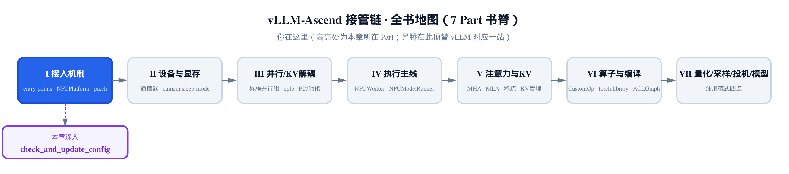
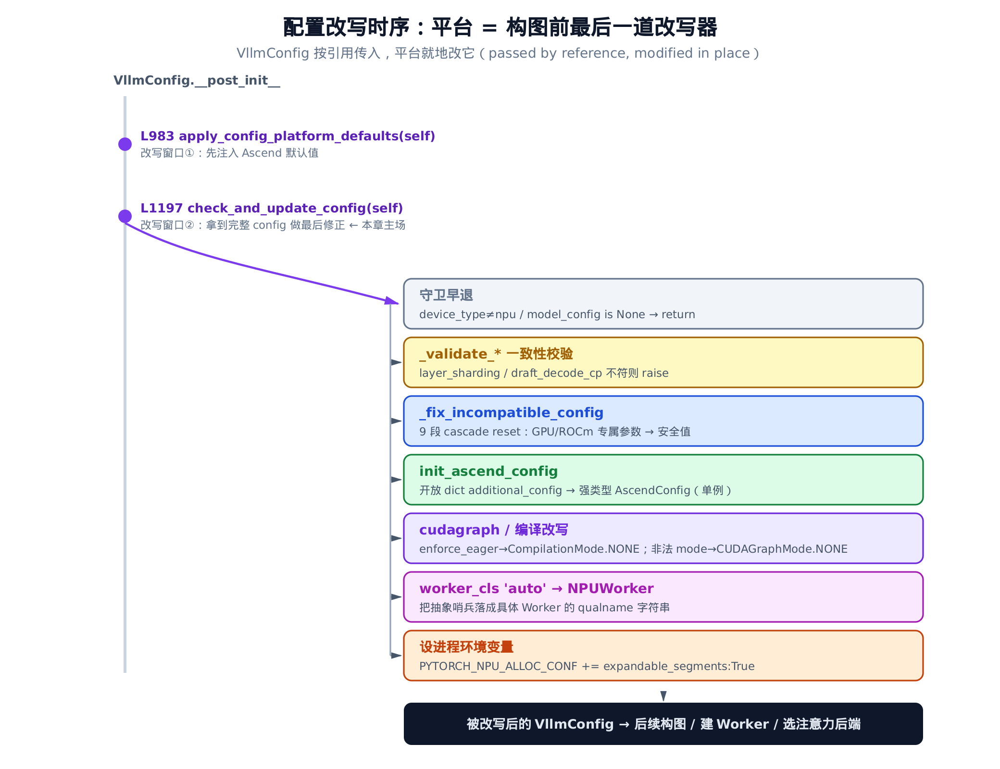
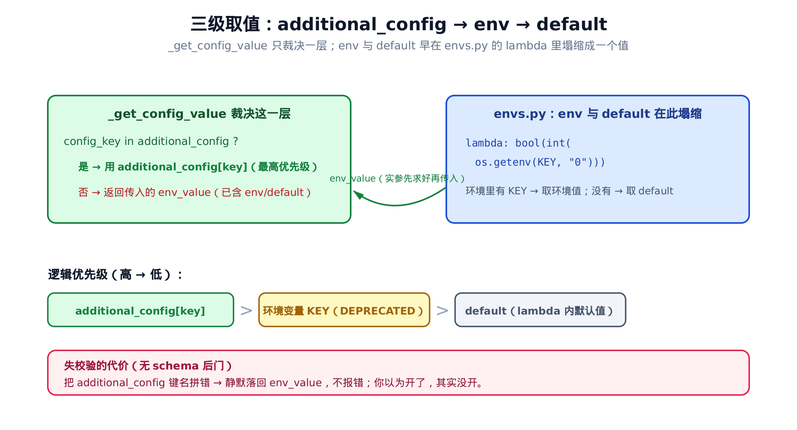

# 第 5 章 配置改写的总闸：check_and_update_config 与 AscendConfig 配置面



> **你在这里**——Part I「接入机制」的收官章。
> 上一章靠 patch 改源码接管；本章不改源码，只改一份 config 就能接管。
> 下一章起进 Part II，讲设备与显存的换底座。

---

[上一章](../ch04-patch-engine-core-kvcache/narrative/chapter.md)讲的是「改别人命名空间里的名字」——monkey-patch 是把手术刀，伸进 vLLM 引擎核心动结构。但 vLLM 给 OOT（out-of-tree，树外）插件留的接管手段不止 patch 这一种。还有一种干净得多、连刀都不用掏的：**vLLM 主动把一份完整的配置对象递到你手上，说「拿去改，改完我接着用」**。

这就是本章的主角——`check_and_update_config`。它是 vLLM 平台抽象里的一个**钩子方法**：在构图之前的最后一刻，框架把装满了所有配置的 `VllmConfig` 对象**按引用**交给当前平台，让平台就地改它。改 worker 用哪个类、改编译走不走 cudagraph、改注意力后端、改并行通信后端——全在这一个方法里完成。改完，vLLM 拿着被改过的 config 继续往下建引擎、建 Worker。整个过程，昇腾插件**一行 vLLM 源码都没动**。

本章要讲透两件事。

第一件，**平台 = 配置改写器**。这是 vLLM 的一个核心约定，写在基类 `vllm/platforms/interface.py` 里：把「按硬件调配置」收敛成一个 well-known 的钩子点，插件只要实现一个 `Platform` 子类、填好这个方法，就能在构图前重定向几乎所有东西。我们会顺着 `vllm_ascend/platform.py` 里的 `NPUPlatform.check_and_update_config` 走一遍全流程，看它怎么系统性地把一堆 GPU/ROCm 专属参数「降级」成昇腾能跑的安全值。

第二件，**无 schema 配置后门**。vLLM 不可能为每个第三方后端的私有开关都加一个命令行参数，于是它开了个口子：一个叫 `additional_config` 的开放 dict，插件爱往里塞什么键都行。灵活到了极致，代价是 vLLM 这一侧**没法校验**——拼错键名不会有人提醒你。昇腾用 `AscendConfig` 把这个开放 dict 解析成一组强类型子配置，把校验责任接了过来。我们会看清这套解析机制，以及它配套的 `additional_config → env → default` 三级取值。

先看那个钩子本身长什么样。

---

## 5.1 钩子契约：vLLM 怎么把 config 递出来

要理解「平台 = 配置改写器」，得先看 vLLM 这一侧的约定。`Platform` 是 vLLM 给所有硬件后端定义的抽象基类，`check_and_update_config` 是它的一个类方法，默认实现只有一行：

```python
# vllm/platforms/interface.py:L432-L443
    @classmethod
    def check_and_update_config(cls, vllm_config: "VllmConfig") -> None:
        """
        Check and update the configuration for the current platform.

        It can raise an exception if the configuration is not compatible with
        the current platform, or it can update the configuration to make it
        compatible with the current platform.

        The config is passed by reference, so it can be modified in place.
        """
        pass
```

短短一段，约定全在 docstring 里，值得逐句拆。

「**It can raise an exception**」——平台有权拒绝。如果配置和这块硬件根本冲突，直接抛异常让启动失败，是合法的。

「**or it can update the configuration to make it compatible**」——平台也有权修。不冲突、只是不合适的配置，平台可以悄悄改成合适的。

「**The config is passed by reference, so it can be modified in place**」——这是技术关键。`vllm_config` 是按引用传进来的，平台就地改它的字段，改动**直接生效在调用方手里的那个对象上**，不用返回值（注意签名 `-> None`）。

而基类默认 `pass`，意味着这是个**可选扩展点**：不实现也能跑（比如某个简单平台无需改任何配置），实现了就有了在构图前最后改写一切的权力。

那这个钩子在什么时机被调？答案在 `VllmConfig` 的构造收尾处：

```python
# vllm/config/vllm.py（截取自 VllmConfig.__post_init__）
    def __post_init__(self):
        # … 省略：大量字段的初始化与交叉校验 …
        current_platform.apply_config_platform_defaults(self)   # L983
        # … 省略：更多中间处理 …
        current_platform.check_and_update_config(self)          # L1197
```

`__post_init__` 是 dataclass 在所有字段填完之后自动跑的钩子——也就是说，跑到这里时，命令行参数、模型配置、各子配置都已经构造完毕。在这个函数里，平台被调了**两次**，构成对 config 的两个改写窗口：

- **窗口①**（`vllm/config/vllm.py:L983`）`apply_config_platform_defaults`：早一点，平台先注入自己的默认值（比如昇腾的最大 cudagraph 捕获尺寸）。
- **窗口②**（`vllm/config/vllm.py:L1197`）`check_and_update_config`：晚一点，平台拿到「命令行 + 默认值都注入完」的**完整** config，做最后修正。

两个窗口一前一后，让「**先给默认、再按完整上下文修正**」成为可能。本章主场是窗口②。

这里有个容易被忽略的点：`current_platform` 在普通 vLLM 里是 `CudaPlatform`，但在装了 vllm-ascend 插件的进程里，它**已经被替换成了 `NPUPlatform`**。这个替换发生在更早——是 [第 2 章：entry points 与 NPUPlatform](../ch02-entry-points-and-npuplatform/narrative/chapter.md) 讲的 entry-points 注册机制干的活。所以 L1197 这一句 `current_platform.check_and_update_config(self)`，在昇腾进程里实际调到的就是下面要细看的 `NPUPlatform.check_and_update_config`。

下面这张图把整条改写时序串起来——从 `__post_init__` 的两个窗口，到 `NPUPlatform.check_and_update_config` 内部的七步编排，再到被改写后的 config 流向后续构图。



> *图注：左边竖线是 `VllmConfig.__post_init__`，上面两个紫点是平台的两个改写窗口。窗口②`check_and_update_config` 拿到完整 config（passed by reference），内部按七步就地改写，最后把改过的 config 交给后续构图。注意：全程没有返回值，改动靠「就地改引用对象」生效。*

---

## 5.2 入口编排：一条主骨架

`NPUPlatform.check_and_update_config` 的方法体很长（三百多行），但骨架清晰。先看它的开头：

```python
# vllm_ascend/platform.py:L413-L437
    @classmethod
    def check_and_update_config(cls, vllm_config: VllmConfig) -> None:
        from vllm_ascend.quantization.utils import maybe_auto_detect_quantization

        device_config = getattr(vllm_config, "device_config", None)
        if device_config is not None and getattr(device_config, "device_type", cls.device_type) != cls.device_type:
            logger.debug(
                "Skipping Ascend-specific config updates for device type %s.",
                device_config.device_type,
            )
            return

        if vllm_config.model_config is None:
            logger.warning("Model config is missing. Skipping Ascend-specific config updates.")
            return

        maybe_auto_detect_quantization(vllm_config)

        cls._validate_layer_sharding_config(vllm_config)
        cls._validate_draft_decode_context_parallel_config(vllm_config)

        # initialize ascend config from vllm additional_config
        cls._fix_incompatible_config(vllm_config)

        ascend_config = init_ascend_config(vllm_config)
```

开头两个 `if` 是**守卫早退**。第一个：如果用户显式指定的 `device_type` 不是 npu，那这次启动压根不是冲着昇腾来的，跳过所有昇腾改写、原样返回。第二个：`model_config` 缺失（某些纯工具路径会这样），没有模型信息可改，也直接返回。两道守卫的共同意思是——**只在确实要在昇腾上跑模型时，才动手改 config**。

过了守卫，是三件准备工作和两条主线的起点：

- `maybe_auto_detect_quantization`——探测权重是否量化，是别章的话题。
- 两个 `_validate_*`——一致性校验。它们和后面的 `_fix_incompatible_config` 性质不同：`_validate_*` 校验的是**会破坏正确性的语义冲突**，不符就 `raise`；`_fix_incompatible_config` 处理的是**无害但不适用的参数**，只 warn + reset。这条「该 raise 还是该 reset」的分界，是本章后面会反复回到的设计判据。
- `_fix_incompatible_config`——本章第一条主线，下一节细看。
- `init_ascend_config`——本章第二条主线的入口，把 `additional_config` 解析落地。

我们按它的调用顺序往下走。

---

## 5.3 _fix_incompatible_config：系统性的 cascade reset

用户在 GPU 上跑惯了 vLLM，命令行里带着一堆 CUDA 时代的习惯参数——`--numa-bind`、cudnn prefill、trtllm 后端开关……一股脑递到昇腾上。这些参数在 NPU 上要么没有对应实现、要么属于别家硬件的专属优化。怎么办？

最粗暴的做法是：见到一个不认识的就 `raise`，让用户自己去掉。但那样**体验极差**——用户得反复试错、一个个删参数才能把服务拉起来。vllm-ascend 选了另一条路：**容错优先**。看它的总纲（函数的 docstring）：

```python
# vllm_ascend/platform.py:L979-L985
    @staticmethod
    def _fix_incompatible_config(vllm_config: VllmConfig) -> None:
        """
        Check and correct parameters in VllmConfig that are incompatible with Ascend NPU.
        If GPU-specific or currently unsupported parameters are set by the user,
        log a warning and reset them to safe values.
        """
```

意图写得明白：GPU 专属或暂不支持的参数，**warn + reset 成安全值**，而不是失败。这样即便用户带了一身 GPU 习惯参数，服务照样能起来——那些不适用的开关被静悄悄降级，只在日志里留一行提醒。

整个方法按 9 个子配置分段。每一段都是**同一招式**：`getattr` 探测用户是否动过某参数 → 动过就 `logger.warning` → 就地写回安全默认。先看最简单的段 1：

```python
# vllm_ascend/platform.py:L986-L1006
        model_config = vllm_config.model_config
        # ==================== 1. Model Config ====================
        if model_config:
            # Disable Cascade Attention (GPU feature)
            if getattr(model_config, "disable_cascade_attn", False):
                logger.warning(
                    "GPU-specific parameter is not supported on Ascend. "
                    "parameter=disable_cascade_attn, value=True, action: resetting to False."
                )
                model_config.disable_cascade_attn = False

        # ==================== 2. Cache Config ====================
        if vllm_config.cache_config:
            # Check and reset cpu_kvcache_space_bytes
            if getattr(vllm_config.cache_config, "cpu_kvcache_space_bytes", False):
                logger.warning(
                    "Parameter is tied to incompatible backend. "
                    "parameter=cpu_kvcache_space_bytes, action: resetting to None for Ascend."
                )
                vllm_config.cache_config.cpu_kvcache_space_bytes = None
```

先认一下这两个被归零的特性：`disable_cascade_attn` 关的是 cascade attention（GPU 上一种共享前缀的注意力加速路径），`cpu_kvcache_space_bytes` 是把 KV cache 卸载到 CPU 内存的开关——都是别家硬件的路数，昇腾用不上。

`getattr(model_config, "disable_cascade_attn", False)` 这一句有个巧思：第三个参数 `False` 是**探测用的默认值**。如果 config 上根本没这个属性，`getattr` 返回 `False`，`if` 不进，什么都不发生——**不会因为某个 GPU 专属字段在昇腾配置里不存在而崩**。只有当字段存在且为真（用户确实开了它），才 warn + reset。这个「拿默认值当探针」的写法，让这套代码对「config 上有没有这个字段」天然鲁棒。

> 顺带一提 `disable_cascade_attn` 这个名字的反直觉处：它字面是「禁用 cascade attention」，而昇腾这里把它强行设回 `False`。也就是说——昇腾**始终不走** cascade attention 那条 GPU 专属路径，所以这个「是否禁用」的开关对它没有意义，统一压成 `False`。

### 同一招式，换个子配置

段 4 和段 5 把这招用在另外两个子配置上，验证它的普适性：

```python
# vllm_ascend/platform.py:L1018-L1036
        # ==================== 4. Observability Config ====================
        if vllm_config.observability_config:
            # NVTX tracing is NVIDIA specific
            if getattr(vllm_config.observability_config, "enable_layerwise_nvtx_tracing", False):
                logger.warning(
                    "Parameter relies on NVIDIA-specific tools. "
                    "parameter=enable_layerwise_nvtx_tracing, action: resetting to False."
                )
                vllm_config.observability_config.enable_layerwise_nvtx_tracing = False

        # ==================== 5. Scheduler Config ====================
        if vllm_config.scheduler_config:
            # Partial prefills are specific to ROCm optimization
            if getattr(vllm_config.scheduler_config, "max_num_partial_prefills", 1) != 1:
                logger.warning(
                    "Parameter is optimized for incompatible platform. "
                    "parameter=max_num_partial_prefills, action: resetting to default (1). "
                )
                vllm_config.scheduler_config.max_num_partial_prefills = 1
```

NVTX 是 NVIDIA 的 tracing 工具，partial prefill（分块预填——把预填阶段切成多块、多序列并行处理）是 ROCm 的优化——两个都是别家硬件的专属特性，在昇腾上归零。注意段 5 的探针默认值是 `1`，判定条件是 `!= 1`：因为这个参数有个有意义的默认值（1），探测的是「用户有没有把它调离默认」。同一招式，探针默认值随字段语义而变。

(为节省篇幅，段 3 多模态、段 6 投机解码、段 7 KV 传输也是同构的几段，每段都在归零一两个别家专属开关，这里不一一列举。)

### 批量归零：一张列表打十个

到了段 8 的注意力配置，需要归零的 GPU 专属布尔位一下子多了起来。如果还是一段段写，会堆出六个长得一模一样的 `if`。vllm-ascend 在这里换了写法——**把要归零的旗标名收进一张列表，循环批处理**：

```python
# vllm_ascend/platform.py:L1070-L1098
        # ==================== 8. Attention Config ====================
        if vllm_config.attention_config:
            att_config = vllm_config.attention_config

            # Boolean flags that must be False on Ascend (typically NVIDIA-specific)
            force_false_flags = [
                "use_prefill_decode_attention",
                "use_cudnn_prefill",
                "use_trtllm_ragged_deepseek_prefill",
                "use_trtllm_attention",
                "disable_flashinfer_prefill",
                "disable_flashinfer_q_quantization",
            ]
            for flag in force_false_flags:
                if getattr(att_config, flag, False):
                    logger.warning(
                        "Ignored GPU-specific parameter. parameter=%s, action: resetting to False. ",
                        flag,
                    )
                    setattr(att_config, flag, False)

            # Reset specific values to None as Ascend uses its own internal logic
            if getattr(att_config, "flash_attn_version", None) is not None:
                logger.warning(
                    "Ignored parameter. Ascend uses its own attention backend. "
                    "parameter=flash_attn_version, action: resetting to None. "
                )
                att_config.flash_attn_version = None
```

`force_false_flags` 这张列表，把 cudnn prefill、trtllm（NVIDIA 的 TensorRT-LLM 后端）、flashinfer 等清一色 GPU 专属的注意力旗标列在一处。循环里 `getattr(att_config, flag, False)` 探测、`setattr(att_config, flag, False)` 归零——探测和写回都用动态属性名。这就是「**系统性 cascade reset**」名副其实的地方：要再禁一个 GPU 旗标，往列表里加一行字符串即可，逻辑零重复。

后面紧跟着对 `flash_attn_version` 的处理，以及（这里省略的）对 `backend` 的处理——值得留意 backend 那段的一个例外：当用户指定的注意力后端恰好是 `FLASH_ATTN` 时，**不**reset 为 None。因为 flash attention（一种标准的注意力加速算法，训练和推理都依赖它）是训练-推理一致性要保留的路径，昇腾对它有自己的实现，不属于「别家专属」。可见这套 reset 不是无脑清零，每个保留/归零的决定背后都有具体理由。

### 特例：把参数「改写」而非「丢弃」

到这里，9 段里 8 段都是「丢弃 / 归零」——把不适用的参数压回安全值。但段 9 里藏着一个**质上不同**的处理，也是本章把两条主线串起来的关键扣子。

`--numa-bind` 是 vLLM 的一个通用旗标，让 worker 进程按 NUMA 拓扑绑核。昇腾不能直接用它（GPU-to-NUMA 的拓扑探测在 NPU 上不可用），但昇腾**有自己的等价能力**——原生的 CPU 绑核。于是这里没有简单丢弃，而是**无损改写**：

```python
# vllm_ascend/platform.py:L1138-L1157
            if getattr(vllm_config.parallel_config, "numa_bind", False):
                vllm_config.parallel_config.numa_bind = False
                if vllm_config.additional_config is None:
                    vllm_config.additional_config = {}
                vllm_config.additional_config.setdefault("enable_cpu_binding", True)
                logger.info(
                    "'--numa-bind' is not supported on Ascend NPU (GPU-to-"
                    "NUMA topology detection unavailable). Automatically "
                    "converted to --additional-config "
                    "'{\"enable_cpu_binding\": true}' for Ascend-native "
                    "CPU-core binding."
                )

            if getattr(vllm_config.parallel_config, "numa_bind_nodes", None):
                logger.info(
                    "'--numa-bind-nodes' is ignored on Ascend NPU. The "
                    "Ascend-native CPU binding automatically performs "
                    "topo-affinity core allocation."
                )
                vllm_config.parallel_config.numa_bind_nodes = None
```

三步看清这个改写：

1. **关掉** vLLM 的通用旗标：`parallel_config.numa_bind = False`。
2. **翻译成**昇腾自己的开关：往 `additional_config` 里塞 `enable_cpu_binding = True`。
3. 日志告诉用户：你的 `--numa-bind` 被自动转成了昇腾原生的 CPU 绑核。

这一处是全章的枢纽。它同时碰到了本章两条主线——**左手**是「平台改写 config」（把通用旗标降级），**右手**正好落到 `additional_config` 这个「无 schema 后门」里（写入昇腾私有键）。`--numa-bind` 表达的用户**意图**（绑核）被完整保留，只是换了昇腾的方式实现，所以叫「无损」。

还有个细节：第 2 步用的是 `setdefault` 而不是直接赋值。意思是——如果用户已经**显式**在 `additional_config` 里给了 `enable_cpu_binding`（哪怕给的是 `False`），就尊重用户的选择，不覆盖。只有用户没碰过这个键时，才默认填 `True`。「自动改写」让位于「用户显式意图」，这个分寸拿捏得很稳。

### 9 段总览

把保留下来的代表性几段汇成一张表，看清这套 cascade reset 的全貌。表里出现的 Flashinfer、TensorRT-LLM（trtllm）、cudnn、NVTX 等，都是 GPU 专属的加速库或后端，昇腾没有对应实现、故一律 reset，名字只是因为在 vLLM 源码里照搬过来才出现：

| 子配置 | 参数 | 来源平台 | 处理 | 类型 |
| --- | --- | --- | --- | --- |
| Model | `disable_cascade_attn` | GPU | → `False` | 归零 |
| Cache | `cpu_kvcache_space_bytes` | 不兼容后端 | → `None` | 丢弃 |
| Observability | `enable_layerwise_nvtx_tracing` | NVIDIA | → `False` | 归零 |
| Scheduler | `max_num_partial_prefills` | ROCm | → `1` | 复位默认 |
| Attention | `use_cudnn_prefill` / `use_trtllm_attention` … | NVIDIA | 列表批量 → `False` | 批量归零 |
| Attention | `backend`（非 FLASH_ATTN） | 通用 | → `None`（FLASH_ATTN 保留） | 有例外的归零 |
| Parallel | `numa_bind` | 通用 | → `False` **且** `additional_config['enable_cpu_binding']=True` | **无损改写** |

最后一行和前面所有行的区别一目了然：别的都是「拿掉」，只有 `numa_bind` 是「翻译」。

我们可以在精简版里把这套行为跑出来交叉验证。比如「批量归零」和「无损改写」两条：

```python
# 批量归零：force_false_flags 里的旗标无论设了几个，全被压回 False
cfg.attention_config.use_cudnn_prefill = True
cfg.attention_config.use_trtllm_attention = True
NPUPlatform._fix_incompatible_config(cfg)
assert cfg.attention_config.use_cudnn_prefill is False
assert cfg.attention_config.use_trtllm_attention is False

# 无损改写：numa_bind 不是丢弃，而是翻译成 additional_config 后门键
cfg.parallel_config.numa_bind = True
cfg.additional_config = None
NPUPlatform._fix_incompatible_config(cfg)
assert cfg.parallel_config.numa_bind is False
assert cfg.additional_config == {"enable_cpu_binding": True}
```

跑出来的数值印证了上表的最后两行：`use_*` 全归零；`numa_bind` 归零的同时，后门里多出一个 `enable_cpu_binding: True`。

---

## 5.4 init_ascend_config：进程级懒加载单例

`_fix_incompatible_config` 跑完，`check_and_update_config` 紧接着调 `init_ascend_config`——把 `additional_config` 这个开放 dict 正式解析成强类型的 `AscendConfig` 对象。

`AscendConfig` 的解析成本不低（要构造十几个子配置、做一堆交叉校验），而它又会被全进程多处代码用 `get_ascend_config()` 读取。重复解析浪费，所以它做成**进程级懒加载单例**：

```python
# vllm_ascend/ascend_config.py:L788-L804
def init_ascend_config(vllm_config):
    additional_config = vllm_config.additional_config if vllm_config.additional_config is not None else {}
    refresh = additional_config.get("refresh", False) if additional_config else False
    global _ASCEND_CONFIG
    if (
        _ASCEND_CONFIG is not None
        and not refresh
        and _is_ascend_config_initialized(_ASCEND_CONFIG)
        and getattr(_ASCEND_CONFIG, "vllm_config", None) is vllm_config
    ):
        return _ASCEND_CONFIG
    new_config = AscendConfig(vllm_config)
    if _is_ascend_config_initialized(new_config):
        _ASCEND_CONFIG = new_config
    else:
        logger.warning("Ascend config instance is not fully initialized. action: skip singleton cache update. ")
    return new_config
```

命中缓存（直接返回旧实例）要**同时满足**四个条件：

1. `_ASCEND_CONFIG is not None`——全局缓存里已经有东西。
2. `not refresh`——用户没要求强制刷新（`additional_config` 里的 `refresh` 键是个逃生开关）。
3. `_is_ascend_config_initialized(...)`——缓存里那个实例是完整初始化过的。
4. `getattr(_ASCEND_CONFIG, "vllm_config", None) is vllm_config`——缓存绑定的是**同一个** `vllm_config` 对象（用 `is` 比身份，不是 `==` 比值）。

第 3、4 条是这段代码最有意思的两道守卫。

第 4 条用 `is` 而非 `==`：只有当这次传进来的 config 和缓存绑定的是**同一个对象**才复用。换个新的 `VllmConfig`（哪怕字段值一样），也老老实实重建——避免不同启动场景串用了同一份解析结果。

第 3 条的 `_is_ascend_config_initialized` 守卫的是一个刁钻场景：单元测试常会 monkeypatch `AscendConfig.__init__`，产出一个**半初始化**的实例。如果这种残缺实例污染了全局单例，后面所有 `get_ascend_config()` 都会拿到坏对象。所以这里在写回全局之前先探一道——只有完整初始化的实例才允许更新缓存；半残的就只返回、不缓存。

懒加载这件事，口头说「只解析一次」不如把两轮调用的状态摆出来看。设两次启动用的是**同一个** `vllm_config` 对象：

| 轮次 | 动作 | `_ASCEND_CONFIG` 初值 | 四条命中条件 | 结果 |
| --- | --- | --- | --- | --- |
| 第 1 次 | `init_ascend_config(cfg)` | `None` | 第 1 条就不满足 | 新建 → 写回全局 → 返回新实例 |
| 第 2 次 | `init_ascend_config(cfg)`（同一 cfg） | 上轮的实例 | 四条全满足 | 命中缓存 → 返回**同一个**实例 |

而如果第 2 次换成 `refresh=True`，打破的是第 2 条（`not refresh`）；换个新 cfg 对象，打破的是第 4 条（`is` 同一对象）——两种情形各打破一条，任一条不满足即退化成重建。精简版把这两种退化情形都跑了一遍：

```python
a = ac.init_ascend_config(cfg)
b = ac.init_ascend_config(cfg)
assert a is b                       # 同一 cfg + 完整初始化 → 命中缓存，是同一个对象

cfg.additional_config = {"refresh": True}
c = ac.init_ascend_config(cfg)
assert a is not c                   # refresh=True → 强制重建

a2 = ac.init_ascend_config(make_vllm_config())   # 换个新 cfg 对象
b2 = ac.init_ascend_config(make_vllm_config())
assert a2 is not b2                  # 不同 cfg 对象 → 不复用缓存
```

`a is b` 为真、`a is not c` 为真——「同一 config 复用、refresh 或换 config 重建」的语义就此坐实。

---

## 5.5 AscendConfig：把开放 dict 解析成强类型

现在进本章第二条主线的核心——`AscendConfig.__init__` 怎么把 `additional_config` 这个开放 dict 翻译成一组强类型对象。本节分三步走：先看 AscendConfig 怎么把开放 dict 收成强类型，再看单个子配置类的 kwargs 后门，最后拆三级取值的塌缩。

```python
# vllm_ascend/ascend_config.py:L27-L50
class AscendConfig:
    """
    Configuration Object for additional_config from vllm.configs.
    """

    def __init__(self, vllm_config: "VllmConfig"):
        self.vllm_config = vllm_config
        additional_config = vllm_config.additional_config if vllm_config.additional_config is not None else {}

        xlite_graph_config = additional_config.get("xlite_graph_config", {})
        self.xlite_graph_config = XliteGraphConfig(xlite_graph_config, vllm_config)

        ascend_compilation_config = additional_config.get("ascend_compilation_config", {})
        self.ascend_compilation_config = AscendCompilationConfig(**ascend_compilation_config)

        ascend_fusion_config = additional_config.get("ascend_fusion_config", {})
        self.ascend_fusion_config = AscendFusionConfig(**ascend_fusion_config)

        # … 省略：finegrained_tp_config 等其余子配置，范式同构 …

        eplb_config = additional_config.get("eplb_config", {})
        self.eplb_config = EplbConfig(eplb_config)
```

范式一目了然，每个子配置都是同一个套路：

1. `additional_config.get("某键", {})`——从开放 dict 里取出对应的子 dict，**取不到就给空 dict**（所以用户完全不写这些键也安全）。
2. 把这个子 dict 喂给一个**强类型子配置类**，构造出一个带具名属性的对象。

第一句 `additional_config = vllm_config.additional_config if ... is not None else {}` 还兜了 `additional_config` 整个为 `None` 的底——用户一个 `additional_config` 都没给时，退化成空 dict，下面所有 `.get` 照常返回空 dict、各子配置全取默认值。

注意两种喂法的微妙差别：`XliteGraphConfig(xlite_graph_config, vllm_config)` 是**把整个 dict 当一个位置参数**传进去；`AscendCompilationConfig(**ascend_compilation_config)` 是**把 dict 解包成关键字参数**。后者更值得细看，因为它直接体现了「无 schema 后门」的取舍。

### 强类型子配置：命名形参 + kwargs 后门

挑 `AscendCompilationConfig` 做范例，看一个子配置类怎么把开放 dict 收成强类型：

```python
# vllm_ascend/ascend_config.py:L498-L538（省略中间的长 docstring）
class AscendCompilationConfig:

    def __init__(
        self,
        enable_npugraph_ex: bool = True,
        enable_static_kernel: bool = False,
        fuse_norm_quant: bool = True,
        fuse_qknorm_rope: bool = True,
        fuse_allreduce_rms: bool = False,
        **kwargs,
    ):
        # … 省略：逐参数解释的长 docstring …
        self.fuse_norm_quant = fuse_norm_quant
        self.fuse_qknorm_rope = fuse_qknorm_rope
        self.fuse_allreduce_rms = fuse_allreduce_rms
        self.enable_npugraph_ex = enable_npugraph_ex
        self.enable_static_kernel = enable_static_kernel
        self.fuse_muls_add = kwargs.get("fuse_muls_add", True)
        if self.enable_static_kernel:
            assert self.enable_npugraph_ex, "Static kernel generation requires npugraph_ex to be enabled."
```

两个设计点。

**命名形参带默认值**——`enable_npugraph_ex: bool = True` 这一串，是这个子配置的**事实上的 schema**：每个键叫什么、是什么类型、默认值多少，都写死在签名里。这是开放 dict 缺的那层校验被补回来的地方。上面 `AscendCompilationConfig(**ascend_compilation_config)` 把 dict 解包进来，能对上签名的就落到具名属性，类型和默认值都有了保障。

**`**kwargs` 后门**——签名末尾这个 `**kwargs` 是「无 schema」的两面性集中体现。好处是**向前兼容**：未来加了新键、或者用户传了某个这个版本还不认识的键，不会因为「got an unexpected keyword argument」而崩——多余的键被 `**kwargs` 静默收走。代价同样直接：**拼错键名不报错**。你想开 `fuse_norm_quant` 却写成 `fuse_norm_quat`，它不会落到 `self.fuse_norm_quant`（那个仍是默认值），而是被 `kwargs` 悄悄吞掉，你以为开了、其实没开。这个取舍是有意为之：作为第三方后端接口，「向前兼容」（老 vLLM 不被未来版本的新键搞崩）比「即时报错」更值钱，于是把拼写检查的责任让给了用户或 linter。

末尾那行 `assert` 是子配置**就地自校验**的样本：static kernel 依赖 npugraph_ex，两者不能一开一关。`_fix_incompatible_config` 那种 warn+reset 的容错在这里不适用——这是个会致错的语义冲突，所以用 `assert` 直接拦下。又一次印证 [5.2](#52-入口编排一条主骨架) 那条判据：**无害就 reset，会致错就 raise**。

精简版把 kwargs 后门的两面都跑了出来：

```python
# 后门吞掉未知键（向前兼容），但拼错的键不会落到属性上
c = ac.AscendCompilationConfig(totally_unknown_key=123, fuse_muls_add=False)
assert c.fuse_muls_add is False        # 认识的键正常落位
assert not hasattr(c, "totally_unknown_key")   # 不认识的键被静默吞掉，查无此属性

# 就地自校验：会致错的组合直接 raise
with pytest.raises(AssertionError):
    ac.AscendCompilationConfig(enable_static_kernel=True, enable_npugraph_ex=False)
```

`not hasattr(c, "totally_unknown_key")` 为真——这正是「拼错键名静默失效」的数值证据：未知键没有变成任何属性，它就这么消失了，无声无息。

### 三级取值：additional_config → env → default

子配置类之外，`AscendConfig` 还有一批**标量字段**（一个个布尔开关）。它们的取值更复杂一点，因为同一个开关历史上可能有三个来源：新的 `additional_config` 键、老的环境变量、以及写死的默认值。看取值的调用现场：

```python
# vllm_ascend/ascend_config.py:L75-L88
        from vllm_ascend import envs as ascend_envs

        self.enable_balance_scheduling = self._get_config_value(
            additional_config,
            "enable_balance_scheduling",
            "VLLM_ASCEND_BALANCE_SCHEDULING",
            ascend_envs.VLLM_ASCEND_BALANCE_SCHEDULING,
        )
        self.enable_flashcomm1 = self._get_config_value(
            additional_config,
            "enable_flashcomm1",
            "VLLM_ASCEND_ENABLE_FLASHCOMM1",
            ascend_envs.VLLM_ASCEND_ENABLE_FLASHCOMM1,
        )
```

每个标量都经 `_get_config_value` 取，传四个参数：开放 dict、`additional_config` 里的键名、环境变量名、以及**已经求好值的** `ascend_envs.VLLM_ASCEND_*`。最后一个参数是理解整个机制的关键，待会儿拆。先看 `_get_config_value` 本体：

```python
# vllm_ascend/ascend_config.py:L284-L296
    @staticmethod
    def _get_config_value(additional_config: dict[str, Any], config_key: str, env_key: str, env_value: Any) -> Any:
        if config_key in additional_config:
            value = additional_config[config_key]
            logger.info_once(f"AscendConfig.{config_key} is set from additional_config with value {value}.")
            return value
        if env_key in os.environ:
            logger.info_once(
                f"AscendConfig.{config_key} falls back to environment variable {env_key} with value {env_value}. "
                f"Please use additional_config.{config_key} instead, because {env_key} will be removed in the "
                "next release."
            )
        return env_value
```

逻辑只有两层：

- `additional_config` 里有这个键？**有就用它**，最高优先级，返回。
- 没有？看环境变量在不在——在的话打一行「这是老用法、已弃用、下个版本移除，请改用 additional_config」的迁移提示，然后……**无论提不提示，最后都返回 `env_value`**。

这里有个容易看漏的事实：函数名叫「三级取值」，可它从头到尾只 `if` 了**两次**——`additional_config`、`env_key in os.environ`。第三级 default 去哪了？

答案是：**env 和 default 这两级，早在传进来之前就塌缩成了一个值** `env_value`（「塌缩」在这儿就是把两级查找提前合成单个值的意思）。看那第四个实参 `ascend_envs.VLLM_ASCEND_ENABLE_FLASHCOMM1`——它在传进函数前就被求值了。它的值从哪来，去 `envs.py` 看：

```python
# vllm_ascend/envs.py:L30-L34
env_variables: dict[str, Callable[[], Any]] = {
    # max compile thread number for package building. Usually, it is set to
    # the number of CPU cores. If not set, the default value is None, which
    # means all number of CPU cores will be used.
    "MAX_JOBS": lambda: os.getenv("MAX_JOBS", None),
```

```python
# vllm_ascend/envs.py:L71-L75
    "VLLM_ASCEND_ENABLE_MATMUL_ALLREDUCE": lambda: bool(int(os.getenv("VLLM_ASCEND_ENABLE_MATMUL_ALLREDUCE", "0"))),
    # Whether to enable FlashComm optimization when tensor parallel is enabled.
    # This feature will get better performance when concurrency is large.
    # DEPRECATED: use additional_config.enable_flashcomm1 instead.
    "VLLM_ASCEND_ENABLE_FLASHCOMM1": lambda: bool(int(os.getenv("VLLM_ASCEND_ENABLE_FLASHCOMM1", "0"))),
```

`env_variables` 是一张表，每个环境变量对应一个 **lambda**。看 `VLLM_ASCEND_ENABLE_FLASHCOMM1` 那个 lambda：`os.getenv("VLLM_ASCEND_ENABLE_FLASHCOMM1", "0")`——环境里有这个变量就取它的值、没有就取默认 `"0"`，再 `bool(int(...))` 转成布尔。**env 和 default 的分界，就发生在这个 `os.getenv(KEY, default)` 里面**。lambda 一执行，两级当场塌缩成一个布尔值。

（顺带留意那行 `DEPRECATED: use additional_config.enable_flashcomm1 instead` 的注释——env 表自己就标着「请迁移到 additional_config」，和 `_get_config_value` 里那句迁移提示遥相呼应。这是项目正把配置面从「散落的环境变量」收敛到「统一的 additional_config」的过渡期痕迹。）

这张 lambda 表的写法并非昇腾首创。它对位的正是基座 vLLM 自己的环境变量表 `vllm/envs.py`——同样是「每个 env 变量一个 lambda、模块级 `__getattr__` 懒求值」的范式。昇腾照搬了这套结构，只换了自己的键。

那 lambda 是什么时候执行的？看模块级的 `__getattr__`：

```python
# vllm_ascend/envs.py:L118-L122
def __getattr__(name: str):
    # lazy evaluation of environment variables
    if name in env_variables:
        return env_variables[name]()
    raise AttributeError(f"module {__name__!r} has no attribute {name!r}")
```

`ascend_envs.VLLM_ASCEND_ENABLE_FLASHCOMM1` 这个属性访问，触发 `__getattr__`，它从表里取出对应 lambda **当场调用** `env_variables[name]()`。这是**懒求值**——每次访问都重新读一遍环境，环境变了，下次访问就反映新值。

把三级取值的结构画出来：



> *图注：左框是 `_get_config_value` 真正裁决的那一层——只看 `additional_config` 有没有这个键。右框是 `envs.py` 的 lambda，env 与 default 在这里就塌缩成了 `env_value`，作为实参传进左框。所以逻辑上是三级优先级，实现上 `_get_config_value` 只在「additional_config」和「已塌缩的 env_value」之间二选一。底部红框是这套无 schema 后门的代价。*

理清了塌缩，三级取值的优先级就能精确表述：

$$
\mathrm{value} = \begin{cases} \mathrm{additional\_config}[k], & k \in \mathrm{additional\_config} \\ \mathrm{env\_value}, & \mathrm{otherwise} \end{cases}
$$

而 env_value 早在 `vllm_ascend/envs.py` 的 lambda 里求好：环境里有 KEY 就取环境值，没有就取 default。

人话翻译：**`additional_config` 这层压过一切；它不命中时，落到「环境变量有就用环境值、没有就用默认值」**。三级，逻辑上是 `additional_config > env > default` 三层，实现上拆成了「一次裁决 + 一次预先塌缩」。

走三轮看清三级优先级。前两轮固定环境变量 `VLLM_ASCEND_ENABLE_FLASHCOMM1=0`（env_value 塌缩为 `False`），只改 `additional_config`；第③轮反过来——`additional_config` 不写这个键，改让 env 自己说话：

| 轮次 | `additional_config` | env_value（已塌缩） | `_get_config_value` 走哪支 | 结果 |
| --- | --- | --- | --- | --- |
| ① | `{"enable_flashcomm1": True}` | `False` | 命中 additional_config | `True`（后门压过 env） |
| ② | `{}`（不写这个键） | `False` | 落回 env_value | `False`（落回 default） |
| ③ | `{}`（不写这个键） | `True`（env 设为 `1`） | 落回 env_value | `True`（env 压过 default） |

第①轮 `additional_config` 给了 `True`，尽管环境变量是 `0`，结果仍是 `True`——后门优先级最高。第②轮不写这个键、环境也没设，落回塌缩好的 `False`，这是 default 那一级。第③轮把环境变量设成 `1`、additional_config 仍不写——env_value 塌缩成 `True`，落回的就是 `True`，这正是「env 压过 default」那第三级。三级至此在一张表里追完整。精简版把这几轮跑出来（第③轮即下方懒求值断言里 env `0→1` 那两句的数值证据）：

```python
# 第①轮：additional_config 压过 env
os.environ["VLLM_ASCEND_ENABLE_FLASHCOMM1"] = "0"
cfg = make_vllm_config(additional_config={"enable_flashcomm1": True})
conf = ac.AscendConfig(cfg)
assert conf.enable_flashcomm1 is True

# 懒求值：envs 每次访问都重读环境
os.environ.pop("VLLM_ASCEND_ENABLE_FLASHCOMM1", None)
assert ascend_envs.VLLM_ASCEND_ENABLE_FLASHCOMM1 is False   # 没设 → default 0 → False
os.environ["VLLM_ASCEND_ENABLE_FLASHCOMM1"] = "1"
assert ascend_envs.VLLM_ASCEND_ENABLE_FLASHCOMM1 is True    # 改了环境，下次访问反映新值
```

第①轮 `enable_flashcomm1 is True` 印证「后门压过 env」；后两句印证 lambda 的懒求值——同一个属性，环境从无到有，连读两次拿到不同的值。

而那个失校验的代价，也能量化出来：把 `additional_config` 的键名拼错，三级取值会**静默落回 env_value，绝不报错**——`config_key in additional_config` 这一句对拼错的键返回 `False`，于是走到第二支，返回塌缩好的默认值。你想开的开关，悄无声息地没开。这就是无 schema 后门「灵活」的另一面，写成一句可操作的告诫：**additional_config 的键名错一个字母，等于没写，且没人告诉你**。

---

## 5.6 回到总闸：改写编译与 cudagraph

`AscendConfig` 解析完，控制流回到 `check_and_update_config` 的后半段。接下来平台开始改**编译相关**的配置——这是「平台改写 config」最能体现威力的地方：插件不碰 vLLM 的编译器源码，只改几个配置字段，就重定向了整个编译/图捕获行为。

```python
# vllm_ascend/platform.py:L483-L496
        if enforce_eager:
            logger.info("Compilation disabled, using eager mode by default")
            compilation_config.mode = CompilationMode.NONE
            if compilation_config.splitting_ops is None:
                compilation_config.splitting_ops = []

        compilation_config.cudagraph_num_of_warmups = 1

        if compilation_config.mode not in [CompilationMode.NONE, CompilationMode.VLLM_COMPILE]:
            logger.warning(
                "NPU does not support compilation mode. mode=%s, action: setting CUDAGraphMode to NONE.",
                compilation_config.mode,
            )
            compilation_config.cudagraph_mode = CUDAGraphMode.NONE
```

两段改写。

`enforce_eager`（用户要求强制 eager 执行、完全不编译计算图）为真时，把编译模式直接设成 `CompilationMode.NONE`，并把 `splitting_ops`（按算子切图的列表，标记图能在哪些算子处断开、回退到 eager）置空——eager 不切图，自然不需要切分点。

中间那行 `cudagraph_num_of_warmups = 1` 顺手把预热轮数定死为 1——warmup 是正式捕获图前先空跑几轮、让显存与 kernel 稳定的预热，昇腾硬件只需 1 轮就够。

下面那段是个**白名单守卫**：昇腾只支持 `NONE`（不编译）和 `VLLM_COMPILE`（vLLM 的图编译）两种 mode；用户若指定了别的（比如某种 GPU 专属的编译模式），就把 cudagraph 模式压成 `NONE`——既然这种编译模式昇腾不认，相应的图捕获也别做了。

（这后面还有一大段——按 cudagraph 模式分支改写 `splitting_ops`、设 `oot_compiler`、关掉 inductor 等，都是「平台改写编译配置」的延续，属于编译子系统的细节，留给后续章节。本章只取这两段，看清「改 config 字段就能重定向编译」这件事本身。）

精简版验证 enforce_eager 这条：

```python
cfg.model_config.enforce_eager = True
NPUPlatform.check_and_update_config(cfg)
assert cfg.compilation_config.mode == CompilationMode.NONE
assert cfg.compilation_config.splitting_ops == []
assert cfg.compilation_config.cudagraph_num_of_warmups == 1
```

mode 被改成 `NONE`、splitting_ops 被置空——平台对编译配置的改写如实生效。

---

## 5.7 worker_cls：把 'auto' 落成具体 Worker

继续往下，到了本章最能呼应「平台 = 配置改写器」的一处改写——决定用哪个 Worker 类。

```python
# vllm_ascend/platform.py:L602-L614
        if parallel_config and parallel_config.worker_cls == "auto":
            # TODO: this is a tricky way to disable `use_sequence_parallel_moe` in vllm.
            if not vllm_config.compilation_config.pass_config.enable_sp:
                parallel_config.all2all_backend = "flashinfer_all2allv"
            if is_310p():
                parallel_config.worker_cls = "vllm_ascend._310p.worker_310p.NPUWorker310"
            elif ascend_config.xlite_graph_config.enabled:
                logger.info("openEuler Xlite enabled. See: https://atomgit.com/openeuler/GVirt/tree/master/xlite")
                parallel_config.worker_cls = "vllm_ascend.xlite.xlite_worker.XliteWorker"
            else:
                parallel_config.worker_cls = "vllm_ascend.worker.worker.NPUWorker"

        refresh_block_size(vllm_config)
```

[第 2 章](../ch02-entry-points-and-npuplatform/narrative/chapter.md)曾在这里只截了一刀——讲「同一个延迟绑定招式的第四次复用」时，点到 worker_cls 是个经 config 字段改写、而非工厂钩子的例外，并约定「完整的 `check_and_update_config` 流程是第 5 章的主场」。现在我们站在这个主场里，可以把这一处看全了。

`parallel_config.worker_cls` 是个**字符串字段**，默认值是哨兵 `"auto"`。vLLM 后续会用 `resolve_obj_by_qualname` 按这个字符串去 import 并实例化 Worker。平台在这里做的，就是把抽象的 `"auto"` 翻译成一个具体的 qualname（全限定类名）字符串：

这里的 `is_310p()` 判断是不是 310P 这一代推理卡，Xlite 则是 openEuler 上的轻量边缘运行时——都是昇腾的设备/OS 变体，各自需要专门的 Worker：

- 310P 这代推理卡 → `NPUWorker310`
- openEuler Xlite 图模式 → `XliteWorker`
- 默认 → `NPUWorker`

这就是「平台 = 配置改写器」最锋利的兑现：**改一个 config 字符串字段，就顶替了 vLLM 的执行主控**。Worker 是真正在每个设备进程里跑模型前向的那个对象，而昇腾没动 vLLM 一行 Worker 调度代码，只是把 `worker_cls` 从 `"auto"` 改写成自己的类名。用 qualname 字符串而非类对象还有个好处——Worker 进程是 spawn 出来的，跨进程只要传个字符串，到那边再 resolve，省了序列化类对象的麻烦。

开头那行 `pass_config.enable_sp` 里的 sp 指 sequence parallel——序列并行，和 tensor parallel、pipeline parallel 并列的又一种切分维度；这里顺手在它没开时把 all2all 通信后端切到昇腾的实现，是借这条 `if` 捎带的一笔。

还有个守卫值得点：整个改写包在 `if parallel_config.worker_cls == "auto"` 里。也就是说——只有字段还是哨兵 `"auto"` 时平台才改它；如果用户**显式**指定了某个 worker，这段 `if` 整个跳过，**不覆盖用户的选择**。又是一次「自动改写让位于用户显式意图」，和 [5.3](#53-_fix_incompatible_config系统性的-cascade-reset) 里 `numa_bind` 那个 `setdefault` 同一个分寸。

精简版在 host 上跑（无 NPU，`is_310p()` 恒 `False`，走默认分支）：

```python
cfg = make_vllm_config()           # worker_cls 初值 "auto"
NPUPlatform.check_and_update_config(cfg)
assert cfg.parallel_config.worker_cls == "vllm_ascend.worker.worker.NPUWorker"
```

`"auto"` 被落定成了 `vllm_ascend.worker.worker.NPUWorker`——第 2 章埋下的那个「完整流程」之约，在这一行收回。至于 `NPUWorker` 这个类本身怎么接管设备初始化与模型前向，是 [第 13 章：NPUWorker 重写执行主控](../ch13-npuworker-rewrite/narrative/chapter.md) 的主题，那时你会看到这根字符串最终被 resolve 成一个真正跑模型的对象。

---

## 5.8 收尾：把改写落到进程环境变量

`check_and_update_config` 改的不止是 config 对象的字段——它的最后一步，把手伸到了**进程环境变量**上：

```python
# vllm_ascend/platform.py:L700-L714
        if model_config and not model_config.enable_sleep_mode:
            npu_alloc_configs = os.getenv("PYTORCH_NPU_ALLOC_CONF", "expandable_segments:True")
            # This environment variable may have more than one key-value pairs.
            # We should append ",expandable_segments:True" to the current configs.
            # For example: "page_size:1g" + ",expandable_segments:True".
            # NOTE: `max_split_size_mb` or `garbage_collection_threshold` cannot
            # be enabled together with `expandable_segments=True`.
            if (
                "expandable_segments" not in npu_alloc_configs
                and "max_split_size_mb" not in npu_alloc_configs
                and "garbage_collection_threshold" not in npu_alloc_configs
            ):
                npu_alloc_configs += ",expandable_segments:True"
            os.environ["PYTORCH_NPU_ALLOC_CONF"] = npu_alloc_configs
            logger.info("Set PYTORCH_NPU_ALLOC_CONF=%s", npu_alloc_configs)
```

它给 NPU 显存分配器设 `expandable_segments:True`（可扩展显存段，减少碎片）。三个细节：

- **非 sleep-mode 才设**——sleep mode 是一种把显存「睡眠」、按需释放与唤醒的机制，有自己的一套显存管理（[第 7 章：sleep-mode 与 camem 分配器](../ch07-sleep-mode-camem-allocator/narrative/chapter.md) 的主题），和这里的可扩展显存段机制冲突，所以用 `not model_config.enable_sleep_mode` 把它让开。
- **追加而非覆盖**——先读现有的 `PYTORCH_NPU_ALLOC_CONF`，往上 `+=` 追加，保住用户可能已经设的别的键（注释里举了 `page_size:1g` 的例子）。
- **互斥保护**——`expandable_segments`、`max_split_size_mb`、`garbage_collection_threshold` 这三个键都是 NPU 显存分配器的配置项、只能启用一种，所以那个 `if` 三个条件里有两个是「现有配置里没有那俩互斥键」才追加。

这一步把本章的「改写」从 config 对象延伸到了进程级 env：平台改写的影响面，不止于那个 `VllmConfig`。精简版验证默认场景与互斥保护：

```python
# 默认：环境里没设过 → 追加 expandable_segments
os.environ.pop("PYTORCH_NPU_ALLOC_CONF", None)
NPUPlatform.check_and_update_config(make_vllm_config())
assert os.environ["PYTORCH_NPU_ALLOC_CONF"] == "expandable_segments:True"

# 互斥保护：已有 max_split_size_mb → 不追加，避免冲突
os.environ["PYTORCH_NPU_ALLOC_CONF"] = "max_split_size_mb:128"
NPUPlatform.check_and_update_config(make_vllm_config())
assert os.environ["PYTORCH_NPU_ALLOC_CONF"] == "max_split_size_mb:128"
```

第一种场景如实追加；第二种检测到互斥键、按兵不动——互斥保护生效。

---

## 5.9 小结：两条主线，一个钩子

回头看，`check_and_update_config` 这一个方法里，藏着 vLLM 给 OOT 插件的两份馈赠，也是本章两条主线。

**第一份：平台 = 配置改写器。** vLLM 把「按硬件调配置」收敛成一个 well-known 钩子，在构图前的最后一刻，把完整的 `VllmConfig` 按引用递给平台。昇腾在这一个方法里就地改写了一切——把 GPU/ROCm 专属参数系统性 cascade reset（[5.3](#53-_fix_incompatible_config系统性的-cascade-reset)）、重定向编译与 cudagraph（[5.6](#56-回到总闸改写编译与-cudagraph)）、把 `worker_cls` 从哨兵落成具体 Worker（[5.7](#57-worker_cls把-auto-落成具体-worker)）、甚至改进程环境变量（[5.8](#58-收尾把改写落到进程环境变量)）。全程没动 vLLM 一行源码。这是比 [第 4 章](../ch04-patch-engine-core-kvcache/narrative/chapter.md)的 monkey-patch（不改源码、直接重绑定别人命名空间里的名字那套接管手法）干净得多的接管——vLLM 主动把口子留好了，插件填进去就行。

**第二份：无 schema 配置后门。** `additional_config` 是个开放 dict，灵活到插件爱塞什么键都行；代价是 vLLM 这侧无法校验。昇腾用 `AscendConfig` 把这个开放 dict 解析成强类型子配置，把校验责任接了过来——命名形参当事实 schema、`**kwargs` 做向前兼容、子配置就地 `assert` 自校验、三级取值给老环境变量留迁移期（[5.5](#55-ascendconfig把开放-dict-解析成强类型)）。但 `**kwargs` 那个后门的另一面始终在：**键名拼错，静默失效，没人告诉你**。灵活和失校验，是同一枚硬币的两面。

而贯穿两条主线的，是一条反复出现的设计判据——**无害就 reset，会致错就 raise；自动改写让位于用户显式意图**。`vllm_ascend/platform.py` 里的 `_fix_incompatible_config` 对 GPU 专属参数 warn+reset（无害），`_validate_*` 和 `vllm_ascend/ascend_config.py` 里子配置的 `assert` 对语义冲突直接 raise（致错）；`numa_bind` 的 `setdefault`、`worker_cls` 的 `== "auto"` 守卫，都在「只在用户没明说时才自动改」。这套判据，让一个三百行的改写方法既容错又不失底线。

Part I 到此收官。我们从 [entry points 与 NPUPlatform](../ch02-entry-points-and-npuplatform/narrative/chapter.md) 起步，看昇腾怎么被 vLLM 认出来；经 [两段式 monkey-patch](../ch03-two-stage-monkey-patch/narrative/chapter.md) 和 [引擎核心 patch](../ch04-patch-engine-core-kvcache/narrative/chapter.md)，看它怎么改别人的代码；到本章，看它怎么连代码都不改、只填一个配置钩子就接管。三种接管手段——认出来、改进去、填配置——合起来就是「接入机制」的全貌。

下一章起进 Part II「设备与显存」。第一站是[换底座的通信器](../ch06-npu-communicator/narrative/chapter.md)：本章 `worker_cls` 落定的 `NPUWorker` 要在多卡间通信，而 CUDA 的通信器在昇腾上用不了。昇腾怎么把 `CudaCommunicator` 换成 `NPUCommunicator`、怎么手写一个对位 pynccl 的 pyhccl——那是把「换底座」从配置层做到通信层的故事。
