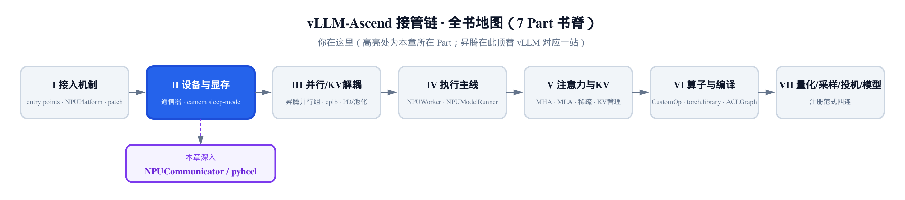
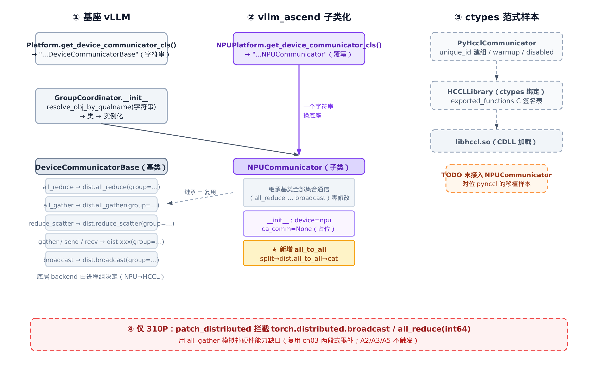
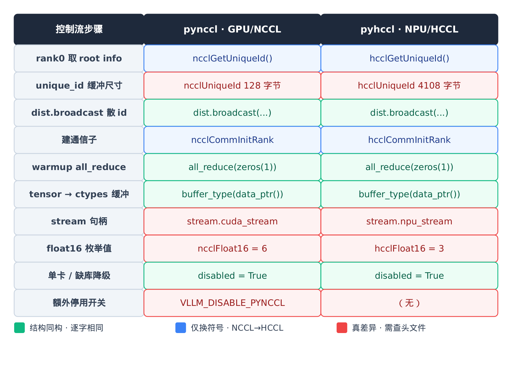
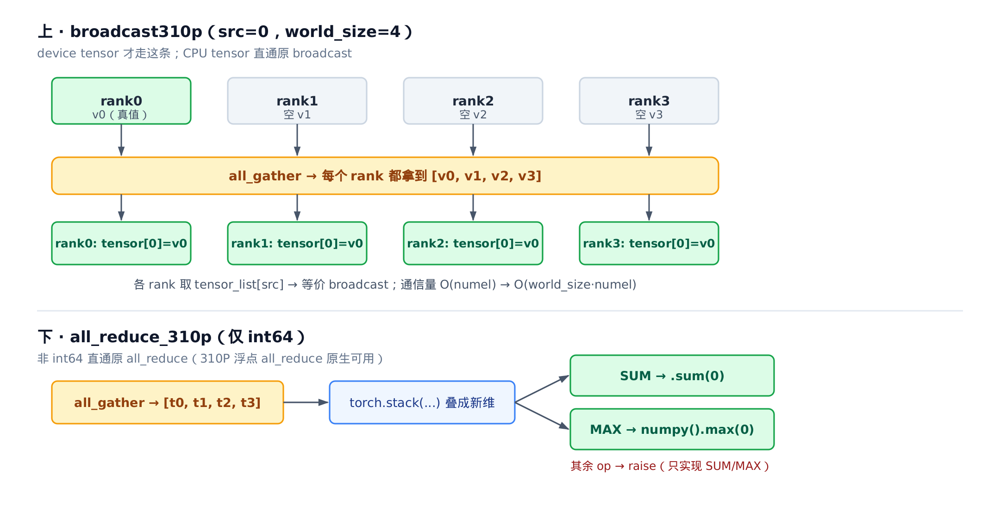

# 第 6 章 换底座的通信器：从 CudaCommunicator 到 NPUCommunicator



> **你在这里**——Part II「设备与显存」的开篇。
> 上一章靠一个配置钩子，把 `worker_cls` 落定成 `NPUWorker`。
> 本章解决多卡之间怎么通信：把 GPU 的通信器换成昇腾版。
> 下一章接着讲显存——camem sleep-mode 分配器。

---

[上一章](../ch05-check-and-update-config/narrative/chapter.md)结尾，`worker_cls` 终于从哨兵字符串落成了具体的 `NPUWorker`。可一个 worker 不会孤零零地跑——张量并行、专家并行、流水线并行，多张卡之间要不停地交换张量。而 vLLM 里负责这件事的那层，叫**通信器（communicator）**，在 GPU 上是 `CudaCommunicator`，底层走 NCCL。昇腾 NPU 上没有 NCCL，有的是华为自家的 HCCL。NCCL 是 NVIDIA 的集合通信库、HCCL 是昇腾的对应实现，都负责多卡间 all_reduce / all_gather 等集合通信。

那 vllm-ascend 凭什么把整套通信器换成昇腾版？答案出乎意料地干净。**通信器是 OOT（out-of-tree，源码树外）插件换底座最干净的样本**——干净到整个 `NPUCommunicator` 只有 68 行。本章想说服你相信这件事，并讲清它为什么成立。

通信器之所以好换，靠的是三件事叠在一起：

- **接口窄**：基座只通过一个字符串回调，就把「用哪个通信器类」这件事交给了平台。
- **基类已抽象好**：`vllm/distributed/device_communicators/base_device_communicator.py` 里的 `DeviceCommunicatorBase` 把几乎所有集合通信都写成了 `dist.xxx(group=...)` 一行壳，底层用 NCCL 还是 HCCL，由进程组自己决定——子类一个字都不用改。
- **只露一个差异点**：昇腾唯一需要自己给的，是 MoE 用的 `all_to_all`，定义在 `vllm_ascend/distributed/device_communicators/npu_communicator.py`。

我们把这章拆成四条并排的线，先看一张总览，再逐条拆：



> *图注：① 基座 vLLM 用一个字符串回调选通信器类；② vllm_ascend 子类化基类，灰色是零修改继承的集合通信，橙色星标是唯一新增的 `all_to_all`；③ 旁挂一条手写 ctypes 范式样本（虚线=当前未接入）；④ 底部仅 310P 才触发的猴补层，补硬件能力缺口。*

## 6.1 一个字符串换底座：通信器的注入点

先看基座这一侧。vLLM 的平台基类 `Platform` 上有这么一个 classmethod，是整条线的起点：

```python
# vllm/platforms/interface.py:L769-L774
    @classmethod
    def get_device_communicator_cls(cls) -> str:
        """
        Get device specific communicator class for distributed communication.
        """
        return "vllm.distributed.device_communicators.base_device_communicator.DeviceCommunicatorBase"  # noqa
```

注意它的返回类型——`str`。它**不返回类对象**，返回的是一个 **qualname（全限定类名）字符串**。基座默认指向自己的 `DeviceCommunicatorBase`。

为什么是字符串而不是直接 `return DeviceCommunicatorBase`？因为 OOT 插件装在 vLLM **之外**：基座的代码里**不能** `import` 任何昇腾符号——那会让 vLLM 反向依赖一个它根本不知道存在的包。字符串把这层硬依赖彻底切断：基座只声明「我要一个通信器类，名字到运行期再问平台」，谁来填由当前激活的平台说了算。

昇腾这一侧，填法简单到一句话：

```python
# vllm_ascend/platform.py:L803-L805
    @classmethod
    def get_device_communicator_cls(cls) -> str:
        return "vllm_ascend.distributed.device_communicators.npu_communicator.NPUCommunicator"
```

`NPUPlatform` 是 `Platform` 的 OOT 子类（怎么被 vLLM 认出来、顶替成默认平台，是 [第 2 章](../ch02-entry-points-and-npuplatform/narrative/chapter.md)的事），这里只覆写这一个 classmethod：把字符串从基类换成 `NPUCommunicator` 的 qualname。**换底座的全部动作，就是改一个字符串的返回值。**

字符串怎么变成真正的类实例？在进程组初始化时。每个 `GroupCoordinator`（一组协同通信的 rank 的协调器）在 `__init__` 里做这件事：

```python
# vllm/distributed/parallel_state.py:L370-L381
        self.use_device_communicator = use_device_communicator
        self.device_communicator = None
        if use_device_communicator and self.world_size > 1:
            device_comm_cls = resolve_obj_by_qualname(
                current_platform.get_device_communicator_cls()
            )
            self.device_communicator = device_comm_cls(
                cpu_group=self.cpu_group,
                device=self.device,
                device_group=self.device_group,
                unique_name=self.unique_name,
            )
```

三步连起来：`current_platform.get_device_communicator_cls()` 拿到字符串（在 NPU 上已被覆写成 `NPUCommunicator` 的 qualname）→ `resolve_obj_by_qualname` 按字符串把类解析出来 → 用统一签名实例化。`current_platform` 是个全局单例，它指向谁，整个回调就解析成谁——这就是「一个字符串换底座」的全貌。

主线到此讲完。临走前钉两个容易看走眼的细节，免得后面踩坑。

第一个，实例化只传了 4 个 keyword 参数：`cpu_group`、`device`、`device_group`、`unique_name`。而基类 `DeviceCommunicatorBase.__init__` 其实有 6 个形参——后两个 `global_ranks`、`global_world_size` 带默认值 `None`，只在无状态进程组（stateless process group，临时按需建、不依赖预先 `init_process_group()` 的全局组）那条分支才用到。所以这个调用点用 4 个参数，恰好和子类的 `super().__init__(...)` 对得上，后两个走默认即可。别误以为基类构造器只有 4 个参数。

第二个，上面那段 `self.device` 是哪来的？在这段之前，`GroupCoordinator` 按平台决定设备——其中有一条 `is_out_of_tree()` 分支，把设备设成 `torch.device(f"{device_name}:{local_rank}")`，对昇腾就是 `npu:N`。这里的 `device_name` 是平台设备类型串——昇腾 NPU 为 `"npu"`，GPU 则是 `"cuda"`。通信器拿到的 `device` 因此天然是 NPU 设备，无需额外处理。

## 6.2 子类化基类：继承即复用，只补一个差异点

注入点解决了「用哪个类」，接下来看这个类本身。本节是全章的核心论点：**子类化 = 只改差异点**，而通信器把这句话体现到了极致。

### 6.2.1 基类把集合通信抽象成 dist.xxx（继承即复用）

先看基类 `DeviceCommunicatorBase` 是怎么写集合通信的。挑两个最常用的——`all_reduce` 和 `all_gather`：

```python
# vllm/distributed/device_communicators/base_device_communicator.py:L180-L207
    def all_reduce(self, input_: torch.Tensor) -> torch.Tensor:
        dist.all_reduce(input_, group=self.device_group)
        return input_

    def all_gather(self, input_: torch.Tensor, dim: int = -1) -> torch.Tensor:
        if dim < 0:
            # Convert negative dim to positive.
            dim += input_.dim()
        input_size = input_.size()
        # NOTE: we have to use concat-style all-gather here,
        # stack-style all-gather has compatibility issues with
        # torch.compile . see https://github.com/pytorch/pytorch/issues/138795
        output_size = (input_size[0] * self.world_size,) + input_size[1:]
        # Allocate output tensor.
        output_tensor = torch.empty(
            output_size, dtype=input_.dtype, device=input_.device
        )
        # All-gather.
        dist.all_gather_into_tensor(output_tensor, input_, group=self.device_group)
        # Reshape
        output_tensor = output_tensor.reshape((self.world_size,) + input_size)
        output_tensor = output_tensor.movedim(0, dim)
        output_tensor = output_tensor.reshape(
            input_size[:dim]
            + (self.world_size * input_size[dim],)
            + input_size[dim + 1 :]
        )
        return output_tensor
```

看 `all_reduce` 的核心：一行 `dist.all_reduce(input_, group=self.device_group)`。`all_gather` 复杂一点，但绕开形状变换看主干，落点也是一句 `dist.all_gather_into_tensor(..., group=self.device_group)`。基类里同款的还有 `reduce_scatter`、`gather`、`send`、`recv`、`broadcast`（散落在后面 L217–L309，不与上面相邻），无一例外都是 `dist.xxx(group=self.device_group)` 包一层壳。

这层抽象是整章成立的根。`dist.xxx` 是 `torch.distributed` 的集合通信接口，它具体落到哪个后端——NCCL、Gloo，还是 HCCL——**由 `self.device_group` 这个进程组在创建时绑定的 backend 决定**。昇腾在初始化分布式环境时把进程组的 backend 选成了 HCCL，于是这些 `dist.xxx` 调用**一个字不改**，就自动走到了 HCCL、落到 NPU 上。

所以子类继承这些方法，就等于免费拿到了全套 NPU 集合通信。这不是「重写得很省」，是**压根不用重写**。

### 6.2.2 NPUCommunicator 的两处微调与唯一新增

带着上面的认识看 `NPUCommunicator`。它就是子类化论点的活证据——继承基类后，只动了三处地方。先看 `__init__`：

```python
# vllm_ascend/distributed/device_communicators/npu_communicator.py:L23-L38
class NPUCommunicator(DeviceCommunicatorBase):
    def __init__(
        self,
        cpu_group: dist.ProcessGroup,
        device: torch.device | None = None,
        device_group: dist.ProcessGroup | None = None,
        unique_name: str = "",
    ):
        super().__init__(cpu_group, device, device_group, unique_name)
        # TODO(hz): Refer to CudaCommunicator's implementation to integrate PyHcclCommunicator
        # init device according to rank
        self.device = torch.npu.current_device()

        # For compatibility (mainly for reusing graph capturing code in vllm),
        # init custom all-reduce implementation interface as in CUDACommunicator.
        self.ca_comm = None
```

`super().__init__(...)` 先把基类那套初始化跑完（注意这里只传 4 个位置参数，正好对应 [6.1](#61-一个字符串换底座通信器的注入点) 说的调用口径）。然后只补两笔：

**第一笔，`self.device = torch.npu.current_device()`。** 把设备坐实到当前 NPU。

**第二笔，`self.ca_comm = None`。** 注释写得很直白——`For compatibility (mainly for reusing graph capturing code in vllm)`。vLLM 复用图捕获（graph capturing）代码时会去访问 `communicator.ca_comm`，那是 custom all-reduce（自定义 all-reduce）的接口；`CudaCommunicator` 在这里挂的是一个真实现，昇腾暂时还没有，于是先置 `None` 占位——让接口的「形状」对齐，访问时不至于抛 `AttributeError`。这个 `None` 不是终点：上面那行 `TODO(hz)` 已经写明要参照 `CudaCommunicator` 把 `PyHcclCommunicator` 接进来。这颗占位的种子，等显存与图捕获那条线推进时会被重新拾起。

再看唯一新增的方法 `all_to_all`：

```python
# vllm_ascend/distributed/device_communicators/npu_communicator.py:L40-L68
    def all_to_all(
        self,
        input_: torch.Tensor,
        scatter_dim: int = 0,
        gather_dim: int = -1,
        scatter_sizes: list[int] | None = None,
        gather_sizes: list[int] | None = None,
    ) -> torch.Tensor:
        if scatter_dim < 0:
            scatter_dim += input_.dim()
        if gather_dim < 0:
            gather_dim += input_.dim()

        if scatter_sizes is not None and gather_sizes is not None:
            input_list = [t.contiguous() for t in torch.split(input_, scatter_sizes, scatter_dim)]
            output_list = []
            tensor_shape_base = input_list[self.rank].size()
            for i in range(self.world_size):
                tensor_shape = list(tensor_shape_base)
                tensor_shape[gather_dim] = gather_sizes[i]
                output_list.append(torch.empty(tensor_shape, dtype=input_.dtype, device=input_.device))

        else:
            input_list = [t.contiguous() for t in torch.tensor_split(input_, self.world_size, scatter_dim)]
            output_list = [torch.empty_like(input_list[i]) for i in range(self.world_size)]

        dist.all_to_all(output_list, input_list, group=self.device_group)
        output_tensor = torch.cat(output_list, dim=gather_dim).contiguous()
        return output_tensor
```

这里要澄清一个常见误读。`all_to_all` 严格说是**新增**，不是「重写基类同名方法」——基座的 `DeviceCommunicatorBase` 和 `CudaCommunicator` 里**都没有** `all_to_all`（可以全仓搜一遍确认）。`CudaCommunicator` 在 GPU 上不需要它，昇腾在 MoE 路径上需要，于是子类自己补上。

但这恰恰让「子类化 = 只改差异点」的论点更硬：昇腾对通信器的全部改动，就是 **`__init__` 两笔微调 + 新增一个 `all_to_all`**，其余集合通信全部原样继承。差异点窄到这个程度，正是「通信器是最干净样本」的实证。

而且即便是这个新增的 `all_to_all`，骨架依然没逃出基类范式——核心还是一句 `dist.all_to_all(output_list, input_list, group=self.device_group)`，前面 split、后面 cat，都是在这句两侧做形状整理。它不碰底层 HCCL，只是把基类「`dist.xxx(group=device_group)`」的写法延伸到了一个基类没覆盖的原语上。

### 6.2.3 all_to_all 的形状代数：一次分布式转置

`all_to_all` 是 MoE 把 token 按专家路由重排的核心原语。它的语义不是「归约」也不是「广播」，而是**转置式重分发**：每个 rank 把自己的数据切成 `world_size` 份，第 `j` 份发给 rank `j`；同时从每个 rank 收回属于自己的那一份。我们用一个 2 卡的小例子把形状走一遍。

设 `world_size = 2`，`scatter_dim = gather_dim = 0`，走均分分支（`scatter_sizes`/`gather_sizes` 为 `None`，用 `torch.tensor_split` 切）。两张卡各持一个长度为 4 的张量：

| 步骤 | rank0 | rank1 |
|---|---|---|
| ① 输入 `input_` | `[A0, A1, A2, A3]` | `[B0, B1, B2, B3]` |
| ② `tensor_split` 成 2 份 `input_list` | `[[A0,A1], [A2,A3]]` | `[[B0,B1], [B2,B3]]` |
| ③ `dist.all_to_all` 后 `output_list` | `[[A0,A1], [B0,B1]]` | `[[A2,A3], [B2,B3]]` |
| ④ 沿 `gather_dim` cat → 输出 | `[A0, A1, B0, B1]` | `[A2, A3, B2, B3]` |

读第 ③ 行：rank0 的 `output_list[0]` 是自己 `input_list[0]`，`output_list[1]` 收的是 rank1 的 `input_list[0]`——也就是「每个 rank 把自己的第 `j` 份发给 rank `j`，第 `r` 份留给/收自各 rank」。把两卡的输出拼起来看，正好是把输入按「rank × chunk」的网格做了一次**转置**：原本「按源 rank 分行」，现在「按目标 rank 分行」。这就是 MoE 里「把同一专家的 token 汇到同一张卡」需要的重排。

均分分支用 `tensor_split` 平均切、`output_list` 用 `empty_like` 照着输入份额开；不均分分支（传了 `scatter_sizes`/`gather_sizes`）则不同——因为每个 rank 收到的份额长度不一样，必须**逐 rank 预分配**输出形状。看那个 `for i in range(self.world_size)` 循环：它以 `input_list[self.rank]` 的形状为模板，把 `gather_dim` 这一维逐个替换成 `gather_sizes[i]`，为每个来源 rank 单独开一块 `torch.empty`。这就是均分分支不需要、不均分分支才出现那个循环的原因——形状不齐，只能一个个量好尺寸再接。

光看散文不够，把不均分分支也走一遍数值才看得清那个循环为什么非要不可。还是 2 卡、`scatter_dim = gather_dim = 0`，但两卡持有的长度不同、切法也不同（这正是 MoE 里「每张卡路由到各专家的 token 数不一」的常态）：

| 步骤 | rank0 | rank1 |
|---|---|---|
| ① 输入 `input_`（长度） | `[A0, A1, A2]`（3） | `[B0, B1, B2, B3]`（4） |
| ② `scatter_sizes` | `[1, 2]` | `[3, 1]` |
| ③ `torch.split` 成 `input_list` | `[[A0], [A1,A2]]` | `[[B0,B1,B2], [B3]]` |
| ④ 第 `j` 份发给 rank `j` | 份0→r0、份1→r1 | 份0→r0、份1→r1 |
| ⑤ `all_to_all` 后 `output_list` | `[[A0], [B0,B1,B2]]` | `[[A1,A2], [B3]]` |
| ⑥ 各块 `gather_dim` 长 = `gather_sizes` | `[1, 3]` | `[2, 1]` |
| ⑦ 沿 `gather_dim` cat → 输出 | `[A0, B0, B1, B2]` | `[A1, A2, B3]` |

盯着第 ⑤、⑥ 行就明白那个 `for i in range(self.world_size)` 为什么省不掉。rank0 收到的两块——自己的 `[A0]`（长 1）和 rank1 发来的 `[B0,B1,B2]`（长 3）——**块内长度就不齐**，`empty_like` 照输入份额开的老办法直接失效；而且 rank0 要开的形状 `[1, 3]` 和 rank1 要开的 `[2, 1]` **跨卡也不一样**。每个 rank 只能拿 `gather_sizes` 当尺子，把 `gather_dim` 这一维逐个量成 `gather_sizes[i]`，一块一块 `torch.empty` 出来——这就是均分分支用不到、不均分分支才冒出那个循环的根。

复杂度上，`all_to_all` 每个 rank 的发送量、接收量均为 `O(numel)`：发出自己的全部数据、收回等量数据。它的发送侧与 `all_gather` 的输入同阶，但别把两者画等号——`all_gather` 每个 rank 要**接收** `world_size · numel`（人手一份全量副本），`all_to_all` 只接收约 `numel`，**接收量并不同阶**。差别的根在语义：`all_to_all` 是「重分发」，`all_gather` 是「复制汇聚」。

至于这个 `all_to_all` 究竟在哪个调用点被用到——专家并行怎么用它把 token 路由到对应专家、FusedMoE 又怎么编排这层通信——那是 MoE 算子那一章的主题，这里先把通信原语本身的形状代数讲透，路由侧留到后面回收。

## 6.3 手写 pyhccl：把 pynccl 的 ctypes 范式逐符号移植

到这里，「换底座」的主干已经讲完：注入点 + 子类化基类。但 vllm-ascend 还多做了一件事——手写了一个 `pyhccl`，对位基座的 `pynccl`。这条线值得单独看，因为它示范了另一种移植手法：**不写一行 C++ 扩展，纯用 ctypes 直接绑定厂商的集合通信库**，而且 GPU 到 NPU 的范式可以几乎逐符号照搬。

先说清这是什么。`pynccl`/`pyhccl` 这层，是为了**绕开 `torch.distributed`、直接调原生集合通信库**（NCCL/HCCL 的 `.so`）而存在的——某些场景（如 custom all-reduce、图捕获）需要更贴近底层的控制。它和 [6.2](#62-子类化基类继承即复用只补一个差异点) 那条「走 `dist.xxx` + 进程组 backend」的路是**两条独立的路**。

### 6.3.1 ctypes 绑定层：HCCLLibrary

具体怎么直调？pyhccl 绕过 `torch.distributed`，用 ctypes（Python 调用 C 代码的 FFI 层）直接绑定 HCCL 的 C 动态库 `libhccl.so`（`.so` = Linux 共享库），换来更细的控制权。要直调 `.so`，先得告诉 Python 这个 C 库里有哪些函数、每个函数的参数和返回值是什么类型。这件事由 `pyhccl_wrapper.py` 干。最底层是一组 C 类型到 ctypes 的别名：

```python
# vllm_ascend/distributed/device_communicators/pyhccl_wrapper.py:L34-L45
hcclResult_t = ctypes.c_int
hcclComm_t = ctypes.c_void_p


class hcclUniqueId(ctypes.Structure):
    _fields_ = [("internal", ctypes.c_byte * 4108)]


aclrtStream_t = ctypes.c_void_p
buffer_type = ctypes.c_void_p

hcclDataType_t = ctypes.c_int
```

注意 `hcclUniqueId` 的 `4108` 字节。这是 HCCL 的「root info」结构体大小，**必须照 HCCL 头文件写死**——`pynccl_wrapper` 里对位的 `ncclUniqueId` 是 `128` 字节。这是 HCCL 与 NCCL 之间一个实打实的尺寸差异，不能想当然照抄 NCCL 的数。这就是「照搬范式只换符号」里一个关键提醒：**有些符号的值本身也得换**。

枚举映射也是同理。`hcclDataTypeEnum` 把 `torch.dtype` 翻译成 HCCL 头文件里的整型常量：

```python
# vllm_ascend/distributed/device_communicators/pyhccl_wrapper.py:L48-L81
class hcclDataTypeEnum:
    hcclInt8 = 0
    hcclInt16 = 1
    hcclInt32 = 2
    hcclFloat16 = 3
    hcclFloat32 = 4
    # … 省略：hcclInt64=5 … hcclInt128=12 等其余常量 …

    @classmethod
    def from_torch(cls, dtype: torch.dtype) -> int:
        # … 省略：int8/uint8/int32 等分支 …
        if dtype == torch.float16:
            return cls.hcclFloat16
        if dtype == torch.float32:
            return cls.hcclFloat32
        # … 省略：float64/bfloat16/int64 分支 …
        raise ValueError(f"Unsupported dtype: {dtype}")
```

这里藏着「值要换」的最隐蔽一处：`hcclFloat16 = 3`，而 NCCL 那边 `ncclFloat16 = 6`。同样是 float16，两个库给的整型编码不同。`from_torch` 这套平行 `if` 链结构上和 `pynccl_wrapper` 一模一样，但每个常量值都得按 HCCL 的 `hccl_types.h` 抄死，抄错一个数，传给 `.so` 的 dtype 就错了。`hcclRedOpTypeEnum`（把 `ReduceOp` 翻译成 HCCL 的 op 常量）是同样的套路，不再展开。

真正把 Python 和 `.so` 焊在一起的，是 `HCCLLibrary` 的函数签名声明表：

```python
# vllm_ascend/distributed/device_communicators/pyhccl_wrapper.py:L106-L131
@dataclass
class Function:
    name: str
    restype: Any
    argtypes: list[Any]


class HCCLLibrary:
    exported_functions = [
        # const char* HcclGetErrorString(HcclResult code);
        Function("HcclGetErrorString", ctypes.c_char_p, [hcclResult_t]),
        # HcclResult HcclGetRootInfo(HcclRootInfo *rootInfo);
        Function("HcclGetRootInfo", hcclResult_t, [ctypes.POINTER(hcclUniqueId)]),
        # HcclResult HcclCommInitRootInfo(
        #   uint32_t nRanks, const HcclRootInfo *rootInfo, uint32_t rank, HcclComm *comm);
        # note that HcclComm is a pointer type, so the last argument is a pointer to a pointer
        Function(
            "HcclCommInitRootInfo",
            hcclResult_t,
            [
                ctypes.c_int,
                ctypes.POINTER(hcclUniqueId),
                ctypes.c_int,
                ctypes.POINTER(hcclComm_t),
            ],
        ),
        # … 省略：HcclAllReduce / HcclBroadcast / HcclCommDestroy 三个签名（L132-L166），结构同款 …
    ]
```

每个 `Function(name, restype, argtypes)` 对应 `hccl.h` 里一个 C 函数原型——注释里那行 C 签名就是逐字照抄来的。这张表和 `pynccl_wrapper.NCCLLibrary.exported_functions` 结构完全同构，只是函数名换成 `Hccl*`、参数表按 HCCL 头文件写。

特别留意 `HcclCommInitRootInfo` 的最后一个参数 `ctypes.POINTER(hcclComm_t)`——注释点明了 `HcclComm is a pointer type, so the last argument is a pointer to a pointer`（指针的指针）。C 函数要往外「写回」一个通信子句柄，就得收一个「指向句柄的指针」。这个细节下一节会和 `ctypes.byref(comm)` 对上。

有了这张表，加载就是机械活：

```python
# vllm_ascend/distributed/device_communicators/pyhccl_wrapper.py:L177-L228
    def __init__(self, so_file: str | None = None):
        so_file = so_file or find_hccl_library()

        try:
            if so_file not in HCCLLibrary.path_to_dict_mapping:
                lib = ctypes.CDLL(so_file)
                HCCLLibrary.path_to_library_cache[so_file] = lib
            self.lib = HCCLLibrary.path_to_library_cache[so_file]
        except Exception as e:
            logger.error(...)  # … 省略：加载失败时的多行排查提示文案 …
            raise e

        if so_file not in HCCLLibrary.path_to_dict_mapping:
            _funcs: dict[str, Any] = {}
            for func in HCCLLibrary.exported_functions:
                f = getattr(self.lib, func.name)
                f.restype = func.restype
                f.argtypes = func.argtypes
                _funcs[func.name] = f
            HCCLLibrary.path_to_dict_mapping[so_file] = _funcs
        self._funcs = HCCLLibrary.path_to_dict_mapping[so_file]

    # … 省略：hcclGetErrorString / HCCL_CHECK（非零返回码查错并抛 RuntimeError）…

    def hcclGetUniqueId(self) -> hcclUniqueId:
        unique_id = hcclUniqueId()
        self.HCCL_CHECK(self._funcs["HcclGetRootInfo"](ctypes.byref(unique_id)))
        return unique_id

    def hcclCommInitRank(self, world_size: int, unique_id: hcclUniqueId, rank: int) -> hcclComm_t:
        comm = hcclComm_t()
        self.HCCL_CHECK(
            self._funcs["HcclCommInitRootInfo"](world_size, ctypes.byref(unique_id), rank, ctypes.byref(comm))
        )
        return comm
```

`__init__` 的主干：`ctypes.CDLL(so_file)` 把 `libhccl.so` 加载进来 → 遍历 `exported_functions`，给每个 C 函数挂上 `restype`/`argtypes`（这样 ctypes 才能正确编组参数）→ 用类级 dict 缓存，避免同一个库反复加载。

下面两个方法演示了 `ctypes.byref` 怎么用。`hcclGetUniqueId` 先在 Python 侧造一个空的 `hcclUniqueId()` 结构体，把 `byref(unique_id)`（它的地址）传进去，让 C 函数往这块内存里**写回** root info。`hcclCommInitRank` 更典型：它造一个空的 `comm = hcclComm_t()`，传 `byref(comm)`——这正好对上前面说的「最后一个参数是指针的指针」：`comm` 本身是个指针类型，`byref(comm)` 是指向它的指针，C 函数把真正的通信子句柄写回到 `comm` 里。

### 6.3.2 通信器层：建组 / warmup / disabled 降级

绑定层之上是 `PyHcclCommunicator`，它把上面那些底层调用串成「建组 → 预热 → 可用」的流程。建组前要先解决一个分布式协调问题：所有 rank 得约定同一个通信组——HCCL 要求 rank0 先生成一个全局唯一 id（unique_id / root info），广播给各 rank，大家凭它各自建出同一个组。带着这个目标读 `__init__`：

```python
# vllm_ascend/distributed/device_communicators/pyhccl.py:L37-L128
class PyHcclCommunicator:
    def __init__(
        self,
        group: ProcessGroup | StatelessProcessGroup,
        device: int | str | torch.device,
        library_path: str | None = None,
    ):
        # … 省略：解释 group/device/library_path 三个参数语义的 docstring …
        if not isinstance(group, StatelessProcessGroup):
            assert dist.is_initialized()
            assert dist.get_backend(group) != dist.Backend.HCCL, (
                "PyHcclCommunicator should be attached to a non-HCCL group."
            )
            # note: this rank is the rank in the group
            self.rank = dist.get_rank(group)
            self.world_size = dist.get_world_size(group)
        else:
            self.rank = group.rank
            self.world_size = group.world_size

        self.group = group

        # if world_size == 1, no need to create communicator
        if self.world_size == 1:
            self.available = False
            self.disabled = True
            return

        try:
            self.hccl = HCCLLibrary(library_path)
        except Exception:
            # disable because of missing HCCL library
            # e.g. in a non-NPU environment
            self.available = False
            self.disabled = True
            return

        self.available = True
        self.disabled = False

        logger.info("vLLM is using pyhccl")

        # … 省略：把 device 规整成 torch.device 对象（int/str → npu:N）…

        if self.rank == 0:
            # get the unique id from HCCL
            with torch.npu.device(device):
                self.unique_id = self.hccl.hcclGetUniqueId()
        else:
            # construct an empty unique id
            self.unique_id = hcclUniqueId()

        if not isinstance(group, StatelessProcessGroup):
            tensor = torch.ByteTensor(list(self.unique_id.internal))
            ranks = dist.get_process_group_ranks(group)
            # arg `src` in `broadcast` is the global rank
            dist.broadcast(tensor, src=ranks[0], group=group)
            byte_list = tensor.tolist()
            for i, byte in enumerate(byte_list):
                self.unique_id.internal[i] = byte
        else:
            self.unique_id = group.broadcast_obj(self.unique_id, src=0)

        # hccl communicator and stream will use this device
        with torch.npu.device(device):
            self.comm: hcclComm_t = self.hccl.hcclCommInitRank(self.world_size, self.unique_id, self.rank)

            stream = current_stream()
            # A small all_reduce for warmup.
            data = torch.zeros(1, device=device)
            self.all_reduce(data)
            stream.synchronize()
            del data
```

这段 `__init__` 有三个值得记住的设计：

**一、disabled 降级。** 有两条提前返回的路：`world_size == 1`（单卡，没有通信对象），以及 `HCCLLibrary(library_path)` 抛异常（缺库——比如在非 NPU 环境）。两种情况都把 `available=False`、`disabled=True` 然后 `return`，**不报错**。这让 `pyhccl` 在单卡或没有 HCCL 库的机器上能安全地「存在但不工作」——后面会看到所有集合通信方法开头都查 `self.disabled`。

**二、unique_id 建组。** HCCL（和 NCCL 一样）建立一个通信子需要所有 rank 共享一个唯一标识。流程是：rank 0 调 `hcclGetUniqueId()` 取一个 root info，其余 rank 先造一个空的；然后用 `dist.broadcast` 把 rank 0 的 id 散给所有 rank（这一步借的是已有的 `torch.distributed` 进程组）；最后每个 rank 拿着同一个 id 调 `hcclCommInitRank` 建出自己的通信子句柄 `self.comm`。

**三、warmup all_reduce。** 建组之后，立刻发一个 `torch.zeros(1)` 的小 `all_reduce` 跑一遍、`stream.synchronize()` 等它跑完。这是为了把首次通信的初始化开销在「预热」阶段一次性付掉，避免它混进后面真正计时的通信里。

具体的集合通信方法本身，也是 ctypes 编组的范例：

```python
# vllm_ascend/distributed/device_communicators/pyhccl.py:L130-L153
    def all_reduce(self, in_tensor: torch.Tensor, op: ReduceOp = ReduceOp.SUM, stream=None) -> torch.Tensor:
        if self.disabled:
            return None
        # hccl communicator created on a specific device
        # will only work on tensors on the same device
        # otherwise it will cause "illegal memory access"
        assert in_tensor.device == self.device, (
            f"this hccl communicator is created to work on {self.device}, but the input tensor is on {in_tensor.device}"
        )

        out_tensor = torch.empty_like(in_tensor)

        if stream is None:
            stream = current_stream()
        self.hccl.hcclAllReduce(
            buffer_type(in_tensor.data_ptr()),
            buffer_type(out_tensor.data_ptr()),
            in_tensor.numel(),
            hcclDataTypeEnum.from_torch(in_tensor.dtype),
            hcclRedOpTypeEnum.from_torch(op),
            self.comm,
            aclrtStream_t(stream.npu_stream),
        )
        return out_tensor
```

三个动作连起来看：开头 `if self.disabled: return None`（呼应上面的降级）；中间 `assert in_tensor.device == self.device`（通信子绑死在某个设备，张量在别的设备会触发非法内存访问）；核心是把 torch 张量交给 `.so`——`in_tensor.data_ptr()` 是张量在设备显存里的地址（一个整数），用 `buffer_type(...)`（即 `ctypes.c_void_p`）包成 C 指针；`stream.npu_stream` 同理包成 `aclrtStream_t` 句柄。dtype 和 op 经 `from_torch` 翻译成 HCCL 整型常量。`broadcast` 方法是同款套路，不再展开。

这就是「不写 C++ 扩展也能直调厂商集合通信库」的关键：张量的 `data_ptr()` + 正确声明的 `argtypes`，让 ctypes 把指针、数量、句柄一一编组好，直接喂给 `.so`。

### 6.3.3 逐行对位：照搬控制流，只换符号

把 `pyhccl` 和 `pynccl` 摆在一起逐行看，「照搬范式只换符号」就一目了然了：



> *图注：绿色=结构逐字相同；蓝色=仅换符号（NCCL→HCCL、cuda→npu）；红色=真差异，值/句柄/开关需查各自头文件。控制流（取 root info → broadcast 建组 → CommInitRank → warmup → 直调 .so）完全一致。*

把两份源码摆在一起读最直观：`vllm_ascend/distributed/device_communicators/pyhccl.py` 对位 `vllm/distributed/device_communicators/pynccl.py`，`pyhccl_wrapper.py` 对位 `vllm/distributed/device_communicators/pynccl_wrapper.py`。读这张表的方式：**控制流（行的顺序与每步做什么）完全一致**，差异只落在三类格子里——

- **蓝色（仅换符号）**：`ncclGetUniqueId` → `hcclGetUniqueId`、`ncclCommInitRank` → `hcclCommInitRank`，名字换了，调用位置和参数结构没变。
- **红色（真差异，需查头文件）**：`ncclUniqueId` 128 字节 vs `hcclUniqueId` 4108 字节、`stream.cuda_stream` vs `stream.npu_stream`、`ncclFloat16 = 6` vs `hcclFloat16 = 3`。这些是「值本身也得换」的地方，照抄 NCCL 的数就是 bug。
- **绿色（逐字相同）**：`dist.broadcast` 散 id、warmup 的 `all_reduce(zeros(1))`、`buffer_type(data_ptr())` 编组、`disabled` 降级——这些和后端无关，逐字一样。

唯一的结构性差异在最后一行：`pynccl` 多一个 `VLLM_DISABLE_PYNCCL` 环境变量开关（`world_size == 1 or envs.VLLM_DISABLE_PYNCCL` 都会 disable），`pyhccl` 没有这个开关。其余地方，移植策略就是机械的「照搬控制流、逐符号替换」。

### 6.3.4 诚实交代：pyhccl 当前还没接进来

这条线讲到这里，得把一件事说清楚，免得读者产生误解：**`PyHcclCommunicator` 当前还没有接入 `NPUCommunicator`**。

回看 [6.2.2](#622-npucommunicator-的两处微调与唯一新增) 那行 `TODO(hz): Refer to CudaCommunicator's implementation to integrate PyHcclCommunicator`——这正是证据。`CudaCommunicator` 在它的 `__init__` 里会 `self.pynccl_comm = PyNcclCommunicator(...)` 把 pynccl 挂上去；`NPUCommunicator` 这一步**还没做**。全仓搜一遍 `PyHcclCommunicator` 会命中两处，但要分清「注释提及」和「真实使用」：`npu_communicator.py` 里那处只是上面那行 TODO 提了一嘴，真正构造、调用它的只有单元测试。

所以请记住正确的图景：**NPU 的集合通信，实际走的是 [6.2](#62-子类化基类继承即复用只补一个差异点) 那条路——继承自基类的 `dist.xxx(group=self.device_group)` + 进程组的 HCCL backend**，并不经过 `pyhccl`。`pyhccl` 这条线是 pynccl 的 ctypes 范式的**移植样本 / 预留件**——它和 `ca_comm = None` 那个占位是一对，都是为未来 custom all-reduce / 图捕获集成铺的路。本章把它当作「ctypes 范式怎么从 GPU 照搬到 NPU」的范例来读，是恰当的；把它读成「NPU 靠它做集合通信」，就错了。

## 6.4 仅 310P：用 all_gather 补硬件能力缺口

最后一条线，回到熟悉的地盘。前面三条都是「换底座」，这一条是「补缺口」——而且补的手法，正是 [第 3 章](../ch03-two-stage-monkey-patch/narrative/chapter.md)讲过的两段式 monkey-patch。机制不重讲，这里只讲两件事：**补什么、为什么 `all_gather` 能等价模拟**。

背景是 Atlas 300I（310P）这块推理卡——Atlas 300I 是华为的推理卡，其较老的 310P 变体（相对 A2/A3/A5 新代）缺部分集合通信能力：硬件**不支持原生的 `broadcast`，也不支持 int64 的 `all_reduce`**。但它支持 `all_gather`。于是 vllm-ascend 用猴补把这两个缺失的原语，在 host 侧用 `all_gather` 拼出等价语义：

```python
# vllm_ascend/patch/platform/patch_distributed.py:L33-L54
def communication_adaptation_310p():
    def broadcast310p_wrapper(fn):
        def broadcast310p(tensor, src=0, group=None, async_op=False, group_src=None):
            root = group_src if group_src is not None else src

            if tensor.device == torch.device("cpu"):
                return fn(tensor, src=root, group=group, async_op=async_op)
            rank = torch.distributed.get_rank(group)
            world_size = torch.distributed.get_world_size(group)
            tensor_list = [torch.empty_like(tensor) for _ in range(world_size)]
            tensor_list[rank] = tensor
            torch.distributed.all_gather(tensor_list, tensor, group=group)
            tensor[...] = tensor_list[src]
            if async_op:
                return NullHandle()
            else:
                return None

        return broadcast310p

    torch.distributed.broadcast = broadcast310p_wrapper(torch.distributed.broadcast)
    # … 省略：对 distributed_c10d.broadcast 的同款镜像赋值（真实代码两处都需要）…
```

`broadcast310p` 的逻辑：先 `all_gather` 让**每个 rank 都拿到全部 `world_size` 份**张量，然后取 `tensor_list[src]`——那正是 root（源 rank）的值——写回 `tensor`。每个 rank 都拿到了 src 的值，等价于一次 `broadcast`。

`all_reduce` 的 int64 版同理，多一步归约：

```python
# vllm_ascend/patch/platform/patch_distributed.py:L56-L85
    def all_reduce_wrapper_310p(fn):
        def all_reduce(
            tensor,
            op=torch.distributed.ReduceOp.SUM,
            group=None,
            async_op=False,
        ):
            if tensor.dtype != torch.int64:
                return fn(tensor, op, group, async_op)
            rank = torch.distributed.get_rank(group)
            world_size = torch.distributed.get_world_size(group)
            tensor_list = [torch.empty_like(tensor) for _ in range(world_size)]
            tensor_list[rank] = tensor
            torch.distributed.all_gather(tensor_list, tensor, group=group)
            if op == torch.distributed.ReduceOp.SUM:
                return torch.stack(tensor_list).sum(0)
            elif op == torch.distributed.ReduceOp.MAX:
                # … 省略：MAX 分支用 numpy().max(0) 归约（与 SUM 平行）…
            else:
                raise RuntimeError(f"not implement op {op}")

        return all_reduce

    torch.distributed.all_reduce = all_reduce_wrapper_310p(torch.distributed.all_reduce)
    # … 省略：对 distributed_c10d.all_reduce 的同款镜像赋值 …
```

`all_gather` 收齐各 rank 的张量后 `torch.stack` 叠成新维度，再按 op 归约：`SUM` 走 `.sum(0)`，`MAX` 走 numpy 往返（已省略）。只实现了 `SUM`/`MAX`，其余 op 直接 `raise`——因为 310P 上实际用到的就这两种。

落两个数就能确认这等价。设 2 卡，rank0 持 `[3]`、rank1 持 `[5]`（int64）：`all_gather` 后两卡都拿到 `[[3], [5]]` → `torch.stack` → `sum(0) = [8]`，正是 `3 + 5`，与一次真 `SUM` all_reduce 的结果一模一样；换成 `MAX` 则 `max(0) = [5]`，同样等价。`all_gather` 把归约所需的全部分量先收齐，归约就只是本地一次 `sum`/`max` 的事。

这两段共享同一张数据流图：



> *图注：上半是 broadcast310p——all_gather 收齐后各 rank 取 tensor_list[src]；下半是 all_reduce int64——all_gather 后 stack 再 sum/max 归约。代价是通信量从 broadcast 的 O(numel) 升到 all_gather 的 O(world_size·numel)，用带宽换缺失的硬件原语。*

两个细节收尾。

**一、降级直通。** 两个 wrapper 都只拦截「真正缺能力」的场景：`broadcast310p` 对 CPU 上的张量直接调原函数 `fn`（CPU broadcast 没问题），`all_reduce` 对非 int64 的 dtype 也直接走原函数（310P 的浮点 all_reduce 原生可用，不是缺口）。只在 device 张量的 broadcast、int64 的 all_reduce 这两个真缺口上才接管，把对正常路径的侵入压到最小。

**二、仅 310P 触发。** 这套猴补不是无条件的。模块尾部有一道守卫：

```python
# vllm_ascend/patch/platform/patch_distributed.py:L88-L89
if get_ascend_device_type() == AscendDeviceType._310P:
    communication_adaptation_310p()
```

只有当 `get_ascend_device_type()` 判定是 `_310P` 时，才在 import 期执行替换。A2/A3/A5 这些有完整原生能力的卡，根本不会触发——它们的 `broadcast`/`all_reduce` 保持原样，不被这套 host 侧模拟拖慢。这也是 [第 3 章](../ch03-two-stage-monkey-patch/narrative/chapter.md)那套「按硬件分代守卫猴补」的又一处落地。

## 6.5 小结：窄接口 + 已抽象好的基类 = 最干净的换底座

回头看，本章用四条线回答了开篇那个问题——**为什么通信器是 OOT 换底座最干净的样本**。

**第一，接口窄。** 基座只通过 `get_device_communicator_cls()` 一个返回字符串的回调，就把「用哪个通信器类」交了出来。昇腾的注入动作，是改一个字符串的返回值（[6.1](#61-一个字符串换底座通信器的注入点)）。没有 `import` 反向依赖，没有注册表，没有工厂——一个 classmethod 而已。

**第二，基类已经抽象好。** `vllm/distributed/device_communicators/base_device_communicator.py` 里的 `DeviceCommunicatorBase` 把几乎所有集合通信都写成了 `dist.xxx(group=self.device_group)`，落到哪个后端由进程组的 backend 决定。昇腾把进程组选成 HCCL，这些方法就**零修改自动复用**（[6.2.1](#621-基类把集合通信抽象成-distxxx继承即复用)）。子类化在这里不是「省着写」，是「不用写」。

**第三，只露一个差异点。** `NPUCommunicator` 全部改动是 `__init__` 两笔微调 + **新增**一个 MoE 用的 `all_to_all`（[6.2.2](#622-npucommunicator-的两处微调与唯一新增)），其余全继承。差异点窄到这个程度，「子类化 = 只改差异点」就被体现到了极致。

另外两条线是对主干的补充与诚实交代：手写 `pyhccl` 示范了 ctypes 范式怎么从 GPU 逐符号照搬到 NPU——控制流逐字一致、只换符号，但尺寸/枚举值/句柄这些「值本身」也得按 HCCL 头文件换（[6.3](#63-手写-pyhccl把-pynccl-的-ctypes-范式逐符号移植)）；而且它当前**还没接入** `NPUCommunicator`，是为未来 custom all-reduce 预留的范式样本，不是 NPU 现在做集合通信的路。310P 那条线则用 `all_gather` 在 host 侧补回硬件缺失的 `broadcast` 和 int64 `all_reduce`，用带宽换原语，且仅在 310P 才触发（[6.4](#64-仅-310p用-all_gather-补硬件能力缺口)）。

贯穿全章的判据其实只有一句：**基座把抽象做到位、把接口收窄，OOT 插件换底座就只剩填差异点的活**。通信器是这句话最干净的注脚。下一章进入显存的 camem sleep-mode 分配器——而 `NPUCommunicator` 里那个 `ca_comm = None` 占位、那条还没接进来的 `pyhccl`，都和图捕获、自定义 all-reduce 有关，等显存与图捕获那条线推进时，它们会被重新拾起。
