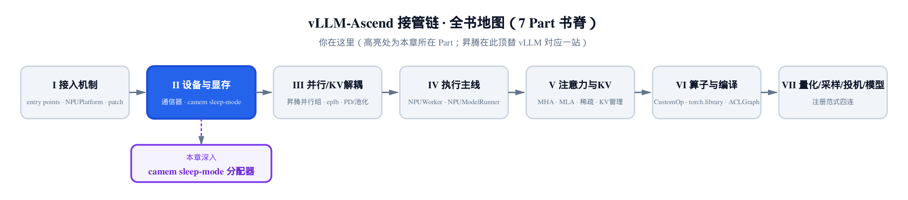
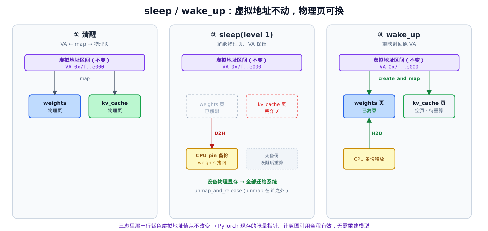
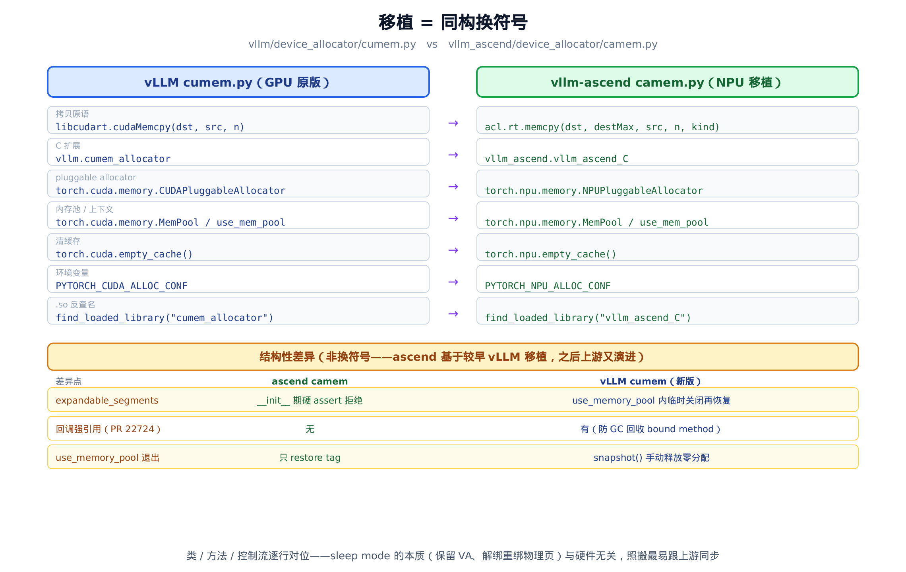
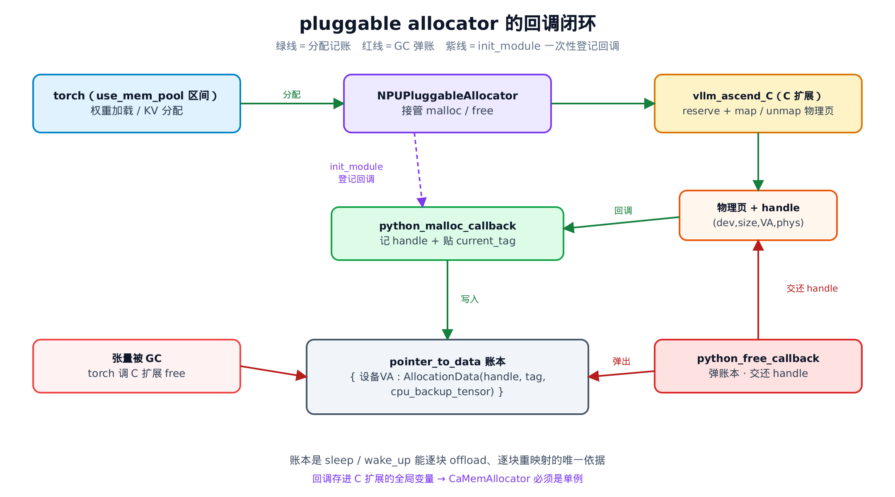

# 第 7 章　显存底座：sleep mode 与 CANN 虚拟内存分配器



> *上一章讲完了「换底座」的通信线。*
> *注入通信器、子类化基类、手写 pyhccl 的 ctypes 绑定。*
> *本章转到设备与显存线：sleep mode 怎么在空窗期把显存还给系统。*
> *主角是 `camem.py`——vLLM `cumem.py` 的昇腾移植。*
> *下一章接并行与 KV 解耦。*

## 7.1 推理空窗期，显存能不能先还回去？

设想一个常见场景。你用一台昇腾机器跑 RLHF：先让推理引擎（vLLM）生成一批回答，再切到训练框架算梯度、更新权重。生成阶段，vLLM 把整个模型权重和 KV cache 都压在 NPU 显存里；可一旦切到训练，这块卡上的训练框架也要吃显存——两个大户挤在同一张卡上，谁都不够用。

最笨的办法是「推理跑完就把进程杀掉」。但重新拉起一个 vLLM 进程，要重新读权重、重新建 CUDA/CANN 上下文、重新编译图，几十秒就没了。**sleep mode 想要的是另一种姿态**：进程不退、Python 对象都还在，只是把显存里那几十 GiB 物理页**临时还给系统**；等下一轮推理来了，再原地「睡醒」，几百毫秒内恢复。

这件事的难点，藏在一个看似简单的问题里：**显存还回去之后，PyTorch 里那些张量怎么办？**

一个 `torch.Tensor` 的 `.data_ptr()` 是一个设备地址。模型里成千上万的权重张量、计算图里的引用，全都攥着这些地址。如果 sleep 时把显存 `free` 掉、wake 时重新 `malloc`，新地址几乎不可能和旧地址一样——于是所有张量指针全部失效，等同于把模型拆了重建。那 sleep 和「杀进程重启」就没区别了。

要让「原地睡醒」成立，必须满足一个苛刻条件：**地址不能变，但地址背后的物理显存可以换**。这正是虚拟内存能给的东西。这套机制，vllm-ascend 实现在 `vllm_ascend/device_allocator/camem.py`——它又是 vLLM `vllm/device_allocator/cumem.py` 的昇腾移植，下文逐行对照着读。

## 7.2 虚拟内存：保留地址，解绑物理页

现代设备内存分配其实是两层，不是一步到位的。

第一层是**保留一段虚拟地址**（virtual address，VA）。这只是在进程的地址空间里画下一段连续区间，登记「这块归我了」，并不占用任何物理显存——就像在地图上圈一块地，地还空着。

第二层才是**申请物理页**（physical handle）并把它 **map 到那段 VA 上**。这一步才真正消耗显存。张量指针指向的，永远是第一层的 VA。

关键就在这里：这两层可以**分别操作**。

$$
\mathrm{张量指针} \;\longrightarrow\; \mathrm{VA（虚拟地址，保留就不动）} \;\longrightarrow\; \mathrm{物理页（可解绑、可重绑）}
$$

sleep 时，我们做的是 **unmap + release 物理页**：把 VA 和物理页之间的映射拆掉、物理显存交还系统。但那段 VA 仍然被「保留」着——没还、没让出去，地图上那块地还圈着，只是上面的房子拆了。

wake 时反过来：**重新申请物理页，map 回同一段 VA**。VA 地址值一个比特都没变，所以 PyTorch 里所有张量的 `.data_ptr()` 依旧有效，计算图引用全部照旧。睡醒后房子重盖在原地，住户感觉不到搬过家。



> *图注：三态时间线。清醒态 VA 映射到 weights / kv_cache 物理页；sleep(level 1) 把物理页解绑（weights 拷回 CPU、kv_cache 直接丢），设备显存全部还给系统；wake_up 把物理页重映射回那段不变的 VA。紫色那行 VA 地址值三态恒等——这是「原地睡醒」的根。*

CANN（昇腾的计算架构，对位 CUDA）也提供了等价的虚拟内存原语：reserve 一段 VA、申请物理页、map、unmap。vllm-ascend 把这套原语封进了一个 C 扩展 `vllm_ascend_C`，对 Python 暴露两个入口：`python_create_and_map`（申请物理页并映射回某段 VA）和 `python_unmap_and_release`（解绑并释放物理页）。本章的主角 `camem.py`，就是围着这两个入口，把「保留 VA、解绑/重绑物理页 + CPU 备份账本」这套机制实现出来。

而它实现的方式，是这本书反复见到的那个套路——**几乎逐行照搬 vLLM**。

## 7.3 主角登场：camem 就是 cumem 换了套符号

vLLM 的 GPU 版 sleep mode 分配器在 `vllm/device_allocator/cumem.py`，类叫 `CuMemAllocator`。vllm-ascend 的版本在 `vllm_ascend/device_allocator/camem.py`，类叫 `CaMemAllocator`。从文件名（**cu**mem → **ca**mem，CUDA → CANN）到类名到方法，两份代码逐行对位。

这不是巧合，是一条清晰的设计判断：**sleep mode 的本质——保留 VA、解绑重绑物理页、用账本管理 CPU 备份——与具体是哪家硬件无关**。CANN 既然提供了等价的虚拟内存原语，那就没必要重新设计，照着 GPU 版的结构换一套符号最省事，还最容易跟上游同步 bug 修复。

整章你会看到这个「换符号」的证据反复出现。先把全貌摆出来：



> *图注：左 vLLM 原版、右昇腾移植，七处换符号逐行对位——拷贝原语、C 扩展、pluggable allocator、内存池、清缓存、环境变量、.so 反查名。底部三条是「非换符号」的结构性差异：昇腾基于较早版本 vLLM 移植，之后上游又演进出 expandable_segments 动态开关、回调强引用、snapshot 释放零分配等。*

下面逐段读真实源码，把这张图坐实。先从文件头那一行 import 看起。

### 7.3.1 反查 .so：find_loaded_library

文件顶部，import 就给出了第一处「换符号」的证据：

```python
# vllm_ascend/device_allocator/camem.py:L19-L28
import dataclasses
import gc
import os
from collections.abc import Callable
from contextlib import contextmanager
from typing import Any

import torch
from acl.rt import memcpy  # type: ignore # noqa: F401
from vllm.logger import logger
```

vLLM 原版在这里 import 的是 `libcudart`（通过 `CudaRTLibrary`）来做设备与主机间的拷贝。昇腾换成了 `from acl.rt import memcpy`——`acl.rt` 是 CANN 运行时（ACL，Ascend Computing Language）的 Python 绑定，`memcpy` 就是它的 `aclrtMemcpy`。这是「移植 = 换符号」的第一处实锤。后面 7.5 会看到这个 `memcpy` 的签名和 `cudaMemcpy` 差在哪。

紧接着是一个工具函数 `find_loaded_library`，作用是从 `/proc/self/maps` 里反查某个已加载共享库的 `.so` 绝对路径：

```python
# vllm_ascend/device_allocator/camem.py:L31-L53
def find_loaded_library(lib_name) -> str | None:
    """
    According to according to https://man7.org/linux/man-pages/man5/proc_pid_maps.5.html,
    the file `/proc/self/maps` contains the memory maps of the process, which includes the
    shared libraries loaded by the process. We can use this file to find the path of the
    a loaded library.
    """  # noqa
    found_line = None
    with open("/proc/self/maps") as f:
        for line in f:
            if lib_name in line:
                found_line = line
                break
    if found_line is None:
        # the library is not loaded in the current process
        return None
    # if lib_name is libcudart, we need to match a line with:
    # address /path/to/libcudart-hash.so.11.0
    start = found_line.index("/")
    path = found_line[start:].strip()
    filename = path.split("/")[-1]
    assert filename.rpartition(".so")[0].startswith(lib_name), f"Unexpected filename: {filename} for library {lib_name}"
    return path
```

为什么要反查路径？因为待会儿要构造 PyTorch 的 `NPUPluggableAllocator`，它的构造函数需要那个 `.so` 的**绝对路径**才能 `dlopen` 进去拿符号。运行期我们并不知道 `vllm_ascend_C` 这个扩展被装到了哪个目录，于是扫一遍 `/proc/self/maps`（Linux 把当前进程的内存映射、含所有已加载 `.so` 都列在这个虚拟文件里），找到含 `vllm_ascend_C` 的那一行，把路径切出来。

值得停一秒的细节：这个函数和 vLLM 版**逐字一致**——连注释里那句 `if lib_name is libcudart` 的举例都原封不动留着，明明这里查的是 `vllm_ascend_C`、跟 `libcudart` 八竿子打不着。这种「连过时注释都照搬」的痕迹，恰恰是「同构换符号」最诚实的旁证：移植时优先保结构，没顺手清理。vLLM 把这个函数收在 `vllm/utils/system_utils.py` 里由 `cumem.py` import；昇腾图省事，直接内联进了 `camem.py`。

### 7.3.2 条件导入与降级开关

接下来是条件导入。能不能用 sleep mode，取决于 `vllm_ascend_C` 这个 C 扩展能不能 import 进来：

```python
# vllm_ascend/device_allocator/camem.py:L56-L75
camem_available = False
try:
    from vllm_ascend.vllm_ascend_C import (  # type: ignore # noqa: F401
        init_module,
        python_create_and_map,
        python_unmap_and_release,
    )

    lib_name = find_loaded_library("vllm_ascend_C")
    camem_available = True
except ImportError as e:
    logger.warning("Failed to import vllm_ascend_C:%s. Sleep mode will be disabled. ", e)
    init_module = None
    python_create_and_map = None
    python_unmap_and_release = None
    lib_name = None
    libcudart = None

# py_device, py_alignedSize, py_d_mem, py_p_memHandle
HandleType = tuple[int, int, int, int]
```

逻辑很直白：扩展在，`camem_available = True`，三个 C 入口和 `.so` 路径就位；扩展不在（比如在没装 CANN 的开发机上），打个 warning、把入口全置 `None`、`camem_available` 留 `False`——sleep mode 静默禁用，不影响主流程跑起来。这也正是本章配套精简版的运行边界：host 上没有这个扩展，`camem_available` 自然是 `False`，纯 Python 的状态机部分照样能跑，真正的虚拟内存映射跑不了。（这套纯 Python 状态机怎么在没有 NPU 的开发机上验，[7.5.3](#753-一次-sleep-到-wake-的账本追踪) 会拿账本追踪具体演一遍。）

对照 vLLM 原版，这一段有三处换符号、两处小差异，值得逐一点名：

- **C 扩展名**：`from vllm.cumem_allocator import ...` → `from vllm_ascend.vllm_ascend_C import ...`。
- **反查名**：`find_loaded_library("cumem_allocator")` → `find_loaded_library("vllm_ascend_C")`。
- **拷贝库**：vLLM 这里还顺手 `libcudart = CudaRTLibrary()` 实例化拷贝库；昇腾不需要，因为拷贝走的是模块顶部那个 `acl.rt.memcpy`。
- **异常类型**：vLLM 抓的是 `ModuleNotFoundError`，昇腾抓的是更宽的 `ImportError`。
- **一个残留**：注意 `except` 兜底里那行 `libcudart = None`。`camem.py` 全文再没出现过 `libcudart` 这个名字——它是从 vLLM 照搬过来、没清理掉的死变量。无害，但又是一处「换符号没换干净」的指纹。

最后那行 `HandleType = tuple[int, int, int, int]` 定义了贯穿全章的核心数据结构——四元 handle。

### 7.3.3 四元 handle 与两个薄封装

一块物理分配，用一个四元组描述。这四个数是理解后面 sleep/wake 的钥匙：

| handle 下标 | 字段 | 含义 |
|---|---|---|
| `handle[0]` | py_device | 设备号 |
| `handle[1]` | py_alignedSize | 对齐后的字节数 |
| `handle[2]` | py_d_mem | **设备虚拟地址（VA）** |
| `handle[3]` | py_p_memHandle | 物理句柄 |

`handle[2]` 就是那段不变的 VA，后面会一直拿它做账本的 key。`handle[1]` 是字节数，sleep 时按它分配 CPU 备份、wake 时按它算拷贝量。

围着 C 入口，是两个一行的薄封装，外加一个账本记录结构 `AllocationData`：

```python
# vllm_ascend/device_allocator/camem.py:L78-L90
@dataclasses.dataclass
class AllocationData:
    handle: HandleType
    tag: str
    cpu_backup_tensor: torch.Tensor | None = None


def create_and_map(allocation_handle: HandleType) -> None:
    python_create_and_map(*allocation_handle)


def unmap_and_release(allocation_handle: HandleType) -> None:
    python_unmap_and_release(*allocation_handle)
```

`AllocationData` 是账本里的一条记录：`handle`（四元组）、`tag`（这块分配的标签，下面会讲）、`cpu_backup_tensor`（sleep 时的 CPU 备份，`None` 表示没备份或已丢弃）。这三个字段，正是「offload 还是 discard」这个取舍落地的载体。

`create_and_map` 和 `unmap_and_release` 各只一行，把四元组 `*handle` 展开传给对应的 C 入口。`create_and_map` 是 wake 的核心——拿原 handle（含原 VA）重新申请物理页并映射回去；`unmap_and_release` 是 sleep 的核心——把物理页还给系统。两份代码和 vLLM 逐行同构。

## 7.4 pluggable allocator：把账本接进 PyTorch

到这里有个关键问题还没回答：**PyTorch 自己分配显存时，camem 怎么知道、怎么记账？**

总不能要求模型代码每次 `torch.empty` 都手动报告一声。答案是 PyTorch 的 **pluggable allocator** 机制——它允许你用自己的 malloc/free 接管一段区间内的所有显存分配。

### 7.4.1 回调闭环

先看怎么造出这个 allocator：

```python
# vllm_ascend/device_allocator/camem.py:L93-L110
def get_pluggable_allocator(
    python_malloc_fn: Callable[[tuple[int, int, int, int]], None],
    python_free_func: Callable[[int], tuple[int, int, int, int]],
) -> torch.npu.memory.NPUPluggableAllocator:
    init_module(python_malloc_fn, python_free_func)
    new_alloc = torch.npu.memory.NPUPluggableAllocator(lib_name, "my_malloc", "my_free")
    return new_alloc


@contextmanager
def use_memory_pool_with_allocator(
    python_malloc_fn: Callable[[tuple[int, int, int, int]], None],
    python_free_func: Callable[[int], tuple[int, int, int, int]],
):
    new_alloc = get_pluggable_allocator(python_malloc_fn, python_free_func)
    mem_pool = torch.npu.memory.MemPool(new_alloc._allocator)
    with torch.npu.memory.use_mem_pool(mem_pool):
        yield mem_pool, new_alloc
```

`get_pluggable_allocator` 做两件事。第一，`init_module(python_malloc_fn, python_free_func)`——把两个 Python 回调登记进 C 扩展的全局变量。第二，造一个 `NPUPluggableAllocator`，告诉它去 `lib_name` 那个 `.so` 里找 `"my_malloc"` / `"my_free"` 两个 C 符号当真正的分配入口。

`use_memory_pool_with_allocator` 把这个 allocator 包成一个 `MemPool`，再进入 `torch.npu.memory.use_mem_pool` 上下文。**进了这个上下文，区间内所有 torch 显存分配都改走我们这套 pluggable allocator**——也就是会触发我们登记的那个 malloc 回调。这又是一整段对位 vLLM 的换符号：`torch.cuda.memory.CUDAPluggableAllocator` → `torch.npu.memory.NPUPluggableAllocator`，`torch.cuda.memory.MemPool` → `torch.npu.memory.MemPool`，连方法名 `use_mem_pool` 都一样。

回调本身，就是记账和销账：

```python
# vllm_ascend/device_allocator/camem.py:L161-L176
    def python_malloc_callback(self, allocation_handle: HandleType) -> None:
        """
        Internal method to store the allocation data
        when memory is allocated in the memory pool."""
        py_d_mem = allocation_handle[2]
        self.pointer_to_data[py_d_mem] = AllocationData(allocation_handle, self.current_tag)
        return

    def python_free_callback(self, ptr: int) -> HandleType:
        """
        Internal method to look up the allocation data
        when memory is freed in the memory pool."""
        data = self.pointer_to_data.pop(ptr)
        if data.cpu_backup_tensor is not None:
            data.cpu_backup_tensor = None
        return data.handle
```

闭环就此合上。**malloc 回调**：C 扩展 reserve + map 出一块物理页后，回过头来调这个 Python 函数，把 handle 记进账本 `pointer_to_data`，key 用设备 VA（`allocation_handle[2]`），并贴上当前的 `current_tag`。**free 回调**：当某个张量被垃圾回收、PyTorch 通知 C 扩展释放时，C 扩展又回调这个函数，从账本里弹出该项、清掉 CPU 备份引用，把 handle 交还给 C 去真正 unmap。



> *图注：绿线是分配记账路径——torch 分配触发 C 扩展 reserve+map，再回调 malloc callback 把 handle 贴 tag 写进账本；红线是 GC 销账路径——张量回收触发 free callback 弹账本、交还 handle 给 C 去 unmap；紫线是 init_module 一次性把两个回调登记进 C 扩展全局变量。*

那本账本 `pointer_to_data`，就是 sleep / wake 能够逐块 offload、逐块重映射的**唯一依据**。没有它，sleep 时根本不知道有哪些块、各自多大、该不该备份。

### 7.4.2 为什么必须是单例

注意上图紫线那句话：回调被存进了 **C 扩展的一个全局变量**。这直接决定了 `CaMemAllocator` 必须是单例。来看类的开头：

```python
# vllm_ascend/device_allocator/camem.py:L113-L159（裁去类 docstring，仅看单例与构造）
class CaMemAllocator:
    # … 省略：类 docstring，讲 sleep/wake_up 语义与「为何必须单例」 …

    instance = None
    default_tag: str = "default"

    @staticmethod
    def get_instance() -> "CaMemAllocator":
        """
        CaMemAllocator is a singleton class.
        We cannot call the constructor directly.
        Call this method to get the instance.
        """
        if CaMemAllocator.instance is None:
            CaMemAllocator.instance = CaMemAllocator()
        return CaMemAllocator.instance

    def __init__(self):
        conf = os.environ.get("PYTORCH_NPU_ALLOC_CONF", "")
        assert "expandable_segments:True" not in conf, (
            "Expandable segments are not compatible with memory pool. "
            "Please track https://github.com/pytorch/pytorch/issues/147851 "
            "for the latest updates."
        )

        self.pointer_to_data: dict[int, AllocationData] = {}
        self.current_tag: str = CaMemAllocator.default_tag
        self.allocator_and_pools: dict[str, Any] = {}
```

单例的理由，就藏在回调闭环里：C 扩展只有**一个**全局变量存 free 回调函数。如果存在两个 `CaMemAllocator` 实例、各自登记自己的回调，后登记的会覆盖先登记的——于是某些张量 GC 时，free 回调会去弹**错误实例**的账本，那一项弹不出来，整个簿记就乱了。所以入口只给 `get_instance()`，全进程独此一份。

`__init__` 里那句 `assert` 也是一处和 vLLM 的结构性差异（不是单纯换符号）。昇腾在**构造时就硬性拒绝** `expandable_segments:True`（PyTorch 的一种可扩展显存段特性，和内存池不兼容）。而新版 vLLM 改得更宽容——不直接拒绝，而是在 `use_memory_pool` 进出时临时关掉、退出再恢复。这个差异不是谁设计得好坏，而是**移植时点**的差：昇腾基于较早的 vLLM 移过来，那会儿上游就是 init 期硬 assert，后来上游才演进成动态开关。同理，vLLM 新版在 `__init__` 末尾给两个回调建了强引用（`vllm/device_allocator/cumem.py:L134-L138`，防一个 GC bug，见其 PR 22724），昇腾这版也还没有。这些都是图里底部那三条「结构性差异」的来历。

## 7.5 sleep 与 wake_up：逐行读状态机

铺垫到此为止，进入本章的两个核心方法。它们的控制流和 vLLM 逐行同构，差异只在拷贝原语。

### 7.5.1 sleep：offload 命中、丢弃其余、全部解绑

```python
# vllm_ascend/device_allocator/camem.py:L178-L208（裁去 docstring）
    def sleep(self, offload_tags: tuple[str, ...] | str | None = None) -> None:
        # … 省略：docstring，说明「命中 tag 的拷回 CPU，其余丢弃」…
        if offload_tags is None:
            # by default, allocated tensors are offloaded
            # when the allocator sleeps
            offload_tags = (CaMemAllocator.default_tag,)
        elif isinstance(offload_tags, str):
            offload_tags = (offload_tags,)

        assert isinstance(offload_tags, tuple)

        for ptr, data in self.pointer_to_data.items():
            handle = data.handle
            if data.tag in offload_tags:
                size_in_bytes = handle[1]
                cpu_backup_tensor = torch.empty(size_in_bytes, dtype=torch.uint8, device="cpu", pin_memory=True)
                cpu_ptr = cpu_backup_tensor.data_ptr()
                ACL_MEMCPY_DEVICE_TO_HOST = 2
                dest_max = cpu_ptr + size_in_bytes * 2
                memcpy(cpu_ptr, dest_max, ptr, size_in_bytes, ACL_MEMCPY_DEVICE_TO_HOST)
                data.cpu_backup_tensor = cpu_backup_tensor
            unmap_and_release(handle)

        gc.collect()
        torch.npu.empty_cache()
```

开头几行把 `offload_tags` 规整成元组（`None` → 默认 tag、字符串 → 单元素元组）。然后遍历整本账本，对每一项做判断。

这里有个**极易看漏、却最关键**的结构点：`unmap_and_release(handle)` 在 `if` 之外。

也就是说——**所有分配，不论 tag 是否命中，物理页都会被解绑释放**。命中 `offload_tags` 的项，多做一步：先 `torch.empty` 出一块 CPU pin 内存（锁页内存，拷贝更快）当备份，用 `memcpy` 把设备显存 D2H（device-to-host）拷过去，记下备份。不命中的项，跳过备份、直接 unmap——**物理页一样释放，只是数据丢了**。

这就把「offload 还是 discard」清清楚楚地分了开：

> 命中 tag → 拷回 CPU 再释放物理页（数据留着，睡醒能拷回）
> 不命中 → 直接释放物理页（数据丢弃，睡醒只能重算）

循环跑完还有两步收尾，顺序有讲究。先 `gc.collect()`：确保那些失去引用的张量都被垃圾回收，它们底层的显存才真正释放——只有先 GC，下一步的 `empty_cache()` 才能把对应物理页彻底吐还系统。再 `torch.npu.empty_cache()`：PyTorch 自己维护着一个显存缓存池，存的是已释放、但还没还给驱动的空闲块；这层缓存和分配器的 `unmap_and_release` 不在一个层级——unmap 解绑的是我们这套 pluggable allocator 管的物理页，`empty_cache()` 强制把 PyTorch 内部这层缓存也吐干净。至此，池内物理显存归零。

**一句话说清这里的不变量**：循环对账本的 N 项各执行一次 `unmap_and_release`，每次释放一块物理页；遍历是「每项恰好一次」的有限循环，N 步后池内已映射的物理页数必然降到 0。无论 `offload_tags` 怎么传，「释放物理页」这一步对所有项都成立——`offload_tags` 只决定**哪些项额外留了 CPU 备份**，不决定哪些项释放。

### 7.5.2 wake_up：原地重映射、按需拷回

```python
# vllm_ascend/device_allocator/camem.py:L210-L227（裁去 docstring）
    def wake_up(self, tags: list[str] | None = None) -> None:
        # … 省略：docstring …
        for ptr, data in self.pointer_to_data.items():
            if tags is None or data.tag in tags:
                handle = data.handle
                create_and_map(handle)
                if data.cpu_backup_tensor is not None:
                    cpu_backup_tensor = data.cpu_backup_tensor
                    if cpu_backup_tensor is not None:
                        size_in_bytes = cpu_backup_tensor.numel() * cpu_backup_tensor.element_size()
                        cpu_ptr = cpu_backup_tensor.data_ptr()
                        ACL_MEMCPY_HOST_TO_DEVICE = 1
                        dest_max = ptr + size_in_bytes * 2
                        memcpy(ptr, dest_max, cpu_ptr, size_in_bytes, ACL_MEMCPY_HOST_TO_DEVICE)
                        data.cpu_backup_tensor = None
```

wake 是 sleep 的镜像。遍历账本，对（被 `tags` 选中的）每一项：

`create_and_map(handle)`——**拿同一个 handle 重新申请物理页并映射回去**。handle 里 `handle[2]` 是原来的 VA，所以新物理页被映射回**原来那段虚拟地址**。这一行就是整个虚拟内存方案的精髓：PyTorch 里现存的张量指针指的还是这段 VA，wake 之后它们立刻重新指向有效的物理显存，无需任何重建。

接着判断有没有 CPU 备份。有备份的（就是 sleep 时命中 tag 的那些，比如 weights），用 `memcpy` 把数据 H2D（host-to-device）拷回原 VA，再把备份清空。没备份的（被丢弃的 KV），`create_and_map` 只给它映射出一块**空物理页**——数据是垃圾，等上层逻辑重新算（重新 prefill）填进去。

你可能会盯着这里嵌的两层 `is not None`：外层先判 `data.cpu_backup_tensor`、取出赋给局部变量后内层又判一次 `cpu_backup_tensor`。第二层看着像多余。它是从上游 vLLM `cumem.py` 原样照搬的防守式写法，移植时同构保留了下来，不是 bug——前面反复强调的「只换符号、不动结构」，连这种细微的冗余都一并继承了。

### 7.5.3 一次 sleep 到 wake 的账本追踪

光看代码容易飘，把账本摆出来追两拍最直观。设账本里有两块分配：weights 在 VA `0x1000`（1024 字节，tag `weights`），kv_cache 在 VA `0x2000`（2048 字节，tag `kv_cache`）。（前面那张三态图里用的 `0x7f..e000` 是示意地址；这里换成 `0x1000` / `0x2000` 两块更便于追两拍——它们和图里那个是同一类设备 VA，只是换了个示例。）走一次 `sleep(offload_tags=("weights",))` 再 `wake_up()`：

| 拍 | 动作 | weights @0x1000 | kv_cache @0x2000 | 设备物理显存 | CPU 备份 |
|---|---|---|---|---|---|
| 初始 | 清醒 | 已映射，无备份 | 已映射，无备份 | 3072 B（=1024+2048） | 0 |
| ① | sleep(('weights',)) | tag 命中 → D2H 拷 1024 B 到 CPU pin；unmap 释放 | tag 不命中 → 不备份；unmap 释放 | **0**（两页全解绑） | 1024 B |
| ② | wake_up() | create_and_map 回 0x1000；H2D 拷回 1024 B；备份清空 | create_and_map 回 0x2000；空页待重算 | 3072 B（页全回来） | 0 |

把这张表对到代码上，几个数都能咬合：

- 拍 ①，只有 weights 触发一次 `memcpy`，方向 `kind=2`（D2H），源是设备 VA `0x1000`、字节数 `1024`、目的上界 `dest_max = cpu_ptr + 1024*2`。kv_cache 不拷。但**两块的 `unmap_and_release` 都执行**——这就是「unmap 在 if 之外」的可观测后果，设备显存直接清零。
- 拍 ②，两块都用**原 handle**（含原 VA）`create_and_map` 回来；只有 weights（备份非空）触发一次 `memcpy`，方向 `kind=1`（H2D），目的是原设备 VA `0x1000`。kv_cache 只拿到空页。

这就是配套精简版能在没有 NPU 的开发机上验的东西：把 `memcpy` / `create_and_map` / `unmap_and_release` 换成记录器跑这套纯 Python 状态机，能精确复现上表的每一格——拷贝的方向、次数、字节数，解绑/重映射作用到哪些 handle，CPU 备份的有无。实际的虚拟内存映射和真拷贝需要 CANN，跑不了；但 offload / discard 的路由逻辑是纯 Python，一格都不差。

**两条配对的不变量**，也能从表里读出来：

> 账本的 key（VA 集合）在 sleep / wake 全程**只读不改**——`sleep` 不 pop 账本、`wake_up` 也不 pop（只有 free 回调才 pop）。所以三态里 key 集合恒定，张量指针全程有效。
> CPU 备份与拷回**一一配对**：sleep 时命中 tag ⇔ 备份非空 ⇔ wake 时 H2D 拷回；不命中 ⇔ 备份为空 ⇔ wake 只映射空页。两边判据都是「`cpu_backup_tensor is not None`」，不会错配。

### 7.5.4 acl.rt.memcpy 与 cudaMemcpy 的差异

上面反复出现的 `memcpy`，签名和 CUDA 的不一样，这是 GPU → NPU 移植里少数**必须改而不只是改名**的地方。对比一下：

```python
# vLLM（CUDA）— vllm/device_allocator/cumem.py:L205：方向从指针自动推断，三个参数
libcudart.cudaMemcpy(cpu_ptr, ptr, size_in_bytes)

# vllm-ascend（CANN）— vllm_ascend/device_allocator/camem.py:L203：destMax 上界 + 显式方向，五个参数
memcpy(cpu_ptr, dest_max, ptr, size_in_bytes, ACL_MEMCPY_DEVICE_TO_HOST)
```

CANN 的 `aclrtMemcpy` 多了两个参数。其一是 **`destMax`**——目的缓冲区的容量上界，CANN 要求显式传它、运行时拿它防越界写。代码里给的是 `size_in_bytes * 2`：这个 `*2` 不是精确值，而是一个宽松的安全边界——给个比实际拷贝量大的上界即可，不必算准（实际只会写 `size_in_bytes`）。其二是**显式方向枚举 `kind`**：`ACL_MEMCPY_DEVICE_TO_HOST = 2`（sleep 拷回 CPU）、`ACL_MEMCPY_HOST_TO_DEVICE = 1`（wake 拷回设备）。CUDA 的 `cudaMemcpy` 能从指针所在地址空间自动推断方向，CANN 则要求你把方向写明。除此之外，控制流和 vLLM 一模一样。

## 7.6 打标签：两档 sleep 怎么分流 weights 与 KV

前面一直在用 `weights` / `kv_cache` 这两个 tag，但还没说它们是怎么贴上去的。机关在 `use_memory_pool`：

```python
# vllm_ascend/device_allocator/camem.py:L229-L263（裁去 docstring 与两段 PyTorch bug 注释）
    @contextmanager
    def use_memory_pool(self, tag: str | None = None):
        # … 省略：docstring …
        if tag is None:
            tag = CaMemAllocator.default_tag

        assert isinstance(tag, str)

        old_tag = self.current_tag
        self.current_tag = tag
        with use_memory_pool_with_allocator(self.python_malloc_callback, self.python_free_callback) as data:
            # … 省略：两段注释，解释为何要存 data 引用、为何 yield 后不能 empty_cache（绕 PyTorch 2.6 的 GC bug）…
            self.allocator_and_pools[tag] = data
            yield
            self.current_tag = old_tag
```

逻辑很轻：进上下文前把 `current_tag` 设成传入的 `tag`，进入内存池区间，区间内每次分配触发 malloc 回调时，回调读的就是这个 `current_tag`、贴到账本项上；退出时还原旧 tag。于是「在哪个 `use_memory_pool(tag=...)` 里分配的，就带哪个 tag」。（中间存一份 `data` 引用、yield 后刻意不清缓存，都是为绕开 PyTorch 2.6 的两个已知 GC bug，和 vLLM 同源；不是本章主线。）

谁来调它、贴什么 tag？看 worker 这一侧。权重加载被 `tag="weights"` 包住：

```python
# vllm_ascend/worker/worker.py:L544-L555
    def load_model(self) -> None:
        if self.vllm_config.model_config.enable_sleep_mode:
            allocator = CaMemAllocator.get_instance()
            assert allocator.get_current_usage() == 0, "Sleep mode can only be used for one instance per process."
            context = allocator.use_memory_pool(tag="weights")
        else:
            from contextlib import nullcontext

            context = nullcontext()  # type: ignore

        with context, set_current_vllm_config(self.vllm_config):
            self.model_runner.load_model()
```

只在开了 sleep mode 时才走内存池；没开就退化成 `nullcontext()`（普通分配器），零开销。注意那句 `assert allocator.get_current_usage() == 0`——`get_current_usage` 累加账本里每个 `handle[1]`，要求进来时池子是空的，这正是「一进程只能一个实例用 sleep mode」的守门。

KV cache 的初始化走的是同一招，换个 tag：

```python
# vllm_ascend/worker/worker.py:L762-L773
    def initialize_from_config(self, kv_cache_config: KVCacheConfig) -> None:
        """Allocate NPU KV cache with the specified kv_cache_config."""
        ensure_kv_transfer_initialized(self.vllm_config, kv_cache_config)
        if self.vllm_config.model_config.enable_sleep_mode:
            allocator = CaMemAllocator.get_instance()
            context = allocator.use_memory_pool(tag="kv_cache")
        else:
            from contextlib import nullcontext

            context = nullcontext()  # type: ignore
        with context:
            self.model_runner.initialize_kv_cache(kv_cache_config)
```

权重打 `weights`、KV 块打 `kv_cache`——分流就此成立。于是 sleep 时能精确地「只 offload 权重、丢掉 KV」。这个选择由 worker 的 `sleep` 方法做：

```python
# vllm_ascend/worker/worker.py:L200-L226（裁去字节统计/日志与昇腾权重格式校验）
    def sleep(self, level: int = 1) -> None:
        free_bytes_before_sleep = torch.npu.mem_get_info()[0]
        # Save the buffers before level 2 sleep
        if level == 2:
            model = self.model_runner.model
            self._sleep_saved_buffers = {name: buffer.cpu().clone() for name, buffer in model.named_buffers()}
        allocator = CaMemAllocator.get_instance()
        allocator.sleep(offload_tags=("weights",) if level == 1 else tuple())
        # … 省略：sleep 前后的 free/used 字节统计与 logger.info …

    def wake_up(self, tags: list[str] | None = None) -> None:
        # … 省略：FRACTAL_NZ 模式校验、唤醒后 w2_weight reshape（昇腾权重格式细节，非本章主线）…
        allocator = CaMemAllocator.get_instance()
        allocator.wake_up(tags=tags)
```

两档 sleep 的全部秘密，就在那一行 `offload_tags`：

- **level 1**：传 `("weights",)`。weights 拷回 CPU 留着，kv_cache 直接丢——睡醒后 KV 靠重算补回。这是 RLHF 那类场景的常用档：权重不能错一个 bit（不能重算），KV 可以重算，丢掉省下一大块 CPU 内存和拷贝带宽。
- **level 2**：传 `tuple()`（空元组）。没有任何 tag 命中，**weights 也一并丢弃**。睡得更死、占用更省，代价是唤醒要重新 `load_model` 从磁盘把权重读回来（所以 level 2 前要先单独把 buffer 存到 CPU——那行 `_sleep_saved_buffers`）。

把账省一下，取舍轴就清楚了。设权重 W 字节、KV cache K 字节：

| | level 1（offload weights，丢 KV） | level 2（全丢） |
|---|---|---|
| 设备物理显存释放 | W + K | W + K |
| 睡眠期 CPU/host 占用 | ≈ W（pin 备份） | ≈ 0（仅 buffer） |
| sleep 拷贝代价 | 一次 D2H 拷 W | ≈0（仅 buffer 的小拷贝） |
| wake 代价 | 重映射 W+K + H2D 拷回 W | 重映射 + 从磁盘重读 W |
| 唤醒延迟 | 中（拷贝 W） | 高（重读权重 + 重建） |

两档都把 W+K 的物理显存还给了系统——差别全在**唤醒延迟**和**睡眠期 host 内存占用**这两根轴上的取舍。要醒得快就 level 1（拿 CPU 内存换速度），要睡得省就 level 2（拿唤醒延迟换 host 内存）。

## 7.7 怎么挂进 vLLM：一个为未来预埋的 patch

最后一块拼图：这套 allocator 怎么让 vLLM「认得」？vLLM 在构图前会校验「当前平台支不支持 sleep mode」，校验不过就直接 `raise`。vllm-ascend 得让这道闸放行。

这里用到的还是[第 3 章讲过的猴补技法](../ch03-two-stage-monkey-patch/narrative/chapter.md#35-from-import-缓存陷阱)——技法④，换掉某个模块里的一个函数名指向。技法本身不再重复，只看这个 patch 的两处特别之处：

```python
# vllm_ascend/patch/platform/patch_camem_allocator.py:L17-L28
import vllm.config.model as model_config_module


def _patched_is_cumem_allocator_available() -> bool:
    # NPUPlatform declares sleep mode support and vllm-ascend uses CaMemAllocator
    # in the worker path. Avoid importing the extension here because ModelConfig
    # validation runs before custom op initialization.
    return True


if hasattr(model_config_module, "is_cumem_allocator_available"):
    model_config_module.is_cumem_allocator_available = _patched_is_cumem_allocator_available
```

**第一处特别：`hasattr` 守护是前向兼容的 fallback。** 它先问 `vllm.config.model` 这个模块**有没有** `is_cumem_allocator_available` 这个函数。有，就替换它，让昇腾的 CaMem 也被算作「allocator 可用」；没有，就什么都不做。这是一种防御式写法——为「上游某天把 sleep 的校验改成调 `is_cumem_allocator_available`」的未来版本预埋一条防线。

**第二处特别，也是必须如实交代的：在本书 pin 的 vLLM v0.21.0 上，这个 patch 是 no-op（什么都不做）。** 因为 v0.21.0 的代码里**根本没有** `is_cumem_allocator_available` 这个函数（全仓搜索零命中），`hasattr` 返回 `False`，那行赋值压根不执行。

那当前是谁在真正放行 sleep mode？是另一条路。vLLM 的 `ModelConfig` 校验长这样：

```python
# vllm/config/model.py:L507
        if self.enable_sleep_mode and not current_platform.is_sleep_mode_available():
            raise ValueError("Sleep mode is not supported on current platform.")
```

放行的钥匙是 `current_platform.is_sleep_mode_available()`。而 vllm-ascend 的平台类把它写死返回 `True`：

```python
# vllm_ascend/platform.py:L153
    def is_sleep_mode_available(self) -> bool:
        return True
```

所以**当前真正让 sleep mode 过闸的，是 `NPUPlatform.is_sleep_mode_available()` 这一句**（它怎么注入进 vLLM，见[第 2 章的平台接管](../ch02-entry-points-and-npuplatform/narrative/chapter.md)）。`patch_camem_allocator.py` 是为上游接口演进预埋的备胎，眼下并不在生效路径上。把这点讲清楚，是因为读者很容易被文件名误导，以为它是当前的关键开关——它不是。

## 小结

这一章把 sleep mode 的显存底座拆开了，三条线收束成一句话：**用虚拟内存「保留地址、解绑/重绑物理页」的能力，配一本 tag 化的分配账本，就能在推理空窗期把物理显存还给系统、唤醒再原地恢复。**

- **机制**：VA 与物理页解耦。sleep 解绑物理页（VA 保留），wake 用同一 handle 把物理页重映射回原 VA——张量指针全程有效，无需重建模型。
- **账本**：pluggable allocator 的 malloc/free 回调把每块分配记进 `pointer_to_data`（贴 `current_tag`）。账本是 sleep/wake 逐块 offload、逐块重映射的唯一依据；回调存进 C 扩展全局变量，逼出 `CaMemAllocator` 的单例。
- **分流**：`use_memory_pool(tag)` 给区间内分配打标签，weights / kv_cache 分开。worker 的两档 sleep 只在 `offload_tags` 一行体现——level 1 留权重丢 KV，level 2 全丢。
- **移植 = 同构换符号**：`camem.py` 与 vLLM `cumem.py` 类、方法、控制流逐行对位，只换 `cudart → acl.rt`、`cumem_allocator → vllm_ascend_C`、`torch.cuda.* → torch.npu.*`。唯一「换而非改名」的是 `acl.rt.memcpy` 多了 `destMax` 上界和显式方向枚举。
- **接入**：`patch_camem_allocator.py` 用 `hasattr` 守护为上游未来版本预埋 fallback，但在当前 base 上是 no-op；真正放行靠 `NPUPlatform.is_sleep_mode_available()`。

[上一章 pyhccl 那条线](../ch06-npu-communicator/narrative/chapter.md#63-手写-pyhccl把-pynccl-的-ctypes-范式逐符号移植)埋下的伏笔，这一章也顺手收了一半。两者的**共性**是同一个套路：把厂商的底层库薄薄封装一层、接进 Python。但**手法其实相反**——pyhccl 走的是「纯 ctypes、不编译一行 C++」直接绑 `.so`；camem 反过来，核心虚拟内存原语 `create_and_map`、`unmap_and_release` 走的是**编译出来的 C 扩展** `from vllm_ascend.vllm_ascend_C import ...`（外加用 `.so` 的 `dlopen` 给 `NPUPluggableAllocator` 拿符号、`acl.rt` 的 pybind 绑定）。所以被 camem 用上的，是「薄封装厂商原语、接进 Python」这层范式，而不是 pyhccl 那套「纯 ctypes」手法——这两支恰好站在对立面。无论如何，「薄封装」这层意思落了地，伏笔回收一半。而 custom all-reduce 与图捕获那一支（它顺带挂着的 `ca_comm = None`）还悬着，要等图捕获线推进时再揭。

下一章离开显存底座，转向昇腾的并行与 KV 解耦。
