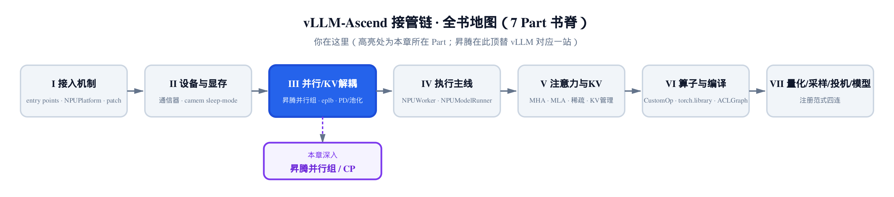
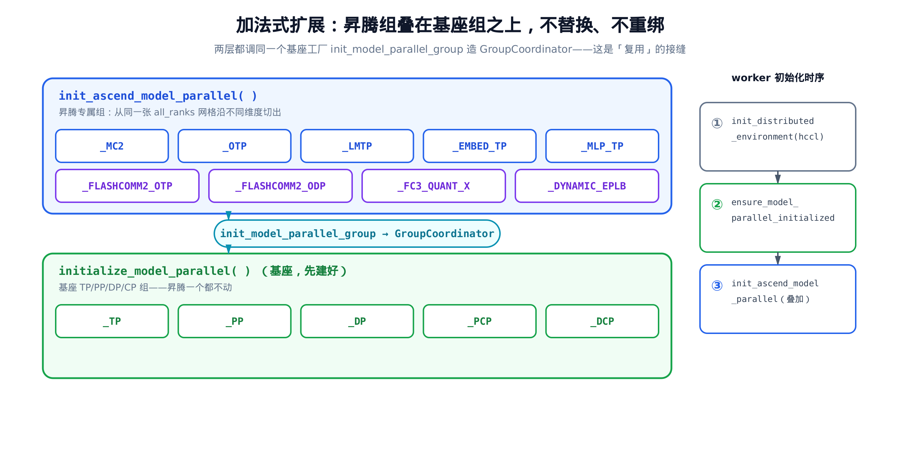
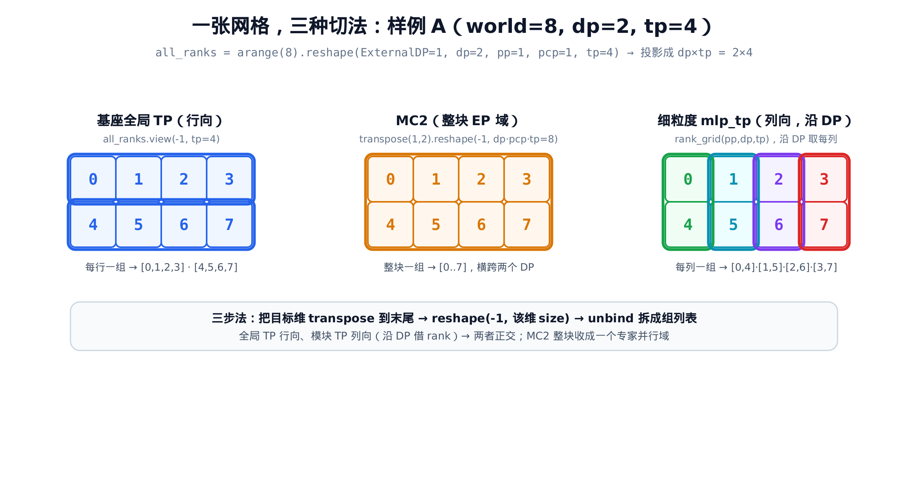
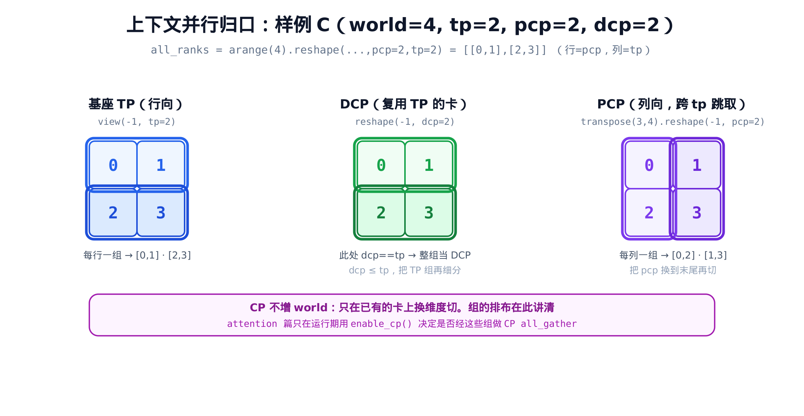

# 第 8 章 在 vLLM 并行组之上：MC2 / 细粒度 TP / flashcomm 与上下文并行



> 上一章：显存底座 camem 把 NPU 的虚拟地址管起来了。
> 本章：在基座已建好的并行组之上，再叠一批昇腾专属组。
> 下一章：[这些组里的 `_DYNAMIC_EPLB` 将驱动专家热迁移](../ch09-eplb-expert-load-balancing/narrative/chapter.md)。

本章主角是 `vllm_ascend/distributed/parallel_state.py` 里的 `init_ascend_model_parallel`——一个只做加法、不碰基座的并行组工厂。

## 这章要做什么

前面几章看的都是同一种招式：昇腾用 monkey-patch 把 vLLM 的某个名字**重绑**到自己的实现上——换通信器、换分配器、换引擎核心。重绑的本质是「替换」：原来指向 A，现在指向 B。

这一章的主角不一样。`init_ascend_model_parallel` **不替换**任何东西。它复用基座 `vllm/distributed/parallel_state.py` 里现成的 `init_model_parallel_group` 和 `GroupCoordinator`，在基座已经建好的 TP / PP / DP / PCP / DCP 之上，**额外**算出一批昇腾专属组的进程排布，注册到自己的模块级全局里。基座的组一个都不动。

这是一次纯粹的「加法式扩展」。

而「额外算出排布」这件事，本质是一道**排布代数题**：把 world 里的所有 rank 编号 reshape 成一张多维网格，沿不同维度 transpose / reshape / slice，切出每个组该包含哪些 rank。MC2、细粒度 TP、flashcomm2 各沿不同维度切，消费方也各不相同。

本章还是**上下文并行（context parallel）的归口**。PCP / DCP 这两个 CP 组虽然由基座创建，但它们的排布用的是同一套 reshape 代数。我们在这里把它讲清；后面的[注意力章](../ch19-ascend-attention-mha/narrative/chapter.md)只在运行期用 `enable_cp()` 决定是否走 CP 分支，不再重复讲排布。

把这道排布代数题吃透，你就能手推任意并行度组合下、任意一个组该有哪些 rank。

## 时序证据：基座先建，昇腾后叠

先看一眼「加法」发生在什么时候。worker 初始化分布式环境时，三步是按顺序来的：

```python
# vllm_ascend/worker/worker.py:L836-L849
def _init_worker_distributed_environment(self) -> None:
    """Initialize the distributed environment."""
    # … 省略：init_batch_invariance() 与本章无关 …
    init_distributed_environment(
        self.parallel_config.world_size, self.rank, self.distributed_init_method, self.local_rank, "hccl"
    )
    ensure_model_parallel_initialized(
        self.parallel_config.tensor_parallel_size,
        self.parallel_config.pipeline_parallel_size,
        self.parallel_config.prefill_context_parallel_size,
        self.parallel_config.decode_context_parallel_size,
    )
    init_ascend_model_parallel(self.parallel_config)
```

顺序是确定的：

1. `init_distributed_environment(..., "hccl")` 建起 world group（用昇腾的 hccl 后端）。
2. `ensure_model_parallel_initialized(...)` 走进基座 `vllm/distributed/parallel_state.py`，按传入的 TP / PP / CP 参数建好基座级并行组——也就是模块级全局 `_TP` / `_PP` / `_DP` / `_PCP` / `_DCP`。这正是「基座先建」这步的实质。
3. `init_ascend_model_parallel(...)` 才登场，在前两步之上叠加昇腾专属组。

第 3 步在第 2 步之后——这就是「基座先建好、昇腾后叠加」的字面证据。后者是加法，不碰前者建的任何组。



> *图注：下层基座 `initialize_model_parallel` 先建好 TP/PP/DP/CP；上层 `init_ascend_model_parallel` 后叠昇腾专属组。两层都调同一个基座工厂 `init_model_parallel_group` 造 `GroupCoordinator`——这条接缝就是「复用而非替换」。*

## 复用而非替换：从 import 行就能看出来

打开 `vllm_ascend/distributed/parallel_state.py`，头几行直接把「复用」写在脸上：

```python
# vllm_ascend/distributed/parallel_state.py:L1-L27
import torch
from vllm.config import ParallelConfig, get_current_vllm_config
from vllm.distributed.parallel_state import GroupCoordinator, get_tp_group, get_world_group, init_model_parallel_group

from vllm_ascend.ascend_config import get_ascend_config
from vllm_ascend.utils import enable_dsa_cp_with_layer_shard, flashcomm2_enable

# Currently, mc2 op need their own group coordinator.
_MC2: GroupCoordinator | None = None

# Module specific tensor parallel groups
_MLP_TP: GroupCoordinator | None = None
_OTP: GroupCoordinator | None = None
_LMTP: GroupCoordinator | None = None
_EMBED_TP: GroupCoordinator | None = None

# flashcomm specific groups
_FLASHCOMM2_OTP: GroupCoordinator | None = None
_FLASHCOMM2_ODP: GroupCoordinator | None = None
_FC3_QUANT_X: GroupCoordinator | None = None

# shard_weight across rank groups
_SHARD_WEIGHT: GroupCoordinator | None = None

_P_TP: GroupCoordinator | None = None

_DYNAMIC_EPLB: GroupCoordinator | None = None
```

第 3 行就是关键：`GroupCoordinator`、`init_model_parallel_group`、`get_tp_group`、`get_world_group` 全都从基座 `vllm.distributed.parallel_state` 直接 import 进来。昇腾不重写一套进程组管理，它借基座的。

下面那一长串 `_MC2 / _MLP_TP / _OTP / _LMTP / _EMBED_TP / ...` 全是模块级全局，初值都是 `None`。每一个**将来都会指向一个 `GroupCoordinator` 实例**——和基座的 `_TP` / `_PCP` 同一个类型。换句话说，昇腾的每个并行组，都只是基座 `GroupCoordinator` 多 new 出来的一个实例。

这就是整章的底色：昇腾负责「算出每个组该有哪些 rank」，建组和通信全交给基座。它做的是加法，不是替换。

> 本章只讲与四大主题相关的组。`_SHARD_WEIGHT`（layer-sharding 辅助组）和 `_P_TP`（PD 分离的 prefill TP 组）属于旁支特性，排布逻辑与主线正交，按下不表。

## 入口：那张 5D 网格

进入主角函数。开头先是幂等守护和取参，然后是全章的「根」——`all_ranks`：

```python
# vllm_ascend/distributed/parallel_state.py:L30-L52
def init_ascend_model_parallel(
    parallel_config: ParallelConfig,
):
    if model_parallel_initialized():
        return
    assert torch.distributed.is_initialized()
    world_size = torch.distributed.get_world_size()
    backend = torch.distributed.get_backend(get_world_group().device_group)
    global_tp_size = parallel_config.tensor_parallel_size
    global_dp_size = parallel_config.data_parallel_size
    global_pp_size = parallel_config.pipeline_parallel_size
    global_pcp_size = parallel_config.prefill_context_parallel_size

    # The layout of all ranks: ExternalDP * EP
    # ExternalDP is the data parallel group that is not part of the model,
    # every dp rank can generate independently (in verl integration).
    all_ranks = torch.arange(world_size).reshape(
        -1,
        global_dp_size,
        global_pp_size,
        global_pcp_size,
        global_tp_size,
    )
```

逐句看：

- `model_parallel_initialized()` 是幂等守护。它的哨兵是 `_MC2`（后面会看到），所以重复调用会直接 `return`，组不会被建第二遍。
- `backend = ... get_backend(get_world_group().device_group)` ——直接从基座 world group 拿后端（就是 hccl）。又一处复用。
- 最后 `all_ranks = torch.arange(world_size).reshape(...)`。它把 `0 .. world_size-1` 这一串 rank 编号，叠成一张 **5 维网格**：

$$
\mathrm{ExternalDP} \times \mathrm{dp} \times \mathrm{pp} \times \mathrm{pcp} \times \mathrm{tp}
$$

这五个维度从外到内分别是：外层数据并行（verl 集成里每个 dp rank 可独立 generate，最外一维用 `-1` 自动算）、数据并行、流水线并行、prefill 上下文并行、张量并行。

两个细节值得记住。第一，**这张网格显式保留了 `pcp` 维**——即便开了上下文并行，昇腾的组也能在正确的坐标系里切分。第二，也是最关键的：这张 5D 网格的维度顺序，与基座 `vllm/distributed/parallel_state.py` 里 `initialize_model_parallel` 用的那张**逐维一致**。坐标系对齐，是「叠加」能成立的数学前提——昇腾组只是在同一张网格上沿不同维度切子集，rank 编号自然自洽。

## 排布代数：一张网格，三步切出任意组

在切第一个组之前，先把通用招式立起来。基座源码里有一句注释，正是这套招式的口诀：

```python
# vllm/distributed/parallel_state.py:L1567-L1568
# to get group_ranks for each dimension, transpose that dimension to the
# last dimension, then reshape to 2D, then unbind the last dimension
```

**三步法**：要取「沿某个并行维度分组」的结果，就

1. 把目标维 `transpose` 到最后一维；
2. `reshape(-1, X)`，让最后一维相邻的 rank 落进同一行；
3. `unbind(0)`，把每一行拆成一个组。

这里的 `X` 就是「目标分组维的大小」，它**取决于第 1 步把哪一维转到了末尾**：如果没 transpose、直接 `view(-1, tp)`，`X` 就是 `tp`；如果先 `transpose` 再 `reshape(-1, dp·pcp·tp)`，`X` 就是那个乘积。后面每个例子都会写出它当下取的值。

直觉很简单：reshape 之后，**最后一维相邻的 rank 同组**，前面所有维加起来就是「一共有多少个这样的组」。

拿一个具体并行度——记作**样例 A**——把它跑出来。取 `world=8, ExternalDP=1, dp=2, pp=1, pcp=1, tp=4`，于是

```
all_ranks = arange(8).reshape(1, 2, 1, 1, 4)
          = [[[[[0, 1, 2, 3]]], [[[4, 5, 6, 7]]]]]
```

把它压成 `dp × tp = 2 × 4` 的样子看（pp 和 pcp 都是 1，不占视觉维度）：

```
       tp=0  tp=1  tp=2  tp=3
dp=0 [  0     1     2     3  ]
dp=1 [  4     5     6     7  ]
```

同一张网格，沿不同维度切，得到完全不同的组：



> *图注：全局 TP 沿行切（每行一组）；MC2 把整块收成一个 EP 域；细粒度 mlp_tp 沿 DP 列切——和全局 TP 正交。同一批 rank，切法不同，组就不同。*

后面三节就是这三种切法的源码与数值。掌握三步法，你不用记任何一个组的形状——现场推就行。

## MC2：把 dp·pcp·tp 收成一个专家域

第一个昇腾组是 MC2（matmul + communication 融合，服务 MoE 专家通信）。它的排布是 EP-like（expert-parallel 形态）：

```python
# vllm_ascend/distributed/parallel_state.py:L84-L108
    # … 省略：PD 分离的 _P_TP / alltoall 头复制分支（属 PD 分离专题）…

    # EP like group ranks
    group_ranks = (
        all_ranks.transpose(1, 2)
        .reshape(
            -1,
            global_dp_size * global_pcp_size * global_tp_size,
        )
        .unbind(0)
    )
    group_ranks = [x.tolist() for x in group_ranks]

    global _MC2
    _MC2 = init_model_parallel_group(group_ranks, get_world_group().local_rank, backend, group_name="mc2")

    if get_ascend_config().eplb_config.dynamic_eplb:
        global _DYNAMIC_EPLB
        _DYNAMIC_EPLB = init_model_parallel_group(
            group_ranks, get_world_group().local_rank, backend, group_name="dynamic_eplb"
        )

    if get_ascend_config().multistream_overlap_gate:
        global _FC3_QUANT_X
        _FC3_QUANT_X = init_model_parallel_group(
            group_ranks, get_world_group().local_rank, backend, group_name="fc3_quant_x"
        )
```

套三步法。这里其实是三步法的**推广**：`transpose(1,2)` 之后，`dp` / `pcp` / `tp` 恰好是相邻的末三维，`reshape(-1, dp·pcp·tp)` 把它们一次性收进最后一维——等价于把这三维当成一个合并的目标维。目标是把一个 `(ExternalDP, pp)` 切片下的所有 `dp × pcp × tp` rank 收成一组：

- `all_ranks.transpose(1, 2)`：把维度 1（dp）和维度 2（pp）对调，网格变成 `(ExternalDP, pp, dp, pcp, tp)`。pp 被提到前面去了。
- `.reshape(-1, dp·pcp·tp)`：最后一维收成 `dp·pcp·tp` 个相邻 rank（这就是三步法里那个「该维 size」，在 MC2 场景下取的是三维乘积），前面 `ExternalDP·pp` 决定有几个组。
- `.unbind(0)`：拆成组列表。

用样例 A（`dp=2, pcp=1, tp=4`）跑一遍。`transpose(1,2)` 后形状是 `(1,1,2,1,4)`，元素顺序没变（pp=1 这维是平凡的），`reshape(-1, 2·1·4=8)` 把全部 8 个 rank 收进一行：

```
MC2 group_ranks = [[0, 1, 2, 3, 4, 5, 6, 7]]
```

一个 size-8 的组，**横跨了两个 DP**。这正是 MoE 想要的：专家分布在 `dp × tp` 域上，专家通信必须能在这整个域里 all-to-all，所以 MC2 组要把 dp 和 tp 一起收进来。对比一下规模：全局 TP 组的大小是 `tp = 4`，而 MC2 组的大小是 `dp·pcp·tp = 8`——它确实比单个 TP 组大一圈，跨过了 DP 边界。

样例 A 的 `pp=1` 让 `transpose(1,2)` 退化成恒等，看不出它在忙什么。但 `pp>1` 时它不可或缺：若不做 transpose 而直接 `reshape(-1, dp·pcp·tp)`，相邻的 `dp·pcp·tp` 块会跨过 pp 维边界，把**不同 pp stage** 的 rank 混进同一个专家域——而专家通信只该发生在单一 stage 内。`transpose(1,2)` 把 pp 提到最前，正是为了保证切出来的每个组只落在一个 pp stage 里。

注意紧跟其后的两个 `if`。`_DYNAMIC_EPLB` 和 `_FC3_QUANT_X` **复用同一份 `group_ranks`**——因为动态专家负载均衡、flashcomm3 量化 all-gather，都在同一个专家域里通信，拓扑和 MC2 一模一样。复用排布、只是各 new 一个独立的 `GroupCoordinator`，省掉重算。其中 `_DYNAMIC_EPLB` 就是[第 9 章专家热迁移](../ch09-eplb-expert-load-balancing/narrative/chapter.md)要用的组——这里先把它建好，机制留到那章展开。

还有一点要点破：`_MC2` 同时是 `model_parallel_initialized()` 的哨兵。这个函数的实现就一行——`return _MC2 is not None`（[后面 §取用、哨兵与销毁](#取用哨兵与销毁)会看到完整定义），所以 `_MC2` 是「已初始化」状态的**唯一**哨兵。这意味着 MC2 必须**无条件、最先**建——它一建好，整个 `init_ascend_model_parallel` 就被视为「已初始化」；若不最先建，重复调用时哨兵会失真。

## 细粒度 TP：沿 DP 借 rank，与全局 TP 正交

接下来是本章排布代数最精彩的样本：细粒度 TP。lm-head、o-proj、embedding、mlp 这四个组件，各自可以有**和全局 TP 不同的 TP 宽度**。

```python
# vllm_ascend/distributed/parallel_state.py:L110-L149
    # Initialize fine-grained TP process groups on Ascend for four components:
    # 1. LM Head: output logits projection (`lmhead_tensor_parallel_size`)
    # 2. O Proj: attention output projection (`oproj_tensor_parallel_size`)
    # 3. Embedding: The token embedding table at the input of the model (`embedding_tensor_parallel_size`)
    # 4. MLP: feed-forward network in transformer blocks (`mlp_tensor_parallel_size`)
    _group_cache = {}

    def _create_or_get_group(group_size: int, group_name: str) -> GroupCoordinator:
        if group_size is None:
            return None
        if group_size not in _group_cache:
            rank_grid = torch.arange(world_size).reshape(global_pp_size, global_dp_size, global_tp_size)
            num_chunks = global_dp_size // group_size
            group_ranks = []
            for pp_idx in range(global_pp_size):
                stage_ranks = rank_grid[pp_idx]  # (dp, tp)
                for chunk in range(num_chunks):
                    for tp_idx in range(global_tp_size):
                        group = stage_ranks[chunk * group_size : (chunk + 1) * group_size, tp_idx].tolist()
                        group_ranks.append(group)
            pg = init_model_parallel_group(group_ranks, get_world_group().local_rank, backend, group_name=group_name)
            _group_cache[group_size] = pg

        return _group_cache[group_size]

    otp_size = get_ascend_config().finegrained_tp_config.oproj_tensor_parallel_size
    lmhead_tp_size = get_ascend_config().finegrained_tp_config.lmhead_tensor_parallel_size
    embedding_tp_size = get_ascend_config().finegrained_tp_config.embedding_tensor_parallel_size
    mlp_tp_size = get_ascend_config().finegrained_tp_config.mlp_tensor_parallel_size

    global _OTP, _LMTP, _EMBED_TP, _MLP_TP

    if otp_size > 0:
        _OTP = _create_or_get_group(otp_size, "otp")
    if lmhead_tp_size > 0:
        _LMTP = _create_or_get_group(lmhead_tp_size, "lmheadtp")
    if embedding_tp_size > 0:
        _EMBED_TP = _create_or_get_group(embedding_tp_size, "emtp")
    if mlp_tp_size > 0:
        _MLP_TP = _create_or_get_group(mlp_tp_size, "mlptp")
```

这里有个最容易看漏的关键：`rank_grid` 用的是一张**独立的、三维**网格 `reshape(pp, dp, tp)`——**没有 pcp、没有 ExternalDP**，和前面那张 5D 的 `all_ranks` 不是一张。

为什么不复用那张 5D 网格？因为细粒度 TP 的切分逻辑和 MC2 截然不同：MC2 是「把整个 dp·pcp·tp 块收成一个专家域」，细粒度 TP 是「沿 DP 连续块、按 tp 列组织」。换一张只留 `(pp, dp, tp)` 的三维网格，恰好能直接表达「**固定 pp stage + 固定 tp 列，沿 DP 块切**」这个二维操作，不必在 5D 里绕开 pcp / ExternalDP 两根用不上的轴。

还有一处单位要分清：`group_size` 的单位**不是** tp rank 数。回想全局 TP——它的组大小就是 `tp` 数量；而细粒度 TP 的 `group_size` 是 **DP rank 数**，表示一个细粒度 TP 组跨越几个 DP 行。紧接着的 `num_chunks = global_dp_size // group_size` 也是沿 DP 维算的，不是沿 tp。

切法是这样的：固定一个 pp stage、固定一个 tp 列，然后**沿 DP 维按 `group_size` 连续切块**。`num_chunks = dp // group_size` 决定每个 tp 列被切成几个组。

用样例 A 把 `mlp_tp_size=2` 跑出来。`rank_grid = arange(8).reshape(pp=1, dp=2, tp=4)`：

```
stage_ranks (pp_idx=0):
       tp=0  tp=1  tp=2  tp=3
dp=0 [  0     1     2     3  ]
dp=1 [  4     5     6     7  ]
```

`num_chunks = 2 // 2 = 1`。内层对每个 `tp_idx` 取 `stage_ranks[0:2, tp_idx]`，也就是**整列**：

```
mlp_tp group_ranks = [[0, 4], [1, 5], [2, 6], [3, 7]]
```

看出来了吗——**这是沿 DP 列向切的**。回头对比全局 TP 组 `[[0,1,2,3],[4,5,6,7]]`（行向），两者正交：全局 TP 在同一个 dp 行内横切，细粒度 TP 跨着 dp 行纵切。昇腾不动全局 TP，而是「**跨 DP 借 rank**」，在固定 tp 列上现凑出一个模块专属的 TP 组。

这也解释了两条约束（来自 `vllm_ascend/ascend_config.py` 的校验）：`group_size` 必须整除 `data_parallel_size`（否则 `num_chunks` 切不整齐）；而且**只有 MoE 模型可用**。后一条的真实原因，源码注释（`ascend_config.py:L476-L480`）写得很直白：dense 模型既不需要专家并行、也不需要数据并行，启动时哪怕把 `data_parallel_size` 配成大于 1，后面也会被改回 1。而细粒度 TP 整个切法是**沿 DP 维借 rank** 的——一旦 DP 被压成 1，就没有 DP 行可跨，lm-head 这类组根本切不进数据并行通信域，于是直接报错。说「dense 没有 DP 可借」，就是这个意思。

### 两轮切块：num_chunks > 1 长什么样

样例 A 的 `num_chunks=1`，看不出「分块」的效果。换样例 B：`world=8, dp=4, tp=2, group_size=2`，于是 `num_chunks = 4 // 2 = 2`，每个 tp 列会被切成两个组。把 `_create_or_get_group` 的循环逐拍摊开（`pp_idx` 恒为 0）：

`rank_grid = arange(8).reshape(1, 4, 2)`，`stage_ranks` 是：

```
       tp=0  tp=1
dp=0 [  0     1  ]
dp=1 [  2     3  ]
dp=2 [  4     5  ]
dp=3 [  6     7  ]
```

| 轮次 | chunk | DP 切片 `[chunk*2:(chunk+1)*2]` | tp_idx | 取列 → group | 累计组数 |
|---|---|---|---|---|---|
| ① | 0 | 行 0:2 → `[[0,1],[2,3]]` | 0 | `[0, 2]` | 1 |
| ② | 0 | 行 0:2 → `[[0,1],[2,3]]` | 1 | `[1, 3]` | 2 |
| ③ | 1 | 行 2:4 → `[[4,5],[6,7]]` | 0 | `[4, 6]` | 3 |
| ④ | 1 | 行 2:4 → `[[4,5],[6,7]]` | 1 | `[5, 7]` | 4 |

最终 `group_ranks = [[0,2], [1,3], [4,6], [5,7]]`。chunk 0 把前两个 dp 行凑成一组、chunk 1 把后两个 dp 行凑成一组——这就是「沿 DP 连续块切」在 `num_chunks>1` 时的样子。

**为什么每个 rank 恰好进一个组？** 这是个划分（partition）不变量。`num_chunks · group_size = dp` 保证 DP 维被 `num_chunks` 个连续块**无缝且不重叠**地铺满；外层固定 `tp_idx` 又保证每列独立。于是 `dp × tp` 个 rank，每个都恰好被某个 `(chunk, tp_idx)` 抓走一次——不漏、不重。

反过来看个反例就懂这条约束为什么不能松：若 `dp=3, group_size=2`，则 `num_chunks = 3 // 2 = 1`（整数除法向下取整），循环只切出 1 个块、覆盖 `dp` 行 0-1，第 2 行（dp=2）整排被漏掉——既不无缝也谈不上铺满。所以 `group_size` 必须**整除** `dp`，`num_chunks` 才是真整数、连续块才能严丝合缝地把 DP 维铺满。

最后留意 `_group_cache`：它按 `group_size` 去重。如果 lm-head 和 embedding 设了相同宽度，二者**共享同一个组**，不重复建。

## flashcomm2：同是再切 TP，切法却相反

flashcomm2 也在 o_proj 处「再切一刀」TP，但目的是通信-计算重叠：把张量并行的一部分转成数据并行维度。切法和细粒度 TP 形成鲜明对照——它是 **strided（跨步）** 而非连续。

先给个高层直觉，再进源码：为什么要跨步、而不像细粒度 TP 那样抓连续块？因为 flashcomm2 想把一个原始 TP 维里的 rank **打散**到多个 otp 组里。这样在计算某一块 submatrix 时，可以**并行地** all-gather 其它块的权重——通信和计算就能叠在一起跑。连续块做不到这种交错，跨步排布才够灵活：

```python
# vllm_ascend/distributed/parallel_state.py:L151-L189
    # TODO: Extract and unify the logic across different communication group.
    flashcomm2_otp_group_ranks = []
    if flashcomm2_enable():
        flashcomm2_otp_size = get_ascend_config().flashcomm2_oproj_tensor_parallel_size
        num_fc2_oproj_tensor_parallel_groups: int = global_tp_size // flashcomm2_otp_size
        global _FLASHCOMM2_OTP
        global _FLASHCOMM2_ODP

        _FLASHCOMM2_OTP = None
        _FLASHCOMM2_ODP = get_tp_group()

        if flashcomm2_otp_size > 1:
            odp_group_ranks: list[list[int]] = [
                [] for _ in range(flashcomm2_otp_size * global_dp_size * global_pp_size)
            ]
            for dp_group_index in range(global_dp_size):
                for pp_group_index in range(global_pp_size):
                    dp_pp_serial_index = dp_group_index * global_pp_size + pp_group_index
                    tp_base_rank = dp_pp_serial_index * global_tp_size
                    odp_base_index = dp_pp_serial_index * flashcomm2_otp_size

                    for i in range(num_fc2_oproj_tensor_parallel_groups):
                        ranks = []
                        for j in range(flashcomm2_otp_size):
                            tp_local_rank = i + j * num_fc2_oproj_tensor_parallel_groups
                            assert tp_local_rank < global_tp_size
                            global_rank = tp_base_rank + tp_local_rank
                            ranks.append(global_rank)

                            odp_group_index = odp_base_index + j
                            odp_group_ranks[odp_group_index].append(global_rank)
                        flashcomm2_otp_group_ranks.append(ranks)

            _FLASHCOMM2_OTP = init_model_parallel_group(
                flashcomm2_otp_group_ranks, get_world_group().local_rank, backend, group_name="flashcomm2_otp"
            )
            _FLASHCOMM2_ODP = init_model_parallel_group(
                odp_group_ranks, get_world_group().local_rank, backend, group_name="flashcomm2_odp"
            )
```

关键在 `tp_local_rank = i + j * num_fc2_oproj_tensor_parallel_groups`。`i` 在组内走，`j` 跨组走，步长是 `num_groups`——所以 otp 组里的 rank 是**跨步抓取**的。

取 `global_tp=8, otp_size=2`，于是 `num_groups = 8 // 2 = 4`。在单个 `(dp, pp)` 切片内（`tp_base_rank=0`）：

| i | j=0: `i+0·4` | j=1: `i+1·4` | otp 组 |
|---|---|---|---|
| 0 | 0 | 4 | `[0, 4]` |
| 1 | 1 | 5 | `[1, 5]` |
| 2 | 2 | 6 | `[2, 6]` |
| 3 | 3 | 7 | `[3, 7]` |

得到 `_FLASHCOMM2_OTP = [[0,4],[1,5],[2,6],[3,7]]`；同时同一个 `j` 的 rank 被收进 odp 组，得 `_FLASHCOMM2_ODP = [[0,1,2,3],[4,5,6,7]]`。

把它和细粒度 TP 摆一起：同是「在 TP 之上再切一刀」，细粒度 TP 抓**连续块**，flashcomm2 抓**跨步**。切法由各特性的通信模式决定，没有谁更对——这正是「加法式扩展」的好处：每种模式按自己的需要切自己的组，互不打扰。

还有一处「能省则省」：当 `flashcomm2_otp_size == 1`，上面那段 `if` 整个不进，`_FLASHCOMM2_OTP` 留 `None`、`_FLASHCOMM2_ODP` 直接 `= get_tp_group()`——**退化为复用基座 TP 组**，连新组都不建。又一处复用证据。

## 上下文并行的归口：CP 组怎么切

现在把视线转回基座，把上下文并行（CP）的排布一次讲清。PCP / DCP 不是昇腾建的，是基座 `vllm/distributed/parallel_state.py` 在第 2 步就建好的。但它们的排布同样是那套 reshape 代数，放在这里讲最合适：

```python
# vllm/distributed/parallel_state.py:L1569-L1633
    all_ranks = torch.arange(world_size).reshape(
        -1,
        data_parallel_size,
        pipeline_model_parallel_size,
        prefill_context_model_parallel_size,
        tensor_model_parallel_size,
    )  # noqa

    # Build the tensor model-parallel groups.
    global _TP
    group_ranks = all_ranks.view(-1, tensor_model_parallel_size).unbind(0)
    group_ranks = [x.tolist() for x in group_ranks]
    # … 省略：_TP 经 init_model_parallel_group 建组 …

    # Build the DCP model-parallel groups.
    global _DCP
    # Note(hc): ... dcp_size must not exceed tp_size, because the world size does not
    # change by DCP, it simply reuses the GPUs of TP group, and split one
    # TP group into tp_size//dcp_size DCP groups.
    group_ranks = all_ranks.reshape(-1, decode_context_model_parallel_size).unbind(0)
    group_ranks = [x.tolist() for x in group_ranks]
    _DCP = init_model_parallel_group(
        group_ranks, get_world_group().local_rank, backend, group_name="dcp"
    )

    global _PCP
    group_ranks = (
        all_ranks.transpose(3, 4)
        .reshape(-1, prefill_context_model_parallel_size)
        .unbind(0)
    )
    group_ranks = [x.tolist() for x in group_ranks]
    _PCP = init_model_parallel_group(
        group_ranks, get_world_group().local_rank, backend, group_name="pcp"
    )
```

先看那张 `all_ranks`——和昇腾那张**逐维一致**，这是两边能在同一坐标系叠加的前提，前面强调过。

CP 的核心约束是：**它不增加 world_size**。为什么不能增？因为 CP 的语义是把**序列（上下文）**切给已有的那批卡——它是「在同一批 GPU 上换个维度切」，而不是「多铺一批 GPU」。源码注释也点明了这一点：DCP「不改变 world size，只是复用 TP 组的那些 GPU」。一旦真去加卡，就引入了新的 rank、变成另一根独立的并行维度，而非 CP 想要的「同一批卡上的切法变化」。所以：

- **DCP**：`all_ranks.reshape(-1, dcp)`。注释说得明白——dcp 复用 TP 组的 GPU，把一个 TP 组再切成 `tp_size // dcp_size` 个 DCP 子组，因此 `dcp_size ≤ tp_size`。
- **PCP**：`all_ranks.transpose(3, 4).reshape(-1, pcp)`。把 pcp 维（维度 3）和 tp 维（维度 4）对调，pcp 换到末尾再切——所以 PCP 组沿 tp 维以步长 tp 跳取。

用样例 C 落地：`world=4, dp=1, pp=1, pcp=2, tp=2, dcp=2`。`all_ranks = arange(4).reshape(1,1,1,2,2) = [[0,1],[2,3]]`（行是 pcp，列是 tp）：

| 组 | 算式 | group_ranks | 怎么读 |
|---|---|---|---|
| 基座 TP | `view(-1, tp=2)` | `[[0,1], [2,3]]` | 每行一组 |
| DCP | `reshape(-1, dcp=2)` | `[[0,1], [2,3]]` | 此处 dcp==tp，整个 TP 组当一个 DCP 组 |
| PCP | `transpose(3,4).reshape(-1, pcp=2)` | `[[0,2], [1,3]]` | 跨 tp 跳取 |



> *图注：样例 C 下，DCP 沿行（复用 TP 的 GPU 再细分），PCP 沿列（跨 tp 跳取）。CP 不增 world，组的排布到此讲清；注意力章只在运行期用 `enable_cp()` 决定是否走这些组。*

这就是 CP 排布的全部。到了[注意力章](../ch19-ascend-attention-mha/narrative/chapter.md)，源码里只会出现 `enable_cp()` 这样的运行期判断——是否经 `get_pcp_group()` / `get_dcp_group()` 做 CP 的 all_gather。组的形状不必再推一遍，因为就在上面这张表里。

## 取用、哨兵与销毁

组建好了，怎么用？模式很统一——每个组配一个带断言的 getter：

```python
# vllm_ascend/distributed/parallel_state.py:L229-L264
def model_parallel_initialized():
    return _MC2 is not None


def get_mc2_group() -> GroupCoordinator:
    assert _MC2 is not None, "mc2 group is not initialized"
    return _MC2


def get_mlp_tp_group() -> GroupCoordinator:
    assert _MLP_TP is not None, "mlp group is not initialized"
    return _MLP_TP


# … 省略：get_otp_group / get_lmhead_tp_group / get_embed_tp_group 同构 …


def get_flashcomm2_otp_group() -> GroupCoordinator:
    return _FLASHCOMM2_OTP


def get_flashcomm2_odp_group() -> GroupCoordinator:
    assert _FLASHCOMM2_ODP is not None, "output data parallel group for flashcomm2 is not initialized"
    return _FLASHCOMM2_ODP
```

三点收尾：

- `model_parallel_initialized()` 以 `_MC2` 为**唯一哨兵**——这反过来印证了前面的话：MC2 必须无条件、最先建，否则哨兵就失真了。
- 多数 getter 带 `assert ... is not None`，没建就用会当场报错。
- `get_flashcomm2_otp_group()` 故意**不带断言**——因为 `otp_size==1` 时它合法地就是 `None`，断言反而错。

运行期谁来取这些组？三个消费点，各取各的：

| 组 | 消费文件 | 用途 |
|---|---|---|
| MC2 | `ops/fused_moe/token_dispatcher.py` | `get_mc2_group().device_group` 做专家 dispatch |
| mlp_tp / otp | `ops/linear_op.py` | `get_mlp_tp_group()` / `get_otp_group()` 切线性层 |
| lmhead_tp / embed_tp | `ops/vocab_parallel_embedding.py` | `get_lmhead_tp_group()` / `get_embed_tp_group()` 切词表 |

取出来的都是基座 `GroupCoordinator`——消费方只用它的 `.world_size` / `.rank_in_group` / `.device_group`，加上 all_gather / all_to_all 等原语。

销毁则对称：`destroy_ascend_model_parallel()` 逐个 `.destroy()` 再置 `None`，保证进程级全局可被干净回收。

## 复用的接缝：两个基座符号

最后把「加法式复用」的接缝看一眼。本章每建一个组，都调同一个基座工厂：

```python
# vllm/distributed/parallel_state.py:L1159-L1174
def init_model_parallel_group(
    group_ranks: list[list[int]],
    local_rank: int,
    backend: str,
    use_message_queue_broadcaster: bool = False,
    group_name: str | None = None,
    use_device_communicator: bool = True,
) -> GroupCoordinator:
    return GroupCoordinator(
        group_ranks=group_ranks,
        local_rank=local_rank,
        torch_distributed_backend=backend,
        use_device_communicator=use_device_communicator,
        use_message_queue_broadcaster=use_message_queue_broadcaster,
        group_name=group_name,
    )
```

它吃 `group_ranks`（`list[list[int]]`，每个内层 list 是一个组的全局 rank），吐一个 `GroupCoordinator`。昇腾自己只负责**算出 `group_ranks`**——建组、装通信后端，全在这个函数里完成。而 `GroupCoordinator` 这个类：

```python
# vllm/distributed/parallel_state.py:L290-L317
class GroupCoordinator:
    """
    PyTorch ProcessGroup wrapper for a group of processes.
    ...
    """
    rank: int  # global rank
    ranks: list[int]  # global ranks in the group
    world_size: int  # size of the group
    local_rank: int  # local rank used to assign devices
    rank_in_group: int  # rank inside the group
    cpu_group: ProcessGroup  # group for CPU communication
    device_group: ProcessGroup  # group for device communication
```

昇腾**不改它一行**，只是多 new 了 `_MC2 / _OTP / _LMTP / ...` 这几个实例。基座 `_TP` 是它，昇腾 `_MC2` 也是它——同一个类，不同的 rank 子集。

整章的设计哲学到这里就完整了：昇腾把「新拓扑」表达成「同一张网格上的不同切法」，把建组和通信这件重活原封不动地交还给基座。**加法，不是替换**——这也是 OOT 插件能在不分叉基座的前提下，长出一套自己专属并行模式的根本原因。

## 验证：让排布代数跑出数值

本章讲的全是整数 reshape / transpose / slice——纯 Python 算术，不依赖任何 NPU。随章的精简版正是抓住这一点：把真实的 hccl 进程组创建换成一个只记录 `group_ranks` 的桩，而 `init_ascend_model_parallel` 里那三段排布代数**逐字保留**。于是我们能在普通机器上，直接验证前面手推的每一个组。

跑出来的结果，和正文的数值追踪逐一吻合：

| 场景 | 组 | 切出的 group_ranks |
|---|---|---|
| 样例 A（dp=2,tp=4） | MC2 | `[[0,1,2,3,4,5,6,7]]` |
| 样例 A（mlp_tp=2） | 细粒度 mlp_tp | `[[0,4],[1,5],[2,6],[3,7]]` |
| 样例 B（dp=4,tp=2,gs=2） | 细粒度 mlp_tp | `[[0,2],[1,3],[4,6],[5,7]]` |
| 样例 C（pcp=2,tp=2,dcp=2） | 基座 PCP | `[[0,2],[1,3]]` |
| flashcomm2（tp=8,otp=2） | otp / odp | `[[0,4],[1,5],[2,6],[3,7]]` / `[[0,1,2,3],[4,5,6,7]]` |

另外三条断言也成立，正好复核本章三个论点：`_DYNAMIC_EPLB` 的 `group_ranks` 与 `_MC2` 相等、但不是同一个对象（复用排布、独立 coordinator）；`model_parallel_initialized()` 在建 MC2 前为 `False`、之后为 `True`（哨兵）；每个组都是基座 `GroupCoordinator` 的实例（复用而非替换）。

排布代数不再是黑盒——它是一道你能在白板上推、又能在终端里验的算术题。下一章，我们就让 `_DYNAMIC_EPLB` 这个组动起来，看专家权重如何在它之上做热迁移。
