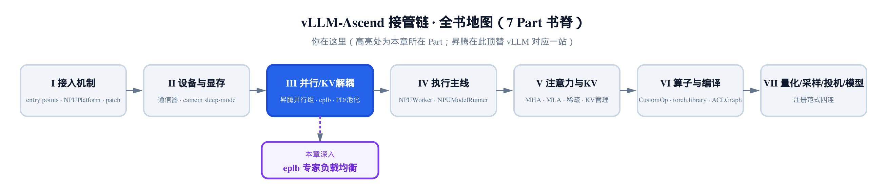
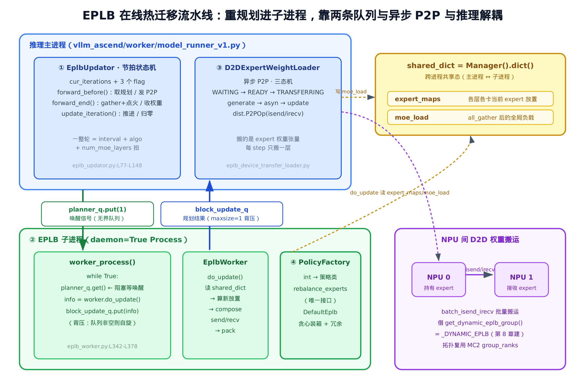
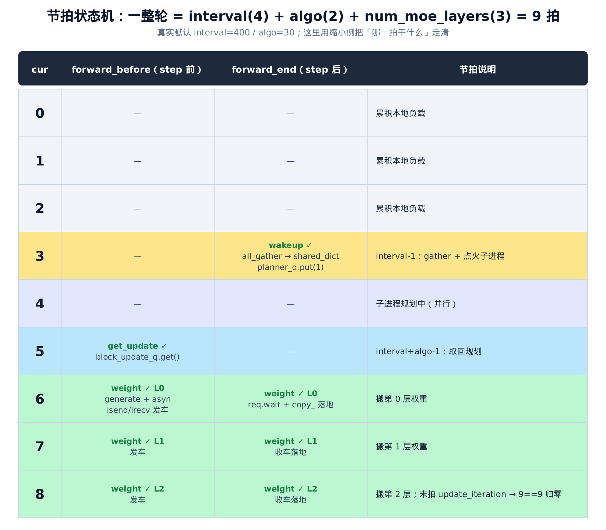
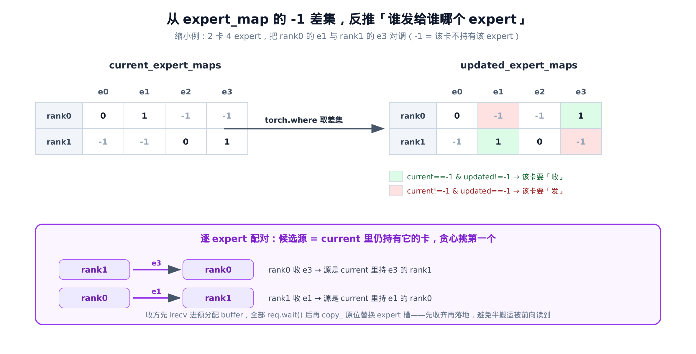
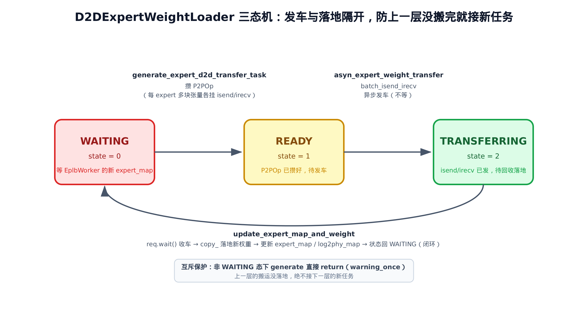

# 第 9 章 Expert 负载均衡（eplb）：子进程规划 + D2D 权重热迁移



> 上一章：昇腾在并行组里建好了 `_DYNAMIC_EPLB` 这个专家通信域。
> 本章：让这个组动起来，把热门专家的权重在 NPU 之间在线热迁移。
> 下一章：[把 KV 在 prefill / decode 节点间直传的 PD 分离](../ch10-pd-disaggregation-mooncake/narrative/chapter.md)。

MoE 模型有个天生的麻烦：路由是数据决定的，没人保证它均匀。

某些 expert 是热门款——大量 token 往它身上挤；另一些门可罗雀。专家是按卡切分的，于是热门 expert 所在的那几张 NPU（昇腾神经处理器，可类比 NVIDIA GPU；下文「卡」即指 NPU 设备）被打爆，算得满头大汗，而隔壁持有冷门 expert 的卡却在空转。整批请求的延迟，被最慢那张卡拖着走。

这一章的主角，是昇腾给出的在线解法：**eplb（expert load balancing）**。它不重启、不换模型，而是在推理跑着的同时，悄悄把热门 expert 的权重从拥挤的卡搬到空闲的卡上，让负载重新铺平。搬运用的是 NPU 间的 device-to-device（D2D，设备到设备）直拷，所以我们叫它「权重热迁移」。代码集中在 `vllm_ascend/eplb/` 目录——`eplb_updator.py`、`eplb_worker.py`、`eplb_device_transfer_loader.py` 各管一块。

## 一个临时的重型特性

开始读源码前，先交代一件容易让人困惑的事：**这套机制在 vLLM 基座里并不存在**。

打开本章任何一个文件的开头，都能看到同一句 TODO：

```python
# vllm_ascend/eplb/eplb_updator.py:L17
# Todo: Once https://github.com/vllm-project/vllm/issues/22246 is merged in vllm. Remove this updator.
```

`eplb_device_transfer_loader.py`、`eplb_worker.py` 顶部也是同款注释，指向 PR/issue 22246 与 24069。意思很直白：这是昇腾**临时自带**的实现，等社区版 vLLM 把对应特性合进去，这一整套就会被删掉。

所以本章和前几章不一样——**没有基座对位文件，不做逐行对照**。但它并非另起炉灶：整套 eplb 只**借用**了 vLLM 的两件通信原语，其余全是昇腾自己的代码。

- `GroupCoordinator.all_gather`：把各卡的本地负载汇成一张全局负载表。
- `torch.distributed.P2POp` / `batch_isend_irecv`：在卡间点对点搬权重张量。

而这两件原语跑在哪个通信域上？正是[上一章建好的 `_DYNAMIC_EPLB` 组](../ch08-ascend-parallel-groups/narrative/chapter.md)——通过 `get_dynamic_eplb_group()` 取出。上一章我们把它建好就停住了，说「机制留到第 9 章」。现在兑现：

```python
# vllm_ascend/distributed/parallel_state.py:L282-L284
def get_dynamic_eplb_group() -> GroupCoordinator:
    assert _DYNAMIC_EPLB is not None, "Dynamic eplb group is not initialized"
    return _DYNAMIC_EPLB
```

`_DYNAMIC_EPLB` 的进程排布复用了[第 8 章建的 MC2（多卡专家通信域）](../ch08-ascend-parallel-groups/narrative/chapter.md)的 `group_ranks`——因为专家迁移就发生在同一个专家域里，拓扑和 MC2 一模一样。换句话说，热迁移走的是一条**早就建好的通信高速路**，eplb 只是它的使用方。

## 全景：四块拼成一条流水线

整套机制能拆成四块，串起来就是一条「在线热迁移专家权重」的流水线。先看全景，再逐块拆。



> *图注：推理主进程持有 ① 节拍状态机与 ③ P2P 搬运器；② EPLB 子进程独立跑 ④ 规划策略。两条跨进程队列（planner_q 向下点火、block_update_q 向上回传）+ 一个 shared_dict，把主进程的①③与子进程的②两边连起来。权重搬运走 NPU 间的 D2D，借的是第 8 章建的 `_DYNAMIC_EPLB` 组。*

四块各司其职：

1. **`EplbUpdator` 节拍状态机**（主线①，推理主进程，`vllm_ascend/eplb/eplb_updator.py`）：用一个整数计数器 `cur_iterations` 配三个间隔常量，拼出整条流水线的节拍——哪一拍收集负载、哪一拍唤醒规划、哪一拍取回结果、哪一拍搬第几层权重。
2. **`EplbProcess` 独立子进程**（主线②，`vllm_ascend/eplb/core/eplb_worker.py`）：跑重 CPU 规划，靠两条跨进程队列与推理主循环解耦。
3. **`D2DExpertWeightLoader` 异步 P2P 搬运器**（主线③，`vllm_ascend/eplb/core/eplb_device_transfer_loader.py`）：用三态机把「攒 / 发 / 收」三段隔开、保证落地有序，把一整轮迁移逐层摊到多个 step（每 step 一层）。
4. **`PolicyFactory` 策略多态**（主线④，`vllm_ascend/eplb/core/policy/policy_factory.py`）：规划算法可插拔，`DefaultEplb` 是默认实现，flashlb / swift 是备选。

在拆这四块之前，先回答一个统领全章的问题。

## 为什么非得子进程 + 队列 + 异步搬运

直觉上，负载均衡似乎可以很简单：每隔一阵子算一下哪些 expert 太热，搬一下就好。为什么要搞出子进程、跨进程队列、异步 P2P 这么一套重家伙？

答案是**两类活儿的性质完全不同，绝不能让它们互相拖累**。

**规划是重 CPU 计算。** 算「新放置」要做贪心装箱、跨层遍历、`numpy` 的 `unique` / `where` 差集运算（都在 `vllm_ascend/eplb/core/eplb_worker.py` 里），计算量随专家数、层数、卡数一起涨。如果把它跑在推理主线程里，前向就得停下来等它算完——吞吐直接塌方。所以规划被赶进**独立子进程**，和推理并行跑；主进程只在节拍点往队列里塞个信号、取个结果，几乎零阻塞。

**搬运是大流量 D2D。** expert 权重张量不小，同步等它搬完同样会卡住前向。先说清一个贯穿全章的词：这里的 step 指推理循环的一次迭代——处理一个 batch 的一次 forward pass，每个 step 前后分别调 `forward_before` 和 `forward_end`。于是搬运被拆成**异步 P2P**：同一个 step 里 `forward_before` 先 `isend` / `irecv` 发车，前向算它的，step 末 `forward_end` 再 `wait` 收车落地——发与收落在同一个 step、正好被这一拍的前向计算掩盖。而且每个 step 只搬一层，把一整轮迁移摊到 `num_moe_layers` 个 step 上，单步开销可控。

把这条主线记牢：**重计算异步化、大搬运摊薄化，推理主循环只做轻量的节拍调度。** 下面四块，都是这条原则的展开。

## 主线①：节拍状态机 EplbUpdator

### 构建期：三件套与子进程

一切从 `model_runner` 的构建说起。只有显式开了 `dynamic_eplb`（环境变量 `DYNAMIC_EPLB=true`），这套机制才会被装配起来：

```python
# vllm_ascend/worker/model_runner_v1.py:L495-L503
if self.dynamic_eplb:
    self.is_eplb_warmuped = False
    self.policy_type = eplb_config.eplb_policy_type
    self.eplb_loader = D2DExpertWeightLoader()
    self.manager = Manager()
    self.shared_dict = self.manager.dict({"expert_map": None, "moe_load": None, "expert_maps": None})
    self.eplb_process = EplbProcess(shared_dict=self.shared_dict, policy_type=self.policy_type, enable_d2d=True)
    self.process = self.eplb_process._launch_process()
    self.eplb_updator = EplbUpdator(eplb_config, self.eplb_loader, self.eplb_process, self.process)
```

四行构建，把全章四块都拉了起来：

- `D2DExpertWeightLoader()`——主线③的搬运器。
- `Manager().dict({...})`——`Manager()` 是 Python `multiprocessing` 的工具，`Manager().dict()` 建出一个对多进程可见的**共享内存字典**，是主进程和子进程沟通的桥梁，也是两者之间唯一的共享内存。三个键里真正起作用的是两个：`moe_load`（主进程 gather 后写入、子进程读它来规划）和 `expert_maps`（复数，全层的全局 expert 放置表——warm-up 阶段由主进程先写一份初值，之后每轮子进程算完再覆盖回去；子进程靠它取「当前放置」算增量）。单数的 `expert_map` 只是初始化时占了个位，全程没有任何代码读写它，是个残留键。
- `EplbProcess(...)`——主线②的子进程容器；紧接着的 `_launch_process()` 当场把子进程起起来。
- `EplbUpdator(...)`——主线①的节拍状态机，拿到 loader、子进程句柄，开始指挥。

注意 `policy_type` 此刻就传给了子进程——主线④的策略选择，在构建期就定了。

### 三个间隔常量与三个判定 flag

`EplbUpdator` 的全部聪明，浓缩在一个计数器和三个判定函数里。先看常量。节拍由三个量定义（默认值见 `vllm_ascend/ascend_config.py`）：

- `expert_heat_collection_interval`（默认 400）：累积多少拍负载，才做一次全局收集。
- `algorithm_execution_interval`（默认 30）：留给子进程出规划的拍数。
- `num_moe_layers`：逐层搬权重的窗口宽度，等于模型的 MoE 层数。[^aliases]

[^aliases]: 若凭直觉给这三个量起名，大致是「采集间隔 / 等规划 / 逐层门控」；真实源码的字段名即上面三个，正文一律用真实名。

再看判定。`cur_iterations` 是个单调递增的整数计数器，每个 step 末尾加一。三个 flag 函数把「这一拍该干什么」全部表达成对这三个常量的算术比较：

```python
# vllm_ascend/eplb/eplb_updator.py:L77-L99
def update_iteration(self):
    self.cur_iterations += 1
    if self.cur_iterations == (
        self.expert_heat_collection_interval + self.algorithm_execution_interval + self.num_moe_layers
    ):
        logger.debug("[eplb/updator] Full EPLB cycle completed, clearing moe loads and resetting iteration counter")
        # … 省略：expert_map_record_path 落盘分支，离线分析用途，主线 record_path=None …
        self.adaptor.model.clear_all_moe_loads()
        self.cur_iterations = 0

def get_update_info_flag(self):
    return self.cur_iterations == (self.expert_heat_collection_interval + self.algorithm_execution_interval - 1)

def wakeup_eplb_worker_flag(self):
    return self.cur_iterations == (self.expert_heat_collection_interval - 1)

def update_expert_weight_flag(self):
    weight_update_counter = self.cur_iterations - (
        self.expert_heat_collection_interval + self.algorithm_execution_interval
    )
    return weight_update_counter >= 0 and weight_update_counter < self.num_moe_layers
```

把三个常量记成 `I`（interval=400）、`A`（algo=30）、`L`（num_moe_layers），三个判定点就是数轴上的三个标记：

- `wakeup_eplb_worker_flag`：`cur == I-1`（第 399 拍）——**收集负载 + 唤醒子进程**。攒了 400 拍热度，是时候 gather 一次、点火规划了。
- `get_update_info_flag`：`cur == I+A-1`（第 429 拍）——**取回规划结果**。子进程有 `A=30` 拍时间出结果。
- `update_expert_weight_flag`：`cur` 落在 `[I+A, I+A+L)` 区间——**逐层搬权重窗口**。每拍搬一层，共 `L` 拍。

而 `update_iteration` 在 `cur == I+A+L` 这一拍把计数器归零，一整轮闭环，进入下一轮。整个周期是 `I + A + L = 430 + L` 个 step——**每隔约 430 多个 step，做一次全局再均衡。**

### 逐拍走一整轮，看清「哪一拍干什么」

光看公式还是抽象。用一个缩小例把节拍走清：取 `I=4`、`A=2`、`L=3`，一整轮就是 `4+2+3=9` 拍。逐拍追踪 `cur_iterations` 的取值，看每一拍 `forward_before`（step 前）和 `forward_end`（step 后）各触发什么。约定：下文「第 N 拍」即 `cur_iterations == N`，计数器从 0 起，所以这一整轮走的是 `cur` = 0…8，第 8 拍末归零。



> *图注：缩小例 interval=4 / algo=2 / num_moe_layers=3。前 3 拍只默默累积负载；第 3 拍 gather + 点火；第 4 拍子进程并行规划；第 5 拍取回规划；第 6–8 拍逐层搬权重；第 8 拍末尾归零。*

读这张表，三件事一目了然：

1. **gather 和取规划之间隔着 `A` 拍**（第 3 拍点火、第 5 拍取回），这 `A` 拍正是留给子进程算的时间——它在第 4 拍闷头规划，主进程毫不知情地继续推理。
2. **搬权重严格逐层**：第 6、7、8 拍各搬一层（L0、L1、L2），从不在一拍里搬两层。
3. **末拍自动归零**：第 8 拍 `forward_end` 调 `update_iteration`，`cur` 加到 9，撞上 `9==9` 触发 `clear_all_moe_loads` + 归零。

这里藏着一个干净的**终止性论证**。`cur_iterations` 从 0 出发，每个 step 严格 +1，是单调递增的非负整数；它必然在有限步内撞上常数 `I+A+L`，被 `update_iteration` 拍回 0。于是「一整轮必然在 `I+A+L` 步内闭合」——不存在某轮卡死、永远不归零的情况。三个 flag 都只是这同一个计数器上的区间判定，所以四块的节拍天然对齐，不需要额外的状态同步。

### forward_before / forward_end：节拍点上做的事

节拍判定有了，真正干活的是 `model_runner` 每个 step 各调一次的 `forward_before` 和 `forward_end`。先看 step 前：

```python
# vllm_ascend/eplb/eplb_updator.py:L104-L125
def forward_before(self):
    # Batch after eplb process being triggered, get update info provided by eplb process
    if self.get_update_info_flag():
        self.update_info_all = self.eplb_process.block_update_q.get()
    if self.update_expert_weight_flag():
        with record_function_or_nullcontext("EPLB generate p2p task"):
            (expert_send_info, expert_recv_info, updated_expert_map, log2phy_map, layer_id) = (
                self.update_info_all.pop(0)
            )
            log2phy_map_this_rank = torch.from_numpy(numpy.array(log2phy_map))
            self.eplb_loader.set_log2phy_map(log2phy_map_this_rank)
            updated_expert_map_this_rank = torch.from_numpy(numpy.array(updated_expert_map))
            self.eplb_loader.generate_expert_d2d_transfer_task(
                expert_send_info,
                expert_recv_info,
                updated_expert_map_this_rank,
                layer_id + self.adaptor.num_dense_layers,
            )

            # set asynchronous stream for d2d expert weight update
            self.reqs = []
            self.eplb_loader.asyn_expert_weight_transfer(self.reqs)
```

两件事，对应两个 flag：

- **取规划**：到了 `get_update_info_flag` 那一拍，`block_update_q.get()` 把子进程算好的一整轮规划取过来。`update_info_all` 是一个列表，每个元素是某一层的 `(send_info, recv_info, updated_map, log2phy_map, layer_id)`。
- **发 P2P**：到了搬权重窗口，每拍 `pop(0)` 取出一层的计划，喂给 loader 的 `generate_expert_d2d_transfer_task` 攒好 P2POp，再 `asyn_expert_weight_transfer` 异步发车——发完就返回，不等。

step 末尾的 `forward_end` 收尾：

```python
# vllm_ascend/eplb/eplb_updator.py:L127-L136
def forward_end(self):
    if self.wakeup_eplb_worker_flag():
        with record_function_or_nullcontext("EPLB gather moe load"):
            self.compute_and_set_moe_load()
            self.wakeup_eplb_worker()

    if self.update_expert_weight_flag() and self.expert_map_record_path is None:
        self.eplb_loader.update_expert_map_and_weight(self.reqs)

    self.update_iteration()
```

也是两件事 + 推进节拍：

- **gather + 点火**：到 `wakeup_eplb_worker_flag` 拍，先 `compute_and_set_moe_load` 收集全局负载，再 `wakeup_eplb_worker`。
- **收权重**：到搬权重窗口，`update_expert_map_and_weight` 等本拍发出去的 P2P 落地。
- 最后 `update_iteration` 推进计数器。

注意发车（`forward_before` 的 `asyn`）和收车（`forward_end` 的 `update`）在**同一个 step 内**：step 前发，前向算它的，step 后等。前向的计算时间正好掩盖了一部分搬运延迟——这就是异步的甜头。

### 点火与收集：借来的 all_gather

`wakeup_eplb_worker` 只有一行——往唤醒队列里塞个信号：

```python
# vllm_ascend/eplb/eplb_updator.py:L101-L102
def wakeup_eplb_worker(self):
    self.eplb_process.planner_q.put(1)
```

`compute_and_set_moe_load` 则是「仅借用 vLLM 通信原语」的第一处实证：

```python
# vllm_ascend/eplb/eplb_updator.py:L138-L148
def compute_and_set_moe_load(self):
    local_load = self.adaptor.get_rank_expert_workload().unsqueeze(1)
    moe_load = self.comm_group.all_gather(local_load, dim=1).cpu()
    # … 省略：multi_stage(FlashLB) 专属的 permute 重排，主线 DefaultEplb 不走 …
    self.shared_dict["moe_load"] = moe_load
    logger.debug("[eplb/updator] Updated shared_dict['moe_load'] shape=%s", moe_load.shape)
    return moe_load
```

`self.comm_group` 就是构建期 `get_dynamic_eplb_group()` 返回的那个 vLLM `GroupCoordinator`——第 8 章建的 `_DYNAMIC_EPLB`。`all_gather` 这个方法本身完全是基座的代码，eplb 一行没改：

```python
# vllm/distributed/parallel_state.py:L531-L545
def all_gather(self, input_: torch.Tensor, dim: int = -1) -> torch.Tensor:
    world_size = self.world_size
    # Bypass the function if we are using only 1 GPU.
    if world_size == 1:
        return input_
    assert -input_.dim() <= dim < input_.dim(), (
        f"Invalid dim ({dim}) for input tensor with shape {input_.size()}"
    )

    if self.use_custom_op_call:
        return torch.ops.vllm.all_gather(
            input_, dim, world_size, group_name=self.unique_name
        )
    else:
        return self._all_gather_out_place(input_, dim)
```

每张卡先用 `get_rank_expert_workload()` 拿到本地负载，喂进基座这个 `all_gather` 沿专家维拼成全局 `moe_load`，写进 `shared_dict`。子进程随后就读这个键来规划。eplb 没有自己造任何集合通信，它**站在 vLLM 的 `GroupCoordinator` 肩上**。

主线①讲完了：它是整条流水线的指挥棒，自己不搬权重、不做规划，只在对的拍子上把对的事派给对的人。

## 主线②：子进程 + 两条队列

### 容器与两条队列

主进程负责指挥，真正的重计算在子进程里。`EplbProcess` 是这个子进程的容器：

```python
# vllm_ascend/eplb/core/eplb_worker.py:L325-L388
class EplbProcess:
    def __init__(self, shared_dict, policy_type: int = 0, enable_d2d: bool = True):
        # … 省略：docstring …
        self.shared_dict = shared_dict
        self.policy_type = policy_type
        self.enable_d2d = enable_d2d
        self.planner_q: Queue[Any] = Queue()
        self.block_update_q: Queue[Any] = Queue(maxsize=1)

        # Create EplbWorker instance
        self.worker = EplbWorker(self.shared_dict, self.policy_type, self.enable_d2d)

    def worker_process(self, planner_q, block_update_q):
        # … 省略：docstring 与 ms_service_metric 指标初始化的 try/except，与主线无关 …
        # … 省略：policy_type==3(FlashLB) 的 warm_up 预热分支 …
        while True:
            try:
                planner_q.get()

                packed_update_info = self.worker.do_update()

                while True:
                    if not block_update_q.empty():
                        continue
                    block_update_q.put(packed_update_info)
                    break

            except Exception as e:
                logger.warning(
                    "[eplb/worker] Subprocess crashed, EPLB optimization will stop. error=%s",
                    e,
                    exc_info=True,
                )
                break

    def _launch_process(self):
        # … 省略：docstring …
        proc = Process(target=self.worker_process, args=(self.planner_q, self.block_update_q), daemon=True)
        proc.start()
        return proc
```

两条队列的**容量设计**是这块的灵魂：

- `planner_q = Queue()`——**无界**。它只是「唤醒信号」，主进程 `put(1)` 点一下火，子进程 `get()` 醒来。信号本身不携带数据（数据在 `shared_dict` 里），所以无界也无所谓。
- `block_update_q = Queue(maxsize=1)`——**容量 1**。它装的是规划结果，限容量 1 形成**背压**：永远只保留最新一份规划。

背压怎么落地？看 `worker_process` 主循环里那段内层 `while True`：子进程算完规划要 `put` 结果时，先检查 `if not block_update_q.empty(): continue`——队列还有上一份没被主进程取走，就自旋等着，直到空了才 `put`。这样**过期的旧规划永远不会堆积**，主进程取到的总是最新的。

`_launch_process` 起一个 `daemon=True` 的子进程。这里有个值得诚实点出的小出入：源码该函数的 docstring 自称「Use spawn method to launch subprocess」，但实际那行 `Process(target=..., daemon=True)` 并没有设置 start method——于是真正用的是 `multiprocessing` 的默认值，Linux 上就是 fork，并非 docstring 声称的 spawn。daemon 的意思则是主进程退出时它会被自动终止，不会脱离父进程独自常驻（变成孤儿进程）。

子进程主循环的骨架就三步，无限循环：`planner_q.get()` 阻塞等唤醒 → `do_update()` 跑规划 → `block_update_q.put()` 回传。任何异常都 `break` 跳出循环、打 warning——子进程崩了，eplb 优化停摆，但**推理主进程毫发无伤**，这正是进程隔离的好处。

### do_update：子进程里的规划主流程

被唤醒后，`do_update` 是真正干活的地方：

```python
# vllm_ascend/eplb/core/eplb_worker.py:L39-L64, L95-L107
def do_update(self):
    # … 省略：开发者注释 …
    torch.set_num_threads(1)
    if self.old_expert_maps is None:
        self.old_expert_maps = self.get_init_expert_maps()
        if self.old_expert_maps is not None:
            self.num_local_experts = self.old_expert_maps.max() + 1
        else:
            raise ValueError("Failed to get expert_maps from shared_dict.")

    # Get MOE load information
    load_info = self.fetch_and_sum_load_info()
    if load_info is None:
        logger.debug("[eplb/worker] No moe_load data available yet, skipping this cycle")
        return

    # Get the updated expert table based on the workload information
    old_placement = self.global2local(self.old_expert_maps, self.num_local_experts)
    _, _, new_placement = self.calculate_rebalance_experts(load_info, old_placement)
    # … 省略：rank0 的热度/不均衡指标采集块，仅喂监控，不参与放置计算 …
    if not torch.is_tensor(new_placement):
        new_placement = torch.tensor(new_placement)
    self.check_expert_placement(old_placement, new_placement)
    new_expert_maps = self.local2global(new_placement)
    self.update_expert_map(new_expert_maps)

    update_info = self.compose_expert_update_info_greedy(new_expert_maps, self.old_expert_maps)
    self.old_expert_maps = new_expert_maps
    logger.debug("[eplb/worker] EPLB Process compute complete")

    packed_update_info = self.pack_update_info(update_info)

    return packed_update_info
```

开头 `torch.set_num_threads(1)` 是个小而重要的细节：把子进程限制成单线程，**避免它和推理主进程抢 CPU 核**。规划再重，也只占一个核。

主流程读 `shared_dict` 的负载，调 `calculate_rebalance_experts`（内部转交给策略的 `rebalance_experts`，主线④）算出 `new_placement`，再 `compose_expert_update_info_greedy` 算出每层「谁发给谁哪个 expert」，最后 `pack_update_info` 打包成可跨进程传输的结构。注意末尾 `self.old_expert_maps = new_expert_maps`——子进程记住这一轮的放置，下一轮以它为「当前」算增量。

有一处加工要单独记下：`compose` 每层只 `yield` 四元组 `(send_info, recv_info, updated_map, layer_id)`，而 `pack_update_info` 会**给每层补算一份 `log2phy_map`（逻辑专家到物理位置的映射）再 `zip` 进去**。所以主进程那边 `block_update_q` 取到的、`forward_before` 里解包的，是带 `log2phy_map` 的**五**元组——四元组到五元组的这一步加工，就发生在 `pack_update_info`。

在拆 compose 前，先把这套坐标系交代清楚——`do_update` 里反复出现的 `global2local` / `local2global` 正是在它们之间换算。**global** 指全模型 expert 的唯一 ID（`0…总 expert 数`）；**local** 指该 expert 落在某张 NPU 上的本地插槽位置（`0…该卡的 expert 数`）；而 **logical 与 physical** 是一对前后关系——更新前的放置表对 physical 位置，`log2phy_map` 把逻辑专家映射到更新后的物理位置。下面 compose 比对的「当前 / 目标」两张表，就是 global 视角下「卡 × 全局 expert」的放置。

### compose：用 -1 差集反推 send/recv

`compose_expert_update_info_greedy` 是这块最精巧的一步。它怎么知道哪张卡该把哪个 expert 发给谁？答案藏在 `expert_map` 的 `-1` 里。

先说清形状。完整的 `expert_maps` 是个三维张量 `[num_layers, num_ranks, num_experts]`——`compose` 开头那句 `current_expert_maps.shape[0]` 取的就是 `num_layers`，然后用 `[layer_id]` 切出某一层的二维表。所以下面讨论的 `expert_map`（带 `_this_layer` 后缀的那个）是一张以「卡 × 全局 expert」为索引的二维表：`expert_map[rank, expert_id]` 的值是该 expert 在这张卡上的本地槽位；如果这张卡**不持有**该 expert，值就是 `-1`。对比「当前」和「目标」两张表，差异全在 `-1` 的出现与消失上：

```python
# vllm_ascend/eplb/core/eplb_worker.py:L148-L202
def compose_expert_update_info_greedy(self, updated_expert_maps, current_expert_maps):
    num_layers = current_expert_maps.shape[0]
    for layer_id in range(num_layers):
        updated_expert_maps_this_layer = updated_expert_maps[layer_id]
        current_expert_maps_this_layer = current_expert_maps[layer_id]

        expert_send_info_this_layer: dict[Any, Any] = {}
        expert_recv_info_this_layer: dict[Any, Any] = {}

        # Guard Clause: if there is no expert weight update, avoid subsequent processing
        if torch.equal(updated_expert_maps_this_layer, current_expert_maps_this_layer):
            yield (
                expert_send_info_this_layer,
                expert_recv_info_this_layer,
                updated_expert_maps_this_layer,
                layer_id,
            )

        # Parse expert_ids each rank needs to receive from other ranks
        dst_rank_indices, experts_to_recv = torch.where(
            (current_expert_maps_this_layer == -1) & (updated_expert_maps_this_layer != -1)
        )

        # Parse expert_ids each rank needs to send to other ranks
        src_rank_indices, experts_to_send = torch.where(
            (current_expert_maps_this_layer != -1) & (updated_expert_maps_this_layer == -1)
        )

        for idx in range(len(dst_rank_indices)):
            dst_rank_id = dst_rank_indices[idx].item()
            expert_id = experts_to_recv[idx].item()
            if dst_rank_id not in expert_recv_info_this_layer:
                expert_recv_info_this_layer[dst_rank_id] = []

            if not torch.isin(torch.tensor(expert_id), experts_to_send).any():
                # if expert_id are not sent out from any npu, it will be copied from one npu holding this expert
                candidate_src_rank_indices = torch.where(current_expert_maps_this_layer[:, expert_id] != -1)[0]
            else:
                candidate_src_rank_indices = src_rank_indices[experts_to_send == expert_id]

            # TODO: improve selection criterion of NPU sending expert_id,
            # considering intra-node or inter-node...
            src_rank_id = candidate_src_rank_indices[0].item()
            if src_rank_id not in expert_send_info_this_layer:
                expert_send_info_this_layer[src_rank_id] = []

            expert_send_info_this_layer[src_rank_id].append((dst_rank_id, expert_id))
            expert_recv_info_this_layer[dst_rank_id].append((src_rank_id, expert_id))

        yield (
            expert_send_info_this_layer,
            expert_recv_info_this_layer,
            updated_expert_maps_this_layer,
            layer_id,
        )
```

两个 `torch.where` 是核心：

- `current==-1 & updated!=-1`：这张卡现在没有、目标要有——它得**收**。
- `current!=-1 & updated==-1`：这张卡现在有、目标不要——它得**发**。

然后逐 expert 配对源和目标。选源用的是贪心：候选源是「`current` 里仍持有这个 expert 的卡」，直接挑第一个（`candidate_src_rank_indices[0]`）。源码那行 `TODO` 老实承认这是粗选——未来可以按 intra-node / inter-node 优化，优先选同节点的源以省跨节点带宽。

用一个 2 卡 4 expert 的缩小例把这套差集走清：



> *图注：把 rank0 的 e1 和 rank1 的 e3 对调。绿格（current=-1, updated≠-1）是要收的卡，红格（current≠-1, updated=-1）是要发的卡。逐 expert 配对源卡，得到 rank1→rank0 搬 e3、rank0→rank1 搬 e1 的对称交换。*

`yield` 逐层产出——用生成器是为了让 `pack_update_info` 流式打包，不必先把所有层的计划在内存里堆齐。最前面那条 `Guard Clause` 也值得留意：如果某层 `updated` 和 `current` 完全相等（这层不用动），直接 `yield` 一份空的 send/recv，表示这层无任何搬运。留意这条 Guard 后源码没有 `continue`，相等层会再走一遍（空集的）两个 `torch.where`、多 `yield` 一份空计划——无害的小冗余，搬运量都是零。

主线②讲完了：子进程是个被信号唤醒、读共享态、算增量、回传结果的纯计算单元，靠两条容量精心设计的队列与推理彻底解耦。

## 主线③：异步 P2P 三态机 D2DExpertWeightLoader

规划算出了「谁发给谁哪个 expert」，真正搬权重的是 `D2DExpertWeightLoader`。它的难点不在搬，而在**搬运是异步的、且一整轮要跨多个 step 逐层搬**——`isend` / `irecv` 发车不阻塞，每个 step 只搬一层，期间绝不能让上一层还没落地就接下一层的新任务。解法是一个三态机。



> *图注：WAITING（等规划）→ READY（P2POp 攒好待发）→ TRANSFERRING（已发待落地）→ WAITING。三态隔开「攒任务 / 发车 / 收车」，非 WAITING 态拒收新任务，保证同一时刻只有一层在途。*

### 攒任务：generate

第一段 `generate_expert_d2d_transfer_task` 把一层的 send/recv 计划翻译成一批 `P2POp`：

```python
# vllm_ascend/eplb/core/eplb_device_transfer_loader.py:L26-L75
class ExpertWeightUpdateState(Enum):
    WAITING = 0  # waiting for updated expert_map by EplbWorker
    READY = 1  # ready for d2d expert weights updating
    TRANSFERRING = 2  # d2d finished and waiting for updating expert_map into model


class D2DExpertWeightLoader:
    def __init__(self):
        # … 省略：comm_op_list / updated_expert_map / layer_id 等字段初始化 …
        self.state = ExpertWeightUpdateState.WAITING
        self.recv_expert_list = []
        self.num_layers = 0
        self.comm_group = get_dynamic_eplb_group()

    # … 省略：set_adator 登记 adaptor 句柄 …

    def generate_expert_d2d_transfer_task(self, expert_send_info, expert_recv_info, updated_expert_map, layer_id):
        # When current send/recv and weight.expert_map update tasks are not finished, cannot accept new d2d task
        if self.state != ExpertWeightUpdateState.WAITING:
            logger.warning_once(
                "[eplb/d2d_loader] Current D2D weight update is on-going, cannot accept new update task"
            )
            return

        self.updated_expert_map = updated_expert_map
        self.layer_id = layer_id
        self.comm_op_list = []
        for send_info in expert_send_info:
            dst_rank, global_expert_id_to_send = send_info
            local_expert_id = self.eplb_adaptor.expert_map_per_layer_cpu[layer_id][global_expert_id_to_send].item()
            for src_tensor in self.eplb_adaptor.expert_param_per_layer[layer_id][local_expert_id]:
                self.comm_op_list.append(
                    dist.P2POp(dist.isend, src_tensor, dst_rank, group=self.comm_group.device_group)
                )

        for buffer_tensor_id, recv_info in enumerate(expert_recv_info):
            recv_rank, global_expert_id_to_recv = recv_info
            for buffer_tensor in self.eplb_adaptor.buffer_tensor_list[buffer_tensor_id]:
                self.comm_op_list.append(
                    dist.P2POp(dist.irecv, buffer_tensor, recv_rank, group=self.comm_group.device_group)
                )
            local_expert_to_replace = self.updated_expert_map[global_expert_id_to_recv].item()
            self.recv_expert_list.append((local_expert_to_replace, buffer_tensor_id))

        self.state = ExpertWeightUpdateState.READY
```

开头第一道闸：**非 WAITING 态直接 `return`**。上一层还在搬，就拒绝接新任务——三态机的互斥保护，全章对「半搬运状态」的防御从这里起步。

接着攒 `P2POp`。有两个细节值得点出：

- **每个 expert 是一批张量，不是一个**。看内层 `for src_tensor in ...expert_param_per_layer[layer_id][local_expert_id]`——一个 expert 的权重是 `w13_weight` / `w2_weight` 等多块张量（量化方案下可能更多）[^quant]，每块都挂一个独立的 `P2POp`。
- **收方先收进 buffer，不直接覆盖**。`irecv` 的目标是 `buffer_tensor_list` 里预分配的等形 buffer，不是模型权重本身——`buffer_tensor_list[buffer_tensor_id]` 就是本轮 gather 里「第 `buffer_tensor_id` 个待收 expert」的那组 buffer 张量（和发方一样，一个 expert 一批张量，每块挂一个 `P2POp`）。同时记下 `(local_expert_to_replace, buffer_tensor_id)`——稍后落地时按这个对应关系把 buffer 拷进真正的槽位。

[^quant]: 量化方案（W8A8 / W4A8 / MXFP4 等）只改变张量的具体名字清单，不改搬运的控制流——仍是「每 expert 一批张量、每块挂一个 P2POp」。

`isend` / `irecv` 都走 `self.comm_group.device_group`——又一次借用 `_DYNAMIC_EPLB` 的设备通信组。这个 `device_group` 是基座 `GroupCoordinator` 构建时、按 `group_ranks` 一次性建好的 `ProcessGroup`：

```python
# vllm/distributed/parallel_state.py:L338-L357
for ranks in group_ranks:
    device_group = torch.distributed.new_group(
        ranks, backend=torch_distributed_backend
    )
    # … 省略：附带建一个 gloo 后端的 cpu_group …
    if self.rank in ranks:
        self.ranks = ranks
        self.world_size = len(ranks)
        self.rank_in_group = ranks.index(self.rank)
        self_device_group = device_group
        self_cpu_group = cpu_group

assert self_cpu_group is not None
assert self_device_group is not None
self.cpu_group = self_cpu_group
self.device_group = self_device_group
```

这正回到第 8 章的伏笔：`_DYNAMIC_EPLB` 复用了 MC2 的 `group_ranks`，于是它的 `device_group` 和 MC2 覆盖同一批卡——热迁移的 P2P 直接跑在这条早就建好的专家通信域上，不另开新组。攒完，状态进 READY。

### 发车：asyn

```python
# vllm_ascend/eplb/core/eplb_device_transfer_loader.py:L77-L91
def asyn_expert_weight_transfer(self, reqs):
    # Only when send/recv tasks are parsed into self.comm_op_list, d2d send/recv tasks can be launched
    if self.state != ExpertWeightUpdateState.READY:
        return

    # set asynchronous stream for d2d expert weight transfer
    if self.comm_op_list:
        ret_list = dist.batch_isend_irecv(self.comm_op_list)
        reqs.extend(ret_list)

    self.state = ExpertWeightUpdateState.TRANSFERRING
```

`batch_isend_irecv` 是 vLLM 借来的第二件原语——把整批 `P2POp` 一次性提交，返回一批异步 `req` 句柄。**它不等**，提交完就返回，把句柄塞进 `reqs` 留给收车用。状态进 TRANSFERRING。注意它同样守着 state：不是 READY 就直接返回，没攒好任务绝不发车。

### 收车落地：update

```python
# vllm_ascend/eplb/core/eplb_device_transfer_loader.py:L92-L130
def update_expert_map_and_weight(self, reqs):
    # Only after send/recv tasks have been launched, expert_map and weight can be updated
    if self.state != ExpertWeightUpdateState.TRANSFERRING:
        return

    # Waiting for send/recv tasks finish
    if reqs:
        with record_function_or_nullcontext("EPLB weight D2D wait"):
            for req in reqs:
                req.wait()

    if self.comm_op_list is not None:
        self.comm_op_list = None

    # update expert_map
    self.eplb_adaptor.do_update_expert_map(self.layer_id, self.updated_expert_map)

    # update log2phy_map
    self.eplb_adaptor.do_update_log2phy_map(self.layer_id, self.updated_log2phy_map)

    # update expert weight
    buffer_tensor_id = 0
    for recv_expert_info in self.recv_expert_list:
        local_expert_to_replace, buffer_tensor_id = recv_expert_info
        self.eplb_adaptor.do_update_expert_weight(self.layer_id, local_expert_to_replace, buffer_tensor_id)

    # … 省略：debug 日志与「整轮搬完」的 info 日志 …

    self.recv_expert_list = []
    self.updated_expert_map = None
    self.layer_id = -1
    self.state = ExpertWeightUpdateState.WAITING
```

落地的顺序是这块的**正确性关键**：

1. `req.wait()` 等所有 `isend` / `irecv` 全部完成——保证 buffer 里收齐了新权重。
2. 先更新 `expert_map` / `log2phy_map`——让路由表指向新位置。
3. 再 `do_update_expert_weight` 把 buffer 里的新权重 `copy_` 进真正的 expert 槽位。
4. 清空状态、回到 WAITING，闭环。

为什么非要「先收进 buffer、`wait` 全部完成、再一次性 `copy_` 落地」，而不是边收边写？因为**前向随时可能读这些权重**。前向计算可能在搬运的任何中途——甚至权重才搬到一半时——就发起新的 step；如果直接 `irecv` 进模型权重，这个 step 的前向就会读到「一半旧一半新」的不一致权重，结果错乱。先收进 buffer、等全部到齐、再原位替换，保证模型权重对前向始终是原子的：要么全旧、要么全新，**没有中间态**。三态机加上这个 buffer 中转，把异步搬运的正确性彻底锁死。

主线③讲完了：它把一次大流量 D2D 搬运拆成「攒 / 发 / 收」三段、跨多个 step 摊开，用三态机和 buffer 中转保证推理永远读不到半搬运的权重。

## 主线④：策略多态 PolicyFactory

最后一块是规划算法本身。`do_update` 里那句 `calculate_rebalance_experts`，最终调到的是某个策略类的 `rebalance_experts`。算法可插拔，靠的是工厂 + 抽象基类。

### 接口契约：唯一一个方法

抽象基类只定义一个方法——这就是所有策略必须遵守的契约：

```python
# vllm_ascend/eplb/core/policy/policy_abstract.py:L6-L30
class EplbPolicy:
    @abstractmethod
    def rebalance_experts(self, current_expert_table, expert_workload):
        """
        Pass in the weights and return expert replication and placement under relevant constraints.
        INPUT:
        current_expert_table: [layerId, rankId, expert_num_i]
        expert_workload = expert_table[layer0][rankId][expert_num_i]

        RETURNED: (res, expert_table)
        res:
        1 -- table_changed
        0 -- not_changed
        # … 省略：返回表的取值示例 …
        """
        pass
```

输入是「当前放置表 + 各 expert 负载」，输出是「是否变化 + 新放置表」。一个提醒：docstring 里 `expert_workload = expert_table[layer0][rankId][expert_num_i]` 这串下标只是「单元素长这样」的示意，别被它误导成传进来的是某一层的切片——实际传入的 `expert_workload` 是**整个三维数组** `[num_layers, num_npus, num_experts]`，一次覆盖所有层（下面 `DefaultEplb` 第一句 `layer_num, num_npus, experts_per_npu = info.workload_table.shape` 就把这三维拆开了）。`EplbWorker` 只依赖这个抽象接口，完全不感知具体用的是哪个算法——这是经典的策略模式。

### 分发：int → 策略类

工厂把一个整数 `policy_type` 映射到具体策略类：

```python
# vllm_ascend/eplb/core/policy/policy_factory.py:L12-L41
class PolicyFactory:
    @staticmethod
    def generate_policy(policy_type: int) -> EplbPolicy:
        policy: dict[int, type[EplbPolicy]] = {
            # … 省略：各策略约束的注释 …
            0: RandomLoadBalance,  # RandomLoadBalance: shuffle last physical expert on NPU 1 and 3
            1: DefaultEplb,  # Dynamic EPLB policy: overall expert replacement based on current moe load
            2: SwiftBalanceEplb,
            3: FlashLB,
        }
        policy_class = policy.get(policy_type)
        if policy_class is None:
            policy_class = RandomLoadBalance
            logger.warning(
                "[eplb/policy] Unrecognized policy_type=%s, falling back to %s",
                policy_type,
                policy_class.__name__,
            )
        else:
            logger.info("[eplb/policy] Policy: %s (type=%s)", policy_class.__name__, policy_type)
        policy_instance = policy_class()
        # … 省略：policy_type==3(FlashLB) 的 warm_up() 预热，其它策略无 …
        return policy_instance
```

四个策略：`0` 随机（主要用于测试，洗牌最后一个物理 expert）、`1` `DefaultEplb`（默认，基于当前负载整体重排）、`2` `SwiftBalanceEplb`（带约束的有限洗牌）、`3` `FlashLB`（联合优化 + 多轮增强 + 增量调整）。未知值回退到随机。默认配置 `eplb_policy_type=1`，所以主线走 `DefaultEplb`，另外三个**点到为止**——它们遵守同一个 `rebalance_experts` 契约，可以独立演进而不动 `EplbWorker` 一行。

### 代表策略：DefaultEplb 怎么铺平负载

`DefaultEplb.rebalance_experts` 是默认策略的本体。它要解决一个比「换位」更难的问题：**单个 expert 太热怎么办？**

光把 expert 在卡间换位置没用——如果某个 expert 自己就吃掉全卡一半负载，搬到哪张卡哪张卡就被它压垮。`DefaultEplb` 的招式是**复制冗余副本**：把高热 expert 复制成多份物理副本，分摊到多张卡上。

```python
# vllm_ascend/eplb/core/policy/policy_default_eplb.py:L283-L350
def rebalance_experts(self, current_expert_table, expert_workload):
    info = DynamicTable()
    info.workload_table = np.array(expert_workload)
    info.placement_table = np.array(current_expert_table)
    assert info.workload_table is not None
    layer_num, num_npus, experts_per_npu = info.workload_table.shape
    assert info.placement_table is not None
    row = cast(np.ndarray, info.placement_table[0])
    expert_ids, counts = np.unique(row, return_counts=True)
    num_redundancy_expert = self.get_redundant_num(num_npus, counts)
    num_original_expert = len(expert_ids)
    layer_workloads = self.add_redundant(info.placement_table, info.workload_table, num_original_expert)
    max_heat_per_layer_before = self.calculate_max_heat_per_layer(info.workload_table, layer_num)
    npu_heat_all_origin = sum(max_heat_per_layer_before)
    # … 省略：expert_num / layer_num = layer_workloads.shape[...] 取维度，及 num_npus / num_redundancy 的一组合法性校验 raise …
    global_deployment: list[list[list[int]]] = [[[] for _ in range(num_npus)] for _ in range(layer_num)]
    max_heat_per_layer_after = np.zeros([layer_num])
    for layer in range(layer_num):
        weights = np.zeros((expert_num,), dtype="object")
        for expert_id, workload_weight in enumerate(layer_workloads[layer]):
            weights[expert_id] = (expert_id, workload_weight)

        result, layer_deployment = self.original_compute_balanced_pack_redundancy(
            weights, num_npus, num_redundancy_expert
        )

        global_deployment[layer] = layer_deployment
        max_heat_per_layer_after[layer] = max(result, key=lambda x: x["total_weight"])["total_weight"]

    new_global_deployment = self.constraint_expert_local_exchange(current_expert_table, global_deployment)
    layer_changed_ratio = []
    for layer_idx in range(layer_num):
        layer_changed_ratio.append(max_heat_per_layer_after[layer_idx] / max_heat_per_layer_before[layer_idx])

    per_layer_priority = np.argsort(layer_changed_ratio)
    npu_heat_all_after = sum(max_heat_per_layer_after)

    change = 0
    if npu_heat_all_after < 0.95 * npu_heat_all_origin:
        change = 1

    return change, per_layer_priority, np.array(new_global_deployment).tolist()
```

核心三步：

1. **`add_redundant`**：把高热 expert 按 `num_redundancy_expert` 复制成冗余副本，得到加权后的 `layer_workloads`。
2. **`original_compute_balanced_pack_redundancy`**：逐层做**贪心装箱**——把所有（含冗余）expert 按热度往各卡上铺，每次把下一个 expert 放进当前总热度最低的那张卡，使每卡总热度尽量均等。
3. **收益门槛**：算迁移后的总热度 `npu_heat_all_after`，只有当它**降到原来的 95% 以下**才把 `change` 置 1。

第 3 步是个务实的工程判断。看这个不等式：

$$
\mathrm{heat}_{\mathrm{after}} < 0.95 \times \mathrm{heat}_{\mathrm{origin}}
$$

含义是：如果权重迁移不能至少改善 5% 的负载峰值，就**不值得**为它付出昂贵的 D2D 搬运——`change=0`，这一轮什么都不搬，宁可等下一轮、让热度再积累一些。举个数：原来最热卡们的热度总和是 100，重排后若只降到 96，省下的 4% 还不够搬权重的开销，于是放弃；若降到 90，省 10%，才动手。这道门槛挡掉了「为蝇头小利反复搬运」的抖动。

返回的 `per_layer_priority` 是各层按「改善比例」排的序——改善越大的层越优先搬。

### 为什么均衡有效：一点量化

衡量负载偏斜，用的是最朴素的指标——最热卡负载除以平均卡负载：

$$
\mathrm{imbalance} = \frac{\max_i \mathrm{load}_i}{\mathrm{mean}_i \mathrm{load}_i}
$$

理想均衡时它等于 1，越大越偏。比如 4 张卡负载是 `[100, 20, 20, 20]`，平均 40，imbalance = 100/40 = 2.5——最热卡干了两倍半平均的活，整批延迟被它锁死。`DefaultEplb` 把热门 expert 拆成冗余副本铺开后，理想情况下 4 卡趋近 `[40, 40, 40, 40]`，imbalance 压回 1，整体吞吐随之抬升。

而这套贪心装箱的计算量，正是「为何不能放主循环」的量化注脚。每层要对（含冗余的）所有 expert 做排序 + 装箱，复杂度约

$$
O(\mathrm{num\_redundancy} \times \mathrm{num\_expert} \times \log(\mathrm{num\_expert}))
$$

这个乘积有它的来历：装箱前要把每个冗余副本逐个分配出去，每分配一个都得对全部 expert 重排一次（一次 `np.argsort`），所以 `num_redundancy` 与 `num_expert × log(num_expert)` 相乘——log 因子来自对全部 expert 的排序，与卡数无关。再乘以 `layer_num` 层。专家数、层数、卡数一起涨，这个量级绝不能卡在每个推理 step 的关键路径上——必须扔进子进程异步算。主线①②③④至此闭环：正因为④这么重，才需要②的子进程隔离、①的节拍调度、③的异步摊薄。

## 精简版：跑起来看控制流

这套机制的真身要在装了 NPU / CANN 的昇腾机器上、多卡分布式环境里才能真跑——真实的 P2P 权重搬运、子进程绑 NPU、跨卡 `all_gather` 都依赖加速器和分布式后端。但它的**控制骨架是纯 Python**：节拍状态机是整数运算，队列解耦是 `multiprocessing.Queue`，策略多态是工厂 + 子类，三态机是枚举跳转——这些不碰加速器，可以原样跑起来断言。

配套的精简版按「只做减法」原则，与真实源码（`vllm_ascend/eplb/eplb_updator.py`、`eplb_worker.py` 等）同名同结构，把上面四块的控制流逐字保留（删掉的只是指标采集、FlashLB 专属预热、量化分支等旁支，每处都标了 `# SUBTRACTED:`），真实的 P2P 搬运与跨卡通信由 record-only 桩接住。跑测试：

```text
$ python3 -m pytest instances/.../ch09-eplb-expert-load-balancing/tests -q
11 passed in 1.40s
```

11 个测试覆盖四块主线的关键控制流：节拍 flag 在精确的拍子上触发、`update_iteration` 满一整轮归零、`block_update_q` 容量为 1 而 `planner_q` 无界、`worker_process` 的 get→do_update→put 往返与背压自旋、`compose` 用 `-1` 差集算 send/recv、`PolicyFactory` 的分发与回退、`DefaultEplb` 对均衡输入返回 `change=0`、三态机的 WAITING→READY→TRANSFERRING→WAITING 跳转与「非 WAITING 拒收」。这些断言**不是 eplb 的性能验证**，而是「控制流确实长这样」的交叉验证——数值与行为以钉死的真实源码为准，精简版只负责让你能在终端里把节拍走一遍。

## 小结

这一章我们看的是一套 vLLM 尚未合入、昇腾临时自带的重型特性——它顶上贴着「待社区合入即删」的 TODO，却把「在线热迁移专家权重」这件难事做得相当完整。

四块拼成一条流水线，每一块都在回答同一个工程问题：**怎么把重计算和大搬运从推理关键路径上挪开**。

- **节拍状态机**用一个单调计数器 + 三个间隔常量，把整条流水线的时序压成几个算术判定。
- **子进程 + 两条队列**把重 CPU 规划隔离出去，用 maxsize=1 的背压只留最新规划。
- **异步 P2P 三态机**把一次大搬运拆成「攒 / 发 / 收」、跨多个 step 摊开，用 buffer 中转保证推理读不到半搬运的脏权重。
- **策略多态**让规划算法可插拔，`DefaultEplb` 用冗余副本 + 贪心装箱 + 5% 收益门槛把负载铺平。

而支撑这一切的通信，eplb 一行都没自己造——`all_gather` 收集负载、`P2POp` 搬权重，全借 vLLM 的 `GroupCoordinator`（`vllm/distributed/parallel_state.py`），跑在第 8 章那个 `_DYNAMIC_EPLB` 组上。

下一章，我们离开单实例内部的负载均衡，走到[实例之间](../ch10-pd-disaggregation-mooncake/narrative/chapter.md)：prefill 和 decode 拆成两组节点，KV 怎么在它们之间用 mooncake P2P 直传、又怎么靠命中信息选节点省下传输。
