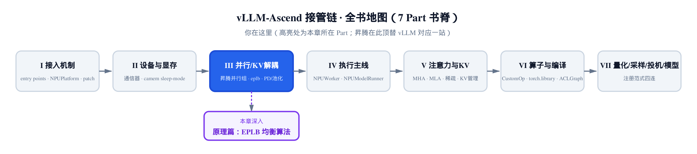
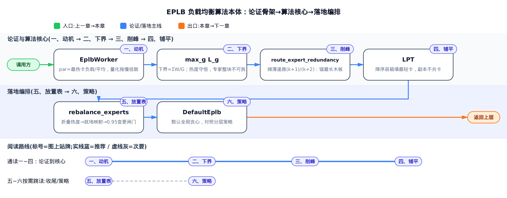
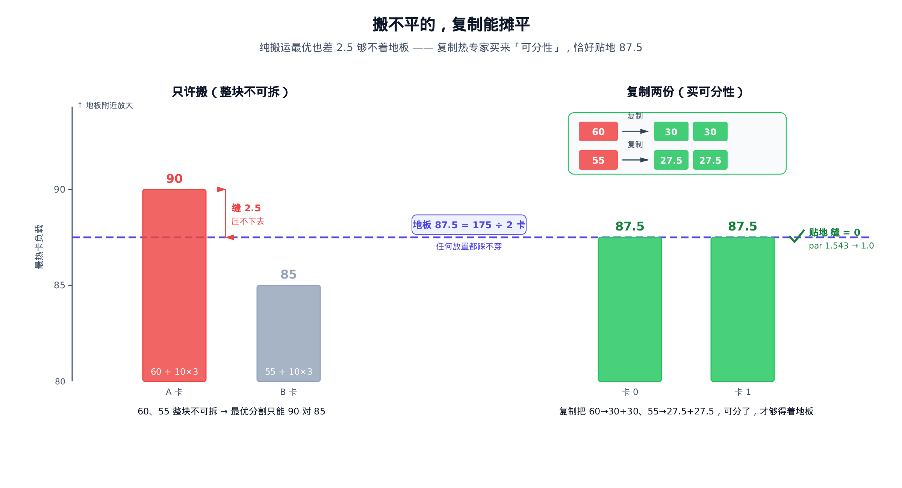
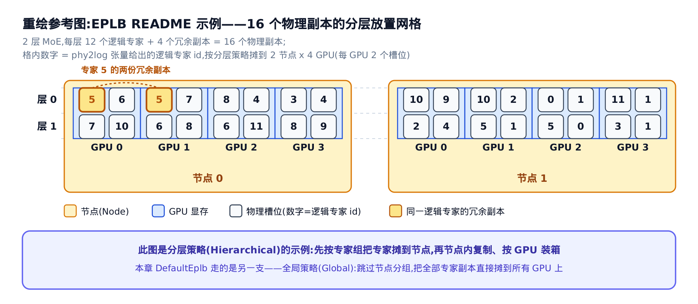

# 【原理篇·论文精读】EPLB：专家负载均衡的算法本体



> 你在这里：第 III 部分「并行/KV 解耦」的原理夹层。
> 上一站：[第 8 章](../../ch08-ascend-parallel-groups/narrative/chapter.md)建好了专家热迁移的通信域。
> 这一章：先把均衡算法本体推清楚——谁该复制、落到哪张卡。
> 下一站：[第 10 章](../../ch10-eplb-expert-load-balancing/narrative/chapter.md)看昇腾把它落成子进程规划与 D2D 热迁移。

上一章在昇腾的并行组里建好了 `_DYNAMIC_EPLB`（EPLB（expert parallelism load balancer，专家并行负载均衡器）专属的专家通信域）——一条给专家权重搬家预留的卡间高速路，走 NPU 间的 D2D（device-to-device，设备间拷贝）直拷。可这条路只管「搬」，不管「该往哪搬」。拍板的是一个纯算法函数 `rebalance_experts`：给它一张当前放置表和一张负载表，它吐回一张新放置表——哪个专家该复制、该落到哪张卡，全由它决定。[第 10 章](../../ch10-eplb-expert-load-balancing/narrative/chapter.md)的整套迁移机器把这个函数当黑盒；本章把它撬开。

撬开之后没有魔法，只有一条定理和两段贪心。定理是一块地板：所有卡的负载总和恒等于全部专家的总热度，于是「最热卡的负载」无论怎么摆都低不过均值—— **均值是任何放置都踩不穿的地板**（本章玩具例里是 87.5）。麻烦在于热度长在专家身上、专家整块不可拆：只靠搬，本例的极限是 90，离地板永远差一道缝。EPLB 的答案反直觉—— **搬不平的，复制能摊平**：把热度 60 的专家复制一份，它就变成两块 30，「不可拆」被买断，地板才够得着。于是全章就两段贪心：**削峰**（冗余复制，每轮锯当前最长的木板）与 **铺平**（贪心装箱，把碎块铺到均值），外加一道 0.95 闸门判定「压下来的幅度值不值得真搬一次」。这套数学出自 DeepSeek-V3 技术报告（arXiv:2412.19437）§3.4 的「冗余专家」部署策略与配套开源的 deepseek-ai/EPLB 参考实现；昇腾把它落成 `DefaultEplb` 规划器——一份在 vLLM 基座之外自带（out-of-tree）的纯 NumPy 实现，基座没有对应的站点，EPLB 整条链是插件仓的增量能力。本章只讲算法与数学本体；它怎么被宿主进程调用、权重怎么真搬，落地见[第 10 章](../../ch10-eplb-expert-load-balancing/narrative/chapter.md)。



只想抓「为什么必须复制、复制完怎么摆」这条主线，读一到四节就够；五节是从方案到放置表的收尾（就地映射与 0.95 闸门），六节是论文两种策略的对照，可按需跳读。

全章记号不多，先列一张速查表，正文首现处仍会给一句人话解释：

| 符号 | 含义 | 首次出现 |
| --- | --- | --- |
| $`w_e`$ | 逻辑专家 $`e`$ 的热度——统计窗口内路由到它的 token 量 | 一、动机与度量 |
| $`G`$ | 卡（rank，一张卡 = 一个进程）的总数，本章玩具例取 2 | 一、动机与度量 |
| $`L_g`$ | 卡 $`g`$ 的负载——落在它上面所有槽位的单副本热度之和 | 一、动机与度量 |
| $`\mathrm{par}`$ | 不均衡度 = 最热卡负载 / 平均（mean）卡负载，par 恒 ≥ 1 | 一、动机与度量 |
| $`r_e`$ | 专家 $`e`$ 的物理副本数（基副本 + 冗余副本） | 二、下界定理 |
| $`k`$ | 摊薄递推的计数器——某个专家已攒下的冗余副本数 | 三、削峰 |
| $`E`$ 、 $`R`$ | 逻辑专家总数、冗余名额总数（本例 8、2） | 三、削峰 |

---

## 一、动机与度量：par 是被最热卡拖慢的倍数

MoE（mixture-of-experts，混合专家）模型每一层有一大堆 FFN（前馈网络）专家，但每个 token 只激活其中 top-K 个——router（路由网络）给每个专家打分，取分数最高的 K 个。EP（expert parallelism，专家并行）把这些专家摊到不同的卡上，每张卡管一撮；一层前向要等**所有**卡都算完、再做一次 all-to-all（全对全通信）汇合，所以这一层的墙钟时间由**最慢**的那张卡决定——一队人抬桌子，最慢那个定速度。而专家有多热是数据说了算的：热门专家凑巧挤在同一张卡上，这张卡就拖着整队。

把「拖慢」变成一个数。设卡 $`g`$ 的负载为 $`L_g`$ （L 取 load 之意，指它管的那撮专家的热度之和，正式定义见下一节），par（不均衡度）取最热与平均（mean）之比：

```math
\mathrm{par} = \frac{\max_g L_g}{\mathrm{mean}_g\, L_g}
```

par 恒 ≥ 1，par = 1 是完美均衡；它的工程含义就一句—— **par 是整批被最热卡拖慢的倍数**：par = 1.5 意味着这批本可以快 1.5 倍。之所以取 max/mean 而不取方差：墙钟只由最慢卡决定，「最热/平均」直接就是拖慢倍数，与优化目标同向——这正是 DeepSeek-V3 §3.4「ensure that each GPU processes approximately the same number of tokens」的量化版（arXiv:2412.19437）。

本章从头用到尾的玩具例：1 个 MoE 层、2 张卡、每卡 5 个物理槽、8 个逻辑专家（id 0..7）。一个朴素的起始放置偏偏把两个真正的热门专家——专家 3（热度 60）和专家 4（热度 55）——塞进了同一张 card0，还把两个冗余副本浪费在了本就很冷的专家 1、5 身上：


card0 扛了 60+55+10+10 = 135，card1 只有 40，平均 (135+40)/2 = 87.5，par = 135/87.5 ≈ 1.543——另一张卡有近一半时间在干等。

顺手点破一个贯穿全章的不变量：**par 的分母全程是常量**。mean 只由总热度 175 与卡数决定，而后面要做的复制只是把热度摊给几份副本、装箱只是把热度换张卡放——谁都改不了总热度。所以「把 par 压回 1」与「把最热卡压到均值 87.5」是同一句话；那条 87.5 的线，就是全章唯一要盯的地板。观测侧确实按这个式子把任一放置方案量化成 par 供指标上报（EplbWorker 的记账，落地见[第 10 章](../../ch10-eplb-expert-load-balancing/narrative/chapter.md)）；规划器内部直接最小化最热卡负载，两者同向。

---

## 二、下界定理：均值是地板，纯搬运够不着

先交代一句训练期的前传。DeepSeek-V3 在训练时就压过一轮专家热度：auxiliary-loss-free load balancing（无辅助损失的负载均衡，arXiv:2412.19437 §2.1.2）给每个专家挂一个偏置，偏置只掺进 top-K「选不选」的排序、不进乘到专家输出上的门控值；每个训练步之后，过载专家的偏置下调、欠载的上调，把长期的热度分布压平。但它压的是**分布**——推理部署时，路由由训好的模型和眼下这批真实输入共同决定，某个统计窗口（论文举例每 10 分钟）里的实际热度照样会偏。于是需要一条独立于训练的推理期通路，论文 §3.4 一段话给出全部纲领：

> To achieve load balancing among different experts in the MoE part, we need to ensure that each GPU processes approximately the same number of tokens. To this end, we introduce a deployment strategy of redundant experts, which duplicates high-load experts and deploys them redundantly. The high-load experts are detected based on statistics collected during the online deployment and are adjusted periodically (e.g., every 10 minutes). After determining the set of redundant experts, we carefully rearrange experts among GPUs ... striving to balance the load across GPUs as much as possible.

两个关键词就是本章的两段贪心：**duplicates**（复制热门专家——削峰）与 **rearrange**（重排放置——铺平）。

把它写成优化问题。专家 $`e`$ 热度 $`w_e`$ （w 取 weight），有 $`r_e`$ 个物理副本（r 取 replica）时每副本承担 $`w_e/r_e`$ ——复制不增减热度，只摊薄。卡 $`g`$ 的负载是落在它上面所有槽位的单副本热度之和（对应 §3.4 的部署模型）：

```math
L_g = \sum_{e \in g} \frac{w_e}{r_e}
```

目标是最小化 $`\max_g L_g`$ ，因为整批延迟正比于它。这个量有个雷打不动的地板，三步推直：复制只把 $`w_e`$ 摊给几份副本，所有副本热度加总仍是 $`\sum_e w_e`$ ；这些副本终归落在 $`G`$ 张卡上，卡负载总和固定为 $`\sum_e w_e`$ ，平均每卡 $`\sum_e w_e/G`$ ；一组数的最大值不小于均值，于是

```math
\max_g L_g \;\ge\; \frac{\sum_e w_e}{G}
```

这就是 §3.4 那句「approximately the same number of tokens」的数学底座。本例总热度 175、 $`G=2`$ ，地板 87.5——与 par 的分母是同一个数，这不是巧合：它们是同一条热度守恒律的两个读数。

**为什么必须复制**，理由有两层。第一层是一个充分条件：若某个专家单体热度超过公平份额（ $`w_e > \sum_e w_e / G`$ ），任何不复制的放置都有 $`\max_g L_g \ge w_e >`$ 地板——它整块压在某张卡上，纯搬迁无解。第二层更普遍，也是本例真正命中的：即便没人超份额（60、55 都小于 87.5），**热度长在专家身上、整块不可拆**，而地板是按「热度可以无限细分」算出来的。本例 8 块热度在两卡间不复制地分，最优也只能分成 90 对 85（枚举见严谨框），90 仍高于 87.5——缝就卡在「60 和 55 拆不开」上。复制买的正是**可分性**：专家 3 复制一份，60 变成两块 30，分割的粒度变细，地板才从「理论下界」变成「可达的目标」。



均衡前后的全景就是这样一步跨过去的：


左边是均衡前 card0=135 的高柱，右边是均衡后两卡各 87.5、齐刷刷贴在地板上——本例恰好命中下界，par 从 1.543 压到 1.0。接下来两节把「怎么复制」「怎么装箱」的贪心各自推清。

> **严谨（想要深度再展开）**：其一，纯搬运最优 90 的枚举。不复制时 8 个专家各占一槽、两卡 5 槽装 8 块（容量无碍），唯一的自由是分组。60 与 55 同卡则该卡至少 115；分居两卡时，剩下 6 块热度 10 的专家给 60 那边 $`x`$ 块，两卡负载为 $`60+10x`$ 与 $`55+10(6-x)`$ ， $`x=3`$ 时最大值取最小 = 90，其余取法只会更大——纯搬运的 makespan（最大卡负载）极限是 90。其二，单体超份额条件的证明一行：不复制时该专家整块落在某张卡 $`g_0`$ 上， $`L_{g_0} \ge w_e > \sum_e w_e/G`$ 。其三，复制之后地板也**不总**可达——后面两节的贪心只保证近似（装箱启发式的最坏情况界见四节严谨框），本例命中 87.5 是「碎块恰好拼整」的幸运；但地板本身对任何放置永远成立：它是下界，不是承诺。

---

## 三、削峰：冗余复制的摊薄递推

复制阶段手里只有 $`R`$ 个冗余名额（本例 2），要用它把「最大单副本平均热度」压到最低。规则一行：**每轮把名额发给当前单副本平均热度最高的专家**。设这个专家此前已攒下 $`k`$ 个冗余副本（此刻共 $`k+1`$ 个物理副本），再发一个名额后（对应 §3.4 的冗余复制，arXiv:2412.19437）：

```math
\bar{w}_{new} = \bar{w}_{old}\times\frac{k+1}{k+2}
```

$`\bar{w}`$ 是该专家的单副本平均热度； $`k`$ 数的是**这个专家**已有的冗余副本数，不是全局轮次。这一步合法还是因为热度守恒：加副本前的总热度 $`\bar{w}_{old}\times(k+1)`$ 原封不动地摊到 $`k+2`$ 份上，除一下就是新平均。因子 $`(k+1)/(k+2)`$ 恒小于 1 且随 $`k`$ 递增（ $`1/2 \to 2/3 \to 3/4`$ ）——副本越多，再加一份摊薄得越少，贪心于是自动把名额引向「即便已复制、平均仍最高」的瓶颈。一句话的画面：整体高度由最长的木板决定，每轮锯当前最长的那根，而不是去锯已经不长的板。

本例折叠后的热度是 `[10,10,10,60,55,10,10,10]`（从物理观测折出这个向量的一步见五节）。贪心两轮：

<!-- trace: redundant-experts-replication -->

| 轮次 | 选中最热专家 | 加副本前平均热度 | 副本数 k→k+1 | 摊薄后平均热度 | 剩余冗余名额 |
| --- | --- | --- | --- | --- | --- |
| 1 | expert 3 | 60.0 | 0→1 | 30.0 | 2→1 |
| 2 | expert 4 | 55.0 | 0→1 | 27.5 | 1→0 |

第 1 轮全场最热是专家 3（60）， $`k=0`$ ，摊成 $`60\times 1/2 = 30.0`$ ；此时全场最热变成专家 4（55），第 2 轮摊成 $`27.5`$ 。两个名额用完，最终 `replicas_of = {3:[8], 4:[9]}` ——热门专家 3、4 各多一个物理副本（新副本的物理 id 从 8 往后编），冷专家一个名额都没占到。


这条递推落到昇腾的 `DefaultEplb` 里就是三行——「平均 × 副本数」还原总热度、记下新副本、再除以新副本数：

```python
# vllm_ascend/eplb/core/policy/policy_default_eplb.py:L53-L55
tmp_raw_weight = weights[0][1] * (len(route_expert_redundancy[weights[0][0]]) + 1)
route_expert_redundancy[weights[0][0]].append(route_expert_num + i)
avg_weight = tmp_raw_weight / (len(route_expert_redundancy[weights[0][0]]) + 1)
```

`weights[0]` 是按平均热度降序排后的当前最热专家：第一行是 $`\bar{w}_{old}\times(k+1)`$ ，第三行除以 $`k+2`$ ——递推逐字对上。围着这三行的降序排序与名额循环，无非把它跑 $`R`$ 遍，上面的推演表已经把两轮跑全。

> **严谨（不变量、终止与代价）**：每发一个名额，被选中专家的单副本平均热度严格下降（因子恒 < 1）；每轮只对「当前最大单副本平均热度」者动手（降序取顶），故全局最大单副本平均热度单调不增；名额固定 $`R`$ 个、每轮减一，有限步必停。代价：每个名额做一次对 $`E`$ 个专家的排序， $`O(R\cdot E\log E)`$ ——本例 $`2\times 8\times\log_2 8 = 48`$ 次比较量级，纯 CPU、离线，跑在独立的规划子进程里（宿主见[第 10 章](../../ch10-eplb-expert-load-balancing/narrative/chapter.md)），不占推理主循环。再记一笔主线账：摊薄保总热度不变，par 的分母、地板 87.5 都纹丝不动——削峰只是让地板「够得着」，真正去够的是下一节的装箱。

---

## 四、铺平：LPT 装箱，副本不共卡

复制把过高的单体削成了碎块，现在共 $`E+R = 10`$ 个物理副本要铺到 2 张卡、每卡 5 槽。规则一行：**按摊薄后热度降序，每件放进「当前总热度最轻、未含同专家、未满」的卡**。重的先安置、轻的填缝，这套启发式叫 LPT（longest processing time first，最长处理时间优先），是 makespan（最大卡负载）最小化的经典贪心——分行李上两台手推车，重箱先上、每件放进当前较轻的那台。

三个条件里真正带数学分量的是中间那个：**同专家副本不共卡，是摊薄的兑现条件**。上一节把 60 摊成两块 30，靠的是两份副本各接一半流量；若两块 30 落回同一张卡，那张卡照旧扛整份 60，复制等于白做。 $`L_g = \sum_{e\in g} w_e/r_e`$ 里「每副本独立成块」这个假设，正是靠这条装箱约束兑现的。

逐步跑完 10 个副本：

<!-- trace: greedy-balanced-packing -->

| 步骤 | 放入（专家，热度） | 候选 card0 负载 | 候选 card1 负载 | 选中卡 | 该卡新负载 |
| --- | --- | --- | --- | --- | --- |
| seed | 副本 (3,30.0) | — | — | card0 | 30.0 |
| seed | 副本 (4,27.5) | — | — | card1 | 27.5 |
| 1 | (3,30.0) | 30.0 | 27.5 | card1 | 57.5 |
| 2 | (4,27.5) | 30.0 | 57.5 | card0 | 57.5 |
| 3 | (7,10.0) | 57.5 | 57.5 | card0 | 67.5 |
| 4 | (6,10.0) | 67.5 | 57.5 | card1 | 67.5 |
| 5 | (5,10.0) | 67.5 | 67.5 | card0 | 77.5 |
| 6 | (2,10.0) | 77.5 | 67.5 | card1 | 77.5 |
| 7 | (1,10.0) | 77.5 | 77.5 | card0 | 87.5 |
| 8 | (0,10.0) | 87.5 | 77.5 | card1 | 87.5 |

先 seed（播种）：每个冗余副本各占一张卡（专家 3 的副本占 card0=30.0，专家 4 的占 card1=27.5）。再按热度降序放基副本：专家 3（30）不能进已含它的 card0，落 card1（→57.5）；专家 4 落 card0（→57.5）；随后 6 个热度 10 的专家轮流填当前最轻的卡，每次避开已含该专家的卡；到第 8 步 card0 已满 5 项，专家 0 只能进 card1。最终两卡各 **87.5** ——最大卡负载贴上地板，par 回到 1.0。


> **严谨（近似比与代价）**：LPT 对 makespan 最小化的最坏情况近似比是 $`4/3 - 1/(3m)`$ （ $`m`$ 为卡数，调度理论的标准记号；R. L. Graham, 1969 的经典界）。你不需要看它的证明——记住结论就够：再刁钻的输入，LPT 得到的最大卡负载也不会比最优差过这个比；本例更幸运，碎块恰好拼整，直接命中地板 87.5 本身。容量闸（每卡基本容量 = 副本总数整除卡数，本例 10//2 = 5，余数逐一分摊给个别卡）保证没有卡超载；「未含同专家」保证副本分散。代价 $`O((E+R)\cdot G)`$ ，本例 $`10\times 2 = 20`$ 次候选卡比较量级。

---

## 五、输出一张放置表：折叠、就地映射与 0.95 闸门

复制与装箱是数学核心；黑盒的进出两端还各有一步收尾，最后还有一道「迁不迁」的判定。它们不改变均衡的数学，却分别决定「算得对不对」「搬得多不多」「动不动手」。

**进门：折叠热度。** 规划器拿到的观测按物理槽位记账（每个槽一个热度），而复制与装箱按逻辑专家算——同一逻辑专家的多个副本散在各卡，先把它们的热度按专家 id 聚回一处。本例朴素放置里专家 1 有两个物理副本（热度 10 + 0），聚回来还是 10；折完得到 `[10,10,10,60,55,10,10,10]` ，正是三节复制阶段的输入。这一步对应 §3.4「statistics collected during the online deployment」；热度怎么在线采集、怎么送进规划器，落地见[第 10 章](../../ch10-eplb-expert-load-balancing/narrative/chapter.md)。顺带一提，冗余名额数也是从旧放置表反推的：数每个逻辑专家现有几份副本、超出 1 的部分求和——本例专家 1、5 各有 2 份，名额 = 2。

**出门：就地映射。** 装箱只决定「专家落哪张卡」，没决定「落哪个槽」——槽位是白送的自由度，就地映射把它全部花在「少搬」上：新方案里没换卡的专家留在原槽位，权重一个字节都不动；只有跨卡新到的副本才触发 D2D 拷贝。

<!-- trace: constraint-local-exchange -->

| 卡 | 旧槽位 | 装箱新集合 | 对上→原位保留 | 新到→填空槽 | 最终槽位 | D2D 拷贝数 |
| --- | --- | --- | --- | --- | --- | --- |
| card0 | [3,4,1,2,1] | [3,4,7,5,1] | {3,4,1} | [7,5] | [3,4,1,7,5] | 2 |
| card1 | [0,5,6,7,5] | [4,3,6,2,0] | {6,0} | [4,3,2] | [0,4,6,3,2] | 3 |

card0 的新集合 `{3,4,7,5,1}` 里，3、4、1 本来就在 card0 → 原槽不动；只有 7、5 是新到，填进 2、1 让出的空槽，2 次拷贝。card1 同理保留 6、0，新到 3 次。相比「整卡重灌 10 份」，本层搬运量降到 5——这直接就是[第 10 章](../../ch10-eplb-expert-load-balancing/narrative/chapter.md)的 D2D 搬运器要拷的权重块数。不变量一句：新旧集合等大，保留数 + 新到数 = 槽数，填充恰好用尽——输出必是装箱集合的一个排列，一个专家都不多不少（下一章的放置合法性校验与这条不变量互为保障）。

到这里，黑盒的输出成形——一张「卡 × 槽 → 逻辑专家 id」的放置表：


**最后一道闸：0.95。** 全流程串起来是五步：


热迁移本身有代价——D2D 拷贝、切换窗口的一致性风险——小打小闹的改善不值得折腾。于是设一个死区：记均衡前、后「逐层最热卡负载之和」为 $`H_{before}`$ 与 $`H_{after}`$ ，仅当 $`H_{after}`$ 压到 $`0.95\,H_{before}`$ 以下才置 `change = 1` 、真正触发迁移（对应 §3.4「adjusted periodically」——周期性评估，但不是每次都动）。本例阈值 $`0.95 \times 135 = 128.25`$ ，均衡后 87.5，改善比 $`87.5/135 = 0.648`$ ，闸门放行。这 5% 的死区是一层迟滞：「新方案更好」与「好到值得搬一次」是两个判据，负载轻微波动时不会来回搬专家。编排还顺手给出逐层迁移次序 `per_layer_priority` ：按「均衡后最热 / 均衡前最热」的改善比排序，改善越大的层排越前——一整轮迁移会被[第 10 章](../../ch10-eplb-expert-load-balancing/narrative/chapter.md)的搬运器摊到多个 step 逐层执行，先迁改善最大的层，每一步的边际收益最大。

---

## 六、两种论文策略：分层与全局

最后一处必须对读者诚实交代：论文附带的 deepseek-ai/EPLB 参考实现里其实给了**两种**打包策略，而昇腾的 `DefaultEplb` 只落地了其中一支。

> **Hierarchical Load Balancing** — When the number of server nodes divides the number of expert groups, we use the hierarchical load balancing policy ... We first pack the expert groups to nodes evenly ... Then, we replicate the experts within each node. Finally, we pack the replicated experts to individual GPUs ...
>
> **Global Load Balancing** — In other cases, we use the global load balancing policy that replicates the experts globally regardless of expert groups, and pack the replicated experts to individual GPUs.

区别在**要不要按 expert group 绑节点**。「专家组」指路由时预先把专家分成若干组、token 先选组再在组内选 top-K 的分组路由（group-limited routing，源自 DeepSeek-V2（arXiv:2405.04434）提出的 device-limited routing——本章不展开其构造，借用「先选组、再组内选」的直觉即可）；「按组绑节点」让同组专家落在同一节点，省跨节点通信。**分层策略**先把专家组均匀摊到节点、组内复制、再摊到卡，适合 prefill（预填充）阶段的小规模 EP；**全局策略**无视分组、全局复制 + 全局装箱，适合 decode（解码）阶段的大规模 EP。README 给过一个分层输出的实物——2 层 MoE、每层 12 个逻辑专家、4 个冗余名额（共 16 个物理副本）摊到 2 个节点 × 4 GPU：



图里每格的数字就是 `phy2log` 张量（物理槽位 → 逻辑专家 id 的映射）在那个（节点、GPU、槽位）位置写下的逻辑专家 id——节点 0 的 GPU 0 与 GPU 1 各有一格「5」，是专家 5 的两份冗余副本被摊到同节点内的两张不同 GPU 上：复制摊负载、副本不共卡，与本章的推导一脉相承。差别在「按节点成块」的规整分区：本章 `DefaultEplb` 走的是**全局**一支，不做 group→node 绑定，把全部副本直接摊到所有卡上——它在策略工厂 `PolicyFactory` 的分发表里是 `policy_type = 1` 的默认策略，代码注释自述「overall expert replacement based on current moe load」，「overall」正对应论文的 global。这是设计选择而非遗漏，且均衡上一分不亏：本章的地板定理与两段贪心从头到尾没碰过组结构，而分层的 group→node 绑定只是把可行放置收窄成全局的一个子集——同一套贪心在更大的集合上搜，最热卡只会更低、不会更高。绑定买的从来不是均衡，是通信：让分组路由的 token 尽量留在节点内，「不增加跨节点 all-to-all 通信开销」（§3.4 原话），而这有前置——上面引文第一句的「节点数整除专家组数」。一旦前置不满足，或像 decode 大规模 EP 那样每卡只放一个专家、all-to-all 本就走跨节点点对点直连（§3.4），绑定买不到任何东西，约束更少的全局一支就是正确的剩余项——`DefaultEplb` 正是这支不依赖分组路由的通用全局规划器；工厂里其余几种备选策略与分发机制，落地见[第 10 章](../../ch10-eplb-expert-load-balancing/narrative/chapter.md)。

---

## 小结：一条地板定理，两段贪心

回到开头那个黑盒。 `rebalance_experts` 拆开之后，全部内容都挂在同一条定理上—— **均值是地板**： $`\max_g L_g \ge \sum_e w_e / G`$ ，且分母全程守恒（复制只摊薄、装箱只挪位，总热度 175 不增不减），所以 par = 最热/平均就是「距地板几倍」的读数，本例从 1.543 出发。

- **纯搬运够不着地板**：热度整块不可拆，本例只搬的极限是 90 > 87.5；单体超份额时更是必败。复制买的是**可分性**（60 → 30 + 30）——这是「冗余专家」策略存在的数学理由。
- **削峰**：每轮把名额发给当前最热的专家，平均热度按 $`(k+1)/(k+2)`$ 摊薄，最大单副本平均热度单调不增。
- **铺平**：LPT 降序填最轻卡，「副本不共卡」兑现摊薄；本例装成 87.5/87.5，贴地，par → 1.0。
- **收尾**：槽位自由度全部换成搬运量（10 → 5）；0.95 死区当迟滞，本例改善比 0.648 远低于阈值，`change = 1` 放行。

规划器算出的这张放置表和 `change` 标志，交给[下一章那台迁移机器](../../ch10-eplb-expert-load-balancing/narrative/chapter.md)——由它的 updator 节拍、子进程队列、D2D 搬运器，把专家权重真正在卡间搬到位。规划与搬运，一静一动，合起来才是完整的 EPLB。
