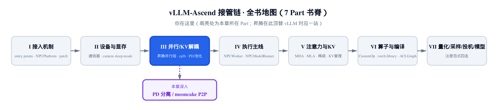
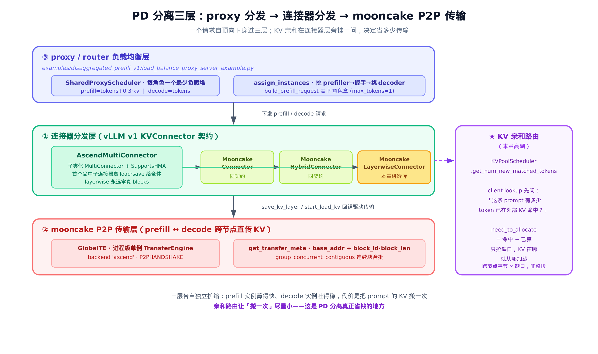
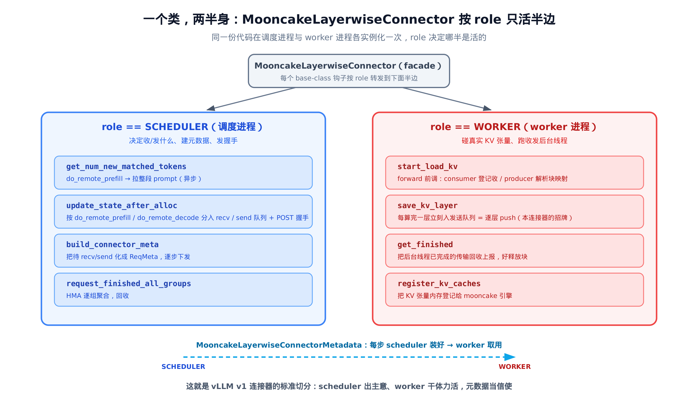
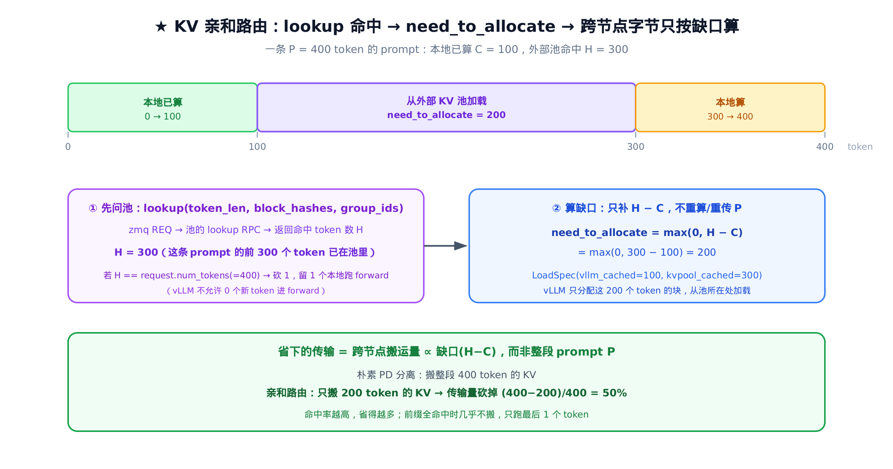

# 第 10 章 PD 分离：连接器分发、mooncake P2P 传输与 KV 亲和调度



> 上一章：在单个实例内部，把热门专家的权重在卡间热迁移。
> 本章：把 prefill 和 decode 拆到不同节点，KV 跨节点直传。
> 下一章：[KV 池化与 ascend_store——外存储层与池调度](../ch11-kv-pooling-ascend-store/narrative/chapter.md)。

一次 LLM 推理，其实是两种性格完全不同的活计被硬塞进了同一台机器。

**prefill**（预填充）一口气把整段 prompt 喂进模型，算出全部 token 的 KV——这是一次大并行计算，吃的是算力。**decode**（解码）则一个 token 一个 token 地往外吐，每步只算一个新 token，吃的是显存带宽和延迟。两者挤在一张卡上，prefill 的大批量算一上来，decode 的逐 token 步就被卡住；反过来，为了 decode 的低延迟把批量压小，prefill 又喂不饱算力。它们互相拖后腿。

**PD 分离**（prefill/decode disaggregation）的思路很直接：把这两件事拆到**不同的节点组**上各自跑、各自批、各自扩缩。prefill 实例算得快，decode 实例吐得稳。代价只有一个——prompt 那段 KV 是 prefill 算出来的，得**搬到 decode 节点**去，decode 才能接着往下吐。

这一章就是讲昇腾怎么把这件事做出来。代码的入口在 `vllm_ascend/distributed/kv_transfer/__init__.py`，但它不是一个文件，而是**三层**叠在一起的一套机制；最后还有一个让「搬一次」尽量便宜的高潮——**KV 亲和调度**。

## 一个请求穿过三层

先看全景。一个请求从进系统到吐出 token，自顶向下穿过三层：



> *图注：三层各管一段——① 连接器分发层按配置把请求路由到三个 mooncake 连接器（本章挑 layerwise 讲透），② mooncake P2P 做跨节点 KV 直传，③ proxy 在 P/D 实例间分发请求。★ KV 亲和则在连接器层旁挂一问，决定这一搬到底省多少。*

圈号①②③是按「逻辑角色」编的，不是讲解顺序：请求实际入口是 proxy（③），但我们从中枢的连接器层（①）切入、proxy 留到最后讲——因为 proxy 盖的那两个 flag，得先理解连接器怎么读它们才看得懂。三层各管一段：

- **① 连接器分发层**（`vllm_ascend/distributed/kv_transfer/`）：vLLM 的 KVConnector 契约。昇腾用 `AscendMultiConnector` 把请求路由到三个 mooncake 连接器之一；连接器负责告诉调度循环「这条请求要从远端拉 KV / 要往远端推 KV」。
- **② mooncake P2P 传输层**（`vllm_ascend/distributed/kv_transfer/kv_p2p/` + `utils/`）：mooncake 是昇腾 NPU 生态的外部 P2P 传输库（RDMA 级直传），这一层真正把 KV 张量在 prefill 节点和 decode 节点之间搬过去。
- **③ proxy / router 负载均衡层**（`examples/disaggregated_prefill_v1/load_balance_proxy_server_example.py`）：一个请求先到这里，被分给一台最闲的 prefiller，prefill 完再分给一台最闲的 decoder。

下面逐层拆。从中间那层——连接器分发——开始，因为它是 vLLM 把「外部 KV」接进调度循环的标准接口，也是昇腾改动最集中的地方。

## 第一层：连接器分发——昇腾在 vLLM 上加了什么

### 一次工厂覆写，把配置悄悄换成昇腾类

vLLM 用一个**注册表**把配置字符串映射到连接器类：你在配置里写 `kv_connector="MultiConnector"`，引擎就去 `KVConnectorFactory._registry` 里查这个名字、实例化对应的类。昇腾要插进来，靠的是一个模块初始化钩子 `register_connector`：

```python
# vllm_ascend/distributed/kv_transfer/__init__.py:L21
def register_connector():
    # override multi_connector as ascend_multi_connector
    if "MultiConnector" in KVConnectorFactory._registry:
        KVConnectorFactory._registry.pop("MultiConnector")
    KVConnectorFactory.register_connector(
        "MultiConnector", "vllm_ascend.distributed.kv_transfer.ascend_multi_connector", "AscendMultiConnector"
    )

    KVConnectorFactory.register_connector(
        "MooncakeConnectorV1", "vllm_ascend.distributed.kv_transfer.kv_p2p.mooncake_connector", "MooncakeConnector"
    )
    KVConnectorFactory.register_connector(
        "MooncakeHybridConnector",
        "vllm_ascend.distributed.kv_transfer.kv_p2p.mooncake_hybrid_connector",
        "MooncakeConnector",
    )
    # … 省略：MooncakeConnectorStoreV1 / AscendStoreConnector 注册（留待第 11 章）…
    KVConnectorFactory.register_connector(
        "MooncakeLayerwiseConnector",
        "vllm_ascend.distributed.kv_transfer.kv_p2p.mooncake_layerwise_connector",
        "MooncakeLayerwiseConnector",
    )
    # … 省略：UCMConnector / LMCacheAscendConnector / SimpleCPUOffloadConnector 注册——同样的
    #   register_connector(name, module, cls) 套路，不在本章 PD / 亲和路径上 …
```

第一句是整段的灵魂：**先把内置的 `"MultiConnector"` 从注册表里 `pop` 掉，再用同一个名字注册到 `AscendMultiConnector`**。

为什么不直接起个新名字、让用户去配？因为大家早就习惯写 `kv_connector="MultiConnector"`——这是 vLLM 上游的标准名。昇腾不想动用户的配置，于是来了个**偷梁换柱**：名字不变，背后的类换成自己的 HMA 感知子类。配置照旧，行为升级。

后面几句按名字把三个 mooncake 连接器登记进去：`MooncakeConnector`、`MooncakeHybridConnector`、`MooncakeLayerwiseConnector`。`AscendMultiConnector` 之后就会按配置实例化其中若干个，串成一个 fan-out（分发给多个目标：一进多出）。这一章我们**挑 `MooncakeLayerwiseConnector` 一个讲透**，因为它把 vLLM v1 连接器契约的每个环节都用上了。

### 基类 MultiConnector：选举一个 load，save 给全体

先看昇腾子类化的基座——vLLM 的 `MultiConnector`。它是个 fan-out 包装器，把多个连接器串成一列 `self._connectors`，对外仍是一个连接器。它的核心契约只有一句话：**从第一个声称有命中 token 的子连接器 load，save 给所有子连接器。**

「选举」发生在 `get_num_new_matched_tokens`——调度器问每个连接器「这条请求你能从外部补多少 token」：

```python
# vllm/distributed/kv_transfer/kv_connector/v1/multi_connector.py:L358
def get_num_new_matched_tokens(
    self,
    request: "Request",
    num_computed_tokens: int,
) -> tuple[int | None, bool]:
    to_return = (0, False)
    for i, c in enumerate(self._connectors):
        toks, load_async = c.get_num_new_matched_tokens(request, num_computed_tokens)
        # If there is a connector still looking up the matches,
        # we return None to indicate that we are not done yet.
        if toks is None:
            return (None, False)
        # The first connector that has new matched tokens will be assigned
        # to this request.
        if to_return[0] == 0 and toks > 0:
            self._requests_to_connector[request.request_id] = i
            to_return = (toks, load_async)
    return to_return
```

逐句读：

- 按 config 顺序遍历每个子连接器，问它 `toks`（能补多少 token）。
- 任一连接器返回 `None`，表示它**还在异步查、没查完**——整体立刻返回 `(None, False)`，让调度器这一步先别动这条请求，下一步再问。这是个短路。
- 第一个返回 `toks > 0` 的连接器**赢得这条请求的 load 权**，记进 `self._requests_to_connector[request_id] = i`。注意 `to_return[0] == 0` 这个守卫：一旦定了赢家，后面再有连接器报命中也不再改。**先到先得。**

赢家定了，下一步分配真实的 KV 块——vLLM 把 KV 按固定大小分块管理（比如每块 16 个 token），所以「块号」是逻辑地址，最终得转成物理字节地址才能直传。基类 `update_state_after_alloc` 的逻辑是「**只有赢家拿到真实 blocks，其余拿空**」：

```python
# vllm/distributed/kv_transfer/kv_connector/v1/multi_connector.py:L379
def update_state_after_alloc(self, request: "Request", blocks: "KVCacheBlocks", num_external_tokens: int):
    chosen_connector = self._requests_to_connector.get(request.request_id, -1)
    empty_blocks = blocks.new_empty()
    for i, c in enumerate(self._connectors):
        if i == chosen_connector:
            # Forward call to the chosen connector (if any).
            c.update_state_after_alloc(request, blocks, num_external_tokens)
        else:
            # Call with empty blocks for other connectors.
            c.update_state_after_alloc(request, empty_blocks, 0)
```

道理很顺：一条请求只由一个连接器负责 load，把真实 blocks（要往里写 KV 的物理位置）给赢家，别的连接器给个空壳走个过场就行。

### 昇腾的关键分歧：layerwise 永远拿真实 blocks

现在看昇腾子类 `AscendMultiConnector` 改了什么。它继承 `MultiConnector` 又混入 `SupportsHMA`（声明支持 HMA 混合内存分配器——它把 KV 分成多个 cache group，释放时得逐组上报），`__init__` 里多了一句 HMA 校验，而真正动了控制流的只有一处——`update_state_after_alloc`：

```python
# vllm_ascend/distributed/kv_transfer/ascend_multi_connector.py:L19
class AscendMultiConnector(MultiConnector, SupportsHMA):
    def __init__(self, vllm_config: "VllmConfig", role: KVConnectorRole, kv_cache_config: "KVCacheConfig"):
        super().__init__(
            vllm_config=vllm_config,
            role=role,
            kv_cache_config=kv_cache_config,
        )
        self._all_support_hma = all(supports_hma(c) for c in self._connectors)
        assert vllm_config.scheduler_config.disable_hybrid_kv_cache_manager or self._all_support_hma, (
            "HMA should not be enabled unless all sub-connectors support it"
        )

    def update_state_after_alloc(self, request: "Request", blocks: "KVCacheBlocks", num_external_tokens: int):
        chosen_connector = self._requests_to_connector.get(request.request_id, -1)
        empty_blocks = blocks.new_empty()
        for i, c in enumerate(self._connectors):
            if i == chosen_connector or isinstance(c, MooncakeLayerwiseConnector):
                # Forward call to the chosen connector (if any).
                c.update_state_after_alloc(request, blocks, num_external_tokens)
            else:
                # Call with empty blocks for other connectors.
                c.update_state_after_alloc(request, empty_blocks, 0)
```

差别就一个 `or`：

```python
if i == chosen_connector or isinstance(c, MooncakeLayerwiseConnector):
```

基类的条件是「**是不是赢家**」；昇腾多了一句「**或者它是不是 layerwise 连接器**」。也就是说：**任何 `MooncakeLayerwiseConnector`，哪怕没赢得 load，也照样拿到真实 blocks。**

为什么要破这个例？因为 layerwise 连接器干的不是 load，是 **push（推送保存）**。「选举只给赢家真实 blocks」这条规矩，前提是「每条请求只被一个连接器**加载**」——加载是读。但 layerwise 是**生产者侧的保存**（prefiller 是 KV 生产者、push 写；decoder 是消费者、pull 读）：它要在 prefill 算出每层 KV 的那一刻，把这层 KV 从本地的物理块**推**到远端 decoder。它必须知道这些真实块号在哪，才能读出来发走——跟它有没有赢得 load election 毫无关系。

所以这个 `isinstance` 豁免，是把 vLLM「一读一选举」的假设，扩成「读归读、写归写，写方永远要真地址」。一个 `or` 背后，是 push 语义和 load 语义的根本区别。

> 旁注：`AscendMultiConnector` 还覆写了 `request_finished_all_groups`（混入 `SupportsHMA` 的理由）。HMA（Hybrid Memory Allocator，混合内存分配器）会把 KV 切成多个 cache group——比如 full-attention 一组、mamba/SWA 另一组，块大小还不一样——释放时得**逐组**上报。基类的扁平 `request_finished` 报不了多组；HMA 版把各子连接器的异步保存计数聚合起来，并强约束「只能有一个连接器产出 transfer params」。这条路与 PD 主线正交，知道它存在即可。

## 挑 layerwise 讲透：一个类，两半身

`AscendMultiConnector` 把请求路由给了 `MooncakeLayerwiseConnector`。现在钻进去看一个连接器到底长什么样——它就是 vLLM v1 连接器契约的标准实现。

最先要理解的是：**同一个连接器类，在两个进程里各活半边。**



> *图注：调度进程实例化的连接器只有 Scheduler 半边活（决定收/发什么、建元数据）；每个 worker 进程里只有 Worker 半边活（碰真实 KV 张量、跑收发线程）。一份 MooncakeLayerwiseConnectorMetadata 每步从 scheduler 流到 worker。*

vLLM v1 把连接器拆成两个进程角色：**scheduler 进程**决定「这一步要 load/save 什么、产出哪些元数据」，**worker 进程**真正去碰 KV 张量。同一个类在两边都被实例化，构造时传入的 `role` 参数（`KVConnectorRole` 枚举的两个离散取值——`SCHEDULER` 代表调度进程、`WORKER` 代表 worker 进程）决定激活哪一半的代码。看这个门面类的 `__init__`：

```python
# vllm_ascend/distributed/kv_transfer/kv_p2p/mooncake_layerwise_connector.py:L690
class MooncakeLayerwiseConnector(KVConnectorBase_V1, SupportsHMA):
    def __init__(self, vllm_config: VllmConfig, role: KVConnectorRole, kv_cache_config: KVCacheConfig | None = None):
        super().__init__(vllm_config, role, kv_cache_config)
        assert vllm_config.kv_transfer_config is not None
        self.engine_id = vllm_config.kv_transfer_config.engine_id
        self._connector_metadata = MooncakeLayerwiseConnectorMetadata()

        if role == KVConnectorRole.SCHEDULER:
            self.connector_scheduler: MooncakeLayerwiseConnectorScheduler | None = MooncakeLayerwiseConnectorScheduler(
                vllm_config, kv_cache_config, str(self.engine_id))
            self.connector_worker: MooncakeLayerwiseConnectorWorker | None = None
        elif role == KVConnectorRole.WORKER:
            self.connector_scheduler = None
            self.connector_worker = MooncakeLayerwiseConnectorWorker(vllm_config, kv_cache_config, str(self.engine_id))
```

`role == SCHEDULER` 就只造 `connector_scheduler`，`role == WORKER` 就只造 `connector_worker`，另一边留 `None`。facade 自己几乎没逻辑，每个 base-class 钩子都直接转发：

```python
# vllm_ascend/distributed/kv_transfer/kv_p2p/mooncake_layerwise_connector.py:L710
def get_num_new_matched_tokens(self, request: "Request", num_computed_tokens: int) -> tuple[int, bool]:
    assert self.connector_scheduler is not None
    return self.connector_scheduler.get_num_new_matched_tokens(request, num_computed_tokens)

def update_state_after_alloc(self, request: "Request", blocks: "KVCacheBlocks", num_external_tokens: int):
    assert self.connector_scheduler is not None
    return self.connector_scheduler.update_state_after_alloc(request, blocks, num_external_tokens)
# … 省略：build_connector_meta / request_finished* 转 scheduler；start_load_kv / save_kv_layer /
#   get_finished 转 worker——同样的 delegate-by-role 套路 …
```

下面分两半看。

### Scheduler 半边：方向由 kv_transfer_params 的两个 flag 决定

同一份连接器代码同时跑在 prefill 节点和 decode 节点上。一个节点对某条请求到底是「推 KV 出去」还是「拉 KV 进来」，**不靠节点身份判断，靠请求自带的两个 flag**：

- `do_remote_prefill`：「这条请求的 prefill 在别处做了——我是 decoder，得把整段 prompt 的 KV **拉**过来。」
- `do_remote_decode`：「这条请求的 decode 在别处做——我是 prefiller，算完得把 KV **推**过去。」

这两个 flag 由 proxy 在分发时盖进请求（第三层会看到盖章动作）。先看 decoder 侧的「拉」——`get_num_new_matched_tokens`：

```python
# vllm_ascend/distributed/kv_transfer/kv_p2p/mooncake_layerwise_connector.py:L827
def get_num_new_matched_tokens(self, request: "Request", num_computed_tokens: int) -> tuple[int, bool]:
    """
    For remote prefill, pull all prompt blocks from remote
    asynchronously relative to engine execution.
    """
    params = request.kv_transfer_params
    # … 省略：debug 日志 …
    if params is not None and params.get("do_remote_prefill"):
        # Remote prefill: get all prompt blocks from remote.
        assert num_computed_tokens % min(self.block_size) == 0
        # Note: We use the full token count as transmit data here.
        count = max(len(request.prompt_token_ids) - num_computed_tokens, 0)
        return count, count > 0

    # No remote prefill for this request.
    return 0, False
```

逻辑很干脆：看到 `do_remote_prefill`，就说「我要从远端补 `count = prompt 长度 − 已算` 个 token」，第二个返回值 `count > 0` 表示**异步加载**——这次拉取跟引擎执行并行，不阻塞调度步。没有这个 flag 就返回 `(0, False)`，这条请求跟 layerwise 无关。

赢得 election 后进 `update_state_after_alloc`，这里两个 flag 分出 recv（收）和 send（发）两条路：

```python
# vllm_ascend/distributed/kv_transfer/kv_p2p/mooncake_layerwise_connector.py:L860
def update_state_after_alloc(self, request: "Request", blocks: "KVCacheBlocks", num_external_tokens: int):
    params = request.kv_transfer_params

    if params is not None and params.get("do_remote_prefill"):           # 我是 decoder：登记「要收」
        local_block_ids = (blocks.get_block_ids()) if num_external_tokens > 0 else []
        remote_cached_tokens = request.num_computed_tokens
        self._reqs_need_recv[request.request_id] = (request, [], local_block_ids)
        params["do_remote_prefill"] = False
        external_req_id = get_external_request_id(request.request_id)
        kv_transfer_params = dict(
            token_ids=[], request_id=external_req_id,
            do_remote_prefill=False, do_remote_decode=True,
            remote_block_ids=local_block_ids, remote_block_size=self.block_size,
            remote_engine_id=self.engine_id,
            remote_host=self.side_channel_host, remote_port=self.side_channel_port,
            # … 省略：remote_tp_size / pcp_size / dcp_size 并行拓扑字段 …
            remote_cached_tokens=remote_cached_tokens,
        )
        future = self.executor.submit(
            self._access_metaserver, url=params.get("metaserver", None), message=kv_transfer_params)
        # … 省略：do_virtual 分支与异常回调 …

    if params is not None and params.get("do_remote_decode"):            # 我是 prefiller：登记「要发」
        local_block_ids = list(blocks.get_block_ids())
        remote_cache_tokens = params["remote_cached_tokens"]
        self._reqs_need_send_layerwise[request.request_id] = SendReqInfo(
            local_block_ids=local_block_ids,
            local_transferred_tokens=remote_cache_tokens,
            local_computed_tokens=0,
            request=request,
        )
```

两条路是对称的：

- **decoder 侧**（`do_remote_prefill`）：把请求记进 `_reqs_need_recv`，然后**异步 POST 一份握手**到 metaserver——metaserver 是部署在 decoder 侧的协调服务，收集各 decoder 的握手信息（块号、引擎 id、host/port），让 prefiller 能查到对端在哪里、把 KV 发过去。这份 `kv_transfer_params` 里装着「我这边的物理块号 `remote_block_ids`、引擎 id、host/port」，prefiller 拿到它，才知道该把 KV 往哪个地址发。注意它顺手把 `do_remote_prefill` 翻成 `False`、把 `do_remote_decode` 设 `True`：这份握手是发给对面 prefiller 看的，站在对面视角，它该是「去 decode」的那一方。
- **prefiller 侧**（`do_remote_decode`）：把请求记进 `_reqs_need_send_layerwise`，存下本地块号、待传 token 数。

两条队列攒着的待办，由 `build_connector_meta` 在每个调度步转成 `ReqMeta`，塞进 `MooncakeLayerwiseConnectorMetadata.requests` 下发给 worker。这就是图里那条从 scheduler 流向 worker 的虚线——**元数据当信使**，是连接器契约里「role + metadata + 回调」的 metadata 部分。

### Worker 半边：每算完一层就推一层

worker 侧只有两个钩子嵌在模型 forward 循环里，但它们正是这个连接器名字的由来。先看招牌动作——`save_kv_layer`：

```python
# vllm_ascend/distributed/kv_transfer/kv_p2p/mooncake_layerwise_connector.py:L1621
def save_kv_layer(self, layer_name, kv_layer, attn_metadata, connector_metadata, **kwargs) -> None:
    """MooncakeLayerwiseConnector does not save explicitly."""
    if self.vllm_config.kv_transfer_config.is_kv_producer and connector_metadata.requests.keys():
        if self.current_layer >= self.total_layers:
            self.current_layer += 1
            return
        # … 省略：pd_head_ratio>1 / 量化的 NPU 重排与 reshape_cache_event 取用——保留默认分支 …
        send_task = connector_metadata.send_task
        layer_group_idx = self.layer_metadata[layer_name].tensor_group_idx[0]
        layer_send_task = SendTask(
            wait_event=reshape_cache_event,
            k_cache=keys, v_cache=values,
            layer_idx=self.current_layer, layer_name=layer_name,
            group_rearrange_block_ids=send_task.group_rearrange_block_ids,
        )
        for req_id, req_meta in connector_metadata.requests.items():
            if len(req_meta.local_block_ids[layer_group_idx]) == 0:
                continue
            req_meta_update = self.update_decoder_info(req_id, req_meta)
            layer_send_task.send_request[req_id] = req_meta_update

        self.kv_send_layer_thread.send_queue.put(layer_send_task)
        self.current_layer += 1
```

`save_kv_layer` 是模型每算完**一层** attention 的 KV 就回调一次。这个连接器的做法是：**这一层一算完，立刻打包成 `SendTask` 扔进后台发送线程的队列，然后 `current_layer += 1` 接着算下一层。** 不等整段 prompt 全算完，一层一层往外推。

开头那个 `if self.current_layer >= self.total_layers` 守卫看着反直觉——layer 计数怎么会超过总层数？这是个边界保护：某些前向流程可能在真实模型层之外多触发几次回调，一旦计数超出模型实际层数，就只递增计数、跳过推送。而那个 `SendTask` 是「这一层的发送任务」的完整描述：等哪个事件（`wait_event`，即缓存重排完成）、发送哪层的 K/V 张量（`k_cache`/`v_cache`）、是第几层（`layer_idx`/`layer_name`）、对应哪些本地块、是否要重排块（`group_rearrange_block_ids`）——后台发送线程拿着它就能独立把这层 KV 发走。

这就是「layerwise」——逐层流水线。它的价值是**重叠**：第 `i` 层的 KV 正在跨节点传输的同时，模型在算第 `i+1` 层。传输延迟被后续层的计算盖住了。一个 `L` 层的模型，理想情况下能把 `(L−1)/L` 的传输时间藏进计算里——`L=80` 时，约 99% 的传输延迟被隐藏（这是忽略层间同步与首层冷启动的理想上界，实际略低）。这也是为什么这个门面类（`MooncakeLayerwiseConnector`，把 scheduler 和 worker 两半包起来的那个类）的 `wait_for_save` 是个空 `pass`：保存是逐层 fire-and-forget 的，没有「等全部存完」这一步可等。

闭环靠 `get_finished` 收尾——它把后台收线程已经完成的请求集排空，回报给调度器，让对应的块可以释放：

```python
# vllm_ascend/distributed/kv_transfer/kv_p2p/mooncake_layerwise_connector.py:L1331
def get_finished(self) -> tuple[set[str], set[str]]:
    done_recving = (
        self.kv_recv_layer_thread.get_and_clear_done_requests()
        if self.vllm_config.kv_transfer_config.is_kv_consumer else set()
    )
    done_recving = {self.request_map[s] for s in done_recving if s in self.request_map}
    done_recving.update(self.virtual_request)
    self.virtual_request = set()
    # … 省略：failed_recving 失败块回收与 _recving_metadata 清理 …
    for req_id in done_recving:
        org_req_id = req_id[:-9]
        self.request_map.pop(org_req_id, None)
        self._recving_metadata.pop(req_id, None)
    return set(), done_recving
```

它返回的是一对集合：已完成发送的请求集、已完成接收的请求集。第一个恒为空——逐层推送是 fire-and-forget，发出去就不再跟踪「发完没」；只有接收侧（decoder 拉 KV）才有真实的完成集合 `done_recving` 要上报，好让调度器释放对应的块。

至此第一层闭合：scheduler 用 flag 分出收/发、攒待办、发握手、下元数据；worker 逐层推、逐层收、回报完成。**连接器只是个调度循环的接口**——真正搬 KV 的活，在它委托的第二层。

## 第二层：mooncake P2P——KV 怎么跨节点搬

### 一个进程一个引擎

第二层的入口对象是 `GlobalTE`：一个进程级单例，懒初始化出唯一一个 mooncake `TransferEngine`。要注意这个引擎依赖 NPU/CANN/mooncake 运行时——下面这段 `from mooncake.engine import TransferEngine` 在纯 host 上会因缺这些依赖而导入失败，省略掉的那段错误处理就是为此准备的（给出安装指引）：

```python
# vllm_ascend/distributed/kv_transfer/utils/mooncake_transfer_engine.py:L11
def get_transfer_engine(self, hostname: str, device_name: str | None):
    if self.transfer_engine is None:
        with self.transfer_engine_lock:
            # Double-Checked Locking
            if self.transfer_engine is None:
                from mooncake.engine import TransferEngine  # type: ignore
                # … 省略：ImportError 的安装指引 …
                self.transfer_engine = TransferEngine()
                device_name = device_name if device_name is not None else ""
                ret_value = self.transfer_engine.initialize(hostname, "P2PHANDSHAKE", "ascend", device_name)
                if ret_value != 0:
                    raise RuntimeError(f"TransferEngine initialization failed with ret_value: {ret_value}")
    return self.transfer_engine
```

两个细节定义了这层的传输语义：后端 `"ascend"`（走昇腾的 RDMA 直传——远程直内存访问，远端 NPU 直接往本地内存写、不经 CPU），模式 `"P2PHANDSHAKE"`（节点对节点握手后直传，不经中心服务器）。

为什么要进程级单例？因为这个引擎握着**注册内存**和**握手端口**这两样稀缺资源。KV 张量得先 `register_buffer` 把内存区域登记给引擎，远端才能直接往里写（RDMA 的前提）。收线程、发线程、多个连接器若各造一个引擎，就得重复登记同一片 KV、抢占重复的端口。一个进程共享一个，省掉这些重复——双重检查锁就是为「多线程同时首次取用」准备的。

### 块号怎么变成可以直传的地址

引擎只认**绝对地址 + 长度**。可 KV 在 vLLM 里是按**块**管理的（每块固定若干 token）。把「块号」翻译成「地址」，是 `get_transfer_meta` 的活：

```python
# vllm_ascend/distributed/kv_transfer/kv_p2p/mooncake_layerwise_connector.py:L285
def get_transfer_meta(self, send_task, req_id, req_meta, layer_group_idx):
    src_list, dst_list, length_list = [], [], []
    layer_name = send_task.layer_name
    remote_block_ids = req_meta.remote_block_ids[layer_group_idx]
    local_block_ids = req_meta.local_block_ids[layer_group_idx]
    # … 省略：Mamba 分支 / pd_head_ratio>1 重排分支 / 量化分支——保留 pd_head_ratio==1 默认算术 …
    layer_local_kv_base_addr = self.layer_metadata[layer_name].kv_caches_base_addr
    layer_remote_kv_base_addr = req_meta.remote_layer_metadata[layer_name].kv_caches_base_addr
    block_lens = self.layer_metadata[layer_name].block_len
    grouped_remote_block_ids, grouped_local_block_ids = group_concurrent_contiguous(
        remote_block_ids, local_block_ids)
    for k, (src_layer_base_addr, dst_layer_base_addr) in enumerate(
            zip(layer_local_kv_base_addr, layer_remote_kv_base_addr)):
        block_len = block_lens[k]
        for group_remote_block_id, group_local_block_id in zip(grouped_remote_block_ids, grouped_local_block_ids):
            src = src_layer_base_addr + group_local_block_id[0] * block_len
            dst = dst_layer_base_addr + group_remote_block_id[0] * block_len
            length = len(group_local_block_id) * block_len
            src_list.append(src); dst_list.append(dst); length_list.append(length)
    return (src_list, dst_list, length_list)
```

核心是三行地址算术：

$$
\mathrm{src} = \mathrm{base\_addr} + \mathrm{block\_id} \times \mathrm{block\_len}
$$

算术的两个输入都来自 `layer_metadata`——它是一张按层登记的元信息表，worker 初始化时从注册内存信息填充，存着每层 KV 缓存的基址 `kv_caches_base_addr` 和每块字节数 `block_len`，正是用来把抽象的「块号」换算成绝对地址的。一块 KV 的物理地址，就是「这层 KV 的基址」加「块号乘每块字节数」。本地算出 `src`、远端算出 `dst`（远端的基址来自对面握手带过来的 `remote_layer_metadata`），长度是「这一**批**连续块的总字节」。注意 `group_local_block_id[0]`——只取这批的**第一块**算起始地址，因为这一批块在内存里是连续的，一个起始地址 + 总长就够描述。

### 把零散块拼成大块传：group_concurrent_contiguous

上面那个「批」从哪来？`group_concurrent_contiguous` 把零散块号合并成连续段：

```python
# vllm_ascend/distributed/kv_transfer/kv_p2p/mooncake_layerwise_connector.py:L1922
def group_concurrent_contiguous(src, dst=None):
    """Vectorised NumPy implementation."""
    # … 省略：dst 为空时的 src-only 分支（收侧分组用）…
    src_indices = np.array(src, dtype=np.int64)
    dst_indices = np.array(dst, dtype=np.int64)
    if src_indices.size == 0:
        return [], []
    brk = np.where((np.diff(src_indices) != 1) | (np.diff(dst_indices) != 1))[0] + 1
    src_groups = np.split(src_indices, brk)
    dst_groups = np.split(dst_indices, brk)
    return [g.tolist() for g in src_groups], [g.tolist() for g in dst_groups]
```

关键是那个 `|`：**只有本地块号和远端块号都 `+1` 连续，才并进同一批；任一侧断号，就切一刀。** `np.diff != 1` 找出断点，`np.split` 在断点处切开。

走一个具体例子。本地块 `src = [1,2,3,7]`、远端块 `dst = [10,11,12,20]`：

| 相邻对 | src 差 | dst 差 | 是否断 |
|---|---|---|---|
| (1→2, 10→11) | 1 | 1 | 连续 |
| (2→3, 11→12) | 1 | 1 | 连续 |
| (3→7, 12→20) | 4 | 8 | **断** |

断点在第 3 对，于是分成两批：`src=[[1,2,3],[7]]`、`dst=[[10,11,12],[20]]`。原来要发 4 次（4 个零散块），现在合并成 2 次大传输。

再看一个只断在远端的例子：`src=[1,2,3]`（本地连续）、`dst=[10,11,99]`。本地虽然连续，但远端 `11→99` 跳了——`|` 让它照样切：`src=[[1,2],[3]]`、`dst=[[10,11],[99]]`。**两侧都连续才算一批**，因为一次 RDMA 写要求源和目标都是各自连续的一段地址。

这是个实打实的量化收益：`N` 个零散块，合并成 `M ≤ N` 批，mooncake 引擎只发 `M` 次 P2P。块号越规整，`M` 越接近 1，每次传输的固定开销摊得越薄。

到这里第二层讲完：单例引擎握着注册内存与 P2P 握手，块号经基址算术变成绝对地址，连续段合批后由引擎一次写过去。**真实的跨节点搬运需要 NPU + CANN + mooncake，host 上跑不了**——但上面这套地址算术和合批是纯 Python，待会儿能跑给你看。

## 第三层：proxy——谁来 prefill，谁来 decode

回到最上面一层。请求第一站到 proxy，它要回答两个调度问题：**派给哪台 prefiller？prefill 完派给哪台 decoder？** 答案是「都挑最闲的那台」，由 `SharedProxyScheduler` 用两个最少负载堆实现。

### 两个打分，两个堆

prefill 和 decode 的负载性质不同，打分也不同：

```python
# examples/disaggregated_prefill_v1/load_balance_proxy_server_example.py:L205
def calculate_prefill_score(request_length: int) -> float:
    length_score = request_length / 4.0
    return length_score * 0.0345 + 120.0745

def calculate_decode_score(request_length: int) -> float:
    return request_length
```

而每台服务器的「当前有多重」由 `_priority` 算——这才是挑选时的排序键：

```python
# examples/disaggregated_prefill_v1/load_balance_proxy_server_example.py:L276
def _priority(self, role: ServerRole, entry: BackendServer, key: str) -> float:
    if key in self._pool(role).tainted:
        return TAINT_PRIORITY
    if role is ServerRole.PREFILL:
        return entry.active_tokens + entry.active_kv_cache * 0.3
    return entry.active_tokens
```

两个角色的优先级公式不一样，背后是负载性质的差异：

- **prefill** = `active_tokens + 0.3 × active_kv_cache`。prefiller 不只在算，它算完还得**攥着 KV** 等 decoder 来拉。所以除了当前算的 token 量，还要把 KV 压力按 0.3 权重计进去——一台攥着很多待传 KV 的 prefiller，哪怕暂时没在算，也该少派点新活。
- **decode** = `active_tokens`。decoder 的负担就是当前在跑的 token 流，直接用它。

### 最少负载堆：懒删除，避免反复重建

挑「最闲」的标准操作是最小堆。但负载是**一直在变**的——每派一个请求，被选中那台的负载就涨，它在堆里的位置就过期了。每次都重建堆是 `O(K)`（`K` 台服务器）。`SharedProxyScheduler` 用**懒删除**绕开重建：

```python
# examples/disaggregated_prefill_v1/load_balance_proxy_server_example.py:L291
def _pop_valid(self, role: ServerRole) -> str:
    pool = self._pool(role)
    while pool.heap:
        _, _, seq, key = heapq.heappop(pool.heap)
        if key not in pool.servers:
            continue
        entry = pool.servers[key]
        if entry.heap_seq == seq:
            return key
    raise RuntimeError(f"No available {role.value} servers")
```

每台服务器有个单调计数器 `heap_seq`。负载一变，就**推一条带新 `heap_seq` 的新条目**进堆，旧条目不删、留在里面变「陈旧」。`_pop_valid` 弹出堆顶时核对 `entry.heap_seq == seq`：对得上才是最新负载、采纳；对不上是陈旧条目、跳过。挑一次是 `O(log K)` 摊销。堆里陈旧条目攒到超过 `2K` 时才一次性 `_reset_heap` 重建，把内存兜住。

`_pick_server` 把「弹最闲 → 加负载 → 推回堆」串起来：

```python
# examples/disaggregated_prefill_v1/load_balance_proxy_server_example.py:L352
def _pick_server(self, role, load, *, active_tokens=False, kv_cache=False) -> dict[str, Any]:
    key = self._pop_valid(role)
    entry = self._pool(role).servers[key]
    if active_tokens:
        entry.active_tokens += load
    if kv_cache:
        entry.active_kv_cache += load
    self._push_heap(role, key)
    return {"key": key, "host": entry.host, "port": entry.port}
```

走一个两请求的派发追踪，两台 prefiller 起步零负载，每次 `begin_request(load=10)`（prefill 派发会加 KV 压力，`kv_cache=True`）：

| 轮次 | 动作 | A.kv | B.kv | A 优先级 | B 优先级 | 弹出（最小） | 之后 |
|---|---|---|---|---|---|---|---|
| 起步 | — | 0 | 0 | 0 | 0 | — | A、B 并列 |
| ① | begin(10) | 0→10 | 0 | 0 | 0 | **A**（序号小） | A.kv=10 |
| ② | begin(10) | 10 | 0→10 | 3.0 | 0 | **B** | B.kv=10 |

`begin(10)` 在 `_pick_server` 里执行 `active_kv_cache += load`——直接加原始 `load=10`，不乘权重。第①轮 A、B 优先级都是 0，按入堆序号取 A，A 的 `active_kv_cache` 涨到 `10`、优先级按 `_priority` 公式变 `10×0.3=3.0`（那个 `0.3` 只在算优先级时乘一次）；第②轮 B 还是 0、比 A 的 `3.0` 小，于是落到 B。**负载被来回摊平**——这正是 `test_shared_scheduler_picks_least_loaded` 断言的 `first["key"] != second["key"]`。

### 给请求盖上「你是 prefiller」的章

挑中 prefiller 后，proxy 要明确告诉它「你只管 prefill，别 decode」。这一步靠 `build_prefill_request` 改写请求体：

```python
# examples/disaggregated_prefill_v1/load_balance_proxy_server_example.py:L790
def build_prefill_request(req_data: dict) -> dict:
    payload = req_data.copy()
    payload["kv_transfer_params"] = {
        "do_remote_decode": True,
        "do_remote_prefill": False,
        "remote_engine_id": None, "remote_block_ids": None,
        "remote_host": None, "remote_port": None,
    }
    payload["stream"] = False
    payload["max_tokens"] = 1
    payload["min_tokens"] = 1
    if "max_completion_tokens" in payload:
        payload["max_completion_tokens"] = 1
    payload.pop("stream_options", None)
    return payload
```

两处盖章：

- `kv_transfer_params={"do_remote_decode": True, "do_remote_prefill": False}`——还记得第一层 layerwise scheduler 里 `do_remote_decode` 走的是「登记要发」那条路吗？章就盖在这里。proxy 写下 flag，prefiller 的连接器读到 flag，走 send 分支。**这是三层之间的暗号。**
- `max_tokens = min_tokens = 1`——prefiller 只需要把 prompt 的 KV 算出来，**只让它吐 1 个 token**（vLLM 要求每个请求至少真跑一次 forward 吐 1 个 token，prefill 才算完整跑完）。真正的生成留给 decoder。

### 一条请求的完整编排

`assign_instances` 把整条编排串起来：

```python
# examples/disaggregated_prefill_v1/load_balance_proxy_server_example.py:L896
async def assign_instances(api, req_data, request_length, *, is_initial_request) -> InstanceInfo:
    runtime = get_runtime(); args = get_global_args()
    prefiller_score = calculate_prefill_score(request_length)
    decoder_score = calculate_decode_score(request_length)
    request_id = next_req_id()
    pick_prefill = "begin_request" if is_initial_request else "reserve_prefill_kv"
    prefiller = await runtime.schedule(pick_prefill, prefiller_score)   # ① 挑最闲 prefiller
    prefiller_key = prefiller["key"]

    response = await send_request_to_service(                          # ② 盖章 + POST 给 prefiller
        await runtime.get_client(ServerRole.PREFILL, prefiller_key),
        api, req_data, request_id, max_retries=args.max_retries, base_delay=args.retry_delay)

    kv_transfer_params = response.json().get("kv_transfer_params", {}) # ③ 读回 prefiller 的握手
    if kv_transfer_params:
        req_data["kv_transfer_params"] = kv_transfer_params

    decoder = await runtime.schedule("pick_decoder", decoder_score)    # ④ 挑最闲 decoder
    return InstanceInfo(
        request_id=request_id, prefiller_key=prefiller_key, prefiller_score=prefiller_score,
        decoder_key=decoder["key"], decoder_score=decoder_score,
        decoder_host=decoder["host"], decoder_port=decoder["port"],
    )
```

四步连成一气（`pick_prefill` 的二选一：初始请求用 `begin_request` 给 prefiller 分配新 KV 槽，重试或续约用 `reserve_prefill_kv` 复用已预留的块、省一次重分配）：① 挑 prefiller → ② `send_request_to_service` 内部调 `build_prefill_request` 盖章后 POST，prefiller 跑 prefill、连接器把 KV 逐层推走、`request_finished` 回一份握手 `kv_transfer_params`（含 `remote_block_ids/engine_id/host/port`）→ ③ proxy 读回这份握手、塞进请求 → ④ 挑 decoder，请求（现在带着 `do_remote_prefill` + 远端握手）转给它。decoder 的连接器读到 `do_remote_prefill`，触发第一层那条「拉整段 prompt」的路。

这里要把前面 scheduler 半边那个 metaserver POST 接上：它和这条 proxy 回传的握手，是**同一套地址交换的两半**。proxy 这条（②③）负责把 prefiller 算出的远端块号 / engine_id 经响应体回传给 decoder；而 [scheduler 半边](#scheduler-半边方向由-kv_transfer_params-的两个-flag-决定) 那个 metaserver POST，是 decoder 反过来把自己**本地落点的块号**登记出去，好让 prefiller 的发送线程定位「KV 到底往哪个地址写」。一来一回，两份握手拼成完整的双向地址交换。

三层在这里闭环：proxy 盖 flag，连接器读 flag 决定收发方向，mooncake 按握手里的地址搬 KV。

## 高潮：KV 亲和——先问一句「你已经有多少了？」

到这里 PD 分离能跑了，但有个浪费一直没动：**每条请求都把整段 prompt 的 KV 搬一次。** 可现实里 prompt 高度重复——同一套 system prompt、同一份 few-shot 例子、多轮对话的历史，会在大量请求里反复出现。这些前缀的 KV，很可能**早就在某处算过、存在外部 KV 池里**。再搬一遍，是纯浪费。

`KVPoolScheduler` 的亲和路由就是来掐掉这块浪费的。它的思路一句话：**分配之前先问外部池「这条 prompt 你已经缓存了多少 token？」，然后只补缺口。**



> *图注：一条 P=400 的 prompt，本地已算 C=100、外部池命中 H=300。只有 [100,300] 这段从池里加载（need_to_allocate=200），[300,400] 本地算。跨节点搬运量从整段 400 降到缺口 200。*

> 本章只用 `KVPoolScheduler` 的**命中查询**做亲和路由。它的 store/池存取与池调度节拍机制是另一套大机器，[留到第 11 章 KV 池化与 ascend_store](../ch11-kv-pooling-ascend-store/narrative/chapter.md) 讲。这里只看「问一句、定路由」这一步。

### 命中查询：一次 zmq RPC 问出命中前缀

先看「问」怎么问。`LookupKeyClient.lookup` 把请求的逐块哈希发给池的 lookup RPC，收回一个整数——命中的 token 数：

```python
# vllm_ascend/distributed/kv_transfer/kv_pool/ascend_store/pool_scheduler.py:L643
def lookup(self, token_len, block_hashes, kv_cache_group_ids=None) -> int:
    kv_cache_group_ids = kv_cache_group_ids or [0]
    hash_strs = [h.hex() for h in block_hashes]
    hash_frames = self.encoder.encode(hash_strs)
    kv_group_frames = self.encoder.encode(kv_cache_group_ids)
    token_len_bytes = token_len.to_bytes(4, byteorder="big")
    all_frames = [token_len_bytes] + list(kv_group_frames) + list(hash_frames)
    self.socket.send_multipart(all_frames, copy=False)
    resp = self.socket.recv()
    result = int.from_bytes(resp, "big")
    return result
```

它用 `encoder`（消息编码器，如 MessagePack）把 `token_len`、各组 id、每块的内容哈希打包成 multipart 帧，经 zmq（零拷贝消息队列库）的 REQ（一种阻塞式 RPC 通信，发方发完就等着收回应）发给池，阻塞收回一个大端整数。池那边比对哈希、返回「这条 prompt 的前多少 token 我有现成 KV」。`block_hashes` 是 prompt 各块内容的指纹——内容一样哈希就一样，于是「同一段前缀」能被认出来。

### 算缺口：命中 − 已算

拿到命中数 `H`，路由决策在 `get_num_new_matched_tokens` 里完成：

```python
# vllm_ascend/distributed/kv_transfer/kv_pool/ascend_store/pool_scheduler.py:L224
def get_num_new_matched_tokens(self, request, num_computed_tokens: int) -> tuple[int, bool]:
    """Check for external KV cache hit."""
    if self.kv_role == "kv_consumer" and not self.consumer_is_to_load:
        return 0, False

    if self._discard_partial_chunks:
        token_len = self._floor_to_cache_transfer_granularity(len(request.prompt_token_ids))
    else:
        token_len = len(request.prompt_token_ids)
    if token_len < self.cache_transfer_granularity:
        return 0, False

    num_external_hit_tokens = self.client.lookup(
        token_len, request.block_hashes, self.kv_cache_group_ids)

    if num_external_hit_tokens == request.num_tokens:
        num_external_hit_tokens -= 1

    if num_external_hit_tokens < num_computed_tokens:
        need_to_allocate = 0
    else:
        need_to_allocate = num_external_hit_tokens - num_computed_tokens
    # … 省略：debug / info 日志 …
    if need_to_allocate <= 0:
        return 0, False

    self.load_specs[request.request_id] = LoadSpec(
        vllm_cached_tokens=num_computed_tokens,
        kvpool_cached_tokens=num_external_hit_tokens,
        can_load=False,
    )
    return need_to_allocate, self.load_async and not self.use_layerwise
```

先理清代码里几个 token 计数别混：`prompt_token_ids` 是原始 prompt，`token_len` 是对齐到缓存传输粒度后的长度（某些配置下舍入以避免破碎块），`num_tokens` 是请求总 token 数（prompt + 生成）。核心就一行算术：

$$
\mathrm{need\_to\_allocate} = \max(0,\ H - C)
$$

`H` 是池命中数，`C` 是本地已算（`num_computed_tokens`）。**只为缺口 `H − C` 那段 token 分配块、从池里加载**；`[0, C]` 本地早有，`[H, P]` 池里没有得本地算。`LoadSpec` 把 `vllm_cached=C`、`kvpool_cached=H` 记下来，供后续真正加载时用。

跑一组三轮追踪（prompt 长 `P=400`、`num_tokens=400`）。注意第三轮是「命中还没本地多」的退化情形：

| 轮次 | 池命中 H | 本地已算 C | 砍 1？ | need_to_allocate | 返回 | 结果 |
|---|---|---|---|---|---|---|
| ① 部分命中 | 300 | 100 | 否 | max(0, 300−100)=**200** | (200, True) | 从池加载 200，本地算 100 |
| ② 全命中 | 400→**399** | 0 | 是（H==num_tokens） | max(0, 399−0)=**399** | (399, …) | 留 1 个本地跑 forward |
| ③ 命中≤已算 | 50 | 100 | 否 | 50<100 → **0** | (0, False) | 不走外部加载 |

> 表中第二位（异步标志）取 `load_async=True` 且未开 layerwise 的常见配置；其一般取值 = `load_async and not use_layerwise`，[见本节末](#省下来的是什么)。

三种情形把这段逻辑的边界全覆盖了：

- **①** 是常态——命中比已算多，补中间那段。传输量按 200 而非 400 算。
- **②** 是个必须处理的角落：如果整段 prompt 都命中（`H == num_tokens`），那本地一个 token 都不用算了——可 **vLLM 不允许一条「0 个新 token」的请求进 forward**——模型至少得真跑一次 forward 来更新内部状态、检查生成停止条件等，所以总得留一步给它跑。于是 `num_external_hit_tokens -= 1` 砍掉 1，留最后一个 token 本地重算。这是一行不起眼但救命的钳制。
- **③** 命中还没本地已算多，缺口算出来是负，`need_to_allocate <= 0` 直接返回 `(0, False)`——这条请求走不走外部池都一样，不浪费一次池加载。

最前面那个守卫也值得一提：`kv_role == "kv_consumer" and not consumer_is_to_load` 时直接短路返回——`kv_role` 来自配置，标记本引擎是 KV 消费者（decoder，拉）还是生产者（prefiller，推）；纯消费者若没被配置成「负责加载」，根本不问池。

**一句话归纳正确性**：`need_to_allocate = max(0, H − C)` 永远 `≥ 0`（`max` 兜底）。当 `H ≥ C`（`need_to_allocate > 0`）时，本地已算段 `[0, C]`、加载段 `[C, H]`、本地重算段 `[H, P]` 三段首尾相接、不重不漏，拼起来正好是整段 `[0, P]`；`H < C` 的退化情形（情形③）走 `(0, False)` 早退、根本不进加载，故不破坏覆盖。再加全命中砍 1 的钳制，保证**至少 1 个 token 进 forward**，请求一定推得动。

### 省下来的是什么

把账算清。一条请求的 KV 字节量正比于 token 数：

$$
\mathrm{KV\ bytes} \approx 2 \times L \times H_{kv} \times d \times s \times n_{tokens}
$$

`2` 是 K 和 V，`L` 层数，`H_{kv}` 是 KV 头数（K/V 张量的头数，独立于 Q 头数，GQA 下通常更少），`d` 头维度，`s` 数据类型字节，`n_{tokens}` token 数。前面那串系数对一条请求是常数，**跨节点搬运量正比于 `n_{tokens}`**。

- 朴素 PD 分离：搬整段，`n_{tokens} = P`。
- 亲和路由：只搬缺口，`n_{tokens} = H − C`。

上面①的数字里，传输量从 400 降到 200，**砍掉 `(400−200)/400 = 50%`**。命中率越高省得越多：前缀全命中时（情形②）几乎不搬，只跑最后 1 个 token。这就是 PD 分离真正省钱的地方——不是搬得更快，是**先问一句、能不搬就不搬**。

最后看返回的第二个值 `self.load_async and not self.use_layerwise`：是否异步加载，取决于配置开没开异步、且**没开 layerwise**。layerwise 是逐层流水线推送（第一层那套），跟「整块异步加载」是两条互斥的路子——开了 layerwise 就不能再标异步加载，否则两套机制会打架。

## 跑起来看数值

昇腾这套 host 上跑不动整链——没有 NPU/CANN、没有 mooncake，真实的跨节点 P2P 搬运、NPU 上的 KV 重排与量化、worker 收发后台线程绑卡，都得在装了昇腾加速器的机器上才真跑。但**三层里的决策控制流是纯 Python**：连接器选举与 layerwise 豁免、方向 flag 分发、块号合批与地址算术、proxy 最少负载堆、亲和路由的命中算术——这些不碰加速器。

配套的精简版按「只做减法」原则，与真实源码（`vllm_ascend/distributed/kv_transfer/kv_p2p/mooncake_layerwise_connector.py`、`kv_pool/ascend_store/pool_scheduler.py` 等）同名同结构，把上面这些控制流逐字保留（删掉的只是 NPU 重排/量化分支、TLS 握手 plumbing、运维弹性脚手架、池存取节拍，每处都标了 `# SUBTRACTED:`），真实的 P2P 搬运由 record-only 桩接住。跑测试：

```text
$ python3 -m pytest instances/.../ch10-pd-disaggregation-mooncake/tests -q
20 passed
```

20 个用例覆盖三层主线 + 亲和高潮的关键控制流：选举挑首个报命中的连接器、任一连接器在查则整体短路 `(None, False)`、`AscendMultiConnector` 让 layerwise 永远拿真实 blocks（对照基座只给 chosen）、`register_connector` 覆写、layerwise scheduler 见 `do_remote_prefill` 拉整段；`group_concurrent_contiguous` 的连续合批与远端跳号分批；prefill/decode 打分、`build_prefill_request` 盖章、最少负载堆轮转；以及 ★ 亲和的五种情形——`need_to_allocate = 命中−已算`、全命中砍 1、命中不超已算则不加载、consumer 短路、layerwise 关异步加载。这些断言**不是性能验证**，而是「控制流确实长这样」的交叉验证——数值与行为以钉死的真实源码为准。

## 小结

这一章我们从单实例内部走到了**实例之间**：把 prefill 和 decode 拆到不同节点，让两种性格相反的负载各自批、各自扩缩，代价是把 prompt 的 KV 搬一次。昇腾把这件事做成了三层叠加的一套机制：

- **连接器分发层**用一次工厂覆写（`vllm_ascend/distributed/kv_transfer/__init__.py` 里的 `register_connector` 把 `"MultiConnector"` 偷换成 `AscendMultiConnector`），透明地把请求路由到三个 mooncake 连接器。昇腾对基座只动了一处关键分歧——**layerwise 连接器哪怕没赢得 load 也永远拿真实 blocks**，因为 push 是写、写方永远要真地址。
- 挑 `MooncakeLayerwiseConnector` 讲透了 vLLM v1 连接器契约：**一个类两半身**（scheduler 出主意、worker 干体力活、元数据当信使），方向由请求自带的 `do_remote_prefill / do_remote_decode` 两个 flag 决定，招牌是 **`save_kv_layer` 每算完一层就推一层**——用流水线把传输延迟藏进后续层的计算里。
- **mooncake P2P 层**用进程级单例引擎握住注册内存与握手端口，把块号经 `base_addr + block_id × block_len` 翻成绝对地址，连续段合批后一次写过去。
- **proxy 层**用两个懒删除最少负载堆把请求摊到最闲的 P/D 实例上，并给请求**盖上角色章**——这正是连接器读取的那两个 flag 的源头。

而最后的高潮 **KV 亲和**，回答了「这一搬怎么尽量便宜」：分配之前先 `lookup` 问外部池「你已经有多少了」，`need_to_allocate = max(0, 命中 − 已算)`，**只搬缺口、不搬整段**。命中率越高，跨节点字节省得越多——前缀全命中时几乎不搬。

本章只借了 `KVPoolScheduler` 的命中查询这一步。它背后那套外部 KV 池——池怎么存、怎么淘汰、池调度怎么打节拍——是另一台大机器。[下一章，我们走进 KV 池化与 ascend_store](../ch11-kv-pooling-ascend-store/narrative/chapter.md)，看这个「先问一句」的池子，到底是怎么把 KV 攒在身边的。
