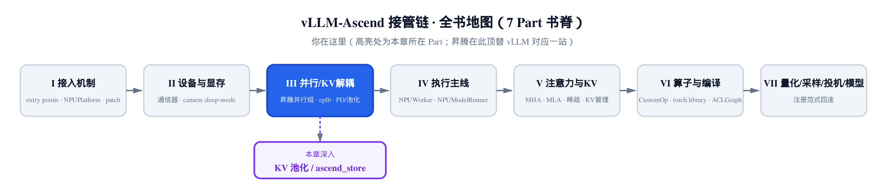
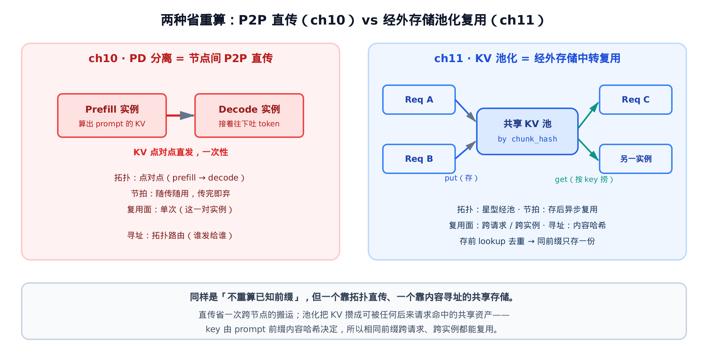
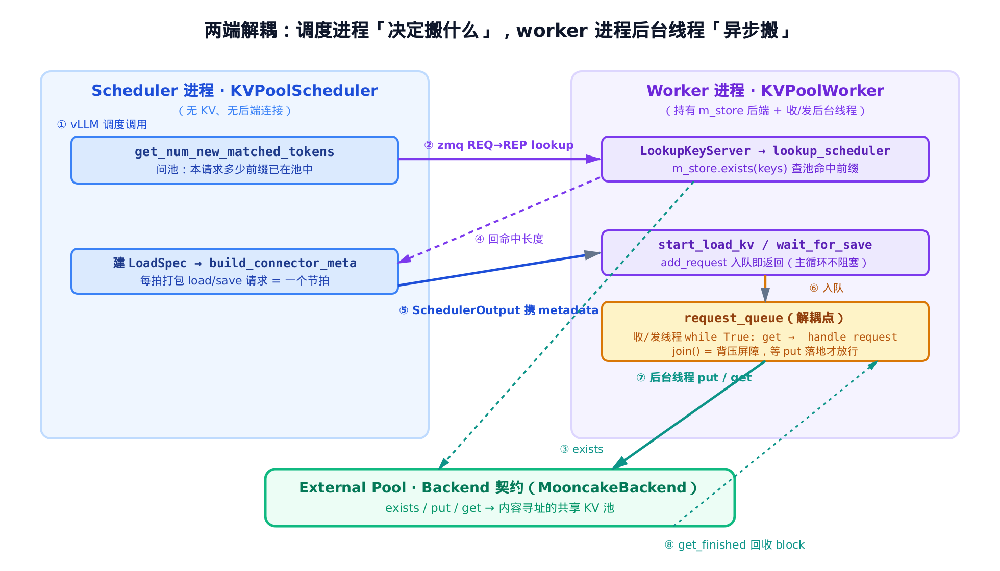
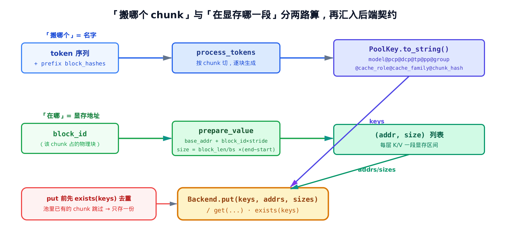

# 第 11 章 KV 池化与 ascend_store：外存储层与池调度



> 上一章：PD 分离把 prefill 算出的 KV 点对点直传给 decode 节点。
> 本章：把 KV 写进一个共享池，按内容寻址，谁都能捞。
> 下一章：[KV 往 host / CPU 卸载，腾出宝贵的 NPU 显存](../ch12-kv-offloading-host-cpu/narrative/chapter.md)。

[上一章](../ch10-pd-disaggregation-mooncake/narrative/chapter.md)的 PD 分离做了一件很赚的事：prefill 实例辛辛苦苦算出来的那段 prompt KV，不再让 decode 实例重算一遍，而是隔着网络直接搬过去。省下的是一整段 prefill 的算力。

但这笔账有个边界——它只在**这一对**实例之间结清。prefill 把 KV 发给配对的 decoder，发完这段 KV 的使命就结束了。如果半小时后另一个用户发来一条**前缀完全相同**的 prompt（同一段系统提示、同一份长文档、同一个 few-shot 模板），那段 KV 早已不知去向，只能从头再算。

这一章讲的就是怎么把这笔账记得更久。思路只有一句话：**别把 KV 用完就扔，写进一个独立的、跨请求跨实例共享的池子里**。后来任何一条请求，只要前缀撞上了，就从池里把 KV 捞回来，连重算都省了。这套机制在昇腾的代码里叫 **ascend_store**，整套代码住在 `vllm_ascend/distributed/kv_transfer/kv_pool/ascend_store/` 下面，入口是 `ascend_store_connector.py`。

## 11.1 直传与池化：两种「省重算」

先把上一章和这一章的关系摆清楚，否则很容易混。两者都在省「已知前缀的重算」，但省法不一样。



> *图注：左边是 PD 分离——KV 在一对实例间点对点直发，传完即弃。右边是 KV 池化——KV 写进一个按内容哈希寻址的共享池，任何后来请求 / 实例都能按 key 捞回。一个靠拓扑路由，一个靠内容寻址。*

[第 10 章](../ch10-pd-disaggregation-mooncake/narrative/chapter.md)里，我们其实已经借用过这个池子的一个零件——它的**命中查询**（`pool_scheduler.py` 里的那一问），拿来做 KV 亲和路由（先问外部 KV 命中多少、只补缺口，省掉重算 / 重传）。当时我们只问了池子一句「这条请求有多少前缀你那儿有」，就拿去定路由了，明确说过：池子怎么存、怎么取、怎么打节拍，是另一台大机器，留到本章。现在这台机器要整个拆开看。

它的拓扑、节拍、复用面，和 PD 分离都不同：

| 维度 | PD 分离（ch10） | KV 池化（ch11） |
|---|---|---|
| 拓扑 | 点对点（prefill → decode） | 星型经池（多请求存、多请求取） |
| 节拍 | 随传随用，传完即弃 | 存进池后异步复用 |
| 复用面 | 一次（这一对实例） | 跨请求 / 跨实例 |
| 寻址 | 拓扑路由（谁发给谁） | 内容哈希（key = 前缀内容） |

记住右列这四点，下面所有代码都是在把它们一一做实。

> 本章会反复用一个**精简版**来交叉验证逻辑：它是把真实源码剥掉 NPU / RDMA 等无关分支后、留下纯 Python 控制流的可运行子集。`test_get_num_new_matched_tokens_hit_arithmetic` 这类带 `test_` 前缀的用例，跑的就是这些精简版，验的是命中算术、状态翻转、队列节拍这些纯逻辑——host 上没有昇腾硬件也能跑通。真实的显存搬运（put / get 的 RDMA）验不了，那部分只读控制流。下文每提一次「精简版 …」，都是这个意思：一段能跑出数值、和正文论证对得上的参照物，不是正文的主角。

## 11.2 入口：一个连接器，两端分派

vLLM 把「外部 KV」接进引擎，靠的是一套标准契约 `KVConnectorBase_V1`（KV 传输连接器基类）。引擎主循环在固定的几个时机回调连接器的钩子——分配前问一句「这条请求有多少 KV 在外面」、分配后通知一声、前向算完让你存、每步轮询哪些异步搬运完成了。昇腾要把池化接进来，就写一个子类把这些钩子实现掉。这个子类是本章的入口：

```python
# vllm_ascend/distributed/kv_transfer/kv_pool/ascend_store/ascend_store_connector.py:L73
class AscendStoreConnector(KVConnectorBase_V1, SupportsHMA):
    def __init__(self, vllm_config: VllmConfig, role: KVConnectorRole, kv_cache_config: KVCacheConfig | None = None):
        super().__init__(vllm_config=vllm_config, role=role, kv_cache_config=kv_cache_config)
        self.kv_role = vllm_config.kv_transfer_config.kv_role

        self.use_layerwise = vllm_config.kv_transfer_config.kv_connector_extra_config.get("use_layerwise", False)
        # … 省略：DSV4 compress 相关字段、kv-event 聚合器、弃用连接器告警 …

        self.kv_caches: dict[str, torch.Tensor] = {}

        if role == KVConnectorRole.SCHEDULER:
            self.connector_scheduler = KVPoolScheduler(vllm_config, self.use_layerwise, kv_cache_config)
        else:
            self.connector_worker = KVPoolWorker(
                vllm_config,
                self.use_layerwise,
                kv_cache_config,
            )

            assert self.connector_worker is not None
            if vllm_config.parallel_config.rank == 0:
                self.lookup_server = LookupKeyServer(self.connector_worker, vllm_config, self.use_layerwise)
```

这段 `__init__` 几乎没有逻辑，但有一个分水岭——`role`。同一个连接器类，在两种进程里各被实例化一次，走两条互不相交的路：

- `role == SCHEDULER`：这是**调度进程**。它做请求编排，但身上既没有 KV 显存，也没有连外部池的网络连接。它只建一个 `KVPoolScheduler`，负责「决定搬什么」。
- 否则就是**模型 worker 进程**。它持有 KV 显存和后端连接，建一个 `KVPoolWorker` 负责「真正搬」。而且只有 `rank == 0` 这一个 worker 额外起一个 `LookupKeyServer`——后面会看到，调度进程要查命中，得跨进程问这个服务端。

`SupportsHMA` 是个混入（mixin），向引擎声明「我支持混合内存分配器」，这里只需知道它要保留在签名上。

`__init__` 里还设了两个贯穿全章的开关，这里先交代清楚，免得后面遇到分支犯懵：

- `kv_role`：这个实例在池里的身份，和上面分进程的 `role` 是两回事。三种互斥取值——`kv_producer`（纯生产方，只往池里写）、`kv_consumer`（纯消费方，只从池里读）、`kv_both`（既读既写）。同一实例只会是其中一种，后面好几处岔路都按它分。
- `use_layerwise`：搬运模式开关。关（本章主线）是「整请求一次搬完」；开则走逐层流水线（按层 retrieve / save，可削显存峰值）。两条路径结构同构，本章只讲非 layerwise 这条，后文跳过的 layerwise 分支都是它在起作用。

连接器本身是个**薄分发层**。`KVConnectorBase_V1` 的每个钩子，它都按 `role` 转发给两端之一，自己不掺逻辑：

```python
# vllm_ascend/distributed/kv_transfer/kv_pool/ascend_store/ascend_store_connector.py:L120
    # —— Scheduler 侧：转发给 connector_scheduler ——
    def get_num_new_matched_tokens(self, request: "Request", num_computed_tokens: int) -> tuple[int, bool]:
        assert self.connector_scheduler is not None
        return self.connector_scheduler.get_num_new_matched_tokens(request, num_computed_tokens)

    def build_connector_meta(self, scheduler_output: SchedulerOutput) -> KVConnectorMetadata:
        assert self.connector_scheduler is not None
        return self.connector_scheduler.build_connector_meta(scheduler_output)

# … 省略：update_state_after_alloc / request_finished 等其余调度侧钩子，结构同构 …

    # —— Worker 侧：转发给 connector_worker ——
    def start_load_kv(self, forward_context: "ForwardContext", **kwargs) -> None:
        assert self.connector_worker is not None
        metadata = self._get_connector_metadata()
        self.connector_worker.start_load_kv(metadata)

    def wait_for_save(self):
        if self.kv_role == "kv_consumer" and not self.consumer_is_to_put:
            return
        if self.use_layerwise:
            return
        self.connector_worker.wait_for_save(self._get_connector_metadata())

    def get_finished(self, finished_req_ids: set[str]) -> tuple[set[str], set[str]]:
        """Get the finished recving and sending requests."""
        assert self.connector_worker is not None
        done_sending, done_recving = self.connector_worker.get_finished(
            finished_req_ids, self._get_connector_metadata()
        )
        return done_sending, done_recving
```

四个钩子，两类去向：`get_num_new_matched_tokens` / `build_connector_meta` 转给调度端，`start_load_kv` / `wait_for_save` / `get_finished` 转给 worker 端。`wait_for_save` 里那个 `kv_role == "kv_consumer"` 的早退是个小优化——纯消费方默认不往池里写，没必要存。

### 这套钩子从哪来：vLLM 的 KVConnectorBase_V1

`AscendStoreConnector` 实现的这些钩子，一个都不是昇腾发明的——它们是 vLLM v1 定义的标准抽象。来看基类把哪些方法标成了 `@abstractmethod`（子类必须实现）：

```python
# vllm/distributed/kv_transfer/kv_connector/v1/base.py:L170
class KVConnectorBase_V1(ABC):
    # … 省略：类 docstring、__init__、role/部分 property（下面只摘 4 个核心 @abstractmethod，原文不相邻）…

    # —— Worker 侧：引擎前向上下文里回调 ——
    @abstractmethod
    def start_load_kv(self, forward_context: "ForwardContext", **kwargs: Any) -> None:
        """Start loading the KV cache from the connector to vLLM's paged KV buffer."""
        pass

    # … 省略：wait_for_layer_load / save_kv_layer 两个逐层钩子 …

    @abstractmethod
    def wait_for_save(self):
        """Block until all the save operations is done."""
        pass

    # —— Scheduler 侧：调度循环里回调（原文在 worker 钩子之后约 90 行）——
    @abstractmethod
    def get_num_new_matched_tokens(
        self,
        request: "Request",
        num_computed_tokens: int,
    ) -> tuple[int | None, bool]:
        """Get number of new tokens that can be loaded from the external KV cache
        beyond the num_computed_tokens."""
        pass

    # … 省略：update_state_after_alloc 抽象声明 …

    @abstractmethod
    def build_connector_meta(
        self, scheduler_output: SchedulerOutput
    ) -> KVConnectorMetadata:
        """Build the connector metadata for this step."""
        pass
```

对照着看，昇腾那个连接器就是把这张抽象表逐项填上了实现。基类的文档里写得很明白：`get_num_new_matched_tokens` 要返回「外部 KV 能多 load 多少 token」，第二位是「是否异步 load」——这正是 11.3 里那个返回值的语义来源。`start_load_kv` 在「前向前」被调以便在模型执行期间异步加载，`wait_for_save` 在「前向上下文退出时」被调以确保异步存完成——这两句话直接对应了 worker 端那条「入队即返回」和那道 `join()` 屏障。换句话说，**节拍不是昇腾自定的，是 vLLM 契约规定好的时机**，昇腾只是在每个时机里填进了池化的动作。

这套「按 role 分派给 scheduler / worker 两端」的写法也不是昇腾独有的——vLLM 自己的 `OffloadingConnector`（把 KV 卸载到 host 的连接器，下一章会拆它内部的 Spec / Handler 卸载框架）用的是一模一样的骨架：

```python
# vllm/distributed/kv_transfer/kv_connector/v1/offloading_connector.py:L46
class OffloadingConnector(KVConnectorBase_V1, SupportsHMA):
    def get_num_new_matched_tokens(
        self, request: "Request", num_computed_tokens: int
    ) -> tuple[int | None, bool]:
        assert self.connector_scheduler is not None
        return self.connector_scheduler.get_num_new_matched_tokens(
            request, num_computed_tokens
        )

    # … 省略：update_state_after_alloc，同样一行转给 connector_scheduler …

    def build_connector_meta(
        self, scheduler_output: SchedulerOutput
    ) -> KVConnectorMetadata:
        assert self.connector_scheduler is not None
        return self.connector_scheduler.build_connector_meta(scheduler_output)
```

一样的子类签名（`KVConnectorBase_V1, SupportsHMA`），一样的薄分发——钩子转给 `connector_scheduler`。这说明「连接器只做 role 分派、真活儿交给两端的 scheduler / worker」是 vLLM 这一层的通用范式。昇腾的 `AscendStoreConnector` 和 vLLM 的 `OffloadingConnector` 是同一个模子里出来的两个连接器，区别只在两端背后接的是**远端共享池**还是**本机 host 内存**。理解了这个范式，本章和下一章其实是同一套接口的两种填法。

这就是整章的骨架。下面把两端分别拆开：先看调度端怎么「决定搬什么」，再看 worker 端怎么「异步搬」。

## 11.3 调度端：跨进程问一句「池里有多少」

引擎在给一条请求分配 block 之前，会先回调 `get_num_new_matched_tokens`，意思是「这条请求，除了本地 prefix cache 已经算好的，外面还有多少前缀能直接拿」。调度端的实现是这样：

```python
# vllm_ascend/distributed/kv_transfer/kv_pool/ascend_store/pool_scheduler.py:L224
    def get_num_new_matched_tokens(
        self,
        request: "Request",
        num_computed_tokens: int,
    ) -> tuple[int, bool]:
        if self.kv_role == "kv_consumer" and not self.consumer_is_to_load:
            return 0, False

        if self._discard_partial_chunks:
            token_len = self._floor_to_cache_transfer_granularity(len(request.prompt_token_ids))
        else:
            token_len = len(request.prompt_token_ids)

        if token_len < self.cache_transfer_granularity:
            return 0, False

        num_external_hit_tokens = self.client.lookup(
            token_len,
            request.block_hashes,
            self.kv_cache_group_ids,
        )

        if num_external_hit_tokens == request.num_tokens:
            num_external_hit_tokens -= 1

        if num_external_hit_tokens < num_computed_tokens:
            need_to_allocate = 0
        else:
            need_to_allocate = num_external_hit_tokens - num_computed_tokens

        if need_to_allocate <= 0:
            return 0, False

        self.load_specs[request.request_id] = LoadSpec(
            vllm_cached_tokens=num_computed_tokens,
            kvpool_cached_tokens=num_external_hit_tokens,
            can_load=False,
        )

        return need_to_allocate, self.load_async and not self.use_layerwise
```

核心就一行：`self.client.lookup(...)` 去问池子「命中多少前缀」。传给它的两个参数先点明：`request.block_hashes` 是这条 prompt 逐块的**内容哈希**列表——vLLM 的 KV cache 按固定大小的 block 组织，每个 block 一个由其 token 内容算出的哈希，是 tokenize 阶段顺带产出的；池子正是拿这串哈希按内容去比中前缀。`kv_cache_group_ids` 则是**KV cache 分组**——同一个 worker 内部可能把 KV 切成几个逻辑分组（比如同一 worker 用 16 和 32 两种 block 大小布局 KV，就产生两个 cache group，不同 block 大小的 chunk 走不同的显存寻址），一条请求可能横跨多组，故逐组去查（注意它不是并行 rank，是单 worker 内的逻辑切分）。

还有开头那道下界守卫 `if token_len < self.cache_transfer_granularity: return 0, False` 值得点一句：`cache_transfer_granularity` 是池化的最小转移粒度（比如 16 token）。比这还短的前缀，即便池里有，命中也不划算搬——直接让本地重算更快，所以一块都不分配就早退。

但注意——**这个调度进程身上没有池子**。`self.client` 是一个 zmq 客户端，这一问要跨进程发到 worker 那边。先把命中算术讲清，再看这一跨进程是怎么走的。

把命中算术写清楚，先约定符号。设 prompt 总长为 $P$，本地 prefix cache 已经算好 $C$ 个 token（`num_computed_tokens`）。

池子返回的命中前缀记为 $H$（`num_external_hit_tokens`）。要新分配 block 的，正是「池里有、但本地还没有」的那段，长度由下式给出：

$$
\mathrm{need\_to\_allocate} = \max(0,\; H - C)
$$

它就是区间 $[C, H)$ 的长度。取 `max(0, …)` 是兜底：万一池子命中还不如本地算得多，就一块都不分配，不会出负数。

这段 $[C, H)$ 的 KV 从池里 load，$[H, P)$ 那段池里也没有、得本地算。中间还有个小动作：`if num_external_hit_tokens == request.num_tokens: num_external_hit_tokens -= 1`——如果池里把整条 prompt 都命中了，硬减 1，留一个 token 给前向。因为 vLLM 要求每条请求至少真跑一次 forward 吐 1 个 token，不能整条都靠 load。

把测试里的两组数值代进去，看这条算术怎么收敛：

| 轮次 | 场景 | lookup 返回 H | 本地已算 C | num_tokens | 命中减 1 ？ | need_to_allocate | 返回 |
|---|---|---|---|---|---|---|---|
| 1 | 部分命中 | 48 | 16 | 64 | 否（48≠64） | 48 − 16 = **32** | (32, async) |
| 2 | 全命中 | 64 | 0 | 64 | 是（64==64）→ 63 | 63 − 0 = **63** | (63, async) |

第 1 轮：池里有 48 个前缀，本地早算好 16 个，那就只为缺口 32 个 token 分配块、从池里 load 这 32 个。第 2 轮：池里把 64 个全命中了，硬减成 63，留 1 个 token 跑前向。这两行就是精简版里 `test_get_num_new_matched_tokens_hit_arithmetic` 与 `test_hit_equals_total_minus_one` 验的值，跑出来分别是 `need == 32` 和 `need == 63`，与表对上。

命中后，调度端登记一条 `LoadSpec(vllm_cached=C, kvpool_cached=H, can_load=False)`。注意 `can_load` 先记 `False`——此刻只是「打算 load」，block 还没分配，不能真搬。返回值第二位 `self.load_async and not self.use_layerwise` 告诉引擎「这条 load 走不走异步」，这个开关后面在 worker 端会变成一条岔路。

### 这一问为什么必须跨进程

zmq 是个高性能消息队列库；这里用它的 REQ（请求）-REP（回复）socket 对，在调度进程和 worker 进程间架一条 IPC 通道，让调度端能同步问一次「这条请求在池里命中多少前缀」——发一帧、等一帧回来，一来一回。`self.client.lookup` 就是这条通道的 REQ 客户端：

```python
# vllm_ascend/distributed/kv_transfer/kv_pool/ascend_store/pool_scheduler.py:L631
class LookupKeyClient:
    def __init__(self, vllm_config: "VllmConfig"):
        self.encoder = MsgpackEncoder()
        self.ctx = zmq.Context()
        socket_path = get_zmq_rpc_path_lookup(vllm_config)
        self.socket = make_zmq_socket(self.ctx, socket_path, zmq.REQ, bind=False)

    def lookup(
        self,
        token_len: int,
        block_hashes: list[BlockHash],
        kv_cache_group_ids: list[int] | None = None,
    ) -> int:
        kv_cache_group_ids = kv_cache_group_ids or [0]
        hash_strs = [h.hex() for h in block_hashes]
        hash_frames = self.encoder.encode(hash_strs)
        kv_group_frames = self.encoder.encode(kv_cache_group_ids)
        token_len_bytes = token_len.to_bytes(4, byteorder="big")
        all_frames = [token_len_bytes] + list(kv_group_frames) + list(hash_frames)
        self.socket.send_multipart(all_frames, copy=False)
        resp = self.socket.recv()
        result = int.from_bytes(resp, "big")
        return result
```

它把请求的逐块 hash（`block_hashes`）和 `token_len` 打包成 msgpack 帧，`send_multipart` 发出去，`recv` 收回一个 4 字节整数——就是命中的前缀 token 数。socket 路径由 `get_zmq_rpc_path_lookup` 算出，是一个 `ipc://...` 的本机进程间通道。

对面接这一问的，是 worker 进程 rank0 那个 `LookupKeyServer`（还记得 `__init__` 里只有 rank0 起它吗）：

```python
# vllm_ascend/distributed/kv_transfer/kv_pool/ascend_store/ascend_store_connector.py:L272
class LookupKeyServer:
    def __init__(self, pool_worker, vllm_config, use_layerwise):
        self.decoder = MsgpackDecoder()
        self.ctx = zmq.Context()
        socket_path = get_zmq_rpc_path_lookup(vllm_config)
        self.socket = make_zmq_socket(self.ctx, socket_path, zmq.REP, bind=True)
        self.pool_worker = pool_worker
        # … 省略：running 标志、use_layerwise 记录 …

        def process_request():
            while self.running:
                all_frames = self.socket.recv_multipart(copy=False)
                token_len = int.from_bytes(all_frames[0], byteorder="big")
                kv_group_ids = self.decoder.decode([all_frames[1]])
                hash_frames = all_frames[2:]
                hashes_str = self.decoder.decode(hash_frames)
                result = self.pool_worker.lookup_scheduler(
                    token_len, hashes_str, kv_group_ids, self.use_layerwise,
                )
                response = result.to_bytes(4, "big")
                self.socket.send(response)

        self.thread = threading.Thread(target=process_request, daemon=True)
        self.thread.start()
```

一个后台线程死循环 `recv_multipart` → 解包 → 调 `pool_worker.lookup_scheduler` → 把命中数 `send` 回去。而 `lookup_scheduler` 是 `KVPoolWorker` 的方法，它持有后端 `m_store`，真正去调 `m_store.exists(keys)` 查池。

为什么绕这么一圈？因为**「决定搬什么」和「持有数据 / 后端连接」天生在两个进程里**：调度进程做编排却够不着池子，worker 进程握着池子却不做编排。zmq 的 REQ→REP 就是这两端之间唯一的桥。这是池化在分布式下绕不开的一道结构。

### 分配后回填：can_load 翻 True

引擎拿到 `need_to_allocate` 后分配了临时 block，紧接着回调 `update_state_after_alloc`，把「分配了多少」反馈回来。调度端这一步做两件事——校验 + 放行：

```python
# vllm_ascend/distributed/kv_transfer/kv_pool/ascend_store/pool_scheduler.py:L295
    def update_state_after_alloc(self, request: "Request", blocks: "KVCacheBlocks", num_external_tokens: int):
        # … 省略：记录 local_block_ids、登记 _unfinished_requests …

        if request.request_id not in self.load_specs:
            # No KV tokens from external KV cache, return
            return

        if num_external_tokens == 0:
            # No need to load anything
            self.load_specs[request.request_id].can_load = False
            return

        assert (
            num_external_tokens > 0
            and num_external_tokens
            == self.load_specs[request.request_id].kvpool_cached_tokens
            - self.load_specs[request.request_id].vllm_cached_tokens
        ), (
            f"Mismatch in number of tokens: {num_external_tokens} vs ..."
        )

        self.load_specs[request.request_id].can_load = True
```

那句 `assert` 是一道一致性闸门：引擎实际分配的 `num_external_tokens`，必须正好等于 `kvpool_cached − vllm_cached`（也就是 $H - C$，上一步算的缺口）。对得上，`can_load` 才翻成 `True`。这条不变量是为什么精简版里 `test_update_state_after_alloc_mismatch_raises` 一旦传错数就抛异常——分配的块数和打算 load 的 token 数必须严丝合缝，否则后面搬运会错位。

到这里，「搬什么、搬多少」已经定了，写在 `LoadSpec` 里。下一步是把它打包下发。

## 11.4 节拍：每一步调度都打一个包

`build_connector_meta`（`pool_scheduler.py:L350`）是调度端的**节拍器**。引擎每走一个调度步，它就把这一步里要 load（带 `load_spec`）和要 save（`can_save`）的请求各打成一个 `ReqMeta`，聚成一个 `AscendConnectorMetadata`，随 `SchedulerOutput` 一起下发给 worker。

这就是「调度器决定搬什么、worker 异步搬」里**节拍的发起端**：调度器不亲自搬，它只在每一拍写一张「这一拍搬运清单」，塞进给 worker 的常规指令流里捎过去。worker 收到清单，照单异步执行。两端就这样靠一张随每步流动的元数据对齐，而不需要额外的同步握手。

`LoadSpec`、`ReqMeta`、`AscendConnectorMetadata` 这三个数据结构是两端之间的**传递契约**，后面 11.5–11.7 反复引用，这里先把它们摆成一张表分立记清：

| 结构 | 记什么 | 关键字段 |
|---|---|---|
| `LoadSpec` | 一条请求搬多少 | `vllm_cached / kvpool_cached / can_load` |
| `ReqMeta` | 一条请求的搬运细节 | `block_ids / block_hashes / can_save / load_spec` |
| `AscendConnectorMetadata` | 一拍的请求清单 | `requests` |

调度端只往里填，worker 端只往外读。

## 11.5 Worker 端：把搬运甩进后台线程

清单下发到 worker，真正的搬运开始。但这里有个绕不过的物理事实：**put / get 是慢 IO**——KV 要跨网络写进 / 读出外部池，一来一回是毫秒级的延迟。如果让模型前向的主循环卡在这上面等，那 NPU 算力就白白晾着了。

昇腾的解法是经典的**生产者—消费者解耦**：主循环只管把搬运任务**入队**，立刻返回接着算；真正的搬运由独立的**后台线程**从队列里取出来慢慢做。下面这张图是整个两端协作的全景，把 11.3 到本节的节拍串起来看：



> *图注：左道调度进程问命中、建 LoadSpec、下发 metadata；右道 worker 进程把搬运任务入 request_queue 即返回，收 / 发后台线程在底下慢慢 put / get 外部池。橙色的 request_queue 是解耦点，它的 join() 是背压屏障。*

### 解耦的引擎：一个队列、一个消费循环

后台线程的基类是 `KVTransferThread`，它就是一个 `threading.Thread`，骨架朴素到极致：

```python
# vllm_ascend/distributed/kv_transfer/kv_pool/ascend_store/kv_transfer.py:L57
    def add_request(
        self,
        request: ReqMeta | LayerMultiBlockReqMeta,
    ) -> torch.Tensor:
        self.request_queue.put(request)

    def get_and_clear_finished_requests(self) -> set[str]:
        with self.done_task_lock:
            finished_requests = self.finished_requests.copy()
            self.finished_requests.clear()
        return finished_requests

    def run(self):
        """Run the thread to handle KV cache transfer requests."""
        self.m_store.set_device()
        self.ready_event.set()
        while True:
            try:
                request_data = self.request_queue.get()
                if request_data is None:
                    # … 省略：None 是关停信号，task_done 后继续 …
                    self.request_queue.task_done()
                    continue
                self._handle_request(request_data)
            except Exception as e:
                logger.error(
                    "Error in KVCacheTransferThread. type=%s, error=%s. ...",
                    type(e).__name__, e,
                )

    def _handle_request(self, req_meta: Any):
        pass
```

两个角色看得清清楚楚：

- **生产者**（模型主循环）：调 `add_request`，里面就一句 `request_queue.put`，O(1) 入队，立刻返回。
- **消费者**（本线程）：`run` 里 `while True` 不停 `request_queue.get` 取请求、调 `_handle_request` 真搬。`run` 开头先 `m_store.set_device()` 把这个线程绑到正确的 NPU 设备，再 `ready_event.set()` 通知主线程「我起来了」。

基类的 `_handle_request` 是空的——搬什么、怎么搬，交给收 / 发两个子类去填。这是个干净的模板方法（template method）：队列解耦的机制在基类，具体 IO 在子类。

精简版里 `test_transfer_thread_decoupling_and_join_barrier` 验的就是这套：`add_request` 入队后线程在后台消费，`run` 里确实先 `set_device` 再置 `ready`，最后 2 个 chunk 都被搬进后端。机制是纯 Python 的，host 上不碰 NPU 也能跑通这条控制流。

### 起线程：注册显存，按角色拉起收 / 发

后台线程在哪儿起？在 `register_kv_caches`——引擎启动时把本机 KV 显存交给连接器的那一刻。这个方法先把每层 KV 的显存区段注册进后端（算出 base 地址、`m_store.register_buffer`），然后按角色拉起线程：

```python
# vllm_ascend/distributed/kv_transfer/kv_pool/ascend_store/pool_worker.py:L430
        else:
            if self.kv_role in ["kv_producer", "kv_both"] or self.consumer_is_to_put:
                ready_event_sending = threading.Event()
                self.kv_send_thread = KVCacheStoreSendingThread(
                    self.m_store,
                    self.token_database,
                    self.grouped_block_size,
                    self.tp_rank,
                    self.dcp_size,
                    self.put_step,
                    self.kv_role,
                    ready_event_sending,
                    self.group_uses_align_state,
                    self.enable_kv_events,
                )
                self.kv_send_thread.start()
            if self.load_async:
                ready_event = threading.Event()
                self.kv_recv_thread = KVCacheStoreRecvingThread(
                    self.m_store,
                    self.token_database,
                    self.grouped_block_size,
                    self.tp_rank,
                    self.dcp_size,
                    ready_event,
                    self._invalid_block_ids,
                    self._invalid_block_ids_lock,
                )
                self.kv_recv_thread.start()
                ready_event.wait()
```

逻辑很直白：是生产者（会往池里存）就起一条**发**线程 `KVCacheStoreSendingThread`；`load_async` 开着（会异步从池里取）就起一条**收**线程 `KVCacheStoreRecvingThread`。两条线程独立运行，和模型前向的主循环没有任何共享的执行流——这就是「两端解耦」落到 worker 侧的实体。（`use_layerwise` 开着时走的是另一组逐层流水的线程，结构同构，本章只讲整请求搬运这条主线。）

### 取：同步当场拿，还是异步甩进队列

引擎要 worker 加载 KV 时，调 `start_load_kv`。还记得 11.3 那个 `load_async` 开关吗？它在这里分出两条岔路：

```python
# vllm_ascend/distributed/kv_transfer/kv_pool/ascend_store/pool_worker.py:L461
    def start_load_kv(self, metadata: AscendConnectorMetadata):
        self.current_layer = 0
        for request in metadata.requests:
            load_spec = request.load_spec
            if load_spec is None or not load_spec.can_load:  # load = 0
                continue
            # … 省略：算出本请求要 load 的 token_len，写回 request.load_spec …
            request.load_spec.token_len = token_len
            if self.use_layerwise:
                # … 省略：layerwise 逐层 retrieve 分支 …
            else:
                if self.load_async:
                    self.kv_recv_thread.add_request(request)
                else:
                    # 同步直取：组 key/addr/size 后 m_store.get(...)
                    # … 省略：逐 group process_tokens → prepare_value 组装 key/addr/size …
                    ret = self.m_store.get(key_list_c, addr_list_c, size_list_c)
                    if ret is not None and any(r != 0 for r in ret):
                        missing_block_ids = record_failed_blocks(block_id_list_c, ret)
                        self._invalid_block_ids.update(missing_block_ids)
```

先看那句早退：`if not load_spec.can_load: continue`——`can_load` 还是 `False`（11.3 登记时的初值，或分配后没放行）的请求直接跳过，不搬。这是 `LoadSpec` 那个状态位的用武之地。

然后两条岔路：

- **`load_async = True`**：`self.kv_recv_thread.add_request(request)`，把请求甩进收线程的队列，**立刻返回**，主循环继续。搬运在后台发生。
- **`load_async = False`**：当场 `m_store.get(...)`，**阻塞主循环**直到搬完。

这就是「节拍 / 背压解耦」的总开关。异步路径让慢 IO 和模型前向重叠；同步路径简单直接但会让主循环等。`get` 的返回值是每个块的状态码，非 0 表示这个块没取到，记进 `_invalid_block_ids`——引擎后续会知道这些块的 KV 不可信，得本地重算。

## 11.6 存：背压屏障，一道必要的串行点

存的入口是 `wait_for_save`。这个方法名里的 `wait` 不是随便起的——它真的会**等**。这是本章最微妙的一处设计，值得逐行看：

```python
# vllm_ascend/distributed/kv_transfer/kv_pool/ascend_store/pool_worker.py:L619
    def wait_for_save(self, connector_metadata: AscendConnectorMetadata):
        current_event = None
        has_save_request = False
        for request in connector_metadata.requests:
            can_save = request.can_save
            if can_save is None or not can_save:
                continue
            current_event = torch.npu.Event()
            current_event.record()
            break

        for request in connector_metadata.requests:
            can_save = request.can_save
            if can_save is None or not can_save:
                continue
            request.skip_null_blocks_by_group = self.group_uses_align_state
            request.current_event = current_event
            self.kv_send_thread.add_stored_request(request.req_id)
            self.kv_send_thread.add_request(request)
            has_save_request = True

        if has_save_request:
            # vLLM expects wait_for_save() to make stores visible before the
            # request is reported as finished. Without this barrier a following
            # identical prompt can lookup before Mooncake put() has completed.
            self.kv_send_thread.request_queue.join()
```

前半截：给要存的请求都记一个 NPU 事件 `current_event`，然后逐个 `add_request` 进发线程队列。这部分和取一样，是异步入队。`torch.npu.Event()` 是 NPU 的同步原语，类比 CUDA 的 `cudaEvent_t`——简单说，事件就是一个「写完了」的信号。`record()` 在 NPU 计算流上**打一个标记**：标记之前的算子（这里就是把 KV 写进显存的那些前向写入）全部完成时，事件才达成。后面发线程真正 put 之前，会调它的 `synchronize()` **阻塞等到事件达成**。这就确保了显存里的 KV 确已写好，再读出来往池里搬。这里只需记住：事件管的是「写完没」的先后顺序，不是一份数据。

真正的关键是最后那句 `self.kv_send_thread.request_queue.join()`。`Queue.join()` 会**阻塞，直到队列里所有任务都被 `task_done` 标记完成**。也就是说，`wait_for_save` 不入队就走，而是站在这儿等发线程把这一拍所有 put 都落地了，才返回。

为什么非等不可？源码注释说得很清楚：vLLM 要求 `wait_for_save` 返回时，存进去的 KV 必须**已经可见**。否则会出一个隐蔽的 bug——这条请求一报告 finished，紧接着另一条**前缀完全相同**的 prompt 进来 lookup，可此刻 Mooncake 的 `put()` 还没落地，于是它查不到、漏命中、白白重算。`join()` 这道屏障把「存可见」和「请求 finish」强行排了序。

### 为什么这道屏障一定会解除（而不是死等）

这是一道串行点，听着像隐患——万一 `join()` 永远等不到呢？来论证它在正常拍内必然终止。

`Queue` 内部维护一个**未完成任务计数** `unfinished`，它是一个非负整数：

- 每次 `put`（`add_request`）让 `unfinished` 加 1；
- 每次 `task_done` 让 `unfinished` 减 1；
- `join()` 阻塞，当且仅当 `unfinished > 0`，归零即放行。

关键是搞清发线程消费循环（11.5 那个 `run`）里 `task_done` 到底在哪调。[下一节 §11.7](#117-数据通路key-与-value-地址分两路再汇合) 内嵌的 `_handle_request` 会看到它有**两个正常出口**，各调一次 `task_done`：一是 `req_id` 不在 `stored_requests` 时的早退（`task_done` 在 try 内、随即 `return`），二是处理到末尾的正常完成（那句 `task_done` 位于 `try/finally` **之后**）。要留意：`try/finally` 只保证 `mark_completed_events`（释放 block），**并不**保证 `task_done`——下一节代码就在眼前时这点能直接对上。

那异常路径呢？循环体里会出错的 IO 主要是 `m_store.put`——它被后端 `MooncakeBackend.put` 的 `try/except` **整个吞掉**（记日志、不外抛，见 11.8）；但 `lookup`（`exists`）、`prepare_value` 等调用并不在 try 内，原则上仍可能抛。而一旦真有异常逃逸到 `run` 外层的 `except`，那一项的 `task_done` 就被**跳过**（对照上一段：`try/finally` 只护 `mark_completed_events`），于是 `unfinished` 永不归零、`join()` 反而永久挂死——这恰恰是本节要避免的那个故障。所以下面的终止性严格以「正常拍内无异常逃逸到 `run`」为前提：在此前提下，每个入队请求都顺着两个正常出口之一恰好到达一次 `task_done`。

于是有：`wait_for_save` 入队了有限的 $N$ 个请求，`unfinished` 至多到 $N$；消费线程持续运行，每处理一个就把 `unfinished` 减 1，且每个请求只被处理一次。`unfinished` 是个**单调不增**（在没有新 put 时）的非负整数，每次 `task_done` 严格减 1——有限步内必然归零，`join()` 必然返回。换句话说：只要发线程活着、`put` 的失败被后端吞掉，这道屏障就会解除。代价只是把这一拍 put 的尾延迟串进了请求的关键路径——用一点延迟换一个不会漏命中的正确性，划算。

精简版的 `test_transfer_thread_decoupling_and_join_barrier` 正是把这条走了一遍：`add_request` 两个 chunk 后调 `request_queue.join()`，返回时 `backend.puts` 里确实有了 1 次 put、含 2 个 chunk——屏障返回 ⟺ put 已落地，和论证对上。

## 11.7 数据通路：key 与 value 地址，分两路再汇合

到这里，「谁来搬、什么时候搬」都清楚了。还剩最后一个问题：搬运线程拿到一个请求，怎么算出**要把哪段显存、按什么名字、写进池子**？

这背后有一个干净的拆分：**「搬哪个 chunk」（key）和「它在显存哪一段」（addr/size）是两路独立算出来的，最后汇进后端契约**。



> *图注：上路从 token 序列经 process_tokens 切 chunk、生成 PoolKey；下路从 block_id 经 prepare_value 算出显存 (addr, size)。两路汇入 Backend.put(keys, addrs, sizes)。put 前先 exists(keys) 去重，池里已有的 chunk 跳过。*

### 上路：内容寻址的 key

key 由 `ChunkedTokenDatabase.process_tokens` 生成。这个 `token_database` 在 worker 初始化（`register_kv_caches`）时就和显存注册一起建好了，握着生成 key 要用的元信息（模型名、并行坐标、cache 角色），搬运线程直接拿来用。它用 prompt 的前缀 block hash 把 token 序列切成一个个 chunk，每个 chunk 出一个 `PoolKey`。`PoolKey` 是个小数据类，装着这个 chunk 的元信息（模型名、并行坐标、cache 角色）和内容哈希；它的 `to_string()` 把这些字段拼成一个字符串——那个字符串就是池子里**用来按内容寻址的 key**。这个 key 长什么样，是池化复用成立的根基：

```python
# vllm_ascend/distributed/kv_transfer/kv_pool/ascend_store/config_data.py:L61
    def to_string(self):
        return (
            f"{self.key_metadata.model_name}"
            f"@pcp{self.key_metadata.pcp_rank}@dcp{self.key_metadata.dcp_rank}"
            f"@head_or_tp_rank:{self.key_metadata.head_or_tp_rank}"
            f"@pp_rank:{self.key_metadata.pp_rank}"
            f"@group:{self.key_metadata.kv_cache_group_id}"
            f"@cache_role:{self.key_metadata.cache_role}"
            f"@cache_family:{self.key_metadata.cache_family}"
            f"@{self.chunk_hash}"
        )
```

一个 key 拼了两类信息：

- **模型与并行坐标**：模型名，加上 `pcp / dcp / tp / pp / group` 这些并行布局坐标（`pcp` = prefill 侧上下文（context）并行 rank，`dcp` = decode 侧上下文（context）并行 rank，`tp` = 张量并行 rank，`pp` = 流水并行 rank，`group` = KV cache 分组）。它们保证 key 只在「前缀内容**且**分布式布局都一致」时才相同——多卡下这是正确复用的前提。
- **内容哈希** `chunk_hash`：这个 chunk 里 token 内容的哈希，由它跨越的那些 block 的 block hash 聚合而来（相同 token 内容 → 相同 block hash → 相同 `chunk_hash`）。所以前缀完全相同的两条请求，会算出一模一样的 `chunk_hash`。

关键在最后一段 `chunk_hash`。两条请求，只要**前缀内容相同、并行布局相同**，`process_tokens` 就会生成**一模一样的 key**——于是后来那条请求 lookup 时直接命中、捞回前者存的 KV。这就是**内容寻址**：key 不是「谁存的」，而是「存的是什么」。它跨请求成立，跨实例也成立，因为哈希只看内容。

并行坐标进 key 不是冗余——它是分布式下正确复用的约束。同一个 chunk 在不同 TP 分片上是不同的数据，所以必须 TP 坐标一致才算同一个 key。复用要求并行布局对齐，这是池化在分布式下的一道边界。

精简版 `test_same_prefix_same_key_reuse` 验得很直接：同一段 32-token 前缀过两次 `process_tokens`，两次生成的 key 列表逐字相等（`keys_a == keys_b`）；而同一请求里相邻两个 chunk 的 key 不同（`keys_a[0] != keys_a[1]`）。前缀相同则 key 相同、内容不同则 key 不同——内容寻址的两面都对上了。

### 下路：物理显存地址

key 回答「搬哪个」，但后端真正要读写的是显存里的字节。这一路由 `prepare_value` 算：

```python
# vllm_ascend/distributed/kv_transfer/kv_pool/ascend_store/config_data.py:L292
    def prepare_value(
        self,
        start: int,
        end: int,
        block_ids: list[int],
        kv_cache_group_id: int = 0,
        cache_role: str = "kv",
    ):
        addr_list: list[int] = []
        size_list: list[int] = []
        group_block_size = self.get_block_size(kv_cache_group_id)
        block_id = block_ids[start // group_block_size]
        group_addrs, group_block_len, group_block_stride = self._get_group_buffers(kv_cache_group_id, cache_role)
        length = len(group_block_len)
        if length == 0:
            return addr_list, size_list, block_id
        for index, base_addr in enumerate(group_addrs):
            block_len = group_block_len[index % length]
            block_stride = group_block_stride[index % length] if group_block_stride else block_len
            addr = base_addr + block_id * block_stride
            size = int(block_len / group_block_size * (end - start))
            addr_list.append(addr)
            size_list.append(size)
        return addr_list, size_list, block_id
```

它用 chunk 对应的 `block_id`，和 `register_kv_caches` 时注册下来的每层 `base_addr / block_len / block_stride`，算出这个 chunk 在显存里的 `(addr, size)` 列表——每一层、每个 K/V 一段。这里要先有个背景：vLLM 的 KV 是 **block-based 布局**——每层 K、V 各切成固定大小（如 16 token）的 block，相邻 block 在物理显存里隔着一个固定步幅 `block_stride`（KV 不是连续大块一铺到底，故需步幅寻址）。所以地址公式就是 `base_addr + block_id * block_stride`（基址 + 块号 × 步幅），大小按 chunk 实际跨度 `(end - start)` 折算。

精简版 `test_prepare_value_addr_size` 拿 `block_ids=[100, 101]`、`start=16` 验：`block_id = 16 // 16 = 索引 1 → 101`，`addr = 0 + 101 * 1024`，`size = 1024 / 16 * (32 - 16) = 1024`。地址和大小都和手算对上。

### 两路汇合，再去重

key 列表和 (addr, size) 列表，最后一起喂给后端契约 `put(keys, addrs, sizes)`。但发线程在 put 之前还插了一道**去重**——这是跨请求复用最直接的体现：

```python
# vllm_ascend/distributed/kv_transfer/kv_pool/ascend_store/kv_transfer.py:L269
    def _handle_request(self, req_meta: ReqMeta):
        token_len = req_meta.token_len_chunk
        req_id = req_meta.req_id
        current_event = req_meta.current_event
        try:
            if req_id not in self.stored_requests:
                self.request_queue.task_done()
                return
            for group_id in req_meta.kv_cache_group_ids or [0]:
                starts, ends, keys = [], [], []
                block_ids = req_meta.block_ids_by_group[group_id]
                for start, end, key, _ in self._process_tokens_with_block_ids(
                    token_len, req_meta.block_hashes, block_ids,
                    kv_cache_group_id=group_id,
                    skip_null_blocks=self._skip_null_blocks(req_meta, group_id),
                ):
                    starts.append(start); ends.append(end); keys.append(key.to_string())
                # … 省略：按 tp_rank / put_step 对 keys 做分片（单卡退化为恒等）…
                if not keys:
                    continue

                exists_states = self.lookup(keys)
                missing_indices = [index for index, exists in enumerate(exists_states) if not exists]
                if not missing_indices:
                    continue
                starts = [starts[i] for i in missing_indices]
                ends = [ends[i] for i in missing_indices]
                keys = [keys[i] for i in missing_indices]

                addrs, sizes = [], []
                for index, start in enumerate(starts):
                    addr, size, _ = self._prepare_value(start, ends[index], block_ids, kv_cache_group_id=group_id)
                    addrs.append(addr); sizes.append(size)
                # … 省略：kv-event 生成、PP 适配 …
                if current_event is not None:
                    current_event.synchronize()
                self.m_store.put(keys, addrs, sizes)
        finally:
            self.mark_completed_events(req_meta.event_id)
        self.dec_stored_request(req_id)
        self.request_queue.task_done()
```

存的三步清晰可见：

1. `process_tokens` 把这条请求切 chunk、逐块生成 key；
2. `exists_states = self.lookup(keys)`——**先问池里有没有**，只留 `missing_indices`（池里没有的那些 chunk）；
3. 仅对 missing 块 `_prepare_value` 算 `(addr, size)`，最后 `m_store.put`。

中间还有句 `current_event.synchronize()`——等之前 `wait_for_save` 记的那个 NPU 事件完成，确保显存里的 KV 真的写完了，再往池里搬。末尾的 `self.request_queue.task_done()` 正是 [§11.6](#116-存背压屏障一道必要的串行点) 那道 `join()` 屏障等的信号。对着代码就能印证前面那段终止性论证：早退在 `try` 内调一次随即 `return`，正常到底那次落在 `try/finally` **之外**，而 `finally` 本身只护 `mark_completed_events`——两个出口恰好各到达一次。

第 2 步的去重是跨请求复用的精华。来看两条共享前缀的请求，连续两拍存进同一个池子，去重怎么收敛：

| 轮次 | 请求 | 切出的 chunk key | put 前 exists 命中 | missing | 实际 put | 池中累计 |
|---|---|---|---|---|---|---|
| 1 | Req A（冷池） | [k0, k1] | [否，否] | {k0, k1} | k0、k1 | {k0, k1} |
| 2 | Req B（同前缀） | [k0, k1] | [是，是] | {} | 不 put | {k0, k1} |
| 2′ | Req B′（前缀半重叠） | [k0, k1] | [是，否] | {k1} | 只 put k1 | {k0, k1} |

第 1 轮 Req A 进冷池，两个 chunk 都不在，全 put。第 2 轮 Req B 前缀完全相同，两个 key 全命中，一个都不 put——同一段前缀在池里**只存一份**。第 2′ 行是半重叠的情形（精简版 `test_sending_thread_dedup_only_puts_missing` 验的就是这个）：池里已有 k0，于是 `missing == {k1}`，只 put 缺的那块。`test_sending_thread_all_present_no_put` 验第 2 行：两块全在则 `puts == []`。

去重的意义量化一下：同一段前缀被 $R$ 条请求共享时，不去重要写 $R$ 次，去重后只写一次。写放大因此降为

$$
\mathrm{write\_amp} = \frac{1}{R}
$$

共享越广，省下的池带宽和容量越多。

## 11.8 可插拔后端：六个方法，一招通吃

前面所有搬运代码，调的都是 `m_store.put / get / exists`。这个 `m_store` 到底是什么后端？答案是——**搬运代码根本不在乎**。它只依赖一个抽象契约 `Backend`：

```python
# vllm_ascend/distributed/kv_transfer/kv_pool/ascend_store/backend/backend.py:L6
class Backend(ABC):
    @abstractmethod
    def __init__(self, parallel_config: ParallelConfig):
        pass

    @abstractmethod
    def set_device(self):
        pass

    @abstractmethod
    def register_buffer(self, ptrs: list[int], lengths: list[int]):
        pass

    @abstractmethod
    def exists(self, keys: list[str]) -> list[int]:
        pass

    @abstractmethod
    def put(self, keys: list[str], addrs: list[list[int]], sizes: list[list[int]]):
        pass

    @abstractmethod
    def get(self, keys: list[str], addrs: list[list[int]], sizes: list[list[int]]):
        pass
```

整套可插拔后端就这 6 个方法，没有第七个：`set_device` 绑设备、`register_buffer` 注册显存区段、`exists` 按 key 查在不在、`put` 把 `(addr, size)` 区段写进池、`get` 从池读回到 `(addr, size)`。前面看到的命中查询、存、取，全是这 6 个方法的组合。

具体用哪个后端，在 worker 初始化时按配置动态注入：

```python
# vllm_ascend/distributed/kv_transfer/kv_pool/ascend_store/pool_worker.py:L195
        backend = backend_map.get(self.backend.lower())
        assert backend is not None
        backend_path = backend.get("path")
        backend_name = backend.get("name")
        assert backend_path is not None and backend_name is not None
        backend_module = importlib.import_module(backend_path)
        real_backend = getattr(backend_module, backend_name)

        backend_kwargs = {}
        if self.backend.lower() in {"mooncake", "memcache"}:
            backend_kwargs["lazy_init"] = self.use_compress
        self.m_store = real_backend(
            parallel_config,
            **backend_kwargs,
        )
```

`backend_map` 是文件顶部一张「后端名 → 模块路径 + 类名」的表：`mooncake / memcache / yuanrong` 各映射到自己的实现模块。这里按配置里的 `backend` 字段动态 `import_module` + `getattr`，实例化出一个 `Backend` 子类，存进 `self.m_store`。换后端，只改一行配置——调度、搬运、节拍那一大套代码一个字都不用动。那句 `backend_kwargs["lazy_init"] = self.use_compress` 是给 mooncake / memcache 传的一个开关：开了压缩（`use_compress`）就**延迟初始化**远端 store，把真正连上池子推迟到第一次访问——在它之前的空 lookup 直接当「没命中」早退（就是上面 `exists` 里那条 `_lazy_init and not _store_initialized` 的容错），是个优化，不是 bug。精简版 `backend_map` 那组测试还验了「填个未知后端名 → `assert` 当场拦下」。

除了 `mooncake`，仓库里还有 `memcache`、`yuanrong` 等后端实现，以及 `cpu_offload`、`lmcache`、`ucm` 等走别的池 / 卸载路径的连接器——它们要么是同一份 `Backend` 契约的另一个实现，要么是另一条故事线。本章用 `MooncakeBackend` 一个代表把契约讲透就够了。

### 一个代表：MooncakeBackend 怎么落地

抽象契约最终要落到真实的分布式 store。看 `MooncakeBackend` 怎么实现那三个核心方法：

```python
# vllm_ascend/distributed/kv_transfer/kv_pool/ascend_store/backend/mooncake_backend.py:L170
    def exists(self, keys: list[str]) -> list[int]:
        if self._lazy_init and not self._store_initialized:
            return [0] * len(keys)
        assert self.store is not None
        return self.store.batch_is_exist(keys)

    def put(self, keys: list[str], addrs: list[list[int]], sizes: list[list[int]]):
        try:
            self._ensure_initialized()
            assert self.store is not None
            config = ReplicateConfig()
            # … 省略：preferred_segment / 同节点优先分配配置 …
            res = self.store.batch_put_from_multi_buffers(keys, addrs, sizes, config)
            # … 省略：失败码统计与日志 …

    def get(self, keys: list[str], addrs: list[list[int]], sizes: list[list[int]]):
        # … 省略：lazy_init 未初始化时的容错早退、assert、debug 日志 …
        try:
            res = self.store.batch_get_into_multi_buffers(keys, addrs, sizes)
            res_list = list(res)
            # … 省略：失败码统计与日志 …
            for i, value in enumerate(res_list):
                if value > 0:
                    res_list[i] = 0
            return res_list
```

三个方法各对应 Mooncake 分布式 store 的一个批量操作：

- `exists` → `batch_is_exist`：批量查一组 key 在不在。
- `put` → `batch_put_from_multi_buffers`：把多段 buffer（就是 `prepare_value` 算的那些 `(addr, size)`）批量 RDMA 写进池。那个 `config = ReplicateConfig()` 是告诉 store 这批数据**怎么跨节点复制**——空构造即取默认副本策略（含同节点优先分配的 `preferred_segment` 优化），下面省略的几行只是按本机配置覆盖几个字段。
- `get` → `batch_get_into_multi_buffers`：从池批量 RDMA 读回到那些显存区段。

注意 `get` 末尾那个返回值归一化：Mooncake 返回的正数是「读到的字节数」（成功），代码把所有正数统一改成 0。配上 `put` 用负数表失败的约定，整套契约对上层就只有一个简单语义——**0 = 成功，非 0 = 这个块失败**。上层的 `_invalid_block_ids` 收集逻辑（11.5）就靠这个统一约定工作，不必关心底下是 Mooncake 还是别的什么。

至于 `set_device`（绑 NPU）、`register_buffer`（经 Mooncake 的 transfer engine 注册显存）、`setup`（连 metadata server / master server）这些，都是和 NPU、RDMA 硬件强耦合的部分。host 上没有 NPU 和 CANN，跑不了真实的池存取——所以精简版用一个纯内存 dict 的替身后端来验**契约的调用顺序**（exists → 去重 → put、get 的状态码归一），实际的 RDMA 搬运不真跑。这条边界和本章一开始定的运行约束一致：能验的是控制流，验不了的是真实显存搬运。

## 11.9 收个尾：异步完成的回收

最后还有一环。异步搬运甩进后台线程后，引擎怎么知道哪些搬完了、可以放行 block 了？靠每步轮询 `get_finished`：

```python
# vllm_ascend/distributed/kv_transfer/kv_pool/ascend_store/pool_worker.py:L789
    def get_finished(self, finished_req_ids: set[str], meta: AscendConnectorMetadata) -> tuple[set[str], set[str]]:
        done_sending = (
            self.get_and_clear_finished_requests(finished_req_ids, meta)
            if self.kv_role in ["kv_producer", "kv_both"] or self.consumer_is_to_put
            else set()
        )

        done_recving = (
            self.kv_recv_thread.get_and_clear_finished_requests()
            if self.load_async
            else set()
        )
        # … 省略：debug 日志 …
        return done_sending, done_recving
```

它返回两个集合：`done_sending`（存完了的请求）和 `done_recving`（取完了的请求）。引擎据此知道哪些请求的 KV 已经安全落池 / 安全到位，可以释放或放行对应的 block。注意 `done_recving` 只在 `load_async` 时才有内容——同步取（`load_async=False`）当场就完成了，没有「异步完成」可报。精简版 `get_finished` 那组测试验的就是这个分支：发送任务清零 → `done_sending` 有值；`load_async=False` → `done_recving` 恒为空。

至此，「调度器决定搬什么、worker 异步搬」整条链路闭环了：问命中 → 建 LoadSpec → 下发 metadata → 入队 → 后台搬 → 回收。[第 10 章](../ch10-pd-disaggregation-mooncake/narrative/chapter.md)留下的「store / pool 存取与池调度节拍」这台大机器，到这里全部拆完。

## 11.10 量化：这套池化到底省了什么

把几处收益落成可比较的量级，别停在「往往更省」这种话上。

**复用收益。** 一个 chunk 的 KV 字节数约为

$$
\mathrm{bytes_{chunk}} = 2 \times L \times H_{kv} \times d_{head} \times s_{dtype} \times t_{chunk}
$$

其中：

- $L$ 是层数；

- $H_{kv}$ 是 KV 头数；

- $d_{head}$ 是头维度；

- $s_{dtype}$ 是每元素字节数；

- $t_{chunk}$ 是 chunk 的 token 数；

- 前面的 2 是 K 和 V 各一份。

命中一段长 $H$ token 的前缀，省下的就是重算这 $H$ 个 token 的 prefill 算力，以及——如果没有池化——重新产生这段 KV 的全部开销。命中前缀越长、复用次数越多，省得越多。

**跨网字节随命中而非 prompt 增长。** 一条请求命中前缀 $H$、本地已算 $C$，只需为二者之间的缺口从池里搬运。跨网传输量正比于这段缺口的长度：

$$
\mathrm{bytes_{net}} \propto (H - C)
$$

也就是说，它正比于缺口、**而不是** prompt 全长 $P$。前缀命中越深，缺口相对 $P$ 越小，搬运越便宜。

**写放大随复用广度下降。** [§11.7](#117-数据通路key-与-value-地址分两路再汇合) 算过：同一前缀被 $R$ 条请求共享，去重让它在池里只存一份，写放大从 $R$ 降到 1。这是 `kv_transfer.py` 里 put 前那道 `exists` 去重的直接量化收益。

**解耦的代价是一道串行点。** 异步把 put / get 的 RDMA 延迟挪进后台线程，理想下与模型前向完全重叠，主循环的 `add_request` 只是 O(1) 入队。但 `wait_for_save` 的 `join()` 是一道无法消除的串行点——它把这一拍 put 的尾延迟串进请求的关键路径。这是拿一点尾延迟，换「下一个相同 prompt 不漏命中」的正确性，是个明算过的取舍，不是疏忽。

## 11.11 小结

这一章把外存储层和池调度整个拆开了。回到开篇那张对比图，现在每一格都有了代码支撑：

- **入口**（`ascend_store_connector.py`）：`AscendStoreConnector` 子类化 vLLM 的 `KVConnectorBase_V1`，按 `role` 把钩子分派给调度端和 worker 端，自己只是薄分发层。
- **两端协作**（`pool_scheduler.py` + `pool_worker.py`）：`KVPoolScheduler` 在调度进程「决定搬什么」（lookup 命中 → 建 `LoadSpec` → 每拍 `build_connector_meta` 下发清单），`KVPoolWorker` 在模型进程「异步搬」。两端天生分进程，命中查询靠 zmq REQ→REP 跨进程握手。
- **解耦与背压**（`kv_transfer.py`）：`KVTransferThread` 的 `request_queue` 把主循环和搬运拆成生产者 / 消费者；`wait_for_save` 的 `join()` 是一道必要的可见性屏障，论证过它必然终止。
- **数据通路**（`config_data.py`）：key（内容寻址，`process_tokens` + `PoolKey.to_string`）和显存地址（`prepare_value`）分两路算、汇进后端契约；put 前 `exists` 去重让同前缀只存一份。
- **可插拔后端**（`backend/backend.py` + `backend/mooncake_backend.py`）：`Backend` 抽象只 6 个方法，`backend_map` 动态注入具体实现，`MooncakeBackend` 把契约落到批量 RDMA。

和 PD 分离对照着看，池化的独到之处是**内容寻址的复用**：KV 不再是一对实例之间的一次性快递，而是一份按内容哈希命名、谁撞上前缀谁就能捞的共享资产。

但池化和直传都还有一个共同前提——KV 得有地方放。池子终究是有限的，NPU 显存更是寸土寸金。当本地显存放不下、又还没值得写进远端池的时候，KV 该往哪儿退一步？[下一章我们看 KV 往 host / CPU 的卸载](../ch12-kv-offloading-host-cpu/narrative/chapter.md)——比远端池更近、比显存更便宜的那一层。
