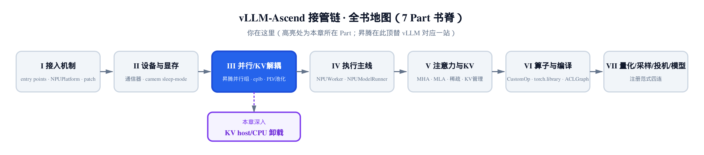
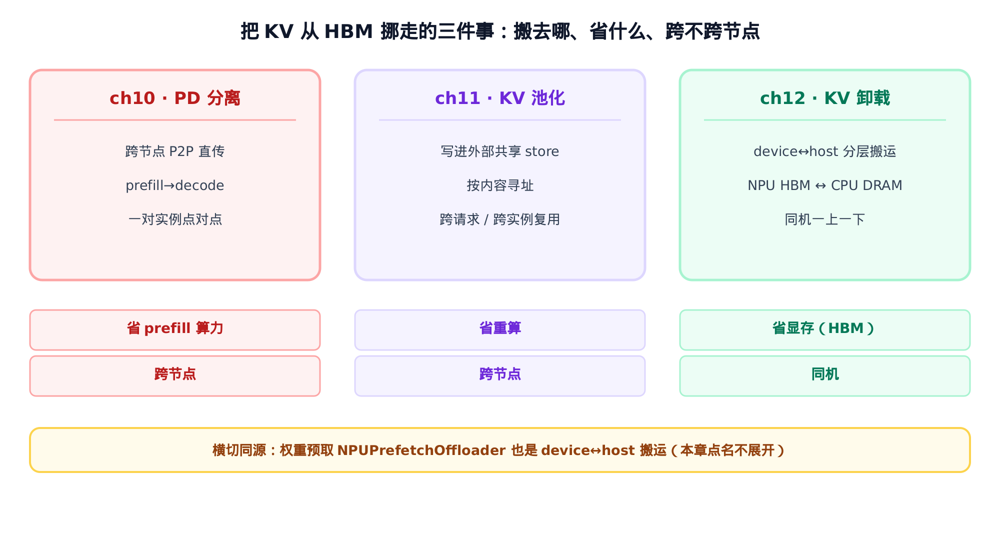
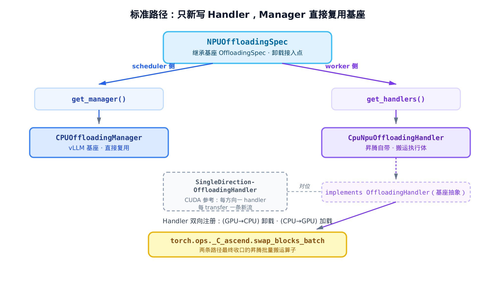
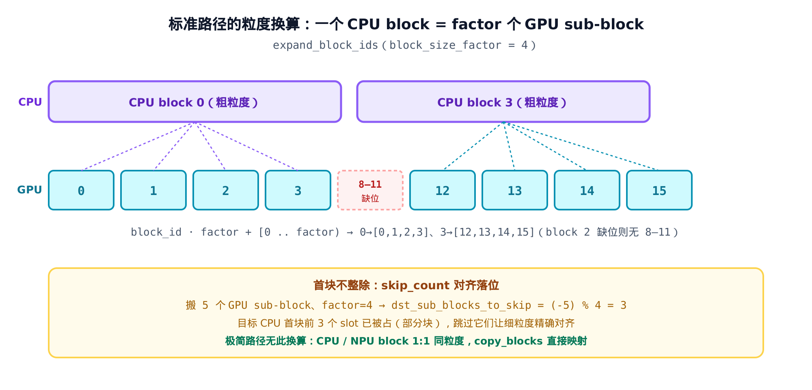
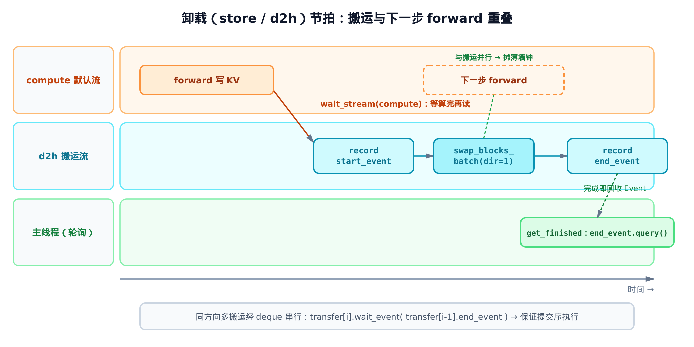
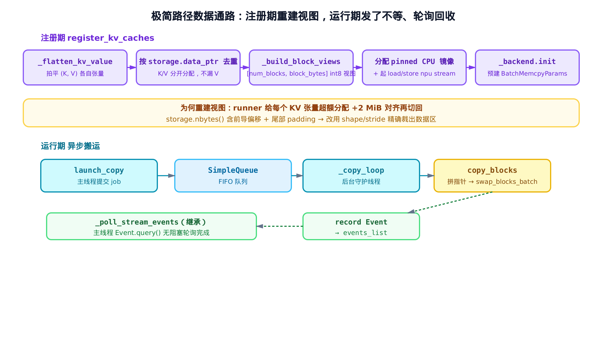

# 第 12 章 KV 卸载：host/CPU 分层与 OffloadingHandler 对位



> 上一章：把 KV 写进按内容寻址的共享池，跨请求复用。
> 本章：把 KV 往 host / CPU 卸载一层，腾出 NPU 显存。
> 下一章：从单卡机制转向整机部署的工程拼装。

[上一章](../ch11-kv-pooling-ascend-store/narrative/chapter.md)结尾我们留了一个问题：池子和直传都还有一个共同前提——KV 得先有地方放。NPU 显存（HBM）寸土寸金，当本地放不下、又还没值得写进远端池的时候，KV 该往哪儿退一步？

答案是：往**下**退一步，退到 host 的 CPU 内存（DRAM）里。这就是本章的主题——**KV 卸载（offloading）**。它和前两章是并列的第三件事，但省的东西完全不同。把这三件事的边界点清楚，是读懂这一章的第一步。

整套卸载代码住在两个目录下：标准路径以 `vllm_ascend/kv_offload/npu.py` 为入口，极简路径以 `vllm_ascend/simple_kv_offload/worker.py` 为入口。两条路径有意思的地方在于——它们几乎不重写卸载的「大脑」，只换掉真正碰硬件的那一小段搬运原语。这是 vllm-ascend「最小覆写」插件哲学在卸载子系统的又一次现身。

## 12.1 三件事的边界：搬去哪、省什么、跨不跨节点

先把三章摆在一起。它们都在做同一件粗事——**把 KV 从 HBM 里挪走**——但目的、拓扑、省的资源各不相同。



> *图注：三者都把 KV 移出 HBM，但落点不同。PD 分离跨节点直传、省 prefill 算力；KV 池化写进外部 store、省重算；KV 卸载在同机 device↔host 之间分层搬运、省的是显存本身。底部点名一个同源旁路：权重预取也是一次 device↔host 搬运。*

[第 10 章](../ch10-pd-disaggregation-mooncake/narrative/chapter.md)的 PD 分离，把 prefill 算出的 KV **跨节点点对点**直发给 decode 实例，省的是 prefill 那段算力。[第 11 章](../ch11-kv-pooling-ascend-store/narrative/chapter.md)的 KV 池化，把 KV 写进一个**按内容寻址的外部 store**，谁的前缀撞上谁就捞回来，省的是重算。

这一章的卸载，搬运的方向是**同机的一上一下**：NPU 的 HBM ↔ host 的 CPU DRAM。它既不跨节点，也不为了复用——它就是为了**省显存**。当 HBM 装不下这么多活跃 block 时，把暂时用不到的 block 下沉到便宜得多、也大得多的 host 内存里；要用了再搬回来。代价是一次 device↔host 搬运的延迟和 host 带宽，收益是 HBM 能装下更长的上下文、更大的 batch。

这条边界很关键，一句话钉死：

> **卸载 = device↔host 分层搬运，省的是显存，不是重算、也不是跨节点搬运。**

记住这句，下面所有代码都是在把它做实。顺带点一个旁路：权重预取 `NPUPrefetchOffloader`（`vllm_ascend/model_executor/offloader/prefetch.py`）也是一次 device↔host 搬运——只不过搬的是模型权重而非 KV。它和本章同源，但不在本章展开，[§12.10](#1210-两条路径收口同一个昇腾算子) 收尾时再点一句。

## 12.2 标准路径的接入点：只新写 Handler，Manager 直接复用

先看标准路径。它要接进 vLLM 既有的卸载框架 `vllm.v1.kv_offload`。这个框架把卸载拆成两半：

- **Manager**（调度侧）：管记账——哪些 block 在 CPU、哪些在 NPU、该搬什么、命中查询、事件上报。这套逻辑**与硬件无关**。
- **Handler**（worker 侧）：真正碰显存的那一段——把字节从 device 搬到 host 或反过来。这一段**绕不开硬件**。

昇腾的判断很干脆：Manager 一行不改，直接复用基座的 `CPUOffloadingManager`；只有 Handler 需要替换成自己的实现。接入点是一个继承基座 `OffloadingSpec` 的小类 `NPUOffloadingSpec`。`OffloadingSpec` 是个工厂式抽象：它持有两侧都要的公共配置（block 尺寸、CPU 容量等），并在调度端、worker 端分别造出 Manager 和 Handler——子类只要填这两条产线即可。

```python
# vllm_ascend/kv_offload/npu.py:L16
class NPUOffloadingSpec(OffloadingSpec):
    def __init__(self, vllm_config: VllmConfig, kv_cache_config: KVCacheConfig | None = None):
        super().__init__(vllm_config, kv_cache_config)

        num_cpu_blocks = self.extra_config.get("num_cpu_blocks")
        if not num_cpu_blocks:
            raise Exception("num_cpu_blocks must be specified in kv_connector_extra_config")
        self.num_cpu_blocks: int = num_cpu_blocks

        # scheduler-side
        self._manager: OffloadingManager | None = None

        # worker-side
        self._handler: OffloadingHandler | None = None

    def get_manager(self) -> OffloadingManager:
        if not self._manager:
            kv_events_config = self.vllm_config.kv_events_config
            enable_events = kv_events_config is not None and kv_events_config.enable_kv_cache_events
            assert len(self.gpu_block_size) == 1
            gpu_block_size = self.gpu_block_size[0]
            offloaded_block_size = gpu_block_size * self.block_size_factor
            self._manager = CPUOffloadingManager(
                block_size=offloaded_block_size,
                num_blocks=self.num_cpu_blocks,
                enable_events=enable_events,
            )
        return self._manager

    def get_handlers(
        self,
        kv_caches: dict[str, torch.Tensor],
        attn_backends: dict[str, type[AttentionBackend]],
    ) -> Iterator[tuple[type[LoadStoreSpec], type[LoadStoreSpec], OffloadingHandler]]:
        if not self._handler:
            assert len(self.gpu_block_size) == 1
            gpu_block_size = self.gpu_block_size[0]
            self._handler = CpuNpuOffloadingHandler(
                attn_backends=attn_backends,
                gpu_block_size=gpu_block_size,
                cpu_block_size=gpu_block_size * self.block_size_factor,
                num_cpu_blocks=self.num_cpu_blocks,
                gpu_caches=kv_caches,
            )

        assert self._handler is not None
        yield GPULoadStoreSpec, CPULoadStoreSpec, self._handler
        yield CPULoadStoreSpec, GPULoadStoreSpec, self._handler
```

这段代码的形状值得画出来——同一个 Spec，两个方法各通向一端：



> *图注：`get_manager()` 返回基座 `CPUOffloadingManager`（蓝，直接复用）；`get_handlers()` 造昇腾自带的 `CpuNpuOffloadingHandler`（紫，实现基座 `OffloadingHandler` 抽象），并把同一个 handler 双向注册。虚线框是基座 CUDA 参考实现 `SingleDirectionOffloadingHandler`，用作对位。底部黄框是两条路径最终收口的搬运算子。*

三个细节要点透：

**`get_manager` 返回的是基座类，不是昇腾类。** `CPUOffloadingManager` 来自 `vllm.v1.kv_offload.cpu.manager`，原样复用。它要的参数里 `block_size = gpu_block_size * self.block_size_factor`——也就是说，**CPU 侧的 block 比 GPU 侧大**（大 `block_size_factor` 倍）。这个比例是后面所有粒度换算的源头，[§12.4](#124-粒度换算expand_block_ids-与-block_size_factor) 专门讲。`enable_events` 只是把 KV-cache-event 上报的开关透传给基座 Manager，与搬运机制无关。

**`get_handlers` 把同一个 handler 注册了两次。** 末尾两行 `yield` 是关键：

- `yield GPULoadStoreSpec, CPULoadStoreSpec, self._handler` —— 注册「源是 GPU、目标是 CPU」这个方向，也就是**卸载（store）**。
- `yield CPULoadStoreSpec, GPULoadStoreSpec, self._handler` —— 注册「源是 CPU、目标是 GPU」，也就是**加载（load）**。

注意两次 yield 的第三个元素是**同一个** `self._handler`。这是昇腾和基座的第一处结构差异。看基座 CUDA 参考实现的类头就明白：

```python
# vllm/v1/kv_offload/cpu/gpu_worker.py:L111
class SingleDirectionOffloadingHandler(OffloadingHandler):
    """
    SingleDirectionOffloadingHandler handles transfers for a single direction,
    either CPU->GPU or GPU->CPU.
    Transfers are guaranteed to be executed in order of their submission.
    Each transfer uses a unique CUDA stream, and its stream will start
    executing only after the streams of previous transfers have finished.
    """
    # … 省略：__init__ 签名与 docstring …
```

基座顾名思义——`SingleDirection`，**每个方向一个 handler**，且「每个 transfer 用一条独立 CUDA stream，新流等前面所有流跑完才开」。昇腾则把双向合进一个 handler、每方向只留一条常驻流，用 deque 串行化。语义（提交序执行）一样，但省掉了频繁建流。下一节看这个 handler 的内部，会明白它为什么能这么做。

**`num_cpu_blocks` 必须显式给定。** `__init__` 一开头就检查：拿不到 `num_cpu_blocks` 直接抛异常。它决定 CPU 侧能容纳多少 block，是卸载的容量上限，必须经 `kv_connector_extra_config` 配进来。

## 12.3 搬运执行体的家底：两条流、两个 deque、一池 Event

`CpuNpuOffloadingHandler` 是标准路径的主角。它实现基座 `OffloadingHandler` 的三个原语：`transfer_async`（提交一次搬运）、`get_finished`（轮询哪些完成了）、`wait`（阻塞等某些 job）。先看它的 `__init__` 摆开的家底：

```python
# vllm_ascend/kv_offload/cpu_npu.py:L54
class CpuNpuOffloadingHandler(OffloadingHandler):
    def __init__(
        self,
        gpu_block_size: int,
        cpu_block_size: int,
        num_cpu_blocks: int,
        gpu_caches: dict[str, torch.Tensor],
        attn_backends: dict[str, type[AttentionBackend]],
    ):
        assert cpu_block_size % gpu_block_size == 0
        self.block_size_factor = cpu_block_size // gpu_block_size

        # npu streams for npu->cpu and cpu->npu
        self.d2h_stream = torch.npu.Stream()
        self.h2d_stream = torch.npu.Stream()

        # Ordered queue of in-flight transfers per direction
        self._d2h_transfers: deque[Transfer] = deque()
        self._h2d_transfers: deque[Transfer] = deque()

        # Reusable event pool to avoid allocation overhead
        self._event_pool: list[torch.npu.Event] = []
```

四样东西，对应四个设计决策：

- **`block_size_factor = cpu_block_size // gpu_block_size`**：CPU block 是 GPU block 的整数倍。这个整除断言是粒度换算成立的前提。
- **两条常驻 npu stream**：`d2h_stream`（device→host，卸载用）和 `h2d_stream`（host→device，加载用）。注意是**每方向常驻一条**，不是每次搬运新建。这又是和基座的差异——基座 `SingleDirectionOffloadingHandler` 每个 transfer 开一条新 CUDA stream，昇腾改成固定两条流复用，省掉频繁建流的开销。
- **两个 deque**：`_d2h_transfers` / `_h2d_transfers`，分方向记录**在途**的搬运。既然每方向只有一条流，就得用一个有序队列把同方向的多次搬运串起来——deque 的顺序就是提交顺序，这是后面 FIFO 轮询的基础。
- **一个 Event 池** `_event_pool`：搬运用 Event 标记起止，用完回收复用，避免反复分配。

接着 `__init__` 干两件实事：分配 CPU 镜像张量、预算每个 block 的指针与字节数。

```python
# vllm_ascend/kv_offload/cpu_npu.py:L77
        pin_memory = is_pin_memory_available()

        # allocate cpu tensors
        # … 省略：logger.info 统计 …
        self.npu_tensors: list[torch.Tensor] = []
        self.cpu_tensors: list[torch.Tensor] = []
        for layer_name, gpu_tensor in gpu_caches.items():
            self.npu_tensors.append(gpu_tensor)

            gpu_shape = gpu_tensor[0].shape

            num_blocks_idx = 0
            cpu_shape = list(gpu_shape)
            cpu_shape[num_blocks_idx] = num_cpu_blocks * self.block_size_factor

            # … 省略：logger.debug …
            self.cpu_tensors.append(
                (
                    torch.zeros(cpu_shape, dtype=gpu_tensor[0].dtype, device="cpu", pin_memory=pin_memory),
                    torch.zeros(cpu_shape, dtype=gpu_tensor[0].dtype, device="cpu", pin_memory=pin_memory),
                )
            )
```

每层在 NPU 上的 KV 是一个 `(key_cache, value_cache)` 元组，CPU 侧也分配一对镜像张量。关键在 `cpu_shape` 的第 0 维：`num_cpu_blocks * self.block_size_factor`。CPU 张量虽然在调度账本里以「粗粒度 CPU block」计数（共 `num_cpu_blocks` 个），但物理存放是按**细粒度（GPU 粒度）sub-block** 摊开的——所以第 0 维要乘上 `block_size_factor`。镜像张量用 `pin_memory=True` 分配：pinned（页锁定）内存让 DMA 走零拷贝路径，host↔device 带宽显著高于非 pinned。

最后预算指针表：

```python
# vllm_ascend/kv_offload/cpu_npu.py:L110
        # Pre-compute base pointers and block sizes for batch copies.
        # In vllm-ascend, each layer's KV cache is stored as a tuple
        # (key_cache, value_cache), so we flatten them into individual
        # sub-tensors for batching: [layer0_key, layer0_value, ...].
        npu_base_ptrs = []
        cpu_base_ptrs = []
        block_sizes_in_bytes = []

        for npu_tensor, cpu_tensor in zip(self.npu_tensors, self.cpu_tensors):
            for kv_idx in range(2):  # 0=key, 1=value
                npu_t = npu_tensor[kv_idx]
                cpu_t = cpu_tensor[kv_idx]
                npu_base_ptrs.append(npu_t.data_ptr())
                cpu_base_ptrs.append(cpu_t.data_ptr())
                # block size in bytes = stride of dim 0 (elements) * element size
                block_sizes_in_bytes.append(npu_t.stride(0) * npu_t.element_size())

        self._npu_base_ptrs = np.array(npu_base_ptrs, dtype=np.int64)
        self._cpu_base_ptrs = np.array(cpu_base_ptrs, dtype=np.int64)
        self._block_size_in_bytes_arr = np.array(block_sizes_in_bytes, dtype=np.int64)
        # Total bytes per block across all sub-tensors (for transfer stats)
        self._total_bytes_per_block = int(self._block_size_in_bytes_arr.sum())
```

这里把每层的 `(key, value)` **拍平**成一串独立子张量 `[layer0_key, layer0_value, layer1_key, layer1_value, …]`，对每个子张量记下三件事：NPU 侧基址、CPU 侧基址、每个 block 的字节数（`stride(0) * element_size()`）。这三个 numpy 数组是后面拼批量搬运指针的原料。为什么要拍平成「子张量列表」？因为最终的搬运算子吃的是一串平铺的 `(src, dst, size)` 三元组，一次把所有层、所有 K/V 全搬掉——拍平就是为了这次批量。

## 12.4 粒度换算：expand_block_ids 与 block_size_factor

上一节埋了个伏笔：CPU block 比 GPU block 大 `block_size_factor` 倍。搬运时给的 block id 是**粗粒度**的 CPU block 编号，但实际要搬的是**细粒度**的 GPU sub-block。`expand_block_ids` 就是这个粗→细的展开器：

```python
# vllm_ascend/kv_offload/cpu_npu.py:L22
def expand_block_ids(
    block_ids: np.ndarray,
    block_size_factor: int,
    output: np.ndarray,
    skip_count: int = 0,
):
    """
    Convert a list of block IDs to a list of matching block ids,
    assuming each block is composed of actual block_size_factor blocks.
    Outputs to output tensor.
    The first skip_count blocks will be skipped.
    Note that skip_count must be less than block_size_factor.

    For example, if block_ids = [0, 1, 3] and block_size_factor =  4,
    then it yields [0, 1, 2, 3, 4, 5, 6, 7, 12, 13, 14, 15]
    since 0 maps to [0, 1, 2, 3]
    1 maps to [4, 5, 6, 7]
    and 3 maps to [12, 13, 14, 15]
    """
    assert skip_count < block_size_factor

    # Vectorized: compute all sub-block IDs at once
    bases = block_ids * block_size_factor
    offsets = np.arange(block_size_factor)
    # shape: (num_blocks, block_size_factor) -> ravel to 1D
    all_ids = (bases[:, None] + offsets[None, :]).ravel()
    # Skip the first skip_count elements (only affects first block)
    if skip_count > 0:
        all_ids = all_ids[skip_count:]
    output[: len(all_ids)] = all_ids
```

算法只有一行实质：`block_id * factor + [0, 1, …, factor)`。粗粒度 block `b` 展开成连续的 `factor` 个细粒度 sub-block。docstring 给的例子就是逐字的数值追踪——把它摊成一张表：

| 粗粒度 block | `* factor`（=4） | 展开的细粒度 sub-block |
|---|---|---|
| 0 | 0 | 0, 1, 2, 3 |
| 1 | 4 | 4, 5, 6, 7 |
| 3 | 12 | 12, 13, 14, 15 |

注意 block 2 被跳过了（输入里没有 2），所以输出里没有 8–11——展开是**逐 block 独立**的，不要求连续。



> *图注：上排两个粗粒度 CPU block（取 0 和 3，故意非连续），下排各展开成 4 个细粒度 GPU sub-block——0→[0,1,2,3]、3→[12,13,14,15]，连线即 expand_block_ids 的映射。中间 8–11 缺位（block 2 没被搬），正演示「展开逐 block 独立、不要求连续」。底部黄框演示 skip_count：搬的 sub-block 数不是 factor 整数倍时，目标首块要跳过几个 slot 对齐。极简路径无此换算——它的 CPU/NPU block 是 1:1 同粒度。*

`skip_count` 处理一个边界情况：当被搬的 sub-block 数**不是 `factor` 整数倍**时，目标 CPU block 的第一个 slot 可能已被占（这是个「部分块」），新数据得从该 block 的第 `skip_count` 个 slot 起填。怎么算 skip 数，下一节在 `transfer_async` 里看。

## 12.5 分层搬运的节拍：transfer_async

到了标准路径的心脏。`transfer_async` 把一次搬运请求翻译成「判方向 → 展开 block id → 拼指针 → 流序编排+发算子」四步。逐段拆。

**第一步：判方向，定参数。** 一次 transfer 的 `spec` 是 `(src_spec, dst_spec)` 一对。按 src 是 CPU 还是 GPU，分流到 h2d 或 d2h：

```python
# vllm_ascend/kv_offload/cpu_npu.py:L142
    def transfer_async(self, job_id: int, spec: TransferSpec) -> bool:
        src_spec, dst_spec = spec
        if isinstance(src_spec, CPULoadStoreSpec):
            assert isinstance(dst_spec, GPULoadStoreSpec)
            stream = self.h2d_stream
            src_base_ptrs = self._cpu_base_ptrs
            dst_base_ptrs = self._npu_base_ptrs
            src_block_size_factor = self.block_size_factor
            dst_block_size_factor = 1
            is_d2h = False
            transfers = self._h2d_transfers
        else:
            assert isinstance(src_spec, GPULoadStoreSpec)
            assert isinstance(dst_spec, CPULoadStoreSpec)
            stream = self.d2h_stream
            src_base_ptrs = self._npu_base_ptrs
            dst_base_ptrs = self._cpu_base_ptrs
            src_block_size_factor = 1
            dst_block_size_factor = self.block_size_factor
            is_d2h = True
            transfers = self._d2h_transfers
```

这就是上一节说的「双向合一」如何工作：同一个 handler，靠 `isinstance` 判 src 类型，挑出对应的 stream、基址表、deque。注意 `block_size_factor` 总是落在 **CPU 那一侧**——CPU 侧是粗粒度（factor），GPU 侧是细粒度（1）。卸载时 src=NPU（factor=1）、dst=CPU（factor）；加载时反过来。

**第二步：算 skip、展开 block id。**

```python
# vllm_ascend/kv_offload/cpu_npu.py:L164
        src_blocks = src_spec.block_ids
        dst_blocks = dst_spec.block_ids
        assert src_blocks.ndim == 1
        assert dst_blocks.ndim == 1

        dst_sub_blocks_to_skip = -src_blocks.size % dst_block_size_factor
        src_sub_block_count = src_blocks.size * src_block_size_factor

        assert src_sub_block_count == dst_blocks.size * dst_block_size_factor - dst_sub_blocks_to_skip

        # Expand block IDs into sub-block IDs
        src_block_ids = np.empty(src_sub_block_count, dtype=np.int64)
        dst_block_ids = np.empty(src_sub_block_count, dtype=np.int64)
        expand_block_ids(src_blocks, src_block_size_factor, src_block_ids)
        expand_block_ids(dst_blocks, dst_block_size_factor, dst_block_ids, skip_count=dst_sub_blocks_to_skip)
```

`dst_sub_blocks_to_skip = -src_blocks.size % dst_block_size_factor` 是对齐公式。直觉：要搬 `src_blocks.size` 个细粒度 sub-block 到一个个粗粒度 dst block 里，若 src 数不是 factor 整数倍，目标 CPU 首块的前若干 slot 已被上一次搬运占住——新数据得跳过它们。跳过数 = `factor - (size % factor)`，也就是等价写法 `(-size) % factor`，正好给出「凑齐 factor 还差几个」。举个数值：

| `src_blocks.size` | `dst_block_size_factor` | `(-size) % factor` = skip |
|---|---|---|
| 8 | 4 | 0（整除，不跳） |
| 5 | 4 | 3（首块前 3 个 slot 已占） |
| 4 | 1 | 0（加载方向，dst=GPU factor=1，恒不跳） |

那行 `assert` 是这套对齐的正确性凭据——它要求 `src_sub_block_count == dst_blocks.size * factor - skip`，即「源细粒度总数」恰好等于「目标容量减去跳过的」。两侧 sub-block 一一配对，不多不少。

**第三步：拼指针。** 这是纯 host 端的向量化运算，可跑可验：

```python
# vllm_ascend/kv_offload/cpu_npu.py:L185
        # Build flat pointer arrays for all sub-tensors × all block pairs.
        num_pairs = src_sub_block_count
        num_sub_tensors = len(self._block_size_in_bytes_arr)
        total = num_pairs * num_sub_tensors

        bsz_col = self._block_size_in_bytes_arr[:, None]  # (T, 1)
        all_src = (src_base_ptrs[:, None] + src_block_ids[None, :] * bsz_col).ravel()
        all_dst = (dst_base_ptrs[:, None] + dst_block_ids[None, :] * bsz_col).ravel()
        all_sizes = np.broadcast_to(bsz_col, (num_sub_tensors, num_pairs)).ravel().copy()

        batch_src = torch.from_numpy(all_src)
        batch_dst = torch.from_numpy(all_dst)
        batch_sizes = torch.from_numpy(all_sizes)
```

指针算术是两条路径共用的一条公式：

$$
\mathrm{addr} = \mathrm{base\_ptr} + \mathrm{block\_id} \times \mathrm{bytes\_per\_block}
$$

numpy 广播把它一次算完：`(T, 1)` 的基址列加上 `(1, num_pairs)` 的偏移行，得到 `(T, num_pairs)` 的地址矩阵，`ravel()` 拍平成一维。`T = num_sub_tensors`（所有层的 K 和 V），`num_pairs` 是这次搬的 sub-block 对数。所以一次 transfer 拼出的描述符总数是：

$$
N_{\mathrm{desc}} = T \times \mathrm{num\_pairs}
$$

举例：48 层、每层 K/V 两份，`T = 96`；这次搬 8 个 sub-block，`num_pairs = 8`，则 `N_desc = 768` 个 `(src, dst, size)` 三元组——**一次** `swap_blocks_batch` 调用全带走，host 端零 Python 循环，全靠 numpy 广播。

**第四步：流序编排 + 发算子——分层搬运的节拍。** 这是本章最该讲透的地方（发算子就在这个流上下文里收尾，不另起一步）：

```python
# vllm_ascend/kv_offload/cpu_npu.py:L202
        start_event = self._get_event()
        end_event = self._get_event()

        if is_d2h:
            # Wait for model computation to finish before reading NPU data
            stream.wait_stream(torch.npu.current_stream())
        if transfers:
            # Ensure this transfer starts only after the previous one completes
            last_transfer = transfers[-1]
            stream.wait_event(last_transfer.end_event)

        with torch.npu.stream(stream):
            start_event.record(stream)
            if total > 0:
                direction = 0 if not is_d2h else 1
                torch.ops._C_ascend.swap_blocks_batch(batch_src, batch_dst, batch_sizes, direction)
            end_event.record(stream)

        transfers.append(
            Transfer(
                job_id=job_id,
                stream=stream,
                start_event=start_event,
                end_event=end_event,
                num_bytes=src_sub_block_count * self._total_bytes_per_block,
            )
        )

        return True
```

两道同步点，各管一件事：

- **`stream.wait_stream(current_stream())`，只在 d2h（卸载）时插。** 这里 `torch.npu.current_stream()` 返回当前 task 的默认计算流（compute stream）——forward 就在这条流上执行、把 KV 写进 HBM。卸载要**读** NPU 上刚算出的 KV——必须等这条 compute stream 上的 forward 把 KV 写完，否则读到半成品。这就是分层搬运节拍的第一拍：搬运流先让一步，等算完。加载（h2d）不需要这道——它写的是 BlockPool 占住的空闲 block，没人在算它。
- **`stream.wait_event(last_transfer.end_event)`，两方向都插。** 既然每方向只有一条流，同方向的多次搬运就得串行：新 transfer 在流上等上一个 transfer 的 `end_event`，保证按提交顺序执行。`transfers[-1]` 是 deque 尾部（最近一个），新的 wait 它，再 append 进去——deque 顺序即执行顺序。

编排完才进 `torch.npu.stream(stream)` 上下文：record 起始 Event → 发 `swap_blocks_batch`（方向码 d2h=1 / h2d=0）→ record 结束 Event。注意**整段是异步的**：`record` 和算子提交都只是往流上排活，函数不等它跑完就 `return True`。最后把这次搬运打包成一个 `Transfer`（带 job_id 和起止 Event）塞进 deque。

把这套节拍画成泳道时间线：



> *图注：三条泳道——compute 默认流、d2h 搬运流、主线程。卸载先 wait_stream 等 forward 写完 KV，再在 d2h 流上 record start → swap_blocks_batch → record end；主线程稍后 query end_event 收完成。搬运挂在独立流上，与下一步 forward 重叠。底部条说明同方向多搬运经 deque + wait_event 串成有序链。*

**为什么这套节拍省墙钟（wall-clock）。** 搬运挂在 `d2h_stream` 上，不占默认 compute stream。所以「把这批 KV 卸到 host」和「下一步 forward」可以在两条流上**重叠**跑——HBM 的释放和后续计算并行，而不是串行等搬运结束。这是「异步分层搬运」相比「同步搬运」省时间的根本来源。代价只是一次额外搬运的延迟，而它被重叠摊薄了。

## 12.6 发了不等：get_finished 的 FIFO 轮询与 wait

`transfer_async` 提交即返回，那谁来收尾？`get_finished` 每拍被主循环调一次，**非阻塞**地探测哪些搬运完成了：

```python
# vllm_ascend/kv_offload/cpu_npu.py:L232
    def get_finished(self) -> list[TransferResult]:
        results: list[TransferResult] = []
        for transfers, transfer_type in [
            (self._d2h_transfers, ("NPU", "CPU")),
            (self._h2d_transfers, ("CPU", "NPU")),
        ]:
            while transfers and transfers[0].end_event.query():
                transfer = transfers.popleft()
                transfer_time = transfer.start_event.elapsed_time(transfer.end_event) * 1e-3
                results.append(
                    TransferResult(
                        job_id=transfer.job_id,
                        success=True,
                        transfer_size=transfer.num_bytes,
                        transfer_time=transfer_time,
                        transfer_type=transfer_type,
                    )
                )
                self._recycle_event(transfer.start_event)
                self._recycle_event(transfer.end_event)
        return results

    def wait(self, job_ids: set[int]) -> None:
        """
        Wait (block) until all specified transfer jobs are completed.
        """
        for transfers in (self._d2h_transfers, self._h2d_transfers):
            for transfer in transfers:
                if transfer.job_id in job_ids:
                    transfer.end_event.synchronize()
```

关键是 `while transfers and transfers[0].end_event.query()`——只看队**头**，用 `query()`（非阻塞，返回 True/False）而不是 `synchronize()`（阻塞）。完成一个就 `popleft` 弹出、回填 `TransferResult`、把两个 Event 回收进池。队头没完成就停——不往后看。

**为什么只看队头就够、不会漏报也不会错报。** 这是个简短的归纳论证，靠两个事实：

1. deque 里的顺序 = 提交顺序（`transfer_async` 总是 append 到尾、wait 前一个）。
2. 同方向同一条流，且每个 transfer `wait_event` 了前一个的 end_event——所以流上**严格按提交序执行**，前一个不完成，后一个的 `end_event` 不可能先到。

于是队头是最老的搬运：**队头完成 ⟹ 它之前的都已完成**（其实它前面没有了），**队头未完成 ⟹ 它之后的更不可能完成**。所以「从队头连续弹出已完成项、遇到第一个未完成就停」既不会漏掉任何已完成的，也不会把未完成的误报成完成。把两拍轮询摆成表（设 d2h 队列里有 job 0、1 两个在途）：

| 轮次 | 队列状态（头→尾） | `query` 队头 0 | 动作 | 返回 |
|---|---|---|---|---|
| 第 1 拍 | [0, 1] | False（还在搬） | 不弹出，停 | `[]` |
| 第 2 拍 | [0, 1] | True | 弹 0；再 query 1=True，弹 1；队空停 | `[job0, job1]` |

`wait(job_ids)` 是另一条路：它对命中的 job `synchronize()`——**阻塞**到完成。两者的对照很干净：`get_finished` 是「发了不等、轮询回收」的常态节拍，`wait` 是「我现在就必须要这块数据」的强制同步，只在必要时用。Event 用 `query` 还是 `synchronize`，就是异步与同步的分界。

到这里标准路径就齐了：Spec 接入 → Handler 持家 → expand 换粒度 → transfer_async 打节拍 → get_finished 收尾。下面换一条更轻的路径。

## 12.7 极简路径：最小覆写的 SimpleCPUOffloadNPUWorker

vLLM 还有一套更简单的卸载框架 `vllm.v1.simple_kv_offload`——没有粗细粒度换算（CPU/NPU block 1:1 同粒度），就是「把 block 原样搬上搬下」。昇腾对它的接入更是「最小覆写」的极致：整个 worker 只覆写**两个**方法，其余全继承。

```python
# vllm_ascend/simple_kv_offload/worker.py:L55
class SimpleCPUOffloadNPUWorker(SimpleCPUOffloadWorker):
    """NPU-flavored ``SimpleCPUOffloadWorker``.

    The inherited ``gpu_kv_caches`` field holds NPU caches on this
    platform — kept as-is for parent-class compatibility.
    """

    def __init__(
        self,
        vllm_config: VllmConfig,
        kv_cache_config: "KVCacheConfig | None",
        cpu_capacity_bytes: int,
    ) -> None:
        super().__init__(vllm_config, kv_cache_config, cpu_capacity_bytes)
        # Replace the CUDA backend created by ``super().__init__``.
        self._backend = NPUDmaCopyBackend()
```

`__init__` 只做一件事：调完父类构造后，把父类建好的 CUDA 拷贝后端**换成** `NPUDmaCopyBackend`。其余 step 期的状态机——`start_load_kv`、`wait_for_save`、`get_finished`、`handle_preemptions`、`_poll_stream_events` 等——全部原样继承，因为它们与硬件无关。差异只在两点：换搬运后端，和按 NPU 内存布局重建 block view。后者是另一个覆写方法 `register_kv_caches`。



> *图注：上半注册期 register_kv_caches 的链条——拍平 (K,V)、按 storage 去重、重建 [num_blocks, block_bytes] 视图、分配 pinned 镜像、init 后端。下半运行期——launch_copy 投进 FIFO 队列，后台线程取出在专用流上 copy_blocks，record Event 进 events_list，主线程无阻塞轮询。黄框点明：为何不能用 storage.nbytes() 量视图。*

`register_kv_caches` 要绕开 NPU 的两个「现实」，逐段看：

```python
# vllm_ascend/simple_kv_offload/worker.py:L75
    def register_kv_caches(
        self,
        kv_caches: dict[str, torch.Tensor | tuple | list],
    ) -> None:
        if not kv_caches:
            # … 省略：logger.warning 空缓存告警 …
            return

        first_tensor = _flatten_kv_value(next(iter(kv_caches.values())))[0]
        self.device = first_tensor.device

        assert self.kv_cache_config is not None
        num_blocks = self.kv_cache_config.num_blocks

        # Deduplicate by untyped_storage().data_ptr(). On Ascend, K and V
        # live in *separate* allocations, so we must iterate every
        # sub-tensor — taking only ``value[0]`` would silently drop V.
        unique_caches: dict[str, torch.Tensor] = {}
        seen_ptrs: set[int] = set()
        for layer_name, value in kv_caches.items():
            for sub_idx, tensor in enumerate(_flatten_kv_value(value)):
                storage = tensor.untyped_storage()
                ptr = storage.data_ptr()
                if ptr in seen_ptrs:
                    continue
                seen_ptrs.add(ptr)

                key = layer_name if sub_idx == 0 else f"{layer_name}.{sub_idx}"
                unique_caches.update(self._build_block_views(key, tensor, num_blocks))
```

**现实一：NPU 上 K 和 V 各自独立 storage。** 一层的 `kv_caches[name]` 是一个 `(k_cache, v_cache)` 元组，在昇腾平台上这两个张量落在两块独立分配里（这是该平台 KV 的既定布局，与基座 CUDA 版 K、V 共享一块 storage 不同——这里只就这一事实展开，不臆测底层动机）。于是基座 CUDA 版可以只取代表张量，昇腾**不能**——只取 `value[0]` 会静默丢掉整个 V cache。所以这里 `_flatten_kv_value` 把元组拍平，对每个子张量都建视图，再按 `storage.data_ptr()` 去重（防同一块分配被多层别名引用时重复建）。

`_flatten_kv_value` 本身很短，但责任重大：

```python
# vllm_ascend/simple_kv_offload/worker.py:L39
def _flatten_kv_value(
    value: torch.Tensor | tuple | list,
) -> list[torch.Tensor]:
    # … 省略：docstring …
    if isinstance(value, torch.Tensor):
        return [value]
    assert isinstance(value, (tuple, list)), f"unexpected kv_caches value type: {type(value)}"
    return [t for t in value if isinstance(t, torch.Tensor)]
```

继续 `register_kv_caches` 的下半段——算容量、分配镜像、起流、init 后端：

```python
# vllm_ascend/simple_kv_offload/worker.py:L114
        per_tensor_bpb = [t.stride(0) * t.element_size() for t in unique_caches.values()]
        total_bytes_per_block = sum(per_tensor_bpb)
        self.num_cpu_blocks = max(1, self.cpu_capacity_bytes // total_bytes_per_block)
        # … 省略：logger.info 容量统计 …

        pin_memory = is_pin_memory_available()
        # … 省略：logger.warning pin_memory 不可用 …

        self.gpu_kv_caches = unique_caches
        self.cpu_kv_caches = {
            name: torch.zeros(
                (self.num_cpu_blocks,) + tuple(t.shape[1:]),
                dtype=t.dtype,
                device="cpu",
                pin_memory=pin_memory,
            )
            for name, t in unique_caches.items()
        }

        # torch.npu does NOT expose Stream.priority_range() / priority= kwarg,
        # so use plain transfer streams (no low-priority hint).
        self.load_stream = torch.npu.Stream()
        self.store_stream = torch.npu.Stream()
        self._backend.init(
            self.gpu_kv_caches,
            self.cpu_kv_caches,
            self.device,
            self.load_stream,
            self.store_stream,
        )
```

`num_cpu_blocks = max(1, cpu_capacity_bytes // total_bytes_per_block)`——CPU 能放多少 block，由配的容量除以每 block 字节数决定，`max(1, …)` 保证至少一个、不为零。这里还有两处和基座的差异，对照基座同一段就清楚：

```python
# vllm/v1/simple_kv_offload/worker.py:L162
            # Allocate non-pinned first, then pin via cudaHostRegister to
            # bypass PyTorch's CUDACachingHostAllocator which rounds up to
            # the next power of 2 (e.g. 100 GB -> 128 GB).
            tensor = torch.zeros(cpu_shape, dtype=gpu_tensor.dtype, device="cpu")
            if pin_memory:
                pin_tensor(tensor)
            # … 省略：存入 cpu_kv_caches …

        # Use lowest priority so KV cache I/O yields to compute streams.
        low_pri, _ = torch.cuda.Stream.priority_range()
        self.load_stream = torch.cuda.Stream(priority=low_pri)
        self.store_stream = torch.cuda.Stream(priority=low_pri)
```

两处差异，拆开看。

其一，pinned 内存的拿法。基座先非 pinned 分配，再 `cudaHostRegister` 绕开 PyTorch host 分配器的「2 的幂上取整」（100 GB 会被取到 128 GB）。昇腾没有 `cudaHostRegister`，直接 `pin_memory=True` 分配。

其二，stream 优先级。基座用 `Stream.priority_range()` 拿最低优先级，让 KV I/O 给 compute 让路。`torch.npu` 不暴露这个 API（调了会 `RuntimeError`），所以昇腾只能用普通 stream。丢的只是「始终让路」这个**软调度提示**——搬运仍挂在独立流上、仍和 forward 重叠，不影响正确性。

## 12.8 为什么卸载要重建 block view

`register_kv_caches` 里那句 `self._build_block_views(...)` 是极简路径最该讲透的细节。**现实二**就在这里：NPU 上 KV 张量的物理布局，不能直接拿来当 block 网格用。

```python
# vllm_ascend/simple_kv_offload/worker.py:L160
    @staticmethod
    def _build_block_views(
        key: str,
        tensor: torch.Tensor,
        num_blocks: int,
    ) -> dict[str, torch.Tensor]:
        """Return ``{name: [num_blocks, block_bytes] int8 view}`` for one tensor.

        Sizes views from the tensor's own metadata, NOT
        ``storage.nbytes()``. When offload is enabled,
        ``NPUModelRunner._allocate_kv_cache_tensors`` over-allocates
        each KV tensor by ``+alignment`` (2 MiB) and slices back with
        ``_align_memory(...)[:size]``; ``storage.nbytes()`` then
        includes alignment-driven leading offset *and* trailing
        padding that are not part of the block grid.
        """
        el = tensor.element_size()
        storage = tensor.untyped_storage()
        storage_offset_bytes = tensor.storage_offset() * el

        if tensor.ndim >= 1 and tensor.shape[0] >= num_blocks:
            # Single-segment, blocks-outermost.
            page_size_bytes = tensor.stride(0) * el
            data_bytes = num_blocks * page_size_bytes
            raw = torch.empty(0, dtype=torch.int8, device=tensor.device).set_(
                storage, storage_offset_bytes, (data_bytes,)
            )
            return {key: raw.view(num_blocks, page_size_bytes)}
```

目标是把一个布局各异的 KV 张量，规约成统一的 `[num_blocks, block_bytes]` int8 二维视图——这样批量搬运算子才能跨所有子张量等步长地搬。难点是**尺寸不能用 `storage.nbytes()` 量**：开启 offload 后，`NPUModelRunner._allocate_kv_cache_tensors` 给每个 KV 张量**超额分配 +2 MiB**、再 `_align_memory(...)[:size]` 切回。这次超额分配纯粹是为了内存对齐，多出来的字节不属于 block 网格。于是底层 storage 既有对齐造成的**前导偏移**，又有**尾部 padding**，`storage.nbytes()` 把这两段都算了进去——它一般**不是** `num_blocks` 的整数倍，拿它算 page 大小会错位。

正确做法是从张量自己的元数据精确定位：`storage_offset()` 给前导偏移，`stride(0) * element_size()` 给每个 block 的真实字节数，`set_()` 按这个尺寸裁出 `num_blocks * page_size_bytes` 的数据区，再 `view` 成二维。单段、blocks 在最外维的布局，到这里就完了。

但还有第二种布局——某些层把 K、V **堆在一个分配里**，形如 `(N, num_blocks, …)`：

```python
# vllm_ascend/simple_kv_offload/worker.py:L198
        # Multi-segment: ``(N, num_blocks, ...)`` (N=2 for K|V stacked).
        if tensor.ndim < 2 or tensor.shape[1] < num_blocks:
            raise RuntimeError(
                f"_build_block_views[{key}]: cannot locate blocks dim "
                f"(expected shape[0] or shape[1] >= {num_blocks}) in "
                f"shape {tuple(tensor.shape)}"
            )
        seg_page_size_bytes = tensor.stride(1) * el
        seg_data_bytes = num_blocks * seg_page_size_bytes
        seg_stride_bytes = tensor.stride(0) * el
        n_segments = tensor.shape[0]
        total_bytes = (n_segments - 1) * seg_stride_bytes + seg_data_bytes

        raw = torch.empty(0, dtype=torch.int8, device=tensor.device).set_(storage, storage_offset_bytes, (total_bytes,))
        segs: dict[str, torch.Tensor] = {}
        for idx in range(n_segments):
            start = idx * seg_stride_bytes
            chunk = raw[start : start + seg_data_bytes]
            segs[f"{key}.{idx}"] = chunk.view(num_blocks, seg_page_size_bytes)
        return segs
```

多段布局里 blocks 维在第 1 维（`shape[1]`），每段用 `stride(1)` 量 page、`stride(0)` 量段间跨度，按段切成 `n_segments` 个独立视图，各自 keyed。两条分支合起来，把「单段 blocks-最外」和「多段 K|V 堆叠」都规约成同一种 `[num_blocks, block_bytes]` 视图。这就是「为什么卸载要重建 block view」的完整答案：**物理布局多样，但搬运算子只认一种统一二维视图**——重建就是这道规约。定位不到 blocks 维就 `raise`，宁可炸也不静默搬错。

## 12.9 DMA 拷贝调度：一个队列、一条线程、一串 Event

`register_kv_caches` 最后 `self._backend.init(...)` 把搬运后端启起来。`NPUDmaCopyBackend` 是极简路径的搬运执行体，结构是经典的「生产者-消费者」：一个 FIFO 队列、一条后台守护线程。

```python
# vllm_ascend/simple_kv_offload/copy_backend.py:L44
    def init(
        self,
        npu_caches: dict[str, torch.Tensor],
        cpu_caches: dict[str, torch.Tensor],
        device: torch.device,
        load_stream: torch.npu.Stream,
        store_stream: torch.npu.Stream,
    ) -> None:
        self._load_stream = load_stream
        self._store_stream = store_stream
        self._device = device
        # Stores go NPU->CPU (D2H), loads go CPU->NPU (H2D).
        self._store_params = build_params(npu_caches, cpu_caches, DIRECTION_D2H)
        self._load_params = build_params(cpu_caches, npu_caches, DIRECTION_H2D)

        self._queue = queue.SimpleQueue()
        self._thread = threading.Thread(
            target=self._copy_loop,
            name="npu-kv-offload-copy",
            daemon=True,
        )
        self._thread.start()

    def launch_copy(
        self,
        src_blocks: list[int],
        dst_blocks: list[int],
        is_store: bool,
        event_idx: int,
        events_list: list[tuple[int, torch.npu.Event]],
    ) -> None:
        params = self._store_params if is_store else self._load_params
        assert params is not None and self._queue is not None
        self._queue.put((src_blocks, dst_blocks, params, is_store, event_idx, events_list))
```

`init` 预建**两份** `BatchMemcpyParams`——store 方向（D2H）和 load 方向（H2D）各一份，省得每次搬运重算基址。这个「预建描述符」长什么样？它就是一个五字段的 NamedTuple：

```python
# vllm_ascend/simple_kv_offload/npu_mem_ops.py:L21
class BatchMemcpyParams(NamedTuple):
    """Pre-computed per-tensor descriptors for batched block copy."""

    src_bases: np.ndarray  # [num_sub_tensors] int64 — data_ptr per tensor
    dst_bases: np.ndarray  # [num_sub_tensors] int64
    bpb: np.ndarray  # [num_sub_tensors] int64 — bytes per block
    num_sub_tensors: int
    direction: int  # DIRECTION_H2D or DIRECTION_D2H
```

五个字段正好对应「拼指针」要的全部原料：`src_bases`/`dst_bases` 是每个子张量的基址数组，`bpb`（bytes per block）是每个 block 的字节数，`num_sub_tensors` 是子张量总数（所有层的 K/V），`direction` 是固定下来的方向码。预建一次，之后每次搬运只需带上 block id 列表去乘加——重活在 `init` 时一次做完。然后起一条 daemon 线程跑 `_copy_loop`。`launch_copy` 是主线程的提交入口：它不真搬，只是把活打包 `put` 进 `SimpleQueue` 就返回——又一次「发了不等」。

后台线程的主循环：

```python
# vllm_ascend/simple_kv_offload/copy_backend.py:L91
    def _copy_loop(self) -> None:
        # NOTE: matches upstream cuda backend semantics — no cross-stream
        # sync. The scheduler only schedules stores for blocks whose KV
        # data is confirmed computed, and loads target GPU blocks held by
        # BlockPool.touch until load completes — both safe without a barrier.
        assert self._device is not None
        assert self._queue is not None
        assert self._load_stream is not None
        assert self._store_stream is not None
        torch.npu.set_device(self._device)

        while True:
            item = self._queue.get()
            if item is None:
                return
            (
                src_blocks,
                dst_blocks,
                params,
                is_store,
                event_idx,
                events_list,
            ) = item

            stream = self._store_stream if is_store else self._load_stream
            with torch.npu.stream(stream):
                copy_blocks(src_blocks, dst_blocks, params)
                event = torch.npu.Event()
                event.record(stream)
            events_list.append((event_idx, event))
```

循环 `get` 一个 job，按 `is_store` 挑 store/load 流，在该流上发 `copy_blocks`、record 一个 Event，把 `(event_idx, event)` 追加到 `events_list`——主线程（继承的 `_poll_stream_events`）之后用 `Event.query()` 无阻塞轮询它。拿到 `None` 毒丸就退出（`shutdown` 投的）。

那条注释点出一个重要决定：**不做跨流同步**。`_copy_loop` 读/写 KV block 时不插 barrier。安全性靠调度侧的不变量保证：store 只搬调度器**确认已算完**（`confirmed_tokens`）的 block。这里的不变量是——调度器要等某 block 的 token 实际算完、step 推进之后，才把它计入 `confirmed_tokens`，在此之前根本不会触发对它的 store；既然算完才入账，这些 block 早已跨流可见。load 写的则是 `BlockPool.touch` 占住、直到 load 完成才释放的 block——也没人会同时碰。这与基座 CUDA 后端语义一致。

底层的 `copy_blocks` 就是极简路径版的「拼指针 + 发算子」：

```python
# vllm_ascend/simple_kv_offload/npu_mem_ops.py:L71
def copy_blocks(
    src_block_ids: list[int],
    dst_block_ids: list[int],
    params: BatchMemcpyParams,
) -> None:
    n = len(src_block_ids)
    if n == 0:
        return
    assert n == len(dst_block_ids), "src/dst block counts must match"

    src_ids = np.asarray(src_block_ids, dtype=np.int64)
    dst_ids = np.asarray(dst_block_ids, dtype=np.int64)

    # Layout: (num_sub_tensors, n) flattened — contract of swap_blocks_batch.
    bpb_col = params.bpb[:, None]
    src_all = (params.src_bases[:, None] + src_ids[None, :] * bpb_col).ravel()
    dst_all = (params.dst_bases[:, None] + dst_ids[None, :] * bpb_col).ravel()
    sz_all = np.broadcast_to(bpb_col, (params.num_sub_tensors, n)).ravel().copy()

    batch_src = torch.from_numpy(src_all)
    batch_dst = torch.from_numpy(dst_all)
    batch_sizes = torch.from_numpy(sz_all)

    torch.ops._C_ascend.swap_blocks_batch(batch_src, batch_dst, batch_sizes, params.direction)
```

和标准路径 `transfer_async` 第三步的指针算术**一模一样**：`base + block_id * bytes_per_block`，numpy 广播成 `(num_sub_tensors, n)` 再拍平。唯一的区别——这里 `src_block_ids` 和 `dst_block_ids` 是直接传入的，**没有 expand**，因为极简路径 CPU/NPU block 是 1:1 同粒度，不需要粗细换算。方向码来自预建的 `params.direction`（`DIRECTION_H2D = 0` / `DIRECTION_D2H = 1`），与 C++ 绑定算子约定一致。

## 12.10 两条路径收口同一个昇腾算子

走到底，你会发现两条路径殊途同归。无论是标准路径的 `transfer_async`（`vllm_ascend/kv_offload/cpu_npu.py:L217`），还是极简路径的 `copy_blocks`（`vllm_ascend/simple_kv_offload/npu_mem_ops.py:L99`），最终那行都是：

```python
# vllm_ascend/kv_offload/cpu_npu.py:L217  ·  vllm_ascend/simple_kv_offload/npu_mem_ops.py:L99
torch.ops._C_ascend.swap_blocks_batch(batch_src, batch_dst, batch_sizes, direction)
```

这是昇腾自带的批量搬运算子（底层 `aclrtMemcpyBatchAsync`），吃四个参数：源地址数组、目标地址数组、每段字节数组、方向码。指针布局约定也一致——都是 `(num_sub_tensors, n)` 拍平、每元素 `= base_ptr + block_id * bytes_per_block`。这就是「只换碰硬件的那一小段」的字面意思：上面所有的记账、粒度换算、流序编排、视图重建，都是 Python；真正搬字节的，是这**一个** C++ 算子。两条路径、两套框架，收口到同一个点。

回到 [§12.1](#121-三件事的边界搬去哪省什么跨不跨节点) 点名的那个旁路：权重预取 `NPUPrefetchOffloader`。它和本章卸载**同源**——也是一次 device↔host 搬运，也用独立的 `torch.npu.Stream` 把搬运和计算重叠。区别只在搬的是模型权重而非 KV、方向以预取（host→device）为主。机制同根，目的不同，这里点到为止。

## 12.11 量化与小结

把这一章的几个数字落实，别停在定性：

**搬运是批量的，一次调用带走全部描述符。** 一次 transfer 拼出的描述符数是 `N_desc = T × num_pairs`，`T` 是所有层的 K/V 子张量数、`num_pairs` 是这批 sub-block 对数。host 端拼指针是 O(T × num_pairs) 的 numpy 向量化运算，**零 Python 循环**；device 端是**一次** `swap_blocks_batch` 内核启动。相比「每个 block 一次 memcpy」，批量把 N_desc 次启动压成 1 次。

**pinned 内存换带宽。** CPU 镜像用 `pin_memory=True` 分配，让 DMA 走零拷贝路径——host↔device 实测带宽显著高于非 pinned（后者要先经一次 host 内的暂存拷贝）。这是卸载吞吐的底盘。

**卸载省 HBM 的代价被异步摊薄。** 卸载省的是显存：把暂时用不到的 block 下沉 host，HBM 就能装下更长上下文 / 更大 batch。代价是 host 带宽 + 一次额外搬运延迟。但那次延迟挂在独立流上、和下一步 forward 重叠，墙钟上几乎被吃掉——这正是 §12.5 的节拍设计要换来的东西。

这一章把昇腾 KV 卸载的两条路径整个拆开了：

- **三件事的边界**：卸载是 device↔host 同机分层搬运，省显存，与 PD 分离（省算力）、KV 池化（省重算）并列。
- **标准路径**（`vllm_ascend/kv_offload/cpu_npu.py`）：`NPUOffloadingSpec` 复用基座 `CPUOffloadingManager`、只新写 `CpuNpuOffloadingHandler`；`expand_block_ids` 做粗细粒度换算，`transfer_async` 用 `wait_stream` + deque/`wait_event` 打分层搬运节拍，`get_finished` 用 `query()` FIFO 轮询收尾。
- **极简路径**（`vllm_ascend/simple_kv_offload/worker.py`）：`SimpleCPUOffloadNPUWorker` 只覆写 `__init__`（换 `NPUDmaCopyBackend`）和 `register_kv_caches`（`_build_block_views` 按 shape/stride 重建视图、绕开 2 MiB 超额对齐）；`NPUDmaCopyBackend` 用队列 + 后台线程 + Event 调度 DMA。
- **收口一处**：两条路径最终都调 `vllm_ascend/simple_kv_offload/npu_mem_ops.py` 里那个 `torch.ops._C_ascend.swap_blocks_batch`，指针布局同约定。横切同源：权重预取 `vllm_ascend/model_executor/offloader/prefetch.py` 也是一次 device↔host 搬运。

从第 10 章到这里，KV 解耦的三件事——直传、池化、卸载——都拆完了。它们各自回答「KV 该往哪儿去」的一种答案：发给配对实例、写进共享池、下沉到 host。下一章我们离开单卡机制，转向把这些零件拼成一台能跑起来的整机部署。
