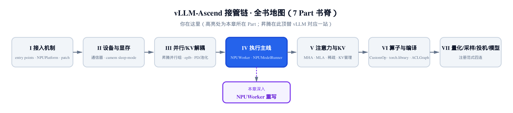
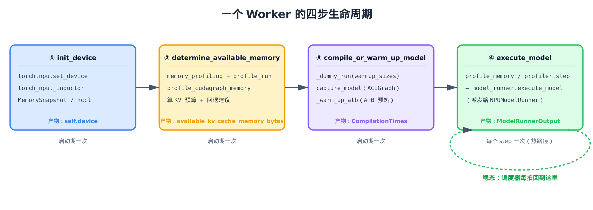
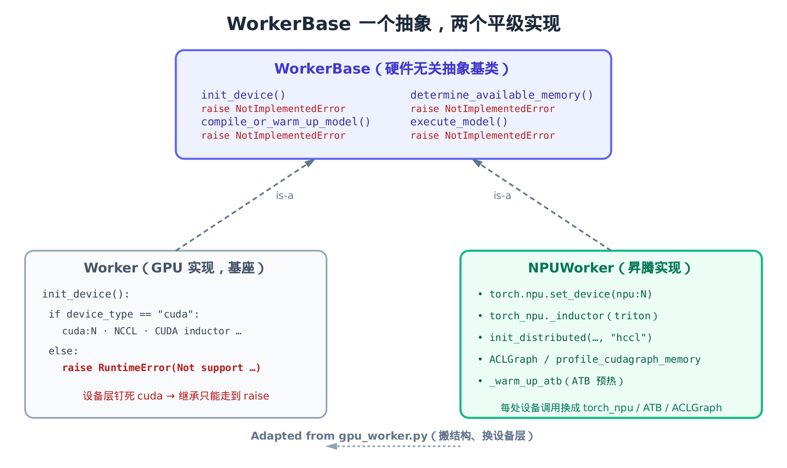
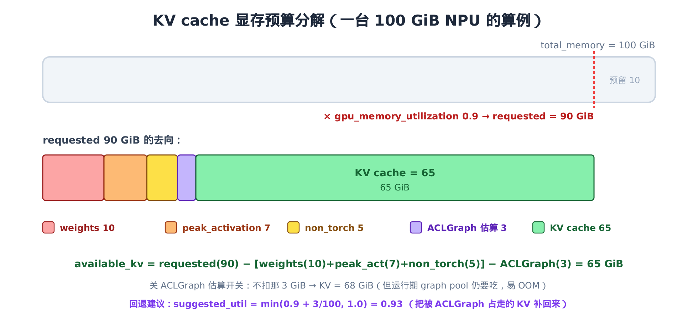

# 第 13 章 NPUWorker：从 WorkerBase 重写执行主控



> 上一章：把 KV 在 device 与 host 之间分层搬运，省显存。
> 本章：一个执行进程，从开机到稳态干活的完整主控。
> 下一章：execute_model 交棒给 NPUModelRunner，真正跑前向。

前面几章我们一直在「单点机制」里打转——通信器、并行组、KV 池化、KV 卸载。它们各自解决一件事。但有一个问题始终悬着：**这些零件是被谁、在什么时候、按什么顺序串起来跑的？**

答案是 `vllm_ascend/worker/worker.py` 里的一个类——`NPUWorker`。它是昇腾上**进程级的执行主控**：每张卡一个进程，进程里就住着一个 `NPUWorker`，从设备初始化、显存盘点、编译预热，一路到稳态循环里一拍一拍地派活。它是执行主线的「大脑壳」，本章和下一章合起来，才是这副脑壳里真正在想什么。

这一章只问一个核心问题：**为什么昇腾的 Worker 选择「重写」而不是「继承」GPU 的那一份？** 答案藏在一行文件头注释和四个被整段换掉的设备调用里。把这件事讲透，就读懂了 vllm-ascend 在执行层最重的一笔手术。

## 13.1 一个进程，从开机到稳态：四步生命周期总览

先把 `NPUWorker` 一生要干的活摆出来。抛开几十个转发型小方法，主线就是**四步**，对应 `vllm_ascend/worker/worker.py` 里四个方法：



> *图注：前三步在启动期各跑一次，把设备、显存预算、编译图都备好。第四步 execute_model 是稳态热路径，调度器每拍都回到这里。每步的产物（device / KV 预算 / CompilationTimes / ModelRunnerOutput）喂给下一步或交给引擎。*

- **第 1 步 `init_device`**：选设备、设上下文、起编译栈、拍显存快照、起分布式。开机。
- **第 2 步 `determine_available_memory`**：拿假数据跑一遍前向，量峰值显存，算出 **KV cache 能吃多少显存**。
- **第 3 步 `compile_or_warm_up_model`**：按一组 batch size 预热、捕获计算图、再单独热一发昇腾的 ATB 算子。
- **第 4 步 `execute_model`**：稳态里反复被调，把调度结果**派发**给 `NPUModelRunner` 跑真前向。

读下去前，先把昇腾这几个缩写和 GPU 世界对个表（后文反复出现）：**NPU**（Neural Processing Unit，昇腾的加速芯片，对位 GPU）、**HCCL**（昇腾的集合通信库，对位 CUDA 的 NCCL）、**ACL**（昇腾的设备计算接口，下文的 ACL graph 对位 CUDA graph）、**ATB**（昇腾高度优化的算子加速库，专攻 matmul 这类矩阵运算）。GPU 读者撞见 HCCL / ACL / ATB，按 NCCL / CUDA 图 / 算子库的位置去套就行。

这四步不是昇腾发明的——它们是 vLLM 给所有硬件后端定的**统一契约**。契约写在抽象基类 `WorkerBase` 里。昇腾要做的，是把这四个抽象方法**用昇腾的设备 API 填实**。问题在于：填实的方式，是「继承 GPU 已经填好的那份、改几处」，还是「另起一份从头填」？这正是本章的题眼，下一节就看证据。

## 13.2 为什么不继承 GPU 的 Worker：WorkerBase 抽象与 cuda 的死结

vLLM 的 Worker 抽象在 `vllm/v1/worker/worker_base.py`。它是个**纯抽象**：四步生命周期方法只有签名和文档，方法体一律 `raise NotImplementedError`。

```python
# vllm/v1/worker/worker_base.py:L94-L143
def compile_or_warm_up_model(self) -> CompilationTimes:
    """Prepare model for execution through compilation/warmup.

    Returns:
        Compilation times (language_model, encoder) in seconds.
    """
    raise NotImplementedError
# … 省略：中间 check_health / get_kv_cache_spec 等接口 …
def init_device(self) -> None:
    """Initialize device state, such as loading the model or other on-device
    memory allocations.
    """
    raise NotImplementedError
# … 省略：get_model / load_model 等接口 …
def execute_model(
    self, scheduler_output: SchedulerOutput
) -> ModelRunnerOutput | AsyncModelRunnerOutput | None:
    # … 省略：返回值约定的文档 …
    raise NotImplementedError
```

（注：上面三个方法在源码里**不相邻**——真实顺序是 `compile_or_warm_up_model`（L94）在前、`init_device`（L106）居中、`execute_model`（L134）在后，中间还隔着别的接口。这里按生命周期顺序拼在一起，便于对照。）

抽象既然是空的，那 GPU 和昇腾就是这同一个抽象的**两个平级实现**。关键在于看 GPU 那一份怎么填的——`vllm/v1/worker/gpu_worker.py` 的 `Worker.init_device`：

```python
# vllm/v1/worker/gpu_worker.py:L239-L309
def init_device(self):
    if self.device_config.device_type == "cuda":
        # This env var set by Ray causes exceptions with graph building.
        os.environ.pop("NCCL_ASYNC_ERROR_HANDLING", None)
        # … 省略：DP 本地 rank 调整与 visible_device_count 断言 …
        self.device = torch.device(f"cuda:{self.local_rank}")
        torch.accelerator.set_device_index(self.device)

        current_platform.check_if_supports_dtype(self.model_config.dtype)
        # … 省略：先初始化分布式（NCCL）、再拍显存快照 …
    else:
        raise RuntimeError(f"Not support device type: {self.device_config.device}")
```

这就是「**不能继承、只能重写**」的硬证据。看清楚 `init_device` 的骨架：整段实现被包在 `if self.device_config.device_type == "cuda"` 里，**非 cuda 直接 `raise RuntimeError`**。设备分配（`cuda:N` / `set_device_index`）、dtype 检查、NCCL 后端，统统锁死在 CUDA 这一支。

昇腾如果继承 `Worker` 会怎样？它的 `device_type` 是 `npu`，进 `init_device` 第一脚就掉进 `else` 分支——`raise RuntimeError`。唯一能走通的办法，是把整个 `init_device` 重写。而 `init_device` 不是孤例：`determine_available_memory` 里全是 `torch.cuda.*`、`compile_or_warm_up_model` 里是 CUDA graph 和 CUDA kernel 调优——**每一步的设备层都钉死在 cuda 上**。在继承体系里到处打洞、覆写半个方法，远比「另起一份」更脏更碎。



> *图注：WorkerBase 是空抽象，四方法全 raise。Worker(GPU) 把设备层钉死在 cuda、非 cuda 即 raise。NPUWorker 不继承它，而是与它平级地直接派生 WorkerBase，再把每处设备调用换成 torch_npu / ATB / ACLGraph——结构搬自 gpu_worker.py，设备层全换。*

于是昇腾的选择是图里右边那条：`NPUWorker` **直接派生抽象 `WorkerBase`**，和 GPU 的 `Worker` 做平级兄弟，而不是它的子类。代码第一行就把这点钉死：

```python
# vllm_ascend/worker/worker.py:L81
class NPUWorker(WorkerBase):
```

基类是 `WorkerBase`，不是 `Worker`。这一行，就是本章题眼的支点。

## 13.3 搬结构、换设备层：文件头的物证与 \_\_init\_\_

「重写」听起来像「重造」，但 `NPUWorker` 不是从零写的。它**搬结构、换设备层**——控制流几乎逐行抄自 GPU 那份，只把每一处碰硬件的调用换掉。物证就写在 `vllm_ascend/worker/worker.py` 的文件头：

```python
# vllm_ascend/worker/worker.py:L16-L17
# This file is a part of the vllm-ascend project.
# Adapted from vllm-project/vllm/vllm/worker/gpu_worker.py
```

`Adapted from ... gpu_worker.py`——一句话讲明了这份文件的来历：算法骨架是 GPU 那份的副本，区别只在设备层。这是 vllm-ascend 反复出现的工程哲学——**能抄的结构尽量抄，只在硬件边界处动刀**，把维护漂移压到最小。

`__init__` 把这种「先做昇腾特有准备、再复用公共逻辑」的节奏摆得很清楚：

```python
# vllm_ascend/worker/worker.py:L82-L130
def __init__(
    self,
    vllm_config: VllmConfig,
    local_rank: int,
    rank: int,
    distributed_init_method: str,
    is_driver_worker: bool = False,
    # Additional parameters for compatibility with vllm
    **kwargs,
):
    """Initialize the worker for Ascend."""
    # … 省略：COMPILE_CUSTOM_KERNELS 缺失时的 warning …
    # register patch for vllm
    from vllm_ascend.utils import adapt_patch

    adapt_patch()

    # Register ops when worker init.
    from vllm_ascend import ops

    ops.register_dummy_fusion_op()
    if get_ascend_device_type() != AscendDeviceType.A5:
        _register_atb_extensions()
    register_ascend_customop(vllm_config)
    # init ascend config and soc version
    init_ascend_config(vllm_config)
    check_ascend_device_type()

    super().__init__(
        vllm_config=vllm_config,
        local_rank=local_rank,
        rank=rank,
        distributed_init_method=distributed_init_method,
        is_driver_worker=is_driver_worker,
    )

    if self.cache_config.cache_dtype == "auto":
        self.cache_dtype = self.model_config.dtype
    else:
        self.cache_dtype = STR_DTYPE_TO_TORCH_DTYPE[self.cache_config.cache_dtype]

    # Profiler is lazily initialized on first profile(is_start=True) call (RFC #6954)
    self.profiler_config = vllm_config.profiler_config
    self.profiler: TorchNPUProfilerWrapper | None = None
    # … 省略：sleep mode 缓冲、v2 runner 回退判断、static_kernel 信号处理等旁支 …
```

分三段看：

1. **`super().__init__` 之前**，先做昇腾特有的开场白：`adapt_patch()` 打补丁（这套两段式猴补在 [第 3 章](../ch03-two-stage-monkey-patch/narrative/chapter.md) 讲过）、注册 ATB 扩展与 customop、`init_ascend_config` 初始化昇腾配置和 SoC 版本。这些是 GPU 那份没有的、昇腾必须先铺好的地基。
2. **`super().__init__`** 这一步，复用的正是 `WorkerBase` 的公共逻辑——把 `vllm_config` 摊开成 `model_config` / `cache_config` / `parallel_config` 等字段，记下 `local_rank` / `rank`，把 `device` 和 `model_runner` 先置空。这段和 GPU 的 `Worker` 走的是**同一段代码**——这就是「平级兄弟共用一个抽象基类」的实惠：公共的 config 摊开逻辑不必重写。
3. **`super().__init__` 之后**，定 `cache_dtype`，并把 `profiler` 设成 `None` 懒初始化。注意它的类型是 `TorchNPUProfilerWrapper`——这是个横切点，[§13.8](#138-横切两点与一条平行路径profiler-与-xlite) 再点一句。

地基铺好，下面四步逐个看。每一步我们都问同一个问题：**这里换了什么设备调用？**

## 13.4 第 1 步 init\_device：设备层全换（含快照顺序的关键差异）

`init_device` 是对外契约（`WorkerBase` 的接口）。昇腾把它拆成**两层**：薄薄的 `init_device` 包住干重活的 `_init_device`。先看里层 `_init_device`，它是设备层重写最密集的地方：

```python
# vllm_ascend/worker/worker.py:L260-L315
def _init_device(self):
    device = torch.device(f"npu:{self.local_rank}")
    torch.npu.set_device(device)

    # Import _inductor for graph mode execution with triton
    # This lazy import avoids torch_npu re-initialization in patch
    # Note that this should be imported after torch.npu.set_device
    # to avoid repeated set_device in extra processes
    from vllm.triton_utils import HAS_TRITON

    if HAS_TRITON:
        import torch_npu._inductor  # noqa: F401

    gc.collect()
    torch.npu.empty_cache()
    # … 省略：A5 设备的 setup_ascend_local_comm_res 分支 …

    # take current memory snapshot
    self.init_snapshot = MemorySnapshot()
    self.requested_memory = self.init_snapshot.total_memory * self.cache_config.gpu_memory_utilization
    if self.init_snapshot.free_memory < self.requested_memory:
        GiB = lambda b: round(b / GiB_bytes, 2)
        raise ValueError(
            # … 省略：报错文案——启动空闲显存不足 gpu_memory_utilization 要求 …
        )
    # … 省略：data_parallel 下 visible_device_count 的断言块 …

    # Initialize the distributed environment.
    self._init_worker_distributed_environment()
    # Set random seed.
    set_random_seed(self.model_config.seed)
    # Initialize device properties used by triton kernels.
    init_device_properties_triton()

    return device
```

把它和 [§13.2](#132-为什么不继承-gpu-的-workerworkerbase-抽象与-cuda-的死结) 里 GPU 的 `init_device` 并排看，「设备层全换」一目了然：

| 干什么 | 基座（cuda） | 昇腾（npu） |
|---|---|---|
| 选设备 | `cuda:N` + `torch.accelerator.set_device_index` | `npu:N` + `torch.npu.set_device` |
| 起编译栈 | CUDA inductor | `import torch_npu._inductor`（triton graph 模式） |
| 起分布式 | NCCL 后端 | `_init_worker_distributed_environment`（内部 `"hccl"`） |
| 喂 kernel 属性 | — | `init_device_properties_triton`（给 triton 喂昇腾设备属性） |

这里先解释 `if HAS_TRITON` 这个守卫：Triton 是写自定义加速器 kernel 的语言，`torch_npu._inductor` 把 Triton 的代码生成接进昇腾的图编译——所以只有当环境编进了 Triton 支持（`HAS_TRITON`）时才需要导它，否则这条 graph 模式路径根本用不上。而 `torch_npu._inductor` 的 `import` 本身也有讲究：它**懒导入、且必须在 `torch.npu.set_device` 之后**。注释说得明白——提前导会触发 `torch_npu` 重复初始化，在额外进程里还会重复 `set_device`。这种「import 的副作用必须排在设备就绪之后」的约束，是异构后端常见的暗礁。

**一处不只是换符号的结构差异——显存快照和分布式初始化的先后顺序，昇腾和基座是反的。**

- 基座 `gpu_worker.py`：**先**初始化分布式（NCCL），**后**拍显存快照（`MemorySnapshot`）。源码注释直说原因——"This ensures NCCL buffers are allocated before we measure"。于是 NCCL 通信 buffer 被计入快照基线，会在第 2 步从可用显存里**扣掉**。
- 昇腾 `worker.py`：**先**拍 `init_snapshot`（L280），**后**才 `_init_worker_distributed_environment` 起 HCCL（L309）。HCCL 的通信 buffer 在快照之后才分配，所以**不计入快照基线**。

一句话：两边都为「KV 到底还剩多少显存」这道账负责，但**通信 buffer 算在谁头上不一样**。读后续显存预算时，记住昇腾的基线里不含 HCCL buffer。

拍完快照还顺手做了道**启动期防呆**：`requested_memory = total_memory × gpu_memory_utilization`，如果当前空闲显存连这个目标都不够，直接 `raise ValueError` 让用户调小 `gpu_memory_utilization`——别等跑起来才 OOM。

外层 `init_device` 就薄多了：

```python
# vllm_ascend/worker/worker.py:L317-L332
def init_device(self):
    # NOTE: KEEP device the member of `NPUWorker`, as it will be checked
    # in ray scenario. see https://github.com/vllm-project/vllm/pull/26845
    # for more details
    self.device = self._init_device()
    # Initialize workspace manager
    num_ubatches = 1
    init_workspace_manager(self.device, num_ubatches)
    # Init ModelRunner here, so that we have access to self.device.
    # … 省略：use_v2_model_runner 分支下 V2 runner 的 import（开发中，主线走 else）…
    self.model_runner = NPUModelRunner(self.vllm_config, self.device)
```

三件事：把 `_init_device` 返回的 device **存成成员**（注释强调 ray 场景会检查它）、`init_workspace_manager` 申请 workspace（昇腾给算子运算预留的工作缓冲区池，`num_ubatches` 是它要容纳的并行微批槽位数——昇腾每个 worker 固定开 1 个，基座开 dbo（动态批优化）时为 2）、构造 `NPUModelRunner`——这就是第 4 步 `execute_model` 要派活的对象。

为什么要拆成两层？因为这给了**复用的接缝**：有一条轻量执行路径 `XliteWorker`，它只想换掉 ModelRunner、设备初始化照旧。拆层后，它只需 `override` 外层 `init_device`、复用里层 `_init_device` 即可，不必重抄设备初始化。这条平行路径 [§13.8](#138-横切两点与一条平行路径profiler-与-xlite) 点名。

## 13.5 第 2 步 determine\_available\_memory：KV 能吃多少显存

设备起来了，下一个大问题：**KV cache 能用多少显存？** 多了 OOM，少了浪费上下文长度。`determine_available_memory` 的办法是——拿假数据真跑一遍前向，量出峰值占用，剩下的才敢分给 KV。算法骨架和基座 `gpu_worker.py` 几乎逐行同构，只把 `torch.cuda.*` 换成 `torch.npu.*`、CUDA graph 换成 ACL/NPU graph。

```python
# vllm_ascend/worker/worker.py:L335-L406
@torch.inference_mode()
def determine_available_memory(self) -> int:
    """Profiles the peak memory usage of the model to determine how much
    memory can be used for KV cache without OOMs.
    """
    GiB = lambda b: b / GiB_bytes
    # … 省略：fast path——用户用 --kv-cache-memory 显式指定 KV 大小时跳过估算 …

    # Execute a forward pass with dummy inputs to profile the memory usage.
    with memory_profiling(
        self.init_snapshot,
        weights_memory=int(self.model_runner.model_memory_usage),
    ) as profile_result:
        self.model_runner.profile_run()

        # Record torch peak INSIDE the context and BEFORE graph capture,
        # so that graph pool allocations don't inflate the activation peak.
        profile_torch_peak = torch.npu.memory_stats(self.device).get("allocated_bytes.all.peak", 0)

        npugraph_memory_estimate = 0
        should_profile_npugraph_memory = self.vllm_config.compilation_config.cudagraph_mode != CUDAGraphMode.NONE
        # … 省略：DeepSeek-V4 DSA 压缩注意力跳过 ACLGraph 估算的特例 …
        if should_profile_npugraph_memory:
            npugraph_memory_estimate = self.model_runner.profile_cudagraph_memory()

    # Override torch_peak_increase with the pre-graph-capture value to
    # avoid double-counting graph pool memory as activation memory.
    profile_result.torch_peak_increase = profile_torch_peak - profile_result.before_profile.torch_peak
    profile_result.non_kv_cache_memory = (
        profile_result.non_torch_increase + profile_result.torch_peak_increase + profile_result.weights_memory
    )

    npugraph_memory_estimate_applied = (
        npugraph_memory_estimate if envs_vllm.VLLM_MEMORY_PROFILER_ESTIMATE_CUDAGRAPHS else 0
    )

    # Save per-category memory for use in compile_or_warm_up_model() (step 5).
    self.peak_activation_memory = profile_result.torch_peak_increase
    self.non_torch_memory = profile_result.non_torch_increase
    self.npugraph_memory_estimate = npugraph_memory_estimate
```

拆开看这套账。`memory_profiling` 是个上下文管理器，进入时记一遍显存基线、退出时再记一遍，差值就是这段里涨了多少。里面 `model_runner.profile_run()` 拿 dummy 输入跑一遍前向，把**激活峰值**顶出来。

这里有一处**反双计的小心思**，值得单拎出来。看注释：torch peak 必须在 `memory_profiling` 上下文**内**、且在**图捕获之前**抓取（`profile_torch_peak`）。为什么？因为接下来 `profile_cudagraph_memory()` 会去试探 ACL graph 要占多少显存，那会分配 graph pool。如果让 `memory_profiling` 退出时自己算 `torch_peak_increase`，graph pool 的分配就会被误算进**激活峰值**——激活被高估，KV 预算被连累低估。所以代码用「图捕获前」的 `profile_torch_peak` 去**覆写** `torch_peak_increase`，把 graph pool 摘干净。

> **不变量（反双计）**：graph pool 显存只通过 `npugraph_memory_estimate` 这一条路进入账本，绝不混进 `torch_peak_increase`。因为 `profile_torch_peak` 取自图捕获之前 → `torch_peak_increase` 只含激活 → `non_kv_cache_memory` 不重复计入 graph pool。

非 KV 显存因此分成三块，相加得 `non_kv_cache_memory`：

$$
\mathrm{non\_kv} = \mathrm{non\_torch} + \mathrm{torch\_peak} + \mathrm{weights}
$$

人话：**非 KV 显存 = 框架杂项 + 激活峰值 + 模型权重**。后半段把账结清：

```python
# vllm_ascend/worker/worker.py:L408-L462
free_gpu_memory = profile_result.after_profile.free_memory
assert self.init_snapshot.free_memory > free_gpu_memory, (
    "Error in memory profiling. "
    # … 省略：报错文案 …
)
self.available_kv_cache_memory_bytes = (
    self.requested_memory - profile_result.non_kv_cache_memory - npugraph_memory_estimate_applied
)
# … 省略：Available KV cache memory 日志 …

if npugraph_memory_estimate > 0:
    total_mem = self.init_snapshot.total_memory
    current_util = self.cache_config.gpu_memory_utilization
    ng_util_delta = npugraph_memory_estimate / total_mem
    suggested_util = min(
        round(current_util + ng_util_delta, 4),
        1.0,
    )
    if envs_vllm.VLLM_MEMORY_PROFILER_ESTIMATE_CUDAGRAPHS:
        equiv_util = round(current_util - ng_util_delta, 4)
        # … 省略：完整提示文案，保留算式即可看懂回退建议 …
        logger.info("Increase --gpu-memory-utilization to %.4f", suggested_util)
    else:
        logger.warning(...)

return int(self.available_kv_cache_memory_bytes)
```

那句 `assert self.init_snapshot.free_memory > free_gpu_memory` 是道**自检**：profile 跑完，空闲显存一定比启动时**少**（因为激活和 graph pool 占了），否则说明 profiling 根本没量到东西，宁可当场报错也不能拿错数据去分 KV。

KV 预算的落点公式：

$$
\mathrm{available\_kv} = \mathrm{requested} - \mathrm{non\_kv} - \mathrm{aclgraph\_applied}
$$

其中 `requested = total × gpu_memory_utilization`，而 `aclgraph_applied` 是否真扣，由环境开关 `VLLM_MEMORY_PROFILER_ESTIMATE_CUDAGRAPHS` 决定。

这套纯算术正是本章「跑起来看数值」的着力点。拿一台 100 GiB 的 NPU 算两笔账：



> *图注：total 100 GiB × util 0.9 = requested 90 GiB。从中扣权重 10、激活峰值 7、框架杂项 5、ACLGraph 估算 3，余下 65 GiB 归 KV。关掉 ACLGraph 估算开关则不扣那 3 GiB（KV 变 68），但运行期 graph pool 仍要吃这块，易 OOM——所以默认扣。*

| 配置 | total | util | requested | non_kv（5+7+10） | ACLGraph 扣减 | **available_kv** |
|---|---|---|---|---|---|---|
| 开估算（默认） | 100 | 0.9 | 90 | 22 | −3 | **65 GiB** |
| 关估算 | 100 | 0.9 | 90 | 22 | −0 | **68 GiB** |

两行差在那 3 GiB ACLGraph：开关一开，KV 从 68 缩到 65。缩掉的 3 GiB 不是凭空消失，而是预留给运行期真正要捕获的 ACL graph——不预留，跑起来 graph pool 一申请就 OOM。

这就引出最后一段的**回退建议**。开了估算、KV 被砍了 3 GiB，用户可能纳闷「我的 KV 怎么变小了」。代码于是把账算给用户看：先求出 ACLGraph 占总显存的比例 `δ = npugraph / total = 3 / 100 = 0.03`——也就是那 3 GiB 在 100 GiB 里占的零头。

道理很简单：被 ACLGraph 占走多少比例，就把利用率往上抬回多少。所以要把这块 KV 补回来，只需把 `--gpu-memory-utilization` 提到

$$
\mathrm{suggested\_util} = \min(\mathrm{util} + \delta,\ 1.0) = \min(0.9 + 0.03,\ 1.0) = 0.93
$$

封顶 `1.0` 是防呆——util 本来就接近满时，再加 δ 也不会越过 1.0。这段全是纯 Python 算术、不碰任何设备，所以在没有 NPU 的机器上注入几个桩就能跑出上面那两行 65/68 GiB 和 0.93 的数，正确性一目了然。

## 13.6 第 3 步 compile\_or\_warm\_up\_model 与 \_warm\_up\_atb：预热那一发 ATB

KV 预算定了、KV cache 也分配好了，开服前还差最后一道——**预热**。冷启动的第一次前向往往奇慢：要现编译、要现初始化算子库。`compile_or_warm_up_model` 把这些开销在开服前一次性付掉。

```python
# vllm_ascend/worker/worker.py:L557-L583
def compile_or_warm_up_model(self) -> CompilationTimes:
    # Note: need to adapt for graph mode.
    warmup_sizes = (self.vllm_config.compilation_config.compile_sizes or []).copy()
    if not self.model_config.enforce_eager:
        cg_capture_sizes: list[int] = []
        if self.vllm_config.compilation_config.cudagraph_mode != CUDAGraphMode.NONE:
            cg_sizes = self.vllm_config.compilation_config.cudagraph_capture_sizes
            cg_capture_sizes = [] if cg_sizes is None else cg_sizes
            warmup_sizes = [x for x in warmup_sizes if x not in cg_capture_sizes]

        compile_ranges = self.vllm_config.compilation_config.get_compile_ranges()
        # For each compile_range, if none of the batch sizes
        # in warmup_sizes or cudagraph_capture_sizes are in the range,
        # add the end of the range to ensure compilation/warmup.
        all_sizes = set(cg_capture_sizes)
        all_sizes.update([x for x in warmup_sizes if isinstance(x, int)])
        for compile_range in compile_ranges:
            if not any(x in compile_range for x in all_sizes):
                warmup_sizes.append(compile_range.end)

    for size in sorted(warmup_sizes, reverse=True):
        logger.info("Compile and warming up model for size %d", size)
        self.model_runner._dummy_run(size)

    npugraph_memory_bytes = 0
    if not self.model_config.enforce_eager:
        npugraph_memory_bytes = self.model_runner.capture_model()
```

先认一个贯穿全段的开关 `enforce_eager`：置位时它**关掉图捕获**，强制所有算子立刻执行（eager 即时模式）；为默认的 `False` 时，才走下面这套图预热与捕获。所以 `if not self.model_config.enforce_eager` 守着的，就是「要不要建图」这条岔路。

接着分清两条**独立的预热路径**：`compile_sizes` 列的是要在 eager 模式下**编译**的 batch size，而 `cudagraph_capture_sizes` 列的是另行**捕获成 ACL graph** 的 size——图捕获自带一套预热逻辑（归后面的 `capture_model` 管），所以这里要把它们从 `compile_sizes` 里剔掉，免得两条路对同一个 size 重复预热。

剔重之后，前半段就是在**挑最终要预热哪些 batch size**：从剔过的 `compile_sizes` 出发，再对每个 `compile_range`，如果没有任何 size 落在区间里，就补上区间端点——保证每个编译区间至少热到一个点，不留死角。挑完，`sorted(..., reverse=True)` **从大到小**逐个 `_dummy_run(size)` 触发编译预热。从大到小是有意的：先用最大 batch 把显存峰值顶上去，后面的小 batch 就不会再触发新的峰值分配。

用一组具体的 size 走三拍看清这个循环：假设 `warmup_sizes = [8, 256, 64]`，`sorted(..., reverse=True)` 后是 `[256, 64, 8]`，逐拍如下。

| 拍 | `size` | 动作 | 效果 |
|---|---|---|---|
| 1 | 256 | `_dummy_run(256)` | 最大 batch，把激活峰值一次顶满 |
| 2 | 64 | `_dummy_run(64)` | 编译 64 的分支，不再涨峰值 |
| 3 | 8 | `_dummy_run(8)` | 编译 8 的分支，不再涨峰值 |

循环本身平凡——它就是把 `sorted` 后的有限列表走一遍，每个 size 调一次 `_dummy_run`，必然终止。值得记的是**降序**这条不变量，它的正确性建立在一个前提上：**激活显存随 batch 单调增**——batch 越大，一次前向要存的激活就越多、峰值就越高。有了这个前提，归纳就闭合了：基例是第一拍先跑最大 batch，把激活峰值一次顶满；归纳步是后续每个更小的 batch 激活都 ≤ 这个峰值，于是显存占用单调不增，后续预热不会触发新的峰值分配、也就没有新 OOM 风险。

接着，非 `enforce_eager` 时 `capture_model()` 真正捕获 NPU/ACL graph，返回它占的显存——这正是第 2 步里 `profile_cudagraph_memory` **预估**的那块的**实测值**（源码里还会把两者对比打日志，已省略）。收尾这一段，是昇腾和基座差最明显的地方：

```python
# vllm_ascend/worker/worker.py:L636-L665
# Call ATB matmul to warm up; otherwise, the first operation (ReshapeAndCache)
# may cause performance degradation at runtime.
if get_ascend_device_type() != AscendDeviceType.A5:
    self._warm_up_atb()
# … 省略：enable_cpu_binding 时 bind_cpus 的 NUMA 绑核 …
# Reset the seed to ensure that the random state is not affected by
# the model initialization and profiling.
set_random_seed(self.model_config.seed)
return CompilationTimes(
    language_model=self.vllm_config.compilation_config.compilation_time,
    encoder=getattr(
        self.vllm_config.compilation_config,
        "encoder_compilation_time",
        0.0,
    ),
)

def _warm_up_atb(self):
    x = torch.rand((2, 4), dtype=torch.float16).npu()
    weight = torch.rand((2, 4), dtype=torch.float16).npu()
    c = torch.rand((4, 4), dtype=torch.float32).npu()
    torch_npu._npu_matmul_add_fp32(x, weight, c)
```

基座在这个位置是 `kernel_warmup(self)`——CUDA kernel 调优。昇腾把它换成了 `_warm_up_atb`：**故意打一发 ATB 的 `matmul_add`**（`torch_npu._npu_matmul_add_fp32`），用一对 `(2,4)` 的小张量。目的注释写得很直白——ATB 算子库首次调用有初始化开销，不提前付掉，运行期**第一个算子（`ReshapeAndCache`）会卡**。开服前热这一发，把初始化成本从用户的第一条请求里挪走。A5 设备跳过。

最后 `return CompilationTimes(...)`——和 `WorkerBase` 约定的返回类型对齐。`encoder` 字段用 `getattr` 兜底：它是新版本 vLLM 才加的字段，老版本没有就退回 `0.0`，免得构造时崩。这种「向后兼容上游字段」的小防御，在 OOT（out-of-tree，树外插件）项目里随处可见。

## 13.7 第 4 步 execute\_model：把活儿派发给 NPUModelRunner

前三步都是**启动期一次性**的：`init_device`、`determine_available_memory`、`compile_or_warm_up_model` 各只在开机时跑一次，量级随模型规模 O(模型规模)，跑完就不再回头。第四步 `execute_model` 不一样——它是整个 Worker 里**唯一进稳态热路径**的方法：调度器每出一批 `scheduler_output`，就调它一次，一个请求的生命周期里要被调成百上千次。前三步的成本是一次性摊销的，`execute_model` 的成本却乘在每一拍上。但别被它的地位吓到，它本身很**薄**：

```python
# vllm_ascend/worker/worker.py:L474-L512
def execute_model(
    self,
    scheduler_output: "SchedulerOutput",
) -> ModelRunnerOutput | AsyncModelRunnerOutput | None:
    self.profile_memory()
    # enable msMonitor to monitor the performance of vllm-ascend
    if get_ascend_config().msmonitor_use_daemon:
        dp.step()
    # … 省略：self._pp_send_work 的发送握手等待（多卡 PP 旁支）…

    intermediate_tensors = None
    forward_pass = scheduler_output.total_num_scheduled_tokens > 0
    # … 省略：非首 PP rank 接收 intermediate tensors 的 irecv 细节 …

    if self.profiler is not None:
        self.profiler.step()

    output = self.model_runner.execute_model(scheduler_output, intermediate_tensors)
    if isinstance(output, (ModelRunnerOutput, AsyncModelRunnerOutput, NoneType)):
        return output
    # … 省略：output 为 IntermediateTensors 时的 PP isend 转发与 kv_connector 透传 …
```

剥掉多卡 PP 的收发和观测打点，单机最常走的主线只有三步：量一下 torch 显存（`profile_memory`，采样当前显存统计供调优诊断）、推进 `profiler.step()`、然后把 `scheduler_output` **直接交给 `self.model_runner.execute_model`**，拿回 `ModelRunnerOutput` 返回。开头那句 `dp.step()` 也是同一类东西——仅当 `msmonitor_use_daemon` 打开时，推进 msMonitor 性能监控守护进程。`profile_memory` / `dp.step` / `profiler.step` 三者都是**可选的观测钩子**，不参与前向计算本身，读主线时把它们当旁注略过即可。

`NPUWorker` 在这一步的角色就是个**派发器**——真正的前向、采样、KV 写入，全在 `NPUModelRunner` 里。这也呼应了开头说的「本章只是脑壳」：`execute_model` 把控制权交棒出去，[第 14 章 NPUModelRunner](../ch14-npu-model-runner-monkeypatch/narrative/chapter.md) 才是接住这一棒、跑通一次真实前向的地方。和基座 `execute_model` 对比，结构同构，差别只在昇腾多了 `profile_memory` / `dp.step` 这类设备侧观测点。

## 13.8 横切两点与一条平行路径：profiler 与 xlite

主线讲完，补两个**点名不展开**的横切点，免得读者在源码里撞见时困惑。

- **`profiler`（`vllm_ascend/profiler/torch_npu_profiler.py`）**：[§13.3](#133-搬结构换设备层文件头的物证与-__init__) 里 `__init__` 把 `self.profiler` 设成 `None` 懒初始化，类型是 `TorchNPUProfilerWrapper`。它是 vLLM `WorkerProfiler` 的子类，把 `torch_npu.profiler` 接进来，第一次 `profile(is_start=True)` 才真正建起来。`execute_model` 里那句 `self.profiler.step()` 就是推进它。性能剖析是观测旁支，不在四步主线里。

- **`xlite/`（`vllm_ascend/xlite/xlite_worker.py`）**：一条**平行于 `NPUWorker`/`NPUModelRunner` 主线的轻量执行路径**。`XliteWorker` 继承 `NPUWorker`、只 `override` `init_device` 改用 `XliteModelRunner`——这正是 [§13.4](#134-第-1-步-init_device设备层全换含快照顺序的关键差异) 里「`init_device` / `_init_device` 拆两层」留下的接缝在发挥作用：它复用里层 `_init_device` 的全套设备初始化，只换外层造的 ModelRunner。本章只点名，不展开。

## 小结：重写的边界画在哪

回到开头那个问题——**为什么昇腾的 Worker 重写而不继承？** 现在答案很清楚了。

GPU 的 `Worker.init_device` 把设备层钉死在 `if device_type == "cuda"`、非 cuda 即 `raise`（`vllm/v1/worker/gpu_worker.py:L309`）。设备分配、编译栈、通信后端、算子预热，每一处都绑死 CUDA。昇腾继承它，只能掉进 `raise` 分支。于是 `NPUWorker` 与它做**平级兄弟**，一起派生抽象 `WorkerBase`——结构搬自 `gpu_worker.py`（文件头 `Adapted from` 为证），设备层全换：

- `cuda:N` / `set_device_index` → `torch.npu.set_device(npu:N)`
- CUDA inductor → `torch_npu._inductor`
- NCCL → HCCL
- CUDA graph → ACL/NPU graph（`profile_cudagraph_memory` / `capture_model`）
- `kernel_warmup` → `_warm_up_atb`（ATB 那一发 matmul）

而**该共用的照样共用**：`super().__init__` 复用 `WorkerBase` 摊开 config 的公共逻辑，四步生命周期的算法骨架逐行同构。重写的边界，精准地画在「碰硬件的那几行」上——这就是 vllm-ascend 在执行层最克制、也最重的一笔手术。

`execute_model` 把控制权交给了 `NPUModelRunner`。它接棒之后怎么跑前向、又是怎么用「继承 + 运行时猴补」这套和 Worker 截然不同的策略顶替 GPU 的 ModelRunner——[第 14 章](../ch14-npu-model-runner-monkeypatch/narrative/chapter.md) 见分晓。
