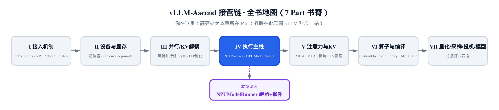
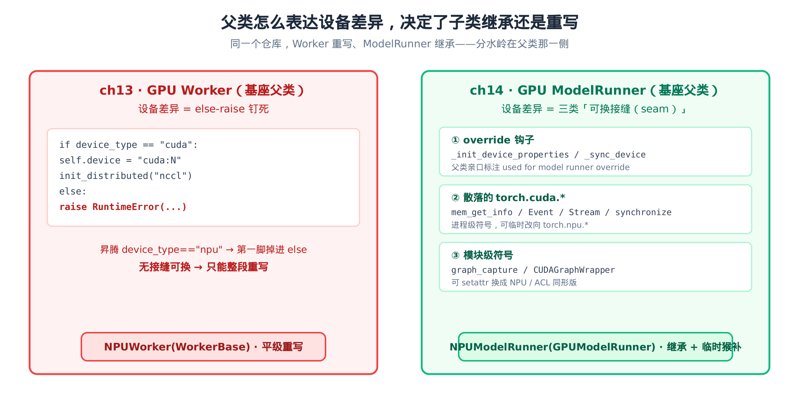
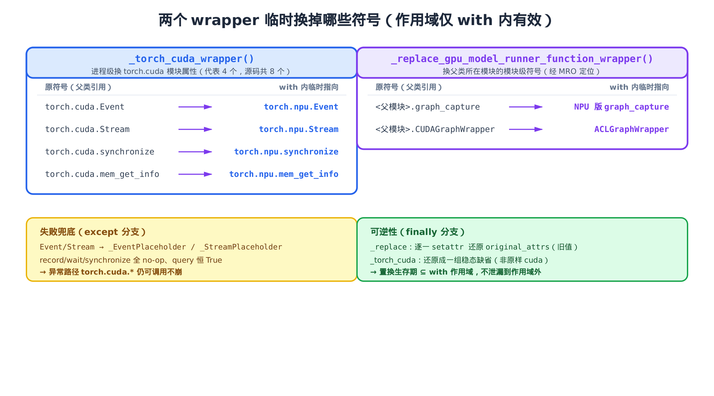
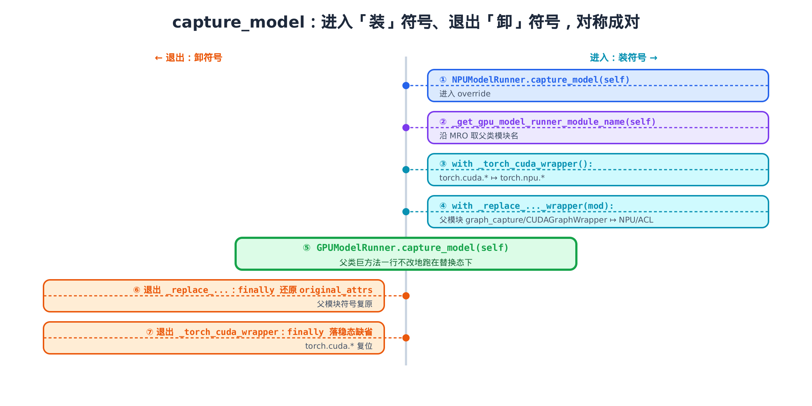

# 第 14 章 NPUModelRunner：继承 7000 行父类，只在接缝处临时换符号



> 上一章：NPUWorker 重写而非继承，因为设备层基座把 cuda 钉死。
> 本章：NPUModelRunner 反过来继承 7000 行父类，只换设备符号。
> 下一章：进入注意力与 KV，看真实算子怎么落到昇腾。

[第 13 章](../ch13-npuworker-execution-control/narrative/chapter.md) 留下一个漂亮的结论：昇腾的 `NPUWorker` 不继承 GPU 的 `Worker`，而是和它做平级兄弟，从头重写。原因是 GPU 那份把设备层钉死在 `if device_type == "cuda": … else: raise`——继承进去，第一脚就掉进 `raise`。

那么紧挨着 Worker 的另一个大件——`ModelRunner`，按理也该照搬这个套路重写一遍吧？

**恰恰相反。** `NPUModelRunner`（`vllm_ascend/worker/model_runner_v1.py:L255`）走的是完全相反的路：它**直接继承** GPU 那份 7000 多行的 `GPUModelRunner`（`vllm/v1/worker/gpu_model_runner.py`），自己只写了零星几个 override，剩下庞大的父类逻辑**一行不改地原样复用**。

同一个仓库、同一群作者、相邻的两个文件，为什么一个选「重写」、一个选「继承」？这一章就把这个反差讲透。答案不在子类怎么写，而在**父类怎么表达设备差异**——以及当父类没把路堵死、却也没给你留好接口时，昇腾用了一手**临时猴补（runtime monkey-patch，运行期临时替换符号）**，让父类的巨方法在它毫不知情的情况下跑在了昇腾上。

## 14.1 同一个仓库，两种相反的策略

先把两行类声明并排放一起，反差一目了然：

```python
# vllm_ascend/worker/worker.py:L81
class NPUWorker(WorkerBase):          # ch13：派生抽象基类，与 GPU Worker 平级 —— 重写

# vllm_ascend/worker/model_runner_v1.py:L255
class NPUModelRunner(GPUModelRunner): # ch14：直接派生 GPU 实现类 —— 继承
```

上一行的基类是抽象的 `WorkerBase`，下一行的基类是 GPU 的**具体实现** `GPUModelRunner`。`NPUModelRunner` 把 GPU 的 ModelRunner 整个吃进来当父类——这意味着 prepare_inputs、execute_model、各种 dummy run，几千行复杂逻辑全部白捡，子类只需要在父类「碰硬件」的地方动刀。

为什么这条路在 ModelRunner 上走得通、在 Worker 上走不通？判据只有一个：**父类把设备差异表达成了什么形态。**



> *图注：左边 ch13 的 GPU Worker 把设备差异写成 else-raise，非 cuda 即崩，没有接缝可换，子类只能整段重写。右边 ch14 的 GPU ModelRunner 把设备差异散成三类「可换接缝（seam）」——override 钩子、散落的 torch.cuda.* 调用、模块级符号——每一处都能临时换掉，于是子类可以继承巨父类，只在窄接缝处动手。*

「接缝（seam，指代码里可被外部替换的薄弱点）」是这一章的题眼。GPU 的 `GPUModelRunner` 把设备差异散落在三个地方，每一处都没堵死，反而留出了可替换的余地：

1. **override 钩子**——父类亲口标注「used for model runner override」的几个方法，明摆着等子类来覆盖。
2. **散落的 `torch.cuda.*` 直调**——`mem_get_info` / `Event` / `Stream` / `synchronize` 这些，是进程级的全局符号，可以临时改向 `torch.npu.*`。
3. **模块级符号**——`graph_capture` / `CUDAGraphWrapper` 这种被 import 进模块命名空间的名字，可以 `setattr` 换成昇腾的同形版。

下面三节，就按这三类接缝逐个拆。

## 14.2 第一类接缝：父类亲手留的 override 钩子

最干净的一类接缝，是父类**主动**留的。GPU 的 `GPUModelRunner` 里有两个方法，注释直接写明「留给 model runner 子类覆盖」：

```python
# vllm/v1/worker/gpu_model_runner.py:L1056-L1064
# Note: used for model runner override.
def _init_device_properties(self) -> None:
    """Initialize attributes from torch.cuda.get_device_properties"""

    self.num_sms = num_compute_units(self.device.index)

# Note: used for model runner override.
def _sync_device(self) -> None:
    torch.accelerator.synchronize()
```

`num_compute_units` 是 CUDA 的 SM（流多处理器）数量，昇腾没有这个概念。父类没有把它钉死，而是用一句 `# Note: used for model runner override.` 把它**标记成可覆盖点**。昇腾的 override 因此极短：

```python
# vllm_ascend/worker/model_runner_v1.py:L580-L584
def _init_device_properties(self) -> None:
    self.num_sms = None

def _sync_device(self) -> None:
    torch.npu.synchronize()
```

`num_sms` 直接置 `None`（昇腾下游不用它），设备同步换成 `torch.npu.synchronize()`。父类逻辑跑到需要设备属性或同步的地方，会调 `self._init_device_properties()` / `self._sync_device()`——因为方法解析顺序（MRO）落到子类的 override，自动走的就是昇腾这两行。

这一类接缝最省心：父类给了明确接口，子类填实即可，和普通继承没两样。**真正的好戏在另外两类——父类并没有留接口，符号是「散」在方法体里的。**

## 14.3 第二类接缝：散落在方法体里的 torch.cuda.*

来看父类一个典型的设备耦合大户——`profile_cudagraph_memory`（图捕获前预估显存）。它的核心片段是这样的：

```python
# vllm/v1/worker/gpu_model_runner.py:L6075-L6106（截取核心）
for instance in list(CUDAGraphWrapper._all_instances):
    original_pools[id(instance)] = instance.graph_pool
    instance.graph_pool = profiling_pool

set_cudagraph_capturing_enabled(True)
with self._freeze_gc(), graph_capture(device=self.device):
    # … 省略：同步与清缓存、初始化估算字典 …
    for mode, descs in capture_descs:
        # … 省略：取本模式的 profile_descs …
        for i, desc in enumerate(profile_descs):
            mem_before = torch.cuda.mem_get_info()[0]
            self._warmup_and_capture(
                desc,
                # … 省略：cudagraph_runtime_mode / profile_seq_lens 参数 …
            )
            torch.accelerator.synchronize()
            free_after = torch.cuda.mem_get_info()[0]
            mem_samples.append(mem_before - free_after)
```

数一数这段里的设备耦合点：`CUDAGraphWrapper`（CUDA 图包装器）、`graph_capture(device=...)`（CUDA 图捕获上下文）、`torch.cuda.mem_get_info()`（查显存余量）。这里的 CUDA 图，是把一串 GPU 操作预先录制成一张图、之后整张重放的优化手段，省掉每次重新分发调度指令的开销。`mem_get_info()` 则返回 `(剩余显存，总显存)` 的二元组、单位字节——上面那句 `mem_before - free_after`，正是靠它在捕获前后各取一次「剩余」，算出这一次捕获吃掉多少显存。它们既不是 `if cuda / else raise`，也不是 override 钩子——而是**直接写死在方法体里的全局名字**。

昇腾要复用这个方法，面对的难题是：**这些名字父类是在自己的命名空间里解析的，子类没法用「覆盖一个方法」的办法去改它们。** 你不能 override `torch.cuda.mem_get_info`——它不是 `self` 的方法，是 `torch.cuda` 模块的属性。

昇腾的破解办法，是把这些**全局符号**在父方法运行的那一瞬间「偷梁换柱」。这就引出本章的主角——两个成对进出的上下文管理器。先看构造期就用上的第一个。

## 14.4 构造期的第一处猴补：包住父类的巨构造器

`NPUModelRunner.__init__` 的关键只有一句——它把父类那个庞大的构造器，整个塞进了一个 `with` 块里：

```python
# vllm_ascend/worker/model_runner_v1.py:L255-L275
class NPUModelRunner(GPUModelRunner):
    def __init__(self, vllm_config: VllmConfig, device: torch.device):
        # … 省略：max_pcp_pad_tokens 的 PCP padding 预设、use_compress 的 hf_config 探测 …

        with _torch_cuda_wrapper():
            super().__init__(vllm_config, device)
```

父类 `GPUModelRunner.__init__` 是个 300KB 文件里最庞大、初始化逻辑最多的构造器，内部会创建一堆 `torch.cuda.Stream()` / `torch.cuda.Event()`。在昇腾上，这些 cuda 对象根本造不出来。

`with _torch_cuda_wrapper():` 这一句的作用，就是在 `super().__init__()` 执行的**整个时段**里，把 `torch.cuda.Stream` 这类符号临时指向 `torch.npu.*`。父构造器以为自己在调 cuda，实际拿到的是 NPU 对象。等 `with` 块退出，符号卸载——父类「毫不知情」地被骗着在昇腾上初始化完毕。

构造器跑完，昇腾再补三处设备相关实体的替换：

```python
# vllm_ascend/worker/model_runner_v1.py:L317-L318
self.sampler = AscendSampler()
self.attn_state: AscendAttentionState | None = None
```

```python
# vllm_ascend/worker/model_runner_v1.py:L490
self.use_aclgraph = self._use_aclgraph()
```

父类 `__init__` 已经把 `self.sampler` 设成了 GPU 版 `Sampler`、注意力状态用的是 vLLM 自己的枚举。这里在 `super().__init__()` **之后**，把这两个字段覆盖成昇腾版——`AscendSampler` 与 `AscendAttentionState`。再算出 `use_aclgraph`，决定后续要不要走昇腾的图捕获。这三处后面 [§14.9](#149-为什么这种猴补是安全的) 再收尾，先把第一个 wrapper 的内部拆开看。

## 14.5 \_torch\_cuda\_wrapper：进程级换符号，try/finally 成对装卸

这是全章最该逐字读的一段。它是个上下文管理器，进入时把 `torch.cuda.*` 一批符号指向 `torch.npu.*`，退出时收尾：

```python
# vllm_ascend/worker/model_runner_v1.py:L4890-L4931
@contextmanager
def _torch_cuda_wrapper():
    class _EventPlaceholder:
        def __init__(self, *args, **kwargs) -> None:
            self.record = lambda *a, **kw: None
            self.synchronize = lambda *a, **kw: None
            self.wait = lambda *a, **kw: None
            self.query = lambda *a, **kw: True

    class _StreamPlaceholder:
        def __init__(self, *args, **kwargs) -> None:
            pass

    try:
        # replace cuda APIs with npu APIs, this should work by default
        torch.Event = torch.npu.Event
        torch.cuda.Event = torch.npu.Event
        torch.cuda.Stream = torch.npu.Stream
        # … 省略：default_stream / current_stream / stream 三处同模式替换 …
        torch.cuda.synchronize = torch.npu.synchronize
        torch.cuda.mem_get_info = torch.npu.mem_get_info
        yield
    except Exception as e:
        torch.cuda.Event = _EventPlaceholder
        torch.cuda.Stream = _StreamPlaceholder
        # … 省略：except 分支里其余符号同样落 placeholder …
        torch.cuda.synchronize = _StreamPlaceholder
        torch.cuda.mem_get_info = _StreamPlaceholder
        raise RuntimeError(f"NPUModelRunner init failed, error is {e}")
    finally:
        # if anything goes wrong, just patch it with a placeholder
        torch.cuda.Event = _EventPlaceholder
        torch.cuda.Stream = torch.cuda.Stream
        torch.cuda.synchronize = torch.npu.synchronize
        torch.cuda.mem_get_info = torch.npu.mem_get_info
        # … 省略：finally 里其余符号的稳态还原 …
```

逐层看它的设计：

**① 换的是「进程级」属性，不是实例字段。** `torch.cuda.Stream = torch.npu.Stream` 改的是 `torch.cuda` 这个模块对象的属性。一旦改了，**整个进程**里所有引用 `torch.cuda.Stream` 的代码——包括父类那 7000 行——看到的都是 NPU 版。这正是它能「隔空」影响父方法的根本：父方法不需要知道自己被改了，因为改的是它脚下的全局符号。

**② 进程级 = 必须成对装卸。** 既然改的是全局状态，就绝不能改完不还原——否则会污染进程里**别处**真正想用 cuda 的代码。所以它用 `try / except / finally` 三件套：`try` 里装、`yield` 交出控制权给 `with` 体、`finally` 里卸。Python 保证 `finally` 在**正常退出、抛异常、return 三条路径上都执行**，这就是「装了必卸」的硬保证。

**③ 失败兜底用 placeholder。** 万一 `with` 体里抛了异常（比如初始化失败），`except` 分支先把符号换成两个 placeholder 类——`_EventPlaceholder` 的 `record` / `wait` / `synchronize` 全是 no-op、`query` 恒返回 `True`，`_StreamPlaceholder` 是个空壳。注意 `synchronize` / `mem_get_info` 这种本是「函数」的符号，这里也被赋成 placeholder **类**：调用 `torch.cuda.synchronize()` 时，只是 new 一个空对象出来、什么都不做，对调用方就是个安全的 no-op。这样即便走异常路径，进程里残留的 `torch.cuda.Event()` 也只是造个不干活的空对象，**不会因为留着坏掉的 NPU 绑定而把别处搞崩**。安顿好这些残留符号后，`except` 分支最后再 re-raise，把原始错误包成 `RuntimeError` 原样抛出去。（`except` 与紧随其后的 `finally` 都落兜底值，看似重复——其实 `except` 是抛错前先把符号钉到安全态，`finally` 再落到下一段 ④ 说的稳态缺省，两道叠加，确保任何中途状态都不留坏绑定。）

**④ 退出后不是「原样还原」，而是「落到稳态缺省」。** 注意 `finally` 里的赋值——`torch.cuda.Event` 落到 placeholder、`synchronize` / `mem_get_info` 留在 npu 版。它没有把 `torch.cuda` 恢复成进程启动时的原始 cuda 实现。原因很实在：**昇腾进程本来就没有真 cuda**，「还原成 cuda」毫无意义；落到一组「NPU 直通 + 安全空实现」的稳态，才是这台机器上正确的缺省。

> 源码这段注释写的是 `replace cuda APIs with xpu APIs`——「xpu」是作者手误，实际换的是 npu。本书配套的精简版（按原仓源码只做删减、只保留可运行主干的那一份代码）里已把这处口误更正为 npu，不影响任何控制流。

这是两处猴补里的第一处，只解决了「散落的 `torch.cuda.*`」这一类接缝。还剩下第三类——模块级的 `graph_capture` / `CUDAGraphWrapper`，它有个更微妙的坑。

## 14.6 第三类接缝的坑：到底该把符号换进哪个模块

`graph_capture` 和 `CUDAGraphWrapper` 也是全局名字，按理照搬上一节的办法 `setattr` 换掉就行。但这里有个**致命的细节**：换进哪个模块的命名空间？

直觉会说「换我自己模块的呗」。错。来看父方法是怎么解析这两个名字的。父方法 `profile_cudagraph_memory` 定义在 `vllm/v1/worker/gpu_model_runner.py` 里，它体内写的 `graph_capture(device=...)` 是个**自由变量**——Python 按 LEGB 规则解析自由变量时，全局层（G）查的是「**这个函数定义所在模块的 `__globals__`**」，也就是 `vllm.v1.worker.gpu_model_runner` 这个模块的字典。

换句话说：**父方法眼里的 `graph_capture`，永远到父类那个模块里去找，不会到昇腾的模块里找。** 昇腾若把替换 `setattr` 到自己的 `model_runner_v1.py`，父方法**根本看不见**。要让父方法用上 NPU 版，必须把符号打到**父类所在的那个模块**。

于是有了这个工具函数——沿继承链（MRO）反查出 `GPUModelRunner` 究竟住在哪个模块：

```python
# vllm_ascend/worker/model_runner_v1.py:L4876-L4887
def _get_gpu_model_runner_module_name(model_runner) -> str:
    """Return the module name of GPUModelRunner found in the MRO."""
    gpu_model_runner_cls = next(
        (cls for cls in model_runner.__class__.__mro__ if cls.__name__ == "GPUModelRunner"),
        None,
    )
    if gpu_model_runner_cls is None:
        raise TypeError(
            "Could not find GPUModelRunner in the MRO. "
            "The class hierarchy may have changed."
        )
    return gpu_model_runner_cls.__module__
```

它遍历 `self.__class__.__mro__`（方法解析顺序——`NPUModelRunner → GPUModelRunner → …`），找到名为 `GPUModelRunner` 的那个类，返回它的 `__module__`（就是 `vllm.v1.worker.gpu_model_runner`）。为什么不直接写死这个字符串？因为父类将来万一搬家，硬编码就失效了——沿 MRO 动态查，类层级一变就报 `TypeError` 提醒，比静默出错强。

拿到目标模块名，第二个 wrapper 就能精准下手了：

```python
# vllm_ascend/worker/model_runner_v1.py:L4934-L4953
# TODO: This method will be removed subsequently and implemented in platform.
@contextmanager
def _replace_gpu_model_runner_function_wrapper(target_module_name):
    target_module = None
    original_attrs = {}
    try:
        target_module = sys.modules[target_module_name]
        if hasattr(target_module, "graph_capture"):
            original_attrs["graph_capture"] = target_module.graph_capture
        setattr(target_module, "graph_capture", graph_capture)  # noqa: B010
        if hasattr(target_module, "CUDAGraphWrapper"):
            original_attrs["CUDAGraphWrapper"] = target_module.CUDAGraphWrapper
            setattr(target_module, "CUDAGraphWrapper", ACLGraphWrapper)  # noqa: B010
        yield
    except Exception as e:
        raise RuntimeError(f"NPUModelRunner failed, error is {e}")
    finally:
        if target_module is not None:
            for attr_name, attr_value in original_attrs.items():
                setattr(target_module, attr_name, attr_value)  # noqa: B010
```

它的骨架和第一个 wrapper 同构，但「可逆」做得更显式：

- **先存旧值**：`original_attrs["graph_capture"] = target_module.graph_capture`，把父模块原本的 cuda 版备份进字典。
- **再换新值**：`setattr(target_module, "graph_capture", graph_capture)`，把父模块的 `graph_capture` 换成昇腾自己的（同名函数，见下节）；`CUDAGraphWrapper` 换成 `ACLGraphWrapper`。
- **finally 逐一还原**：`for attr_name, attr_value in original_attrs.items(): setattr(...)`，把备份的旧值一个个写回去。

`original_attrs` 这个备份字典，就是「**临时 / 可逆**」最硬的物证——它记着「我动过谁、原来是什么」，退出时照单还原。文件头那句 `TODO: … implemented in platform` 也点明：这是过渡方案，将来会上移到 platform 层。

两个 wrapper 换掉的全部符号，汇总成一张表：



> *图注：左表是 _torch_cuda_wrapper 换的 torch 设备符号（图里列了代表性的 4 个，源码共 8 个——7 个 torch.cuda.* 加 1 个 torch.Event 顶层符号），右表是 _replace_... 换的两个模块级符号。下方两个色块分别是失败兜底（placeholder）与可逆性（finally 还原）——后者保证置换的生存期被 with 作用域严格包住。*

## 14.7 为什么换进去不报错：同形才能热替换

把 `CUDAGraphWrapper` 替换成 `ACLGraphWrapper`，父方法构造它时写的是 `CUDAGraphWrapper(self.model, vllm_config, runtime_mode, ...)`。要让这个构造**一字不改**就能成功，`ACLGraphWrapper` 必须和 `CUDAGraphWrapper`「长得一样」——这叫**鸭子兼容（duck-compatible，长得像就当得了）**。

先看图捕获上下文 `graph_capture`。昇腾版和父类版**同签名、同返回类型**：

```python
# vllm_ascend/worker/model_runner_v1.py:L196-L230
@dataclass
class GraphCaptureContext:
    stream: torch.npu.Stream


@contextmanager
def graph_capture(device: torch.device):
    # … 省略：docstring 大段说明 …
    graph_capture_context = GraphCaptureContext(torch.npu.Stream(device=device))
    stream = graph_capture_context.stream

    # we use nullcontext now
    maybe_ca_context = nullcontext()

    # ensure all initialization operations complete before attempting to
    # capture the graph on another stream
    curr_stream = torch.npu.current_stream()
    if curr_stream != stream:
        stream.wait_stream(curr_stream)

    with torch.npu.stream(stream), maybe_ca_context:
        yield graph_capture_context
```

签名同是 `graph_capture(device)`，返回的 `GraphCaptureContext` 同样有个 `.stream` 字段——只不过这里装的是 `torch.npu.Stream` 而非 cuda Stream。父方法那句 `with graph_capture(device=self.device) as ctx: ctx.stream` 因此一字不改就能用上昇腾版。

再看 `ACLGraphWrapper` 的构造签名，和父类 `CUDAGraphWrapper` 逐位对齐：

```python
# vllm_ascend/compilation/acl_graph.py:L96-L105
def __init__(
    self,
    runnable: Callable,
    vllm_config: VllmConfig,
    runtime_mode: CUDAGraphMode,
    cudagraph_options: CUDAGraphOptions | None = None,
    *,
    use_eagle: bool = False,
    enable_enpu: bool = False,
):
```

对照基座 `CUDAGraphWrapper.__init__` 的前四个位置参数——`runnable, vllm_config, runtime_mode, cudagraph_options`——完全一致（昇腾版多出的 `use_eagle / enable_enpu` 是带 `*` 的关键字参数，不影响父方法的位置调用）。加上 `ACLGraphWrapper` 也有同名的 `_all_instances`（一个 `WeakSet`，登记所有实例）、`clear_all_graphs` 类方法，父方法里 `CUDAGraphWrapper._all_instances` / `CUDAGraphWrapper.clear_all_graphs()` 这些调用全都能落到 ACL 版上不报错。

`ACLGraphWrapper` 内部真正的 ACL 图捕获与重放怎么实现，是另一条线的故事，留到讲昇腾编译与 ACLGraph 的那一章再展开。本章只需确认一件事：**它和 CUDAGraphWrapper 同形，所以能被热替换。**

## 14.8 合起来：capture_model 的双 wrapper 与一次符号追踪

三类接缝、两个 wrapper 都备齐了，现在看它们怎么合体。`capture_model` 和 `profile_cudagraph_memory` 两个 override，结构一模一样——**双 wrapper 嵌套包住父类的同名方法**：

```python
# vllm_ascend/worker/model_runner_v1.py:L4798-L4824
def profile_cudagraph_memory(self) -> int:
    parent_module_name = _get_gpu_model_runner_module_name(self)
    with _torch_cuda_wrapper(), _replace_gpu_model_runner_function_wrapper(parent_module_name):
        result = GPUModelRunner.profile_cudagraph_memory(self)

    reset_graph_params()
    # … 省略：profiling 善后——手动清两份多余 KV cache 副本 + gc …
    return result

def capture_model(self) -> int:
    """Capture NPU graphs and return actual graph pool memory bytes consumed."""
    parent_module_name = _get_gpu_model_runner_module_name(self)
    with _torch_cuda_wrapper(), _replace_gpu_model_runner_function_wrapper(parent_module_name):
        return GPUModelRunner.capture_model(self)
```

两处都是同一个套路：

1. `_get_gpu_model_runner_module_name(self)` 定位父类模块。
2. `with _torch_cuda_wrapper(), _replace_..._wrapper(parent_module_name):` 同时进入两个 wrapper——`torch.cuda.*` 改向 npu、父模块的 `graph_capture` / `CUDAGraphWrapper` 换成 NPU/ACL 版。
3. 在这个「全替换态」里，调 `GPUModelRunner.capture_model(self)`。

第 3 步还有个值得品的写法：它用的是 `GPUModelRunner.capture_model(self)`，而不是 `super().capture_model()`。这是**通过 `GPUModelRunner.capture_model(self)` 这种「类名.方法(self)」的写法显式调父类实现**——直接点名「我就是要 `GPUModelRunner` 那一份巨方法、把 `self` 传进去、让它原样跑」。比起 `super()` 的隐式解析，这种写法把意图摆得更直白：先用 `with` 布置好猴补环境，再让父类那份代码在环境里跑。

整个调用的时间轴是这样的——进入时一层层「装」符号，退出时反序「卸」符号，严格对称：



> *图注：①②先定位父模块，③④进入两个 wrapper 把符号装上，⑤父类巨方法在替换态下运行，⑥⑦退出时两个 finally 反序把符号卸下。右半边「装」、左半边「卸」，进出对称。*

光看控制流还不够直观，把**关键符号在这条时间轴上的取值**逐拍追出来，才看得清「装 / 卸」到底改了什么。下表追踪两个代表符号——`torch.cuda.mem_get_info` 和父模块的 `graph_capture`：

| 时刻 | `torch.cuda.mem_get_info` | 父模块 `.graph_capture` | 父模块 `.CUDAGraphWrapper` | 谁在生效 |
|---|---|---|---|---|
| t0　进 `capture_model` 前 | npu（构造期稳态缺省）† | cuda 版 | `CUDAGraphWrapper` | 模块符号仍 GPU 缺省态 |
| t1　`_torch_cuda_wrapper` 进入后 | **npu** | cuda 版（未动） | `CUDAGraphWrapper`（未动）| cuda 符号已换 |
| t2　`_replace_...` 进入后 | npu | **NPU 版** | **`ACLGraphWrapper`** | 全替换态 |
| t3　父方法运行中 | 实测 NPU 显存余量 | 跑 `torch.npu.Stream` | 构造出 `ACLGraphWrapper` | 父类骨架跑昇腾 |
| t4　`_replace_...` 退出 finally | npu | cuda 版（**还原**）| `CUDAGraphWrapper`（**还原**）| 模块符号已复原 |
| t5　`_torch_cuda_wrapper` 退出 finally | npu（稳态缺省）| —— | —— | torch.cuda 落稳态 |

> † t0 的 `mem_get_info` 标 npu 而非 cuda 原生：构造期 `__init__` 里那次 `_torch_cuda_wrapper` 退出时，`finally` 已把它留在 npu 版作稳态缺省（见 [§14.5](#145-_torch_cuda_wrapper进程级换符号tryfinally-成对装卸) ④）。`capture_model` 在构造之后才被调，所以进它之前 `torch.cuda.mem_get_info` 早已是 npu。而同一行 `graph_capture` / `CUDAGraphWrapper` 两列仍是 cuda 版——构造期不碰模块级符号，它们要等 `_replace_...` 进入（t2）才换。
>
> 表中 t5 行那两个「——」表示：该列归属的 `_replace_...` wrapper 已于 t4 退出、模块符号已还原，t5 不再由它管辖，故不再列值。

读这张表的两个要点：

- **t2 那一行是「全替换态」**——只有在这一拍，父方法看到的三个符号才全是昇腾版。父类的 `profile_cudagraph_memory` 正是在这一拍里被调用、跑完。
- **t4、t5 反序卸载**——后进的 `_replace_...` 先退（还原模块符号），先进的 `_torch_cuda_wrapper` 后退（torch.cuda 落稳态）。这正是嵌套 `with` 的后进先出（LIFO）语义。注意 t4 把模块符号**精确还原**回了 cuda 版（因为 `original_attrs` 存了旧值），而 t5 的 torch.cuda 落到稳态缺省——两个 wrapper 的「还原」策略不同，前面 [§14.5](#145-_torch_cuda_wrapper进程级换符号tryfinally-成对装卸) / [§14.6](#146-第三类接缝的坑到底该把符号换进哪个模块) 已分别交代过。

## 14.9 为什么这种猴补是安全的

进程级改全局符号，听着就危险——会不会漏还原、把别处带崩？这一节用一句话归纳它的安全性骨架。

**核心不变量：每个被换符号的「非缺省取值」，其生存期严格被 `with` 作用域包住。**

证明只需盯住 `try / finally` 的执行保证：

- 进入 `with` → `try` 块里 `setattr` 装上新值（同时 `_replace_...` 把旧值存进 `original_attrs`）。
- `yield` 交出控制权，`with` 体（父方法）在替换态下运行。
- 无论父方法**正常 return、抛异常、还是被 break**，Python 都保证 `finally` 块执行——`_replace_...` 照 `original_attrs` 逐一还原，`_torch_cuda_wrapper` 落到稳态缺省。

三条退出路径都必过 `finally`，所以「符号被换掉」这件事的生存期 **⊆ `with` 作用域**，不会泄漏到作用域外。这就是「临时」的形式保证。两个 wrapper 嵌套时，退出按 LIFO 反序——和上表 t4/t5 的次序一致。

再把这套机制的**性价比**量化一下，对照感就出来了：

- 父类 `gpu_model_runner.py` 有 **7000 多行 / 约 300KB**，`NPUModelRunner` 全部原样继承复用。
- 真正为设备接缝写的 override 只有 **4 个方法、十几行**：`_init_device_properties` / `_sync_device` / `capture_model` / `profile_cudagraph_memory`。
- 两个 wrapper 加 NPU 版 `graph_capture` 合计 **约 80 行**，临时替换的符号共 **10 个**（torch 设备符号 8 个 + 模块级 2 个）。那 8 个里有 7 个是 `torch.cuda.*`（`Event` / `Stream` / `default_stream` / `current_stream` / `stream` / `synchronize` / `mem_get_info`），还有 1 个是 `torch.Event` 这种顶层符号——连它也一并换掉，才算把设备绑定堵严实。

**用约 80 行接缝代码、临时换 10 个符号，换来 7000 多行父类逻辑一行不改地跑在昇腾上**——这就是「继承 + 猴补」相对「整段重写」的账。对比 [第 13 章](../ch13-npuworker-execution-control/narrative/chapter.md) 的 Worker：那边父类把设备钉死在 else-raise，没有任何接缝可换，只能把整个文件重写一遍。两章的分水岭，从头到尾都画在**父类那一侧**。

最后收回 [§14.4](#144-构造期的第一处猴补包住父类的巨构造器) 留的尾巴——构造器跑完后那三处实体替换里，还有一个 `use_aclgraph`：

```python
# vllm_ascend/worker/model_runner_v1.py:L620-L625
def _use_aclgraph(self) -> bool:
    return (
        self.compilation_config.cudagraph_mode != CUDAGraphMode.NONE
        and self.compilation_config.mode == CompilationMode.VLLM_COMPILE
        and not self.model_config.enforce_eager
    )
```

三个条件**全满足**才启用 ACLGraph：图模式不是 `NONE`、编译模式是 `VLLM_COMPILE`、没有强制 eager。它算出的 `self.use_aclgraph` 是下游一系列图相关行为的总开关——`CUDAGraph → ACLGraph` 这套对位，到这里就和前面的符号替换接上了头。

至于另两处替换——`self.sampler = AscendSampler()` 把采样器换成昇腾版，`self.attn_state` 换成 `AscendAttentionState`——本章只点名「这里换了实体」这一事实。`AscendSampler` 内部的采样逻辑留给采样器那一章；`AscendAttentionState` 背后的注意力后端实体（`AscendAttentionBackend` / MLA），是第五部分的主角，那里会从头讲昇腾的注意力怎么落地。

## 小结：接缝在哪，路就怎么走

回到开篇那个反差——同一个仓库，Worker 重写、ModelRunner 继承，到底凭什么？

凭的是**父类怎么表达设备差异**：

- **GPU Worker** 把设备钉死在 `if cuda / else raise`——没有接缝，子类继承进去就撞 `raise`，只能整段重写（第 13 章）。
- **GPU ModelRunner** 把设备差异散成三类**可换接缝**：父类亲手留的 override 钩子、散落的 `torch.cuda.*` 直调、模块级的 `graph_capture` / `CUDAGraphWrapper`。

于是 `NPUModelRunner` 继承这个 7000 行的巨父类，只在三类接缝处动手：

1. **override 钩子**——`_init_device_properties` / `_sync_device` 直接覆盖，最省心。
2. **`_torch_cuda_wrapper`**——进程级临时把 `torch.cuda.*` 改向 `torch.npu.*`，`try/finally` 成对装卸、失败 placeholder 兜底。
3. **`_replace_gpu_model_runner_function_wrapper`**——经 MRO 定位父类模块，把模块级 `graph_capture` / `CUDAGraphWrapper` 换成同形的 NPU/ACL 版，`original_attrs` 备份保证可逆。

`capture_model` / `profile_cudagraph_memory` 用双 wrapper 嵌套，把父类巨方法包进「全替换态」里跑一遍，进出对称、生存期严格被 `with` 框住。这种猴补之所以安全，全靠 `try/finally` 那条铁律——三条退出路径都必还原。

这是 vllm-ascend 最有「插件味」的一笔：不改父类一行源码，靠运行期临时换符号，就让 GPU 的 ModelRunner 在昇腾上跑了起来。下一部分，我们就跟着 `self.attn_state` 这条线，进到注意力与 KV 的真实算子里去。
