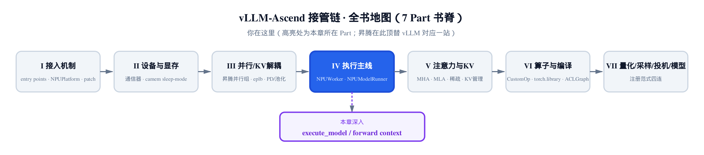
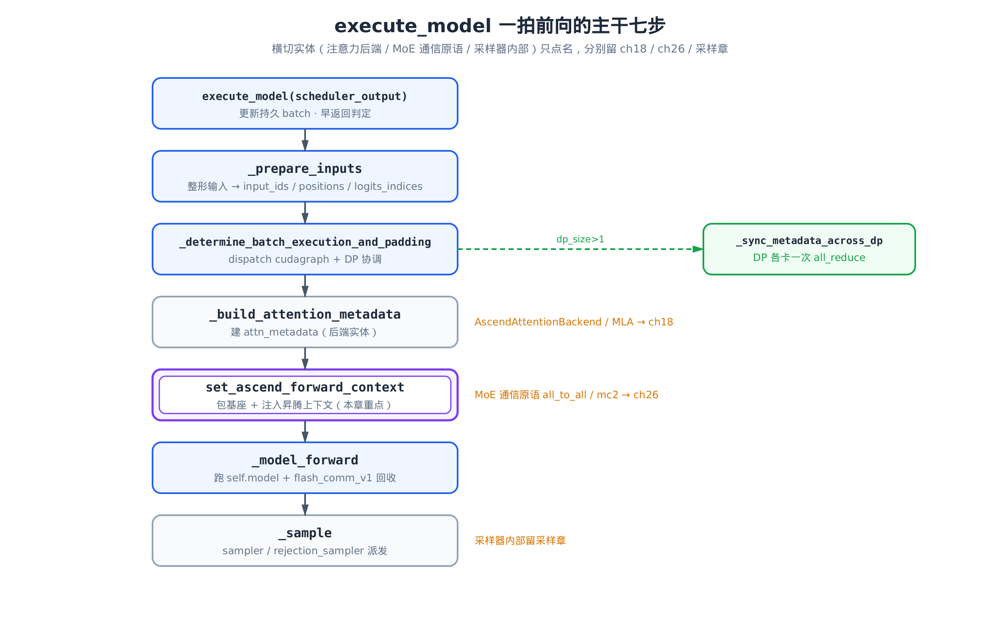
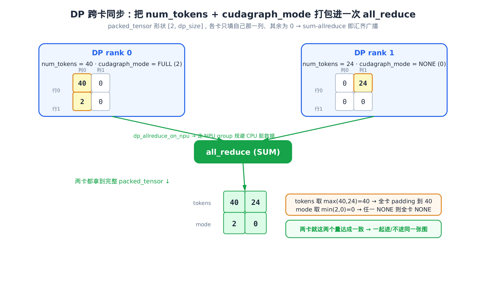
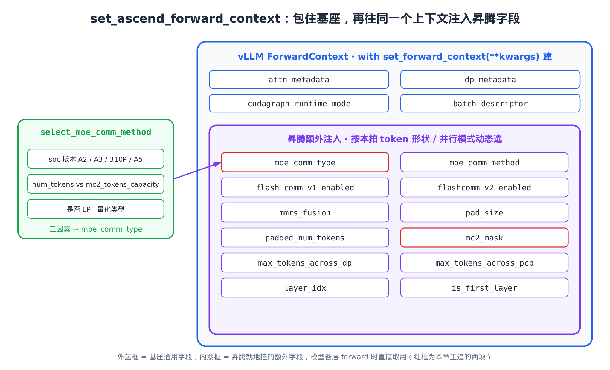

# 第 15 章 一次 execute_model 的真实数据流——昇腾 forward context 注入 + DP 跨卡同步



> 上一章：NPUModelRunner 继承 7000 行父类，只在接缝处临时换符号。
> 本章：让这台机器真正跑一拍前向，看数据怎么流过去。
> 下一章：进入注意力后端，看 attn_metadata 背后的真实算子。

[第 13 章](../ch13-npuworker-execution-control/narrative/chapter.md) 把 `NPUWorker` 的执行控制讲清楚了，[第 14 章](../ch14-npumodelrunner-cuda-monkeypatch/narrative/chapter.md) 又把 `NPUModelRunner` 怎么继承父类、怎么在接缝处换符号拆透了。台子搭好了——可台子终归是台子，**它得真的转一圈，你才知道数据是怎么从调度器的输出，一路走到下一个 token 的 logits 的。**

这一章就跟着一次 `execute_model`（`vllm_ascend/worker/model_runner_v1.py:L1904`）走一遍。主线很朴素：调度器递来一份 `scheduler_output`，模型 runner 把它整形成张量、建好注意力元数据、跑一遍前向、采出 token。但在「跑前向」这一步之前，昇腾插了两件别的栈不一定有的事：

- **DP 跨卡同步**：数据并行（Data Parallel）下每张卡跑不同的请求，但它们要**一起进同一张图**。进图前得先就这一拍的 token 数、图模式达成一致——昇腾比基座多同步了一个标志，还能改走 NPU 通信组。
- **昇腾 forward context 注入**：vLLM 的前向上下文只装通用字段。昇腾要在它之上，按**本拍的 token 形状和并行模式**，动态选好 MoE 用哪种通信、要不要切序列、padding 补几个——这些算一次，写进上下文，模型每一层 forward 时就地取用。

这两件事是本章的重点。我们先把主干七步顺一遍，再回头把这两个接缝逐个掰开。

## 15.1 一拍前向的主干七步

`execute_model` 这个方法本体有四百多行，但**去掉横切分支后，主干非常清爽**——就是把七个步骤串成一条线。先看全景：



> *图注：竖链是主干七步。蓝框是本章要讲的主线步骤，灰框（_build_attention_metadata / _sample）只点名、实体留后续章。绿色虚线分叉出去的 `_sync_metadata_across_dp` 是 DP 同步，只在 dp_size>1 时触发。右侧橙字标出三个横切点各自留在哪一章。*

主干的串联，在源码里就是顺序调用。先看前两步——整形输入、再决定本拍怎么执行：

```python
# vllm_ascend/worker/model_runner_v1.py:L2031-L2068
(
    logits_indices,
    spec_decode_metadata,
    total_num_scheduled_tokens,
    num_scheduled_tokens_compressed_list,
) = self._prepare_inputs(
    scheduler_output,
    num_scheduled_tokens_np,
)

num_tokens_unpadded = scheduler_output.total_num_scheduled_tokens
# … 省略：PCP（上下文并行）下改用 pcp_manager 的 token 计数、cascade attention 预算分支 …

(
    cudagraph_mode,
    batch_desc,
    should_ubatch,
    num_tokens_across_dp,
    cudagraph_stats,
) = self._determine_batch_execution_and_padding(
    num_tokens=num_tokens_unpadded,
    num_reqs=num_reqs,
    num_scheduled_tokens_np=num_scheduled_tokens_np,
    max_num_scheduled_tokens=max_num_scheduled_tokens,
    use_cascade_attn=cascade_attn_prefix_lens is not None,
    force_eager=self.model_config.enforce_eager,
    num_encoder_reqs=len(scheduler_output.scheduled_encoder_inputs),
)
```

`_prepare_inputs` 产出三件套——`logits_indices`、`spec_decode_metadata`、token 总数。`_determine_batch_execution_and_padding` 则吐出一组**「本拍怎么跑」的决策**：用哪种 cudagraph 模式、batch 描述符、以及那个贯穿全章的 `num_tokens_across_dp`（DP 各卡对齐后的 token 数）。**DP 同步就藏在这第二个方法里**——这是本章第一个要深挖的接缝。

往后，主干还有四步：建注意力元数据、预处理、`set_ascend_forward_context` 包住的前向、采样。我们按顺序拆。先看输入整形。

## 15.2 _prepare_inputs：把零散请求拍成连续张量

调度器递来的 `scheduler_output` 是「逻辑」的——它说「请求 A 这拍要算第 100–115 这 16 个位置，请求 B 要算第 50 这 1 个位置」。但 NPU 上的算子吃的是**一根连续的张量**。`_prepare_inputs` 干的就是这个翻译活：把各请求要算的 token，按调度顺序铺平成 `input_ids` / `positions`，再算出从哪里取 logits。

整形的主体是一长串 numpy 索引运算——算每个 token 的绝对位置、用 `torch.index_select` 从持久 batch 里 gather 出 `input_ids`。这些是机械的下标搬运，不是本章重点。真正要看清的是**尾巴上这一步**——`logits_indices` 怎么来：

```python
# vllm_ascend/worker/model_runner_v1.py:L1273-L1287
# … 省略：positions / token_indices / input_ids 的 gather（L760-1272）…
use_spec_decode = len(scheduler_output.scheduled_spec_decode_tokens) > 0
if not use_spec_decode:
    spec_decode_metadata = None
    num_draft_tokens = None
    num_sampled_tokens = np.ones(num_reqs, dtype=np.int32)
    if self.use_cp:
        logits_indices = self.pcp_manager.get_logits_indices(cu_num_tokens, num_reqs, tokens_original)
        logits_indices = logits_indices.pin_memory().to(self.device, non_blocking=True)
    else:
        logits_indices = self.query_start_loc.gpu[1 : num_reqs + 1] - 1
```

抓住最后一行那个不起眼的减一。`query_start_loc` 是各请求在铺平张量里的**起始偏移**，本质是一个前缀和——`query_start_loc[i]` 表示到第 i 个请求为止、累计铺了多少 token。那么 `query_start_loc[1:num_reqs+1] - 1` 就是**每个请求最后一个 token 的位置**。为什么取最后一个？因为自回归解码里，只有序列最末那个 token 的隐藏态才用来预测下一个 token——前面的位置算了是为了喂注意力的 KV，不参与采样。

所以 `logits_indices` 就是一张「采样取址表」：前向跑完拿到一整片 `hidden_states` 后，只在这些下标处抽出来算 logits。开了投机解码时，每个请求要采的位置不止一个（草稿 token 也要验证），`logits_indices` 改由 `_calc_spec_decode_metadata` 给出——但语义不变，仍是「该从哪几个位置取来采样」。

整形完，`input_ids` / `positions` / `logits_indices` 三件套就备齐了。下一站，是进图前那场必须先办的「就位仪式」。

## 15.3 DP 跨卡同步：进同一张图前的就位仪式

先说清**为什么非同步不可**，否则后面那个打包技巧会看得莫名其妙。

数据并行下，假设两张卡 rank 0、rank 1 各自服务一批不同的请求（DP 各卡用 rank 标识：rank 0 = 第一张卡，rank 1 = 第二张卡，依此类推）。这拍里 rank 0 凑了 40 个 token，rank 1 只凑了 24 个。各跑各的本来没事——**坏就坏在 MoE（Mixture of Experts，混合专家：把 FFN 层拆成若干专家模块，每个 token 只路由到其中几个专家，于是产生了跨卡的 token-to-expert 路由通信）。** 混合专家层里的 `all_to_all` / MC2 这类集合通信，要求**所有参与卡在同一时刻、以一致的形状发起**。一旦各卡 token 数不同、或一张卡决定进图、另一张决定 eager 跑，集合通信就会错位，轻则结果错、重则直接挂死。

所以进图之前，DP 各卡必须就两件事达成一致：

1. **统一 padding 到的 token 数**——取各卡的 max，大家都按这个数补齐，形状才一致。
2. **统一的 cudagraph 模式**——要么一起进同一种图，要么一起不进。

基座 vLLM 只同步第一件（num_tokens）。昇腾因为还要管第二件，写了自己的 `_sync_metadata_across_dp`：

```python
# vllm_ascend/worker/model_runner_v1.py:L627-L675
def _sync_metadata_across_dp(
    self,
    num_tokens: int,
    is_draft_model: bool = False,
    cudagraph_mode: CUDAGraphMode = CUDAGraphMode.NONE,
    allow_dp_padding: bool = False,
) -> tuple[int, torch.Tensor | None, CUDAGraphMode]:
    # TODO: In vLLM, the only thing that needs to be synced is num_tokens, but in
    # our case, we still need to sync the other two flags as well. So we need to
    # include them in the all_reduce operation, and more over, we CANNOT skip it
    # even if we are running in eager mode, which harms performance.
    if self.dp_size == 1:
        return num_tokens, None, cudagraph_mode

    if should_skip_allreduce_across_dp_group(self.vllm_config, is_draft_model):
        num_tokens_after_padding = torch.tensor([num_tokens] * self.dp_size, device="cpu", dtype=torch.int32)
        return num_tokens, num_tokens_after_padding, cudagraph_mode

    # On certain devices, CPU-side all_reduce may return dirty data.
    # When dp_allreduce_on_npu is True, route DP metadata
    # synchronization through the NPU device group to avoid data corruption.
    device_str, group = (
        ("npu", get_dp_group().device_group)
        if self.ascend_config.dp_allreduce_on_npu
        else ("cpu", get_dp_group().cpu_group)
    )
    packed_tensor = torch.zeros(2, self.dp_size, device=device_str, dtype=torch.int32)
    packed_tensor[0][self.dp_rank] = num_tokens
    packed_tensor[1][self.dp_rank] = cudagraph_mode.value
    dist.all_reduce(packed_tensor, group=group)
    if device_str == "npu":
        packed_tensor = packed_tensor.cpu()

    # Unpack the results
    num_tokens_across_dp = packed_tensor[0, :]
    max_tokens_across_dp = int(num_tokens_across_dp.max().item())
    synced_cudagraph_mode = CUDAGraphMode(_post_process_cudagraph_mode(packed_tensor))

    # Create a tensor for num_tokens_after_padding
    if allow_dp_padding or is_draft_model:
        num_tokens_after_padding = torch.tensor(
            [max_tokens_across_dp] * self.dp_size, device="cpu", dtype=torch.int32
        )
    else:
        num_tokens_after_padding = num_tokens_across_dp.cpu()

    return max_tokens_across_dp, num_tokens_after_padding, synced_cudagraph_mode
```

这段有三个设计点，挨个看。

**第一，那句开头的 TODO 不是废话——它解释了一个性能取舍。** 基座只需要同步 num_tokens，所以 eager 模式下根本不必 all_reduce（eager 不进图，各卡 token 数不同也无妨）。但昇腾还要同步 cudagraph_mode 这个标志，于是注释里那句大写的 `CANNOT skip`：哪怕在 eager 模式，这次 all_reduce 也省不掉。这确实牺牲了一点性能——是为了正确性付的明账，留了 FIXME 等那两个标志哪天不再需要时再恢复跳过。

**第二，打包技巧——一次 all_reduce 同步两个量。** 看这三行：

```python
packed_tensor = torch.zeros(2, self.dp_size, device=device_str, dtype=torch.int32)
packed_tensor[0][self.dp_rank] = num_tokens
packed_tensor[1][self.dp_rank] = cudagraph_mode.value
dist.all_reduce(packed_tensor, group=group)
```

`packed_tensor` 是个 `[2, dp_size]` 的**全零**张量：第 0 行放各卡的 token 数，第 1 行放各卡的图模式。关键在于**每张卡只写自己那一列**（`self.dp_rank`），其余列保持 0。然后做一次 `all_reduce(SUM)`——`all_reduce` 把每张卡的张量送给所有卡、按指定操作（这里是求和）逐元素归约，归约完所有卡都拿到同一个结果：



> *图注：两卡各自只填自己那一列（黄格），其余为 0。sum-allreduce 后两卡都拿到完整的 [tokens; mode] 表。num_tokens 取 max 做 padding，cudagraph_mode 取 min 保守对齐——任一卡 NONE 则全卡 NONE。dp_allreduce_on_npu 开启时走 NPU group 规避 CPU 脏数据。*

这就是「各填己列、求和即聚合」的惯用法。零初始化 + 仅本 rank 填自己 + `all_reduce(SUM)`，等价于把每张卡的值**汇齐广播**到所有卡——而且只花**一次**集合通信，连 all_gather 都省了。这里值得记一笔账：昇腾比基座多同步了一个 cudagraph_mode，**却没多花一次集合通信**——只是把原本 `[dp_size]` 的张量加高成 `[2, dp_size]`，多搭一行而已。多同步一个量的代价，趋近于零。

**第三，解包时的取向——token 取 max，模式取 min。** token 取 max 好理解（要 padding 到最大的，谁都不能少）。模式为什么取 min？看后处理：

```python
# vllm_ascend/worker/model_runner_v1.py:L4867-L4873
def _post_process_cudagraph_mode(tensor: torch.Tensor) -> int:
    """
    Synchronize cudagraph_mode across DP ranks by taking the minimum.
    If any rank has NONE (0), all ranks use NONE.
    This ensures all ranks send consistent values (all padded or all unpadded).
    """
    return int(tensor[1, :].min().item())
```

`CUDAGraphMode` 里 `NONE = 0` 表示不进图、用 eager 模式逐算子执行；非零值（如 `FULL`）表示进完整图加速。进图的模式取更大的值。取 min 就意味着——**只要有一张卡这拍决定不进图（NONE），所有卡都跟着不进图。** 这是一种保守对齐：进图要求各卡步调严丝合缝，宁可全体退回 eager，也不能一半进图一半不进。

### 它为什么一定对：两条一句话的正确性论证

打包同步看着取巧，正确性其实落在两个单调量上，各一句话说清：

- **sum-allreduce = 广播**：张量零初始化，rank i 只写第 i 列。求和时，第 i 列只有 rank i 那一份非零、其余卡都是加了个 0——所以求和结果的第 i 列，**恒等于** rank i 写进去的值。每张卡 reduce 完，拿到的都是同一张完整表。无需 all_gather，一次 SUM 就汇齐。
- **min 模式保收敛**：`NONE = 0` 是最小值，是这个偏序的「吸收元」。`min` 一旦碰到任意一个 0，结果必为 0。所以「任一卡 NONE → 全卡 NONE」恒成立，不存在「半进图」的中间态。

### 两拍连续追踪：同步把不齐的输入逼成一致

单看一拍容易以为是巧合。把两张卡**连续两拍**的 token 数摆出来，就能看清同步每拍都在干同一件事——把各卡参差的输入，碾平成全卡一致的执行计划：

| 拍 | rank 0 (tokens, mode) | rank 1 (tokens, mode) | all_reduce 后两卡同得 | max(tokens) | min(mode) → 全卡模式 | 结果：一起怎么跑 |
| --- | --- | --- | --- | --- | --- | --- |
| t | (40, FULL=2) | (24, NONE=0) | tokens=[40,24]，mode=[2,0] | 40 | 0 (NONE) | rank 0 跑 40、rank 1 跑 24（eager 各卡保留自己的 token 数），都 eager |
| t+1 | (32, FULL=2) | (48, FULL=2) | tokens=[32,48]，mode=[2,2] | 48 | 2 (FULL) | 都 padding 到 48、都进 FULL 图 |

这里有个容易踩空的细节：**只有进图模式才把各卡统一补到 max；纯 eager 各跑各的。** 决定补不补的，是每张卡用「同步前自己的本地模式」算出的 `allow_dp_padding`（`model_runner_v1.py:L2910`）——`cudagraph_mode != NONE` 或开了 SP 才为真。回看 `_sync_metadata_across_dp` 的解包（L668-673）：`allow_dp_padding` 为真时返回 `[max]*dp_size`（全卡补到 max），为假时返回 `num_tokens_across_dp` 原样（各卡保留自己的数）。

对着两拍看就清楚了。第 t 拍，rank 1 本地已是 NONE、未开 SP，`allow_dp_padding=False`，走 else 分支——rank 0 跑自己的 40、rank 1 跑自己的 24，谁也不补；min 一拉，两卡模式都退回 eager。这恰好呼应本节立的论点：**padding 到 max 是为了一起进同一张图、形状才一致；eager 不进图，本就不需要统一 padding。** 第 t+1 拍，两卡都进图（FULL≠NONE），`allow_dp_padding=True`，token 才真正都补到 max=48，一起进同一张 FULL 图。**进图这一拍，两张卡迈进前向的脚步被强行对齐**——这正是 MoE 集合通信不错位的前提。

### 两条捷径：能跳过同步的情形

同步虽便宜，能省还是省。开头那个 `should_skip_allreduce_across_dp_group` 就是这道闸：

```python
# vllm_ascend/utils.py:L1101-L1106
# For dense models, since we don't actually need dp communication, we simply skip it.
# This usually happens when main model is moe while eagle draft model is dense.
is_context_moe_model = is_drafter_moe_model(vllm_config) if is_draft_model else is_moe_model(vllm_config)
if not is_context_moe_model:
    return True
```

逻辑很直接：**dense（非 MoE）模型根本没有那个会错位的跨卡集合通信，直接跳。** 只有 MoE 模型才需要同步；而 MoE 里也有一类例外——PD 分离（Prefill/Decode separation，把前缀填充和解码拆到不同卡处理）的解码侧、且 prefill/decode 都走 MC2 时，这类 MoE 各卡 token 数本就允许不同，也能跳。跳过意味着各卡 token 数互不干涉，省下这次 all_reduce。

还有那个 `dp_allreduce_on_npu` 开关，值得记一句。注释写明：某些设备上 **CPU 侧的 all_reduce 可能返回脏数据**。开启这个开关后，DP 元数据同步改走 NPU device group，规避数据损坏——代价是结果要多一次 `.cpu()` 拷回 host。这是昇腾踩过坑后留下的一道保险。

## 15.4 同步回来之后：用一致的结论重新 dispatch

同步只是拿到了「全 DP 一致的 token 数和模式」。这两个量还得**回灌**到本卡的执行决策里去——这是在 `_determine_batch_execution_and_padding` 里收尾的：

```python
# vllm_ascend/worker/model_runner_v1.py:L2903-L2924
# Extra coordination when running data-parallel since we need to coordinate
# across ranks
should_ubatch, num_tokens_across_dp = False, None
if self.vllm_config.parallel_config.data_parallel_size > 1:
    _, num_tokens_across_dp, synced_cudagraph_mode = self._sync_metadata_across_dp(
        num_tokens=num_tokens_padded,
        cudagraph_mode=cudagraph_mode,
        allow_dp_padding=(cudagraph_mode != CUDAGraphMode.NONE) or enable_sp(self.vllm_config),
    )

    # Extract DP padding if there is any
    if num_tokens_across_dp is not None:
        dp_rank = self.parallel_config.data_parallel_rank
        num_tokens_padded = int(num_tokens_across_dp[dp_rank].item())
        # Re-dispatch with DP padding
        cudagraph_mode, batch_descriptor = dispatch_cudagraph(
            num_tokens_padded,
            valid_modes={synced_cudagraph_mode},
        )
        # Assert to make sure the agreed upon token count is correct otherwise
        # num_tokens_across_dp will no-longer be valid
        assert batch_descriptor.num_tokens == num_tokens_padded
```

注意这里的因果顺序。同步**之前**，本卡其实已经按自己的 token 数 dispatch（派发/选定图模式）过一次 cudagraph 了。同步**之后**，token 数和模式都可能被别的卡拉变（上一节第 t 拍，rank 0 的 FULL 被 rank 1 拉成了 NONE）。所以必须拿同步回来的结论**重新 dispatch 一次**——`valid_modes={synced_cudagraph_mode}` 把候选模式收敛到全 DP 商定的那一个，`num_tokens_padded` 也换成本卡在对齐后该补到的数。

最后那行 `assert` 是道保险：重新 dispatch 出来的 batch 描述符，其 token 数必须正好等于商定值，否则 `num_tokens_across_dp` 就对不上了，后面 forward context 里的一切 padding 都会跟着错。

到这里，「这一拍怎么跑」彻底定了：token 补到几、进不进图、进哪种图。中间还有一步 `_build_attention_metadata` 建注意力元数据——它产出 `attn_metadata` 交给前向，但后端实体（`AscendAttentionBackend` / MLA）是 [第 18 章](../ch18-attention-backend-mla/narrative/chapter.md) 的主角，本章只用到「建好了、能交给前向」这个接口语义。接下来就是全章的题眼——前向那层 `with` 包裹。

## 15.5 昇腾 forward context：包住基座，再注入

前向真正发生在一个 `with` 块里。先看这个块长什么样：

```python
# vllm_ascend/worker/model_runner_v1.py:L2229-L2258
# Run forward pass
clear_kv_metadata = self.speculative_config is None
with (
    record_function_or_nullcontext("forward"),
    set_ascend_forward_context(
        attn_metadata,
        self.vllm_config,
        num_tokens=num_tokens_padded,
        num_tokens_across_dp=num_tokens_across_dp,
        aclgraph_runtime_mode=cudagraph_mode,
        batch_descriptor=batch_desc,
        num_actual_tokens=scheduler_output.total_num_scheduled_tokens,
        model_instance=self.model,
        max_tokens_across_pcp=0 if self.pcp_size == 1 else self.pcp_manager.max_num_tokens_across_pcp,
        skip_compiled=has_encoder_input,
        has_sinks=self._has_sinks,
        input_ids=input_ids,
    ),
    self.maybe_get_kv_connector_output(
        scheduler_output,
        **(
            {"defer_finalize": not clear_kv_metadata}
        ),
    ) as kv_connector_output,
):
    # … 省略：mamba 缓存对齐分支 …
    hidden_states = self._model_forward(
        num_tokens_padded, input_ids, positions, intermediate_tensors, inputs_embeds, **model_kwargs
    )
```

看清这层结构：**前向 `self._model_forward(...)` 整个被 `set_ascend_forward_context(...)` 这个上下文管理器罩住。** 上一节算出来的 `num_tokens_padded`、`num_tokens_across_dp`、`cudagraph_mode` 全都传了进去。这意味着——模型每一层在 forward 时，都能从这个上下文里读到「这一拍该怎么通信、怎么 padding」。

那 `set_ascend_forward_context` 到底往上下文里塞了什么？这是全章最该逐字读的一段：

```python
# vllm_ascend/ascend_forward_context.py:L56-L191
@contextmanager
def set_ascend_forward_context(
    attn_metadata: Any,
    vllm_config: VllmConfig,
    num_tokens: int = 0,
    num_tokens_across_dp: torch.Tensor | None = None,
    # … 省略：in_profile_run / num_actual_tokens / aclgraph_runtime_mode 等形参 …
    has_sinks=False,
    input_ids=None,
):
    """A context manager that stores the current forward context,
    can be attention metadata, etc.
    We add some additional param into forward_context.
    """
    forward_context_kwargs = {
        "attn_metadata": attn_metadata,
        "vllm_config": vllm_config,
        "num_tokens": num_tokens,
        "num_tokens_across_dp": num_tokens_across_dp,
        "cudagraph_runtime_mode": aclgraph_runtime_mode,
        "batch_descriptor": batch_descriptor,
        "skip_compiled": skip_compiled,
    }
    with set_forward_context(**forward_context_kwargs):
        forward_context = get_forward_context()
        # … 省略：draft_attn_metadatas 等横切字段赋值 …
        forward_context.input_ids = input_ids

        from vllm_ascend.ops.fused_moe.moe_comm_method import get_moe_comm_method

        max_num_tokens = int(num_tokens_across_dp.max().item()) if num_tokens_across_dp is not None else num_tokens
        moe_comm_type = select_moe_comm_method(max_num_tokens, vllm_config, is_draft_model)

        forward_context.moe_comm_type = moe_comm_type
        forward_context.moe_comm_method = get_moe_comm_method(moe_comm_type)

        tp_world_size = get_tensor_model_parallel_world_size()
        # … 省略：in_profile_run / capturing / sinks 等少量标志 …

        # TODO: remove it when torch_npu.npu_mm_reduce_scatter_base supports tp_size >= 16.
        mmrs_fusion = tp_world_size <= 8

        # main model and drafter model may have different architecture
        is_context_moe_model = is_drafter_moe_model(vllm_config) if is_draft_model else is_moe_model(vllm_config)
        if is_context_moe_model:
            flash_comm_v1_enabled = enable_sp(vllm_config) and num_tokens is not None
            mmrs_fusion = False
        elif is_draft_model:
            flash_comm_v1_enabled = False
        else:
            flash_comm_v1_enabled = enable_sp(vllm_config) and num_tokens is not None and num_tokens > 1000
        forward_context.mmrs_fusion = mmrs_fusion
        forward_context.num_tokens = num_tokens
        forward_context.flash_comm_v1_enabled = flash_comm_v1_enabled
        forward_context.flashcomm_v2_enabled = flashcomm2_enable() and tp_world_size > 1 and num_tokens is not None

        forward_context.pad_size = 0
        if forward_context.flash_comm_v1_enabled or forward_context.flashcomm_v2_enabled:
            pad_size = (tp_world_size - (num_tokens % tp_world_size)) % tp_world_size
            forward_context.pad_size = pad_size

        forward_context.layer_idx = None
        if has_layer_idx(model_instance):
            forward_context.layer_idx = model_instance.model.start_layer
        # … 省略：is_first_layer / prefetch 标志 / model_instance 等字段赋值 …

        dp_world_size = get_dp_group().world_size
        if dp_world_size > 1 and forward_context.dp_metadata is not None:
            dp_meta = forward_context.dp_metadata
            max_tokens_across_dp = dp_meta.num_tokens_across_dp_cpu.max().item()
            if forward_context.flash_comm_v1_enabled or forward_context.flashcomm_v2_enabled:
                padded_length = (max_tokens_across_dp + tp_world_size - 1) // tp_world_size * tp_world_size
                pad_size = padded_length - num_tokens
                forward_context.padded_length = padded_length
                forward_context.pad_size = pad_size
        else:
            max_tokens_across_dp = num_tokens

        forward_context.max_tokens_across_dp = max_tokens_across_dp
        forward_context.max_tokens_across_pcp = max_tokens_across_pcp

        if num_tokens is not None:
            if num_actual_tokens is None:
                num_actual_tokens = num_tokens
            # NOTE: token num which need to pad to when mc2
            forward_context.padded_num_tokens = math.ceil(max_tokens_across_dp / tp_world_size) * tp_world_size
            reserved_mc2_mask = get_mc2_mask()
            if reserved_mc2_mask is not None:
                mc2_mask = reserved_mc2_mask[: forward_context.padded_num_tokens]
                mc2_mask[:num_actual_tokens] = True
                mc2_mask[num_actual_tokens:] = False
                forward_context.mc2_mask = mc2_mask
        try:
            yield
        finally:
            pass
```

（其中 `select_moe_comm_method` 按本拍 token 数、并行规模、芯片代次选定 MoE 通信方式，是一整棵决策树——详见 [§15.6 的决策树](#156-select_moe_comm_method每拍前向前先把通信方式定下来)，这里先按「它会返回一种通信类型」往下读。）

整个函数的骨架，就两句话能概括——**先包，再注入**：

```python
with set_forward_context(**forward_context_kwargs):   # ← 包住基座
    forward_context = get_forward_context()
    forward_context.moe_comm_type = ...                # ← 往同一个对象上挂昇腾字段
    forward_context.flash_comm_v1_enabled = ...
    forward_context.mc2_mask = ...
```

`set_forward_context` 是 vLLM 上游的上下文管理器。昇腾**没有改它一行源码**，而是用 `with` 把它包进来：先让基座建好通用上下文，然后 `get_forward_context()` 拿到那个对象，**往它身上继续 `setattr` 一堆昇腾专属字段**。

那被包住的基座，自己又做了什么？看它的核心两段。第一段建数据并行元数据：

```python
# vllm/forward_context.py:L271-L291
dp_metadata: DPMetadata | None = None
if (
    vllm_config.parallel_config.data_parallel_size > 1
    and vllm_config.parallel_config.is_moe_model is not False
    and (attn_metadata is not None or num_tokens is not None)
):
    # If num_tokens_across_dp hasn't already been initialized, then
    # initialize it here. Both DP padding and Microbatching will be
    # disabled.
    if num_tokens_across_dp is None:
        assert ubatch_slices is None
        assert num_tokens is not None
        _, num_tokens_across_dp, _ = coordinate_batch_across_dp(
            num_tokens_unpadded=num_tokens,
            parallel_config=vllm_config.parallel_config,
            allow_microbatching=False,
        )
        assert num_tokens_across_dp is not None
    dp_metadata = DPMetadata.make(
        vllm_config.parallel_config, num_tokens or 0, num_tokens_across_dp
    )
```

留意那个 `if num_tokens_across_dp is None`——**基座原本会在这里自己做一次 DP 协调**（`coordinate_batch_across_dp` 里也藏着 all_reduce）。但回看本节开头 `set_ascend_forward_context` 那层 `with`：昇腾把 `num_tokens_across_dp` 当参数**传了进来**，而它早在 [§15.3](#153-dp-跨卡同步进同一张图前的就位仪式) 的 `_sync_metadata_across_dp` 里就算好了。所以这个 `if` 分支**根本不会进**——基座不再重复协调，只是拿昇腾算好的结果 `DPMetadata.make` 成元数据。两章在这里接上了头：昇腾把 DP 同步提到前面自己做（因为还要捎带 cudagraph_mode），基座这步就被它「短路」了。

第二段，是平台插件的挂钩口：

```python
# vllm/forward_context.py:L298-L308
additional_kwargs = current_platform.set_additional_forward_context(
    attn_metadata=attn_metadata,
    vllm_config=vllm_config,
    dp_metadata=dp_metadata,
    num_tokens=num_tokens,
    num_tokens_across_dp=num_tokens_across_dp,
    cudagraph_runtime_mode=cudagraph_runtime_mode,
    batch_descriptor=batch_descriptor,
    ubatch_slices=ubatch_slices,
)
```

`current_platform.set_additional_forward_context` 是 vLLM 给平台留的**正式扩展口**——昇腾平台可以在这里返一份 `additional_kwargs` 注进上下文。昇腾两条路并用：能走这个正规挂钩的就走，更多按本拍动态算的字段则在 `with` 体内直接 `setattr`（上面那段昇腾函数）。无论走哪条，最终都落到同一个 `forward_context` 对象上。两层关系画出来是这样：



> *图注：外层蓝框是基座 ForwardContext 建的通用字段（attn_metadata / dp_metadata / cudagraph_runtime_mode / batch_descriptor）。内层紫框是昇腾在同一个对象上额外挂的字段——MoE 通信方式、flashcomm 开关、mc2_mask、padding 量等。左边 select_moe_comm_method 按三因素选出 moe_comm_type，注入进去。模型各层 forward 时直接取用。*

### 为什么是「包」而不是「改」

这是昇腾插件味最浓的一笔，值得停一下。基座的 `forward_context` 只认通用字段——它根本不知道什么 MC2、什么 flashcomm。但这些昇腾通信原语在跑模型时，又确实需要一份「这一拍该怎么通信」的上下文。

有三条路：① 给 vLLM 上游提 PR，把这些字段加进基座——但这是昇腾专属，上游不会收；② fork 一份改源码——维护噩梦；③ **包一层，在 `with` 体内往同一个上下文对象上挂自己的字段**。昇腾选了第三条。模型各层（也是昇腾改过的算子）在 forward 时，`get_forward_context()` 拿到的就是这个被「加料」过的对象，直接读 `moe_comm_method` / `mc2_mask` 就行——不改 vLLM 一行，却让昇腾的上下文随前向一路流下去。

### 注入的几个关键字段

挂进去的字段不少，挑本章主线相关的几个说透：

- **moe_comm_type / moe_comm_method**：本拍 MoE 用哪种通信原语。`select_moe_comm_method` 选出类型，`get_moe_comm_method` 据此取出对应的方法实例。[下一节](#156-select_moe_comm_method每拍前向前先把通信方式定下来)专讲。
- **flash_comm_v1_enabled / flashcomm_v2_enabled**：是否启用序列并行（SP）。flashcomm 是昇腾为序列并行设计的通信原语，把 token 沿序列维切分到多卡，v1/v2 是两个不同版本。注意 v1 对非 MoE 模型带一个 `num_tokens > 1000` 的经验阈值——并发高时切换 SP 收益最大，并发低时切换反而劣化，所以低于阈值就不开。MoE 模型不设阈值、draft 模型直接关。
- **mmrs_fusion**：mm_reduce_scatter 融合，仅当 `tp_world_size`（TP = Tensor Parallel 张量并行，把大张量切分到多卡，`tp_world_size` 即参与张量并行的卡数）`<= 8` 且非 MoE 时开（注释挂着 TODO：等算子支持 tp≥16 再放开）。
- **padded_num_tokens / mc2_mask**：MC2 通信要把 token 数补齐到规整形状，并用一张掩码标出哪些是真 token、哪些是 padding。

`padded_num_tokens` 的算法是一道向上取整：

$$
\mathrm{padded\_num\_tokens} = \left\lceil \frac{\mathrm{max\_tokens\_across\_dp}}{\mathrm{tp\_world\_size}} \right\rceil \times \mathrm{tp\_world\_size}
$$

直觉是「补到 tp_world_size 的整数倍」，这样 TP/SP 切分时每张卡分到的 token 数相等，通信缓冲也规整。举个数：DP 对齐后 `max_tokens_across_dp = 40`，`tp_world_size = 8`，那么 padded 到 `ceil(40/8)*8 = 40`，正好整除不用补；若是 `42`，则 `ceil(42/8)*8 = 48`，补 6 个 padding。`mc2_mask` 随即把前 `num_actual_tokens` 个标 `True`、其余标 `False`——真假 token 一目了然，MC2 才不会把 padding 当真数据算进去。

`mc2_mask` 还有个小心思：它不是每拍新分配，而是从一块预留缓冲 `get_mc2_mask()` 上**切片复用**。预分配一次、每拍切前 `padded_num_tokens` 个，省掉反复分配的开销。

注入选好的 `moe_comm_type`，得先有人去选。那个「选」的决策，就在下一节。

## 15.6 select_moe_comm_method：每拍前向前，先把通信方式定下来

注意 `moe_comm_type` 是在**进 `with` 体后、跑前向前**算的——也就是说，**每一拍前向，都会先重选一次通信方式**。为什么不在 MoE 层内部现算？因为通信方式取决于本拍的 token 数、EP/DP 规模、芯片代次——**这些在整个 batch 内是一致的**。前置算一次写进上下文，所有 MoE 层共用，既省掉逐层重复决策，又保证全 batch 用同一种通信，不会东一榔头西一棒子。

决策本身是一棵纯函数决策树：

```python
# vllm_ascend/ascend_forward_context.py:L233-L319
def select_moe_comm_method(num_tokens: int, vllm_config: VllmConfig, is_draft_model=False) -> MoECommType | None:
    """Select the MoE communication method according to parallel settings,
    device generation, token count, and quantization.
    """
    if not is_moe_model(vllm_config):
        return None
    mc2_tokens_capacity = get_mc2_tokens_capacity()
    soc_version = get_ascend_device_type()
    # … 省略：quant_type 读取 …

    if not vllm_config.parallel_config.enable_expert_parallel or get_ep_group().world_size == 1:
        moe_comm_type = MoECommType.ALLGATHER
    elif soc_version in {AscendDeviceType.A2}:
        num_experts = vllm_config.model_config.get_num_experts()
        ep_world_size = (
            vllm_config.parallel_config.world_size_across_dp // vllm_config.parallel_config.pipeline_parallel_size
        )
        num_experts_per_device = num_experts // ep_world_size
        if num_experts_per_device <= 24 and ep_world_size >= 16 and num_tokens <= mc2_tokens_capacity:
            moe_comm_type = MoECommType.MC2
        else:
            moe_comm_type = MoECommType.ALLGATHER

    elif soc_version in {AscendDeviceType.A3}:
        fused_mc2_enable = get_ascend_config().enable_fused_mc2
        dispatch_ffn_combine_enable = get_ep_group().world_size <= 32 and (not is_draft_model)
        if num_tokens <= mc2_tokens_capacity:
            # … 省略：fused_mc2_enable 的 1/2 两档细分 …
            moe_comm_type = MoECommType.FUSED_MC2 if fused_decode_enable else MoECommType.MC2
        else:
            # … 省略：prefill 侧 fused 细分 …
            moe_comm_type = MoECommType.FUSED_MC2 if fused_prefill_enable else MoECommType.ALLTOALL
    elif soc_version in {AscendDeviceType._310P}:
        moe_comm_type = MoECommType.ALLGATHER
    elif soc_version in {AscendDeviceType.A5}:
        num_experts_per_tok = vllm_config.model_config.hf_text_config.num_experts_per_tok
        world_size = vllm_config.parallel_config.world_size_across_dp
        if num_tokens <= mc2_tokens_capacity and world_size > 1:
            moe_comm_type = MoECommType.MC2
        elif world_size <= num_experts_per_tok:
            moe_comm_type = MoECommType.ALLGATHER
        else:
            moe_comm_type = MoECommType.ALLTOALL
    else:
        raise ValueError(f"Unsupported soc_version: {soc_version}")
    return moe_comm_type
```

先认一下这四种通信方式（这里只点机制，落地实现与性能权衡留 [第 26 章](../ch26-moe-communication-primitives/narrative/chapter.md)）：

- **ALLGATHER**：每张卡把本地 token 用 all-gather 发给所有卡，各卡拿到全量再各算各的专家。
- **ALLTOALL**：卡间点到点重排，把每个 token 按路由结果送到它的目标专家所在的卡。
- **MC2**：昇腾把 dispatch/combine 与矩阵计算融合在一起的通信原语。
- **FUSED_MC2**：MC2 的进一步融合版本。

别被分支吓到，骨架就三层判断，串起来一句话讲清：

| 判据 | 取值 | 选的通信方式 | 直觉 |
| --- | --- | --- | --- |
| 不是 MoE 模型 | — | `None`（不选） | dense 模型没有专家通信 |
| 没开 EP，或 EP 世界只有 1 卡 | — | `ALLGATHER` | 专家没拆到多卡，all_gather 最省事 |
| 芯片 A2 | 每卡专家少、EP≥16、token 不超容量 | `MC2` | 大 EP + 小 batch，MC2 收益最大 |
| 芯片 A2 | 否则 | `ALLGATHER` | 退回稳妥方案 |
| 芯片 A3 | token ≤ 容量（decode 态） | `MC2` / `FUSED_MC2` | 小 batch 走 MC2，可选融合版 |
| 芯片 A3 | token > 容量（prefill 态） | `ALLTOALL` / `FUSED_MC2` | 大 batch 用 all_to_all |
| 芯片 310P | — | `ALLGATHER` | 推理卡不支持 MC2 |
| 芯片 A5 | 按 token 数、world_size 三分 | `MC2` / `ALLGATHER` / `ALLTOALL` | 按规模挑最优 |

三个因素一目了然：**是否 MoE+是否 EP**（要不要通信）、**芯片代次**（A2/A3/310P/A5 各有所长）、**token 数对比 `mc2_tokens_capacity`**（小 batch 偏 MC2、大 batch 偏 all_to_all）。`mc2_tokens_capacity` 这个分水岭很关键——MC2 在 token 少时延迟低，但 token 一多就不划算，所以超过容量就切到 all_to_all。

选出来的 `MoECommType`（`ALLGATHER` / `MC2` / `ALLTOALL` / `FUSED_MC2` 之一）写进 `forward_context.moe_comm_type`，`get_moe_comm_method` 再据此取出对应的通信方法实例挂上去。**至于这些原语各自怎么实现——MC2 的 dispatch/combine、all_to_all 的 token 重排——那是 [第 26 章](../ch26-moe-communication-primitives/narrative/chapter.md) 的内容。本章只讲到「这一拍选定了哪种、写进了上下文」为止。**

## 15.7 跑前向、采 token：主干的最后两步

上下文备好，`_model_forward` 就在这个加料过的上下文里真正跑模型：

```python
# vllm_ascend/worker/model_runner_v1.py:L2756-L2792
def _model_forward(
    self,
    num_tokens_padded: int,
    input_ids: torch.Tensor | None = None,
    positions: torch.Tensor | None = None,
    intermediate_tensors: IntermediateTensors | None = None,
    inputs_embeds: torch.Tensor | None = None,
    **model_kwargs: dict[str, Any],
):
    assert self.model is not None
    forward_context = get_forward_context()
    assert forward_context is not None

    model_inputs: dict[str, Any] = {
        "input_ids": input_ids,
        "positions": positions,
        "intermediate_tensors": intermediate_tensors,
        "inputs_embeds": inputs_embeds,
        **model_kwargs,
    }
    run_model = partial(self.model, **model_inputs)

    if self.enable_enpu:
        # The soft segmentation scenario requires event.record first, then event.wait
        self._update_full_graph_params_if_needed(
            forward_context, num_tokens_padded, positions
        )
        hidden_states = run_model()
    else:
        hidden_states = run_model()
        self._update_full_graph_params_if_needed(
            forward_context, num_tokens_padded, positions
        )

    if forward_context.flash_comm_v1_enabled and not isinstance(hidden_states, IntermediateTensors):
        hidden_states = self._all_gather_hidden_states_and_aux(hidden_states)
    return hidden_states
```

主体就是 `run_model()` 跑一遍 `self.model`。中间那个 `enable_enpu` 分支只是个执行顺序的小适配——ENPU 是昇腾的软切分（soft segmentation）模式，开启时注释要求「先 `event.record` 再 `event.wait`」，所以把事件记录提到了跑模型之前，否则维持「先跑、后记录」。真正的看点是最后那个 `if`——它**回应了上一节注入的 `flash_comm_v1_enabled`**。如果这拍开了 flashcomm v1（序列并行），前向时 token 被沿序列维切到各卡了，出来的 `hidden_states` 是分片的；这里就用 `_all_gather_hidden_states_and_aux` 把分片 all_gather 拼回完整张量——SP 切分的逆操作。**注入的字段，在这里被消费了**：上下文不是写完就摆着看的，它实打实地改变了前向的行为。

拿到 `hidden_states`，主干就剩采样。前向后会用 `logits_indices`（§15.2 那张取址表）抽出要采样的位置、算出 logits，最后派给 `_sample`：

```python
# vllm_ascend/worker/model_runner_v1.py:L2553-L2579
def _sample(self, logits, spec_decode_metadata):
    # Sample the next token and get logprobs if needed.
    self.input_batch.update_async_output_token_ids()
    sampling_metadata = self.input_batch.sampling_metadata
    if spec_decode_metadata is None:
        if lmhead_tp_enable() and logits is not None:
            logits = logits[: self.input_batch.num_reqs]
        # … 省略：enable_reduce_sample 时 prepare_sampling(max_topk) …
        return self.sampler(
            logits=logits,
            sampling_metadata=sampling_metadata,
        )

    if lmhead_tp_enable() and logits is not None:
        logits = logits[: len(spec_decode_metadata.logits_indices)]
    # … 省略：rejection_sampler 的 prepare_sampling …
    sampler_output = self.rejection_sampler(
        spec_decode_metadata,
        None,  # draft_probs
        logits,
        sampling_metadata,
    )
    return sampler_output
```

`_sample` 是个干净的二选一派发：**没开投机解码**（`spec_decode_metadata is None`），走普通 `self.sampler`；**开了投机解码**，走 `self.rejection_sampler` 做拒绝采样，验证草稿 token。`lmhead_tp_enable` / `enable_reduce_sample` 这些是昇腾为 lm_head 张量并行做的小适配。**采样器内部怎么实现 top-k / top-p / 拒绝采样，留给后续的采样章——本章主干到「派给哪个采样器」就收口。**

至此，一拍前向走完：调度器的输出 → 整形成张量 → DP 对齐 → 建注意力元数据 → 包上昇腾上下文跑前向 → 采出下一个 token。

## 15.8 精简版交叉验证：把决策跑起来看数值

昇腾的真实前向算子、真实 `all_reduce`、MC2 通信，在没有 NPU/CANN 的机器上跑不起来。但本章三个**决策**部分是纯 Python——`select_moe_comm_method` 选通信方式、`set_ascend_forward_context` 注入字段、`_sync_metadata_across_dp` 打包同步，逻辑都不碰算子。所以可以把它们单独拎出来跑，验证控制流没讲错。

把 §15.3 那两拍的同步喂进去，看 `_sync_metadata_across_dp` 的解包是否真如表所示：rank 0 填 `(40, FULL)`、rank 1 填 `(24, NONE)`，模拟 sum-allreduce 后——`num_tokens_across_dp` 应得 `[40, 24]`，`max` 取 40；`cudagraph_mode` 经 `_post_process_cudagraph_mode` 取 min，应得 `NONE`。两卡就此对齐到「padding 到 40、一起 eager」，和我们在 §15.3 推的完全一致。`select_moe_comm_method` 也一样：把 token 数从「小于容量」调到「大于容量」，看 A3 芯片下返回值从 `MC2` 翻成 `ALLTOALL`——分水岭就在 `mc2_tokens_capacity` 那一刀。

数值对得上，说明这条主干的**决策骨架**是忠实的。至于算子真跑出来的隐藏态、真 all_reduce 的字节流，那要上 NPU 才看得到——精简版的职责到「控制流跑通、数值对得上」为止，它从来不是主角，真实源码才是。

## 小结：一拍前向，两个昇腾接缝

回到开篇。台子搭好不算数，转一圈才知道数据怎么流。这一章把一次 `execute_model` 拆成了七步主干，重点掰开了昇腾插进去的两个接缝：

- **DP 跨卡同步**（§15.3，`vllm_ascend/worker/model_runner_v1.py:L627`）：进同一张图前，DP 各卡必须就 token 数和图模式达成一致。昇腾比基座多同步一个 cudagraph_mode，用 `[2, dp_size]` 零张量 + 各填己列 + 一次 sum-allreduce 把两个量一起汇齐——多同步一个量，不多花一次集合通信。token 取 max 做 padding，模式取 min 保守对齐（任一 NONE 则全 NONE）。还能改走 NPU group 规避 CPU 脏数据。
- **昇腾 forward context 注入**（§15.5–15.6，`vllm_ascend/ascend_forward_context.py:L56`）：不改 vLLM（`vllm/forward_context.py`）一行，用 `with set_forward_context(...)` 包住基座，再往同一个上下文对象上挂昇腾专属字段。每拍前向前用 `select_moe_comm_method` 按芯片代次、EP/DP 规模、token 数选好 MoE 通信方式，连同 flashcomm 开关、mc2_mask、padding 量一起注入——模型各层 forward 时就地取用，`_model_forward` 里的 flashcomm 回收就是对注入字段的消费。

两个接缝都体现了同一种插件哲学：**不动上游，包一层、注一手，让昇腾的并行决策随前向一路流下去。**

这一拍里，我们三次「点到为止」，给后面三章留了引子。注意力元数据建好了，但 `AscendAttentionBackend` / MLA 的真实算子是 [第 18 章](../ch18-attention-backend-mla/narrative/chapter.md) 的事；MoE 通信方式选定了，但 MC2 / all_to_all 这些原语怎么落地，是 [第 26 章](../ch26-moe-communication-primitives/narrative/chapter.md) 的主场；logits 派给了采样器，采样器内部留给后续的采样章。台子转起来了，下一章我们就钻进注意力，看 `attn_metadata` 背后那些真正碰 NPU 的算子。
