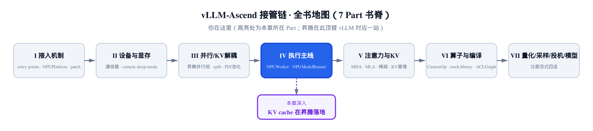
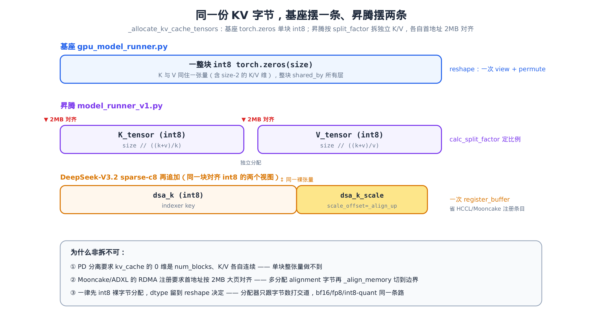
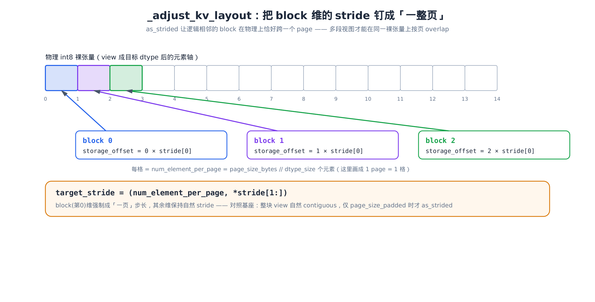
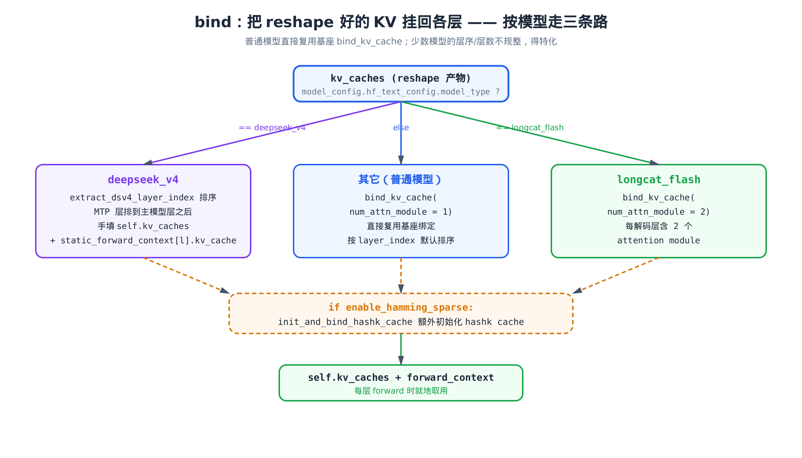

# 第 16 章 KV cache 在昇腾上的落地：分配、reshape 与绑定



> 上一章：让这台机器真正跑一拍前向。
> 本章：补上前向用的 KV 张量怎么在 NPU 显存里摆。
> 下一章：进入注意力后端，看这些 KV 张量怎么被算子消费。

[第 13 章](../ch13-npuworker-execution-control/narrative/chapter.md) 里 `NPUWorker` 跑完 profiling、算出了「这张卡能放多少个 KV block」的预算；[第 15 章](../ch15-single-step-forward-context-dp-sync/narrative/chapter.md) 里 `execute_model` 跑了一拍前向，前向里每一层注意力都伸手向 `self.kv_caches` 要它那块 K、V 张量。

可这中间有一道没讲的缝：**预算只是一串字节数，前向要的是带 dtype、带形状、还得挂在正确层上的真实张量。** 谁把字节数变成张量？这就是本章的主角——`initialize_kv_cache_tensors`。

它本身只有三步：分配（allocate）→ 重整（reshape）→ 绑定（bind）。要是放在基座 GPU 上，这三步平平无奇。但搬到昇腾，每一步都被改写过——而且都是**非改不可**的改写。本章就把这三步在昇腾上多做的事，一件件对着基座 `gpu_model_runner.py` 掰开：

- **分配**：KV 一律先按 int8 裸字节分配，再把每层的 K、V 拆成两块**独立**张量，每块首地址按 2MB 对齐（仅在开 KV 传输时）。基座是一整块。
- **重整**：用 `torch.as_strided` 按 page 跨步重排出 NPU 物理布局。基座是一次 `view` + `permute`。
- **绑定**：普通模型直接复用基座；但 DeepSeek-V4、longcat 这些层序/层数不规整的，得各走各的特化路。

## 16.1 三步骨架：从字节到挂回各层

先看总入口。`initialize_kv_cache` 在物化 KV 之前，先 `deepcopy` 一份配置、补好 encoder/kv-sharing 层、初始化注意力后端，再调 `may_reinitialize_input_batch`（本章 [§16.8](#168-两条辅线spec-解析与输入批重建) 的辅线），最后把活儿交给 `initialize_kv_cache_tensors`：

```python
# vllm_ascend/worker/model_runner_v1.py:L3700
def initialize_kv_cache(self, kv_cache_config, is_profiling=False):
    kv_cache_config = deepcopy(kv_cache_config)
    self.kv_cache_config = kv_cache_config
    # … 省略：mamba buffer 置空、补 encoder-only / kv-sharing 层 …
    self.initialize_attn_backend(kv_cache_config, is_profiling=is_profiling)
    self.use_hybrid_blocks = len(self.attn_groups) > 1
    # … 省略：need_accepted_tokens 判定（mamba 路）…
    self.may_reinitialize_input_batch(kv_cache_config)
    kv_caches = self.initialize_kv_cache_tensors(kv_cache_config)
    # … 省略：投机解码 drafter / kv_transfer register / routed_experts 三段旁路注册 …
```

`initialize_kv_cache_tensors` 是本章的脊柱。它的结构清爽得几乎像目录——三步，每步一行：

```python
# vllm_ascend/worker/model_runner_v1.py:L3764
def initialize_kv_cache_tensors(self, kv_cache_config: KVCacheConfig) -> dict[str, torch.Tensor]:
    # Initialize the memory buffer for KV cache
    kv_cache_raw_tensors = self._allocate_kv_cache_tensors(kv_cache_config)
    # Change the memory buffer to the desired shape
    kv_caches = self._reshape_kv_cache_tensors(kv_cache_config, kv_cache_raw_tensors)

    # Set up cross-layer KV cache sharing
    for layer_name, target_layer_name in self.shared_kv_cache_layers.items():
        logger.debug("%s reuses KV cache of %s", layer_name, target_layer_name)
        kv_caches[layer_name] = kv_caches[target_layer_name]

    if self.model_config.hf_text_config.model_type == "deepseek_v4":
        from vllm_ascend.utils import extract_dsv4_layer_index

        assert len(self.kv_caches) == 0
        for layer_name in sorted(
                kv_caches,
                key=lambda name: (extract_dsv4_layer_index(
                    self.model_config.hf_text_config, name), name)):
            self.kv_caches.append(kv_caches[layer_name])
        for layer_name, kv_cache in kv_caches.items():
            self.compilation_config.static_forward_context[
                layer_name].kv_cache = [kv_cache]
    else:
        from vllm.v1.worker.utils import bind_kv_cache

        num_attn_module = 2 if self.model_config.hf_text_config.model_type == "longcat_flash" else 1
        bind_kv_cache(kv_caches, self.compilation_config.static_forward_context, self.kv_caches, num_attn_module)

    if self.enable_hamming_sparse is True:
        from vllm_ascend.worker.kvcomp_utils import init_and_bind_hashk_cache
        init_and_bind_hashk_cache(
            kv_caches=kv_caches,
            num_attn_module=num_attn_module,
            # … 省略：vllm_config / device / compilation_config / kvcomp_meta_data 透传 …
        )

    return kv_caches
```

读这一段，先抓骨架别陷进分支：`_allocate_kv_cache_tensors` 拿回一份「字节张量」字典，`_reshape_kv_cache_tensors` 把它整形成「可用 KV」字典，剩下整段 `if/else` 都是**绑定**——把可用 KV 挂回 `self.kv_caches` 和 `static_forward_context`。绑定为什么要分三路、`extract_dsv4_layer_index` 在排什么，留到 [§16.7](#167-bind按模型走三条路)。

整条流水线的产物在变，可以摆成一张图：



> *图注：同一份 KV 字节，基座摆一条 int8 整张量，昇腾按比例拆成独立的 K、V 两条，各自首地址 2MB 对齐。sparse-c8 再追加 dsa_k / dsa_k_scale 两个共享同一裸张量的视图。底部三条是「为什么非拆不可」的根因。*

下面三节顺着这张图，把分配这一步的三件事——对齐、拆 K/V、sparse 双视图——逐个落到源码。

## 16.2 对齐原语：为什么是 2MB，怎么对齐到 2MB

分配的第一个常量，是 `_allocate_kv_cache_tensors` 开头那行 `alignment = 2 * 1024 * 1024`——2MB。为什么是 2MB？这要从 [PD 分离（见第 10 章）](../ch10-pd-disaggregation-mooncake/narrative/chapter.md)说起：prefill 节点算完的 KV 要跨节点搬给 decode 节点，Mooncake/ADXL 就是承担这趟搬运的分布式 KV 传输系统。它走 RDMA、把 KV 张量注册成可被远端直读的内存区间，而这套注册要求**起始地址按 2MB 大页边界对齐**。对不齐，注册就失败。

要先说清楚一件事：**这段对齐只在开了 KV 传输（即配置了 `kv_transfer_config`）时才真正生效**，没开传输时分配走的是另一条不对齐的快路——下一节 [§16.3](#163-int8-裸分配--把-kv-拆成两块) 见分晓。

对齐落到两个纯算术原语。它们在源码里不相邻，但讲清「对齐到多少、怎么对齐」得放一起看：

```python
# vllm_ascend/worker/model_runner_v1.py:L3758
def _align_memory(self, tensor: torch.Tensor, alignment: int) -> torch.Tensor:
    data_ptr = tensor.data_ptr()
    aligned_addr = (data_ptr + alignment - 1) // alignment * alignment
    offset = (aligned_addr - data_ptr) // tensor.element_size()
    return tensor[int(offset) :]

# … 省略：中间隔着 initialize_kv_cache_tensors 等方法 …

# vllm_ascend/worker/model_runner_v1.py:L3847
@staticmethod
def _align_up(value: int, alignment: int) -> int:
    return (value + alignment - 1) // alignment * alignment
```

`_align_up` 是「整数向上取整到 `alignment` 的倍数」，就是那个经典的整数天花板公式：

$$
\mathrm{align\_up}(v, a) = \left\lceil \frac{v}{a} \right\rceil \cdot a = \left\lfloor \frac{v + a - 1}{a} \right\rfloor \cdot a
$$

人话：先把 `v` 加上 `a-1`（保证只要有余数就进位），整除 `a` 再乘回去。来两行数值看它怎么动：

| `value` | `alignment` | `(v+a-1)//a` | 返回 | 解读 |
|---|---|---|---|---|
| `2M` | `2M` | `1` | `2M` | 恰好一页 → 不变 |
| `2M + 1` | `2M` | `2` | `4M` | 多 1 字节 → 抬一整页 |

`_align_memory` 把这套用到**真实地址**上：拿到张量的 `data_ptr()`，用同一个天花板公式算出第一个 ≥ 它、且是 `alignment` 倍数的地址 `aligned_addr`，再把超出的字节数换算成元素个数 `offset`，最后 `tensor[offset:]` 切掉头部、让新起点正好落在 2MB 边界。代价是最坏浪费 `< 2MB` 的头部——这是后面 `_allocate_int8_cache_tensor` 要「多分配 `alignment` 字节」的原因：得留出这段可能被切掉的余量。

## 16.3 int8 裸分配 + 把 K/V 拆成两块

有了对齐原语，看统一的分配出口 `_allocate_int8_cache_tensor`。它是「KV 一律先按 int8 裸字节分配」这条铁律的物化点：

```python
# vllm_ascend/worker/model_runner_v1.py:L3851
def _allocate_int8_cache_tensor(self, numel: int, alignment: int) -> torch.Tensor:
    """Allocate an int8 raw cache tensor.

    When KV transfer is enabled, the returned tensor's data_ptr is aligned
    to `alignment`. This keeps the original Mooncake/ADXL alignment behavior.
    """
    if numel <= 0:
        raise ValueError(f"Invalid cache tensor size: {numel}")

    if self.vllm_config.kv_transfer_config is None:
        return torch.zeros(numel, dtype=torch.int8, device=self.device)

    raw_tensor = torch.zeros(
        numel + alignment,
        dtype=torch.int8,
        device=self.device,
    )
    return self._align_memory(raw_tensor, alignment)[:numel]
```

两条路：没开 KV 传输时，直接 `torch.zeros(numel, dtype=torch.int8)`——要多少字节就分多少；开了 KV 传输，多分配 `alignment` 字节（那段余量），再 `_align_memory` 把首地址抬到 2MB 边界、`[:numel]` 取够用的长度。**dtype 永远是 `int8`**——分配器从头到尾只跟字节数打交道。bf16、fp16、fp8、int8 量化的 KV，在这一步没有区别，dtype 留到 reshape 才决定。

为什么这么设计？因为有了「只认字节」的统一分配，PD 分离的按字节对齐、RDMA 的按字节注册才有了单一入口——不必为每种 KV dtype 写一套分配逻辑。

接着是昇腾分配里最关键的一刀：**把每层的 KV 拆成独立的 K、V 两块。** 基座不拆，整层就一块：

```python
# vllm/v1/worker/gpu_model_runner.py:L6637（对照基座）
def _allocate_kv_cache_tensors(self, kv_cache_config):
    kv_cache_raw_tensors: dict[str, torch.Tensor] = {}
    for kv_cache_tensor in kv_cache_config.kv_cache_tensors:
        tensor = torch.zeros(
            kv_cache_tensor.size, dtype=torch.int8, device=self.device
        )
        for layer_name in kv_cache_tensor.shared_by:
            kv_cache_raw_tensors[layer_name] = tensor
    # … 省略：断言每层都被初始化 …
    return kv_cache_raw_tensors
```

基座一层一块 `torch.zeros(size, int8)`，整块共享给 `shared_by` 的所有层，K、V 同住一张量（靠后面 reshape 出一个 size-2 的 K/V 维区分）。昇腾这块同名方法近 180 行，但去掉旁路分支后，标准注意力这条主干是这样：

```python
# vllm_ascend/worker/model_runner_v1.py:L3929
def _allocate_kv_cache_tensors(self, kv_cache_config: KVCacheConfig) -> dict[str, torch.Tensor]:
    # … 省略：docstring（说明为支持 prefill 解耦要拆 K/V 且 2MB 对齐）…
    kv_cache_raw_tensors = {}
    # prefill disaggregation need the addr of cache tensor be aligned with 2M
    alignment = 2 * 1024 * 1024
    layer_kv_cache_spec = self._get_layer_kv_cache_specs(kv_cache_config)
    # … 省略：hybrid_with_attn_and_mamba 探测 …
    for kv_cache_tensor in kv_cache_config.kv_cache_tensors:
        # … 省略：use_mamba / use_attn 标记 …
        for idx in range(len(kv_cache_tensor.shared_by)):
            layer_name = kv_cache_tensor.shared_by[idx]
            # … 省略：mamba / linear_attn / cache_only / use_compress 单张量分支 …
            elif "attn" in layer_name and layer_name not in kv_cache_raw_tensors and not use_mamba:
                # NOTE: We need to init k cache tensor (nope cache tensor in mla) and
                # v cache tensor (rope cache tensor in mla) separately to support prefill disaggregation,
                # as it only support the 0-dim of kv_cache is `num_blocks`.
                current_kv_cache_spec = layer_kv_cache_spec[layer_name]
                assert isinstance(current_kv_cache_spec, AttentionSpec)

                if self.use_sparse:
                    # … 省略：sparse-c8 的 ratio 解包（见 §16.4）…
                    pass
                else:
                    k_dim, v_dim = self._get_attention_kv_cache_dims(layer_name, current_kv_cache_spec)
                    assert k_dim > 0 and v_dim > 0
                    kv_head_dim_list = [k_dim, v_dim]
                    # … 省略：enable_fa_quant 时改用量化 split factor …
                    k_tensor_split_factor, v_tensor_split_factor = calc_split_factor(kv_head_dim_list)

                k_tensor_size = int(kv_cache_tensor.size // k_tensor_split_factor)
                if v_tensor_split_factor is not None:
                    v_tensor_size = int(kv_cache_tensor.size // v_tensor_split_factor)
                else:
                    v_tensor_size = None
                # … 省略：sparse 时另算 dsa_k / dsa_k_scale 尺寸 …

                # Allocate raw int8 tensors. Even bf16/fp16 KV cache entries
                # are allocated as int8 raw bytes first and then viewed as
                # the target dtype in _reshape_kv_cache_tensors.
                k_tensor = self._allocate_int8_cache_tensor(k_tensor_size, alignment)
                if v_tensor_size is not None:
                    v_tensor = self._allocate_int8_cache_tensor(v_tensor_size, alignment)
                # … 省略：sparse 时分配 dsa_k(/scale)（见 §16.4）…

                for layer_name_inner in kv_cache_tensor.shared_by:
                    if "attn" in layer_name_inner and "linear_attn" not in layer_name_inner:
                        # … 省略：sparse 装成多元组 …
                        kv_cache_raw_tensors[layer_name_inner] = (k_tensor, v_tensor)
    # … 省略：断言 layer_names 与 kv_cache_raw_tensors 键集一致 …
    return kv_cache_raw_tensors
```

注意那行注释的双关：`k cache tensor (nope cache tensor in mla)`——拆 K/V 不只是为了 PD 分离把两块各自连续，对 DeepSeek MLA 还顺手把压缩 KV 的 nope 段、rope 段分到了 K、V 两块（[§16.5](#165-reshape把裸字节还原成-kv) 详谈）。注释说得直白：PD 传输只支持 `kv_cache` 的第 0 维是 `num_blocks`。原因在传输协议这一层——它按第 0 维以 block 为粒度连续切片搬运，要求每块张量的 0 维就是 `num_blocks`、块内连续；若 K、V 同住一张量、第 0 维顶着一个 size-2 的 K/V 维，协议就没法把 K、V 各自当成独立的连续区间分别注册、分别传，所以必须拆成两块。

拆多大？靠 `calc_split_factor` 从 head 维度推：

```python
# vllm_ascend/utils.py:L1441
def calc_split_factor(num_list: list[int]):
    total = sum(num_list)
    return [total / num for num in num_list]
```

给一组 head 维度 `[k_dim, v_dim]`，返回 `[(k+v)/k, (k+v)/v]`，再用整块字节数 `size // factor` 切。注意 `calc_split_factor` 返回的是浮点比例，但分配处写的是 `int(kv_cache_tensor.size // factor)`——显式向下取整成整字节，并不假设这个浮点除法恰好整除。万一切出来对不齐，[§16.5](#165-reshape把裸字节还原成-kv) 反推 `num_blocks` 时那句 `sum_page_size_bytes % page_size_bytes == 0` 的断言会当场拦下，不会把舍入误差悄悄带进后续形状。这样切出来的 K、V 字节数，正好按各自 head 维度占比分。

下面拿两类注意力对比。**GQA**（Grouped Query Attention，分组查询注意力）的 K、V 头数对称；**MLA**（Multi-head Latent Attention，多头潜在注意力，DeepSeek 系用的压缩 KV）则把 KV 压成 nope（`kv_lora_rank` 低秩压缩段）与 rope（`qk_rope_head_dim` 旋转位置段）两段、维度悬殊：

| 模型 | `[k_dim, v_dim]` | `calc_split_factor` | `k_tensor_size` | `v_tensor_size` | 字节占比 |
|---|---|---|---|---|---|
| GQA（K/V 对称） | `[64, 64]` | `[2.0, 2.0]` | `size // 2` | `size // 2` | 恰好对半 |
| DeepSeek MLA | `[512, 64]` | `[576/512, 576/64]` | `size·512/576` | `size·64/576` | nope 占 8/9 |

GQA 的 K、V head 数对称，所以对半；MLA 的 nope（`kv_lora_rank=512`）比 rope（`qk_rope_head_dim=64`）大得多，K 块就吃掉 8/9 的字节。**这是「为什么拆、拆多少」的完整算术答案**——拆出来的两块字节数忠实反映各自负载，绝不是机械对半。

## 16.4 sparse-c8 的双视图：两段 KV 共享一块对齐内存

DeepSeek-V3.2 的稀疏注意力（sparse-c8）在 K、V 之外还要一对 indexer 张量：`dsa_k`（int8 的 indexer key）和 `dsa_k_scale`（它的量化 scale）。朴素做法是各分一块，但那样 RDMA 注册条目就多一份。昇腾的做法是把这两段塞进**同一块对齐 int8 裸内存的两个视图**：

```python
# vllm_ascend/worker/model_runner_v1.py:L3874
def _allocate_sparse_c8_indexer_tensors(
    self, dsa_k_tensor_size, dsa_k_scale_tensor_size, alignment, scale_dtype,
) -> tuple[torch.Tensor, torch.Tensor]:
    """Allocate dsa_k and dsa_k_scale from one aligned int8 raw allocation.

    Both returned tensors are logical views into the same underlying storage.
    This reduces HCCL/Mooncake registration count because register_buffer
    can merge these two views into one registered memory range.
    """
    # … 省略：两个 size 的 <=0 校验 …
    scale_dtype_size = torch.empty((), dtype=scale_dtype).element_size()

    # Ensure the scale view starts at an address aligned for scale_dtype.
    scale_offset = self._align_up(dsa_k_tensor_size, scale_dtype_size)
    total_raw_size = scale_offset + dsa_k_scale_tensor_size

    sparse_c8_raw_tensor = self._allocate_int8_cache_tensor(total_raw_size, alignment)

    dsa_k_tensor = sparse_c8_raw_tensor[:dsa_k_tensor_size]
    dsa_k_scale_tensor = sparse_c8_raw_tensor[
        scale_offset : scale_offset + dsa_k_scale_tensor_size
    ]

    assert dsa_k_tensor.is_contiguous()
    assert dsa_k_scale_tensor.is_contiguous()
    assert dsa_k_scale_tensor.data_ptr() % scale_dtype_size == 0
    assert dsa_k_scale_tensor.numel() % scale_dtype_size == 0

    return dsa_k_tensor, dsa_k_scale_tensor
```

`_align_up` 在这里第二次出场，但对象变了：上一节它对齐的是 2MB 地址，这里对齐的是 **scale 视图在裸张量内的偏移**。`dsa_k` 占 `[:dsa_k_tensor_size]`，紧接着的 `dsa_k_scale` 不能从随便哪个字节起——它的 dtype 可能是 float16（2 字节），起点地址必须按 `scale_dtype_size` 对齐——因为 PyTorch 的 `.view(scale_dtype)` 要求张量 `data_ptr` 按目标 dtype 的元素宽度对齐，偏移不齐就会抛 `RuntimeError`，根本拿不到这个视图。所以 `scale_offset = _align_up(dsa_k_tensor_size, scale_dtype_size)`：把 `dsa_k` 的尾部补到 scale dtype 的整数倍，scale 视图就从那里起。

跑一组数看两个视图怎么落，特意取一个**奇数** `dsa_k_size`，好让对齐补齐真的发生（`dsa_k_size=101`、`scale_size=16`、`scale_dtype=float16` 即 2 字节）:

| 量 | 值 | 来源 |
|---|---|---|
| `scale_dtype_size` | `2` | float16 |
| `scale_offset` | `_align_up(101, 2) = 102` | 101 不是 2 的倍数→尾部补 1 字节抬到 102 |
| `total_raw_size` | `102 + 16 = 118` | 一次分配 118 字节 |
| `dsa_k.data_ptr()` | `base` | 视图起点，实占 101 字节 |
| `dsa_k_scale.data_ptr()` | `base + 102` | 同一裸张量、偏移 102（不是 101） |

关键就在那 1 字节：`dsa_k` 只用 101 字节，但 `dsa_k_scale` 不从紧邻的 `base + 101` 起，而是被 `_align_up` 推到 `base + 102`——这个被跳过的字节就是对齐补齐留下的填充，保证 scale 视图起点落在 2 字节边界上。两个张量 `data_ptr` 差 102、共享底层 storage——`register_buffer` 能把它们合并成**一个**注册区间，HCCL/Mooncake 少注册一条。回看 [§16.3](#163-int8-裸分配--把-kv-拆成两块) 的省略处：sparse 路就是在 `(k_tensor, v_tensor)` 之外，再装上这对 `(dsa_k_tensor, dsa_k_scale_tensor)`，凑成四元组存进 `kv_cache_raw_tensors`。

## 16.5 reshape：把裸字节还原成 KV

分配阶段交出来的全是 int8 裸字节。reshape 阶段做两件事：**反推 block 数**，再**把字节 `.view(dtype).view(shape)` 还原成带 dtype、带形状的 KV**。先看反推——它不重新读 block 数，而是由字节量除以页大小算回来：

```python
# vllm_ascend/worker/model_runner_v1.py:L4283
else:
    raw_k_tensor, raw_v_tensor = kv_cache_raw_tensors[layer_name]
    sum_page_size_bytes = raw_k_tensor.numel() + raw_v_tensor.numel()
assert raw_k_tensor is not None
assert sum_page_size_bytes % current_kv_cache_spec.page_size_bytes == 0
num_blocks = sum_page_size_bytes // current_kv_cache_spec.page_size_bytes

# `num_blocks` is the number of blocks the model runner can use.
# `kv_cache_config.num_blocks` is the number of blocks that
# KVCacheManager may allocate.
# … 省略：不同卡层数/容量不同，config.num_blocks 取全局 min …
assert num_blocks >= kv_cache_config.num_blocks
```

K、V 两块的 `numel` 加起来就是这层 KV 的总字节，除以 `page_size_bytes`（每个 block 的字节数，由 [第 4 章](../ch04-patch-engine-core-kvcache/narrative/chapter.md)讲过的 `AscendMLAAttentionSpec.page_size_bytes` 给出）得到本卡能用的 `num_blocks`。那句 `sum_page_size_bytes % page_size_bytes == 0` 的断言为什么稳成立？因为这是分配阶段就锁住的不变量：`kv_cache_tensor.size` 在 KV cache 配置阶段本就按整页（`page_size_bytes` 的整数倍）算出，K、V 拆分后两块字节和加回来仍是整页数，除以页大小必然整除。最后断言 `num_blocks >=` 配置里的 `num_blocks`——后者是所有卡的最小值（不同卡层数、显存不同），本卡只会多不会少。

然后是还原。标准注意力和 MLA 走两条 shape 推导：

```python
# vllm_ascend/worker/model_runner_v1.py:L4332
kv_cache_shape = attn_backend.get_kv_cache_shape(
    num_blocks,
    current_kv_cache_spec.block_size,
    current_kv_cache_spec.num_kv_heads,
    current_kv_cache_spec.head_size,
)
if not isinstance(current_kv_cache_spec, MLAAttentionSpec):
    k_shape = kv_cache_shape[1:]
    if hasattr(current_kv_cache_spec, "head_size_v"):
        v_shape = (*kv_cache_shape[1:-1], current_kv_cache_spec.head_size_v)
    else:
        v_shape = k_shape
else:
    # k_cache: nope_cache    v_cache: rope_cache
    mla_num_blocks, mla_block_size, num_kv_heads, _ = kv_cache_shape
    k_dim, v_dim = self._get_attention_kv_cache_dims(layer_name, current_kv_cache_spec)
    k_shape = (mla_num_blocks, mla_block_size, num_kv_heads, k_dim)
    # … 省略：A5 代际 sparse-c8 的 ckv k_shape 重算 …
    v_shape = (mla_num_blocks, mla_block_size, num_kv_heads, v_dim)
k_cache_dtype = v_cache_dtype = current_kv_cache_spec.dtype
# … 省略：enable_fa_quant 时改写 k/v dtype …
k_cache = raw_k_tensor.view(k_cache_dtype).view(k_shape)
v_cache = raw_v_tensor.view(v_cache_dtype).view(v_shape)
# … 省略：sparse 时再 view 出 dsa_k / dsa_k_scale 并装成多元组 …
```

`get_kv_cache_shape` 返回的是带前置 K/V 维的完整形状，标准注意力取 `kv_cache_shape[1:]` 去掉那个维（因为昇腾已经把 K、V 拆成了两块独立张量，各自不再需要那个 size-2 维）。两步 `.view`：先 `.view(dtype)` 把 int8 字节重解释成目标 dtype，再 `.view(shape)` 套上形状——这就是「int8 裸分配」之所以可行的下半场。为什么非分两步、不能从 int8 一步 `.view(shape)` 到位？因为 `.view` 要求元素总数严格守恒，而 int8 张量的元素数是按**字节**数的，目标 dtype（如 bf16/fp16）每元素 2 字节，元素数对不上；先 `.view(dtype)` 把字节按目标宽度重新解释、元素数缩到原来的 `1/element_size`，再 `.view(shape)` 才能和逻辑形状的元素数对得齐。

MLA 那条 `else` 是昇腾内存几何最精巧的一处。DeepSeek MLA 的压缩 KV 由两段构成：`nope`（`kv_lora_rank`）和 `rope`（`qk_rope_head_dim`）。`_get_attention_kv_cache_dims` 把它们读成 `(k_dim, v_dim)`：

```python
# vllm_ascend/worker/model_runner_v1.py:L3826
def _get_attention_kv_cache_dims(self, layer_name, kv_cache_spec) -> tuple[int, int]:
    if isinstance(kv_cache_spec, MLAAttentionSpec):
        # … 省略：从 vllm_config 取出本层的 attn_layer …
        if isinstance(attn_layer, MLAAttention):
            # DeepSeek MLA: K=kv_lora_rank, V=qk_rope_head_dim
            return attn_layer.kv_lora_rank, attn_layer.qk_rope_head_dim
        # … 省略：CacheOnlyAttentionLayer / 报错分支 …
    head_size_v = kv_cache_spec.head_size_v if hasattr(kv_cache_spec, "head_size_v") else kv_cache_spec.head_size
    return kv_cache_spec.head_size, head_size_v
```

于是 `k_cache` 摆 nope 段、`v_cache` 摆 rope 段——源码注释写得明明白白：`k_cache: nope_cache    v_cache: rope_cache`。哪段进 K、哪段进 V 不是可以随手对调的：这是注意力算子侧定死的约定，算子按这个固定次序分别去 `k_cache`、`v_cache` 取 nope 段和 rope 段，源码注释就是这份契约本身，调换两段会让算子读错。一个「拆 K/V」的机制，在标准注意力里是为 PD 分离，在 MLA 里顺手承担了 nope/rope 的物理分离。这就是 [§16.3](#163-int8-裸分配--把-kv-拆成两块) 那行双关注释的落点。

## 16.6 NPU 物理布局：as_strided 把 block 维钉成一页

到这里 K、V 的 shape 和 dtype 都对了，但对 sparse/compress MLA，还差一步**物理布局重排**。基座的做法是问后端要一个 stride 序、整块 view 再 permute：

```python
# vllm/v1/worker/gpu_model_runner.py:L6740（对照基座）
kv_cache_shape = tuple(
    kv_cache_shape[i] for i in kv_cache_stride_order
)
# Maintain original KV shape view.
inv_order = [
    kv_cache_stride_order.index(i)
    for i in range(len(kv_cache_stride_order))
]
raw_tensor = kv_cache_raw_tensors[layer_name].view(dtype)
if kv_cache_spec.page_size_padded is not None:
    dtype_size = get_dtype_size(dtype)
    page_stride = kv_cache_spec.page_size_bytes // dtype_size
    strides = list(torch.empty(kv_cache_shape).stride())
    strides[inv_order[0]] = page_stride
    kv_cache = torch.as_strided(raw_tensor, size=kv_cache_shape, stride=tuple(strides))
else:
    # No padding — safe to use a contiguous view.
    kv_cache = raw_tensor.view(kv_cache_shape)
kv_caches[layer_name] = kv_cache.permute(*inv_order)
```

基座整块 `raw_tensor` 一次 view 成完整 KV 形状，再按后端定义的 `stride_order` 做 `permute`。但昇腾把 K、V 拆成了独立张量，还要让 sparse-c8 的 `k / scale / full` 多段视图落在同一裸内存上按页 overlap——基座这条「整块 view + permute」的路根本走不通。这里先把目标说在前头：sparse-c8 要求 KV 和 `dsa_k / dsa_k_scale` 共享同一块页对齐裸内存、却各自是独立视图，靠的就是把 block 维 stride 单独钉成「正好一页」，从而在 block 之间腾出页对齐缝隙、让几段视图按页交错叠放——这是连续张量的 `contiguous view` 给不了的，只有 `as_strided` 能精确指定每一维的 stride。昇腾换成自己的 `_adjust_kv_layout`：

```python
# vllm_ascend/worker/model_runner_v1.py:L4111
def _adjust_kv_layout(
    self, raw_tensor, kv_cache_shape_list, kv_cache_dtype_list,
    page_size_bytes, overlap_full_kv_cache=False,
):
    reshaped_kv_tensors = []
    base_storage_offset_bytes = raw_tensor.storage_offset()
    storage_offset_bytes = base_storage_offset_bytes
    for idx, (shape, dtype) in enumerate(zip(kv_cache_shape_list, kv_cache_dtype_list)):
        if overlap_full_kv_cache and idx == 2:
            storage_offset_bytes = base_storage_offset_bytes
        dtype_size = get_dtype_size(dtype)
        num_element_per_page = (
            page_size_bytes // dtype_size
        )

        stride = torch.empty(shape).stride()
        target_stride = (num_element_per_page, *stride[1:])
        assert storage_offset_bytes % dtype_size == 0
        tensor = torch.as_strided(
            raw_tensor.view(dtype),
            size=shape,
            stride=target_stride,
            storage_offset=storage_offset_bytes // dtype_size,
        )
        reshaped_kv_tensors.append(tensor)
        storage_offset_bytes += stride[0] * dtype_size
    return reshaped_kv_tensors
```

核心就一行：`target_stride = (num_element_per_page, *stride[1:])`。它把 block（第 0）维的 stride 从自然值，**强制改成「一整页的元素数」** `num_element_per_page = page_size_bytes // dtype_size`，其余维保持 `torch.empty(shape).stride()` 的自然 stride。

这一行的几何后果，是逻辑上相邻的 block 在物理上恰好跨一个 page：



> *图注：上下两带对比同一份 block 数据在两种页大小下的物理落点。情形一（`page==block`）页大小恰等于自然块、block 间无缝隙，as_strided 退化成恒等；情形二（`page=24 > block=16`）block 维 stride 被钉到 24，block 0/1/2 落在 offset 0/24/48，每块 16 元素数据后露出 8 元素的页对齐空隙，多段视图据此按页 overlap。基座只在 `page_size_padded` 时才用 as_strided，平时是自然 contiguous。*

先跑一组数，但**特意挑一个会让效果隐身的退化输入**（`shape=(4,2,1,8)`、`dtype=float16`、`page_size_bytes=16×2=32`）:

**情形一（巧合相等的退化情形）：**

| 量 | 计算 | 值 |
|---|---|---|
| `dtype_size` | float16 | `2` |
| `num_element_per_page` | `32 // 2` | `16` |
| 自然 stride | `torch.empty((4,2,1,8)).stride()` | `(16, 8, 8, 1)` |
| `target_stride` | `(16, *自然[1:])` | `(16, 8, 8, 1)` |
| 结果 `t.stride()[0]` | block 维步长 | `16` |

这个例子里 page 大小恰好等于一个 block 的自然元素数（`2×1×8 = 16`），所以 `target_stride[0]` 和自然 stride[0] **巧合相等**——`as_strided` 实际上等于一次恒等操作，block 之间一格不留、严丝合缝。读者看完这一组数会有错觉：as_strided 好像什么都没干。机制被这个退化输入藏起来了。

要让「钉成一页」真正显形，得喂一个 `page_size_bytes` **比自然块大**的输入。把页大小撑到 48 字节（带了页对齐 padding），其余不变：

**情形二（page 带 padding，`page_size_bytes=48`）：**

| 量 | 计算 | 值 |
|---|---|---|
| `dtype_size` | float16 | `2` |
| `num_element_per_page` | `48 // 2` | `24` |
| 自然 stride | `torch.empty((4,2,1,8)).stride()` | `(16, 8, 8, 1)` |
| `target_stride` | `(24, *自然[1:])` | `(24, 8, 8, 1)` |
| 结果 `t.stride()[0]` | block 维步长 | `24`（≠ 自然 16） |

这下 `target_stride[0]=24 ≠ 自然 16`，block 维步长被硬钉到 24。沿着循环把 block 0/1/2 的落点连续摆出来（每跨一个 block，`storage_offset` 走一个 `target_stride[0]=24` 元素，而每块真实数据只占自然 stride[0]=16 个元素）:

| block | `storage_offset`（元素）`=24·i` | 真实数据占用区间 | 与下一块的页对齐空隙 |
|---|---|---|---|
| block 0 | `0` | `[0, 16)` | `[16, 24)` → 8 元素 |
| block 1 | `24` | `[24, 40)` | `[40, 48)` → 8 元素 |
| block 2 | `48` | `[48, 64)` | （末块，后续同理）|

这正是上面配图的「情形二」：block 0/1/2 落在 offset `0 / 24 / 48`，每块 16 元素数据后**露出 `24−16 = 8` 个元素的页对齐空隙**。

为什么这空隙稳定存在、不会忽大忽小？一句归纳骨架：每跨一个 block，`storage_offset` 单调 `+num_element_per_page`（这里 +24），而每块真实数据恒占自然 stride[0]（这里 16）个元素，差额 `gap = num_element_per_page − 自然 stride[0]` 是个**与 block 序号无关的非负常量**（情形一 `gap=16−16=0`，情形二 `gap=24−16=8`）——于是相邻 block 之间稳定空出 `gap` 个元素的缝隙。多段视图（sparse-c8 的 k / scale / full）正是塞进这些缝隙、在同一裸张量上按页码 overlap。`overlap_full_kv_cache` 那个 `idx == 2` 分支就是干这个：让第 3 段（full 视图）从基址重新起算，与前两段（k、scale）叠在同一片内存。

## 16.7 bind：按模型走三条路

reshape 交出 `kv_caches` 字典后，最后一步是 **bind**——把每块 KV 挂回它该在的层。普通模型一行搞定，但层序/层数不规整的得特化。三条路画成一张分叉图：



> *图注：`deepseek_v4` 自定层序手填；`longcat_flash` 走 `num_attn_module=2`；其它走普通 `bind_kv_cache(num_attn_module=1)`。三路汇合后，若开了 hamming 稀疏再追加一次 hashk cache 初始化。*

回看 [§16.1](#161-三步骨架从字节到挂回各层) 的 `initialize_kv_cache_tensors`，那段 `if/else` 就是这张图：

- **普通模型**（`else` 分支）：`bind_kv_cache(..., num_attn_module=1)`。基座的 `bind_kv_cache` 按 `layer_index` 排序，把 KV 填进 `runner_kv_caches` 并挂到各层 forward context。昇腾直接复用。
- **longcat_flash**：同样调 `bind_kv_cache`，但 `num_attn_module=2`——这个模型每个解码层含 2 个 attention module，得告诉绑定逻辑一层对两组。
- **deepseek_v4**：完全不走 `bind_kv_cache`，自己排序后手填。为什么？因为它的 MTP（多 token 预测）层在 config 的 per-layer 数组里排在主模型层**之后**，`bind_kv_cache` 默认的 `layer_index` 排序会把它们排错。排序键是 `extract_dsv4_layer_index`：

```python
# vllm_ascend/utils.py:L82
def extract_dsv4_layer_index(config: Any, layer_name: str) -> int:
    """Extract DSV4 index for config per-layer arrays.

    Runtime module names keep their original MTP namespace, e.g. ``mtp.0``.
    When indexing config-level arrays such as ``compress_ratios``, MTP layers
    are addressed after the main model layers.
    """
    from vllm.model_executor.models.utils import extract_layer_index

    layer_idx = extract_layer_index(layer_name)
    if ".mtp." in f".{layer_name}." and layer_idx < config.num_hidden_layers:
        return config.num_hidden_layers + layer_idx
    return layer_idx
```

主模型层 `model.layers.N` 返回它自己的 `N`；MTP 层 `mtp.0` 则返回 `num_hidden_layers + 0`——被推到所有主模型层后面。拿 `num_hidden_layers=2`、三层乱序排一下：

| `layer_name` | `extract_layer_index` | 是 MTP？ | 返回键 | 排序后位次 |
|---|---|---|---|---|
| `model.layers.1.attn` | `1` | 否 | `1` | 第 2 |
| `model.layers.0.attn` | `0` | 否 | `0` | 第 1 |
| `mtp.0.attn` | `0` | 是 | `2 + 0 = 2` | 第 3 |

`sorted(kv_caches, key=...)` 用这个键排，得到 `[layer0, layer1, mtp.0]`——主模型层在前、MTP 殿后，正好是前向期望的顺序。排完手动 `append` 进 `self.kv_caches`，并把每层的 `static_forward_context[layer].kv_cache` 填成 `[kv]`。

三路走完，还有一个共同的尾巴：若 `enable_hamming_sparse`，再调一次 `init_and_bind_hashk_cache` 给 hamming 稀疏额外挂一份 hashk cache。这是叠在三路之上的可选项，不影响主分派。

## 16.8 两条辅线：spec 解析与输入批重建

主线之外有两条辅线，本章顺带交代清楚它们和 KV 几何的接口。

**第一条：`get_kv_cache_spec`**。它在更早的阶段被 worker 调用，解析每个 attention module、产出 `{layer: KVCacheSpec}`——这份 spec 字典正是前面 `_allocate` / `_reshape` 的输入契约（`page_size_bytes`、`block_size`、`num_kv_heads` 都从这里来）。昇腾对它的关键改写，是 MLA 层改用 `AscendMLAAttentionSpec`：

```python
# vllm_ascend/worker/model_runner_v1.py:L4696
elif isinstance(attn_module, MLAAttention):
    if self.use_sparse:
        # `MLAAttentionSpec` is temporarily patched to `AscendMLAAttentionSpec`.
        # Re-importing it at runtime will therefore resolve to the patched class.
        # Rename it here to make this behavior explicit.
        from vllm.v1.kv_cache_interface import MLAAttentionSpec as AscendMLAAttentionSpec
        kv_cache_spec[layer_name] = AscendMLAAttentionSpec(
            block_size=self.block_size,
            num_kv_heads=1,
            head_size=sum(self.sparse_head_dim),
            sparse_head_dim=self.sparse_head_dim,
            dtype=self.kv_cache_dtype,
            cache_dtype_str=self.vllm_config.cache_config.cache_dtype,
            cache_sparse_c8=self.ascend_config.is_sparse_c8_layer(layer_name),
        )
    elif spec := attn_module.get_kv_cache_spec(self.vllm_config):
        from vllm.v1.kv_cache_interface import MLAAttentionSpec as AscendMLAAttentionSpec
        # … 省略：fa_quant 时改 head_size / dtype …
        head_size, dtype, cache_dtype_str = spec.head_size, spec.dtype, spec.cache_dtype_str
        kv_cache_spec[layer_name] = AscendMLAAttentionSpec(
            block_size=spec.block_size,
            num_kv_heads=spec.num_kv_heads,
            head_size=head_size,
            dtype=dtype,
            cache_dtype_str=cache_dtype_str,
        )
        # … 省略：记录 attn_layer_names …
```

注意那条注释挑明的把戏：`import` 的名字写的是 `MLAAttentionSpec`，但它在运行时**已经被 patch 成 `AscendMLAAttentionSpec`**——重新导入解析到的就是 patched 类，这里只是重命名导入以示意。`sparse_head_dim`、`cache_sparse_c8`、`page_size_bytes` 这些昇腾扩展字段的来源，[第 4 章](../ch04-patch-engine-core-kvcache/narrative/chapter.md)的 spec 子类化已经讲透，本章只消费、不重述。

**第二条：`may_reinitialize_input_batch`**。当 KV group 不止一个、或 block_size 与 `cache_config.block_size` 不一致时（昇腾常见，第 4 章里 16→128 那种），输入批 `NPUInputBatch` 必须按新的 block 几何重建：

```python
# vllm_ascend/worker/model_runner_v1.py:L4464
def may_reinitialize_input_batch(self, kv_cache_config: KVCacheConfig) -> None:
    block_sizes = [
        kv_cache_group.kv_cache_spec.block_size
        for kv_cache_group in kv_cache_config.kv_cache_groups
        if not isinstance(kv_cache_group.kv_cache_spec, EncoderOnlyAttentionSpec)
    ]
    self.kernel_block_sizes = []
    for kv_cache_group_id, kv_cache_group in enumerate(kv_cache_config.kv_cache_groups):
        # … 省略：CP 下 pcp_manager.initialize_slot_mapping …
        kv_cache_spec = kv_cache_group.kv_cache_spec
        if isinstance(kv_cache_spec, UniformTypeKVCacheSpecs):
            kv_cache_spec = next(iter(kv_cache_spec.kv_cache_specs.values()))
        if isinstance(kv_cache_spec, EncoderOnlyAttentionSpec):
            continue
        elif isinstance(kv_cache_spec, AttentionSpec):
            attn_groups = self.attn_groups[kv_cache_group_id]
            backends = [attn_group.backend for attn_group in attn_groups]
            kv_manager_block_size = kv_cache_group.kv_cache_spec.block_size
            selected_kernel_size = select_common_block_size(kv_manager_block_size, backends)
            self.kernel_block_sizes.append([selected_kernel_size])
        else:
            # NOTE: set kernel_block_sizes to 0 to disable slotmapping computation of mamba block.
            self.kernel_block_sizes.append([0])
    # … 省略：max_num_blocks 计算 …
    if (block_sizes != [self.cache_config.block_size]
            or self.kernel_block_sizes != [[self.cache_config.block_size]]
            or len(kv_cache_config.kv_cache_groups) > 1):
        # … 省略：CPU offload assert …
        self.input_batch = NPUInputBatch(
            # … 省略：max_num_reqs / vocab_size 等透传参数 …
            block_sizes=block_sizes,
            kernel_block_sizes=self.kernel_block_sizes,
            max_num_blocks_per_req=max_num_blocks,
            kv_cache_groups=kv_cache_config.kv_cache_groups,
        )
```

两个看点。一是 `kernel_block_sizes`：注意力后端支持**虚拟 block 切分**——KV cache manager 按一个逻辑 block_size 去申请、复用、调度 block（比如 128 token 一块），但注意力 kernel 内部可能按另一个物理粒度去算（比如 16 token 一块，正是 [§16.6](#166-npu-物理布局as_strided-把-block-维钉成一页) 那种 as_strided 页几何让一块逻辑 block 在 kernel 眼里切成若干物理小块）。两个粒度都得记下来，输入批的 slot mapping 才能同时按 manager 块和 kernel 块寻址，所以 `select_common_block_size` 给每个 group 算一个 kernel 侧 block_size；mamba 这类非注意力 cache 用 `[0]` 关掉 slot mapping。二是重建判定那个三选一的 `or`：只要 block_size 与配置不符、或 kernel_block_size 与配置不符、或 group 多于一个，就重建。基座是把 `kernel_block_sizes` 当显式参数传进来；昇腾把它存成 `self.kernel_block_sizes` 实例属性，好让后续分配阶段一路取用。

| 场景 | `block_sizes` | `kernel_block_sizes` | 重建？ |
|---|---|---|---|
| 单 group，block_size 与配置一致 | `[128]`，配置 128 | `[[128]]` | 否 |
| kernel 与 manager block 失配（16→128） | `[128]`，配置 128 | `[[16]]` | 是 |
| mamba group | `[128]` | `[[0]]` | 是 |

## 小结

这一章把执行脊柱缺的「内存几何面」补上了。`initialize_kv_cache_tensors`（`vllm_ascend/worker/model_runner_v1.py:L3764`）三步骨架的每一步，昇腾相对基座 `vllm/v1/worker/gpu_model_runner.py` 都做了非改不可的改写：

- **分配**：一律 int8 裸字节起步，dtype 留到 reshape；按 `calc_split_factor` 把每层拆成独立 K/V，每块 2MB 对齐（仅在开 KV 传输时）——为的是 PD 分离要求 0 维是 `num_blocks`、K/V 各自连续，以及 RDMA 注册要求大页对齐。
- **重整**：`.view(dtype).view(shape)` 把字节还原成 KV；MLA 顺手把 nope/rope 分到 K、V 两块；sparse/compress MLA 用 `_adjust_kv_layout` 的 `as_strided` 把 block 维 stride 钉成一页，换出基座 permute 路给不了的多段 overlap 布局。
- **绑定**：普通模型复用基座 `bind_kv_cache`；longcat 传 `num_attn_module=2`；deepseek_v4 用 `extract_dsv4_layer_index` 把 MTP 层排到主模型层之后再手填。

到这里，KV 张量已经物化、摆好、挂回各层。但它们怎么被注意力算子真正读写、运行期的 block 怎么动态分配与前缀复用，是后面的事——具体注意力后端如何消费这些 K/V/dsa 张量留待 Part V，KV 的运行期 block 管理与前缀缓存留待后续章节。本章只负责把显存几何摆对。
