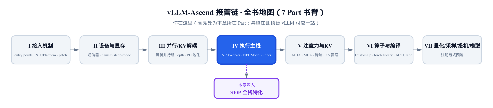
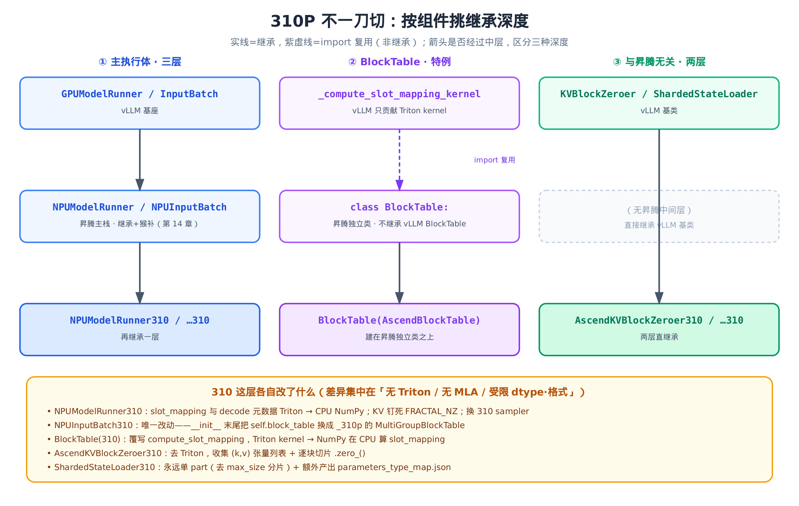
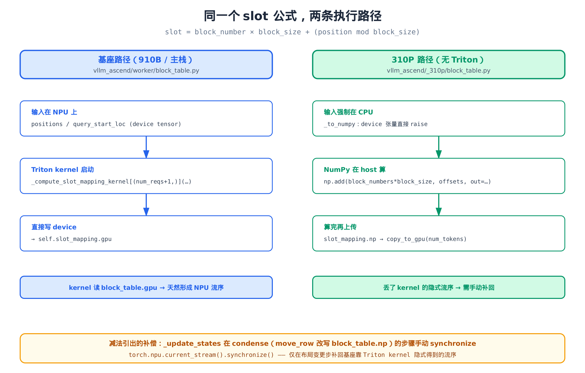
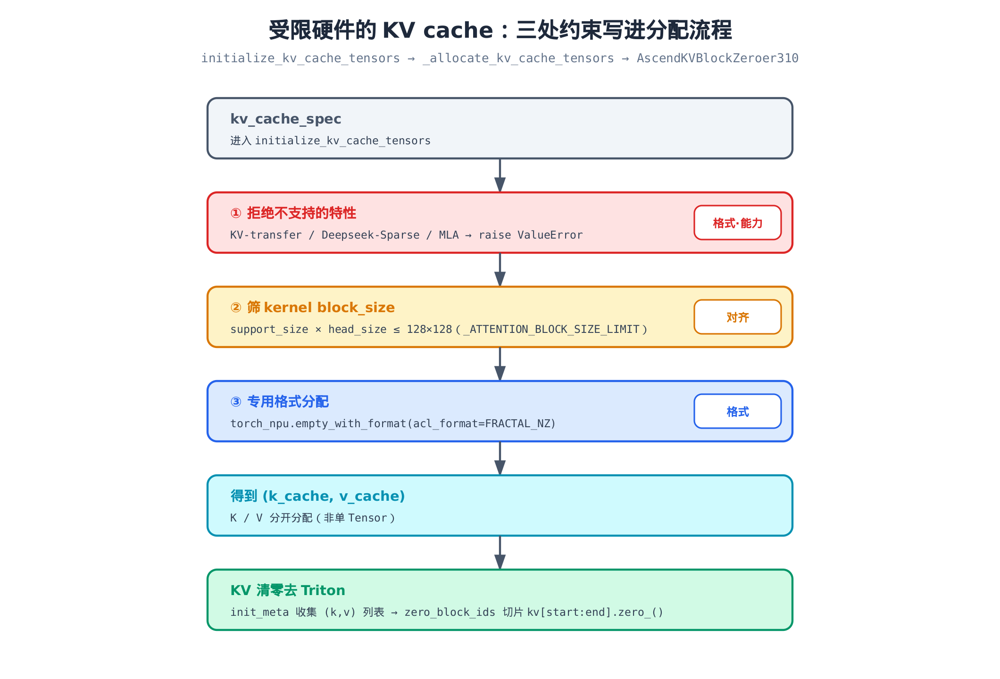
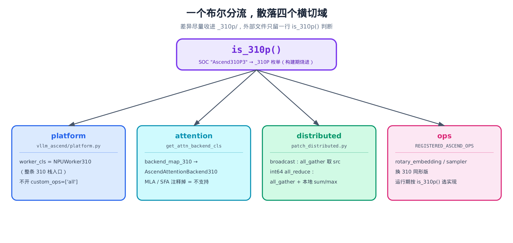

# 第 17 章 310P 推理芯片：受限硬件上的全栈特化



> 上一章：KV 张量在昇腾显存里物化成形。
> 本章：把整条执行栈搬到一块「缺斤少两」的推理芯片上。
> 下一章：翻开第五部分，正式钻进注意力后端。

第四部分一路走来，我们看的都是昇腾的「主力卡」——910B 这一代训推一体的芯片。它能跑 MLA、能用 Triton、能开 custom op，vLLM 上游有的能力它基本都接得住。[第 14 章](../ch14-npumodelrunner-cuda-monkeypatch/narrative/chapter.md) 里我们见过 `NPUModelRunner` 怎么靠「继承 vLLM 基类 + 临时猴补」把一整套 GPU 执行路径搬到 NPU 上。

可昇腾不止一种卡。Atlas 300I DUO 上的 **310P 是一块纯推理芯片**——它没有 Triton、不支持 MLA、不支持 KV 传输、显存与权重格式都受限。把上面那套主力卡的执行栈原样搬过去，第一脚就会踩空：slot mapping 要调的 Triton kernel 不存在（Triton 是用 Python 在 GPU/NPU 上写优化算子内核的框架，下文会反复碰到），注意力后端要选的 MLA 不支持，KV 清零的 Triton 路径跑不起来。

那 310P 怎么办？最省事的想法是「整套再子类化一层」——把昇腾主栈的每个类都派生一个 `*310` 出来。但真实的代码没这么一刀切。`vllm_ascend/_310p/` 这个目录干的是一件更克制、也更有意思的事：**按组件挑继承深度**。有的组件三层继承（vLLM → 昇腾主栈 → 310），有的组件昇腾主栈本就是独立重写、310 建在它上面，还有的组件跟昇腾主栈八竿子打不着、310 干脆直接两层继承 vLLM 基类、跳过中间层。

差异始终集中在三件事——**没有 Triton、没有 MLA、受限的 dtype 与内存格式**。本章的代码主线都收在 `vllm_ascend/_310p/` 下，例如 runner 特化的 `vllm_ascend/_310p/model_runner_310p.py`。我们就把这三件事在执行栈各处激起的涟漪，一处处对着基座掰开看。这也是第四部分的收官：我们将看到 [第 14 章](../ch14-npumodelrunner-cuda-monkeypatch/narrative/chapter.md) 那条「昇腾继承 vLLM」的线，怎样被 310P 再向下延伸一层。

## 17.1 总开关：一个 SOC 字符串点亮整条 310 栈

所有 310P 特化的源头，是一个布尔函数 `is_310p()`。它判定当前这块卡是不是 310P，整条栈据此分流。先看它判什么。

```python
# vllm_ascend/utils.py:L768
class AscendDeviceType(Enum):
    A2 = 0
    A3 = 1
    _310P = 2
    A5 = 3
```

昇腾把自家的卡分成几代：`A2`（910B 系）、`A3`、`_310P`（推理系）、`A5`。注意 `A2 = 0`——枚举里 310P 是 `_310P = 2`，不是第一项。卡的代号怎么落到这个枚举上？答案藏在**构建期**：

```python
# vllm_ascend/utils.py:L778
def _init_ascend_device_type():
    global _ascend_device_type
    from vllm_ascend import _build_info  # type: ignore

    device_type = getattr(_build_info, "__device_type__", None)
    if device_type is None:
        soc_version = getattr(_build_info, "__soc_version__", "ASCEND910B1").upper()
        device_type = "_310P" if "310P" in soc_version else "A2"
    _ascend_device_type = AscendDeviceType[device_type]
```

关键就是这一行：`device_type = "_310P" if "310P" in soc_version else "A2"`。SOC 版本字符串里只要含 `"310P"` 这个子串，就落到 `_310P` 枚举。这个 `soc_version` 是**编译这套包时**烧进 `_build_info` 的——也就是说，一块卡装的是哪个版本的 vllm-ascend 包，它是不是 310P 在装包那一刻就定死了。同一个仓库里，`SOC_VERSION_INFERENCE_SERIES = ["Ascend310P3"]`（`vllm_ascend/utils.py:L51`）记下了推理系的标准 SOC 名。

外层包一个懒初始化的取值器和判等：

```python
# vllm_ascend/utils.py:L812
def get_ascend_device_type():
    global _ascend_device_type
    if _ascend_device_type is None:
        _init_ascend_device_type()
    return _ascend_device_type
```

```python
# vllm_ascend/utils.py:L122
def is_310p():
    return get_ascend_device_type() == AscendDeviceType._310P
```

`get_ascend_device_type()` 只做「首次访问时初始化、之后返回缓存」，是个典型的懒加载单例。`is_310p()` 在它之上判一次等。这个布尔，就是后面所有分流的总开关。

它点亮整条栈的第一处，在平台层。`NPUPlatform` 配置 vllm 时，要决定用哪个 Worker 类：

```python
# vllm_ascend/platform.py:L602
if parallel_config and parallel_config.worker_cls == "auto":
    # … 省略：all2all backend 选择 …
    if is_310p():
        parallel_config.worker_cls = "vllm_ascend._310p.worker_310p.NPUWorker310"
    elif ascend_config.xlite_graph_config.enabled:
        # … 省略：openEuler Xlite 分支 …
        parallel_config.worker_cls = "vllm_ascend.xlite.xlite_worker.XliteWorker"
    else:
        parallel_config.worker_cls = "vllm_ascend.worker.worker.NPUWorker"

# … 省略：refresh_block_size …

# Activate custom ops for v1, except on 310P
if get_ascend_device_type() != AscendDeviceType._310P:
    compilation_config.custom_ops = ["all"]
```

这一段是**整条 310 栈的入口**。`worker_cls` 一旦被指向 `NPUWorker310`，后面 vllm 拉起 worker、worker 拉起 model runner、runner 装配 input batch 与 block table——整条链都会换成 310 版。注意紧接着那个 `if`：910B 会开 `custom_ops = ["all"]`，310P 这一行被跳过，因为它根本没有 custom op。一个布尔，省去一长串 if-else 的散落判断。

## 17.2 三种继承深度：310P 不一刀切

入口选定后，整条栈被链式拉起。但「拉起」的方式不是齐刷刷一层子类化。下面这张图把 310P 真实的继承结构画了出来——三组组件，三种不同的继承深度。



> *图注：实线是继承，紫色虚线是 import 复用（不是继承）。看箭头有没有经过中层，就能区分三种深度。*

**第一组·主执行体走三层。** `NPUModelRunner310` 继承 `NPUModelRunner`，而后者本就是 vLLM `GPUModelRunner` 的子类加猴补（[第 14 章](../ch14-npumodelrunner-cuda-monkeypatch/narrative/chapter.md)）。所以这是 vLLM → 昇腾主栈 → 310 的三层结构。`NPUInputBatch310` 同理。

**第二组·`BlockTable` 是特例。** 昇腾主栈的 `vllm_ascend/worker/block_table.py` 里写的是 `class BlockTable:`——一个**独立类，并不继承 vLLM 的 `BlockTable`**，它只是 `import` 复用了 vLLM 的 Triton kernel。310 的 `BlockTable` 建在这个昇腾独立类之上。所以「vLLM `BlockTable` → 昇腾 → 310」那条三层继承线根本不成立。

**第三组·与昇腾主栈无关的点，跳过中间层。** KV 清零、权重加载这两件事，昇腾主栈没有专门的中间类。于是 `AscendKVBlockZeroer310` 与 `ShardedStateLoader310` 直接两层继承 vLLM 基类——`KVBlockZeroer` 来自 `vllm.v1.worker.utils`、`ShardedStateLoader` 来自 `vllm.model_executor.model_loader`——中间没有任何昇腾层。

为什么要这么挑？因为 310P 跟 910B 共享**绝大多数**控制流，真正的差异只集中在「无 Triton、无 MLA、受限 dtype 与格式」。子类化的价值就是把差异**局部化**：哪一层有差异就在哪一层覆写一个方法，其余全继承。一刀切地整套再派生，反而要写一堆只是 `super()` 透传的空壳。接下来四节，就按四条主线，逐一读源码看「310 这层到底改了什么」——注意「组」是继承深度的分类，「条主线」是这四节的叙述线索，两者是不同维度。

## 17.3 输入批与块表：用 CPU NumPy 顶替 Triton

第一条主线最干净的样本，落在第一组（主执行体三层）里——`NPUInputBatch310`。它继承 `NPUInputBatch`，整个类只有一个实质改动：

```python
# vllm_ascend/_310p/npu_input_batch.py:L9
class NPUInputBatch310(NPUInputBatch):
    def __init__(
        self,
        max_num_reqs: int,
        # … 省略：参数与父类签名逐字相同 …
        kv_cache_groups: list[KVCacheGroupSpec] | None = None,
    ):
        super().__init__(
            max_num_reqs=max_num_reqs,
            # … 省略：全部参数原样透传给父类 …
            kv_cache_groups=kv_cache_groups,
        )
        self.block_table = MultiGroupBlockTable(
            max_num_reqs=max_num_reqs,
            max_model_len=max_model_len,
            max_num_batched_tokens=max_num_batched_tokens,
            pin_memory=pin_memory,
            device=device,
            block_sizes=block_sizes,
            max_num_blocks=max_num_blocks_per_req,
            num_speculative_tokens=num_speculative_tokens,
            kernel_sizes=kernel_block_sizes,
            cp_kv_cache_interleave_size=cp_kv_cache_interleave_size,
            kv_cache_groups=kv_cache_groups,
        )
```

父类的 `__init__` 已经建好了一个 `self.block_table`，子类在末尾把它**整个换掉**，换成从 `vllm_ascend._310p.block_table` 导入的 `MultiGroupBlockTable`。其它行为一律继承。子类化能省到什么程度，这就是答案——一个 `__init__`，最后一行覆盖一个字段。

那为什么非换块表不可？因为块表里藏着 Triton。块表的核心职责是算 **slot mapping**：把每个 token 的逻辑位置，翻译成它在 KV cache 物理页里的绝对下标。这件事昇腾主栈是这么干的：

```python
# vllm_ascend/worker/block_table.py:L137
def compute_slot_mapping(
    self,
    num_reqs: int,
    query_start_loc: torch.Tensor,
    positions: torch.Tensor,
) -> None:
    num_tokens = positions.shape[0]
    total_cp_world_size = self.pcp_world_size * self.dcp_world_size
    total_cp_rank = self.pcp_rank * self.dcp_world_size + self.dcp_rank
    _compute_slot_mapping_kernel[(num_reqs + 1,)](
        num_tokens,
        self.max_num_batched_tokens,
        query_start_loc,
        positions,
        self.block_table.gpu,
        self.block_table.gpu.stride(0),
        self.block_size,
        self.slot_mapping.gpu,
        # … 省略：CP world size / rank / PAD 等常量 …
        BLOCK_SIZE=1024,
    )
```

`_compute_slot_mapping_kernel` 是从 `vllm.v1.worker.block_table` 复用来的一个 `@triton.jit` kernel。它直接读 `block_table.gpu`、直接写 `slot_mapping.gpu`，全程在 NPU 上跑。310P 没有 Triton，这条路彻底断了。310 的 `BlockTable` 于是覆写整个方法，退回 CPU 用 NumPy 算：

```python
# vllm_ascend/_310p/block_table.py:L14
class BlockTable(AscendBlockTable):
    def compute_slot_mapping(self, *args: Any) -> None:
        req_indices, positions = self._normalize_slot_mapping_inputs(*args)
        self._compute_slot_mapping_numpy(req_indices, positions)

    def _compute_slot_mapping_numpy(self, req_indices: np.ndarray, positions: np.ndarray) -> None:
        num_tokens = positions.shape[0]
        if num_tokens == 0:
            self.slot_mapping.copy_to_gpu(0)
            return

        if self.dcp_world_size * self.pcp_world_size > 1:
            # … 省略：上下文并行（CP）的交错分支，与基类 compute_slot_mapping_draft 同构 …
        else:
            logical_block_idx = positions // self.block_size
            block_table_indices = self._get_block_table_indices(req_indices, logical_block_idx)
            block_numbers = self.block_table.np.ravel()[block_table_indices]
            block_offsets = positions % self.block_size
            np.add(block_numbers * self.block_size, block_offsets, out=self.slot_mapping.np[:num_tokens])

        self.slot_mapping.copy_to_gpu(num_tokens)
```

这段 `else` 主路径，就是 slot mapping 的数学定义本身。逻辑块号是位置整除块大小，物理块号去块表里查，块内偏移是位置对块大小取余，最后拼起来：

$$
\mathrm{slot} = \mathrm{block\_number} \times \mathrm{block\_size} + (\mathrm{position} \bmod \mathrm{block\_size})
$$

基座的 Triton kernel 和这里的 NumPy 算的是**同一个公式**，只是执行域从 NPU 挪到了 host CPU。下面这张图把两条路并排放在一起。



> *图注：左边基座在 NPU 上用 Triton kernel 一把算完；右边 310P 强制在 CPU 上用 NumPy 算完再上传。底部那行补偿，下面就讲。*

光看公式不直观，跑三个 token 看看。设块大小 `block_size = 128`，某请求的块表行是 `[5, 9, 2]`（逻辑块 0、1、2 分别落在物理块 5、9、2）。它要算第 130、131、256 个位置：

| 位置 position | 逻辑块 = p // 128 | 物理块号 = 行[逻辑块] | 块内偏移 = p % 128 | slot = 物理块×128 + 偏移 |
|---|---|---|---|---|
| 130 | 1 | 9 | 2 | 9×128 + 2 = **1154** |
| 131 | 1 | 9 | 3 | 9×128 + 3 = **1155** |
| 256 | 2 | 2 | 0 | 2×128 + 0 = **256** |

公式三步里，真正非平凡的是中间那步「物理块号 = 行[逻辑块]」——它是一次**查表**。前两行 130、131 落在同一逻辑块 1，查表都取物理块 9，偏移各加一，slot 也就连号（1154、1155）。第三行 256 跨进逻辑块 2，查表换成另一行值物理块 2，slot 一下跳到 256——这才看得出 `block_numbers = block_table.np.ravel()[block_table_indices]` 真在随逻辑块取不同的表项，而不是简单 +1。`np.add(...)` 一句把整批 token 一次算完，写进 `slot_mapping.np`，再 `copy_to_gpu` 上传。

这里有一道容易忽略的守卫。310 块表强制要求输入必须在 CPU：

```python
# vllm_ascend/_310p/block_table.py:L77
@staticmethod
def _to_numpy(value) -> np.ndarray:
    if isinstance(value, np.ndarray):
        return value.astype(np.int64, copy=False)
    if isinstance(value, torch.Tensor):
        if value.device.type != "cpu":
            raise TypeError(
                "310P slot mapping must be computed from CPU req_indices/positions; "
                "device tensor inputs would require unsupported NPU arithmetic or D2H"
            )
        return value.detach().numpy().astype(np.int64, copy=False)
    return np.asarray(value, dtype=np.int64)
```

这个 `raise` 写得很有信息量：310P 不光是「没有 Triton」，连「在 device 张量上做整数算术、或把 device 张量 D2H 拷回来」都被它当作不可接受的代价规避掉。slot mapping 从输入到计算，必须**全程在 host**。

这道「全程 CPU」的设计，往上游一拍就在 runner 的 `_prepare_inputs` 里现形。它是 runner 设备路径特化的主线方法，docstring 一句话点题：

```python
# vllm_ascend/_310p/model_runner_310p.py:L241
def _prepare_inputs(  # type: ignore[override]
    self,
    scheduler_output: SchedulerOutput,
    num_scheduled_tokens: np.ndarray,
) -> tuple[torch.Tensor, SpecDecodeMetadata | None, int, list[np.ndarray[Any, Any]] | None]:
    """
    310P cannot use the Triton slot-mapping kernel or the generic NPU Add
    kernels used by the base runner for decode metadata. Keep those pieces
    on CPU and upload the prepared tensors.
    """
    total_num_scheduled_tokens = scheduler_output.total_num_scheduled_tokens
    assert total_num_scheduled_tokens > 0
    num_reqs = self.input_batch.num_reqs
    assert num_reqs > 0

    self.input_batch.block_table.commit_block_table(num_reqs)

    req_indices = np.repeat(self.arange_np[:num_reqs], num_scheduled_tokens)
    # … 省略：spec-decode 时按 scheduled_spec_decode_tokens 修正 num_valid_tokens …
    attn_state = self._build_attn_state(num_reqs, num_scheduled_tokens, num_valid_tokens)
    # … 省略：with_prefill 判定 …

    cu_num_tokens = self._get_cumsum_and_arange(num_scheduled_tokens, self.query_pos.np)
    positions_np = self._positions_np_buf[:total_num_scheduled_tokens]
    np.add(
        self.input_batch.num_computed_tokens_cpu[req_indices],
        self.query_pos.np[: cu_num_tokens[-1]],
        out=positions_np,
    )
    block_table = cast(MultiGroupBlockTable310, self.input_batch.block_table)
    block_table.compute_slot_mapping(
        req_indices,
        positions_np[:total_num_scheduled_tokens],
    )
    # … 省略：CP / prompt-embeds / 异步调度 / spec-decode 等正交支路，逐个 copy_to_gpu …
```

注意 `positions` 也是用 `np.add` 在 CPU 上算的——基座那里这步会走通用的 NPU Add kernel，310P 同样没有，于是连位置累加都退到 NumPy。整条 decode 元数据，本质上变成了「在 host 用 NumPy 算好，再 `copy_to_gpu` 上传」。

**减法不是免费的。** 把 Triton 换成 CPU NumPy，丢掉的不只是一个 kernel，还有 kernel 顺带提供的一个隐式保证：流序（stream ordering）。先交代背景：在 GPU/NPU 编程里，device 上的操作并不是调一句立刻算完，而是排进一条硬件命令流里异步执行；同一条流上，后入队的 kernel 对某个张量的读，天然排在之前所有写它的操作之后。基座的 slot-mapping kernel 在步末读 `block_table.gpu`，这次读就天然排在上一步 NPU 操作之后，形成了一道不需要显式声明的屏障。310P 改走 CPU，这道屏障没了。于是 runner 在布局会变的那一步手动补回来：

```python
# vllm_ascend/_310p/model_runner_310p.py:L106
def _update_states(self, scheduler_output: SchedulerOutput):
    deferred = super()._update_states(scheduler_output)
    if scheduler_output.finished_req_ids:
        # condense() rewrites block_table.np (move_row). Drain the previous
        # step's ACL graph replay on the NPU stream before the condensed
        # CPU layout is uploaded and read as attn_metadata.block_tables.
        # Main-line Ascend relies on the end-of-_prepare_inputs Triton
        # slot-mapping kernel (reads block_table.gpu) for stream ordering;
        # 310P uses CPU NumPy for slot_mapping and needs this barrier on
        # layout-change steps only.
        torch.npu.current_stream().synchronize()
    return deferred
```

只有当 `finished_req_ids` 非空——也就是有请求结束、触发 `condense()` 用 `move_row` 改写 `block_table.np` 的那种步骤——才插一句 `synchronize()`。这是「减法引出补偿」的一个绝佳教学点：你删掉一个看似纯计算的 kernel，却要为它顺带提供的副作用单独还债。而且还得精准——只在布局变更步还，不是每步都拦一道全局同步。

## 17.4 受限硬件的 KV cache：把约束写进分配流程

本章第二条主线，是 runner 对 KV cache 的特化（runner 仍属第一组那条主执行体三层继承线）。310P 是纯推理芯片，能力边界写得毫不含糊——直接 `raise`：

```python
# vllm_ascend/_310p/model_runner_310p.py:L670
def initialize_kv_cache_tensors(self, kv_cache_config: KVCacheConfig) -> dict[str, torch.Tensor]:
    # … 省略：docstring …
    # 310P limitation: KV transfer is not supported
    if self.vllm_config.kv_transfer_config is not None:
        logger.error("KV cache transfer is not supported.")
        raise ValueError("KV cache transfer is not supported for 310P.")
    if self.use_sparse:
        logger.error("Deepseek Sparse Attention is not supported.")
        raise ValueError("Deepseek Sparse Attention is not supported for 310P.")
    if self.model_config.use_mla:
        logger.error("MLAAttention is not supported.")
        raise ValueError("MLAAttention is not supported for 310P.")
    # Initialize the memory buffer for KV cache
    kv_caches = self._allocate_kv_cache_tensors(kv_cache_config)
    # … 省略：跨层 KV 共享 + bind_kv_cache …
    return kv_caches
```

KV 传输、Deepseek 稀疏注意力、MLA——三样 310P 不支持的特性，全部写成早失败而非静默出错。这跟我们在 [第 18 章](../ch18-attention-backend-selection/narrative/chapter.md) 会展开的注意力后端选择**首尾呼应**：平台层选后端时，310P 的映射表里 MLA / SFA 条目本就是注释掉的（17.7 节会读到），这里再补一道运行期硬失败，两头把死路堵严。

真正分配 KV 张量时，受限硬件的两个约束落到实处。下面这张图先给全景。



> *图注：从 spec 到分配到清零，三处受限——能力边界、对齐约束、布局格式——一处处刻进流程。*

看 `_allocate_kv_cache_tensors` 里负责注意力 KV 的那段：

```python
# vllm_ascend/_310p/model_runner_310p.py:L746
elif "attn" in layer_name and layer_name not in kv_cache:
    kv_cache_spec = layer_kv_cache_spec[layer_name]
    assert isinstance(kv_cache_spec, AttentionSpec)
    assert kv_cache_tensor.size % kv_cache_spec.page_size_bytes == 0
    num_blocks = kv_cache_tensor.size // kv_cache_spec.page_size_bytes
    assert num_blocks >= kv_cache_config.num_blocks
    # Page attention operation on 310P limits block_size * head_size <= 128 * 128
    supported_sizes = [
        support_size
        for support_size in self.attn_backend.get_supported_kernel_block_sizes()
        if support_size * kv_cache_spec.head_size <= _ATTENTION_BLOCK_SIZE_LIMIT
    ]
    if supported_sizes:
        block_size = supported_sizes[0]
        block_size_chunk = kv_cache_spec.block_size // block_size
        kv_cache_shape = self.attn_backend.get_kv_cache_shape(
            num_blocks * block_size_chunk,
            block_size,
            kv_cache_spec.num_kv_heads,
            kv_cache_spec.head_size,
        )
    else:
        kv_cache_shape = self.attn_backend.get_kv_cache_shape(
            num_blocks, kv_cache_spec.block_size, kv_cache_spec.num_kv_heads, kv_cache_spec.head_size
        )
    k_shape = kv_cache_shape[1:]
    v_shape = k_shape
    dtype = kv_cache_spec.dtype
    k_cache = torch_npu.empty_with_format(
        size=k_shape, dtype=dtype, device=self.device, acl_format=self._acl_format
    )
    v_cache = torch_npu.empty_with_format(
        size=v_shape, dtype=dtype, device=self.device, acl_format=self._acl_format
    )
```

**约束一·对齐。** 这个约束来自一个具体算子——310P 的页注意力算子（paged attention kernel）对 kernel 块有个硬上限，源码注释写得很直白：`block_size * head_size <= 128 * 128`。这个 128×128 对应硬件矩阵计算单元一次能吃下的分块形状：

$$
\mathrm{block\_size} \times \mathrm{head\_size} \le 128 \times 128 = 16384
$$

代码里 `_ATTENTION_BLOCK_SIZE_LIMIT = 128 * 128`。它从候选的 kernel 块大小里筛出满足这个上限的，取第一个。如果逻辑块大小比筛出来的 kernel 块大，就用 `block_size_chunk = 逻辑块大小 // kernel 块大小` 把一个逻辑块**拆成多个物理 kernel 块**。举例：逻辑块 128、head_size 256，则 128×256 = 32768 超限，得退到 kernel 块 64（64×256 = 16384 刚好压线），`block_size_chunk = 128 // 64 = 2`，一个逻辑块拆成两个物理块。

**约束二·格式。** 分配用的不是普通 `torch.empty`，而是 `torch_npu.empty_with_format(acl_format=self._acl_format)`。这个 `_acl_format` 是 runner 在构造时就钉死的：

```python
# vllm_ascend/_310p/model_runner_310p.py:L95
self._acl_format = ACL_FORMAT_FRACTAL_NZ
logger.info_once("Weight layout uses FRACTAL_NZ.")
```

`ACL_FORMAT_FRACTAL_NZ` 的值是 29（`vllm_ascend/utils.py:L55`）。FRACTAL_NZ 是昇腾的「分形 NZ」内存排布——把 `[…, H, W]` 重排成 16 对齐的分块，去匹配 cube 计算单元（昇腾芯片内部专做矩阵运算的硬件引擎，也正是上面那条 128×128 上限的来源）的吞吐形状。310P 上权重和 KV 一律走 NZ 格式，不像主力卡那样有 ND/NZ 的选择余地。这就是「受限格式」最直白的落点。

还有个细节值得记一笔：基座那里一层的 KV 往往是**一整块** tensor，310P 这里 `k_cache` 和 `v_cache` 是**分开**用 `empty_with_format` 各分配一块的。这个「K、V 二元组」的形状，会直接决定下一节 KV 清零怎么写。

## 17.5 KV block 清零：去 Triton 的退化实现

第三条主线，是 KV block 清零——`AscendKVBlockZeroer310`。它属于「跳过昇腾中间层」那一类：直接两层继承 vLLM 的 `KVBlockZeroer`。这件事的背景是：MTP（多 token 预测）≥ 2 的 hybrid 模型，新分配的注意力 KV 块必须先清零再用。基座靠一个 Triton kernel 配一张绝对字节地址表来干这事——又是 Triton。310P 没有，整段退化成纯张量切片写。先看它怎么收集元信息：

```python
# vllm_ascend/_310p/kv_block_zeroer.py:L25
class AscendKVBlockZeroer310(KVBlockZeroer):
    """310P KV block zeroer without Triton.

    Atlas 300I DUO does not support Triton. For MTP >= 2 hybrid models, newly
    allocated attention KV blocks must be zeroed via direct tensor writes.
    """

    def __init__(self, device: torch.device, pin_memory: bool) -> None:
        super().__init__(device, pin_memory)
        self._kv_tensors: list[torch.Tensor] = []
        self._logical_page_ratio: int = 1

    def init_meta(
        self,
        attn_groups_iter: Iterable["AttentionGroup"],
        kernel_block_sizes: list[list[int]],
        cache_dtype: str,
        runner_only_attn_layers: set[str],
        static_forward_context: dict[str, Any],
    ) -> None:
        seen_ptrs: set[int] = set()
        self._kv_tensors = []
        self._logical_page_ratio = 1

        for group in attn_groups_iter:
            spec = group.kv_cache_spec
            if not isinstance(spec, FullAttentionSpec):
                continue
            if group.kv_cache_group_id >= len(kernel_block_sizes):
                continue
            kernel_bs = kernel_block_sizes[group.kv_cache_group_id][0]
            ratio = spec.block_size // kernel_bs
            if not self._kv_tensors:
                self._logical_page_ratio = ratio

            for layer_name in group.layer_names:
                if layer_name in runner_only_attn_layers:
                    continue
                kv_tuple = static_forward_context[layer_name].kv_cache
                assert len(kv_tuple) == 2, "K and V are not stored separately"
                for kv in kv_tuple:
                    dp = kv.data_ptr()
                    if dp in seen_ptrs:
                        continue
                    seen_ptrs.add(dp)
                    self._kv_tensors.append(kv)
```

基座的 `init_meta` 要建一张 `seg_addrs` 绝对字节地址表喂给 Triton kernel；310 版把这整套丢掉，只做一件事：**把所有 (k, v) 张量收集成一个列表**。注意 `assert len(kv_tuple) == 2`——正好对上上一节「K、V 分开分配」的二元组结构。`seen_ptrs` 用 `data_ptr()` 去重，避免跨层共享的同一块 KV 被收两遍。

`_logical_page_ratio` 记的是 `spec.block_size // kernel_bs`。这个 ratio 正是 [§17.4](#174-受限硬件的-kv-cache把约束写进分配流程) 里把逻辑块拆成物理 kernel 块的那个 `block_size_chunk`——同一个 `block_size // kernel_bs`。分配时它决定 KV 张量按物理块铺多少行，清零时它就把逻辑 block id 换算成物理页区间。调度器发下来的是**逻辑** block id，而真正的物理页是按 kernel 块算的，一个逻辑块对应 `ratio` 个物理页。清零时就靠这个比例换算区间：

```python
# vllm_ascend/_310p/kv_block_zeroer.py:L72
def zero_block_ids(self, block_ids: list[int]) -> None:
    if not block_ids or not self._kv_tensors:
        return

    ratio = self._logical_page_ratio
    for block_id in block_ids:
        start = block_id * ratio
        end = start + ratio
        for kv in self._kv_tensors:
            kv[start:end].zero_()
```

对照基座 `vllm/v1/worker/utils.py` 的同名方法，差距一眼可见：

```python
# vllm/v1/worker/utils.py:L189
def zero_block_ids(self, block_ids: list[int]) -> None:
    """Zero the KV cache memory for the given block IDs."""
    if not block_ids or self._meta is None:
        return
    seg_addrs, page_size_el, blk_size, n_segs = self._meta
    n_blocks = len(block_ids)
    # … 省略：把 block_ids 拷进 pinned buffer 再 non_blocking 上 GPU …
    grid = (n_blocks * n_segs * (page_size_el // blk_size),)
    _zero_kv_blocks_kernel[grid](
        seg_addrs,
        idx,
        n_blocks,
        N_SEGS=n_segs,
        PAGE_SIZE_EL=page_size_el,
        BLOCK_SIZE=blk_size,
    )
```

基座靠 `init_meta` 预算好的 `seg_addrs`（一张绝对字节地址表）加 `_zero_kv_blocks_kernel` 这个 Triton kernel，把 block id 翻成 GPU 上的字节地址一把清。310 版把地址表和 kernel 全删掉，只留张量列表 + 下标切片。逻辑 block id 乘以 ratio 得物理页起点，加 ratio 得终点，对每个收集到的张量切这一段 `.zero_()`。跑两个 block 看看，设 `block_size = 128`、`kernel_bs = 64`，则 `ratio = 2`：

| 逻辑 block_id | start = id × 2 | end = start + 2 | 清零切片 |
|---|---|---|---|
| 3 | 6 | 8 | `kv[6:8].zero_()` |
| 7 | 14 | 16 | `kv[14:16].zero_()` |

基座用绝对字节地址 + Triton kernel 一把清；310 版用张量下标切片，纯 PyTorch 操作，host 也能跑。两者清的是同一批页，只是一个走 kernel、一个走切片。功能等价，去掉了 Triton 依赖。

## 17.6 权重加载适配：单 part 外加一份量化描述

第四条主线是权重加载——`ShardedStateLoader310`，同样直接两层继承 vLLM 的 `ShardedStateLoader`。这件事和硬件算力无关，纯粹是 310P / CANN 那套加载格式的契约要求。先看保存：

```python
# vllm_ascend/_310p/sharded_state_loader_310p.py:L30
@staticmethod
def save_model(
    model: torch.nn.Module,
    path: str,
    pattern: str | None = None,
    max_size: int | None = None,
) -> None:
    from safetensors.torch import save_file
    from vllm.distributed import get_tensor_model_parallel_rank

    rank = get_tensor_model_parallel_rank()
    part_idx = 0
    state_dict = ShardedStateLoader._filter_subtensors(model.state_dict())

    filename = ShardedStateLoader.DEFAULT_PATTERN.format(rank=rank, part=part_idx)
    save_file(
        state_dict,
        os.path.join(path, filename),
    )
```

对照基座的 `save_model`：

```python
# vllm/model_executor/model_loader/sharded_state_loader.py:L179
def save_model(
    model: torch.nn.Module,
    path: str,
    pattern: str | None = None,
    max_size: int | None = None,
) -> None:
    # … 省略：import / pattern 缺省 …
    rank = get_tensor_model_parallel_rank()
    part_idx = 0
    total_size = 0
    state_dict = ShardedStateLoader._filter_subtensors(model.state_dict())
    state_dict_part: dict[str, torch.Tensor] = {}
    for key, tensor in state_dict.items():
        param_size = tensor.nelement() * tensor.element_size()
        if max_size is not None and total_size + param_size > max_size:
            # … 省略：写出当前 part、part_idx += 1、清空 state_dict_part、total_size 归零 …
            part_idx += 1
            total_size = 0
            state_dict_part = {}
        state_dict_part[key] = tensor
        total_size += param_size
    if len(state_dict_part) > 0:
        # … 省略：写出最后一个 part …
        pass
```

基座支持 `max_size`，会在累计大小超阈时切出一个 part、`part_idx += 1`、再开下一块，一个 rank 可能写出多个 part 文件。310 版把这一整套循环删光——`part_idx` 永远是 0，无视 `max_size`，整个 state dict 一把 `save_file` 写成**单一** part。加载契约简化了。

简化之外，它还**额外**产出一份量化描述（`parameters_type_map.json`）：

```python
# vllm_ascend/_310p/sharded_state_loader_310p.py:L50
@staticmethod
def generate_quant_description(
    model: torch.nn.Module,
    path: str,
    quant_config: QuantizationConfig | None = None,
) -> None:
    """Generate a mapping of parameter names to their corresponding quantization types."""
    quant_description = {}
    if quant_config is None:
        quantize_type = "FLOAT"
    else:
        try:
            quantize_type = quant_config.quant_description.get("model_quant_type", "FLOAT")
        except AttributeError:
            quantize_type = "FLOAT"
    quant_description["model_quant_type"] = quantize_type
    quant_description["version"] = "1.0.0"
    state_dict = ShardedStateLoader._filter_subtensors(model.state_dict())
    for name, tensor in state_dict.items():
        if name.endswith(".weight") or name.endswith(".bias"):
            if tensor.dtype in [torch.int8, torch.int32, torch.int64]:
                quant_description[name] = quantize_type
            else:
                quant_description[name] = "FLOAT"
        else:
            quant_description[name] = "FLOAT"

    json_path = Path(path) / "parameters_type_map.json"
    with json_path.open("w", encoding="utf-8") as f:
        json.dump(quant_description, f, indent=2)
```

它逐个参数判 dtype：整型（int8/int32/int64）的权重或偏置标成模型声明的量化类型，其余标 `"FLOAT"`，写进 `parameters_type_map.json`。310P / CANN 的加载侧需要这张「逐参数 dtype 描述」才认得出哪些权重是量化过的。

这两个静态方法由谁串起来？是 worker。`NPUWorker310` 的 `save_sharded_state` 把它们接到一起：

```python
# vllm_ascend/_310p/worker_310p.py:L48
class NPUWorker310(NPUWorker):
    def init_device(self):
        self.device = self._init_device()
        torch_npu.npu.set_compile_mode(jit_compile=False)
        init_workspace_manager(self.device, num_ubatches=1)
        self.model_runner = NPUModelRunner310(self.vllm_config, self.device)
        logger.info_once("Using NPUWorker310 and NPUModelRunner310.")
```

`NPUWorker310` 是个薄子类，`init_device` 的核心动作就一句：把 `self.model_runner` 换成 `NPUModelRunner310`。这正是 17.1 节那个 `worker_cls` 入口点燃整条链的下一棒——平台层选中 `NPUWorker310`，worker 在这里把 runner 换成 310 版，runner 再在构造时把 input batch 换成 310 版……一层层链下去。

## 17.7 横切回收：一个布尔，四处补丁

到这里，能收进 `_310p/` 目录的主线特化都读完了。但 310P 的改动不可能全塞进一个目录——分布式通信、注意力后端选择、算子注册这些**横切**的点，散落在 vllm-ascend 各处文件里。设计原则是：把 310P 改动尽量收进 `_310p/`，**外部文件只留一个布尔分流**。下面这张图收口这四处横切。



> *图注：中心一个 `is_310p()`，向外辐射到 platform、attention、distributed、ops 四个域。外部文件各自只用一行布尔判断接住差异。*

平台与算子两域前面已带过——`platform.py` 用布尔选 `worker_cls` 并关掉 custom op，算子域靠 `REGISTERED_ASCEND_OPS` 把 rotary embedding、sampler 等换成 310 同形版。这里重点收两处。

**注意力域。** 平台层选注意力后端时，310P 走一张专属映射表：

```python
# vllm_ascend/platform.py:L752
backend_map_310 = {
    (
        False,
        False,
    ): "vllm_ascend._310p.attention.attention_v1.AscendAttentionBackend310",
    # TODO If MLA/SFA is supported in the future, consider implementing the logic described in these comments.
    # (True, False): "...AscendMLABackend310",
    # (True, True):  "...AscendSFABackend310",
}

if is_310p():
    return backend_map_310.get(key, backend_map_310[(False, False)])

return backend_map[(attn_selector_config.use_mla, attn_selector_config.use_sparse, use_compress)]
```

`backend_map_310` 只有一个有效条目 `(False, False)`——非 MLA、非稀疏的普通注意力。MLA 和 SFA 那两行被**注释掉**了，附一句「将来若支持再实现」。这就跟 17.4 节 `initialize_kv_cache_tensors` 里那三个 `raise` 闭上了环：一头在选后端时根本不给 MLA 的选项，一头在分配 KV 时硬失败。310P 不支持 MLA，从两个方向被钉死。

**分布式域。** 这一处，是我们在 [第 6 章](../ch06-npu-communicator/narrative/chapter.md) 讲昇腾通信器时留下的一个尾巴——当时提过「310P 在 broadcast / all_reduce 上有专门的模拟补丁」，这里收口。310P 的 HCCL 对 device 上的 broadcast 和 int64 的 all_reduce 支持受限，于是用它**支持**的 all_gather 拼出等价语义：

```python
# vllm_ascend/patch/platform/patch_distributed.py:L33
def communication_adaptation_310p():
    def broadcast310p_wrapper(fn):
        def broadcast310p(tensor, src=0, group=None, async_op=False, group_src=None):
            root = group_src if group_src is not None else src
            if tensor.device == torch.device("cpu"):
                return fn(tensor, src=root, group=group, async_op=async_op)
            rank = torch.distributed.get_rank(group)
            world_size = torch.distributed.get_world_size(group)
            tensor_list = [torch.empty_like(tensor) for _ in range(world_size)]
            tensor_list[rank] = tensor
            torch.distributed.all_gather(tensor_list, tensor, group=group)
            tensor[...] = tensor_list[src]
            if async_op:
                return NullHandle()
            else:
                return None
        return broadcast310p

    torch.distributed.broadcast = broadcast310p_wrapper(torch.distributed.broadcast)
    torch.distributed.distributed_c10d.broadcast = broadcast310p_wrapper(torch.distributed.distributed_c10d.broadcast)
```

broadcast 的等价语义很直白：每张卡 all_gather 拿到所有 rank 的张量，再取出 `src` 那一份覆盖自己。CPU 张量则原样走 `fn`，不模拟——因为受限的只是 device 上的 broadcast。int64 的 all_reduce 同理：

```python
# vllm_ascend/patch/platform/patch_distributed.py:L56
def all_reduce_wrapper_310p(fn):
    def all_reduce(tensor, op=torch.distributed.ReduceOp.SUM, group=None, async_op=False):
        if tensor.dtype != torch.int64:
            return fn(tensor, op, group, async_op)
        rank = torch.distributed.get_rank(group)
        world_size = torch.distributed.get_world_size(group)
        tensor_list = [torch.empty_like(tensor) for _ in range(world_size)]
        tensor_list[rank] = tensor
        torch.distributed.all_gather(tensor_list, tensor, group=group)
        if op == torch.distributed.ReduceOp.SUM:
            return torch.stack(tensor_list).sum(0)
        elif op == torch.distributed.ReduceOp.MAX:
            return torch.tensor(torch.stack(tensor_list).cpu().numpy().max(0), device=tensor.device)
        else:
            raise RuntimeError(f"not implement op {op}")
    return all_reduce
```

非 int64 直接走原生 `fn`；只有 int64 才模拟——all_gather 拿全所有 rank，本地 `sum` 或 `max` 把它 reduce 掉。这里有个值得想一秒的代价问题。口径要先讲清：下面比的是**单卡视角**（每张卡的收发量），不是全局总量。单张卡上，原生（ring）all_reduce 的收发量是 $O(N)$（N 是张量元素数），而 all_gather 要让每张卡都收齐所有 P 份完整副本，单卡收发量是 $O(P \cdot N)$（P 是卡数）——单卡视角贵了约 P 倍。为什么能接受？因为它**只**用在 int64 的小张量上——计数、同步标量这类一两个元素的东西。N 本就极小，乘个 P 也无所谓。要是拿它去模拟大张量的 all_reduce，那就是灾难。设计把模拟严格限定在 int64，正是踩准了这条边界。

整个补丁的安装是纯运行期的：

```python
# vllm_ascend/patch/platform/patch_distributed.py:L88
if get_ascend_device_type() == AscendDeviceType._310P:
    communication_adaptation_310p()
```

模块尾部一个 `if`，只有是 310P 才安装。又是那个总开关。这段补丁全是纯 Python，host 上给个假 group 就能跑——下一节就来跑它。

## 17.8 跑精简版，看数值对得上

310P 真正的算子、显存、Triton 都在 host 跑不起来。但本章四条主线里**真正承载立意**的那些控制流——CPU NumPy 算 slot mapping、`_to_numpy` 的 CPU 守卫、KV 切片 `.zero_()`、`parameters_type_map.json` 生成、all_gather 模拟 all_reduce、`is_310p()` 分流——全是纯 Python / NumPy / CPU 张量。把它们从真实源码里**只做减法**剥出来，host 上就能验。

把这套精简版跑起来，结果是 33 条用例全过。它验的不是「代码自洽」，而是这些控制流和真实 vllm-ascend 源码逐字对得上：slot 公式 `block_numbers * block_size + offsets`、`_to_numpy` 的 `"must be computed from CPU"` 守卫、all_gather 模拟里的 `torch.stack(tensor_list).sum(0)`、单 part 保存的 `part_idx = 0`、SOC 字符串 `"Ascend310P3"`、`ACL_FORMAT_FRACTAL_NZ = 29`。重型的 runner 子类（`NPUModelRunner310` 等）在 host 实例化不了，就退一步做源码级结构断言——验子类化的覆写点确实在，原版那些关键接口与对象精简版一个没漏、也没误删。

这就是精简版在本书里的定位：它不是主角，只是给「无 Triton 就退 CPU NumPy」「broadcast 用 all_gather 拼」这些论断一个**能跑出数值**的交叉验证锚点——比如 `vllm_ascend/_310p/block_table.py` 里那段 NumPy slot mapping，剥出来就能在 host 上算出 1154、1155 这种确定数值。主角始终是上面那些真实源码片段。

## 17.9 小结：Part IV 收官

第四部分至此走完。我们从 [第 13 章](../ch13-npuworker-execution-control/narrative/chapter.md) 的 worker 执行控制起步，看 [第 14 章](../ch14-npumodelrunner-cuda-monkeypatch/narrative/chapter.md) 的 `NPUModelRunner` 怎样「继承 vLLM 基类 + 临时猴补」把 GPU 执行路径搬上 NPU，看 [第 15 章](../ch15-single-step-forward-context-dp-sync/narrative/chapter.md) 跑通一拍前向，看 [第 16 章](../ch16-kv-cache-allocation-reshape-bind/narrative/chapter.md) 把 KV 张量在显存里物化。本章是这条线的自然延伸——昇腾自己搭起来的那套栈，**被再向下继承了一层**，去适配一块缺斤少两的推理芯片。

回头看 310P 的设计，最值得带走的不是某个具体补丁，而是那套**克制**：

- **按组件挑继承深度，不一刀切。** 主执行体三层（`vllm_ascend/_310p/model_runner_310p.py`）、`BlockTable` 建在昇腾独立类上、KV 清零与权重加载直接继承 vLLM 基类跳过中间层。差异在哪层就在哪层覆写，绝不写一堆只会 `super()` 透传的空壳。
- **减法要还债。** 删掉 Triton slot-mapping kernel，就得在布局变更步手动 `synchronize()` 补回它顺带提供的流序——而且只在该补的那一步补。
- **能力边界写成早失败。** MLA / Sparse / KV-transfer 一头不给选项、一头硬 `raise`，两个方向钉死。
- **横切尽量收口。** 散落在 distributed、attention、ops 的差异，外部文件只留一个 `is_310p()` 布尔，真正的实现都收进 `_310p/`。

一块「什么都缺」的芯片，没有让整套代码推倒重来，而是靠精挑的子类化把改动压到最小。这恰恰是 vllm-ascend 这套出树插件架构最想证明的事——**新硬件接入的成本，可以低到只是几个覆写方法加一个布尔分流。** 下一部分，我们就掀开注意力后端，看这些被精心适配过的 KV 张量，究竟怎样被算子一口口吃下去。
