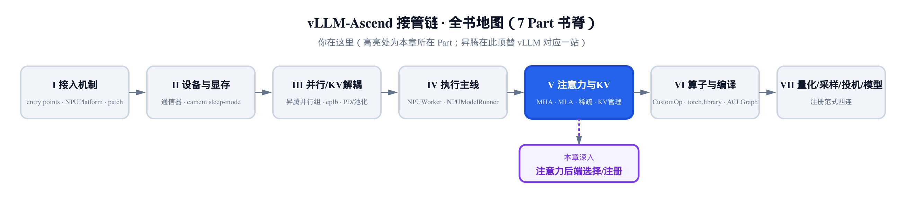
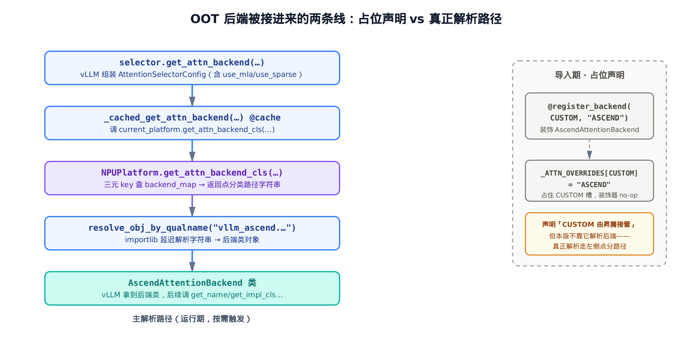
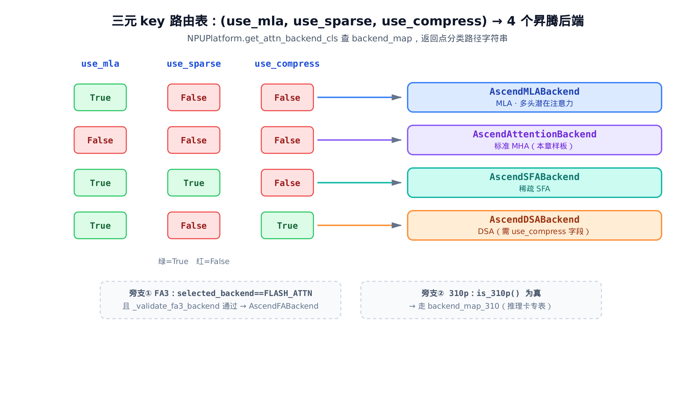
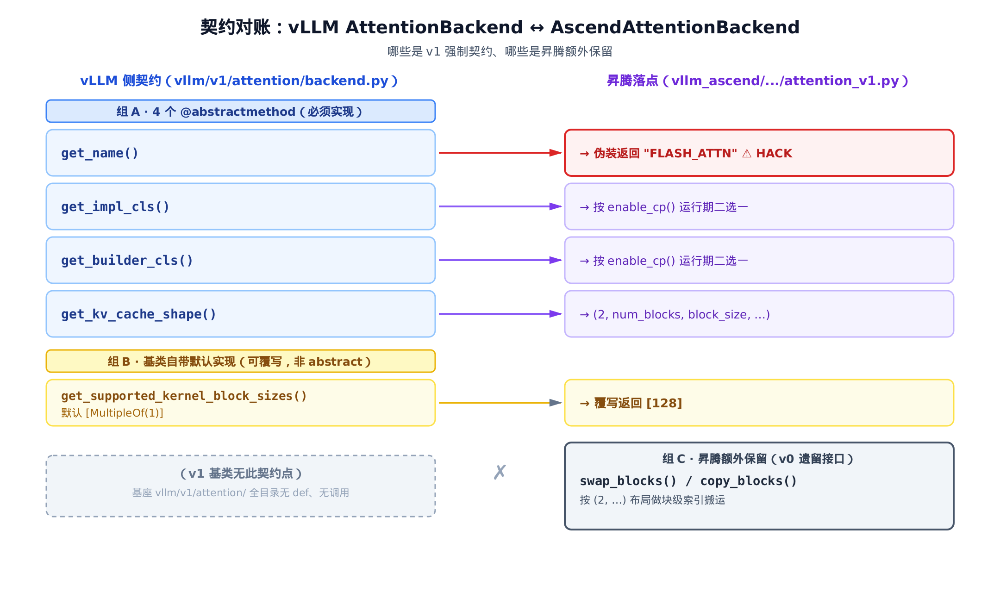

# 第 18 章 注意力后端选择：一个 OOT 后端怎么接进 vLLM



> 上一章：把整条执行栈搬上「缺斤少两」的 310P 推理芯片。
> 本章：翻开第五部分，看昇腾的注意力后端怎么被选中、接进 vLLM。
> 下一章：钻进选中的标准 MHA 后端，看真正碰 NPU 的算子。

[第 15 章](../ch15-single-step-forward-context-dp-sync/narrative/chapter.md) 里，我们在单步前向的台子上见过一个被刻意「点到为止」的东西：`_build_attention_metadata` 建好了注意力元数据 `attn_metadata`，原样塞进 forward context，前向那层 `with` 把它当成一个**不透明对象**抱着走——「该用哪个注意力后端」当时被明确推给了第五部分。

现在我们就来揭开这个对象背后的第一层：**后端是怎么被选出来的**。

注意，本章不碰任何注意力算子。MLA 怎么把 KV 压成潜在向量、稀疏注意力怎么跳过 token、标准 MHA 的 kernel 长什么样——那些是后面四章的事（[第 19 章 MHA](../ch19-ascend-attention-mha/narrative/chapter.md)、[第 20 章 MLA](../ch20-mla-on-npu/narrative/chapter.md)、[第 21 章 稀疏注意力](../ch21-sparse-attention-sfa-dsa/narrative/chapter.md)、[第 22 章 KV 管理](../ch22-kv-manager-and-schedulers/narrative/chapter.md)）。本章只回答一个问题：

> 一个 **OOT（out-of-tree，树外）插件**后端，要接进 vLLM 的注意力框架，需要实现、伪装、注册**哪些契约点**？

这问题听着平淡，真做起来却处处是妥协。昇腾要把自家四个后端塞进一个本为 CUDA 设计的框架，靠的不是「实现一个标准接口」这么干净——里面有一张数据驱动的路由表、一个占位用的注册槽、还有一处源码注释里自承是 **HACK** 的伪装。本章的代码主线分布在 vLLM 与昇腾两侧、收在三处：vLLM 侧的选择口子 `vllm/v1/attention/selector.py`，昇腾侧的路由总入口 `vllm_ascend/platform.py`（那张三元 key 路由表就在这里，是本章的心脏），以及昇腾侧的契约实现 `vllm_ascend/attention/attention_v1.py`。我们就把这几件事一处处掰开，作为整个第五部分的总入口。

## 18.1 站在 vLLM 这边：后端是怎么被「选」出来的

先别急着看昇腾的代码。要理解「昇腾的后端怎么被接进来」，得先看 vLLM **自己那一侧**留了一道什么样的口子。

模型层要构造注意力时，会向 vLLM 要一个后端类。这个请求最终落到 `_cached_get_attn_backend`：

```python
# vllm/v1/attention/selector.py:L105-L136
@cache
def _cached_get_attn_backend(
    backend,
    attn_selector_config: AttentionSelectorConfig,
    num_heads: int | None = None,
) -> type[AttentionBackend]:
    from vllm.platforms import current_platform

    attention_cls = current_platform.get_attn_backend_cls(
        backend,
        attn_selector_config=attn_selector_config,
        num_heads=num_heads,
    )
    if not attention_cls:
        raise ValueError(
            f"Invalid attention backend for {current_platform.device_name}"
        )
    backend = resolve_obj_by_qualname(attention_cls)

    # … 省略：选定后端后按需调整 KV cache layout 的旁支（required_layout / set_kv_cache_layout）…

    return backend
```

这短短一段藏着两个关键设计，对 OOT 后端至关重要：

**第一，vLLM 不自己决定后端，它问当前平台。** 这一行 `current_platform.get_attn_backend_cls(...)` 是整条线的枢纽——后端选择被**委托**给了平台对象。昇腾把自己的平台 `NPUPlatform` 注册成 `current_platform`（那是[第 2 章 入口与 NPUPlatform](../ch02-entry-points-and-npuplatform/narrative/chapter.md) 的事），于是这一问就问到了昇腾家门口。这是 OOT 后端能插进来的**第一道缝**。

**第二，平台返回的不是类，是一个字符串。** 注意 `attention_cls` 这个变量名有点误导——它其实是一个**点分类路径字符串**（如 `"vllm_ascend.attention.mla_v1.AscendMLABackend"`），随后才被 `resolve_obj_by_qualname` 解析成真正的类对象：

```python
# vllm/utils/import_utils.py:L104-L110
def resolve_obj_by_qualname(qualname: str) -> Any:
    """
    Resolve an object by its fully-qualified class name.
    """
    module_name, obj_name = qualname.rsplit(".", 1)
    module = importlib.import_module(module_name)
    return getattr(module, obj_name)
```

把 `qualname`（全限定类名）按最后一个点拆成「模块名 + 类名」，`import_module` 加载模块，再 `getattr` 取出类。**为什么是字符串而非类对象？** 因为延迟。平台层若要直接返回类，就得在自己模块顶部 `import` 全部四个后端——而 MLA / SFA / DSA 各自拖着一坨重依赖（NPU 算子、CANN 接口）。返回字符串，意味着只有**真正被选中的那一个**后端模块才会被 `import_module` 加载，其余三个一行代码都不碰。**按需加载**，这是平台契约故意设计的便利。

还要留意函数头上那个 `@cache`（标准库 `functools.cache`，等价于无上限的 `lru_cache`）：一次进程内，同样的入参只会解析一次，之后直接命中缓存。后端选择是个一次性决策，不必每次前向都重算。

这条主路径，我们用一张图钉死它的走向，下一节起逐站填进昇腾的代码：



## 18.2 三元 key 路由表：一张字典顶替一串 if-else

现在跳到昇腾这一侧，看被 `current_platform.get_attn_backend_cls(...)` 问到的那个方法长什么样：

```python
# vllm_ascend/platform.py:L738-L765
@classmethod
def get_attn_backend_cls(cls, selected_backend, attn_selector_config, num_heads: int | None = None):
    use_compress = getattr(attn_selector_config, "use_compress", False)
    key = (attn_selector_config.use_mla, attn_selector_config.use_sparse)

    if selected_backend == AttentionBackendEnum.FLASH_ATTN and cls._validate_fa3_backend(key, attn_selector_config):
        return "vllm_ascend.attention.fa3_v1.AscendFABackend"

    backend_map = {
        (True, False, False): "vllm_ascend.attention.mla_v1.AscendMLABackend",
        (False, False, False): "vllm_ascend.attention.attention_v1.AscendAttentionBackend",
        (True, True, False): "vllm_ascend.attention.sfa_v1.AscendSFABackend",
        (True, False, True): "vllm_ascend.attention.dsa_v1.AscendDSABackend",
    }
    # … 省略：310p 推理卡旁支 backend_map_310 与 if is_310p() 早返回 …

    return backend_map[(attn_selector_config.use_mla, attn_selector_config.use_sparse, use_compress)]
```

这就是本章的心脏。剥掉两条旁支后，主逻辑只有一件事：**用一个三元组 key 查一张字典**。

先说清一个容易绊住人的细节：函数开头那个 `key = (attn_selector_config.use_mla, attn_selector_config.use_sparse)` 只是**二元组**，而最后查 `backend_map` 用的是**三元组** `(use_mla, use_sparse, use_compress)`，两者并没复用同一个变量。这不是笔误——二元 `key` 是专门喂给 FA3 判定 `_validate_fa3_backend(key, ...)`（以及被省略的 310p 旁支）用的，那两条旁支当时还不关心 `use_compress` 这一维；真正的主路由要落到四个后端，必须带上第三维，所以 `return` 处又把完整的三元组重新拼了一次。

key 的三个维度，各自是模型注意力变体的一个开关：

- `use_mla`——这模型是不是 **MLA（Multi-head Latent Attention，多头潜在注意力）**？DeepSeek 系是。
- `use_sparse`——是不是**稀疏注意力**（SFA）？
- `use_compress`——是不是 **DSA** 那种带压缩的变体？

这里只需知道 SFA / DSA 是稀疏 / 压缩注意力的两个昇腾后端、本章用它们的 key 把请求路由出去就够了；它们到底怎么跳 token、怎么压缩，细节留到 [第 21 章 稀疏注意力](../ch21-sparse-attention-sfa-dsa/narrative/chapter.md)。

三个布尔拼成 key，一查 `backend_map` 就落到四个昇腾后端之一：



**为什么用字典而不是一串 `if-else`？** 这是把「模型注意力变体 → 后端实体」的映射**做成了数据**。四种变体四行，清清楚楚摆在眼前；将来新增一种注意力变体，只加一行，不动控制流。比起层层嵌套的 `if use_mla: if use_sparse: ...`，一张把四种变体逐一列全的查找表既好读又好扩。

这里有个容易被忽略的细节，正是昇腾代码「为更新的 vLLM 预留」的痕迹。看第三维 `use_compress` 是怎么取的：

```python
use_compress = getattr(attn_selector_config, "use_compress", False)
```

不是 `attn_selector_config.use_compress`，而是 `getattr(..., False)`——**带默认值的软取**。原因是：本书对照的基座 vLLM 里，`AttentionSelectorConfig` 当前只声明了 `use_mla` 和 `use_sparse` 两个字段，**根本没有 `use_compress`**。直接点属性会 `AttributeError`；用 `getattr` 兜底成 `False`，代码就能在老基座上照跑。

这带来一个有意思的推论：**`(True, False, True) → AscendDSABackend` 这一支，在裸基座上不可达**——因为 `use_compress` 永远被兜底成 `False`，凑不出第三维为 `True` 的 key。它只在某个声明了 `use_compress` 字段的、更新版本的 vLLM 上才会被点亮。一行 `getattr`，就是昇腾对「vLLM 还会继续往前走」的**前向兼容**下注。

至于被省略的两条旁支，本章只点名、不展开：

- **FA3 旁支**：当 vLLM 显式选中 `FLASH_ATTN` 且满足训推一致场景（`_validate_fa3_backend` 通过）时，走 `AscendFABackend`。这是个特定场景的优化后端。
- **310P 旁支**：[第 17 章](../ch17-310p-inference-chip-specialization/narrative/chapter.md) 那块推理卡有自己的 `backend_map_310`，`is_310p()` 为真时改查那张表。

两条都是主路由之外的特例，跟「四后端 + 契约」的主线正交。

## 18.3 注册进 vLLM：占住一个叫 CUSTOM 的空槽

后端路由解决了「选哪个」，但还有个前置问题：vLLM 怎么**知道**世上存在「昇腾后端」这种东西？

答案在 vLLM 的后端注册表里。vLLM 把所有已知后端列成一个枚举，每个成员的值是它的默认类路径：

```python
# vllm/v1/attention/backends/registry.py:L88-L90
    # Placeholder for third-party/custom backends - must be registered before use
    # set to None to avoid alias with other backend, whose value is an empty string
    CUSTOM = None
```

注意这个 `CUSTOM = None`。别的枚举成员值都是实打实的类路径字符串（`FLASH_ATTN` 的值是 `"vllm.v1.attention.backends.flash_attn.FlashAttentionBackend"`），唯独 `CUSTOM` 是 `None`。注释说得明白：这是给**第三方 / 自定义后端预留的占位槽**——「必须先注册才能用」。这是 vLLM 对 OOT 后端敞开的、有名有姓的一扇门。

昇腾怎么占这扇门？用一行装饰器：

```python
# vllm_ascend/attention/attention_v1.py:L73-L82
@register_backend(AttentionBackendEnum.CUSTOM, "ASCEND")
class AscendAttentionBackend(AttentionBackend):
    accept_output_buffer: bool = True

    @staticmethod
    def get_name() -> str:
        # … get_name 留到下一节细看 …
```

`@register_backend(AttentionBackendEnum.CUSTOM, "ASCEND")`——在 `AscendAttentionBackend` 类定义时，就把 `CUSTOM` 槽认领下来。看 `register_backend` 内部做了什么：

```python
# vllm/v1/attention/backends/registry.py:L203-L255
def register_backend(
    backend: AttentionBackendEnum | MambaAttentionBackendEnum,
    class_path: str | None = None,
    is_mamba: bool = False,
) -> Callable[[type], type]:
    def decorator(cls: type) -> type:
        # … 省略：is_mamba 分支 …
        _ATTN_OVERRIDES[backend] = f"{cls.__module__}.{cls.__qualname__}"  # type: ignore[index]
        return cls

    if class_path is not None:
        # … 省略：is_mamba 分支 …
        _ATTN_OVERRIDES[backend] = class_path  # type: ignore[index]
        return lambda x: x

    return decorator
```

这个函数有两副面孔，分水岭是第二个形参——注意它叫 `class_path`，不叫 `name`：

- **传了 `class_path`**（昇腾这种情况，传的是 `"ASCEND"`）：直接把 `_ATTN_OVERRIDES[CUSTOM] = "ASCEND"`，然后返回 `lambda x: x`——一个**什么都不做的装饰器**。也就是说，`AscendAttentionBackend` 这个类本身**没被改写一个字节**，装饰器只是顺手在注册表里登记了一笔。
- **没传 `class_path`**：返回真正的 `decorator`，它会从被装饰的类身上反查 `f"{cls.__module__}.{cls.__qualname__}"` 写进注册表。

昇腾走的是前一条。所以这里要讲清一件容易被误读的事——**注册和解析，是两条线**：

1. **占位声明线（导入期）**：`@register_backend(CUSTOM, "ASCEND")` 在模块被 import 时执行，把 `"ASCEND"` 这个字符串写进 `_ATTN_OVERRIDES[CUSTOM]`，**声明「CUSTOM 这个槽由昇腾接管」**。
2. **真正解析线（运行期）**：上一节那条 `get_attn_backend_cls → resolve_obj_by_qualname`，才是真正把请求变成后端类的路径。

关键在于：本版基座**并不靠** `CUSTOM` 槽里那个 `"ASCEND"` 去反查后端类（`"ASCEND"` 甚至不是个合法类路径）。真正干活的是平台返回的点分路径。所以在这一版里，`register_backend` 更像一句**声明 / 占位**——告诉 vLLM「这个槽有主了」——而不是后端解析的主入口。前面那张解析流程图右侧的虚线框，画的就是这条占位声明线：它和左侧的真正解析路径**并行存在、各司其职**。

## 18.4 伪装 HACK：故意把自己叫成 FLASH_ATTN

现在轮到本章最「不讲武德」的一处。回头看 `get_name`：

```python
# vllm_ascend/attention/attention_v1.py:L77-L82
    @staticmethod
    def get_name() -> str:
        # HACK(Ronald1995): vllm `initialize_kv_cache` method in model runner v2 make
        # attention name assertion, we just set name to FLASH_ATTN to avoid assertion error.
        # rectify this when vllm disable the assertion.
        return "CUSTOM" if not envs_vllm.VLLM_USE_V2_MODEL_RUNNER else "FLASH_ATTN"
```

读一遍这个返回值：在 V2 model-runner 下，`AscendAttentionBackend.get_name()` 返回的不是 `"ASCEND"`、也不是 `"CUSTOM"`，而是 **`"FLASH_ATTN"`**——一个 CUDA FlashAttention 后端的名字。一个跑在昇腾 NPU 上、压根不是 FlashAttention 的后端，对外**自报家门说自己是 FlashAttention**。

它冒充的对象，是 vLLM 自带的这位：

```python
# vllm/v1/attention/backends/flash_attn.py:L105-L107
    @staticmethod
    def get_name() -> str:
        return "FLASH_ATTN"
```

一模一样的返回值。这就是源码注释里写的 **HACK**。为什么非伪装不可？注释自己交代了：vLLM 的 model-runner 在 `initialize_kv_cache` 这条初始化路径上，历史上对后端**名字**做过硬断言——它**按字符串名字、而非按类型**判定后端合法性，只认白名单里那几个内建名字。OOT 后端如果老老实实报上 `"CUSTOM"` 或 `"ASCEND"`，过不了这道断言，初始化直接报错。借一个白名单里的名字（`"FLASH_ATTN"`）蒙混过关，就绕过去了。

这是 OOT 插件的一种典型妥协——**身份断言绕过**。框架某处用「名字」而不是「能力 / 类型」来判定一个对象合不合法，外来者就只能借一个被认可的名字过关。注释结尾那句 `rectify this when vllm disable the assertion`（等 vLLM 撤掉这个断言再改回来）写得很诚实：**这是临时绕行，不是长久设计**。

> 顺带一提：本书对照的基座版本里，这条按名字硬编码的断言其实已经不见了——它是更早版本的遗留。但昇腾的伪装代码还留着，因为它要同时兼容那些**还带着断言**的 vLLM 版本。又一处前向 / 后向兼容的痕迹。

那个 `VLLM_USE_V2_MODEL_RUNNER` 开关把行为分成两拍，我们用一张小表追一遍，看 `get_name` 到底吐什么：

| `VLLM_USE_V2_MODEL_RUNNER` | `get_name()` 返回 | 与 `FlashAttentionBackend.get_name()` | 后果 |
|---|---|---|---|
| `False`（旧 runner） | `"CUSTOM"` | 不等 | 走旧路径，无名字断言，如实报 CUSTOM |
| `True`（V2 runner） | `"FLASH_ATTN"` | **相等** | 冒充成功，绕过 `initialize_kv_cache` 的名字断言 |

第二行那个「相等」是整处 HACK 的命门：只有当昇腾报的名字和某个白名单成员**逐字相等**，断言才放行。精简版把这两个 `get_name` 摆在一起跑，断言它们返回同一个字符串——这正是对「伪装是否真的能蒙混过关」的交叉验证。

## 18.5 静态契约对账：哪些必须实现、哪些是昇腾自带的

绕过了名字断言，还得回答最根本的问题：**一个后端类，到底要实现什么，vLLM 才认它是个合法后端？**

答案写在 vLLM 的抽象基类 `AttentionBackend` 里。昇腾的 `AscendAttentionBackend` 继承它，就得照它的契约办事：

```python
# vllm/v1/attention/backend.py:L55-L96
class AttentionBackend(ABC):
    """Abstract class for attention backends."""

    supported_dtypes: ClassVar[list[torch.dtype]] = [torch.float16, torch.bfloat16]
    supported_kv_cache_dtypes: ClassVar[list["CacheDType"]] = [
        "auto",
        "float16",
        "bfloat16",
    ]

    # Does attention's forward() include kv cache update?
    forward_includes_kv_cache_update: bool = True

    @staticmethod
    def get_supported_kernel_block_sizes() -> list[int | MultipleOf]:
        return [MultipleOf(1)]

    @staticmethod
    @abstractmethod
    def get_name() -> str:
        raise NotImplementedError

    @staticmethod
    @abstractmethod
    def get_impl_cls() -> type["AttentionImplBase"]:
        raise NotImplementedError

    @staticmethod
    @abstractmethod
    def get_builder_cls():  # -> Type["AttentionMetadataBuilder"]:
        raise NotImplementedError

    @staticmethod
    @abstractmethod
    def get_kv_cache_shape(
        num_blocks: int,
        block_size: int,
        num_kv_heads: int,
        head_size: int,
        cache_dtype_str: str = "auto",
    ) -> tuple[int, ...]:
        raise NotImplementedError
    # … 省略：get_kv_cache_block_dim / get_required_kv_cache_layout 等一众带默认实现的 @classmethod …
```

看清楚两类方法的区别，这是本节的全部要点：

- **四个 `@abstractmethod`**：`get_name` / `get_impl_cls` / `get_builder_cls` / `get_kv_cache_shape`。带 `@abstractmethod` 装饰意味着——**子类不实现，连实例化都做不到**，Python 直接抛 `TypeError`。这四个就是 OOT 后端**硬性必须实现**的契约点。
- **一个有默认实现的普通方法**：`get_supported_kernel_block_sizes`，基类已经给了默认返回 `[MultipleOf(1)]`。它**不带** `@abstractmethod`，子类不覆写也能用，覆写则按自己的来。

我们把这套契约和昇腾的实现一一对账，画成一张账单：



**组 A——四个必须实现的，昇腾全都落了地。** `get_name` 是上一节那处伪装；`get_impl_cls` / `get_builder_cls` 下一节细看；`get_kv_cache_shape` 返回昇腾的 KV 布局：

```python
# vllm_ascend/attention/attention_v1.py:L100-L108
    @staticmethod
    def get_kv_cache_shape(
        num_blocks: int,
        block_size: int,
        num_kv_heads: int,
        head_size: int,
        cache_dtype_str: str = "",
    ) -> tuple[int, ...]:
        return (2, num_blocks, block_size, num_kv_heads, head_size)
```

首维那个 **`2`** 是 key 和 value 两半合存进同一张张量——`[0]` 是 key、`[1]` 是 value。记住这个布局，下面就要用到。

**组 B——可覆写的默认方法，昇腾覆写了。** 基类默认 `[MultipleOf(1)]`（任意块大小都行），昇腾改成固定的 `[128]`：

```python
# vllm_ascend/attention/attention_v1.py:L138-L140
    @staticmethod
    def get_supported_kernel_block_sizes() -> list[int]:
        return [128]
```

这不是契约逼它改的，是昇腾 kernel 自己只支持 128 的块大小，于是覆写默认、把约束声明出来。

**组 C——昇腾额外保留、vLLM v1 契约里根本没有的两个方法。** 这是本节最需要讲清的一处。`AscendAttentionBackend` 上还挂着 `swap_blocks` 和 `copy_blocks`：

```python
# vllm_ascend/attention/attention_v1.py:L110-L136
    @staticmethod
    def swap_blocks(
        src_kv_cache: list[torch.Tensor],
        dst_kv_cache: list[torch.Tensor],
        src_to_dst: torch.Tensor,
    ) -> None:
        src_key_cache, src_value_cache = src_kv_cache[0], src_kv_cache[1]
        dst_key_cache, dst_value_cache = dst_kv_cache[0], dst_kv_cache[1]
        src_indices = src_to_dst[:, 0]
        dst_indices = src_to_dst[:, 1]

        dst_key_cache[dst_indices] = src_key_cache[src_indices].to(dst_key_cache.device)
        dst_value_cache[dst_indices] = src_value_cache[src_indices].to(dst_key_cache.device)

    @staticmethod
    def copy_blocks(
        kv_caches: list[torch.Tensor],
        src_to_dists: torch.Tensor,
    ) -> None:
        src_indices = src_to_dists[:, 0]
        dst_indices = src_to_dists[:, 1]

        for kv_cache in kv_caches:
            key_caches = kv_cache[0]
            value_caches = kv_cache[1]
            key_caches[dst_indices] = key_caches[src_indices]
            value_caches[dst_indices] = value_caches[src_indices]
```

这两个方法做的是**块级搬运**：按 `src_to_dst` 这张索引表，把 KV cache 的某些块从源位置搬到目标位置（`swap_blocks` 跨两张 cache，`copy_blocks` 在同一张内复制）。注意它们都靠 `[0]`/`[1]` 取 key/value 两半——正是组 A 那个首维为 `2` 的布局。

但**关键不在它们做什么，在于它们不该出现在这里**。基座 vLLM 的整个 `vllm/v1/attention/` 目录里，**找不到** `swap_blocks` / `copy_blocks` 的任何 `def`，也没有任何调用方——v1 的注意力层根本不通过后端类做块搬运。这两个方法是 vLLM **v0 时代**后端接口的遗留，昇腾从老代码里一路带了过来、留着没删。所以在对账图里，它们的左侧是空的、标着「v1 无此契约」——**不是 vLLM 要求昇腾实现的，是昇腾自己额外保留的**。

把组 A、B、C 摆在一起，「OOT 后端契约」的全貌就清楚了：**四个是 v1 硬性必须实现的，一个是可覆写的默认方法，两个是昇腾自带的 v0 遗留**。读真实插件代码时，能分清「框架逼你实现的」和「历史包袱」，是不被一堆方法绕晕的关键。

我们用精简版给组 A 的「必须实现」补一个数值佐证。`@abstractmethod` 的强制力不是说说而已——拿掉任意一个，类就实例化不了：

| 后端类 | 缺哪个 `@abstractmethod` | `BadBackend()` 实例化 |
|---|---|---|
| 全实现（昇腾四后端） | 无 | 成功 |
| 故意删掉 `get_kv_cache_shape` | 一个 | **`TypeError: Can't instantiate abstract class`** |

这就是契约的牙齿：少实现一个抽象方法，Python 的 ABC 机制直接让你建不出对象。昇腾四个后端能正常工作，前提就是组 A 一个不落地全实现了。

再给组 C 的块搬运补一组具体数值，确认它真按 `(2, …)` 布局搬。先建立一个概念：KV cache 在内存里被切成一个个**固定大小的块（block）**，块是搬运的最小单位——上面 `get_kv_cache_shape` 返回的 `(2, num_blocks, block_size, …)` 里那个 `num_blocks` 数的就是块的个数。下面这组数值追的是 **`swap_blocks`**（源、目标是**两张**张量，互不别名），为看清搬运，我们把每个块的内容简化成一个标量值。设源 cache 的 key 半边四个块依次存着 `[10, 11, 12, 13]`，目标 cache 初始全零，搬运表 `src_to_dst = [[0, 2], [3, 1]]`（读作：源块 0 → 目标块 2，源块 3 → 目标块 1）：

| 轮次 | `src_to_dst` 一行 | 含义 | 目标 key 半边状态 |
|---|---|---|---|
| 起始 | —— | 目标全零 | `[0, 0, 0, 0]` |
| 第 1 拍 | `[0, 2]` | 源块 0（值 10）→ 目标块 2 | `[0, 0, 10, 0]` |
| 第 2 拍 | `[3, 1]` | 源块 3（值 13）→ 目标块 1 | `[0, 13, 10, 0]` |

精简版跑下来，目标 key 半边正是 `[0, 13, 10, 0]`、value 半边同理是 `[0, 103, 100, 0]`——两半各按 `[0]`/`[1]` 独立搬、用同一张索引表，和源码控制流逐拍对得上。（真实的 NPU 设备间搬运 host 上跑不了，精简版用 CPU 张量验证的是「按 `(2, …)` 布局做块级索引复制」这条控制流。）

有一点别把这里的「逐拍顺序」误套到 `copy_blocks` 上：上面的追踪逐拍写，是因为 `swap_blocks` 的源、目标是两张独立张量，怎么写都不会自己踩自己。`copy_blocks` 不一样，它在**同一张** cache 内做 `key_caches[dst_indices] = key_caches[src_indices]`——源和目标块完全可能重叠。这种原地搬运之所以仍然安全，是因为 PyTorch 的高级索引会**先把右侧 `src_indices` 选出的块整体 gather 成一份临时副本，再一次性写回 `dst_indices`**；读取在写入之前全部完成，所以即便某个源块同时也是另一行的目标块，也不会被中途覆盖。

## 18.6 运行期分流：CP 来了才加载 CP 的实现

组 A 里还剩 `get_impl_cls` 和 `get_builder_cls` 没细看。它们俩是后端的「取实现」入口——vLLM 拿到后端类后，靠它们要到真正的算子实现类（Impl）和元数据构造器（Builder）。

它们的写法值得一看，因为这里又是一处**运行期延迟决策**：

```python
# vllm_ascend/attention/attention_v1.py:L84-L98
    @staticmethod
    def get_impl_cls() -> type["AscendAttentionBackendImpl"]:
        if enable_cp():
            from vllm_ascend.attention.context_parallel.attention_cp import AscendAttentionCPImpl

            return AscendAttentionCPImpl
        return AscendAttentionBackendImpl

    @staticmethod
    def get_builder_cls() -> type["AscendAttentionMetadataBuilder"]:
        if enable_cp():
            from vllm_ascend.attention.context_parallel.attention_cp import AscendAttentionCPMetadataBuilder

            return AscendAttentionCPMetadataBuilder
        return AscendAttentionMetadataBuilder
```

两个方法同一个套路：**先问 `enable_cp()`，命中才走 CP 分支**。`enable_cp()`（CP = context parallel，上下文并行，组排布见 [第 8 章](../ch08-ascend-parallel-groups/narrative/chapter.md)）判的是当前配置有没有开上下文并行：

```python
# vllm_ascend/attention/utils.py:L58-L62
@lru_cache(maxsize=1)
def enable_cp():
    prefill_config = get_current_vllm_config().parallel_config
    return prefill_config.prefill_context_parallel_size > 1 or prefill_config.decode_context_parallel_size > 1
```

只要 prefill 或 decode 的上下文并行宽度大于 1，就算开了 CP。

这里有两层值得品的设计：

**第一层，`import` 写在函数体里，不在文件顶部。** CP 的实现（`AscendAttentionCPImpl` 那一套）又重又只在 CP 场景才用得上。把 `from ...context_parallel... import ...` 写进 `if enable_cp():` 分支内部，意味着**只有真开了 CP，那个模块才会被加载**；不开 CP 的常规场景，这行 import 一次都不执行，省下它那坨依赖的加载成本。这和 18.1 节平台「返回字符串而非类」是同一种克制——**按需加载，能不碰就不碰**。

**第二层，`enable_cp()` 上的 `@lru_cache(maxsize=1)`。** CP 是不是开着，一个进程内是定死的配置，没必要每次取 Impl 都重新读一遍 `parallel_config`。`lru_cache` 把结果钉死：第一次调用真去读配置，之后每次都命中缓存直接返回。我们追两拍看它怎么收敛：

| 调用次序 | 进 `enable_cp()` 函数体？ | 取值来源 | 返回 |
|---|---|---|---|
| 第 1 次 | 是，读 `parallel_config` | 真实计算 | 比如 `False` |
| 第 2 次起 | **否，被 lru_cache 短路** | 缓存 | 同上，恒 `False` |

于是 `get_impl_cls` / `get_builder_cls` 无论被调多少次，分流方向都一致——CP 配置在进程生命周期里是个常量，缓存让它「算一次、用到底」。

至于 CP 那套实现、以及常规分支返回的 `AscendAttentionBackendImpl`（真正碰 NPU 的 MHA 算子）里头是什么——本章一律不展开。那是 [第 19 章](../ch19-ascend-attention-mha/narrative/chapter.md) 的主场。本章只需看清这一层**选择**的控制流：后端类怎么按运行期条件，把请求分流到不同的实现类。

## 小结：接进一个框架，要做几件不体面的事

回到开篇那个问题——一个 OOT 后端接进 vLLM 的注意力框架，需要哪些契约点？这一章把答案摊开了：

- **路由**（18.2，`vllm_ascend/platform.py:L738-L765`）：在平台的 `get_attn_backend_cls` 里，用 `(use_mla, use_sparse, use_compress)` 三元 key 查一张 `backend_map`，把请求映射到四个昇腾后端之一。返回字符串而非类，让 vLLM 按需加载。
- **注册**（18.3，`vllm/v1/attention/backends/registry.py:L203-L255`）：用 `@register_backend(CUSTOM, "ASCEND")` 占住 vLLM 预留的 `CUSTOM` 槽——这是声明 / 占位，真正解析走的是路由那条线。
- **伪装**（18.4，`vllm_ascend/attention/attention_v1.py:L77-L82`）：`get_name` 在 V2 runner 下故意返回 `"FLASH_ATTN"`，绕过 vLLM 按名字判定后端的断言。源码自承是临时 HACK。
- **契约**（18.5，`vllm/v1/attention/backend.py:L55-L96`）：四个 `@abstractmethod`（`get_name` / `get_impl_cls` / `get_builder_cls` / `get_kv_cache_shape`）必须实现，少一个就实例化不了；`get_supported_kernel_block_sizes` 是可覆写的默认方法；`swap_blocks` / `copy_blocks` 是昇腾自带的 v0 遗留，**不在** v1 契约里。
- **分流**（18.6，`vllm_ascend/attention/attention_v1.py:L84-L98`）：`get_impl_cls` / `get_builder_cls` 按 `enable_cp()` 运行期二选一，CP 实现延迟到命中才 import。

这五件事拼起来，就是 [第 15 章](../ch15-single-step-forward-context-dp-sync/narrative/chapter.md) 那个「不透明对象」背后的**选择机制**——`attn_metadata` 被交给哪个后端、那个后端怎么被选中接进来，到这里全交代清楚了。

但我们始终停在「选择」这一层，没碰任何一个真正的算子。`get_impl_cls` 返回的那个 `AscendAttentionBackendImpl`，它的 `forward` 里 NPU 到底算了什么？下一章，我们就钻进选中的标准 MHA 后端，看真正碰硬件的那一行。
