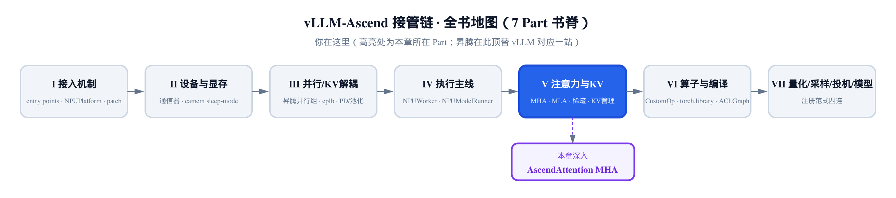
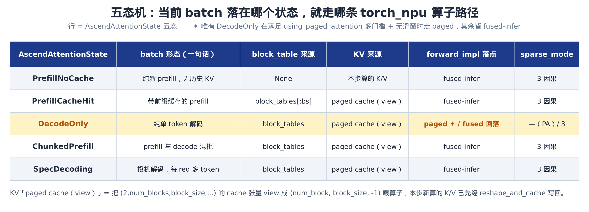
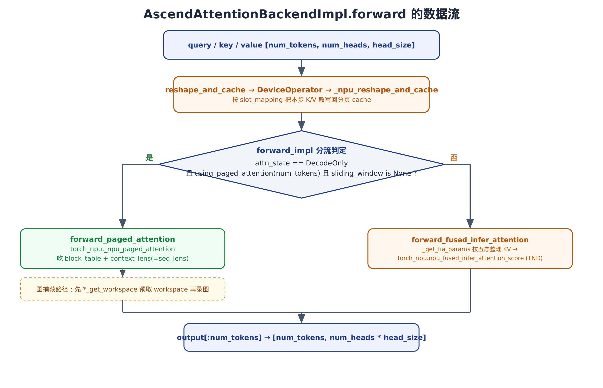
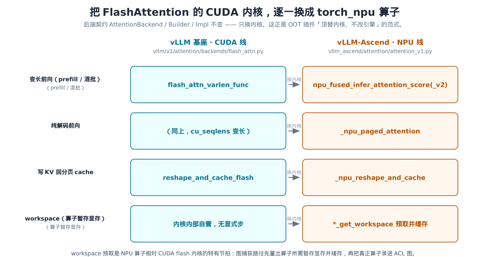

# 第 19 章 标准 MHA 的 NPU 内核与状态机：AscendAttentionBackendImpl



> 上一章把后端「选」了出来：`get_impl_cls` 返回 `AscendAttentionBackendImpl`。
> 本章钻进这个类，看 `forward` 里 NPU 到底算了什么。
> 下一章换 MLA 后端，对照另一种 KV 几何。

[第 18 章](../ch18-attention-backend-selection/narrative/chapter.md) 结束在一个悬念上。我们看清了一个树外（out-of-tree，OOT）后端怎么接进 vLLM 的注意力框架。路由、注册、伪装、契约、分流五件事拼好后，`get_impl_cls` 交还一个类：`AscendAttentionBackendImpl`。但我们始终停在「选择」这一层，没碰任何一个真正的算子。

这一章，我们就钻进那个被选中的标准 MHA 后端。先把问题摆明白：标准多头注意力（MHA）在昇腾 NPU 上，到底是怎么算的？

答案出乎意料地简单，又出乎意料地工程化。简单，是因为整个后端只围着**一台五态机**转——当前这一批 token 落在哪个状态，就走哪条 `torch_npu` 算子路径。工程化，是因为昇腾做的事，本质上是把 vLLM 基座 FlashAttention 的 CUDA 内核，**逐一换成** `torch_npu` 的算子，后端契约一行不改。这正是 OOT 插件「顶替内核、不改引擎」的范式，在注意力这条最热的路径上的落地。

本章源码主线是一个文件：`vllm_ascend/attention/attention_v1.py`。姊妹篇对照基座的 `vllm/v1/attention/backends/flash_attn.py`——昇腾把它的 flash kernel 换成了 NPU 算子，我们会逐一对上号。

> **一句话说明**：昇腾主机一般没有 CUDA，本章的数值追踪跑在纯 Python 的控制流上（五态分流、拆批、`slot_mapping` 装配、`forward_impl` 选路都是 Python）。真正的 `_npu_paged_attention` / `npu_fused_infer_attention_score` 是 NPU 内核，host 上不真算——但它们的入参怎么被整理、何时被调用，全都可读可验。

---

## 19.1 从后端到实现：`get_impl_cls` 的两条岔路

先把上一章的接力棒接稳。被注册进 vLLM 的后端类长这样：

```python
# vllm_ascend/attention/attention_v1.py:L73-L108
@register_backend(AttentionBackendEnum.CUSTOM, "ASCEND")
class AscendAttentionBackend(AttentionBackend):
    accept_output_buffer: bool = True

    @staticmethod
    def get_name() -> str:
        # HACK(Ronald1995): vllm `initialize_kv_cache` method in model runner v2 make
        # attention name assertion, we just set name to FLASH_ATTN to avoid assertion error.
        # rectify this when vllm disable the assertion.
        return "CUSTOM" if not envs_vllm.VLLM_USE_V2_MODEL_RUNNER else "FLASH_ATTN"

    @staticmethod
    def get_impl_cls() -> type["AscendAttentionBackendImpl"]:
        if enable_cp():
            from vllm_ascend.attention.context_parallel.attention_cp import AscendAttentionCPImpl

            return AscendAttentionCPImpl
        return AscendAttentionBackendImpl

    @staticmethod
    def get_builder_cls() -> type["AscendAttentionMetadataBuilder"]:
        if enable_cp():
            from vllm_ascend.attention.context_parallel.attention_cp import AscendAttentionCPMetadataBuilder

            return AscendAttentionCPMetadataBuilder
        return AscendAttentionMetadataBuilder

    @staticmethod
    def get_kv_cache_shape(
        num_blocks: int,
        block_size: int,
        num_kv_heads: int,
        head_size: int,
        cache_dtype_str: str = "",
    ) -> tuple[int, ...]:
        return (2, num_blocks, block_size, num_kv_heads, head_size)
```

`get_impl_cls` 和 `get_builder_cls` 不是直接返回类——它们先问一句 `enable_cp()`。这就是上一章埋下、本章要收口的那条线。`enable_cp()` 为假，返回标准实现 `AscendAttentionBackendImpl` / `AscendAttentionMetadataBuilder`；为真，切到上下文并行（context parallel）版本。

那个开关是怎么定的？

```python
# vllm_ascend/attention/utils.py:L58-L61
@lru_cache(maxsize=1)
def enable_cp():
    prefill_config = get_current_vllm_config().parallel_config
    return prefill_config.prefill_context_parallel_size > 1 or prefill_config.decode_context_parallel_size > 1
```

只要 `prefill_context_parallel_size` 或 `decode_context_parallel_size` 大于 1，就启用 CP 版实现。[第 8 章](../ch08-ascend-parallel-groups/narrative/chapter.md) 讲清了 CP 组本身怎么排布——`transpose(3, 4)` 重排、复用既有 `world_size` 不新增进程。当时留了个尾巴：**这套组排布，运行期是被谁、在哪一拍真正分流出来的？** 答案就是这里。`@lru_cache(maxsize=1)` 让它「算一次、用到底」——CP 配置在进程生命周期里是常量，每次 `get_impl_cls` 被调，分流方向都一致。

CP 版的注意力算子住在 `context_parallel/` 子模块，`AscendMetadata` 会多带 `prefill`（PCP）/ `decode_meta`（DCP）两个字段承接重排后的序列。那是另一条专门的算子线，不在本章主路径上——我们只在这里点明：**运行期的 CP 分流，到此收口。** 往下，我们一律走 `enable_cp()` 为假的标准分支。

最后一个静态方法值得记住：`get_kv_cache_shape` 钉死了 KV cache 的形状——

$$
(2,\ \mathrm{num\_blocks},\ \mathrm{block\_size},\ \mathrm{num\_kv\_heads},\ \mathrm{head\_size})
$$

首维的 `2` 是 key 和 value 合存一张张量（`[0]` 是 K，`[1]` 是 V）。这个布局是后面 `slot_mapping` 寻址、`_npu_reshape_and_cache` 写入的物理基础，[第 16 章](../ch16-kv-cache-allocation-reshape-bind/narrative/chapter.md) 已经把它的分配与 reshape 讲透，本章直接用。

---

## 19.2 五态机：一根分流轴

整个后端的灵魂，是一个只有六行的枚举：

```python
# vllm_ascend/attention/attention_v1.py:L143-L148
class AscendAttentionState(Enum):
    PrefillNoCache = 0
    PrefillCacheHit = 1
    DecodeOnly = 2
    ChunkedPrefill = 3
    SpecDecoding = 4
```

别小看这五个名字。它们不是装饰——**每一态对应一种 batch 形态**，而 batch 形态决定了两件事：KV 从哪来、用哪个算子算。把这张映射看懂，本章就懂了一半。

- **PrefillNoCache**：纯新的 prefill，没有任何历史 KV。这一批 token 的 K/V 就是本步刚算出来的，没有 `block_table` 可言。
- **PrefillCacheHit**：带前缀缓存的 prefill。前缀的 K/V 早已在分页 cache 里，要从那儿读回来。
- **DecodeOnly**：纯解码。每个序列只送 1 个 query token，历史 KV 全在 cache。这是**唯一**可能走分页注意力专用算子的态。
- **ChunkedPrefill**：分块 prefill 与 decode 混在一批里。这是 `AscendMetadata` 的默认态。
- **SpecDecoding**：投机解码。每个请求一次送多个候选 token，KV 同样在 cache。

状态本身不是后端自己猜的，而是上游的 model runner 根据这一批的构成（含不含 prefill、是不是投机、前缀命中没有）设好，塞进元数据传下来。后端要做的，是**据态分流**。这张分流表是本章的总纲：



> *图注：五态各对应一种 batch 形态，决定 `block_table` 来源、KV 来源、`forward_impl` 落在哪条算子路径。注意 DecodeOnly 是唯一可能走 `forward_paged_attention`（分页专用算子）的态——而且还要再过几道门槛，否则也回落到 fused-infer。*

记住一个反直觉的结论：**五态里有四态都走同一条 fused-infer 路径**，只有 DecodeOnly 有机会走专用的分页路径。为什么这么设计、那几道门槛是什么，19.5 揭晓。

---

## 19.3 元数据装配：`build` 把一批拆成两段

`AscendAttentionMetadataBuilder` 继承自 vLLM 的 `AttentionMetadataBuilder[AscendMetadata]`。它每一步前向被调一次（逐层共享一份），把上游的通用元数据加工成本后端要吃的 `AscendMetadata`：

```python
# vllm_ascend/attention/attention_v1.py:L272-L332
def build(
    self,
    common_prefix_len: int,
    common_attn_metadata: AscendCommonAttentionMetadata,
    fast_build: bool = False,
) -> AscendMetadata:
    num_reqs = common_attn_metadata.num_reqs
    num_actual_tokens = common_attn_metadata.num_actual_tokens
    query_start_loc_cpu = common_attn_metadata.query_start_loc_cpu[: num_reqs + 1]

    num_decodes, num_prefills, num_decode_tokens, num_prefill_tokens = split_decodes_and_prefills(
        common_attn_metadata, decode_threshold=self.decode_threshold
    )

    block_table = common_attn_metadata.block_table_tensor
    if common_attn_metadata._seq_lens_cpu is not None:
        seq_lens = common_attn_metadata._seq_lens_cpu[:num_reqs]
    elif common_attn_metadata.seq_lens_cpu is not None:
        seq_lens = common_attn_metadata.seq_lens_cpu[:num_reqs]
    else:
        seq_lens = common_attn_metadata.seq_lens[:num_reqs].to("cpu")

    slot_mapping = common_attn_metadata.slot_mapping[:num_actual_tokens]
    # … 省略：CrossAttentionSpec / 并行草稿对 seq_lens·slot_mapping 的覆盖分支（encoder-decoder 特例）…
    attn_state = common_attn_metadata.attn_state

    # Get attn_mask from singleton AttentionMaskBuilder
    attn_mask = self.attn_mask_builder.get_attention_mask(common_attn_metadata.causal, self.model_config)

    # TODO: Yet another unnecessary H2D while we already have a query_start_loc on device
    query_start_loc = query_start_loc_cpu.pin_memory().to(self.device, non_blocking=True)

    attn_metadata = AscendMetadata(
        num_actual_tokens=num_actual_tokens,
        num_decode_tokens=num_decode_tokens,
        block_tables=block_table,
        query_start_loc=query_start_loc,
        seq_lens=seq_lens,
        seq_lens_cpu=seq_lens,
        seq_lens_list=seq_lens.tolist(),
        max_query_len=common_attn_metadata.max_query_len,
        actual_seq_lengths_q=query_start_loc_cpu[1:].tolist(),
        slot_mapping=slot_mapping,
        attn_mask=attn_mask,
        attn_state=attn_state,
        num_prefills=num_prefills,
        num_decodes=num_decodes,
        causal=common_attn_metadata.causal,
        model_runner_type=self.model_config.runner_type,
        kvcomp_metadata=common_attn_metadata.kvcomp_metadata,
    )
    return attn_metadata
```

这个方法干了四件事：拆批、取 KV 索引、装 mask、组对象。最关键的是第一件——`split_decodes_and_prefills`。

### 拆批：在重排好的 batch 上找分界线

vLLM v1 的调度器会把一批请求**按 query 长度重排**：query 短的（解码请求，每序列 1 个 token）拉到批的前段，query 长的（prefill 请求）放后段。于是「哪些是 decode、哪些是 prefill」退化成一个问题：**前后两段的分界线在哪？**

要算这条分界线，先认一个数据结构：`query_start_loc` 存的是每个序列在打平 token 轴上的**起点累计位置**（第 0 个序列从 0 起，第 `i` 个序列起点是前 `i` 个序列的 token 数之和）。相邻两项之差，就是每个序列的 query 长度——这正是下面 `query_lens = query_start_loc[1:] - query_start_loc[:-1]` 的由来。

```python
# vllm_ascend/attention/utils.py:L273-L315
def split_decodes_and_prefills(
    common_attn_metadata: AscendCommonAttentionMetadata,
    decode_threshold: int = 1,
) -> tuple[int, int, int, int]:
    """Assuming a reordered batch, finds the boundary between prefill and decode requests."""
    # … 省略：PCP 分支（query_lens_pcp_full 仅上下文并行时非 None，回指 ch08）…
    max_query_len = common_attn_metadata.max_query_len
    num_reqs = common_attn_metadata.num_reqs
    num_tokens = common_attn_metadata.num_actual_tokens
    query_start_loc = common_attn_metadata.query_start_loc_cpu

    if max_query_len <= decode_threshold:
        return num_reqs, 0, num_tokens, 0

    query_lens = query_start_loc[1:] - query_start_loc[:-1]
    is_prefill = query_lens > decode_threshold
    if not torch.any(is_prefill):
        return num_reqs, 0, num_tokens, 0

    first_prefill = is_prefill.int().argmax(dim=-1).item()
    num_decodes = first_prefill
    num_prefills = num_reqs - num_decodes
    num_decode_tokens = query_start_loc[first_prefill].item()
    num_prefill_tokens = num_tokens - num_decode_tokens
    return (num_decodes, num_prefills, num_decode_tokens, num_prefill_tokens)
```

逻辑很干净：算出每个请求的 `query_len`（相邻 `query_start_loc` 之差），`> decode_threshold` 的就是 prefill。这里「一串 False 后接一串 True」不是巧合，而是重排逼出来的：重排按 query 长度升序排请求，于是 `query_lens` 沿请求轴**非递减**；`is_prefill = (query_lens > threshold)` 是非递减序列上的一个阈值判定，必然单调——一旦翻成 True 就再不会回到 False。所以 `argmax` 取到的第一个 True，就是**唯一**的分界线 `first_prefill`，不可能出现 decode 与 prefill 交错而漏判。前面 `first_prefill` 个请求是 decode，其后全是 prefill。

`decode_threshold` 默认是 1（每序列 1 个 token 才算 decode）。但开了投机解码，门槛会抬高：

```python
# vllm_ascend/attention/attention_v1.py:L226-L257（节选 __init__ 中 decode_threshold 的设定）
self.decode_threshold = 1
if self.speculative_config:
    spec_token_num = self.speculative_config.num_speculative_tokens
    self.decode_threshold += spec_token_num
    assert self.decode_threshold <= 16, (
        "decode_threshold exceeded npu_fused_infer_attention_score TND layout's limit of 16"
    )
```

投机解码每个请求一次送 `1 + num_speculative_tokens` 个 token，所以门槛跟着抬到这个值。上限 16，是 `npu_fused_infer_attention_score` 的 TND 布局对单序列长度的硬限制。这是 NPU 算子的约束反过来约束了调度参数，一个很典型的「内核倒逼上层」的细节。

### 数值追踪：同一个函数，两批不同形态

光看代码不够。把两批真实形态喂进去，看分界线怎么落——

**第一批**：常规混批，`decode_threshold = 1`，四个请求 `query_lens = [1, 1, 5, 7]`（已重排：两个解码在前，两个 prefill 在后）。`query_start_loc = [0, 1, 2, 7, 14]`，共 14 个 token。

| 请求 | `query_len` | `> 1`？ | 角色 |
|---|---|---|---|
| 0 | 1 | False | decode |
| 1 | 1 | False | decode |
| 2 | 5 | **True** ← `first_prefill` | prefill |
| 3 | 7 | True | prefill |

`first_prefill = 2` → `num_decodes = 2`，`num_prefills = 2`；`num_decode_tokens = query_start_loc[2] = 2`，`num_prefill_tokens = 14 − 2 = 12`。返回 `(2, 2, 2, 12)`。

**第二批**：投机解码，`decode_threshold = 2`（即 `num_speculative_tokens = 1`），三个请求 `query_lens = [2, 2, 8]`。`query_start_loc = [0, 2, 4, 12]`，共 12 个 token。

| 请求 | `query_len` | `> 2`？ | 角色 |
|---|---|---|---|
| 0 | 2 | False | decode（投机，2 token） |
| 1 | 2 | False | decode（投机，2 token） |
| 2 | 8 | **True** ← `first_prefill` | prefill |

`first_prefill = 2` → `num_decodes = 2`，`num_prefills = 1`；`num_decode_tokens = query_start_loc[2] = 4`，`num_prefill_tokens = 12 − 4 = 8`。返回 `(2, 1, 4, 8)`。

同一个函数，门槛从 1 抬到 2，`query_len = 2` 的请求就从「prefill」翻成了「decode」——这正是投机解码要的：那 2 个 token 应当当作解码批来算。

这里有个不变量值得点明：**返回的四元组始终是一组完整的二分划**。`num_decodes + num_prefills = num_reqs`（请求数守恒），`num_decode_tokens + num_prefill_tokens = num_tokens`（token 数守恒）。原因是分界线 `first_prefill` 同时切开了「请求轴」和「token 轴」——前 `first_prefill` 个请求占用 `query_start_loc[first_prefill]` 个 token，剩下的自然归 prefill。没有 token 会被漏算或重复算。

### `slot_mapping` 与寻址（回指 KV cache 章）

`build` 取的 `slot_mapping[:num_actual_tokens]`，是本章 KV 读写的物理地址簿。它的语义，`AscendMetadata` 的字段注释说得最清楚：

```python
# vllm_ascend/attention/attention_v1.py:L160-L204
@dataclass
class AscendMetadata:
    # **************************** Basic Properties ************************** #
    attn_mask: torch.Tensor | None = None
    # Current state of this attention run.
    attn_state: AscendAttentionState = AscendAttentionState.ChunkedPrefill

    num_actual_tokens: int = 0
    num_decode_tokens: int = 0
    num_prefills: int = 0
    num_decodes: int = 0

    seq_lens: torch.Tensor = None
    seq_lens_cpu: torch.Tensor = None
    seq_lens_list: list[int] = None  # type: ignore
    actual_seq_lengths_q: list[int] = None  # type: ignore

    query_start_loc: torch.Tensor = None
    # Maximum query length in the batch (None for decoding).
    max_query_len: int | None = None

    # ********************** KV Cache Related Properties ********************* #
    # Block addresses per sequence (Seq id -> list of physical block).
    # (batch_size, max_blocks_per_seq)
    block_tables: torch.Tensor = None

    # The indices of the token slots that input tokens will be stored into.
    # E.g., if `slot_mapping` is [35, 2, 17] and the block size is 16, the
    # three tokens are stored in the 3rd slot in block 2, 2nd slot in block 0,
    # and 1st slot in block 1, respectively.
    # (num_tokens,)
    slot_mapping: torch.Tensor = None
    # … 省略：pcp/dcp 字段 prefill/decode_meta、reshape_cache_event、kvcomp_metadata（CP/PD/稀疏专用，回指 ch08）…

    causal: bool = True
    # runner_type in model_config.
    model_runner_type: str = ""
```

`slot_mapping[i]` 是第 `i` 个 token 要落进的**全局物理槽号**。按注释的例子，`slot_mapping = [35, 2, 17]`、`block_size = 16`：

$$
\mathrm{block\_id} = \lfloor \mathrm{slot} / \mathrm{block\_size} \rfloor, \qquad \mathrm{offset} = \mathrm{slot} \bmod \mathrm{block\_size}
$$

于是 `35 → 块 2 第 3 槽`、`2 → 块 0 第 2 槽`、`17 → 块 1 第 1 槽`。`block_tables[req]` 则给出某序列占用的物理块号列表——读历史 KV 时算子据此去 gather。这套逻辑寻址 → 物理页的映射，[第 16 章](../ch16-kv-cache-allocation-reshape-bind/narrative/chapter.md) 已经建立，这里只是把地址簿接过来用。

> 注意 `build` 末尾那行 `query_start_loc.pin_memory().to(self.device)`，源码自己挂了 TODO：「device 上明明已经有一份了，这是又一次没必要的 H2D」。`seq_lens` 家族字段也有 `TODO` 自承冗余、待 schema 统一。读源码要会分辨：哪些是设计精华，哪些是还没还的技术债——这两处属于后者。

最后，图捕获走的是另一个入口，但它**复用** `build`：

```python
# vllm_ascend/attention/attention_v1.py:L334-L354
def build_for_graph_capture(
    self,
    common_attn_metadata: AscendCommonAttentionMetadata,
    attn_state: AscendAttentionState = AscendAttentionState.DecodeOnly,
):
    if attn_state in (
        AscendAttentionState.DecodeOnly,
        AscendAttentionState.ChunkedPrefill,
        AscendAttentionState.SpecDecoding,
    ):
        attn_metadata = self.build(
            common_prefix_len=0,
            common_attn_metadata=common_attn_metadata,
        )
    else:
        raise NotImplementedError(
            "Currently we only support building dummy metadata for DecodeOnly and ChunkedPrefill state"
        )

    attn_metadata.attn_state = attn_state
    return attn_metadata
```

它只为 DecodeOnly / ChunkedPrefill / SpecDecoding 三态造 dummy 元数据——两个 prefill 态序列长度可变、不适合录进固定形状的图。造完再把 `attn_state` 覆盖成目标态。图捕获本身（ACL 图的录制与重放）属于编译线的话题，这里只点明：它复用同一套装配逻辑，不另起炉灶。

---

## 19.4 写 KV：`reshape_and_cache` 落到 `_npu_reshape_and_cache`

前向第一件事，是把本步新算的 K/V 写回分页 cache。这步在基座 vLLM 里叫 `reshape_and_cache_flash`，是一个 CUDA 内核；昇腾换成自己的算子：

```python
# vllm_ascend/attention/attention_v1.py:L1229-L1256
def reshape_and_cache(
    self,
    query: torch.Tensor,
    key: torch.Tensor,
    value: torch.Tensor,
    kv_cache: tuple[torch.Tensor],
    attn_metadata: AscendMetadata,
    output: torch.Tensor,
):
    if len(kv_cache) > 1:
        # … 省略：is_kv_producer 的 KV 传输事件 record（PD 分离场景）…
        if self.key_cache is None:
            self.key_cache, self.value_cache = kv_cache[0], kv_cache[1]
        slots = attn_metadata.slot_mapping
        encoder_decoder = self.attn_type == AttentionType.ENCODER_DECODER
        DeviceOperator.reshape_and_cache(
            key=key[: attn_metadata.num_actual_tokens] if not encoder_decoder else key,
            value=value[: attn_metadata.num_actual_tokens] if not encoder_decoder else value,
            key_cache=self.key_cache,
            value_cache=self.value_cache,
            slot_mapping=slots[: attn_metadata.num_actual_tokens] if not encoder_decoder else slots.to(torch.int32),
        )
    return query, key, value, output
```

它把 `key` / `value` 切到 `num_actual_tokens`，连同 `slot_mapping` 一起交给 `DeviceOperator.reshape_and_cache`。`DeviceOperator` 是按设备型号选的算子适配器——主线落到基类这条：

```python
# vllm_ascend/device/device_op.py:L42-L47
class BaseDeviceAdaptor:
    @classmethod
    def reshape_and_cache(cls, key, value, key_cache, value_cache, slot_mapping):
        torch_npu._npu_reshape_and_cache(
            key=key, value=value, key_cache=key_cache, value_cache=value_cache, slot_indices=slot_mapping
        )
```

落地了。`_npu_reshape_and_cache` 拿 `slot_indices`（就是 `slot_mapping`），把形状 `[num_tokens, num_kv_heads, head_size]` 的新 K/V，按每个 token 的物理槽号散写进 `(2, num_blocks, block_size, num_kv_heads, head_size)` 的 cache。接 19.3 那个例子：第 0 个 token 的 K/V 写到块 2 第 3 槽，第 1 个写到块 0 第 2 槽，依此类推。一次 scatter，KV 就归位了。

这里能在 host 上验证的是控制流：哪些 token 被切出来、`slot_indices` 等于 `slot_mapping[:num_actual_tokens]`、算子被调用一次且参数正确。真正的散写在 NPU 上发生，host 不真算——但「调用契约」清清楚楚。

---

## 19.5 状态分流的前向：`forward` → `forward_impl`

KV 写好了，该算注意力了。前向入口 `forward` 做的事不多——确认输出缓冲、懒初始化 cache 句柄、写 KV，然后把活交给 `forward_impl`：

```python
# vllm_ascend/attention/attention_v1.py:L1279-L1343
def forward(
    self,
    layer: AttentionLayer,
    query: torch.Tensor,
    key: torch.Tensor,
    value: torch.Tensor,
    kv_cache: tuple[torch.Tensor],
    attn_metadata: AscendMetadata,
    output: torch.Tensor | None = None,
    output_scale: torch.Tensor | None = None,
    output_block_scale: torch.Tensor | None = None,
) -> torch.Tensor:
    """Forward pass with Ascend attention.
    Args:
        query: shape = [num_tokens, num_heads, head_size]
        key:   shape = [num_tokens, num_kv_heads, head_size]
        value: shape = [num_tokens, num_kv_heads, head_size]
        kv_cache: shape = [2, num_blocks, block_size, num_kv_heads, head_size]
    Returns:
        shape = [num_tokens, num_heads * head_size]
    """
    assert output is not None, "Output tensor must be provided."
    # … 省略：fused output quantization 守卫 + hamming 稀疏取 layerIndex（默认关）…
    assert layer._k_scale_float == 1.0 and layer._v_scale_float == 1.0
    num_tokens = query.shape[0]
    if attn_metadata is None:
        return output.fill_(0)

    # Initialize key_cache and value_cache from kv_cache if not already set.
    if self.key_cache is None and kv_cache is not None:
        if (
            isinstance(kv_cache, torch.Tensor) and kv_cache.dim() > 0 and kv_cache.shape[0] == 2
            or isinstance(kv_cache, (list, tuple)) and len(kv_cache) >= 2
        ):
            self.key_cache, self.value_cache = kv_cache[0], kv_cache[1]

    output_padded = None
    if key is not None and value is not None:
        output_padded = output
        query, key, value, output_padded = self.reshape_and_cache(
            query, key, value, kv_cache, attn_metadata, output
        )
    # … 省略：pooling 模型分支（非因果 → _forward_encoder_attention，非自回归特例）…
    if output_padded is not None:
        attn_output = self.forward_impl(query, key, value, kv_cache, attn_metadata, output_padded)
    else:
        attn_output = self.forward_impl(query, key, value, kv_cache, attn_metadata, output)
    output[:num_tokens] = attn_output[:num_tokens]
    return output
```

注意签名里的 shape 注释——输入是 `[num_tokens, num_heads, head_size]` 的三维打平张量，输出 `[num_tokens, num_heads * head_size]`。整个 batch 的所有 token 沿轴 0 摞在一起，没有 padding 到等长。这个「打平」是后面 TND 布局的前提，19.6 再细说。

真正的分流在 `forward_impl`，全章最关键的一段判定：

```python
# vllm_ascend/attention/attention_v1.py:L1258-L1277
def forward_impl(
    self,
    query: torch.Tensor,
    key: torch.Tensor,
    value: torch.Tensor,
    kv_cache: tuple[torch.Tensor],
    attn_metadata: AscendMetadata,
    output: torch.Tensor,
):
    num_tokens = query.shape[0]
    if (
        attn_metadata.attn_state == AscendAttentionState.DecodeOnly
        and using_paged_attention(num_tokens, self.vllm_config)
        and self.sliding_window is None
    ):
        output = self.forward_paged_attention(query, attn_metadata, output)
    else:
        output = self.forward_fused_infer_attention(query, key, value, attn_metadata, output, kv_cache)

    return output
```

整章的控制流，浓缩成这个 `if`。三个条件**全部**满足，才走分页专用算子 `forward_paged_attention`；任意一个不满足，回落到 fused-infer。这就解释了 19.2 那个反直觉结论——



> *图注：`forward` 先 `reshape_and_cache` 写 KV，再进 `forward_impl` 的菱形判定。唯有「DecodeOnly + `using_paged_attention` 多门槛 + 无滑窗」三条全中走 paged，其余一律 fused-infer。图捕获路径还多一步 workspace 预取。*

第一个条件 `attn_state == DecodeOnly` 已经排掉了四态。第二个 `using_paged_attention` 才是真正的窄门：

```python
# vllm_ascend/attention/utils.py:L44-L55
def using_paged_attention(runtime_shape: int, vllm_config: VllmConfig) -> bool:
    if vllm_config.speculative_config is not None:
        return False
    if get_ascend_device_type() == AscendDeviceType.A5:
        return False
    from vllm.config.compilation import CUDAGraphMode

    cudagraph_mode = vllm_config.compilation_config.cudagraph_mode
    if cudagraph_mode != CUDAGraphMode.FULL_DECODE_ONLY:
        return False

    return runtime_shape in get_ascend_config().pa_shape_list
```

四道门槛叠在一起，照源码逐条看：

1. **没开投机解码**——`speculative_config is not None` 就 `return False`。
2. **设备不是 A5 这一代**——源码 `if get_ascend_device_type() == AscendDeviceType.A5: return False`，把 A5 显式排除、走另一条路。源码没给原因，我们也照实不臆测：A5 在设备枚举里是最高值，这里只知它被显式排除，不走分页算子。
3. **图模式必须是 `FULL_DECODE_ONLY`**——图捕获要求静态、固定的执行形状。
4. **当前 token 数命中 `pa_shape_list`**——硬件预优化过的一组固定形状，命中才录进固定形状图。

任何一道没过，`forward_paged_attention` 这条路就关上，DecodeOnly 也乖乖回落到 fused-infer。再叠上 `forward_impl` 里的第三个外层条件 `sliding_window is None`——滑窗注意力分页算子不支持，也得回落。

所以分页路径不是「decode 的默认」，而是「decode 在一系列严苛前提下才解锁的快车道」。把它当例外、把 fused-infer 当主干来理解，才不会被绕进去。

---

## 19.6 两条算子路径

分流之后，是两个具体的算子调用。

### Paged 路径：`_npu_paged_attention`

纯解码的快车道最简单——每序列 1 个 query token，KV 全在分页 cache，直接喂 `block_table` 和 `context_lens`：

```python
# vllm_ascend/attention/attention_v1.py:L1166-L1185
def forward_paged_attention(
    self,
    query: torch.Tensor,
    attn_metadata: AscendMetadata,
    output: torch.Tensor | None = None,
) -> torch.Tensor:
    if _EXTRA_CTX.capturing:
        return self.full_graph_pa(query, attn_metadata, output)
    torch_npu._npu_paged_attention(
        query=query,
        key_cache=self.key_cache,
        value_cache=self.value_cache,
        num_kv_heads=self.num_kv_heads,
        num_heads=self.num_heads,
        scale_value=self.scale,
        block_table=attn_metadata.block_tables,
        context_lens=attn_metadata.seq_lens,
        out=output,
    )
    return output
```

算子自己拿 `block_table` 去 cache 里 gather 每序列的历史 K/V，按 `context_lens`（即 `seq_lens`）算出每序列的有效长度，一把出结果。这就是「分页注意力」最朴素的形态——没有显式的 mask、没有变长拼接，因为每序列就 1 个 query token。正因如此，paged 算子不必像 fused-infer 那样构造 TND 的变长边界（`actual_seq_lengths`）与 `attn_mask`，省下了那条路径在 mask 与变长拼接上的固定开销——这也是它能成为纯 decode「快车道」的本钱。

### Fused 路径：先 `_get_fia_params` 按态整理 KV

fused-infer 这条主干承接其余四态，复杂在于：不同态的 KV 来源不一样。这条主干分两步走：先 `_get_fia_params` 按态把 KV 备好，再调真正的算子——下面两大代码块就是这两步，逐块看。第一步被单独拎进 `_get_fia_params`，是状态机的另一半：

```python
# vllm_ascend/attention/attention_v1.py:L985-L1043
def _get_fia_params(self, key, value, attn_metadata, kv_cache=None):
    # PrefillNoCache doesn't need key_cache, but other modes do
    if attn_metadata.attn_state != AscendAttentionState.PrefillNoCache:
        if self.key_cache is None and kv_cache is not None:
            self.key_cache, self.value_cache = kv_cache[0], kv_cache[1]
        if self.key_cache is None:
            raise RuntimeError(...)

    if attn_metadata.attn_state == AscendAttentionState.PrefillNoCache:
        block_size = 128
        block_table = None
        actual_seq_lengths_kv = attn_metadata.actual_seq_lengths_q
        # … 省略：encoder-decoder 时 actual_seq_lengths_kv 改取 cumsum(seq_lens) …
    elif attn_metadata.attn_state == AscendAttentionState.PrefillCacheHit:
        batch_size = attn_metadata.seq_lens.shape[0]
        block_table = attn_metadata.block_tables[:batch_size, :]
        num_block, block_size, _, _ = self.key_cache.shape
        key = self.key_cache.view(num_block, block_size, -1)
        value = self.value_cache.view(num_block, block_size, -1)
        actual_seq_lengths_kv = attn_metadata.seq_lens_list
    elif attn_metadata.attn_state == AscendAttentionState.DecodeOnly:
        num_block, block_size, _, _ = self.key_cache.shape
        key = self.key_cache.view(num_block, block_size, -1)
        value = self.value_cache.view(num_block, block_size, -1)
        block_table = attn_metadata.block_tables
        actual_seq_lengths_kv = attn_metadata.seq_lens_list
    else:  # ChunkedPrefill（分支体与 DecodeOnly 一致）
        num_block, block_size, _, _ = self.key_cache.shape
        key = self.key_cache.view(num_block, block_size, -1)
        value = self.value_cache.view(num_block, block_size, -1)
        block_table = attn_metadata.block_tables
        actual_seq_lengths_kv = attn_metadata.seq_lens_list
    return key, value, block_size, block_table, actual_seq_lengths_kv
```

看这四个分支，五态机的「另一半」就显形了：

- **PrefillNoCache**：KV 就是传进来的 `key` / `value`（本步刚算的），`block_table = None`，`block_size` 写死 128。无历史可读，无 cache 可指。
- **其余三态**（PrefillCacheHit / DecodeOnly / ChunkedPrefill）：KV 在分页 cache 里，把 `key_cache` / `value_cache` `view` 成 `(num_block, block_size, -1)` 喂算子，`block_table` 指向各序列的物理块，`actual_seq_lengths_kv` 给出各序列的 KV 长度。

19.4 写 KV、这里读 KV，两头都靠 `slot_mapping` / `block_table` 这套地址簿对齐——写进去的槽，正是后续读回来的块。

### Fused 算子：TND 变长布局 + `sparse_mode`

整理完入参，调真正的算子。先说清「fused（融合）」是什么意思：它把「从 cache 取历史 KV + 算注意力分数 + 按 `scale` 缩放」这多步并进**一次** NPU kernel 调用，而不是拆成几个算子分开算——这正是 `fused_infer_attention`（fused-infer）名字的由来。标准 MHA 走非 attention-sink 分支，按 `sparse_mode` 三选一；`sparse_mode` 是 NPU 算子的 **mask 类型参数**（`0` 无 mask / `3` 因果下三角 / `4` 滑窗），不是魔法数：

```python
# vllm_ascend/attention/attention_v1.py:L1045-L1164
def forward_fused_infer_attention(self, query, key, value, attn_metadata, output, kv_cache=None):
    # … 省略：_EXTRA_CTX.capturing → full_graph_fia 图捕获路径 …
    key, value, block_size, block_table, actual_seq_lengths_kv = self._get_fia_params(
        key, value, attn_metadata, kv_cache
    )
    num_tokens = attn_metadata.actual_seq_lengths_q[-1]
    query = query[:num_tokens]
    if (
        attn_metadata.attn_state == AscendAttentionState.PrefillNoCache
        and self.attn_type != AttentionType.ENCODER_DECODER
    ):
        key = key[:num_tokens]
        value = value[:num_tokens]
    # … 省略：self.sinks 分支——npu_fused_infer_attention_score_v2 + learnable_sink（attention-sink 模型专用）…
    if not attn_metadata.causal:
        # sparse_mode=0：不加 mask（非因果，如双向 / encoder）
        attn_output, _ = torch_npu.npu_fused_infer_attention_score(
            query=query, key=key, value=value, block_table=block_table,
            input_layout="TND", block_size=block_size,
            actual_seq_lengths=attn_metadata.actual_seq_lengths_q,
            actual_seq_lengths_kv=actual_seq_lengths_kv,
            num_key_value_heads=self.num_kv_heads, num_heads=self.num_heads,
            scale=self.scale, sparse_mode=0,
        )
    elif self.sliding_window is not None:
        # sparse_mode=4：滑动窗口（配 pre_tokens=window）
        attn_output, _ = torch_npu.npu_fused_infer_attention_score(
            query=query, key=key, value=value, atten_mask=attn_metadata.attn_mask,
            block_table=block_table, input_layout="TND", block_size=block_size,
            actual_seq_lengths=attn_metadata.actual_seq_lengths_q,
            actual_seq_lengths_kv=actual_seq_lengths_kv,
            num_key_value_heads=self.num_kv_heads, num_heads=self.num_heads,
            scale=self.scale, pre_tokens=self.sliding_window, next_tokens=0, sparse_mode=4,
        )
    else:
        # sparse_mode=3：因果下三角
        attn_output, _ = torch_npu.npu_fused_infer_attention_score(
            query=query, key=key, value=value, atten_mask=attn_metadata.attn_mask,
            block_table=block_table, input_layout="TND", block_size=block_size,
            actual_seq_lengths=attn_metadata.actual_seq_lengths_q,
            actual_seq_lengths_kv=actual_seq_lengths_kv,
            num_key_value_heads=self.num_kv_heads, num_heads=self.num_heads,
            scale=self.scale, sparse_mode=3,
        )
    attn_output = attn_output.view(num_tokens, self.num_heads, self.head_size)
    output[:num_tokens] = attn_output[:num_tokens]
    return output
```

两个细节要讲透。

**第一，`sparse_mode` 编码 mask 语义**。`0` 不加 mask（非因果，如双向 encoder）；`3` 因果下三角（自回归的标准款）；`4` 滑动窗口（配 `pre_tokens = window`）。一个整数参数，就把「这一批要用哪种注意力遮罩」交代给了算子内核——昇腾不必为每种 mask 单写一个算子。

**第二，`input_layout="TND"` 是变长的关键**。TND 把一个 batch 里所有序列的 token 沿轴 0 打平（`T = Σ序列长`），`actual_seq_lengths_q`（即 `query_start_loc[1:]`）给出各序列在打平轴上的累积右边界。这等价于基座 vLLM flash 的 `cu_seqlens_q` / `cu_seqlens_k`——一个算子调用就处理整批变长序列，**无需 padding 到等长**。

为什么「无需 padding」是大事？传统 GPU kernel 要让一批里各序列并行，前提是它们**等长**，于是不得不把每条序列都 padding 到批内最长——短序列上全是白算的填充 token。TND 直接吃变长序列，从根上免去这层 padding。

这省了多少？拿 19.3 第一批算账：`query_lens = [1, 1, 5, 7]`，若 padding 到等长，要 $4 \times 7 = 28$ 个 token 的计算量；TND 只算真实的 $1+1+5+7 = 14$ 个。整整省掉一半。序列长度越参差，padding 浪费越大，TND 省得越多——这就是变长布局对吞吐的直接贡献。

mask 本身由一个单例工厂供给，造一次、全程复用：

```python
# vllm_ascend/attention/attention_mask.py:L53-L79
def get_splitfuse_attn_mask(self) -> torch.Tensor:
    if self.chunked_prefill_attn_mask is None:
        self.chunked_prefill_attn_mask = (
            torch.triu(torch.ones(2048, 2048), diagonal=1).to(torch.int8).to(self.device)
        )
    return self.chunked_prefill_attn_mask

# … 省略：MLA 专用 mask（留待下一章）…

def get_attention_mask(self, causal: bool, model_config: ModelConfig):
    if model_config.runner_type == "pooling":
        return self.get_attn_mask(2048, torch.bool)
    return self.get_splitfuse_attn_mask()
```

`2048 × 2048` 的上三角 `int8` mask 缓存一次，后续直接返回——避免每步重建。`@singleton` 装饰让 mask 工厂全局唯一，这是个很省心的小优化。

---

## 19.7 内核替换全景与 workspace 预取

把前几节的算子对上号，本章的总立意就清晰了。昇腾做的事，是把基座 vLLM FlashAttention 的 CUDA 内核，**逐一顶替**成 `torch_npu` 算子：



> *图注：左 vLLM CUDA 线，右昇腾 NPU 线，逐条对应。后端契约（`AttentionBackend` / `Builder` / `Impl`）一行不改——只换内核。这正是 OOT 插件「顶替内核、不改引擎」的范式。*

对照基座 `vllm/v1/attention/backends/flash_attn.py` 里的 `FlashAttentionImpl.forward`，那行 CUDA 内核调用是：

```python
# vllm/v1/attention/backends/flash_attn.py:L809-L831（节选）
flash_attn_varlen_func(
    q=query[:num_actual_tokens],
    k=key_cache,
    v=value_cache,
    out=output[:num_actual_tokens],
    cu_seqlens_q=cu_seqlens_q,
    max_seqlen_q=max_seqlen_q,
    seqused_k=seqused_k,
    # … 省略：softmax_scale / causal / window_size / block_table 等 …
)
```

以及写 KV 的：

```python
# vllm/v1/attention/backends/flash_attn.py:L887（节选）
reshape_and_cache_flash(key, value, key_cache, value_cache, slot_mapping, self.kv_cache_dtype, ...)
```

对应关系一目了然：

- `flash_attn_varlen_func`（变长前向）→ `npu_fused_infer_attention_score(_v2)`（prefill / 混批）+ `_npu_paged_attention`（纯 decode）。一条 CUDA 内核，昇腾拆成两条算子，按状态分流。
- `reshape_and_cache_flash`（写 KV）→ `_npu_reshape_and_cache`。
- `cu_seqlens_q/k`（变长边界）→ `actual_seq_lengths_q/kv` + `input_layout="TND"`。换了名字，同一个概念。

契约层（`AttentionBackend` / `AttentionMetadataBuilder` / `AttentionImpl` 的抽象方法）一行没动——vLLM 引擎照常调 `build` / `forward`，浑然不知底下从 CUDA 换成了 NPU。这就是 OOT 插件的全部要义：**顶替内核，不改引擎**。

### workspace 预取：NPU 算子的特有节拍

但有一处，是 CUDA flash 没有、NPU 独有的节拍——**workspace 预取**。

CUDA 内核的暂存显存（workspace）由内核内部自管，调用方不操心。`torch_npu` 的 paged / fused-infer 算子不一样：它们需要**外部预分配**的 workspace 显存。所以图捕获路径上，要先量出大小、缓存起来，再把真正的算子录进图：

```python
# vllm_ascend/attention/attention_v1.py:L922-L946
def full_graph_pa(
    self,
    query: torch.Tensor,
    attn_metadata: AscendMetadata,
    output: torch.Tensor | None = None,
):
    graph_params = get_graph_params()
    num_tokens = query.shape[0]
    if _EXTRA_CTX.capturing:
        # Get workspace from cache or calculate it if not present.
        workspace = graph_params.workspaces.get(num_tokens)
        if workspace is None:
            workspace = torch_npu._npu_paged_attention_get_workspace(
                query=query,
                key_cache=self.key_cache,
                value_cache=self.value_cache,
                num_kv_heads=self.num_kv_heads,
                num_heads=self.num_heads,
                scale_value=self.scale,
                block_table=attn_metadata.block_tables,
                context_lens=attn_metadata.seq_lens,
                out=output,
            )
            update_graph_params_workspaces(num_tokens, workspace)
        # … 省略：ExternalEvent / graph_task_group 把 _npu_paged_attention 录进 ACL 图（图捕获机制本身）…
        return output
```

`_npu_paged_attention_get_workspace` 用和真算子一模一样的入参，**只量大小、不算结果**，量出的 workspace 按 `num_tokens` 缓存进 `graph_params.workspaces`。fused-infer 那条也有对应的 `*_get_max_workspace`。这一步在 eager 主前向上不出现（19.6 的两条算子直接调用），只在图捕获/重放时登场——但它是理解「NPU 算子为什么比 CUDA 内核多一道工序」的关键。记住这个节拍：**先 `*_get_workspace` 量显存，再录真算子**。

---

## 19.8 减法候选：INT8 KV 量化子类（选讲）

主路径讲完了。`attention_v1.py` 里还住着一个血缘很近的子类，值得点一句名：`AscendC8AttentionBackendImpl`。

它是 `AscendAttentionBackendImpl` 的 INT8 KV 量化（C8 / QuaRot）子类。把 K/V 量化成 INT8 写进 NZ 排布的 5 维分页 cache（`npu_scatter_pa_kv_cache`），decode 走 FIA V1 的 BNSD 布局加 per-channel 反量化，prefill 则 gather 后再 dequant。一句话：用精度换显存与带宽，KV cache 直接砍到四分之一。

但它**不在标准 MHA 主路径上**——要经 `kv_c8.py` 的类替换（class surgery）手术才激活。本章把它当减法候选：知道它存在、知道它在哪、知道它解决什么问题就够了，不展开。真要读，它是上面这套五态机 + 双算子路径的「量化变奏」，骨架完全一致。

---

## 小结：一台状态机，两条算子路径，一套换内核

回到开篇那个问题——标准 MHA 在昇腾 NPU 上到底怎么算？这一章把答案拆成了三句话：

- **一台五态机做单一分流轴**（19.2，`vllm_ascend/attention/attention_v1.py:L143-L148`）。`AscendAttentionState` 的五个态各对应一种 batch 形态，`forward_impl`（`L1258-L1277`）和 `_get_fia_params` 据此分流。四态走 fused-infer 主干，唯有 DecodeOnly 在严苛门槛下解锁分页快车道。
- **两条算子路径承接所有态**（19.5–19.6，`vllm_ascend/attention/attention_v1.py:L1166-L1185, L1045-L1164`）。`forward_paged_attention` 调 `_npu_paged_attention`（纯 decode）；`forward_fused_infer_attention` 调 `npu_fused_infer_attention_score`（其余四态，TND 变长 + `sparse_mode` 选 mask）。中间靠 `split_decodes_and_prefills` 拆批、`slot_mapping` / `block_table` 对齐 KV 读写。
- **一套「换内核、不改引擎」**（19.7）。基座 `vllm/v1/attention/backends/flash_attn.py:L809` 的 `flash_attn_varlen_func` → fused-infer + paged，`reshape_and_cache_flash`（`L887`）→ `vllm_ascend/device/device_op.py:L42-L47` 的 `_npu_reshape_and_cache`，`cu_seqlens` → `actual_seq_lengths` + TND。后端契约一行不改。workspace 预取是 NPU 算子相对 CUDA flash 的特有节拍。

还有一条线在这里收口：运行期的 CP 分流（19.1）。`get_impl_cls` / `get_builder_cls` 一旦 `enable_cp()` 为真，就切到 `context_parallel/` 子模块的 CP 版实现——[第 8 章](../ch08-ascend-parallel-groups/narrative/chapter.md) 排好的那套 CP 组，到这一拍才真正被运行期选中。组排布回指第 8 章，CP 注意力算子是另一条专门的线，不在本章主干。

本章的主角是标准 MHA——KV 是完整的多头张量。但还有一类模型，把 KV 压成一个低秩的潜在向量（latent），KV cache 的几何完全不同。那套后端，就是下一章 MLA 在 NPU 上的故事。同样的五态机骨架、同样的换内核范式，换一种 KV 布局，看昇腾怎么接。
