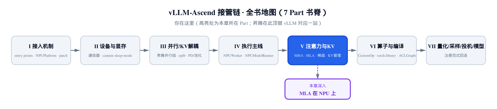
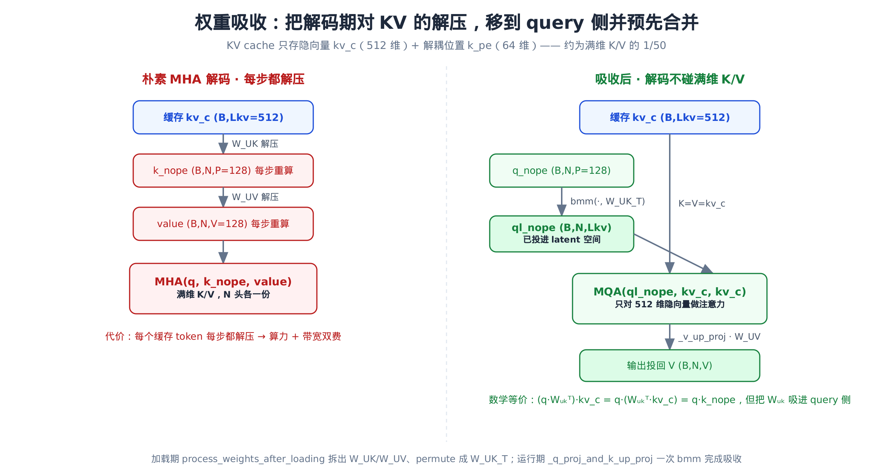
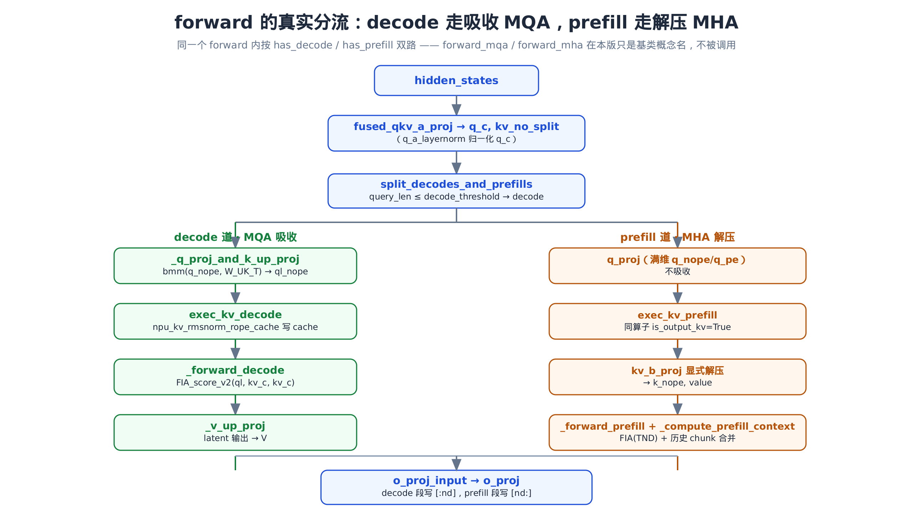
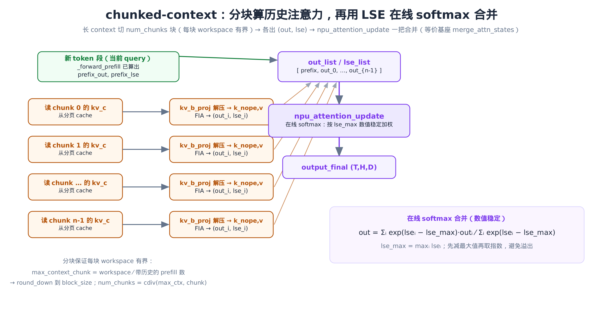

# 第 20 章 MLA 在 NPU 上：prefill/decode 拆分与权重吸收



> 上一章在注意力子系统里讲透了昇腾 MHA：TND 变长布局、`npu_fused_infer_attention_score` 与 LSE。
> 本章接手同子系统的另一支——MLA：用低秩压缩把 KV cache 砍到约 1/57，再用「权重吸收」把解码期的解压省掉。
> 下一章离开注意力，进入算子与编译层。

这是本子系统 `torch_npu` 融合算子最密集的一章。`vllm_ascend/attention/mla_v1.py` 全文约 1804 行，把通用 MLA 的每一步都换成了昇腾专属的一把算子：`npu_format_cast`（权重排布）、`npu_kv_rmsnorm_rope_cache`（一把做 RMSNorm + RoPE + 写 KV cache）、`npu_fused_infer_attention_score(_v2)`（注意力）、`npu_attention_update`（在线 softmax 合并）。我们逐个拆开看。

## 20.1 先说清楚：MLA 到底省了什么

MLA（Multi-head Latent Attention，多头潜在注意力）是 DeepSeek-V2/V3 带火的注意力变体。它解决的是一个很具体的痛点：**KV cache 太占显存**。

标准 MHA 每个 token、每一层，要为每个头各缓存一份 K 和一份 V。以 DeepSeek-V3 为例，128 个头、每头 K/V 各 128 维：

$$
\mathrm{MHA\_cache} = N \times (P + V) = 128 \times (128 + 128) = 32768 \;\mathrm{（标量/token/层）}
$$

MLA 换了个存法：不存满维 K/V，只缓存一个**低秩隐向量** `kv_c`（`kv_lora_rank = 512`），外加一个**解耦位置编码** `k_pe`（`qk_rope_head_dim = 64`）：

$$
\mathrm{MLA\_cache} = L_{kv} + R = 512 + 64 = 576 \;\mathrm{（标量/token/层）}
$$

$$
\frac{\mathrm{MLA\_cache}}{\mathrm{MHA\_cache}} = \frac{576}{32768} \approx \frac{1}{57}
$$

人话翻译：同样长的上下文，MLA 的 KV cache 大约只占 MHA 的 1/57。一张卡能塞下的并发序列、能跑的上下文长度，因此成倍放大。

**但天下没有免费的午餐。** 缓存的是压缩过的 `kv_c`，真要算注意力还得把它经上投影 `W_UK` / `W_UV` 解压回满维 K/V。如果解码（decode）每一步都对缓存里的**每个**历史 token 做一次解压，那省下的显存就用算力和带宽换回去了——而 decode 恰恰是最在意延迟的阶段。

MLA 的妙招叫**权重吸收（weight absorption）**：把「解压」这一步从 K 侧搬到 query 侧，并和 query 的上投影预先合并。于是 decode 期完全不碰满维 K/V，只对 512 维的隐向量做一次 MQA（多 query 头共享同一份 KV 的注意力）。这一招是本章的灵魂——它在 `vllm_ascend/attention/mla_v1.py` 的 `AscendMLAImpl` 里用昇腾算子兑现，我们先把它讲透。

## 20.2 从 ch18 接棒：AscendMLAImpl 是谁选出来的

[第 18 章：注意力后端选择](../ch18-attention-backend-selection/narrative/chapter.md)讲过昇腾如何按模型与配置路由到具体的注意力后端。当模型是 MLA 架构时，路由的落点就是 `AscendMLABackend`。它是一层薄壳，把「用哪个实现类、用哪个元数据 builder」这两个钩子接出去：

```python
# vllm_ascend/attention/mla_v1.py:L105
    @staticmethod
    def get_impl_cls() -> type["MLAAttentionImpl"]:
        if enable_cp():
            from vllm_ascend.attention.context_parallel.mla_cp import AscendMlaCPImpl

            return AscendMlaCPImpl
        return AscendMLAImpl

    @staticmethod
    def get_supported_kernel_block_sizes() -> list[int]:
        return [128]
```

`enable_cp()` 是上下文并行（context parallel）的旁支，本章只走主线 `return AscendMLAImpl`。所以本章的主角，就是 `get_impl_cls()` 在单卡主路返回的这个 `AscendMLAImpl`——它继承 vLLM 的 `MLAAttentionImpl`，把通用 MLA 的 prefill/decode 两条路径逐一换成昇腾融合算子。

对照基座 vLLM 的通用实现在 `vllm/model_executor/layers/attention/mla_attention.py`（`MLACommonImpl` / `MLACommonMetadataBuilder`）。下文凡提到「基类怎么做」，指的都是这个文件。

## 20.3 权重吸收（一）：加载期把 kv_b_proj 拆成 W_UK 与 W_UV

吸收分两步：**加载期**把权重拆好、转好排布；**运行期**用一次 `torch.bmm` 把 query 投进 latent 空间。先看加载期的 `process_weights_after_loading`：

```python
# vllm_ascend/attention/mla_v1.py:L924
    def process_weights_after_loading(self, act_dtype: torch.dtype):
        # NOTE: We currently do not support quant kv_b_proj.
        assert isinstance(self.kv_b_proj.quant_method, UnquantizedLinearMethod)
        # NOTE: Weight will be reshaped next, we need to revert and transpose it.
        kv_b_proj_weight = torch_npu.npu_format_cast(self.kv_b_proj.weight.data, ACL_FORMAT_FRACTAL_ND).T
        assert kv_b_proj_weight.shape == (
            self.kv_lora_rank,
            self.num_heads * (self.qk_nope_head_dim + self.v_head_dim),
        )
        # … 省略：形状断言的错误信息 …
        kv_b_proj_weight = kv_b_proj_weight.view(
            self.kv_lora_rank,
            self.num_heads,
            self.qk_nope_head_dim + self.v_head_dim,
        )

        W_UK, W_UV = kv_b_proj_weight.split([self.qk_nope_head_dim, self.v_head_dim], dim=-1)

        # … 省略：graph+RL 重捕获时 copy_ 回原地址的 else 分支 …
        if not hasattr(self, "W_UV"):
            # Convert from (L, N, V) to (N, L, V)
            self.W_UV = W_UV.transpose(0, 1).contiguous()
            # Convert from (L, N, P) to (N, P, L)
            self.W_UK_T = W_UK.permute(1, 2, 0).contiguous()
```

这段做的是纯粹的形状搬运，跟着维度走一遍就懂：

- `kv_b_proj.weight` 原本是上投影矩阵，形状 `(N·(P+V), L_kv)`——把 512 维隐向量投回 `N` 个头、每头 `P+V` 维的满维 K/V。
- 经 `npu_format_cast(..., ACL_FORMAT_FRACTAL_ND)` 转排布后 `.T`，变成 `(L_kv, N·(P+V))`。
- `view` 成 `(L_kv, N, P+V)`，再 `split` 出两块：`W_UK = (L_kv, N, P)`（K 上投影）、`W_UV = (L_kv, N, V)`（V 上投影）。
- `W_UV.transpose(0, 1)` → `(N, L_kv, V)`；`W_UK.permute(1, 2, 0)` → `W_UK_T = (N, P, L_kv)`。

这个 `W_UK_T` 是吸收的关键中间物——它把 `L_kv` 维放到最后，正好让运行期可以拿 query 的 `q_nope`（也是 `P` 维）去右乘它，一步投进 `L_kv` 空间。

**这里有个容易踩的坑，必须钉死。** 上面 `npu_format_cast` 的目标格式是 `ACL_FORMAT_FRACTAL_ND`，它在 `vllm_ascend/utils.py:L54` 定义为 `2`（ND 排布）——之所以转成 ND，是因为接下来要做 `.T` / `view` / `split` 这些 PyTorch 张量操作，ND 排布才好使。真正喂给昇腾 cube 计算单元的是 `W_UK_T`，它在后面才被转成另一种格式：

```python
# vllm_ascend/attention/mla_v1.py:L979
        if self.enable_mlapo:
            # … 省略：量化融合 mlapo / fa_quant 两条旁支 …
        else:
            # if mlapo, W_UK_T can't trans nz
            self.W_UK_T = maybe_trans_nz(self.W_UK_T)
```

`maybe_trans_nz` 把 `W_UK_T` 转成 `ACL_FORMAT_FRACTAL_NZ`（`utils.py:L55`，值为 `29`，FRACTAL_NZ 是昇腾 cube 的高效内排布）。**所以别把两个 format 搞混**：`kv_b_proj` 的权重 cast 用的是 ND（2，为了张量操作），只有最终喂 cube 的 `W_UK_T` 才转 NZ（29）。

## 20.4 权重吸收（二）：运行期一次 bmm 投进 latent

加载期备好了 `W_UK_T`，运行期 decode 每一步调 `_q_proj_and_k_up_proj`，把 query 的 `q_nope` 一把投进 latent 空间：

```python
# vllm_ascend/attention/mla_v1.py:L910
    # Return `ql_nope`, `q_pe`
    def _q_proj_and_k_up_proj(self, x):
        q_nope, q_pe = (
            self.q_proj(x)[0]
            .view(-1, self.num_heads, self.qk_head_dim)
            .split([self.qk_nope_head_dim, self.qk_rope_head_dim], dim=-1)
        )

        # Convert from (B, N, P) to (N, B, P)
        q_nope = q_nope.transpose(0, 1)
        # Multiply (N, B, P) x (N, P, L) -> (N, B, L)
        ql_nope = torch.bmm(q_nope, self.W_UK_T)
        # Convert from (N, B, L) to (B, N, L)
        return ql_nope.transpose(0, 1), q_pe
```

方法名就是「q 投影 + k 上投影」——它把这两件事合成了一个 `bmm`。注意：**吸收用的是 `torch.bmm`，不是某个 `torch_npu` 算子**。这是一次纯矩阵乘的批量版本，按头（`N`）批量做。

形状代数走一遍（`B` = batch token 数，`N` = 头数，`P` = `qk_nope_head_dim`，`L` = `kv_lora_rank`）：

| 量 | 形状 | 来自 |
|---|---|---|
| `q_nope`（投影并拆分后） | `(B, N, P)` | `q_proj(x)` 的 nope 部分 |
| `q_nope.transpose(0,1)` | `(N, B, P)` | 把头维提到批维 |
| `W_UK_T` | `(N, P, L)` | 加载期 permute 好的右乘矩阵 |
| `bmm((N,B,P), (N,P,L))` | `(N, B, L)` | 按头批量矩阵乘 |
| `ql_nope`（transpose 回来） | `(B, N, L)` | 已投进 latent 空间的 query |

**为什么这样做就等价于「先解压 K 再算注意力」？** 设缓存的隐向量为 `kv_c`（`L` 维），标准做法是先解压出 `k_nope = W_UK^⊤ · kv_c`（`P` 维），再算 query 与它的内积 `q_nope · k_nope`。把它展开：

$$
q_{nope} \cdot k_{nope} = q_{nope} \cdot (W_{UK}^{\top} \cdot kv_c) = (q_{nope} \cdot W_{UK}^{\top}) \cdot kv_c = ql_{nope} \cdot kv_c
$$

人话翻译：矩阵乘有结合律。原本要对**每个缓存 token** 把 `kv_c` 解压成 `k_nope`，现在改成对**每个 query**（decode 时每序列只有 1 个）先把 `q_nope` 投成 `ql_nope`，然后 query 直接和缓存的 `kv_c` 做内积。把 `W_UK` 从 K 侧「吸」进了 query 侧——这就是「吸收」二字的来历。

这套等价不是昇腾独创——基座 vLLM 把它写在了 `MLACommonImpl` 的类 docstring 里，作为「数据搬运友好（forward_mqa）」的标准写法：

```python
# vllm/model_executor/layers/attention/mla_attention.py:L94（类 docstring 中的伪代码）
## Data-Movement Friendly Approach (i.e. "forward_mqa"):

Runtime
q_c      = h_t @ W_DQ
q_nope   = (q_c @ W_UQ).view(-1, N, P)
ql_nope  = einsum("snh,lnh->snl", q, W_UK)
# … 省略：q_pe / new_kv_c / new_k_pe / 拼接 cache 的几行 …

// MQA with QK headdim = Lkv + R
//           V headdim = Lkv
// NOTE: this is less compute-friendly since Lkv > P
//       but is more data-movement friendly since its MQA vs MHA
spda_o = scaled_dot_product_attention(
    torch.cat([ql_nope, q_pe], dim=-1),
    torch.cat([kv_c, k_pe], dim=-1),
    kv_c
)

o = einsum("snl,lnv->snv", spda_o.reshape(-1, N, Lkv), W_UV)
```

`ql_nope = einsum("snh,lnh->snl", q, W_UK)` 就是昇腾的 `torch.bmm(q_nope, W_UK_T)`——同一回事的两种写法；`scaled_dot_product_attention` 的 K、V 都传 `kv_c`，就是我们说的「对 latent 做 MQA」；末尾的 `einsum(..., W_UV)` 对应昇腾的 `_v_up_proj`。昇腾做的，是把这段伪代码的每一步换成融合算子。

decode 时 K 和 V 都用缓存的同一份 `kv_c`，于是注意力退化成 **MQA**（多个 query 头共享同一份 KV）。算完之后，注意力输出还在 latent 空间，需要再投回 V，这由 `_v_up_proj` 闭合：

```python
# vllm_ascend/attention/mla_v1.py:L900
    def _v_up_proj(self, x):
        # Convert from (N, B, L)/(N, B, 1, L) to (N, B, L)
        x = x.view(self.num_heads, -1, self.kv_lora_rank)
        # Multiply (N, B, L) x (N, L, V) -> (B, N, V)
        x = torch_npu.npu_transpose_batchmatmul(x, self.W_UV, perm_y=(1, 0, 2))
        # Convert from (B, N, V) to (B, N * V)
        x = x.reshape(-1, self.num_heads * self.v_head_dim)
        return x
```

latent 输出 `(N, B, L)` 经 `W_UV (N, L, V)` 投回 `(B, N, V)`，再拍平成 `(B, N·V)` 交给后续的 `o_proj`。一进一出，对称收口。

整个吸收的对照——朴素 MHA decode「每步都解压」 vs 吸收后「解码不碰满维 K/V」——画成一张图：



这套形状代数全是纯 PyTorch、与昇腾无关，因此可以在没有 NPU 的开发机上直接验证。精简版搭了 `kv_lora_rank=4`、`num_heads=2`、`qk_nope_head_dim=3` 的小尺寸，跑下来 `W_UK_T.shape == (2, 3, 4)`、`W_UV.shape == (2, 4, 3)`，`_q_proj_and_k_up_proj` 出来的 `ql_nope` 形状是 `(B, 2, 4)`——正是「投进了 4 维 latent」，且全程只调了 `torch.bmm`，没有任何对 KV 的显式解压。形状代数和上面的推导逐一对上。

光看形状还不够「眼见为实」，我们喂一组固定小数值，把上面那条结合律的两端各算一遍（取 `P=3`、`L=4` 的单个头）：

$$
(q \cdot W_{UK}^{\top}) \cdot kv_c = q \cdot (W_{UK}^{\top} \cdot kv_c)
$$

```python
# 单头小尺寸数值核对：P=qk_nope_head_dim=3, L=kv_lora_rank=4
q_nope = [1., 2., 3.]                 # (P,) 这一头的 query
W_UK_T = [[1., 0., 2., 1.],           # (P, L) 加载期 permute 好的吸收矩阵
          [0., 1., 1., 0.],
          [2., 1., 0., 1.]]
kv_c   = [1., 0., 1., 2.]             # (L,) 缓存的隐向量

# (a) 朴素：先解压 K，再算 query·K
k_nope = W_UK_T @ kv_c                # → [5., 1., 4.]   (P,)
a = q_nope @ k_nope                   # → 19.0

# (b) 吸收：先把 query 投进 latent，再和 kv_c 内积
ql_nope = q_nope @ W_UK_T            # → [7., 5., 4., 4.]  (L,)
b = ql_nope @ kv_c                    # → 19.0
```

两条路殊途同归，结果**逐位相等**（`a == b == 19.0`，精简版 test 里就是 `assert torch.allclose(a, b)`）：朴素路在 `(P,)` 空间里点乘，吸收路在 `(L,)` 空间里点乘，但因为矩阵乘有结合律，最终标量分毫不差。这正是吸收能成立的全部底气——换了计算顺序，没换计算结果。

## 20.5 三段 metadata：build 如何切 decode 与 prefill

讲完吸收，回到调度层。每一步前向都要先建一份注意力元数据，告诉算子「这批 token 里哪些是 decode、哪些是 prefill、各自的序列边界在哪」。这活儿由 `AscendMLAMetadataBuilder.build` 干，它继承自 vLLM 的 `MLACommonMetadataBuilder`，产出三段式的 `AscendMLAMetadata`：

```python
# vllm_ascend/attention/mla_v1.py:L427
    def build(
        self,
        common_prefix_len: int,
        common_attn_metadata: AscendCommonAttentionMetadata,
        fast_build: bool = False,
    ) -> AscendMLAMetadata:
        num_reqs = common_attn_metadata.num_reqs
        query_start_loc = common_attn_metadata.query_start_loc
        query_start_loc_cpu = common_attn_metadata.query_start_loc_cpu

        self.num_decodes, self.num_prefills, self.num_decode_tokens, self.num_prefill_tokens = (
            split_decodes_and_prefills(common_attn_metadata, decode_threshold=self.decode_threshold)
        )
        # … 省略：set_num_actual_tokens / 一致性 assert / slot_mapping 切片 …

        prefill_metadata = None
        if self.num_prefills > 0:
            prefill_metadata = self.build_prefill_metadata(common_prefix_len, common_attn_metadata)

        decode_metadata = None
        if self.num_decodes > 0:
            decode_metadata = self.build_decode_metadata(common_prefix_len, common_attn_metadata)
        return self.metadata_cls(  # type: ignore
            # … 省略：num_actual_tokens / query_lens / slot_mapping / attn_mask 等字段 …
            num_decodes=self.num_decodes,
            num_decode_tokens=self.num_decode_tokens,
            num_prefills=self.num_prefills,
            prefill=prefill_metadata,
            decode=decode_metadata,
            # … 省略：block_tables / seq_lens 等 …
        )
```

骨架很清爽：`split_decodes_and_prefills` 一刀切出四个计数（decode 请求数 / prefill 请求数 / decode token 数 / prefill token 数），然后**按需**装配——有 prefill 就建 `prefill` 段，有 decode 就建 `decode` 段，两段都挂进顶层的 `AscendMLAMetadata`。

切分的判据是 `decode_threshold`：`query_len ≤ decode_threshold` 的请求算 decode。普通解码每步只生成 1 个 token，所以阈值默认是 1；但开了投机解码（speculative decoding，一步先生成多个候选 token、再一起验证）时，一个 decode 步要验证多个草稿 token，于是 decode 段每请求的 query token 可能不止 1 个，阈值据此放宽到 `1 + num_speculative_tokens`（受 TND 布局上限约束，`≤ 16`）。

batch 在进来之前已经按「decode 段在前、prefill 段在后」重排好，所以 `build_prefill_metadata` 切 prefill 段时，起点就是 `num_decodes` / `num_decode_tokens`：

```python
# vllm_ascend/attention/mla_v1.py:L545
    def build_prefill_metadata(
        self,
        common_prefix_len: int,
        common_attn_metadata: AscendCommonAttentionMetadata,
    ) -> AscendMLAPrefillMetadata:
        # … 省略：input_positions 取整段 …
        chunked_context_metadata = self.build_chunked_metadata(common_prefix_len, common_attn_metadata)
        reqs_start = self.num_decodes  # prefill_start
        tokens_start = self.num_decode_tokens
        max_query_len = self.query_lens[reqs_start:].max().item()
        # … 省略：max_seq_lens / prefill_query_start_loc …
        prefill_input_positions = input_positions[tokens_start:]
        cos, sin = get_cos_and_sin_mla(prefill_input_positions)
        prefill_query_lens = self.query_lens[reqs_start:].to(torch.int32)
        actual_seq_lengths_q = torch.cumsum(prefill_query_lens, dim=0).tolist()
        return AscendMLAPrefillMetadata(
            # … 省略：attn_mask / query_lens / seq_lens / block_table 等字段 …
            chunked_context=chunked_context_metadata,
            sin=sin,
            cos=cos,
            actual_seq_lengths_q=actual_seq_lengths_q,
        )
```

注意 `actual_seq_lengths_q = torch.cumsum(prefill_query_lens)`——这正是 [第 19 章](../ch19-ascend-attention-mha/narrative/chapter.md)讲过的 TND 变长布局的「累积右边界」：把整批变长序列沿轴 0 打平，用累积和告诉算子每段在哪结束，免去 padding。decode 段的装配（`build_decode_metadata`）对称，差别在它带的是分页 `block_table` 和 `seq_lens_list`，喂的是分页布局的算子，这个下文再展开。

我们用一个混合 batch 在开发机上验证这套切分：`query_lens = [1, 1, 5, 7]`、阈值 1。`build` 出来 `num_decodes == 2`、`num_prefills == 2`、`num_decode_tokens == 2`、`num_actual_tokens == 14`，`prefill` 段和 `decode` 段都非空。prefill 段的 `actual_seq_lengths_q == [5, 12]`（`cumsum([5, 7])`），decode 段的 `actual_seq_lengths_q == [1, 2]`——和上面的切分逻辑分毫不差。纯 decode（`[1,1,1]`）时 `prefill is None`，纯 prefill（`[5,7]`）时 `decode is None`，三态都对。

## 20.6 chunked-context：把长历史切块，每块 workspace 有界

prefill 段里还藏着一个 `build_chunked_metadata`。它处理的是**带历史的 prefill**——也就是 chunked prefill 场景下，一个请求的前缀已经在 KV cache 里、当前这步只前向一段新 token，但算注意力时要带上全部历史 context。

历史可能非常长，一次性把它全解压会爆显存。所以这里把历史切成若干块，保证每块占用的 workspace 有界：

```python
# vllm_ascend/attention/mla_v1.py:L489
    def build_chunked_metadata(
        self,
        common_prefix_len: int,
        common_attn_metadata: AscendCommonAttentionMetadata,
    ):
        if not self.chunked_prefill_enabled:
            return None
        num_reqs = common_attn_metadata.num_reqs

        num_computed_tokens_cpu = self.seq_lens - self.query_lens
        reqs_start = self.num_decodes  # prefill_start

        self.context_lens_cpu = num_computed_tokens_cpu[reqs_start:num_reqs]
        max_context_len_cpu = self.context_lens_cpu.max().item()
        if not max_context_len_cpu > 0:
            return None
        num_prefills_with_context_cpu = (self.context_lens_cpu > 0).sum().item()
        self.max_context_chunk = self.chunked_prefill_workspace_size // num_prefills_with_context_cpu
        self.max_context_chunk = round_down(self.max_context_chunk, self.block_size)

        assert self.max_context_chunk > 0
        self.num_chunks = cdiv(max_context_len_cpu, self.max_context_chunk)
        # … 省略：chunk_starts / chunk_ends / chunk_seq_lens / cu_seq_lens 的逐块游标计算 …
        return ChunkedContextMetadata(
            # … 省略：cu_seq_lens / starts / seq_tot / workspace 等字段装配 …
        )
```

核心是这两行算式。先说清楚 `workspace`：它是算子计算一块历史 context 注意力时申请的临时设备显存（中间结果暂存），大小固定，所以要按「带历史的 prefill 请求数」均分、再 `round_down` 到 `block_size`，才不会让任何一块 context 撑爆这块显存：

$$
\mathrm{max\_context\_chunk} = \mathrm{round\_down}\!\left(\frac{\mathrm{workspace\_size}}{\mathrm{prefill\_with\_context}},\; \mathrm{block\_size}\right)
$$

$$
\mathrm{num\_chunks} = \mathrm{cdiv}(\mathrm{max\_context\_len},\; \mathrm{max\_context\_chunk})
$$

人话翻译：把固定大小的 workspace 平摊给每个带历史的 prefill 请求，得到每块最多能装多少历史 token；`round_down` 到 `block_size` 是为了对齐分页 KV cache 的页边界；最后用「最长历史 ÷ 每块容量」向上取整，得到要切几块。

拿一组具体数走一遍（workspace = 32、block_size = 8、2 个带历史 prefill、`context_lens = [8, 17]`）：

| 量 | 计算 | 取值 |
|---|---|---|
| 每块平摊容量 | `32 // 2` | `16` |
| `max_context_chunk` | `round_down(16, 8)` | `16` |
| `num_chunks` | `cdiv(17, 16)` | `2` |
| chunk 0 各序列长度 | `min([8,17], [16,16]) - [0,0]` | `[8, 16]` |
| chunk 1 各序列长度 | `min([8,17], [32,32]) - [16,16]` clamp | `[0, 1]` |
| `seq_tot`（每块总 token） | 逐块求和 | `[24, 1]` |

表中的 `clamp` 指把每块算出的 context 长度截到合法区间：下截到 0（某条序列历史不足、算出来为负时取 0），上截到该块实际能容纳的长度。切成 2 块，第一块装下两条序列的前 16 个历史 token（第一条只有 8），第二块只剩第二条序列的最后 1 个 token。每块的 workspace 占用都被 `max_context_chunk` 框住——这是「分块」二字保证的不变量。关掉 chunked prefill 时这个方法直接返回 `None`，prefill 退回「无历史」的简单情形。

## 20.7 forward 的真实分流：decode 走吸收，prefill 走解压

元数据备好，进入计算。这里有一个**必须纠正的认知偏差**：vLLM 基类的 docstring 把 MLA 的两种数学等价写法叫 `forward_mqa`（数据搬运友好）和 `forward_mha`（计算友好），很容易让人以为昇腾版也是 `forward` 里调这两个方法。**实际上不是。** 本版的 `forward_mqa` / `forward_mha` 只是两个占位存根：

```python
# vllm_ascend/attention/mla_v1.py:L1696
    def forward_mha(self, ...):
        raise NotImplementedError("forward_mha is not supported for MLA attention. Use forward() instead.")

    def forward_mqa(self, ...):
        raise NotImplementedError("forward_mqa is not supported for MLA attention. Use forward() instead.")
```

真正的 decode/prefill 分流，发生在 `forward()` → `_mla_preprocess()` 内部，按 `has_decode` / `has_prefill` 双路走。`forward` 本身是个清晰的「预分配 → 双路预处理 → 双路注意力 → 合并投影」骨架：

```python
# vllm_ascend/attention/mla_v1.py:L1718
    def forward(
        self,
        layer_name,
        hidden_states: torch.Tensor,  # query in unified attn
        kv_cache: tuple[torch.Tensor],
        attn_metadata: M,
        need_gather_q_kv: bool = False,
        output: torch.Tensor | None = None,
    ) -> torch.Tensor:
        assert output is not None, "Output tensor must be provided."
        if attn_metadata is None:
            # Profiling run.
            # … 省略：layer_sharding 预热 …
            return output.fill_(0)

        num_actual_tokens = self.get_num_actual_tokens(attn_metadata)
        num_decode_tokens = attn_metadata.num_decode_tokens
        o_proj_input_shape = (_EXTRA_CTX.num_tokens, self.num_heads * self.v_head_dim)
        o_proj_input = torch.zeros(o_proj_input_shape, dtype=hidden_states.dtype, device=hidden_states.device)

        # MLA Preprocess
        decode_preprocess_res, prefill_preprocess_res = self._mla_preprocess(
            layer_name, hidden_states, kv_cache, attn_metadata, need_gather_q_kv
        )
        if decode_preprocess_res is not None:
            output_decode = self._forward_decode(
                decode_preprocess_res.ql_nope,
                decode_preprocess_res.q_pe,
                decode_preprocess_res.k_nope,
                decode_preprocess_res.k_pe,
                kv_cache[0].shape[1],
                attn_metadata,
                decode_preprocess_res.dequant_scale_q_nope,
            )
            o_proj_input[:num_decode_tokens] = output_decode

        if prefill_preprocess_res is not None:
            output_prefill = self._forward_prefill(
                prefill_preprocess_res.q_nope,
                prefill_preprocess_res.q_pe,
                prefill_preprocess_res.k_nope,
                prefill_preprocess_res.k_pe,
                prefill_preprocess_res.value,
                kv_cache,
                attn_metadata,
            )
            o_proj_input[num_decode_tokens:num_actual_tokens] = output_prefill
        # O proj
        output[...] = self.o_proj(o_proj_input, is_prefill=prefill_preprocess_res is not None)[0]
        del o_proj_input
        return output_padded
```

读这段时盯住 `o_proj_input` 这块零张量：decode 段的注意力输出写进它的 `[:num_decode_tokens]`，prefill 段的写进 `[num_decode_tokens:num_actual_tokens]`，最后整块过一次 `o_proj`。两段在同一块缓冲里各占一段，互不打扰。

分流的源头在 `_mla_preprocess`：

```python
# vllm_ascend/attention/mla_v1.py:L1640
    def _mla_preprocess(self, layer_name, hidden_states, kv_cache, attn_metadata, need_gather_q_kv):
        # … 省略：方法开头的步骤注释 …
        has_decode = attn_metadata.num_decodes > 0
        has_prefill = attn_metadata.num_prefills > 0
        if self.fused_qkv_a_proj is not None:
            qkv_lora = self.fused_qkv_a_proj(hidden_states)[0]
            q_c, kv_no_split = qkv_lora.split(
                [self.q_lora_rank, self.kv_lora_rank + self.qk_rope_head_dim],
                dim=-1,
            )
            q_c = self.q_a_layernorm(q_c)  # type: ignore[misc]
            kv_no_split = kv_no_split.contiguous()
        else:
            q_c = hidden_states
            kv_no_split = self.kv_a_proj_with_mqa(hidden_states)[0]  # type: ignore[misc]

        decode_preprocess_res = None
        prefill_preprocess_res = None
        # Preprocess for decode tokens
        if has_decode:
            decode_preprocess_res = self.mla_preprocess_decode(q_c, kv_no_split, kv_cache, attn_metadata)
        # Preprocess for prefill tokens
        if has_prefill:
            prefill_preprocess_res = self.mla_preprocess_prefill(q_c, kv_no_split, kv_cache, attn_metadata)
        return decode_preprocess_res, prefill_preprocess_res
```

`fused_qkv_a_proj` 一把把 `hidden_states` 投成 `q_c`（query 的低秩表示）和 `kv_no_split`（还没拆分的 KV 隐表示，含 `kv_c` + `k_pe`），`q_a_layernorm` 归一化 `q_c`。然后按 `has_decode` / `has_prefill` 分别调两个预处理。整条分流画成泳道图：



两条预处理的根本差别，就是「吸收 vs 不吸收」。decode 路：

```python
# vllm_ascend/attention/mla_v1.py:L1620
    def mla_preprocess_decode(self, q_c, kv_no_split, kv_cache, attn_metadata):
        num_decode_tokens = attn_metadata.num_decode_tokens
        decode_q_c = q_c[:num_decode_tokens]
        cos = attn_metadata.decode.cos
        sin = attn_metadata.decode.sin
        decode_ql_nope, decode_q_pe = self._q_proj_and_k_up_proj(decode_q_c)
        decode_q_pe = self.rope_single(decode_q_pe, cos, sin)
        # … 省略：fa_quant 动态量化旁支 …
        decode_slots = attn_metadata.slot_mapping[:num_decode_tokens:1]
        decode_kv_no_split = kv_no_split[:num_decode_tokens]
        decode_k_pe, decode_k_nope = self.exec_kv_decode(decode_kv_no_split, cos, sin, kv_cache, decode_slots)
        return DecodeMLAPreprocessResult(
            decode_ql_nope, decode_q_pe, decode_k_nope, decode_k_pe, dequant_scale_q_nope=dequant_scale_q_nope
        )
```

decode 调的是 `_q_proj_and_k_up_proj`——就是 §20.4 那个吸收方法，query 直接投进 latent。prefill 路则截然不同：

```python
# vllm_ascend/attention/mla_v1.py:L1598
    def mla_preprocess_prefill(self, q_c, kv_no_split, kv_cache, attn_metadata):
        num_decode_tokens = attn_metadata.num_decode_tokens
        num_actual_tokens = attn_metadata.num_actual_tokens
        prefill_kv_no_split = kv_no_split[num_decode_tokens:num_actual_tokens]
        prefill_q_c = q_c[num_decode_tokens:num_actual_tokens]
        prefill_q = self.q_proj(prefill_q_c)[0].view(-1, self.num_heads, self.qk_head_dim)
        prefill_q_pe = prefill_q[..., self.qk_nope_head_dim :]
        prefill_q_nope = prefill_q[..., : self.qk_nope_head_dim]
        cos = attn_metadata.prefill.cos
        sin = attn_metadata.prefill.sin
        prefill_slots = attn_metadata.slot_mapping[num_decode_tokens:num_actual_tokens]
        prefill_q_pe = self.rope_single(prefill_q_pe, cos, sin)
        prefill_k_pe, prefill_k_c_normed = self.exec_kv_prefill(prefill_kv_no_split, cos, sin, kv_cache, prefill_slots)
        prefill_k_nope, prefill_value = (
            self.kv_b_proj(prefill_k_c_normed)[0]
            .view(-1, self.num_heads, self.qk_nope_head_dim + self.v_head_dim)
            .split([self.qk_nope_head_dim, self.v_head_dim], dim=-1)
        )
        prefill_k_pe = prefill_k_pe.view(prefill_q_c.shape[0], self.num_kv_heads, -1)
        prefill_k_pe = prefill_k_pe.expand((*prefill_k_nope.shape[:-1], -1))
        return PrefillMLAPreprocessResult(prefill_q_nope, prefill_q_pe, prefill_k_nope, prefill_k_pe, prefill_value)
```

prefill 用 `q_proj` 出**满维** `q_nope` / `q_pe`，**不吸收**；而且它显式调 `kv_b_proj` 把 `k_c_normed` 解压成满维 `k_nope` 和 `value`。这就是基类说的「计算友好」MHA 写法。

**为什么 decode 吸收、prefill 解压？** 两阶段的瓶颈不同：

- **decode**：每序列只有 1 个 query，但 KV 全在分页 cache、可能很长——瓶颈在**数据搬运**。吸收成 MQA 后，每个缓存 token 不用解压，搬运量最小。
- **prefill**：有一整段变长新 token、需要 causal mask——瓶颈在**计算**。显式解压成满维 K/V 后走标准 MHA，计算单元利用率更高。

在开发机上把两条路各跑一遍可以看清这个差异：decode 路调了 `q_b_proj`（上投影）和 `npu_kv_rmsnorm_rope_cache`，**没碰** `kv_b_proj`；prefill 路则明确调了 `kv_b_proj` 显式解压，且返回结果里 `value is not None`。两路的算子调用序，和源码逐一吻合。

## 20.8 exec_kv：一个算子做完 RMSNorm + RoPE + 写 cache

上面两条路都调了 `exec_kv_*` 来处理 KV，落点是昇腾最有代表性的融合算子 `npu_kv_rmsnorm_rope_cache`。它把三件本来分开的事——`kv_a_layernorm` 的 RMSNorm、`k_pe` 的 RoPE、写分页 KV cache——揉进一个 kernel：

```python
# vllm_ascend/attention/mla_v1.py:L1312
    def exec_kv_decode(
        self,
        kv_no_split: torch.Tensor,
        cos: torch.Tensor,
        sin: torch.Tensor,
        kv_cache: tuple,
        slots: torch.Tensor,
    ):
        assert self.kv_a_layernorm is not None
        B = kv_no_split.shape[0]
        N = self.num_kv_heads
        S = 1
        # npu_kv_rmsnorm_rope_cache needs [B, N, S, D]
        kv_no_split = kv_no_split.view(B, N, S, self.kv_lora_rank + self.qk_rope_head_dim)
        cache_mode = "PA_NZ" if self.enable_kv_nz else "PA"
        c_kv_scale = None
        k_pe, k_nope, _, _ = torch_npu.npu_kv_rmsnorm_rope_cache(
            kv_no_split,
            self.kv_a_layernorm.weight,  # type: ignore[union-attr]
            cos,
            sin,
            slots.to(torch.int64),
            kv_cache[1],
            kv_cache[0],
            c_kv_scale=c_kv_scale,
            epsilon=self.kv_a_layernorm.variance_epsilon,  # type: ignore[union-attr]
            cache_mode=cache_mode,
        )
        return k_pe, k_nope
```

decode 取算子的**前两个**返回值 `(k_pe, k_nope)`，其中 `k_nope` 就是写进 cache 的隐向量 `kv_c`——decode 注意力直接拿它当 K=V 做 MQA，不再解压。`cache_mode` 决定 KV cache 的物理布局：`"PA"` 是标准分页（paged attention），`"PA_NZ"`（开 `enable_kv_nz` 时走）是带昇腾 NZ 格式压缩的分页，本章主线走 `"PA"`。

prefill 用的是同一个算子，但有两处关键差别：

```python
# vllm_ascend/attention/mla_v1.py:L1362
        _, _, k_pe, k_nope = torch_npu.npu_kv_rmsnorm_rope_cache(
            kv_no_split,
            self.kv_a_layernorm.weight,  # type: ignore[union-attr]
            cos,
            sin,
            slots.to(torch.int64),
            kv_cache[1],
            kv_cache[0],
            c_kv_scale=c_kv_scale,
            epsilon=self.kv_a_layernorm.variance_epsilon,  # type: ignore[union-attr]
            cache_mode=cache_mode,
            is_output_kv=True,
        )
        return k_pe, k_nope
```

差别一：传 `is_output_kv=True`，让算子额外吐出未量化的 KV。差别二：取的是**后两个**返回值。decode 要的是「写进 cache 的隐向量」（前两个），prefill 要的是「供 `kv_b_proj` 显式解压用的输出 KV」（后两个）。同一个算子，靠返回值位置区分用途。

这个差异很微妙，正好用记录调用的替身在开发机上钉死：`exec_kv_decode` 取到的返回值对应替身的第 1/2 个输出、`cache_mode == "PA"`、调用里**没有** `is_output_kv` 标志；`exec_kv_prefill` 取到第 3/4 个输出、调用里 `is_output_kv is True`。和源码里两处的取值位置、入参一一对上。

decode 路 query 的位置编码由 `rope_single` 单独加，它包的是 `npu_interleave_rope`：

```python
# vllm_ascend/attention/mla_v1.py:L1377
    def rope_single(
        self,
        x: torch.Tensor,
        cos: torch.Tensor,
        sin: torch.Tensor,
    ) -> torch.Tensor:
        B, N, D = x.shape
        S = 1
        x = x.view(B, N, S, D)
        x = torch_npu.npu_interleave_rope(x, cos, sin)
        return x.view(B, N, D)
```

## 20.9 decode 注意力：对 latent 的 MQA

decode 预处理出 `ql_nope`（已吸收的 query）、`q_pe`、缓存隐向量 `k_nope`、`k_pe`，交给 `_forward_decode`。它的主线很短——把张量摆成分页布局，调 `npu_fused_infer_attention_score_v2`，再 `_v_up_proj` 投回 V。

注意一个命名的小坑：传进 `_forward_decode` 后，这个**已吸收的 latent query** 的形参名就叫 `q_nope`。它是 [§20.4](#204-权重吸收二运行期一次-bmm-投进-latent) 里已经投进 latent 的 `ql_nope`，**不是** prefill 路那个满维、未吸收的 `q_nope`。同名不同物，读代码时别被绊住：

```python
# vllm_ascend/attention/mla_v1.py:L1479
        else:
            # The output layout is set to NBSD to eliminate the need for a
            # transpose operation after attention.
            input_layout = "BNSD_NBSD"
            q_nope = q_nope.view(num_tokens, self.num_heads, 1, -1).contiguous()
            q_pe = q_pe.view(num_tokens, self.num_heads, 1, -1)
            attn_output_shape = (self.num_heads_padded, num_tokens, 1, self.kv_lora_rank)
            sparse_mode = 0
            attn_mask = None

        common_kwargs = {
            "query_rope": q_pe,
            "key_rope": k_pe,
            "num_query_heads": self.num_heads_padded,
            "num_key_value_heads": self.num_kv_heads,
            "input_layout": input_layout,
            # … 省略：atten_mask / sparse_mode / softmax_scale 等 …
            "block_table": decode_meta.block_table,
            "block_size": block_size,
            "actual_seq_qlen": actual_seq_lengths,
            "actual_seq_kvlen": decode_meta.seq_lens_list,
        }
        # … 省略：图捕获路径（get_max_workspace 预取 + graph_task_group）…
            attn_output, _ = torch_npu.npu_fused_infer_attention_score_v2(q_nope, k_nope, k_nope, **common_kwargs)

        if self.head_padding > 0:
            attn_output = attn_output[: self.num_heads]
        return self._v_up_proj(attn_output)
```

盯住这一行算子调用：

```python
torch_npu.npu_fused_infer_attention_score_v2(q_nope, k_nope, k_nope, ...)
```

**第二个和第三个入参（K 和 V）是同一个 `k_nope`**——也就是缓存的隐向量 `kv_c`。这就是吸收的最终兑现：decode 注意力不再有满维 K/V 之分，K 和 V 都是那份 512 维的 latent，对它做一次 MQA。算完输出还在 latent 空间，`_v_up_proj` 用 `W_UV` 把它投回 V 维，写进 `o_proj_input` 的 decode 段。

完整的 `_forward_decode` 在真仓里很长，因为它要应付多种设备型号、量化模式、以及 ACL 图捕获——图捕获路径会先用 `get_max_workspace` 预取算子所需的 workspace 再录制。主线（非捕获、bf16、标准分页）就是上面这几行：摆布局、一次 `_v2` 算子、投回 V。

## 20.10 prefill 注意力：新 token + chunked 历史的 LSE 合并

最后是 prefill 的注意力 `_forward_prefill`。它分两步：先算当前这段**新 token** 的注意力，再用 `_compute_prefill_context` 把**历史 context** 的注意力补上、合并。

```python
# vllm_ascend/attention/mla_v1.py:L1243
    def _forward_prefill(
        self,
        q_nope: torch.Tensor,
        q_pe: torch.Tensor,
        k_nope: torch.Tensor,
        k_pe: torch.Tensor,
        value: torch.Tensor,
        kv_c_and_k_pe_cache: tuple[torch.Tensor],
        attn_metadata: AscendMLAMetadata,
    ) -> torch.Tensor:
        # … 省略：取 prefill_meta / 算 actual_seq_lengths …
        common_kwargs = {
            "num_heads": self.num_heads,
            "num_key_value_heads": self.num_heads,
            "input_layout": "TND",
            # … 省略：atten_mask / sparse_mode / scale 等 …
            "softmax_lse_flag": True,
            "actual_seq_lengths": actual_seq_lengths_q,
            "actual_seq_lengths_kv": actual_seq_lengths_kv,
        }
        common_kwargs["query_rope"] = q_pe
        common_kwargs["key_rope"] = k_pe
        query, key = q_nope, k_nope

        attn_output, attn_lse = torch_npu.npu_fused_infer_attention_score(query, key, value, **common_kwargs)

        attn_output, attn_lse = self._compute_prefill_context(
            q_nope, q_pe, kv_c_and_k_pe_cache, self.qk_rope_head_dim, attn_metadata, attn_output, attn_lse
        )

        attn_output = attn_output.reshape([num_tokens, self.num_heads * self.v_head_dim])
        return attn_output
```

第一步对新 token 用 `npu_fused_infer_attention_score`（TND 变长布局，回指 [第 19 章](../ch19-ascend-attention-mha/narrative/chapter.md)）。关键是 `softmax_lse_flag=True`——让算子在吐注意力输出的同时，额外吐一份 **LSE**（log-sum-exp，对这段 key 的各注意力分数取指数、求和、再取对数）。它记录的是这段注意力的归一化因子（softmax 分母的对数）；后面把「新 token 注意力」和「历史 context 注意力」做在线合并时，正是据各段的 LSE 加权——所以它是合并的接缝料。

第二步 `_compute_prefill_context` 是本章最后一段硬骨头。它把长 context 按 §20.6 切好的块，逐块从分页 cache 读 `kv_c`、解压、算注意力，最后用 `npu_attention_update` 把所有片段合并。读这段时会看到每轮调一次 `DeviceOperator.kv_cache_load`——它按 `block_table` 索引从分页 KV cache 里把该块的 `kv_c`（写进 `kv_c_normed`）与 `k_pe` 读出来，是一次设备侧的 gather（按页表跳着取，不是连续的普通拷贝）：

```python
# vllm_ascend/attention/mla_v1.py:L1136
    def _compute_prefill_context(
        self,
        q_nope, q_pe, kv_c_and_k_pe_cache, rope_dim, attn_metadata, prefix_output, prefix_lse,
    ):
        prefill_metadata = attn_metadata.prefill
        if prefill_metadata is None or prefill_metadata.chunked_context is None:
            return prefix_output, prefix_lse

        iters = len(prefill_metadata.chunked_context.seq_tot)
        # … 省略：取 cache / 维度常量 …
        if prefix_lse.dim() == 2:
            prefix_lse = prefix_lse.transpose(0, 1).unsqueeze(-1)
        prefix_output = prefix_output.to(torch.float32)
        prefix_lse = prefix_lse.to(torch.float32)
        out_list = [prefix_output.reshape(num_tokens * H, D)]
        lse_list = [prefix_lse.reshape(num_tokens * H)]
        # … 省略：common_kwargs 装配（TND / softmax_lse_flag=True）…

        for i in range(iters):
            toks = prefill_metadata.chunked_context.seq_tot[i]
            context_seq_len_npu = self.get_context_seq_len_npu(i, attn_metadata)
            kv_c_normed = torch.empty(toks, num_heads, latent_kv_dim, dtype=cache_kv_c.dtype, device=cache_kv_c.device)
            k_pe = torch.empty(toks, num_heads, rope_dim, dtype=q_pe.dtype, device=q_pe.device)

            DeviceOperator.kv_cache_load(
                cache_kv_c, cache_k_pe, prefill_metadata.block_table, context_seq_len_npu,
                prefill_metadata.chunked_context.starts[i], key=kv_c_normed, value=k_pe,
            )
            kv_c_normed = kv_c_normed.squeeze()
            kv_nope = self.kv_b_proj(kv_c_normed)[0].view(-1, self.num_heads, self.qk_nope_head_dim + self.v_head_dim)
            k_nope, v = kv_nope.split([self.qk_nope_head_dim, self.v_head_dim], dim=-1)
            k_pe = k_pe.expand((*k_nope.shape[:-1], -1))
            # … 省略：actual_seq_lengths_kv / query_rope / key_rope 装配 …
            chunk_out, chunk_lse = torch_npu.npu_fused_infer_attention_score(query, key, v, **common_kwargs)

            if chunk_lse.dim() == 2:
                chunk_lse = chunk_lse.transpose(0, 1).unsqueeze(-1)
            chunk_out = chunk_out.to(torch.float32)
            chunk_lse = chunk_lse.to(torch.float32)
            out_list.append(chunk_out.reshape(num_tokens * H, D))
            lse_list.append(chunk_lse.reshape(num_tokens * H))

        output_final, _ = torch_npu.npu_attention_update(tuple(lse_list), tuple(out_list), 0)
        return output_final.view(num_tokens, H, D), None
```

读这段时盯住两个列表 `out_list` / `lse_list`：它们以新 token 的 `(prefix_output, prefix_lse)` 起头，每轮循环往里 append 一块历史 context 的注意力结果。循环结束后，`npu_attention_update` 一把把整个列表做在线 softmax 合并。

这套「逐块算 + 在线合并」也是照搬基座的设计。`MLACommonImpl` 的 docstring 把 chunked prefill 写成一个标准循环，合并用的就是 `merge_attn_states`：

```python
# vllm/model_executor/layers/attention/mla_attention.py:L161（类 docstring 中的伪代码）
// Compute attention with the already existing context
for chunk_idx in range(cdiv(C, MCC)):
    # … 省略：按 chunk_start/chunk_end 切出 cache_kv_c_chunk …
    cache_k_nope_chunk = (cache_kv_c_chunk @ W_UK).view(-1, N, P)
    cache_v_chunk      = (cache_kv_c_chunk @ W_UV).view(-1, N, V)

    chunk_o, chunk_lse = scaled_dot_product_attention(
        torch.cat([q_nope, q_pe], dim=-1),
        # … 省略：拼接 cache_k_nope_chunk / cache_k_pe_chunk …
        cache_v_chunk,
        casual=False,
        return_softmax_lse=True
    )

    curr_o, curr_lse = merge_attn_states(
        suffix_output=curr_o, suffix_lse=curr_lse,
        prefix_output=chunk_o, prefix_lse=chunk_lse,
    )
```

`cache_kv_c_chunk @ W_UK` 就是昇腾的 `kv_b_proj(kv_c_normed)` 显式解压，`merge_attn_states` 就是昇腾的 `npu_attention_update`。差别只在：基座每算完一块就 `merge` 一次（流式），昇腾攒齐 `prefix + 全部 chunk` 的列表再 `npu_attention_update` 一把合——数学结果相同。

把昇腾这条循环的状态摆成逐轮表（接 §20.6 那个 `num_chunks = 2` 的例子）：

| 轮次 `i` | 动作 | 该块 `seq_tot` | 算子产出 | `out_list` 长度 | `lse_list` 长度 |
|---|---|---|---|---|---|
| —（入循环前） | 放入新 token 的 prefix | — | `(prefix_out, prefix_lse)` | 1 | 1 |
| 0 | 读 chunk 0 的 `kv_c` → `kv_b_proj` 解压 → FIA | 24 | `(chunk_out₀, chunk_lse₀)` | 2 | 2 |
| 1 | 读 chunk 1 的 `kv_c` → `kv_b_proj` 解压 → FIA | 1 | `(chunk_out₁, chunk_lse₁)` | 3 | 3 |
| 合并 | `npu_attention_update(lse_list, out_list)` | — | `output_final` | — | — |

两个列表的长度始终是 `1 + (已处理块数)`，循环 `iters` 轮后定格在 `1 + iters`。合并不是「算完一块就并一块」，而是攒齐 `prefix + 全部 chunk` 再一次性合——`npu_attention_update` 就是昇腾版的 `merge_attn_states`（等价基类的在线 softmax 合并）。整条「分块算历史 + LSE 在线合并」画成一张图：



**为什么分块再合并是对的？** 注意力的 softmax 分母是所有 key 的 `exp(score)` 之和。把 key 切成几段分别算，每段得到一个局部输出 `out_i` 和一个局部 `lse_i`（这段 `exp(score)` 之和的对数）。合并时用在线 softmax 公式：

$$
\mathrm{lse_{max}} = \max_i \mathrm{lse}_i, \qquad \mathrm{out} = \frac{\sum_i \exp(\mathrm{lse}_i - \mathrm{lse_{max}}) \cdot \mathrm{out}_i}{\sum_i \exp(\mathrm{lse}_i - \mathrm{lse_{max}})}
$$

人话翻译：每段先各自归一化，再按各段「占了多少 softmax 权重」（由 `lse_i` 反映）加权平均。**数值稳定性的不变量**在于先减 `lse_max` 再取指数——这保证所有指数的幂 `lse_i - lse_max ≤ 0`，于是 `exp(·) ∈ (0, 1]`，永不上溢。无论切几块、各块多长，合并结果都和「一次性对全部 key 算 softmax」逐位相等。

这套合并逻辑是纯循环 + 形状代数，在开发机上可以完整复现。喂一个 `num_chunks = 2` 的 metadata 进去，`_compute_prefill_context` 恰好调了 2 次 `npu_fused_infer_attention_score`（每块一次），合并时 `lse_list` / `out_list` 长度都是 3（`1 + 2`），且合并后返回的 LSE 是 `None`（合完不再往上传 LSE）。当 `chunked_context is None` 时直接返回 prefix、一次注意力都不算——边界也对。

## 20.11 小结：MLA 在昇腾上的全貌

回头看，`vllm_ascend/attention/mla_v1.py` 里的 MLA，是「一个数学招式 + 一串融合算子」的合奏：

- **数学招式是权重吸收**：把 K 的解压用矩阵乘结合律「吸」进 query 侧（`ql_nope = bmm(q_nope, W_UK_T)`）。代价是 KV cache 只存 576 维隐向量、约为满维的 1/57；红利是 decode 完全不解压，对 latent 做一次 MQA（`K = V = k_nope`）。
- **prefill 和 decode 各走各的**：decode 数据搬运受限 → 吸收成 MQA；prefill 计算受限 → 显式 `kv_b_proj` 解压走 MHA。两路在 `forward` 内按 `has_decode` / `has_prefill` 分流，写进同一块 `o_proj_input` 的不同段。
- **每一步都换成昇腾融合算子**：`npu_format_cast`（权重排布 ND/NZ）、`npu_kv_rmsnorm_rope_cache`（RMSNorm + RoPE + 写 cache 三合一）、`npu_fused_infer_attention_score(_v2)`（注意力）、`npu_attention_update`（chunked 历史的在线 softmax 合并）。这是本子系统算子最密集的一处。

至此，注意力子系统（MHA + MLA）的昇腾实现就讲完了。这些 `torch_npu` 融合算子是从哪来的、又如何注册进 PyTorch 的算子分发体系？下一章离开注意力，进入算子与编译层，回答这个问题。
