# 【原理篇·论文精读】MLA：低秩 KV 压缩、解耦 RoPE 与权重吸收

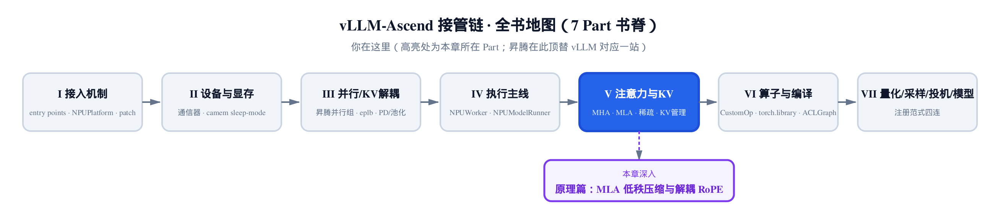

> 你在这里：第 V 部分「注意力与 KV」的原理夹层。
> 上一站：[第 20 章](../../ch20-ascend-attention-mha/narrative/chapter.md)讲透了昇腾 MHA 后端。
> 这一章：推导 MLA 的三块数学地基——低秩压缩、权重吸收、解耦 RoPE。
> 下一站：[第 22 章](../../ch22-mla-on-npu/narrative/chapter.md)看这些数学在昇腾核上落地。

MLA（Multi-head Latent Attention，多头潜在注意力）是 DeepSeek-V2 论文（arXiv:2405.04434）为压缩 KV cache（推理期缓存的历史 key/value）而设计的注意力机制。上一章的 MHA（Multi-Head Attention，标准多头注意力）后端逐头缓存完整 key/value，每 token 每层 32768 个元素；MLA 只缓存一段低秩潜向量加一小撮位置维，576 个。本章沿论文 §2.1 推导支撑这笔账的三块地基：**低秩联合压缩**（key、value 从同一段潜向量现场上投影，缓存量与头数解耦）、**权重吸收**（key 的上投影是常量，可提前折进 query，历史 key 永不物化）、**解耦 RoPE**（RoPE（Rotary Position Embedding，旋转位置编码）的位置旋转恰恰破坏这份常量性，只能单开一小撮维度专载位置）。推导之外再点透一层：吸收后的 MLA 在 decode 时就是一个 head_dim（单头维度）为 576 的 MQA（Multi-Query Attention，多查询注意力，全部头共享同一份 key/value）——训练/prefill 走 MHA 形态保能力，decode 走 MQA 形态省缓存，一套权重两种形态。严谨推导收进「严谨」框，不挡主线；这些数学落到昇腾核上的样子，留给[第 22 章](../../ch22-mla-on-npu/narrative/chapter.md)。

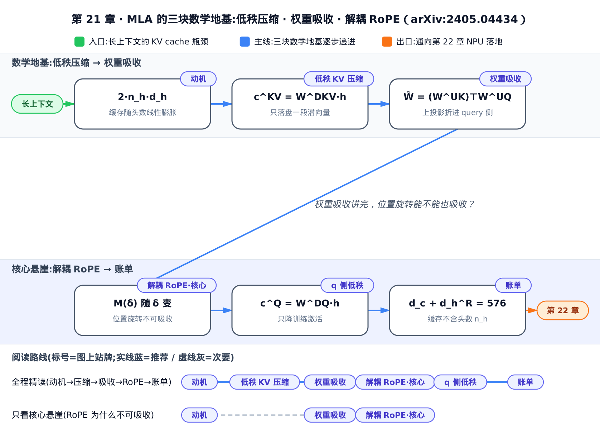

只想抓住「权重能吸收、RoPE 为什么不能」这条主线，直接读 2.2、2.3 两节；想跟完整推导，按序读到账单节。

全章专用记号先列一张速查表，正文首现处仍会给一句解释：

| 符号 | 含义 | 首次出现 |
|---|---|---|
| $`h`$ （ $`\mathbf h_t`$ ） | token $`t`$ 在当前层的隐状态（模型的输入激活）——query、key、value 与潜向量都由它投影而来 | 一、动机 |
| $`n`$ （ $`n_h`$ ） | 注意力头的总数——标准 MHA 缓存量随头数线性增长的斜率就是它 | 一、动机 |
| $`d_h`$ | 单个注意力头的维度（DeepSeek-V2 取 128，见 §3.1.2） | 一、动机 |
| $`d`$ | 隐状态 $`\mathbf h_t`$ 的维度（本章玩具例取 6，DeepSeek-V2 取 5120） | 2.1 节 |
| $`o`$ （ $`\mathbf o_{t,i}`$ ） | token $`t`$ 头 $`i`$ 的注意力输出——对历史 value 按权重加权求和 | 一、动机 |
| $`v`$ （ $`\mathbf v_{j,i}`$ ） | 历史 token $`j`$ 头 $`i`$ 的 value 向量 | 一、动机 |
| $`d_c`$ | 潜向量维度——低秩压缩后 KV 中间向量的宽度（ $`d_c \ll d_h n_h`$ ；DeepSeek-V2 取 512） | 2.1 节 |
| $`\mathbf c^{KV}`$ | token 的 KV 潜向量——由 $`W^{DKV}\mathbf h`$ 压出，K、V 共享的压缩摘要 | 2.1 节 |
| $`W^{UQ}`$ | query 侧的上投影矩阵（逐头各一份）：把低秩 query 潜向量 $`\mathbf c^{Q}`$ 升回每头 query | 2.2 节 |
| $`w_j`$ | 对第 $`j`$ 个历史 token 的注意力权重（第一节 $`\mathbf o_{t,i}`$ 里的 $`\mathrm{Softmax}_j`$ 项，略去 $`t,i`$ 下标） | 2.2 节 |
| $`d_c'`$ | query 侧潜向量维度（ $`\mathbf c^{Q}`$ 的维数，本章玩具取 4，DeepSeek-V2 取 1536）——只降训练激活、不动 KV cache | 2.2 节 |
| $`d_h^R`$ | 解耦 RoPE 分量维度——每头单独承载位置、不参与吸收的那一小撮维度（DeepSeek-V2 取 64） | 2.3 节 |

---

## 一、动机：KV cache 为什么是长上下文的瓶颈

标准多头注意力推理时，每来一个 token 都要为**每个头**各缓存一份完整的 key 和 value——缓存量随头数、随上下文长度双重线性增长，长上下文里卡住吞吐的不是算力，是这份缓存。论文 §2.1.1（arXiv:2405.04434, Eq.7-8）把标准 MHA 的一层写清楚：把 $`\mathbf h_t`$ 投成 query、key、value 三份，切成 $`n_h`$ 个头，逐头算注意力：

$$
\mathbf o_{t,i} = \sum_{j=1}^{t} \mathrm{Softmax}_j\!\left(\frac{\mathbf q_{t,i}^{\top}\mathbf k_{j,i}}{\sqrt{d_h}}\right)\mathbf v_{j,i}
$$

约定下标： $`t`$ 是当前 query 所在的 token 位置， $`i`$ 是注意力头索引， $`j`$ 遍历 $`t`$ 之前的所有历史 token。全章沿用这套约定，尤其后面的 $`\delta=j-t`$ 是两个 token 的**相对位置偏移**。

推理要加速，就得把所有历史 token 的 key、value 全缓存下来。于是每个 token 每层要囤的元素数是（Eq.8）：

$$
2\,n_h\,d_h
$$

这里有两个「线性」：随头数 $`n_h`$ 线性、随上下文长度线性。代进 DeepSeek-V2 的注意力配置 $`n_h{=}128`$ 、 $`d_h{=}128`$ （§3.1.2）：

$$
2\times 128\times 128 = 32768
$$

**每个 token、每一层，往缓存里追加 32768 个元素**；全模型 60 层累计 $`32768\times 60 = 1{,}966{,}080`$ 个元素每 token。下图是这条随上下文线性累积的增长线：

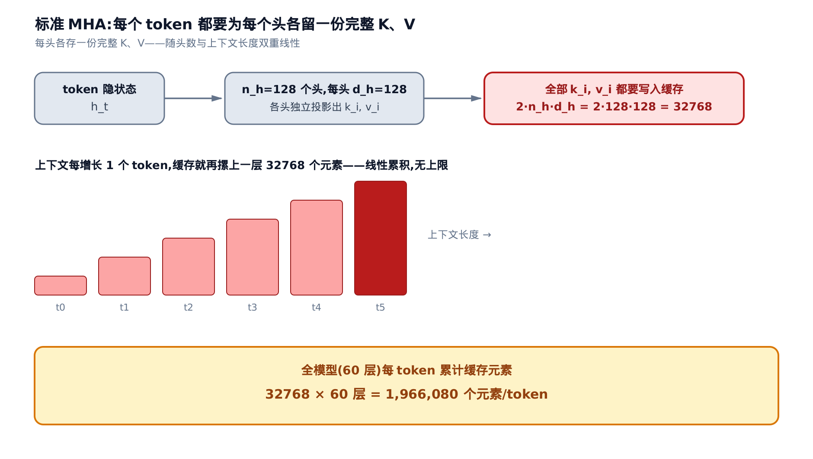

MLA 的任务就是把 $`2\,n_h\,d_h`$ 压成一个与头数无关的小向量。（真实代码里 MLA 每层缓存的形状已不含这个因子，落地见[第 22 章](../../ch22-mla-on-npu/narrative/chapter.md)。）先亮结论：同一个 token，标准 MHA 囤 32768 个元素，MLA 只留 576，落差约 57 倍。后面各节推导这个 576 的来历。

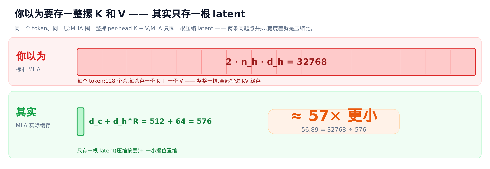

---

## 二、数学推导

先看全貌：从 $`\mathbf h_t`$ 出发兵分三路做下投影，推理期只缓存其中两段（ $`\mathbf c^{KV}`$ 与解耦位置分量），需要时再上投影、拼接出 Q/K/V。2.1 到 2.4 各自展开这张图的一块局部。

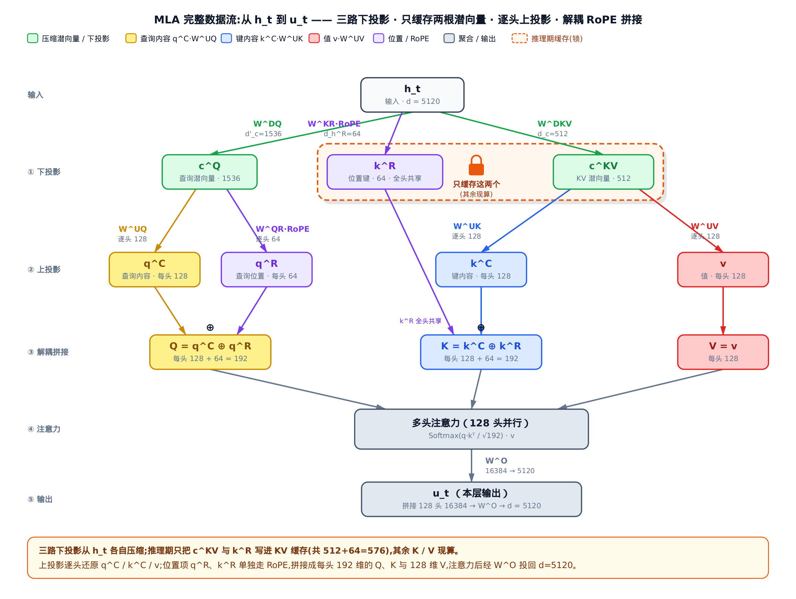

### 2.1 低秩 KV 联合压缩：只缓存一段潜向量

与其为每个头各留一份完整 key、一份完整 value，不如把 token 压成一小段各头**共享**的低秩摘要 $`\mathbf c^{KV}`$ ，推理期只缓存它，用到 key/value 时再现场恢复。论文 §2.1.2（arXiv:2405.04434, Eq.9-11）的核心就三行：

$$
\mathbf c_t^{KV} = W^{DKV}\mathbf h_t,\qquad
\mathbf k_t^{C} = W^{UK}\mathbf c_t^{KV},\qquad
\mathbf v_t^{C} = W^{UV}\mathbf c_t^{KV}
$$

先约定两个方向词：**下投影**（ $`W^{DKV}\in\mathbb R^{d_c\times d}`$ ）降维，**上投影**（ $`W^{UK}, W^{UV}\in\mathbb R^{n_h d_h\times d_c}`$ ）升维。第一行把 $`\mathbf h_t`$ 压到 $`d_c`$ 维潜向量 $`\mathbf c_t^{KV}`$ ；后两行说 key、value 都从这**同一段** $`\mathbf c_t^{KV}`$ 上投影出来。推理期只有 $`\mathbf c_t^{KV}`$ 入缓存，key、value 现算现用、从不落盘。

这一步的不变量一句话讲完：**只要 $`d_c \ll n_h\,d_h`$ ，缓存量就与头数彻底解耦**——缓存足迹从 $`2\,n_h\,d_h\,l`$ 降到 $`d_c\,l`$ （ $`l`$ 为层数），写进缓存的只有 $`\mathbf c^{KV}`$ 这一个张量。下面用一组玩具维度看得更实：取 $`d{=}6`$ 、 $`n_h{=}2`$ 、 $`d_h{=}4`$ 、 $`d_c{=}4`$ 、 $`d_h^R{=}2`$ （解耦 RoPE 分量，2.3 节展开，这里先记账），喂 3 个 token，看每个 token 的潜向量首元素与两种机制各要缓存多少（「物化」指把压缩潜向量显式上投影成完整维度的 K/V）：

<!-- trace: low-rank-kv-joint-compression -->

| token $`t`$ | 潜向量 $`c_{kv}`$ 首元素 | 缓存维数 $`d_c`$ | 物化 key 维数 $`n_h\!\cdot\!d_h`$ | MLA 每 token 缓存 | MHA 基线每 token 缓存 |
|---|---|---|---|---|---|
| 0 | 0.5427 | 4 | 8 | 6 | 16 |
| 1 | -0.0948 | 4 | 8 | 6 | 16 |
| 2 | -0.1942 | 4 | 8 | 6 | 16 |

写进缓存的只有 $`\mathbf c^{KV}`$ 这一个 4 维张量；key（由 $`W^{UK}`$ 物化后 8 维）是现场算的，从不落盘。所以 MLA 每 token 只囤 6 个元素——即 $`d_c+d_h^R = 4+2 = 6`$ （潜向量 4 维 + 解耦 RoPE 分量 2 维），MHA 基线要囤 16。换成 DeepSeek-V2 真实维度，仅联合压缩本体就是 $`d_c{=}512`$ 对 $`n_h\,d_h{=}16384`$ ，压 32 倍。

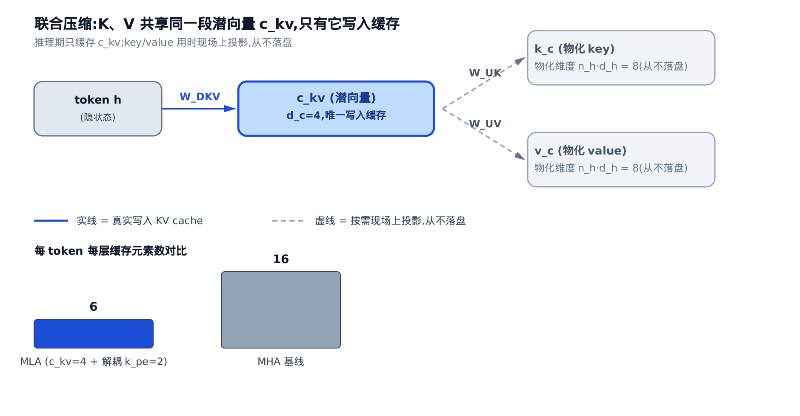

图里蓝色实线是唯一落盘的 $`\mathbf c^{KV}`$ ，两条灰色虚线（ $`W^{UK}`$ 、 $`W^{UV}`$ ）都是「按需现场上投影」——这就是论文那句「we even do not need to compute keys and values out」的图形版。（这段压缩在昇腾上被融进 decode 的写缓存那一步，落地见[第 22 章](../../ch22-mla-on-npu/narrative/chapter.md)。）

### 2.2 权重吸收：把上投影折进 query 与输出

打分要算 query 和 key 的内积，而 key 不过是 $`W^{UK}`$ 从潜向量放大出来的。把这层关系摊开：

$$
\mathbf q^{C\top}\mathbf k^{C}
= (W^{UQ}\mathbf c^{Q})^{\top}(W^{UK}\mathbf c^{KV})
= \mathbf c^{Q\top}\big((W^{UQ})^{\top} W^{UK}\big)\mathbf c^{KV}
$$

（query 侧也做了低秩压缩， $`\mathbf c^Q`$ 是 query 的潜向量、 $`W^{UQ}`$ 是它的上投影，理由见 2.4 节。）第二个等号只是结合律换括号。关键在中间那块 $`(W^{UQ})^{\top} W^{UK}`$ ：它由两个静态权重相乘得到，与 token 无关、与位置无关——**是个常量**。常量才有「离线折好、线上复用」的资格。令

$$
\widetilde W = (W^{UK})^{\top} W^{UQ},\qquad
\tilde{\mathbf q} = \widetilde W\,\mathbf c^{Q}
$$

打分就化成潜空间里的一次内积 $`\tilde{\mathbf q}^{\top}\mathbf c^{KV}`$ ： $`W^{UK}`$ 被吸进 query 侧，「为每个历史 token 重新放大出 full key」这一步整个消失——论文 §2.1.2 那句「 $`W^{UK}`$ can be absorbed into $`W^{Q}`$ 」说的就是这一步。记住这条主线—— **吸收成立的全部前提，就是中间块是常量**；2.3 节的悬崖正是这个前提被打碎。用 2.1 节同一组玩具维度把两条路径各算一遍打分：

<!-- trace: weight-absorption-identity -->

| 查询 $`t`$ | 键 $`j`$ | 物化路径打分 $`\mathbf q^{C\top}\mathbf k^{C}`$ | 吸收路径打分 $`\tilde{\mathbf q}^{\top}\mathbf c^{KV}`$ | 绝对差 |
|---|---|---|---|---|
| 1 | 0 | -0.0973 | -0.0973 | 0.0 |
| 1 | 1 | -0.4644 | -0.4644 | 0.0 |
| 2 | 0 | -0.1071 | -0.1071 | 0.0 |
| 2 | 2 | -0.1114 | -0.1114 | 0.0 |

逐对相同不是需要容差的数值巧合，而是结合律保证的恒等（见下方严谨框）。

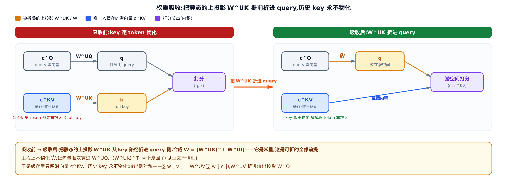

左半（吸收前）：query 经 $`W^{UQ}`$ 、key 经 $`W^{UK}`$ 各自放大，每个历史 token 都得重放大出一份 full key 才能打分。右半（吸收后）：橙色的 $`W^{UK}`$ 搬到 query 侧、与 $`W^{UQ}`$ 合成 $`\widetilde W`$ ，query 一次乘进潜空间，直接与缓存的 $`\mathbf c^{KV}`$ 做内积——key 路径上的放大盒子消失，历史 key 永不物化。

输出侧完全对称：注意力输出是对 value 的加权和（ $`w_j`$ 为对历史 token $`j`$ 的注意力权重），而 value 由 $`W^{UV}`$ 从潜向量上投影，

$$
\sum_j w_j\,\mathbf v_{j}^{C} = \sum_j w_j\,(W^{UV}\mathbf c_j) = W^{UV}\Big(\sum_j w_j\,\mathbf c_j\Big)
$$

先在潜空间加权、最后统一乘一次 $`W^{UV}`$ ，与逐个物化 value 再加权逐项恒等——所以 $`W^{UV}`$ 同样能吸进输出投影 $`W^O`$ 。

> **严谨（想要深度再展开）**：两点最容易想歪。**其一，等价是恒等而非近似**：两条路径只是同一个矩阵乘积按结合律重新分组，对每一对 $`(t,j)`$ 逐项相等；正文表格实测绝对差为 0 是恒等的体现，不是「浮点误差内相等」的容差校验。逐头看，每头各有独立的 $`W^{UK}_i\in\mathbb R^{d_h\times d_c}`$ 、 $`W^{UQ}_i\in\mathbb R^{d_h\times d_c'}`$ ，于是各有一份 $`\widetilde W_i = (W^{UK}_i)^{\top}W^{UQ}_i\in\mathbb R^{d_c\times d_c'}`$ 。**其二，「吸收」的工程真义是重排计算次序，不是物化融合矩阵**：算 $`\tilde{\mathbf q}_i = (W^{UK}_i)^{\top}\big(W^{UQ}_i\,\mathbf c^{Q}\big)`$ 有两种加括号方式——先把 $`\widetilde W_i`$ （ $`512\times 1536`$ ）乘出来再作用于向量，每 token 每头要 $`512\times 1536 = 786432`$ 次乘加；让向量顺次穿过两个瘦因子，只要 $`128\times 1536 + 512\times 128 = 262144`$ 次——**便宜 3.0 倍**。根源是 $`\widetilde W_i`$ 的秩被 $`d_h{=}128`$ 卡死：把两个低秩因子摊平成一块 $`512\times 1536`$ 的大矩阵，等于为不存在的自由度白白付费。所以「折进」折的是计算次序，不是真去乘出一块融合权重；输出侧 $`W^O W^{UV}`$ 同理。（decode 热路径的落地见[第 22 章](../../ch22-mla-on-npu/narrative/chapter.md)。）

### 2.3 解耦 RoPE：为什么位置旋转不可吸收（本章核心）

2.2 节的吸收只用了一个前提：中间块是常量。RoPE 恰好打碎它——RoPE 按 token 位置 $`m`$ 给 query、key 各乘一个旋转矩阵 $`R_m`$ ，这是个到推理时才随位置定下来的量，不是常量。

做个证伪实验：假设**偏要**对上投影得到的 key $`\mathbf k^C`$ 直接加 RoPE，query 仍走 2.2 节那条低秩路径 $`\mathbf q_t^C = W^{UQ}\mathbf c_t^Q`$ 。给两者施加位置旋转 $`R_t`$ 、 $`R_j`$ 后，把内积展开（论文 §2.1.3, arXiv:2405.04434）：

$$
\mathbf q_{t}^{\top}\mathbf k_{j}^{C,\mathrm{rope}}
= \mathbf c_t^{Q\top}(W^{UQ})^{\top} R_t^{\top} R_j\, W^{UK}\mathbf c_j
= \mathbf c_t^{Q\top}(W^{UQ})^{\top} R_{j-t}\, W^{UK}\mathbf c_j
$$

（这里用了旋转的标准性质 $`R_t^{\top}R_j = R_{j-t}`$ ，推导见下方严谨框。）问题就出在夹在正中间的那块矩阵：

$$
M(\delta) = (W^{UQ})^{\top} R_{\delta}\, W^{UK},\qquad \delta = j-t
$$

这块 $`M(\delta)`$ 与 2.2 节的 $`\widetilde W`$ 同形，却**本身是相对位置 $`\delta`$ 的函数**——每个 $`\delta`$ 一张脸。注意悬崖的准确位置：**结合律没有失效**，上式怎么加括号都成立；死掉的是「中间块是常量」这个前提——「可预计算」死于常量性被破坏，而非任何代数定律被违反。数值证伪（ $`\delta`$ 扫过 $`0,1,2,3`$ ，取头 0 看 $`M(\delta)[0,0]`$ ）：

<!-- trace: decoupled-rope -->

| 相对位置 $`\delta`$ | 中间矩阵 $`M(\delta)[0,0]`$ | 能否离线预计算成静态矩阵 |
|---|---|---|
| 0（不加 RoPE） | -0.5378 | 能（退化为静态 $`\widetilde W`$ ） |
| 3 | 0.6912 | 否 |

$`\delta`$ 从 0 走到 3， $`M[0,0]`$ 就从 $`-0.5378`$ 变到 $`0.6912`$ ——**中间那块确实随位置改变，不是常量**。只有 $`\delta{=}0`$ （即不加 RoPE）时 $`R_0`$ 退化成单位阵， $`M(0)=(W^{UQ})^{\top}W^{UK}`$ 才收敛回 2.2 节那个可吸收的静态矩阵。一旦真按这条路走，推理期就得为所有 prefix token 重算 key，吞吐崩塌。

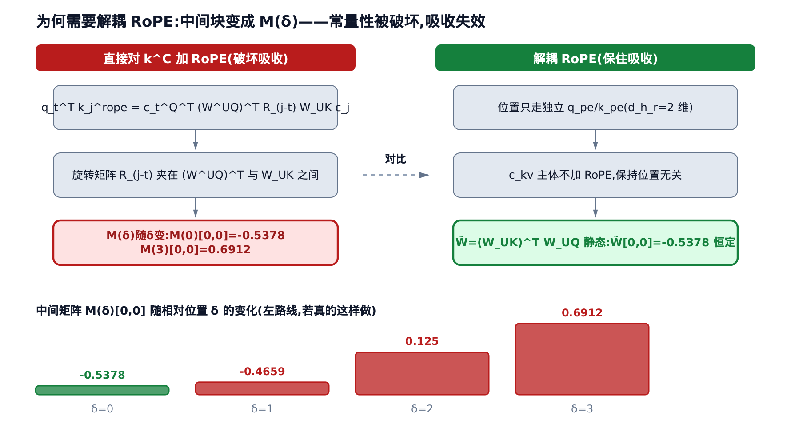

**解法：位置单开一路，主体保持常量。** 论文的解耦 RoPE（Eq.14-18）额外拉出一小撮维度 $`\mathbf q^R`$ （每头 $`d_h^R`$ 维）与**共享** key $`\mathbf k^R`$ 专门承载 RoPE，拼接到主体（下文记作 nope，no positional encoding，不含位置旋转的可吸收分量）后一起算注意力：

$$
\mathbf q_{t,i} = [\mathbf q_{t,i}^{C};\ \mathbf q_{t,i}^{R}],\qquad
\mathbf k_{t,i} = [\mathbf k_{t,i}^{C};\ \mathbf k_t^{R}]
$$

留意下标的差别： $`\mathbf q^R_{t,i}`$ 带头索引 $`i`$ （每头各一份），而解耦 key $`\mathbf k^R_{t}`$ **不带 $`i`$**——它由一个单独的投影从 $`\mathbf h_t`$ 直接生成、再施加 RoPE，因此在各头间**共享**，每个 token 只需缓存一份。位置信息就这样被抽成一个「每 token 一份、全头共用」的独立分量， $`\mathbf c^{KV}`$ 主体则不加 RoPE、保持位置无关，这才让吸收矩阵 $`\widetilde W`$ 得以静态不变。推理期要缓存的因此是 $`\mathbf c^{KV}`$ 加上解耦 $`\mathbf k^R`$ ，共 $`(d_c+d_h^R)\,l`$ 个元素（DeepSeek-V2 取 $`d_h^R{=}64`$ ，把解耦位置维的开销压到最小）。

> **严谨（想要深度再展开）**：为什么 $`R_t^{\top}R_j = R_{j-t}`$ ，又为什么 $`R_\delta`$ 折不进两侧？RoPE 把每头的 $`d_h`$ 维两两分组，第 $`k`$ 对维度按位置 $`m`$ 转过角度 $`m\theta_k`$ （ $`\theta_k`$ 是随维度衰减的预设频率表）。把每 2 维看成复平面上的向量，旋转就是乘以复数因子 $`e^{im\theta_k}`$ ；两次旋转相当于复数相乘、**角度相加**，对同一对维度先转 $`t`$ 再转 $`j`$ （ $`R_t^{\top}R_j`$ ，转置即转回去）净转过 $`j-t`$ ，这就是 $`R_t^{\top}R_j = R_{j-t}`$ 。至于「折不进」：没有任何代数定律被违反——你尽可以对某个固定的 $`\delta`$ 把 $`M(\delta)`$ 整块算出来，但 $`\delta`$ 随 query 与 key 的位置差取遍所有相对位置，得到的是一族矩阵而非一个常量，「离线算一次、线上永久复用」失去了对象。（完整的分块旋转矩阵与频率表见 RoFormer §3.2.2, arXiv:2104.09864；落地代码里位置也只允许走上面那两条独立的 rope 旁路 $`\mathbf q^{R}`$ / $`\mathbf k^{R}`$ ，见[第 22 章](../../ch22-mla-on-npu/narrative/chapter.md)。）

### 2.4 q 侧低秩：只降训练激活

query 侧也做一次低秩压缩，但目标不同：key/value 压缩省的是**推理期 KV cache**，query 压缩省的是**训练期中间激活**的显存——query 每步现算现用、不入缓存，再怎么压也动不了 KV cache。论文 §2.1.2（arXiv:2405.04434, Eq.12-13）：

$$
\mathbf c_t^{Q} = W^{DQ}\mathbf h_t,\qquad \mathbf q_t^{C} = W^{UQ}\mathbf c_t^{Q}
$$

其中 $`\mathbf c^Q`$ 只是 query 的中间激活，在当前 token 的前向里就被消费掉、不跨步保留，故每步 KV cache 变化量恒为 0。玩具维度验一下（ $`d_c'{=}4`$ ）：

<!-- trace: q-side-low-rank -->

| token $`t`$ | $`c_q`$ 首元素 | $`c_q`$ 激活维 $`d_c'`$ | 上投影满维 $`n_h\!\cdot\!d_h`$ | 本步 KV cache 变化 |
|---|---|---|---|---|
| 0 | -1.6634 | 4 | 8 | 0 |
| 1 | 0.8303 | 4 | 8 | 0 |
| 2 | 0.8692 | 4 | 8 | 0 |

三步的「KV cache 变化」列全为 0。训练期 query 中间激活从满维 8 压到 $`d_c'{=}4`$ （DeepSeek-V2 里从 16384 压到 1536），而推理缓存纹丝不动——**q 侧低秩省的是训练激活，不是 KV cache**。（落地拆分见[第 22 章](../../ch22-mla-on-npu/narrative/chapter.md)。）

---

## 三、账单：MLA vs MHA / GQA / MQA

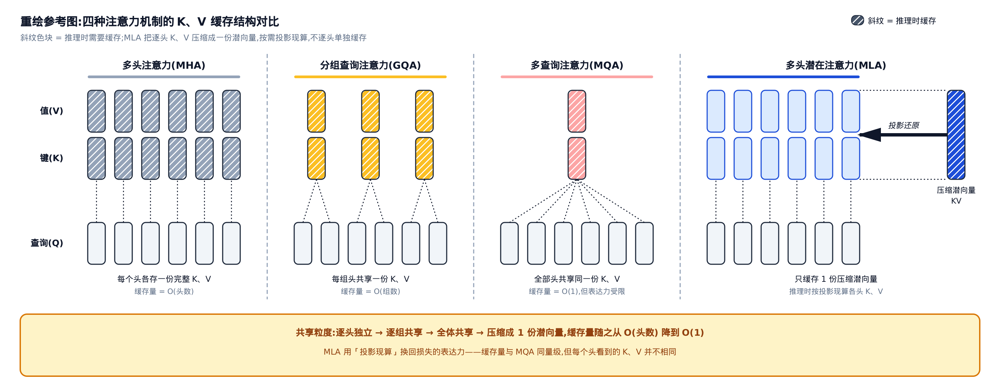

### 四种注意力一张账单

只问一件事：**每个 token 每层要囤多少个数？** MHA 逐头囤完整 K、V（ $`2\,n_h\,d_h`$ ，最重）；GQA（Grouped-Query Attention，分组查询注意力）每组头共享一份；MQA 全部头共享一份（ $`2\,d_h`$ ，最省也最伤能力）；MLA 囤一段潜向量加一小撮位置维（ $`d_c+d_h^R`$ ）。按论文 Table 1（§2.1.4）代进 DeepSeek-V2 维度（ $`n_h{=}128`$ 、 $`d_h{=}128`$ 、 $`d_c{=}512`$ 、 $`d_h^R{=}64`$ ，GQA 按通常配置取 8 组共享）：

<!-- trace: kv-cache-comparison -->

| 注意力机制 | 每 token 每层缓存元素（DeepSeek-V2 维度） |
|---|---|
| MHA | 32768 |
| GQA-8 | 2048 |
| MQA | 256 |
| MLA | 576 |

抓住这条不变量：**MLA 的缓存量 $`(d_c+d_h^R)`$ 里根本不出现 $`n_h`$** ，而 MHA 是 $`2\,n_h\,d_h`$ 、与头数成正比——DeepSeek-V2 的 $`n_h{=}128`$ 极大，于是 $`32768 \div 576 \approx 56.89`$ 倍的压缩主要来自「缓存不再乘头数」。折算成 GQA， $`d_c+d_h^R{=}576`$ 相当于 $`576/(2\times 128)=2.25`$ 组 GQA 的缓存。

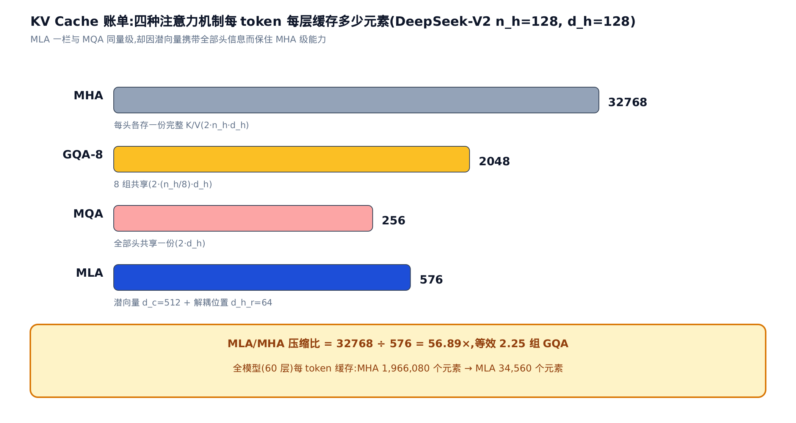

### 缓存为什么敢不含头数：decode 形态就是 head_dim 576 的 MQA

「不出现 $`n_h`$ 」不是巧合，而是一个更强命题的直接推论：**吸收后的 MLA 在 decode 时本来就是一个 MQA，只是 head_dim 变成了 576**。把 2.3 节的拼接形式（arXiv:2405.04434, Eq.14-18）代回打分、再套 2.2 节的吸收——头 $`i`$ 对历史 token $`j`$ 的打分是 nope 与 rope 两段内积之和，而两段内积之和恰好等于拼接后的一次内积：

$$
\mathbf q_{t,i}^{\top}\mathbf k_{j,i}
= \tilde{\mathbf q}_{t,i}^{\top}\mathbf c_j^{KV} + \mathbf q_{t,i}^{R\top}\mathbf k_j^{R}
= [\tilde{\mathbf q}_{t,i};\ \mathbf q_{t,i}^{R}]^{\top}\,[\mathbf c_j^{KV};\ \mathbf k_j^{R}]
$$

第二个等号是分块向量内积的恒等拆写。维度账： $`\tilde{\mathbf q}_{t,i}\in\mathbb R^{d_c}`$ 是头 $`i`$ 的吸收 query（512 维，即 2.2 节严谨框里的 $`\widetilde W_i\,\mathbf c_t^{Q}`$ ）， $`\mathbf q^R_{t,i}\in\mathbb R^{d_h^R}`$ 是它的位置分量（64 维），拼成一个 576 维的逐头「query」；而右侧 $`[\mathbf c_j^{KV};\ \mathbf k_j^{R}]\in\mathbb R^{576}`$ **不带头下标 $`i`$** ——全部 128 个头打分用的是同一份 576 维「key」。value 侧同样：吸收后每个头都对同一份 $`\mathbf c_j^{KV}`$ 加权求和，再各过自己的 $`W^{UV}_i`$ 、 $`W^{O}_i`$ 。「所有头共享同一份 key/value」正是 MQA 的定义。于是同一套 MLA 权重一鱼两吃：训练与 prefill 走物化路径，是标准 MHA 形态（每头独立 K/V，保表达能力）；decode 走吸收路径，是 head_dim 576 的 MQA 形态（key/value 只此一份，缓存天然不含 $`n_h`$ ）。对照表里 MQA 一行的 $`256 = 2\times d_h`$ ：MLA 相当于把 MQA 的单头缓存从 256 抬到 576、多付 2.25 倍，按论文口径换回强于满配 MHA 的表达能力。（这一视角出自苏剑林《缓存与效果的极限拉扯：从 MHA、MQA、GQA 到 MLA》，kexue.fm/archives/10091，延伸阅读首选。）

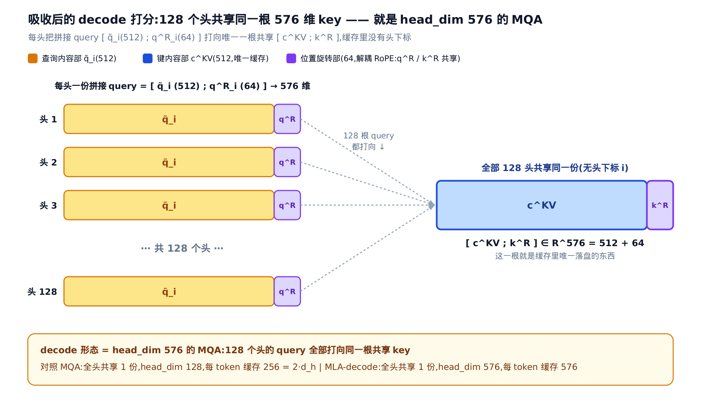

最后一句口径提醒：论文摘要的「reduces the KV cache by 93.3%」不是这张表的账——那是 DeepSeek-V2 相较**另一个模型** DeepSeek 67B 的实测部署对比，且叠加了 KV cache 量化（每元素平均 6 bit）；本节 Table 1 是同维度 MHA vs MLA 的理论架构比（56.89 倍、约 98.2%），不含量化。两笔账别混。（这三个维度数字落到昇腾构造函数里的字段名，见[第 22 章](../../ch22-mla-on-npu/narrative/chapter.md)。）

---

## 四、通向落地：decode 走吸收，prefill 走物化

数学地基到此打齐，账单节已点破：同一套 MLA 权重有两种恒等形态，选哪种由阶段决定。decode（逐 token 生成）每步只有一个新 query、却要扫全部历史缓存——走 2.2 节的吸收路径，以 head_dim 576 的 MQA 形态直接在潜空间打分最省，那点固定的吸收计算摊在漫长历史上可忽略。prefill（一次性处理输入 prompt）序列长，重算 K/V 的开销被长度摊薄，吸收多付的矩阵乘反成瓶颈——索性物化出 full key/value，走标准 MHA 形态。**省的地方不同，所以分两条路**；两路对同一段序列给出一致输出。这条 decode/prefill 分派怎么在昇腾核上落地，正是[第 22 章](../../ch22-mla-on-npu/narrative/chapter.md)的主线。

---

## 小结

MLA 的账压在两个数字上：标准 MHA 每 token 每层缓存 $`2\,n_h\,d_h = 32768`$ 个元素，随头数与长度双重放大；MLA 缓存 $`d_c+d_h^R = 576`$ 个，与头数无关。支撑这笔账的是一条主线：**吸收的前提是中间块为常量**。 $`(W^{UQ})^{\top}W^{UK}`$ 由两个静态权重相乘而成、是常量，于是 $`W^{UK}`$ 可折进 query，历史 key 永不物化，缓存里只留 $`\mathbf c^{KV}`$ ；RoPE 把中间块变成随相对位置变化的 $`M(\delta)`$ ，常量性被破坏、不可折，位置只能关进独立的 $`d_h^R`$ 维旁路。吸收后的 decode 形态是 head_dim 576 的 MQA，prefill 物化形态仍是 MHA——一套权重两种形态。理解这两句话，[第 22 章](../../ch22-mla-on-npu/narrative/chapter.md)里孤零零的位置旁路（专载 RoPE 的 $`\mathbf q^{R}`$ / $`\mathbf k^{R}`$ ）与 decode/prefill 分派，就都是必然而非拧巴。
